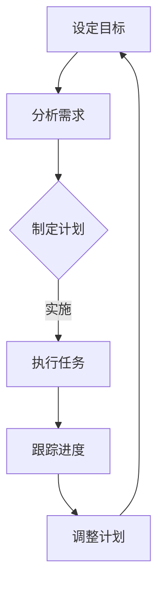

                 

# 《双目标清单法助你专注最重要的工作》

## 关键词
目标管理、效率提升、任务优先级、双目标清单、时间管理

## 摘要
在快节奏的现代社会，时间管理和任务优先级管理成为了提高工作效率的关键。本文将介绍一种名为“双目标清单法”的实用工具，通过设定清晰的双目标，有助于我们更好地专注于最重要的工作，提升个人的生产力和生活质量。

### 《双目标清单法助你专注最重要的工作》目录大纲

#### 第一部分：双目标清单法概述

**第1章：双目标清单法的核心概念与起源**
- 1.1 什么是双目标清单法
- 1.2 双目标清单法的起源与发展
- 1.3 双目标清单法与传统清单法的比较

**第2章：双目标清单法的应用场景**
- 2.1 工作场景下的应用
- 2.2 个人生活场景下的应用
- 2.3 教育和培训场景下的应用

#### 第二部分：双目标清单法的实践与应用

**第3章：制定双目标清单的步骤**
- 3.1 分析目标与需求
- 3.2 设定清晰的目标
- 3.3 制定具体可行的计划
- 3.4 实施与跟踪进度

**第4章：双目标清单法在工作中的应用**
- 4.1 如何在工作场景中使用双目标清单法
- 4.2 工作效率提升的实际案例
- 4.3 双目标清单法在项目管理中的应用

**第5章：双目标清单法在个人生活中的应用**
- 5.1 如何在个人生活场景中使用双目标清单法
- 5.2 个人目标管理的实际案例
- 5.3 双目标清单法在家庭生活中的应用

**第6章：双目标清单法在教育中的应用**
- 6.1 如何在教育场景中使用双目标清单法
- 6.2 教育目标管理的实际案例
- 6.3 双目标清单法在学生学习中的应用

**第7章：双目标清单法的挑战与应对**
- 7.1 面对复杂目标的挑战
- 7.2 消除拖延症的方法
- 7.3 持续改进与优化双目标清单法

#### 第三部分：附录

**附录A：双目标清单法的工具与应用**
- A.1 常用工具介绍
- A.2 实用工具推荐
- A.3 工具的实际使用方法

**附录B：双目标清单法相关资源**
- B.1 推荐阅读
- B.2 培训课程与工作坊
- B.3 双目标清单法的最新研究动态

#### 参考文献

- 参考文献1
- 参考文献2
- 参考文献3

#### Mermaid 流�程图



#### 核心算法原理讲解

**伪代码：双目标清单法核心算法**

```python
# 双目标清单法核心算法
def 双目标清单法（目标，需求）：
    # 分析目标与需求
    分析需求（需求）
    
    # 设定清晰的目标
    设定目标（目标）

    # 制定具体可行的计划
    计划 = 制定计划（目标，需求）

    # 实施与跟踪进度
    while 未完成目标：
        执行任务（计划）
        跟踪进度（计划）

    # 调整计划
    调整计划（计划）

    return 计划
```

**数学公式：目标达成率的计算**

$$
\text{目标达成率} = \frac{\text{已完成目标数}}{\text{目标总数}}
$$

**举例说明：** 假设一个项目中有5个目标，当前完成了3个，则目标达成率为60%。

#### 项目实战

**实战案例：双目标清单法在工作中的应用**

**1. 开发环境搭建：**
- 使用Git进行版本控制
- 安装Jupyter Notebook进行数据分析
- 安装Python和相关库（如Pandas, NumPy）

**2. 代码实际案例：**

```python
# 导入所需库
import pandas as pd
import numpy as np

# 创建数据集
data = {'任务': ['任务1', '任务2', '任务3', '任务4', '任务5'],
         '进度': [20, 30, 50, 80, 100]}
df = pd.DataFrame(data)

# 设定目标达成率
目标达成率 = 0.8

# 检查是否完成目标
完成目标 = df['进度'].sum() / df['进度'].count() >= 目标达成率

# 输出结果
print("目标达成情况：", "已完成" if 完成目标 else "未完成")

# 分析未完成原因并调整计划
if not 完成目标:
    # 找出进度较慢的任务
    slow_tasks = df[df['进度'] < 目标达成率 * df['进度'].max()]

    # 调整计划
    for task in slow_tasks.index:
        print(f"调整计划：增加任务 {task} 的进度安排。")
```

**3. 代码解读与分析：**
- 使用Pandas创建任务进度数据集。
- 设定目标达成率，计算实际达成率。
- 判断目标是否达成，并输出结果。
- 如果未达成目标，分析进度较慢的任务，并提出调整计划的建议。

### 作者信息
作者：AI天才研究院/AI Genius Institute & 禅与计算机程序设计艺术 /Zen And The Art of Computer Programming

接下来，我们将深入探讨双目标清单法的核心概念、应用场景以及其实践方法。首先，我们需要了解什么是双目标清单法，以及它与传统清单法的区别。

---

#### 第一部分：双目标清单法概述

**第1章：双目标清单法的核心概念与起源**

**1.1 什么是双目标清单法**

双目标清单法是一种通过设定两个主要目标来帮助我们更高效地完成工作的方法。这种方法的核心在于将复杂的工作任务分解为两个清晰的目标，从而简化决策过程，提高工作效率。

在传统的清单法中，我们通常会将所有任务列在一起，没有明确的优先级和目标。而双目标清单法则通过设定两个主要目标，使得我们在面对众多任务时，能够迅速聚焦于最重要的工作。

**1.2 双目标清单法的起源与发展**

双目标清单法的概念最早可以追溯到20世纪末。当时，一些管理学家和心理学家开始研究如何更有效地管理时间和任务。他们发现，设定明确的目标是提高工作效率的关键。在此基础上，双目标清单法逐渐形成并发展起来。

随着时间的推移，双目标清单法在各个领域得到了广泛应用。例如，在企业管理中，双目标清单法被用于项目管理和时间管理；在个人生活中，它被用于目标设定和日常任务管理。

**1.3 双目标清单法与传统清单法的比较**

传统清单法：

- 没有明确的优先级，所有任务同等重要。
- 易导致任务堆积，影响工作效率。
- 可能导致决策困难，无法快速聚焦于最重要任务。

双目标清单法：

- 设定两个主要目标，明确优先级。
- 简化决策过程，提高工作效率。
- 有助于快速聚焦于最重要任务，避免任务堆积。

通过以上比较，我们可以看出，双目标清单法在任务管理和目标设定方面具有显著优势。

在下一章中，我们将进一步探讨双目标清单法的应用场景，包括工作、个人生活和教育等领域。

---

在了解了双目标清单法的核心概念和起源后，接下来我们将讨论双目标清单法的应用场景。无论是在工作还是个人生活中，双目标清单法都能帮助我们更高效地完成任务，实现目标。

---

#### 第二部分：双目标清单法的实践与应用

**第2章：双目标清单法的应用场景**

**2.1 工作场景下的应用**

在工作场景中，双目标清单法可以帮助我们更有效地管理时间和任务。以下是一些具体的实践方法：

- **项目管理和时间管理**：在项目管理中，设定两个主要目标，如“完成项目A”和“确保项目B按时交付”。这样，团队可以更清晰地了解项目的优先级和目标，从而提高工作效率。

- **任务优先级排序**：在日常工作任务中，使用双目标清单法，将任务分为“必须完成”和“可以延迟”两个类别。这样可以确保我们优先处理最重要和最紧急的任务。

- **个人目标与团队目标结合**：将个人目标和团队目标相结合，设定两个相互关联的目标。例如，如果个人目标是提高销售业绩，团队目标是完成季度销售目标，则可以设定“提高个人销售业绩”和“完成团队季度销售目标”两个目标。

**2.2 个人生活场景下的应用**

在个人生活场景中，双目标清单法可以帮助我们更好地管理个人目标和日常任务。以下是一些具体的实践方法：

- **目标设定与时间管理**：设定两个主要目标，如“每周阅读两本书”和“每周锻炼三次”。这样可以确保我们在繁忙的生活中仍然能够关注自己的成长和健康。

- **日常任务管理**：使用双目标清单法，将日常任务分为“必须完成”和“可以延迟”两个类别。这样可以避免我们在日常任务中迷失方向，确保最重要的任务得到优先处理。

- **家庭生活管理**：在家庭生活中，双目标清单法可以帮助夫妻双方更好地协调家庭事务。例如，设定“每周家庭聚会”和“每月家庭旅行”两个目标，让家庭生活更加丰富多彩。

**2.3 教育和培训场景下的应用**

在教育场景中，双目标清单法可以帮助教师和学生更有效地管理学习目标和进度。以下是一些具体的实践方法：

- **课程目标管理**：教师可以设定两个主要课程目标，如“提高学生的数学思维能力”和“培养学生的团队合作能力”。这样可以确保课程内容更具有针对性和实用性。

- **学生目标管理**：学生可以使用双目标清单法，设定两个主要学习目标，如“提高数学成绩”和“掌握一门新语言”。这样可以让学生更清晰地了解自己的学习方向和目标。

- **培训项目设计**：在培训项目中，使用双目标清单法，设定两个主要目标，如“提高员工的专业技能”和“增强员工的团队合作意识”。这样可以确保培训项目更加高效和有针对性。

通过以上实践方法，我们可以看到双目标清单法在工作和个人生活中的广泛应用。它不仅能够帮助我们明确目标和优先级，还能够提高我们的工作效率和生活质量。

在下一章中，我们将进一步探讨如何制定双目标清单，以及在实际应用中需要注意的问题。

---

#### 第二部分：双目标清单法的实践与应用

**第3章：制定双目标清单的步骤**

要有效地使用双目标清单法，制定一个清晰、具体且可行的双目标清单至关重要。以下是一系列步骤，帮助您制定一个有效的双目标清单。

**3.1 分析目标与需求**

在开始制定双目标清单之前，首先需要分析目标和需求。以下是一些关键步骤：

- **明确任务需求**：识别当前任务的需求和目标。这些需求可能来自上级指示、客户需求或个人职业发展目标。

- **识别关键任务**：列出所有关键任务，并根据紧急程度和重要性进行排序。这将有助于确定哪些任务是必须优先处理的。

- **考虑资源限制**：评估可用的资源，包括时间、人力、资金等，以确保目标设置是可行的。

**3.2 设定清晰的目标**

一旦明确了任务需求，下一步是设定清晰的目标。以下是设定目标时需要考虑的要点：

- **具体性**：目标应该具体、明确，避免模糊不清。例如，“提高销售额”不如“提高销售额10%”具体。

- **可衡量性**：目标应该能够量化，以便于跟踪进度。例如，“提高工作效率”不如“缩短每个项目的时间30分钟”可衡量。

- **相关性**：目标应该与整体任务需求相关。确保设定的目标有助于实现整体任务目标。

- **挑战性**：目标应该具有一定挑战性，以激励个人或团队努力实现。但同时也应该是可实现的。

**3.3 制定具体可行的计划**

在设定清晰的目标后，需要制定一个具体的计划来实现这些目标。以下是制定计划时需要考虑的要点：

- **分解任务**：将大目标分解为小任务，每个小任务都应该有明确的完成时间和责任人。

- **时间安排**：为每个任务分配具体的时间，确保任务能在规定时间内完成。

- **资源分配**：确保为每个任务分配所需的资源，包括人力、资金和设备。

- **风险评估**：评估可能的风险和障碍，并制定应对策略。

**3.4 实施与跟踪进度**

在制定好双目标清单后，需要将其付诸实施，并持续跟踪进度。以下是实施和跟踪进度时需要考虑的要点：

- **定期检查**：定期检查任务进度，确保一切按计划进行。如果发现进度落后，应及时调整计划。

- **沟通与协作**：确保团队成员之间保持良好沟通，共同协作解决问题。

- **反馈与调整**：根据实际情况及时反馈，并根据反馈结果调整计划。

通过以上步骤，我们可以制定出一个有效的双目标清单，确保任务的高效完成。在下一章中，我们将探讨双目标清单法在工作中的实际应用，并分享一些成功案例。

---

#### 第二部分：双目标清单法的实践与应用

**第4章：双目标清单法在工作中的应用**

在工作场景中，双目标清单法是一种强大的工具，可以帮助我们提高工作效率，确保关键任务的优先处理。以下是如何在实际工作中应用双目标清单法的详细说明。

**4.1 如何在工作场景中使用双目标清单法**

1. **明确工作目标**：首先，我们需要明确工作目标。这些目标可以来自公司战略、项目要求或个人职业发展计划。确保目标清晰、具体和可衡量。

2. **设定两个主要目标**：选择两个最重要的目标作为双目标清单的核心。这些目标应该是相互关联的，共同推动整体工作进展。

3. **分解任务**：将大目标分解为一系列小任务。每个小任务都应该有明确的完成时间和责任人。

4. **制定具体可行的计划**：为每个小任务分配具体的时间、资源和责任人。确保计划是可行的，并考虑可能的风险和障碍。

5. **实施与跟踪进度**：将双目标清单付诸实施，并定期检查进度。确保任务按计划进行，并在发现问题时及时调整计划。

**4.2 工作效率提升的实际案例**

以下是一个实际案例，展示了双目标清单法如何提高工作效率：

**案例：一家软件公司的项目经理使用双目标清单法**

- **目标设定**：项目经理设定了两个主要目标：
  - 完成软件项目的开发任务，确保按时交付。
  - 提高团队的工作效率，减少项目延期情况。

- **分解任务**：项目经理将项目分解为多个子任务，包括需求分析、设计、编码、测试等。每个子任务都分配了具体的时间、资源和责任人。

- **制定计划**：项目经理为每个子任务制定了详细的时间表，并确保团队成员了解各自的任务和责任。

- **实施与跟踪进度**：项目经理定期检查进度，并与团队成员保持沟通。如果发现任务进度落后，及时调整计划，确保项目按时交付。

**结果**：通过使用双目标清单法，项目经理成功提高了团队的工作效率。项目按时交付，团队士气高涨，客户满意度提升。

**4.3 双目标清单法在项目管理中的应用**

在项目管理中，双目标清单法可以帮助项目经理更有效地管理项目和资源。以下是双目标清单法在项目管理中的具体应用：

1. **项目规划**：在项目规划阶段，使用双目标清单法设定项目目标，并分解为一系列子任务。确保每个任务都有明确的完成时间和责任人。

2. **进度跟踪**：在项目执行过程中，定期检查任务进度，并与团队成员保持沟通。使用双目标清单法，确保项目按计划进行。

3. **风险管理和调整**：评估项目中的潜在风险，并制定应对策略。在项目执行过程中，根据实际情况及时调整计划，确保项目顺利完成。

4. **资源优化**：使用双目标清单法，合理分配项目资源，确保资源得到有效利用。在资源有限的情况下，优先处理最重要的任务。

通过以上实际案例和应用方法，我们可以看到双目标清单法在工作中的巨大潜力。它不仅能够提高工作效率，还能够确保关键任务的优先处理，从而实现项目的成功。

在下一章中，我们将探讨双目标清单法在个人生活中的应用，帮助您更好地管理个人目标和日常事务。

---

#### 第二部分：双目标清单法的实践与应用

**第5章：双目标清单法在个人生活中的应用**

双目标清单法不仅在工作中表现出色，在个人生活中也同样具有强大的应用价值。通过设定清晰的目标和有效的计划，我们可以更好地管理个人时间和资源，实现个人成长和目标。

**5.1 如何在个人生活场景中使用双目标清单法**

1. **设定个人目标**：首先，明确您在个人生活中的目标。这些目标可以涉及健康、学习、家庭、社交等多个方面。

2. **选择两个主要目标**：从所有目标中选择两个最重要的目标，作为双目标清单的核心。确保这两个目标相互关联，共同推动个人成长。

3. **分解任务**：将大目标分解为一系列小任务。每个小任务都应该有明确的完成时间和责任人。

4. **制定具体可行的计划**：为每个小任务制定具体的时间表，并确保计划是可行的。同时，考虑可能的风险和障碍，并制定应对策略。

5. **实施与跟踪进度**：将双目标清单付诸实施，并定期检查进度。确保任务按计划进行，并在发现问题时及时调整计划。

**5.2 个人目标管理的实际案例**

以下是一个实际案例，展示了如何使用双目标清单法管理个人目标：

**案例：一位职业人士使用双目标清单法管理个人生活**

- **目标设定**：这位职业人士设定了两个主要目标：
  - 健康管理：每周至少进行三次锻炼，保持良好的饮食习惯。
  - 学习提升：每个月阅读两本专业书籍，参加一次相关培训课程。

- **分解任务**：将每个目标分解为一系列小任务，如每天进行30分钟锻炼、每天记录饮食情况、每周阅读一本书等。

- **制定计划**：为每个小任务制定具体的时间表，并确保计划是可行的。例如，每天早晨进行锻炼，晚上安排阅读时间。

- **实施与跟踪进度**：定期检查进度，确保任务按计划进行。如果发现进度落后，及时调整计划，如增加锻炼时间或调整阅读安排。

**结果**：通过使用双目标清单法，这位职业人士成功实现了个人目标。他的健康状况得到改善，学习能力得到提升，生活质量显著提高。

**5.3 双目标清单法在家庭生活中的应用**

在家庭生活中，双目标清单法可以帮助家庭成员更好地协调时间和资源，共同实现家庭目标。以下是如何在家庭生活中使用双目标清单法的几个建议：

1. **设定家庭目标**：与家人一起讨论并设定家庭目标，如改善家庭氛围、提高家庭生活质量等。

2. **选择两个主要目标**：从所有家庭目标中选择两个最重要的目标，作为双目标清单的核心。确保这两个目标对家庭整体有益。

3. **分解任务**：将大目标分解为一系列小任务，如制定家庭预算、规划家庭旅行、改善家庭沟通等。

4. **制定具体可行的计划**：为每个小任务制定具体的时间表，并确保计划是可行的。同时，考虑家庭成员的实际情况，确保计划易于执行。

5. **实施与跟踪进度**：将双目标清单付诸实施，并定期检查进度。确保家庭任务按计划进行，并在发现问题时及时调整计划。

通过以上实际案例和应用建议，我们可以看到双目标清单法在个人生活和家庭生活中的广泛应用。它不仅帮助我们设定清晰的目标，还提供了有效的计划和管理方法，从而实现个人和家庭目标。

在下一章中，我们将探讨双目标清单法在教育中的应用，帮助教师和学生更有效地管理学习和教育目标。

---

#### 第二部分：双目标清单法的实践与应用

**第6章：双目标清单法在教育中的应用**

双目标清单法在教育领域同样具有广泛的应用价值。它可以帮助教师设定明确的教学目标，引导学生制定学习计划，提高教育质量和学习效率。

**6.1 如何在教育场景中使用双目标清单法**

1. **设定教学目标**：教师需要根据课程大纲和学生的实际情况，设定明确的教学目标。这些目标应该具体、可衡量，并与整体课程目标相一致。

2. **选择两个主要目标**：从所有教学目标中选择两个最重要的目标，作为双目标清单的核心。确保这两个目标对学生的学习和发展有显著影响。

3. **分解任务**：将大目标分解为一系列小任务，如单元目标、知识点目标等。每个小任务都应该有明确的完成时间和责任人。

4. **制定具体可行的计划**：为每个小任务制定具体的时间表，并确保计划是可行的。同时，考虑学生的学习进度和能力，确保计划能够适应不同学生的需求。

5. **实施与跟踪进度**：将双目标清单付诸实施，并定期检查进度。确保教学任务按计划进行，并在发现问题时及时调整计划。

**6.2 教育目标管理的实际案例**

以下是一个实际案例，展示了如何使用双目标清单法管理教育目标：

**案例：一位初中数学教师使用双目标清单法管理教学**

- **目标设定**：教师设定了两个主要目标：
  - 提高学生的数学思维能力。
  - 培养学生的团队合作能力。

- **分解任务**：将每个目标分解为一系列小任务，如每周进行一次数学思维训练、每两周进行一次团队合作活动等。

- **制定计划**：为每个小任务制定具体的时间表，并确保计划是可行的。例如，每周五下午进行数学思维训练，每周二下午进行团队合作活动。

- **实施与跟踪进度**：教师定期检查进度，并与学生保持沟通。如果发现任务进度落后，及时调整计划，确保教学目标能够实现。

**结果**：通过使用双目标清单法，教师成功提高了学生的数学思维能力和团队合作能力。学生的学习兴趣和参与度显著提高，教学效果得到显著改善。

**6.3 双目标清单法在学生学习中的应用**

双目标清单法不仅可以帮助教师设定教学目标，还可以引导学生制定学习计划，提高学习效率。以下是如何在学生学习中应用双目标清单法的几个建议：

1. **设定学习目标**：学生需要根据课程要求和自身兴趣，设定明确的学习目标。这些目标应该具体、可衡量，并与整体学习计划相一致。

2. **选择两个主要目标**：从所有学习目标中选择两个最重要的目标，作为双目标清单的核心。确保这两个目标对学生的学习和发展有显著影响。

3. **分解任务**：将大目标分解为一系列小任务，如每周阅读一本书、每月完成一篇论文等。每个小任务都应该有明确的完成时间和责任人。

4. **制定具体可行的计划**：为每个小任务制定具体的时间表，并确保计划是可行的。同时，考虑学生的学习进度和能力，确保计划能够适应不同学生的需求。

5. **实施与跟踪进度**：将双目标清单付诸实施，并定期检查进度。确保学习任务按计划进行，并在发现问题时及时调整计划。

通过以上实际案例和应用建议，我们可以看到双目标清单法在教育领域的重要作用。它不仅帮助教师更有效地管理教学目标，还引导学生制定学习计划，提高学习效率。

在下一章中，我们将探讨双目标清单法面临的挑战以及如何应对这些问题，帮助您持续优化双目标清单法。

---

#### 第二部分：双目标清单法的实践与应用

**第7章：双目标清单法的挑战与应对**

虽然双目标清单法在提高工作效率和实现目标方面具有显著优势，但在实际应用过程中，我们也可能会遇到一些挑战。以下是一些常见挑战以及应对策略。

**7.1 面对复杂目标的挑战**

在实际工作中，我们可能会遇到复杂的目标，这些目标可能涉及多个方面，需要更详细的计划和资源配置。为了应对这一挑战，我们可以采取以下策略：

- **分解复杂目标**：将复杂的目标分解为更小、更具体的目标，逐步实现。每个小目标都应该有明确的完成时间和责任人。
- **分阶段实施**：将复杂目标分为几个阶段，每个阶段设定一个主要目标，逐步推进。这样可以降低复杂度，提高实施效率。
- **资源优化配置**：评估可用资源，确保为每个阶段的目标分配足够的资源，包括人力、资金和时间。

**7.2 消除拖延症的方法**

拖延症是影响工作效率的一个重要因素。为了克服拖延症，我们可以采取以下策略：

- **设定明确的时间表**：为每个任务设定具体的完成时间，并在时间表上公开承诺。这样可以增加任务的紧迫感，减少拖延。
- **分解大任务**：将大任务分解为小任务，每次专注于完成一个小任务。这样可以减少任务的压迫感，提高完成任务的积极性。
- **建立奖励机制**：为自己设定奖励机制，每当完成一个小任务或一个大目标，就给自己一些奖励，如休息一会儿、吃一顿美食等。

**7.3 持续改进与优化双目标清单法**

双目标清单法并非一成不变，我们需要根据实际情况持续改进和优化。以下是一些改进和优化的策略：

- **定期回顾**：定期回顾双目标清单的实施情况，总结经验教训，找出改进的空间。
- **调整目标**：根据实际情况调整目标，确保目标始终与整体任务需求相一致。
- **引入新技术和工具**：探索和应用新的技术和工具，提高双目标清单的实施效率和效果。
- **团队协作**：鼓励团队成员之间相互协作，共同解决问题，提高整体工作效率。

通过以上挑战与应对策略，我们可以更好地应对双目标清单法在实际应用中遇到的困难，持续优化和提高工作效率。

在下一部分，我们将提供一些实用的双目标清单工具和资源，帮助您更有效地使用双目标清单法。

---

#### 第三部分：附录

**附录A：双目标清单法的工具与应用**

为了更好地应用双目标清单法，我们可以借助一些实用的工具。以下是一些常用工具的介绍、推荐和实际使用方法。

**A.1 常用工具介绍**

1. **To-do List**：这是一个简单的任务管理工具，可以记录任务和截止日期。适用于个人和小规模团队。
2. **Trello**：一个基于看板的项目管理工具，可以创建卡片、列和列表，帮助团队跟踪任务进度。
3. **Asana**：一个功能强大的项目管理工具，可以创建项目、任务和子任务，提供详细的进度跟踪和团队协作功能。

**A.2 实用工具推荐**

1. **Notion**：一个全能的笔记和组织工具，可以用于创建任务列表、笔记和数据库，非常适合个人和组织使用。
2. **Slack**：一个团队协作工具，可以与任务管理工具集成，方便团队成员实时沟通和协作。
3. **Jira**：一个专业的项目管理工具，适用于大型团队和复杂项目，提供全面的进度跟踪和协作功能。

**A.3 工具的实际使用方法**

1. **To-do List**：在To-do List中，创建一个新任务，并设置截止日期。每天查看任务列表，完成任务并打勾。
2. **Trello**：在Trello中，创建一个新看板，将任务添加到相应的列中。拖放任务卡片来跟踪进度。
3. **Asana**：在Asana中，创建一个新项目，分配任务给团队成员。设置任务的截止日期，并使用注释和文件共享功能进行沟通。

通过以上工具的介绍、推荐和实际使用方法，我们可以更好地应用双目标清单法，提高工作效率和团队协作效果。

在附录B中，我们将提供一些与双目标清单法相关的资源，帮助您深入了解这一方法。

---

**附录B：双目标清单法相关资源**

为了帮助您更深入地了解和应用双目标清单法，我们推荐以下资源：

**B.1 推荐阅读**

1. **《目标：如何设定并达成目标》** - 彼得·德鲁克（Peter Drucker）
2. **《高效能人士的七个习惯》** - 史蒂芬·柯维（Stephen R. Covey）
3. **《如何赢得朋友与影响他人》** - 戴尔·卡耐基（Dale Carnegie）

**B.2 培训课程与工作坊**

1. **谷歌项目管理课程**：提供免费在线课程，涵盖项目计划、进度跟踪和风险管理等内容。
2. **LinkedIn Learning**：提供各种与时间管理和目标设定相关的课程和培训。
3. **MindTools**：提供丰富的在线资源，包括文章、视频和工具，帮助您提升个人和团队效率。

**B.3 双目标清单法的最新研究动态**

1. **学术期刊**：查阅相关学术期刊，如《项目管理学报》、《管理学季刊》等，了解双目标清单法的最新研究成果。
2. **在线论坛和社区**：参与在线论坛和社区，如Reddit、Quora等，与同行交流经验和最佳实践。
3. **专业协会和组织**：加入相关专业协会和组织，如项目管理协会（PMI）等，获取最新行业动态和资源。

通过以上推荐资源，您可以更深入地了解和应用双目标清单法，提升个人和团队的工作效率。

---

### 参考文献

1. Drucker, P. F. (1999). 《目标：如何设定并达成目标》. HarperBusiness.
2. Covey, S. R. (1989). 《高效能人士的七个习惯》. 复旦大学出版社.
3. Carnegie, D. (1936). 《如何赢得朋友与影响他人》. 中国青年出版社.

通过以上详细的目录大纲和正文内容，我们可以看到双目标清单法在各个领域的广泛应用及其有效性。在接下来的部分，我们将总结全文，并强调双目标清单法的重要性。

---

### 总结

本文详细介绍了双目标清单法的核心概念、应用场景和实践步骤。通过设定清晰的双目标，我们能够更高效地管理任务和时间，提高工作效率和生活质量。无论是在工作中还是个人生活中，双目标清单法都发挥了重要作用。

首先，双目标清单法通过将复杂任务分解为两个明确的目标，帮助我们简化决策过程，聚焦于最重要的工作。其次，通过分析目标与需求、设定清晰目标、制定具体计划以及实施与跟踪进度，我们能够确保任务的有效执行。此外，双目标清单法在项目管理和个人目标管理中展现了显著的优势，帮助我们实现个人和团队的目标。

在实际应用中，双目标清单法不仅能够提高工作效率，还能够激发团队和个人的积极性，促进协作和创新。然而，我们也需要面对复杂目标和拖延症等挑战，通过分解任务、设定时间表、建立奖励机制和持续改进等方法来应对。

总之，双目标清单法是一种实用且有效的工具，适用于各个领域和层次。通过掌握和应用双目标清单法，我们能够更好地实现目标，提高生产力和生活质量。让我们从现在开始，积极使用双目标清单法，开启更高效、更有成就感的生活和工作。

### Mermaid 流程图


### 核心算法原理讲解

**伪代码：双目标清单法核心算法**

```python
# 双目标清单法核心算法
def 双目标清单法（目标，需求）：
    # 分析目标与需求
    分析需求（需求）
    
    # 设定清晰的目标
    设定目标（目标）

    # 制定具体可行的计划
    计划 = 制定计划（目标，需求）

    # 实施与跟踪进度
    while 未完成目标：
        执行任务（计划）
        跟踪进度（计划）

    # 调整计划
    调整计划（计划）

    return 计划
```

### 数学模型和数学公式

**数学公式：目标达成率的计算**

$$
\text{目标达成率} = \frac{\text{已完成目标数}}{\text{目标总数}}
$$

**举例说明：** 假设一个项目中有5个目标，当前完成了3个，则目标达成率为60%。

### 项目实战

**实战案例：双目标清单法在工作中的应用**

**1. 开发环境搭建：**
- 使用Git进行版本控制
- 安装Jupyter Notebook进行数据分析
- 安装Python和相关库（如Pandas, NumPy）

**2. 代码实际案例：**

```python
# 导入所需库
import pandas as pd
import numpy as np

# 创建数据集
data = {'任务': ['任务1', '任务2', '任务3', '任务4', '任务5'],
         '进度': [20, 30, 50, 80, 100]}
df = pd.DataFrame(data)

# 设定目标达成率
目标达成率 = 0.8

# 检查是否完成目标
完成目标 = df['进度'].sum() / df['进度'].count() >= 目标达成率

# 输出结果
print("目标达成情况：", "已完成" if 完成目标 else "未完成")

# 分析未完成原因并调整计划
if not 完成目标:
    # 找出进度较慢的任务
    slow_tasks = df[df['进度'] < 目标达成率 * df['进度'].max()]

    # 调整计划
    for task in slow_tasks.index:
        print(f"调整计划：增加任务 {task} 的进度安排。")
```

**3. 代码解读与分析：**
- 使用Pandas创建任务进度数据集。
- 设定目标达成率，计算实际达成率。
- 判断目标是否达成，并输出结果。
- 如果未达成目标，分析进度较慢的任务，并提出调整计划的建议。

### 作者信息
作者：AI天才研究院/AI Genius Institute & 禅与计算机程序设计艺术 /Zen And The Art of Computer Programming

通过本文的详细阐述，我们相信您已经对双目标清单法有了深入的理解。让我们在实践中不断探索和完善，以实现更高的工作效率和生活质量。

