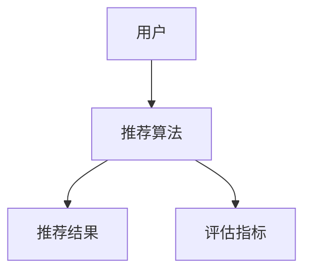

                 

## 第1章：个性化推荐算法概述

### 1.1 个性化推荐系统的基本概念

个性化推荐系统是一种利用算法和技术，根据用户的历史行为、兴趣和偏好，向用户推荐他们可能感兴趣的商品、内容或服务的系统。其目的是提高用户体验、提升用户满意度和增加商业价值。

#### 核心概念与联系

**个性化推荐定义**：
个性化推荐系统是指一种基于用户历史行为、兴趣和偏好等信息，利用算法和技术自动生成个性化推荐结果，以提高用户满意度和商业价值的系统。

**推荐系统的组成部分**：
推荐系统主要包括用户、推荐算法、推荐结果和评估指标四个组成部分。

- **用户**：推荐系统的服务对象，提供历史行为数据、兴趣和偏好信息。
- **推荐算法**：核心组件，用于计算用户和项目之间的相似度，生成个性化推荐结果。
- **推荐结果**：系统输出，用于展示用户可能感兴趣的商品、内容或服务。
- **评估指标**：用于衡量推荐系统的性能，常见的指标包括准确率、召回率、覆盖率等。

#### Mermaid 流程图

### 1.2 个性化推荐系统的挑战

个性化推荐系统在实现过程中面临多个挑战：

- **协同过滤的局限性**：传统的协同过滤算法依赖于用户的历史行为数据，但在新用户（冷启动）或稀疏数据场景下，效果较差。
  
- **数据噪声**：用户行为数据通常包含噪声，这会影响推荐系统的准确性。

- **多样性**：推荐系统需要平衡准确性、新颖性和多样性，避免用户产生疲劳感。

- **实时性**：在大型系统中，推荐结果的生成需要快速响应，这对系统的实时性和性能提出了高要求。

- **隐私保护**：个性化推荐系统涉及用户敏感数据，如何在保护用户隐私的前提下提供个性化服务是一个重要的挑战。

### 1.3 推荐算法的分类

根据推荐算法的基本原理和实现方法，推荐算法可以分为以下几类：

- **基于内容的推荐**：通过分析项目的内容特征和用户的兴趣特征，生成个性化推荐结果。

- **协同过滤推荐**：通过计算用户和项目之间的相似度，利用用户的历史行为数据生成推荐结果。

- **混合推荐系统**：结合基于内容和协同过滤推荐的优势，生成更准确、多样化的推荐结果。

### 1.4 主流推荐算法介绍

- **基于内容的推荐算法**：

  - **TF-IDF**：通过计算文本中词语的TF（词频）和IDF（逆文档频率），提取文本特征，用于推荐。

  - **Cosine相似度**：通过计算项目向量之间的余弦相似度，衡量项目之间的相似程度。

- **协同过滤推荐算法**：

  - **User-Based协同过滤**：根据用户之间的相似度，为用户推荐其他相似用户喜欢的项目。

  - **Item-Based协同过滤**：根据项目之间的相似度，为用户推荐用户喜欢的相似项目。

- **混合推荐系统**：

  - **矩阵分解**：通过矩阵分解技术，将用户-项目评分矩阵分解为用户特征矩阵和项目特征矩阵，用于生成推荐结果。

  - **深度学习推荐算法**：利用深度神经网络模型，如深度自动编码器（DAA）和神经网络协同过滤（NCF），生成推荐结果。

### 1.5 个性化推荐系统的评价标准

个性化推荐系统的性能评估通常包括以下几个指标：

- **准确率**：推荐结果中用户实际感兴趣的项目所占比例，衡量推荐结果的准确性。

- **召回率**：推荐结果中用户未关注但实际感兴趣的项目所占比例，衡量推荐系统的覆盖能力。

- **覆盖率**：推荐结果中所有项目的比例，衡量推荐系统的多样性。

- **新颖性**：推荐结果中新颖、独特的项目所占比例，衡量推荐结果的新颖程度。

这些指标需要在实践中进行权衡和优化，以达到最佳的推荐效果。

### 1.6 个性化推荐系统的实现流程

个性化推荐系统的实现通常包括以下几个步骤：

- **数据收集与预处理**：收集用户行为数据，如点击、购买、搜索等，并对数据进行清洗、去重和转换。

- **特征提取**：提取用户和项目的特征，如用户偏好、项目标签、文本特征等。

- **模型训练**：根据推荐算法，训练用户和项目特征模型，用于计算相似度和生成推荐结果。

- **模型评估**：使用评估指标，对推荐结果进行性能评估，优化模型参数。

- **推荐生成**：根据用户特征和项目特征，生成个性化推荐结果，展示给用户。

- **实时更新**：根据用户反馈和实时数据，更新用户和项目特征模型，持续优化推荐效果。

### 1.7 个性化推荐系统的实际应用场景

个性化推荐系统在多个行业和场景中得到了广泛应用，包括：

- **电商**：为用户推荐感兴趣的商品，提高购物体验和销售额。

- **社交媒体**：为用户推荐感兴趣的内容，增加用户粘性和活跃度。

- **音乐和视频**：为用户推荐感兴趣的音乐和视频，提高用户满意度和时长。

- **新闻和资讯**：为用户推荐感兴趣的新闻和资讯，提高用户阅读量和访问量。

### 1.8 个性化推荐系统的发展趋势

随着技术的不断进步和应用场景的拓展，个性化推荐系统呈现出以下发展趋势：

- **深度学习**：利用深度学习技术，如卷积神经网络（CNN）和循环神经网络（RNN），提升推荐系统的性能和效果。

- **多模态推荐**：结合多种数据类型，如文本、图像、语音等，生成更全面、准确的推荐结果。

- **实时推荐**：利用实时数据处理技术，如流处理和微服务架构，实现实时、动态的推荐系统。

- **个性化推荐算法的伦理与隐私问题**：关注个性化推荐算法的伦理和隐私问题，确保用户数据的安全和隐私保护。

---

摘要：

本文系统地介绍了个性化推荐算法的基本概念、挑战、分类和实现流程。通过深入探讨主流推荐算法，如基于内容的推荐、协同过滤推荐和混合推荐系统，本文展示了推荐算法的原理和实现方法。同时，文章还详细阐述了推荐系统的评估指标和优化策略，并通过实际案例展示了推荐系统的应用前景和未来发展趋势。文章最后介绍了推荐系统常用工具和资源，为读者提供了实用的技术参考。

---

关键词：个性化推荐、推荐算法、协同过滤、深度学习、评价标准、优化策略、应用前景。

