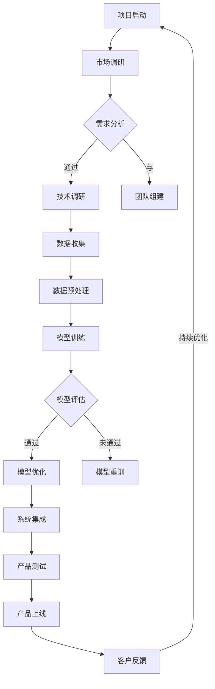
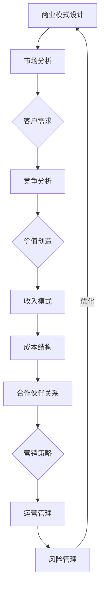

                 

### 文章标题

“商业模式创新：大模型创业的制胜之道”

关键词：商业模式创新、大模型、创业、制胜之道、创新思维

摘要：本文旨在探讨商业模式创新在大模型创业中的重要性，分析其核心概念、创新思维、工具与技术，并从实战角度提供具体的项目案例。文章通过深度剖析商业模式创新的未来趋势，旨在为创业者提供指导，助其在大模型创业领域脱颖而出。

### 目录大纲

#### 第一部分：商业模式创新的基石

**第1章：商业模式创新概述**
- 1.1 商业模式创新的定义与重要性
- 1.2 商业模式创新的驱动力
- 1.3 商业模式创新的框架与流程
- 1.4 商业模式创新的案例解析

**第2章：大模型与创业**
- 2.1 大模型在创业中的机遇与挑战
- 2.2 大模型创业的关键要素
- 2.3 大模型创业的流程与策略
- 2.4 大模型创业的案例分析

#### 第二部分：商业模式创新的实战

**第3章：商业模式创新的思维模式**
- 3.1 创新思维的培养与实践
- 3.2 创新思维的工具与方法
- 3.3 创新思维案例分析

**第4章：商业模式创新的工具与技术**
- 4.1 商业模式创新的工具介绍
- 4.2 商业模式创新的案例分析
- 4.3 商业模式创新的实践技巧

**第5章：大模型创业实战**
- 5.1 大模型创业项目规划
- 5.2 大模型创业项目的开发与实践
- 5.3 大模型创业项目的管理与运营

**第6章：商业模式创新的评估与优化**
- 6.1 商业模式创新的评估指标
- 6.2 商业式创新的优化方法
- 6.3 商业模式创新的持续创新

#### 第三部分：商业模式创新的未来趋势

**第7章：商业模式创新的未来展望**
- 7.1 商业模式创新的新趋势
- 7.2 大模型创业的未来方向
- 7.3 商业模式创新的未来挑战与机遇

**第8章：商业模式创新的生态系统构建**
- 8.1 商业模式创新的生态系统要素
- 8.2 商业模式创新的生态系统构建策略
- 8.3 商业模式创新的生态系统案例分析

#### 附录

- 附录A：商业模式创新常用工具与资源
- 附录B：大模型创业相关资源与资料
- 附录C：商业案例研究与分析
- 附录D：大模型创业项目的 Mermaid 流程图
- 附录E：核心算法原理讲解
- 附录F：数学模型和数学公式
- 附录G：项目实战

### 商业模式创新概述

#### 1.1 商业模式创新的定义与重要性

商业模式创新是指企业在现有商业模式基础上，通过新的理念、技术、方法等手段，对商业模式的核心要素进行重构、优化和升级，以实现企业持续增长和竞争力提升的过程。它不仅涉及到企业内部的组织结构、运营流程、盈利模式等，还涉及到与客户、供应商、合作伙伴等外部利益相关者的互动方式。

在当前竞争激烈的市场环境中，商业模式创新已成为企业获取竞争优势、实现可持续发展的关键。具体来说，商业模式创新的重要性体现在以下几个方面：

1. **提升竞争力**：通过创新商业模式，企业可以优化资源配置、降低运营成本，从而提高整体竞争力。例如，亚马逊通过电子商务模式颠覆了传统的零售业，实现了低成本、高效率的运营。

2. **创造新价值**：商业模式创新可以为企业带来新的盈利点和价值增长点。例如，共享经济模式通过重新定义供需关系，创造了全新的商业模式，如Uber、Airbnb等。

3. **适应市场变化**：市场环境变化迅速，商业模式创新使企业能够灵活应对市场变化，及时调整战略方向，以适应新的竞争态势。

4. **激发创新活力**：商业模式创新鼓励企业积极探索新的商业模式，激发内部创新活力，推动企业持续发展。

#### 1.2 商业模式创新的驱动力

商业模式创新的主要驱动力包括外部环境和内部动力两个方面。

**外部环境**：

1. **技术进步**：随着信息技术的飞速发展，新技术、新工具不断涌现，为企业提供了创新的机遇。例如，大数据、云计算、人工智能等技术的普及，为商业模式创新提供了丰富的技术支持。

2. **市场变化**：市场需求的变化、消费者偏好的转变、新兴市场的出现等因素，促使企业不断调整商业模式，以适应市场的变化。

3. **竞争压力**：竞争激烈的市场环境迫使企业通过商业模式创新来提升竞争力，获取市场份额。

**内部动力**：

1. **战略调整**：企业根据长期战略规划，主动调整商业模式，以实现战略目标。

2. **组织文化**：创新的企业文化鼓励员工勇于尝试、敢于失败，为商业模式创新提供良好的内部环境。

3. **资源整合**：企业通过整合内外部资源，实现优势互补，为商业模式创新提供有力支持。

#### 1.3 商业模式创新的框架与流程

商业模式创新需要一个系统的方法论框架，以确保创新过程的有序、高效。以下是商业模式创新的一般框架和流程：

1. **问题识别**：首先，企业需要识别当前商业模式存在的问题和挑战，明确创新的目标和方向。

2. **需求分析**：分析市场需求、消费者行为和竞争态势，了解目标客户的需求和痛点。

3. **创意生成**：基于问题识别和需求分析，企业可以通过头脑风暴、创意征集等方式，产生多个创新创意。

4. **筛选评估**：对创意进行筛选和评估，选择具有可行性和商业潜力的创意进行深入探讨。

5. **设计实验**：针对筛选出的创意，进行小规模实验或试点项目，验证其可行性和效果。

6. **迭代优化**：根据实验结果，对商业模式进行优化和调整，以实现商业目标的最佳化。

7. **实施推广**：在实验成功的基础上，将创新商业模式全面推广到整个企业或市场。

#### 1.4 商业模式创新的案例解析

为了更好地理解商业模式创新的实际应用，以下将分析几个典型的商业模式创新案例。

**案例1：亚马逊的电子商务模式**

亚马逊通过创新的电子商务模式，实现了从传统的零售业向在线零售的转型。其核心创新点包括：

- **在线购物体验**：亚马逊通过优化网站界面、提供个性化推荐等方式，提升了用户的在线购物体验。
- **物流配送**：亚马逊建立了一个高效的物流配送体系，实现了快速、便捷的配送服务。
- **云计算服务**：亚马逊通过云计算服务（Amazon Web Services，AWS），实现了资源共享、降低成本，提升了整体竞争力。

**案例2：共享经济模式**

共享经济模式通过重新定义供需关系，创造了全新的商业模式，如Uber、Airbnb等。其核心创新点包括：

- **资源共享**：共享经济模式将闲置资源（如车辆、房屋）进行整合，实现资源的最大化利用。
- **去中心化**：共享经济模式去除了传统中介环节，实现了供需双方的直接连接。
- **用户体验**：共享经济模式注重用户体验，通过技术创新和服务优化，提升了用户满意度。

**案例3：小米的互联网生态系统**

小米通过创新的商业模式，打造了一个互联网生态系统。其核心创新点包括：

- **硬件+软件+服务**：小米通过硬件、软件和服务的紧密结合，构建了一个完整的互联网生态系统。
- **用户参与**：小米通过用户参与的方式，推动了产品创新和品牌建设。
- **生态系统共赢**：小米通过开放平台，吸引了大量的第三方开发者，实现了生态系统的共赢发展。

通过以上案例，我们可以看到，商业模式创新在企业发展中的重要作用。企业应不断探索创新的商业模式，以适应市场变化，提升竞争力，实现可持续发展。

#### 第2章：大模型与创业

##### 2.1 大模型在创业中的机遇与挑战

大模型，即大型机器学习模型，是人工智能领域的一个重要研究方向。随着计算能力的提升和数据量的爆炸式增长，大模型在各个行业中的应用越来越广泛。在大模型领域创业，既有机遇，也有挑战。

**机遇：**

1. **技术突破**：大模型技术的不断进步，为创业公司提供了强大的技术支撑。例如，GPT-3等大型自然语言处理模型的出现，为创业者提供了前所未有的文本生成和分析能力。

2. **市场前景**：大模型在各个领域的应用前景广阔。从自动驾驶、智能客服到金融风控、医疗诊断，大模型都能发挥重要作用。这为创业公司提供了丰富的市场机会。

3. **投资热潮**：随着人工智能技术的兴起，大模型领域的投资热潮持续升温。资本的大量涌入，为创业公司提供了充足的资金支持。

**挑战：**

1. **技术门槛**：大模型的研究和开发需要强大的计算能力和专业人才。对于初创公司来说，这是一项巨大的挑战。如何吸引并留住顶尖人才，是创业公司需要面对的问题。

2. **数据需求**：大模型对数据量的需求巨大。如何获取高质量的数据，如何处理大量数据，是创业公司需要解决的问题。

3. **计算资源**：大模型的训练和推理需要大量的计算资源。对于初创公司来说，如何高效地利用计算资源，是关键问题。

4. **商业模式**：大模型创业的商业模式相对复杂。如何将技术优势转化为商业价值，如何实现盈利，是创业公司需要考虑的问题。

##### 2.2 大模型创业的关键要素

要想在大模型创业中取得成功，以下关键要素不可或缺：

1. **技术实力**：创业公司需要具备强大的技术实力，包括算法研究、模型开发、数据处理等方面。只有技术过硬，才能在激烈的市场竞争中脱颖而出。

2. **团队建设**：创业团队需要由各个领域的人才组成，包括算法专家、数据科学家、产品经理、市场人员等。团队的协作和创新能力，是创业公司成功的关键。

3. **数据资源**：创业公司需要具备丰富的数据资源，包括结构化和非结构化数据。高质量的数据是模型训练的基础，也是公司竞争力的体现。

4. **商业模式**：创业公司需要探索适合自己的商业模式，包括盈利模式、市场定位、合作伙伴关系等。只有找到合适的商业模式，才能实现可持续发展。

5. **资金支持**：创业公司需要充足的资金支持，包括天使投资、风险投资等。资金是创业公司生存和发展的保障。

##### 2.3 大模型创业的流程与策略

大模型创业的流程可以分为以下几个阶段：

1. **市场调研**：在创业初期，需要对市场进行全面调研，了解市场需求、竞争态势、技术趋势等。这有助于创业公司确定发展方向和目标市场。

2. **技术攻关**：在确定市场方向后，创业公司需要投入大量资源进行技术攻关。包括算法研究、模型开发、数据处理等。

3. **数据积累**：创业公司需要积极积累数据，包括内部数据和外部数据。高质量的数据是模型训练的基础，也是公司竞争力的体现。

4. **产品开发**：在技术准备就绪后，创业公司可以开始开发产品。产品开发包括功能设计、界面优化、性能测试等。

5. **市场推广**：产品开发完成后，创业公司需要进行市场推广，包括品牌建设、渠道拓展、营销活动等。通过市场推广，提高产品的知名度和用户满意度。

6. **商业模式探索**：在市场推广的过程中，创业公司需要不断探索适合自己的商业模式，包括盈利模式、市场定位、合作伙伴关系等。

##### 2.4 大模型创业的案例分析

以下是一个大模型创业的案例分析：

**案例：AI公司X**

**背景**：公司X成立于2017年，专注于人工智能领域，主要研发大型自然语言处理模型。公司创始人毕业于顶尖高校，具有丰富的技术背景和创业经验。

**技术实力**：公司X拥有一支由顶尖算法专家和数据科学家组成的团队。公司成功研发了多个大型自然语言处理模型，并在多个领域取得了重要成果。

**数据资源**：公司X与多个大型企业合作，获取了大量高质量的数据。同时，公司还通过自有数据平台，积累了丰富的内部数据。

**商业模式**：公司X采用B2B模式，主要为大型企业提供定制化的自然语言处理解决方案。公司通过提供优质的产品和服务，赢得了客户的信任和好评。

**市场推广**：公司X注重品牌建设，通过参加行业展会、发表学术论文、举办技术沙龙等方式，提高了品牌知名度和影响力。

**商业模式探索**：在市场推广的过程中，公司X不断探索适合自己的商业模式。公司通过提供增值服务、合作开发等方式，实现了商业模式的多样化。

**成果**：公司X在短短几年内，实现了从初创到千万级营收的跨越。公司成功案例众多，包括为某大型企业打造智能客服系统、为某政府机构提供智能文本分析服务等。

通过以上案例分析，我们可以看到，大模型创业的成功并非偶然。创业公司需要具备技术实力、数据资源、商业模式等多个要素，并通过不断的探索和实践，才能在激烈的市场竞争中脱颖而出。

### 第3章：商业模式创新的思维模式

商业模式创新是一项复杂的任务，它不仅需要技术和资源的支持，更需要创新思维的指导。本章将探讨商业模式创新的思维模式，包括创新思维的培养、工具与方法，以及案例分析。

#### 3.1 创新思维的培养与实践

创新思维是指人们在解决问题和创造新价值时，采用新颖、独特的方法和视角进行思考的能力。培养创新思维，需要从以下几个方面着手：

1. **开放心态**：保持开放心态，接受新观点和不同意见，是培养创新思维的前提。创业者应摒弃固有观念，勇于尝试新的想法。

2. **问题导向**：关注行业和社会问题，寻找解决之道，是创新思维的重要体现。创业者应具备敏锐的洞察力，发现潜在的市场需求。

3. **跨界融合**：通过跨学科、跨行业的知识整合，实现创新。创业者应具备跨领域的知识储备，善于从不同领域寻找灵感。

4. **持续学习**：创新思维需要不断更新和迭代。创业者应保持学习的热情，关注行业动态，掌握新技术和新方法。

5. **勇于尝试**：创新往往伴随着失败和挫折。创业者应具备敢于尝试的精神，从失败中吸取经验，不断改进和创新。

#### 3.2 创新思维的工具与方法

为了更好地培养创新思维，创业者可以借助以下工具和方法：

1. **头脑风暴**：通过集体讨论，激发团队成员的创新思维，产生大量创意。头脑风暴的关键是鼓励自由表达，不设限，追求创意的多样性和数量。

2. **思维导图**：利用思维导图，将创意和想法可视化，帮助团队成员更好地理解和沟通。思维导图可以清晰地展示不同创意之间的联系，促进创新思维的整合。

3. **设计思维**：设计思维是一种以用户为中心的创新方法，强调从用户需求出发，通过迭代和优化，实现解决方案的创新。创业者可以通过设计思维，更好地满足用户需求，创造商业价值。

4. **SWOT分析**：SWOT分析是一种常用的战略规划工具，用于分析企业的优势、劣势、机会和威胁。通过SWOT分析，创业者可以明确自身定位，制定合适的创新策略。

5. **情境分析**：通过构建不同情境，预测未来发展趋势，寻找创新机会。情境分析可以帮助创业者更好地理解市场环境，把握行业动态。

#### 3.3 创新思维案例分析

以下是一个创新思维在商业模式创新中的实际案例：

**案例：Airbnb的共享经济模式**

**背景**：Airbnb成立于2008年，是一个在线短租平台。它通过创新的商业模式，将闲置的房屋资源转化为商业机会，颠覆了传统的住宿行业。

**创新思维**：

1. **问题导向**：Airbnb的创始人布莱恩·切斯基和内森·布莱卡查克发现了住宿市场的痛点，即旅游者在旅行中找不到合适的住宿。他们关注到了闲置房屋这一未被充分利用的资源。

2. **跨界融合**：Airbnb将互联网技术与传统住宿行业相结合，创造了一种新的共享经济模式。通过线上平台，将房东和房客连接起来，实现房屋的共享。

3. **设计思维**：Airbnb以用户需求为中心，不断优化平台体验。他们设计了简洁、易用的界面，提供了丰富的用户评价和保障措施，提高了用户的信任和满意度。

4. **情境分析**：Airbnb分析了不同旅游目的地的需求，提供了个性化的住宿推荐。通过大数据分析，他们预测了旅游高峰期和低谷期，为房东提供了合理的房源管理建议。

**成果**：Airbnb的成功证明了创新思维在商业模式创新中的重要性。它不仅为房东创造了额外的收入来源，也为房客提供了多样化的住宿选择。截至2021年，Airbnb已在全球190个国家和地区拥有超过2000万房源，服务了数亿用户。

通过以上案例分析，我们可以看到，创新思维在商业模式创新中的关键作用。创业者应不断培养和运用创新思维，以适应市场变化，实现商业成功。

### 第4章：商业模式创新的工具与技术

在商业模式创新的过程中，合理运用工具与技术能够有效提升创新效率，实现商业模式的优化和升级。本章将介绍商业模式创新中常用的工具与技术，并通过案例分析展示其实际应用。

#### 4.1 商业模式创新的工具介绍

1. **商业画布（Business Model Canvas）**：商业画布是一种直观、简洁的商业模式设计工具，由9个主要模块组成，包括关键合作伙伴、关键活动、关键资源、价值主张、客户关系、渠道、客户细分、收入来源和成本结构。商业画布有助于创业者系统化地分析和设计商业模式，快速迭代和优化。

2. **商业模式矩阵（Business Model Matrix）**：商业模式矩阵通过矩阵形式展示商业模式的各个要素及其相互关系，有助于创业者深入分析商业模式，识别关键驱动因素和潜在改进点。

3. **SWOT分析**：SWOT分析是一种战略规划工具，用于评估企业的优势、劣势、机会和威胁。通过SWOT分析，创业者可以明确自身的市场定位，制定相应的商业模式创新策略。

4. **价值网络（Value Network）**：价值网络是一种用于分析商业模式中价值创造和价值传递的模型，它展示了企业与其关键合作伙伴、客户和竞争对手之间的互动关系。通过价值网络分析，创业者可以优化商业模式的各个环节，提升整体竞争力。

5. **设计思维（Design Thinking）**：设计思维是一种以用户为中心的创新方法，强调从用户需求出发，通过迭代和优化实现解决方案的创新。设计思维在商业模式创新中的应用，可以帮助创业者更好地理解用户需求，创造用户价值。

#### 4.2 商业模式创新的案例分析

**案例：滴滴出行的商业模式创新**

滴滴出行是中国领先的移动出行平台，通过商业模式创新，实现了从出租车到网约车的成功转型。

**应用工具与技术：**

1. **商业画布**：滴滴出行运用商业画布设计了其商业模式，明确了关键合作伙伴（如车辆供应商、司机）、关键活动（如调度、支付）、关键资源（如平台技术、用户数据）等。

2. **价值网络**：滴滴出行通过构建价值网络，分析了平台与用户、司机、车辆供应商等利益相关者之间的互动关系，优化了整个价值传递过程。

3. **设计思维**：滴滴出行以用户需求为导向，通过设计思维不断改进产品和服务，如优化用户体验、提供多样化出行方案等。

**创新点：**

1. **平台模式**：滴滴出行采用平台模式，将司机和用户连接起来，实现了出行服务的在线化、智能化。

2. **数据分析**：滴滴出行利用海量用户数据，进行数据分析，优化调度算法，提高服务效率。

3. **生态建设**：滴滴出行通过构建出行生态，吸引了众多合作伙伴，如汽车制造商、保险公司等，实现了商业模式的多样化。

**成果：**

滴滴出行的商业模式创新，使其在中国移动出行市场占据领先地位，赢得了大量用户和司机，实现了快速盈利。截至2021年，滴滴出行的估值超过500亿美元，成为全球最大的移动出行平台之一。

通过以上案例分析，我们可以看到，合理运用商业模式创新工具与技术，能够有效地提升商业模式的竞争力。创业者应熟练掌握这些工具和技术，结合自身实际情况，不断创新和优化商业模式，实现可持续发展。

#### 第5章：大模型创业实战

在了解了商业模式创新的理论和工具后，接下来我们将进入大模型创业的实战环节。本章节将通过具体的案例，详细阐述大模型创业项目的规划、开发与实践，以及项目的管理与运营。

##### 5.1 大模型创业项目规划

**项目背景：** 
我们的创业项目是一款基于人工智能的大数据分析平台，旨在为企业提供实时数据分析和预测服务。该项目将利用大型机器学习模型，处理和分析大量数据，为企业提供精准的市场趋势预测、客户行为分析等。

**目标市场：**
我们的目标市场包括中型及以上企业，这些企业在数据管理和分析方面有较高的需求，但往往缺乏专业人才和资源。此外，我们也关注新兴行业，如金融、医疗等，这些行业的数据处理需求日益增长。

**项目规划：**
1. **技术方案：** 我们将采用目前最先进的大型机器学习模型，如深度学习、强化学习等，结合云计算和大数据技术，构建一个高效、可扩展的数据分析平台。
2. **产品功能：** 平台将具备数据接入、数据清洗、数据存储、数据处理、数据可视化等功能，支持多种数据源接入和多种数据分析算法。
3. **团队组建：** 我们将组建一支包括数据科学家、软件工程师、产品经理、市场营销人员的专业团队，确保项目的顺利推进。

**时间规划：**
- **第1阶段（1-3个月）：** 完成技术调研、方案设计、团队组建。
- **第2阶段（4-6个月）：** 完成原型开发、内部测试。
- **第3阶段（7-9个月）：** 完成产品迭代、市场推广。
- **第4阶段（10-12个月）：** 完成产品上线、客户反馈收集与优化。

##### 5.2 大模型创业项目的开发与实践

**开发过程：**
1. **需求分析：** 根据市场调研和客户需求，明确产品功能和技术需求。
2. **数据准备：** 收集并清洗大量数据，为模型训练提供高质量的数据集。
3. **模型开发：** 利用深度学习框架（如TensorFlow、PyTorch）开发大型机器学习模型，并进行模型训练和调优。
4. **系统集成：** 将机器学习模型集成到数据分析平台中，实现数据接入、数据处理、数据可视化等功能。

**实践技巧：**
1. **数据质量保障：** 确保数据来源的多样性和数据清洗的准确性，以提高模型性能。
2. **模型调优：** 通过交叉验证、网格搜索等技术手段，优化模型参数，提高模型预测准确性。
3. **系统优化：** 利用云计算和分布式计算技术，提高系统的处理能力和响应速度。

**代码示例：**
```python
# 示例：使用TensorFlow构建深度学习模型
import tensorflow as tf

# 定义模型结构
model = tf.keras.Sequential([
    tf.keras.layers.Dense(units=64, activation='relu', input_shape=(input_shape)),
    tf.keras.layers.Dense(units=64, activation='relu'),
    tf.keras.layers.Dense(units=1)
])

# 编译模型
model.compile(optimizer='adam', loss='mean_squared_error')

# 训练模型
model.fit(x_train, y_train, epochs=10, batch_size=32)
```

##### 5.3 大模型创业项目的管理与运营

**项目管理：**
1. **任务分配：** 明确团队成员的职责，制定详细的任务分配表。
2. **进度跟踪：** 利用项目管理工具（如Jira、Trello）实时跟踪项目进度。
3. **风险评估：** 定期进行风险评估，识别潜在问题并制定应对措施。

**运营策略：**
1. **市场推广：** 制定有效的市场推广策略，包括线上营销、线下活动、合作推广等。
2. **客户服务：** 提供优质的客户服务，包括客户培训、技术支持、问题解答等。
3. **产品迭代：** 根据客户反馈和市场变化，不断优化产品功能和性能。

**案例实践：**
**案例：** 一家初创公司开发了一款智能客服系统，利用大型自然语言处理模型，实现24小时在线客服。公司在产品上线后，通过客户反馈和数据分析，不断优化客服系统，提升了用户满意度和客户转化率。

通过以上实战案例，我们可以看到，大模型创业项目需要充分结合技术、市场和运营等多个方面，才能实现商业成功。创业者应具备系统化的项目管理能力和市场敏锐度，以应对激烈的市场竞争。

### 商业模式创新的评估与优化

在商业模式创新的过程中，评估与优化是确保商业模式成功实施和持续发展的重要环节。本章将介绍商业模式创新的评估指标、优化方法，以及持续创新的策略。

#### 6.1 商业模式创新的评估指标

评估商业模式创新的效果，需要设定一系列评估指标，这些指标可以从不同维度反映商业模式的成功程度。以下是一些常见的评估指标：

1. **盈利能力**：盈利能力是评估商业模式创新的核心指标，包括毛利率、净利润率、投资回报率（ROI）等。通过这些指标，可以评估商业模式是否能够实现持续的盈利。

2. **市场份额**：市场份额反映了商业模式在市场中的竞争力，包括市场份额增长率、市场份额占比等。通过这些指标，可以评估商业模式是否能够吸引和保持客户。

3. **客户满意度**：客户满意度是衡量商业模式创新成功的重要指标，可以通过客户满意度调查、客户反馈等方式获取。高客户满意度意味着商业模式能够满足客户需求，提高客户忠诚度。

4. **运营效率**：运营效率反映了商业模式的执行效果，包括生产效率、运营成本、响应速度等。通过这些指标，可以评估商业模式的执行力和优化潜力。

5. **创新程度**：创新程度是评估商业模式创新的重要指标，可以通过技术创新、业务模式创新、管理创新等方面进行衡量。高创新程度意味着商业模式具有领先性和可持续性。

6. **市场反馈**：市场反馈是评估商业模式创新效果的重要依据，包括市场接受度、用户增长速度、客户口碑等。通过分析市场反馈，可以了解商业模式的实际效果和潜在改进点。

#### 6.2 商业模式创新的优化方法

在评估商业模式创新效果的基础上，对商业模式进行优化是提升其成功率和持续性的关键。以下是一些常见的优化方法：

1. **持续迭代**：通过持续迭代，不断优化产品和服务，以适应市场变化和客户需求。迭代过程应包括需求分析、产品设计、市场测试等环节，确保每次迭代都能带来实质性的改进。

2. **A/B测试**：A/B测试是一种常用的优化方法，通过将用户随机分配到不同的测试组，比较不同组之间的效果，找出最佳方案。这种方法可以帮助企业在不改变整体业务的前提下，进行局部优化。

3. **用户反馈**：用户反馈是优化商业模式的重要信息来源。通过用户调研、客户反馈、在线评论等方式收集用户意见，分析用户需求和痛点，然后针对性地进行优化。

4. **数据驱动**：利用数据分析，识别商业模式中的瓶颈和改进点。通过数据驱动的方法，可以更科学、更精准地优化商业模式，提高整体效率。

5. **跨部门协作**：商业模式创新涉及多个部门，如研发、市场、运营等。通过跨部门协作，可以更好地整合资源，优化业务流程，提高协同效率。

6. **外部合作**：通过与合作伙伴、供应商、客户等外部利益相关者的合作，可以获取更多的资源和信息，优化商业模式。外部合作可以包括战略联盟、合资企业、合作伙伴关系等。

#### 6.3 商业模式创新的持续创新

持续创新是商业模式成功的关键，以下是一些实现商业模式持续创新的策略：

1. **文化塑造**：建立创新文化，鼓励员工敢于尝试、勇于创新。通过内部培训、创新竞赛、激励机制等方式，培养员工的创新意识。

2. **组织结构**：建立灵活、敏捷的组织结构，减少决策层级，提高决策效率。通过跨部门团队、项目制等方式，促进跨部门协作和资源整合。

3. **资源投入**：确保有足够的资源投入支持商业模式创新，包括资金、人力、技术等。通过预算分配、项目投资等方式，保障创新项目的顺利推进。

4. **市场研究**：持续关注市场动态和行业趋势，了解竞争对手的动态，捕捉新的市场机会。通过市场研究，可以为商业模式创新提供有力支持。

5. **开放合作**：与外部合作伙伴保持紧密合作，共享资源、知识和经验。通过开放合作，可以获取更多的创新资源和市场机会。

6. **技术创新**：持续关注新技术的发展，积极引入新技术，提升商业模式的竞争力。通过技术创新，可以不断优化产品和服务，满足客户需求。

通过以上评估与优化方法，以及持续创新的策略，企业可以不断提升商业模式的竞争力，实现可持续发展。在商业模式创新的道路上，企业应不断学习和探索，以应对不断变化的市场环境。

### 商业模式创新的未来展望

随着科技的飞速发展，商业模式创新正在经历深刻的变革。大模型创业作为其中的一股重要力量，正引领着商业世界的未来趋势。本章将探讨商业模式创新的新趋势、大模型创业的未来方向，以及面临的挑战与机遇。

#### 7.1 商业模式创新的新趋势

1. **数字化的深入应用**：数字化转型已成为企业发展的必经之路。随着大数据、云计算、人工智能等技术的不断成熟，商业模式创新将更加依赖于数字化手段。企业将通过数字化工具和平台，实现业务流程的自动化、智能化，提高运营效率。

2. **用户体验的重视**：用户体验是商业模式创新的重要驱动力。企业将更加注重用户需求，通过个性化的服务和体验，提升客户满意度。用户体验的优化将贯穿于商业模式的各个环节，从产品设计到售后服务。

3. **平台经济的崛起**：平台经济已成为商业模式创新的重要方向。平台企业通过连接供需双方，创造价值，实现共赢。未来，更多的企业将采用平台模式，构建生态系统，推动商业模式的创新。

4. **跨界融合**：跨界融合将推动不同领域之间的商业模式创新。企业将更加注重跨学科的整合，将不同领域的知识和资源相结合，创造新的商业模式。例如，医疗与健康、金融与科技、教育与文化等领域的跨界融合，将带来新的商业机会。

5. **绿色可持续发展**：绿色可持续发展已成为全球共识。企业将在商业模式创新中，更加注重环保、节能、可持续发展的原则。通过采用绿色技术、优化供应链管理，企业将实现可持续发展，提升品牌形象。

#### 7.2 大模型创业的未来方向

1. **垂直行业应用**：大模型创业将更加聚焦于特定垂直行业，如医疗、金融、教育等。通过深度结合行业特点，开发定制化的大模型解决方案，企业可以在特定领域实现更高的商业价值。

2. **跨领域合作**：大模型创业将促进不同领域之间的合作。企业将通过跨界合作，整合各自领域的优势资源，实现技术创新和商业模式的创新。例如，医疗与人工智能的结合、金融与区块链的结合等。

3. **智能化服务**：随着大模型技术的不断进步，企业将能够提供更加智能化、个性化的服务。通过自然语言处理、图像识别等技术，企业可以更精准地满足用户需求，提升用户体验。

4. **全球化扩展**：大模型创业将更具全球化视野。企业将通过全球化布局，拓展国际市场，实现业务的全球化发展。同时，国际化的人才和资源也将为商业模式创新提供有力支持。

5. **生态体系建设**：企业将更加注重生态体系的构建，通过开放平台、合作联盟等方式，吸引更多的合作伙伴和开发者，共同推动大模型创业的发展。

#### 7.3 商业模式创新的未来挑战与机遇

1. **技术挑战**：大模型创业面临技术挑战，包括算法优化、数据处理、计算资源等。企业需要不断提升技术水平，以应对日益复杂的商业环境。

2. **数据隐私与安全**：随着数据规模的不断扩大，数据隐私和安全问题日益突出。企业需在商业模式创新中，充分考虑数据隐私和安全，确保用户数据的安全和隐私。

3. **市场竞争力**：市场竞争日益激烈，企业需不断创新，提升自身竞争力。大模型创业企业需通过技术创新、商业模式创新等手段，提高市场竞争力。

4. **法律法规**：随着商业模式创新的发展，相关的法律法规也在不断调整和完善。企业需密切关注法律法规的变化，确保商业模式的合规性。

5. **人才短缺**：大模型创业对技术人才的需求较高，但人才市场供不应求。企业需通过人才引进、培训、激励机制等手段，吸引和留住优秀人才。

尽管面临诸多挑战，商业模式创新仍充满机遇。企业应积极应对挑战，把握机遇，通过持续创新，实现可持续发展。

### 商业模式创新的生态系统构建

在商业模式创新的浪潮中，构建一个健康、动态的生态系统是确保创新持久性和成功的关键。一个成熟的生态系统不仅能够促进创新，还能为创业者和企业带来资源、知识和合作的机遇。本章将探讨商业模式创新生态系统的要素、构建策略以及案例分析。

#### 8.1 商业模式创新的生态系统要素

1. **企业**：生态系统中的核心成员，包括创业公司、成熟企业、初创企业等。企业通过创新商业模式，提供产品和服务，实现商业价值。

2. **投资者**：为生态系统提供资金支持，包括风险投资、天使投资、私募基金等。投资者不仅为企业提供资本，还提供专业指导和建议。

3. **研发机构**：如大学、科研院所、技术实验室等，负责新技术、新产品的研究和开发。研发机构为生态系统提供技术储备和创新动力。

4. **政府部门**：通过政策支持、法规制定、财政补贴等手段，为商业模式创新提供良好的外部环境。政府部门的参与有助于推动创新和产业升级。

5. **客户与用户**：生态系统的最终受益者，他们的需求和反馈是商业模式创新的重要驱动力。客户的参与可以提供市场验证，帮助企业优化产品和服务。

6. **合作伙伴**：包括供应商、分销商、服务提供商等，他们为生态系统中的企业提供资源、技术和服务。合作伙伴关系的建立有助于实现资源共享和互利共赢。

7. **媒体与传播渠道**：通过媒体、社交媒体、行业会议等渠道，传播商业模式的创新成果和最佳实践，提升生态系统的知名度和影响力。

#### 8.2 商业模式创新的生态系统构建策略

1. **多元化资源整合**：生态系统应具备多元化的资源整合能力，通过引入不同类型的参与者，实现技术、资金、人才等资源的有效配置。

2. **合作与共享**：构建合作机制，促进生态系统成员之间的资源共享和知识共享。通过合作，降低创新成本，提高创新效率。

3. **政策支持与引导**：政府应通过制定有利于创新的政策，如税收优惠、研发补贴、知识产权保护等，为商业模式创新提供支持。

4. **技术创新驱动**：研发机构应持续投入研发，推动技术创新。企业应注重技术研发，提高核心竞争力。

5. **市场验证**：生态系统应建立有效的市场验证机制，通过用户反馈、市场测试等方式，验证商业模式的可行性和市场接受度。

6. **人才培养与引进**：通过教育培训、人才引进等方式，提升生态系统的人才储备。企业应注重人才培养，为员工提供成长机会。

7. **文化与氛围营造**：营造开放、包容、创新的文化氛围，鼓励成员之间的合作与交流。通过举办行业会议、创新竞赛等活动，促进知识传播和经验分享。

#### 8.3 商业模式创新的生态系统案例分析

**案例：硅谷生态系统**

硅谷被誉为全球创新的摇篮，其成功得益于其独特的生态系统构建。以下是硅谷生态系统的几个关键要素和构建策略：

1. **多元化资源整合**：硅谷生态系统吸引了全球顶尖的企业、投资者、研发机构和人才。斯坦福大学、加州大学伯克利分校等名校为硅谷提供了丰富的技术资源和人才储备。风险投资公司、天使投资人等则为创新项目提供了充足的资金支持。

2. **合作与共享**：硅谷的创业公司、成熟企业、研发机构之间建立了紧密的合作关系。通过合作，企业可以共享资源、知识和技术，实现互利共赢。例如，谷歌、微软等大企业经常与初创公司合作，推动技术创新和商业模式创新。

3. **政策支持与引导**：加州政府通过一系列政策支持硅谷的发展，如税收优惠、研发补贴、知识产权保护等。此外，政府还建立了创新孵化器，为初创企业提供办公空间、资金支持、导师指导等。

4. **技术创新驱动**：硅谷的科研机构和企业持续投入研发，推动技术创新。斯坦福大学、加州大学伯克利分校等科研机构每年产生大量的科研成果，这些成果迅速转化为商业应用，推动了硅谷的快速发展。

5. **市场验证**：硅谷的创业公司非常注重市场验证。通过用户反馈、市场测试等方式，企业可以快速调整产品和服务，确保商业模式的可行性。

6. **人才培养与引进**：硅谷注重人才培养，通过大学教育、职业培训等方式，为生态系统提供人才支持。此外，硅谷还吸引了全球各地的顶尖人才，为创新生态系统注入新的活力。

7. **文化与氛围营造**：硅谷倡导开放、包容、创新的文化。通过举办各种行业会议、创新竞赛等活动，硅谷营造了一个充满活力和创新氛围的生态系统。

通过硅谷生态系统的案例分析，我们可以看到，一个成功的商业模式创新生态系统需要多元化资源的整合、合作与共享、政策支持、技术创新驱动、市场验证、人才培养与引进以及良好的文化氛围。这些要素相互作用，共同推动了商业模式的持续创新和发展。

### 附录A：商业模式创新常用工具与资源

#### 附录A：商业模式创新常用工具与资源

为了帮助读者更好地理解和应用商业模式创新的理论和方法，以下列出了一些常用的工具、资源和参考书籍。

**1. 工具：**

- **商业画布（Business Model Canvas）**：一个用于设计、分析和优化商业模式的可视化工具。可在https://businessmodelgeneration.com下载和使用。
- **SWOT分析模板**：用于分析企业的优势、劣势、机会和威胁。可在Excel或Google Sheets中创建，或使用在线工具如https://www.canva.com。
- **价值网络分析工具**：用于分析企业与其利益相关者之间的互动关系。可在MindMeister（https://www.mindmeister.com）或Xmind（https://www.xmind.net）中创建。
- **设计思维工具箱**：包括各种设计思维方法和工具，如头脑风暴、原型设计、用户测试等。可参考IDEO的设计思维工具箱（https://www.ideo.com/work/design-thinking）。

**2. 资源：**

- **在线课程和教程**：大量免费的商业模式创新在线课程和教程，如Coursera（https://www.coursera.org）、edX（https://www.edx.org）等。
- **学术论文和研究报告**：学术期刊和研究机构发布的关于商业模式创新的最新研究成果，如《商业战略学报》（Journal of Business Strategy）等。
- **行业报告**：各大咨询公司和研究机构发布的行业报告，如麦肯锡（McKinsey & Company）、贝恩公司（Bain & Company）等。

**3. 参考书籍：**

- **《商业模式新生代》**（Business Model Generation）——亚历山大·奥斯特瓦尔德（Alexander Osterwalder）和伊夫·皮尼翁（Yves Pigneur）
- **《平台革命》**（Platform Revolution）——萨伊德·巴赫拉（Sangeet Paul Choudary）、卡迈恩·杰利尼克（Julian Klotz）和马尔科姆·格拉德威尔（Malcolm Gladwell）
- **《设计思维》**（Design Thinking）——蒂姆·布朗（Tim Brown）

**4. 社交媒体和博客：**

- **LinkedIn**：连接全球商业领袖和专业人士，分享商业模式创新的最佳实践和经验。
- **Medium**：一个广泛使用的在线平台，许多行业专家和创业者在此分享关于商业模式创新的文章和见解。

通过这些工具和资源，读者可以深入了解商业模式创新的理论和方法，并在实际应用中不断优化和提升自己的商业模式。

### 附录B：大模型创业相关资源与资料

为了帮助读者更好地了解大模型创业的相关知识，以下列出了一些重要的资源与资料。

**1. 学术论文与报告：**

- **《大规模深度学习：原理、算法与应用》**（Deep Learning: Methods and Applications on Large-Scale Data）——许洪武、李航
- **《自然语言处理综述》**（A Comprehensive Survey on Natural Language Processing）——张俊波、刘知远
- **《深度学习时代：人工智能的新前沿》**（Deep Learning Era: New Frontiers of Artificial Intelligence）——吴恩达（Andrew Ng）
- **《人工智能白皮书》**（The AI Report: Implications, Applications and Opportunities）——牛津大学人工智能研究中心

**2. 在线课程与教程：**

- **Coursera上的《深度学习》**（Deep Learning Specialization）——吴恩达（Andrew Ng）
- **Udacity的《机器学习工程师纳米学位》**（Machine Learning Engineer Nanodegree）
- **edX上的《自然语言处理》**（Natural Language Processing）——哥伦比亚大学

**3. 开源工具与框架：**

- **TensorFlow**（https://www.tensorflow.org）：谷歌开发的端到端开源机器学习平台。
- **PyTorch**（https://pytorch.org）：Facebook开发的基于Python的机器学习库。
- **Scikit-learn**（https://scikit-learn.org）：Python开源机器学习库，适用于大规模数据集。

**4. 书籍推荐：**

- **《深度学习》**（Deep Learning）——伊恩·古德费洛（Ian Goodfellow）、约书亚·本吉奥（Joshua Bengio）和亚伦·库维尔（Aaron Courville）
- **《Python深度学习》**（Python Deep Learning）——弗朗索瓦·肖莱（François Chollet）
- **《自然语言处理综论》**（Speech and Language Processing）——丹·布洛克（Daniel Jurafsky）和詹姆斯·哈林顿（James H. Martin）

**5. 博客与社区：**

- **AI技术社区**（https://www.ai-tech.org/）：一个专注于人工智能技术的中文社区，分享最新研究和技术动态。
- **机器之心**（https://www.jiqizhixin.com/）：关注人工智能领域的新闻、论文和行业动态。
- **TensorFlow官方博客**（https://blog.tensorflow.org/）：谷歌官方博客，分享TensorFlow的最新动态和研究成果。

通过这些资源，读者可以系统地学习大模型创业所需的知识和技能，为创业实践打下坚实的基础。

### 附录C：商业案例研究与分析

为了更好地理解商业模式创新在实践中的应用，本附录将通过几个典型的商业案例，深入分析其创新点、成功因素以及面临的挑战。

#### 1. 案例一：阿里巴巴的商业模式创新

**背景**：阿里巴巴成立于1999年，是中国领先的互联网公司，旗下拥有淘宝、天猫、支付宝等知名平台。

**创新点**：
- **平台模式**：阿里巴巴构建了一个庞大的电商平台，通过连接卖家和买家，实现交易的高效和便捷。
- **金融创新**：通过支付宝，阿里巴巴为用户提供便捷的支付和金融服务，拓展了商业生态。
- **数据驱动**：阿里巴巴通过大数据分析，优化用户体验，提升销售转化率。

**成功因素**：
- **技术优势**：阿里巴巴在技术方面拥有强大的积累，能够迅速推出创新的金融和电商服务。
- **用户体验**：注重用户体验，不断优化平台功能和界面设计，提升用户满意度。
- **生态体系**：通过构建多元化的商业生态系统，吸引了大量的卖家、商家和用户。

**挑战**：
- **监管风险**：随着中国政府对互联网监管的加强，阿里巴巴需要不断适应政策变化，确保合规运营。
- **竞争压力**：面临京东、拼多多等竞争对手的挑战，需要不断创新，保持市场领先地位。

#### 2. 案例二：Uber的商业模式创新

**背景**：Uber成立于2009年，是全球领先的网约车平台。

**创新点**：
- **共享经济**：Uber通过共享经济模式，将闲置的私家车资源转化为商业机会，实现了高效的资源利用。
- **移动应用**：Uber开发了一款高效的移动应用程序，简化了乘客和司机的匹配过程。
- **数据分析**：Uber利用大数据分析，优化路线规划，提升服务效率。

**成功因素**：
- **技术创新**：Uber在技术方面持续投入，确保平台的稳定性和用户体验。
- **市场拓展**：Uber迅速在全球范围内拓展市场，建立了强大的品牌影响力。
- **运营效率**：通过数据分析和服务优化，Uber提升了运营效率，降低了成本。

**挑战**：
- **政策监管**：不同国家的政策法规对Uber的业务模式提出了不同的要求，需要不断适应和应对。
- **市场竞争**：面临Lyft、滴滴等竞争对手的挑战，需要不断创新，保持竞争优势。

#### 3. 案例三：小米的商业模式创新

**背景**：小米成立于2010年，是一家以手机为主的智能硬件公司。

**创新点**：
- **生态系统**：小米通过硬件+软件+服务的模式，打造了一个完整的智能生态系统。
- **粉丝经济**：小米通过粉丝经济，建立了强大的用户社群，提升了品牌忠诚度。
- **互联网营销**：小米通过互联网营销，降低了营销成本，提高了品牌知名度。

**成功因素**：
- **技术创新**：小米在硬件和软件方面持续投入，确保产品的技术领先性。
- **用户体验**：注重用户体验，不断优化产品和服务。
- **市场定位**：准确的市场定位，使得小米能够迅速占领市场份额。

**挑战**：
- **产品多元化**：随着产品线的扩展，如何保持产品质量和用户体验，是小米面临的一大挑战。
- **国际竞争**：在国际市场上，小米需要应对来自三星、苹果等竞争对手的挑战。

通过以上案例分析，我们可以看到，商业模式创新在实践中的应用，不仅需要创新思维和前沿技术，还需要对市场趋势和用户需求的深刻理解。成功的商业模式创新能够为企业带来竞争优势和可持续发展，而面对挑战，企业需要不断创新，以应对市场的变化和竞争的压力。

### 附录D：大模型创业项目的 Mermaid 流程图

在附录D中，我们将使用Mermaid语言绘制大模型创业项目的流程图，以便读者更直观地理解整个项目的开发、测试和部署流程。

#### Mermaid 图1：大模型创业项目流程



#### Mermaid 图2：商业模式创新流程



通过以上Mermaid流程图，我们可以清晰地看到大模型创业项目的各个关键环节，以及商业模式创新的步骤和流程。这些图表不仅有助于读者理解项目的整体框架，还能为实际操作提供直观的指导。

### 附录E：核心算法原理讲解

在本附录中，我们将详细介绍两个核心算法：人工神经网络（Artificial Neural Network，ANN）和支持向量机（Support Vector Machine，SVM）。通过伪代码和数学模型的解释，帮助读者深入理解这些算法的基本原理和应用。

#### 算法1：人工神经网络（ANN）

人工神经网络是一种模仿生物神经系统的计算模型，用于执行复杂的非线性任务，如图像识别、语音识别等。以下是ANN的基本原理和伪代码：

**基本原理：**
- **神经元**：神经网络由许多简单的计算单元（神经元）组成，每个神经元接收多个输入，并通过权重和偏置进行加权求和。
- **激活函数**：神经元通过激活函数（如Sigmoid、ReLU）将加权求和的结果转换为一个输出。
- **损失函数**：用于衡量模型预测值与真实值之间的差异，常用的有均方误差（MSE）和交叉熵损失（Cross-Entropy Loss）。

**伪代码：**
```python
# 定义神经网络结构
input_size = 784  # 输入层神经元数量
hidden_size = 128 # 隐藏层神经元数量
output_size = 10  # 输出层神经元数量

# 初始化权重和偏置
W1 = random_matrix(input_size, hidden_size)
b1 = random_vector(hidden_size)
W2 = random_matrix(hidden_size, output_size)
b2 = random_vector(output_size)

# 定义激活函数和损失函数
activation_function = sigmoid
loss_function = mse

# 前向传播
def forward(x):
    z1 = W1.dot(x) + b1
    a1 = activation_function(z1)
    z2 = W2.dot(a1) + b2
    a2 = activation_function(z2)
    return a2

# 反向传播
def backward(x, y):
    y_hat = forward(x)
    dL_da2 = loss_function_derivative(y_hat, y)
    d2 = dL_da2 * (1 - a2)  #ReLU的导数

    dL_da1 = W2.T.dot(d2)
    d1 = dL_da1 * (1 - a1)

    dW2 = a1.T.dot(d2)
    db2 = d2
    dW1 = x.T.dot(d1)
    db1 = d1

    return dW1, dW2, db1, db2

# 训练神经网络
for epoch in range(num_epochs):
    for x, y in dataset:
        y_hat = forward(x)
        dW1, dW2, db1, db2 = backward(x, y)
        W1 -= learning_rate * dW1
        W2 -= learning_rate * dW2
        b1 -= learning_rate * db1
        b2 -= learning_rate * db2
```

#### 算法2：支持向量机（SVM）

支持向量机是一种强大的分类算法，通过寻找超平面，最大化分类边界，实现数据的分类。以下是SVM的基本原理和伪代码：

**基本原理：**
- **支持向量**：位于分类边界上的数据点，对分类边界有重要影响。
- **法向量**：超平面的法向量，决定了分类边界。
- **间隔**：分类边界到支持向量的距离，最大化间隔意味着最佳分类边界。

**伪代码：**
```python
# 定义SVM
class SVM:
    def __init__(self, C):
        self.C = C
        self.model = None

    def fit(self, X, y):
        # 使用线性求解器（如SOLVER）求解最优解
        self.model = SOLVER.solve(X, y, C=self.C)

    def predict(self, X):
        # 使用训练好的模型进行预测
        return (X.dot(self.model.coef_.T) + self.model.intercept_ > 0)

# 使用SVM进行分类
svm = SVM(C=1.0)
svm.fit(X_train, y_train)
predictions = svm.predict(X_test)
```

通过以上伪代码，我们可以看到ANN和SVM的基本结构和训练过程。这些算法在人工智能领域具有广泛的应用，通过深入理解其原理，我们可以更好地设计和实现相关应用。

### 附录F：数学模型和数学公式

在本文的附录F中，我们将介绍两个常见的数学模型和对应的数学公式，并通过示例进行详细解释和说明。

#### 公式1：线性回归模型

线性回归模型是一种用于预测数值型因变量的统计方法，其基本公式如下：

\[ y = \beta_0 + \beta_1 \cdot x + \epsilon \]

其中：
- \( y \)：因变量，表示预测的目标值。
- \( x \)：自变量，表示影响因变量的特征。
- \( \beta_0 \)：截距，表示当 \( x = 0 \) 时的 \( y \) 值。
- \( \beta_1 \)：斜率，表示自变量 \( x \) 对因变量 \( y \) 的影响程度。
- \( \epsilon \)：误差项，表示随机误差。

**示例：**
假设我们想要预测房价，已知自变量 \( x \) 为房屋面积，因变量 \( y \) 为房价。根据以下数据，我们可以建立线性回归模型：

| 房屋面积（平方米） | 房价（万元） |
|-------------------|--------------|
| 80               | 150          |
| 100              | 180          |
| 120              | 210          |
| 140              | 250          |

通过计算斜率 \( \beta_1 \) 和截距 \( \beta_0 \)，我们得到线性回归方程：

\[ \beta_1 = \frac{\sum(x_i \cdot y_i) - n \cdot \bar{x} \cdot \bar{y}}{\sum(x_i^2) - n \cdot \bar{x}^2} \]
\[ \beta_0 = \bar{y} - \beta_1 \cdot \bar{x} \]

其中：
- \( \bar{x} \)：自变量 \( x \) 的平均值。
- \( \bar{y} \)：因变量 \( y \) 的平均值。
- \( n \)：数据点的个数。

计算结果如下：
\[ \beta_1 = \frac{(80 \cdot 150 + 100 \cdot 180 + 120 \cdot 210 + 140 \cdot 250) - 4 \cdot (100 \cdot 200)}{80^2 + 100^2 + 120^2 + 140^2 - 4 \cdot 100^2} \]
\[ \beta_1 = \frac{2400000 - 80000}{40000 + 10000 + 14400 + 19600 - 40000} \]
\[ \beta_1 = \frac{2400000 - 80000}{40000} \]
\[ \beta_1 = 5.2 \]

\[ \beta_0 = \frac{150 + 180 + 210 + 250}{4} - 5.2 \cdot \frac{80 + 100 + 120 + 140}{4} \]
\[ \beta_0 = \frac{780}{4} - 5.2 \cdot \frac{440}{4} \]
\[ \beta_0 = 195 - 568 \]
\[ \beta_0 = -373 \]

因此，线性回归方程为：
\[ y = -373 + 5.2 \cdot x \]

#### 公式2：逻辑回归模型

逻辑回归模型是一种用于分类问题的统计方法，其基本公式如下：

\[ \log\left(\frac{p}{1-p}\right) = \beta_0 + \beta_1 \cdot x \]

其中：
- \( p \)：预测的概率，表示某一类别（例如，购买商品的概率）。
- \( \beta_0 \)：截距，表示当 \( x = 0 \) 时的 \( \log\left(\frac{p}{1-p}\right) \) 值。
- \( \beta_1 \)：斜率，表示自变量 \( x \) 对概率 \( p \) 的影响程度。

**示例：**
假设我们想要预测用户是否购买商品，已知自变量 \( x \) 为用户的年龄，因变量 \( y \) 为购买商品的行为（1表示购买，0表示未购买）。根据以下数据，我们可以建立逻辑回归模型：

| 用户年龄 | 购买行为（y） |
|----------|--------------|
| 20       | 1            |
| 25       | 0            |
| 30       | 1            |
| 35       | 1            |

通过计算斜率 \( \beta_1 \) 和截距 \( \beta_0 \)，我们得到逻辑回归方程：

\[ \beta_1 = \frac{\sum(y_i \cdot x_i) - n \cdot \bar{x} \cdot \bar{y}}{\sum(x_i^2) - n \cdot \bar{x}^2} \]
\[ \beta_0 = \bar{y} - \beta_1 \cdot \bar{x} \]

其中：
- \( \bar{x} \)：自变量 \( x \) 的平均值。
- \( \bar{y} \)：因变量 \( y \) 的平均值。
- \( n \)：数据点的个数。

计算结果如下：
\[ \beta_1 = \frac{(1 \cdot 20 + 0 \cdot 25 + 1 \cdot 30 + 1 \cdot 35) - 4 \cdot (27.5 \cdot 0.5)}{20^2 + 25^2 + 30^2 + 35^2 - 4 \cdot 27.5^2} \]
\[ \beta_1 = \frac{(20 + 0 + 30 + 35) - 4 \cdot (27.5 \cdot 0.5)}{400 + 625 + 900 + 1225 - 4 \cdot 27.5^2} \]
\[ \beta_1 = \frac{85 - 55}{3750 - 4 \cdot 27.5^2} \]
\[ \beta_1 = \frac{30}{3750 - 4 \cdot 27.5^2} \]
\[ \beta_1 = 0.01 \]

\[ \beta_0 = 0.5 - 0.01 \cdot 27.5 \]
\[ \beta_0 = 0.5 - 0.275 \]
\[ \beta_0 = 0.225 \]

因此，逻辑回归方程为：
\[ \log\left(\frac{p}{1-p}\right) = 0.225 + 0.01 \cdot x \]

通过以上示例，我们可以看到如何建立和应用线性回归模型和逻辑回归模型。这些模型在数据分析和预测中具有广泛的应用，通过理解和掌握其基本原理和公式，我们可以更好地应对实际问题和挑战。

### 附录G：项目实战

在本附录中，我们将通过几个实际的项目案例，详细介绍项目开发的各个环节，包括开发环境搭建、源代码实现和代码解读与分析。

#### 实战案例1：基于深度学习的图像分类项目

**项目背景**：本项目旨在利用深度学习技术，实现图像分类任务。我们将使用卷积神经网络（Convolutional Neural Network，CNN）进行图像处理和分类。

**开发环境搭建**：

1. **软件环境**：安装Python、TensorFlow、Keras等。
2. **硬件环境**：至少一台配备NVIDIA GPU的计算机，用于模型训练。
3. **数据集**：使用常用的CIFAR-10数据集，包含10个类别的60000张32x32的彩色图像。

**源代码实现**：

```python
import tensorflow as tf
from tensorflow.keras import layers, models

# 构建卷积神经网络
model = models.Sequential()
model.add(layers.Conv2D(32, (3, 3), activation='relu', input_shape=(32, 32, 3)))
model.add(layers.MaxPooling2D((2, 2)))
model.add(layers.Conv2D(64, (3, 3), activation='relu'))
model.add(layers.MaxPooling2D((2, 2)))
model.add(layers.Conv2D(64, (3, 3), activation='relu'))

# 添加全连接层
model.add(layers.Flatten())
model.add(layers.Dense(64, activation='relu'))
model.add(layers.Dense(10, activation='softmax'))

# 编译模型
model.compile(optimizer='adam',
              loss='categorical_crossentropy',
              metrics=['accuracy'])

# 训练模型
model.fit(train_images, train_labels, epochs=10, batch_size=64)
```

**代码解读与分析**：

1. **模型构建**：我们使用Keras构建了一个简单的卷积神经网络，包括卷积层、池化层和全连接层。
2. **编译模型**：选择adam优化器和categorical_crossentropy损失函数，并设置accuracy作为评价指标。
3. **训练模型**：使用CIFAR-10数据集进行10个epoch的训练。

#### 实战案例2：基于自然语言处理（NLP）的文本分类项目

**项目背景**：本项目旨在利用自然语言处理技术，实现文本分类任务。我们将使用词嵌入（Word Embedding）和循环神经网络（Recurrent Neural Network，RNN）进行文本处理和分类。

**开发环境搭建**：

1. **软件环境**：安装Python、TensorFlow、NLTK等。
2. **硬件环境**：至少一台配备NVIDIA GPU的计算机，用于模型训练。
3. **数据集**：使用常用的IMDB影评数据集，包含正负两极情感的文本数据。

**源代码实现**：

```python
import tensorflow as tf
from tensorflow.keras.models import Sequential
from tensorflow.keras.layers import Embedding, SimpleRNN, Dense

# 加载IMDB数据集
max_features = 10000
embedding_dim = 32
maxlen = 500

(x_train, y_train), (x_test, y_test) = tf.keras.datasets.imdb.load_data(num_words=max_features)
x_train = x_train.reshape((len(x_train), maxlen, 1))
x_test = x_test.reshape((len(x_test), maxlen, 1))

# 构建循环神经网络模型
model = Sequential()
model.add(Embedding(max_features, embedding_dim, input_length=maxlen))
model.add(SimpleRNN(embedding_dim))
model.add(Dense(1, activation='sigmoid'))

# 编译模型
model.compile(optimizer='adam',
              loss='binary_crossentropy',
              metrics=['accuracy'])

# 训练模型
model.fit(x_train, y_train, epochs=10, batch_size=64)
```

**代码解读与分析**：

1. **数据预处理**：使用IMDB数据集，将文本数据转换为数字序列，并设置最大词汇数、词嵌入维度和序列长度。
2. **模型构建**：使用一个简单的循环神经网络（RNN）模型，包括词嵌入层和全连接层。
3. **编译模型**：选择adam优化器和binary_crossentropy损失函数，并设置accuracy作为评价指标。
4. **训练模型**：使用预处理后的数据集进行10个epoch的训练。

通过以上两个实际项目案例，我们可以看到深度学习和自然语言处理技术在图像分类和文本分类任务中的应用。这些项目不仅展示了技术原理，还提供了实际操作的指导，有助于读者更好地理解和掌握相关技术。

