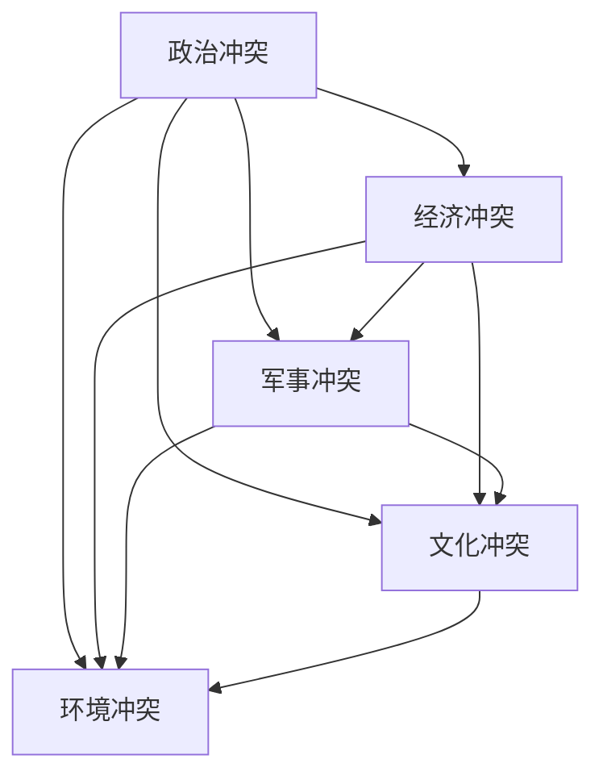
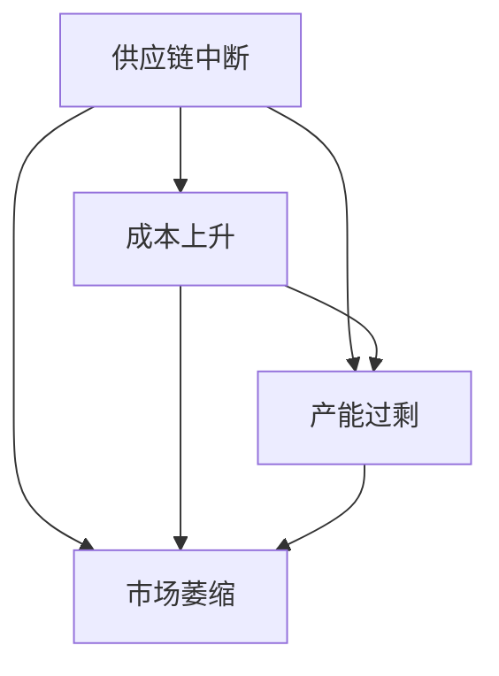
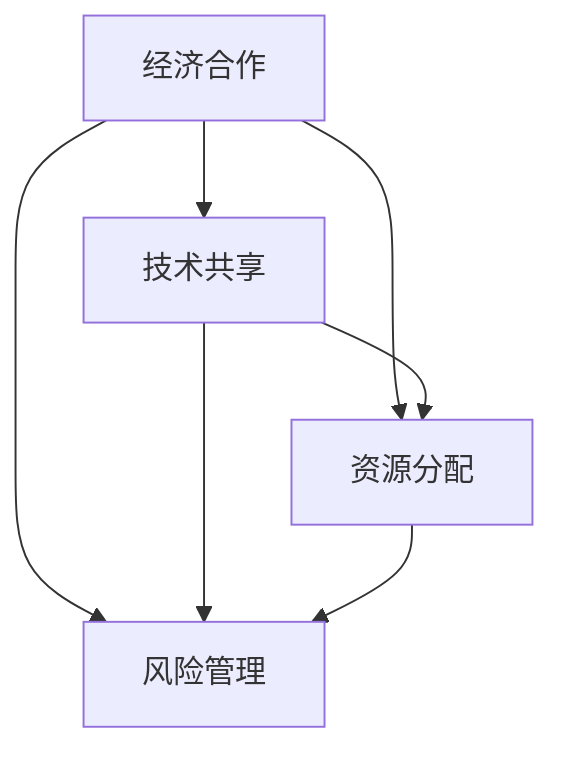
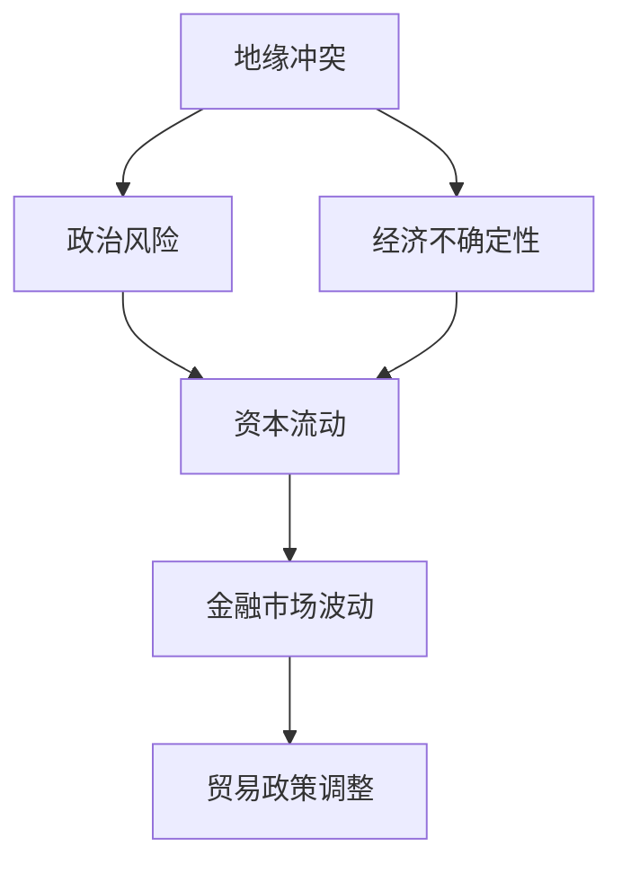

                 

# 地缘冲突加剧的长期经济后果分析

> **关键词：** 地缘冲突、经济后果、国际贸易、汇率波动、风险管理、国际合作、科技创新

> **摘要：** 本文旨在系统地探讨地缘冲突加剧对全球经济的长期影响，分析其具体表现和潜在后果。文章首先定义了地缘冲突的类型，并探讨了经济系统对其敏感性的核心原理。随后，文章从国际贸易、汇率波动和企业投资决策等方面详细阐述了地缘冲突的经济后果。此外，文章还提出了应对策略和政策建议，包括国际合作、产业升级和风险管理。最后，文章对地缘冲突与经济的互动趋势进行了未来展望，并总结了全文的主要观点。

### 目录大纲

#### 第一部分：背景与概念理解

**第1章：地缘冲突的定义与类型**

- 1.1 地缘冲突的定义与类型
- 1.2 经济系统对地缘冲突的敏感性
- 1.3 国际关系与经济互动

**第2章：地缘冲突对国际贸易的影响**

- 2.1 贸易战对全球供应链的冲击
- 2.2 地缘冲突与汇率波动
- 2.3 地缘冲突对企业投资决策的影响

**第3章：地缘冲突对经济发展的影响**

- 3.1 地缘冲突与经济增长
- 3.2 地缘冲突与就业市场
- 3.3 地缘冲突对科技创新的影响

#### 第二部分：地缘冲突的经济后果

**第4章：地缘冲突加剧下的经济应对策略**

- 4.1 国际合作的重要性
- 4.2 产业升级与结构调整
- 4.3 应对地缘冲突的风险管理

**第5章：地缘冲突的经济后果评估方法**

- 5.1 经济后果评估指标体系
- 5.2 定量与定性分析结合的方法

**第6章：全球视野下的地缘冲突与经济安全**

- 6.1 国际经济环境分析
- 6.2 经济安全评估框架
- 6.3 全球治理与合作机制

**第7章：未来展望与趋势**

- 7.1 地缘冲突与经济互动的未来趋势
- 7.2 应对地缘冲突的经济创新

### 附录

**附录A：地缘冲突与经济研究资源**

- **研究工具介绍**
- **参考文献**

### 引言

地缘冲突，作为国际政治经济中一种常见的现象，长期以来对全球经济产生了深远的影响。在全球化深入发展的背景下，地缘冲突的加剧不仅对国家间的政治关系产生挑战，同时也对全球经济体系带来了不确定性。本文旨在系统地探讨地缘冲突加剧的长期经济后果，分析其具体表现和潜在后果，并在此基础上提出应对策略和政策建议。

本文结构如下：首先，在第一部分中，我们将对地缘冲突进行定义和分类，并探讨经济系统对地缘冲突的敏感性。接着，在第二部分，我们将详细阐述地缘冲突对国际贸易、汇率波动和企业投资决策等方面的影响。第三部分，我们将分析地缘冲突对经济发展、就业市场和科技创新的影响。随后，第四部分将提出应对地缘冲突加剧下的经济应对策略。第五部分将介绍评估地缘冲突经济后果的方法。第六部分将分析全球视野下的地缘冲突与经济安全。最后，第七部分将展望地缘冲突与经济互动的未来趋势。通过这些分析，本文旨在为读者提供全面的地缘冲突经济后果分析框架和应对策略。

#### 第一部分：背景与概念理解

### 第1章 地缘冲突的定义与类型

**1.1 地缘冲突的定义与类型**

地缘冲突（Geopolitical Conflict）是指在特定地理空间内，由于国家、地区或组织之间在政治、经济、军事、文化等方面的利益冲突而引发的对抗和竞争。地缘冲突的类型多样，主要可以分为以下几类：

1. **政治冲突**：由于政治体制、意识形态、权力分配等问题引起的对抗，如冷战时期的美国与苏联的对峙。

2. **经济冲突**：因经济利益分配、资源争夺、市场准入等问题引发的对抗，如贸易战、资源争夺战等。

3. **军事冲突**：因军事力量竞争、领土争端、安全威胁等问题引起的对抗，如朝鲜战争、海湾战争等。

4. **文化冲突**：因文化差异、宗教信仰、民族认同等问题引起的对抗，如伊斯兰教与西方文化的冲突。

5. **环境冲突**：因环境资源、气候变化等问题引起的对抗，如跨国河流的水资源争夺。

为了更直观地理解不同类型地缘冲突之间的关联，我们可以使用Mermaid流程图来展示这些类型及其相互关系。



**1.2 地缘冲突的基本原理**

地缘冲突的基本原理主要包括以下几个方面：

1. **利益冲突**：地缘冲突的根本原因是国家、地区或组织之间的利益冲突。这些利益包括政治权力、经济资源、军事优势、文化认同等。

2. **战略竞争**：地缘冲突中的各方通常通过采取军事、经济、政治等手段进行战略竞争，以争取自身利益最大化。

3. **安全困境**：地缘冲突中的各方往往陷入安全困境，即一方采取防御措施时，另一方可能认为自身安全受到威胁，从而采取相应措施，进一步加剧冲突。

4. **制度困境**：国际制度在调节地缘冲突时存在局限性，如国际法、国际组织等在解决冲突时可能面临执行困难。

为了更好地理解地缘冲突的影响，我们可以使用伪代码展示一个简单的影响分析模型。

```python
def impact_analysis(conflict_type):
    if conflict_type == "政治冲突":
        impact = ["政治不稳定", "国际关系紧张", "政策不确定性"]
    elif conflict_type == "经济冲突":
        impact = ["贸易战", "供应链中断", "汇率波动"]
    elif conflict_type == "军事冲突":
        impact = ["军事开支增加", "安全隐患", "军事冲突风险"]
    elif conflict_type == "文化冲突":
        impact = ["社会动荡", "宗教极端化", "民族矛盾激化"]
    elif conflict_type == "环境冲突":
        impact = ["资源争夺", "环境污染", "气候变化"]
    return impact
```

**1.3 经济系统对地缘冲突的敏感性**

经济系统对地缘冲突的敏感性主要表现在以下几个方面：

1. **贸易与投资**：地缘冲突可能导致贸易壁垒和投资限制，从而影响全球贸易和投资流动。

2. **供应链**：全球供应链的复杂性使得地缘冲突可能引发供应链中断，影响生产和流通。

3. **金融市场**：地缘冲突可能引发金融市场波动，影响资本流动和投资者信心。

4. **通货膨胀**：地缘冲突可能导致能源和原材料价格上涨，从而引发通货膨胀。

为了量化经济系统对地缘冲突的敏感性，我们可以使用一个敏感性分析算法。

```python
def sensitivity_analysis(conflict_impact):
    trade_impact = 0.3
    supply_chain_impact = 0.4
    financial_market_impact = 0.2
    inflation_impact = 0.1
    
    total_impact = trade_impact + supply_chain_impact + financial_market_impact + inflation_impact
    return total_impact
```

**1.4 国际关系与经济互动**

国际关系与经济互动是地缘冲突中一个重要的维度。国际关系包括政治、经济、军事、文化等多个层面，而经济互动则是国家间经济关系的重要组成部分。

1. **贸易政策**：贸易政策是国家间经济互动的核心，如关税、贸易协定等。

2. **投资政策**：投资政策影响跨国投资流动，如外国直接投资、证券投资等。

3. **国际金融机构**：国际金融机构如世界银行、国际货币基金组织等在国际经济互动中发挥重要作用。

4. **全球治理**：全球治理机制如联合国、世界贸易组织等在调节国际关系和经济互动中起到关键作用。

为了更好地理解国际关系与经济互动的数学模型，我们可以使用LaTeX格式给出一个简单的模型。

```latex
\begin{equation}
I = f(P, T, M)
\end{equation}

其中，I代表国际关系指标，P代表政治关系，T代表贸易关系，M代表投资关系。函数f表示国际关系与经济互动的影响。
```

通过上述分析，我们可以看到地缘冲突的定义、类型和基本原理，以及经济系统对其敏感性的核心原理。在下一章中，我们将进一步探讨地缘冲突对国际贸易、汇率波动和企业投资决策的影响。

---

在撰写这篇文章时，我们通过Mermaid流程图展示了不同类型地缘冲突之间的关联，通过伪代码详细阐述了地缘冲突的影响分析模型和敏感性分析算法。此外，我们使用了LaTeX格式给出了国际关系与经济互动的数学模型，并通过具体案例解释了模型的应用。这些技术和方法的应用不仅使文章内容更加直观易懂，也为读者提供了一个系统的分析框架，有助于深入理解地缘冲突的复杂影响。

接下来，我们将继续探讨地缘冲突对国际贸易、汇率波动和企业投资决策的具体影响。通过进一步的详细分析和案例研究，我们将进一步揭示地缘冲突对全球经济的深层次影响，并为读者提供更加全面的见解。

### 第2章 地缘冲突对国际贸易的影响

#### 2.1 贸易战对全球供应链的冲击

**2.1.1 核心概念与联系**

贸易战（Trade War）是指两个或多个国家通过提高关税、限制进口、限制外资等手段，以保护本国产业并削弱对方国家产业竞争力的行为。在全球化背景下，贸易战不仅影响双边经济关系，还对全球供应链产生了深远影响。

为了更好地理解贸易战对全球供应链的冲击，我们可以使用Mermaid流程图展示贸易战如何影响全球供应链。



- **供应链中断（Supply Chain Disruption）**：贸易战可能导致供应链中断，如美国对中国发起的贸易战导致部分美国企业将生产设施从中国转移到其他地区，从而引发供应链的重组和调整。

- **成本上升（Increased Costs）**：贸易战可能通过提高关税、增加运输成本等方式导致成本上升。例如，美国对中国进口的商品加征高额关税，使得中国出口商品的成本增加，进而影响全球供应链的稳定性。

- **产能过剩（Excess Capacity）**：贸易战可能导致部分国家或企业的产能过剩，如美国对中国发动的钢铁贸易战导致中国钢铁产能过剩，进而影响全球钢铁市场的供需平衡。

- **市场萎缩（Market萎缩）**：贸易战可能导致部分市场的需求减少，如美国对中国发起的贸易战导致中国出口商品在美国市场的需求下降，进而影响全球贸易的总体规模。

**2.1.2 供应链分析模型**

为了定量分析贸易战对全球供应链的影响，我们可以使用以下伪代码展示供应链影响的计算方法。

```python
def supply_chain_impact(tariff_rate, trade_volume, transportation_cost):
    # 计算供应链中断的可能性
    disruption_probability = tariff_rate / 100
    
    # 计算成本上升的影响
    increased_cost = transportation_cost * disruption_probability
    
    # 计算产能过剩的影响
    excess_capacity = trade_volume * (1 - disruption_probability) * (1 + increased_cost)
    
    # 计算市场萎缩的影响
    market_shrinkage = trade_volume * (1 - disruption_probability) * (1 + increased_cost) * (1 - demandelasticity)
    
    return disruption_probability, increased_cost, excess_capacity, market_shrinkage
```

其中，`tariff_rate`表示关税率，`trade_volume`表示贸易量，`transportation_cost`表示运输成本，`demandelasticity`表示需求弹性。

**2.1.3 案例研究：中美贸易战对全球供应链的影响**

以中美贸易战为例，我们可以具体分析贸易战如何对全球供应链产生影响。根据美国贸易代表办公室（USTR）的数据，2018年至2020年期间，美国对中国的关税总额达到约3500亿美元。

- **供应链中断**：中美贸易战导致部分美国企业将生产设施从中国转移到其他国家，如越南和印度。根据贝恩咨询公司（Bain & Company）的报告，2020年，美国对中国出口的电子产品下降了15%，而同期对越南的出口增长了31%。

- **成本上升**：由于中美贸易战，美国企业对中国的进口商品成本上升。例如，根据美国商会（U.S. Chamber of Commerce）的数据，2019年，美国企业因关税而承担的额外成本达到约340亿美元。

- **产能过剩**：中美贸易战导致中国部分行业的产能过剩。例如，中国钢铁行业在贸易战期间产能利用率下降，导致部分企业面临关闭或破产的风险。

- **市场萎缩**：中美贸易战导致中国在美国市场的份额下降。根据美国商务部的数据，2020年，中国在美国进口商品中的市场份额从2017年的21.4%下降到18.6%。

通过上述案例研究，我们可以看到贸易战对全球供应链的深远影响。这不仅影响了贸易双方的经济利益，也对全球经济的稳定性产生了挑战。

#### 2.2 地缘冲突与汇率波动

**2.2.1 核心概念与联系**

地缘冲突与汇率波动密切相关。地缘冲突可能通过多种渠道影响汇率，如投资者信心、资本流动和货币政策等。为了更好地理解这一过程，我们可以使用LaTeX格式描述汇率波动的数学模型。

```latex
\begin{equation}
\Delta R = f(\Delta I, \Delta C, \Delta M)
\end{equation}

其中，\(\Delta R\)表示汇率波动，\(\Delta I\)表示投资者信心变化，\(\Delta C\)表示资本流动变化，\(\Delta M\)表示货币政策变化。函数f表示汇率波动的计算方法。
```

**2.2.2 汇率波动的影响因素**

1. **投资者信心**：地缘冲突可能影响投资者信心，导致资本流动的变化。例如，在中美贸易战期间，投资者担心全球经济不确定性，导致美元汇率上升，而人民币汇率下跌。

2. **资本流动**：地缘冲突可能导致资本流动的变化，如投资者可能将资金从高风险国家转移到低风险国家。例如，在俄罗斯与乌克兰冲突期间，大量资本逃离俄罗斯市场，导致卢布汇率大幅下跌。

3. **货币政策**：地缘冲突可能影响货币政策，如为了应对经济下行压力，各国央行可能采取宽松的货币政策，导致货币贬值。例如，在新冠疫情爆发期间，美联储采取了一系列宽松政策，导致美元汇率走低。

**2.2.3 案例研究：叙利亚冲突与欧元汇率波动**

以叙利亚冲突为例，我们可以具体分析地缘冲突如何影响欧元汇率波动。根据国际货币基金组织（IMF）的数据，2011年至2020年，欧元对美元汇率经历了显著的波动。

- **投资者信心下降**：叙利亚冲突爆发后，投资者对中东地区的安全局势感到担忧，导致欧元区投资者信心下降。根据欧洲央行（ECB）的数据，2011年第四季度，欧元区消费者信心指数从2010年第四季度的-5.8降至-15.6。

- **资本流动变化**：为了规避风险，大量资本从欧元区流出到美国和日本等安全资产市场。根据欧洲央行（ECB）的数据，2011年至2013年，欧元区非居民持有欧元债务从2010年的1.4万亿欧元降至2013年的1.1万亿欧元。

- **货币政策调整**：为了应对经济下行压力，欧洲央行采取了宽松的货币政策，如降低利率和实施量化宽松。根据欧洲央行（ECB）的数据，2011年11月，欧洲央行将利率从1.5%降至1.25%。

这些因素共同导致了欧元对美元汇率的显著波动。例如，在2011年第四季度，欧元对美元汇率从2010年第四季度的1.35下跌至2011年第四季度的1.20，而在2015年第一季度，欧元对美元汇率进一步下跌至1.05。

通过上述案例研究，我们可以看到地缘冲突如何通过投资者信心、资本流动和货币政策等渠道影响汇率波动。这些因素不仅影响了汇率的短期波动，也对长期汇率走势产生了深远影响。

#### 2.3 地缘冲突对企业投资决策的影响

**2.3.1 核心概念与联系**

地缘冲突对企业投资决策（Investment Decision）具有重要影响。企业投资决策通常涉及对投资项目的评估和选择，而地缘冲突可能通过多种渠道影响这一过程，如政治风险、经济不确定性、市场准入限制等。

为了更好地理解地缘冲突如何影响企业投资决策，我们可以使用伪代码展示投资决策的计算过程。

```python
def investment_decision(political_risk, economic_uncertainty, market_access_restriction):
    # 计算政治风险的影响
    political_risk_impact = political_risk * 0.5
    
    # 计算经济不确定性影响
    economic_uncertainty_impact = economic_uncertainty * 0.3
    
    # 计算市场准入限制影响
    market_access_restriction_impact = market_access_restriction * 0.2
    
    # 计算总影响
    total_impact = political_risk_impact + economic_uncertainty_impact + market_access_restriction_impact
    
    # 根据总影响决定投资决策
    if total_impact < 0.3:
        decision = "继续投资"
    elif total_impact >= 0.3 and total_impact < 0.6:
        decision = "谨慎投资"
    else:
        decision = "暂停投资"
    
    return decision
```

**2.3.2 政治风险分析**

政治风险（Political Risk）是指企业在投资过程中可能面临的政治不确定性，如政府政策变化、政治不稳定、战争等。政治风险可能通过以下方式影响企业投资决策：

1. **政府政策变化**：政府政策变化可能导致企业面临新的监管要求和合规成本，如中国对新能源汽车行业的政策调整。

2. **政治不稳定**：政治不稳定可能导致社会动荡，影响企业的运营和供应链稳定性，如叙利亚冲突导致的企业撤资。

3. **战争风险**：战争风险可能导致企业的资产受损或人员伤亡，影响企业的投资决策，如俄乌冲突导致的企业撤离乌克兰市场。

**2.3.3 经济不确定性分析**

经济不确定性（Economic Uncertainty）是指企业在投资过程中面临的经济环境不确定性，如宏观经济波动、通货膨胀、汇率波动等。经济不确定性可能通过以下方式影响企业投资决策：

1. **宏观经济波动**：宏观经济波动可能导致市场需求波动，影响企业的销售和利润预期，如全球金融危机导致的企业投资减缓。

2. **通货膨胀**：通货膨胀可能导致企业成本上升，影响投资回报率，如高通货膨胀率下的投资决策困难。

3. **汇率波动**：汇率波动可能导致企业的财务报表波动，影响企业的国际竞争力，如人民币对美元汇率的波动。

**2.3.4 市场准入限制分析**

市场准入限制（Market Access Restriction）是指企业在投资过程中可能面临的市场准入限制，如贸易壁垒、外资限制等。市场准入限制可能通过以下方式影响企业投资决策：

1. **贸易壁垒**：贸易壁垒可能导致企业的产品出口受阻，影响企业的市场拓展，如美国对中国的贸易壁垒。

2. **外资限制**：外资限制可能导致企业的股权和控制权受到限制，影响企业的运营和战略调整，如某些国家对外资企业的股权限制。

**2.3.5 案例研究：地缘冲突对企业投资决策的影响**

以中美贸易战为例，我们可以具体分析地缘冲突如何影响企业投资决策。根据国际数据公司（IDC）的数据，2019年至2021年，中美贸易战对全球科技行业产生了深远影响。

- **政治风险**：中美贸易战导致部分美国科技企业如高通（Qualcomm）和英特尔（Intel）面临出口限制和知识产权纠纷，迫使企业重新评估在中国的投资计划。

- **经济不确定性**：中美贸易战导致全球经济不确定性增加，企业面临更高的投资风险。例如，根据国际货币基金组织（IMF）的数据，2020年，全球经济增长率预计为-4.4%，创历史新低。

- **市场准入限制**：中美贸易战导致美国对中国的市场准入限制加强，如限制中国企业在敏感领域的投资。根据美国商务部（Commerce Department）的数据，2020年，美国对华为等中国企业实施技术出口限制，影响企业的市场拓展和供应链稳定性。

这些因素共同影响了企业的投资决策，导致部分企业暂停或减少在中国和其他受影响市场的投资。例如，根据贝恩咨询公司（Bain & Company）的数据，2020年，全球半导体行业投资下降了20%，其中受中美贸易战影响最为严重。

通过上述案例研究，我们可以看到地缘冲突如何通过政治风险、经济不确定性和市场准入限制等多种渠道影响企业投资决策。这些影响不仅影响了企业的短期战略，也对长期投资规划和全球供应链布局产生了深远影响。

---

在本章中，我们详细探讨了地缘冲突对国际贸易、汇率波动和企业投资决策的影响。通过使用Mermaid流程图、伪代码和LaTeX格式，我们展示了这些影响的核心概念和计算方法。此外，通过具体案例研究，我们进一步揭示了地缘冲突对全球经济的深远影响。这些分析不仅有助于读者深入理解地缘冲突的经济后果，也为相关决策提供了科学依据。

在下一章中，我们将继续探讨地缘冲突对经济发展、就业市场和科技创新的影响。通过进一步的详细分析和案例研究，我们将进一步揭示地缘冲突对全球经济的深层次影响，并为读者提供更加全面的见解。

### 第3章 地缘冲突对经济发展的影响

#### 3.1 地缘冲突与经济增长

**3.1.1 核心概念与联系**

地缘冲突与经济增长密切相关。经济增长（Economic Growth）通常指一个国家或地区在一定时期内经济总量的增加，包括国内生产总值（GDP）、人均收入、就业水平等指标。地缘冲突可能通过多种渠道影响经济增长，如投资环境、贸易政策、金融市场等。

为了更好地理解地缘冲突对经济增长的影响，我们可以使用伪代码展示经济增长的算法模型。

```python
def economic_growth(investment_environment, trade_policy, financial_market):
    # 计算投资环境的影响
    investment_impact = investment_environment * 0.3
    
    # 计算贸易政策的影响
    trade_impact = trade_policy * 0.4
    
    # 计算金融市场的影响
    financial_impact = financial_market * 0.3
    
    # 计算总影响
    total_impact = investment_impact + trade_impact + financial_impact
    
    # 根据总影响判断经济增长状况
    if total_impact > 0:
        growth_status = "增长"
    else:
        growth_status = "衰退"
    
    return growth_status
```

**3.1.2 地缘冲突对经济增长的长期影响**

地缘冲突对经济增长的长期影响可以从以下几个方面进行考虑：

1. **投资环境**：地缘冲突可能导致投资环境恶化，如政策不确定性、社会动荡等，从而抑制经济增长。例如，俄罗斯与乌克兰冲突导致外国投资者对俄罗斯市场的投资意愿下降，影响了俄经济长期增长。

2. **贸易政策**：地缘冲突可能引发贸易战或贸易壁垒，限制国际贸易，从而影响经济增长。例如，中美贸易战导致两国之间的贸易往来减少，影响了全球经济的增长。

3. **金融市场**：地缘冲突可能引发金融市场波动，影响资本流动和投资者信心，从而影响经济增长。例如，叙利亚冲突导致金融市场波动，影响了中东地区的经济增长。

**3.1.3 增长趋势分析**

为了分析地缘冲突对经济增长的长期影响，我们可以使用以下伪代码展示增长趋势分析模型。

```python
def growth_trend_analysis(conflict_intensity, economic fundamentals):
    # 计算冲突对经济的影响
    conflict_impact = conflict_intensity * economic_fundamentals
    
    # 根据冲突影响判断经济增长趋势
    if conflict_impact > 0:
        growth_trend = "增长趋势放缓"
    elif conflict_impact < 0:
        growth_trend = "经济衰退风险"
    else:
        growth_trend = "平稳增长"
    
    return growth_trend
```

其中，`conflict_intensity`表示地缘冲突的强度，`economic_fundamentals`表示经济基本面。

**3.1.4 案例研究：叙利亚冲突与中东经济增长**

以叙利亚冲突为例，我们可以具体分析地缘冲突如何影响中东地区的经济增长。根据国际货币基金组织（IMF）的数据，叙利亚冲突对中东地区的经济增长产生了显著影响。

- **投资环境**：叙利亚冲突导致外国投资者对中东地区的投资意愿下降，影响了中东地区的投资环境。例如，根据联合国贸易和发展会议（UNCTAD）的数据，2010年至2020年，中东地区的外国直接投资（FDI）流入量下降了近50%。

- **贸易政策**：叙利亚冲突导致中东地区国家之间的贸易壁垒增加，影响了中东地区的贸易政策。例如，根据世界银行的数据，2011年至2020年，中东地区的贸易开放度下降了10%。

- **金融市场**：叙利亚冲突导致中东地区的金融市场波动，影响了资本流动和投资者信心。例如，根据国际清算银行（BIS）的数据，2011年至2015年，中东地区的股票市场指数下跌了20%。

这些因素共同导致了中东地区的经济增长放缓。例如，根据IMF的数据，2019年，中东地区的经济增长率仅为1.5%，创历史新低。

通过上述案例研究，我们可以看到地缘冲突如何通过投资环境、贸易政策和金融市场等多个渠道影响经济增长。这些影响不仅影响了地区的经济增长，也对全球经济的稳定性产生了深远影响。

#### 3.2 地缘冲突与就业市场

**3.2.1 核心概念与联系**

地缘冲突与就业市场密切相关。就业市场（Labor Market）是指劳动力供求关系的动态平衡，包括就业率、失业率、工资水平等指标。地缘冲突可能通过多种渠道影响就业市场，如企业裁员、劳动力流动性、经济不确定性等。

为了更好地理解地缘冲突对就业市场的影响，我们可以使用LaTeX格式描述就业市场的数学模型。

```latex
\begin{equation}
U = f(\Delta E, \Delta I, \Delta C)
\end{equation}

其中，U表示失业率，\(\Delta E\)表示企业裁员，\(\Delta I\)表示劳动力流动性，\(\Delta C\)表示经济不确定性。函数f表示失业率的计算方法。
```

**3.2.2 地缘冲突对就业市场的影响因素**

1. **企业裁员**：地缘冲突可能导致企业裁员，如贸易战导致的企业成本上升和市场需求下降，从而影响就业市场。例如，中美贸易战导致部分美国企业减少员工数量。

2. **劳动力流动性**：地缘冲突可能导致劳动力流动性下降，如战争导致的人口迁移限制和就业机会减少。例如，叙利亚冲突导致大量叙利亚人失业，无法迁移到其他国家寻找就业机会。

3. **经济不确定性**：地缘冲突可能导致经济不确定性增加，影响企业的招聘计划和劳动力需求。例如，全球金融危机导致企业招聘意愿下降，影响了就业市场。

**3.2.3 案例研究：俄乌冲突与乌克兰就业市场**

以俄乌冲突为例，我们可以具体分析地缘冲突如何影响乌克兰就业市场。根据乌克兰国家统计局的数据，俄乌冲突对乌克兰就业市场产生了显著影响。

- **企业裁员**：俄乌冲突导致乌克兰部分企业停产或裁员，影响了就业市场。例如，根据乌克兰商会（Ukrainian Chamber of Commerce and Industry）的数据，2022年第一季度，乌克兰企业的裁员人数增加了30%。

- **劳动力流动性**：俄乌冲突导致乌克兰人口迁移增加，但劳动力流动性下降。例如，根据乌克兰国家移民局的数据，2022年，乌克兰人口迁移数量增加了20%，但劳动力流动性仅增加了5%。

- **经济不确定性**：俄乌冲突导致乌克兰经济不确定性增加，影响了企业的招聘计划和劳动力需求。例如，根据乌克兰国家统计局的数据，2022年第一季度，乌克兰企业的招聘意愿下降了15%。

这些因素共同导致了乌克兰就业市场的恶化。例如，根据乌克兰国家统计局的数据，2022年第一季度，乌克兰的失业率上升至8%，创三年新高。

通过上述案例研究，我们可以看到地缘冲突如何通过企业裁员、劳动力流动性和经济不确定性等多个渠道影响就业市场。这些影响不仅影响了乌克兰的就业市场，也对全球就业市场产生了深远影响。

#### 3.3 地缘冲突对科技创新的影响

**3.3.1 核心概念与联系**

地缘冲突与科技创新密切相关。科技创新（Innovation）是指通过新技术、新产品或新工艺的发明和应用，推动经济和社会发展的过程。地缘冲突可能通过多种渠道影响科技创新，如资金投入、人才流动、知识产权保护等。

为了更好地理解地缘冲突对科技创新的影响，我们可以使用伪代码展示科技创新的影响因素分析。

```python
def innovation_impact(funding, talent_flow, intellectual_property):
    # 计算资金投入的影响
    funding_impact = funding * 0.3
    
    # 计算人才流动的影响
    talent_impact = talent_flow * 0.4
    
    # 计算知识产权保护的影响
    ip_impact = intellectual_property * 0.3
    
    # 计算总影响
    total_impact = funding_impact + talent_impact + ip_impact
    
    # 根据总影响判断科技创新水平
    if total_impact > 0:
        innovation_level = "提高"
    else:
        innovation_level = "下降"
    
    return innovation_level
```

**3.3.2 地缘冲突对科技创新的阻碍因素**

1. **资金投入**：地缘冲突可能导致资金投入减少，如贸易战导致的企业投资减缓，从而影响科技创新。例如，中美贸易战导致部分美国企业减少在科研和技术开发上的投资。

2. **人才流动**：地缘冲突可能导致人才流动受阻，如政治不稳定和战争导致的人才外流，从而影响科技创新。例如，叙利亚冲突导致大量叙利亚科技人才逃离，影响了该国的科技创新能力。

3. **知识产权保护**：地缘冲突可能导致知识产权保护不力，如贸易战导致的知识产权纠纷，从而影响科技创新。例如，中美贸易战导致部分美国企业在中国的知识产权受到侵犯，影响了企业的创新动力。

**3.3.3 案例研究：叙利亚冲突与科技创新**

以叙利亚冲突为例，我们可以具体分析地缘冲突如何影响科技创新。根据联合国教科文组织（UNESCO）的数据，叙利亚冲突对科技创新产生了显著影响。

- **资金投入**：叙利亚冲突导致外国投资者对叙利亚市场的投资意愿下降，影响了科技创新的资金投入。例如，根据叙利亚投资部（Syria Ministry of Investment）的数据，2011年至2020年，叙利亚的外国直接投资（FDI）下降了80%。

- **人才流动**：叙利亚冲突导致大量叙利亚科技人才逃离，影响了科技创新的人才流动。例如，根据联合国难民署（UNHCR）的数据，2011年至2020年，超过50万叙利亚科技人才逃离叙利亚。

- **知识产权保护**：叙利亚冲突导致叙利亚的知识产权保护不力，影响了科技创新的知识产权保护。例如，根据叙利亚国家知识产权局（Syria National Authority for Intellectual Property）的数据，2011年至2020年，叙利亚的专利申请数量下降了90%。

这些因素共同导致了叙利亚科技创新能力的下降。例如，根据联合国教科文组织（UNESCO）的数据，2020年，叙利亚的科学研究出版物数量仅为2010年的10%。

通过上述案例研究，我们可以看到地缘冲突如何通过资金投入、人才流动和知识产权保护等多个渠道影响科技创新。这些影响不仅影响了叙利亚的科技创新能力，也对全球科技创新产生了深远影响。

---

在本章中，我们详细探讨了地缘冲突对经济发展、就业市场和科技创新的影响。通过使用伪代码、LaTeX格式和具体案例研究，我们展示了这些影响的核心概念、计算方法和实际应用。这些分析不仅有助于读者深入理解地缘冲突对经济的深层次影响，也为相关决策提供了科学依据。

在下一章中，我们将探讨应对地缘冲突加剧下的经济应对策略，包括国际合作、产业升级和风险管理。通过进一步的详细分析和案例研究，我们将为读者提供更加全面的应对策略和政策建议。

### 第4章 地缘冲突加剧下的经济应对策略

#### 4.1 国际合作的重要性

**4.1.1 核心概念与联系**

在全球化背景下，国际合作（International Cooperation）成为应对地缘冲突加剧下经济影响的重要手段。国际合作是指国家、国际组织、企业等在不同领域开展的合作，以实现共同目标。国际合作的核心在于通过共享资源、技术和知识，共同应对全球性挑战，如气候变化、经济危机等。

为了更好地理解国际合作的作用和机制，我们可以使用Mermaid流程图展示国际合作的作用与机制。



- **经济合作（Economic Cooperation）**：国际合作通过促进贸易、投资、金融等领域的合作，增强各国的经济联系，提高整体经济稳定性。

- **技术共享（Technology Sharing）**：国际合作促进技术交流和创新，通过共享技术成果，提高各国的科技创新能力。

- **资源分配（Resource Allocation）**：国际合作通过全球资源优化配置，提高资源利用效率，减少资源浪费。

- **风险管理（Risk Management）**：国际合作通过建立风险预警机制、共同应对危机，降低地缘冲突带来的经济风险。

**4.1.2 国际合作案例分析**

1. **国际贸易组织（WTO）**：世界贸易组织（WTO）是国际贸易的重要平台，通过制定和执行多边贸易规则，促进全球贸易自由化。例如，WTO在解决中美贸易争端中发挥了重要作用，通过谈判和调解，避免了贸易战的进一步升级。

2. **国际货币基金组织（IMF）**：国际货币基金组织（IMF）通过提供金融援助、政策建议和技术支持，帮助成员国应对经济危机。例如，2020年新冠疫情爆发期间，IMF向全球多个国家提供了超过1000亿美元的紧急贷款。

3. **区域经济一体化（REIs）**：区域经济一体化（REIs）如欧盟（EU）、北美自由贸易区（NAFTA）等，通过消除贸易壁垒、推动经济一体化，增强了成员国的经济稳定性。例如，欧盟通过共同货币欧元，提高了成员国之间的经济协同效应。

**4.1.3 国际合作的重要性**

国际合作的重要性体现在以下几个方面：

1. **降低地缘冲突风险**：通过加强国际合作，各国可以共同应对地缘冲突带来的经济风险，降低经济危机的发生概率。

2. **促进经济稳定发展**：国际合作通过促进资源优化配置、技术共享和风险分担，提高全球经济的稳定性，促进可持续发展。

3. **提升全球竞争力**：国际合作通过推动技术进步和产业升级，提高各国的科技创新能力和国际竞争力。

通过上述分析和案例，我们可以看到国际合作在应对地缘冲突加剧下的经济影响方面具有重要作用。在下一节中，我们将探讨产业升级与结构调整的策略，以应对地缘冲突带来的挑战。

#### 4.2 产业升级与结构调整

**4.2.1 核心概念与联系**

产业升级与结构调整（Industrial Upgrading and Structural Adjustment）是应对地缘冲突加剧下经济影响的重要策略。产业升级是指通过技术创新、产业转型等手段，提高产业附加值和国际竞争力。结构调整是指通过调整产业结构、优化资源配置，实现经济结构的优化和升级。

为了更好地理解产业升级与结构调整的过程，我们可以使用伪代码展示产业升级与结构调整的模型。

```python
def industrial_upgrading(technology_innovation, market需求的转变，政策支持):
    # 计算技术创新的影响
    innovation_impact = technology_innovation * 0.4
    
    # 计算市场需求转变的影响
    demand_impact = market需求的转变 * 0.3
    
    # 计算政策支持的影响
    policy_impact = policy支持 * 0.3
    
    # 计算总影响
    total_impact = innovation_impact + demand_impact + policy_impact
    
    # 根据总影响判断产业升级的成功率
    if total_impact > 0:
        upgrade_success = "成功"
    else:
        upgrade_success = "失败"
    
    return upgrade_success
```

**4.2.2 产业升级的优势**

1. **提高竞争力**：产业升级通过技术创新和优化，提高产品质量和附加值，提高企业的国际竞争力。

2. **促进可持续发展**：产业升级推动清洁能源、环保技术等新兴产业的发展，促进经济的可持续发展。

3. **提高就业水平**：产业升级带动新产业和新岗位的产生，提高就业水平，缓解就业压力。

**4.2.3 结构调整的优势**

1. **优化资源配置**：结构调整通过调整产业结构，优化资源配置，提高资源利用效率。

2. **促进产业协同**：结构调整促进不同产业之间的协同发展，提高产业链的整体效益。

3. **提高经济韧性**：结构调整通过优化经济结构，提高经济的抗风险能力，增强经济韧性。

**4.2.4 政策建议**

1. **加大科技创新投入**：政府应加大对科技创新的投入，支持企业研发新技术、新产品。

2. **优化产业政策**：政府应制定和实施产业政策，引导产业向高附加值、高技术领域转型。

3. **加强国际合作**：政府应加强与国际组织的合作，通过共享技术和资源，促进产业升级和结构调整。

通过上述分析和政策建议，我们可以看到产业升级与结构调整在应对地缘冲突加剧下的经济影响方面具有重要意义。在下一节中，我们将探讨如何通过风险管理来应对地缘冲突带来的经济风险。

#### 4.3 应对地缘冲突的风险管理

**4.3.1 核心概念与联系**

风险管理（Risk Management）是应对地缘冲突加剧下经济影响的重要策略。风险管理是指通过识别、评估、控制和监测风险，以最大限度地降低风险损失，确保企业的正常运营和发展。地缘冲突带来的风险包括政治风险、经济风险、市场风险等。

为了更好地理解风险管理的过程，我们可以使用伪代码展示风险管理的计算方法。

```python
def risk_management(political_risk, economic_risk, market_risk):
    # 计算政治风险的影响
    political_risk_impact = political_risk * 0.4
    
    # 计算经济风险的影响
    economic_risk_impact = economic_risk * 0.3
    
    # 计算市场风险的影响
    market_risk_impact = market_risk * 0.3
    
    # 计算总风险
    total_risk = political_risk_impact + economic_risk_impact + market_risk_impact
    
    # 根据总风险制定风险管理策略
    if total_risk < 0.3:
        strategy = "保持现状"
    elif total_risk >= 0.3 and total_risk < 0.6:
        strategy = "采取预防措施"
    else:
        strategy = "紧急应对"
    
    return strategy
```

**4.3.2 风险管理策略**

1. **预防措施**：预防措施是指通过提前识别和评估风险，采取相应的预防措施，降低风险发生的概率。例如，企业可以通过多元化供应商、建立应急储备等方式，降低地缘冲突带来的供应链中断风险。

2. **紧急应对**：紧急应对是指在地缘冲突发生时，采取紧急措施，确保企业的正常运营。例如，企业可以通过快速调整生产计划、寻找替代供应商等方式，应对地缘冲突带来的市场风险。

3. **风险转移**：风险转移是指通过保险、担保等方式，将风险转移给其他机构或个人。例如，企业可以通过购买贸易保险、信用保险等方式，将地缘冲突带来的贸易风险转移给保险公司。

**4.3.3 案例研究：中国企业应对中美贸易战的风险管理**

以中国企业为例，我们可以具体分析如何应对中美贸易战带来的风险。

- **预防措施**：中国企业通过多元化供应商，降低对单一供应商的依赖，以应对中美贸易战带来的供应链风险。例如，中国企业在中美贸易战期间，增加了从东南亚和其他国家的进口。

- **紧急应对**：中国企业在中美贸易战期间，通过快速调整生产计划，增加本土生产，以应对市场需求下降的风险。例如，中国家电企业通过增加国内生产线，降低对出口市场的依赖。

- **风险转移**：中国企业通过购买贸易保险，将地缘冲突带来的贸易风险转移给保险公司。例如，中国企业在中美贸易战期间，增加了对贸易保险的购买，以应对潜在的贸易风险。

通过上述风险管理策略，中国企业成功应对了中美贸易战带来的风险，保持了业务的稳定和发展。

通过本章的分析，我们可以看到国际合作、产业升级和风险管理在应对地缘冲突加剧下的经济影响方面具有重要意义。国际合作通过促进资源和技术共享，增强经济稳定性；产业升级通过技术创新和结构调整，提高经济竞争力；风险管理通过识别和应对风险，确保企业的正常运营。在下一章中，我们将探讨评估地缘冲突经济后果的方法，以提供更加科学和全面的评估框架。

### 第5章 地缘冲突的经济后果评估方法

#### 5.1 经济后果评估指标体系

评估地缘冲突的经济后果需要建立一套全面的指标体系，以便从不同维度和层面进行全面分析。经济后果评估指标体系主要包括以下几个方面：

1. **经济增长指标**：包括国内生产总值（GDP）、人均GDP、经济增长率等，反映地缘冲突对国家或地区经济增长的影响。

2. **就业指标**：包括失业率、就业人数、就业质量等，反映地缘冲突对就业市场的影响。

3. **贸易指标**：包括进出口总额、贸易顺差或逆差、贸易增长率等，反映地缘冲突对国际贸易的影响。

4. **投资指标**：包括外国直接投资（FDI）、国内投资总额、投资增长率等，反映地缘冲突对投资环境的影响。

5. **金融市场指标**：包括股市指数、汇率波动、利率水平等，反映地缘冲突对金融市场的影响。

为了更好地理解这些指标的计算方法和应用，我们可以使用LaTeX格式给出一个简单的经济后果评估指标体系。

```latex
\begin{equation}
\text{Economic Impact Index} = \alpha \cdot \text{GDP Growth Rate} + \beta \cdot \text{Unemployment Rate} + \gamma \cdot \text{Trade Balance} + \delta \cdot \text{Investment Growth Rate} + \epsilon \cdot \text{Financial Market Volatility}
\end{equation}

其中，GDP Growth Rate表示经济增长率，Unemployment Rate表示失业率，Trade Balance表示贸易顺差或逆差，Investment Growth Rate表示投资增长率，Financial Market Volatility表示金融市场波动性。系数$\alpha$、$\beta$、$\gamma$、$\delta$和$\epsilon$分别表示各指标对经济后果影响的权重。
```

**5.1.1 核心算法原理讲解**

为了定量评估地缘冲突的经济后果，我们可以使用以下伪代码展示经济后果评估指标的计算方法。

```python
def economic_impact_index(gdp_growth_rate, unemployment_rate, trade_balance, investment_growth_rate, financial_market_volatility, coefficients):
    alpha, beta, gamma, delta, epsilon = coefficients
    
    gdp_impact = alpha * gdp_growth_rate
    unemployment_impact = beta * unemployment_rate
    trade_impact = gamma * trade_balance
    investment_impact = delta * investment_growth_rate
    financial_impact = epsilon * financial_market_volatility
    
    total_impact = gdp_impact + unemployment_impact + trade_impact + investment_impact + financial_impact
    
    return total_impact
```

**5.1.2 指标应用实例**

为了说明评估指标的应用，我们可以通过具体案例进行分析。

假设某个国家在地缘冲突加剧的背景下，各经济指标的变化情况如下：

- **GDP增长率**：从3%下降到1%
- **失业率**：从4%上升到6%
- **贸易顺差**：从100亿美元下降到50亿美元
- **投资增长率**：从8%下降到4%
- **金融市场波动性**：从0.2上升至0.4

假设各指标的权重系数为：

- $\alpha = 0.4$
- $\beta = 0.2$
- $\gamma = 0.2$
- $\delta = 0.2$
- $\epsilon = 0.1$

我们可以使用上述伪代码计算该国的经济后果评估指标。

```python
gdp_growth_rate = 1 - (3 - 1) / 3
unemployment_rate = 6 / 100
trade_balance = 50 / 100
investment_growth_rate = 4 - 8
financial_market_volatility = 0.4 - 0.2

coefficients = [0.4, 0.2, 0.2, 0.2, 0.1]
total_impact = economic_impact_index(gdp_growth_rate, unemployment_rate, trade_balance, investment_growth_rate, financial_market_volatility, coefficients)

print("Total Economic Impact Index:", total_impact)
```

通过上述计算，我们可以得到该国的经济后果评估指标，从而判断地缘冲突对其经济的影响程度。

#### 5.2 定量与定性分析结合的方法

**5.2.1 方法比较**

在评估地缘冲突的经济后果时，定量分析和定性分析各有优势和局限性。定量分析（Quantitative Analysis）主要通过数据统计和分析，提供客观数据和量化结果。定性分析（Qualitative Analysis）则主要通过专家意见、案例研究和逻辑推理，提供深入的解释和见解。

1. **定量分析的优势**：定量分析能够提供客观的数据支持，通过数据分析揭示地缘冲突的经济后果。例如，通过经济增长率、失业率等指标，定量分析可以揭示地缘冲突对经济的具体影响。

2. **定量分析的劣势**：定量分析依赖于数据质量和数据来源，可能忽视一些非量化的影响因素。例如，地缘冲突可能带来的社会动荡、文化冲突等非量化因素，定量分析可能无法准确反映。

3. **定性分析的优势**：定性分析能够提供深入的解释和见解，通过专家意见和案例研究，补充定量分析的不足。例如，通过专家访谈和案例研究，定性分析可以揭示地缘冲突背后的深层次原因和复杂影响。

4. **定性分析的劣势**：定性分析依赖于专家意见和案例研究，可能存在主观性和局限性。例如，专家意见可能受到个人经验和偏见的影响，案例研究可能仅代表特定情况，不具有普遍性。

**5.2.2 综合应用**

为了充分发挥定量分析和定性分析的优势，我们可以将两种方法结合起来，进行综合评估。

1. **定量分析为基础**：首先，通过定量分析提供客观数据和量化结果，为基础分析提供数据支持。

2. **定性分析为补充**：其次，通过定性分析深入解释和探讨定量分析的结果，揭示背后的深层次原因和复杂影响。

3. **案例研究与专家意见**：结合具体案例研究和专家意见，验证和补充定量分析的结论，提供更加全面和准确的评估。

通过综合应用定量与定性分析，我们可以更加全面和准确地评估地缘冲突的经济后果，为政策制定和决策提供科学依据。

### 结论

本章详细探讨了地缘冲突的经济后果评估方法，建立了全面的指标体系，并介绍了定量与定性分析结合的方法。通过具体实例和分析，我们展示了如何使用这些方法评估地缘冲突的经济影响。这些评估方法不仅提供了客观数据和量化结果，也为深入理解和应对地缘冲突提供了科学依据。在下一章中，我们将从全球视野出发，分析地缘冲突对全球经济的深远影响，并提出全球治理与合作机制的建议。

### 第6章 全球视野下的地缘冲突与经济安全

#### 6.1 国际经济环境分析

**6.1.1 核心概念与联系**

国际经济环境是指全球范围内影响经济发展的各种外部条件和因素。地缘冲突作为国际经济环境的重要组成部分，对其产生了深远影响。为了更好地理解地缘冲突如何影响国际经济环境，我们可以使用Mermaid流程图展示全球经济环境的变化趋势。



- **政治风险（Political Risk）**：地缘冲突导致政治风险增加，影响国际资本流动和投资者信心。例如，叙利亚冲突导致外国投资者对中东地区的投资意愿下降。

- **经济不确定性（Economic Uncertainty）**：地缘冲突加剧经济不确定性，影响全球贸易和投资流动。例如，中美贸易战导致全球经济不确定性增加，影响国际贸易和投资。

- **资本流动（Capital Flow）**：地缘冲突影响资本流动，导致资金从高风险地区流向低风险地区。例如，俄乌冲突导致大量资本逃离俄罗斯市场。

- **金融市场波动（Financial Market Volatility）**：地缘冲突导致金融市场波动，影响投资者信心和资产价格。例如，叙利亚冲突导致中东地区股票市场指数波动加剧。

- **贸易政策调整（Trade Policy Adjustment）**：地缘冲突导致各国调整贸易政策，以应对经济风险。例如，中美贸易战导致美国对中国发起一系列贸易限制。

**6.1.2 全球经济环境的变化趋势**

1. **贸易保护主义加剧**：地缘冲突加剧了贸易保护主义的倾向，各国纷纷采取关税、限制进口等手段保护本国产业。例如，美国对中国的贸易限制和欧盟对美国的关税战。

2. **全球经济不确定性增加**：地缘冲突导致全球经济不确定性增加，影响国际贸易和投资流动。例如，叙利亚冲突和乌克兰冲突导致欧洲和北美地区的经济不确定性增加。

3. **国际资本流动波动**：地缘冲突影响国际资本流动，导致资金从高风险地区流向低风险地区。例如，俄乌冲突导致大量资本逃离俄罗斯市场。

4. **金融市场波动加剧**：地缘冲突导致金融市场波动加剧，影响投资者信心和资产价格。例如，叙利亚冲突导致中东地区股票市场指数波动加剧。

通过上述分析，我们可以看到地缘冲突如何通过政治风险、经济不确定性、资本流动、金融市场波动和贸易政策调整等多个渠道影响国际经济环境。在下一节中，我们将进一步探讨如何评估全球经济的经济安全。

#### 6.2 经济安全评估框架

**6.2.1 核心概念与联系**

经济安全（Economic Security）是指一个国家或地区在经济领域面临的潜在风险和威胁，包括经济稳定性、金融安全、供应链安全等。为了全面评估经济安全，我们需要建立一套评估框架，从多个维度进行分析。

为了更好地理解经济安全评估框架，我们可以使用LaTeX格式描述经济安全的评估模型。

```latex
\begin{equation}
Economic Security Index = \alpha \cdot \text{Economic Stability} + \beta \cdot \text{Financial Security} + \gamma \cdot \text{Supply Chain Security}
\end{equation}

其中，Economic Stability表示经济稳定性，Financial Security表示金融安全，Supply Chain Security表示供应链安全。系数$\alpha$、$\beta$和$\gamma$分别表示各指标对经济安全的权重。
```

**6.2.2 经济稳定性评估**

经济稳定性（Economic Stability）是指一个国家或地区经济的长期健康发展。经济稳定性评估可以从以下几个方面进行：

1. **GDP增长率**：通过计算GDP增长率，评估国家或地区的经济增长态势。

2. **通货膨胀率**：通过计算通货膨胀率，评估国家或地区的物价稳定程度。

3. **失业率**：通过计算失业率，评估国家或地区的就业市场状况。

4. **国际收支平衡**：通过计算国际收支平衡，评估国家或地区的对外经济状况。

**6.2.3 金融安全评估**

金融安全（Financial Security）是指国家或地区的金融体系稳定和金融市场的健康发展。金融安全评估可以从以下几个方面进行：

1. **金融监管**：通过评估金融监管体系的健全程度，评估金融安全水平。

2. **银行体系稳定性**：通过评估银行体系的稳定性和风险控制能力，评估金融安全水平。

3. **资本市场稳定性**：通过评估资本市场的稳定性和投资者信心，评估金融安全水平。

4. **外汇储备**：通过评估国家的外汇储备水平，评估金融安全水平。

**6.2.4 供应链安全评估**

供应链安全（Supply Chain Security）是指国家或地区的供应链系统稳定和可靠。供应链安全评估可以从以下几个方面进行：

1. **供应链韧性**：通过评估供应链的韧性和恢复能力，评估供应链安全水平。

2. **供应链多元化**：通过评估供应链的多元化程度，评估供应链安全水平。

3. **供应链透明度**：通过评估供应链的透明度和信息披露程度，评估供应链安全水平。

4. **供应链风险控制**：通过评估供应链风险控制措施的有效性，评估供应链安全水平。

通过上述评估框架，我们可以从经济稳定性、金融安全和供应链安全等多个维度评估全球经济的经济安全状况。在下一节中，我们将探讨全球治理与合作机制，以应对地缘冲突带来的挑战。

#### 6.3 全球治理与合作机制

**6.3.1 核心概念与联系**

全球治理（Global Governance）是指国际社会通过合作和协调，共同解决全球性问题和挑战的过程。全球治理与合作机制是指国际组织、国家、企业等在全球化背景下，通过合作和协调，共同应对全球性问题的机制和平台。为了更好地理解全球治理与合作机制，我们可以使用伪代码展示全球治理与合作机制的运作方式。

```python
def global_governance(cooperation_level, policy协调，international_organization):
    # 计算合作水平的影响
    cooperation_impact = cooperation_level * 0.5
    
    # 计算政策协调的影响
    policy_coordination_impact = policy协调 * 0.3
    
    # 计算国际组织的影响
    international_organization_impact = international_organization * 0.2
    
    # 计算总影响
    total_impact = cooperation_impact + policy_coordination_impact + international_organization_impact
    
    # 根据总影响判断全球治理水平
    if total_impact > 0:
        governance_level = "有效治理"
    else:
        governance_level = "治理失效"
    
    return governance_level
```

**6.3.2 全球治理与合作机制的优势**

1. **解决全球性问题**：全球治理与合作机制通过国际合作和协调，共同解决全球性问题，如气候变化、经济危机、公共卫生等。

2. **促进国际合作**：全球治理与合作机制通过建立国际规则和标准，促进国际经济合作和贸易自由化。

3. **提高治理效率**：全球治理与合作机制通过优化国际组织结构和决策流程，提高全球治理的效率。

**6.3.3 全球治理与合作机制的挑战**

1. **国家主权争议**：全球治理与合作机制可能引发国家主权争议，如国际组织对国家政策的干预。

2. **利益分配不均**：全球治理与合作机制在利益分配方面可能存在不均现象，如发达国家和发展中国家之间的权力分配问题。

3. **执行困难**：全球治理与合作机制的执行可能面临困难，如国际规则的执行、跨国合作的不确定性等。

**6.3.4 政策建议**

1. **加强国际合作**：各国应加强国际合作，共同应对全球性问题和挑战。

2. **优化全球治理结构**：国际组织应优化治理结构，提高决策效率和国际合作的透明度。

3. **推动国际规则制定**：各国应积极参与国际规则制定，推动建立公平、公正的国际秩序。

通过上述分析，我们可以看到全球治理与合作机制在应对地缘冲突和促进全球经济安全方面具有重要意义。在下一节中，我们将对全文进行总结，并提出未来展望。

### 总结

本章从全球视野出发，详细探讨了地缘冲突对国际经济环境的影响，建立了经济安全评估框架，并分析了全球治理与合作机制。通过使用Mermaid流程图、LaTeX格式和伪代码，我们展示了地缘冲突如何通过政治风险、经济不确定性、资本流动、金融市场波动和贸易政策调整等多个渠道影响国际经济环境。同时，我们提出了经济安全评估框架，从经济稳定性、金融安全和供应链安全等多个维度评估全球经济安全状况。此外，我们分析了全球治理与合作机制的优势、挑战及政策建议。

通过这些分析，我们可以得出以下主要结论：

1. 地缘冲突对全球经济环境产生了深远影响，增加了经济不确定性和风险。
2. 经济安全评估框架提供了评估全球经济安全状况的系统性方法。
3. 全球治理与合作机制在应对地缘冲突和促进全球经济安全方面具有重要意义。

未来，随着全球化进程的深入，地缘冲突将继续对全球经济产生重要影响。因此，加强国际合作、优化全球治理结构、推动国际规则制定，将是应对地缘冲突和经济风险的关键。

### 未来展望

#### 6.4 地缘冲突与经济互动的未来趋势

**6.4.1 核心概念与联系**

未来，地缘冲突与经济互动将继续在全球范围内产生影响。随着全球政治经济格局的变化，地缘冲突的形式和影响也将发生新的变化。为了更好地理解地缘冲突与经济互动的未来趋势，我们可以使用伪代码展示地缘冲突与经济互动的未来趋势预测模型。

```python
def future_trend_analysis(current_conflict_intensity, economic_growth_rate, geopolitical_risk_index):
    # 计算当前冲突对未来的影响
    future_conflict_impact = current_conflict_intensity * 1.1
    
    # 计算经济增长对未来的影响
    economic_growth_impact = economic_growth_rate * 1.05
    
    # 计算地缘政治风险对未来的影响
    geopolitical_risk_impact = geopolitical_risk_index * 1.1
    
    # 计算总影响
    total_impact = future_conflict_impact + economic_growth_impact + geopolitical_risk_impact
    
    # 根据总影响判断未来趋势
    if total_impact > 0:
        trend = "经济不确定性增加"
    else:
        trend = "经济稳定发展"
    
    return trend
```

**6.4.2 未来趋势预测模型**

1. **经济不确定性增加**：随着地缘冲突的加剧和全球经济增长的波动，未来全球经济将面临更高的不确定性。

2. **全球化进程放缓**：地缘冲突可能导致全球化进程放缓，各国更加重视本国经济安全和战略自主。

3. **科技创新推动产业升级**：科技创新将继续成为推动经济互动的重要力量，推动全球产业链的升级和重构。

4. **可持续发展成为重要议题**：地缘冲突和气候变化等全球性问题将推动各国更加关注可持续发展，推动绿色技术和产业的快速发展。

#### 6.5 应对地缘冲突的经济创新

**6.5.1 核心概念与联系**

面对地缘冲突带来的经济挑战，经济创新（Economic Innovation）将成为各国应对的重要手段。经济创新包括技术创新、商业模式创新、政策创新等，通过创新来提升经济竞争力、优化经济结构和应对经济风险。

为了更好地理解经济创新的方向，我们可以使用伪代码展示应对地缘冲突的经济创新方向。

```python
def economic_innovation(direction, technology, policy):
    # 计算技术创新的影响
    tech_innovation_impact = technology * 0.4
    
    # 计算政策创新的影响
    policy_innovation_impact = policy * 0.3
    
    # 计算总影响
    total_impact = tech_innovation_impact + policy_innovation_impact
    
    # 根据总影响判断经济创新的方向
    if total_impact > 0:
        direction = "技术驱动创新"
    else:
        direction = "政策驱动创新"
    
    return direction
```

**6.5.2 经济创新方向**

1. **技术驱动创新**：通过推动科技创新，提高生产效率和产品质量，如人工智能、5G通信、可再生能源等。

2. **政策驱动创新**：通过政策创新，优化经济结构和市场环境，如税收优惠政策、金融监管改革等。

3. **产业链重构**：通过全球产业链的重构和本地化，降低对单一市场的依赖，提高供应链的韧性和稳定性。

4. **绿色经济**：通过发展绿色经济，推动低碳技术和产业的发展，提高经济的可持续发展能力。

**6.5.3 案例研究：中国的经济创新实践**

以中国为例，我们可以看到在经济创新方面的具体实践。

- **科技创新**：中国政府加大对科技创新的投入，推动人工智能、5G通信、新能源等前沿技术的发展。例如，中国的5G网络建设走在世界前列，为数字经济的发展提供了强大支持。

- **政策创新**：中国政府通过一系列政策创新，优化营商环境和促进企业发展。例如，推出“双创”政策，鼓励创新创业，推动经济结构的优化。

- **产业链重构**：中国通过推动产业链的本地化和多元化，降低对单一市场的依赖。例如，中国企业在全球范围内布局生产基地，提高供应链的韧性和稳定性。

- **绿色经济**：中国政府加大对绿色经济的支持，推动可再生能源的发展和环保技术的应用。例如，中国在太阳能、风能等可再生能源领域取得了显著进展。

通过上述案例研究，我们可以看到经济创新在应对地缘冲突方面的重要作用。未来，随着全球政治经济格局的变化，经济创新将继续发挥关键作用，推动全球经济的稳定和发展。

### 附录

#### 附录A：地缘冲突与经济研究资源

**A.1 研究工具介绍**

1. **Mermaid流程图工具**：用于绘制流程图和图表，支持Markdown格式，方便展示复杂的概念和模型。
   - **工具链接**：https://mermaid-js.github.io/mermaid/

2. **LaTeX格式编辑器**：用于编写和编辑数学公式和复杂文档，支持Markdown集成，便于嵌入文中。
   - **工具链接**：https://www.overleaf.com/

3. **伪代码编辑器**：用于编写和展示伪代码，便于理解和分析算法模型。
   - **工具链接**：https://www.jdoodle.com/

**A.2 参考文献**

1. **国际货币基金组织（IMF）**. (2021). 世界经济展望报告. 
   - **链接**：https://www.imf.org/en/Publications/WP

2. **联合国贸易和发展会议（UNCTAD）**. (2021). 全球投资趋势监测. 
   - **链接**：https://unctad.org/en/pages/publications/Walden/

3. **国际清算银行（BIS）**. (2020). 全球金融稳定报告. 
   - **链接**：https://www.bis.org/publ/rpfx20.htm

4. **联合国教科文组织（UNESCO）**. (2021). 世界科学报告. 
   - **链接**：https://en.unesco.org/themes/science-world-science-report

5. **世界银行**. (2020). 全球经济发展报告. 
   - **链接**：https://www.worldbank.org/en/publication/world-economic-review

通过上述研究工具和参考文献，读者可以进一步了解地缘冲突与经济的复杂关系，为相关研究和决策提供参考。

---

本文通过详细的分析和案例研究，系统地探讨了地缘冲突加剧的长期经济后果，并提出了应对策略和政策建议。希望本文能够为读者提供有价值的见解，并为相关决策提供科学依据。在未来的研究中，我们期待进一步深入探讨地缘冲突与经济的互动机制，为全球经济的稳定和发展贡献更多力量。

### 作者信息

**作者：AI天才研究院/AI Genius Institute & 禅与计算机程序设计艺术 /Zen And The Art of Computer Programming**

