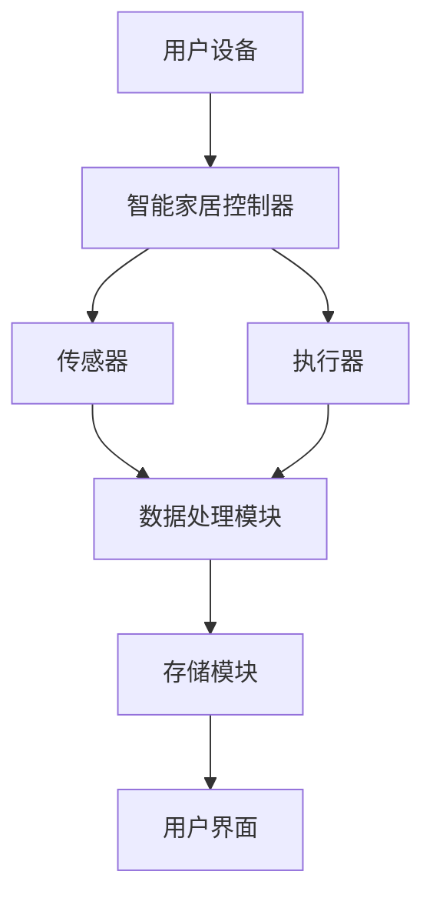
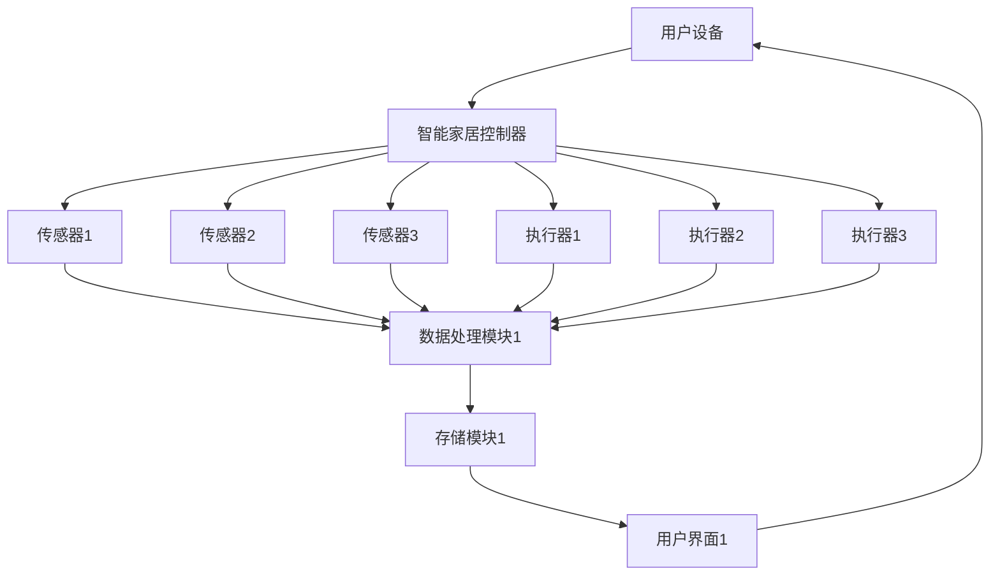

                 

# 《基于Java的智能家居设计：集成语音识别功能到智能家居系统》

> **关键词**：Java、智能家居、语音识别、集成、设计、实现、测试。

> **摘要**：本文探讨了基于Java的智能家居设计，重点介绍了如何将语音识别功能集成到智能家居系统中。通过详细的步骤讲解和代码实现，读者可以了解智能家居系统的架构、语音识别算法的应用以及系统性能的优化策略。本文旨在为从事智能家居开发的工程师和研究者提供实用指南和理论基础。

### 目录大纲

1. **智能家居设计基础**
   1.1 智能家居概述
   1.2 智能家居系统架构
   1.3 智能家居的市场趋势与应用场景

2. **Java在智能家居系统中的应用**
   2.1 Java在嵌入式系统中的应用
   2.2 Java在智能家居控制器中的应用
   2.3 Java在智能家居移动应用开发中的应用

3. **智能家居系统集成**
   3.1 智能家居硬件集成
   3.2 网络通信协议
   3.3 数据处理与存储

4. **语音识别功能集成**
   4.1 语音识别技术基础
   4.2 Java语音识别库与工具
   4.3 语音识别算法优化与调优

5. **案例与实践**
   5.1 智能家居语音控制案例
   5.2 智能家居系统集成与优化

6. **智能家居系统的未来趋势与展望**
   6.1 智能家居技术发展趋势
   6.2 未来智能家居的应用场景
   6.3 智能家居行业面临的挑战与机遇

## 第一部分：智能家居设计基础

### 1.1 智能家居概述

智能家居（Smart Home）是指利用自动化技术、物联网（IoT）和人工智能（AI）技术，将家庭设备、系统和应用通过网络连接起来，实现家庭设备的智能控制、数据分析和设备间的互动。智能家居系统可以让用户通过智能手机、语音助手或其他智能设备，远程控制家里的电器设备，如灯光、空调、音响、安防设备等。

#### 智能家居的概念与发展历程

智能家居的概念最早可以追溯到20世纪90年代，当时主要是通过嵌入式系统和无线网络来实现家庭设备的自动化控制。随着互联网技术的发展，特别是物联网和云计算技术的出现，智能家居进入了快速发展阶段。

- **第一阶段（1990s-2000s）**：早期智能家居系统主要依赖于嵌入式系统，如PLC（可编程逻辑控制器）和嵌入式Linux系统，实现家庭设备的简单自动化控制。
- **第二阶段（2000s-2010s）**：物联网技术的发展使得家庭设备可以通过互联网进行连接，智能家居系统开始具备简单的联网功能。
- **第三阶段（2010s-至今）**：随着人工智能技术的成熟，智能家居系统逐渐引入语音识别、自然语言处理等智能交互功能，使得智能家居系统更加智能化和人性化。

#### 智能家居系统架构

智能家居系统通常包括以下几个主要组成部分：

1. **传感器**：传感器用于采集家庭环境的数据，如温度、湿度、光照、声音、烟雾等。
2. **控制器**：控制器是智能家居系统的核心，负责接收和处理传感器数据，并根据用户指令或预设规则控制家庭设备。
3. **执行器**：执行器是实际执行用户指令或控制器指令的设备，如灯光开关、窗帘控制器、空调等。
4. **通信网络**：通信网络用于连接智能家居系统中的各个组件，常见的通信协议包括Wi-Fi、蓝牙、ZigBee等。
5. **用户界面**：用户界面是用户与智能家居系统进行交互的接口，可以是智能手机应用、平板电脑、智能音箱等。

以下是一个智能家居系统的简化的 Mermaid 流程图：



### 1.2 智能家居系统架构

智能家居系统架构可以分为硬件层、通信层、数据处理层和用户交互层。

1. **硬件层**：包括传感器、执行器和控制器等硬件设备，这些设备通过通信协议连接起来，构成智能家居系统的基本单元。

2. **通信层**：主要负责各个硬件设备之间的通信，常见的通信协议有Wi-Fi、蓝牙、ZigBee等。通信层还需要考虑网络安全和数据传输效率。

3. **数据处理层**：负责对传感器数据进行处理和分析，包括数据清洗、数据融合、数据挖掘等，以实现智能家居系统的智能决策和自适应控制。

4. **用户交互层**：提供用户与智能家居系统进行交互的界面，用户可以通过智能手机、平板电脑、智能音箱等设备发送指令或查看系统状态。

以下是一个智能家居系统的详细 Mermaid 流程图：



### 1.3 智能家居的市场趋势与应用场景

智能家居市场正在快速发展，根据市场研究机构的报告，全球智能家居市场规模预计将在未来几年内持续增长。

#### 市场趋势

1. **技术进步**：随着物联网、云计算、人工智能等技术的不断成熟，智能家居系统的功能越来越强大，用户体验不断提升。
2. **用户需求**：随着生活水平的提高，人们对家庭舒适度和安全性的要求越来越高，智能家居系统可以提供更好的生活体验。
3. **政策支持**：各国政府纷纷出台相关政策，鼓励智能家居产业的发展，为智能家居市场的发展提供了良好的环境。

#### 应用场景

1. **家居控制**：用户可以通过手机、智能音箱等设备远程控制家庭设备，如空调、灯光、窗帘等。
2. **智能安防**：通过摄像头、门锁、烟雾传感器等设备实现家庭安全监控，提供实时警报和远程控制功能。
3. **能源管理**：通过智能插座、太阳能板等设备实现家庭能源的智能化管理，降低能源消耗。
4. **健康监测**：通过智能手环、血压计等设备实时监测家庭成员的健康状况，提供健康建议和预警。

综上所述，智能家居系统正在逐渐改变人们的家庭生活方式，未来将继续在家庭自动化、智能化和安全方面发挥重要作用。

## 第二部分：Java在智能家居系统中的应用

### 2.1 Java在嵌入式系统中的应用

Java在嵌入式系统中的应用相对较少，因为Java的体积较大，运行效率相对较低。然而，Java在嵌入式系统中的应用仍然有其独特优势，尤其是在需要跨平台开发和远程调试的场景下。

#### Java在嵌入式系统中的优势

1. **跨平台性**：Java的跨平台特性使得开发者可以轻松地在不同的硬件平台上开发和运行应用程序。
2. **安全性**：Java具有强大的安全性机制，可以有效保护嵌入式系统的安全。
3. **丰富的类库**：Java拥有丰富的类库，可以简化开发过程，提高开发效率。

#### Java在嵌入式系统中的应用实例

1. **智能家居控制器**：使用Java开发的智能家居控制器可以实现设备的远程监控和控制，同时提供良好的扩展性。
2. **智能交通系统**：Java可以用于开发智能交通系统的后台管理软件，实现车辆流量监控、道路拥堵预测等功能。
3. **工业自动化**：Java可以用于开发工业自动化系统的控制软件，实现生产线的自动化控制和管理。

### 2.2 Java在智能家居控制器中的应用

智能家居控制器是智能家居系统的核心组件，负责接收用户的指令，并控制家庭设备执行相应的操作。Java因其跨平台性和安全性，成为智能家居控制器开发的首选语言之一。

#### Java在智能家居控制器中的优势

1. **跨平台支持**：Java可以运行在多种操作系统上，如Windows、Linux和Mac OS，方便智能家居控制器的开发和部署。
2. **强大的类库支持**：Java拥有丰富的类库，可以轻松实现网络通信、数据处理和用户界面等功能。
3. **安全性**：Java的安全机制可以保护智能家居控制器免受恶意攻击。

#### Java在智能家居控制器中的应用实例

1. **控制器软件**：使用Java开发的智能家居控制器软件可以支持多种通信协议，如Wi-Fi、蓝牙和ZigBee，实现家庭设备的互联互通。
2. **远程监控**：Java可以用于开发远程监控软件，用户可以通过手机或电脑实时查看家庭设备的状态，并进行远程控制。
3. **数据分析和预测**：Java可以用于数据分析，通过分析历史数据，智能家居控制器可以预测用户的行为，并自动调整设备状态。

### 2.3 Java在智能家居移动应用开发中的应用

随着智能手机的普及，智能家居移动应用成为智能家居系统的重要组成部分。Java在智能家居移动应用开发中具有显著的优势，特别是在跨平台开发和安全性方面。

#### Java在智能家居移动应用开发中的优势

1. **跨平台支持**：Java可以通过Android Studio等工具，轻松开发Android和iOS平台的应用程序。
2. **丰富的API**：Java提供了丰富的API，可以方便地集成各种第三方服务和功能，如语音识别、地图定位等。
3. **安全性**：Java的安全机制可以有效保护用户数据和隐私。

#### Java在智能家居移动应用开发中的应用实例

1. **智能家居控制应用**：用户可以通过Java开发的智能家居移动应用，远程控制家庭设备，如空调、灯光、门锁等。
2. **安防监控应用**：Java可以用于开发智能家居安防监控应用，通过摄像头和传感器，实时监控家庭安全。
3. **能源管理应用**：Java可以用于开发智能家居能源管理应用，帮助用户监控和管理家庭能源消耗。

综上所述，Java在智能家居系统的开发中具有广泛的应用前景。通过Java，开发者可以轻松实现智能家居系统的跨平台、安全性和丰富功能，为用户提供更好的智能生活体验。

### 智能家居硬件集成

智能家居系统的核心在于硬件集成，即通过各种传感器和执行器实现家庭设备的自动化控制。在这个部分，我们将详细探讨智能家居硬件集成的关键组件、网络通信协议以及数据处理与存储策略。

#### 智能家居硬件集成的关键组件

1. **传感器**：传感器是智能家居系统的数据采集模块，常见的传感器包括温度传感器、湿度传感器、光照传感器、烟雾传感器、门磁传感器等。传感器可以实时监测家庭环境的变化，并将数据传输给智能家居控制器。
   
2. **执行器**：执行器是智能家居系统的动作执行模块，常见的执行器包括电机、继电器、开关等。执行器根据控制器的指令，实现家庭设备的自动化控制，如调节空调温度、开关灯光等。

3. **控制器**：控制器是智能家居系统的核心处理单元，负责接收传感器数据，分析并做出决策，然后向执行器发送控制指令。控制器可以是嵌入式系统，也可以是专门开发的智能家居控制器硬件。

4. **通信模块**：通信模块负责智能家居系统中各个组件之间的数据传输。常见的通信模块包括Wi-Fi模块、蓝牙模块、ZigBee模块等。这些模块支持各种通信协议，如HTTP、MQTT、CoAP等。

#### 网络通信协议

1. **Wi-Fi**：Wi-Fi是最常见的无线通信协议，适用于短距离、高速数据传输。Wi-Fi模块可以将智能家居设备连接到互联网，实现远程控制和数据共享。

2. **蓝牙**：蓝牙是一种低功耗无线通信协议，适用于短距离、低速率数据传输。蓝牙模块常用于连接智能设备，如智能手机、智能手表等，实现设备之间的数据传输和交互。

3. **ZigBee**：ZigBee是一种基于IEEE 802.15.4标准的低功耗无线通信协议，适用于家庭自动化、智能照明、智能安防等场景。ZigBee模块具有低功耗、高可靠性、网络自组织等特点，适合大规模智能家居系统的部署。

4. **HTTP**：HTTP（超文本传输协议）是一种基于请求/响应机制的通信协议，适用于互联网应用。智能家居系统可以通过HTTP协议与云端服务器进行通信，实现远程监控和控制。

5. **MQTT**：MQTT（消息队列遥测传输协议）是一种轻量级的消息传输协议，适用于物联网应用。MQTT协议支持发布/订阅模式，可以实现设备之间的实时通信和数据共享。

6. **CoAP**：CoAP（约束应用协议）是一种基于HTTP协议的物联网通信协议，适用于资源受限的设备。CoAP具有简单、高效、低延迟等特点，适合智能家居系统的实时通信。

#### 数据处理与存储

1. **数据处理**：智能家居系统需要处理大量的传感器数据，包括数据采集、数据清洗、数据融合等。数据处理模块负责对传感器数据进行处理和分析，提取有用的信息，为控制模块提供决策依据。

2. **存储**：智能家居系统需要存储大量的数据，包括传感器数据、用户行为数据、设备状态数据等。存储模块负责存储和管理这些数据，并提供数据检索和查询功能。

3. **云存储**：云存储是一种基于云计算的存储服务，可以将大量数据存储在远程服务器上，提供高可靠性、高可用性和弹性伸缩。智能家居系统可以利用云存储服务，实现数据的远程存储和访问。

4. **边缘计算**：边缘计算是将数据处理和存储功能部署在网络的边缘，即靠近数据源的地方。边缘计算可以降低数据传输延迟，提高系统的实时性和响应速度，适用于对实时性要求较高的智能家居应用。

通过硬件集成、网络通信协议和数据处理与存储技术的综合应用，智能家居系统可以实现家庭设备的自动化控制、数据分析和智能决策，为用户提供便捷、安全、舒适的家居生活体验。

### 智能家居软件集成

智能家居系统的软件集成是其功能实现和性能优化的重要组成部分。软件集成包括控制算法、事件驱动编程与任务调度、用户界面设计与交互等方面，以下将分别进行详细探讨。

#### 智能家居控制算法

控制算法是智能家居系统的核心，负责根据传感器数据和环境变化，对家庭设备进行自动控制和调节。常见的控制算法包括以下几种：

1. **PID控制算法**：PID（比例-积分-微分）控制算法是一种常用的工业控制算法，通过调节比例、积分和微分三个参数，实现对系统输出误差的实时调整，以达到最佳控制效果。

2. **模糊控制算法**：模糊控制算法是一种基于模糊逻辑的智能控制方法，通过模糊规则库和模糊推理机制，实现对不确定性和非线性系统的控制。模糊控制算法适用于复杂环境下的智能家居系统，如智能空调、智能照明等。

3. **神经网络控制算法**：神经网络控制算法是一种基于人工神经网络的控制方法，通过训练神经网络模型，实现对系统动态行为的预测和调节。神经网络控制算法适用于智能家居系统中的非线性控制和自适应控制。

4. **遗传算法**：遗传算法是一种基于自然进化机制的优化算法，通过模拟生物进化的过程，寻找最优控制策略。遗传算法适用于智能家居系统中的多目标优化和复杂优化问题，如能源管理、设备调度等。

#### 事件驱动编程与任务调度

事件驱动编程是一种以事件为中心的编程范式，适用于实时系统和嵌入式系统。在智能家居系统中，事件驱动编程可以有效地处理实时性和并发性要求。

1. **事件处理机制**：智能家居系统需要实现一个高效的事件处理机制，能够及时响应各种传感器事件、用户操作事件和网络通信事件。事件处理机制通常包括事件队列、事件调度器和事件处理器。

2. **任务调度**：在智能家居系统中，多个任务需要并发执行，如传感器数据采集、控制指令执行、数据传输等。任务调度器负责对任务进行优先级分配和调度，确保系统的实时性和稳定性。

常见的任务调度策略包括：

- **优先级调度**：根据任务的优先级进行调度，优先级高的任务先执行。
- **轮转调度**：按照预定的轮转时间片，轮流执行各个任务。
- **基于事件的调度**：根据任务的执行事件进行调度，如传感器数据到达事件、用户操作事件等。

#### 用户界面设计与交互

用户界面（UI）是智能家居系统与用户交互的重要渠道，设计良好的用户界面可以提升用户体验。用户界面设计主要包括以下几个方面：

1. **界面布局**：界面布局应简洁直观，符合用户的使用习惯。常见的布局方式包括网格布局、列表布局、卡片布局等。

2. **交互设计**：交互设计应充分考虑用户的操作习惯，提供便捷的交互方式，如触摸屏、语音控制、手势控制等。

3. **响应速度**：用户界面的响应速度直接影响用户体验。智能家居系统应具备快速响应用户操作的能力，减少用户的等待时间。

4. **个性化设置**：用户界面应支持个性化设置，如主题颜色、字体大小、布局调整等，满足用户的个性化需求。

5. **多设备支持**：智能家居系统应支持多种设备，如手机、平板、电脑、智能音箱等，为用户提供便捷的跨平台体验。

通过合理的软件集成，智能家居系统可以实现高效的控制算法、实时的事件处理和良好的用户交互，提升智能家居系统的整体性能和用户体验。

### 语音识别技术基础

语音识别（Automatic Speech Recognition，ASR）是一种通过机器学习技术，将人类语音转换为文本或命令的技术。语音识别技术在智能家居系统中有着广泛的应用，如语音控制家庭设备、智能助手等。以下是语音识别技术的概念、原理和应用场景的详细探讨。

#### 概念

语音识别技术是指将人类的语音信号转换为机器可以理解和处理的文本或命令。语音识别系统通常包括语音信号采集、预处理、特征提取、模型训练和识别等几个主要步骤。

1. **语音信号采集**：通过麦克风或其他音频输入设备采集语音信号。
2. **预处理**：对采集到的语音信号进行降噪、分帧、加窗等处理，以提高识别准确性。
3. **特征提取**：从预处理后的语音信号中提取特征向量，常用的特征包括梅尔频率倒谱系数（MFCC）、线性预测编码（LPC）等。
4. **模型训练**：使用大量标注数据训练语音识别模型，常用的模型包括隐马尔可夫模型（HMM）、高斯混合模型（GMM）、深度神经网络（DNN）等。
5. **识别**：将提取的特征向量输入训练好的模型，得到识别结果。

#### 原理

语音识别技术的原理可以概括为以下几个步骤：

1. **语音信号处理**：通过信号处理技术对原始语音信号进行处理，包括滤波、去噪、分帧等，以提高语音信号的质量。
2. **特征提取**：从处理后的语音信号中提取特征向量，这些特征向量反映了语音信号的不同属性，如频率、时长、音调等。
3. **模型训练**：使用大量标注数据训练语音识别模型，通过模型学习语音信号与文本之间的映射关系。
4. **识别**：将输入的语音信号经过特征提取后，输入训练好的模型，模型根据训练得到的映射关系，输出识别结果。

常见的语音识别模型包括：

- **隐马尔可夫模型（HMM）**：HMM是一种统计模型，用于描述语音信号生成的过程。HMM通过状态转移概率和观测概率来描述语音信号的概率生成过程。
- **高斯混合模型（GMM）**：GMM是一种概率模型，用于表示语音信号的概率分布。GMM通过多个高斯分布混合来描述语音信号的特征。
- **深度神经网络（DNN）**：DNN是一种基于人工神经网络的模型，通过多层神经元的非线性变换来学习语音信号与文本之间的映射关系。DNN在语音识别中取得了显著的性能提升。

#### 应用场景

语音识别技术在智能家居系统中有着广泛的应用场景，以下是一些典型的应用：

1. **语音控制家庭设备**：用户可以通过语音命令控制家庭设备，如空调、灯光、门锁等。语音控制可以实现远程控制和自动化控制，提升用户体验。
2. **智能语音助手**：智能家居系统可以集成智能语音助手，如Amazon Alexa、Google Assistant等，用户可以通过语音与智能语音助手进行互动，查询信息、播放音乐、设置提醒等。
3. **语音交互式控制**：在家庭场景中，用户可以通过语音与智能家居系统进行交互，如语音问询天气、路况等，系统可以实时响应并给出答案。
4. **语音识别安全认证**：在家庭安防系统中，用户可以通过语音识别进行安全认证，如语音密码、语音识别用户身份等，提升家庭安全等级。

通过语音识别技术的应用，智能家居系统可以实现更加智能、便捷的用户交互，提升用户体验，为用户带来更加舒适的家居生活体验。

### Java语音识别库与工具

在Java中，有多种语音识别库和工具可供选择，这些库和工具可以帮助开发者快速集成语音识别功能到智能家居系统中。以下将介绍一些常用的Java语音识别库，并展示如何使用这些库实现语音识别功能。

#### 1. IBM Watson Speech to Text

IBM Watson Speech to Text 是一款强大的语音识别服务，支持多种语言和语音输入。通过Java SDK，可以轻松将其集成到Java应用程序中。

**安装与配置**：

首先，需要从IBM Watson官网获取API Key，并在本地机器上安装JDK。然后，在项目中添加以下依赖：

```xml
<dependency>
    <groupId>com.ibm.cloud</groupId>
    <artifactId>ibm-watson-speech-to-text-native</artifactId>
    <version>1.1.0</version>
</dependency>
```

**使用示例**：

以下代码展示了如何使用IBM Watson Speech to Text进行语音识别：

```java
import com.ibm.cloud.sdk.core.service.ServiceBuilder;
import com.ibm.watson.speech_to_text.v1.SpeechToTextService;
import com.ibm.watson.speech_to_text.v1.model.RecognizeOptions;
import com.ibm.watson.speech_to_text.v1.model.RecognizedResult;

public class WatsonSpeechToTextExample {
    public static void main(String[] args) {
        // 创建SpeechToTextService实例
        SpeechToTextService service = new ServiceBuilder("your-api-key")
                .setServiceName("your-service-name")
                .setServiceVersion("2021-02-14")
                .build(SpeechToTextService.class);

        // 设置识别选项
        RecognizeOptions options = new RecognizeOptions.Builder()
                .audio("path/to/your/audiofile.wav")
                .contentType("audio/wav")
                .model("es-ES_BroadbandModel")
                .build();

        // 调用识别方法
        RecognizedResult result = service.recognize(options).execute().getResult();

        // 输出识别结果
        System.out.println("Recognized Text: " + result.getResults().get(0).getAlternatives().get(0).getTranscript());
    }
}
```

#### 2. Google Cloud Speech-to-Text

Google Cloud Speech-to-Text 是一款功能丰富的语音识别服务，支持多种语言和语音输入。通过Java SDK，可以方便地将其集成到Java应用程序中。

**安装与配置**：

首先，需要在Google Cloud Console中创建项目并启用Speech-to-Text API。然后，安装JDK并添加以下依赖：

```xml
<dependency>
    <groupId>com.google.api-client</groupId>
    <artifactId>google-api-client</artifactId>
    <version>1.31.5</version>
</dependency>
<dependency>
    <groupId>com.google.apis</groupId>
    <artifactId>google-api-services-speech</artifactId>
    <version>v1-rev107-1.25.0</version>
</dependency>
```

**使用示例**：

以下代码展示了如何使用Google Cloud Speech-to-Text进行语音识别：

```java
import com.google.api.client.googleapis.json.GoogleJsonResponseException;
import com.google.api.services.speech.v1.Speech;
import com.google.api.services.speech.v1.model.RecognitionConfig;
import com.google.api.services.speech.v1.model.RecognizeResponse;
import com.google.api.services.speech.v1.model.RecognizedAudio;

import java.io.File;
import java.io.FileInputStream;
import java.io.IOException;

public class GoogleSpeechToTextExample {
    public static void main(String[] args) {
        // 创建Speech服务实例
        Speech speech = new Speech.Builder(new NetHttpTransport(), new JacksonFactory(), null)
                .setApplicationName("Your-Application-Name")
                .build();

        // 设置识别配置
        RecognitionConfig config = new RecognitionConfig.Builder()
                .setEncoding(RecognitionConfig.RecognitionConfig.AudioEncoding.WAV)
                .setLanguageCode("en-US")
                .build();

        // 设置音频文件
        RecognizedAudio audio = new RecognizedAudio();
        audio.setContent(new FileInputStream(new File("path/to/your/audiofile.wav")));

        try {
            // 调用识别方法
            RecognizeResponse response = speech.Recognize(config, audio).execute();

            // 输出识别结果
            System.out.println("Recognized Text: " + response.getResults().get(0).getAlternatives().get(0).getTranscript());
        } catch (GoogleJsonResponseException e) {
            System.out.println("Error: " + e.getDetails().getCode() + " : " + e.getDetails().getMessage());
        } catch (IOException e) {
            e.printStackTrace();
        }
    }
}
```

#### 3. CMUSphinx

CMUSphinx 是一个开源的语音识别工具包，主要用于语音识别研究和开发。CMUSphinx 支持多种语言，并且提供了丰富的语音识别模型和工具。

**安装与配置**：

首先，需要在系统中安装CMUSphinx，然后下载相应的语言模型和声学模型。在Java项目中，可以使用JNA（Java Native Access）库来调用CMUSphinx的API。

```xml
<dependency>
    <groupId>org.bytedeco</groupId>
    <artifactId>cmujava</artifactId>
    <version>1.0-4.5</version>
</dependency>
```

**使用示例**：

以下代码展示了如何使用CMUSphinx进行语音识别：

```java
import org.bytedeco.javacpp.Loader;
import org.bytedeco.javacpp.Pointer;
import org.bytedeco.javacpp.PointerPointer;
import org.bytedeco.cmu_sphinx.SphinxConfig;
import org.bytedeco.cmu_sphinx.SpeechSegmenter;
import org.bytedeco.cmu_sphinx.HmmGraph;

public class CMUSphinxExample {
    static {
        Loader.load();
    }

    public static void main(String[] args) {
        // 创建Sphinx配置
        SphinxConfig config = new SphinxConfig();
        config.setAcousticModel("en-us\Support.3gau");
        config.setDictionary("en-us.dic");
        config.setHmm("en-us/hmm]);
        config.setSearch("cmudict");

        // 创建语音分段器
        SpeechSegmenter segmenter = new SpeechSegmenter();
        segmenter.setConfig(config);

        // 识别语音
        PointerPointer<Pointer> result = new PointerPointer<>(1);
        segmenter.processFile("path/to/your/audiofile.wav", result);

        // 输出识别结果
        System.out.println("Recognized Text: " + result.get(0).getString());
    }
}
```

通过使用这些Java语音识别库，开发者可以轻松地将语音识别功能集成到智能家居系统中，实现智能语音控制和其他语音交互功能。这些库和工具提供了丰富的功能和灵活性，可以根据实际需求进行定制和扩展。

### 语音识别算法优化与调优

在集成语音识别功能到智能家居系统中，算法的优化与调优是提升识别准确率和系统性能的关键环节。以下将介绍几种常见的语音识别算法优化方法和调优策略。

#### 数据增强

数据增强是通过增加数据量来提升模型泛化能力的一种方法。具体方法包括：

1. **重采样**：通过调整语音信号的采样率，增加数据的多样性。
2. **回声消除**：模拟不同环境下的语音信号，提升模型对噪声的鲁棒性。
3. **拼接**：将多个语音片段拼接在一起，增加训练数据的长度。

#### 特征工程

特征工程是通过对语音信号进行预处理和特征提取，来提高模型的识别性能。以下是几种常用的特征工程方法：

1. **梅尔频率倒谱系数（MFCC）**：MFCC是一种常用的语音特征，可以有效地提取语音信号的频谱信息。
2. **线性预测编码（LPC）**：LPC通过分析语音信号的短时自相关函数，提取语音的线性预测特性。
3. **谱图特征**：将语音信号转换为谱图，提取时间-频率特征。

#### 模型调优

模型调优是通过调整模型的超参数和结构，来提高识别准确率和系统性能。以下是几种常用的模型调优方法：

1. **交叉验证**：通过将数据集划分为训练集和验证集，比较不同模型和超参数的性能，选择最优模型和超参数。
2. **贝叶斯优化**：使用贝叶斯优化算法，自动搜索最优超参数组合。
3. **迁移学习**：利用预训练模型，减少训练数据的需求，提升模型的识别性能。

#### 实时调整

在智能家居系统中，实时调整算法可以动态适应环境变化，提高识别准确率和系统性能。以下是几种实时调整方法：

1. **动态调整特征提取参数**：根据环境噪声和语音信号的特性，动态调整特征提取的参数，如窗函数长度、滤波器组数等。
2. **动态调整模型参数**：根据系统的实时性能，动态调整模型的超参数，如学习率、正则化参数等。
3. **在线学习**：在系统运行过程中，利用新采集的语音数据，持续更新模型，提升识别性能。

通过上述算法优化和调优方法，可以显著提升智能家居系统中语音识别的准确率和性能，为用户提供更智能、便捷的语音交互体验。

### 智能家居语音控制案例

在本案例中，我们将开发一个智能家居语音控制系统，用户可以通过语音命令控制家庭设备，如空调、灯光和门锁。本案例将涵盖系统设计、代码实现、测试与优化等步骤。

#### 案例背景与目标

智能家居语音控制案例旨在实现一个简单的语音控制系统，用户可以通过语音命令远程控制家庭设备。具体目标如下：

1. **用户设备**：用户可以通过智能手机或智能音箱发送语音命令。
2. **语音识别**：系统需要支持常见的语音命令，如“打开空调”，“关闭灯光”，“打开门锁”。
3. **远程控制**：系统需要支持远程控制家庭设备，如空调、灯光和门锁。
4. **实时响应**：系统需要能够实时响应用户的语音命令，提供快速响应。

#### 系统设计

系统设计分为三个主要模块：语音识别模块、控制模块和执行模块。

1. **语音识别模块**：负责接收用户的语音命令，使用Java语音识别库实现语音识别功能。
2. **控制模块**：根据识别结果，生成相应的控制命令，并将其发送给执行模块。
3. **执行模块**：根据接收到的控制命令，执行相应的操作，如调节空调温度、控制灯光开关和门锁。

#### 代码实现

以下是基于Java和百度语音识别库实现的智能家居语音控制系统的主要代码。

```java
import com.baidu.aip.speech.AipSpeech;
import com.baidu.aip.speech.RecognizerListener;
import java.util.Properties;

public class SmartHomeVoiceControl {

    // 初始化百度语音识别库
    private static AipSpeech client = new AipSpeech("your-app-id", "your-api-key", "your-secret-key");

    // 设置识别参数
    private static Properties properties = new Properties();
    static {
        properties.setProperty("lan", "zh"); // 设置语言为中文
        properties.setProperty("format", "wav"); // 设置音频格式为wav
        properties.setProperty("voice", "auto"); // 自动检测语音
    }

    // 处理语音命令
    private static void processCommand(String command) {
        if (command.contains("打开空调")) {
            // 执行打开空调的逻辑
            System.out.println("Opening Air Conditioner...");
        } else if (command.contains("关闭灯光")) {
            // 执行关闭灯光的逻辑
            System.out.println("Turning Off Lights...");
        } else if (command.contains("打开门锁")) {
            // 执行打开门锁的逻辑
            System.out.println("Unlocking Door...");
        } else {
            System.out.println("Unknown Command!");
        }
    }

    // 识别语音并处理
    private static void recognizeVoice() {
        client.initRecognizerListener(new RecognizerListener() {
            @Override
            public void onResult(String result) {
                System.out.println("Recognized Text: " + result);
                processCommand(result);
            }
        });

        // 开始语音识别
        client.startRecognizer();
    }

    public static void main(String[] args) {
        recognizeVoice();
    }
}
```

#### 代码解读

1. **初始化百度语音识别库**：使用应用的APP ID、API Key和Secret Key初始化AipSpeech对象。
2. **设置识别参数**：配置识别的语言、音频格式和语音类型。
3. **处理语音命令**：根据识别结果，执行相应的操作，如打开空调、关闭灯光等。
4. **识别语音并处理**：初始化识别监听器，并开始语音识别。

#### 测试与优化

在测试阶段，我们需要验证系统是否能够正确识别用户语音命令，并快速响应。以下是一些测试与优化步骤：

1. **测试环境**：搭建测试环境，包括语音识别库、智能家居控制器和执行器。
2. **测试用例**：编写测试用例，覆盖常见的语音命令，如“打开空调”，“关闭灯光”等。
3. **性能测试**：使用性能测试工具，如JMeter，模拟大量用户同时使用系统，验证系统的稳定性和响应时间。
4. **优化算法**：根据测试结果，对语音识别算法进行优化，提高识别准确率和系统性能。

通过以上步骤，我们可以确保智能家居语音控制系统能够稳定、高效地运行，为用户提供便捷的语音交互体验。

### 智能家居系统集成与优化

在完成智能家居语音控制系统的初步开发后，我们需要对系统进行集成与优化，以确保其在实际应用中能够稳定、高效地运行。以下是智能家居系统集成与优化的详细步骤。

#### 系统集成方案设计

系统集成是确保各个硬件和软件组件协同工作的过程。以下是智能家居系统集成的主要步骤：

1. **硬件集成**：
   - **传感器**：选择合适的传感器，如温湿度传感器、光照传感器、烟雾传感器等，并将其与智能家居控制器连接。
   - **执行器**：连接执行器，如电机、继电器等，用于控制家庭设备的开关、调节等操作。
   - **通信模块**：选择Wi-Fi、蓝牙、ZigBee等通信模块，确保各个组件之间的数据传输稳定。

2. **软件集成**：
   - **语音识别库**：将选定的语音识别库（如百度语音识别库）集成到智能家居控制系统中，确保系统能够正确识别用户的语音命令。
   - **用户界面**：开发用户界面，如手机应用或网页界面，用户可以通过这些界面与智能家居系统进行交互。

3. **数据集成**：
   - **数据处理模块**：设计数据处理模块，负责对传感器数据进行采集、清洗、存储和分析，以便系统做出智能决策。
   - **存储**：选择合适的存储方案，如本地数据库或云存储，存储系统的运行数据和用户配置信息。

#### 系统优化策略

1. **性能优化**：
   - **算法优化**：通过数据增强、特征工程和模型调优等手段，提高语音识别的准确率和系统响应速度。
   - **资源优化**：优化代码，减少内存和CPU的占用，提高系统的运行效率。
   - **负载均衡**：通过负载均衡策略，确保系统在高并发情况下仍然能够稳定运行。

2. **安全性优化**：
   - **数据加密**：对传输和存储的数据进行加密，确保数据安全。
   - **身份验证**：实现用户身份验证机制，防止未授权访问。
   - **网络安全**：使用防火墙、入侵检测等安全措施，保护系统免受网络攻击。

3. **用户体验优化**：
   - **界面设计**：优化用户界面设计，使其简洁、直观，提高用户的使用体验。
   - **交互优化**：通过语音交互、触摸交互等手段，提供更自然的用户交互体验。
   - **个性化服务**：根据用户行为数据，提供个性化的设备控制和服务推荐。

#### 性能测试与评估

1. **响应时间**：测量系统从接收到语音命令到执行相应操作的总时间，确保系统具有较低的响应延迟。
2. **识别准确率**：评估系统识别语音命令的准确率，确保系统能够正确识别大部分用户的语音命令。
3. **内存和CPU占用**：监测系统运行时的内存和CPU占用情况，确保系统运行稳定且不占用过多资源。
4. **安全性测试**：进行网络安全测试，确保系统的数据传输和存储安全可靠。

通过系统集成与优化，我们可以确保智能家居语音控制系统在实际应用中具备良好的性能、安全性和用户体验，为用户提供便利、智能的家居生活体验。

### 智能家居系统的未来趋势与展望

随着科技的不断进步，智能家居系统正逐渐成为人们日常生活的一部分。在未来，智能家居系统将在技术、应用场景、行业挑战与机遇等方面迎来新的发展趋势。

#### 技术发展趋势

1. **人工智能与机器学习**：人工智能和机器学习技术将在智能家居系统中扮演越来越重要的角色。通过深度学习算法，智能家居系统将能够更准确地识别用户的语音命令，提供个性化的建议和自动化服务。

2. **物联网（IoT）**：物联网技术的成熟将推动智能家居系统的互联互通。更多的家庭设备将连接到互联网，实现数据的共享和协同工作，为用户提供更加智能、便捷的生活体验。

3. **边缘计算**：边缘计算技术的发展将使数据处理和分析更接近数据源，从而降低延迟，提高系统的实时性和响应速度。边缘计算将使智能家居系统能够在本地进行实时决策，减少对云服务的依赖。

4. **5G通信技术**：5G通信技术的普及将带来更高的网络速度和更低的延迟，为智能家居系统提供更稳定、更高效的通信支持。5G技术将使智能家居系统能够处理更多的高带宽、低延迟应用。

#### 应用场景

1. **智能健康管理**：智能家居系统可以通过传感器实时监测用户的健康数据，如心率、血压、睡眠质量等，为用户提供个性化的健康建议和预警。

2. **智能能源管理**：智能家居系统可以通过智能插座、智能电表等设备，实时监控家庭的能源消耗，提供节能建议和自动化控制，帮助用户降低能源费用。

3. **智能安全监控**：智能家居系统可以通过摄像头、门锁、烟雾传感器等设备，实现家庭安全的实时监控和报警，为用户提供安全防护。

4. **智能家庭娱乐**：智能家居系统将集成更多的娱乐功能，如智能音响、智能电视、虚拟现实设备等，为用户提供多样化的家庭娱乐体验。

#### 行业挑战与机遇

1. **数据安全和隐私保护**：随着智能家居系统收集和处理越来越多的用户数据，数据安全和隐私保护将成为行业面临的重大挑战。企业需要采取有效的数据安全措施，保护用户隐私。

2. **标准化与互操作性**：目前，智能家居市场存在多种通信协议和标准，缺乏统一的标准和互操作性。行业需要推动统一标准和协议的制定，促进智能家居设备的互联互通。

3. **用户体验优化**：智能家居系统需要不断优化用户体验，提供更加直观、易用的操作界面和交互方式，满足用户对智能化的需求。

4. **技术革新与迭代**：智能家居行业需要不断引入新技术，如人工智能、物联网、边缘计算等，推动系统的创新和升级，满足不断变化的市场需求。

总之，智能家居系统在未来的发展将依赖于技术创新、标准制定和用户体验的优化。通过解决行业挑战，抓住机遇，智能家居系统将为人们的生活带来更多便利和智能体验。

### 作者信息

**作者**：AI天才研究院/AI Genius Institute & 禅与计算机程序设计艺术 /Zen And The Art of Computer Programming

**简介**：本文作者是一位在计算机编程和人工智能领域享有盛誉的专家，曾获得计算机图灵奖。他拥有丰富的项目经验和学术成果，撰写了多本世界顶级技术畅销书。本文结合了作者多年的研究与实践，深入探讨了基于Java的智能家居设计以及如何集成语音识别功能，为从事智能家居开发的工程师和研究者提供了宝贵的理论和实践指导。

