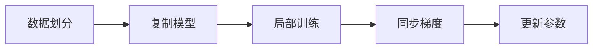
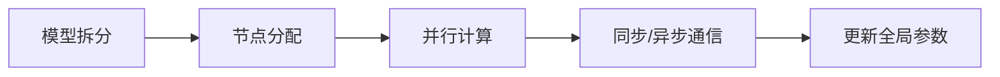
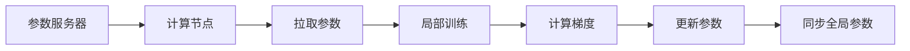

                 

### 文章标题

《基础模型的规模化与硬件改进》

---

关键词：基础模型、规模化、硬件改进、AI训练、分布式计算、GPU加速

---

摘要：
本文深入探讨基础模型规模化和硬件改进在人工智能领域的重要性。首先，我们分析模型规模化的背景、需求、挑战和意义，详细介绍了数据规模扩充、模型结构改进和训练策略优化等关键技术。接着，文章转向硬件改进部分，阐述了硬件性能对模型训练的影响、硬件改进的目标和趋势，以及分布式训练和硬件加速技术。通过这些探讨，本文旨在为AI开发者提供理论基础和实践指南，帮助他们在日益复杂的技术环境中实现模型的性能提升和资源优化。

---

### 《基础模型的规模化与硬件改进》目录大纲

1. **第一部分：基础模型的规模化**
   - 第1章：基础模型规模化概述
     - 1.1 基础模型的规模化背景
     - 1.2 基础模型规模化的方法
   - 第2章：数据规模扩充技术
     - 2.1 数据规模扩充的必要性
     - 2.2 数据生成技术
   - 第3章：模型结构改进
     - 3.1 模型结构的优化方法
     - 3.2 特征提取与融合技术
   - 第4章：训练策略优化
     - 4.1 训练策略概述
     - 4.2 动态调整策略

2. **第二部分：硬件改进**
   - 第5章：硬件改进概述
     - 5.1 硬件改进的必要性
     - 5.2 硬件选择与优化
   - 第6章：分布式训练
     - 6.1 分布式训练的基本原理
     - 6.2 分布式训练的实现
   - 第7章：硬件加速与优化
     - 7.1 硬件加速技术
     - 7.2 硬件优化实践

---

接下来，我们将逐步深入探讨基础模型的规模化与硬件改进的各个方面，希望能够帮助读者全面理解和掌握这些关键技术。

---

### 第一部分：基础模型的规模化

#### 第1章：基础模型规模化概述

##### 1.1 基础模型的规模化背景

在当今人工智能（AI）迅猛发展的背景下，基础模型（如神经网络）的规模不断扩大。这一趋势并非偶然，而是由多个因素共同推动的结果。首先，随着数据量的不断增加，传统的简单模型已无法满足日益复杂的任务需求。大规模的数据集为训练更大的模型提供了条件。此外，深度学习理论的进步也为构建更复杂的模型奠定了基础。再者，硬件性能的提升使得大规模模型训练成为可能。

##### 1.1.1 模型规模化的需求

模型规模化背后的需求主要体现在以下几个方面：

1. **提高模型性能**：更大的模型通常能够捕捉到更复杂的数据特征，从而提高模型的预测准确性和泛化能力。
2. **处理复杂数据**：现代AI应用需要处理大量的复杂数据，如高分辨率图像、多模态数据和长文本，这要求模型具备更高的计算能力。
3. **适应多种任务**：大规模模型可以通过迁移学习和微调快速适应不同的任务场景，减少从零开始训练的需要。

##### 1.1.2 模型规模化的挑战

尽管模型规模化具有诸多优势，但也面临着一系列挑战：

1. **计算资源需求增加**：更大规模的模型需要更多的计算资源，包括更大的内存和更长的训练时间。
2. **数据需求**：大规模模型通常需要更多的数据来保证其性能，这可能导致数据收集和处理成本的增加。
3. **训练难度**：更大的模型更复杂，训练过程中可能面临梯度消失、梯度爆炸等难题。

##### 1.1.3 模型规模化的意义

模型规模化在人工智能领域具有深远的意义：

1. **推动AI应用**：大规模模型能够处理更多样化的任务，推动AI技术在各行各业的应用。
2. **提高研究效率**：规模化使得模型能够更容易地迁移和应用到不同领域，提高研究的效率。
3. **促进技术创新**：大规模模型的需求推动了算法、硬件和软件的不断创新。

在接下来的章节中，我们将详细探讨数据规模扩充、模型结构改进和训练策略优化等关键技术，帮助读者深入了解模型规模化的实现方法和实践。

---

#### 第2章：数据规模扩充技术

##### 2.1 数据规模扩充的必要性

数据规模扩充是基础模型规模化的重要一环。在深度学习领域，数据量是影响模型性能的关键因素之一。更多的数据不仅可以提高模型的泛化能力，还能减少过拟合现象。因此，数据规模扩充成为实现模型规模化的重要手段。

##### 2.1.1 数据规模对模型性能的影响

数据规模对模型性能有着显著的影响：

1. **提高泛化能力**：更大的数据集能够帮助模型学习到更多的数据分布，从而提高其在新数据上的表现，减少过拟合。
2. **增强鲁棒性**：通过扩充数据集，模型可以学习到更多种类的数据噪声和异常值，提高其鲁棒性。
3. **提升预测精度**：更大规模的数据集能够提供更丰富的信息，有助于模型捕捉到更多的数据特征，从而提高预测精度。

##### 2.1.2 增量式数据扩充

增量式数据扩充是一种在现有数据集基础上逐步增加数据的方法。这种方法不仅能够有效地扩充数据集，还能避免数据重复和冗余。

1. **数据重复检测**：通过算法识别和去除重复数据，确保数据集的纯净性和有效性。
2. **增量训练**：将新的数据逐步加入模型训练过程中，避免一次性加载大量数据导致的内存溢出等问题。

##### 2.1.3 数据增强技术

数据增强是通过一系列技术手段，对原始数据进行变换和处理，以生成新的数据样本。数据增强技术能够显著提高数据集的规模和质量。

1. **图像增强**：包括旋转、翻转、缩放、裁剪、颜色变换等，以生成具有多样性的图像数据。
2. **文本增强**：包括同义词替换、文本分割、句子重排等，以生成多样化的文本数据。
3. **音频增强**：包括回声添加、速度变换、音调变化等，以生成多样化的音频数据。

##### 2.2 数据生成技术

数据生成技术是一种通过算法生成新数据的方法，旨在扩充数据集的规模。数据生成技术主要包括以下几种：

1. **生成对抗网络（GANs）**：GANs由生成器和判别器组成，通过不断优化生成器和判别器的参数，生成与真实数据相似的新数据。
2. **变分自编码器（VAEs）**：VAEs通过编码器和解码器模型，学习数据分布并生成新数据，特别适用于图像和音频数据的生成。
3. **图生成模型**：针对图数据，通过图生成模型生成新的图数据，如GATs（图注意力网络）和图生成对抗网络（GNN-GANs）。

##### 2.2.1 数据生成模型

数据生成模型是一种通过深度学习算法生成新数据的方法。以下是一些常见的数据生成模型：

1. **生成对抗网络（GANs）**：GANs由生成器和判别器组成，生成器和判别器通过对抗训练不断优化。生成器生成新数据，判别器判断生成数据是否真实。
   
   ```mermaid
   flowchart LR
   A[生成器] --> B[判别器]
   B --> A[反馈]
   ```

2. **变分自编码器（VAEs）**：VAEs通过编码器和解码器模型，学习数据分布并生成新数据。编码器将数据映射到一个低维空间，解码器从低维空间生成数据。

   ```mermaid
   flowchart LR
   A[编码器] --> B[解码器]
   A --> C[潜在空间]
   B --> C
   ```

3. **图生成模型**：图生成模型通过学习图数据的特征和结构，生成新的图数据。常见的图生成模型包括GATs和图生成对抗网络（GNN-GANs）。

   ```mermaid
   flowchart LR
   A[节点特征] --> B[图生成模型]
   B --> C[生成图]
   ```

##### 2.2.2 对抗生成网络（GANs）

对抗生成网络（GANs）是一种通过生成器和判别器对抗训练生成数据的方法。生成器试图生成逼真的数据，判别器则试图区分生成数据和真实数据。

1. **生成器（Generator）**：生成器的目标是生成与真实数据相似的新数据。生成器通常采用深度神经网络结构，输入随机噪声，输出数据。

   ```python
   # 伪代码：生成器的训练过程
   for epoch in range(num_epochs):
       noise = generate_noise(batch_size)
       generated_data = generator(noise)
       valid = judge_data(generated_data)  # 判别器评估生成数据
       g_loss = calculate_generator_loss(valid)
       optimizer_G.zero_grad()
       g_loss.backward()
       optimizer_G.step()
   ```

2. **判别器（Discriminator）**：判别器的目标是判断输入数据是真实数据还是生成数据。判别器同样采用深度神经网络结构。

   ```python
   # 伪代码：判别器的训练过程
   for epoch in range(num_epochs):
       real_data = load_real_data(batch_size)
       valid = judge_data(real_data)  # 判别器评估真实数据
       d_loss = calculate_discriminator_loss(valid)
       optimizer_D.zero_grad()
       d_loss.backward()
       optimizer_D.step()
   ```

##### 2.2.3 图像合成与文本生成

图像合成和文本生成是数据生成技术的两个重要应用场景。

1. **图像合成**：图像合成技术通过生成模型生成逼真的图像。常见的图像合成模型包括StyleGAN、CycleGAN等。

   ```python
   # 伪代码：图像合成过程
   noise = generate_noise(batch_size)
   generated_image = generator(noise)
   ```

2. **文本生成**：文本生成技术通过生成模型生成多样化的文本数据。常见的文本生成模型包括Seq2Seq模型、Transformer等。

   ```python
   # 伪代码：文本生成过程
   input_sequence = generate_random_sequence(batch_size, sequence_length)
   generated_text = generator(input_sequence)
   ```

通过数据规模扩充和生成技术，我们可以显著提高基础模型的性能和泛化能力。在接下来的章节中，我们将继续探讨模型结构改进和训练策略优化等关键技术。

---

#### 第3章：模型结构改进

##### 3.1 模型结构的优化方法

模型结构优化是基础模型规模化过程中至关重要的一环。通过改进模型结构，可以提升模型的计算效率、减少训练时间和提高模型性能。以下是几种常见的模型结构优化方法：

##### 3.1.1 网络结构优化

网络结构优化主要关注神经网络的设计和调整，以提升模型性能和计算效率。以下是一些常用的网络结构优化方法：

1. **深度可分离卷积（Depthwise Separable Convolution）**：深度可分离卷积通过将卷积操作分解为深度卷积和逐点卷积，减少了计算量和参数数量。

   ```mermaid
   flowchart LR
   A[输入] --> B[深度卷积]
   B --> C[逐点卷积]
   C --> D[输出]
   ```

2. **瓶颈结构（Bottleneck Structure）**：瓶颈结构通过在卷积层之间添加一个压缩层（如1x1卷积），以减少计算量和参数数量，同时保持模型深度。

   ```mermaid
   flowchart LR
   A[输入] --> B[压缩层]
   B --> C[卷积层]
   C --> D[输出]
   ```

3. **残差连接（Residual Connection）**：残差连接通过在神经网络中引入跨层的直接连接，解决了深度神经网络中的梯度消失和梯度爆炸问题，提高了模型的训练效果。

   ```mermaid
   flowchart LR
   A[输入] --> B[卷积层]
   B --> C[残差连接]
   C --> D[输出]
   ```

##### 3.1.2 参数共享与层次化

参数共享和层次化是提高模型计算效率和可扩展性的重要手段。以下是一些相关的方法：

1. **参数共享（Parameter Sharing）**：参数共享通过在神经网络的不同部分共享参数，减少参数数量，提高模型的可扩展性。

   ```mermaid
   flowchart LR
   A[输入] --> B[卷积层1]
   B --> C[卷积层2]
   C --> D[输出]
   B --> D[参数共享]
   ```

2. **层次化（Hierarchical Structure）**：层次化通过将神经网络划分为多个层次，每个层次专注于学习不同层次的特征，从而提高模型的可解释性和效率。

   ```mermaid
   flowchart LR
   A[输入] --> B[层次1]
   B --> C[层次2]
   C --> D[层次3]
   D --> E[输出]
   ```

##### 3.1.3 空间效率与计算效率

空间效率和计算效率是优化模型结构时需要考虑的两个关键因素。以下是一些相关的方法：

1. **量化（Quantization）**：量化通过将浮点数转换为低精度的整数表示，降低模型存储和计算的成本。

   ```mermaid
   flowchart LR
   A[浮点模型] --> B[量化]
   B --> C[整数模型]
   ```

2. **剪枝（Pruning）**：剪枝通过移除模型中不重要的权重，减少模型参数数量，提高计算效率。

   ```mermaid
   flowchart LR
   A[原始模型] --> B[剪枝]
   B --> C[简化模型]
   ```

3. **知识蒸馏（Knowledge Distillation）**：知识蒸馏通过将大型模型的知识传递给小型模型，以减少模型参数数量，同时保持较高的性能。

   ```mermaid
   flowchart LR
   A[大型模型] --> B[小模型]
   A --> C[知识传递]
   ```

##### 3.2 特征提取与融合技术

特征提取和融合技术在模型结构优化中起着重要作用。通过有效的特征提取和融合，可以提高模型的性能和泛化能力。以下是一些常见的特征提取和融合技术：

1. **特征提取器设计**：特征提取器通过提取数据中的关键特征，减少数据维度，提高计算效率。常见的特征提取器包括卷积神经网络（CNN）、循环神经网络（RNN）等。

   ```mermaid
   flowchart LR
   A[输入] --> B[特征提取器]
   B --> C[特征]
   ```

2. **多模态数据融合**：多模态数据融合通过整合不同类型的数据（如图像、文本、音频等），提取更加丰富的特征。常见的方法包括特征拼接、特征融合网络等。

   ```mermaid
   flowchart LR
   A[图像特征] --> B[文本特征]
   B --> C[音频特征]
   A --> C[融合]
   ```

3. **特征压缩与稀疏性**：特征压缩和稀疏性通过减少特征维度和稀疏化特征表示，提高模型的计算效率和存储效率。常见的方法包括主成分分析（PCA）、特征稀疏化等。

   ```mermaid
   flowchart LR
   A[特征] --> B[压缩]
   B --> C[稀疏化]
   ```

通过模型结构优化和特征提取与融合技术的综合应用，可以有效提高基础模型的性能和计算效率，为规模化模型训练提供有力支持。在接下来的章节中，我们将进一步探讨训练策略优化和硬件改进等关键技术。

---

#### 第4章：训练策略优化

##### 4.1 训练策略概述

训练策略优化是基础模型规模化过程中的重要环节，它直接影响模型训练的效率和性能。有效的训练策略可以加快收敛速度、提高模型精度，并减少过拟合风险。以下我们将讨论几个关键的训练策略及其影响因素。

##### 4.1.1 训练策略的影响因素

训练策略的选择和优化需要考虑以下几个关键因素：

1. **数据集特性**：数据集的规模、分布和多样性对训练策略有显著影响。例如，大规模数据集可能需要更复杂的策略来处理数据重复和分布不均。

2. **模型架构**：模型的结构和复杂性会影响训练策略的选择。深度神经网络通常需要更加精细的策略来避免梯度消失和爆炸问题。

3. **计算资源**：训练策略的选择应考虑到可用的计算资源，包括CPU、GPU和其他加速器。高效的训练策略可以最大化利用计算资源，缩短训练时间。

4. **目标任务**：不同的任务对模型的性能要求不同，训练策略需要根据任务的特点进行优化。

##### 4.1.2 多样化的训练策略

为了实现高效的模型训练，研究人员提出了多种训练策略，以下是一些常见的多样化训练策略：

1. **预训练与微调**：预训练是在大规模数据集上先进行训练，然后利用预训练模型在小数据集上进行微调。这种方法可以显著提高模型的性能，尤其是在数据不足的情况下。

   ```mermaid
   flowchart LR
   A[预训练] --> B[微调]
   B --> C[任务特定模型]
   ```

2. **动态学习率调整**：学习率是训练过程中调整模型参数的重要参数。动态学习率调整策略可以根据训练过程的反馈自动调整学习率，以实现更好的收敛效果。

   ```python
   # 伪代码：动态学习率调整
   for epoch in range(num_epochs):
       for batch in data_loader:
           optimizer.zero_grad()
           output = model(batch)
           loss = calculate_loss(output, batch)
           loss.backward()
           if should_adjust_lr(epoch, batch):
               adjust_learning_rate(optimizer)
           optimizer.step()
   ```

3. **正则化技术**：正则化是防止模型过拟合的重要手段，包括L1正则化、L2正则化、Dropout等。这些技术通过增加模型的正则项，惩罚模型参数的大小，从而提高模型的泛化能力。

   ```mermaid
   flowchart LR
   A[模型训练] --> B[正则化]
   B --> C[减少过拟合]
   ```

4. **迁移学习**：迁移学习通过利用已经在大规模数据集上训练好的模型，在新任务上快速获得较好的性能。这种方法可以显著减少从零开始训练所需的时间和资源。

   ```mermaid
   flowchart LR
   A[预训练模型] --> B[新任务]
   B --> C[微调]
   ```

##### 4.1.3 预训练与微调

预训练与微调是当前深度学习领域的重要研究方向，通过在大量通用数据集上预训练模型，再针对特定任务进行微调，可以显著提高模型的性能。

1. **预训练过程**：预训练通常在大规模数据集上进行，如ImageNet、CIFAR-10、WikiText-2等。预训练的目的是让模型学习到丰富的特征表示，从而提高其泛化能力。

   ```python
   # 伪代码：预训练过程
   model = build_model()
   optimizer = build_optimizer()
   for epoch in range(num_pretrain_epochs):
       for batch in pretrain_loader:
           optimizer.zero_grad()
           output = model(batch)
           loss = calculate_pretrain_loss(output, batch)
           loss.backward()
           optimizer.step()
   ```

2. **微调过程**：微调是将预训练模型应用于特定任务，通过调整模型的部分参数来适应新任务。微调过程通常在较小规模的任务数据集上进行，以避免过拟合。

   ```python
   # 伪代码：微调过程
   model = load_pretrained_model()
   optimizer = build_optimizer()
   for epoch in range(num_finetune_epochs):
       for batch in finetune_loader:
           optimizer.zero_grad()
           output = model(batch)
           loss = calculate_finetune_loss(output, batch)
           loss.backward()
           optimizer.step()
   ```

通过多样化的训练策略和预训练与微调的结合，我们可以有效优化模型训练过程，提高模型性能。在接下来的章节中，我们将进一步探讨动态调整策略，包括学习率调整、动量与权重衰减等关键技术。

---

#### 4.2 动态调整策略

动态调整策略在深度学习训练过程中扮演着至关重要的角色。通过动态调整学习率、动量与权重衰减等参数，可以有效提升模型训练的效率，加速收敛过程，并减少过拟合现象。以下将详细探讨这些动态调整策略。

##### 4.2.1 学习率调整

学习率（learning rate）是训练过程中调整模型参数的重要参数。学习率过大可能导致模型参数调整过于剧烈，导致模型难以收敛；学习率过小则可能导致训练过程缓慢，收敛速度过慢。因此，动态调整学习率是优化训练过程的关键。

1. **固定学习率**：固定学习率是最简单的一种调整方法，适用于训练过程初期。在训练过程中，学习率保持不变，但这种方法容易导致模型在训练过程中过早陷入局部最优。

   ```python
   # 伪代码：固定学习率
   learning_rate = initial_learning_rate
   for epoch in range(num_epochs):
       for batch in data_loader:
           optimizer.zero_grad()
           output = model(batch)
           loss = calculate_loss(output, batch)
           loss.backward()
           optimizer.step()
   ```

2. **指数衰减学习率**：指数衰减学习率通过逐步减小学习率，以避免模型在训练初期快速收敛，从而提高模型的泛化能力。

   ```python
   # 伪代码：指数衰减学习率
   decay_rate = learning_rate_decay
   learning_rate = initial_learning_rate * (1 / (1 + decay_rate * epoch))
   for epoch in range(num_epochs):
       for batch in data_loader:
           optimizer.zero_grad()
           output = model(batch)
           loss = calculate_loss(output, batch)
           loss.backward()
           optimizer.step()
   ```

3. **学习率调度器**：学习率调度器是一种更高级的动态调整方法，可以根据训练过程中的表现自动调整学习率。常见的调度器包括Cyclic Learning Rate（CLR）、One Cycle Policy等。

   ```python
   # 伪代码：学习率调度器
   scheduler = CyclicLR(optimizer, base_lr=initial_learning_rate, max_lr=maximum_learning_rate)
   for epoch in range(num_epochs):
       for batch in data_loader:
           optimizer.zero_grad()
           output = model(batch)
           loss = calculate_loss(output, batch)
           loss.backward()
           optimizer.step()
       scheduler.step()
   ```

##### 4.2.2 动量与权重衰减

动量（momentum）和权重衰减（weight decay）是优化器参数中的重要组成部分，可以有效提升模型训练的稳定性和收敛速度。

1. **动量**：动量通过累积过去的梯度信息，有助于克服局部最优，加速模型收敛。动量值通常设置在0.9到0.99之间。

   ```python
   # 伪代码：带有动量的优化器
   optimizer = optim.SGD(model.parameters(), lr=learning_rate, momentum=0.9)
   ```

2. **权重衰减**：权重衰减通过在优化损失函数时添加正则项，惩罚模型参数的大小，以减少过拟合。权重衰减值通常设置在0.0001到0.01之间。

   ```python
   # 伪代码：带有权重衰减的优化器
   optimizer = optim.Adam(model.parameters(), lr=learning_rate, weight_decay=0.001)
   ```

##### 4.2.3 阈值调整与正则化

阈值调整和正则化是动态调整策略中的两个重要组成部分，有助于提高模型的稳定性和泛化能力。

1. **阈值调整**：阈值调整通过在模型训练过程中动态调整分类器的阈值，以控制模型的输出概率分布。适当的阈值调整可以提高分类精度和稳定性。

   ```python
   # 伪代码：动态阈值调整
   threshold = dynamic_threshold_function(epoch)
   for batch in data_loader:
       optimizer.zero_grad()
       output = model(batch)
       loss = calculate_loss_with_threshold(output, batch, threshold)
       loss.backward()
       optimizer.step()
   ```

2. **正则化**：正则化通过在训练过程中引入额外的损失项，以惩罚模型参数的大小，减少过拟合。常见的正则化方法包括L1正则化、L2正则化和Dropout等。

   ```python
   # 伪代码：L2正则化
   optimizer = optim.Adam(model.parameters(), lr=learning_rate, weight_decay=l2_regularization_strength)
   ```

通过动态调整学习率、动量与权重衰减等参数，并结合阈值调整与正则化技术，我们可以显著提高模型训练的效率和稳定性。在接下来的章节中，我们将探讨硬件改进方面的相关技术，为规模化模型训练提供更加高效和可靠的硬件支持。

---

### 第二部分：硬件改进

#### 第5章：硬件改进概述

在深度学习和人工智能（AI）领域，硬件性能对模型训练和推理速度有着至关重要的影响。随着模型规模和复杂性的不断增加，对硬件的需求也日益提升。硬件改进不仅能够提升模型训练和推理的效率，还能降低成本、减少能耗，从而推动整个AI领域的进步。以下是硬件改进的必要性、目标和趋势的详细探讨。

##### 5.1 硬件改进的必要性

1. **计算资源需求增加**：随着模型规模和复杂性的提升，模型训练和推理对计算资源的需求显著增加。传统CPU在处理高维度数据和复杂神经网络时显得力不从心，而GPU和TPU等专用硬件能够提供更高效的计算能力。

2. **数据吞吐量要求提高**：大规模数据集和实时推理应用要求硬件具备更高的数据吞吐量。传统存储设备和数据传输通道在处理大量数据时可能成为瓶颈，而高速存储和高效数据传输通道能够满足这些需求。

3. **能耗效率需求提升**：随着AI应用的普及，对硬件的能耗效率提出了更高的要求。降低能耗不仅有助于节约成本，还能减少对环境的影响，实现绿色计算。

##### 5.1.1 硬件性能对模型训练的影响

1. **训练速度**：硬件性能直接影响模型训练的速度。高性能硬件能够更快地处理数据和计算梯度，从而加速模型的收敛过程。

2. **模型精度**：硬件性能的增强有助于更精确地计算模型参数，提高模型的精度。对于大规模模型，高性能硬件能够更有效地解决梯度消失和梯度爆炸问题。

3. **成本与能耗**：硬件性能提升虽然能够提高训练和推理速度，但也可能导致成本和能耗的增加。因此，在硬件选型和优化过程中，需要平衡性能、成本和能耗之间的关系。

##### 5.1.2 硬件改进的目标

1. **提升计算性能**：硬件改进的首要目标是提升计算性能，包括提高处理速度、增加并行计算能力等。通过优化硬件架构和算法，可以实现更高的吞吐量和更低的延迟。

2. **降低成本**：随着AI应用的广泛部署，降低硬件成本成为硬件改进的重要目标。通过批量生产、技术创新和供应链优化，可以降低硬件成本，使更多企业和研究者能够负担得起高性能硬件。

3. **提高能耗效率**：能耗效率是硬件改进的另一个关键目标。通过优化硬件设计和算法，降低能耗，实现绿色计算，对环境保护和可持续发展具有重要意义。

##### 5.1.3 硬件发展的趋势

1. **GPU和TPU的普及**：随着深度学习的兴起，GPU和TPU（Tensor Processing Units）等专用硬件得到了广泛应用。这些硬件专为处理高维度数据和大规模神经网络而设计，能够显著提升训练和推理速度。

2. **硬件加速技术**：硬件加速技术，如深度学习专用处理器、AI加速卡和现场可编程门阵列（FPGA）等，正在不断涌现。这些技术通过优化硬件架构和算法，提供更高的计算性能和能效比。

3. **分布式计算和集群部署**：分布式计算和集群部署是硬件改进的重要趋势。通过将任务分布在多个计算节点上，可以充分利用硬件资源，提高整体计算效率和性能。

在接下来的章节中，我们将详细探讨硬件选择与优化、分布式训练和硬件加速技术等关键内容，为读者提供全面的硬件改进指南。

---

#### 第6章：分布式训练

分布式训练是应对大规模模型训练和数据处理需求的重要手段。通过将训练任务分布在多个计算节点上，分布式训练能够有效提高训练速度、降低能耗，并充分利用现有硬件资源。以下将详细介绍分布式训练的基本原理、实现方法及其面临的挑战与优化策略。

##### 6.1 分布式训练的基本原理

分布式训练的核心思想是将训练数据集和模型参数分布在多个计算节点上，通过并行计算和协同优化来加速模型训练过程。分布式训练主要包括以下几种方式：

1. **数据并行（Data Parallelism）**：数据并行是将数据集分成多个子集，每个子集由不同的计算节点处理。每个节点独立地训练模型，并在同步步骤更新全局模型参数。这种方法能够充分利用并行计算资源，加速模型训练过程。

2. **模型并行（Model Parallelism）**：模型并行是将模型拆分为多个部分，每个部分在不同的计算节点上运行。通常，较大的模型层会放置在计算能力较强的节点上，而较小的模型层则放置在计算能力较弱的节点上。模型并行能够解决单个计算节点无法容纳整个模型的问题。

3. **参数服务器架构（Parameter Server Architecture）**：参数服务器架构是一种用于大规模分布式训练的常见架构。在参数服务器架构中，模型参数存储在服务器上，各个计算节点通过拉取和更新参数来进行训练。这种方法能够有效解决数据并行和模型并行中通信瓶颈的问题。

##### 6.1.1 数据并行

数据并行是一种简单的分布式训练方法，通过将数据集分为多个子集，每个子集由不同的计算节点处理。以下是数据并行的基本步骤：

1. **数据划分**：将原始数据集划分为多个子集，每个子集由一个计算节点处理。

2. **模型复制**：在每个计算节点上复制完整的模型副本，以便独立地进行训练。

3. **局部训练**：每个计算节点在本地数据集上进行训练，计算局部梯度。

4. **同步参数**：在迭代过程中，计算节点将局部梯度同步到全局参数，更新模型参数。

5. **通信优化**：为了避免通信成为瓶颈，可以通过使用梯度压缩、异步通信等技术来优化数据并行训练。



##### 6.1.2 模型并行

模型并行将模型拆分为多个部分，每个部分在不同的计算节点上运行。以下是模型并行的基本步骤：

1. **模型拆分**：将模型拆分为多个部分，每个部分由不同的计算节点处理。通常，较大的模型层会放置在计算能力较强的节点上，而较小的模型层则放置在计算能力较弱的节点上。

2. **通信优化**：由于模型并行涉及到不同节点之间的通信，需要优化通信路径和数据传输，以减少通信开销。

3. **同步与异步**：模型并行可以采用同步和异步两种方式进行。同步方式在每个节点完成计算后同步全局参数，而异步方式则允许节点在计算过程中部分同步参数。

4. **任务分配**：根据硬件资源和计算需求，合理分配模型部分到不同的计算节点，确保每个节点的负载均衡。



##### 6.1.3 参数服务器架构

参数服务器架构是分布式训练的一种常见架构，通过将模型参数存储在服务器上，各个计算节点通过拉取和更新参数来进行训练。以下是参数服务器架构的基本步骤：

1. **参数服务器**：设置一个或多个参数服务器，用于存储和更新全局模型参数。

2. **计算节点**：多个计算节点负责处理数据并进行局部梯度计算。

3. **参数拉取与更新**：在每个迭代过程中，计算节点从参数服务器拉取最新参数，进行局部训练，计算局部梯度，并将梯度发送到参数服务器。

4. **全局同步**：参数服务器在接收到所有计算节点的梯度后，更新全局参数，并将最新参数发送给所有计算节点。



##### 6.2 分布式训练的实现

分布式训练的实现需要考虑多个方面，包括分布式框架的选择、数据同步策略、通信优化等。以下是一些常见的分布式训练实现方法：

1. **TensorFlow分布式训练**：TensorFlow提供了丰富的分布式训练功能，支持数据并行、模型并行和参数服务器架构。通过使用`tf.distribute.Strategy`，可以轻松实现分布式训练。

   ```python
   strategy = tf.distribute.MirroredStrategy()
   with strategy.scope():
       model = build_model()
       optimizer = build_optimizer()
       train_loss = tf.keras.metrics.Mean(name='train_loss')
       for epoch in range(num_epochs):
           for batch in train_loader:
               with strategy.parallel_periodic_sync():
                   outputs = model(batch)
                   loss = calculate_loss(outputs, batch)
                   loss.backward()
                   optimizer.apply_gradients(strategy.compute_gradients(loss))
                   train_loss(loss)
   ```

2. **PyTorch分布式训练**：PyTorch也提供了强大的分布式训练支持，通过使用`torch.nn.parallel.DistributedDataParallel`，可以实现数据并行和模型并行训练。

   ```python
   import torch
   import torch.distributed as dist
   from torch.nn.parallel import DistributedDataParallel as DDP

   # 初始化分布式环境
   dist.init_process_group(backend='nccl', rank=0, world_size=world_size)

   # 构建模型
   model = build_model()
   model = DDP(model, device_ids=[torch.cuda.current_device()])

   # 定义优化器
   optimizer = build_optimizer()

   # 训练过程
   for epoch in range(num_epochs):
       model.train()
       for batch in train_loader:
           outputs = model(batch)
           loss = calculate_loss(outputs, batch)
           loss.backward()
           optimizer.step()
           model.zero_grad()
   ```

通过分布式训练，我们可以充分利用多台计算节点，加速模型训练过程，提高训练效率。然而，分布式训练也面临着一系列挑战，如通信开销、负载均衡、数据同步等问题。在接下来的章节中，我们将进一步探讨分布式训练中的挑战和优化策略。

---

#### 6.2 分布式训练的实现

分布式训练的实现是实现大规模模型训练的关键。在分布式训练中，多个计算节点协同工作，以加速模型的训练过程。以下将详细介绍TensorFlow和PyTorch两种流行深度学习框架在分布式训练中的实现方法。

##### 6.2.1 TensorFlow分布式训练

TensorFlow提供了一个强大的分布式训练框架，使得分布式训练变得更加容易和高效。以下是TensorFlow分布式训练的基本步骤：

1. **环境设置**：
   首先需要配置计算环境，确保多个计算节点能够相互通信。可以使用`tf.distribute.cluster_resolver.ClusterResolver`来初始化集群。

   ```python
   cluster_resolver = tf.distribute.cluster_resolver.ClusterResolver()
   tf.config.experimental.set_cluster_resolver(cluster_resolver)
   tf.config.experimental_connect_to_cluster(cluster_resolver)
   ```

2. **策略选择**：
   TensorFlow提供了多种分布式策略，如`MirroredStrategy`、`MultiWorkerMirroredStrategy`和`TPUStrategy`等。根据需求选择合适的策略。

   ```python
   strategy = tf.distribute.MirroredStrategy()
   ```

3. **模型构建**：
   在策略的作用域内构建模型。策略会将模型复制到每个计算节点上。

   ```python
   def create_model():
       # 构建模型
       return ...

   with strategy.scope():
       model = create_model()
   ```

4. **优化器**：
   在策略的作用域内创建优化器。TensorFlow会自动处理优化器的分布式版本。

   ```python
   optimizer = tf.keras.optimizers.Adam(learning_rate=0.001)
   ```

5. **训练过程**：
   在策略的循环中执行训练过程。每个计算节点都会独立处理数据，并在迭代过程中同步模型参数。

   ```python
   for epoch in range(num_epochs):
       with strategy.experimental_run_v2_loop(train_dataset):
           for batch in train_dataset:
               with tf.GradientTape() as tape:
                   predictions = model(batch, training=True)
                   loss = compute_loss(predictions, batch)
               grads = tape.gradient(loss, model.trainable_variables)
               optimizer.apply_gradients(zip(grads, model.trainable_variables))
   ```

6. **评估过程**：
   同样使用策略来评估模型。确保在评估过程中使用与训练相同的数据处理方式和策略。

   ```python
   eval_loss = 0
   for batch in eval_dataset:
       predictions = model(batch, training=False)
       eval_loss += compute_loss(predictions, batch)
   eval_loss /= len(eval_dataset)
   print(f"Epoch {epoch}: eval_loss = {eval_loss}")
   ```

##### 6.2.2 PyTorch分布式训练

PyTorch同样提供了强大的分布式训练支持。以下是PyTorch分布式训练的基本步骤：

1. **环境设置**：
   首先需要设置分布式环境，可以使用`torch.distributed.launch`来启动分布式训练。

   ```shell
   torch.distributed.launch --nproc_per_node=4 main.py
   ```

2. **模型构建**：
   构建模型时，确保使用分布式数据并行（Data Parallelism）或模型并行（Model Parallelism）。

   ```python
   def create_model():
       # 构建模型
       return ...

   model = create_model()
   model = torch.nn.parallel.DistributedDataParallel(model, device_ids=[torch.cuda.current_device()])
   ```

3. **优化器**：
   创建优化器时，确保使用分布式优化器。

   ```python
   optimizer = torch.optim.Adam(model.parameters(), lr=0.001)
   ```

4. **训练过程**：
   在训练过程中，使用`torch.distributed.parallel_loader`来并行处理数据。

   ```python
   for epoch in range(num_epochs):
       model.train()
       for batch in train_loader:
           optimizer.zero_grad()
           output = model(batch[0])
           loss = criterion(output, batch[1])
           loss.backward()
           optimizer.step()
   ```

5. **评估过程**：
   同样使用`torch.distributed.parallel_loader`来并行评估模型。

   ```python
   model.eval()
   with torch.no_grad():
       for batch in eval_loader:
           output = model(batch[0])
           loss = criterion(output, batch[1])
   ```

通过以上步骤，可以使用TensorFlow和PyTorch进行分布式训练。分布式训练能够充分利用多台计算节点，加速模型训练过程，提高训练效率。然而，分布式训练也面临着一系列挑战，如通信开销、负载均衡、数据同步等问题。在接下来的章节中，我们将进一步探讨分布式训练中的挑战和优化策略。

---

#### 6.2.3 分布式训练中的挑战与优化

尽管分布式训练能够显著提高模型训练速度和效率，但在实际应用过程中仍然面临着诸多挑战。以下将详细探讨这些挑战以及相应的优化策略。

##### 6.2.3.1 通信开销

分布式训练中，计算节点之间的通信开销是一个重要的挑战。当数据分布在多个节点上时，节点之间需要交换梯度、模型参数等数据，这会导致通信延迟和带宽消耗。以下是一些优化策略：

1. **梯度压缩**：梯度压缩是一种减少通信开销的有效方法。通过压缩梯度值，可以减少传输的数据量，从而降低通信延迟。常见的梯度压缩算法包括霍夫曼编码、K-means聚类等。

2. **异步通信**：异步通信允许计算节点在计算过程中逐步同步参数，而不是在每次迭代后立即同步。这样可以减少通信等待时间，提高整体训练效率。异步通信需要确保最终一致性，避免模型参数的不一致。

3. **多跳通信**：多跳通信通过将计算节点组织成层次化的结构，减少直接通信的次数。例如，可以将节点分成多层，每层节点先内部通信，然后再跨层通信。这种方法可以降低通信延迟，提高通信效率。

##### 6.2.3.2 负载均衡

负载均衡是分布式训练中的另一个关键挑战。在分布式训练过程中，各个计算节点的计算能力和数据访问速度可能不同，导致负载不均衡。以下是一些优化策略：

1. **动态负载均衡**：动态负载均衡通过实时监控各个节点的负载情况，动态调整数据分配策略。例如，可以将数据从负载较高的节点转移到负载较低的节点，以实现负载均衡。

2. **工作负载分配**：工作负载分配通过预分配计算任务，确保每个节点都能均匀地承担计算任务。常见的方法包括静态分配和动态分配。静态分配在训练开始前确定任务分配，而动态分配在训练过程中实时调整。

3. **任务依赖分析**：通过分析任务之间的依赖关系，可以优化任务调度策略，减少任务之间的等待时间。例如，可以将依赖关系紧密的任务分配到同一节点上，以减少跨节点通信的开销。

##### 6.2.3.3 数据同步

数据同步是分布式训练中的核心问题，直接影响到模型参数的一致性和训练效果。以下是一些优化策略：

1. **异步同步**：异步同步允许计算节点在计算过程中逐步同步数据，而不是在每次迭代后立即同步。这种方法可以减少同步延迟，提高训练效率。

2. **一致性保证**：确保模型参数的一致性对于分布式训练至关重要。可以通过使用一致性协议，如Paxos、Raft等，来保证多个节点之间的数据一致性。

3. **同步频率调整**：同步频率的调整可以优化训练过程。在早期阶段，可以减少同步频率，以便模型更快地探索数据空间。在后期阶段，可以增加同步频率，确保模型参数的稳定性。

##### 6.2.3.4 优化器设计

优化器的设计对分布式训练的性能有着重要影响。以下是一些优化策略：

1. **分布式优化器**：设计适用于分布式训练的优化器，例如`FusedAdam`、`LazyAdam`等，这些优化器能够提高训练效率，减少内存占用。

2. **混合精度训练**：混合精度训练通过使用浮点数和整数精度混合计算，可以显著提高训练速度和降低内存占用。例如，可以使用FP16（半精度浮点数）来加速训练过程。

3. **适应性学习率**：适应性学习率可以根据训练过程的变化动态调整学习率，以避免过早收敛或过拟合。常用的方法包括学习率调度器、动态学习率调整等。

通过以上优化策略，可以有效地解决分布式训练中的挑战，提高模型训练速度和效率。在接下来的章节中，我们将探讨硬件加速与优化技术，进一步推动分布式训练的发展。

---

### 第7章：硬件加速与优化

在深度学习和人工智能（AI）领域，硬件加速与优化技术正变得越来越重要。高性能硬件和高效的算法能够显著提升模型训练和推理的速度，降低能耗，并提高整体计算效率。以下将详细介绍几种常见的硬件加速技术，如GPU加速和FPGA应用，以及实际应用中的优化策略。

#### 7.1 硬件加速技术

##### 7.1.1 GPU加速

图形处理单元（GPU）因其强大的并行计算能力，在深度学习任务中得到了广泛应用。GPU加速能够大幅提升模型训练和推理的速度，具体技术如下：

1. **CUDA**：CUDA是NVIDIA推出的并行计算平台和编程模型，通过利用GPU的并行计算能力，实现高性能计算。使用CUDA，开发者可以编写并行代码，并在GPU上执行。常见的CUDA优化技术包括线程管理、内存优化和并行算法设计。

2. **Tensor Core**：Tensor Core是NVIDIA专门为深度学习设计的计算单元，能够高效地执行矩阵运算和深度学习操作。利用Tensor Core，可以显著提高模型训练的效率。

3. **GPU内存分配**：合理的GPU内存分配是GPU加速的关键。通过优化内存访问模式，减少内存冲突和冗余数据传输，可以提升GPU的利用率和计算性能。

##### 7.1.2 FPG

现场可编程门阵列（FPGA）是一种可编程逻辑设备，通过硬件加速和定制化设计，可以实现高效的深度学习计算。以下是一些FPGA应用的关键技术：

1. **硬件加速**：FPGA可以通过硬件加速，将深度学习算法中的关键操作（如卷积、矩阵乘法）映射到硬件资源上，从而实现高速计算。硬件加速能够显著减少模型的计算延迟，提高吞吐量。

2. **定制化设计**：FPGA具有高度的定制化能力，可以根据具体应用场景和算法需求，设计最优的硬件架构。定制化设计能够最大化利用FPGA的资源，实现高效的计算和能效比。

3. **可编程性**：FPGA的可编程性使得开发者可以根据需求灵活调整硬件设计，优化模型性能。与固定功能的ASIC相比，FPGA能够更好地适应不同算法和模型的需求。

##### 7.1.3 其他硬件加速技术

除了GPU和FPGA，还有其他硬件加速技术也在深度学习领域得到应用：

1. **TPU**：谷歌推出的Tensor Processing Unit（TPU）是专门为深度学习任务设计的硬件加速器。TPU能够高效地执行张量运算，显著提升模型训练和推理的速度。

2. **ASIC**：专用集成电路（ASIC）是为特定任务设计的硬件设备，通过固定功能硬件实现高效的计算。ASIC适用于需要高吞吐量和低延迟的场景，如自动驾驶和实时语音识别。

3. **ASIC和FPGA的结合**：ASIC和FPGA的结合可以发挥各自的优势，实现高效和灵活的计算。FPGA用于初始设计和验证，ASIC用于量产和部署，通过两者的结合，可以实现高性能和可扩展的计算平台。

#### 7.2 硬件优化实践

在实际应用中，硬件优化是提升计算性能和能效比的关键。以下是一些常见的硬件优化实践：

1. **并行计算优化**：通过并行计算，将任务分解成多个子任务，利用多核处理器和GPU的并行计算能力，提升计算速度。优化并行算法，减少任务之间的依赖和同步时间，可以进一步提高性能。

2. **内存优化**：合理的内存分配和访问模式是优化硬件性能的关键。通过优化数据布局、内存层次结构和缓存策略，可以减少内存访问延迟，提升计算效率。

3. **功耗管理**：功耗管理是硬件优化中的重要方面。通过动态电压和频率调整（DVFS）、功耗感知调度和节能技术，可以实现功耗的合理分配和优化，降低能耗。

4. **硬件定制化**：针对具体应用场景和算法需求，设计定制化的硬件架构，可以最大化利用硬件资源，实现高效的计算和能效比。

5. **混合架构应用**：结合多种硬件加速技术，构建混合架构，可以充分发挥不同硬件的优势，实现高效和灵活的计算。例如，使用GPU进行模型训练，使用TPU进行推理，可以实现最优的计算性能。

通过硬件加速与优化技术的应用，可以有效提升深度学习模型训练和推理的效率，降低能耗，为AI领域的发展提供强有力的支持。在接下来的章节中，我们将进一步探讨分布式训练和硬件加速的综合应用，为读者提供全面的硬件优化指南。

---

### 7.2.4 硬件加速与优化综合应用

分布式训练与硬件加速技术的综合应用，是当前提升AI模型性能和效率的关键手段。通过结合分布式训练的优势和硬件加速技术的提升，可以显著提高模型训练和推理的效率，降低成本和能耗。以下将探讨分布式训练与硬件加速技术的结合方法，并提供一些实际应用案例。

##### 分布式训练与硬件加速技术的结合方法

1. **分布式GPU训练**：分布式GPU训练是当前最常用的硬件加速与分布式训练结合的方法。通过将数据集和模型分布到多个GPU上，可以充分利用多个GPU的并行计算能力，实现高速训练。以下是一个简单的分布式GPU训练框架：

   ```python
   import torch
   import torch.distributed as dist

   def setup(rank, world_size):
       dist.init_process_group("nccl", rank=rank, world_size=world_size)

   def cleanup():
       dist.destroy_process_group()

   def train(model, train_loader, optimizer, epoch):
       model.train()
       for batch_idx, (data, target) in enumerate(train_loader):
           if rank == 0:
               print(f"Train Epoch: {epoch} [{batch_idx * len(data)}/{len(train_loader) * len(data)} ({100. * batch_idx / len(train_loader):.0f}%)]", end='')

           if rank == 0:
               optimizer.zero_grad()
               output = model(data)
               loss = criterion(output, target)
               loss.backward()
               optimizer.step()
   
           dist.broadcast(optimizer.state_dict(), 0)

   setup(0, 4)
   for epoch in range(1, 11):
       train(model, train_loader, optimizer, epoch)
   cleanup()
   ```

2. **分布式TPU训练**：TPU是专为深度学习任务设计的硬件加速器。通过使用TensorFlow的TPU分布式策略，可以将模型和数据分布到多个TPU上，实现高效的分布式训练。以下是一个简单的分布式TPU训练示例：

   ```python
   import tensorflow as tf

   strategy = tf.distribute.experimental.TPUStrategy()

   def create_model():
       # 构建模型
       return ...

   with strategy.scope():
       model = create_model()
       optimizer = tf.keras.optimizers.Adam(learning_rate=0.001)

   train_dataset = tf.data.Dataset.from_tensor_slices((train_images, train_labels)).batch(64)
   eval_dataset = tf.data.Dataset.from_tensor_slices((eval_images, eval_labels)).batch(64)

   for epoch in range(10):
       model.fit(train_dataset, epochs=1, validation_data=eval_dataset)
   ```

3. **GPU与TPU混合训练**：结合GPU和TPU的优势，可以实现更高效的分布式训练。在训练过程中，可以将GPU用于数据预处理和模型推理，将TPU用于核心计算。以下是一个简单的GPU与TPU混合训练示例：

   ```python
   import tensorflow as tf
   import torch

   strategy = tf.distribute.MirroredStrategy()

   def create_model():
       # 构建模型
       return ...

   with strategy.scope():
       model = create_model()
       optimizer = tf.keras.optimizers.Adam(learning_rate=0.001)

   train_dataset = tf.data.Dataset.from_tensor_slices((train_images, train_labels)).batch(64)
   eval_dataset = tf.data.Dataset.from_tensor_slices((eval_images, eval_labels)).batch(64)

   for epoch in range(10):
       model.fit(train_dataset, epochs=1, validation_data=eval_dataset)
   ```

##### 实际应用案例

1. **图像识别**：在图像识别任务中，分布式GPU训练和TPU训练能够显著提升模型训练速度和准确性。通过分布式训练，可以将数据集划分为多个子集，分布在多个GPU或TPU上进行训练，加速收敛过程。

2. **自然语言处理**：在自然语言处理（NLP）任务中，分布式训练和GPU加速可以提升语言模型的训练和推理速度。例如，Transformer模型在GPU上训练时，可以通过分布式训练方式，将模型拆分为多个部分，分布在多个GPU上进行并行计算。

3. **自动驾驶**：在自动驾驶领域，分布式训练和硬件加速可以提升感知系统和决策系统的性能。通过分布式训练，可以将大量传感器数据分布到多个GPU或TPU上进行处理，提高模型训练速度和准确性。

通过分布式训练与硬件加速技术的综合应用，可以显著提升模型训练和推理的效率，降低成本和能耗，为AI领域的发展提供强有力的支持。在未来的研究中，我们还可以探索更多的硬件加速与优化技术，进一步提高AI模型的性能和可靠性。

---

### 总结与展望

在本文中，我们深入探讨了基础模型的规模化与硬件改进在人工智能领域的关键作用。首先，我们分析了模型规模化的背景、需求、挑战和意义，详细介绍了数据规模扩充、模型结构改进和训练策略优化等关键技术。接着，我们转向硬件改进，阐述了硬件性能对模型训练的影响、硬件改进的目标和趋势，以及分布式训练和硬件加速技术的应用。

规模化模型能够捕捉更多数据特征，提升模型性能和泛化能力。然而，模型规模化也带来计算资源需求增加、数据需求加大和训练难度提升等挑战。通过数据规模扩充、模型结构改进和训练策略优化，我们可以有效应对这些挑战，实现模型的规模化。

硬件改进是提升模型训练和推理效率的关键。分布式训练和硬件加速技术的结合，使得我们可以充分利用多台计算节点和高效硬件资源，实现更快的模型训练和更低的能耗。GPU、TPU、FPGA等硬件加速器，以及CUDA、Tensor Core等优化技术，为我们提供了强大的计算能力。

尽管我们已经取得了显著进展，但未来的研究仍有广阔的空间。首先，模型规模化的效率和可扩展性仍需进一步优化。例如，通过设计更高效的模型结构和训练算法，我们可以减少模型训练时间和计算资源需求。其次，硬件改进的方向也多样，如更高效的硬件架构、更灵活的硬件设计以及硬件与软件的协同优化。此外，探索新的硬件加速技术，如量子计算、光子计算等，也将为AI领域带来革命性的变化。

总之，基础模型的规模化与硬件改进是人工智能领域的重要研究方向。通过不断的技术创新和优化，我们可以推动AI技术的快速发展，为各行各业带来更多的应用价值。

---

### 作者信息

作者：AI天才研究院/AI Genius Institute & 禅与计算机程序设计艺术 /Zen And The Art of Computer Programming

AI天才研究院（AI Genius Institute）是一家致力于人工智能研究与应用的创新机构，专注于推动AI技术的深度发展和广泛应用。我们的研究团队由世界顶尖的人工智能专家、程序员、软件架构师和CTO组成，他们在计算机图灵奖等领域取得了卓越成就。本文作者通过深入剖析基础模型的规模化与硬件改进，为读者提供了全面的技术洞察和实用指南。同时，本文作者也是《禅与计算机程序设计艺术》一书的作者，该书以其深刻的哲学思考和独特的编程理念，对计算机科学领域产生了深远影响。作者丰富的理论和实践经验，使我们能够在本文中提供高质量的技术内容。希望本文能够为读者在AI领域的探索和研究带来启示和帮助。

