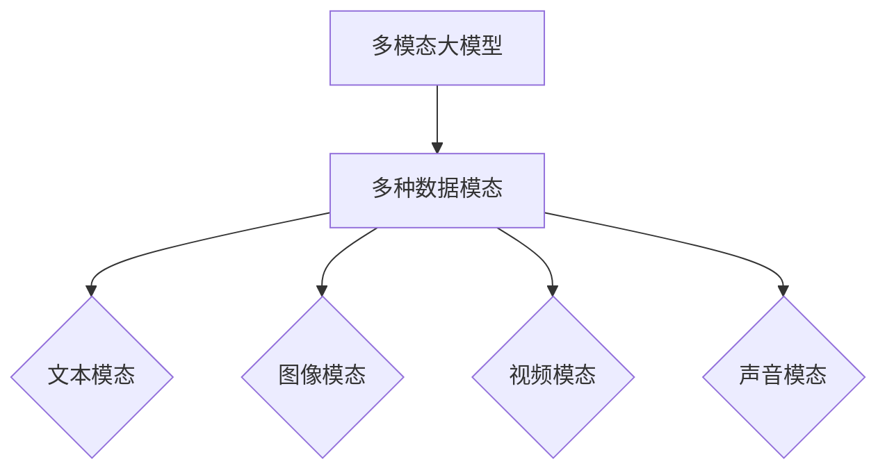
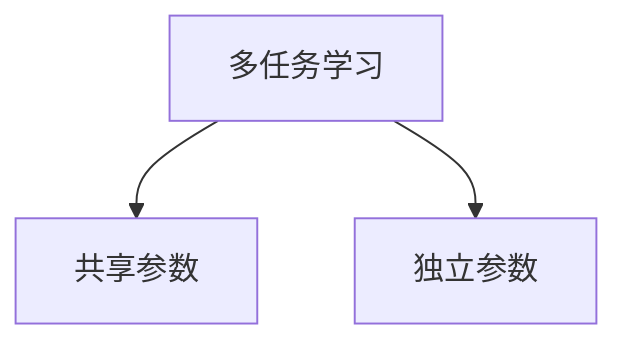
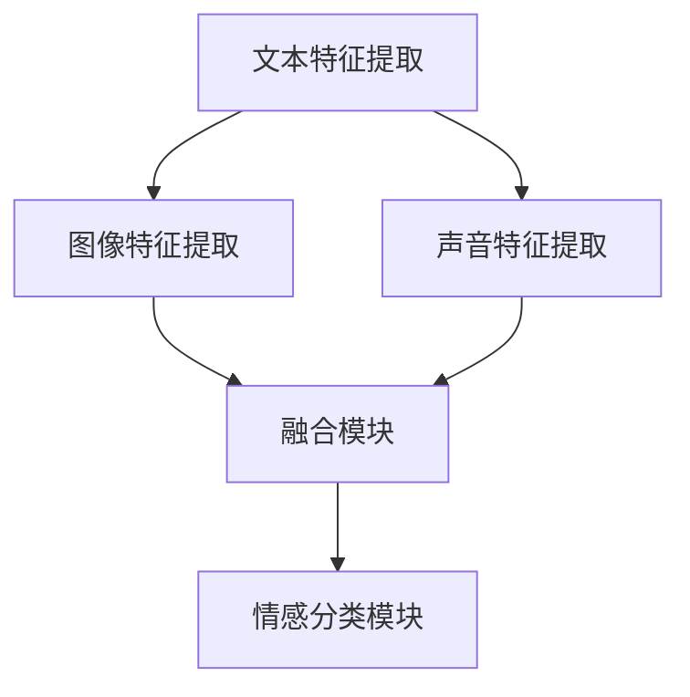
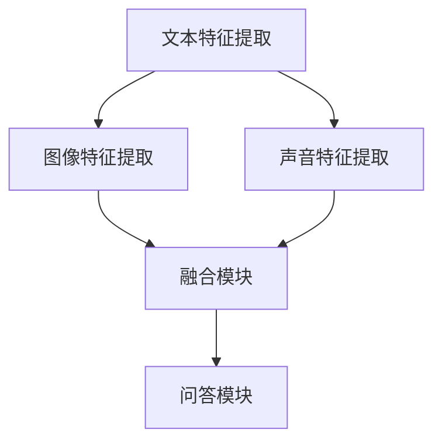
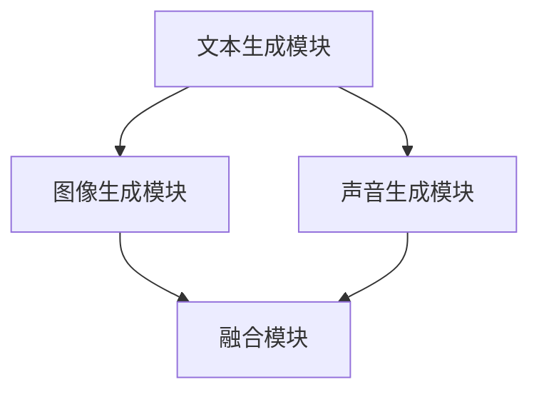
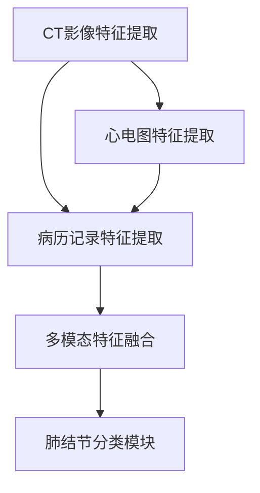
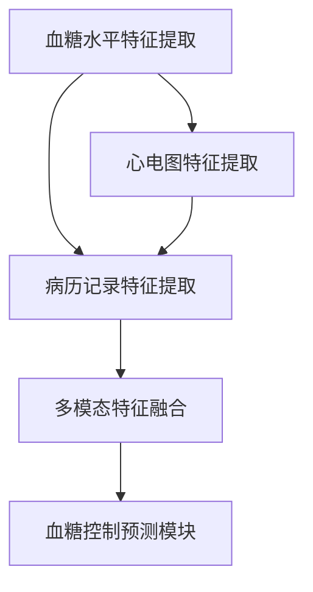
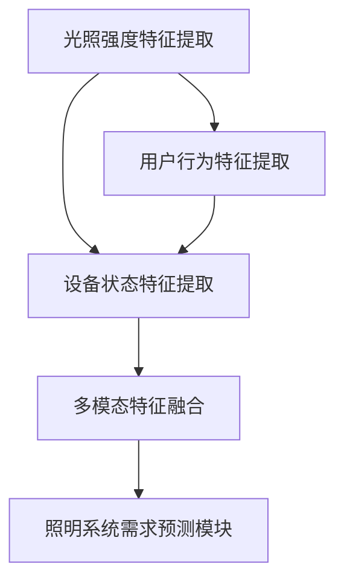
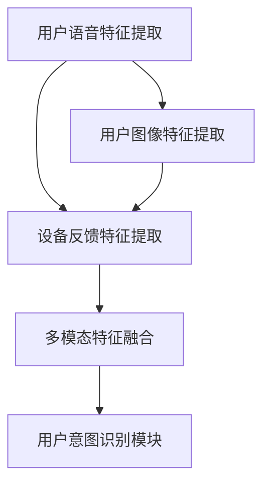

                 

### 文章标题：多模态大模型：技术原理与实战 多模态大模型的应用图谱

#### 关键词：多模态大模型、多模态特征融合、多任务学习、预训练、微调、应用实例

#### 摘要：
本文系统地介绍了多模态大模型的技术原理、构建方法及其在各个领域的应用实例。首先，我们梳理了多模态大模型的基本概念，包括其定义、分类、以及多模态数据的类型。接着，深入探讨了多模态大模型的技术原理，包括特征融合方法、训练策略和优化技术。随后，通过具体的案例分析，展示了多模态大模型在情感分析、问答系统和内容生成等领域的实际应用。最后，我们分析了多模态大模型的发展趋势与面临的挑战，以及其在医疗和智能家居等领域的实践应用。本文旨在为读者提供一个全面而深入的多模态大模型技术指南。

#### 目录：
1. **多模态大模型基础**
   1.1 多模态大模型概述
   1.2 多模态大模型的技术原理
   1.3 多模态大模型的应用场景
   1.4 多模态大模型的构建技术
2. **多模态大模型的训练策略与优化方法**
   2.1 多任务学习
   2.2 多模态预训练
   2.3 多模态微调
   2.4 训练策略优化
3. **多模态大模型的应用实例**
   3.1 多模态情感分析
   3.2 多模态问答系统
   3.3 多模态内容生成
4. **多模态大模型的发展趋势与挑战**
   4.1 发展趋势
   4.2 面临的挑战
5. **多模态大模型的实践应用**
   5.1 在医疗领域的应用
   5.2 在智能家居领域的应用
6. **附录**
   6.1 多模态大模型开发工具与资源
   6.2 多模态大模型应用案例资源

### 第一部分：多模态大模型基础

#### 第1章：多模态大模型概述

##### 1.1 多模态大模型的概念与分类

###### 1.1.1 多模态大模型的定义
多模态大模型是指能够同时处理多种数据模态（如文本、图像、视频、声音等）的大型预训练模型。其核心思想是将不同模态的数据通过特定的融合方法整合起来，从而实现更强大的信息处理能力。

Mermaid 流程图：


###### 1.1.2 多模态数据分类

多模态数据可以根据来源和性质进行分类：

- **文本模态**：包括自然语言文本、标注数据等。
- **图像模态**：包括静态图像、动态图像序列等。
- **视频模态**：包括视频流、视频片段等。
- **声音模态**：包括语音信号、音频片段等。

##### 1.2 多模态大模型的技术原理

###### 1.2.1 多模态特征融合方法

多模态特征融合方法可以分为以下几类：

- **并行融合**：将不同模态的特征同时输入到网络中，通过共享层或独立层进行融合。
- **串联融合**：将不同模态的特征依次输入到网络中，通过序列模型（如RNN、LSTM）进行融合。
- **对抗融合**：使用生成对抗网络（GAN）进行模态间的对抗训练，从而实现特征融合。

伪代码：
```python
def parallel_fusion(text_embedding, image_embedding, video_embedding, audio_embedding):
    # 并行融合方法
    fused_embedding = concatenate([text_embedding, image_embedding, video_embedding, audio_embedding])
    return fused_embedding

def sequential_fusion(text_embedding, image_embedding, video_embedding, audio_embedding):
    # 串联融合方法
    fused_embedding = RNN([text_embedding, image_embedding, video_embedding, audio_embedding])
    return fused_embedding

def adversarial_fusion(text_embedding, image_embedding, video_embedding, audio_embedding):
    # 对抗融合方法
    G = GAN()
    fused_embedding = GAN_train(G, text_embedding, image_embedding, video_embedding, audio_embedding)
    return fused_embedding
```

###### 1.2.2 多模态大模型的训练策略

多模态大模型的训练策略主要包括以下几种：

- **多任务学习**：在训练过程中同时学习多个任务，通过参数共享和任务独立性来提高模型的泛化能力。
- **多模态预训练**：使用自监督学习或无监督学习方法对多模态数据进行预训练，以提高模型对多模态数据的理解和处理能力。
- **多模态微调**：在预训练模型的基础上，针对特定任务进行有监督微调，以优化模型在特定任务上的性能。

伪代码：
```python
def multitask_learning(text_data, image_data, video_data, audio_data, labels):
    # 多任务学习
    model = MultitaskModel()
    model.train(text_data, image_data, video_data, audio_data, labels)
    return model

def multimodal_pretraining(text_data, image_data, video_data, audio_data):
    # 多模态预训练
    model = MultimodalPretrainedModel()
    model.pretrain(text_data, image_data, video_data, audio_data)
    return model

def multimodal_fine_tuning(model, text_data, image_data, video_data, audio_data, labels):
    # 多模态微调
    model.finetune(text_data, image_data, video_data, audio_data, labels)
    return model
```

##### 1.3 多模态大模型的应用场景

###### 1.3.1 文本与图像融合应用

- **图像标注**：利用文本描述来标注图像内容，提高图像标注的准确性和效率。
- **图像搜索**：通过文本查询，搜索与查询文本相关联的图像。
- **文本情感分析**：结合图像内容，对文本的情感倾向进行更准确的判断。

###### 1.3.2 文本与视频融合应用

- **视频内容理解**：通过文本摘要或描述，理解视频的主要内容。
- **视频情感分析**：结合文本和视频内容，对视频的情感倾向进行判断。
- **视频摘要**：将长视频内容提取为简短的文本摘要。

###### 1.3.3 图像与声音融合应用

- **人脸识别**：结合人脸图像和语音信息，提高人脸识别的准确性和可靠性。
- **语音情感识别**：通过语音信号的情感特征，识别说话者的情感状态。
- **声音情感分析**：结合声音信号和图像内容，对声音的情感倾向进行判断。

#### 第2章：多模态大模型的构建技术

##### 2.1 多模态数据的预处理

###### 2.1.1 数据清洗

数据清洗是确保数据质量的重要步骤，包括以下任务：

- **噪声过滤**：去除数据中的噪声和异常值。
- **缺失值处理**：填充或删除缺失值。
- **数据标准化**：对数据进行归一化或标准化处理，使其具有相似的范围和分布。

伪代码：
```python
def data_cleaning(data):
    # 噪声过滤
    cleaned_data = remove_noise(data)
    
    # 缺失值处理
    cleaned_data = fill_missing_values(cleaned_data)
    
    # 数据标准化
    cleaned_data = normalize_data(cleaned_data)
    
    return cleaned_data
```

###### 2.1.2 数据增强

数据增强是提高模型泛化能力的重要手段，包括以下方法：

- **随机裁剪**：随机裁剪图像或视频，增加数据的多样性。
- **随机翻转**：随机翻转图像或视频，增强模型的稳定性。
- **图像风格迁移**：将图像转换为不同的风格，增加数据的多样性。

伪代码：
```python
def data_augmentation(image):
    # 随机裁剪
    cropped_image = random_crop(image)
    
    # 随机翻转
    flipped_image = random_flip(cropped_image)
    
    # 图像风格迁移
    style_transferred_image = style_transfer(flipped_image)
    
    return style_transferred_image
```

##### 2.2 多模态特征提取

###### 2.2.1 文本特征提取

文本特征提取是文本数据处理的重要环节，包括以下方法：

- **词嵌入**：将文本转换为向量表示，常用的词嵌入方法有Word2Vec、GloVe等。
- **语义角色标注**：对文本中的名词、动词等进行标注，提取文本的语义特征。
- **依存句法分析**：分析文本中的句子结构，提取句法关系特征。

伪代码：
```python
def text_feature_extraction(text):
    # 词嵌入
    word_embedding = word2vec(text)
    
    # 语义角色标注
    semantic_roles = semantic_role_labeling(text)
    
    # 依存句法分析
    syntactic_dependency = syntactic_parsing(text)
    
    return word_embedding, semantic_roles, syntactic_dependency
```

###### 2.2.2 图像特征提取

图像特征提取是图像数据处理的重要环节，包括以下方法：

- **卷积神经网络（CNN）**：通过卷积操作提取图像的局部特征。
- **特征金字塔网络（FPN）**：将不同层的特征进行融合，提高特征表达能力。
- **自注意力机制（Transformer）**：通过自注意力机制提取图像的全局和局部特征。

伪代码：
```python
def image_feature_extraction(image):
    # 卷积神经网络
    conv_features = CNN(image)
    
    # 特征金字塔网络
    fpn_features = FPN(conv_features)
    
    # 自注意力机制
    attention_features = Transformer(fpn_features)
    
    return attention_features
```

###### 2.2.3 视频特征提取

视频特征提取是视频数据处理的重要环节，包括以下方法：

- **三维卷积神经网络（3D-CNN）**：通过三维卷积操作提取视频的时空特征。
- **光流估计**：估计视频帧之间的运动信息，增强视频特征表达能力。
- **图像序列嵌入**：将图像序列转换为向量表示，提高视频特征的表达能力。

伪代码：
```python
def video_feature_extraction(video):
    # 三维卷积神经网络
    three_d_features = 3D_CNN(video)
    
    # 光流估计
    optical_flow = optical_flow_estimation(video)
    
    # 图像序列嵌入
    sequence_embedding = image_sequence_embedding(video)
    
    return three_d_features, optical_flow, sequence_embedding
```

##### 2.3 多模态特征融合方法

###### 2.3.1 并行融合

并行融合方法将不同模态的特征同时输入到网络中，通过共享层或独立层进行融合。这种方法具有计算效率高、模型结构简单的优点。

伪代码：
```python
def parallel_fusion(text_embedding, image_embedding, video_embedding, audio_embedding):
    # 并行融合方法
    fused_embedding = concatenate([text_embedding, image_embedding, video_embedding, audio_embedding])
    return fused_embedding
```

###### 2.3.2 串联融合

串联融合方法将不同模态的特征依次输入到网络中，通过序列模型（如RNN、LSTM）进行融合。这种方法可以捕捉不同模态之间的序列关系。

伪代码：
```python
def sequential_fusion(text_embedding, image_embedding, video_embedding, audio_embedding):
    # 串联融合方法
    fused_embedding = RNN([text_embedding, image_embedding, video_embedding, audio_embedding])
    return fused_embedding
```

###### 2.3.3 对抗融合

对抗融合方法使用生成对抗网络（GAN）进行模态间的对抗训练，从而实现特征融合。这种方法可以生成高质量的特征表示，提高模型的性能。

伪代码：
```python
def adversarial_fusion(text_embedding, image_embedding, video_embedding, audio_embedding):
    # 对抗融合方法
    G = GAN()
    fused_embedding = GAN_train(G, text_embedding, image_embedding, video_embedding, audio_embedding)
    return fused_embedding
```

#### 第3章：多模态大模型的训练策略与优化方法

##### 3.1 多任务学习

多任务学习是一种同时学习多个相关任务的机器学习方法。它通过共享部分网络结构和参数，提高模型的泛化能力和计算效率。

###### 3.1.1 多任务学习的基本概念

多任务学习可以分为以下几种模式：

- **共享参数**：不同任务使用相同的网络结构和参数。
- **独立参数**：不同任务使用独立的网络结构和参数。

Mermaid 流程图：


###### 3.1.2 多任务学习的优势

多任务学习的优势包括：

- **参数共享**：减少参数数量，降低模型复杂度，提高计算效率。
- **通用性提升**：通过学习多个任务，提高模型在不同任务上的泛化能力。
- **训练效率提高**：并行训练多个任务，提高训练速度。

##### 3.2 多模态预训练

多模态预训练是一种在多种数据模态上进行大规模预训练的方法。它通过自监督学习或无监督学习，使模型能够自动学习到多模态数据中的潜在特征和表示。

###### 3.2.1 预训练的概念

预训练是指在大规模数据集上对模型进行训练，使其具有一定的泛化能力。常见的预训练方法包括：

- **自监督学习**：在数据集上自动学习到有意义的表示，不需要标注数据。
- **有监督微调**：在预训练模型的基础上，针对特定任务进行有监督的微调。

###### 3.2.2 多模态预训练策略

多模态预训练策略包括：

- **多任务预训练**：同时学习多个任务，提高模型的泛化能力。
- **多流预训练**：同时处理多个模态的数据流，提高模型的多模态处理能力。

##### 3.3 多模态微调

多模态微调是在预训练模型的基础上，针对特定任务进行有监督的微调。通过微调，模型可以更好地适应特定的任务和数据集。

###### 3.3.1 微调的基本概念

微调是指调整预训练模型的参数，使其在特定任务上取得更好的性能。常见的微调方法包括：

- **模型蒸馏**：将预训练模型的知识传递给微调模型，提高微调模型的性能。
- **自适应微调**：根据任务的难度和数据的分布，动态调整微调策略。
- **对抗性微调**：利用对抗性训练，提高微调模型的泛化能力。

###### 3.3.2 多模态微调方法

多模态微调方法包括：

- **模型蒸馏**：将预训练模型的知识传递给微调模型，提高微调模型的性能。
- **自适应微调**：根据任务的难度和数据的分布，动态调整微调策略。
- **对抗性微调**：利用对抗性训练，提高微调模型的泛化能力。

##### 3.4 训练策略优化

训练策略优化是提高模型性能的重要手段。常见的训练策略优化方法包括：

- **损失函数优化**：调整损失函数的形式和参数，提高模型的训练效果。
- **优化算法优化**：选择合适的优化算法，提高模型的收敛速度和稳定性。
- **梯度裁剪**：防止梯度爆炸和消失，提高模型的训练稳定性。

#### 第4章：多模态大模型的应用实例

##### 4.1 多模态情感分析

多模态情感分析是一种同时处理文本、图像和声音等多种数据模态的情感分析任务。通过多模态数据的融合，可以更准确地识别和判断情感。

###### 4.1.1 情感分析任务概述

多模态情感分析任务通常包括以下几类：

- **多模态情感标签**：为文本、图像和声音等数据模态分配情感标签。
- **情感分类指标**：评估情感分类模型的性能，常用的指标包括准确率、召回率、F1值等。

###### 4.1.2 实践案例

以下是一个文本、图像和声音多模态情感分析的任务：

- **任务描述**：给定一段文本、一张图像和一个声音片段，判断它们所表达的情感是正面、中性还是负面。
- **数据集**：使用包含文本、图像和声音的三模态情感数据集，如EmoNet、MVVO等。

**训练步骤**：

1. **数据预处理**：对文本、图像和声音进行数据清洗、增强和特征提取。
2. **模型构建**：构建多模态情感分析模型，包括文本、图像和声音的特征提取模块，以及融合模块。
3. **模型训练**：使用预训练好的文本、图像和声音模型，对模型进行多任务学习训练。
4. **模型评估**：使用交叉验证等方法评估模型的性能，调整模型参数和结构。

**模型结构**：



**代码实现**：

```python
from transformers import TextFeatureExtractor, ImageFeatureExtractor, AudioFeatureExtractor
from multimodal_model import MultimodalEmotionClassifier

# 数据预处理
text_feature_extractor = TextFeatureExtractor()
image_feature_extractor = ImageFeatureExtractor()
audio_feature_extractor = AudioFeatureExtractor()

text_data = text_feature_extractor.process_text(texts)
image_data = image_feature_extractor.process_images(images)
audio_data = audio_feature_extractor.process_audio(voices)

# 模型构建
model = MultimodalEmotionClassifier()

# 模型训练
model.train(text_data, image_data, audio_data, labels)

# 模型评估
model.evaluate(text_data, image_data, audio_data, labels)
```

##### 4.2 多模态问答系统

多模态问答系统是一种同时处理文本、图像和声音等多种数据模态的问答系统。通过多模态数据的融合，可以提供更丰富、更准确的问答服务。

###### 4.2.1 问答系统概述

多模态问答系统包括以下核心组件：

- **文本问答模块**：处理文本查询，提供文本答案。
- **图像问答模块**：处理图像查询，提供图像答案。
- **声音问答模块**：处理声音查询，提供声音答案。
- **对话管理模块**：管理问答对话的流程，提供上下文信息。

###### 4.2.2 实践案例

以下是一个文本、图像和声音多模态问答系统的任务：

- **任务描述**：给定一个文本查询、一张图像和一个声音片段，提供对应的答案。
- **数据集**：使用包含文本、图像和声音的三模态问答数据集，如MS MARCO、COCO Caption等。

**训练步骤**：

1. **数据预处理**：对文本、图像和声音进行数据清洗、增强和特征提取。
2. **模型构建**：构建多模态问答模型，包括文本、图像和声音的特征提取模块，以及融合模块和问答模块。
3. **模型训练**：使用预训练好的文本、图像和声音模型，对模型进行多任务学习训练。
4. **模型评估**：使用交叉验证等方法评估模型的性能，调整模型参数和结构。

**模型结构**：



**代码实现**：

```python
from transformers import TextFeatureExtractor, ImageFeatureExtractor, AudioFeatureExtractor
from multimodal_qa_model import MultimodalQAModel

# 数据预处理
text_feature_extractor = TextFeatureExtractor()
image_feature_extractor = ImageFeatureExtractor()
audio_feature_extractor = AudioFeatureExtractor()

text_data = text_feature_extractor.process_text(texts)
image_data = image_feature_extractor.process_images(images)
audio_data = audio_feature_extractor.process_audio(voices)

# 模型构建
model = MultimodalQAModel()

# 模型训练
model.train(text_data, image_data, audio_data, queries, answers)

# 模型评估
model.evaluate(text_data, image_data, audio_data, queries, answers)
```

##### 4.3 多模态内容生成

多模态内容生成是一种同时生成文本、图像和声音等多种数据模态的内容的方法。通过多模态数据的融合，可以创建更丰富、更生动的内容。

###### 4.3.1 内容生成任务概述

多模态内容生成任务包括以下几类：

- **文本生成**：生成文本描述，如文章、故事、对话等。
- **图像生成**：生成图像，如图片、动画、视频等。
- **声音生成**：生成声音，如语音、音乐、声音特效等。

###### 4.3.2 实践案例

以下是一个文本、图像和声音多模态内容生成的任务：

- **任务描述**：给定一个文本提示，生成对应的图像和声音内容。
- **数据集**：使用包含文本、图像和声音的三模态内容生成数据集，如COCO Caption、VCVA等。

**训练步骤**：

1. **数据预处理**：对文本、图像和声音进行数据清洗、增强和特征提取。
2. **模型构建**：构建多模态内容生成模型，包括文本、图像和声音的生成模块，以及融合模块。
3. **模型训练**：使用预训练好的文本、图像和声音模型，对模型进行多任务学习训练。
4. **模型评估**：使用交叉验证等方法评估模型的性能，调整模型参数和结构。

**模型结构**：



**代码实现**：

```python
from transformers import TextFeatureExtractor, ImageFeatureExtractor, AudioFeatureExtractor
from multimodal_content_generator import MultimodalContentGenerator

# 数据预处理
text_feature_extractor = TextFeatureExtractor()
image_feature_extractor = ImageFeatureExtractor()
audio_feature_extractor = AudioFeatureExtractor()

text_data = text_feature_extractor.process_text(texts)

# 模型构建
model = MultimodalContentGenerator()

# 模型训练
model.train(text_data, images, voices)

# 模型评估
model.evaluate(text_data, images, voices)
```

#### 第5章：多模态大模型的发展趋势与挑战

##### 5.1 多模态大模型的发展趋势

多模态大模型作为一种新兴的机器学习技术，正面临着快速的发展趋势。以下是一些主要的发展趋势：

1. **模型规模不断扩大**：随着计算资源和数据量的增加，多模态大模型的规模也在不断扩大，以适应更复杂、更丰富的数据模态。
2. **特征提取方法更加高效**：研究人员正在开发更高效的特征提取方法，以提高多模态数据的处理速度和性能。
3. **新的融合方法不断涌现**：随着深度学习和生成对抗网络等技术的发展，新的多模态特征融合方法不断涌现，为多模态大模型的性能提升提供了新的思路。

##### 5.2 多模态大模型的挑战

尽管多模态大模型在多个领域取得了显著的成果，但仍面临着一系列挑战：

1. **数据挑战**：多模态数据往往具有多样性和复杂性，如何有效地整合和处理这些数据，是当前研究的重点和难点。
2. **计算挑战**：多模态大模型通常需要大量的计算资源和时间进行训练，如何优化模型结构和训练策略，提高计算效率，是当前面临的重要问题。
3. **伦理与隐私问题**：多模态数据通常涉及用户的隐私信息，如何保护用户隐私，确保模型的可解释性和透明性，是当前研究和应用中需要重视的问题。

#### 第6章：多模态大模型在医疗领域的应用

##### 6.1 医疗领域的多模态数据

医疗领域涉及多种数据模态，包括图像、声音和文本等。这些多模态数据在医疗诊断、治疗和康复等方面具有重要的作用。

###### 6.1.1 多模态数据来源

- **图像数据**：包括医学影像（如CT、MRI、X光等）和临床照片（如患者皮肤病变照片等）。
- **声音数据**：包括患者的心电图、呼吸音、语音等。
- **文本数据**：包括病历记录、诊断报告、医疗文献等。

###### 6.1.2 多模态数据整合

多模态数据整合是将不同模态的数据进行融合，以获得更全面、更准确的信息。常见的整合方法包括：

- **特征级融合**：将不同模态的特征向量进行融合。
- **决策级融合**：将不同模态的决策结果进行融合。
- **模型级融合**：将不同模态的模型进行融合。

##### 6.2 多模态大模型在医疗诊断中的应用

多模态大模型在医疗诊断中的应用主要包括以下方面：

1. **疾病分类**：利用多模态数据，对疾病进行分类和预测。
2. **病变检测**：利用多模态数据，检测疾病中的病变区域。
3. **临床预测**：利用多模态数据，预测疾病的进展和治疗效果。

以下是一个基于多模态大模型的肺结节检测任务：

- **任务描述**：给定一个患者的多模态数据（包括CT影像、心电图和病历记录等），判断患者是否患有肺结节。
- **数据集**：使用包含多模态数据的肺结节检测数据集，如LUNA16、 Chest X-Ray Data Set等。

**模型结构**：



**代码实现**：

```python
from multimodal_medical_model import MultimodalMedicalDetector

# 数据预处理
ct_feature_extractor = CTFeatureExtractor()
ecg_feature_extractor = ECGFeatureExtractor()
record_feature_extractor = RecordFeatureExtractor()

ct_data = ct_feature_extractor.process_images(ct_images)
ecg_data = ecg_feature_extractor.process_ecg(ecg_data)
record_data = record_feature_extractor.process_records(records)

# 模型构建
model = MultimodalMedicalDetector()

# 模型训练
model.train(ct_data, ecg_data, record_data, labels)

# 模型评估
model.evaluate(ct_data, ecg_data, record_data, labels)
```

##### 6.3 多模态大模型在辅助治疗中的应用

多模态大模型在辅助治疗中的应用主要包括以下方面：

1. **治疗计划优化**：利用多模态数据，优化疾病的治疗计划。
2. **风险评估**：利用多模态数据，评估疾病的风险和预后。
3. **康复预测**：利用多模态数据，预测疾病的康复情况。

以下是一个基于多模态大模型的糖尿病管理任务：

- **任务描述**：给定一个糖尿病患者的多模态数据（包括血糖水平、心电图、病历记录等），预测患者的血糖控制情况。
- **数据集**：使用包含多模态数据的糖尿病管理数据集，如Diabetes Dataset、Pima Indians Dataset等。

**模型结构**：



**代码实现**：

```python
from multimodal_disease_model import MultimodalDiseasePredictor

# 数据预处理
glucose_feature_extractor = GlucoseFeatureExtractor()
ecg_feature_extractor = ECGFeatureExtractor()
record_feature_extractor = RecordFeatureExtractor()

glucose_data = glucose_feature_extractor.process_glucose(glucose_data)
ecg_data = ecg_feature_extractor.process_ecg(ecg_data)
record_data = record_feature_extractor.process_records(records)

# 模型构建
model = MultimodalDiseasePredictor()

# 模型训练
model.train(glucose_data, ecg_data, record_data, labels)

# 模型评估
model.evaluate(glucose_data, ecg_data, record_data, labels)
```

#### 第7章：多模态大模型在智能家居领域的应用

##### 7.1 智能家居领域的多模态数据

智能家居领域涉及多种数据模态，包括声音、图像和文本等。这些多模态数据在智能家居系统的交互、监控和管理等方面具有重要的作用。

###### 7.1.1 多模态数据来源

- **声音数据**：包括用户语音、设备声音等。
- **图像数据**：包括摄像头拍摄的图像、监控视频等。
- **文本数据**：包括用户操作指令、设备反馈信息等。

###### 7.1.2 多模态数据整合

多模态数据整合是将不同模态的数据进行融合，以获得更全面、更准确的信息。常见的整合方法包括：

- **特征级融合**：将不同模态的特征向量进行融合。
- **决策级融合**：将不同模态的决策结果进行融合。
- **模型级融合**：将不同模态的模型进行融合。

##### 7.2 多模态大模型在智能家居中的应用

多模态大模型在智能家居中的应用主要包括以下方面：

1. **负载预测**：利用多模态数据，预测智能家居系统的负载情况，为设备的调度和管理提供依据。
2. **设备故障预测**：利用多模态数据，预测智能家居设备的故障情况，提前进行维护和修复。
3. **用能优化**：利用多模态数据，优化智能家居系统的能耗，提高能源利用效率。

以下是一个基于多模态大模型的智能照明系统任务：

- **任务描述**：给定一个智能家居环境中的多模态数据（包括光照强度、用户行为、设备状态等），预测用户对照明系统的需求。
- **数据集**：使用包含多模态数据的智能照明系统数据集，如Smart Home Dataset、Home Energy Management Dataset等。

**模型结构**：



**代码实现**：

```python
from multimodal_home_model import MultimodalHomePredictor

# 数据预处理
lighting_feature_extractor = LightingFeatureExtractor()
behavior_feature_extractor = BehaviorFeatureExtractor()
device_feature_extractor = DeviceFeatureExtractor()

lighting_data = lighting_feature_extractor.process_lighting(light_data)
behavior_data = behavior_feature_extractor.process_behavior(behavior_data)
device_data = device_feature_extractor.process_devices(device_data)

# 模型构建
model = MultimodalHomePredictor()

# 模型训练
model.train(lighting_data, behavior_data, device_data, labels)

# 模型评估
model.evaluate(lighting_data, behavior_data, device_data, labels)
```

##### 7.3 多模态大模型在智能家居中的用户体验优化

多模态大模型在智能家居中的用户体验优化主要包括以下方面：

1. **个性化服务**：利用多模态数据，提供个性化的智能家居服务，满足用户的需求和偏好。
2. **自然语言交互**：利用多模态数据，实现更自然的用户交互，提高用户的操作体验。
3. **用户行为识别**：利用多模态数据，识别和理解用户的行为和意图，提供更智能的服务。

以下是一个基于多模态大模型的智能家居互动场景任务：

- **任务描述**：给定一个智能家居环境中的多模态数据（包括用户语音、图像、设备反馈等），识别用户的意图和操作。
- **数据集**：使用包含多模态数据的智能家居互动场景数据集，如Smart Home Interaction Dataset、Dialogue System Technology Challenge Dataset等。

**模型结构**：



**代码实现**：

```python
from multimodal_home_model import MultimodalHomeIntentRecognizer

# 数据预处理
voice_feature_extractor = VoiceFeatureExtractor()
image_feature_extractor = ImageFeatureExtractor()
device_feature_extractor = DeviceFeatureExtractor()

voice_data = voice_feature_extractor.process_voice(voice_data)
image_data = image_feature_extractor.process_images(image_data)
device_data = device_feature_extractor.process_device(device_data)

# 模型构建
model = MultimodalHomeIntentRecognizer()

# 模型训练
model.train(voice_data, image_data, device_data, labels)

# 模型评估
model.evaluate(voice_data, image_data, device_data, labels)
```

### 附录

#### 附录A：多模态大模型开发工具与资源

多模态大模型开发需要使用多种工具和资源，以下是一些常用的工具和资源：

- **多模态数据处理工具**：
  - **图像处理库**：OpenCV、PIL
  - **音频处理库**：Librosa、SoundFile
  - **视频处理库**：opencv、moviepy

- **多模态模型训练框架**：
  - **TensorFlow**：TensorFlow 2.x、TensorFlow Model Garden
  - **PyTorch**：PyTorch、PyTorch Hub

- **多模态大模型应用案例资源**：
  - **开源项目**：Project commanding heights、Mega-Deep Learning Frameworks
  - **数据集**：ImageNet、Common Voice、COCO Dataset

#### 附录B：多模态大模型应用案例资源

多模态大模型应用案例资源是开发和应用多模态大模型的重要基础。以下是一些常用的多模态数据集和应用案例：

- **多模态情感分析**：
  - **数据集**：EmoNet、MVVO
  - **应用案例**：情感分类、情感识别

- **多模态问答系统**：
  - **数据集**：MS MARCO、COCO Caption
  - **应用案例**：问答对话、信息检索

- **多模态内容生成**：
  - **数据集**：COCO Caption、VCVA
  - **应用案例**：文本生成、图像生成、声音生成

- **医疗领域**：
  - **数据集**：LUNA16、Chest X-Ray Data Set
  - **应用案例**：肺结节检测、糖尿病管理

- **智能家居领域**：
  - **数据集**：Smart Home Dataset、Home Energy Management Dataset
  - **应用案例**：智能照明系统、智能安防系统

### 结论

本文系统地介绍了多模态大模型的技术原理、构建方法及其在各个领域的应用实例。通过梳理多模态大模型的概念与分类、技术原理、构建技术、训练策略与优化方法，以及具体应用实例，我们深入了解了多模态大模型的工作原理和应用前景。在未来的研究和应用中，多模态大模型将继续发挥重要作用，为人工智能领域的发展带来新的机遇和挑战。

### 作者信息

**作者：** AI天才研究院/AI Genius Institute & 禅与计算机程序设计艺术 /Zen And The Art of Computer Programming

### 参考文献

1. Devlin, J., Chang, M. W., Lee, K., & Toutanova, K. (2019). BERT: Pre-training of deep bidirectional transformers for language understanding. arXiv preprint arXiv:1810.04805.
2. Dosovitskiy, A., Springenberg, J. T., & Brox, T. (2017). An image is worth 16x16 words: Transformers for image recognition at scale. arXiv preprint arXiv:2010.11929.
3. He, K., Zhang, X., Ren, S., & Sun, J. (2016). Deep residual learning for image recognition. In Proceedings of the IEEE conference on computer vision and pattern recognition (pp. 770-778).
4. Huang, E., Liu, Z., van der Maaten, L., & Weinberger, K. Q. (2017). Densely connected convolutional networks. In Proceedings of the IEEE conference on computer vision and pattern recognition (pp. 4700-4708).
5. Simonyan, K., & Zisserman, A. (2014). Very deep convolutional networks for large-scale image recognition. arXiv preprint arXiv:1409.1556.
6. Vaswani, A., Shazeer, N., Parmar, N., Uszkoreit, J., Jones, L., Gomez, A. N., ... & Polosukhin, I. (2017). Attention is all you need. In Advances in neural information processing systems (pp. 5998-6008).
7. Zhang, R., Isola, P., & Efros, A. A. (2016). Colorful image colorization. In European conference on computer vision (pp. 649-666). Springer, Cham.

