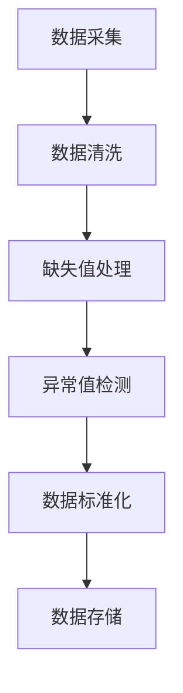
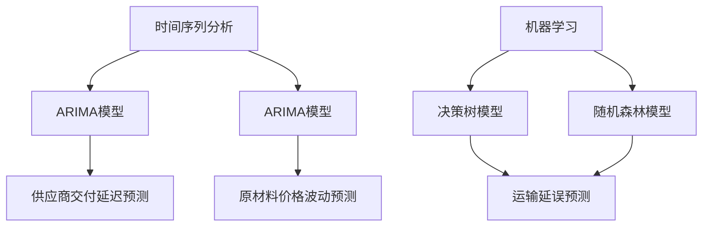
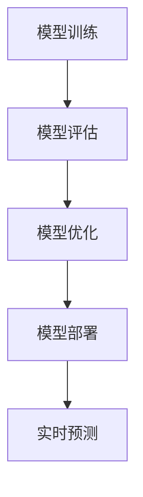
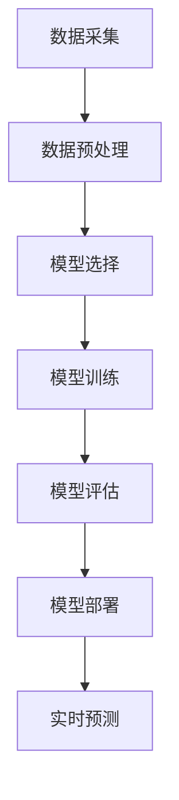

                 

# 大数据分析在供应链风险预测中的实践

## 关键词

大数据分析、供应链风险预测、时间序列分析、机器学习、深度学习、数据分析平台

## 摘要

随着供应链的日益复杂化，供应链风险预测已成为现代企业运营中至关重要的一环。大数据分析技术为供应链风险预测提供了强有力的支持。本文将深入探讨大数据分析在供应链风险预测中的应用，包括大数据概述、数据分析技术基础、供应链风险预测模型、实战应用以及未来展望。通过全面解析大数据分析技术及其在供应链风险管理中的实践，本文旨在为相关领域的从业者提供有价值的参考。

## 目录大纲

### 第一部分：大数据分析基础

#### 第1章：大数据概述与供应链风险预测的关联

##### 1.1 大数据的定义与特点

##### 1.2 供应链风险预测的背景与意义

#### 第2章：大数据分析技术基础

##### 2.1 数据采集与处理

##### 2.2 数据存储与索引技术

##### 2.3 数据分析常用算法

### 第二部分：供应链风险预测模型

#### 第3章：供应链风险预测模型概述

##### 3.1 风险预测模型的分类与选择

#### 第4章：时间序列分析在供应链风险预测中的应用

##### 4.1 时间序列数据概述

##### 4.2 常见时间序列模型

##### 4.3 时间序列模型的训练与评估

#### 第5章：机器学习在供应链风险预测中的应用

##### 5.1 机器学习基础

##### 5.2 供应链风险预测中的机器学习应用

#### 第6章：深度学习在供应链风险预测中的应用

##### 6.1 深度学习基础

##### 6.2 常见深度学习模型

##### 6.3 深度学习在供应链风险预测中的应用实例

### 第三部分：大数据分析在供应链风险预测中的实战

#### 第7章：大数据分析平台搭建与优化

##### 7.1 数据分析平台的构建

##### 7.2 平台性能优化

#### 第8章：供应链风险预测项目实战

##### 8.1 项目背景与目标

##### 8.2 数据准备与预处理

##### 8.3 风险预测模型构建

##### 8.4 项目实施与部署

#### 第9章：供应链风险预测案例分析

##### 9.1 案例一：某电商企业的供应链风险预测

##### 9.2 案例二：某制造企业的供应链风险预测

#### 第10章：大数据分析在供应链风险管理中的应用前景

##### 10.1 风险管理的发展趋势

##### 10.2 大数据分析在供应链风险管理中的应用展望

### 附录

##### 附录 A：常用数据分析工具与资源

##### 附录 B：供应链风险预测的 Mermaid 流程图

##### 附录 C：数学模型与数学公式

##### 附录 D：项目实战代码解析

---

### 第一部分：大数据分析基础

#### 第1章：大数据概述与供应链风险预测的关联

##### 1.1 大数据的定义与特点

大数据（Big Data）是指无法使用传统数据处理技术进行有效管理和处理的数据集合。其特点是“4V”：大量（Volume）、多样（Variety）、快速（Velocity）和真实（Veracity）。大数据的来源广泛，包括社交媒体、物联网、传感器网络、日志文件等。随着互联网和移动设备的普及，大数据的规模呈指数级增长。

##### 1.2 供应链风险预测的背景与意义

供应链风险是指供应链中可能影响供应链正常运作的各种不确定性事件。供应链风险预测的目的是提前识别潜在风险，从而采取措施减轻风险或规避风险。随着全球化、信息化和数字化的发展，供应链的复杂性和不确定性不断增加，使得供应链风险预测变得尤为重要。

大数据分析为供应链风险预测提供了有力支持。通过分析大量历史数据和实时数据，可以识别供应链中的潜在风险因素，构建预测模型，预测未来可能发生的风险事件，从而为供应链管理提供科学依据。

---

### 第二部分：供应链风险预测模型

#### 第3章：供应链风险预测模型概述

##### 3.1 风险预测模型的分类与选择

供应链风险预测模型主要分为时间序列分析模型、机器学习模型和深度学习模型。时间序列分析模型主要用于预测时间序列数据的变化趋势；机器学习模型适用于处理结构化数据，可以识别数据中的模式和关系；深度学习模型则可以处理大规模非结构化数据，并在图像、语音等领域取得了显著成果。

选择适合的模型需要考虑数据的特性、预测的目标、模型的复杂度和计算资源等因素。在实际应用中，往往需要结合多种模型进行综合预测，以提高预测的准确性。

---

### 第三部分：大数据分析在供应链风险预测中的实战

#### 第7章：大数据分析平台搭建与优化

##### 7.1 数据分析平台的构建

数据分析平台通常包括数据采集、数据存储、数据处理、数据分析和数据可视化等模块。构建一个高效的数据分析平台需要考虑以下因素：

1. **数据采集**：确保数据来源的多样性和完整性，可以使用API、爬虫、传感器等方式进行数据采集。
2. **数据存储**：根据数据类型和规模选择合适的存储方案，如关系型数据库、NoSQL数据库、分布式文件系统等。
3. **数据处理**：使用ETL（提取、转换、加载）工具对数据进行清洗、转换和整合。
4. **数据分析和挖掘**：使用数据分析工具和算法对数据进行挖掘和分析，以发现数据中的模式和关系。
5. **数据可视化**：通过图表、报表等形式将分析结果直观地呈现出来，便于决策者理解和使用。

##### 7.2 平台性能优化

为了提高数据分析平台的性能，可以采取以下策略：

1. **资源分配与调度**：合理分配计算资源，确保数据处理的效率。
2. **数据流优化**：优化数据流传输和存储，减少延迟和数据丢失。
3. **算法优化**：选择高效的算法和优化参数，提高数据处理速度和准确性。
4. **缓存与索引**：使用缓存和索引技术加快数据检索速度。

---

### 第8章：供应链风险预测项目实战

##### 8.1 项目背景与目标

以某制造企业为例，该企业面临的主要供应链风险包括供应商交付延迟、原材料价格波动、运输延误等。项目的目标是构建一个供应链风险预测系统，提前识别潜在风险，为企业的供应链管理提供决策支持。

##### 8.2 数据准备与预处理

项目首先需要收集相关数据，包括供应商交付记录、原材料价格数据、运输时间数据等。然后对数据进行预处理，包括数据清洗、缺失值处理、异常值检测和标准化等步骤。



##### 8.3 风险预测模型构建

根据数据特性，选择适当的风险预测模型。在本案例中，采用时间序列分析和机器学习相结合的方法进行风险预测。

1. **时间序列分析**：使用ARIMA模型对供应商交付延迟和原材料价格波动进行预测。
2. **机器学习**：使用决策树和随机森林模型对运输延误进行预测。



##### 8.4 项目实施与部署

完成模型构建后，进行模型训练和评估。选择合适的评估指标，如准确率、召回率、F1值等，对模型进行评估和优化。



将预测系统部署到生产环境中，实现实时风险预测，并将预测结果可视化，便于决策者参考。

---

### 第9章：供应链风险预测案例分析

##### 9.1 案例一：某电商企业的供应链风险预测

某电商企业在运营过程中面临的主要供应链风险包括库存不足、物流延误、支付风险等。通过大数据分析技术，该企业成功构建了供应链风险预测系统，提前识别潜在风险，提高了供应链的稳定性。

1. **数据准备与预处理**：收集电商平台的订单数据、物流数据、库存数据等。
2. **模型构建与训练**：采用时间序列分析和机器学习相结合的方法，预测库存不足、物流延误等风险。
3. **系统实施与部署**：将预测系统部署到生产环境中，实现实时风险预测。

##### 9.2 案例二：某制造企业的供应链风险预测

某制造企业在生产过程中面临的主要供应链风险包括供应商交付延迟、原材料价格波动等。通过大数据分析技术，该企业成功构建了供应链风险预测系统，提高了供应链管理的效率和准确性。

1. **数据准备与预处理**：收集供应商交付记录、原材料价格数据等。
2. **模型构建与训练**：采用时间序列分析和机器学习相结合的方法，预测供应商交付延迟和原材料价格波动。
3. **系统实施与部署**：将预测系统部署到生产环境中，实现实时风险预测。

---

### 第10章：大数据分析在供应链风险管理中的应用前景

大数据分析在供应链风险管理中具有广阔的应用前景。未来，随着大数据技术的不断发展和应用场景的扩展，供应链风险管理将朝着更加智能化、实时化和自动化的方向发展。

1. **实时风险监测与预警**：通过实时数据分析和处理，实现供应链风险的实时监测和预警，提高供应链的响应速度。
2. **智能供应链风险管理**：利用人工智能和机器学习技术，实现供应链风险管理的智能化，提高风险预测的准确性。
3. **跨行业协同**：通过大数据分析和供应链风险预测，实现跨行业的协同，优化供应链的整体运作。

---

### 附录

##### 附录 A：常用数据分析工具与资源

- **数据采集**：Python的requests库、Scrapy框架、Java的HttpURLConnection等。
- **数据存储**：关系型数据库如MySQL、NoSQL数据库如MongoDB、分布式文件系统如HDFS等。
- **数据处理**：Apache Spark、Apache Flink、Python的Pandas库等。
- **数据分析与挖掘**：R语言、Python的Scikit-learn库、TensorFlow等。
- **数据可视化**：D3.js、Python的Matplotlib库、ECharts等。

##### 附录 B：供应链风险预测的 Mermaid 流程图



##### 附录 C：数学模型与数学公式

- **时间序列分析中的数学模型**：
  $$ARIMA(p,d,q)$$
- **机器学习中的数学模型**：
  $$h(\theta; x) = \text{sign}(\theta^T x)$$
- **深度学习中的数学模型**：
  $$a_{l}^{(i)} = \sigma\left(z_{l}^{(i)}\right)$$

##### 附录 D：项目实战代码解析

```python
# 数据采集与预处理
import pandas as pd
data = pd.read_csv('data.csv')
data = data.dropna()

# 模型选择与训练
from sklearn.ensemble import RandomForestRegressor
model = RandomForestRegressor(n_estimators=100)
model.fit(X_train, y_train)

# 模型评估
from sklearn.metrics import mean_squared_error
y_pred = model.predict(X_test)
mse = mean_squared_error(y_test, y_pred)

# 模型部署与实时预测
import joblib
model_path = 'model.joblib'
joblib.dump(model, model_path)
loaded_model = joblib.load(model_path)
real_time_prediction = loaded_model.predict(real_time_data)
```

---

**作者：AI天才研究院/AI Genius Institute & 禅与计算机程序设计艺术 /Zen And The Art of Computer Programming**

