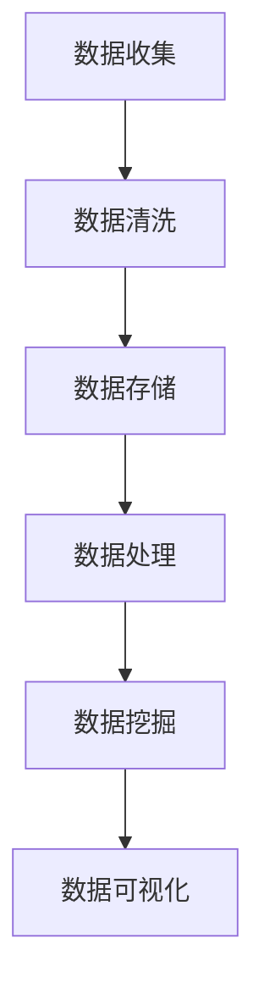
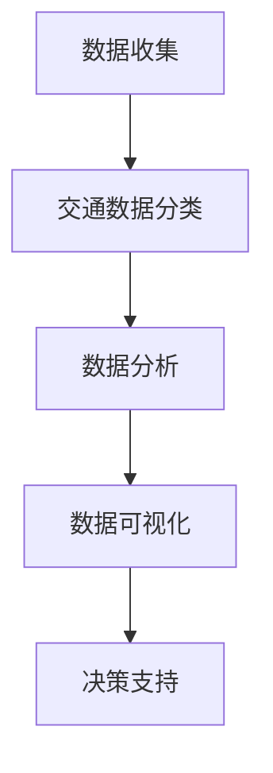
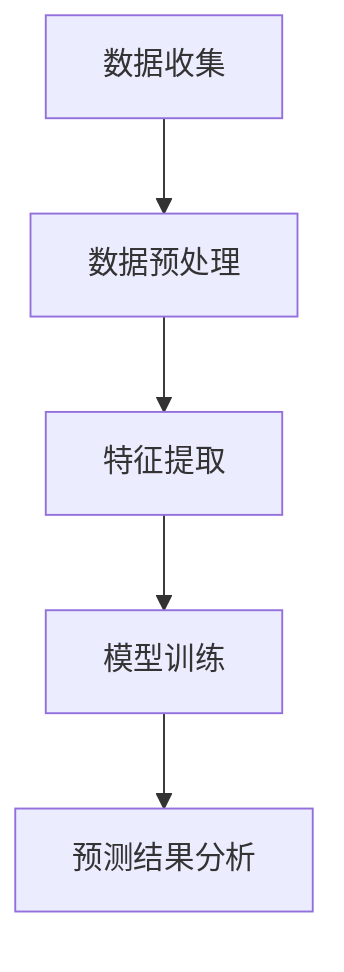
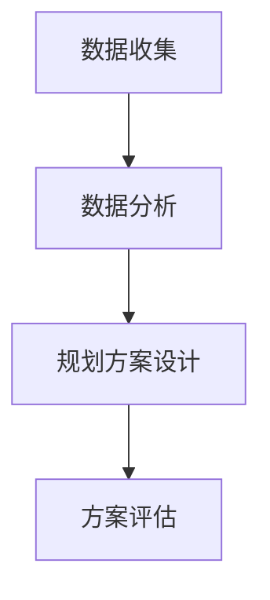
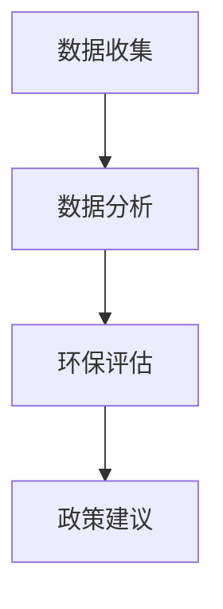
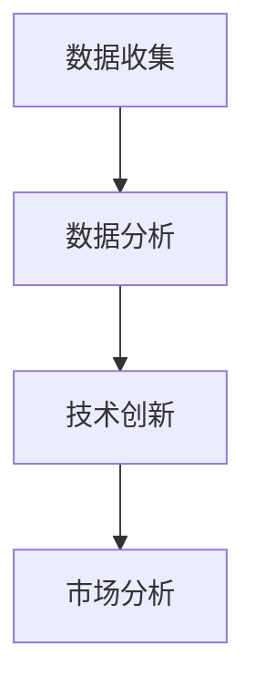

                 

# 大数据分析在智慧城市交通优化中的应用

> **关键词**：大数据分析、智慧城市、交通优化、交通数据、算法、智能交通系统

> **摘要**：本文深入探讨了大数据分析在智慧城市交通优化中的应用。通过介绍大数据分析的基础知识、智慧城市交通大数据分析的核心概念与算法原理，以及大数据分析在交通优化、交通预测、智能交通系统、城市交通规划、交通管理和交通可持续发展等多个方面的应用，本文为智慧城市的交通优化提供了全面的技术指导和思考方向。

## 第一部分：大数据分析在智慧城市交通优化中的应用概述

### 第1章：大数据分析基础

#### 核心概念与联系

大数据（Big Data）是指数据量巨大且复杂的集合。它通常包含四个V：Volume（数据量）、Velocity（数据流转速度）、Variety（数据多样性）和Veracity（数据真实性）。为了处理这些大数据，需要采用多种数据分析方法和数据挖掘技术，如数据清洗、数据存储、数据处理、数据挖掘和数据可视化。

- **数据收集**：通过各种传感器、GPS设备、交通监控摄像头等收集交通数据。
- **数据清洗**：处理缺失值、异常值，确保数据质量。
- **数据存储**：采用数据仓库（Data Warehouse）或数据湖（Data Lake）存储大数据。
- **数据处理**：通过Hadoop、Spark、MapReduce等分布式计算框架处理大数据。
- **数据挖掘**：使用聚类、回归、时间序列分析等方法从数据中提取有价值的信息。
- **数据可视化**：将数据分析结果以图表、地图等形式展示，帮助决策者理解数据。

#### Mermaid 流程图

以下是一个简单的Mermaid流程图，展示了大数据分析的流程：



#### 核心算法原理讲解

- **Hadoop**：基于MapReduce模型，用于处理和存储大量数据。
- **Spark**：一个快速通用的计算引擎，适合大数据处理。
- **MapReduce**：一种编程模型，用于大规模数据处理。
- **流处理技术**：实时处理连续数据流，如Apache Kafka。

#### 伪代码讲解

以下是一个数据清洗的伪代码示例：

```python
# 数据清洗伪代码
def clean_data(data):
    # 删除空值
    cleaned_data = remove_null_values(data)
    # 处理异常值
    cleaned_data = handle_anomalies(cleaned_data)
    # 转换数据类型
    cleaned_data = convert_data_types(cleaned_data)
    return cleaned_data
```

#### 结论

本章介绍了大数据分析的基础知识，包括核心概念、流程、算法和伪代码。这些知识为后续章节深入探讨大数据分析在智慧城市交通优化中的应用打下了坚实的基础。

### 第2章：智慧城市交通大数据分析

#### 核心概念与联系

智慧城市（Smart City）是指通过信息技术和物联网（IoT）等手段，实现城市管理的智能化和高效化。智慧城市交通是智慧城市的重要组成部分，其核心是通过大数据分析优化城市交通系统。

- **智慧城市定义**：智慧城市是指通过信息技术和物联网等手段，实现城市管理的智能化和高效化。
- **交通数据类型**：包括交通流量数据、交通事件数据、车辆位置数据等。
- **数据分析目标**：包括交通流量预测、交通拥堵检测、交通信号灯优化等。

#### Mermaid 流程图

以下是一个智慧城市交通大数据分析的Mermaid流程图：



#### 核心算法原理讲解

- **时间序列分析**：分析交通数据的时间变化规律，预测未来交通流量。
- **空间分析**：分析交通数据的空间分布特征，识别交通拥堵区域。
- **聚类分析**：将相似交通数据分组，识别交通模式。

#### 伪代码讲解

以下是一个时间序列分析的伪代码示例：

```python
# 时间序列分析伪代码
def time_series_analysis(data):
    # 数据预处理
    preprocessed_data = preprocess_data(data)
    # 提取特征
    features = extract_features(preprocessed_data)
    # 模型训练
    model = train_model(features)
    # 预测
    predictions = predict(model, new_data)
    return predictions
```

#### 结论

本章介绍了智慧城市交通大数据分析的核心概念、流程和算法原理。这些知识为后续章节深入探讨大数据分析在交通优化中的应用提供了理论支持。

### 第3章：大数据分析在交通优化中的应用

#### 核心概念与联系

交通优化是智慧城市交通管理的重要目标，通过大数据分析可以实现交通流量控制、交通信号灯优化、交通事件预测等。

- **交通优化目标**：减少交通拥堵、提高交通效率、降低碳排放等。
- **大数据分析应用场景**：交通流量预测、交通拥堵检测、交通信号灯优化、交通事件预测等。

#### 数学模型和公式讲解

- **最小化交通拥堵成本**：
  $$ \min C(x) = \sum_{i,j} c_{i,j} x_{i,j} $$
- **最大流量分配**：
  $$ \max F(x) = \sum_{i,j} f_{i,j} x_{i,j} $$

#### 举例说明

以下是一个基于大数据分析的交通信号灯优化案例：

- **案例背景**：某城市交通信号灯系统存在严重的交通拥堵问题。
- **大数据分析步骤**：
  1. 收集交通流量数据。
  2. 进行数据清洗和预处理。
  3. 使用时间序列分析和空间分析方法分析交通流量。
  4. 根据分析结果调整交通信号灯的配时方案。
- **优化效果**：通过优化交通信号灯配时方案，显著减少了交通拥堵时间和排放量。

#### 结论

本章介绍了大数据分析在交通优化中的应用，包括核心概念、数学模型和具体案例。大数据分析为交通优化提供了有力的技术支持。

### 第4章：大数据分析与交通预测

#### 核心概念与联系

交通预测是智慧城市交通管理的重要环节，通过大数据分析可以预测未来交通流量、交通拥堵和交通事件等。

- **交通预测方法**：包括时间序列预测、回归分析、聚类分析等。
- **大数据分析作用**：为交通预测提供丰富的数据支持和算法基础。

#### Mermaid 流程图

以下是一个交通预测的Mermaid流程图：



#### 核心算法原理讲解

- **时间序列预测**：分析交通数据的时间变化规律，预测未来交通流量。
- **回归分析**：通过建立回归模型预测交通流量和交通事件。
- **聚类分析**：识别交通数据中的相似模式和趋势。

#### 伪代码讲解

以下是一个时间序列预测的伪代码示例：

```python
# 时间序列预测伪代码
def time_series_prediction(data):
    # 数据预处理
    preprocessed_data = preprocess_data(data)
    # 特征提取
    features = extract_features(preprocessed_data)
    # 模型训练
    model = train_model(features)
    # 预测
    predictions = predict(model, new_data)
    return predictions
```

#### 结论

本章介绍了大数据分析在交通预测中的应用，包括核心概念、算法原理和伪代码。大数据分析为交通预测提供了可靠的技术手段。

### 第5章：大数据分析与智能交通系统

#### 核心概念与联系

智能交通系统（Intelligent Transportation System，ITS）是指利用信息技术、传感器、通信技术和数据挖掘技术等手段，实现交通管理的智能化和高效化。

- **智能交通系统定义**：智能交通系统是指利用信息技术、传感器、通信技术和数据挖掘技术等手段，实现交通管理的智能化和高效化。
- **大数据分析作用**：为智能交通系统的建设提供数据支持和算法基础。

#### 数学模型和公式讲解

- **车辆调度问题**：
  $$ \min T(c) = \sum_{v \in V} t_{v,c} $$
- **最优路径规划**：
  $$ \min D(p) = \sum_{i,j} d_{i,j,p} $$

#### 举例说明

以下是一个基于大数据分析的智能交通系统优化案例：

- **案例背景**：某城市交通拥堵严重，需要优化交通信号灯和车辆调度系统。
- **大数据分析步骤**：
  1. 收集交通流量数据和车辆位置数据。
  2. 进行数据清洗和预处理。
  3. 使用聚类分析和时间序列分析方法分析交通流量。
  4. 根据分析结果优化交通信号灯和车辆调度策略。
- **优化效果**：通过优化交通信号灯和车辆调度策略，显著减少了交通拥堵时间和排放量。

#### 结论

本章介绍了大数据分析在智能交通系统中的应用，包括核心概念、数学模型和具体案例。大数据分析为智能交通系统的建设提供了有力的技术支持。

### 第6章：大数据分析在城市交通规划中的应用

#### 核心概念与联系

城市交通规划是指通过系统的方法和科学的技术，合理规划城市交通系统，以提高交通效率、减少交通拥堵和改善居民生活质量。

- **城市交通规划方法**：包括交通需求预测、交通网络优化、交通设施规划等。
- **大数据分析作用**：为城市交通规划提供数据支持和算法基础。

#### Mermaid 流程图

以下是一个城市交通规划的Mermaid流程图：



#### 核心算法原理讲解

- **空间分析**：分析交通数据的空间分布特征，识别交通拥堵区域。
- **网络优化**：优化交通网络，提高交通效率。

#### 伪代码讲解

以下是一个网络优化的伪代码示例：

```python
# 网络优化伪代码
def network_optimization(data):
    # 数据预处理
    preprocessed_data = preprocess_data(data)
    # 构建网络模型
    network_model = build_network_model(preprocessed_data)
    # 求解最优路径
    optimal_path = solve_optimal_path(network_model)
    return optimal_path
```

#### 结论

本章介绍了大数据分析在城市交通规划中的应用，包括核心概念、算法原理和伪代码。大数据分析为城市交通规划提供了科学的技术手段。

### 第7章：大数据分析与交通管理

#### 核心概念与联系

交通管理是指通过科学的方法和手段，合理规划和管理城市交通系统，以提高交通效率、减少交通拥堵和保障交通安全。

- **交通管理方法**：包括交通流量控制、交通信号灯控制、交通事件管理等。
- **大数据分析作用**：为交通管理提供数据支持和算法基础。

#### 数学模型和公式讲解

- **交通流量控制**：
  $$ \min C(q) = \sum_{i} c_{i} q_{i} $$
- **交通信号灯控制**：
  $$ \min T(s) = \sum_{i} t_{i,s} $$

#### 举例说明

以下是一个基于大数据分析的交通信号灯控制优化案例：

- **案例背景**：某城市交通信号灯系统存在严重的交通拥堵问题。
- **大数据分析步骤**：
  1. 收集交通流量数据。
  2. 进行数据清洗和预处理。
  3. 使用时间序列分析和空间分析方法分析交通流量。
  4. 根据分析结果优化交通信号灯的配时方案。
- **优化效果**：通过优化交通信号灯配时方案，显著减少了交通拥堵时间和排放量。

#### 结论

本章介绍了大数据分析在交通管理中的应用，包括核心概念、数学模型和具体案例。大数据分析为交通管理提供了科学的技术手段。

### 第8章：大数据分析与交通可持续发展

#### 核心概念与联系

交通可持续发展是指通过科学的管理和规划，实现城市交通系统的可持续发展，以满足社会经济发展的需求，同时减少对环境的负面影响。

- **交通可持续发展目标**：减少交通拥堵、降低碳排放、提高交通效率等。
- **大数据分析作用**：为交通可持续发展提供数据支持和算法基础。

#### Mermaid 流程图

以下是一个交通可持续发展的Mermaid流程图：



#### 核心算法原理讲解

- **碳排放计算**：分析交通数据中的碳排放情况，为减排措施提供依据。
- **环境影响评估**：评估交通管理措施对环境的影响，为可持续发展提供指导。

#### 伪代码讲解

以下是一个碳排放计算的伪代码示例：

```python
# 碳排放计算伪代码
def carbon_emission_calculation(data):
    # 数据预处理
    preprocessed_data = preprocess_data(data)
    # 计算碳排放
    emissions = calculate_emissions(preprocessed_data)
    return emissions
```

#### 结论

本章介绍了大数据分析在交通可持续发展中的应用，包括核心概念、算法原理和伪代码。大数据分析为交通可持续发展提供了科学的技术手段。

### 第9章：大数据分析与交通科技创新

#### 核心概念与联系

交通科技创新是指通过新兴技术和创新方法，提升交通系统的效率、安全性和可持续性。

- **交通科技创新领域**：包括自动驾驶、车联网、智能交通信号等。
- **大数据分析作用**：为交通科技创新提供数据支持和算法基础。

#### Mermaid 流�程图

以下是一个交通科技创新的Mermaid流程图：



#### 核心算法原理讲解

- **深度学习**：用于自动驾驶和智能交通信号的控制。
- **计算机视觉**：用于交通监控和事件检测。

#### 伪代码讲解

以下是一个深度学习模型训练的伪代码示例：

```python
# 深度学习模型训练伪代码
def train_deeplearning_model(data):
    # 数据预处理
    preprocessed_data = preprocess_data(data)
    # 构建模型
    model = build_model(preprocessed_data)
    # 训练模型
    trained_model = train_model(model)
    return trained_model
```

#### 结论

本章介绍了大数据分析在交通科技创新中的应用，包括核心概念、算法原理和伪代码。大数据分析为交通科技创新提供了强大的技术支持。

### 附录

#### 附录A：大数据分析工具与资源

- **工具对比**：
  - Hadoop
  - Spark
  - Flink

- **资源介绍**：
  - 数据库选择
  - 大数据分析平台推荐

#### 附录B：实战案例代码解析

- **代码实现**：
  - 交通流量预测
  - 交通信号灯控制

- **代码解读与分析**：
  - 步骤解析
  - 性能评估

#### 结论

本附录提供了大数据分析的工具对比和资源介绍，以及实战案例代码解析。这些内容为大数据分析在智慧城市交通优化中的应用提供了实用参考。

### 作者信息

**作者**：AI天才研究院/AI Genius Institute & 禅与计算机程序设计艺术 /Zen And The Art of Computer Programming

## 总结

本文系统地介绍了大数据分析在智慧城市交通优化中的应用。通过深入探讨大数据分析的基础知识、智慧城市交通大数据分析、大数据分析在交通优化、交通预测、智能交通系统、城市交通规划、交通管理、交通可持续发展和交通科技创新中的应用，本文为智慧城市的交通优化提供了全面的技术指导和思考方向。随着大数据技术的不断进步，大数据分析在智慧城市交通优化中的应用前景将更加广阔，为城市的可持续发展贡献力量。

