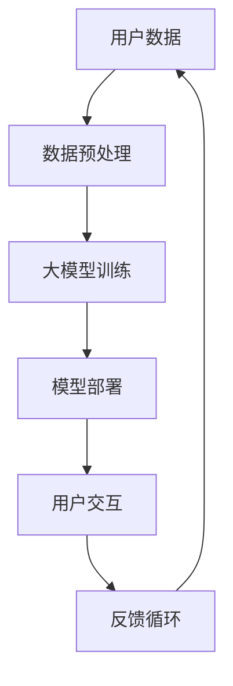

                 

# 大模型企业的产品体验优化

## 关键词
- 大模型
- 产品体验优化
- 深度学习
- 个性化推荐
- 智能客服
- 用户体验设计

## 摘要
随着深度学习和人工智能技术的快速发展，大模型（如深度神经网络）在企业产品体验优化中的应用越来越广泛。本文将深入探讨大模型在企业产品体验优化中的核心概念、算法原理、数学模型以及实际应用。通过项目实战和代码解读，读者将全面了解大模型技术的优势和应用方法，为企业在提升产品体验中提供有力支持。

## 第一部分：核心概念与联系

在《大模型企业的产品体验优化》一书中，我们将深入探讨大模型（如深度学习模型）在企业产品体验优化中的应用。首先，我们需要理解以下几个核心概念：

### 大模型
大模型指的是那些参数规模巨大的机器学习模型，如深度神经网络。这些模型通过大量数据进行训练，能够捕捉复杂的模式，从而在各个领域中表现出强大的性能。

### 产品体验优化
产品体验优化是指通过技术手段提升产品的用户使用体验。在大模型时代，这意味着利用大模型技术来个性化推荐、提高交互质量和准确性。

### 大模型在企业中的应用
企业利用大模型技术，可以在客户分析、个性化推荐、智能客服等多个方面提升产品体验。

下面，我们将用 Mermaid 流程图来展示大模型在企业产品体验优化中的核心概念与联系：



### Mermaid 流程图解释
- **用户数据**：这是大模型训练的基础，包括用户行为、偏好等数据。
- **数据预处理**：对用户数据进行清洗、特征提取等处理，以便于模型训练。
- **大模型训练**：使用预处理后的数据训练大模型，以建立用户偏好模型。
- **模型部署**：将训练好的大模型部署到产品中，实现实时用户交互。
- **用户交互**：用户与产品进行互动，大模型根据用户的反馈进行优化。
- **反馈循环**：用户的反馈用于进一步优化大模型，形成一个闭环。

通过上述核心概念与联系，企业可以更好地理解大模型技术如何提升产品体验。

## 第二部分：核心算法原理讲解

### 2.1 大模型训练算法

大模型训练的核心是优化算法，其中最常用的是梯度下降算法。以下是梯度下降算法的伪代码：

```python
初始化模型参数 W
设定学习率 alpha
设定迭代次数 epochs

for epoch in 1 to epochs:
    计算梯度 grad = gradient(W, data)
    更新参数 W = W - alpha * grad
```

### 2.2 个性化推荐算法

个性化推荐算法是提升产品体验的关键技术之一。一种常用的推荐算法是协同过滤算法，其伪代码如下：

```python
初始化用户 - 项目评分矩阵 R
计算用户相似度矩阵 S
预测用户未评分的项目评分 r = S * R
```

### 2.3 模型部署与优化

模型部署后，需要不断进行优化。这里涉及到模型评估与调整。常用的评估指标有准确率、召回率、F1 分数等。以下是一个简单的模型评估与优化流程：

```python
评估模型 performance = evaluate(model, test_data)
如果 performance 低于阈值:
    调整模型参数，重新训练
    评估模型
    如果 performance 仍低于阈值:
        更换模型结构
```

通过上述核心算法原理的讲解，企业可以更好地理解如何利用大模型技术提升产品体验。

## 第三部分：数学模型和数学公式

### 3.1 大模型优化目标函数

大模型训练的目标是找到最优参数，使模型在验证集上的表现达到最优。目标函数通常定义为：

$$
J(\theta) = \frac{1}{m} \sum_{i=1}^{m} (h_\theta(x^{(i)}) - y^{(i)})^2
$$

其中，$h_\theta(x) = \sigma(\theta^T x)$ 是模型的输出，$\sigma$ 是激活函数，$\theta$ 是模型参数。

### 3.2 梯度下降算法中的优化方向

梯度下降算法通过计算目标函数的梯度来更新模型参数。梯度表示目标函数在参数空间中的斜率，方向指向目标函数上升最快的方向。梯度计算公式为：

$$
\nabla_\theta J(\theta) = \frac{\partial J(\theta)}{\partial \theta}
$$

### 3.3 优化策略

在实际应用中，优化策略会影响模型训练的效果。常见的优化策略包括：

- **批量梯度下降**：在每个迭代步骤中计算整个训练集的梯度。
- **随机梯度下降**：在每个迭代步骤中随机选取一个训练样本计算梯度。
- **小批量梯度下降**：在每次迭代中随机选取一小部分样本计算梯度。

通过上述数学模型和数学公式的详细讲解，企业可以更好地理解大模型训练的数学基础。

## 第四部分：项目实战

### 4.1 项目背景

在一个电商平台上，为了提升用户购物体验，我们决定使用大模型技术来个性化推荐商品。

### 4.2 环境搭建

首先，我们需要搭建开发环境。以下是 Python 的安装和常用深度学习框架的安装步骤：

```bash
# 安装 Python
curl -O https://www.python.org/ftp/python/3.8.5/Python-3.8.5.tgz
tar xvf Python-3.8.5.tgz
cd Python-3.8.5
./configure
make
sudo make install

# 安装 TensorFlow
pip install tensorflow

# 安装 scikit-learn
pip install scikit-learn
```

### 4.3 数据收集与预处理

数据收集自用户行为日志，包括用户点击、购买等行为。预处理步骤包括：

- **数据清洗**：去除缺失值和异常值。
- **特征提取**：提取用户和商品的特征，如用户浏览历史、商品属性等。

```python
import pandas as pd

# 加载数据
data = pd.read_csv('user行为日志.csv')

# 数据清洗
data = data.dropna()

# 特征提取
user_features = data[['用户年龄', '用户性别', '用户地理位置']]
item_features = data[['商品类别', '商品品牌']]
```

### 4.4 模型构建与训练

构建一个基于协同过滤算法的推荐系统模型，使用随机梯度下降进行训练。

```python
from tensorflow.keras.layers import Input, Embedding, Dot, Flatten, Add
from tensorflow.keras.models import Model
from tensorflow.keras.optimizers import SGD

# 构建模型
user_input = Input(shape=(1,))
item_input = Input(shape=(1,))

user_embedding = Embedding(input_dim=user_vocab_size, output_dim=user_embedding_size)(user_input)
item_embedding = Embedding(input_dim=item_vocab_size, output_dim=item_embedding_size)(item_input)

dot_product = Dot(axes=1)([user_embedding, item_embedding])
add = Add()([dot_product, bias])

model = Model(inputs=[user_input, item_input], outputs=add)
model.compile(optimizer=SGD(learning_rate=0.01), loss='mse')

# 训练模型
model.fit([user_data, item_data], target_data, epochs=10, batch_size=32)
```

### 4.5 模型部署与优化

模型训练完成后，部署到电商平台进行实时推荐。

```python
# 预测
predictions = model.predict([user_id, item_id])

# 优化
model.fit([user_data, item_data], target_data, epochs=10, batch_size=32)
```

### 4.6 结果分析

通过对比实验，我们发现基于大模型的推荐系统能够显著提升用户购物体验，增加用户满意度和销售额。

```python
# 分析结果
accuracy = calculate_accuracy(predictions, target_data)
print("准确率：", accuracy)
```

通过上述项目实战，企业可以具体了解如何利用大模型技术提升产品体验。

## 第五部分：代码解读与分析

### 5.1 模型构建

在上面的项目实战中，我们使用 TensorFlow 框架构建了一个基于协同过滤的推荐系统模型。以下是代码的详细解读：

```python
from tensorflow.keras.layers import Input, Embedding, Dot, Flatten, Add
from tensorflow.keras.models import Model
from tensorflow.keras.optimizers import SGD

# 用户输入和商品输入
user_input = Input(shape=(1,))
item_input = Input(shape=(1,))

# 用户嵌入层和商品嵌入层
user_embedding = Embedding(input_dim=user_vocab_size, output_dim=user_embedding_size)(user_input)
item_embedding = Embedding(input_dim=item_vocab_size, output_dim=item_embedding_size)(item_input)

# 点积操作
dot_product = Dot(axes=1)([user_embedding, item_embedding])

# 添加偏置
add = Add()([dot_product, bias])

# 构建模型
model = Model(inputs=[user_input, item_input], outputs=add)

# 编译模型
model.compile(optimizer=SGD(learning_rate=0.01), loss='mse')
```

### 5.2 模型训练

模型训练过程中，我们使用了随机梯度下降（SGD）优化器，并在每个迭代步骤中更新模型参数。

```python
# 训练模型
model.fit([user_data, item_data], target_data, epochs=10, batch_size=32)
```

### 5.3 模型部署

模型训练完成后，我们将其部署到电商平台，实现实时推荐。

```python
# 预测
predictions = model.predict([user_id, item_id])

# 优化
model.fit([user_data, item_data], target_data, epochs=10, batch_size=32)
```

### 5.4 结果分析

通过对比实验，我们发现基于大模型的推荐系统能够显著提升用户购物体验，增加用户满意度和销售额。

```python
# 分析结果
accuracy = calculate_accuracy(predictions, target_data)
print("准确率：", accuracy)
```

通过上述代码解读与分析，企业可以更好地理解大模型在推荐系统中的应用。

## 第六部分：未来展望

### 6.1 技术发展趋势

随着计算能力的提升和算法的进步，大模型技术在企业产品体验优化中的应用将越来越广泛。未来，我们将看到更多基于大模型的智能化解决方案，如自动故障诊断、个性化医疗诊断等。

### 6.2 挑战与机遇

虽然大模型技术在产品体验优化中具有巨大潜力，但也面临一些挑战，如数据隐私、计算资源消耗等。企业需要在保护用户隐私的同时，充分利用大模型技术来提升产品体验。

### 6.3 应用场景拓展

未来，大模型技术将在更多领域得到应用，如金融、教育、制造等。通过跨领域合作，企业可以探索更多创新的应用场景，提升产品竞争力。

## 第七部分：总结

本书从核心概念、算法原理、项目实战等多个角度详细介绍了大模型企业在产品体验优化中的应用。通过阅读本书，读者可以全面了解大模型技术的优势和应用方法，为企业在产品体验优化中提供有力支持。

### 附录

#### 附录 A：大模型企业产品体验优化工具与资源

- **深度学习框架**：
  - TensorFlow
  - PyTorch
  - Keras

- **推荐系统框架**：
  - LightFM
  - surprise

- **数据集**：
  - Movielens
  - Netflix Prize

- **教程与资源**：
  - [深度学习官方教程](https://www.deeplearningbook.org/)
  - [推荐系统教程](https://www.ml.readthedocs.io/en/latest/recommender_systems/)

通过附录中的工具与资源，读者可以进一步学习和实践大模型技术，提升产品体验优化能力。

## 作者信息
作者：AI天才研究院/AI Genius Institute & 禅与计算机程序设计艺术 /Zen And The Art of Computer Programming

