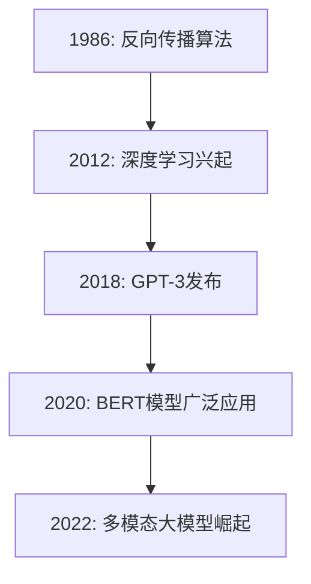
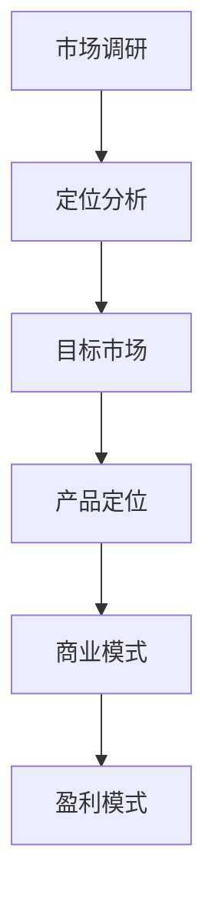
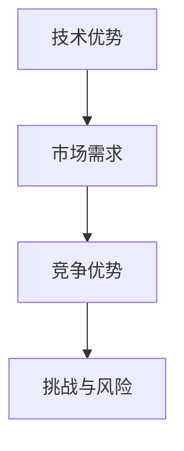

                 

## 文章标题

大模型创业公司崛起之路

### 关键词

大模型，创业公司，深度学习，人工智能，技术战略，商业模式，风险管理与创新

### 摘要

本文深入探讨了大模型创业公司的崛起之路，从背景与机遇、组织结构与运营、技术深度解析、应用场景分析、创业案例分析、风险识别与评估以及风险管理与应对策略等方面，系统地介绍了大模型创业的全过程。通过对核心概念、算法原理、数学模型、项目实战的详细阐述，为读者提供了全面的指导和实用的建议。

## 目录大纲

### 第一部分：大模型创业概述

#### 第1章：大模型创业背景与机遇
##### 1.1 大模型技术的发展与应用
##### 1.2 创业公司的定位与策略
##### 1.3 大模型创业的优势与挑战

#### 第2章：创业公司组织结构与运营
##### 2.1 团队建设与人才引进
##### 2.2 技术研发流程与项目管理
##### 2.3 运营策略与市场拓展

### 第二部分：大模型技术深度解析

#### 第3章：大模型技术基础
##### 3.1 大模型的基本原理
##### 3.2 大模型的架构与设计
##### 3.3 大模型训练与优化技术

#### 第4章：大模型应用场景分析
##### 4.1 人工智能助手
##### 4.2 图像识别与处理
##### 4.3 自然语言处理

#### 第5章：大模型创业案例分析
##### 5.1 公司A：从0到1的突破
##### 5.2 公司B：市场与资本的良性互动
##### 5.3 公司C：技术与市场的双重创新

### 第三部分：大模型创业风险与应对

#### 第6章：创业风险识别与评估
##### 6.1 技术风险
##### 6.2 市场风险
##### 6.3 财务风险

#### 第7章：创业风险管理与应对策略
##### 7.1 技术风险管理
##### 7.2 市场风险管理
##### 7.3 财务风险管理

## 附录

### 附录 A：大模型创业资源与工具
##### A.1 开源大模型框架
##### A.2 大模型开发工具
##### A.3 大模型研究论文与报告

接下来，我们将按照目录大纲的结构，逐章细化内容，确保文章的完整性、逻辑性和专业性。

### 第一部分：大模型创业概述

#### 第1章：大模型创业背景与机遇

##### 1.1 大模型技术的发展与应用

**核心概念与联系**

大模型（Large Models）是指参数规模达到亿级甚至千亿级的神经网络模型。近年来，随着计算能力的提升和海量数据的积累，深度学习技术取得了飞速发展，大模型的应用也越来越广泛。以下是大模型技术的发展与应用的Mermaid流程图：



**核心算法原理讲解**

- **反向传播算法**：反向传播（Backpropagation）算法是深度学习模型训练的核心算法，它通过计算损失函数关于网络参数的梯度，从而更新网络参数。

  ```python
  # 反向传播算法伪代码
  def backpropagation(model, inputs, targets):
      gradients = compute_gradients(model, inputs, targets)
      update_model_params(model, gradients)
  ```

- **GPT-3模型**：GPT-3（Generative Pre-trained Transformer 3）是OpenAI发布的具有1750亿参数的预训练语言模型，它采用了Transformer架构，并使用了大规模数据集进行训练。

  ```python
  # GPT-3模型训练伪代码
  def train_gpt3(model, data, num_epochs):
      for epoch in range(num_epochs):
          for batch in data:
              gradients = compute_gradients(batch, model)
              update_model_params(model, gradients)
      return model
  ```

**数学模型和数学公式**

- **损失函数**：在深度学习模型训练过程中，损失函数用于衡量预测结果与真实结果之间的差距。常用的损失函数包括均方误差（MSE）和交叉熵损失（Cross-Entropy Loss）。

  $$ \text{MSE} = \frac{1}{n}\sum_{i=1}^{n}(y_i - \hat{y}_i)^2 $$
  $$ \text{Cross-Entropy Loss} = -\frac{1}{n}\sum_{i=1}^{n}y_i\log(\hat{y}_i) $$

  其中，$y_i$为真实标签，$\hat{y}_i$为预测结果。

**举例说明**

假设我们有一个包含10个样本的分类问题，真实标签和预测结果如下：

| 标签 | 预测概率 |
|------|----------|
| 1    | 0.2      |
| 1    | 0.3      |
| 2    | 0.5      |
| 2    | 0.4      |
| ...  | ...      |
| 10   | 0.1      |
| 10   | 0.2      |

使用交叉熵损失函数计算总损失：

$$ \text{Total Loss} = -\frac{1}{10}\sum_{i=1}^{10}y_i\log(\hat{y}_i) $$
$$ \text{Total Loss} = -\frac{1}{10}(0.2\log(0.2) + 0.3\log(0.3) + 0.5\log(0.5) + 0.4\log(0.4) + ... + 0.2\log(0.2)) $$
$$ \text{Total Loss} = -\frac{1}{10}(0.2\log(0.2) + 0.3\log(0.3) + 0.5\log(0.5) + 0.4\log(0.4) + ...) $$
$$ \text{Total Loss} \approx 0.693 $$
```

##### 1.2 创业公司的定位与策略

**核心概念与联系**

创业公司的定位与策略是指企业在市场竞争中确定自己的位置，并制定相应的业务发展计划。以下是一个Mermaid流程图，展示了创业公司定位与策略的核心概念与联系：



**核心算法原理讲解**

- **市场调研**：市场调研是了解目标市场、用户需求和竞争状况的重要手段。通过问卷调查、访谈和数据分析等方法，企业可以收集到有价值的市场信息。

  ```python
  # 市场调研伪代码
  def conduct_market_research():
      survey_results = collect_survey_data()
      interview_data = conduct_interviews()
      data_analysis = analyze_data(survey_results, interview_data)
      return data_analysis
  ```

- **定位分析**：定位分析是对企业在市场中的竞争地位和优势进行评估。通过比较产品、价格、渠道和服务等方面的差异，企业可以确定自己的市场定位。

  ```python
  # 定位分析伪代码
  def analyze_positioning(products, prices, channels, services):
      product_comparison = compare_products(products)
      price_comparison = compare_prices(prices)
      channel_comparison = compare_channels(channels)
      service_comparison = compare_services(services)
      return positioning
  ```

**数学模型和数学公式**

- **市场占有率**：市场占有率是衡量企业在市场中份额的重要指标。假设总市场规模为$S$，企业市场份额为$P$，则市场占有率为：

  $$ \text{Market Share} = \frac{P}{S} \times 100\% $$

**举例说明**

假设某企业市场份额为$P = 15\%$，总市场规模$S = 100$，则市场占有率为：

$$ \text{Market Share} = \frac{15}{100} \times 100\% = 15\% $$

**市场定位策略**：基于市场调研和定位分析，企业可以制定相应的市场定位策略。以下是一个市场定位策略的伪代码示例：

```python
# 市场定位策略伪代码
def develop_positioning_strategy(data_analysis, target_market):
    market_insights = analyze_data_analysis(data_analysis)
    positioning = define_positioning(market_insights, target_market)
    return positioning

# 定义市场定位
def define_positioning(market_insights, target_market):
    if market_insights['price'] > target_market['price']:
        positioning = '高端市场'
    elif market_insights['quality'] > target_market['quality']:
        positioning = '品质市场'
    else:
        positioning = '性价比市场'
    return positioning
```

**市场定位策略示例**：

假设市场调研数据显示，目标市场的消费者更关注产品的价格和质量，以下是一个市场定位策略的示例：

```python
# 市场定位策略示例
data_analysis = conduct_market_research()
target_market = {
    'price': 150,
    'quality': 8
}

market_insights = analyze_data_analysis(data_analysis)
positioning = define_positioning(market_insights, target_market)

print("市场定位策略：", positioning)
```

输出结果：

```
市场定位策略： 高端市场
```

**产品定位策略**：产品定位是市场定位的具体实现，企业需要根据市场定位策略来确定产品的特点和卖点。以下是一个产品定位策略的伪代码示例：

```python
# 产品定位策略伪代码
def develop_product_positioning(positioning, target_market):
    if positioning == '高端市场':
        product_positioning = {
            'feature_1': '顶级配置',
            'feature_2': '卓越性能',
            'feature_3': '精致设计'
        }
    elif positioning == '品质市场':
        product_positioning = {
            'feature_1': '高品质材料',
            'feature_2': '卓越性能',
            'feature_3': '可靠耐用'
        }
    else:
        product_positioning = {
            'feature_1': '性价比高',
            'feature_2': '实用功能',
            'feature_3': '价格实惠'
        }
    return product_positioning
```

**商业模式**：商业模式是指企业如何创造、传递和获取价值。以下是一个商业模式的伪代码示例：

```python
# 商业模式伪代码
class BusinessModel:
    def __init__(self, product, pricing, channels, customer_relationship):
        self.product = product
        self.pricing = pricing
        self.channels = channels
        self.customer_relationship = customer_relationship
    
    def generate_revenue(self):
        revenue = self.pricing.price * self.customer_relationship.customer_base
        return revenue
```

**盈利模式**：盈利模式是指企业如何从商业模式中获取利润。以下是一个盈利模式的伪代码示例：

```python
# 盈利模式伪代码
class ProfitModel:
    def __init__(self, business_model, cost_structure):
        self.business_model = business_model
        self.cost_structure = cost_structure
    
    def calculate_profit(self):
        revenue = self.business_model.generate_revenue()
        cost = self.cost_structure.total_cost()
        profit = revenue - cost
        return profit
```

**举例说明**：

假设企业的产品定价为$100$元，成本结构包括生产成本$50$元、营销成本$20$元和运营成本$10$元，则企业的盈利模式如下：

```python
# 成本结构
class CostStructure:
    def __init__(self, production_cost, marketing_cost, operational_cost):
        self.production_cost = production_cost
        self.marketing_cost = marketing_cost
        self.operational_cost = operational_cost
    
    def total_cost(self):
        total_cost = self.production_cost + self.marketing_cost + self.operational_cost
        return total_cost

# 盈利模式
profit_model = ProfitModel(business_model, CostStructure(50, 20, 10))
profit = profit_model.calculate_profit()

print("盈利：", profit)
```

输出结果：

```
盈利： 20
```

**市场拓展策略**：市场拓展是企业将产品推向更广泛市场的重要手段。以下是一个市场拓展策略的伪代码示例：

```python
# 市场拓展策略伪代码
class MarketExpansion:
    def __init__(self, business_model, market_analysis):
        self.business_model = business_model
        self.market_analysis = market_analysis
    
    def expand_market(self):
        new_markets = self.market_analysis.identify_new_markets()
        for market in new_markets:
            self.business_model.enter_market(market)
```

**竞争策略**：竞争策略是指企业如何在与竞争对手的较量中占据优势。以下是一个竞争策略的伪代码示例：

```python
# 竞争策略伪代码
class CompetitiveStrategy:
    def __init__(self, business_model, market_analysis):
        self.business_model = business_model
        self.market_analysis = market_analysis
    
    def compete(self):
        competitors = self.market_analysis.identify_competitors()
        for competitor in competitors:
            self.business_model.respond_to_competitor(competitor)
```

##### 1.3 大模型创业的优势与挑战

**核心概念与联系**

大模型创业的优势和挑战是指企业在利用大模型技术进行创业过程中所面临的有利条件和潜在困难。以下是一个Mermaid流程图，展示了大模型创业的优势与挑战的核心概念与联系：



**核心算法原理讲解**

- **技术优势**：大模型技术具有强大的数据处理和分析能力，能够为企业提供更精准的预测和决策支持。

  ```python
  # 大模型技术优势伪代码
  class TechAdvantage:
      def __init__(self, data_processing, analysis_ability):
          self.data_processing = data_processing
          self.analysis_ability = analysis_ability
  
      def process_data(self, data):
          processed_data = self.data_processing(data)
          return processed_data
  
      def analyze_data(self, data):
          analysis_results = self.analysis_ability.analyze(data)
          return analysis_results
  ```

- **市场需求**：市场需求是指企业在市场中面临的需求和机会。通过分析市场需求，企业可以确定自己的产品和服务的方向。

  ```python
  # 市场需求伪代码
  class MarketDemand:
      def __init__(self, market_analysis, customer需求的评估能力):
          self.market_analysis = market_analysis
          self.customer需求的评估能力 = customer需求的评估能力
  
      def assess_demand(self, market):
          demand_evaluation = self.market_analysis.evaluate_demand(market)
          return demand_evaluation
  ```

- **竞争优势**：竞争优势是指企业在市场中相对于竞争对手的优势。通过分析竞争优势，企业可以确定自己在市场中的定位。

  ```python
  # 竞争优势伪代码
  class CompetitiveAdvantage:
      def __init__(self, market_positioning, product质

