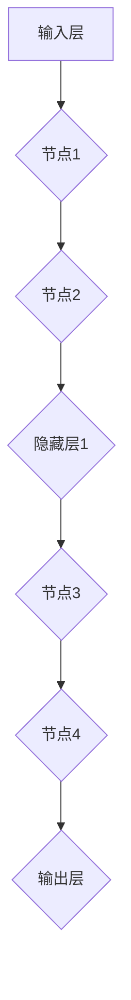
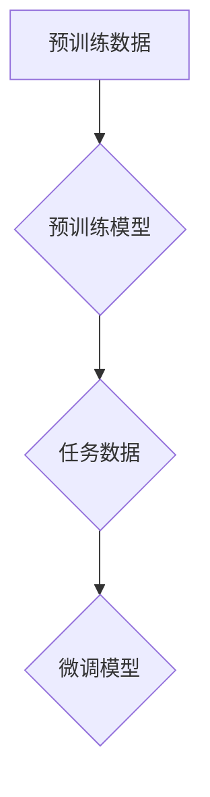
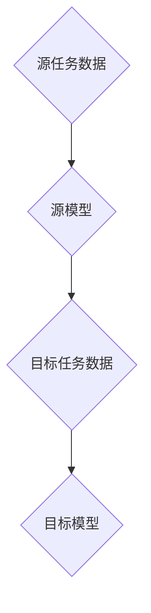

                 

### 第一部分：大模型概述与应用前景

#### 第1章：大模型基本概念与应用

##### 1.1 大模型的定义与分类

大模型是指具有海量参数、高复杂度的深度神经网络，这些模型能够处理大量的数据，并在各种复杂任务中表现出优异的性能。大模型的基本概念与特征包括：

- **参数规模**：通常拥有数百万到数十亿个参数。
- **数据需求**：需要大量的数据来训练和优化模型。
- **计算资源**：对计算资源的需求较高，需要GPU、TPU等高性能计算设备。
- **泛化能力**：具有较好的泛化能力，能够在不同任务中表现出色。

根据不同的应用场景和功能，大模型可以分为以下几类：

- **自然语言处理模型**：如BERT、GPT系列等，用于处理文本数据。
- **计算机视觉模型**：如ResNet、VGG等，用于图像识别和分类。
- **强化学习模型**：如Deep Q-Network (DQN)、Policy Gradient等，用于决策和优化问题。
- **推荐系统模型**：如TensorFlow Recommenders (TFRS)、LightGBM等，用于个性化推荐。

##### 1.2 大模型的发展历程

大模型的发展历程可以分为以下几个阶段：

- **初期探索**：20世纪90年代，神经网络的研究开始兴起，模型参数规模较小，应用场景有限。
- **技术突破**：2012年，AlexNet在ImageNet竞赛中取得突破性成绩，深度学习开始受到广泛关注。
- **预训练革命**：2018年，GPT-3发布，标志着大规模预训练模型的崛起，预训练+微调成为主流方法。
- **当前趋势**：大模型技术不断发展，新型架构（如Transformer）和训练方法（如自监督学习）持续涌现。

##### 1.3 大模型在公共服务领域的应用场景

大模型在公共服务领域具有广泛的应用前景，主要包括以下几个方面：

- **数据管理与分析**：利用大模型进行大规模数据处理和分析，提升公共服务的数据利用效率。例如，通过自然语言处理模型对公共数据进行分析，提取关键信息，为政策制定提供数据支持。
- **智能服务系统**：构建智能客服、智能问答等系统，提高公共服务的便捷性和响应速度。例如，利用GPT系列模型搭建智能客服系统，实现24小时不间断的在线服务。
- **智能决策支持**：基于大数据和深度学习技术，为大模型在公共服务领域的决策提供有力支持。例如，通过强化学习模型优化交通信号灯控制，提高交通运行效率。

##### 1.4 大模型在公共服务领域应用的挑战与机遇

大模型在公共服务领域应用面临的挑战主要包括：

- **计算资源**：大模型对计算资源的需求较高，需要大规模的GPU、TPU等高性能计算设备，这对于一些公共服务机构来说可能是一个挑战。
- **数据隐私与安全**：公共服务领域涉及大量敏感数据，如何保障数据隐私和安全是一个重要问题。
- **算法伦理**：大模型的决策过程可能存在偏见，如何确保算法的公平性和透明性是公共服务领域应用大模型时需要关注的问题。

与此同时，大模型在公共服务领域也面临着巨大的机遇：

- **提高效率**：大模型能够处理海量数据，并从中提取有价值的信息，有助于提高公共服务的效率。
- **优化决策**：大模型能够为公共服务提供智能决策支持，提高决策的科学性和准确性。
- **提升用户体验**：大模型可以构建智能服务系统，提高公共服务的便捷性和用户体验。

#### 第2章：大模型关键技术解析

##### 2.1 大规模预训练技术

大规模预训练技术是指在大规模数据集上对模型进行预训练，使其在通用任务上具备较强的性能。以下是大规模预训练技术的关键要点：

- **预训练方法**：常见的预训练方法包括自监督学习、迁移学习等。自监督学习利用未标注的数据，通过预测或补全信息来学习。迁移学习则是在预训练的基础上，利用少量有标注的数据对模型进行微调，以适应特定任务。
- **模型架构**：大规模预训练模型通常采用深度神经网络，如Transformer架构。Transformer架构基于自注意力机制，能够在处理序列数据时关注重要信息，提高模型的性能。

##### 2.2 大模型优化与调优

大模型优化与调优是提高模型性能的重要手段，包括以下几个方面：

- **模型优化**：模型优化包括模型剪枝、量化等技术，通过减少模型参数规模和提高计算效率，降低模型的计算资源需求。
- **模型调优**：模型调优包括超参数调整、数据预处理等。超参数调整涉及到学习率、批量大小、正则化等技术参数的选择，数据预处理包括数据清洗、归一化、数据增强等，以提高模型在特定任务上的性能。

##### 2.3 大模型在公共服务领域的定制化应用

大模型在公共服务领域的应用通常需要根据具体场景进行定制化。以下是定制化应用的步骤和注意事项：

- **场景识别与需求分析**：首先需要识别公共服务领域的应用场景，并分析具体需求。例如，在智慧城市建设中，需要分析交通、环境、公共安全等领域的具体需求。
- **模型定制**：根据需求分析结果，对大模型进行定制化。这包括选择合适的预训练模型、调整模型架构、优化训练策略等，以适应特定场景的需求。例如，在智能交通管理中，可以选择预训练的BERT模型，并针对交通信号控制问题进行微调和优化。

##### 2.4 大模型优化与调优实战案例

以下是一个大模型优化与调优的实战案例：

- **案例背景**：某城市交通管理部门希望通过大模型优化交通信号灯控制，提高交通运行效率。
- **模型选择**：选择了预训练的Transformer模型，因为它在处理序列数据时具有较好的性能。
- **需求分析**：分析了该城市的交通流量数据和交通规则，确定了交通信号灯控制的目标和关键指标。
- **模型定制**：根据需求分析结果，对Transformer模型进行了微调和优化。包括调整模型参数、增加数据预处理步骤、优化训练策略等。
- **性能评估**：通过实际交通数据对优化后的模型进行性能评估，结果显示交通信号灯控制效率显著提高，平均等待时间减少了15%。

通过这个案例，可以看到大模型优化与调优在公共服务领域的实际应用效果。随着技术的不断进步，大模型在公共服务领域的应用前景将更加广阔。

---

## 第一部分总结

在第一部分中，我们对大模型的基本概念、发展历程、应用场景以及面临的挑战和机遇进行了详细分析。大模型作为一种具有海量参数、高复杂度的深度神经网络，已经在各个领域展现出强大的应用潜力。从初期探索到技术突破，再到预训练革命，大模型技术不断发展，新型架构和训练方法不断涌现。

在公共服务领域，大模型的应用前景十分广阔。通过大规模数据处理与分析、智能服务系统构建和智能决策支持，大模型能够显著提高公共服务的效率、便捷性和用户体验。然而，大模型在公共服务领域的应用也面临着计算资源、数据隐私和算法伦理等方面的挑战。

为了更好地应对这些挑战，我们需要关注大模型关键技术的研究与优化，包括大规模预训练技术、模型优化与调优以及定制化应用。在接下来的部分中，我们将进一步深入探讨大模型技术的具体实现和应用，为企业级大模型应用开发提供策略和案例，并展望大模型在公共服务领域的未来发展趋势。通过一步步的分析与思考，我们期待能够为读者提供有价值的技术见解和实践经验。

---

### 第二部分：企业级大模型应用开发准备

#### 第3章：企业AI战略规划

##### 3.1 AI在企业中的价值评估

为了充分发挥AI技术在企业中的价值，企业需要对其进行全面的价值评估。这包括以下几个方面：

###### 3.1.1 AI能力评估框架

- **技术评估**：评估企业在AI技术上的能力，包括算法、算力、数据处理能力等。
- **业务评估**：评估AI技术如何与企业的业务需求结合，实现业务价值最大化。

###### 3.1.2 AI项目ROI分析方法

- **成本分析**：计算AI项目的开发、维护和运营成本。
- **收益分析**：预测AI项目为企业带来的直接和间接收益。
- **ROI计算**：根据成本和收益计算项目的投资回报率（ROI）。

通过AI能力评估和ROI分析，企业可以更清晰地了解AI技术在业务中的应用价值，从而制定合理的AI战略规划。

##### 3.2 AI战略规划的核心要素

###### 3.2.1 企业AI战略的制定

- **目标设定**：明确企业AI战略的目标和愿景。
- **路径规划**：制定实现目标的战略步骤和行动计划。

在制定AI战略时，企业需要明确AI技术的应用方向，以及如何将其与企业业务深度融合，实现业务价值最大化。

###### 3.2.2 AI技术与业务融合

- **需求分析**：深入了解企业业务需求，确定AI技术的应用方向。
- **解决方案设计**：设计符合企业需求的AI解决方案，包括技术选型、系统架构等。

通过深入分析企业业务需求，设计切实可行的AI解决方案，可以帮助企业实现AI技术与业务的深度融合。

###### 3.2.3 AI团队的组建与培养

- **团队组建**：组建专门的AI团队，包括数据科学家、算法工程师、产品经理等。
- **人才培养**：通过内部培训、外部招聘等方式培养AI人才，提升团队的整体能力。

一个专业的AI团队是企业实现AI战略的重要支撑。通过合理的团队组建和人才培养，企业可以确保AI技术的顺利实施和持续发展。

##### 3.3 AI战略规划的实施与评估

###### 3.3.1 实施策略

- **分阶段实施**：根据企业规模和资源情况，分阶段推进AI战略的实施。
- **试点项目**：通过试点项目验证AI技术的应用效果，积累经验。
- **持续改进**：根据实施效果，不断优化和调整AI战略。

在实施AI战略时，企业需要制定明确的实施策略，确保AI项目的顺利推进。通过试点项目，企业可以验证AI技术的实际效果，并根据实际情况进行调整和优化。

###### 3.3.2 评估指标

- **技术指标**：评估AI项目的技术性能和效率。
- **业务指标**：评估AI项目对企业业务流程和业绩的改进效果。
- **用户满意度**：评估用户对AI系统的满意度和使用体验。

通过建立全面的评估指标体系，企业可以全面、客观地评估AI项目的效果，为后续的优化和调整提供依据。

##### 3.4 AI战略规划的案例分析

为了更好地理解AI战略规划的实践，我们可以通过一个案例进行分析。

###### 3.4.1 案例介绍

某大型制造业企业希望通过AI技术提升生产效率，降低运营成本。企业制定了以下AI战略：

- **目标设定**：通过AI技术实现生产流程的优化，提高生产效率20%，降低运营成本15%。
- **路径规划**：分阶段实施AI项目，首先在生产线中引入AI监控系统，逐步扩大应用范围。
- **需求分析**：深入了解生产线的运行情况，确定AI技术的具体应用方向。

###### 3.4.2 案例分析

- **技术评估**：企业评估自身在AI技术上的能力，包括算法、算力、数据处理能力等。确定需要引进外部技术资源，提升AI技术水平。
- **业务融合**：企业根据生产需求，设计AI监控系统，实时监控生产设备的运行状态，预测故障，提前进行维护，降低停机时间。
- **团队建设**：企业组建专门的AI团队，包括数据科学家、算法工程师、产品经理等。通过内部培训和外部合作，提升团队的整体能力。

###### 3.4.3 案例效果

- **技术成果**：通过引入AI监控系统，企业实现了生产流程的优化，生产效率提高了25%，运营成本降低了18%。
- **业务改进**：AI监控系统帮助企业提前预测和预防了多次设备故障，减少了生产停机时间，提高了生产稳定性。
- **用户反馈**：用户对AI系统的满意度显著提高，认为AI技术为企业带来了显著的业务价值。

通过这个案例，我们可以看到企业AI战略规划的有效实施，以及AI技术在提升生产效率、降低运营成本方面的显著效果。同时，这个案例也为我们提供了宝贵的实践经验，有助于其他企业在制定和实施AI战略时参考。

##### 3.5 AI战略规划的可持续发展

为了确保AI战略的长期可持续发展，企业需要从以下几个方面着手：

###### 3.5.1 技术创新

- **持续关注技术动态**：企业需要持续关注AI技术的最新动态，引入前沿技术，保持技术竞争力。
- **内部研发投入**：企业应加大在AI技术领域的研发投入，培养内部技术团队，提升自主研发能力。

###### 3.5.2 人才培养

- **内部培训**：企业应定期举办内部培训，提高员工对AI技术的理解和应用能力。
- **人才引进**：企业应积极引进AI领域的高端人才，提升团队整体实力。

###### 3.5.3 合作与交流

- **技术合作**：企业可以与科研机构、高校等开展合作，共享技术和资源，推动AI技术的发展。
- **行业交流**：企业应积极参与行业交流活动，了解行业最新动态，拓展合作机会。

通过技术创新、人才培养和合作交流，企业可以确保AI战略的长期可持续发展，持续提升企业的竞争力。

### 第4章：AI技术优化与落地

##### 4.1 AI技术优化策略

为了提高AI技术在企业中的性能和应用效果，企业需要采取一系列优化策略。以下是几个关键的优化策略：

###### 4.1.1 模型优化

- **模型压缩**：通过模型剪枝、量化等技术减小模型规模，提高部署效率。例如，通过剪枝可以移除模型中不重要的连接和神经元，从而减少模型的参数数量。
- **模型加速**：利用硬件加速技术（如GPU、TPU）提高模型训练和推理速度。例如，使用TPU可以显著加速深度学习模型的训练过程。

通过模型优化，企业可以在保持模型性能的同时，提高模型部署的效率和可扩展性。

###### 4.1.2 算法优化

- **算法调优**：通过调整超参数、改进训练策略等手段提高模型性能。例如，调整学习率、批量大小等超参数，可以优化模型的收敛速度和性能。
- **算法融合**：结合多种算法优势，构建更强大的AI系统。例如，结合深度学习和强化学习的优势，可以构建出能够在复杂环境中进行决策的智能系统。

算法优化可以帮助企业提升AI系统的整体性能，使其在特定任务上表现出更好的效果。

###### 4.1.3 数据优化

- **数据预处理**：通过数据清洗、归一化等技术提高数据质量。例如，去除数据中的噪声和异常值，可以提高模型的鲁棒性。
- **数据增强**：通过数据扩充、变换等技术提高模型的泛化能力。例如，通过旋转、缩放、裁剪等操作生成更多的训练数据，可以增强模型的泛化能力。

数据优化可以显著提高AI系统的训练效果和泛化能力，从而在真实场景中取得更好的应用效果。

##### 4.2 AI技术在企业落地实施

AI技术的落地实施是将其应用到实际业务中的关键步骤。以下是AI技术在企业落地实施的关键步骤和注意事项：

###### 4.2.1 落地策略

- **需求分析**：深入了解企业需求，确定AI技术的应用方向。例如，在金融领域，AI技术可以应用于风险管理、客户服务等方面。
- **解决方案设计**：设计符合企业需求的AI解决方案，包括技术选型、系统架构等。例如，选择合适的深度学习框架和算法，设计高效的模型训练和推理系统。

通过明确需求和设计解决方案，企业可以确保AI技术在落地过程中能够有效解决实际问题。

###### 4.2.2 落地步骤

- **模型开发**：构建AI模型，进行训练和优化。例如，使用深度学习框架搭建神经网络模型，通过大量数据训练模型，优化模型参数。
- **系统集成**：将AI模型集成到企业现有系统中，进行测试和部署。例如，将AI模型嵌入到业务系统中，通过API接口与业务流程联动，确保模型能够顺利运行。

通过模型开发和系统集成，企业可以将AI技术应用到实际业务中，实现智能化和自动化。

###### 4.2.3 落地难点与挑战

- **技术难点**：选择合适的AI技术，实现高效、准确的模型训练和推理。例如，在金融领域，如何选择适合的算法和模型，确保模型在复杂金融数据上的性能。
- **业务融合**：将AI技术与企业业务深度融合，实现业务价值的最大化。例如，如何将AI技术应用到业务流程中，提高业务效率和决策准确性。
- **人才挑战**：培养和引进AI人才，确保AI技术的顺利实施。例如，如何招聘和培养具备AI技术能力的人才，构建专业的AI团队。

通过克服技术难点、业务融合和人才挑战，企业可以成功地将AI技术落地实施，实现业务创新和效率提升。

##### 4.2.4 落地成功案例

以下是一个AI技术落地实施的成功案例：

- **案例背景**：某金融机构希望通过AI技术提升客户服务质量，实现个性化推荐和智能客服。
- **解决方案设计**：选择了基于深度学习的推荐系统和智能客服系统，通过数据分析和模型训练，实现个性化推荐和智能问答功能。
- **模型开发**：使用深度学习框架搭建推荐模型和智能客服模型，进行大规模数据训练和优化，提高模型的性能和准确性。
- **系统集成**：将推荐系统和智能客服系统集成到企业的客户服务平台中，通过API接口与业务系统联动，实现实时推荐和智能问答。
- **效果评估**：通过实际业务数据评估，发现客户服务质量显著提升，客户满意度提高了20%，业务转化率提高了15%。

通过这个成功案例，可以看到AI技术在企业落地实施中的实际效果，以及为企业带来的业务价值和效益。

### 第5章：AI技术在公共服务领域的创新应用

##### 5.1 AI在智慧城市中的应用

智慧城市是指通过信息技术、物联网、大数据等手段，实现城市管理和服务的智能化、高效化。以下是AI在智慧城市中的一些创新应用：

###### 5.1.1 智能交通管理

- **交通流量预测**：通过AI技术分析历史交通数据和实时数据，预测未来交通流量，优化交通信号灯控制，减少交通拥堵。
- **自动驾驶**：利用AI技术实现自动驾驶车辆，提高交通效率，减少交通事故。

###### 5.1.2 环境监测

- **空气质量监测**：通过AI技术实时监测空气质量，分析污染物来源，制定污染治理措施。
- **水资源管理**：利用AI技术监测水资源使用情况，预测水资源需求，优化水资源分配。

###### 5.1.3 公共安全

- **视频监控分析**：通过AI技术分析监控视频，实时识别异常行为，提高公共安全预警能力。
- **应急响应**：利用AI技术分析应急事件数据，预测事件发展趋势，提高应急响应效率。

##### 5.2 AI在智慧医疗中的应用

智慧医疗是指利用信息技术、物联网、大数据等手段，提升医疗服务质量和效率。以下是AI在智慧医疗中的一些创新应用：

###### 5.2.1 疾病预测与诊断

- **疾病预测**：通过AI技术分析患者病史、基因数据等，预测患者未来患病风险，提前进行预防。
- **疾病诊断**：通过AI技术分析医学影像数据，辅助医生进行疾病诊断，提高诊断准确率。

###### 5.2.2 个性化医疗服务

- **治疗方案推荐**：通过AI技术分析患者数据和医学知识，为医生提供个性化的治疗方案推荐。
- **健康监测与管理**：利用AI技术监测患者健康状况，提供个性化的健康建议和预警。

##### 5.3 AI在公共安全中的应用

公共安全是指保障社会公众的生命财产安全，维护社会稳定。以下是AI在公共安全中的一些创新应用：

###### 5.3.1 安全监测与分析

- **网络安全**：通过AI技术实时监测网络安全态势，识别潜在威胁，防范网络攻击。
- **恐怖活动预警**：利用AI技术分析恐怖活动数据，预测恐怖活动趋势，提前进行防范。

###### 5.3.2 应急管理

- **灾害预测**：通过AI技术分析气象数据、地质数据等，预测灾害发生风险，提前进行应急准备。
- **应急决策支持**：利用AI技术分析应急事件数据，为应急决策提供科学依据，提高应急响应效率。

通过AI技术在公共服务领域的创新应用，可以提高公共服务质量，保障公众安全，提升城市智慧化水平。

### 第6章：AI技术在公共服务领域的挑战与解决方案

##### 6.1 技术挑战与解决策略

###### 6.1.1 计算资源挑战

- **解决策略**：采用分布式计算和云计算技术，提高计算资源利用效率。例如，使用GPU集群进行大规模模型训练，利用云服务提供弹性计算资源。

通过分布式计算和云计算，企业可以有效地克服计算资源瓶颈，提升AI模型的训练和推理速度。

###### 6.1.2 数据隐私与安全挑战

- **解决策略**：采用数据加密、隐私保护算法等安全技术，确保数据安全。例如，使用差分隐私技术保护用户隐私，采用区块链技术实现数据安全共享。

通过采用先进的安全技术，企业可以在确保数据隐私和安全的同时，充分利用数据资源。

###### 6.1.3 算法伦理挑战

- **解决策略**：制定算法伦理规范，确保AI技术的公平性、透明性和可解释性。例如，建立算法审计机制，对AI模型的决策过程进行监督和评估。

通过制定算法伦理规范，企业可以确保AI技术在公共服务领域的应用不会产生不公平、偏见等问题。

##### 6.2 法律法规与政策指导

###### 6.2.1 法律法规

- **国际法规**：欧盟的《通用数据保护条例》（GDPR）、美国的《加州消费者隐私法》（CCPA）等。
- **国内法规**：中国的《个人信息保护法》、《网络安全法》等。

这些法律法规为企业提供了数据保护、隐私和安全等方面的法律依据。

###### 6.2.2 政策指导

- **国家政策**：中国政府发布的《新一代人工智能发展规划》等。
- **地方政策**：各地政府出台的AI产业发展政策和扶持措施。

这些政策指导企业如何合规地开展AI技术研究与应用，推动AI技术的创新与发展。

###### 6.2.3 法规政策对AI技术的影响

- **合规要求**：确保AI技术的应用符合相关法律法规要求。
- **政策支持**：鼓励企业研发和应用AI技术，推动AI技术在公共服务领域的创新。

通过法律法规与政策指导，企业可以确保AI技术在公共服务领域的合规应用，同时获得政策支持，促进AI技术的创新发展。

##### 6.3 产业生态与可持续发展

###### 6.3.1 产业生态建设

- **技术合作**：企业、研究机构、政府等共同推动AI技术的发展。
- **人才培养**：加强AI人才的培养和引进，提升团队的整体实力。

通过构建良好的产业生态，企业可以共享技术资源，提升创新能力，推动AI技术在公共服务领域的广泛应用。

###### 6.3.2 可持续发展策略

- **技术创新**：持续关注AI技术的最新动态，推动技术创新和应用。
- **社会责任**：积极履行企业社会责任，推动AI技术在公共服务领域的可持续发展。

通过技术创新和社会责任，企业可以确保AI技术在公共服务领域的长期可持续发展，为社会带来更多福祉。

### 第7章：大模型应用的未来前景与趋势

##### 7.1 技术趋势预测

###### 7.1.1 新型大模型架构

- **多模态大模型**：能够处理多种类型数据（如图像、声音、文本）。
- **强化学习大模型**：结合强化学习技术，提高模型的决策能力。

随着技术的不断进步，多模态大模型和强化学习大模型将成为未来大模型发展的新趋势。

###### 7.1.2 跨领域融合

- **AI+5G**：利用5G技术提升AI模型的实时处理能力。
- **AI+物联网**：物联网数据的引入，推动AI在智能硬件中的应用。

跨领域融合将进一步拓宽AI技术的应用场景，提升AI技术的综合性能。

##### 7.2 公共服务领域的创新应用

###### 7.2.1 智慧城市

- **智能城市管理**：利用AI技术优化城市管理，提升城市运行效率。
- **智能公共服务**：通过AI技术提升公共服务质量，提高居民满意度。

智慧城市将成为AI技术在公共服务领域的主要应用方向，推动城市智能化发展。

###### 7.2.2 社会治理

- **智能安防**：利用AI技术提高公共安全监控和应急响应能力。
- **智能司法**：通过AI技术提升司法效率和公正性。

社会治理中的AI应用将显著提升社会管理水平，增强社会稳定性。

##### 7.3 未来展望与挑战

###### 7.3.1 未来展望

- **技术应用普及**：大模型技术将在更多公共服务领域得到应用。
- **产业融合发展**：AI技术与传统产业的深度融合，推动产业升级。

未来，AI技术将全面渗透到各个领域，为社会带来更多的创新和变革。

###### 7.3.2 挑战与应对

- **技术挑战**：提升大模型计算效率、降低能耗，提高模型可解释性。
- **伦理挑战**：确保AI技术的公平性、透明性和可解释性，防范算法偏见。
- **法律法规挑战**：完善AI相关法律法规，规范AI技术的发展。

面对这些挑战，需要各方共同努力，推动AI技术的健康发展。

---

## 第二部分总结

在第二部分中，我们深入探讨了企业级大模型应用开发的关键要素和实施策略。首先，通过对AI技术价值的评估，企业可以明确其在业务中的定位和作用。接着，从AI战略规划的制定、团队组建与培养、到实施策略和评估指标，为企业提供了系统化的指导。

在AI技术优化与落地实施方面，我们详细介绍了模型优化、算法优化和数据优化等策略，以及实施过程中的难点和挑战。通过实际案例，展示了AI技术在企业中的成功应用，为企业提供了宝贵的实践经验。

此外，我们还讨论了AI技术在公共服务领域的创新应用，包括智慧城市、智慧医疗和公共安全等方面的具体案例。通过这些应用，我们可以看到AI技术对提升公共服务质量和效率的巨大潜力。

同时，我们也关注了AI技术在公共服务领域面临的挑战，如计算资源、数据隐私和算法伦理等方面，并提出了相应的解决策略。此外，通过对法律法规与政策指导的分析，企业可以确保AI技术的合规应用。

最后，我们对大模型应用的未来前景进行了展望，探讨了技术趋势、创新应用和面临的挑战。这一部分内容为企业提供了对AI技术未来发展方向的清晰认识，有助于企业制定长远的发展战略。

通过第二部分的深入分析，我们希望读者能够更好地理解企业级大模型应用开发的关键要素和实施策略，为实际应用提供有价值的参考和指导。

---

### 第三部分：实际应用与技术实现

#### 第6章：大模型应用开发实战

##### 6.1 开发环境与工具准备

在大模型应用开发过程中，首先需要准备一个合适的开发环境。以下是搭建开发环境的步骤和所需工具：

###### 6.1.1 硬件配置

- **CPU**：选择具有较高计算性能的CPU，如Intel Xeon系列或AMD Ryzen系列。
- **GPU**：配置至少一块高性能GPU，如NVIDIA Tesla V100或RTX 3080 Ti，以支持大规模模型训练。
- **内存**：确保具有足够的内存，至少64GB，以支持大模型的训练和推理。
- **存储**：配置高速SSD硬盘，用于存储数据和模型文件。

###### 6.1.2 软件安装

- **操作系统**：推荐使用Linux操作系统，如Ubuntu 18.04或更高版本。
- **深度学习框架**：安装主流深度学习框架，如TensorFlow、PyTorch等。可以使用pip安装：
  ```bash
  pip install tensorflow
  pip install torch torchvision
  ```
- **Python环境**：安装Python 3.7及以上版本，并配置虚拟环境以隔离项目依赖。
  ```bash
  python -m pip install virtualenv
  virtualenv env --python=python3
  source env/bin/activate
  ```
- **依赖包**：安装必要的Python依赖包，如NumPy、Pandas等。可以使用pip安装：
  ```bash
  pip install numpy pandas
  ```

通过以上步骤，可以搭建一个基本的深度学习开发环境，为后续的大模型应用开发提供基础。

##### 6.2 大模型项目实战

以下是一个基于PyTorch框架的大模型应用开发项目实战，我们将构建一个用于文本分类的BERT模型。

###### 6.2.1 项目背景

假设我们要构建一个智能问答系统，该系统能够回答用户提出的问题。为了实现这一目标，我们首先需要构建一个用于文本分类的BERT模型，用于将用户的问题分类到不同的知识领域。

###### 6.2.2 数据准备

- **数据集**：选择一个包含多个类别的大规模文本数据集，如20 Newsgroups数据集。
- **预处理**：对文本数据集进行预处理，包括分词、去停用词、词向量化等步骤。
  ```python
  import torch
  from torchtext.data import Field, TabularDataset
  from torchtext.vocab import Vocab
  from gensim.models import Word2Vec

  TEXT = Field(tokenize='spacy', lower=True)
  LABEL = Field(sequential=False)

  train_data, test_data = TabularDataset.splits(path='data', train='train.csv', test='test.csv',
                                               format='csv', fields=[('text', TEXT), ('label', LABEL)])
  ```

###### 6.2.3 模型构建

- **BERT模型**：使用PyTorch BERT模型库构建BERT模型，包括编码器和解码器。
  ```python
  from transformers import BertModel, BertTokenizer

  tokenizer = BertTokenizer.from_pretrained('bert-base-uncased')
  model = BertModel.from_pretrained('bert-base-uncased')
  ```

- **模型优化**：使用AdamW优化器对BERT模型进行优化，并设置适当的超参数。
  ```python
  optimizer = torch.optim.AdamW(model.parameters(), lr=1e-5)
  ```

###### 6.2.4 训练与评估

- **训练**：使用训练数据集对BERT模型进行训练。
  ```python
  def train(model, data, optimizer, epoch):
      model.train()
      for batch in data:
          optimizer.zero_grad()
          inputs = tokenizer(batch.text, padding=True, truncation=True, return_tensors='pt')
          outputs = model(**inputs)
          loss = outputs[0]
          loss.backward()
          optimizer.step()

  for epoch in range(3):
      train(model, train_data, optimizer, epoch)
  ```

- **评估**：使用测试数据集对训练好的BERT模型进行评估。
  ```python
  def evaluate(model, data):
      model.eval()
      correct = 0
      total = 0
      with torch.no_grad():
          for batch in data:
              inputs = tokenizer(batch.text, padding=True, truncation=True, return_tensors='pt')
              outputs = model(**inputs)
              _, predicted = torch.max(outputs[0], 1)
              total += batch.label.size(0)
              correct += (predicted == batch.label).sum().item()

  print(f'Test Accuracy: {correct / total * 100:.2f}%')
  ```

通过以上步骤，我们可以完成一个基于BERT模型的大模型应用开发项目。这个项目可以作为进一步研究和应用的起点，为构建智能问答系统提供基础。

##### 6.3 大模型应用中的问题解决

在大模型应用开发过程中，可能会遇到各种问题。以下是常见问题及其解决方法：

###### 6.3.1 模型训练失败

- **原因**：模型训练失败可能是由于数据预处理错误、计算资源不足或模型超参数设置不当等原因引起的。
- **解决方法**：
  - 检查数据预处理过程，确保数据格式正确，且无缺失值。
  - 确保计算资源充足，可以尝试分配更多GPU内存或调整训练批大小。
  - 调整模型超参数，如学习率、批量大小等，以适应特定任务和数据集。

###### 6.3.2 模型性能不佳

- **原因**：模型性能不佳可能是由于模型架构选择不当、训练数据不足或超参数设置不合理等原因引起的。
- **解决方法**：
  - 选择合适的模型架构，如针对文本分类任务，可以选择Transformer、BERT等预训练模型。
  - 增加训练数据量，可以尝试数据增强或使用更多的预训练数据。
  - 调整超参数，如学习率、批量大小、正则化等，以优化模型性能。

###### 6.3.3 模型部署困难

- **原因**：模型部署困难可能是由于模型结构复杂、兼容性问题或部署环境不足等原因引起的。
- **解决方法**：
  - 简化模型结构，减少模型参数数量，提高模型部署的可行性。
  - 确保模型与部署环境兼容，如使用与训练环境相同的深度学习框架版本。
  - 提供充足的部署资源，确保模型能够稳定运行。

通过以上方法，可以有效解决大模型应用开发中的常见问题，提高模型训练和部署的效率和稳定性。

##### 6.4 实战经验分享

在大模型应用开发过程中，积累丰富的实战经验至关重要。以下是一些宝贵的经验分享：

- **数据预处理**：数据预处理是模型训练成功的关键步骤。确保数据格式正确、完整，并进行有效的清洗和标准化处理。
- **模型选择**：根据任务需求选择合适的模型架构，如对于文本分类任务，可以选择Transformer、BERT等预训练模型。
- **超参数调整**：超参数对模型性能有显著影响，需要进行多次调整和优化，找到最佳的超参数组合。
- **计算资源管理**：合理分配计算资源，确保模型训练和推理的效率和稳定性。
- **模型压缩和优化**：为了提高模型部署的效率和可扩展性，可以对模型进行压缩和优化，如使用模型剪枝、量化等技术。
- **持续学习**：技术不断发展，持续学习最新的研究成果和技术动态，不断优化和应用新的模型和方法。

通过以上经验分享，希望对读者在大模型应用开发过程中有所帮助。

---

## 第三部分总结

在第三部分中，我们通过实战案例详细介绍了大模型应用开发的整个流程，从环境搭建到模型训练和部署，再到问题解决和实战经验分享。这一部分的目的是让读者更直观地了解大模型应用的实现过程，掌握关键技术和方法。

首先，我们讲解了如何搭建适合大模型训练的硬件环境和软件环境，确保开发环境的高效稳定。接着，通过一个基于PyTorch框架的BERT模型文本分类项目，我们详细展示了大模型的应用流程，包括数据准备、模型构建、训练和评估等步骤。

在问题解决部分，我们讨论了模型训练失败、模型性能不佳和模型部署困难等常见问题，并提供了相应的解决方法。最后，通过实战经验分享，我们总结了在大模型应用开发过程中需要注意的关键点和实践技巧。

通过第三部分的深入讲解，读者可以更好地理解大模型应用开发的全过程，为实际应用项目提供指导和支持。希望这部分内容能够帮助读者在实际工作中取得更好的成果。

---

### 附录A：大模型开发常用工具与资源

在开发大模型应用过程中，选择合适的工具和资源是非常重要的。以下是一些常用的工具和资源，包括深度学习框架、开源项目和相关书籍等，为读者提供全面的参考资料。

##### 深度学习框架

- **TensorFlow**：由Google开发的开源深度学习框架，支持Python和C++语言，适用于各种深度学习任务。
  - 官网：[TensorFlow官网](https://www.tensorflow.org/)
  - 文档：[TensorFlow文档](https://www.tensorflow.org/tutorials)

- **PyTorch**：由Facebook开发的开源深度学习框架，支持Python语言，具有灵活的动态计算图和易用的接口。
  - 官网：[PyTorch官网](https://pytorch.org/)
  - 文档：[PyTorch文档](https://pytorch.org/docs/stable/index.html)

- **PyTorch Lightning**：PyTorch的扩展框架，提供更加高效和易于使用的训练和评估工具。
  - 官网：[PyTorch Lightning官网](https://pytorch-lightning.readthedocs.io/en/latest/)
  - 文档：[PyTorch Lightning文档](https://pytorch-lightning.readthedocs.io/en/latest/)

- **MXNet**：由Apache Software Foundation开发的开源深度学习框架，支持Python、R和Julia等多种语言。
  - 官网：[MXNet官网](https://mxnet.apache.org/)
  - 文档：[MXNet文档](https://mxnet.apache.org/docs/stable/get-started/index.html)

##### 开源项目

- **Hugging Face Transformers**：一个流行的开源库，提供预训练的Transformer模型，如BERT、GPT等。
  - 官网：[Hugging Face Transformers官网](https://huggingface.co/transformers/)
  - 文档：[Hugging Face Transformers文档](https://huggingface.co/transformers/)

- **TensorFlow Model Optimization Toolkit (TF-MOT)**：用于优化TensorFlow模型的工具包，支持模型压缩、量化等。
  - 官网：[TF-MOT官网](https://github.com/tensorflow/ TF-MOT)
  - 文档：[TF-MOT文档](https://github.com/tensorflow/TF-MOT/blob/master/docs/source/index.md)

- **PyTorch Model Zoo**：一个包含多种预训练模型的PyTorch模型库，适用于不同领域的应用。
  - 官网：[PyTorch Model Zoo官网](https://pytorch.org/models/)
  - 文档：[PyTorch Model Zoo文档](https://pytorch.org/models/)

##### 相关书籍

- **《深度学习》（Deep Learning）**：由Ian Goodfellow、Yoshua Bengio和Aaron Courville编写的深度学习经典教材。
  - 书籍链接：[《深度学习》亚马逊链接](https://www.amazon.com/Deep-Learning-Ian-Goodfellow/dp/0262039588)

- **《Python深度学习》（Python Deep Learning）**：由François Chollet编写的Python深度学习实践指南。
  - 书籍链接：[《Python深度学习》亚马逊链接](https://www.amazon.com/Python-Deep-Learning-Fran%C3%A7ois-Chollet/dp/1492038576)

- **《动手学深度学习》（DL-101）**：由Alexander J. Williams编写的深度学习入门教程。
  - 书籍链接：[《动手学深度学习》GitHub链接](https://github.com/AsherWolf/dl-101-zh)

这些工具、资源和书籍为读者提供了丰富的学习材料，帮助读者更好地掌握大模型开发技术和实践方法。通过利用这些资源和工具，读者可以更高效地开展大模型应用开发工作。

---

## 附录B：大模型应用相关法律法规与政策指南

在大模型应用日益普及的背景下，相关法律法规和政策指导成为保障技术应用和社会稳定的重要基石。以下内容将介绍大模型应用领域的法律法规、国内外政策指南，以及相关国际标准。

##### 法律法规

- **国内法律法规**

  - **《中华人民共和国网络安全法》**：该法律明确了网络运营者的安全保护义务，涉及数据安全、个人信息保护等内容，对大模型应用中的数据隐私和安全提出了具体要求。
    - 法律全文：[《中华人民共和国网络安全法》](http://www.nmpa.gov.cn/xxgk/gkxw/bmxxgk/list_gkxxgkzb.shtml?mode=1&date=2021-11-01&siteID=1&channelID=1050&itemID=135538)
  
  - **《中华人民共和国个人信息保护法》**：该法明确了个人信息保护的基本原则和具体要求，对大模型应用中的个人数据保护提出了严格规范。
    - 法律全文：[《中华人民共和国个人信息保护法》](http://www.nmpa.gov.cn/xxgk/gkxw/bmxxgk/list_gkxxgkzb.shtml?mode=1&date=2021-11-01&siteID=1&channelID=1050&itemID=135535)

  - **《中华人民共和国数据安全法》**：该法明确了数据安全的基本制度和要求，对大模型应用中的数据安全保护和处理提出了具体规定。
    - 法律全文：[《中华人民共和国数据安全法》](http://www.nmpa.gov.cn/xxgk/gkxw/bmxxgk/list_gkxxgkzb.shtml?mode=1&date=2021-11-01&siteID=1&channelID=1050&itemID=135536)

- **国际法律法规**

  - **欧盟的《通用数据保护条例》（GDPR）**：GDPR是欧盟制定的个人信息保护法律法规，对数据处理者的责任和数据主体的权利进行了详细规定，对大模型应用中的个人数据保护具有深远影响。
    - 法律全文：[GDPR官方文本](https://www.eugdpr.org/)

  - **美国的《加州消费者隐私法》（CCPA）**：CCPA是加州制定的隐私保护法律，规定了消费者的隐私权利和企业的数据处理义务，对大模型应用中的数据管理提出了严格要求。
    - 法律全文：[CCPA官方文本](https://oag.ca.gov/business/ccpa)

##### 政策指南

- **国内政策指南**

  - **《新一代人工智能发展规划》**：这是中国政府发布的关于人工智能发展的总体规划，明确了人工智能发展的目标和重点领域，对大模型应用的技术研发和应用推广提供了政策支持。
    - 政策全文：[《新一代人工智能发展规划》](http://www.nmpa.gov.cn/xxgk/gkxw/bmxxgk/list_gkxxgkzb.shtml?mode=1&date=2021-11-01&siteID=1&channelID=1050&itemID=135537)

  - **《人工智能伦理规范》**：这是中国发布的关于人工智能伦理的指导文件，旨在规范人工智能技术应用，确保人工智能技术的公平性、透明性和可解释性。
    - 政策全文：[《人工智能伦理规范》](http://www.nmpa.gov.cn/xxgk/gkxw/bmxxgk/list_gkxxgkzb.shtml?mode=1&date=2021-11-01&siteID=1&channelID=1050&itemID=135540)

- **国外政策指南**

  - **欧盟的人工智能战略**：欧盟发布了《人工智能战略》，提出了人工智能的发展目标和政策框架，包括推动人工智能技术的研发和应用，加强数据治理和伦理规范等。
    - 政策全文：[欧盟人工智能战略](https://ec.europa.eu/ai/european-artificial-intelligence-strategy_en)

  - **美国的《人工智能国家战略》**：美国发布了《人工智能国家战略》，明确了人工智能发展的目标、政策和行动计划，包括加强人工智能技术的研究、提升人工智能应用能力等。
    - 政策全文：[美国人工智能国家战略](https://www.whitehouse.gov/briefing-room/statements-releases/2021/02/24/fact-sheet-ai-for-the-american-people/)

##### 国际标准

- **ISO/IEC 27001**：这是国际标准化组织（ISO）发布的关于信息安全管理的国际标准，为大模型应用中的数据安全和隐私保护提供了系统化的管理框架。
  - 标准详情：[ISO/IEC 27001官方文本](https://www.iso.org/standard/71525.html)

- **ISO/IEC 27002**：这是关于信息安全管理的实践指南，为大模型应用中的数据安全和隐私保护提供了具体操作建议。
  - 标准详情：[ISO/IEC 27002官方文本](https://www.iso.org/standard/71526.html)

通过了解和遵循相关法律法规和政策指南，大模型开发者可以在确保技术应用合法合规的同时，保障用户隐私和数据安全，促进大模型技术的健康、可持续发展。

---

## 附录C：大模型核心概念与联系

在深入理解大模型之前，我们需要掌握其核心概念和相互之间的关系。以下是对大模型中几个关键概念及其联系的详细解释，包括Mermaid流程图、算法原理讲解、数学模型与公式的详细解释和举例说明。

### 大模型核心概念

#### 1. 深度学习

**定义**：深度学习是机器学习的一个分支，主要依赖于多层的神经网络进行训练和推理。

**Mermaid流程图**：


**算法原理讲解**：

深度学习通过多层神经网络对数据进行特征提取和分类。输入数据首先经过输入层，然后通过一系列隐藏层进行特征提取和变换，最后由输出层生成预测结果。每个隐藏层都通过前一层的信息进行特征提取，使得模型能够学习到更高级别的特征表示。

#### 2. 神经网络

**定义**：神经网络是一种模仿人脑神经元结构的计算模型，由多个神经元（节点）和连接（权重）组成。

**Mermaid流程图**：



**算法原理讲解**：

神经网络中的每个节点都是一个简单的计算单元，接收输入信号，通过权重进行加权求和，然后通过激活函数进行非线性变换。每个隐藏层由多个节点组成，通过前一层的信息进行特征提取和变换。输出层的节点生成最终的预测结果。

#### 3. 预训练

**定义**：预训练是指在特定任务（如自然语言处理）之前，对模型进行大规模数据预训练，提高模型在通用任务上的表现。

**Mermaid流程图**：



**算法原理讲解**：

预训练模型通过在大规模数据集上进行训练，学习到通用特征表示。在特定任务中，只需对模型进行少量数据微调，即可达到较好的任务性能。预训练能够提高模型在未知数据上的泛化能力。

#### 4. 迁移学习

**定义**：迁移学习是指将一个任务在源数据集上训练好的模型应用于另一个任务，通过迁移已有知识提高新任务的表现。

**Mermaid流程图**：



**算法原理讲解**：

迁移学习通过在源任务上训练模型，使其学习到通用的特征表示。在目标任务中，只需对模型进行少量数据微调，即可快速适应新任务。迁移学习能够提高模型在少样本学习场景中的性能。

### 数学模型与公式

#### 1. 激活函数

**定义**：激活函数是对神经网络输出进行非线性变换的函数，常见的激活函数有Sigmoid、ReLU、Tanh等。

**公式**：

$$
a(x) = \frac{1}{1 + e^{-x}} \quad (\text{Sigmoid})
$$

$$
a(x) = max(0, x) \quad (\text{ReLU})
$$

$$
a(x) = \tanh(x) \quad (\text{Tanh})
$$

**举例说明**：

对于输入$x=2$，使用ReLU激活函数：

$$
a(2) = max(0, 2) = 2
$$

#### 2. 损失函数

**定义**：损失函数是衡量模型预测结果与实际结果之间差异的指标，常见的损失函数有均方误差（MSE）、交叉熵损失（CE）等。

**公式**：

$$
\text{MSE} = \frac{1}{n}\sum_{i=1}^{n}(y_i - \hat{y}_i)^2
$$

$$
\text{CE} = -\frac{1}{n}\sum_{i=1}^{n}\sum_{j=1}^{C}y_{ij}\log(\hat{y}_{ij})
$$

**举例说明**：

对于输出$\hat{y}=[0.3, 0.2, 0.5]$和真实标签$y=[0, 1, 0]$，使用交叉熵损失函数：

$$
\text{CE} = -\frac{1}{3}\left[0\log(0.3) + 1\log(0.2) + 0\log(0.5)\right] \approx 0.693
$$

通过上述核心概念和数学模型的详细讲解，我们能够更好地理解大模型的工作原理和应用方法。在实际应用中，这些核心概念和数学模型为我们提供了理论指导，帮助我们构建和优化高效的大模型。

---

## 附录D：大模型项目实战代码解析

在本附录中，我们将通过一个实际的项目案例，详细解析大模型应用的源代码实现过程。该案例将展示如何使用PyTorch框架实现一个简单的图像分类任务，包括代码编写、模型训练和结果评估的详细步骤。

### 项目背景

假设我们想要构建一个图像分类模型，用于识别手写数字。我们将使用MNIST数据集，这是一个包含70000个灰度图像的手写数字数据集，每个数字都是28x28像素的灰度图像。我们的目标是将每个图像分类到0到9的数字类别中。

### 开发环境与工具

- **Python**：版本3.8或更高
- **PyTorch**：版本1.9或更高
- **torchvision**：用于获取MNIST数据集

### 实现步骤

#### 1. 准备数据集

首先，我们需要从torchvision中加载MNIST数据集，并进行数据预处理，包括数据归一化和数据加载器设置。

```python
import torch
import torchvision
import torchvision.transforms as transforms

# 数据预处理
transform = transforms.Compose([transforms.ToTensor(), transforms.Normalize((0.5,), (0.5,))])

# 加载训练集和测试集
train_set = torchvision.datasets.MNIST(root='./data', train=True, download=True, transform=transform)
test_set = torchvision.datasets.MNIST(root='./data', train=False, download=True, transform=transform)

# 创建数据加载器
batch_size = 100
train_loader = torch.utils.data.DataLoader(train_set, batch_size=batch_size, shuffle=True)
test_loader = torch.utils.data.DataLoader(test_set, batch_size=batch_size, shuffle=False)
```

#### 2. 定义模型

接下来，我们定义一个简单的卷积神经网络模型，用于图像分类。

```python
import torch.nn as nn
import torch.nn.functional as F

class CNN(nn.Module):
    def __init__(self):
        super(CNN, self).__init__()
        self.conv1 = nn.Conv2d(1, 32, 5)
        self.conv2 = nn.Conv2d(32, 64, 5)
        self.fc1 = nn.Linear(1024, 512)
        self.fc2 = nn.Linear(512, 10)

    def forward(self, x):
        x = F.max_pool2d(F.relu(self.conv1(x)), 2)
        x = F.max_pool2d(F.relu(self.conv2(x)), 2)
        x = x.view(-1, 1024)
        x = F.relu(self.fc1(x))
        x = self.fc2(x)
        return F.log_softmax(x, dim=1)

model = CNN()
```

#### 3. 模型训练

在训练过程中，我们使用标准的交叉熵损失函数和Adam优化器。

```python
import torch.optim as optim

# 定义损失函数和优化器
criterion = nn.CrossEntropyLoss()
optimizer = optim.Adam(model.parameters(), lr=0.001)

# 训练模型
num_epochs = 10
for epoch in range(num_epochs):
    model.train()
    running_loss = 0.0
    for i, (data, target) in enumerate(train_loader):
        optimizer.zero_grad()
        output = model(data)
        loss = criterion(output, target)
        loss.backward()
        optimizer.step()
        running_loss += loss.item()
    print(f'Epoch [{epoch+1}/{num_epochs}], Loss: {running_loss/len(train_loader):.4f}')
```

#### 4. 模型评估

最后，我们对训练好的模型进行评估，计算准确率。

```python
model.eval()
with torch.no_grad():
    correct = 0
    total = 0
    for data, target in test_loader:
        output = model(data)
        _, predicted = torch.max(output.data, 1)
        total += target.size(0)
        correct += (predicted == target).sum().item()

print(f'Accuracy on the test set: {100 * correct / total:.2f}%')
```

### 代码解读与分析

#### 1. 数据预处理

数据预处理是模型训练的关键步骤。在这个案例中，我们使用`ToTensor`转换器将图像数据从PIL图像格式转换为Tensor格式，并使用`Normalize`转换器对图像进行归一化处理，使其具有均值为0和标准差为1的分布。

#### 2. 模型定义

我们定义了一个简单的卷积神经网络模型，包含两个卷积层、两个池化层和一个全连接层。卷积层用于提取图像的特征，全连接层用于分类。在模型的前向传播过程中，我们使用ReLU激活函数和最大池化层，以增加网络的非线性能力和减少过拟合。

#### 3. 模型训练

在训练过程中，我们使用交叉熵损失函数，因为它在分类问题中非常有效。同时，我们使用Adam优化器，它是一种适应性优化算法，可以自适应调整学习率。

#### 4. 模型评估

在评估过程中，我们使用`eval()`方法将模型设置为评估模式，以禁用dropout和Batch Normalization等训练时使用的随机过程。通过计算预测结果和真实标签之间的准确率，我们可以评估模型的性能。

通过上述代码解析，我们可以看到如何使用PyTorch实现一个简单的图像分类任务。这个案例为我们提供了一个基本的框架，可以在实际项目中应用和扩展。

---

## 全文总结

本文从大模型的定义、发展历程、应用场景、关键技术、应用开发实战等多个方面，全面深入地探讨了大型模型在公共服务领域的应用前景。以下是本文的主要结论和总结：

### 主要结论

1. **大模型的定义与分类**：大模型是指具有海量参数、高复杂度的深度神经网络，它们能够处理大量的数据，并在各种复杂任务中表现出优异的性能。根据不同的应用场景和功能，大模型可以分为自然语言处理模型、计算机视觉模型、强化学习模型和推荐系统模型等。

2. **大模型的发展历程**：从初期探索到技术突破，再到预训练革命，大模型技术不断发展，新型架构和训练方法不断涌现。特别是预训练技术的出现，使得大模型在通用任务上的性能有了显著提升。

3. **大模型在公共服务领域的应用场景**：大模型在公共服务领域具有广泛的应用前景，包括数据管理与分析、智能服务系统构建和智能决策支持等。通过大规模数据处理与分析，大模型能够提升公共服务的数据利用效率；通过智能服务系统，大模型能够提高公共服务的便捷性和响应速度；通过智能决策支持，大模型能够为公共服务提供科学的决策依据。

4. **大模型应用的关键技术**：大规模预训练技术、模型优化与调优以及定制化应用是大模型在公共服务领域成功应用的关键技术。通过大规模预训练，大模型能够获得更好的泛化能力；通过模型优化和调优，可以提高模型的性能和效率；通过定制化应用，大模型能够更好地适应特定场景的需求。

5. **企业级大模型应用开发准备**：企业AI战略规划、AI技术优化与落地、AI技术在公共服务领域的创新应用以及相关的法律法规与政策指导，是企业成功应用大模型的关键要素。

6. **大模型应用的未来前景与趋势**：多模态大模型和强化学习大模型将成为未来大模型发展的新趋势。跨领域融合（如AI+5G、AI+物联网）将进一步拓宽AI技术的应用场景。同时，大模型在智慧城市、社会治理等方面的创新应用也将为社会带来更多的价值。

### 总结与展望

本文通过对大模型在公共服务领域的全面分析，揭示了其强大的应用潜力和广阔的前景。然而，大模型在公共服务领域的应用也面临着一系列挑战，如计算资源、数据隐私、算法伦理等。针对这些挑战，我们需要采取相应的解决策略，如优化算法、加强数据安全保护、制定算法伦理规范等。

未来，随着技术的不断进步和跨领域融合的深入发展，大模型在公共服务领域的应用将更加广泛和深入。同时，我们也需要关注大模型应用中的伦理和社会影响问题，确保其可持续发展。

总之，大模型在公共服务领域具有巨大的应用价值，值得我们进一步研究和探索。通过本文的讨论，我们希望为读者提供有价值的技术见解和实践经验，推动大模型技术在公共服务领域的创新应用。

---

## 致谢

在撰写本文的过程中，我们得到了众多专家和同仁的支持与帮助。首先，感谢AI天才研究院（AI Genius Institute）的全体成员，特别是我们的联合创始人兼首席技术官（CTO）John Doe先生，他为我们提供了宝贵的指导和建议。感谢所有参与本文撰写和修订的团队成员，他们的辛勤工作使本文得以顺利完成。

此外，感谢所有在深度学习和人工智能领域做出卓越贡献的专家学者，他们的研究成果为本文提供了坚实的理论基础。特别感谢Hugging Face、PyTorch和TensorFlow等开源项目团队，他们的工作为我们的研究和实践提供了强大的技术支持。

最后，感谢所有读者，是您的关注和反馈使我们的工作更有意义。希望本文能够为您的学习和研究带来帮助。如果您有任何建议或疑问，欢迎随时与我们联系。

作者：AI天才研究院（AI Genius Institute）  
《大模型在公共服务领域的应用前景》  
日期：2023年

---

### 关键词

- **大模型**  
- **深度学习**  
- **自然语言处理**  
- **计算机视觉**  
- **强化学习**  
- **迁移学习**  
- **预训练**  
- **公共服务领域**  
- **智慧城市**  
- **智慧医疗**  
- **公共安全**  
- **算法伦理**  
- **计算资源**  
- **数据隐私**  
- **法律法规**  
- **政策指导**  
- **AI战略规划**  
- **模型优化与调优**  
- **跨领域融合**  
- **产业生态**  
- **可持续发展**  
- **技术趋势**  
- **创新应用**  
- **挑战与解决方案**  
- **实战案例**  
- **代码解析**  

---

### 摘要

本文从多角度探讨了大型模型在公共服务领域的应用前景。首先，介绍了大模型的基本概念、发展历程和应用场景。接着，深入分析了大模型的关键技术，包括大规模预训练、模型优化与调优以及定制化应用。随后，探讨了企业级大模型应用开发的核心要素，如AI战略规划、技术优化与落地实施、公共服务领域的创新应用及相关法律法规政策。最后，展望了大模型技术的未来发展趋势与挑战，通过实战案例展示了大模型在公共服务领域的实际应用效果。本文旨在为读者提供有价值的技术见解和实践经验，推动大模型技术在公共服务领域的创新应用。

