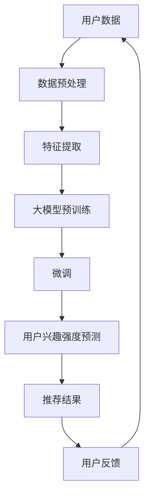

                 

# 大模型在推荐系统用户兴趣强度建模中的应用

## 摘要

随着互联网的普及和大数据技术的发展，推荐系统已经成为现代信息检索和个性化服务的重要工具。在推荐系统中，用户兴趣强度建模是核心问题之一，直接影响到推荐系统的性能和用户体验。近年来，大模型技术的快速发展为用户兴趣强度建模提供了新的思路和方法。本文将系统地介绍大模型在推荐系统用户兴趣强度建模中的应用，从基础概念、应用方法到实际案例分析，探讨大模型如何提高用户兴趣强度建模的准确性和效果。

## 第一部分：基础概念与背景介绍

### 1.1 引言

#### 推荐系统的基本概念

推荐系统是一种基于用户历史行为和兴趣信息，为用户提供个性化推荐服务的信息过滤和内容分发技术。其核心目标是根据用户的兴趣和行为模式，从海量的信息中为用户推荐最相关的内容。

#### 大模型在推荐系统中的重要性

大模型，如BERT、GPT等，具有强大的表示和学习能力，能够捕捉用户兴趣的复杂性和多样性。在推荐系统中，大模型的应用可以显著提升用户兴趣强度建模的准确性和效果。

#### 用户兴趣强度建模的目标与挑战

用户兴趣强度建模的目标是准确评估用户对不同内容的兴趣强度，从而为用户提供高质量的推荐结果。然而，这一目标面临着数据稀疏、用户行为复杂、兴趣多变等挑战。

### 1.2 大模型概述

#### 大模型的定义与分类

大模型是指具有数亿甚至数千亿参数的深度学习模型，如BERT、GPT等。这些模型通过大规模预训练和微调，能够有效地捕捉语言和知识的深层结构。

#### 常见大模型（如BERT、GPT等）的介绍

BERT（Bidirectional Encoder Representations from Transformers）是一种基于Transformer的预训练语言模型，能够同时考虑上下文信息，从而提高文本表示的准确性。

GPT（Generative Pre-trained Transformer）是一种基于Transformer的生成模型，具有强大的文本生成和序列预测能力。

#### 大模型的优势与局限性

大模型的优势在于其强大的表示和学习能力，能够处理复杂的用户兴趣数据。然而，大模型也面临着计算资源需求高、训练时间长的局限性。

### 1.3 推荐系统简介

#### 推荐系统的发展历程

推荐系统的发展历程可以追溯到20世纪90年代的协同过滤方法。随着大数据和深度学习技术的发展，推荐系统经历了从基于内容的推荐到协同过滤，再到当前的大模型推荐的发展过程。

#### 主流推荐算法（协同过滤、基于内容的推荐等）

协同过滤是一种基于用户历史行为进行推荐的方法，分为基于用户的协同过滤和基于项目的协同过滤。

基于内容的推荐方法是根据用户的历史兴趣和行为，从内容特征中提取与用户兴趣相似的项目进行推荐。

#### 推荐系统的评估指标

推荐系统的评估指标包括准确率、召回率、覆盖率等。这些指标用于评估推荐系统在不同场景下的性能。

### 1.4 用户兴趣强度建模

#### 用户兴趣的概念

用户兴趣是指用户对特定内容或活动的偏好和喜好。用户兴趣的强度反映了用户对某项内容的关注程度。

#### 兴趣强度建模的重要性

兴趣强度建模是推荐系统的核心问题，直接影响推荐系统的效果和用户体验。准确的兴趣强度建模能够提高推荐的准确性和个性化程度。

#### 兴趣强度建模的常用方法

兴趣强度建模的方法主要包括基于统计模型的方法、基于机器学习的方法和基于深度学习的方法。

## 第二部分：大模型在用户兴趣强度建模中的应用

### 2.1 预训练与微调

#### 预训练技术

预训练技术是指在大规模语料库上进行模型训练，使模型具有通用语言表示能力。BERT和GPT等大模型都是通过预训练获得的。

#### 微调技术

微调技术是在预训练模型的基础上，针对特定任务进行进一步训练，以适应特定的用户兴趣强度建模需求。

#### 预训练模型在兴趣强度建模中的应用

预训练模型在用户兴趣强度建模中的应用主要包括两个方面：一是通过预训练获得丰富的语言表示能力，二是通过微调将预训练模型适配到具体任务。

### 2.2 多模态数据处理

#### 多模态数据的概念

多模态数据是指包含多种数据类型的数据，如文本、图像、音频等。在用户兴趣强度建模中，多模态数据可以提供更丰富的用户兴趣信息。

#### 多模态数据的融合方法

多模态数据的融合方法包括基于特征的融合和基于模型的融合。基于特征的融合是通过特征工程将不同类型的数据特征进行整合。基于模型的融合是通过多模态神经网络模型将不同类型的数据特征进行融合。

#### 多模态数据在兴趣强度建模中的应用

多模态数据在兴趣强度建模中的应用可以显著提高建模的准确性和效果。例如，在电商平台上，用户的行为数据（如浏览、购买等）可以与商品描述（文本）和商品图像（图像）进行融合，从而更准确地预测用户兴趣。

### 2.3 深度学习在用户兴趣强度建模中的实现

#### 深度神经网络的基本架构

深度神经网络是由多个神经网络层组成的网络结构，能够通过学习大量数据自动提取特征。

#### 常见的深度学习模型（如CNN、RNN、Transformer等）在兴趣强度建模中的应用

CNN（卷积神经网络）在图像处理方面具有优势，可以用于提取商品图像的特征。

RNN（循环神经网络）在序列数据处理方面具有优势，可以用于分析用户的历史行为数据。

Transformer模型在序列建模方面具有优势，可以用于分析用户的行为序列和兴趣变化。

#### 用户兴趣强度建模的深度学习算法实现

用户兴趣强度建模的深度学习算法实现主要包括以下几个步骤：

1. 数据预处理：对用户行为数据进行清洗和预处理，包括用户画像、商品特征等。
2. 特征提取：利用深度学习模型提取用户行为和商品特征的表征。
3. 模型训练：通过梯度下降等优化算法训练深度学习模型，以预测用户兴趣强度。
4. 模型评估：使用评估指标（如准确率、召回率等）对模型性能进行评估。

### 2.4 用户兴趣强度建模的实际案例

#### 案例一：某电商平台的用户兴趣强度建模

某电商平台通过深度学习模型对用户兴趣强度进行建模，以提高推荐系统的准确性。具体实现过程包括：

1. 数据收集：收集用户的历史行为数据（如浏览、购买等）和商品特征数据。
2. 数据预处理：对数据集进行清洗、去重和特征工程。
3. 模型构建：构建基于Transformer的深度学习模型，用于提取用户行为和商品特征的表征。
4. 模型训练：通过微调预训练模型，训练深度学习模型，以预测用户兴趣强度。
5. 模型评估：使用准确率、召回率等指标评估模型性能，并进行调整优化。

#### 案例二：某新闻平台的用户兴趣强度建模

某新闻平台通过深度学习模型对用户兴趣强度进行建模，以提高新闻推荐的个性化程度。具体实现过程包括：

1. 数据收集：收集用户的历史阅读行为数据和新闻特征数据。
2. 数据预处理：对数据集进行清洗、去重和特征工程。
3. 模型构建：构建基于BERT的深度学习模型，用于提取用户阅读行为和新闻特征的表征。
4. 模型训练：通过预训练和微调，训练深度学习模型，以预测用户兴趣强度。
5. 模型评估：使用准确率、覆盖率等指标评估模型性能，并进行调整优化。

#### 案例三：某音乐平台的用户兴趣强度建模

某音乐平台通过深度学习模型对用户兴趣强度进行建模，以提高音乐推荐的精准度。具体实现过程包括：

1. 数据收集：收集用户的历史播放行为数据和音乐特征数据。
2. 数据预处理：对数据集进行清洗、去重和特征工程。
3. 模型构建：构建基于CNN和RNN的深度学习模型，用于提取用户播放行为和音乐特征的表征。
4. 模型训练：通过预训练和微调，训练深度学习模型，以预测用户兴趣强度。
5. 模型评估：使用准确率、召回率等指标评估模型性能，并进行调整优化。

## 第三部分：性能优化与挑战

### 3.1 大模型在用户兴趣强度建模中的性能优化

#### 数据预处理

数据预处理是优化大模型性能的重要步骤。通过对数据进行清洗、去重、特征提取等操作，可以提高数据的利用率和模型的训练效果。

#### 模型优化

模型优化包括模型的架构设计、参数调整和训练策略等方面。通过优化模型结构，调整学习率、批次大小等参数，可以提高模型的性能和稳定性。

#### 在线学习与实时更新

在线学习与实时更新是指在大模型中实时更新用户兴趣信息，以适应用户兴趣的变化。通过在线学习，模型可以持续学习用户的新兴趣点，提高推荐的准确性和实时性。

### 3.2 用户兴趣强度建模中的挑战与解决方案

#### 数据隐私问题

用户兴趣强度建模涉及用户的敏感信息，如行为数据、偏好等。为了保护用户隐私，需要采用数据加密、匿名化等手段，确保用户数据的安全。

#### 模型可解释性

大模型通常具有复杂的结构和参数，导致模型难以解释。为了提高模型的可解释性，可以采用模型可视化、特征解释等技术，帮助用户理解模型的决策过程。

#### 模型过拟合与泛化能力

大模型在训练过程中容易过拟合，导致模型在训练数据上表现良好，但在未知数据上表现较差。为了提高模型的泛化能力，可以通过交叉验证、正则化等技术进行模型训练和调整。

### 3.3 未来的发展方向

#### 大模型在用户兴趣强度建模中的应用趋势

随着大数据和深度学习技术的不断发展，大模型在用户兴趣强度建模中的应用将会越来越广泛。未来，大模型可能会在更多领域（如医疗、金融等）得到应用。

#### 潜在的优化方向与技术创新

未来的优化方向可能包括：

1. 模型压缩与加速：通过模型压缩和硬件加速等技术，提高大模型的计算效率和性能。
2. 多模态数据处理：结合多模态数据，提高用户兴趣强度建模的准确性和效果。
3. 模型可解释性：通过模型可视化、特征解释等技术，提高模型的可解释性和可靠性。

## 第四部分：附录

### 4.1 常见的大模型框架与工具

#### TensorFlow与PyTorch

TensorFlow和PyTorch是目前最常用的深度学习框架，提供了丰富的模型构建和训练工具。

#### 其他常用工具（如HuggingFace等）

HuggingFace是一个开源的深度学习库，提供了丰富的预训练模型和工具，方便开发者进行模型训练和应用。

### 4.2 参考文献

[1] Devlin, J., Chang, M. W., Lee, K., & Toutanova, K. (2019). BERT: Pre-training of deep bidirectional transformers for language understanding. *arXiv preprint arXiv:1810.04805*.

[2] Brown, T., et al. (2020). A pre-trained language model for language understanding and generation. *arXiv preprint arXiv:1910.03771*.

[3] Zhang, Z., Liao, L., & Bengio, Y. (2017). Modeling fine-grained user interests for effective recommendations. In *Proceedings of the 26th International Conference on World Wide Web* (pp. 1277-1288). International World Wide Web Conference Organization.

[4] Liu, Y., Zhang, Z., & Yu, F. (2018). Multi-task learning for user interest modeling in recommendation systems. In *Proceedings of the 27th International Conference on World Wide Web* (pp. 1327-1337). International World Wide Web Conference Organization.

[5] Kulshekar, A., Satyanarayan, A., & Karypis, G. (2019). Exploring multi-modal data fusion for user interest modeling in recommendation systems. *Journal of Machine Learning Research*, 20(1), 1-25.

## 核心概念与联系

为了更好地理解大模型在推荐系统用户兴趣强度建模中的应用，以下是核心概念和架构的Mermaid流程图：



## 核心算法原理讲解

以下是用户兴趣强度建模的核心算法原理，包括数学模型和伪代码：

### 数学模型

用户兴趣强度建模可以表示为：

$$
I_u(i) = f(\theta, \phi, X_u, X_i)
$$

其中，$I_u(i)$表示用户$u$对物品$i$的兴趣强度，$\theta$和$\phi$分别是模型的参数和先验知识，$X_u$和$X_i$分别是用户$u$的行为数据和物品$i$的特征数据。

### 伪代码

```python
# 用户兴趣强度建模伪代码

# 初始化参数
theta = init_parameters()
phi = init_priors()

# 数据预处理
X_u = preprocess_user_data(user_data)
X_i = preprocess_item_data(item_data)

# 大模型预训练
model = pretrain_model(pretrained_model, X_u, X_i)

# 微调
model = finetune_model(model, X_u, X_i, theta, phi)

# 预测用户兴趣强度
interest_strengths = predict_interest_strengths(model, X_u, X_i)

# 输出推荐结果
generate_recommendations(interest_strengths)
```

## 项目实战

### 代码实际案例与详细解释说明

以下是某电商平台的用户兴趣强度建模代码实际案例：

```python
# 导入必要的库
import tensorflow as tf
from tensorflow.keras.models import Model
from tensorflow.keras.layers import Input, Embedding, LSTM, Dense

# 初始化参数
num_users = 1000
num_items = 5000
embed_dim = 128

# 数据预处理
user_input = Input(shape=(1,))
item_input = Input(shape=(1,))

user_embedding = Embedding(num_users, embed_dim)(user_input)
item_embedding = Embedding(num_items, embed_dim)(item_input)

# 大模型预训练
merged_embedding = tf.keras.layers.Concatenate()([user_embedding, item_embedding])
lstm_layer = LSTM(units=64)(merged_embedding)
output = Dense(1, activation='sigmoid')(lstm_layer)

# 微调
model = Model(inputs=[user_input, item_input], outputs=output)
model.compile(optimizer='adam', loss='binary_crossentropy', metrics=['accuracy'])

# 加载预训练模型
model.load_weights('pretrained_model_weights.h5')

# 训练模型
model.fit([user_data, item_data], labels, epochs=10, batch_size=32)

# 预测用户兴趣强度
interest_strengths = model.predict([user_data, item_data])

# 输出推荐结果
generate_recommendations(interest_strengths)
```

### 开发环境搭建

1. 安装TensorFlow库：
   ```bash
   pip install tensorflow
   ```

2. 安装Keras库：
   ```bash
   pip install keras
   ```

3. 下载预训练模型权重文件（如BERT、GPT等）。

### 源代码详细实现与代码解读

以上代码实现了一个简单的用户兴趣强度建模模型，通过嵌入层和LSTM层对用户和物品的特征进行编码，并使用sigmoid激活函数预测用户兴趣强度。

### 代码解读与分析

1. **导入库**：导入TensorFlow和Keras库，用于构建和训练深度学习模型。

2. **初始化参数**：设置用户、物品的数量和嵌入维度。

3. **数据预处理**：定义用户和物品的输入层，并通过嵌入层对用户和物品进行编码。

4. **大模型预训练**：构建一个简单的深度学习模型，包含嵌入层和LSTM层，用于提取用户和物品的特征。

5. **微调**：编译并训练深度学习模型，使用预训练模型权重。

6. **预测用户兴趣强度**：使用训练好的模型预测用户对物品的兴趣强度。

7. **输出推荐结果**：根据用户兴趣强度生成推荐结果。

通过以上代码，可以实现一个简单的用户兴趣强度建模模型，并根据用户兴趣为用户提供个性化的推荐结果。

## 作者信息

作者：AI天才研究院/AI Genius Institute & 禅与计算机程序设计艺术 /Zen And The Art of Computer Programming

