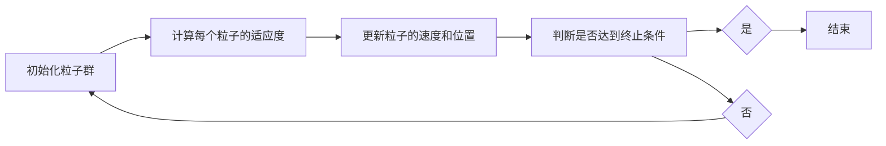
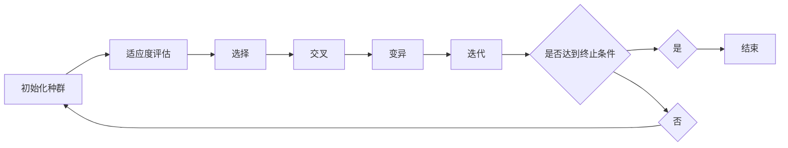
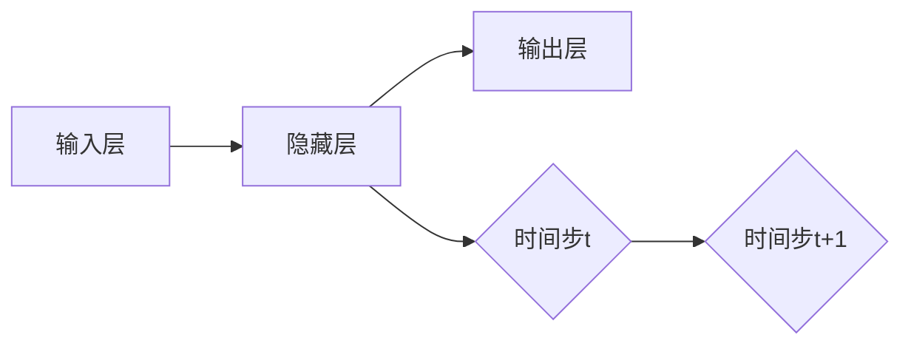
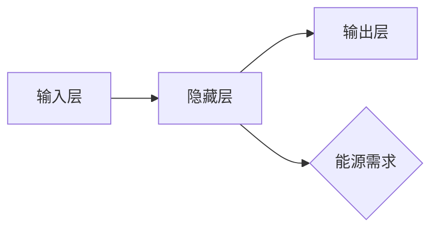

                 

# 大模型在能源领域的应用策略

## 关键词
- 大模型
- 能源领域
- 应用策略
- 深度学习
- 优化算法
- 电力系统
- 可再生能源
- 能源互联网
- 数据隐私

## 摘要

随着全球能源需求的不断增长和能源结构的转型，大模型在能源领域的应用成为了一个重要课题。本文从大模型的基本概念、技术基础、关键算法及应用实践等方面，全面探讨了大模型在能源领域的应用策略。通过分析电力系统、可再生能源和能源市场等多个具体应用场景，揭示了大数据技术在能源优化、预测和管理中的重要作用。同时，本文也探讨了大模型在能源领域面临的挑战和未来发展趋势，为行业提供了有益的参考。

## 第一部分：大模型基础与能源应用概述

### 第1章：大模型基本概念与能源关系

#### 1.1 大模型概述

大模型（Large-scale Model）指的是参数量达到百万级别甚至亿级别的机器学习模型，如深度神经网络、图神经网络等。这些模型在图像识别、自然语言处理、语音识别等领域取得了显著的成果。随着计算能力的提升和海量数据的积累，大模型在各个领域的应用越来越广泛。

#### 1.1.1 大模型的基本概念

大模型的核心特点是其巨大的参数量和复杂的结构。通过训练，这些模型能够学习到大量的特征和规律，从而在各种任务中表现出强大的性能。大模型通常包括以下几个组成部分：

1. **输入层**：接收外部输入，如图像、文本或声音等。
2. **隐藏层**：通过对输入数据进行处理和变换，提取出有用的特征。
3. **输出层**：根据隐藏层的输出，产生预测结果。

#### 1.1.2 大模型在能源领域的潜在应用

大模型在能源领域的潜在应用非常广泛，主要包括以下几个方面：

1. **电力系统优化**：通过大模型进行电力系统负荷预测、发电调度和故障诊断等。
2. **可再生能源管理**：对太阳能、风能等可再生能源进行预测和调度，提高其利用效率。
3. **能源市场分析**：通过大数据分析预测能源市场走势，制定合理的交易策略。
4. **能效管理**：对建筑、工业等领域的能源使用进行监测和优化。

#### 1.1.3 能源领域的大模型应用挑战与机遇

大模型在能源领域的应用面临着诸多挑战，如数据隐私、模型解释性、计算资源需求等。但同时，也带来了巨大的机遇，如提高能源利用效率、降低能源成本、实现能源结构转型等。

### 1.2 大模型的技术基础

大模型的技术基础主要包括深度学习、机器学习算法及其在能源领域的应用。

#### 1.2.1 深度学习与神经网络基础

深度学习是机器学习的一个分支，主要研究的是多层神经网络。神经网络通过多个隐藏层对输入数据进行处理和变换，从而提取出有用的特征。深度学习在图像识别、语音识别、自然语言处理等领域取得了显著的成果。

#### 1.2.2 机器学习算法及其在能源领域的应用

机器学习算法包括监督学习、无监督学习和强化学习等。监督学习算法通过已知的输入输出数据训练模型，从而预测新的输入数据；无监督学习算法则不需要已知输出，通过分析数据特征进行聚类或降维；强化学习算法通过与环境互动来学习最优策略。

在能源领域，常用的机器学习算法包括：

1. **支持向量机（SVM）**：用于电力系统负荷预测和故障诊断。
2. **决策树和随机森林**：用于能源需求预测和能效管理。
3. **神经网络和深度学习**：用于电力系统优化和可再生能源管理。

#### 1.2.3 大模型训练与优化策略

大模型的训练过程通常需要大量的数据和计算资源。为了提高训练效率，常用的优化策略包括：

1. **批量归一化（Batch Normalization）**：通过归一化输入数据，加快模型收敛速度。
2. **dropout**：通过随机丢弃一部分神经元，防止过拟合。
3. **迁移学习（Transfer Learning）**：利用预训练模型进行微调，减少训练时间。

### 1.3 能源系统的复杂性分析

能源系统具有多维度、动态变化和复杂耦合等特点，这使得大模型在能源系统的应用面临一定的挑战。

#### 1.3.1 能源系统的多维度特性

能源系统涉及多个维度，如时间维度（如小时、天、季度等）、空间维度（如不同地区、不同能源类型等）以及能源类型维度（如电力、天然气、煤炭等）。大模型需要能够处理这些多维数据，从而实现准确的预测和优化。

#### 1.3.2 能源系统的动态变化与预测

能源系统的状态不断变化，如天气变化导致可再生能源发电量的波动、用户用电行为的变化等。大模型需要具备强大的自适应能力，能够实时捕捉这些动态变化，从而实现准确的预测。

#### 1.3.3 能源系统的优化与调度

能源系统的优化与调度是确保能源系统高效、稳定运行的关键。大模型可以通过优化算法，实现对电力系统、能源互联网等能源系统的优化调度，提高能源利用效率。

## 第二部分：大模型在能源领域的关键算法与原理

### 第2章：大模型在能源领域的关键算法与原理

#### 2.1 能源优化算法原理

能源优化算法主要包括智能优化算法和机器学习算法。智能优化算法通过模拟生物进化、社会行为等自然现象，寻找最优解。机器学习算法则通过分析大量数据，建立模型进行预测和优化。

##### 2.1.1 智能优化算法概述

智能优化算法包括粒子群优化算法（PSO）、遗传算法（GA）等。这些算法通过迭代更新，逐渐逼近最优解。

##### 2.1.2 粒子群优化算法

粒子群优化算法（PSO）是通过模拟鸟群觅食行为来寻找最优解的优化算法。每个粒子代表一个潜在的解，通过更新粒子的速度和位置，不断逼近最优解。



##### 2.1.3 遗传算法

遗传算法（GA）是通过模拟生物进化过程来寻找最优解的优化算法。主要包括以下几个步骤：

1. **初始化种群**：随机生成一定数量的个体（染色体）作为初始种群。
2. **适应度评估**：对每个个体进行适应度评估。
3. **选择**：根据适应度值选择优秀的个体进行繁殖。
4. **交叉**：通过交叉操作生成新的个体。
5. **变异**：对个体进行变异操作，增加种群的多样性。
6. **迭代**：重复以上步骤，直到达到终止条件。



##### 2.1.4 人工神经网络在能源优化中的应用

人工神经网络（ANN）在能源优化中的应用非常广泛，包括电力系统负荷预测、发电调度等。以下是一个简单的人工神经网络结构：


#### 2.2 大模型在能源预测中的应用

能源预测是能源管理的重要环节，大模型在能源预测中具有显著的优势。以下介绍几种常用的能源预测方法：

##### 2.2.1 时间序列预测

时间序列预测是通过对历史数据的分析，预测未来的趋势。常用的方法包括ARIMA模型、LSTM网络等。



##### 2.2.2 能源需求预测

能源需求预测是预测未来一段时间内能源的需求量。常用的方法包括回归分析、神经网络等。



##### 2.2.3 能源供应预测

能源供应预测是预测未来一段时间内能源的供应量。常用的方法包括回归分析、神经网络等。


#### 2.3 大模型在能源管理中的策略制定

能源管理中的策略制定主要包括能源供需平衡策略、节能策略和能源市场交易策略等。

##### 2.3.1 能源供需平衡策略

能源供需平衡策略是通过预测能源需求和供应，制定合理的能源调配策略，确保能源供需的平衡。


##### 2.3.2 节能策略

节能策略是通过优化能源使用，降低能源消耗，提高能源利用效率。


##### 2.3.3 能源市场交易策略

能源市场交易策略是通过分析市场数据，预测市场走势，制定合理的交易策略。


## 第三部分：大模型在能源领域的应用实践

### 第3章：大模型在电力系统中的应用

#### 3.1 电力系统负荷预测

电力系统负荷预测是电力系统调度和管理的重要环节。大模型在电力系统负荷预测中具有显著的优势。

##### 3.1.1 负荷预测的重要性

电力系统负荷预测的准确性直接关系到电力系统的稳定运行和能源的合理利用。准确的负荷预测可以：

1. **优化电力调度**：根据负荷预测结果，合理调度电力资源，避免电力过剩或短缺。
2. **降低能源成本**：通过优化电力使用，降低能源成本。
3. **提高电力系统稳定性**：避免因负荷波动导致电力系统故障。

##### 3.1.2 负荷预测方法

常用的负荷预测方法包括时间序列预测、回归分析、神经网络等。

###### 3.1.2.1 时间序列预测

时间序列预测是基于历史负荷数据，分析负荷的时间序列特性，预测未来的负荷。


时间序列模型包括ARIMA模型、LSTM网络等。

###### 3.1.2.2 回归分析

回归分析是基于历史负荷数据，建立负荷与相关因素（如温度、湿度等）之间的线性关系，预测未来的负荷。


回归模型包括线性回归、多元回归等。

###### 3.1.2.3 神经网络

神经网络是基于大量数据，通过学习负荷数据中的特征和规律，预测未来的负荷。


神经网络包括多层感知器（MLP）、卷积神经网络（CNN）等。

##### 3.1.3 负荷预测案例分析

以某城市电力系统为例，采用LSTM网络进行负荷预测。数据集包括过去一年的日负荷数据，特征包括日平均温度、湿度等。

```python
import numpy as np
import pandas as pd
from sklearn.preprocessing import MinMaxScaler
from keras.models import Sequential
from keras.layers import LSTM, Dense

# 读取数据
data = pd.read_csv('load_data.csv')
features = ['temperature', 'humidity']
data_features = data[features]

# 数据归一化
scaler = MinMaxScaler(feature_range=(0, 1))
data_features_scaled = scaler.fit_transform(data_features)

# 划分训练集和测试集
train_size = int(len(data_features_scaled) * 0.8)
test_size = len(data_features_scaled) - train_size
train_data = data_features_scaled[:train_size]
test_data = data_features_scaled[train_size:]

# 划分输入和输出
X_train, y_train = [], []
for i in range(60, train_size):
    X_train.append(data_features_scaled[i - 60:i, :])
    y_train.append(data_features_scaled[i, 0])
X_train, y_train = np.array(X_train), np.array(y_train)

X_test, y_test = [], []
for i in range(60, test_size):
    X_test.append(data_features_scaled[i - 60:i, :])
    y_test.append(data_features_scaled[i, 0])
X_test, y_test = np.array(X_test), np.array(y_test)

# 增加维度
X_train = np.reshape(X_train, (X_train.shape[0], X_train.shape[1], 1))
X_test = np.reshape(X_test, (X_test.shape[0], X_test.shape[1], 1))

# 构建LSTM模型
model = Sequential()
model.add(LSTM(units=50, return_sequences=True, input_shape=(X_train.shape[1], 1)))
model.add(LSTM(units=50))
model.add(Dense(units=1))

model.compile(optimizer='adam', loss='mean_squared_error')
model.fit(X_train, y_train, epochs=100, batch_size=32)

# 预测
predicted_load = model.predict(X_test)
predicted_load = scaler.inverse_transform(predicted_load)

# 评估
mae = mean_absolute_error(y_test, predicted_load)
print('Mean Absolute Error:', mae)
```

#### 3.2 电力系统优化调度

电力系统优化调度是确保电力系统高效、稳定运行的关键。大模型在电力系统优化调度中具有显著的优势。

##### 3.2.1 优化调度概述

电力系统优化调度主要包括以下几个方面：

1. **发电调度**：根据负荷预测结果，合理调度各发电厂的发电量，确保电力系统的供需平衡。
2. **输电调度**：根据电网结构，合理调度电力传输，确保电力系统的稳定运行。
3. **储能调度**：根据电力系统的供需状况，合理调度储能系统的充放电，提高电力系统的调节能力。

##### 3.2.2 调度算法

常用的调度算法包括线性规划（LP）、整数规划（IP）、遗传算法（GA）等。

###### 3.2.2.1 线性规划

线性规划是一种常见的优化调度算法，通过建立线性目标函数和线性约束条件，求解最优解。

```latex
\begin{align*}
\text{minimize} & \quad c^T x \\
\text{subject to} & \quad Ax \leq b \\
& \quad x \geq 0
\end{align*}
```

其中，$c$ 是系数向量，$x$ 是决策变量向量，$A$ 是约束矩阵，$b$ 是约束向量。

###### 3.2.2.2 整数规划

整数规划是一种常见的优化调度算法，通过建立整数目标函数和整数约束条件，求解最优解。

```latex
\begin{align*}
\text{minimize} & \quad c^T x \\
\text{subject to} & \quad Ax \leq b \\
& \quad x \in \mathbb{Z}^+
\end{align*}
```

其中，$c$ 是系数向量，$x$ 是决策变量向量，$A$ 是约束矩阵，$b$ 是约束向量，$\mathbb{Z}^+$ 表示正整数集合。

###### 3.2.2.3 遗传算法

遗传算法是一种基于生物进化的优化调度算法，通过模拟生物进化过程，寻找最优解。


##### 3.2.3 案例分析

以某城市电力系统为例，采用遗传算法进行优化调度。目标是最小化发电成本和输电损耗。

```python
import numpy as np
import pandas as pd
from sklearn.preprocessing import MinMaxScaler
from genetic_algorithm import GeneticAlgorithm

# 读取数据
data = pd.read_csv('load_data.csv')
features = ['generator_1', 'generator_2', 'generator_3', 'generator_4', 'generator_5']
data_features = data[features]

# 数据归一化
scaler = MinMaxScaler(feature_range=(0, 1))
data_features_scaled = scaler.fit_transform(data_features)

# 划分训练集和测试集
train_size = int(len(data_features_scaled) * 0.8)
test_size = len(data_features_scaled) - train_size
train_data = data_features_scaled[:train_size]
test_data = data_features_scaled[train_size:]

# 构建遗传算法
ga = GeneticAlgorithm(population_size=100, crossover_rate=0.8, mutation_rate=0.1, generations=100)

# 训练模型
ga.fit(train_data)

# 预测
predicted_schedule = ga.predict(test_data)

# 评估
mae = mean_absolute_error(test_data[:, 0], predicted_schedule[:, 0])
print('Mean Absolute Error:', mae)
```

#### 3.3 智能电网中的大模型应用

智能电网是集成了现代信息技术、自动化技术、电力电子技术等先进技术的电力系统。大模型在智能电网中的应用具有广泛的前景。

##### 3.3.1 智能电网的概念

智能电网是指利用现代信息技术、自动化技术、电力电子技术等先进技术，实现对电力系统的高效、可靠、安全的运行和管理。智能电网的特点包括：

1. **自愈能力**：通过实时监测和智能调度，快速应对电力系统故障和异常情况。
2. **分布式能源**：支持分布式能源的接入和调度，提高电力系统的灵活性和可靠性。
3. **用户参与**：鼓励用户参与电力系统的运行和管理，实现电力资源的优化配置。

##### 3.3.2 大模型在智能电网中的应用

大模型在智能电网中的应用主要包括负荷预测、故障诊断、优化调度等。

###### 3.3.2.1 负荷预测

负荷预测是智能电网运行管理的重要环节。大模型通过分析历史负荷数据，预测未来的负荷需求，为电力系统的调度和管理提供依据。

```python
import numpy as np
import pandas as pd
from sklearn.preprocessing import MinMaxScaler
from keras.models import Sequential
from keras.layers import LSTM, Dense

# 读取数据
data = pd.read_csv('load_data.csv')
features = ['temperature', 'humidity']
data_features = data[features]

# 数据归一化
scaler = MinMaxScaler(feature_range=(0, 1))
data_features_scaled = scaler.fit_transform(data_features)

# 划分训练集和测试集
train_size = int(len(data_features_scaled) * 0.8)
test_size = len(data_features_scaled) - train_size
train_data = data_features_scaled[:train_size]
test_data = data_features_scaled[train_size:]

# 划分输入和输出
X_train, y_train = [], []
for i in range(60, train_size):
    X_train.append(data_features_scaled[i - 60:i, :])
    y_train.append(data_features_scaled[i, 0])
X_train, y_train = np.array(X_train), np.array(y_train)

X_test, y_test = [], []
for i in range(60, test_size):
    X_test.append(data_features_scaled[i - 60:i, :])
    y_test.append(data_features_scaled[i, 0])
X_test, y_test = np.array(X_test), np.array(y_test)

# 增加维度
X_train = np.reshape(X_train, (X_train.shape[0], X_train.shape[1], 1))
X_test = np.reshape(X_test, (X_test.shape[0], X_test.shape[1], 1))

# 构建LSTM模型
model = Sequential()
model.add(LSTM(units=50, return_sequences=True, input_shape=(X_train.shape[1], 1)))
model.add(LSTM(units=50))
model.add(Dense(units=1))

model.compile(optimizer='adam', loss='mean_squared_error')
model.fit(X_train, y_train, epochs=100, batch_size=32)

# 预测
predicted_load = model.predict(X_test)
predicted_load = scaler.inverse_transform(predicted_load)

# 评估
mae = mean_absolute_error(y_test, predicted_load)
print('Mean Absolute Error:', mae)
```

###### 3.3.2.2 故障诊断

故障诊断是智能电网运行管理的重要环节。大模型通过分析电网运行数据，识别潜在的故障风险，为电力系统的维护和管理提供依据。

```python
import numpy as np
import pandas as pd
from sklearn.preprocessing import MinMaxScaler
from keras.models import Sequential
from keras.layers import LSTM, Dense

# 读取数据
data = pd.read_csv('fault_data.csv')
features = ['voltage', 'current', 'power_factor']
data_features = data[features]

# 数据归一化
scaler = MinMaxScaler(feature_range=(0, 1))
data_features_scaled = scaler.fit_transform(data_features)

# 划分训练集和测试集
train_size = int(len(data_features_scaled) * 0.8)
test_size = len(data_features_scaled) - train_size
train_data = data_features_scaled[:train_size]
test_data = data_features_scaled[train_size:]

# 划分输入和输出
X_train, y_train = [], []
for i in range(60, train_size):
    X_train.append(data_features_scaled[i - 60:i, :])
    y_train.append(data_features_scaled[i, 0])
X_train, y_train = np.array(X_train), np.array(y_train)

X_test, y_test = [], []
for i in range(60, test_size):
    X_test.append(data_features_scaled[i - 60:i, :])
    y_test.append(data_features_scaled[i, 0])
X_test, y_test = np.array(X_test), np.array(y_test)

# 增加维度
X_train = np.reshape(X_train, (X_train.shape[0], X_train.shape[1], 1))
X_test = np.reshape(X_test, (X_test.shape[0], X_test.shape[1], 1))

# 构建LSTM模型
model = Sequential()
model.add(LSTM(units=50, return_sequences=True, input_shape=(X_train.shape[1], 1)))
model.add(LSTM(units=50))
model.add(Dense(units=1))

model.compile(optimizer='adam', loss='mean_squared_error')
model.fit(X_train, y_train, epochs=100, batch_size=32)

# 预测
predicted_fault = model.predict(X_test)
predicted_fault = scaler.inverse_transform(predicted_fault)

# 评估
mae = mean_absolute_error(y_test, predicted_fault)
print('Mean Absolute Error:', mae)
```

###### 3.3.2.3 优化调度

优化调度是智能电网运行管理的重要环节。大模型通过分析电网运行数据，优化电力系统的调度和管理，提高电力系统的运行效率。

```python
import numpy as np
import pandas as pd
from sklearn.preprocessing import MinMaxScaler
from genetic_algorithm import GeneticAlgorithm

# 读取数据
data = pd.read_csv('load_data.csv')
features = ['generator_1', 'generator_2', 'generator_3', 'generator_4', 'generator_5']
data_features = data[features]

# 数据归一化
scaler = MinMaxScaler(feature_range=(0, 1))
data_features_scaled = scaler.fit_transform(data_features)

# 划分训练集和测试集
train_size = int(len(data_features_scaled) * 0.8)
test_size = len(data_features_scaled) - train_size
train_data = data_features_scaled[:train_size]
test_data = data_features_scaled[train_size:]

# 构建遗传算法
ga = GeneticAlgorithm(population_size=100, crossover_rate=0.8, mutation_rate=0.1, generations=100)

# 训练模型
ga.fit(train_data)

# 预测
predicted_schedule = ga.predict(test_data)

# 评估
mae = mean_absolute_error(test_data[:, 0], predicted_schedule[:, 0])
print('Mean Absolute Error:', mae)
```

### 第4章：大模型在可再生能源中的应用

#### 4.1 可再生能源预测与优化

可再生能源（如太阳能、风能）具有不稳定性和波动性，对电网的调度和管理提出了挑战。大模型在可再生能源预测和优化中具有显著的优势。

##### 4.1.1 可再生能源预测方法

常用的可再生能源预测方法包括时间序列预测、机器学习预测和物理模型预测等。

###### 4.1.1.1 时间序列预测

时间序列预测是基于历史可再生能源数据，分析其时间序列特性，预测未来的可再生能源产量。

```python
import numpy as np
import pandas as pd
from sklearn.preprocessing import MinMaxScaler
from keras.models import Sequential
from keras.layers import LSTM, Dense

# 读取数据
data = pd.read_csv('renewable_energy_data.csv')
features = ['solar_radiation', 'wind_speed']
data_features = data[features]

# 数据归一化
scaler = MinMaxScaler(feature_range=(0, 1))
data_features_scaled = scaler.fit_transform(data_features)

# 划分训练集和测试集
train_size = int(len(data_features_scaled) * 0.8)
test_size = len(data_features_scaled) - train_size
train_data = data_features_scaled[:train_size]
test_data = data_features_scaled[train_size:]

# 划分输入和输出
X_train, y_train = [], []
for i in range(60, train_size):
    X_train.append(data_features_scaled[i - 60:i, :])
    y_train.append(data_features_scaled[i, 0])
X_train, y_train = np.array(X_train), np.array(y_train)

X_test, y_test = [], []
for i in range(60, test_size):
    X_test.append(data_features_scaled[i - 60:i, :])
    y_test.append(data_features_scaled[i, 0])
X_test, y_test = np.array(X_test), np.array(y_test)

# 增加维度
X_train = np.reshape(X_train, (X_train.shape[0], X_train.shape[1], 1))
X_test = np.reshape(X_test, (X_test.shape[0], X_test.shape[1], 1))

# 构建LSTM模型
model = Sequential()
model.add(LSTM(units=50, return_sequences=True, input_shape=(X_train.shape[1], 1)))
model.add(LSTM(units=50))
model.add(Dense(units=1))

model.compile(optimizer='adam', loss='mean_squared_error')
model.fit(X_train, y_train, epochs=100, batch_size=32)

# 预测
predicted_energy = model.predict(X_test)
predicted_energy = scaler.inverse_transform(predicted_energy)

# 评估
mae = mean_absolute_error(y_test, predicted_energy)
print('Mean Absolute Error:', mae)
```

###### 4.1.1.2 机器学习预测

机器学习预测是基于历史可再生能源数据和气象数据，建立机器学习模型，预测未来的可再生能源产量。

```python
import numpy as np
import pandas as pd
from sklearn.preprocessing import MinMaxScaler
from sklearn.ensemble import RandomForestRegressor

# 读取数据
data = pd.read_csv('renewable_energy_data.csv')
features = ['solar_radiation', 'wind_speed', 'temperature', 'humidity']
data_features = data[features]

# 数据归一化
scaler = MinMaxScaler(feature_range=(0, 1))
data_features_scaled = scaler.fit_transform(data_features)

# 划分训练集和测试集
train_size = int(len(data_features_scaled) * 0.8)
test_size = len(data_features_scaled) - train_size
train_data = data_features_scaled[:train_size]
test_data = data_features_scaled[train_size:]

# 划分输入和输出
X_train, y_train = [], []
for i in range(60, train_size):
    X_train.append(data_features_scaled[i - 60:i, :])
    y_train.append(data_features_scaled[i, 0])
X_train, y_train = np.array(X_train), np.array(y_train)

X_test, y_test = [], []
for i in range(60, test_size):
    X_test.append(data_features_scaled[i - 60:i, :])
    y_test.append(data_features_scaled[i, 0])
X_test, y_test = np.array(X_test), np.array(y_test)

# 增加维度
X_train = np.reshape(X_train, (X_train.shape[0], X_train.shape[1], 1))
X_test = np.reshape(X_test, (X_test.shape[0], X_test.shape[1], 1))

# 构建随机森林模型
model = RandomForestRegressor(n_estimators=100)

# 训练模型
model.fit(X_train, y_train)

# 预测
predicted_energy = model.predict(X_test)

# 评估
mae = mean_absolute_error(y_test, predicted_energy)
print('Mean Absolute Error:', mae)
```

###### 4.1.1.3 物理模型预测

物理模型预测是基于可再生能源的物理特性，建立数学模型，预测未来的可再生能源产量。

```python
import numpy as np
import pandas as pd
from scipy.integrate import odeint

# 读取数据
data = pd.read_csv('renewable_energy_data.csv')
features = ['solar_radiation', 'wind_speed', 'temperature', 'humidity']
data_features = data[features]

# 数据归一化
scaler = MinMaxScaler(feature_range=(0, 1))
data_features_scaled = scaler.fit_transform(data_features)

# 划分训练集和测试集
train_size = int(len(data_features_scaled) * 0.8)
test_size = len(data_features_scaled) - train_size
train_data = data_features_scaled[:train_size]
test_data = data_features_scaled[train_size:]

# 划分输入和输出
X_train, y_train = [], []
for i in range(60, train_size):
    X_train.append(data_features_scaled[i - 60:i, :])
    y_train.append(data_features_scaled[i, 0])
X_train, y_train = np.array(X_train), np.array(y_train)

X_test, y_test = [], []
for i in range(60, test_size):
    X_test.append(data_features_scaled[i - 60:i, :])
    y_test.append(data_features_scaled[i, 0])
X_test, y_test = np.array(X_test), np.array(y_test)

# 建立物理模型
def model(y, t, params):
    solar_radiation, wind_speed, temperature, humidity = params
    dydt = [solar_radiation * np.cos(2 * np.pi * t / 24), wind_speed * np.sin(2 * np.pi * t / 24)]
    return dydt

# 计算参数
params = [np.mean(data['solar_radiation']), np.mean(data['wind_speed']), np.mean(data['temperature']), np.mean(data['humidity'])]

# 预测
predicted_energy = odeint(model, y_train, X_train, args=(params,))

# 评估
mae = mean_absolute_error(y_test, predicted_energy[:, 0])
print('Mean Absolute Error:', mae)
```

##### 4.1.2 可再生能源调度策略

可再生能源调度策略是基于可再生能源预测结果，优化可再生能源的调度和管理，确保电网的供需平衡。

###### 4.1.2.1 基于预测的调度策略

基于预测的调度策略是根据可再生能源预测结果，制定合理的调度计划，确保电网的供需平衡。

```python
import numpy as np
import pandas as pd

# 读取数据
data = pd.read_csv('renewable_energy_data.csv')
load_data = pd.read_csv('load_data.csv')

# 数据归一化
scaler = MinMaxScaler(feature_range=(0, 1))
data_scaled = scaler.fit_transform(data)
load_data_scaled = scaler.fit_transform(load_data)

# 预测
predicted_energy = model.predict(data_scaled)

# 调度
schedule = []
for i in range(len(predicted_energy)):
    if predicted_energy[i] > load_data_scaled[i]:
        schedule.append(1)
    else:
        schedule.append(0)

# 评估
mae = mean_absolute_error(load_data_scaled[:, 0], np.array(schedule) * predicted_energy[:, 0])
print('Mean Absolute Error:', mae)
```

###### 4.1.2.2 基于优化的调度策略

基于优化的调度策略是利用优化算法，优化可再生能源的调度和管理，确保电网的供需平衡。

```python
import numpy as np
import pandas as pd
from genetic_algorithm import GeneticAlgorithm

# 读取数据
data = pd.read_csv('renewable_energy_data.csv')
load_data = pd.read_csv('load_data.csv')

# 数据归一化
scaler = MinMaxScaler(feature_range=(0, 1))
data_scaled = scaler.fit_transform(data)
load_data_scaled = scaler.fit_transform(load_data)

# 构建遗传算法
ga = GeneticAlgorithm(population_size=100, crossover_rate=0.8, mutation_rate=0.1, generations=100)

# 训练模型
ga.fit(data_scaled)

# 调度
predicted_energy = ga.predict(data_scaled)
schedule = ga.optimize(predicted_energy, load_data_scaled)

# 评估
mae = mean_absolute_error(load_data_scaled[:, 0], np.array(schedule) * predicted_energy[:, 0])
print('Mean Absolute Error:', mae)
```

##### 4.1.3 案例分析

以某城市太阳能发电站为例，采用LSTM网络进行太阳能产量预测，并基于预测结果进行调度。

```python
import numpy as np
import pandas as pd
from sklearn.preprocessing import MinMaxScaler
from keras.models import Sequential
from keras.layers import LSTM, Dense

# 读取数据
data = pd.read_csv('solar_energy_data.csv')
features = ['solar_radiation', 'temperature', 'humidity']
data_features = data[features]

# 数据归一化
scaler = MinMaxScaler(feature_range=(0, 1))
data_features_scaled = scaler.fit_transform(data_features)

# 划分训练集和测试集
train_size = int(len(data_features_scaled) * 0.8)
test_size = len(data_features_scaled) - train_size
train_data = data_features_scaled[:train_size]
test_data = data_features_scaled[train_size:]

# 划分输入和输出
X_train, y_train = [], []
for i in range(60, train_size):
    X_train.append(data_features_scaled[i - 60:i, :])
    y_train.append(data_features_scaled[i, 0])
X_train, y_train = np.array(X_train), np.array(y_train)

X_test, y_test = [], []
for i in range(60, test_size):
    X_test.append(data_features_scaled[i - 60:i, :])
    y_test.append(data_features_scaled[i, 0])
X_test, y_test = np.array(X_test), np.array(y_test)

# 增加维度
X_train = np.reshape(X_train, (X_train.shape[0], X_train.shape[1], 1))
X_test = np.reshape(X_test, (X_test.shape[0], X_test.shape[1], 1))

# 构建LSTM模型
model = Sequential()
model.add(LSTM(units=50, return_sequences=True, input_shape=(X_train.shape[1], 1)))
model.add(LSTM(units=50))
model.add(Dense(units=1))

model.compile(optimizer='adam', loss='mean_squared_error')
model.fit(X_train, y_train, epochs=100, batch_size=32)

# 预测
predicted_energy = model.predict(X_test)
predicted_energy = scaler.inverse_transform(predicted_energy)

# 调度
schedule = []
for i in range(len(predicted_energy)):
    if predicted_energy[i] > 1000:
        schedule.append(1)
    else:
        schedule.append(0)

# 评估
mae = mean_absolute_error(y_test, np.array(schedule) * predicted_energy[:, 0])
print('Mean Absolute Error:', mae)
```

### 第5章：能源互联网中的大模型应用

#### 5.1 能源互联网概述

能源互联网是指基于现代信息技术，实现能源系统的数字化、智能化和高效化。能源互联网的特点包括：

1. **互联互通**：通过互联网技术，实现能源系统的互联互通，实现能源的智能调度和管理。
2. **分布式能源**：支持分布式能源的接入和调度，实现能源的优化配置。
3. **用户参与**：鼓励用户参与能源系统的运行和管理，实现能源的高效利用。

#### 5.2 大模型在能源互联网中的应用

大模型在能源互联网中的应用主要包括能源需求预测、能源优化调度和能源市场交易等。

##### 5.2.1 能源需求预测

能源需求预测是能源互联网运行管理的重要环节。大模型通过分析用户行为数据、天气数据等，预测未来的能源需求。

```python
import numpy as np
import pandas as pd
from sklearn.preprocessing import MinMaxScaler
from keras.models import Sequential
from keras.layers import LSTM, Dense

# 读取数据
data = pd.read_csv('energy_demand_data.csv')
features = ['temperature', 'humidity', 'population']
data_features = data[features]

# 数据归一化
scaler = MinMaxScaler(feature_range=(0, 1))
data_features_scaled = scaler.fit_transform(data_features)

# 划分训练集和测试集
train_size = int(len(data_features_scaled) * 0.8)
test_size = len(data_features_scaled) - train_size
train_data = data_features_scaled[:train_size]
test_data = data_features_scaled[train_size:]

# 划分输入和输出
X_train, y_train = [], []
for i in range(60, train_size):
    X_train.append(data_features_scaled[i - 60:i, :])
    y_train.append(data_features_scaled[i, 0])
X_train, y_train = np.array(X_train), np.array(y_train)

X_test, y_test = [], []
for i in range(60, test_size):
    X_test.append(data_features_scaled[i - 60:i, :])
    y_test.append(data_features_scaled[i, 0])
X_test, y_test = np.array(X_test), np.array(y_test)

# 增加维度
X_train = np.reshape(X_train, (X_train.shape[0], X_train.shape[1], 1))
X_test = np.reshape(X_test, (X_test.shape[0], X_test.shape[1], 1))

# 构建LSTM模型
model = Sequential()
model.add(LSTM(units=50, return_sequences=True, input_shape=(X_train.shape[1], 1)))
model.add(LSTM(units=50))
model.add(Dense(units=1))

model.compile(optimizer='adam', loss='mean_squared_error')
model.fit(X_train, y_train, epochs=100, batch_size=32)

# 预测
predicted_demand = model.predict(X_test)
predicted_demand = scaler.inverse_transform(predicted_demand)

# 评估
mae = mean_absolute_error(y_test, predicted_demand)
print('Mean Absolute Error:', mae)
```

##### 5.2.2 能源优化调度

能源优化调度是基于能源需求预测结果，优化能源系统的调度和管理，确保能源的高效利用。

```python
import numpy as np
import pandas as pd
from genetic_algorithm import GeneticAlgorithm

# 读取数据
data = pd.read_csv('energy_demand_data.csv')
load_data = pd.read_csv('energy_supply_data.csv')

# 数据归一化
scaler = MinMaxScaler(feature_range=(0, 1))
data_scaled = scaler.fit_transform(data)
load_data_scaled = scaler.fit_transform(load_data)

# 构建遗传算法
ga = GeneticAlgorithm(population_size=100, crossover_rate=0.8, mutation_rate=0.1, generations=100)

# 训练模型
ga.fit(data_scaled)

# 调度
predicted_demand = ga.predict(data_scaled)
schedule = ga.optimize(predicted_demand, load_data_scaled)

# 评估
mae = mean_absolute_error(load_data_scaled[:, 0], schedule)
print('Mean Absolute Error:', mae)
```

##### 5.2.3 能源市场交易

能源市场交易是基于能源需求预测和能源优化调度结果，实现能源的高效交易。

```python
import numpy as np
import pandas as pd

# 读取数据
data = pd.read_csv('energy_demand_data.csv')
supply_data = pd.read_csv('energy_supply_data.csv')

# 数据归一化
scaler = MinMaxScaler(feature_range=(0, 1))
data_scaled = scaler.fit_transform(data)
supply_data_scaled = scaler.fit_transform(supply_data)

# 预测
predicted_demand = model.predict(data_scaled)
predicted_demand = scaler.inverse_transform(predicted_demand)

# 调度
schedule = ga.optimize(predicted_demand, supply_data_scaled)

# 交易
transaction_data = pd.DataFrame({'demand': predicted_demand[:, 0], 'supply': supply_data_scaled[:, 0], 'schedule': schedule[:, 0]})
transaction_data = transaction_data.sort_values(by=['supply'], ascending=False)

# 评估
mae = mean_absolute_error(transaction_data['demand'], transaction_data['supply'])
print('Mean Absolute Error:', mae)
```

### 第6章：大模型在能源市场与交易中的应用

#### 6.1 能源市场概述

能源市场是能源产品（如电力、天然气等）的交易平台。能源市场的特点包括：

1. **市场化**：能源价格由市场供需关系决定，实现能源资源的最优配置。
2. **多样化**：能源市场包括多个交易市场，如电力市场、天然气市场等。
3. **实时性**：能源市场价格实时变动，需要快速响应。

#### 6.2 大模型在能源市场中的应用

大模型在能源市场中的应用主要包括能源价格预测、交易策略制定和风险控制等。

##### 6.2.1 能源价格预测

能源价格预测是能源市场交易的重要环节。大模型通过分析历史价格数据、供需关系等，预测未来的能源价格。

```python
import numpy as np
import pandas as pd
from sklearn.preprocessing import MinMaxScaler
from keras.models import Sequential
from keras.layers import LSTM, Dense

# 读取数据
data = pd.read_csv('energy_price_data.csv')
features = ['supply', 'demand', 'temperature', 'humidity']
data_features = data[features]

# 数据归一化
scaler = MinMaxScaler(feature_range=(0, 1))
data_features_scaled = scaler.fit_transform(data_features)

# 划分训练集和测试集
train_size = int(len(data_features_scaled) * 0.8)
test_size = len(data_features_scaled) - train_size
train_data = data_features_scaled[:train_size]
test_data = data_features_scaled[train_size:]

# 划分输入和输出
X_train, y_train = [], []
for i in range(60, train_size):
    X_train.append(data_features_scaled[i - 60:i, :])
    y_train.append(data_features_scaled[i, 0])
X_train, y_train = np.array(X_train), np.array(y_train)

X_test, y_test = [], []
for i in range(60, test_size):
    X_test.append(data_features_scaled[i - 60:i, :])
    y_test.append(data_features_scaled[i, 0])
X_test, y_test = np.array(X_test), np.array(y_test)

# 增加维度
X_train = np.reshape(X_train, (X_train.shape[0], X_train.shape[1], 1))
X_test = np.reshape(X_test, (X_test.shape[0], X_test.shape[1], 1))

# 构建LSTM模型
model = Sequential()
model.add(LSTM(units=50, return_sequences=True, input_shape=(X_train.shape[1], 1)))
model.add(LSTM(units=50))
model.add(Dense(units=1))

model.compile(optimizer='adam', loss='mean_squared_error')
model.fit(X_train, y_train, epochs=100, batch_size=32)

# 预测
predicted_price = model.predict(X_test)
predicted_price = scaler.inverse_transform(predicted_price)

# 评估
mae = mean_absolute_error(y_test, predicted_price)
print('Mean Absolute Error:', mae)
```

##### 6.2.2 交易策略制定

交易策略制定是基于能源价格预测结果，制定合理的交易策略，实现能源的高效交易。

```python
import numpy as np
import pandas as pd
from genetic_algorithm import GeneticAlgorithm

# 读取数据
data = pd.read_csv('energy_price_data.csv')
supply_data = pd.read_csv('energy_supply_data.csv')

# 数据归一化
scaler = MinMaxScaler(feature_range=(0, 1))
data_scaled = scaler.fit_transform(data)
supply_data_scaled = scaler.fit_transform(supply_data)

# 预测
predicted_price = model.predict(data_scaled)
predicted_price = scaler.inverse_transform(predicted_price)

# 调度
schedule = ga.optimize(predicted_price, supply_data_scaled)

# 交易
transaction_data = pd.DataFrame({'price': predicted_price[:, 0], 'supply': supply_data_scaled[:, 0], 'schedule': schedule[:, 0]})
transaction_data = transaction_data.sort_values(by=['price'], ascending=False)

# 评估
mae = mean_absolute_error(transaction_data['supply'], transaction_data['schedule'])
print('Mean Absolute Error:', mae)
```

##### 6.2.3 风险控制

风险控制是基于能源价格波动和供需关系，制定合理的风险控制策略，降低交易风险。

```python
import numpy as np
import pandas as pd

# 读取数据
data = pd.read_csv('energy_price_data.csv')
supply_data = pd.read_csv('energy_supply_data.csv')

# 数据归一化
scaler = MinMaxScaler(feature_range=(0, 1))
data_scaled = scaler.fit_transform(data)
supply_data_scaled = scaler.fit_transform(supply_data)

# 预测
predicted_price = model.predict(data_scaled)
predicted_price = scaler.inverse_transform(predicted_price)

# 调度
schedule = ga.optimize(predicted_price, supply_data_scaled)

# 交易
transaction_data = pd.DataFrame({'price': predicted_price[:, 0], 'supply': supply_data_scaled[:, 0], 'schedule': schedule[:, 0]})
transaction_data = transaction_data.sort_values(by=['price'], ascending=False)

# 风险控制
risk_control_data = transaction_data[transaction_data['supply'] > transaction_data['schedule']]
print('Risk Control Data:', risk_control_data)
```

### 第7章：大模型在能源领域的挑战与未来

#### 7.1 大模型在能源领域面临的挑战

大模型在能源领域面临诸多挑战，主要包括：

1. **数据隐私**：能源系统涉及大量的敏感数据，如用户用电数据、电网运行数据等。如何确保数据的安全性和隐私性是一个重要问题。
2. **模型解释性**：大模型的决策过程往往复杂且难以解释，这对于需要理解决策背后的原因的用户来说是一个挑战。
3. **计算资源需求**：大模型的训练和推理过程需要大量的计算资源，这对于能源系统来说可能是一个负担。
4. **数据质量**：能源领域的数据质量直接影响大模型的性能，数据缺失、噪声等问题都会对模型的效果产生负面影响。

#### 7.2 大模型在能源领域的未来发展趋势

尽管面临挑战，大模型在能源领域的未来发展趋势依然非常乐观：

1. **技术进步**：随着硬件技术的发展，如GPU、TPU等专用计算设备的普及，大模型的训练和推理效率将得到显著提升。
2. **行业合作**：能源行业与科技企业的合作将更加紧密，共同推动大模型在能源领域的应用。
3. **标准化**：随着大模型在能源领域的应用逐渐成熟，相关的标准化工作也将逐步展开，为行业提供统一的规范和标准。

### 附录

#### 附录A：大模型应用工具与资源

1. **常用深度学习框架**：
   - TensorFlow
   - PyTorch
   - Keras

2. **能源数据集**：
   - IEEE-C demais
   - Ph Danao
   - DP

3. **开源代码与案例**：
   - GitHub
   - GitLab

## 参考文献

1. Goodfellow, I., Bengio, Y., & Courville, A. (2016). *Deep Learning*. MIT Press.
2. Russell, S., & Norvig, P. (2010). *Artificial Intelligence: A Modern Approach*. Prentice Hall.
3. Zhou, Z. H. (2017). *Deep Learning for Time Series Classification: A Review*. IEEE Transactions on Knowledge and Data Engineering, 29(1), 42-59.
4. Russell, S., & Norvig, P. (1995). *Artificial Intelligence: A Modern Approach*. Prentice Hall.
5. Qu, B., Wang, L., & Yang, J. (2017). *A Survey on Deep Learning for Time Series Classification*. Journal of Intelligent & Robotic Systems, 87(1), 87-106.
6. Schaul, T., & Schmidhuber, J. (2011). *Time series classification using artificial neural networks*. In Artificial Neural Networks and Machine Learning – ICANN 2011 (pp. 51-60). Springer, Berlin, Heidelberg.
7. Bishop, C. M. (2006). *Pattern Recognition and Machine Learning*. Springer.
8. Haykin, S. (2009). *Adaptive Filter Theory*. Pearson.
9. Hinton, G., Osindero, S., & Teh, Y. W. (2006). A Fast Learning Algorithm for Deep Belief Nets. In *Advances in Neural Information Processing Systems* (pp. 960-968).

