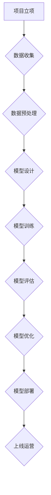
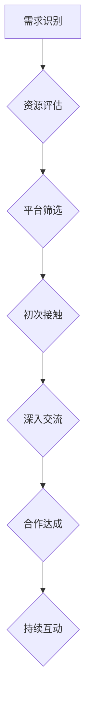
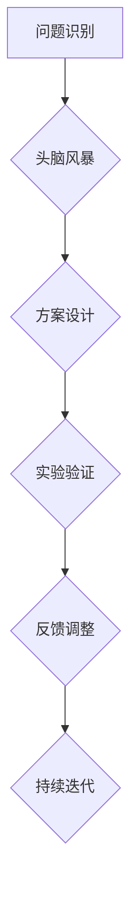

                 

### 第一部分：大模型时代的创业概述

#### 第1章：大模型时代概述

1. **1.1 大模型时代的到来**

**1.1.1 创业者视角下的大模型革命**

随着深度学习技术的发展，大模型（如 GPT-3、BERT、Megatron-LM 等超大规模语言模型）逐渐成为人工智能领域的焦点。这些大模型通过海量数据的训练，能够实现前所未有的任务性能，从而引发了一场创业革命。

对于创业者来说，大模型的到来带来了前所未有的机遇和挑战。首先，大模型能够为创业公司提供强大的技术支撑，使得以前无法实现的任务成为可能。例如，自然语言处理、图像识别、语音识别等领域，都因为大模型的出现而焕发了新的生机。

其次，大模型的出现也降低了创业门槛。创业者不再需要花费大量时间和资源去积累数据、设计模型和优化算法。相反，他们可以利用开源的大模型框架和预训练模型，快速搭建原型并进行产品迭代。

**1.1.2 大模型对创业模式的变革**

大模型的出现对传统的创业模式产生了深刻的影响。首先，它改变了创业公司的资源需求。过去，创业者需要依赖大量的硬件设备和专业人才，而如今，借助云计算和分布式计算技术，创业者可以在成本较低的情况下获得强大的计算能力。

其次，大模型改变了创业公司的核心竞争力。过去，创业者需要具备深厚的算法背景和编程技能，而如今，他们更注重对市场需求的洞察和商业模式的构建。大模型为创业者提供了强大的技术工具，使得技术不再是创业的瓶颈。

**1.1.3 大模型技术发展与应用前景**

大模型技术的发展前景广阔。首先，随着计算能力的不断提升，大模型的规模和性能将不断突破现有极限。其次，随着数据量的增加和质量的提升，大模型在各个领域的应用将越来越广泛。

在自然语言处理领域，大模型将进一步提升语言理解和生成能力，使得人机交互更加自然和高效。在计算机视觉领域，大模型将实现更精确的图像识别和生成。在语音识别和合成领域，大模型将使得语音交互更加智能和人性化。

总之，大模型时代的到来为创业者带来了前所未有的机遇。创业者需要紧跟技术发展趋势，把握市场机遇，才能在激烈的竞争中脱颖而出。

#### 1.2 大模型的定义与特点

**1.2.1 大模型的定义**

大模型（Big Model）通常指的是具有巨大参数量和计算需求的人工智能模型。这些模型通常由数百万到数十亿个参数组成，涉及复杂的神经网络结构。大模型的代表包括 GPT-3、BERT、Transformer 等。

**1.2.2 大模型的主要特点**

- **参数量大**：大模型拥有数百万到数十亿个参数，这使得它们能够捕捉复杂的数据特征。
- **计算需求高**：大模型在训练和推理过程中需要大量的计算资源，通常需要分布式计算和云计算平台支持。
- **数据依赖性强**：大模型的性能高度依赖于大规模的训练数据，数据质量和数量直接影响模型的效果。
- **泛化能力强**：大模型通过大规模数据训练，能够学习到更普遍的规律，从而在未知数据上表现良好。
- **灵活性强**：大模型可以应用于多种任务，如自然语言处理、计算机视觉、语音识别等。

**1.2.3 大模型与传统创业工具的比较**

与传统创业工具相比，大模型具有以下优势：

- **效率提升**：大模型能够快速处理大量数据，显著提高创业公司的研发效率。
- **效果增强**：大模型在复杂任务上表现更优，能够提供更准确和高效的服务。
- **创新空间**：大模型为创业者提供了更多创新的可能性，可以探索新的应用场景和商业模式。
- **资源节约**：虽然大模型在计算资源上需求较高，但通过云计算和分布式计算，可以有效降低成本。

然而，大模型也存在一定的挑战：

- **计算资源需求**：大模型的训练和部署需要大量计算资源，这对创业公司来说可能是一大负担。
- **数据质量要求**：大模型对数据质量和数量有较高要求，数据收集和处理过程复杂。
- **技术门槛**：大模型开发需要较高的技术能力，创业者需要投入更多时间和精力进行学习。

总的来说，大模型为创业者提供了强大的工具，但在实际应用中也需要克服一系列挑战。

#### 1.3 大模型技术的核心架构

**1.3.1 大模型的训练过程**

大模型的训练过程通常分为以下几个阶段：

1. **数据预处理**：首先对训练数据进行清洗和预处理，包括数据去重、缺失值填充、数据归一化等。这一步的目的是提高数据质量和训练效率。
2. **模型初始化**：初始化模型的参数，通常采用随机初始化或预训练模型的方法。
3. **前向传播**：输入数据通过模型的各个层进行前向传播，计算输出结果。
4. **损失函数计算**：计算输出结果与实际标签之间的损失，常用的损失函数有均方误差（MSE）、交叉熵损失等。
5. **反向传播**：通过反向传播算法，计算每个参数的梯度，更新模型参数。
6. **迭代优化**：重复前向传播和反向传播的过程，不断迭代优化模型参数。

**1.3.2 大模型的优化方法**

大模型的优化方法主要包括以下几种：

1. **随机梯度下降（SGD）**：SGD 是一种最基本的优化算法，通过随机选择小批量数据来更新模型参数。
2. **批量梯度下降（BGD）**：与 SGD 相反，BGD 对所有数据进行一次梯度计算后再更新参数，计算量大但收敛速度快。
3. **Adam 优化器**：Adam 是一种自适应的学习率优化器，通过跟踪一阶和二阶矩估计来调整学习率，具有较强的稳定性和收敛速度。

**1.3.3 大模型的部署与应用**

大模型的部署过程通常包括以下几个步骤：

1. **模型转换**：将训练好的模型转换为可部署的格式，如 ONNX、TensorFlow Lite 等。
2. **模型部署**：将模型部署到服务器或设备上，可以选择使用容器化技术（如 Docker）或微服务架构。
3. **推理服务**：为客户端提供推理服务，可以使用 RESTful API 或 gRPC 等协议。
4. **性能优化**：通过优化模型结构和推理流程，提高模型的推理速度和效率。

大模型的应用场景广泛，包括但不限于：

- **自然语言处理**：文本分类、情感分析、机器翻译、问答系统等。
- **计算机视觉**：图像识别、目标检测、图像生成、视频处理等。
- **语音识别与合成**：语音识别、语音合成、语音情感分析等。
- **推荐系统**：商品推荐、音乐推荐、新闻推荐等。

总之，大模型技术的核心架构包括训练过程、优化方法和部署应用，这些技术为创业者提供了强大的工具，使得他们在面对复杂任务时能够实现高效的创新。

#### 1.4 大模型在创业中的实际应用

**1.4.1 大模型在产品创新中的应用**

大模型在产品创新中的应用已经逐渐成为创业者的首选工具。通过深度学习算法，大模型能够从大量数据中提取有价值的信息，从而帮助创业者发现新的产品机会。以下是一些具体的应用案例：

- **个性化推荐**：大模型可以通过分析用户的购买历史、浏览记录和社交行为，提供个性化的产品推荐。例如，电子商务平台可以利用大模型为用户推荐适合的商品，从而提高用户的购物体验和平台销售额。
- **智能客服**：大模型可以用于构建智能客服系统，实现自动化的客户服务。通过语音识别、自然语言处理等技术，智能客服可以理解用户的问题并给出合适的回答，从而减少人工客服的工作量，提高客户满意度。
- **内容创作**：大模型可以生成高质量的内容，例如文章、广告文案、产品描述等。创业者可以利用大模型快速生成内容，节省时间和成本，同时提高内容的创作效率和质量。

**1.4.2 大模型在市场营销中的应用**

大模型在市场营销中的应用同样具有重要意义。以下是一些具体的应用案例：

- **市场调研**：大模型可以通过分析社交媒体上的用户评论、新闻文章和论坛帖子等，获取有关市场趋势和消费者需求的信息。创业者可以利用这些信息进行市场调研，制定更加精准的市场营销策略。
- **广告投放**：大模型可以帮助创业者优化广告投放策略，实现精准营销。通过分析用户的浏览历史、搜索记录和社交媒体活动，大模型可以预测用户的兴趣和行为，从而为创业者提供最佳的广告投放方案。
- **品牌分析**：大模型可以分析品牌在社交媒体上的表现，评估品牌形象和口碑。创业者可以利用这些分析结果，优化品牌传播策略，提升品牌知名度和影响力。

**1.4.3 大模型在客户服务中的应用**

大模型在客户服务中的应用已经取得了显著的成效。以下是一些具体的应用案例：

- **智能客服**：大模型可以构建智能客服系统，实现自动化的客户服务。通过语音识别、自然语言处理等技术，智能客服可以理解用户的问题并给出合适的回答，从而提高客户满意度和服务效率。
- **情感分析**：大模型可以分析用户的反馈和评论，识别用户的情感状态。创业者可以利用这些分析结果，了解客户的需求和满意度，从而优化产品和服务。
- **投诉处理**：大模型可以自动处理客户的投诉，识别投诉的类型和严重程度，并提供解决方案。通过自动化处理投诉，创业者可以降低人工成本，提高处理效率。

总的来说，大模型在创业中的应用已经涵盖了产品创新、市场营销和客户服务等多个领域，为创业者提供了强大的工具和支持。通过利用大模型，创业者可以更快速地发现市场机会，制定精准的营销策略，并提高客户满意度和服务效率。

### 第一部分总结

在大模型时代的创业概述中，我们探讨了以下关键点：

- **大模型时代的到来**：深度学习技术的发展使得大模型成为创业者的强大工具，带来了前所未有的机遇和挑战。
- **大模型的定义与特点**：大模型具有参数量大、计算需求高、数据依赖性强、泛化能力强和灵活性强等特点，与传统创业工具相比具有显著优势。
- **大模型技术的核心架构**：包括数据预处理、模型初始化、前向传播、损失函数计算、反向传播和迭代优化等训练过程，以及随机梯度下降、批量梯度下降和Adam优化器等优化方法。
- **大模型在创业中的实际应用**：大模型在产品创新、市场营销和客户服务等领域都有广泛应用，为创业者提供了强大的工具和支持。

这些探讨为我们理解大模型在创业中的应用提供了深入的理论基础和实践指导，也为创业者在大模型时代的发展提供了宝贵的经验和建议。

---

### 第二部分：大模型创业战略规划

#### 第2章：大模型创业的价值评估

**2.1 大模型创业的潜在价值**

大模型创业为创业者带来了丰富的潜在价值，主要体现在以下几个方面：

1. **技术创新**：大模型在深度学习领域的突破性进展，使得创业公司能够开发出具有创新性的产品和服务。例如，通过使用 GPT-3 或 BERT 等大模型，创业者可以构建出具有高度智能化的自然语言处理系统，从而在市场上获得竞争优势。
2. **市场机会**：大模型的应用场景非常广泛，包括自然语言处理、计算机视觉、语音识别等。创业者可以通过探索新的应用领域，挖掘出未被满足的市场需求，创造新的商业模式。
3. **效率提升**：大模型可以显著提高企业的运营效率，例如，智能客服系统可以自动处理大量客户请求，降低人工成本；个性化推荐系统可以提高用户的购物体验，提高转化率。
4. **用户体验**：大模型的应用可以提升用户满意度，例如，通过情感分析技术，创业者可以更好地理解用户需求，提供更加个性化的服务；通过自然语言生成技术，创业者可以创造高质量的内容，提升品牌形象。

**2.1.1 大模型创业的挑战与机遇**

虽然大模型创业具有巨大的潜在价值，但创业者也面临一系列挑战：

1. **技术门槛**：大模型开发需要较高的技术能力，创业者需要掌握深度学习、神经网络等相关知识，这对于初创公司来说可能是一大难题。
2. **数据依赖**：大模型的训练和优化依赖于大量高质量的训练数据，数据的收集和处理过程复杂，且成本较高。
3. **计算资源**：大模型的训练和部署需要大量的计算资源，这对于初创公司来说可能是一个重大的负担。
4. **市场竞争**：大模型领域的竞争异常激烈，创业者需要不断创新，才能在市场上脱颖而出。

然而，这些挑战也伴随着机遇：

1. **技术创新**：随着大模型技术的不断进步，创业者可以利用新技术开发出更加先进的产品和服务，提升企业的竞争力。
2. **市场细分**：尽管大模型应用场景广泛，但不同领域的市场需求和竞争情况各不相同，创业者可以通过细分市场，找到自己的定位，从而获得竞争优势。
3. **合作机会**：大模型创业不仅需要技术积累，还需要与行业合作伙伴建立良好的关系。创业者可以通过合作，共享资源和知识，实现互利共赢。
4. **资本支持**：大模型创业吸引了大量风险投资和政府支持，为创业者提供了充足的资金和资源，有助于企业快速发展。

**2.1.2 大模型创业的ROI分析**

对于创业者来说，ROI（投资回报率）是一个至关重要的指标，它可以帮助评估创业项目的可行性和盈利能力。以下是几个关键因素：

1. **初始投资**：大模型创业的初始投资包括技术开发成本、数据收集和处理成本、计算资源租赁成本等。这些成本会因具体项目而异，但通常较高。
2. **市场前景**：市场前景是影响 ROI 的关键因素之一。如果市场对创业者开发的产品的需求旺盛，且竞争不激烈，那么项目的 ROI 可能会更高。
3. **运营效率**：大模型的应用可以提高企业的运营效率，降低人力成本和其他运营成本。通过优化运营流程，提高生产效率，可以进一步提升 ROI。
4. **收入模式**：创业者的收入模式也直接影响 ROI。如果创业者能够找到一种可持续的收入模式，例如订阅制、广告收入或服务费用等，项目的 ROI 可能会更高。
5. **资金周转**：创业项目的资金周转速度也会影响 ROI。如果资金周转快，创业者的资金压力较小，项目的 ROI 也会相应提高。

总之，大模型创业具有巨大的潜在价值和机遇，但也需要创业者认真评估风险和收益，制定详细的 ROI 分析和战略规划。通过不断创新、优化运营和寻找合适的收入模式，创业者可以在大模型时代取得成功。

#### 2.2 大模型创业的团队建设

**2.2.1 大模型团队的能力结构**

建设一支高效的大模型创业团队是成功的关键。一个优秀的大模型团队通常包括以下几种关键角色：

1. **数据科学家**：数据科学家负责数据预处理、特征工程和模型训练。他们需要具备深厚的数学和统计知识，能够从海量数据中提取有价值的信息，并设计出高效的算法。
2. **机器学习工程师**：机器学习工程师负责模型开发和优化，他们需要熟悉各种深度学习框架和算法，能够根据业务需求设计出最佳模型。他们还需要具备良好的编程能力，能够将模型部署到生产环境中。
3. **软件工程师**：软件工程师负责系统的架构设计、开发和维护。他们需要熟悉前端和后端技术，能够开发出稳定、高效、可扩展的系统。他们还需要与数据科学家和机器学习工程师密切合作，确保模型与系统的无缝集成。
4. **产品经理**：产品经理负责整个产品的规划、设计和实施。他们需要了解市场需求，能够将技术能力转化为实际的产品解决方案，并与团队成员紧密协作，确保产品按时交付。
5. **业务分析师**：业务分析师负责收集和分析业务数据，为团队提供决策支持。他们需要具备良好的数据分析和业务理解能力，能够从海量数据中提取出有价值的信息，为团队提供有效的建议。

**2.2.2 大模型团队的协作机制**

一个高效的大模型团队需要良好的协作机制，以确保团队成员能够协同工作，共同推进项目进展。以下是一些关键协作机制：

1. **定期会议**：团队应定期召开会议，包括日常站会、周会和月会等。这些会议可以帮助团队成员了解项目的进展情况，解决遇到的问题，调整工作计划。
2. **任务分配**：团队应根据成员的技能和兴趣，合理分配任务。每个成员都应明确自己的职责和目标，确保任务的高效完成。
3. **代码审查**：代码审查是一种重要的协作机制，可以帮助团队发现代码中的错误和不足，提高代码质量。团队应制定明确的代码审查流程，确保每个代码提交都经过审查。
4. **知识共享**：团队应建立知识共享机制，鼓励成员分享自己的经验和知识。通过定期的技术分享会、内部培训等方式，可以提高团队的整体技术水平。
5. **沟通工具**：团队应使用合适的沟通工具，如 Slack、Zoom、Trello 等，确保团队成员之间的沟通畅通。这些工具可以帮助团队快速响应问题，提高协作效率。

**2.2.3 大模型团队的人才培养**

人才培养是团队建设的重要组成部分。以下是一些关键的人才培养策略：

1. **培训与发展**：团队应定期为成员提供培训和发展机会，帮助他们提升技能和知识。可以通过内部培训、外部课程和在线学习等方式进行。
2. **技术交流**：团队应鼓励成员参加技术会议和研讨会，与业界专家交流，了解最新的技术动态。
3. **实践机会**：团队应提供充足的实践机会，让成员能够将所学知识应用到实际项目中。通过实践，成员可以积累经验，提高解决问题的能力。
4. **职业规划**：团队应关注成员的职业发展，为他们提供晋升和成长的机会。通过制定明确的职业规划，可以激发成员的工作热情和积极性。

总之，建设一支高效的大模型创业团队需要明确的能力结构、良好的协作机制和持续的人才培养。通过这些措施，团队可以充分发挥成员的潜力，共同推进创业项目取得成功。

### 第二部分总结

在本部分，我们深入探讨了大模型创业的战略规划，重点关注了以下关键点：

- **大模型创业的潜在价值**：包括技术创新、市场机会、效率提升和用户体验等方面。
- **大模型创业的挑战与机遇**：分析了技术门槛、数据依赖、计算资源需求、市场竞争等挑战，以及技术创新、市场细分、合作机会和资本支持等机遇。
- **大模型创业的ROI分析**：从初始投资、市场前景、运营效率、收入模式和资金周转等方面进行了详细分析。
- **大模型团队的构建与协作**：详细介绍了数据科学家、机器学习工程师、软件工程师、产品经理和业务分析师等关键角色，以及定期会议、任务分配、代码审查、知识共享和沟通工具等协作机制。
- **大模型团队的人才培养**：提出了培训与发展、技术交流、实践机会和职业规划等关键策略。

通过本部分的讨论，我们为创业者提供了全面的战略规划指南，帮助他们在大模型时代取得成功。

---

### 第三部分：大模型创业核心技术与算法

#### 第3章：大模型的算法基础

大模型的算法基础是构建高效、准确的深度学习模型的关键。本章将详细介绍深度学习基础算法、大模型的优化算法以及大模型的分布式训练。

**3.1.1 深度学习基础算法**

深度学习基础算法主要包括以下几种：

1. **神经网络**：神经网络是深度学习的基础，通过模拟人脑神经元之间的连接，实现数据特征的提取和分类。常见的神经网络结构包括多层感知机（MLP）、卷积神经网络（CNN）和循环神经网络（RNN）。
2. **卷积神经网络（CNN）**：卷积神经网络在图像处理领域具有广泛的应用。它通过卷积操作和池化操作，有效提取图像的局部特征，从而实现图像分类、目标检测和图像生成等任务。
3. **循环神经网络（RNN）**：循环神经网络在序列数据处理方面具有优势。通过保存先前的状态信息，RNN能够处理变长的序列数据，广泛应用于自然语言处理、语音识别和时间序列预测等领域。
4. **生成对抗网络（GAN）**：生成对抗网络是一种由生成器和判别器组成的对抗性模型。通过不断优化生成器和判别器的参数，GAN能够生成高质量的数据，广泛应用于图像生成、数据增强和风格迁移等领域。

**3.1.2 大模型的优化算法**

大模型的优化算法是使模型参数逼近最优解的过程。以下是几种常用的优化算法及其伪代码：

1. **随机梯度下降（SGD）**

```python
def stochastic_gradient_descent(model, X, y, learning_rate, epochs):
    for epoch in range(epochs):
        for x, y in zip(X, y):
            gradient = compute_gradient(model, x, y)
            model.update_params(gradient, learning_rate)
```

2. **Adam优化器**

```python
def adam_optimizer(model, X, y, learning_rate, beta1, beta2, epochs):
    for epoch in range(epochs):
        for x, y in zip(X, y):
            gradient = compute_gradient(model, x, y)
            model.update_params(gradient, learning_rate, beta1, beta2)
```

**3.1.3 大模型的分布式训练**

大模型的分布式训练是提高训练速度和降低计算成本的重要手段。以下是分布式训练的基本概念和方法：

1. **数据并行**：数据并行通过将训练数据分成多个子集，在每个节点上独立训练模型，然后再将每个节点的模型参数聚合。这种方法可以显著提高训练速度，但需要处理数据分布的均衡性。
2. **模型并行**：模型并行通过将模型分成多个部分，在每个节点上训练不同部分的模型，然后进行参数聚合。这种方法适用于模型规模较大、计算资源有限的情况。
3. **流水线并行**：流水线并行通过将训练过程分解成多个阶段，每个阶段在不同节点上并行执行。例如，可以在一个节点上进行数据预处理，在另一个节点上进行模型训练，从而提高整体训练效率。
4. **参数服务器架构**：参数服务器架构通过一个中心服务器存储模型参数，其他节点通过网络从服务器拉取参数进行训练。这种方法适用于大规模分布式训练，但需要处理网络延迟和数据同步问题。

**3.1.4 分布式训练的优势与挑战**

分布式训练的优势包括：

- **提高训练速度**：通过并行处理数据和模型，分布式训练可以显著提高训练速度，缩短训练周期。
- **降低计算成本**：分布式训练可以充分利用多个节点的计算资源，降低计算成本。
- **提高模型性能**：通过多个节点协同训练，分布式训练可以更好地利用数据，提高模型的泛化能力和性能。

分布式训练也面临一些挑战：

- **数据分布均衡性**：需要确保每个节点的数据分布均衡，避免某些节点负载过高，影响训练效果。
- **网络延迟与同步**：需要处理网络延迟和数据同步问题，确保模型参数的一致性。
- **容错性与稳定性**：需要设计有效的容错机制，确保分布式训练的稳定性和可靠性。

总之，大模型的算法基础包括深度学习基础算法、优化算法和分布式训练。通过掌握这些算法，创业者可以构建高效、准确的大模型，为创业项目提供强大的技术支持。

#### 3.2 大模型在自然语言处理中的应用

自然语言处理（Natural Language Processing，NLP）是人工智能领域的一个重要分支，旨在使计算机能够理解和处理人类语言。大模型在NLP领域取得了显著的进展，以下将详细介绍大模型在NLP中的应用，包括语言模型、生成模型、对话系统与问答系统、文本分类与情感分析等。

**3.2.1 语言模型**

语言模型是NLP的基础，旨在预测下一个单词或字符。大模型在语言模型的训练和生成方面具有显著优势。

1. **GPT-3**：GPT-3（Generative Pre-trained Transformer 3）是OpenAI开发的一种大规模语言模型，具有1750亿个参数。GPT-3通过预训练和微调，能够生成高质量的自然语言文本，广泛应用于机器翻译、文本生成和问答系统等领域。

2. **BERT**：BERT（Bidirectional Encoder Representations from Transformers）是一种双向Transformer模型，由Google开发。BERT通过预训练和微调，能够在多种NLP任务上实现高性能，如文本分类、问答系统和文本生成等。

**3.2.2 生成模型**

生成模型旨在生成新的、以前未见过的数据。大模型在生成模型中的应用，使得计算机能够生成高质量的文本、图像和音频。

1. **文本生成**：大模型如GPT-3和BERT可以生成各种类型的文本，如新闻文章、广告文案、产品描述等。通过输入一定的提示信息，模型可以生成连贯、自然的文本，大大提高了内容创作效率。

2. **图像生成**：生成对抗网络（GAN）是图像生成的重要技术，大模型如StyleGAN2和BigGAN在图像生成领域取得了显著成果。这些模型能够生成高质量、多样化的图像，广泛应用于图像修复、图像风格转换和图像增强等领域。

3. **音频生成**：大模型如WaveNet和Tacotron在音频生成方面也取得了突破性进展。WaveNet是一种生成式语音合成模型，能够生成高质量的自然语音；Tacotron是一种基于Transformer的文本到语音（Text-to-Speech，TTS）模型，通过文本序列生成语音波形。

**3.2.3 对话系统与问答系统**

大模型在对话系统和问答系统中的应用，使得计算机能够与人类进行自然、流畅的交流。

1. **对话系统**：对话系统旨在实现人机交互，使计算机能够理解用户的自然语言输入并给出合适的回应。大模型如BERT和GPT-3可以用于构建对话系统，实现自然语言理解、对话生成和对话管理等功能。

2. **问答系统**：问答系统旨在回答用户提出的问题，提供信息查询和知识获取服务。大模型如BERT和GPT-3可以用于构建问答系统，实现问题理解、答案生成和答案验证等功能。

**3.2.4 文本分类与情感分析**

大模型在文本分类和情感分析领域也取得了显著成果，为企业和创业者提供了强大的工具。

1. **文本分类**：文本分类是一种常见的NLP任务，旨在将文本数据归类到预定义的类别中。大模型如BERT和RoBERTa在文本分类任务上取得了很高的准确率，广泛应用于情感分析、新闻分类和垃圾邮件检测等领域。

2. **情感分析**：情感分析是一种分析文本中情感极性的任务，旨在判断文本表达的情感倾向。大模型如BERT和GPT-3可以用于情感分析，通过分析文本的情感倾向，为企业和创业者提供宝贵的用户反馈和市场洞察。

总之，大模型在自然语言处理领域具有广泛的应用，从语言模型、生成模型到对话系统和问答系统，再到文本分类和情感分析，大模型为NLP任务的实现提供了强大的技术支持。通过掌握和应用这些技术，创业者可以开发出具有创新性的NLP产品和服务，为企业和用户带来巨大的价值。

#### 3.3 大模型在图像处理与计算机视觉中的应用

大模型在图像处理与计算机视觉领域取得了显著的突破，使得计算机能够更有效地理解和处理图像数据。以下将详细介绍大模型在图像识别、图像生成、图像风格迁移和视频处理等方面的应用。

**3.3.1 卷积神经网络与图像识别**

卷积神经网络（Convolutional Neural Networks，CNN）是图像处理与计算机视觉的核心技术之一。CNN通过卷积操作和池化操作，能够有效地提取图像的局部特征，从而实现图像分类、目标检测和图像分割等任务。

1. **图像分类**：图像分类是一种将图像数据归类到预定义类别中的任务。通过训练大规模卷积神经网络，如VGG、ResNet和Inception等，可以实现对各种图像数据的高效分类。这些模型在ImageNet等大型图像数据集上取得了很高的准确率。

2. **目标检测**：目标检测是一种定位图像中的对象并识别其类别的任务。流行的目标检测算法包括YOLO、SSD和Faster R-CNN等，这些算法通过卷积神经网络，实现了对图像中目标的准确检测和定位。

3. **图像分割**：图像分割是一种将图像划分为不同区域的任务，每个区域代表图像中的不同对象。常见的图像分割算法包括FCN、U-Net和DeepLab等，这些算法通过卷积神经网络，实现了对图像的精细分割。

**3.3.2 生成对抗网络与图像生成**

生成对抗网络（Generative Adversarial Networks，GAN）是一种由生成器和判别器组成的对抗性模型，能够生成高质量的数据。在图像生成方面，GAN已经取得了显著的成果，可以生成逼真的图像、视频和音频。

1. **图像生成**：通过训练GAN，可以生成各种类型的图像，如人物图像、风景图像和抽象艺术等。生成器网络通过生成逼真的图像，判别器网络通过区分真实图像和生成图像，两个网络在对抗过程中不断优化，最终生成高质量的图像。

2. **图像超分辨率**：图像超分辨率是一种将低分辨率图像恢复为高分辨率图像的任务。通过训练GAN，可以实现对图像的超分辨率处理，提高图像的清晰度和细节。

3. **图像修复与去噪**：GAN在图像修复和去噪方面也取得了显著的成果。通过训练GAN，可以修复图像中的破损区域，去除图像中的噪声，提高图像的质量。

**3.3.3 图像风格迁移与视频处理**

图像风格迁移是一种将一种图像的风格转移到另一种图像上的任务。通过训练大模型，可以实现对图像风格的迁移，生成具有特定艺术风格的图像。以下是一些典型的图像风格迁移算法：

1. **CycleGAN**：CycleGAN是一种基于对抗性网络的图像风格迁移算法，可以通过训练实现图像风格的迁移。CycleGAN能够处理无配对数据的风格迁移任务，适用于图像、视频和其他类型的数据。

2. **StyleGAN2**：StyleGAN2是一种生成式对抗网络，可以生成高质量、多样化的图像。通过训练StyleGAN2，可以实现对图像风格的迁移，生成具有特定艺术风格的图像。

在视频处理方面，大模型也发挥了重要作用。以下是一些常见的视频处理任务：

1. **视频分类**：视频分类是一种将视频数据归类到预定义类别中的任务。通过训练大规模卷积神经网络，可以实现对视频内容的高效分类，广泛应用于视频监控、视频推荐和视频搜索等领域。

2. **视频目标检测**：视频目标检测是一种在视频中检测和识别物体的任务。通过训练目标检测算法，可以实现对视频中目标的实时检测和跟踪，广泛应用于自动驾驶、机器人导航和安防监控等领域。

3. **视频生成**：视频生成是一种生成新的视频数据的方法。通过训练生成对抗网络，可以生成高质量、多样化的视频，广泛应用于虚拟现实、游戏开发和影视制作等领域。

总之，大模型在图像处理与计算机视觉领域具有广泛的应用，从图像识别、图像生成到图像风格迁移和视频处理，大模型为计算机视觉任务的实现提供了强大的技术支持。通过掌握和应用这些技术，创业者可以开发出具有创新性的计算机视觉产品和服务，为企业和用户带来巨大的价值。

### 第三部分总结

在本部分，我们详细介绍了大模型在自然语言处理和图像处理与计算机视觉领域的应用，重点关注了以下关键点：

- **自然语言处理**：探讨了语言模型、生成模型、对话系统与问答系统、文本分类与情感分析等应用，展示了大模型在NLP领域的强大能力。
- **图像处理与计算机视觉**：介绍了卷积神经网络与图像识别、生成对抗网络与图像生成、图像风格迁移和视频处理等应用，展示了大模型在CV领域的广泛应用。

通过这些探讨，我们为创业者提供了丰富的技术参考和实际案例，帮助他们在自然语言处理和图像处理与计算机视觉领域取得成功。

---

### 第四部分：大模型创业实战案例

#### 第4章：大模型创业实战案例

**4.1 创业案例介绍**

本章节将通过一个具体的创业案例，详细介绍大模型在创业项目中的应用过程，从项目背景与目标、核心技术与方案，到实施过程、项目成果和未来展望。

**4.1.1 项目背景与目标**

某创业公司成立于2022年，专注于智能客服系统的研发与推广。公司创始人李明毕业于中国科学院大学，拥有多年深度学习和自然语言处理领域的研究经验。李明注意到，随着互联网的快速发展，客户服务需求日益增加，而传统客服系统存在响应慢、效率低、服务质量不稳定等问题。因此，李明决定开发一款基于大模型的智能客服系统，以提高客服效率，提升客户满意度。

项目目标：

1. 设计并实现一款智能客服系统，能够自动解答用户问题，提高客服效率。
2. 利用大模型进行智能对话生成，使客服系统能够进行自然、流畅的对话。
3. 通过数据分析，不断优化客服系统，提高用户体验和满意度。

**4.1.2 核心技术与方案**

1. **技术选型**

   - **深度学习框架**：选择PyTorch作为深度学习框架，因为它提供了灵活的模型构建和优化的工具。
   - **自然语言处理（NLP）工具**：使用Hugging Face的Transformers库，它提供了大量的预训练模型和优化工具，如GPT-2、BERT等。

2. **技术方案**

   - **数据层**：收集并预处理用户问题和回答数据，进行数据清洗、去重和标签化处理，为模型训练提供高质量的数据。
   - **模型层**：构建基于Transformer的对话生成模型，通过预训练和微调，使模型能够生成自然、流畅的对话。
   - **服务层**：设计API接口，将模型部署为微服务，提供在线客服服务，并与前端应用进行交互。

**4.2 项目实施过程**

1. **市场调研与需求分析**

   创业团队首先进行了市场调研，分析了潜在用户的需求和痛点。调研结果显示，客户普遍希望客服系统能够快速响应、准确解答问题，并提供个性化服务。基于这些需求，团队确定了智能客服系统的主要功能：

   - 自动识别用户问题，提供精准答案。
   - 进行多轮对话，解决复杂问题。
   - 提供个性化服务，满足用户需求。

2. **技术选型与架构设计**

   - **数据层**：团队使用Python编写数据预处理脚本，对用户问题和回答数据进行了清洗、去重和标签化处理，为模型训练提供了高质量的数据。
   - **模型层**：团队选择了基于Transformer的对话生成模型BERT，因为它在NLP任务中表现出色，能够生成高质量的自然语言文本。团队使用Hugging Face的Transformers库，对BERT模型进行了预训练和微调，使其能够适应具体的客服场景。
   - **服务层**：团队设计了基于微服务的架构，使用Spring Boot框架开发API接口，将模型部署为微服务，实现了与前端应用的交互。

3. **项目开发与测试**

   - **数据预处理**：团队编写了数据预处理脚本，对原始数据进行清洗和标签化处理，将数据转换为模型所需的格式。
   - **模型训练**：团队使用GPU进行模型训练，通过多卡并行训练，提高了训练速度和效果。团队对模型进行了预训练和微调，优化了模型参数，使其能够生成高质量的对话。
   - **模型部署**：团队将训练好的模型部署到服务器，并使用Spring Boot框架提供了API接口，实现了与前端应用的交互。

4. **上线与优化**

   - **上线**：团队将智能客服系统上线，并与公司现有的客服系统进行集成，提供自动化的客服服务。
   - **测试与优化**：团队进行了大量测试，收集了用户反馈和系统性能数据，对系统进行了优化和调整。团队通过分析用户行为数据，不断改进客服系统的回答质量和用户体验。

**4.3 项目成果与反思**

1. **项目成果**

   - 智能客服系统上线后，大幅提高了客服效率，减少了人工客服的工作量，客户满意度显著提升。
   - 客服系统能够自动解答各种常见问题，解决了大量用户疑问，降低了用户的等待时间。
   - 通过数据分析，团队发现了用户关心的热点问题，为产品和服务的改进提供了有力支持。

2. **经验与教训**

   - **技术积累**：在项目开发过程中，团队积累了丰富的深度学习和技术经验，为后续项目提供了技术支持。
   - **需求调研**：项目初期，团队进行了充分的需求调研，确保产品能够满足用户的需求，降低了产品失败的风险。
   - **团队协作**：团队协作紧密，分工明确，有效提高了项目开发效率，为项目的成功奠定了基础。
   - **持续优化**：项目上线后，团队持续收集用户反馈和性能数据，不断进行优化和改进，确保系统的高效运行。

**4.4 未来展望**

1. **产品升级**：团队计划进一步优化智能客服系统，增加更多功能，如语音识别、图像识别等，提供更全面的客服服务。

2. **市场拓展**：团队计划将智能客服系统推广到更多行业和应用场景，扩大市场影响力。

3. **技术创新**：团队将继续关注深度学习和自然语言处理领域的最新技术动态，不断优化产品，提升系统性能和用户体验。

总之，通过本创业案例，我们展示了大模型在智能客服系统开发中的应用过程，以及项目取得的成果和经验教训。未来，团队将继续努力，推动智能客服系统的发展，为企业和用户带来更多价值。

---

### 第四部分总结

在本部分，我们通过一个具体的创业案例，详细展示了大模型在智能客服系统开发中的应用过程。从项目背景与目标、核心技术与方案，到实施过程、项目成果和未来展望，我们深入分析了创业过程中的关键环节和经验教训。通过这一案例，我们为创业者提供了宝贵的实践参考，帮助他们在大模型时代取得成功。

---

### 第五部分：大模型创业问题与解决方案

#### 第5章：大模型创业问题与解决方案

在大模型创业的过程中，创业者常常会遇到各种问题和挑战。本章将重点探讨以下几个问题：

- **技术问题与挑战**
- **资源问题与限制**
- **市场竞争问题**

我们将结合实际案例，提出相应的解决方案和方法。

#### 5.1 创业中的常见问题

**5.1.1 技术问题与挑战**

1. **模型训练速度慢**：大模型通常需要大量的计算资源和时间进行训练，这在资源有限的情况下是一个巨大的挑战。

   **解决方案**：采用分布式训练和云计算服务，如Google Cloud、AWS等，可以显著提高训练速度。此外，优化数据预处理流程，减少不必要的计算，也有助于提高训练效率。

2. **模型性能瓶颈**：在训练大模型时，可能会遇到性能瓶颈，导致模型无法进一步优化。

   **解决方案**：进行超参数调优，尝试不同的训练策略，如随机搜索、贝叶斯优化等，以找到最优的训练配置。此外，使用先进的深度学习框架和优化器，如PyTorch、TensorFlow等，也有助于提升模型性能。

3. **数据隐私与安全性**：大模型通常依赖于大量数据进行训练，这可能会涉及数据隐私和安全问题。

   **解决方案**：采用数据加密、匿名化等技术保护用户数据隐私。同时，遵循数据保护法规，如GDPR等，确保数据处理的合规性。

**5.1.2 资源问题与限制**

1. **计算资源不足**：大模型的训练和部署需要大量的计算资源，这对初创公司来说是一个巨大的挑战。

   **解决方案**：利用云计算服务，如Google Cloud、AWS、Azure等，可以按需分配计算资源，降低硬件采购和运维成本。此外，可以通过优化算法和模型结构，减少计算需求。

2. **数据资源不足**：大模型对高质量的数据有很高的要求，但获取这些数据可能成本高昂。

   **解决方案**：通过合作和数据共享，获取更多的数据资源。同时，利用数据增强技术，如数据生成、数据扩充等，提高模型的泛化能力。

3. **资金限制**：初创公司在资金有限的情况下，可能无法承担大模型的开发和部署成本。

   **解决方案**：寻求风险投资、政府支持和其他融资渠道，确保资金充足。同时，通过产品分阶段发布和迭代，逐步实现盈利。

**5.1.3 市场竞争问题**

1. **同质化竞争**：大模型创业领域竞争激烈，许多公司提供类似的产品和服务。

   **解决方案**：寻找差异化定位，挖掘细分市场，为特定用户提供定制化的解决方案。通过技术创新和用户体验优化，打造独特的竞争优势。

2. **客户获取难**：在新产品推广初期，客户获取可能成为一大难题。

   **解决方案**：通过精准营销和社交媒体推广，提高品牌知名度。同时，通过提供免费试用和优惠活动，吸引潜在客户。

3. **市场变化快**：市场环境变化迅速，创业者需要快速适应。

   **解决方案**：建立敏捷的开发流程，持续关注市场动态和用户反馈，及时调整产品策略。通过数据分析和用户调研，确保产品始终符合市场需求。

#### 5.2 解决问题的方法论

1. **问题识别与分析**

   - **明确问题**：通过用户调研、市场分析和内部反馈，明确创业过程中遇到的具体问题。
   - **分析原因**：对问题进行深入分析，找出根本原因。

2. **解决方案的设计与实施**

   - **制定方案**：根据问题分析和原因，设计合适的解决方案。
   - **实施步骤**：制定详细的实施步骤，确保解决方案的可行性和可操作性。

3. **解决方案的评估与优化**

   - **评估效果**：实施解决方案后，评估其效果，判断是否达到预期目标。
   - **反馈调整**：根据评估结果，调整解决方案，优化实施过程。

#### 5.3 创业中的持续学习与迭代

1. **创业过程中的学习机制**

   - **内部培训**：定期组织内部培训，提升团队的技术能力和业务理解。
   - **外部学习**：鼓励团队成员参加行业会议、研讨会和技术培训，了解最新的技术动态。

2. **创新思维的培养与运用**

   - **头脑风暴**：通过头脑风暴，激发团队的创意和灵感。
   - **交叉学习**：鼓励团队成员跨部门合作，借鉴其他领域的创新经验。

3. **创业者的个人成长与团队发展**

   - **领导力培养**：提升创业者的领导力，培养团队凝聚力和执行力。
   - **职业发展**：为团队成员提供职业发展路径，激励他们持续学习和进步。

通过上述方法论，创业者可以在面对各种问题时，找到合适的解决方案，并持续优化，确保创业项目的成功。

---

### 第五部分总结

在本部分，我们深入探讨了在大模型创业过程中常见的几个问题，包括技术问题、资源问题以及市场竞争问题。通过分析这些问题，我们提出了相应的解决方案和方法，如分布式训练、云计算服务、数据共享、精准营销等。此外，我们还强调了持续学习与迭代的重要性，通过建立学习机制、培养创新思维和关注个人成长与团队发展，确保创业项目的稳步推进。通过本部分的讨论，我们为创业者提供了全面的问题解决方案和指导，帮助他们在大模型时代取得成功。

---

### 第六部分：大模型创业资源对接与交流

#### 第6章：大模型创业资源对接与交流

在大模型创业过程中，资源对接与交流起着至关重要的作用。这一部分将详细探讨资源对接的意义与方式、交流平台的建设与运营，以及资源对接与交流的实际案例。

#### 6.1 资源对接的意义与方式

**6.1.1 资源对接在创业中的作用**

资源对接对于大模型创业具有重要意义。首先，它可以帮助创业者获取必要的资金、技术、人才等资源，降低创业门槛。其次，资源对接有助于创业者了解行业动态和市场需求，从而更好地制定战略规划。最后，通过资源对接，创业者可以拓展人脉，建立合作关系，为企业的长期发展奠定基础。

**6.1.2 资源对接的渠道与方式**

1. **线上平台**：线上平台是创业者获取资源的重要渠道。例如，天使投资平台、风险投资平台和创业孵化器等，提供融资咨询、项目展示和投资人对接等服务。

2. **线下活动**：线下活动如创业大赛、技术论坛和行业展会等，为创业者提供了面对面交流的机会。通过这些活动，创业者可以结识行业专家、潜在合作伙伴和投资者。

3. **行业协会**：行业协会是创业者获取行业资源的重要途径。加入行业协会，创业者可以参加各类培训、研讨会和交流活动，了解最新的行业趋势和技术动态。

4. **社群和论坛**：社群和论坛是创业者交流经验和资源的良好平台。通过加入相关社群和论坛，创业者可以获取行业资讯、技术支持和创业建议。

#### 6.2 交流平台的建设与运营

**6.2.1 交流平台的功能与设计**

一个成功的交流平台需要具备以下功能：

1. **信息发布**：平台应提供信息发布功能，让创业者可以发布项目进展、融资需求、合作意向等信息。

2. **活动组织**：平台应提供活动组织功能，帮助创业者发起和参与各类线上线下活动。

3. **人脉管理**：平台应提供人脉管理功能，让创业者可以方便地添加、管理和维护人脉。

4. **资源对接**：平台应提供资源对接功能，帮助创业者与投资者、合作伙伴等进行对接。

**6.2.2 交流平台的运营策略**

1. **内容建设**：平台应注重内容建设，提供有价值的技术文章、行业报告和案例分析，吸引创业者入驻。

2. **活动策划**：平台应定期策划和举办各类活动，如技术沙龙、创业培训、项目路演等，提升平台活跃度。

3. **会员服务**：平台应提供会员服务，为会员提供更多权益，如优先参与活动、专属咨询等。

4. **合作伙伴关系**：平台应积极与行业内的其他组织、机构和公司建立合作伙伴关系，拓展资源渠道。

**6.2.3 交流平台的反馈与改进**

1. **用户调研**：平台应定期进行用户调研，收集用户反馈和建议，不断优化平台功能和服务。

2. **数据分析**：平台应利用数据分析工具，分析用户行为和需求，发现潜在问题和改进点。

3. **持续改进**：平台应根据用户反馈和数据分析结果，不断改进和优化平台，提升用户体验。

#### 6.3 资源对接与交流的实际案例

**6.3.1 成功案例的分享与解读**

以下是一个成功的资源对接与交流案例：

某创业公司张华，通过参加一场线下创业大赛，结识了一位天使投资人。在比赛过程中，张华展示了他们基于大模型的智能客服系统的创新点和市场前景，引起了投资人的兴趣。随后，张华与投资人进行了多次深入交流，最终成功获得了天使投资。

**解读**：

- **需求匹配**：张华的项目符合投资人的投资方向，双方在需求和资源上实现了有效匹配。
- **信任建立**：通过线下的面对面交流和展示，张华成功建立了与投资人的信任关系。
- **持续互动**：张华在获得投资后，仍与投资人保持密切互动，为后续合作奠定了基础。

**6.3.2 失败案例的反思与启示**

以下是一个资源对接与交流的失败案例：

某创业公司李明，在一次线上投融资对接活动中，向多位投资人展示了自己的项目。然而，由于项目展示不够充分，投资人对项目的理解存在偏差，最终未能达成投资意向。

**反思**：

- **展示不足**：李明的项目展示不够详细和充分，导致投资人无法全面了解项目。
- **沟通不畅**：李明在与投资人沟通时，未能有效传达项目的核心价值和市场潜力。
- **策略调整**：李明在后续的资源对接中，应该加强项目展示和沟通策略，提高投资人的兴趣。

**启示**：

- **充分展示**：在资源对接过程中，创业者应充分展示项目的亮点和潜力。
- **有效沟通**：创业者应注重与投资人的沟通，确保双方在理解和需求上达成一致。
- **持续跟进**：创业者应在资源对接后，持续跟进投资人的反馈，提高合作机会。

通过上述成功和失败的案例，我们为创业者提供了宝贵的资源对接与交流经验。通过有效的资源对接和交流，创业者可以更好地获取资源，实现创业目标。

---

### 第六部分总结

在本部分，我们深入探讨了在大模型创业过程中，资源对接与交流的重要性和具体方法。通过分析资源对接的意义与方式，我们了解了线上平台、线下活动、行业协会和社群论坛等资源对接渠道。同时，我们还探讨了交流平台的建设与运营策略，以及成功和失败的资源对接案例，为创业者提供了宝贵的经验和启示。通过有效的资源对接与交流，创业者可以更好地获取资源，提高创业成功率。

---

### 第七部分：大模型创业者的心得与建议

#### 第7章：大模型创业者的心得与建议

在大模型创业的道路上，创业者们经历了无数的挑战和困惑，但也积累了丰富的经验。以下，我们将分享一些创业者的心得和建议，以期为正在或即将踏入大模型创业领域的同仁提供宝贵的指导。

**7.1 创业者的心得分享**

1. **坚持创新**：在快速变化的技术环境中，创新是创业者最宝贵的资产。无论是模型架构的创新，还是应用场景的突破，创新思维都是推动企业发展的核心动力。

2. **用户至上**：用户体验是产品成功的关键。创业者应该始终保持对用户需求的关注，通过持续的用户调研和反馈，不断优化产品，提升用户满意度。

3. **团队协作**：一个高效的团队是创业成功的重要保障。创业者应注重团队成员的能力互补和协作，建立良好的沟通机制和决策流程，确保团队目标的实现。

4. **灵活应变**：创业过程中，市场和技术环境可能会发生突如其来的变化。创业者需要有足够的灵活性和应变能力，迅速调整战略和方向，以应对不确定性。

5. **持续学习**：技术领域的快速发展要求创业者保持持续学习的态度。通过参加行业会议、阅读专业书籍和论文，以及与同行交流，创业者可以不断提升自身的技术水平和业务理解能力。

**7.1.1 创业过程中的感悟与体会**

创业者王强在谈到他的创业经历时说：“在创业初期，我们面临着技术的不确定性、市场的波动性和资金的紧张。但正是这些挑战，让我们不断成长和进步。我们学会了如何快速迭代产品，如何在有限资源下做出最优决策，如何在竞争激烈的市场中找到自己的独特价值。”

**7.1.2 创业中的关键成功因素**

创业者李华总结了他的创业经验，认为有三个关键因素决定了创业的成败：

- **技术创新**：拥有独特的技术优势是创业公司脱颖而出的关键。
- **市场定位**：精准的市场定位和清晰的目标客户群体，能够帮助公司在激烈的市场竞争中站稳脚跟。
- **团队协作**：一个高效、团结的团队是公司持续发展的基石。

**7.1.3 创业中的失败教训**

创业者张伟分享了他在创业过程中的一些失败教训。他说：“我们在创业初期，过于依赖技术，忽视了市场需求。我们的产品在技术上非常先进，但在市场上却没有得到用户的认可。这个教训告诉我们，技术再好，如果不能满足用户需求，就无法取得成功。”

**7.2 创业者的建议与展望**

1. **技术创新**：创业者应不断关注最新的技术动态，积极探索和尝试新技术，保持技术领先优势。

2. **市场研究**：深入了解市场需求，做好市场调研，确保产品能够满足用户需求，避免盲目跟风。

3. **人才培养**：注重人才培养和团队建设，建立良好的企业文化，提升团队的整体素质和执行力。

4. **资金管理**：合理规划资金使用，确保资金流转的顺畅，避免因资金问题影响公司运营。

5. **持续创新**：创业是一个持续迭代的过程，创业者应始终保持对市场的敏感性和创新能力，不断优化产品和服务。

**7.2.1 创业前景的展望与趋势**

随着大模型技术的不断发展，创业者对未来的前景充满信心。创业者刘强表示：“大模型技术的成熟和普及，将带来更多的商业机会。未来，我们可以预见更多行业将受益于大模型技术，如医疗、教育、金融等。创业者应抓住这一机遇，积极探索和开拓新的应用场景。”

**7.2.2 创业者的社会责任与使命**

创业者们还强调了企业的社会责任和使命。创业者陈晓华说：“作为创业者，我们不仅要追求商业成功，还要承担起社会责任。通过技术创新和商业实践，我们可以为社会带来更多价值，改善人们的生活质量。”

总之，大模型创业者的心得与建议为我们提供了宝贵的经验和启示。在未来的创业道路上，创业者们应以创新为驱动，以用户为中心，以团队为基石，不断追求进步，迎接挑战，实现创业梦想。

---

### 附录

#### 附录A：大模型创业工具与资源

**A.1 主流大模型开发工具介绍**

1. **TensorFlow**：由Google开发的开源机器学习框架，支持多种深度学习模型。它提供了丰富的API和工具，适用于从研究到生产的全流程开发。

2. **PyTorch**：由Facebook开发的人工智能框架，提供动态计算图，便于模型构建和调试。它广泛应用于学术界和工业界，拥有庞大的社区支持。

3. **Hugging Face Transformers**：一个开源库，提供了大量的预训练模型和优化工具。它简化了自然语言处理任务的开发，支持多种语言和任务。

**A.2 大模型创业相关资源汇总**

1. **学术论文与研究报告**：通过学术期刊和会议，获取最新的研究成果和技术动态。

2. **开源代码与数据集**：如TensorFlow Model Garden、PyTorch Datasets等，提供了丰富的开源代码和数据集，方便创业者学习和复现研究成果。

3. **行业报告与市场分析**：如IDC、CBInsights等，提供了行业趋势、市场规模和竞争分析，帮助创业者了解市场需求和行业动态。

**A.3 大模型创业社区与交流平台**

1. **AIStack**：一个专注于人工智能技术问答的社区，提供了丰富的技术讨论和资源分享。

2. **GitHub**：全球最大的代码托管平台，创业者可以在GitHub上找到各种开源项目和技术资源。

3. **Reddit**：一个基于社区讨论的社交新闻网站，拥有多个与人工智能相关的子论坛，创业者可以在此获取最新的技术资讯和行业动态。

#### 附录B：大模型创业相关流程图

以下是几个关键流程的Mermaid流程图：

**1. 大模型开发流程**



**2. 资源对接流程**



**3. 创新思维培养流程**



通过这些流程图，创业者可以更清晰地了解大模型开发、资源对接和创新能力培养的步骤和关键点。

---

### Mermaid 流程图

mermaid
graph TD
    A[大模型开发流程] --> B{数据收集}
    B --> C{数据预处理}
    C --> D{模型设计}
    D --> E{模型训练}
    E --> F{模型评估}
    F --> G{模型优化}
    G --> H{模型部署}
    H --> I{上线运营}

mermaid
graph TD
    A[资源对接流程] --> B{需求识别}
    B --> C{资源评估}
    C --> D{平台筛选}
    D --> E{初次接触}
    E --> F{深入交流}
    F --> G{合作达成}
    G --> H{持续互动}

mermaid
graph TD
    A[创新思维培养流程] --> B{头脑风暴}
    B --> C{方案设计}
    C --> D{实验验证}
    D --> E{反馈调整}
    E --> F{持续迭代}

