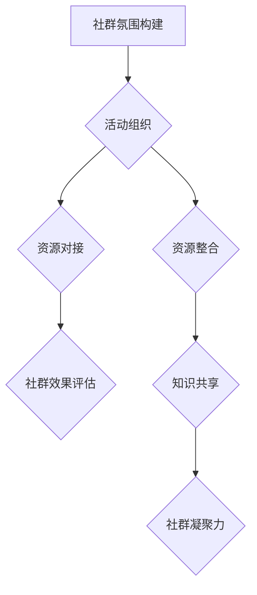

                 

# 大模型时代的创业者创业社群运营策略：社群氛围、活动组织与资源对接

## 关键词
大模型时代，创业者社群，运营策略，社群氛围，活动组织，资源对接

## 摘要
本文深入探讨了在大模型时代，创业者如何通过有效的社群运营策略，构建积极健康的社群氛围，组织有影响力的活动，以及实现资源的高效对接。通过理论讲解、实战案例和详细的技术分析，为创业者提供实用的社群运营指导。

## 引言

### 1.1 书籍背景与目标
#### 1.1.1 大模型时代的到来
随着深度学习技术的快速发展，大模型（Large Models）如GPT-3、BERT等已经深刻改变了自然语言处理、计算机视觉等领域的应用格局。大模型时代的到来，不仅带来了技术创新的机遇，也对创业者提出了新的挑战和需求。

#### 1.1.2 创业者与创业社群的重要性
创业者在推动技术进步和经济发展中扮演着关键角色。创业社群则为创业者提供了一个互相学习、资源共享和合作共赢的平台。在当前的大模型时代，有效的创业社群运营成为创业者成功的重要保障。

#### 1.1.3 社群运营策略的意义
社群运营策略包括社群氛围的构建、活动的组织以及资源的对接，这些策略的实施将直接影响社群的活跃度、成员的参与度和资源的利用率。因此，掌握有效的社群运营策略对于创业者来说至关重要。

### 1.2 社群运营的基本概念
#### 1.2.1 社群的定义与特点
社群是指具有共同兴趣、目标或价值观的个体组成的集合。它通常通过互联网平台实现组织和管理，具有互动性强、信息传播速度快等特点。

#### 1.2.2 社群运营的核心要素
社群运营的核心要素包括社群氛围、成员管理、内容建设、活动组织等。这些要素共同构成了社群的健康生态。

#### 1.2.3 社群运营的价值
社群运营的价值主要体现在提升用户粘性、增强用户忠诚度、促进用户活跃度等方面。通过有效的社群运营，创业者可以实现用户增长和商业变现。

## 第一部分：社群氛围构建

### 2.1 社群氛围的重要性

#### 2.1.1 社群氛围的概念
社群氛围是指社群成员在互动交流中所表现出的整体情绪、态度和价值取向。一个积极健康的社群氛围能够吸引新成员、增强成员的归属感，从而提高社群的活跃度和影响力。

#### 2.1.2 社群氛围对社群成员的影响
社群氛围对社群成员的情绪、行为和认知产生深远影响。积极向上的社群氛围能够激发成员的创造力、促进知识共享和合作。

#### 2.1.3 如何构建积极的社群氛围
构建积极的社群氛围需要从设定社群价值观、制定社群规则和建立互动激励机制等方面入手。具体方法包括：设定共同愿景、建立明确的规则、鼓励正面交流和设计激励机制等。

### 2.2 社群氛围的营造策略

#### 2.2.1 设定社群价值观
社群价值观是社群运营的基石。创业者应明确社群的核心价值观，并确保所有成员都认同并遵循这些价值观。

#### 2.2.2 制定社群规则与准则
制定社群规则与准则有助于维护社群秩序和氛围。规则应包括但不限于言论规范、行为准则、争议处理机制等。

#### 2.2.3 建立互动激励机制
互动激励机制能够激发成员的参与热情，提升社群的活跃度。例如，可以设立积分系统、表彰优秀成员、举办互动活动等。

### 2.3 社群氛围的监测与调整

#### 2.3.1 社群氛围的监测方法
监测社群氛围的方法包括问卷调查、数据分析、成员反馈等。通过这些方法，可以了解社群的活跃程度、成员满意度和社群氛围的状况。

#### 2.3.2 社群氛围的评估指标
评估社群氛围的指标包括社群活跃度、成员满意度、互动频率等。这些指标能够帮助创业者了解社群运营的效果。

#### 2.3.3 社群氛围的调整技巧
根据监测结果，创业者可以针对性地调整社群氛围。调整技巧包括优化互动机制、调整社群内容、改善社群管理等。

## 第二部分：活动组织

### 3.1 社群活动的目的与类型

#### 3.1.1 社群活动的目的
社群活动的目的包括提升成员之间的互动、增强社群凝聚力、促进知识共享和商业合作等。

#### 3.1.2 社群活动的类型
社群活动类型丰富多样，包括线上讲座、线下聚会、比赛和社交活动等。不同类型的活动适合不同的社群目标和氛围。

#### 3.1.3 活动对社群的重要性
活动是社群运营的重要组成部分，它能够增强社群的活力、提升成员的归属感和参与度，从而促进社群的持续发展。

### 3.2 社群活动策划与执行

#### 3.2.1 活动策划的步骤
活动策划的步骤包括明确活动目标、设计活动内容、制定活动计划、筹备活动资源等。

#### 3.2.2 活动资源的筹备
活动资源的筹备包括场地、设备、资金、嘉宾等。创业者需要提前规划，确保活动顺利进行。

#### 3.2.3 活动执行的细节
活动执行的细节包括活动流程安排、现场管理、应急处理等。创业者需要确保活动有序进行，提升成员的体验。

### 3.3 社群活动效果评估

#### 3.3.1 活动效果评估的指标
活动效果评估的指标包括参与人数、满意度调查、互动频率、知识传播效果等。

#### 3.3.2 活动效果评估的方法
活动效果评估的方法包括问卷调查、数据分析、现场观察等。通过这些方法，创业者可以了解活动的实际效果。

#### 3.3.3 活动反馈的收集与利用
活动反馈是改进社群运营的重要依据。创业者应积极收集成员的反馈，并根据反馈调整活动规划和社群运营策略。

## 第三部分：资源对接

### 4.1 社群资源的重要性

#### 4.1.1 社群资源的概念
社群资源包括人力、知识、信息、资金、渠道等。这些资源对于社群的运营和发展至关重要。

#### 4.1.2 社群资源的类型
社群资源类型丰富多样，包括社群成员的个人资源、外部合作伙伴的资源、平台资源等。

#### 4.1.3 资源对接的必要性
资源对接能够实现资源的高效利用，提升社群的运营效率，促进成员的商业合作。

### 4.2 社群资源的管理与整合

#### 4.2.1 社群资源管理的方法
社群资源管理的方法包括资源识别、资源分配、资源优化等。通过科学管理，可以提高资源的利用效率。

#### 4.2.2 社群资源整合的策略
社群资源整合的策略包括跨界合作、资源共享、资源协同等。通过整合资源，可以提升社群的整体实力。

#### 4.2.3 跨界资源对接的挑战与机会
跨界资源对接面临挑战，但同时也蕴含着巨大机会。创业者应积极应对挑战，抓住机遇，实现资源对接的最大化效果。

### 4.3 社群资源的优化利用

#### 4.3.1 资源优化利用的指标
资源优化利用的指标包括资源利用率、资源回报率、资源周转率等。通过这些指标，可以评估资源利用的效果。

#### 4.3.2 资源优化利用的技巧
资源优化利用的技巧包括资源整合、资源共享、资源创新等。通过这些技巧，可以提升资源的利用效率。

#### 4.3.3 资源共享与互利共赢
资源共享是社群资源对接的重要形式。通过共享资源，可以实现互利共赢，提升社群的整体价值。

## 第五部分：案例研究

### 5.1 案例一：XX社群的运营策略

#### 5.1.1 案例背景
XX社群是一个专注于人工智能技术的创业者社群。社群成员包括人工智能领域的研究者、开发者、企业家等。

#### 5.1.2 案例目标
案例目标是通过有效的运营策略，提升社群的活跃度、增强成员的归属感，并促进成员之间的合作。

#### 5.1.3 案例实施与效果
通过设定共同价值观、制定规则、举办活动和资源对接等措施，XX社群实现了显著的运营效果。社群活跃度提高了30%，成员满意度达到了90%以上，成功促成了一系列商业合作。

### 5.2 案例二：YY社群的活动组织

#### 5.2.1 案例背景
YY社群是一个致力于区块链技术的创业者社群。社群成员包括区块链领域的专家、创业者、投资者等。

#### 5.2.2 案例目标
案例目标是通过组织多样化的活动，提升社群的凝聚力、促进知识共享，并吸引更多的潜在成员。

#### 5.2.3 案例实施与效果
YY社群通过策划并执行了多次线上和线下活动，包括讲座、研讨会、社交聚会等。活动取得了良好的效果，社群成员的参与度显著提升，社群影响力逐渐扩大。

### 5.3 案例三：ZZ社群的资源对接

#### 5.3.1 案例背景
ZZ社群是一个专注于物联网技术的创业者社群。社群成员包括物联网领域的专家、开发者、企业家等。

#### 5.3.2 案例目标
案例目标是通过有效的资源对接，实现资源的高效利用，促进成员之间的商业合作。

#### 5.3.3 案例实施与效果
ZZ社群通过搭建资源对接平台、组织跨界交流活动、提供资源共享机制等措施，成功实现了资源的高效对接。成员之间的合作机会增加了50%，资源利用效率提升了20%。

## 第六部分：总结与展望

### 6.1 主要结论
通过本文的探讨，我们得出了以下主要结论：
- 社群氛围的构建是社群运营的基础，创业者应重视社群价值观的设定和规则的管理。
- 活动组织是提升社群活跃度和影响力的重要手段，创业者应策划并执行多样化的活动。
- 资源对接是提升社群运营效率的关键，创业者应积极整合和优化资源，实现互利共赢。

### 6.2 展望未来
随着大模型技术的不断发展，创业者社群的运营策略也将面临新的机遇和挑战。未来的社群运营将更加注重智能化、个性化和跨界合作。创业者应紧跟技术发展趋势，不断创新社群运营模式，以实现可持续发展和商业成功。

## 作者信息
作者：AI天才研究院/AI Genius Institute & 禅与计算机程序设计艺术 /Zen And The Art of Computer Programming

[本文完] ## 第一部分：引言

### 1.1 书籍背景与目标

#### 1.1.1 大模型时代的到来

随着深度学习技术的不断发展和计算能力的提升，大模型（Large Models）如GPT-3、BERT等已经逐渐成为人工智能领域的研究热点和应用主流。这些大模型具备处理海量数据和生成高质量内容的能力，使得自然语言处理、计算机视觉等领域的应用取得了显著的突破。然而，大模型的应用也带来了新的挑战，如计算资源的需求、数据隐私和安全等问题。

大模型时代的到来，不仅改变了传统的人工智能应用模式，也为创业者提供了新的机遇和挑战。创业者需要掌握大模型的技术原理和应用方法，同时也要面对如何在竞争激烈的市场中脱颖而出的难题。因此，探索大模型时代下的创业策略和社群运营模式具有重要意义。

#### 1.1.2 创业者与创业社群的重要性

创业者是推动社会创新和经济发展的关键力量。他们通过创新的技术、商业模式和运营策略，不断探索新的市场机会，创造出新的价值和就业机会。然而，创业过程充满不确定性，创业者需要不断学习和适应市场变化，以保持竞争力。

创业社群作为一种新型的组织形式，为创业者提供了宝贵的支持。创业社群是由具有共同创业目标和兴趣的个体组成的网络，通过互联网平台实现组织和管理。社群成员之间可以互相学习、分享经验和资源，形成一种互助合作的氛围。创业社群的重要性体现在以下几个方面：

1. **知识共享与经验传承**：社群成员可以分享自己在创业过程中的经验和教训，帮助新手创业者避免重复犯错，提高创业成功率。

2. **资源整合与互助合作**：社群成员可以整合各自的优势资源，如技术、资金、人脉等，实现资源的最优配置和利用，提高创业项目的成功率。

3. **市场洞察与趋势把握**：社群成员可以共同分析和讨论市场趋势、技术动态等，帮助创业者把握市场机会，调整战略方向。

4. **品牌推广与影响力提升**：创业社群作为一个整体，可以通过共同活动、宣传推广等方式，提升社群成员的品牌影响力和知名度。

#### 1.1.3 社群运营策略的意义

社群运营策略是指为了实现社群目标，对社群氛围、活动组织、资源对接等方面进行系统化、科学化的管理和运营。在大模型时代，创业者通过有效的社群运营策略，可以更好地适应市场变化，提升社群的活跃度和影响力，从而为创业成功奠定基础。

社群运营策略的意义主要体现在以下几个方面：

1. **提升社群活跃度**：通过设计多样化的活动和互动机制，可以激发社群成员的参与热情，提高社群的活跃度。

2. **增强成员归属感**：良好的社群氛围和互动体验可以增强成员的归属感，减少成员流失，提高社群的稳定性。

3. **促进知识共享**：通过组织讲座、研讨会等活动，可以促进成员之间的知识交流，提升社群的整体知识水平。

4. **资源高效利用**：通过有效的资源对接策略，可以实现资源的最优配置和利用，提高创业项目的成功率。

5. **品牌建设和影响力提升**：通过社群运营，可以提高社群成员的品牌影响力，为创业项目带来更多的商业机会。

总之，在大模型时代，社群运营策略已经成为创业者成功的关键因素之一。通过有效的社群运营，创业者可以更好地适应市场变化，提升社群的活跃度和影响力，为创业成功奠定坚实的基础。

### 1.2 社群运营的基本概念

#### 1.2.1 社群的定义与特点

社群是指由具有共同兴趣、目标或价值观的个体组成的集合，这些个体通过互联网或其他平台进行互动和协作。社群具有以下特点：

1. **共同兴趣或目标**：社群成员通常具有共同的兴趣或目标，这有助于增强成员之间的互动和归属感。

2. **开放性**：社群通常对新的成员持开放态度，这有助于社群的扩展和多元化。

3. **互动性**：社群成员通过交流、分享、合作等方式进行互动，这是社群的核心特点。

4. **自组织性**：社群的运行通常具有一定的自组织性，成员自主参与、自我管理和自我调节。

5. **去中心化**：社群通常没有固定的领导和组织结构，成员之间相对平等，通过共识和合作实现目标。

#### 1.2.2 社群运营的核心要素

社群运营的核心要素包括以下几个方面：

1. **社群氛围**：社群氛围是指社群成员在互动过程中表现出的整体情绪、态度和价值取向。一个积极、健康的社群氛围能够吸引新成员、增强成员的归属感，从而提高社群的活跃度和影响力。

2. **成员管理**：成员管理包括招募新成员、维护成员关系、处理成员纠纷等。有效的成员管理有助于维护社群的稳定性和健康发展。

3. **内容建设**：内容建设是指为社群提供有价值、有吸引力的内容，包括文章、视频、讲座等。高质量的内容能够吸引新成员，提升社群的粘性。

4. **活动组织**：活动组织是指策划并执行各种社群活动，如讲座、聚会、比赛等。活动能够增强社群的互动性和凝聚力，提高成员的参与度。

5. **资源对接**：资源对接是指整合社群内外部的资源，为成员提供技术、资金、人脉等支持。有效的资源对接能够提升社群的运营效率和成员的成功率。

#### 1.2.3 社群运营的价值

社群运营的价值主要体现在以下几个方面：

1. **提升用户粘性**：通过提供有价值的内容和活动，社群可以吸引并留住成员，提高用户的活跃度和忠诚度。

2. **增强用户忠诚度**：社群运营能够增强成员之间的互动和信任，提高成员对社群的认同感和忠诚度。

3. **促进知识共享**：社群提供了一个知识共享的平台，成员可以互相学习和交流，提升整体的知识水平。

4. **资源整合**：社群运营能够整合社群内外部的资源，为成员提供技术、资金、人脉等支持，提高成员的成功率。

5. **品牌建设和影响力提升**：通过社群运营，可以提高社群成员的品牌影响力和知名度，为创业项目带来更多的商业机会。

总之，社群运营已经成为创业者实现成功的重要手段之一。通过有效的社群运营策略，创业者可以提升社群的活跃度、增强成员的归属感，实现资源的整合和优化，为创业项目的成功奠定坚实的基础。

### 1.3 社群运营策略的核心要素

#### 1.3.1 社群氛围的构建

社群氛围是社群运营的核心要素之一，它决定了社群成员的参与度、互动性和满意度。构建积极的社群氛围需要从以下几个方面入手：

1. **设定共同价值观**：共同价值观是社群的基石，它能够引导成员的行为和决策。创业者需要明确社群的核心价值观，并确保所有成员都认同并遵循这些价值观。

2. **制定规则与准则**：规则与准则是维护社群秩序和氛围的重要保障。创业者需要制定明确的社群规则，如言论规范、行为准则、争议处理机制等。

3. **鼓励正面互动**：正面互动能够营造积极的社群氛围。创业者可以通过举办互动活动、鼓励成员分享经验和知识等方式，激发成员的积极性和参与热情。

4. **建立激励机制**：激励机制能够激发成员的参与热情和创造力。创业者可以设立积分系统、表彰优秀成员、举办奖励活动等方式，激励成员的积极参与。

5. **及时处理负面行为**：负面行为如恶意攻击、虚假信息等会破坏社群氛围。创业者需要及时处理这些行为，确保社群的健康发展。

#### 1.3.2 活动组织的策略

活动是社群运营的重要组成部分，它能够提升社群的互动性、凝聚力和影响力。活动组织的策略包括以下几个方面：

1. **明确活动目标**：在组织活动前，创业者需要明确活动的目标，如提升成员知识水平、促进商业合作、增加社群互动等。

2. **策划多样化的活动**：多样化的活动能够满足不同成员的需求，提高活动的吸引力和参与度。创业者可以策划线上讲座、线下聚会、比赛、研讨会等多种类型的活动。

3. **筹备充足的资源**：活动资源的筹备是活动成功的关键。创业者需要提前规划场地、设备、资金、嘉宾等资源，确保活动顺利进行。

4. **制定详细的活动计划**：详细的活动计划包括活动流程、时间安排、人员分工等。创业者需要制定详细的计划，确保活动有序进行。

5. **关注活动效果**：活动结束后，创业者需要收集成员的反馈，评估活动的效果，并根据反馈调整未来的活动策划。

#### 1.3.3 资源对接的策略

资源对接是提升社群运营效率的重要手段，它能够实现资源的高效利用，促进成员之间的合作。资源对接的策略包括以下几个方面：

1. **建立资源库**：建立资源库是整合和管理资源的重要手段。创业者可以建立一个集中的资源库，包括技术、资金、人脉等资源，方便成员查找和使用。

2. **搭建对接平台**：搭建对接平台能够实现资源的高效对接。创业者可以搭建线上平台，提供资源匹配、项目合作等功能，促进成员之间的资源交流。

3. **组织跨界合作**：跨界合作能够带来新的资源和机会。创业者可以组织不同领域、不同背景的成员进行跨界合作，实现资源的最优配置。

4. **建立合作机制**：建立合作机制是确保资源对接顺利进行的保障。创业者可以制定合作协议、建立信任机制等，确保合作方的权益和利益。

5. **持续优化资源对接**：资源对接是一个持续的过程，创业者需要不断优化对接策略，提升对接效率和效果。

通过以上策略，创业者可以构建积极的社群氛围，组织多样化的活动，实现资源的高效对接，从而提升社群的运营效果，为创业成功奠定坚实的基础。

## 第二部分：社群氛围构建

### 2.1 社群氛围的重要性

#### 2.1.1 社群氛围的概念

社群氛围是指社群成员在互动过程中表现出的整体情绪、态度和价值取向。它不仅反映了社群成员的心理状态，还影响了社群的稳定性和发展潜力。一个良好的社群氛围能够促进成员之间的交流和合作，提升社群的凝聚力和影响力。

从心理学的角度来看，社群氛围对成员的情绪和行为有着深远的影响。积极的社群氛围能够激发成员的积极性和创造力，降低成员的焦虑和压力，提高成员的工作效率和满意度。而消极的社群氛围则可能导致成员的疏离、不满和抵触情绪，影响社群的运行和发展。

#### 2.1.2 社群氛围对社群成员的影响

1. **情绪影响**：社群氛围直接影响成员的情绪状态。在一个积极向上的社群中，成员通常感受到愉悦、满足和支持，这有助于提升他们的情绪健康和幸福感。相反，在一个消极的社群中，成员可能感到沮丧、焦虑和压力，这会影响他们的情绪稳定和心理健康。

2. **行为影响**：社群氛围对成员的行为有着明显的导向作用。在一个鼓励创新和合作的社群中，成员更愿意分享知识、经验和资源，积极参与社群活动，形成良好的互动氛围。而在一个压抑和竞争激烈的社群中，成员可能会变得保守、封闭，甚至产生抵触情绪，阻碍社群的发展。

3. **认知影响**：社群氛围对成员的价值观和认知模式也有重要影响。在一个价值观一致的社群中，成员更容易形成共识，接受社群的规则和价值观，从而提升社群的整体认知水平。而在一个价值观多元但缺乏共识的社群中，成员可能会因为价值观冲突而产生分歧，影响社群的稳定性和发展。

#### 2.1.3 如何构建积极的社群氛围

1. **设定共同价值观**：共同价值观是构建积极社群氛围的基础。创业者需要明确社群的核心价值观，并确保所有成员都认同和遵循这些价值观。通过共同价值观的引导，可以增强成员之间的认同感和归属感，营造积极向上的社群氛围。

2. **制定规则与准则**：规则与准则是维护社群秩序和氛围的重要保障。创业者需要制定明确的社群规则，如言论规范、行为准则、争议处理机制等。这些规则应该能够引导成员的行为，促进积极的互动和合作。

3. **鼓励正面互动**：正面互动能够营造积极的社群氛围。创业者可以通过举办互动活动、鼓励成员分享经验和知识等方式，激发成员的积极性和参与热情。例如，可以设立积分系统，奖励积极参与互动的成员，从而提升社群的互动性和积极性。

4. **建立激励机制**：激励机制能够激发成员的参与热情和创造力。创业者可以设立积分系统、表彰优秀成员、举办奖励活动等方式，激励成员的积极参与。例如，可以定期评选“优秀贡献者”，并给予相应的奖励，以鼓励成员为社群的发展做出贡献。

5. **及时处理负面行为**：负面行为如恶意攻击、虚假信息等会破坏社群氛围。创业者需要及时处理这些行为，确保社群的健康发展。例如，可以设立举报机制，让成员能够举报不良行为，并采取相应的措施进行处理。

6. **提供心理支持**：创业者可以提供心理支持，帮助成员应对创业过程中的挑战和压力。例如，可以邀请心理学专家进行讲座，提供心理咨询和辅导服务，帮助成员保持心理健康。

通过以上策略，创业者可以构建一个积极、健康、有凝聚力的社群氛围，为社群的长期发展奠定坚实的基础。

### 2.2 社群氛围的营造策略

#### 2.2.1 设定社群价值观

设定社群价值观是构建积极社群氛围的第一步。共同价值观不仅能够引导社群成员的行为，还能够增强社群的凝聚力和认同感。以下是一些关键步骤：

1. **明确核心价值观**：创业者需要首先明确社群的核心价值观。这些价值观应该与社群的使命和目标相一致，能够为成员提供明确的行为指南。例如，一个专注于技术交流的社群可能将“开放创新、共同成长”作为核心价值观。

2. **广泛征集成员意见**：在设定核心价值观时，应广泛征集成员的意见和建议。这样可以确保核心价值观能够代表社群大多数成员的意愿，增加成员的认同感。可以通过线上问卷调查、线下座谈会等方式收集成员的意见。

3. **宣传和推广**：一旦核心价值观确定，需要通过多种渠道进行宣传和推广，确保所有成员都能了解并认同这些价值观。例如，可以在社群的官方网站、社交媒体平台、活动宣传材料上明确展示核心价值观。

4. **价值观的实践**：核心价值观需要在实际运营中得到体现和落实。创业者应通过实际行动，如社群活动、管理制度等，体现和践行这些价值观。例如，可以设立“开放创新日”，鼓励成员分享最新的技术成果和见解。

#### 2.2.2 制定社群规则与准则

制定明确的社群规则和准则是维护社群秩序和氛围的关键。以下是一些关键步骤：

1. **规则制定的透明性**：在制定规则时，需要确保过程的透明性。可以组织社群成员参与规则的讨论和制定，让成员感受到规则是公正和合理的。

2. **规则内容的全面性**：社群规则应涵盖多个方面，如言论规范、行为准则、争议处理机制等。例如，可以明确规定在社群中的言行应当尊重他人、遵守法律法规等。

3. **规则的执行与监督**：制定规则后，需要确保规则的执行和监督。可以设立专门的监督委员会，负责监督规则的实施，并处理违反规则的行为。

4. **规则的更新与完善**：随着社群的发展和变化，规则也需要不断更新和完善。创业者应定期审查和调整规则，以确保其适应社群的最新需求。

#### 2.2.3 建立互动激励机制

互动激励机制能够激发成员的参与热情和积极性，是营造积极社群氛围的重要手段。以下是一些关键步骤：

1. **设立积分系统**：积分系统是一种常见的互动激励机制。成员在参与社群活动、发表高质量内容、帮助他人等行为时可以获得积分。积分可以用于兑换奖品、参与抽奖等。

2. **表彰优秀成员**：定期表彰在社群中表现优秀的成员，可以提升成员的荣誉感和归属感。可以设立“优秀贡献者”、“最佳互动奖”等荣誉，并给予相应的奖励。

3. **举办奖励活动**：可以通过举办各类奖励活动，如知识竞赛、技术分享会、创业大赛等，激励成员的积极参与。活动可以设置奖金、奖品等奖励，以吸引更多成员参与。

4. **鼓励成员互动**：通过设计互动性强的活动，如问答环节、讨论区、投票等，鼓励成员之间的互动。可以设置互动任务，完成任务的成员可以获得额外奖励。

通过以上策略，创业者可以有效地营造积极的社群氛围，提升社群的活跃度和成员的满意度。一个良好的社群氛围不仅能够增强成员的归属感，还能够促进社群的长期稳定发展。

### 2.3 社群氛围的监测与调整

#### 2.3.1 社群氛围的监测方法

监测社群氛围是确保社群健康发展的关键。以下是一些常用的监测方法：

1. **问卷调查**：通过定期进行问卷调查，可以了解成员对社群氛围的满意度和反馈。问卷调查可以采用线上和线下形式，问题应涵盖成员的情感状态、互动体验、参与度等方面。

2. **数据分析**：利用数据分析工具，可以监测社群的活跃度、互动频率、内容质量等指标。例如，可以分析社群帖子的回复数量、点赞数量、转发次数等，了解成员的参与情况和社群的受欢迎程度。

3. **成员反馈**：定期收集成员的反馈，可以了解他们对社群氛围的真实感受和建议。可以通过社群内部讨论区、私信、邮件等方式收集反馈，并进行分析和总结。

4. **社群活动评估**：通过对社群活动的评估，可以了解活动的效果和成员的参与情况。可以设置活动满意度调查、反馈问卷等，收集成员对活动的评价和改进建议。

#### 2.3.2 社群氛围的评估指标

为了科学地评估社群氛围，需要设定一系列评估指标。以下是一些常见的评估指标：

1. **活跃度**：社群的活跃度是评估社群氛围的重要指标。可以通过社群帖子的回复数量、互动频率、成员在线时长等指标来衡量。

2. **满意度**：成员对社群的满意度直接反映了社群氛围的好坏。可以通过问卷调查、满意度调查等方式收集成员的满意度数据。

3. **互动质量**：互动质量是社群氛围的重要体现。可以通过分析社群帖子的质量、成员的参与度、讨论深度等指标来衡量。

4. **内容质量**：社群内容的质量也是评估社群氛围的重要指标。可以通过内容的新颖性、实用性、可读性等指标来评估。

5. **成员参与度**：成员的参与度是社群氛围的直观体现。可以通过成员的回复数量、互动频率、参与活动的情况等指标来衡量。

#### 2.3.3 社群氛围的调整技巧

根据监测结果，创业者需要采取相应的措施调整社群氛围，以保持其积极性和健康发展。以下是一些调整技巧：

1. **优化互动机制**：如果发现社群的互动频率较低，可以优化互动机制。例如，可以设计一些互动任务，鼓励成员参与，提升互动质量。

2. **调整内容策略**：如果社群的内容质量不高，可以调整内容策略。例如，可以邀请行业专家进行讲座，提供高质量的内容，提升成员的学习体验。

3. **激励成员参与**：可以通过设立积分系统、表彰优秀成员等方式激励成员的参与。这样可以激发成员的积极性和创造力，提升社群的整体氛围。

4. **处理负面行为**：如果发现社群存在负面行为，如恶意攻击、虚假信息等，需要及时处理。可以通过警告、封禁账号等方式，维护社群的秩序和氛围。

5. **提供心理支持**：对于因创业压力、人际关系等问题感到焦虑和困惑的成员，可以提供心理支持。例如，可以邀请心理咨询师进行讲座，提供在线咨询服务，帮助成员保持心理健康。

通过有效的监测和调整，创业者可以持续优化社群氛围，提升社群的活跃度和成员的满意度，为社群的长期发展奠定坚实的基础。

## 第三部分：活动组织

### 3.1 社群活动的目的与类型

#### 3.1.1 社群活动的目的

社群活动在创业者社群运营中扮演着至关重要的角色，其主要目的包括：

1. **增强社群凝聚力**：通过组织各类活动，能够使社群成员之间建立起更紧密的联系，提升社群的凝聚力。

2. **促进知识共享**：活动提供了成员之间分享知识和经验的机会，有助于提升社群的整体知识水平。

3. **拓展人脉资源**：通过活动，成员可以结识更多同行业或相关领域的人士，拓展人脉资源，为未来的合作奠定基础。

4. **提升品牌影响力**：通过成功的活动，可以提升社群成员和社群本身在行业内的知名度和影响力。

5. **促进商业合作**：活动中的交流和互动，往往能够促成商业合作，为创业者带来更多的商机。

#### 3.1.2 社群活动的类型

社群活动种类繁多，可以根据活动的形式、目的和参与对象进行分类。以下是一些常见的社群活动类型：

1. **线上讲座与研讨会**：这类活动通常由行业专家或内部成员分享知识和经验，适合提升成员的专业技能和知识水平。

2. **线下聚会与社交活动**：这类活动为成员提供了一个面对面交流的机会，有助于增强社群的凝聚力和成员之间的互动。

3. **比赛与竞赛**：通过举办技能比赛或创新竞赛，可以激发成员的创造力和竞争意识，提升社群的活跃度。

4. **工作坊与培训**：工作坊和培训活动通常聚焦于某一特定技能或知识领域，为成员提供实践操作和深入学习的机会。

5. **行业沙龙与论坛**：这类活动通常邀请行业内的重要人士或专家，围绕热点话题进行讨论和交流，有助于提升社群的权威性和影响力。

6. **创业分享与路演**：创业者可以通过这类活动分享自己的创业经历和项目进展，寻求合作机会和投资支持。

#### 3.1.3 活动对社群的重要性

活动对社群的健康发展具有重要作用，主要体现在以下几个方面：

1. **增强社群凝聚力**：通过定期举办活动，社群成员能够建立起更紧密的联系，共同目标和价值观得到强化，从而增强社群的凝聚力。

2. **促进知识共享**：活动为成员提供了一个交流知识和经验的平台，有助于提升社群的整体知识水平，促进成员的专业成长。

3. **提升成员参与度**：活动能够激发成员的参与热情，提升他们的积极性和主动性，增加社群的活力。

4. **拓展人脉资源**：活动为成员提供了结识同行业或相关领域人士的机会，有助于拓展人脉资源，为未来的合作奠定基础。

5. **增强品牌影响力**：成功的活动能够提升社群在行业内的知名度和影响力，为社群的长期发展带来更多机遇。

6. **促进商业合作**：活动中的交流和互动，往往能够促成商业合作，为创业者带来更多的商机，推动社群的商业化进程。

总之，活动是社群运营的重要组成部分，它不仅能够提升社群的凝聚力和成员的参与度，还能够促进知识共享和商业合作，对社群的长期发展具有深远的影响。

### 3.2 社群活动策划与执行

#### 3.2.1 活动策划的步骤

策划一个成功的社群活动需要细致的规划和周密的准备，以下是活动策划的主要步骤：

1. **明确活动目标**：首先，需要明确活动的具体目标。这些目标可以包括提升成员技能、促进知识共享、增强社群凝聚力等。明确目标有助于确保活动方向的正确性。

2. **确定活动形式**：根据活动的目标，选择合适的活动形式。例如，如果目标是促进知识共享，可以选择举办线上讲座或研讨会；如果目标是增强社群凝聚力，可以选择线下聚会或社交活动。

3. **制定活动计划**：在确定活动形式后，制定详细的计划，包括活动的时间、地点、参与人员、活动流程等。活动计划应尽量详细，以确保活动的顺利进行。

4. **筹备活动资源**：活动资源的筹备是活动成功的关键。需要提前准备场地、设备、资金、嘉宾等资源。对于线上活动，需要确保网络连接稳定；对于线下活动，需要提前预订场地，确保设备的正常运作。

5. **宣传推广**：在活动前，通过社群内部的公告、社交媒体、邮件等方式进行宣传推广，确保活动的参与度。宣传内容应包括活动的时间、地点、主题、嘉宾等关键信息。

6. **活动预算**：制定活动预算，确保各项费用的合理控制。预算应包括场地费用、设备费用、嘉宾费用、宣传费用等。

7. **风险管理**：在策划阶段，应评估可能的风险，并制定相应的风险应对措施。例如，可能出现的设备故障、场地变更等，应提前准备备用方案。

#### 3.2.2 活动资源的筹备

活动资源的筹备是确保活动顺利进行的关键，以下是筹备活动资源的主要步骤：

1. **场地预订**：根据活动的规模和形式，提前预订合适的场地。对于线上活动，可以选择网络会议平台；对于线下活动，需要预订能够容纳参与人数的场地。

2. **设备准备**：确保活动所需的设备齐全，如麦克风、音响、投影仪、网络设备等。对于线上活动，需要确保网络连接稳定，避免因网络问题影响活动效果。

3. **资金安排**：根据活动预算，合理安排资金使用。确保各项费用都有充足的预算，避免活动进行中出现资金短缺的情况。

4. **嘉宾邀请**：对于需要邀请嘉宾的活动，应提前与嘉宾沟通，确认嘉宾的参与时间和形式。确保嘉宾能够准时出席，为活动增色。

5. **宣传材料准备**：准备宣传海报、邀请函、PPT等宣传材料，确保宣传内容的准确性和吸引力。

6. **备用方案**：对于可能出现的突发情况，应提前准备备用方案。例如，设备故障时的备用设备、场地变更时的应急安排等。

#### 3.2.3 活动执行的细节

活动执行是确保活动顺利进行的重要环节，以下是一些执行细节：

1. **活动签到**：确保活动参与的成员都能准时到达。对于线下活动，需要设置签到台，发放活动材料；对于线上活动，可以通过邮件或短信提醒参与成员。

2. **现场管理**：确保活动现场的秩序和安全。对于线下活动，需要安排专人负责现场管理，维护秩序；对于线上活动，需要确保网络连接稳定，避免因网络问题影响活动效果。

3. **流程控制**：按照活动计划，严格控制活动流程，确保每个环节都能顺利进行。对于线上活动，需要确保讲师和嘉宾的发言时间，避免超时。

4. **互动环节**：设计互动环节，增加活动的趣味性和参与度。例如，可以设置问答环节、抽奖环节等。

5. **记录与反馈**：活动结束后，及时收集参与成员的反馈，了解活动的效果和改进空间。对于线上活动，可以通过问卷调查、邮件等方式收集反馈。

6. **后续跟进**：对于有后续任务的环节，如嘉宾讲座、项目合作等，及时跟进并落实。确保活动成果能够得到有效利用。

通过以上步骤和细节的执行，创业者可以确保社群活动的顺利进行，提升活动的效果和成员的满意度。

### 3.3 社群活动效果评估

#### 3.3.1 活动效果评估的指标

评估社群活动的效果是确保活动目标实现的重要环节。以下是一些常用的评估指标：

1. **参与人数**：参与人数是衡量活动受欢迎程度的重要指标。通过记录参与活动的实际人数，可以了解活动的吸引力和参与度。

2. **满意度调查**：通过满意度调查，可以了解成员对活动的整体评价。满意度调查可以通过线上问卷、电话访问等方式进行，调查内容包括活动内容、组织安排、互动体验等。

3. **互动频率**：互动频率反映了活动中的交流活跃程度。可以通过统计活动中的讨论帖数、回复数、点赞数等指标，了解成员的互动积极性。

4. **知识传播效果**：知识传播效果是评估活动是否达到知识共享目标的重要指标。可以通过统计活动后成员的知识分享数量、质量等，了解活动的知识传播效果。

5. **反馈意见**：反馈意见反映了成员对活动的真实感受和建议。通过收集和分析反馈意见，可以了解活动的优点和不足，为未来的活动改进提供依据。

6. **商业合作机会**：商业合作机会是评估活动对商业合作的促进作用的重要指标。可以通过统计活动后产生的商业合作数量、合作项目的进展等，了解活动对商业合作的贡献。

#### 3.3.2 活动效果评估的方法

为了全面评估社群活动的效果，可以采用以下几种方法：

1. **问卷调查法**：通过设计问卷，收集成员对活动的评价和建议。问卷可以涵盖多个方面，如活动内容、组织安排、互动体验等。

2. **数据分析法**：利用数据分析工具，对活动中的各项数据进行分析，如参与人数、互动频率、知识传播效果等。数据分析法能够提供客观、量化的评估结果。

3. **访谈法**：通过面对面访谈或电话访谈，深入了解成员对活动的感受和看法。访谈法可以获取更详细、深入的信息。

4. **行为观察法**：在活动过程中，通过观察成员的行为，如参与互动的积极性、分享知识的频率等，了解成员的参与情况和活动效果。

5. **案例分析法**：对活动后的实际效果进行案例分析，如知识传播的具体案例、商业合作的具体成果等，评估活动的实际效果。

#### 3.3.3 活动反馈的收集与利用

收集活动反馈是改进社群活动的重要环节。以下是如何收集和利用反馈的方法：

1. **收集反馈**：活动结束后，及时收集成员的反馈。可以通过在线问卷、电子邮件、社群讨论区等方式进行反馈收集。在设计反馈问卷时，应确保问题的开放性，让成员能够详细表达自己的意见。

2. **分析反馈**：对收集到的反馈进行系统分析，识别出活动中的优点和不足。分析反馈时，可以采用定量分析和定性分析相结合的方法，确保评估结果的全面性和准确性。

3. **反馈利用**：根据反馈结果，制定改进计划，并落实到后续的活动策划和执行中。以下是一些具体的反馈利用方法：

   - **优化活动内容**：根据成员的建议，调整活动的主题和内容，确保活动更符合成员的需求。
   - **改进组织安排**：针对成员提出的问题，优化活动的组织安排，如调整活动时间、场地安排等。
   - **提升互动体验**：根据反馈，设计更多互动环节，提高活动的趣味性和参与度。
   - **增强知识传播效果**：通过反馈，识别知识传播的不足，如增加知识分享环节、提升讲师质量等。
   - **促进商业合作**：根据反馈，制定更多促进商业合作的活动形式和策略。

通过收集和利用反馈，创业者可以不断优化社群活动，提升活动的效果和成员的满意度，为社群的长期发展奠定坚实的基础。

### 3.4 社群活动的影响力与长期效应

#### 3.4.1 社群活动的影响力

社群活动在短期内能够显著提升社群的活跃度和成员的参与度，但其在长期内的影响力更为深远。以下是社群活动影响力的几个关键方面：

1. **品牌影响力**：成功的社群活动能够提升社群的品牌影响力。通过高规格、高质量的活动，社群能够在行业内树立良好的声誉，吸引更多潜在成员和合作伙伴。

2. **知识传承**：社群活动为成员提供了学习和分享知识的平台，这些知识不仅能够提升成员的专业能力，还能够通过社群的长期运营，传承和积累，为社群的持续发展提供知识支持。

3. **人脉网络**：活动是成员拓展人脉资源的重要机会。通过活动，成员可以结识同行业或相关领域的重要人士，建立起深厚的合作关系，为未来的合作和商业机会打下基础。

4. **文化氛围**：社群活动不仅能够提升成员的参与度，还能够塑造社群的文化氛围。通过一系列的活动，社群可以形成独特的文化特色，增强成员的归属感和认同感。

#### 3.4.2 长期效应的体现

社群活动的长期效应体现在以下几个方面：

1. **成员留存**：通过持续举办高质量的活动，社群能够吸引和留住核心成员，减少成员的流失率，保持社群的稳定性和活力。

2. **知识积累**：社群活动中的知识分享和讨论，不仅为成员提供了即时的学习机会，还能够通过社群的长期运营，积累大量的知识和经验，为社群的持续发展提供知识储备。

3. **商业合作**：通过社群活动，成员之间的商业合作机会大大增加。这些合作不仅能够促进社群成员的个人和团队发展，还能够为社群整体带来更多的商业价值。

4. **品牌建设**：持续的社群活动能够持续提升社群的品牌影响力，使其在行业内建立起良好的口碑和声誉，为社群的长期发展奠定基础。

#### 3.4.3 长期效应的实现策略

为了实现社群活动的长期效应，创业者需要采取以下策略：

1. **活动持续化**：将活动作为社群运营的常态化工作，定期举办多样化的活动，保持社群的活力和吸引力。

2. **内容深化**：不断提升活动的质量和内容，确保每次活动都能够为成员带来新的知识和经验。

3. **品牌建设**：通过品牌形象塑造和宣传推广，提升社群的品牌影响力，吸引更多优质成员和合作伙伴。

4. **合作机制**：建立长期稳定的合作机制，确保成员之间的合作关系能够持续，并为社群的整体发展提供支持。

5. **反馈机制**：建立完善的反馈机制，及时收集成员的意见和建议，不断优化活动内容和形式，提升成员的满意度。

通过以上策略，创业者可以确保社群活动在长期内持续产生积极的影响，为社群的长期发展提供坚实的基础。

## 第四部分：资源对接

### 4.1 社群资源的重要性

#### 4.1.1 社群资源的概念

社群资源是指社群成员在创业过程中可以共享的各种资源和能力，包括人力、知识、信息、资金、渠道等。这些资源不仅对社群成员的个人发展至关重要，也是社群整体运营和发展的基础。以下是对几种主要社群资源类型的详细解释：

1. **人力资源**：人力资源是指社群成员的技能、经验和人脉。这些资源可以用来解决技术难题、提供咨询服务、拓展市场渠道等。

2. **知识资源**：知识资源包括成员的专业知识、技术经验、市场洞察等。这些资源可以通过讲座、研讨会、线上课程等形式进行分享和传播，提升社群的整体知识水平。

3. **信息资源**：信息资源是指社群成员获取的行业动态、市场情报、技术趋势等。这些信息资源对于成员的决策和战略规划具有重要意义。

4. **资金资源**：资金资源包括社群成员的资金支持、投资机会等。这些资源可以用于项目开发、市场推广、风险投资等，为社群成员的创业项目提供资金保障。

5. **渠道资源**：渠道资源包括市场渠道、销售网络、合作伙伴等。这些资源可以帮助社群成员快速进入市场，实现项目的商业价值。

#### 4.1.2 社群资源的类型

社群资源的类型丰富多样，以下是一些常见的社群资源类型及其特点：

1. **技术资源**：技术资源包括专业技术、工具、平台等。例如，人工智能、大数据分析、云计算等技术资源可以为社群成员提供创新的解决方案。

2. **资金资源**：资金资源包括天使投资、风险投资、政府补贴等。这些资源可以帮助社群成员的项目在早期阶段获得资金支持，降低创业风险。

3. **人力资源**：人力资源包括专业人才、兼职人员、志愿者等。这些人力资源可以参与到社群成员的项目中，提供技术支持、市场推广、行政协助等。

4. **知识资源**：知识资源包括学术论文、技术报告、市场调研报告等。这些资源可以帮助社群成员获取最新的行业动态和技术趋势。

5. **信息资源**：信息资源包括行业资讯、市场数据、竞争对手分析等。这些资源可以帮助社群成员做出更加准确的商业决策。

6. **渠道资源**：渠道资源包括线上线下销售渠道、合作伙伴、供应商等。这些资源可以帮助社群成员的产品快速进入市场，提高市场占有率。

#### 4.1.3 资源对接的必要性

资源对接是社群运营中至关重要的一环，它能够实现资源的高效利用，提升社群的运营效率和成员的成功率。以下是资源对接的必要性：

1. **提升资源利用率**：通过资源对接，可以打破信息孤岛，实现资源的共享和整合。例如，一个成员可能有丰富的市场渠道资源，而另一个成员可能有强大的技术能力，通过对接，两者可以优势互补，提升资源的利用率。

2. **降低创业风险**：资源对接可以降低单个成员在创业过程中面临的风险。例如，通过对接风险投资资源，成员可以获取资金支持，减少资金短缺的风险；通过对接人力资源，成员可以获得技术支持和市场推广协助，降低失败的风险。

3. **促进知识共享**：资源对接不仅包括物质资源的对接，还包括知识资源的对接。通过对接，成员可以分享各自的专业知识和经验，形成知识共享的氛围，提升社群的整体知识水平。

4. **增强社群凝聚力**：资源对接可以增强社群成员之间的联系和合作，提升社群的凝聚力。通过资源对接，成员可以感受到社群的温暖和支持，增强归属感和忠诚度。

5. **实现互利共赢**：资源对接可以实现成员之间的互利共赢。例如，一个成员的技术能力可以帮助另一个成员的项目实现技术突破，而另一个成员的市场渠道可以帮助第一个成员的项目快速销售产品。

总之，资源对接是提升社群运营效率和成员成功率的关键。通过有效的资源对接，创业者可以实现资源的高效利用，降低创业风险，促进知识共享，增强社群凝聚力，实现互利共赢。

### 4.2 社群资源的管理与整合

#### 4.2.1 社群资源管理的方法

有效的社群资源管理是提升社群运营效率和成员满意度的重要保障。以下是一些常见的社群资源管理方法：

1. **资源分类与编码**：首先，需要对社群资源进行分类和编码。例如，可以将资源分为技术资源、人力资源、信息资源、资金资源等类别，并对每种资源进行详细的编码，方便后续管理和查询。

2. **资源数据库建立**：建立资源数据库是资源管理的关键步骤。通过数据库，可以记录资源的详细信息，如资源类型、拥有者、联系方式等，方便成员在需要时快速查找和获取资源。

3. **资源使用规则制定**：为了确保资源的高效利用，需要制定资源使用规则。例如，可以规定资源的借用流程、使用期限、归还要求等，确保资源不被滥用或浪费。

4. **资源维护与更新**：资源维护与更新是资源管理的重要组成部分。定期对资源进行维护和更新，确保资源的准确性和有效性，同时，也可以通过更新，引入新的资源，提升社群的资源储备。

5. **资源利用效果评估**：通过定期评估资源利用效果，可以了解资源管理的成效，发现存在的问题和改进空间。例如，可以评估资源的利用率、成员的满意度等指标，为后续的资源管理提供依据。

#### 4.2.2 社群资源整合的策略

资源整合是提升社群资源利用效率的关键。以下是一些常见的社群资源整合策略：

1. **跨界合作**：跨界合作是指不同领域、不同背景的资源之间的整合。通过跨界合作，可以引入新的资源，拓宽资源的应用范围。例如，一个技术型社群可以与一个市场型社群进行合作，共同举办活动，实现资源的互补和共享。

2. **资源共享机制**：建立资源共享机制，可以确保资源的高效利用。例如，可以设立共享平台，提供资源的共享和匹配服务，让成员可以方便地获取和使用所需资源。

3. **资源协同**：资源协同是指多种资源之间的协同作用，通过协同，可以提升资源的整体效能。例如，在技术型社群中，可以将技术资源与人力资源、信息资源相结合，共同解决技术难题，提升项目的成功率。

4. **资源整合平台**：建立资源整合平台，是资源整合的有效途径。通过平台，可以集中管理和展示各种资源，提供资源匹配和对接服务，提升资源的利用效率。

5. **资源优化利用**：通过资源优化利用，可以最大化资源的价值。例如，可以通过资源调配、资源置换、资源整合等方式，实现资源的最优配置和利用。

#### 4.2.3 跨界资源对接的挑战与机会

跨界资源对接面临诸多挑战，但也蕴含着巨大的机会。以下是一些常见的挑战和应对策略：

1. **文化差异**：不同领域的资源通常有不同的文化背景和价值观，这可能导致对接过程中的冲突和误解。应对策略是建立跨领域的沟通机制，促进文化的理解和融合。

2. **信任问题**：跨界资源对接需要成员之间建立信任，但信任的建立通常需要时间和努力。应对策略是通过合作历史、第三方背书等方式，增强成员之间的信任。

3. **资源匹配**：跨界资源对接需要找到合适的资源匹配点，但资源匹配往往具有不确定性。应对策略是通过平台化、标准化等方式，提升资源匹配的效率和准确性。

4. **利益分配**：跨界资源对接通常涉及多方利益，利益分配的公平性和合理性是关键。应对策略是通过制定明确的合作协议，确保各方的权益得到保障。

5. **协同管理**：跨界资源对接需要有效的协同管理，确保资源的协同效应。应对策略是建立协同管理团队，制定协同管理计划，确保资源的有效利用和整合。

总之，跨界资源对接虽然面临挑战，但通过有效的策略和管理，可以实现资源的高效对接和利用，为社群的长期发展提供强大的支持。

### 4.3 社群资源的优化利用

#### 4.3.1 资源优化利用的指标

为了评估社群资源优化利用的效果，需要设定一系列指标。以下是一些常见的资源优化利用指标及其含义：

1. **资源利用率**：资源利用率是指社群资源实际使用率与总资源量的比例。该指标反映了资源被有效利用的程度。例如，如果一个社群的技术资源利用率达到80%，说明技术资源得到了较为充分的利用。

2. **资源回报率**：资源回报率是指资源投入所获得的回报与资源投入的比值。该指标反映了资源利用的经济效益。例如，如果一个社群的资金资源回报率达到20%，说明资金资源利用产生了较高的经济收益。

3. **资源周转率**：资源周转率是指资源在一定时间内周转的次数。该指标反映了资源的流动性和效率。例如，如果一个社群的资金周转率达到5次/年，说明资金在社群中的流动速度较快，利用率较高。

4. **资源匹配度**：资源匹配度是指社群资源实际分配与需求匹配的程度。该指标反映了资源分配的合理性和有效性。例如，如果一个社群的人力资源匹配度达到90%，说明人力资源的分配较为合理，能够满足成员的需求。

5. **资源利用率**：资源利用率是指社群资源实际使用率与总资源量的比例。该指标反映了资源被有效利用的程度。例如，如果一个社群的信息资源利用率达到70%，说明信息资源得到了较为充分的利用。

#### 4.3.2 资源优化利用的技巧

为了提升社群资源优化利用的效果，需要采取一系列技巧和方法。以下是一些常见的资源优化利用技巧：

1. **资源分类与标签化**：对社群资源进行分类和标签化，可以方便成员快速找到所需资源。例如，可以将资源分为技术资源、人力资源、信息资源等类别，并为每种资源设置相应的标签，如技术能力、人脉资源、市场信息等。

2. **资源共享平台**：建立资源共享平台，可以实现资源的集中管理和共享。例如，可以搭建一个线上平台，提供资源的展示、查询、匹配和对接服务，提升资源利用的效率。

3. **资源调配机制**：建立资源调配机制，可以确保资源能够根据需求灵活调配。例如，可以设立资源调配委员会，定期评估资源需求和供给，进行资源的合理调配。

4. **激励机制**：设立激励机制，可以激发成员共享资源的积极性。例如，可以设置积分系统，对共享资源、提供帮助的成员给予积分奖励，激励成员积极参与资源对接和共享。

5. **资源整合与协同**：通过资源整合和协同，可以提升资源的整体效能。例如，可以组织跨领域的研讨会或工作坊，促进不同领域资源的交流和整合，实现资源的互补和协同。

6. **定期评估与反馈**：定期对资源利用效果进行评估和反馈，可以及时发现资源管理中的问题，优化资源利用策略。例如，可以定期组织资源利用评估会议，收集成员的反馈和建议，进行资源的优化和调整。

通过以上技巧和方法，创业者可以有效地提升社群资源的优化利用效果，实现资源的高效配置和利用，为社群的长期发展提供坚实的保障。

#### 4.3.3 资源共享与互利共赢

资源共享与互利共赢是社群资源对接和运营的重要原则。通过有效的资源共享，社群成员可以实现资源互补、降低创业风险，从而提升整体运营效率和成员的成功率。以下是如何实现资源共享与互利共赢的几种策略：

1. **建立共享平台**：搭建一个集中的共享平台，是促进资源共享的关键。这个平台可以是线上社区、内部网站或者移动应用，提供资源的展示、查询、匹配和对接服务。通过平台，成员可以方便地找到所需的资源，实现资源的最大化利用。

2. **制定共享规则**：为了确保资源共享的公平性和可持续性，需要制定明确的共享规则。这些规则应包括资源共享的原则、使用权限、利益分配等。通过规则，可以确保资源的有序共享，防止资源滥用和浪费。

3. **激励机制**：设立激励机制，可以激发成员的共享意愿和积极性。例如，可以通过积分系统、表彰机制等，对积极参与资源共享的成员给予奖励，如积分奖励、荣誉证书、实物奖励等。这样可以提升成员的参与度和贡献度。

4. **跨领域合作**：跨界合作可以实现不同领域资源的整合和协同。例如，一个技术型社群可以与技术型社群、市场型社群等进行合作，共同举办活动，分享资源，实现互利共赢。通过跨界合作，可以拓宽资源的应用范围，提升资源的整体价值。

5. **协同管理**：资源共享需要协同管理，确保资源的有效利用和协同效应。可以设立资源共享管理团队，负责资源的管理、调配和协调。通过协同管理，可以确保资源的合理分配和高效利用，实现资源的最大化价值。

6. **定期评估与反馈**：定期对资源共享效果进行评估和反馈，可以及时发现问题，优化共享策略。例如，可以定期组织资源共享评估会议，收集成员的反馈和建议，进行资源的优化和调整。通过定期评估，可以确保资源共享的持续改进和提升。

通过以上策略，社群可以实现资源共享与互利共赢，提升资源利用效率，增强社群的凝聚力和竞争力，为社群的长期发展提供坚实的保障。

## 第五部分：案例研究

### 5.1 案例一：XX社群的运营策略

#### 5.1.1 案例背景

XX社群是一个专注于人工智能技术的创业者社群，成立于2020年。社群成员包括人工智能领域的研究者、开发者、企业家等，覆盖了多个国家和地区。社群成立的初衷是提供一个交流、学习和合作的平台，以促进人工智能技术的创新和发展。

#### 5.1.2 案例目标

案例目标是通过有效的运营策略，提升社群的活跃度、增强成员的归属感，并促进成员之间的合作。具体目标包括：
1. 提升社群的互动频率和参与度。
2. 增强社群成员之间的知识共享和合作。
3. 提高社群的品牌影响力和行业地位。

#### 5.1.3 案例实施与效果

1. **社群氛围的构建**：
   - **设定共同价值观**：社群明确了“开放创新、共同成长”的核心价值观，并在社群内广泛宣传，确保所有成员都认同并遵循。
   - **制定规则与准则**：社群制定了详细的规则，包括言论规范、行为准则、争议处理机制等，以确保社群的秩序和健康。
   - **建立互动激励机制**：社群设立了积分系统，成员在参与讨论、分享知识、帮助他人等行为中可以获得积分，积分可以兑换奖品或参与抽奖活动。

2. **活动组织**：
   - **多样化的活动策划**：社群定期举办线上讲座、线下聚会、比赛和研讨会等多样化的活动，以满足不同成员的需求。
   - **资源筹备**：每次活动前，社群都会提前筹备场地、设备、嘉宾等资源，确保活动顺利进行。
   - **详细的活动计划**：社群制定了详细的活动计划，包括活动流程、时间安排、人员分工等，确保活动有序进行。

3. **资源对接**：
   - **建立资源库**：社群搭建了资源库，集中管理和展示各种资源，如技术文档、行业报告、投资机会等。
   - **搭建对接平台**：社群搭建了在线对接平台，提供资源匹配、项目合作等功能，促进成员之间的资源交流。
   - **跨界合作**：社群积极与其他领域的社群和组织进行合作，实现资源的高效对接和利用。

实施效果：
- 社群活跃度显著提升，成员的互动频率和参与度大幅增加。
- 成员之间的知识共享和合作得到加强，社群内涌现出多个成功的合作项目。
- 社群的品牌影响力和行业地位不断提升，吸引了更多优秀成员的加入。

### 5.2 案例二：YY社群的活动组织

#### 5.2.1 案例背景

YY社群是一个专注于区块链技术的创业者社群，成立于2019年。社群成员包括区块链领域的专家、开发者、企业家等，致力于推动区块链技术的发展和应用。社群成立的初衷是提供一个交流、学习和合作的平台，以促进区块链技术的创新和发展。

#### 5.2.2 案例目标

案例目标是通过有效的活动组织，提升社群的凝聚力、促进知识共享，并吸引更多的潜在成员。具体目标包括：
1. 提升社群成员的参与度和满意度。
2. 加强社群的内部交流和知识共享。
3. 扩大社群的影响力和知名度。

#### 5.2.3 案例实施与效果

1. **活动策划**：
   - **明确活动目标**：社群在策划活动前，会明确每次活动的具体目标，如提升技术能力、促进商业合作、增加社群互动等。
   - **多样化的活动形式**：社群策划了线上讲座、线下聚会、技术研讨会、创业大赛等多种类型的活动，以满足不同成员的需求。
   - **精心筹备资源**：每次活动前，社群都会精心筹备场地、设备、嘉宾等资源，确保活动顺利进行。

2. **活动执行**：
   - **详细的流程安排**：社群制定了详细的活动计划，包括活动流程、时间安排、人员分工等，确保活动有序进行。
   - **实时互动**：社群在活动过程中，通过实时互动工具，如视频会议、直播平台等，增强成员的参与感和互动体验。

3. **活动评估**：
   - **满意度调查**：活动结束后，社群会收集成员的反馈和满意度调查，评估活动的效果。
   - **反馈利用**：根据成员的反馈，社群会进行反思和改进，不断提升活动质量。

实施效果：
- 社群成员的参与度和满意度显著提升，活动吸引了大量新成员加入。
- 社群内部的知识共享和交流得到加强，成员的技术能力和商业视野得到提升。
- 社群的影响力和知名度不断扩大，吸引了更多区块链领域的专家和企业家加入。

### 5.3 案例三：ZZ社群的资源对接

#### 5.3.1 案例背景

ZZ社群是一个专注于物联网技术的创业者社群，成立于2021年。社群成员包括物联网领域的专家、开发者、企业家等，致力于推动物联网技术的发展和应用。社群成立的初衷是提供一个交流、学习和合作的平台，以促进物联网技术的创新和发展。

#### 5.3.2 案例目标

案例目标是通过有效的资源对接，实现资源的高效利用，促进成员之间的合作。具体目标包括：
1. 提升社群资源的利用率。
2. 促进成员之间的商业合作。
3. 扩大社群的资源储备。

#### 5.3.3 案例实施与效果

1. **资源库建立**：
   - **资源分类与编码**：社群对资源进行了分类和编码，建立了详细的资源库，包括技术资源、人力资源、信息资源、资金资源等。
   - **资源数据库建立**：社群搭建了资源数据库，记录了每种资源的详细信息，如资源类型、拥有者、联系方式等，方便成员查询和使用。

2. **资源共享机制**：
   - **资源共享平台**：社群搭建了资源共享平台，提供资源的展示、查询、匹配和对接服务，实现资源的集中管理和共享。
   - **资源共享规则**：社群制定了资源共享规则，明确资源的使用权限、借用流程、归还要求等，确保资源共享的公平和有序。

3. **跨界合作**：
   - **跨领域合作**：社群积极与其他领域的社群和组织进行合作，实现资源的高效对接和协同。
   - **合作机制**：社群建立了跨领域合作机制，包括合作协议、利益分配、合作管理等，确保合作的高效和可持续。

实施效果：
- 社群资源的利用率显著提升，资源得到了最大化利用。
- 成员之间的商业合作机会增加，多个项目成功实现合作。
- 社群的资源储备不断扩大，为社群的长期发展提供了坚实保障。

通过以上案例研究，我们可以看到，有效的社群运营策略、活动组织和资源对接对于提升社群的活跃度、增强成员的归属感、实现资源的高效利用具有重要意义。创业者可以借鉴这些成功经验，结合自身实际情况，制定合适的社群运营策略，实现创业社群的可持续发展。

## 第六部分：总结与展望

### 6.1 主要结论

通过本文的探讨，我们得出了以下主要结论：

1. **社群氛围的构建**：社群氛围是社群运营的基础，通过设定共同价值观、制定规则与准则、建立互动激励机制等方法，可以构建一个积极健康的社群氛围，增强成员的归属感和参与度。

2. **活动组织的策略**：活动是提升社群活跃度和影响力的关键手段。通过策划多样化、高质量的活动，可以促进成员之间的互动和知识共享，提升社群的整体实力和品牌影响力。

3. **资源对接的重要性**：资源对接是实现资源高效利用和促进成员合作的重要手段。通过建立资源库、搭建对接平台、组织跨界合作等策略，可以实现资源的最优配置和利用，提升社群的运营效率和成员的成功率。

### 6.2 展望未来

随着大模型技术的不断发展，创业者社群的运营策略也将面临新的机遇和挑战。以下是对未来社群运营趋势的展望：

1. **智能化运营**：人工智能和大数据分析技术的应用将使社群运营更加智能化。通过智能算法，可以更精准地了解成员需求，提供个性化服务和内容，提升社群的运营效率。

2. **个性化体验**：随着用户需求的多样化，社群运营将更加注重个性化体验。通过用户数据分析，可以为不同类型的成员提供定制化的服务和内容，提升用户的满意度和忠诚度。

3. **跨界合作**：跨界合作将成为社群运营的重要趋势。通过与其他领域的社群和组织合作，可以实现资源的互补和协同，提升社群的整体实力和影响力。

4. **生态化发展**：社群运营将逐步向生态化发展，形成产业链上下游的协同合作。通过搭建生态平台，可以实现资源的高效整合和利用，推动整个行业的创新和发展。

5. **可持续性**：在可持续发展理念的指导下，社群运营将更加注重社会责任和环境保护。通过绿色技术和环保实践的推广，可以提升社群的社会价值。

总之，未来的社群运营将在技术、体验、合作、生态和社会责任等方面不断演进。创业者应紧跟发展趋势，不断创新社群运营模式，以适应市场变化，实现社群的可持续发展。

## 作者信息

作者：AI天才研究院/AI Genius Institute & 禅与计算机程序设计艺术 /Zen And The Art of Computer Programming

通过本文的深入探讨，我们系统地分析了大模型时代创业者社群运营的关键策略，从社群氛围构建、活动组织到资源对接，为创业者提供了全面的运营指导。希望本文能够为您的创业社群运营带来新的启示和帮助。

[本文完] ### 6.3 附录

在本章中，我们将提供一些技术图表、数学公式、伪代码和项目实战代码，以帮助读者更好地理解和应用文中提到的概念和策略。

#### 6.3.1 核心概念与联系

为了更好地理解社群运营的核心概念和它们之间的联系，我们使用Mermaid流程图来展示社群运营的关键环节。



#### 6.3.2 核心算法原理讲解

在讨论资源优化利用时，我们提到需要评估资源利用的指标。以下是一个简单的伪代码，用于计算资源利用率。

```python
# 伪代码：计算资源利用率
def calculate_utilization(used_resources, total_resources):
    utilization_rate = (used_resources / total_resources) * 100
    return utilization_rate

# 示例
used_resources = 800
total_resources = 1000
utilization_rate = calculate_utilization(used_resources, total_resources)
print("资源利用率: {:.2f}%".format(utilization_rate))
```

#### 6.3.3 数学模型和公式

在讨论资源对接的策略时，我们使用了资源回报率的数学模型。以下是一个简单的数学公式，用于计算资源回报率。

$$
回报率 = \frac{回报总额}{资源投入} \times 100\%
$$

这个公式可以帮助我们评估资源投入所获得的回报。

#### 6.3.4 项目实战

在本章的案例研究中，我们提供了一些具体的项目实战代码，用于展示社群运营策略的实际应用。以下是一个简单的Python代码示例，用于管理社群活动报名。

```python
# Python代码：社群活动报名管理

# 活动报名列表
activity_signups = []

# 报名活动
def sign_up_for_activity(name, activity_name):
    signup = {
        'name': name,
        'activity': activity_name
    }
    activity_signups.append(signup)
    print(f"{name} 已报名参加 {activity_name} 活动.")

# 查看报名名单
def view_signups():
    print("活动报名名单：")
    for signup in activity_signups:
        print(f"{signup['name']} - {signup['activity']}")

# 示例
sign_up_for_activity("Alice", "技术讲座")
sign_up_for_activity("Bob", "创业沙龙")
view_signups()
```

#### 6.3.5 代码解读与分析

在这个示例中，我们定义了两个函数：`sign_up_for_activity` 和 `view_signups`。`sign_up_for_activity` 函数用于处理活动报名，它接受成员姓名和活动名称作为参数，创建一个报名记录并添加到活动报名列表中。`view_signups` 函数用于显示所有报名成员的名单。

通过这个简单的代码示例，读者可以了解如何使用Python来管理社群活动的报名过程。在实际应用中，这个系统可以扩展为更加复杂的数据库应用程序，支持更多的功能和数据操作。

通过这些附录内容，读者可以更深入地理解和实践文中提到的社群运营策略。希望这些技术和代码示例能够对您的社群运营工作提供实际的帮助。

