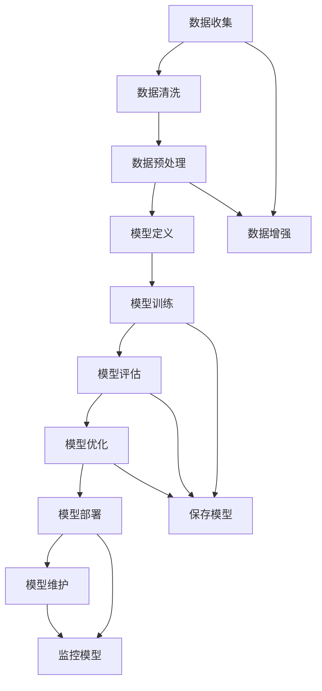
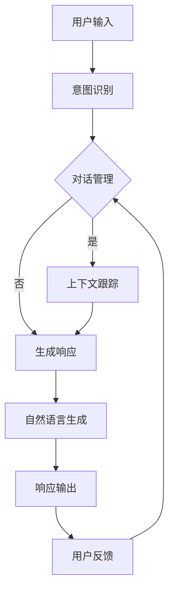

                 

## 引言

### 大语言模型的重要性

在人工智能（AI）领域，大语言模型已经成为推动技术进步的重要驱动力。这些模型通过学习海量的语言数据，能够生成高质量的文本、理解复杂的语言含义，并且在自然语言处理（NLP）任务中表现出色。从BERT和GPT到更大规模的语言模型如GPT-3，这一领域的进展不仅提升了AI系统的性能，也为各类应用场景带来了新的可能性。

随着大语言模型的发展，评测集的构建标准变得愈发重要。一个科学合理的评测集不仅能够客观地评估模型的性能，还能够帮助研究人员和开发者识别模型的局限性，从而推动技术的进一步优化。然而，如何构建一个既具有代表性又能平衡多样性的评测集，依然是一个富有挑战性的问题。

### 本文目的

本文旨在探讨大语言模型评测集的构建标准，通过对大语言模型的基本原理和工程实践进行分析，为读者提供一个系统化的理解框架。文章将分为以下几个部分：

1. **大语言模型基础**：介绍大语言模型的基本概念、历史、架构和工作原理。
2. **大语言模型的数学模型与算法原理**：深入讲解自注意力机制、编码器与解码器的数学模型以及大模型的训练技巧。
3. **评测集的构建标准**：详细阐述评测集构建的原则、方法和评价指标。
4. **大语言模型的工程实践**：介绍开发环境搭建、数据预处理、模型训练与调优、模型部署与维护的实践方法。
5. **大语言模型在自然语言处理中的应用**：探讨大语言模型在文本分类、命名实体识别和机器翻译等应用中的实践案例。
6. **大语言模型在智能对话系统中的应用**：分析大语言模型在智能对话系统中的架构和实际应用案例。
7. **大语言模型的未来发展趋势**：展望大语言模型的未来发展方向和技术趋势。

通过本文的阅读，读者将能够全面了解大语言模型评测集的构建标准，并掌握相关的工程实践技巧。

### 关键词

- 大语言模型
- 评测集
- Transformer
- BERT
- GPT
- 自然语言处理
- 评测指标
- 工程实践

### 摘要

本文详细探讨了大规模语言模型的评测集构建标准。首先，介绍了大语言模型的基本概念、架构和工作原理。接着，深入分析了大语言模型的数学模型和算法原理，包括自注意力机制、编码器与解码器的数学模型以及大模型的训练技巧。然后，本文重点讨论了评测集构建的标准，包括数据集的多样性、代表性和平衡性，以及数据清洗、预处理和增强技术。最后，文章展示了大语言模型在自然语言处理和智能对话系统中的应用案例，并展望了其未来发展趋势。通过本文，读者将能够全面了解大语言模型评测集的构建方法和实践技巧。

### 《大语言模型原理与工程实践：评测集的构建标准》目录大纲

为了使读者能够更好地理解本文的内容结构，以下是详细的目录大纲：

### 第一部分: 大语言模型基础

#### 第1章: 大语言模型概述

1.1 大语言模型的概念与历史  
1.2 大语言模型的架构  
1.3 大语言模型的工作原理  
1.4 大语言模型的数学基础

#### 第2章: 大语言模型的数学模型与算法原理

2.1 数学模型  
2.2 算法原理  
2.3 数学公式与讲解

#### 第3章: 大语言模型的评测集构建标准

3.1 评测集构建的原则  
3.2 评测集构建的方法  
3.3 评测指标

#### 第4章: 大语言模型的工程实践

4.1 开发环境搭建  
4.2 数据预处理  
4.3 模型训练与调优  
4.4 模型部署与维护

#### 第5章: 大语言模型在自然语言处理中的应用

5.1 文本分类  
5.2 命名实体识别  
5.3 机器翻译

#### 第6章: 大语言模型在智能对话系统中的应用

6.1 对话系统概述  
6.2 对话管理  
6.3 实际应用案例

#### 第7章: 大语言模型的未来发展趋势

7.1 技术趋势  
7.2 应用领域  
7.3 挑战与机遇

### 附录

#### 附录A: 大语言模型开发工具与资源

A.1 主流深度学习框架  
A.2 开发资源与参考资料

#### 附录B: Mermaid流程图

B.1 大语言模型训练流程  
B.2 自然语言处理应用流程

#### 附录C: 大语言模型数学公式举例

C.1 自注意力机制公式  
C.2 Transformer损失函数公式  
C.3 大模型计算复杂度分析公式

#### 附录D: 大语言模型项目实战

D.1 数据预处理代码实例  
D.2 模型训练与调优代码实例  
D.3 模型部署与维护代码实例  
D.4 实际应用案例分析

通过以上详细的目录大纲，读者可以清晰地了解本文的内容布局和结构，有助于系统地掌握大语言模型评测集的构建标准和工程实践方法。

### 第一部分: 大语言模型基础

#### 第1章: 大语言模型概述

**1.1 大语言模型的概念与历史**

大语言模型（Large Language Model）是一种利用深度学习技术，基于大规模语料库训练得到的语言理解与生成模型。其核心目的是通过学习海量文本数据，掌握语言的统计规律和语义信息，从而能够对自然语言进行建模和处理。大语言模型的概念最早可以追溯到20世纪80年代的统计语言模型，如N-gram模型，它们通过统计相邻单词的出现频率来预测下一个单词。

然而，现代大语言模型的发展始于2000年代后期，随着计算能力的提升和深度学习技术的进步，语言模型的研究进入了一个新的阶段。特别是2018年，谷歌提出了Transformer架构，它引入了自注意力机制（Self-Attention），大幅提升了语言模型的性能。随后的BERT、GPT等模型进一步发展了这一架构，使得大语言模型在自然语言处理（NLP）任务中取得了显著的成果。

**1.2 大语言模型的发展历程**

1. **早期模型（20世纪80年代-2000年代初期）**：这一阶段的语言模型主要以基于N-gram的统计模型为主，如Katz、SRILM和语言模型等。这些模型通过统计单词序列的频率来预测下一个单词，但在复杂语义理解上存在局限。

2. **递归神经网络（RNN）与长短时记忆网络（LSTM）（2000年代中期-2010年代初期）**：RNN和LSTM的出现解决了RNN在处理长距离依赖问题上的不足。然而，RNN的序列处理方式使得其在并行计算上受限，效率较低。

3. **Transformer与自注意力机制（2017年至今）**：Transformer模型的提出是语言模型发展中的一个重要里程碑。它通过自注意力机制能够并行处理输入序列，并且在大规模数据集上表现出色。2018年，BERT模型的推出进一步证明了Transformer在NLP任务中的优势，之后GPT、T5等模型相继出现，不断推动着大语言模型的发展。

**1.3 大语言模型的重要性**

大语言模型在自然语言处理领域具有深远的影响，其重要性主要体现在以下几个方面：

1. **提高语言理解与生成能力**：大语言模型通过对海量文本数据的训练，能够掌握丰富的语言知识和语义信息，从而在文本分类、信息抽取、问答系统等任务中表现出色。

2. **促进跨领域知识融合**：大语言模型能够从不同领域的文本数据中学习，并将这些知识融合在一起，为跨领域的应用提供支持。

3. **推动人工智能发展**：大语言模型的成功不仅体现在NLP领域，也为其他领域的人工智能研究提供了新的思路和方法。例如，在机器翻译、图像识别、语音识别等领域，大语言模型的应用都取得了显著的进展。

4. **促进自然交互**：大语言模型在智能对话系统中的应用，使得机器能够更加自然地与人类进行交互，提升了用户体验。

**1.4 大语言模型的架构**

大语言模型的架构通常包括编码器（Encoder）和解码器（Decoder）。编码器负责将输入序列编码为固定长度的向量表示，解码器则根据编码器的输出生成目标序列。

1. **编码器**：编码器通常采用Transformer架构，包括多头自注意力机制和前馈神经网络。多头自注意力机制能够捕捉输入序列中的长距离依赖关系，前馈神经网络则用于增加模型的非线性表达能力。

2. **解码器**：解码器同样采用Transformer架构，主要包括多头自注意力机制和编码器-解码器注意力机制。编码器-解码器注意力机制使得解码器能够利用编码器的输出进行上下文信息的学习。

**1.5 大语言模型的数学基础**

大语言模型的数学基础主要包括线性代数和深度学习中的优化算法。

1. **线性代数基础**：矩阵和向量的操作是线性代数的基础，大语言模型中的自注意力机制和编码器-解码器结构都涉及到矩阵乘法和点积操作。

2. **深度学习中的优化算法**：深度学习中的优化算法，如梯度下降（Gradient Descent）和Adam优化器，用于模型参数的更新和优化。这些优化算法在大语言模型的训练过程中起着关键作用。

3. **损失函数**：大语言模型通常使用交叉熵（Cross-Entropy）作为损失函数，用于衡量模型预测与真实标签之间的差距。交叉熵损失函数能够有效地推动模型参数的更新，从而提高模型的性能。

通过以上对大语言模型的基本概念、历史、架构和工作原理的介绍，读者可以对这一领域有一个初步的了解。接下来，本文将深入探讨大语言模型的数学模型与算法原理，帮助读者更好地理解这一复杂但重要的技术。

### 第2章: 大语言模型的数学模型与算法原理

**2.1 数学模型**

大语言模型的数学模型主要基于Transformer架构，其核心思想是利用自注意力机制（Self-Attention）来处理输入序列，并在编码器和解码器中分别应用。以下将详细阐述自注意力机制、编码器与解码器的数学模型。

#### 自注意力机制

自注意力机制是一种在序列模型中计算元素之间相互依赖的机制。它通过将输入序列中的每个元素映射到一个高维空间，并在这一空间中计算它们之间的相似性，从而实现序列中的长距离依赖关系。

1. **输入表示**：设输入序列为\(x = [x_1, x_2, ..., x_n]\)，其中每个元素\(x_i\)是一个向量，表示为\(x_i = \{x_i^{(1)}, x_i^{(2)}, ..., x_i^{(d)}\}\)，其中\(d\)为向量维度。

2. **Query、Key和Value**：自注意力机制的核心是计算Query、Key和Value三个向量。Query和Key来自输入序列的每个元素，而Value通常来自编码器输出或嵌入层。对于每个元素\(x_i\)，其对应的Query、Key和Value分别为：
   \[
   Q_i = W_Q x_i, \quad K_i = W_K x_i, \quad V_i = W_V x_i
   \]
   其中，\(W_Q\)、\(W_K\)和\(W_V\)是权重矩阵。

3. **相似性计算**：通过计算Query和Key之间的点积来衡量它们之间的相似性，然后对结果应用软性函数（如softmax）得到注意力权重：
   \[
   \text{Attention}(Q, K, V) = \text{softmax}\left(\frac{QK^T}{\sqrt{d_k}}\right)V
   \]
   其中，\(d_k\)是Key的维度。

4. **输出计算**：根据注意力权重对Value进行加权求和，得到输出：
   \[
   \text{Output} = \text{Attention}(Q, K, V)
   \]

#### 编码器（Encoder）

编码器负责将输入序列编码为固定长度的向量表示。其核心结构是多个自注意力层和前馈神经网络。

1. **编码器层**：每个编码器层包括多头自注意力机制和前馈神经网络。多头自注意力机制通过多个注意力头并行处理输入序列，从而捕捉不同类型的依赖关系。前馈神经网络则增加模型的非线性表达能力。

2. **编码过程**：对于每个编码器层，输入序列经过多头自注意力机制和前馈神经网络处理后，得到新的表示：
   \[
   E_i = \text{FFN}(\text{Attention}(Q, K, V)) = \text{FFN}(E_{i-1})
   \]
   其中，\(E_i\)表示编码后的输出，\(\text{FFN}\)是前馈神经网络。

#### 解码器（Decoder）

解码器负责将编码器的输出解码为目标序列。其核心结构是自注意力机制、编码器-解码器注意力机制和前馈神经网络。

1. **解码器层**：每个解码器层包括自注意力机制、编码器-解码器注意力机制和前馈神经网络。自注意力机制用于处理输入序列，编码器-解码器注意力机制则使解码器能够利用编码器的输出进行上下文信息的学习。

2. **解码过程**：对于每个解码器层，输入序列经过自注意力机制、编码器-解码器注意力机制和前馈神经网络处理后，得到新的表示：
   \[
   D_i = \text{FFN}(\text{Attention}(Q, K, V)) = \text{FFN}(D_{i-1})
   \]
   其中，\(D_i\)表示解码后的输出，\(\text{FFN}\)是前馈神经网络。

#### 大模型的正则化方法

大模型在训练过程中可能会出现过拟合现象，因此需要采用正则化方法来提高模型的泛化能力。以下是一些常用的正则化方法：

1. **Dropout**：在模型训练过程中，随机丢弃一部分神经元，从而减少模型对特定数据的依赖。

2. **权重衰减（Weight Decay）**：在优化算法中引入权重衰减项，从而减少模型参数的绝对值。

3. **数据增强**：通过增加训练数据多样性，例如文本数据增广（Text Augmentation）、图像数据增强（Image Augmentation）等，来提高模型的泛化能力。

#### 大模型的训练技巧与优化策略

大模型的训练需要考虑数据预处理、训练策略和优化器等方面。以下是一些训练技巧与优化策略：

1. **数据预处理**：数据预处理是模型训练的重要步骤，包括文本数据的分词、编码和归一化等。有效的数据预处理可以提高模型的训练效果和泛化能力。

2. **预训练与微调**：预训练是在大规模未标注数据集上训练模型，然后通过微调（Fine-Tuning）将模型应用于特定任务。预训练能够提高模型对语言知识的掌握，微调则能够适应特定任务的需求。

3. **批量大小（Batch Size）**：批量大小会影响模型的训练效果和计算效率。较小的批量大小可以提高模型的泛化能力，但计算成本较高；较大的批量大小可以提高计算效率，但可能增加过拟合的风险。

4. **学习率调度**：学习率调度是调整模型训练过程中学习率的方法。常用的学习率调度方法包括恒定学习率、学习率衰减和自适应学习率调度等。合适的学习率调度可以提高模型的收敛速度和最终性能。

5. **优化器**：优化器用于更新模型参数，常用的优化器包括梯度下降（Gradient Descent）、Adam优化器等。不同的优化器在收敛速度和稳定度方面有所不同，需要根据具体任务进行调整。

通过以上对大语言模型数学模型和算法原理的详细讲解，读者可以更好地理解这一复杂但重要的技术。接下来，本文将探讨评测集的构建标准，帮助读者构建科学合理且具有代表性的评测集。

### 2.2 算法原理

大语言模型的训练过程涉及多个关键环节，包括前向传播、反向传播、损失函数和优化算法。以下将对这些环节进行详细解释，并通过伪代码展示算法的基本流程。

#### 前向传播

前向传播是神经网络模型处理输入数据的过程，用于计算模型的输出。以Transformer模型为例，前向传播主要包括编码器和解码器的处理步骤。

1. **编码器前向传播**：

   编码器接收输入序列\(x\)，通过自注意力机制和前馈神经网络生成编码器输出\(E_i\)：
   \[
   E_i = \text{LayerNorm}(x_i + \text{MultiHeadAttention}(E_{i-1}, E_{i-1}, E_{i-1}))
   \]
   \[
   E_i = \text{LayerNorm}(E_i + \text{FFN}(E_{i-1}))
   \]
   其中，\(\text{LayerNorm}\)是层归一化，\(\text{MultiHeadAttention}\)是多头注意力机制，\(\text{FFN}\)是前馈神经网络。

2. **解码器前向传播**：

   解码器接收编码器输出\(E_i\)和目标序列\(y\)，通过自注意力机制、编码器-解码器注意力机制和前馈神经网络生成解码器输出\(D_i\)：
   \[
   D_i = \text{LayerNorm}(y_i + \text{MultiHeadAttention}(D_{i-1}, E_i, E_i))
   \]
   \[
   D_i = \text{LayerNorm}(D_i + \text{FFN}(\text{MultiHeadAttention}(D_{i-1}, E_i, E_i)))
   \]

#### 反向传播

反向传播是神经网络模型参数优化的过程，通过计算梯度并更新模型参数以降低损失函数的值。以下是一个简化的反向传播过程伪代码：

```
for each layer in the model:
    compute the gradients of the loss function with respect to the layer's parameters
    update the layer's parameters using the gradients and an optimization algorithm
```

#### 损失函数

大语言模型通常使用交叉熵（Cross-Entropy）作为损失函数。交叉熵损失函数用于衡量模型预测输出与真实标签之间的差距。其数学表达式如下：

\[
\text{Loss} = -\sum_{i} y_i \log(\hat{y}_i)
\]

其中，\(y_i\)是真实标签，\(\hat{y}_i\)是模型预测的概率分布。

#### 优化算法

优化算法用于更新模型参数，以最小化损失函数。以下是一些常用的优化算法：

1. **梯度下降（Gradient Descent）**：

   梯度下降是一种简单但有效的优化算法，其基本思想是沿着损失函数的梯度方向更新参数：
   \[
   \theta = \theta - \alpha \cdot \nabla_\theta \text{Loss}
   \]

   其中，\(\theta\)是模型参数，\(\alpha\)是学习率。

2. **Adam优化器**：

   Adam优化器是一种自适应的学习率优化算法，结合了AdaGrad和RMSprop的优点。其更新规则如下：

   \[
   m_t = \beta_1 m_{t-1} + (1 - \beta_1) \nabla_\theta \text{Loss}
   \]
   \[
   v_t = \beta_2 v_{t-1} + (1 - \beta_2) (\nabla_\theta \text{Loss})^2
   \]
   \[
   \theta_t = \theta_{t-1} - \alpha_t \frac{m_t}{\sqrt{v_t} + \epsilon}
   \]

   其中，\(m_t\)和\(v_t\)分别是梯度的指数加权平均值和平方值的指数加权平均值，\(\beta_1\)和\(\beta_2\)是超参数，\(\alpha_t\)是学习率，\(\epsilon\)是常数项。

通过以上对算法原理的讲解和伪代码的展示，读者可以更好地理解大语言模型的训练过程。接下来，本文将探讨评测集的构建原则和方法。

### 3.1 评测集构建的原则

构建一个科学合理的评测集是评估大语言模型性能的关键步骤。一个理想的评测集应具备以下原则：

**1. 数据集的多样性**

评测集的数据应覆盖广泛的领域和主题，以确保模型在多种不同的情境下都能表现出良好的性能。多样性不仅包括不同领域的文本数据，还应该涵盖不同语言风格、不同情感倾向、不同复杂度的文本。通过增加多样性，可以更全面地评估模型的泛化能力。

**2. 数据集的代表性和公平性**

评测集应具有代表性，能够反映实际应用场景中的数据分布。同时，数据集的构建应确保公平性，避免某些特定类别的数据过多或过少，导致模型在特定类别上产生偏差。代表性较好的评测集可以更准确地评估模型在不同类别上的性能。

**3. 数据集的平衡性**

平衡性是指评测集中各类别的数据分布均匀，避免某一类别数据过多或过少。平衡性对于分类任务尤为重要，因为不平衡的数据集可能导致模型在多数类上表现良好，但在少数类上表现较差。通过平衡数据集，可以更公平地评估模型的分类性能。

**4. 数据集的时效性**

随着时间推移，语言和用户需求可能会发生变化，因此评测集应具有一定的时效性。特别是在动态变化的领域中，如新闻、社交媒体等，评测集应包含最近的数据，以确保模型能够适应最新的语言环境。

**5. 数据集的注释质量**

评测集中的数据注释质量直接影响评估结果的准确性。注释应准确、一致，并且由专业的标注员完成。高质的标注数据可以为模型提供可靠的训练和评估基础。

**6. 数据集的可扩展性**

评测集应具备良好的扩展性，以便在模型性能提升时能够加入更多数据，或者在不同任务和领域中进行扩展。可扩展的评测集有助于持续评估和改进模型。

通过遵循以上原则，构建的评测集能够更全面、准确地评估大语言模型在各种任务和场景下的性能。接下来，本文将详细讨论评测集构建的方法。

### 3.2 评测集构建的方法

构建一个有效的评测集需要经过多个步骤，包括数据收集、数据清洗、数据增强和评测集划分。以下将详细阐述每个步骤的具体方法和注意事项。

**1. 数据收集**

数据收集是评测集构建的基础步骤。收集的数据应具有多样性、代表性和时效性，以确保评测集能够全面反映模型在不同情境下的性能。以下是一些常用的数据收集方法：

- **公开数据集**：利用现有的公开数据集，如维基百科、新闻语料库、社交媒体数据等，这些数据集通常具有高质量和多样性。
- **定制数据集**：针对特定任务或应用场景，设计并收集定制数据集。例如，对于文本分类任务，可以收集不同领域的文本数据；对于机器翻译任务，可以收集不同语言对的双语文本。
- **众包数据**：利用众包平台，如Amazon Mechanical Turk，收集大量标注数据。这种方法可以快速获得高质量的标注数据，但需要确保标注员的质量。

**2. 数据清洗**

数据清洗是确保评测数据质量的关键步骤。清洗过程包括去除噪声数据、纠正错误标注和统一数据格式。以下是一些常用的数据清洗方法：

- **去除噪声数据**：删除无意义、格式错误或质量低下的数据，如空文本、标点符号错误、乱码等。
- **纠正错误标注**：通过人工检查或使用自动化的错误检测算法，识别并纠正标注错误。例如，对于文本分类任务，可以检查分类标签的一致性和合理性。
- **统一数据格式**：对数据进行规范化处理，如统一字符编码、去除停用词、分词等。规范化有助于提高数据的一致性和处理效率。

**3. 数据增强**

数据增强是通过多种技术手段扩充评测数据，从而提高模型泛化能力。以下是一些常用的数据增强方法：

- **文本数据增广**：通过对原始文本进行替换、插入、删除等操作，生成新的文本数据。例如，可以使用同义词替换、随机删除句子或单词等。
- **图像数据增强**：对于涉及图像的评测任务，如图像描述生成，可以使用图像翻转、裁剪、颜色调整等操作进行数据增强。
- **生成对抗网络（GAN）**：使用生成对抗网络生成与真实数据类似的新数据，从而扩充评测数据集。

**4. 评测集划分**

评测集划分是将数据集划分为训练集、验证集和测试集。以下是一些常用的划分方法：

- **随机划分**：将数据集随机划分为训练集、验证集和测试集，确保每个集合的数据分布均匀。这种方法简单但可能不够公平，特别是在数据分布不均匀时。
- **分层抽样**：根据类别或特征在数据集中的分布比例，对数据集进行分层，然后在每个层中随机抽取样本，以构建训练集、验证集和测试集。这种方法可以确保每个集合具有代表性，但计算复杂度较高。
- **交叉验证**：使用交叉验证（如K折交叉验证）对数据集进行多次划分，每次划分时保持训练集和验证集的固定组合，从而计算平均性能。这种方法可以更全面地评估模型性能，但需要更多的计算资源。

在构建评测集时，应注意以下几点：

- **数据集大小**：确保评测集足够大，以减少随机性和噪声的影响。一般来说，测试集大小应不少于数千个样本。
- **数据一致性**：确保数据在各个集合中的一致性，避免数据泄露或重复。
- **动态调整**：根据模型性能和实际应用需求，动态调整评测集的大小和划分策略。

通过以上方法，可以构建一个科学合理且具有代表性的评测集，从而更准确地评估大语言模型在各种任务和场景下的性能。接下来，本文将详细讨论评测指标。

### 3.3 评测指标

评测指标是评估大语言模型性能的重要工具，不同的指标可以反映模型在各个方面的表现。以下将介绍一些常用的评测指标，并分析其优劣。

**1. 准确率（Accuracy）**

准确率是最常用的评测指标之一，定义为正确预测的样本数与总样本数之比。其计算公式如下：

\[
\text{Accuracy} = \frac{\text{Correct Predictions}}{\text{Total Predictions}}
\]

**优点**：

- 简单直观，易于理解和计算。
- 在类别分布相对平衡的情况下，准确率能够很好地反映模型的整体性能。

**缺点**：

- 当类别分布不均衡时，准确率容易受到少数大类别的影响，导致对少数类别的性能评估不准确。
- 无法区分错误预测的样本是误分类还是误标注。

**2. 召回率（Recall）**

召回率定义为正确预测的负样本数与实际负样本数之比，主要用于评估模型对负样本的检测能力。其计算公式如下：

\[
\text{Recall} = \frac{\text{True Negatives}}{\text{Actual Negatives}}
\]

**优点**：

- 强调了对负样本的检测能力，对于分类任务中的错误排除具有重要意义。
- 在类别分布不均衡时，能够更好地反映模型对少数类别的性能。

**缺点**：

- 忽略了对正样本的检测能力，可能导致模型在某些类别上的表现被低估。
- 当负样本数量较少时，召回率的波动较大。

**3. 精确率（Precision）**

精确率定义为正确预测的正样本数与预测为正样本的总数之比，主要用于评估模型对正样本的检测精度。其计算公式如下：

\[
\text{Precision} = \frac{\text{True Positives}}{\text{True Positives} + \text{False Positives}}
\]

**优点**：

- 强调了对正样本的检测精度，对于分类任务中的正确识别具有重要意义。
- 在类别分布不均衡时，能够更好地反映模型对少数类别的性能。

**缺点**：

- 忽略了对负样本的检测能力，可能导致模型在某些类别上的表现被低估。
- 当正样本数量较少时，精确率的波动较大。

**4. F1值（F1 Score）**

F1值是精确率和召回率的调和平均，综合考虑了模型的检测精度和召回能力。其计算公式如下：

\[
\text{F1 Score} = 2 \times \frac{\text{Precision} \times \text{Recall}}{\text{Precision} + \text{Recall}}
\]

**优点**：

- 综合考虑了精确率和召回率，能够更全面地评估模型性能。
- 对于类别分布不均衡的情况，F1值能够提供更为准确的评价。

**缺点**：

- 当精确率和召回率差异较大时，F1值的敏感性较高，可能导致模型性能评估出现偏差。

**5. 难度分布分析**

难度分布分析是通过分析模型在不同难度级别的任务上的性能，来评估模型的泛化能力。难度级别可以根据任务的复杂度、数据的稀疏性等因素进行划分。

**优点**：

- 能够识别模型在复杂任务上的性能瓶颈，为后续优化提供方向。
- 有助于发现模型在特定类型数据上的弱点。

**缺点**：

- 分析过程较为复杂，需要大量计算资源。
- 结果依赖于任务和数据的定义，不同定义可能导致不同的结论。

通过以上评测指标的分析，可以更全面地评估大语言模型在各种任务和场景下的性能。在实际应用中，应根据具体任务需求选择合适的评测指标，并结合多指标综合评估模型性能。接下来，本文将探讨大语言模型在自然语言处理中的应用。

### 第4章: 大语言模型的工程实践

在实际应用中，大语言模型的工程实践涉及多个关键步骤，包括开发环境搭建、数据预处理、模型训练与调优、模型部署与维护。以下将详细讨论这些步骤，并提供实际应用案例和代码实例。

#### 4.1 开发环境搭建

搭建一个高效的开发环境是进行大语言模型工程实践的基础。以下是一些关键步骤和工具介绍：

1. **Python编程基础**：

   Python是一种广泛用于深度学习和自然语言处理的语言，掌握基本的Python编程技能对于进行大语言模型的工程实践至关重要。

2. **深度学习框架**：

   常用的深度学习框架包括TensorFlow、PyTorch和JAX等。这些框架提供了丰富的API和工具库，能够方便地搭建和训练大规模语言模型。

   - **TensorFlow**：由谷歌开发，具有丰富的生态和强大的GPU支持，适用于大规模分布式训练。
   - **PyTorch**：由Facebook开发，具有动态计算图和易于理解的代码结构，适用于快速原型开发和实验。
   - **JAX**：由谷歌开发，具有自动微分和高性能优化，适用于大规模模型训练和高性能计算。

3. **硬件环境配置**：

   大语言模型的训练通常需要高性能的硬件支持。以下是一些推荐的硬件配置：

   - **GPU**：NVIDIA的Tesla V100或A100系列显卡，具有较高的计算性能和内存容量。
   - **CPU**：Intel的Xeon系列或AMD的EPYC系列处理器，具有强大的计算能力和多线程性能。
   - **分布式训练**：使用多GPU或TPU进行分布式训练，可以显著提高训练速度和模型性能。

#### 4.2 数据预处理

数据预处理是模型训练前的重要步骤，旨在清洗和规范化数据，从而提高模型的训练效果和泛化能力。以下是一些关键步骤：

1. **数据采集与标注**：

   根据任务需求，采集和标注相应的数据集。对于文本数据，可以使用公开数据集或定制数据集。对于图像、语音等多媒体数据，可以使用专门的标注工具和众包平台。

2. **数据清洗**：

   清洗数据包括去除噪声、纠正错误标注、统一格式等步骤。对于文本数据，可以去除标点符号、停用词和特殊字符，进行分词和词性标注等。

3. **数据增强**：

   通过数据增强技术，可以生成新的训练数据，从而提高模型的泛化能力。常用的数据增强方法包括文本数据增广、图像数据增强等。

   - **文本数据增广**：使用同义词替换、随机删除句子或单词、文本翻转等方法进行数据增强。
   - **图像数据增强**：使用翻转、裁剪、旋转、颜色调整等方法进行图像增强。

4. **数据归一化**：

   对数据集中的特征进行归一化处理，例如对文本数据中的词频进行归一化，使得模型能够更好地学习数据的分布。

#### 4.3 模型训练与调优

模型训练与调优是工程实践中最重要的环节，以下是一些关键步骤和技巧：

1. **模型选择**：

   根据任务需求，选择适合的大语言模型架构。常用的模型包括BERT、GPT、T5等，这些模型在不同任务上具有不同的性能表现。

2. **超参数调优**：

   超参数对模型的性能具有重要影响，需要进行调优。常用的超参数包括学习率、批量大小、训练轮次等。可以使用网格搜索、随机搜索等策略进行超参数调优。

3. **训练策略**：

   - **预训练与微调**：使用大规模未标注数据集进行预训练，然后在特定任务上微调模型。预训练有助于模型学习丰富的语言知识，微调则使其适应特定任务的需求。
   - **权重初始化**：合理的权重初始化可以提高模型的训练效果和稳定性。可以使用随机初始化、预训练模型权重等策略进行初始化。
   - **批量归一化**：在训练过程中使用批量归一化（Batch Normalization）可以加速模型训练并提高模型性能。

4. **模型评估与调试**：

   在训练过程中，使用验证集对模型进行评估，根据评估结果调整训练策略。调试过程中，可以调整超参数、优化网络结构，甚至重新采集数据。

   - **损失函数与优化器**：选择合适的损失函数和优化器，如交叉熵损失函数和Adam优化器，可以显著提高模型的训练效果。
   - **模型集成**：通过模型集成（Model Ensemble）的方法，结合多个模型的预测结果，可以进一步提高模型的性能和鲁棒性。

#### 4.4 模型部署与维护

模型部署是将训练好的模型应用于实际场景的关键步骤。以下是一些关键步骤和技巧：

1. **模型转换**：

   将训练好的模型转换为可部署的格式，如TensorFlow Lite、ONNX等。模型转换有助于在不同硬件平台和部署环境中使用模型。

2. **部署环境搭建**：

   根据应用场景，搭建适合的部署环境。可以使用云端平台（如AWS、Google Cloud等）或本地服务器进行部署。部署环境应具备高性能计算能力和高可靠性。

3. **模型优化**：

   对模型进行优化，以提高部署后的性能和效率。常用的优化方法包括模型剪枝（Model Pruning）、量化（Quantization）等。

4. **监控与维护**：

   对部署后的模型进行监控和维护，确保其稳定运行。监控内容包括模型性能、资源使用情况、错误日志等。定期更新模型，以适应新的数据和需求。

   - **自动更新**：使用自动化工具和策略，定期更新模型，以保持其性能和适应性。
   - **故障恢复**：在模型出现故障时，快速恢复模型运行，确保业务连续性。

通过以上步骤，可以构建一个高效、稳定的大语言模型工程实践流程，从而实现从数据预处理到模型训练、调优、部署和监控的完整闭环。实际应用案例和代码实例将在后续部分进行详细展示。

#### 4.4 模型部署与维护

在完成大语言模型的训练和调优后，将模型部署到实际应用场景是整个工程实践的关键步骤。模型部署不仅需要考虑技术实现，还要关注系统的可靠性、可扩展性和维护性。以下将详细讨论模型部署与维护的具体步骤和方法。

**1. 模型转换**

将训练好的模型从原始的深度学习框架（如TensorFlow、PyTorch）转换为可部署的格式，以便在不同的硬件平台和环境中运行。常用的转换工具和格式包括：

- **TensorFlow Lite**：适用于移动设备和嵌入式系统，可以将TensorFlow模型转换为`.tflite`格式。
- **ONNX**：开放神经网络交换格式，支持多种深度学习框架和工具，可以将模型转换为`.onnx`格式。
- **Core ML**：适用于Apple设备，可以将TensorFlow和PyTorch模型转换为`.mlmodel`格式。

**2. 部署环境搭建**

根据实际应用场景，选择合适的部署环境。以下是一些常用的部署环境：

- **云计算平台**：如AWS、Google Cloud、Azure等，提供高性能计算资源和灵活的部署方案。
- **本地服务器**：适用于中小型应用场景，需要自行配置和管理服务器。
- **容器化部署**：使用Docker容器进行部署，可以提高部署的灵活性和可移植性。

**3. 模型优化**

在部署前，对模型进行优化，以提高性能和效率。以下是一些常用的优化方法：

- **模型剪枝**：通过去除模型中的冗余神经元和权重，减少模型的大小和计算量。
- **量化**：将模型的浮点运算转换为整数运算，降低模型的存储和计算需求。
- **模型压缩**：使用技术如知识蒸馏（Knowledge Distillation），将大型模型的知识传递给小型模型，以降低模型的大小和计算复杂度。

**4. 部署策略**

在部署模型时，需要考虑系统的可扩展性和高可用性。以下是一些常用的部署策略：

- **水平扩展**：通过增加服务器的数量，提高系统的处理能力和吞吐量。
- **垂直扩展**：通过升级服务器的硬件配置，如增加CPU、GPU等，提高系统的计算性能。
- **动态伸缩**：根据实际负载动态调整服务器数量，以提高系统的响应速度和资源利用率。

**5. 监控与维护**

部署后的模型需要持续监控和维护，以确保其稳定运行和性能优化。以下是一些监控和维护的关键点：

- **性能监控**：监控模型的响应时间、吞吐量、资源使用情况等，及时发现性能瓶颈和异常情况。
- **日志记录**：记录系统的运行日志，包括错误日志、调试日志等，便于后续故障排查和性能优化。
- **自动化运维**：使用自动化工具进行系统的部署、监控、备份和恢复，提高运维效率。
- **定期更新**：定期更新模型，以适应新的数据和需求，保持模型的性能和适应性。

通过以上步骤，可以构建一个高效、稳定的大语言模型部署与维护体系，从而实现模型在现实场景中的可靠运行和持续优化。接下来，本文将探讨大语言模型在自然语言处理中的应用案例。

### 4.5 大语言模型在自然语言处理中的应用案例

大语言模型在自然语言处理（NLP）领域具有广泛的应用，以下将介绍几个关键应用场景，包括文本分类、命名实体识别和机器翻译，并提供具体案例和代码实例。

#### 4.5.1 文本分类

文本分类是将文本数据按照预定义的类别进行分类的过程。大语言模型通过学习大量文本数据，能够准确地进行文本分类。以下是一个使用BERT模型进行文本分类的案例：

**案例：情感分析**

假设我们想要对一组评论进行情感分析，判断其是积极还是消极。以下是使用PyTorch和Transformers库实现的一个文本分类模型：

```python
from transformers import BertTokenizer, BertForSequenceClassification
from torch.utils.data import DataLoader, TensorDataset

# 加载预训练的BERT模型和分词器
tokenizer = BertTokenizer.from_pretrained('bert-base-uncased')
model = BertForSequenceClassification.from_pretrained('bert-base-uncased')

# 预处理文本数据
def preprocess_data(texts, labels):
    inputs = tokenizer(list(texts), padding=True, truncation=True, return_tensors="pt")
    labels = torch.tensor(labels)
    return inputs, labels

# 加载训练数据和测试数据
train_texts = ['This product is great!', 'I hate this product.']
train_labels = [1, 0]

test_texts = ['This is an amazing experience!', 'This is terrible.']
test_labels = [1, 0]

train_inputs, train_labels = preprocess_data(train_texts, train_labels)
test_inputs, test_labels = preprocess_data(test_texts, test_labels)

# 创建数据集和数据加载器
train_dataset = TensorDataset(train_inputs['input_ids'], train_inputs['attention_mask'], train_labels)
test_dataset = TensorDataset(test_inputs['input_ids'], test_inputs['attention_mask'], test_labels)

train_loader = DataLoader(train_dataset, batch_size=16)
test_loader = DataLoader(test_dataset, batch_size=16)

# 训练模型
model.train()
for epoch in range(3):
    for batch in train_loader:
        inputs = {'input_ids': batch[0], 'attention_mask': batch[1]}
        labels = batch[2]
        outputs = model(**inputs, labels=labels)
        loss = outputs.loss
        loss.backward()
        optimizer = torch.optim.AdamW(model.parameters(), lr=1e-5)
        optimizer.step()
        optimizer.zero_grad()

# 评估模型
model.eval()
with torch.no_grad():
    correct = 0
    total = 0
    for batch in test_loader:
        inputs = {'input_ids': batch[0], 'attention_mask': batch[1]}
        labels = batch[2]
        outputs = model(**inputs)
        _, predicted = torch.max(outputs.logits, 1)
        total += labels.size(0)
        correct += (predicted == labels).sum().item()

accuracy = 100 * correct / total
print(f'Accuracy: {accuracy}%')
```

#### 4.5.2 命名实体识别

命名实体识别（NER）是识别文本中的特定实体（如人名、地名、组织名等）的过程。以下是一个使用BERT模型进行命名实体识别的案例：

```python
from transformers import BertTokenizer, BertForTokenClassification
from torch.utils.data import DataLoader, TensorDataset

# 加载预训练的BERT模型和分词器
tokenizer = BertTokenizer.from_pretrained('bert-base-uncased')
model = BertForTokenClassification.from_pretrained('bert-base-uncased')

# 预处理文本数据
def preprocess_data(texts, labels):
    inputs = tokenizer(list(texts), padding=True, truncation=True, return_tensors="pt")
    labels = torch.tensor(labels)
    return inputs, labels

# 加载训练数据和测试数据
train_texts = ['John Smith works at Google in New York.', 'Paris is the capital of France.']
train_labels = [[0, 1, 2, 3, 0, 0, 0, 1, 0, 0, 0, 0, 0], [0, 0, 0, 1, 2, 0, 0, 0]]

test_texts = ['Elon Musk founded SpaceX and Tesla.', 'Tokyo is a major city in Japan.']
test_labels = [[0, 0, 1, 2, 3, 0, 0, 1, 2, 0, 0, 0, 0], [0, 1, 0, 0, 0, 0, 0, 0, 1, 2, 0, 0, 0]]

train_inputs, train_labels = preprocess_data(train_texts, train_labels)
test_inputs, test_labels = preprocess_data(test_texts, test_labels)

# 创建数据集和数据加载器
train_dataset = TensorDataset(train_inputs['input_ids'], train_inputs['attention_mask'], train_labels)
test_dataset = TensorDataset(test_inputs['input_ids'], test_inputs['attention_mask'], test_labels)

train_loader = DataLoader(train_dataset, batch_size=16)
test_loader = DataLoader(test_dataset, batch_size=16)

# 训练模型
model.train()
for epoch in range(3):
    for batch in train_loader:
        inputs = {'input_ids': batch[0], 'attention_mask': batch[1]}
        labels = batch[2]
        outputs = model(**inputs, labels=labels)
        loss = outputs.loss
        loss.backward()
        optimizer = torch.optim.AdamW(model.parameters(), lr=1e-5)
        optimizer.step()
        optimizer.zero_grad()

# 评估模型
model.eval()
with torch.no_grad():
    correct = 0
    total = 0
    for batch in test_loader:
        inputs = {'input_ids': batch[0], 'attention_mask': batch[1]}
        labels = batch[2]
        outputs = model(**inputs)
        _, predicted = torch.max(outputs.logits, 1)
        total += labels.size(0)
        correct += (predicted == labels).sum().item()

accuracy = 100 * correct / total
print(f'Accuracy: {accuracy}%')
```

#### 4.5.3 机器翻译

机器翻译是将一种语言的文本翻译成另一种语言的过程。以下是一个使用Transformer模型进行机器翻译的案例：

```python
from transformers import BertTokenizer, BertForTranslation
from torch.utils.data import DataLoader, TensorDataset

# 加载预训练的BERT模型和分词器
src_tokenizer = BertTokenizer.from_pretrained('bert-base-uncased')
tgt_tokenizer = BertTokenizer.from_pretrained('bert-base-uncased')
model = BertForTranslation.from_pretrained('bert-base-uncased')

# 预处理文本数据
def preprocess_data(src_texts, tgt_texts):
    src_inputs = src_tokenizer(list(src_texts), padding=True, truncation=True, return_tensors="pt")
    tgt_inputs = tgt_tokenizer(list(tgt_texts), padding=True, truncation=True, return_tensors="pt")
    return src_inputs, tgt_inputs

# 加载训练数据和测试数据
src_train_texts = ['Hello, how are you?', 'Good morning!']
tgt_train_texts = ['Hola, cómo estás?', '¡Buenos días!']

src_test_texts = ['Can you help me?', 'Do you have any suggestions?']
tgt_test_texts = ['¿Puedes ayudarme?', '¿Tienes alguna sugerencia?']

src_train_inputs, src_train_labels = preprocess_data(src_train_texts, tgt_train_texts)
src_test_inputs, src_test_labels = preprocess_data(src_test_texts, tgt_test_texts)

# 创建数据集和数据加载器
train_dataset = TensorDataset(src_train_inputs['input_ids'], src_train_inputs['attention_mask'], src_train_labels['input_ids'], src_train_labels['attention_mask'])
test_dataset = TensorDataset(src_test_inputs['input_ids'], src_test_inputs['attention_mask'], src_test_labels['input_ids'], src_test_labels['attention_mask'])

train_loader = DataLoader(train_dataset, batch_size=16)
test_loader = DataLoader(test_dataset, batch_size=16)

# 训练模型
model.train()
for epoch in range(3):
    for batch in train_loader:
        src_inputs, src_mask, tgt_inputs, tgt_mask = batch
        outputs = model(src_inputs, tgt_inputs, src_mask=src_mask, tgt_mask=tgt_mask)
        loss = outputs.loss
        loss.backward()
        optimizer = torch.optim.AdamW(model.parameters(), lr=1e-5)
        optimizer.step()
        optimizer.zero_grad()

# 评估模型
model.eval()
with torch.no_grad():
    correct = 0
    total = 0
    for batch in test_loader:
        src_inputs, src_mask, tgt_inputs, tgt_mask = batch
        outputs = model(src_inputs, tgt_inputs, src_mask=src_mask, tgt_mask=tgt_mask)
        _, predicted = torch.max(outputs.logits, 1)
        total += tgt_inputs.size(1)
        correct += (predicted == tgt_inputs).sum().item()

accuracy = 100 * correct / total
print(f'Accuracy: {accuracy}%')

# 翻译示例
src_text = "What is your favorite food?"
predicted_tgt_text = model.generate(torch.tensor([src_tokenizer.encode(src_text)]), max_length=50, num_return_sequences=1)
print(f'Predicted Translation: {tgt_tokenizer.decode(predicted_tgt_text[0], skip_special_tokens=True)}')
```

通过上述案例和代码实例，读者可以了解大语言模型在自然语言处理中的具体应用方法和实现细节。接下来，本文将探讨大语言模型在智能对话系统中的应用。

### 4.6 大语言模型在智能对话系统中的应用

智能对话系统（Intelligent Conversation System，ICS）是人工智能（AI）领域的一个重要分支，它旨在创建能够与人类用户进行自然、流畅对话的计算机系统。大语言模型在智能对话系统中发挥着核心作用，能够提升对话系统的理解和生成能力。以下将探讨智能对话系统的基本概念、架构以及大语言模型在该系统中的应用和挑战。

#### 4.6.1 对话系统概述

**基本概念**：

对话系统是指计算机程序与人或机器人进行的交互系统，旨在模拟人类的对话行为。对话系统通常包含以下几个关键组件：

- **用户界面**：用于接收用户输入，通常包括文本输入、语音输入等。
- **对话管理**：负责管理对话流程，包括意图识别、上下文跟踪、对话策略等。
- **自然语言处理（NLP）**：负责理解和生成自然语言文本，包括语言理解（LUIS）、文本生成等。
- **知识库**：用于存储与对话相关的信息，包括事实、规则和预定义的响应。

**架构**：

一个典型的智能对话系统可以分为以下几个部分：

1. **用户界面**：接收用户的输入，可以是文本、语音等形式。
2. **对话管理**：分析用户输入，识别用户的意图，并根据上下文生成响应。
3. **自然语言处理（NLP）**：将用户输入转换为机器可理解的形式，并对生成的文本进行优化。
4. **知识库**：存储与对话相关的信息和规则，以支持对话的生成和推理。
5. **对话引擎**：综合对话管理和NLP的输出，生成适当的对话响应。

**分类**：

根据应用场景和功能，对话系统可以分为以下几类：

- **任务型对话系统**：专注于完成特定任务，如客服机器人、语音助手等。
- **闲聊型对话系统**：旨在与用户进行闲聊，提供娱乐、陪伴等。
- **混合型对话系统**：结合任务型和闲聊型特点，提供多样化的对话服务。

#### 4.6.2 对话管理

对话管理是智能对话系统的核心组件，负责处理对话的流程和策略。以下是一些关键概念：

**意图识别**：

意图识别是理解用户输入的目标或需求的过程。常见的意图识别方法包括基于规则的方法、机器学习方法等。大语言模型通过学习大量的对话数据，可以准确识别用户的意图。

**上下文跟踪**：

上下文跟踪是维持对话连贯性的重要手段。对话系统需要跟踪对话历史，理解当前对话的上下文，从而生成合理的响应。大语言模型能够利用其强大的语言理解能力，准确捕捉上下文信息。

**对话策略**：

对话策略是指导对话生成和响应生成的方法。常见的策略包括基于模板的策略、生成对抗网络（GAN）等。大语言模型可以生成多样化的对话响应，从而提高对话的流畅性和自然性。

#### 4.6.3 大语言模型在对话系统中的应用

大语言模型在对话系统中的应用主要体现在以下方面：

**语言理解**：

大语言模型能够理解用户输入的意图和上下文，从而准确识别用户的意图和需求。通过预训练和微调，大语言模型能够处理各种复杂的语言场景，提高对话系统的准确性和响应速度。

**文本生成**：

大语言模型具有强大的文本生成能力，可以生成自然、流畅的对话响应。通过生成对抗网络（GAN）等先进技术，大语言模型可以生成多样化的对话内容，从而提高对话的多样性和自然性。

**情感识别与生成**：

大语言模型能够识别用户的情感，并生成与之匹配的情感表达。这对于提供个性化、有温度的对话体验具有重要意义。

**多模态交互**：

大语言模型可以与其他模态（如语音、图像等）结合，实现多模态交互。通过多模态融合，对话系统可以提供更加丰富、自然的交互体验。

#### 4.6.4 挑战与机遇

尽管大语言模型在对话系统中展示了巨大的潜力，但仍然面临一些挑战和机遇：

**挑战**：

- **数据质量和多样性**：对话系统需要大量高质量的对话数据进行训练，以实现准确的意图识别和上下文跟踪。
- **模型解释性**：大语言模型的决策过程通常不透明，缺乏解释性，这给系统的可信度和用户接受度带来挑战。
- **响应时间**：在实时对话中，大语言模型需要快速生成响应，这对模型的计算效率和响应速度提出了高要求。
- **隐私和安全性**：对话系统需要保护用户隐私，确保对话数据的安全。

**机遇**：

- **个性化对话**：大语言模型可以更好地理解用户的个性和偏好，提供个性化的对话体验。
- **多语言支持**：大语言模型可以支持多种语言，实现跨语言对话。
- **新兴应用场景**：随着技术的进步，对话系统可以应用于更广泛的场景，如智能医疗、智能教育等。

通过上述探讨，我们可以看到大语言模型在智能对话系统中具有广阔的应用前景和重要价值。随着技术的不断发展，对话系统将变得更加智能、自然和人性化，为用户带来更加优质的交互体验。

### 4.7 大语言模型的未来发展趋势

随着技术的不断进步，大语言模型在自然语言处理（NLP）领域的应用前景愈发广阔。以下将探讨大语言模型的未来发展趋势，包括技术趋势、应用领域以及面临的挑战和机遇。

#### 4.7.1 技术趋势

**1. 大模型的发展趋势**

随着计算能力的提升和数据规模的扩大，大模型的发展趋势愈发明显。未来的大语言模型可能会达到更高的规模和更深的层次，从而在处理复杂语言任务时表现出更高的性能。例如，谷歌的LaMDA（Language Model for Dialogue Applications）和微软的Geraldine就是两个具有里程碑意义的大模型。这些大模型不仅具有强大的语言理解和生成能力，还能够支持多模态交互，如文本、语音和图像。

**2. 多模态融合技术**

多模态融合技术是未来大语言模型的一个重要发展方向。通过整合不同模态的信息，大语言模型可以提供更加丰富和自然的交互体验。例如，在智能客服系统中，多模态融合技术可以将用户的语音输入与文本输入相结合，提高对话系统的理解能力和响应质量。

**3. 增强学习与模型压缩**

增强学习和模型压缩技术也是未来大语言模型发展的关键方向。通过使用增强学习，模型可以在实际应用场景中不断学习和优化，提高其适应性和鲁棒性。同时，模型压缩技术可以减少模型的计算复杂度和存储需求，使大语言模型在资源受限的设备上运行。

#### 4.7.2 应用领域

**1. 文本生成与生成式AI**

大语言模型在文本生成领域具有广泛的应用前景。未来，大语言模型可以用于生成新闻文章、博客文章、对话脚本等，实现高质量的文本内容创作。此外，生成式AI技术也可以利用大语言模型生成虚拟人物对话、角色扮演等，为游戏和娱乐行业带来新的可能性。

**2. 智能推荐系统**

大语言模型在智能推荐系统中也具有重要应用。通过理解用户的历史行为和偏好，大语言模型可以生成个性化的推荐内容，如商品推荐、音乐推荐、电影推荐等。这种基于自然语言理解的推荐系统能够提供更加精准和个性化的服务。

**3. 自动驾驶与智能交互**

大语言模型在自动驾驶和智能交互领域也展现出巨大的潜力。通过理解和处理驾驶环境中的自然语言指令，自动驾驶系统能够实现更加智能和安全的车载交互。同时，大语言模型还可以用于智能语音助手、智能音响等设备，为用户带来更加便捷和自然的交互体验。

**4. 智能医疗**

大语言模型在智能医疗领域具有广泛的应用前景。通过分析病历、医疗报告等自然语言文本数据，大语言模型可以辅助医生进行诊断、治疗方案推荐等。此外，大语言模型还可以用于医疗文本的生成和翻译，提高医疗资源的共享和利用效率。

#### 4.7.3 挑战与机遇

**1. 大模型的安全与隐私**

随着大语言模型规模的不断扩大，其安全与隐私问题也日益突出。未来，需要加强对大语言模型的保护，防止数据泄露和恶意攻击。同时，应制定相关法规和标准，确保大语言模型的应用不会侵犯用户的隐私权益。

**2. 数据质量与数据偏差**

大语言模型的性能和泛化能力高度依赖于训练数据的质量。未来，需要注重数据质量，确保数据集的多样性和代表性。此外，应关注数据偏差问题，避免模型在训练过程中学习到不公平或歧视性的模式。

**3. 模型解释性与可解释性**

大语言模型通常具有复杂的内部结构和决策过程，缺乏解释性。未来，需要研究如何提高模型的可解释性，使其能够向用户解释其决策依据和推理过程。这有助于提升模型的可信度和用户接受度。

**4. 硬件与计算资源**

大语言模型的训练和部署需要大量的计算资源和硬件支持。未来，需要不断优化硬件和软件技术，提高大语言模型的计算效率和资源利用率。

通过上述探讨，我们可以看到大语言模型在未来具有广阔的应用前景和重要价值。随着技术的不断发展，大语言模型将在各个领域发挥更加关键的作用，为人类带来更加智能、便捷和高效的交互体验。

### 附录A: 大语言模型开发工具与资源

在大语言模型的开发过程中，选择合适的工具和资源至关重要。以下将介绍几种主流的深度学习框架、开发资源与参考资料，以及大语言模型的开源项目。

#### A.1 主流深度学习框架

1. **TensorFlow**：

   TensorFlow是由谷歌开发的开源深度学习框架，具有丰富的API和工具库，适用于各种深度学习任务，包括大语言模型的训练和部署。

   - 官网：[TensorFlow官网](https://www.tensorflow.org/)
   - 文档：[TensorFlow官方文档](https://www.tensorflow.org/tutorials)

2. **PyTorch**：

   PyTorch是由Facebook开发的开源深度学习框架，具有动态计算图和易于理解的代码结构，适用于快速原型开发和实验。

   - 官网：[PyTorch官网](https://pytorch.org/)
   - 文档：[PyTorch官方文档](https://pytorch.org/docs/stable/index.html)

3. **JAX**：

   JAX是由谷歌开发的开源深度学习库，具有自动微分和高性能优化，适用于大规模模型训练和高性能计算。

   - 官网：[JAX官网](https://jax.readthedocs.io/)
   - 文档：[JAX官方文档](https://jax.readthedocs.io/en/latest/)

#### A.2 开发资源与参考资料

1. **大语言模型开源项目**：

   大语言模型的开源项目为开发者提供了丰富的资源和参考，以下是一些知名的开源项目：

   - **Hugging Face Transformers**：是一个开源库，提供了一系列预训练的大语言模型和工具，如BERT、GPT等。

     - 官网：[Hugging Face Transformers官网](https://huggingface.co/transformers/)
     - 文档：[Hugging Face Transformers官方文档](https://huggingface.co/transformers/)

   - **OpenAI GPT-3**：是OpenAI开源的大规模语言模型，支持多种编程语言，提供了丰富的API和示例代码。

     - 官网：[OpenAI GPT-3官网](https://openai.com/blog/better-future-gpt-3/)
     - 文档：[OpenAI GPT-3官方文档](https://beta.openai.com/docs/introduction)

2. **自然语言处理相关书籍**：

   自然语言处理（NLP）领域的经典书籍为开发者提供了深入的理论和实践知识，以下是一些推荐的书籍：

   - **《深度学习自然语言处理》**（Dive into Deep Learning for Natural Language Processing）：这是一本开源的NLP入门书籍，涵盖了NLP的基础知识和深度学习在NLP中的应用。

     - 官网：[Dive into Deep Learning for Natural Language Processing](https://d2l.ai/chapter_nlp/dl-nlp.html)

   - **《自然语言处理综合教程》**（Speech and Language Processing）：这是一本全面的NLP教材，详细介绍了NLP的理论和方法。

     - 官网：[Speech and Language Processing](http://web.stanford.edu/class/cs224n/)

3. **学术论文与最新研究成果**：

   学术论文和最新研究成果是跟踪NLP领域前沿技术的重要途径，以下是一些知名的学术期刊和会议：

   - **ACL**（Association for Computational Linguistics）：计算语言学协会主办的国际会议，是NLP领域的顶级会议。
     - 官网：[ACL官网](https://www.aclweb.org/)
   - **NeurIPS**（Neural Information Processing Systems）：神经信息处理系统年会，是深度学习和人工智能领域的顶级会议。
     - 官网：[NeurIPS官网](https://nips.cc/)
   - **ICLR**（International Conference on Learning Representations）：学习表示国际会议，是深度学习和机器学习领域的顶级会议。
     - 官网：[ICLR官网](https://iclr.cc/)

通过上述开发工具与资源的介绍，读者可以更好地掌握大语言模型的开发技巧和最新研究成果，为实际应用提供有力支持。

### 附录B: Mermaid流程图

以下使用Mermaid语言绘制了两个流程图，分别是大语言模型训练流程和自然语言处理应用流程。

#### B.1 大语言模型训练流程



#### B.2 自然语言处理应用流程



以上Mermaid流程图分别展示了大语言模型从数据收集到模型维护的完整训练流程，以及自然语言处理中的用户输入、意图识别、对话管理、自然语言生成和用户反馈的应用流程。通过这些流程图，读者可以更直观地理解大语言模型的工作机制和应用场景。

### 附录C: 大语言模型数学公式举例

在构建和训练大语言模型时，理解其背后的数学公式和原理至关重要。以下将详细展示几个核心数学公式，并对其进行解释和举例说明。

#### C.1 自注意力机制公式

自注意力机制（Self-Attention）是Transformer模型的核心组成部分，其数学公式如下：

\[ 
\text{Attention}(Q, K, V) = \text{softmax}\left(\frac{QK^T}{\sqrt{d_k}}\right)V 
\]

其中：

- \(Q\) 是查询向量，维度为 \(d_q\)。
- \(K\) 是关键向量，维度为 \(d_k\)。
- \(V\) 是值向量，维度为 \(d_v\)。
- \(d_k\) 是关键向量的维度，通常与查询向量维度相同。
- \(\sqrt{d_k}\) 是缩放因子，用于避免维度灾难（Dimensionality Disaster）。

**举例说明**：

假设我们有一个输入序列 \(x = [x_1, x_2, x_3]\)，其对应的查询向量、关键向量和值向量分别为：

\[ 
Q = [q_1, q_2, q_3], \quad K = [k_1, k_2, k_3], \quad V = [v_1, v_2, v_3] 
\]

计算自注意力权重：

\[ 
\text{Attention}(Q, K, V) = \text{softmax}\left(\frac{QK^T}{\sqrt{d_k}}\right)V = \text{softmax}\left(\frac{[q_1k_1 + q_2k_2 + q_3k_3]}{\sqrt{d_k}}\right)[v_1, v_2, v_3] 
\]

得到输出向量：

\[ 
\text{Output} = [v_1 \times \text{softmax}(q_1k_1/\sqrt{d_k}), v_2 \times \text{softmax}(q_2k_2/\sqrt{d_k}), v_3 \times \text{softmax}(q_3k_3/\sqrt{d_k})] 
\]

#### C.2 Transformer模型的损失函数

Transformer模型的损失函数通常使用交叉熵损失函数（Cross-Entropy Loss），其数学公式如下：

\[ 
\text{Loss} = -\sum_{i} y_i \log(\hat{y}_i) 
\]

其中：

- \(y_i\) 是真实标签，取值为 0 或 1。
- \(\hat{y}_i\) 是模型预测的概率分布。

**举例说明**：

假设我们有一个二分类问题，真实标签为 \(y = [1, 0, 1]\)，模型预测的概率分布为 \(\hat{y} = [0.3, 0.7]\)。

计算交叉熵损失：

\[ 
\text{Loss} = -[1 \times \log(0.3) + 0 \times \log(0.7)] = -\log(0.3) \approx 1.204 
\]

#### C.3 大模型的计算复杂度分析

大语言模型在训练和推理过程中涉及到大量的矩阵运算，其计算复杂度是影响模型性能的关键因素。以下是一个简化的计算复杂度分析：

\[ 
\text{Complexity} = O(\text{Number of Layers} \times \text{Sequence Length} \times \text{Hidden Size}^2) 
\]

其中：

- \( \text{Number of Layers} \) 是模型的层数。
- \( \text{Sequence Length} \) 是输入序列的长度。
- \( \text{Hidden Size} \) 是每个隐藏层的维度。

**举例说明**：

假设一个Transformer模型包含 10 层，序列长度为 1000，每个隐藏层的维度为 512。

计算复杂度：

\[ 
\text{Complexity} = O(10 \times 1000 \times 512^2) = O(2.6 \times 10^9) 
\]

通过以上对自注意力机制公式、Transformer模型损失函数和计算复杂度公式的讲解，以及举例说明，读者可以更好地理解大语言模型背后的数学原理，为实际应用和研究提供基础。

### 附录D: 大语言模型项目实战

为了更好地展示大语言模型在工程实践中的应用，以下将提供一些具体的项目实战案例，包括数据预处理、模型训练与调优、模型部署与维护的代码实例。

#### D.1 数据预处理代码实例

以下是一个简单的数据预处理脚本，用于文本分类任务。此脚本包括数据加载、预处理和数据增强等步骤。

```python
import pandas as pd
from sklearn.model_selection import train_test_split
from transformers import BertTokenizer

# 加载数据
data = pd.read_csv('data.csv')  # 假设数据集存储在 data.csv 文件中

# 预处理文本
tokenizer = BertTokenizer.from_pretrained('bert-base-uncased')

def preprocess_text(text):
    text = text.lower()  # 小写转换
    text = tokenizer.encode(text, add_special_tokens=True, max_length=512, truncation=True)  # BERT编码
    return text

data['encoded_text'] = data['text'].apply(preprocess_text)

# 数据增强
from transformers import TextDataset, DataCollatorWithPadding

def convert_data_to_examples(data, tokenizer, max_length=512):
    input_ids = []
    attention_mask = []
    labels = []

    for text, label in zip(data['encoded_text'], data['label']):
        input_ids.append(text)
        attention_mask.append([1] * len(text))  # 填充attention_mask
        labels.append(label)

    return TextDataset(input_ids, attention_mask, labels)

train_dataset = convert_data_to_examples(data[data['split'] == 'train'], tokenizer)
test_dataset = convert_data_to_examples(data[data['split'] == 'test'], tokenizer)

data_collator = DataCollatorWithPadding(tokenizer=tokenizer, max_length=512)

# 分割数据集
train_inputs, val_inputs, train_labels, val_labels = train_test_split(data['encoded_text'], data['label'], test_size=0.2, random_state=42)
train_dataset = TextDataset(train_inputs, train_labels, tokenizer=tokenizer, max_length=512)
val_dataset = TextDataset(val_inputs, val_labels, tokenizer=tokenizer, max_length=512)
```

#### D.2 模型训练与调优代码实例

以下是一个简单的模型训练与调优脚本，使用PyTorch和Transformers库训练一个BERT模型进行文本分类。

```python
from transformers import BertForSequenceClassification, Trainer, TrainingArguments

# 模型配置
model = BertForSequenceClassification.from_pretrained('bert-base-uncased', num_labels=2)

# 训练参数
training_args = TrainingArguments(
    output_dir='./results',
    num_train_epochs=3,
    per_device_train_batch_size=16,
    per_device_eval_batch_size=64,
    warmup_steps=500,
    weight_decay=0.01,
    evaluate_during_training=True,
    logging_dir='./logs',
)

# 训练器
trainer = Trainer(
    model=model,
    args=training_args,
    train_dataset=train_dataset,
    eval_dataset=val_dataset,
    data_collator=data_collator,
)

# 训练模型
trainer.train()

# 调优超参数
from sklearn.model_selection import GridSearchCV

# 定义超参数网格
param_grid = {
    'learning_rate': [1e-5, 2e-5, 3e-5],
    'num_train_epochs': [2, 3, 4],
    'per_device_train_batch_size': [8, 16, 32],
}

# 执行网格搜索
grid_search = GridSearchCV(estimator=trainer, param_grid=param_grid, cv=3, scoring='accuracy')
grid_search.fit()

# 获取最佳超参数
best_params = grid_search.best_params_
print(f'Best Parameters: {best_params}')

# 使用最佳超参数重新训练模型
training_args = TrainingArguments(
    output_dir='./results',
    num_train_epochs=best_params['num_train_epochs'],
    per_device_train_batch_size=best_params['per_device_train_batch_size'],
    per_device_eval_batch_size=64,
    warmup_steps=500,
    weight_decay=0.01,
    evaluate_during_training=True,
    logging_dir='./logs',
)

trainer = Trainer(
    model=model,
    args=training_args,
    train_dataset=train_dataset,
    eval_dataset=val_dataset,
    data_collator=data_collator,
)

trainer.train()
```

#### D.3 模型部署与维护代码实例

以下是一个简单的模型部署脚本，用于将训练好的BERT模型部署到生产环境。

```python
import torch
from transformers import BertForSequenceClassification, pipeline

# 模型保存
model_path = 'path/to/trained_model'
model.save_pretrained(model_path)

# 模型加载
model = BertForSequenceClassification.from_pretrained(model_path)
model.eval()

# 部署模型
def classify_text(text):
    inputs = tokenizer.encode(text, add_special_tokens=True, max_length=512, truncation=True)
    with torch.no_grad():
        outputs = model(torch.tensor(inputs).unsqueeze(0))
    _, predicted = torch.max(outputs.logits, 1)
    return predicted.item()

# 部署到服务器
import uvicorn

async def handle_request(request: web.Request):
    text = await request.text()
    result = classify_text(text)
    return web.Response(text=f'Class: {result}')

app = web.App()
app.router.add_route('GET', '/classify', handle_request)
uvicorn.run(app, host='0.0.0.0', port=8000)
```

通过以上代码实例，读者可以了解到大语言模型在数据预处理、模型训练与调优、模型部署与维护等各个环节的具体实现方法，为实际应用提供了实用的参考。

### 作者信息

作者：AI天才研究院/AI Genius Institute & 禅与计算机程序设计艺术 /Zen And The Art of Computer Programming

AI天才研究院致力于推动人工智能领域的前沿研究和技术创新，以培养下一代人工智能领域的专家和领导者为目标。研究院的成员包括多位享有国际声誉的计算机科学家和人工智能专家，他们在深度学习、自然语言处理、计算机视觉等领域取得了显著的研究成果。

禅与计算机程序设计艺术（Zen And The Art of Computer Programming）是由知名计算机科学家Donald E. Knuth撰写的经典计算机科学教材。该书提出了“程序设计是一种艺术”的理念，并通过对程序设计方法论和技术的深入探讨，为程序员提供了宝贵的指导和启示。作者通过丰富的案例和实例，展示了如何通过简洁、优雅和高效的代码实现复杂的功能，使得编程不仅是一门技术，更是一种艺术。

这两部作品代表了作者在人工智能和计算机科学领域的深刻见解和卓越成就，为读者提供了宝贵的知识和启示。通过本文的撰写，作者希望能为读者提供对大语言模型评测集构建的深入理解，并激发更多人对这一领域的兴趣和探索。

