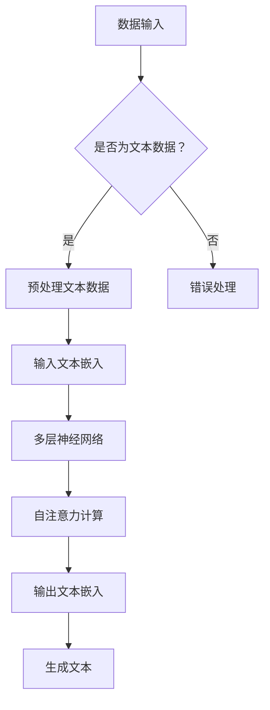
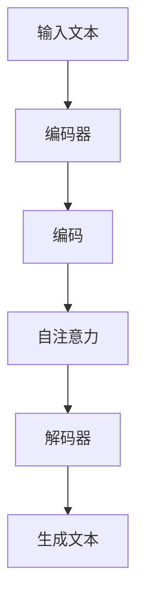
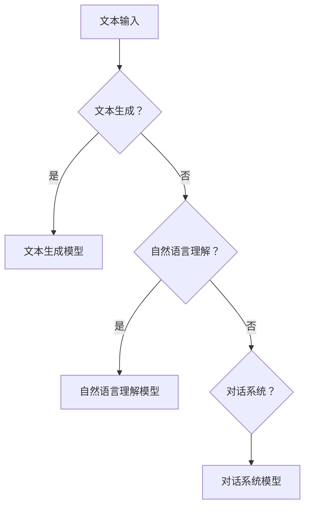
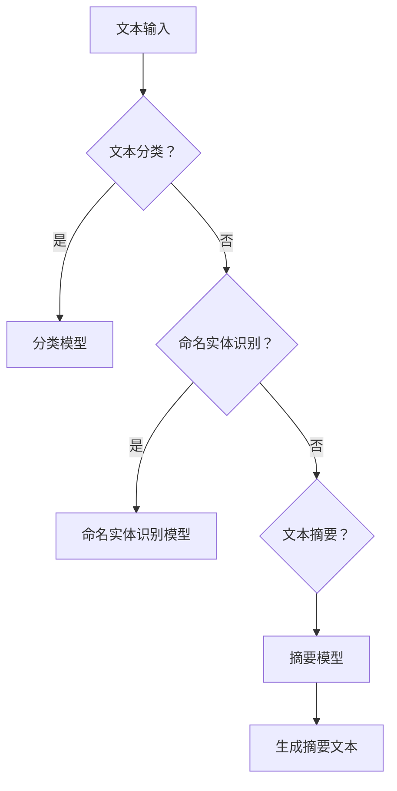
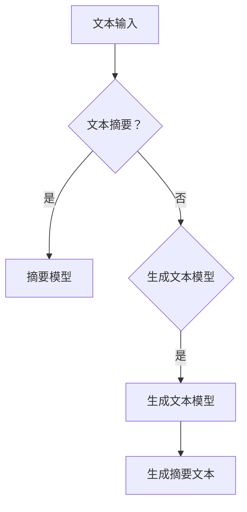
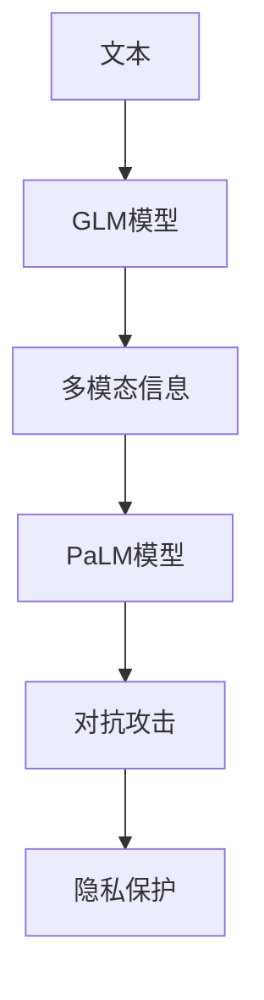
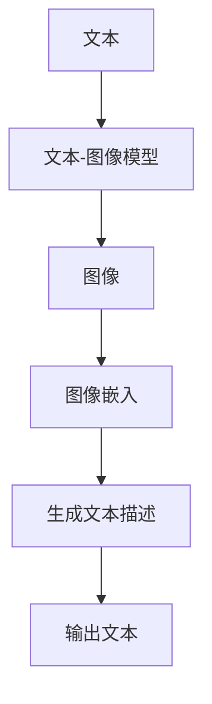
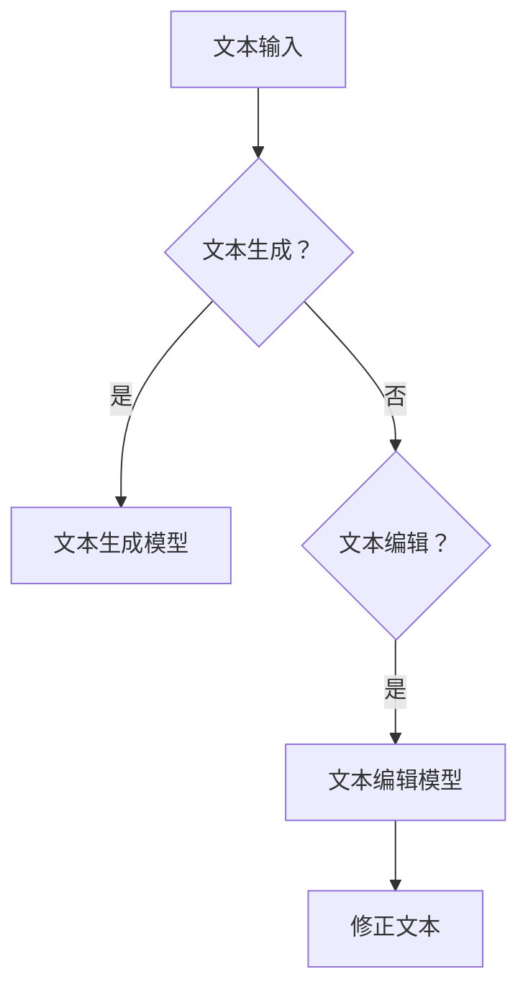
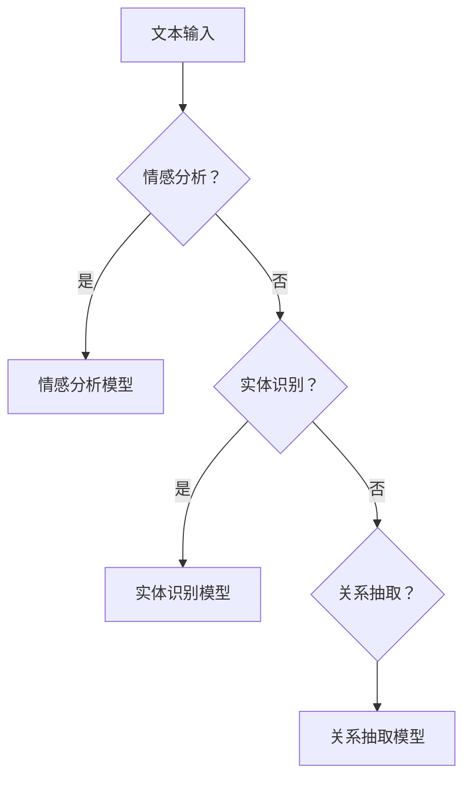
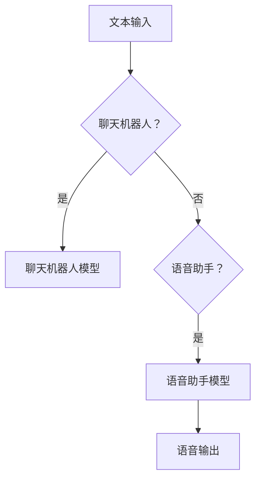

                 

# 大语言模型原理基础与前沿 基于数据的策略

> **关键词**：大语言模型、深度学习、自然语言处理、Transformer、预训练、微调、多模态

> **摘要**：
本文将深入探讨大语言模型的原理和前沿技术，基于数据的策略，从基础概念到具体应用，再到前沿研究和挑战，系统性地分析大语言模型在计算机领域的地位和作用。文章旨在为读者提供全面、清晰、易懂的技术解读，帮助理解这一重要领域的核心技术和未来趋势。

---

## 第一部分：大语言模型概述

### 第1章：大语言模型基础概念

#### 1.1 大语言模型的定义

大语言模型（Large-scale Language Model）是一种基于深度学习技术的自然语言处理模型。它通过对大量文本数据的学习，可以理解并生成自然语言。这类模型的应用范围广泛，包括文本生成、机器翻译、问答系统等。大语言模型的核心在于其“大”，即拥有巨量参数和超大规模的训练数据，这使得它们能够捕捉到语言中的复杂规律和多样性。

#### 1.2 大语言模型的核心架构

大语言模型的核心架构通常是基于多层神经网络，特别是近年来流行的Transformer模型。Transformer模型引入了自注意力（self-attention）机制，使得模型能够自动学习输入文本中各个词之间的相互关系。以下是一个简单的Mermaid流程图，展示了大语言模型的基本架构：



#### 1.3 大语言模型的主要特点

大语言模型具有以下主要特点：

- **高泛化能力**：由于训练数据的规模庞大，大语言模型能够处理多种语言和多种任务，具有很强的泛化能力。
- **强生成能力**：大语言模型能够生成连贯、自然的文本，无论是文章、对话还是摘要，都能达到很高的质量。

### 第2章：大语言模型技术详解

#### 2.1 Transformer模型原理

Transformer模型是近年来大语言模型研究的重要突破。其核心在于自注意力机制，通过计算输入文本中每个词对其他词的影响，实现端到端的学习。以下是一个简化的Mermaid流程图，展示了Transformer模型的基本工作流程：



#### 2.2 预训练与微调

预训练（Pre-training）是大语言模型的重要环节，通常在大规模文本数据上先进行预训练，然后针对特定任务进行微调（Fine-tuning）。预训练的目标是学习语言的通用特征，而微调则是利用特定任务的数据进一步优化模型。以下是一个简化的伪代码，展示了预训练与微调的过程：

```python
# 预训练大语言模型
def pretrain_model(dataset):
    # 使用大量文本数据进行预训练
    pass

# 微调大语言模型
def fine_tune_model(model, dataset):
    # 在特定任务的数据集上微调模型
    pass

# 预测
def predict(model, text):
    # 使用模型预测文本
    pass
```

#### 2.3 大规模预训练模型

大规模预训练模型如GPT系列模型和BERT模型，在自然语言处理领域具有里程碑意义。GPT模型系列包括GPT、GPT-2、GPT-3等，具有亿级参数，能够生成高质量的自然语言。BERT模型则通过双向编码器表示模型（Bidirectional Encoder Representations from Transformers），利用双向注意力机制学习文本的上下文，使得模型在多种任务中表现出色。

### 第3章：大语言模型应用实践

#### 3.1 生成文本

大语言模型在生成文本方面具有广泛的应用。例如，自动写作、文章生成、对话生成等。以下是一个简单的Mermaid流程图，展示了生成文本的基本过程：



#### 3.2 文本分类

文本分类是自然语言处理中的一个重要任务，大语言模型在这方面也表现出色。例如，情感分析、主题分类等。以下是一个简单的Mermaid流程图，展示了文本分类的基本过程：



#### 3.3 文本摘要

文本摘要包括提取式摘要和生成式摘要。提取式摘要从原始文本中提取关键信息，而生成式摘则是生成新的摘要文本。以下是一个简单的Mermaid流程图，展示了文本摘要的基本过程：



### 第4章：大语言模型开发实践

#### 4.1 开发环境搭建

搭建大语言模型的开发环境需要考虑硬件和软件两方面的需求。硬件上，需要配备高性能的GPU或TPU；软件上，需要安装Python、TensorFlow或PyTorch等深度学习框架。以下是一个简单的伪代码，展示了开发环境搭建的基本步骤：

```python
# 安装Python
pip install python

# 安装深度学习框架
pip install tensorflow
# 或者
pip install pytorch
```

#### 4.2 模型训练与优化

模型训练是开发大语言模型的关键步骤。通常需要使用大量文本数据进行预训练，然后针对特定任务进行微调。以下是一个简单的伪代码，展示了模型训练的基本步骤：

```python
# 预训练大语言模型
def pretrain_model(dataset):
    # 使用大量文本数据进行预训练
    pass

# 微调大语言模型
def fine_tune_model(model, dataset):
    # 在特定任务的数据集上微调模型
    pass
```

#### 4.3 模型部署与使用

模型部署是将训练好的模型部署到服务器或云端，以便进行预测和使用。以下是一个简单的伪代码，展示了模型部署的基本步骤：

```python
# 部署模型
def deploy_model(model):
    # 将模型部署到服务器或云端
    pass

# 使用模型进行预测
def use_model(model, text):
    # 使用模型预测文本
    pass
```

### 第5章：大语言模型前沿进展

#### 5.1 新的大语言模型

近年来，出现了许多新的大语言模型，如GLM模型和PaLM模型。GLM模型是清华大学提出的大规模语言模型，具有强大的文本生成和语言理解能力。PaLM模型则是谷歌提出的大规模语言模型，能够处理复杂的任务，如问答、编程等。以下是一个简单的Mermaid流程图，展示了GLM模型和PaLM模型的基本工作流程：



#### 5.2 多模态大语言模型

多模态大语言模型能够结合文本、图像、语音等多种数据，实现更加丰富的语言处理能力。例如，文本-图像模型可以生成与图像内容相关的文本描述，文本-语音模型可以将文本内容转换为语音输出。以下是一个简单的Mermaid流程图，展示了多模态大语言模型的基本工作流程：



#### 5.3 大语言模型的安全性

随着大语言模型的应用越来越广泛，其安全性也受到了越来越多的关注。对抗攻击和安全风险是大语言模型面临的主要挑战。研究如何提高大语言模型的安全性，如隐私保护和对抗攻击防御，是当前的一个重要研究方向。

### 第6章：大语言模型在具体领域的应用

#### 6.1 文本生成与编辑

大语言模型在文本生成与编辑方面具有广泛的应用。例如，自动写作、文章生成、对话生成等。以下是一个简单的Mermaid流程图，展示了文本生成与编辑的基本过程：



#### 6.2 自然语言理解

自然语言理解是大语言模型的重要应用领域。包括情感分析、实体识别、关系抽取等。以下是一个简单的Mermaid流程图，展示了自然语言理解的基本过程：



#### 6.3 对话系统

对话系统是大语言模型的另一个重要应用领域。包括聊天机器人、语音助手等。以下是一个简单的Mermaid流程图，展示了对话系统的基本过程：



### 第7章：大语言模型面临的挑战与未来方向

#### 7.1 计算资源需求

大语言模型对计算资源的需求非常高，特别是预训练阶段。这需要大量的GPU或TPU来加速计算。此外，大语言模型的训练过程能耗巨大，如何降低能耗是一个重要的研究方向。

#### 7.2 数据隐私与安全

大语言模型在训练和应用过程中会涉及大量的用户数据，如何保护数据隐私是一个重要问题。此外，大语言模型可能遭受对抗攻击，导致安全风险。研究如何提高大语言模型的安全性，如隐私保护和对抗攻击防御，是当前的一个重要研究方向。

#### 7.3 模型解释性与可解释性

大语言模型的复杂性和黑箱性质使得其决策过程难以解释。提高模型的可解释性，使得用户能够理解模型的决策过程，是提高用户信任和接受度的重要方向。

#### 7.4 未来发展方向

未来，大语言模型的发展方向将包括多模态融合、自适应学习、模型压缩等方面。通过结合多种数据类型，提高模型的表现力；通过自适应学习，提高模型的适应性；通过模型压缩，降低模型的计算和存储需求。

### 附录

#### 附录 A：大语言模型开发工具与资源

##### A.1 主流深度学习框架对比

- **TensorFlow**：谷歌开发的开源深度学习框架，具有丰富的API和强大的生态。
- **PyTorch**：Facebook开发的开源深度学习框架，具有灵活的动态计算图和简洁的API。

##### A.2 大语言模型预训练与微调工具

- **Hugging Face Transformers**：提供了丰富的预训练模型和微调工具，是开发大语言模型的首选库。

##### A.3 大语言模型开源代码与论文

- **OpenAI GPT-3**：OpenAI开源的GPT-3模型代码和论文，是当前最先进的语言模型之一。
- **Google BERT**：Google开源的BERT模型代码和论文，是自然语言处理领域的里程碑。

##### A.4 大语言模型应用案例与教程

- **Hugging Face Examples**：提供了大量的大语言模型应用案例和教程，涵盖了文本生成、分类、摘要等多种任务。
- **Google Colab**：Google提供的免费云端计算平台，可用于大语言模型实验和教程。

---

**作者**：AI天才研究院/AI Genius Institute & 禅与计算机程序设计艺术 /Zen And The Art of Computer Programming

---

通过本文的详细探讨，相信读者已经对大语言模型的原理、技术、应用和实践有了全面、深入的了解。在未来的研究中，我们将继续关注大语言模型的最新进展和前沿技术，探索其在各个领域的应用潜力。同时，我们也将积极应对大语言模型面临的挑战，推动其在安全性、可解释性等方面的研究和应用。希望本文能为读者提供有价值的参考和启发。

