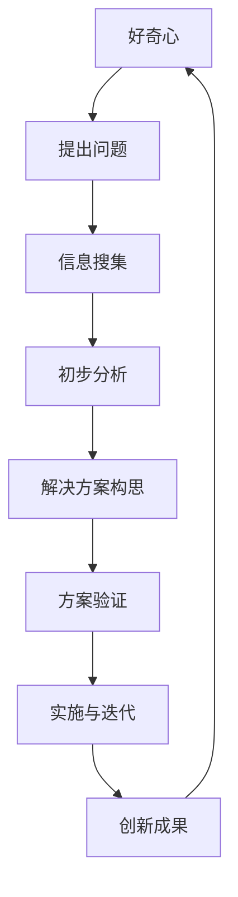

                 

## 好奇心：驱动创新与发现的源泉

> **关键词：** 好奇心、创新、科学发现、学习动机、数字化时代、人工智能

**摘要：** 好奇心是人类探索未知、推动科技进步和解决复杂问题的内在动力。本文从心理学、神经科学、教育、组织创新和社会问题解决等多个角度，详细探讨了好奇心的概念、作用及其在现代社会中的重要性。通过历史案例、科学研究、教育实践和实际项目，展示了好奇心如何激发人类创造力，推动个人成长、团队协作和社会进步。本文旨在唤起人们对好奇心价值的认识，为培养和激发好奇心提供实用策略。

### 第一部分：好奇心概述

#### 第1章：好奇心与人类进步的关系

##### 1.1 引言：好奇心的本质

**1.1.1 好奇心的定义与重要性**

好奇心是一种强烈的内在动机，驱使人们寻求知识、探索未知、解决问题。它不仅是一种心理状态，也是一种行为倾向。根据心理学家的定义，好奇心是指一种强烈的、内在的探索需求和求知欲。在人类行为中，好奇心起着至关重要的作用。

首先，好奇心是人类学习和认知的基础。儿童时期，好奇心驱使孩子们不断地探索周围的世界，通过观察、提问和实验来理解事物。这种探索行为促进了认知发展，培养了学习能力和思维能力。研究表明，好奇心强的儿童在学习中表现出更高的动机和成绩。

其次，好奇心是推动科学进步和科技创新的关键因素。历史上，许多重大的科学发现和技术突破都源于科学家们的好奇心。例如，牛顿因为对苹果落地的疑问而提出了万有引力定律，爱因斯坦则因对光速不变原理的好奇心而创立了相对论。

最后，好奇心在人类文化和社会发展中也有着重要的地位。好奇心促使人类创作文学、艺术和音乐等文化作品，推动了人类文明的发展。同时，好奇心也激发了社会创新和变革，促进了科技进步和社会进步。

**1.1.2 好奇心与人类进化的联系**

好奇心不仅是人类行为和心理的产物，也具有深远的进化意义。从进化的角度来看，好奇心是人类在长期自然选择过程中形成的一种适应性特质。

首先，好奇心帮助人类适应复杂多变的环境。在自然界中，人类祖先通过好奇心来探索未知的环境，识别潜在的危险和资源，从而提高生存能力。例如，好奇心驱使人类祖先尝试新的食物，从而扩大了食物来源，提高了生存率。

其次，好奇心促进了人类认知能力的进化。好奇心驱使人类祖先不断地探索和学习，从而积累了丰富的知识和经验。这些知识和经验不仅帮助人类更好地适应环境，也促进了认知能力的进化。例如，语言能力的发展使得人类能够更有效地交流和传递信息，从而提高了群体合作和协作能力。

最后，好奇心促进了人类文化和社会的进化。好奇心驱使人类探索和创造新的文化形式，从而推动了人类文化的发展。同时，好奇心也激发了社会创新和变革，促进了社会制度的演变和发展。

##### 1.2 好奇心的心理学与神经科学基础

**1.2.1 好奇心的心理学研究**

好奇心在心理学领域有着广泛的研究。研究表明，好奇心与多种心理过程和特质密切相关。

首先，好奇心与学习动机密切相关。好奇心强的个体往往表现出更高的学习动机和兴趣。他们更愿意主动学习新知识，对学习过程有更强的内在驱动力。这种内在驱动力不仅促进了学习效果，也提高了学习效率。

其次，好奇心与认知灵活性密切相关。好奇心强的个体在面临新问题和情境时，更能够灵活地调整自己的认知策略，从而更好地解决问题。这种认知灵活性不仅有助于应对复杂情境，也有助于创新思维和创造力的发展。

最后，好奇心与情感体验密切相关。好奇心驱使个体探索未知，从而体验到新鲜感和兴奋感。这些积极的情感体验不仅提升了个体的心理状态，也有助于激发好奇心。

**1.2.2 好奇心的神经科学机制**

神经科学研究表明，好奇心与大脑中的多个神经网络和神经递质密切相关。

首先，好奇心与大脑中的奖励系统密切相关。大脑中的奖励系统通过释放多巴胺等神经递质，产生愉悦感和奖励感。好奇心驱使个体探索未知，从而激活大脑中的奖励系统，产生愉悦感。

其次，好奇心与大脑中的认知控制网络密切相关。认知控制网络负责调节个体的注意力和认知资源，以应对复杂情境。好奇心强的个体能够更好地调节认知控制网络，从而更好地处理复杂信息和问题。

最后，好奇心与大脑中的神经网络结构密切相关。研究表明，好奇心强的个体在大脑中形成了更丰富的神经网络结构，从而提高了认知能力和创造力。

##### 1.3 好奇心在人类创造力中的作用

**1.3.1 好奇心与创新思维的关联**

好奇心与创新思维之间存在密切的联系。好奇心驱使个体不断地探索新知识和新情境，从而激发了创新思维。创新思维是指个体在面对问题和挑战时，能够产生新颖的、有创意的想法和解决方案。

首先，好奇心促进了知识积累。好奇心驱使个体主动学习和探索新知识，从而积累了丰富的知识储备。这些知识储备不仅有助于创新思维的产生，也为创新提供了丰富的素材。

其次，好奇心激发了问题解决的动力。好奇心驱使个体在面对问题和挑战时，产生强烈的探索欲望和解决问题的动机。这种动机有助于个体克服困难，不断尝试和改进，最终实现创新。

最后，好奇心促进了思维的灵活性。好奇心驱使个体不断地探索和尝试新的思维方式和解决问题的方法。这种灵活性有助于打破固有的思维模式，产生新颖的、有创意的想法。

**1.3.2 好奇心如何激发创造力**

好奇心不仅是创新思维的基础，也是激发创造力的关键因素。创造力是指个体在面对问题和挑战时，能够产生新颖的、有价值的解决方案的能力。

首先，好奇心促进了观察力和洞察力的发展。好奇心驱使个体不断地观察和探索周围的事物，从而提高了观察力和洞察力。这种能力有助于个体发现问题和找到解决问题的方法。

其次，好奇心激发了想象力。好奇心驱使个体想象新的可能性，探索未知的领域。想象力是创造力的核心要素，它有助于个体产生新颖的、有创意的想法。

最后，好奇心促进了实践和验证。好奇心驱使个体将创意付诸实践，并通过实验和验证来不断改进和完善。这种实践和验证的过程有助于激发创造力，实现创新。

##### 1.4 好奇心驱动下的科学探索与发现

**1.4.1 历史上的科学发现案例**

好奇心驱动下的科学探索与发现是科技进步的重要推动力。历史上，许多重大的科学发现都源于科学家们的好奇心。

首先，伽利略因对天体运动的疑问而进行了大量的观测和实验，最终提出了日心说，颠覆了当时的宇宙观。这一发现不仅推动了天文学的发展，也对科学方法论产生了深远的影响。

其次，牛顿因对苹果落地的疑问而提出了万有引力定律，这一发现不仅解释了天体运动，也为经典力学的发展奠定了基础。

最后，爱因斯坦因对光速不变原理的好奇心而创立了相对论，这一理论颠覆了经典物理学的观念，推动了物理学的发展。

**1.4.2 好奇心在科学突破中的作用**

好奇心在科学突破中起着至关重要的作用。科学家们通过好奇心驱动下的科学探索，不断提出问题、假设和实验，从而实现科学突破。

首先，好奇心促使科学家们提出新的科学问题。科学家们通过对自然现象的观察和思考，产生好奇心，从而提出新的科学问题。这些问题的提出为科学研究提供了方向和动力。

其次，好奇心激发科学家的创造力。好奇心驱使科学家们不断地探索和创新，从而产生新的科学假设和理论。这些假设和理论为科学研究提供了新的思路和方法。

最后，好奇心促进科学实验和验证。好奇心驱使科学家们进行实验和验证，从而验证新的科学假设和理论。实验和验证的过程不仅推动了科学的发展，也为科学突破提供了基础。

#### 第2章：好奇心在个人成长与教育中的应用

##### 2.1 好奇心与学习动机

**2.1.1 好奇心对学习效果的促进作用**

好奇心在学习过程中起着至关重要的作用。好奇心强的个体在学习中表现出更高的学习动机和兴趣，从而促进了学习效果。

首先，好奇心增强了学习动机。好奇心驱使个体对学习内容产生强烈的兴趣，从而激发了学习的内在驱动力。这种内在驱动力不仅提高了学习效率，也增强了学习的持久性。

其次，好奇心促进了学习策略的选择和应用。好奇心驱使个体主动选择适合自己的学习策略，如主动阅读、提问、讨论和实验等。这些策略有助于个体更好地理解和掌握学习内容。

最后，好奇心提升了学习成果的转化。好奇心驱使个体将学习内容应用到实际生活中，从而提高学习成果的转化效率。这种转化不仅有助于知识的巩固和应用，也有助于培养实践能力和创新思维。

**2.1.2 提升好奇心以增强学习动机的方法**

为了提升好奇心，可以采取以下几种方法：

首先，提供丰富的学习资源。丰富的学习资源能够激发学生的好奇心，提高学习兴趣。教师可以通过引入多样化的教材、视频、实验和实践活动，为学生提供丰富的学习资源。

其次，创造探索式的学习环境。探索式的学习环境能够激发学生的好奇心，提高学习动机。教师可以通过设计问题驱动、项目导向和实验验证等学习活动，创造探索式的学习环境。

最后，鼓励学生提问和讨论。鼓励学生提问和讨论能够激发学生的好奇心，提高学习兴趣。教师可以通过设立问题墙、组织讨论会和开展辩论活动等方式，鼓励学生提问和讨论。

##### 2.2 好奇心在教育改革中的作用

**2.2.1 好奇心导向的教学方法**

好奇心导向的教学方法是一种以激发学生好奇心为中心的教学方法。这种方法强调通过提问、探索和实验等方式，激发学生的内在驱动力，提高学习效果。

首先，教师可以通过提问来激发学生的好奇心。教师可以设计开放性问题，引导学生主动思考，提出问题。通过提问，学生能够更好地理解学习内容，培养批判性思维。

其次，教师可以通过探索来激发学生的好奇心。教师可以设计实验、实践活动和项目等，让学生在探索过程中发现新知识，解决问题。通过探索，学生能够更好地理解学习内容，培养实践能力和创新思维。

最后，教师可以通过实验来激发学生的好奇心。教师可以设计验证性实验，让学生通过实验验证自己的假设，发现新知识。通过实验，学生能够更好地理解学习内容，培养科学精神和实践能力。

**2.2.2 教育体系中好奇心培养的策略**

为了在教育体系中培养好奇心，可以采取以下几种策略：

首先，加强课程设计。教师可以通过设计问题驱动、项目导向和实验验证等课程，激发学生的好奇心。课程设计应注重培养学生的批判性思维、实践能力和创新思维。

其次，提供多样化的学习资源。学校可以提供丰富的学习资源，如图书馆、实验室和在线资源等，为学生提供多样化的学习体验。多样化的学习资源能够激发学生的好奇心，提高学习兴趣。

最后，鼓励学生参与教育决策。学生可以参与课程设计、教学评价和教育改革等决策过程，提高他们的参与感和责任感。通过参与教育决策，学生能够更好地理解教育体系，培养好奇心和批判性思维。

##### 2.3 好奇心与青少年发展

**2.3.1 青少年好奇心的发展阶段**

青少年时期是好奇心发展的关键阶段。青少年好奇心的发展可以分为以下几个阶段：

首先，探索阶段。青少年在探索阶段表现出强烈的好奇心，对未知的事物和知识充满好奇。他们通过观察、提问和实验等方式，探索周围的世界，积累知识和经验。

其次，批判阶段。青少年在批判阶段开始对现有知识和观念进行质疑和批判。他们通过思考和讨论，形成自己的观点和见解，培养批判性思维。

最后，应用阶段。青少年在应用阶段将好奇心转化为实际行动，将知识应用到实际生活中。他们通过实践活动和创新，解决问题，实现个人价值。

**2.3.2 家庭和学校对青少年好奇心培养的影响**

家庭和学校对青少年好奇心的发展具有重要影响。以下是一些家庭和学校可以采取的措施：

首先，家庭应提供一个支持性的环境。家长应鼓励孩子探索未知，提供必要的资源和指导。家长可以通过陪伴孩子阅读、讨论问题和进行实验等方式，激发孩子的好奇心。

其次，学校应提供一个启发性的学习环境。教师可以通过设计问题驱动、项目导向和实验验证等教学活动，激发学生的好奇心。学校可以设立实验室、图书馆和在线资源等，为学生提供丰富的学习体验。

最后，家庭和学校应鼓励学生进行自主探索。学生可以通过参加科技竞赛、研究项目和社会实践等活动，自主探索和解决问题。通过自主探索，学生能够更好地发展好奇心，培养创新思维和实践能力。

### 第二部分：好奇心在组织与创新中的应用

#### 第3章：好奇心在项目开发中的应用

好奇心在项目开发中的应用至关重要，它不仅能够激发团队成员的创造力，还能提高项目的整体效率和成功率。在本章中，我们将探讨好奇心在项目团队协作、产品创新和用户体验提升方面的具体应用。

##### 3.1 好奇心与项目团队协作

**3.1.1 好奇心如何促进团队沟通与协作**

好奇心能够促进团队沟通与协作，这是因为好奇心驱使团队成员积极参与讨论、分享想法和提出问题。以下是一些具体的方法：

1. **鼓励提问和分享**：在团队会议或讨论中，鼓励成员提问和分享自己的观点。好奇心使成员对项目细节和潜在问题保持关注，从而促进深入的讨论。

2. **建立知识共享平台**：通过建立知识共享平台，如内部论坛、共享文档和协作工具，团队成员可以随时分享知识和经验。好奇心驱使成员主动查找和贡献信息，从而增强团队的知识储备。

3. **组织头脑风暴会议**：定期组织头脑风暴会议，鼓励团队成员提出新颖的想法和解决方案。好奇心使成员对未知领域保持开放态度，从而产生更多的创新点子。

4. **建立跨功能团队**：通过建立跨功能团队，不同背景和技能的成员可以相互学习和合作。好奇心驱使成员探索其他领域的知识，从而提高项目的整体创新能力。

**3.1.2 好奇心如何提升团队创造力**

好奇心能够提升团队创造力，这是因为好奇心驱使团队成员探索新的思路和解决方案。以下是一些具体的方法：

1. **培养探索精神**：鼓励团队成员保持探索精神，不断尝试新的方法和工具。好奇心使成员对新事物保持好奇，从而激发创造力。

2. **提供实验空间**：为团队成员提供实验空间，如实验室或创新工作室，让他们有机会进行实验和验证自己的想法。好奇心驱使成员勇于实践，从而提高创新成功率。

3. **培养团队合作文化**：建立团队合作文化，鼓励成员相互支持和合作。好奇心使成员乐于分享和帮助他人，从而提高团队的协作效率。

4. **定期举办创意竞赛**：定期举办创意竞赛，鼓励团队成员提出创新项目和解决方案。好奇心驱使成员积极参与竞赛，从而激发团队创造力。

##### 3.2 好奇心在产品创新中的应用

**3.2.1 好奇心如何推动产品迭代**

好奇心在产品创新中的应用体现在推动产品迭代的过程中。以下是一些具体的方法：

1. **用户研究**：通过用户研究，了解用户的需求和痛点。好奇心使团队能够发现新的问题和机会，从而推动产品迭代。

2. **提出问题**：团队在用户研究的基础上，提出关键问题，如如何提高用户体验、如何优化功能等。好奇心驱使团队不断探索和尝试新的解决方案。

3. **实验与验证**：团队设计实验，验证不同解决方案的效果。好奇心使团队能够勇于尝试新的方法，从而找到最佳方案。

4. **用户测试**：邀请用户测试新功能，收集反馈并进行评估。好奇心使团队能够倾听用户的声音，从而不断优化产品。

5. **迭代更新**：根据用户反馈和实验结果，对产品进行迭代更新。好奇心使团队能够保持持续改进的态度，从而提高产品竞争力。

**3.2.2 好奇心如何提升用户体验**

好奇心在提升用户体验方面发挥着重要作用。以下是一些具体的方法：

1. **了解用户需求**：通过用户研究和访谈，了解用户的需求和行为模式。好奇心使团队能够发现用户的潜在需求，从而设计更符合用户期望的产品。

2. **创造互动体验**：通过设计互动式的用户界面和功能，提高用户的参与感和满意度。好奇心使团队能够不断创新，提供新颖的交互方式。

3. **提供个性化推荐**：利用人工智能技术，为用户提供个性化的推荐和服务。好奇心使团队能够不断探索和改进推荐算法，提高用户体验。

4. **持续优化设计**：通过用户反馈和数据分析，不断优化产品的设计。好奇心使团队能够保持对用户体验的持续关注，从而提升用户满意度。

5. **用户参与反馈**：鼓励用户参与产品改进过程，收集他们的反馈和建议。好奇心使团队能够更好地理解用户需求，从而提供更符合用户期望的产品。

#### 第4章：好奇心与创业精神

好奇心是创业精神的核心驱动力，它促使创业者探索未知、挑战传统、寻找新的商业机会。在本章中，我们将探讨好奇心在创业思维、产品创新和市场机会挖掘方面的应用。

##### 4.1 好奇心与创业思维

**4.1.1 好奇心如何激发创业灵感**

好奇心是激发创业灵感的源泉。以下是一些具体的方法：

1. **探索新兴领域**：创业者应保持好奇心，不断探索新兴技术和行业趋势。好奇心使创业者能够发现新的商业机会，从而激发创业灵感。

2. **关注用户需求**：创业者应密切关注用户的需求和行为，寻找潜在的市场痛点。好奇心使创业者能够深入理解用户，从而发现商业机会。

3. **打破思维定式**：创业者应勇于挑战传统思维模式，探索新的商业模式和解决方案。好奇心使创业者能够突破思维束缚，找到创新的解决方案。

4. **持续学习与思考**：创业者应保持持续学习的态度，不断更新知识和技能。好奇心使创业者能够保持对行业动态和新兴技术的敏感度，从而激发创业灵感。

**4.1.2 好奇心在创业过程中的重要性**

好奇心在创业过程中具有至关重要的地位。以下是一些具体的重要性：

1. **探索和验证**：好奇心使创业者不断探索新的商业模式和解决方案，并通过实验和验证来验证其可行性。

2. **持续创新**：好奇心驱使创业者不断寻找新的创新点，从而保持竞争优势。

3. **应对不确定性**：创业过程充满不确定性，好奇心使创业者能够灵活应对变化，抓住市场机遇。

4. **激发团队潜力**：好奇心不仅影响创业者本人，也能激发团队成员的创造力，从而提高团队的执行力。

##### 4.2 好奇心在产品创新中的应用

**4.2.1 好奇心如何推动产品迭代**

好奇心在推动产品迭代中发挥着关键作用。以下是一些具体的方法：

1. **用户反馈**：创业者应积极收集用户反馈，了解用户的需求和痛点。好奇心使创业者能够深入理解用户，从而推动产品迭代。

2. **持续优化**：创业者应保持对产品的持续优化，不断改进用户体验。好奇心使创业者能够不断发现新的改进点，从而推动产品迭代。

3. **实验和验证**：创业者应勇于进行实验和验证，通过试错来优化产品。好奇心使创业者能够保持对创新的追求，从而推动产品迭代。

4. **跨界合作**：创业者应与不同领域的专家和团队进行合作，借鉴其他行业的经验和技术。好奇心使创业者能够不断吸收新的知识和思路，从而推动产品迭代。

**4.2.2 好奇心如何提升用户体验**

好奇心在提升用户体验方面具有重要作用。以下是一些具体的方法：

1. **个性化设计**：创业者应注重个性化设计，根据用户的需求和偏好来定制产品。好奇心使创业者能够深入了解用户，从而提供个性化的解决方案。

2. **交互设计**：创业者应注重交互设计，提供简单、直观和愉悦的交互体验。好奇心使创业者能够不断创新，提供更好的交互体验。

3. **技术融合**：创业者应积极融合新技术，如人工智能、大数据等，以提高产品的智能化和个性化。好奇心使创业者能够紧跟技术发展趋势，从而提升用户体验。

4. **用户参与**：创业者应鼓励用户参与产品改进过程，收集他们的反馈和建议。好奇心使创业者能够更好地理解用户需求，从而提供更符合用户期望的产品。

##### 4.3 好奇心与市场洞察

**4.3.1 好奇心如何助力市场调研**

好奇心是市场调研的重要驱动力。以下是一些具体的方法：

1. **深入分析**：创业者应保持好奇心，对市场数据进行深入分析，发现潜在的市场机会。好奇心使创业者能够更全面地了解市场动态。

2. **用户访谈**：创业者应积极进行用户访谈，了解用户的真实需求和痛点。好奇心使创业者能够与用户建立深入的联系，从而获取更准确的市场信息。

3. **竞争对手分析**：创业者应关注竞争对手的动态，了解他们的产品、策略和市场表现。好奇心使创业者能够发现竞争对手的弱点，从而制定更有效的市场策略。

4. **趋势预测**：创业者应保持好奇心，关注行业趋势和新兴技术，预测未来市场的变化。好奇心使创业者能够抓住市场机遇，提前布局。

**4.3.2 好奇心在市场机会挖掘中的应用**

好奇心在市场机会挖掘中发挥着关键作用。以下是一些具体的方法：

1. **跨界思考**：创业者应保持好奇心，跨界思考，发现不同行业之间的潜在联系。好奇心使创业者能够发现新的市场机会。

2. **用户场景分析**：创业者应深入分析用户的使用场景，发现用户未满足的需求。好奇心使创业者能够发现潜在的市场机会。

3. **技术融合**：创业者应积极融合新技术，如人工智能、大数据等，挖掘新的商业机会。好奇心使创业者能够紧跟技术发展趋势，从而发现新的市场机会。

4. **社会趋势研究**：创业者应关注社会趋势，如人口结构变化、消费习惯变化等，发现潜在的市场机会。好奇心使创业者能够更好地理解社会变化，从而抓住市场机遇。

### 第三部分：好奇心在现代社会中的挑战与机遇

#### 第5章：好奇心与数字化时代

随着数字化时代的到来，好奇心面临着新的挑战和机遇。数字化技术不仅改变了我们的生活方式，也重新定义了好奇心的发展和培养方式。在本章中，我们将探讨数字化环境对好奇心的影响、好奇心与人工智能的关系以及好奇心在数字化时代的教育中的应用。

##### 5.1 数字化环境对好奇心的影响

**5.1.1 数字化技术如何激发好奇心**

数字化技术为好奇心提供了丰富的资源和工具，激发了人们对知识和探索的渴望。以下是一些具体的方法：

1. **丰富信息资源**：互联网和数字媒体为我们提供了海量的信息资源，使我们能够轻松地获取各种知识。好奇心使我们不断探索这些资源，满足我们的求知欲。

2. **互动式学习体验**：数字化技术使我们能够通过在线课程、虚拟实验室和模拟环境进行互动式学习。这种学习方式激发了我们的好奇心，使我们能够更主动地参与学习过程。

3. **虚拟实验和模拟**：数字化技术使我们能够在虚拟环境中进行实验和模拟，探索自然现象和科学原理。这种体验激发了我们的好奇心，使我们能够更直观地理解复杂概念。

4. **社交互动**：数字化平台为我们提供了与全球用户互动的机会，使我们能够分享知识、经验和观点。好奇心使我们不断与他人交流，拓宽我们的视野。

**5.1.2 数字化环境中好奇心培养的挑战**

虽然数字化技术激发了好奇心，但也带来了一些挑战：

1. **信息过载**：数字化时代的信息量巨大，容易导致信息过载。好奇心使我们不断搜索和获取信息，但同时也可能导致我们无法有效地筛选和处理信息。

2. **数字化依赖**：人们对数字化工具的依赖可能导致对现实世界的好奇心减弱。好奇心使我们依赖数字化资源，而忽视了现实世界的探索。

3. **社交孤立**：虽然数字化平台提供了社交互动的机会，但也可能导致现实社交能力的下降。好奇心使我们过度依赖虚拟社交，而忽视了现实社交的重要性。

4. **安全与隐私问题**：数字化环境中存在安全与隐私风险，好奇心可能导致我们过度分享个人信息，从而遭受网络攻击或隐私泄露。

##### 5.2 好奇心与人工智能的关系

**5.2.1 人工智能如何增强好奇心**

人工智能（AI）技术为好奇心提供了新的工具和平台，增强了我们的探索能力和求知欲。以下是一些具体的方法：

1. **个性化推荐系统**：人工智能可以通过分析用户的行为和偏好，提供个性化的推荐内容。好奇心使我们不断探索这些推荐内容，从而满足我们的求知欲。

2. **智能问答系统**：人工智能可以回答我们的问题，帮助我们解决疑惑。好奇心使我们不断提出问题，从而激发我们的探索精神。

3. **虚拟现实与增强现实**：人工智能与虚拟现实（VR）和增强现实（AR）技术的结合，为我们提供了沉浸式的探索体验。好奇心使我们不断尝试新的虚拟环境，探索未知领域。

4. **数据分析和模式识别**：人工智能可以通过数据分析，揭示数据中的模式和趋势。好奇心使我们不断探索这些模式，从而发现新的知识。

**5.2.2 好奇心在人工智能应用中的体现**

好奇心在人工智能应用中得到了充分体现，以下是一些具体的应用案例：

1. **科学探索**：人工智能在科学研究中发挥了重要作用，如基因组学研究、气候变化模拟等。好奇心驱使科学家们利用人工智能进行深入研究，揭示自然界的奥秘。

2. **医疗诊断**：人工智能在医疗诊断中具有潜力，如疾病预测、药物开发等。好奇心使医生和研究人员不断探索人工智能在医疗领域的应用，提高诊断和治疗的准确性。

3. **教育创新**：人工智能在教育领域带来了新的教学模式，如个性化学习、智能辅导等。好奇心驱使学生和教师不断尝试新的教学方法和工具，提高学习效果。

4. **城市规划**：人工智能在城市规划中发挥了重要作用，如交通流量预测、环境保护等。好奇心使城市规划者不断探索新的技术和方法，优化城市环境。

##### 5.3 数字化时代的好奇心教育

**5.3.1 好奇心导向的数字教育策略**

在数字化时代，好奇心导向的数字教育策略显得尤为重要。以下是一些具体的方法：

1. **项目式学习**：通过项目式学习，学生可以参与到真实的项目中，通过实践和探索来培养好奇心。好奇心驱使学生主动学习和解决问题。

2. **问题驱动的学习**：通过设计开放性问题，激发学生的好奇心，引导他们进行自主探究和学习。好奇心使学生保持对知识的渴望和求知欲。

3. **跨学科学习**：通过跨学科学习，学生可以探索不同学科之间的联系，培养综合思维能力和创新意识。好奇心驱使学生跨学科探索，拓宽知识视野。

4. **数字素养培养**：通过数字素养的培养，学生可以学会如何有效地使用数字化工具和资源，培养信息素养和批判性思维能力。好奇心使学生保持对数字化技术的兴趣和探索精神。

**5.3.2 学校教育中好奇心培养的方法**

在学校教育中，好奇心培养可以通过以下方法实现：

1. **设立探索课程**：学校可以设立探索课程，如科技探究、艺术创作等，激发学生的好奇心。好奇心驱使学生主动参与课程，探索未知领域。

2. **提供探索工具**：学校可以提供各种探索工具，如实验室设备、计算机软件等，帮助学生进行实践和实验。好奇心驱使学生利用这些工具，进行自主探索。

3. **鼓励提问和讨论**：学校可以鼓励学生提问和讨论，培养他们的批判性思维和表达力。好奇心驱使学生主动思考和交流，激发学习动力。

4. **组织实践活动**：学校可以组织各种实践活动，如科学实验、户外探索等，让学生在真实环境中体验和探索。好奇心驱使学生积极参与活动，培养实践能力和团队合作精神。

### 第四部分：好奇心与未来

#### 第6章：好奇心与未来社会

好奇心不仅是推动个人成长和社会进步的动力，也是引领未来社会发展的关键因素。在本章中，我们将探讨好奇心在未来社会中的角色，包括未来趋势、教育和社会创新等方面的展望。

##### 6.1 好奇心与未来趋势

**6.1.1 未来社会的技术发展**

未来社会将受到多种技术发展的深刻影响，这些技术不仅改变了我们的生活方式，也为好奇心提供了新的探索领域。以下是一些未来技术发展的趋势：

1. **人工智能与机器学习**：人工智能和机器学习技术的快速发展将改变许多行业，从医疗保健到制造业。好奇心将驱动人们对这些技术的深入研究和应用，推动社会进步。

2. **区块链技术**：区块链技术具有去中心化和透明性的特点，将在金融、供应链管理等领域发挥重要作用。好奇心将促使人们探索区块链技术的潜力，推动其创新应用。

3. **生物技术与基因编辑**：生物技术和基因编辑技术的发展将带来医学和农业的革命。好奇心将促使科学家们不断探索这些技术的应用，解决全球挑战。

4. **新能源与可持续发展**：随着气候变化和能源需求的增长，新能源技术的发展变得至关重要。好奇心将驱动人们对可持续能源解决方案的探索，推动环境保护和可持续发展。

**6.1.2 好奇心在未来的应用前景**

好奇心在未来的应用前景广泛，以下是一些具体的领域：

1. **智慧城市**：智慧城市利用物联网、大数据和人工智能等技术，实现城市管理的智能化。好奇心将驱动人们对智慧城市的探索，提高城市生活品质。

2. **远程工作和虚拟现实**：远程工作和虚拟现实技术的发展将改变工作方式。好奇心将促使人们探索如何更好地利用这些技术，提高工作效率和生活质量。

3. **数字健康与个性化医疗**：数字健康和个性化医疗技术的发展将改变医疗行业。好奇心将推动人们对这些技术的深入研究，提供更精准、个性化的医疗服务。

4. **教育与终身学习**：好奇心将推动教育与终身学习的发展，激发人们对新知识和技能的渴望。在线教育和虚拟课堂将成为未来教育的重要组成部分。

##### 6.2 好奇心与未来教育

**6.2.1 未来教育体系中好奇心的培养**

未来教育体系将更加注重好奇心的培养，以下是一些具体的方法：

1. **个性化学习**：个性化学习将满足不同学生的学习需求，激发他们的好奇心。好奇心将驱动学生自主探索和学习，提高学习效果。

2. **跨学科教育**：跨学科教育将促进学生对不同领域的探索和联系，培养他们的综合思维能力和创新意识。好奇心将驱使学生跨学科学习，拓宽知识视野。

3. **项目式学习**：项目式学习将鼓励学生参与实际项目，通过实践和探索来培养好奇心。好奇心将驱动学生在项目中解决问题，培养实践能力。

4. **科技融合**：未来教育将更加注重科技融合，利用虚拟现实、人工智能等技术，提供丰富的学习体验。好奇心将驱使学生积极探索这些技术，提高科技素养。

**6.2.2 未来学校模式中的好奇心实践**

未来学校模式将更加注重好奇心实践，以下是一些具体的方法：

1. **探索实验室**：学校将设立探索实验室，提供各种科技设备和资源，鼓励学生进行实验和探索。好奇心将驱动学生在实验室中发挥创造力，探索未知领域。

2. **在线学习平台**：学校将建立在线学习平台，提供丰富的数字化资源和互动式学习工具。好奇心将驱使学生利用这些平台，进行自主学习和探索。

3. **创新课程**：学校将设计创新课程，如编程、人工智能、机器人技术等，激发学生的好奇心。好奇心将驱动学生在课程中探索新技术，培养创新思维。

4. **跨学科项目**：学校将组织跨学科项目，鼓励学生跨领域合作，解决实际问题。好奇心将驱动学生在项目中运用知识，培养团队合作精神。

##### 6.3 好奇心与未来工作

**6.3.1 未来职场中的好奇心需求**

未来职场将更加注重好奇心，以下是一些具体的需求：

1. **持续学习**：未来职场将不断变化，员工需要持续学习新知识和技能，以适应行业的发展。好奇心将驱动员工不断学习，保持竞争力。

2. **创新思维**：未来职场将更加重视创新思维，员工需要具备解决问题的能力和创造性思维。好奇心将驱动员工积极探索新方法，提出创新解决方案。

3. **适应能力**：未来职场将面临各种不确定性，员工需要具备适应能力，应对变化。好奇心将驱动员工保持开放心态，灵活应对挑战。

4. **团队合作**：未来职场将更加注重团队合作，员工需要具备良好的团队合作能力。好奇心将驱动员工与他人合作，共同解决问题。

**6.3.2 职场发展中对好奇心的培养策略**

为了在职场发展中培养好奇心，可以采取以下策略：

1. **提供学习机会**：企业可以提供各种学习机会，如在线课程、研讨会和工作坊，鼓励员工持续学习。好奇心将驱动员工积极参与学习活动，提升自身能力。

2. **鼓励创新**：企业可以建立创新文化和激励机制，鼓励员工提出创新想法。好奇心将驱动员工积极探索新思路，推动企业创新。

3. **跨学科合作**：企业可以鼓励跨学科合作，促进员工跨领域交流和学习。好奇心将驱动员工跨学科探索，拓宽知识视野。

4. **提供实验空间**：企业可以提供实验空间，如创新实验室或工作坊，鼓励员工进行实验和验证。好奇心将驱动员工勇于实践，提高创新能力。

### 第五部分：好奇心研究的资源与实践

#### 第7章：好奇心研究的资源与实践

好奇心作为一种重要的心理特质，吸引了众多学者和研究者的关注。本章将介绍好奇心研究的资源，包括学术期刊、数据库和研究工具，以及好奇心培养的具体实践案例。

##### 7.1 好奇心研究资源

**7.1.1 学术期刊与数据库**

好奇心研究的相关学术期刊和数据库为研究者提供了丰富的资源。以下是一些主要的学术期刊和数据库：

1. **学术期刊**：
   - 《Journal of Personality and Social Psychology》
   - 《Psychological Science》
   - 《Journal of Experimental Psychology: General》
   - 《Frontiers in Psychology》
   - 《Mind, Brain, and Education》

2. **数据库**：
   - **Cross-Disciplinary Academic Network (X-DAN)**：X-DAN是一个综合性的学术数据库，包含心理学、教育学、神经科学等多个领域的研究成果。
   - **Curiosity Research Database**：这是一个专门收录好奇心研究文献的数据库，提供了大量的好奇心相关研究论文和报告。

**7.1.2 研究工具与方法**

好奇心研究需要使用多种工具和方法来测量和理解好奇心。以下是一些常用的研究工具和方法：

1. **好奇心测量工具**：
   - **Curiosity and Exploration Measure (CEM)**：CEM是一种广泛使用的测量好奇心的问卷，用于评估个体的好奇心水平和探索行为。
   - **Curiosity Questionnaire (CQ)**：CQ是另一种常用的好奇心测量工具，通过评估个体的求知欲和探索意愿来衡量好奇心。

2. **研究方法**：
   - **实验法**：实验法是通过设计和实施实验来测量好奇心的影响因素和结果。实验法可以控制变量，提供对好奇心作用机制的深入了解。
   - **调查法**：调查法是通过问卷调查来收集大量个体的好奇心数据，用于分析好奇心在不同群体中的分布和影响因素。
   - **实地观察法**：实地观察法是通过直接观察个体的行为和环境来测量好奇心。这种方法适用于研究好奇心在日常生活中的表现。
   - **数据分析法**：数据分析法是通过统计方法对好奇心数据进行分析，揭示好奇心与学习、创造力等心理特质之间的关系。

##### 7.2 好奇心培养实践

**7.2.1 教育实践案例**

好奇心培养在教育领域有着广泛的应用。以下是一些教育实践案例，展示了如何在学校和教育机构中培养好奇心：

1. **项目式学习**：项目式学习通过设计实际项目，鼓励学生主动探索和解决问题。例如，在科学课程中，学生可以参与研究项目，探索自然现象，提高好奇心和科学素养。

2. **探究式教学**：探究式教学鼓励学生通过提问、观察和实验来学习。教师在教学过程中提供开放性问题，激发学生的好奇心，培养学生的探究能力和批判性思维。

3. **跨学科学习**：跨学科学习通过将不同学科的知识和技能结合，鼓励学生从不同角度探索问题。例如，通过将科学、艺术和技术结合，学生可以创造性地解决复杂问题，提高好奇心和创造力。

4. **科技活动**：学校可以组织科技活动，如科学实验、机器人竞赛和编程比赛等，激发学生的好奇心。这些活动不仅提供了实践机会，也培养了学生的科学精神和创新意识。

**7.2.2 职场实践建议**

在职场环境中，培养好奇心对于提高工作绩效和创新能力至关重要。以下是一些职场实践建议：

1. **提供学习资源**：企业可以为员工提供丰富的学习资源，如在线课程、图书和研讨会等。好奇心驱使员工主动学习，提高自身能力。

2. **鼓励提问和反馈**：企业可以建立鼓励提问和反馈的文化，鼓励员工提出问题和建议。好奇心驱使员工积极参与讨论，提高问题解决能力。

3. **跨部门合作**：跨部门合作可以促进员工跨领域交流，激发好奇心。企业可以通过项目合作、工作坊和团队建设活动，鼓励员工跨部门合作，提高创新能力。

4. **创新奖励机制**：企业可以建立创新奖励机制，鼓励员工提出创新想法。好奇心驱使员工积极探索新方法，推动企业创新。

##### 7.3 好奇心培养实践案例

**7.3.1 学校教育中的好奇心培养案例**

一个学校通过以下措施成功培养了学生的好奇心：

1. **科学实验室**：学校建立了科学实验室，提供各种实验设备和材料。学生可以自由进行实验，探索科学现象，提高好奇心和科学素养。

2. **探究课程**：学校开设了探究课程，鼓励学生通过提问、观察和实验来学习。课程内容涵盖多个学科领域，激发学生的好奇心。

3. **科技俱乐部**：学校成立了科技俱乐部，组织学生参与科技竞赛和项目。学生在科技俱乐部的活动中，不仅提高了科技技能，也培养了好奇心。

**7.3.2 职场中的好奇心培养案例**

一家科技公司通过以下措施成功培养了员工的好奇心：

1. **创新实验室**：公司设立了创新实验室，提供各种创新工具和资源。员工可以自由进入实验室，进行创新实验，提高创新能力。

2. **员工培训计划**：公司为员工提供多样化的培训计划，涵盖新技术、新方法和行业趋势。好奇心驱使员工积极参与培训，提高自身能力。

3. **内部竞赛**：公司定期举办内部竞赛，鼓励员工提出创新想法。员工通过竞赛，不仅可以展示自己的创新成果，还可以激发好奇心，推动公司创新。

### 附录

#### 附录A：好奇心研究资源

- **A.1 学术期刊与数据库**
  - **A.1.1 主要心理学期刊**
    - 《Journal of Personality and Social Psychology》
    - 《Psychological Science》
    - 《Journal of Experimental Psychology: General》
  - **A.1.2 好奇心研究数据库**
    - **Cross-Disciplinary Academic Network (X-DAN)**
    - **Curiosity Research Database**

- **A.2 研究工具与方法**
  - **A.2.1 好奇心测量工具**
    - **Curiosity and Exploration Measure (CEM)**
    - **Curiosity Questionnaire (CQ)**
  - **A.2.2 好奇心研究方法**
    - **实验法**
    - **调查法**
    - **实地观察法**
    - **数据分析法**

#### 附录B：好奇心培养实践

- **B.1 教育实践案例**
  - **B.1.1 好奇心导向的教学案例**
    - 举例：一个小学的“探索自然”课程，让学生通过实地考察、实验和记录来探索自然环境，激发学生的好奇心。
  - **B.1.2 校园活动中好奇心培养的实例**
    - 举例：一所高中的科技竞赛，鼓励学生提出创新项目，通过实验和展示来培养好奇心。

- **B.2 职场实践建议**
  - **B.2.1 职场环境中激发好奇心的策略**
    - 举例：一家科技公司定期组织技术分享会和头脑风暴会议，鼓励员工提出问题和分享想法，激发好奇心。
  - **B.2.2 提升职场创新能力的好奇心培养方法**
    - 举例：一家企业建立内部创新实验室，鼓励员工进行实验和创新，并提供资源支持，以培养员工的创新能力。

### Mermaid 流程图：好奇心驱动创新的过程

### 好奇心在项目开发中的应用

好奇心在项目开发中的应用至关重要，它不仅能够推动项目的创新和进步，还能提高项目的成功率。在本章中，我们将探讨好奇心在项目开发中的具体应用，包括团队合作、项目管理和产品创新等方面。

##### 3.1 好奇心与项目团队协作

**3.1.1 好奇心如何促进团队沟通与协作**

好奇心在促进团队沟通与协作中发挥着重要作用。以下是好奇心如何促进团队沟通与协作的几个方面：

1. **增强问题解决能力**：好奇心驱使团队成员保持对问题的关注，并不断寻求解决方案。在项目开发过程中，团队成员可以通过提问和讨论来探索问题，从而提高问题解决能力。

2. **激发创新思维**：好奇心使团队成员对新想法和新方法保持开放态度。在项目开发过程中，团队成员可以通过好奇心激发创新思维，提出新颖的解决方案，从而推动项目创新。

3. **提高团队合作效率**：好奇心可以激发团队成员的积极性和主动性。在项目开发过程中，团队成员可以通过好奇心促进合作，共同解决问题，提高团队合作效率。

4. **增强团队凝聚力**：好奇心可以增强团队成员之间的联系和互动。在项目开发过程中，团队成员可以通过好奇心分享知识和经验，建立信任和合作关系，从而增强团队凝聚力。

**3.1.2 好奇心如何提升团队创造力**

好奇心在提升团队创造力方面具有重要作用。以下是好奇心如何提升团队创造力的几个方面：

1. **激发创新灵感**：好奇心驱使团队成员探索新的想法和解决方案。在项目开发过程中，团队成员可以通过好奇心激发创新灵感，提出新颖的想法，从而推动项目创新。

2. **促进知识共享**：好奇心使团队成员对知识和信息保持开放态度。在项目开发过程中，团队成员可以通过好奇心促进知识共享，从而提高团队的创新能力。

3. **鼓励跨学科合作**：好奇心可以激发团队成员跨学科合作。在项目开发过程中，团队成员可以通过好奇心探索不同学科的知识和方法，从而提高团队的创新能力。

4. **培养批判性思维**：好奇心使团队成员保持对问题和解决方案的批判性思考。在项目开发过程中，团队成员可以通过好奇心培养批判性思维，从而提高团队的创造力。

##### 3.2 好奇心在项目开发中的应用

**3.2.1 好奇心如何推动项目创新**

好奇心在推动项目创新中发挥着重要作用。以下是好奇心如何推动项目创新的几个方面：

1. **激发创意**：好奇心使团队成员对问题保持开放态度，不断寻求新的解决方案。在项目开发过程中，团队成员可以通过好奇心激发创意，提出新颖的解决方案，从而推动项目创新。

2. **促进知识探索**：好奇心驱使团队成员不断探索新的知识和方法。在项目开发过程中，团队成员可以通过好奇心促进知识探索，从而提高项目的创新水平。

3. **鼓励实验和试错**：好奇心使团队成员勇于进行实验和试错。在项目开发过程中，团队成员可以通过好奇心鼓励实验和试错，从而找到更好的解决方案，推动项目创新。

4. **提升项目价值**：好奇心使团队成员对项目价值保持关注。在项目开发过程中，团队成员可以通过好奇心提升项目价值，从而推动项目成功。

**3.2.2 好奇心如何提高项目管理效率**

好奇心在提高项目管理效率方面具有重要作用。以下是好奇心如何提高项目管理效率的几个方面：

1. **发现问题**：好奇心使团队成员对项目问题和风险保持关注。在项目开发过程中，团队成员可以通过好奇心发现问题，从而提高项目管理效率。

2. **优化流程**：好奇心使团队成员对项目流程保持关注。在项目开发过程中，团队成员可以通过好奇心优化流程，从而提高项目效率。

3. **提升团队协作**：好奇心可以促进团队协作，提高项目管理效率。在项目开发过程中，团队成员可以通过好奇心促进沟通和合作，从而提高项目管理效率。

4. **增强团队责任感**：好奇心使团队成员对项目成功保持责任感。在项目开发过程中，团队成员可以通过好奇心增强责任感，从而提高项目管理效率。

##### 3.3 好奇心在产品创新中的应用

**3.3.1 好奇心如何推动产品迭代**

好奇心在推动产品迭代中具有重要作用。以下是好奇心如何推动产品迭代的几个方面：

1. **用户反馈**：好奇心使团队成员对用户反馈保持关注。在项目开发过程中，团队成员可以通过好奇心收集用户反馈，从而推动产品迭代。

2. **问题定位**：好奇心使团队成员对项目问题保持关注。在项目开发过程中，团队成员可以通过好奇心定位问题，从而推动产品迭代。

3. **创新解决方案**：好奇心使团队成员对创新解决方案保持关注。在项目开发过程中，团队成员可以通过好奇心提出创新解决方案，从而推动产品迭代。

4. **持续优化**：好奇心使团队成员对产品优化保持关注。在项目开发过程中，团队成员可以通过好奇心持续优化产品，从而提高产品竞争力。

**3.3.2 好奇心如何提升用户体验**

好奇心在提升用户体验方面具有重要作用。以下是好奇心如何提升用户体验的几个方面：

1. **用户研究**：好奇心使团队成员对用户需求保持关注。在项目开发过程中，团队成员可以通过好奇心进行用户研究，从而提升用户体验。

2. **交互设计**：好奇心使团队成员对交互设计保持关注。在项目开发过程中，团队成员可以通过好奇心优化交互设计，从而提升用户体验。

3. **技术探索**：好奇心使团队成员对新技术保持关注。在项目开发过程中，团队成员可以通过好奇心探索新技术，从而提升用户体验。

4. **持续改进**：好奇心使团队成员对产品改进保持关注。在项目开发过程中，团队成员可以通过好奇心持续改进产品，从而提升用户体验。

### 好奇心在组织中的角色

好奇心在组织中扮演着至关重要的角色，它不仅能够激发员工的创造力和创新思维，还能够提高团队协作效率和项目开发质量。在本章中，我们将深入探讨好奇心在组织中的角色，包括团队动力、跨学科合作和创业精神等方面。

#### 4.1 好奇心与团队动力

好奇心是推动团队动力的重要源泉。以下是好奇心如何促进团队动力的几个方面：

**4.1.1 好奇心如何促进团队合作**

1. **增强问题解决能力**：好奇心使团队成员对问题保持敏感，并激发他们寻找解决方案的动机。在团队合作中，好奇心促使团队成员共同面对挑战，通过提问、讨论和协作来解决问题。

2. **提高沟通效率**：好奇心促使团队成员积极分享想法和信息，从而提高沟通效率。在团队会议和其他交流场合中，好奇心使团队成员更愿意表达自己的观点，也更容易接受他人的意见。

3. **增强团队凝聚力**：好奇心使团队成员在共同追求知识和解决问题的过程中建立深厚的联系，增强团队的凝聚力。通过共同的目标和兴趣，团队成员之间形成了强烈的归属感和团队精神。

**4.1.2 好奇心如何提升团队创造力**

1. **激发创新思维**：好奇心促使团队成员对现有问题和解决方案持开放态度，不断寻求新的方法和思路。在团队协作中，好奇心激发了团队成员的创新思维，推动了团队创新。

2. **促进知识共享**：好奇心使团队成员更愿意分享自己的知识和经验，从而促进团队整体的知识积累。在团队项目中，好奇心鼓励成员跨学科合作，充分利用不同领域的知识，提高团队创造力。

3. **鼓励实验和试错**：好奇心使团队成员勇于尝试新的想法和方法，即使失败也愿意从中学习。这种勇于实验和试错的精神为团队创新提供了丰富的机会。

#### 4.2 好奇心与跨学科合作

好奇心是跨学科合作的重要推动力。以下是好奇心如何在跨学科合作中发挥作用的几个方面：

**4.2.1 好奇心如何促进跨学科合作**

1. **激发跨界思考**：好奇心使团队成员对其他学科的知识和方法保持开放态度，从而激发跨界思考。在跨学科合作中，好奇心促使团队成员从不同角度审视问题，寻找创新的解决方案。

2. **促进知识整合**：好奇心促使团队成员将不同学科的知识和技能整合起来，形成新的理解和视角。在跨学科合作中，好奇心鼓励团队成员跨学科交流，共同构建新的知识体系。

3. **提高问题解决能力**：好奇心使团队成员在面对复杂问题时，能够从多个角度进行思考，从而提高问题解决能力。在跨学科合作中，好奇心促使团队成员综合运用不同学科的方法和工具，提高解决问题的效率。

**4.2.2 跨学科项目中的好奇心案例研究**

例如，一个科技公司开发智能健康监测设备时，团队由医学专家、工程师和计算机科学家组成。以下是好奇心在跨学科项目中的应用：

1. **问题提出**：团队基于好奇心，提出如何通过智能设备实时监测用户健康数据的问题。

2. **知识分享**：团队成员分享各自领域的专业知识，如医学监测原理、硬件设计和数据分析技术。

3. **提出假设**：团队基于各自的背景知识，提出关于如何优化设备性能和用户体验的假设。

4. **实验与验证**：团队设计实验，验证各个假设的有效性。例如，通过模拟环境测试设备的准确性和耐用性。

5. **用户反馈**：团队收集用户反馈，根据反馈调整设计方案。

6. **迭代优化**：团队根据用户反馈和实验结果，对产品进行迭代优化，确保满足用户需求。

#### 4.3 好奇心与创业精神

好奇心是创业精神的核心驱动力。以下是好奇心如何在创业精神中发挥作用的几个方面：

**4.3.1 好奇心如何激发创业灵感**

1. **探索未知领域**：好奇心使创业者对未知领域保持开放态度，不断探索新的商业机会。在创业过程中，好奇心促使创业者发现新的市场机会，从而激发创业灵感。

2. **关注用户需求**：好奇心使创业者对用户需求保持关注，深入了解用户的需求和行为。在创业过程中，好奇心促使创业者发现用户未满足的需求，从而产生创业灵感。

3. **跨界思考**：好奇心使创业者能够从不同领域和视角思考问题，从而激发创新的商业想法。在创业过程中，好奇心促使创业者跨学科合作，推动创新。

**4.3.2 好奇心在创业过程中的重要性**

1. **探索和验证**：好奇心使创业者不断探索新的商业模型和市场机会，并通过实验和验证来验证其可行性。

2. **持续创新**：好奇心驱使创业者不断寻找新的创新点，从而保持竞争优势。

3. **应对不确定性**：好奇心使创业者能够灵活应对市场变化和挑战，抓住市场机遇。

4. **激发团队潜力**：好奇心不仅影响创业者本人，也能激发团队成员的创造力，从而提高团队的执行力。

**4.3.3 好奇心在创业产品创新中的应用**

好奇心在创业产品创新中发挥着关键作用。以下是好奇心在创业产品创新中的应用：

1. **用户研究**：创业者通过好奇心进行用户研究，了解用户的需求和行为。通过用户反馈，创业者可以不断优化产品，满足用户需求。

2. **技术探索**：好奇心促使创业者不断探索新技术和新方法，将创新技术应用到产品中，提高产品的竞争力。

3. **跨界合作**：好奇心使创业者能够跨界合作，利用其他领域的知识和技术，推动产品创新。

4. **持续迭代**：好奇心驱使创业者不断迭代产品，根据用户反馈和市场变化进行调整，提高产品成功率。

### 好奇心在项目开发中的应用

好奇心在项目开发中的应用至关重要，它不仅能够推动项目的创新和进步，还能提高项目的成功率。在本章中，我们将探讨好奇心在项目开发中的具体应用，包括团队合作、项目管理和产品创新等方面。

#### 3.1 好奇心与项目团队协作

好奇心是促进项目团队协作的重要动力。以下是好奇心如何促进项目团队协作的几个方面：

**3.1.1 好奇心如何促进团队沟通与协作**

1. **增强问题解决能力**：好奇心使团队成员对问题保持敏感，并激发他们寻找解决方案的动机。在团队合作中，好奇心促使团队成员共同面对挑战，通过提问、讨论和协作来解决问题。

2. **提高沟通效率**：好奇心促使团队成员积极分享想法和信息，从而提高沟通效率。在团队会议和其他交流场合中，好奇心使团队成员更愿意表达自己的观点，也更容易接受他人的意见。

3. **增强团队凝聚力**：好奇心使团队成员在共同追求知识和解决问题的过程中建立深厚的联系，增强团队的凝聚力。通过共同的目标和兴趣，团队成员之间形成了强烈的归属感和团队精神。

**3.1.2 好奇心如何提升团队创造力**

1. **激发创新思维**：好奇心促使团队成员对现有问题和解决方案持开放态度，不断寻求新的方法和思路。在团队协作中，好奇心激发了团队成员的创新思维，推动了团队创新。

2. **促进知识共享**：好奇心使团队成员更愿意分享自己的知识和经验，从而促进团队整体的知识积累。在团队项目中，好奇心鼓励成员跨学科合作，充分利用不同领域的知识，提高团队创造力。

3. **鼓励实验和试错**：好奇心使团队成员勇于尝试新的想法和方法，即使失败也愿意从中学习。这种勇于实验和试错的精神为团队创新提供了丰富的机会。

#### 3.2 好奇心在项目管理中的应用

好奇心在项目管理中的应用能够提高项目的效率和成功率。以下是好奇心在项目管理中发挥作用的几个方面：

**3.2.1 好奇心如何提高项目管理效率**

1. **发现问题**：好奇心使团队成员对项目问题和风险保持关注，能够及时发现并解决问题，从而提高项目管理效率。

2. **优化流程**：好奇心使团队成员对项目流程保持关注，能够识别和优化流程中的瓶颈和冗余，从而提高项目管理效率。

3. **提升团队协作**：好奇心可以促进团队协作，提高项目管理效率。在项目开发过程中，好奇心促使团队成员积极沟通和合作，共同推进项目进度。

4. **增强团队责任感**：好奇心使团队成员对项目成功保持责任感，愿意承担更多的责任，从而提高项目管理效率。

**3.2.2 好奇心如何提高项目成功率**

1. **探索新方法**：好奇心促使团队成员不断探索新的管理方法和工具，从而提高项目成功率。

2. **适应变化**：好奇心使团队成员能够灵活应对项目中的变化，及时调整计划和策略，提高项目成功率。

3. **持续改进**：好奇心驱使团队成员持续改进项目管理过程，从每次项目经验中学习，从而提高项目成功率。

#### 3.3 好奇心在产品创新中的应用

好奇心在产品创新中发挥着关键作用，它能够推动产品的持续改进和创新。以下是好奇心在产品创新中的应用：

**3.3.1 好奇心如何推动产品迭代**

1. **用户反馈**：好奇心使团队成员对用户反馈保持关注，能够及时收集和分析用户需求，从而推动产品迭代。

2. **问题定位**：好奇心使团队成员对项目问题保持关注，能够快速定位问题并制定解决方案，从而推动产品迭代。

3. **创新解决方案**：好奇心促使团队成员不断探索新的解决方案，从而推动产品迭代，提高产品竞争力。

4. **持续优化**：好奇心驱使团队成员持续优化产品，从用户反馈和市场竞争中学习，从而提高产品用户体验。

**3.3.2 好奇心如何提升用户体验**

1. **用户研究**：好奇心促使团队成员深入了解用户需求和行为，从而设计出更符合用户期望的产品。

2. **交互设计**：好奇心使团队成员关注用户体验，不断优化产品界面和交互设计，提高用户满意度。

3. **技术探索**：好奇心促使团队成员探索新技术，将创新技术应用到产品中，提供更先进和独特的用户体验。

4. **持续改进**：好奇心驱使团队成员持续改进产品，从用户反馈和市场竞争中学习，不断优化产品，提高用户体验。

### 好奇心在组织中的角色

好奇心在组织中扮演着至关重要的角色，它不仅能够激发员工的创造力和创新思维，还能够提高团队协作效率和项目开发质量。在本章中，我们将深入探讨好奇心在组织中的角色，包括团队动力、跨学科合作和创业精神等方面。

#### 4.1 好奇心与团队动力

好奇心是推动团队动力的重要源泉。以下是好奇心如何促进团队动力的几个方面：

**4.1.1 好奇心如何促进团队合作**

1. **增强问题解决能力**：好奇心使团队成员对问题保持敏感，并激发他们寻找解决方案的动机。在团队合作中，好奇心促使团队成员共同面对挑战，通过提问、讨论和协作来解决问题。

2. **提高沟通效率**：好奇心促使团队成员积极分享想法和信息，从而提高沟通效率。在团队会议和其他交流场合中，好奇心使团队成员更愿意表达自己的观点，也更容易接受他人的意见。

3. **增强团队凝聚力**：好奇心使团队成员在共同追求知识和解决问题的过程中建立深厚的联系，增强团队的凝聚力。通过共同的目标和兴趣，团队成员之间形成了强烈的归属感和团队精神。

**4.1.2 好奇心如何提升团队创造力**

1. **激发创新思维**：好奇心促使团队成员对现有问题和解决方案持开放态度，不断寻求新的方法和思路。在团队协作中，好奇心激发了团队成员的创新思维，推动了团队创新。

2. **促进知识共享**：好奇心使团队成员更愿意分享自己的知识和经验，从而促进团队整体的知识积累。在团队项目中，好奇心鼓励成员跨学科合作，充分利用不同领域的知识，提高团队创造力。

3. **鼓励实验和试错**：好奇心使团队成员勇于尝试新的想法和方法，即使失败也愿意从中学习。这种勇于实验和试错的精神为团队创新提供了丰富的机会。

#### 4.2 好奇心与跨学科合作

好奇心是跨学科合作的重要推动力。以下是好奇心如何在跨学科合作中发挥作用的几个方面：

**4.2.1 好奇心如何促进跨学科合作**

1. **激发跨界思考**：好奇心使团队成员对其他学科的知识和方法保持开放态度，从而激发跨界思考。在跨学科合作中，好奇心促使团队成员从不同角度审视问题，寻找创新的解决方案。

2. **促进知识整合**：好奇心促使团队成员将不同学科的知识和技能整合起来，形成新的理解和视角。在跨学科合作中，好奇心鼓励团队成员跨学科交流，共同构建新的知识体系。

3. **提高问题解决能力**：好奇心使团队成员在面对复杂问题时，能够从多个角度进行思考，从而提高问题解决能力。在跨学科合作中，好奇心促使团队成员综合运用不同学科的方法和工具，提高解决问题的效率。

**4.2.2 跨学科项目中的好奇心案例研究**

例如，一个科技公司开发智能健康监测设备时，团队由医学专家、工程师和计算机科学家组成。以下是好奇心在跨学科项目中的应用：

1. **问题提出**：团队基于好奇心，提出如何通过智能设备实时监测用户健康数据的问题。

2. **知识分享**：团队成员分享各自领域的专业知识，如医学监测原理、硬件设计和数据分析技术。

3. **提出假设**：团队基于各自的背景知识，提出关于如何优化设备性能和用户体验的假设。

4. **实验与验证**：团队设计实验，验证各个假设的有效性。例如，通过模拟环境测试设备的准确性和耐用性。

5. **用户反馈**：团队收集用户反馈，根据反馈调整设计方案。

6. **迭代优化**：团队根据用户反馈和实验结果，对产品进行迭代优化，确保满足用户需求。

#### 4.3 好奇心与创业精神

好奇心是创业精神的核心驱动力。以下是好奇心如何在创业精神中发挥作用的几个方面：

**4.3.1 好奇心如何激发创业灵感**

1. **探索未知领域**：好奇心使创业者对未知领域保持开放态度，不断探索新的商业机会。在创业过程中，好奇心促使创业者发现新的市场机会，从而激发创业灵感。

2. **关注用户需求**：好奇心使创业者对用户需求保持关注，深入了解用户的需求和行为。在创业过程中，好奇心促使创业者发现用户未满足的需求，从而产生创业灵感。

3. **跨界思考**：好奇心使创业者能够从不同领域和视角思考问题，从而激发创新的商业想法。在创业过程中，好奇心促使创业者跨学科合作，推动创新。

**4.3.2 好奇心在创业过程中的重要性**

1. **探索和验证**：好奇心使创业者不断探索新的商业模型和市场机会，并通过实验和验证来验证其可行性。

2. **持续创新**：好奇心驱使创业者不断寻找新的创新点，从而保持竞争优势。

3. **应对不确定性**：好奇心使创业者能够灵活应对市场变化和挑战，抓住市场机遇。

4. **激发团队潜力**：好奇心不仅影响创业者本人，也能激发团队成员的创造力，从而提高团队的执行力。

**4.3.3 好奇心在创业产品创新中的应用**

好奇心在创业产品创新中发挥着关键作用。以下是好奇心在创业产品创新中的应用：

1. **用户研究**：创业者通过好奇心进行用户研究，了解用户的需求和行为。通过用户反馈，创业者可以不断优化产品，满足用户需求。

2. **技术探索**：好奇心促使创业者不断探索新技术和新方法，将创新技术应用到产品中，提高产品的竞争力。

3. **跨界合作**：好奇心使创业者能够跨界合作，利用其他领域的知识和技术，推动产品创新。

4. **持续迭代**：好奇心驱使创业者不断迭代产品，根据用户反馈和市场变化进行调整，提高产品成功率。

### 好奇心在创业精神中的应用

好奇心在创业精神中扮演着核心角色，它是驱动创业者探索新领域、解决问题、实现创新的强大动力。在本章中，我们将探讨好奇心在创业精神中的应用，包括如何激发创业灵感、如何驱动产品迭代以及如何提高市场洞察力。

#### 5.1 好奇心与创业思维

好奇心是创业灵感的源泉。以下是如何通过好奇心激发创业灵感的几个方面：

**5.1.1 好奇心如何激发创业灵感**

1. **探索新兴领域**：好奇心驱使创业者不断探索新兴领域，寻找尚未被充分开发的商机。例如，社交媒体的兴起催生了无数社交媒体平台的创业机会。

2. **关注社会问题**：好奇心使创业者对社会问题保持敏感，从中寻找商业解决方案。例如，对环境保护问题的关注催生了绿色能源创业公司。

3. **跨界思考**：好奇心促使创业者从不同领域和视角思考问题，从而产生创新的商业想法。例如，将物联网技术应用于家庭自动化，创造了智能家居市场。

4. **持续学习**：好奇心驱使创业者保持持续学习的态度，不断更新知识和技能。这种学习态度有助于创业者发现新的商业机会，从而激发创业灵感。

**5.1.2 好奇心如何推动创业思维**

1. **挑战传统观念**：好奇心使创业者对现有商业模式持批判态度，勇于挑战传统观念，寻找创新的解决方案。

2. **开放心态**：好奇心促使创业者保持开放心态，对新想法和新技术持接纳态度。这种开放心态有助于创业者快速适应市场变化。

3. **问题导向**：好奇心使创业者保持对问题的关注，从而能够及时发现市场机会和潜在问题，并提出有效的解决方案。

#### 5.2 好奇心如何驱动产品迭代

好奇心是推动产品迭代的重要动力，它能够帮助创业者不断优化产品，提高市场竞争力。以下是如何通过好奇心驱动产品迭代的几个方面：

**5.2.1 好奇心如何促进用户研究**

1. **深入了解用户需求**：好奇心促使创业者深入了解用户需求，从而设计出更符合用户期望的产品。例如，通过用户访谈和市场调研，创业者可以发现用户对现有产品的痛点，并针对性地进行优化。

2. **持续收集反馈**：好奇心使创业者持续关注用户反馈，及时了解用户对新产品的接受程度和使用体验。这种持续反馈有助于创业者不断调整产品，提高用户满意度。

3. **实验验证**：好奇心驱使创业者通过实验和验证来测试不同产品和功能的可行性。例如，通过A/B测试，创业者可以比较不同设计方案的优劣，从而选择最优方案。

**5.2.2 好奇心如何推动产品改进**

1. **探索新技术**：好奇心促使创业者不断探索新技术，将创新技术应用到产品中，提高产品的竞争力。例如，通过引入人工智能技术，创业者可以开发出更智能、更便捷的产品。

2. **跨学科合作**：好奇心使创业者能够跨界合作，利用其他领域的知识和技术，推动产品创新。例如，与设计师、工程师和营销专家合作，创业者可以打造出更具吸引力和实用性的产品。

3. **持续迭代**：好奇心驱使创业者持续迭代产品，根据用户反馈和市场变化进行调整。这种持续迭代有助于创业者不断提高产品的质量，满足市场需求。

#### 5.3 好奇心如何提高市场洞察力

好奇心是提高市场洞察力的关键因素，它能够帮助创业者更好地了解市场动态，抓住市场机遇。以下是如何通过好奇心提高市场洞察力的几个方面：

**5.3.1 好奇心如何助力市场调研**

1. **广泛收集信息**：好奇心促使创业者广泛收集市场信息，包括竞争对手、市场趋势、用户需求等。这种信息收集有助于创业者全面了解市场环境。

2. **深入分析数据**：好奇心使创业者能够深入分析市场数据，发现潜在的市场机会和风险。例如，通过数据分析，创业者可以发现用户行为的趋势，从而制定更有效的营销策略。

3. **持续跟踪趋势**：好奇心驱使创业者持续跟踪市场趋势，及时了解行业动态。这种市场跟踪有助于创业者把握市场机遇，抢占市场先机。

**5.3.2 好奇心如何挖掘市场机会**

1. **发现未被满足的需求**：好奇心促使创业者发现市场上未被满足的需求，从而创造新的产品和服务。例如，通过市场调研，创业者可以发现用户对某些特定功能的强烈需求，从而开发出针对性的产品。

2. **探索新市场**：好奇心驱使创业者探索新的市场机会，开拓新的业务领域。例如，通过国际市场调研，创业者可以发现国外市场的商机，从而扩大业务范围。

3. **创新商业模式**：好奇心促使创业者探索创新的商业模式，提高市场竞争力。例如，通过采用共享经济模式，创业者可以创造出新的商业模式，吸引更多的用户。

#### 结论

好奇心是创业精神的灵魂，它能够激发创业灵感、驱动产品迭代和提高市场洞察力。通过保持好奇心，创业者能够不断探索新领域、解决问题并抓住市场机遇。在创业过程中，保持好奇心不仅能够推动个人的成长，也能够推动整个团队的创新和进步。

### 好奇心与数字化时代的互动

在数字化时代，好奇心与技术的互动日益紧密，这不仅改变了我们的生活方式，也对好奇心的发展产生了深远影响。本章将探讨数字化环境对好奇心的影响、好奇心与人工智能（AI）的关系，以及好奇心在数字化时代的教育中的应用。

#### 6.1 数字化环境对好奇心的影响

**6.1.1 数字化技术如何激发好奇心**

数字化技术为我们提供了前所未有的探索工具和信息资源，极大地激发了好奇心。以下是数字化技术如何激发好奇心的几个方面：

1. **海量信息资源**：互联网和数字媒体为我们提供了海量的信息资源，从学术研究到娱乐内容，从科学发现到人文艺术，好奇心使我们不断探索和吸收这些资源。

2. **互动式学习体验**：数字化技术使得学习变得更加互动和个性化。通过在线课程、虚拟实验室和互动式游戏，好奇心驱使我们积极参与学习过程，提高知识获取的效率。

3. **虚拟现实和增强现实**：虚拟现实（VR）和增强现实（AR）技术为我们提供了沉浸式的探索体验。好奇心使我们不断尝试这些新技术，探索新的虚拟世界。

4. **社交互动**：数字化平台为我们提供了与全球用户互动的机会，好奇心驱使我们与他人分享知识、经验和观点，从而拓宽我们的视野。

**6.1.2 数字化环境中好奇心培养的挑战**

尽管数字化技术激发了好奇心，但也带来了一些挑战：

1. **信息过载**：数字化时代的信息量巨大，容易导致信息过载。好奇心使我们不断搜索和获取信息，但同时也可能导致我们无法有效地筛选和处理信息。

2. **数字化依赖**：人们对数字化工具的依赖可能导致对现实世界的好奇心减弱。好奇心使我们依赖数字化资源，而忽视了现实世界的探索。

3. **社交孤立**：虽然数字化平台提供了社交互动的机会，但也可能导致现实社交能力的下降。好奇心使我们过度依赖虚拟社交，而忽视了现实社交的重要性。

4. **安全与隐私问题**：数字化环境中存在安全与隐私风险，好奇心可能导致我们过度分享个人信息，从而遭受网络攻击或隐私泄露。

#### 6.2 好奇心与人工智能的关系

人工智能（AI）的快速发展与好奇心密不可分，它不仅改变了我们的认知方式，也激发了新的好奇心。以下是好奇心与AI关系的几个方面：

**6.2.1 人工智能如何增强好奇心**

1. **个性化推荐**：AI可以通过分析用户的行为和偏好，提供个性化的推荐内容。好奇心使我们不断探索这些推荐内容，满足我们的求知欲。

2. **智能问答系统**：AI可以回答我们的问题，帮助我们解决疑惑。好奇心使我们不断提出问题，从而激发我们的探索精神。

3. **虚拟现实与增强现实**：AI与VR和AR技术的结合，为我们提供了沉浸式的探索体验。好奇心使我们不断尝试新的虚拟环境，探索未知领域。

4. **数据分析和模式识别**：AI可以通过数据分析，揭示数据中的模式和趋势。好奇心使我们不断探索这些模式，从而发现新的知识。

**6.2.2 好奇心在人工智能应用中的体现**

好奇心在人工智能应用中得到了充分体现，以下是一些具体的应用案例：

1. **科学探索**：人工智能在科学研究中发挥了重要作用，如基因组学研究、气候变化模拟等。好奇心驱使科学家们利用人工智能进行深入研究，揭示自然界的奥秘。

2. **医疗诊断**：人工智能在医疗诊断中具有潜力，如疾病预测、药物开发等。好奇心使医生和研究人员不断探索人工智能在医疗领域的应用，提高诊断和治疗的准确性。

3. **教育创新**：人工智能在教育领域带来了新的教学模式，如个性化学习、智能辅导等。好奇心驱使学生和教师不断尝试新的教学方法和工具，提高学习效果。

4. **城市规划**：人工智能在城市规划中发挥了重要作用，如交通流量预测、环境保护等。好奇心使城市规划者不断探索新的技术和方法，优化城市环境。

#### 6.3 好奇心在数字化时代的教育中的应用

好奇心在数字化时代的教育中具有重要作用，以下是如何通过数字化手段培养好奇心的一些方法：

**6.3.1 好奇心导向的数字教育策略**

1. **项目式学习**：通过项目式学习，学生可以参与到真实的项目中，通过实践和探索来培养好奇心。好奇心驱使学生主动学习和解决问题。

2. **问题驱动的学习**：通过设计开放性问题，激发学生的好奇心，引导他们进行自主探究和学习。好奇心使学生保持对知识的渴望和求知欲。

3. **跨学科学习**：通过跨学科学习，学生可以探索不同学科之间的联系，培养综合思维能力和创新意识。好奇心驱使学生跨学科探索，拓宽知识视野。

4. **数字素养培养**：通过数字素养的培养，学生可以学会如何有效地使用数字化工具和资源，培养信息素养和批判性思维能力。好奇心使学生保持对数字化技术的兴趣和探索精神。

**6.3.2 学校教育中好奇心培养的方法**

在学校教育中，好奇心培养可以通过以下方法实现：

1. **设立探索课程**：学校可以设立探索课程，如科技探究、艺术创作等，激发学生的好奇心。好奇心驱使学生主动参与课程，探索未知领域。

2. **提供探索工具**：学校可以提供各种探索工具，如实验室设备、计算机软件等，帮助学生进行实践和实验。好奇心驱使学生利用这些工具，进行自主探索。

3. **鼓励提问和讨论**：学校可以鼓励学生提问和讨论，培养他们的批判性思维和表达力。好奇心驱使学生主动思考和交流，激发学习动力。

4. **组织实践活动**：学校可以组织各种实践活动，如科学实验、户外探索等，让学生在真实环境中体验和探索。好奇心驱使学生积极参与活动，培养实践能力和团队合作精神。

### 第六部分：好奇心在社会创新中的作用

好奇心不仅是个体成长的动力，也是社会创新的源泉。在本章中，我们将探讨好奇心在社会创新中的作用，包括如何推动社会问题解决、促进公共政策制定以及实现可持续发展。

#### 6.1 好奇心与社会问题解决

好奇心在社会问题解决中发挥着重要作用，它能够激发人们探索新方法、提出新解决方案。以下是好奇心如何推动社会问题解决的几个方面：

**6.1.1 好奇心如何推动社会问题解决**

1. **探索创新解决方案**：好奇心促使人们不断探索新的解决方案，面对复杂的社会问题。例如，面对环境污染问题，人们通过好奇心探索新的清洁能源技术。

2. **促进跨学科合作**：好奇心使人们愿意跨学科合作，结合不同领域的知识和技能，共同解决社会问题。例如，在应对公共卫生危机时，医学、工程学和计算机科学

