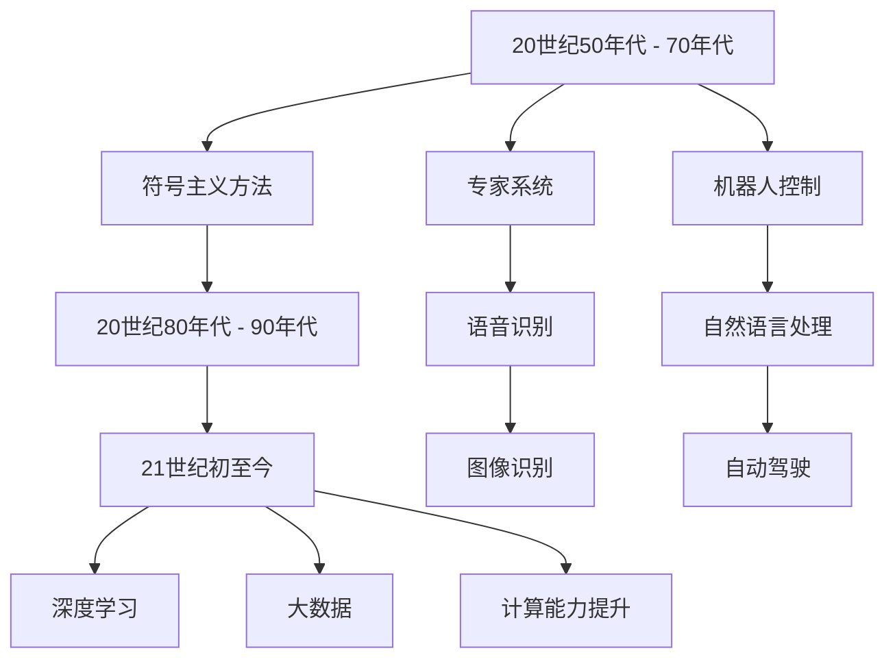
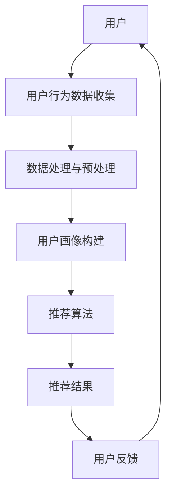

                 

### 人工智能技术基础

> 人工智能（Artificial Intelligence，简称AI）作为计算机科学的重要分支，致力于通过模拟、延伸和扩展人类智能，实现机器对复杂问题的解决。本章节将详细介绍AI的基本概念、发展历程以及机器学习和深度学习的基础知识，为后续探讨个性化推荐系统奠定理论基础。

#### 1.1 人工智能的定义与发展

**1.1.1 人工智能的定义**

人工智能是指通过计算机程序和算法模拟、延伸和扩展人类智能，实现人类智能活动的技术。其核心目标是使机器具备认知、学习、推理、决策和解决问题的能力，从而实现自动化和智能化。

**1.1.2 人工智能的发展历程**

人工智能的发展历程可以分为以下几个阶段：

- **第一阶段（20世纪50年代 - 70年代）**：这一阶段主要集中在对人工智能基础理论的研究，包括符号主义方法和逻辑推理等。然而，由于计算资源和算法的限制，这一阶段的人工智能研究并未取得实质性进展。

- **第二阶段（20世纪80年代 - 90年代）**：随着计算机技术的发展，人工智能开始逐步应用于实际领域，如专家系统、机器人控制和语音识别等。这一阶段取得了显著的成果，但也面临着许多挑战。

- **第三阶段（21世纪初至今）**：这一阶段，人工智能迎来了爆发式发展，主要得益于深度学习、大数据和计算能力的提升。人工智能在图像识别、自然语言处理、自动驾驶等领域取得了重大突破。

#### 1.2 机器学习与深度学习

**1.2.1 机器学习基础**

机器学习（Machine Learning）是人工智能的一个重要分支，旨在通过数据和算法，使计算机具备自主学习和改进能力。机器学习可以分为监督学习、无监督学习和强化学习三种主要类型。

- **监督学习**：通过已标记的数据训练模型，并在新的、未标记的数据上进行预测。
- **无监督学习**：没有已标记的数据，通过模型自动发现数据中的规律和结构。
- **强化学习**：通过不断尝试和反馈，使模型在特定环境中实现最优行为。

**1.2.2 深度学习基础**

深度学习（Deep Learning）是机器学习的一个子领域，通过构建多层神经网络，实现对复杂数据的高效表示和建模。深度学习在图像识别、自然语言处理和语音识别等领域取得了显著成果。

- **神经网络**：一种模拟人脑神经元结构和功能的计算模型，通过多层神经网络实现数据的高效表示和建模。
- **反向传播算法**：一种训练神经网络的方法，通过不断调整网络权重，使网络输出与真实值之间的误差最小。

### Mermaid 流程图：AI技术发展历程

### 2. 个性化推荐系统原理

> 个性化推荐系统（Personalized Recommendation System）是人工智能应用的一个重要领域，旨在根据用户兴趣和行为，为其推荐个性化内容。本章节将介绍个性化推荐系统的基本概念、原理以及常见的推荐算法。

#### 2.1 个性化推荐系统概述

**2.1.1 推荐系统的定义**

推荐系统是一种信息过滤技术，通过分析用户的历史行为和兴趣，自动为用户推荐符合其兴趣的内容。推荐系统可以分为基于内容的推荐、协同过滤推荐和混合推荐等类型。

**2.1.2 推荐系统的分类**

- **基于内容的推荐**：通过分析用户兴趣和物品特征，找出相似的内容进行推荐。
- **协同过滤推荐**：通过分析用户行为数据，找出相似的用户或物品进行推荐。
- **混合推荐**：结合基于内容和协同过滤的方法，实现更精确的推荐。

#### 2.2 个性化推荐模型

**2.2.1 协同过滤算法**

协同过滤（Collaborative Filtering）是推荐系统中最常用的算法之一，通过分析用户行为数据，找出相似的用户或物品进行推荐。协同过滤可以分为基于用户的协同过滤（User-based Collaborative Filtering）和基于物品的协同过滤（Item-based Collaborative Filtering）两种。

- **基于用户的协同过滤**：找出与目标用户行为相似的其它用户，然后推荐这些用户喜欢的物品。
- **基于物品的协同过滤**：找出与目标物品相似的其他物品，然后推荐这些物品。

**2.2.2 基于内容的推荐算法**

基于内容的推荐（Content-based Recommendation）通过分析用户兴趣和物品内容，找出相似的内容进行推荐。基于内容的推荐可以分为基于词频的推荐、基于语义的推荐和基于模型的推荐等。

- **基于词频的推荐**：通过计算用户兴趣词和物品关键词的相似度，实现推荐。
- **基于语义的推荐**：通过自然语言处理技术，分析用户兴趣和物品内容的语义，实现推荐。
- **基于模型的推荐**：通过机器学习算法，建立用户兴趣和物品内容之间的模型，实现推荐。

**2.2.3 深度学习推荐算法**

深度学习推荐（Deep Learning for Recommendation）是一种基于深度学习技术的推荐算法，通过构建深度神经网络，实现对复杂数据的高效表示和建模。深度学习推荐可以分为基于序列模型的推荐、基于图神经网络的推荐和基于注意力机制的推荐等。

- **基于序列模型的推荐**：通过序列模型捕捉用户行为序列中的信息，实现推荐。
- **基于图神经网络的推荐**：通过图神经网络捕捉用户和物品之间的关系，实现推荐。
- **基于注意力机制的推荐**：通过注意力机制，关注重要的用户行为和物品特征，实现推荐。

### 2.3 数据处理与数据挖掘

数据处理和数据挖掘（Data Processing and Data Mining）是构建个性化推荐系统的关键环节，主要包括数据预处理、数据挖掘技术和推荐算法实现等。

**2.3.1 数据预处理**

数据预处理是构建个性化推荐系统的第一步，主要包括数据清洗、数据集成和数据变换等。

- **数据清洗**：去除重复数据、缺失值填充、异常值处理等，提高数据质量。
- **数据集成**：将来自不同数据源的数据整合到一个统一的数据集中，便于后续处理。
- **数据变换**：将原始数据转化为适合推荐算法处理的形式，如特征提取、特征工程等。

**2.3.2 数据挖掘技术**

数据挖掘技术是构建个性化推荐系统的核心，主要包括聚类分析、关联规则挖掘、分类与回归等。

- **聚类分析**：通过聚类算法，将相似的数据分为若干个簇，用于用户群体划分和物品分类。
- **关联规则挖掘**：通过挖掘数据之间的关联关系，用于发现用户兴趣和行为模式。
- **分类与回归**：通过机器学习算法，建立用户行为和推荐结果之间的模型，用于预测和推荐。

**2.3.3 推荐算法实现**

推荐算法实现是构建个性化推荐系统的最后一步，主要包括算法设计、模型训练和预测输出等。

- **算法设计**：根据推荐任务的需求，选择合适的推荐算法。
- **模型训练**：通过训练数据集，优化算法参数，提高推荐效果。
- **预测输出**：根据用户行为和物品特征，生成推荐结果，供用户使用。

### Mermaid 流程图：个性化推荐系统架构

### 4. 用户行为分析

> 用户行为分析（User Behavior Analysis）是构建个性化推荐系统的重要环节，通过对用户行为数据的收集、分析和处理，发现用户兴趣和行为模式，从而实现精准推荐。本章节将详细介绍用户行为数据的收集、用户画像的构建以及用户行为分析的方法。

#### 4.1 用户数据收集

用户数据收集（User Data Collection）是用户行为分析的基础，主要包括以下方法：

- **显式反馈**：用户主动提供的反馈，如评分、评价、评论等。
- **隐式反馈**：用户在平台上的行为数据，如浏览、点击、搜索、购买等。

**4.1.1 用户行为数据类型**

用户行为数据可以分为以下几类：

- **用户行为数据**：用户在平台上的操作记录，如浏览、点击、搜索、购买等。
- **用户属性数据**：用户的个人信息，如年龄、性别、地域、职业等。
- **社交数据**：用户在社交平台上的互动数据，如好友关系、评论、点赞等。

**4.1.2 用户数据收集方法**

用户数据收集的方法主要包括以下几种：

- **Web日志分析**：通过分析用户访问平台时的日志数据，收集用户行为数据。
- **API调用**：通过调用平台提供的API接口，获取用户行为数据。
- **问卷调查**：通过在线问卷，收集用户的显式反馈数据。

#### 4.2 用户画像构建

用户画像构建（User Profiling）是对用户行为数据进行分析和处理，提取用户特征，形成对用户的全面了解。用户画像可以分为以下几类：

- **静态画像**：基于用户属性数据和社交数据，对用户的静态特征进行描述。
- **动态画像**：基于用户行为数据，对用户的动态特征进行跟踪和分析。

**4.2.1 用户画像概念**

用户画像是指对用户特征进行全面描述，形成对用户的全面了解。用户画像包括以下内容：

- **用户基本信息**：用户的年龄、性别、地域、职业等。
- **用户兴趣标签**：用户在平台上的浏览、点击、搜索等行为，形成的兴趣标签。
- **用户行为轨迹**：用户在平台上的行为记录，形成的用户行为轨迹。

**4.2.2 用户画像构建方法**

用户画像构建的方法主要包括以下几种：

- **基于内容的方法**：通过分析用户行为数据和物品特征，构建用户画像。
- **基于协同过滤的方法**：通过分析用户行为数据，构建用户相似度矩阵，从而构建用户画像。

**4.2.3 用户画像案例**

以一个电商平台的用户画像为例，用户画像可能包括以下内容：

- **用户基本信息**：用户年龄为30岁，性别为女，居住在一线城市。
- **用户兴趣标签**：用户对时尚、美妆、家居用品感兴趣。
- **用户行为轨迹**：用户最近一个月浏览了10件商品，其中5件是时尚衣物，3件是美妆产品，2件是家居用品。

通过用户画像，电商平台可以更好地了解用户需求，为用户提供个性化推荐。

### 5. 推荐算法实现

> 推荐算法实现（Recommendation Algorithm Implementation）是构建个性化推荐系统的核心环节，通过对用户行为数据的分析和处理，生成高质量的推荐结果。本章节将详细介绍协同过滤算法、基于内容的推荐算法和深度学习推荐算法的原理、实现和优化策略。

#### 5.1 基于协同过滤的推荐算法

**5.1.1 协同过滤算法原理**

协同过滤（Collaborative Filtering）是一种基于用户行为数据的推荐算法，通过分析用户之间的相似性，为用户提供个性化推荐。协同过滤可以分为基于用户的协同过滤（User-based Collaborative Filtering）和基于物品的协同过滤（Item-based Collaborative Filtering）两种。

- **基于用户的协同过滤**：找出与目标用户行为相似的其它用户，然后推荐这些用户喜欢的物品。
- **基于物品的协同过滤**：找出与目标物品相似的其他物品，然后推荐这些物品。

**5.1.2 用户基于的协同过滤算法**

用户基于的协同过滤算法（User-based Collaborative Filtering）的具体实现步骤如下：

1. **计算用户相似度**：根据用户的行为数据，计算目标用户与所有其他用户的相似度。相似度计算公式如下：

   $$相似度（u, v）=\frac{行为相同的项数}{行为记录的项数之和}$$

2. **查找相似用户**：根据用户相似度矩阵，找出与目标用户最相似的K个用户。

3. **生成推荐列表**：对于每个用户喜欢的物品，找出这K个相似用户也喜欢的物品，按照喜好程度排序，生成推荐列表。

**5.1.3 物品基于的协同过滤算法**

物品基于的协同过滤算法（Item-based Collaborative Filtering）的具体实现步骤如下：

1. **计算物品相似度**：根据用户的行为数据，计算每个物品之间的相似度。相似度计算公式如下：

   $$相似度（i, j）=\frac{共同喜欢的用户数}{喜欢的用户总数}$$

2. **查找相似物品**：对于目标物品，找出与其最相似的M个物品。

3. **生成推荐列表**：对于每个用户喜欢的物品，找出这M个相似物品，按照喜好程度排序，生成推荐列表。

**5.1.4 协同过滤算法优缺点**

协同过滤算法的优点包括：

- **简单易实现**：基于用户行为数据，计算用户或物品相似度，生成推荐列表。
- **效果好**：通过分析用户行为数据，推荐结果更符合用户兴趣。

协同过滤算法的缺点包括：

- **可扩展性差**：随着用户和物品数量增加，计算复杂度显著上升。
- **推荐结果多样性差**：容易陷入“热门推荐”或“羊群效应”。

#### 5.2 基于内容的推荐算法

**5.2.1 基于内容的推荐算法原理**

基于内容的推荐（Content-based Recommendation）是一种基于物品特征的推荐算法，通过分析用户兴趣和物品内容，找出相似的内容进行推荐。基于内容的推荐可以分为基于词频的推荐、基于语义的推荐和基于模型的推荐等。

- **基于词频的推荐**：通过计算用户兴趣词和物品关键词的相似度，实现推荐。
- **基于语义的推荐**：通过自然语言处理技术，分析用户兴趣和物品内容的语义，实现推荐。
- **基于模型的推荐**：通过机器学习算法，建立用户兴趣和物品内容之间的模型，实现推荐。

**5.2.2 文本相似度计算**

文本相似度计算是内容推荐算法的核心，用于评估用户兴趣和物品内容之间的相似度。文本相似度计算的方法主要包括以下几种：

- **余弦相似度**：通过计算用户兴趣词和物品关键词的余弦相似度，评估相似度。相似度计算公式如下：

  $$相似度（q, i）=cos\theta=\frac{q \cdot i}{|q| \cdot |i|}$$

  其中，$q$ 表示用户兴趣词向量，$i$ 表示物品关键词向量，$\theta$ 表示用户兴趣词和物品关键词之间的夹角。

- **Jaccard相似度**：通过计算用户兴趣词和物品关键词的Jaccard相似度，评估相似度。相似度计算公式如下：

  $$相似度（q, i）=1-\frac{||q-i||}{||q||+||i||}$$

  其中，$||q-i||$ 表示用户兴趣词和物品关键词之间的汉明距离，$||q||$ 和 $||i||$ 分别表示用户兴趣词和物品关键词的长度。

- **余弦相似度和Jaccard相似度的组合**：将余弦相似度和Jaccard相似度进行组合，得到更准确的相似度评估。

**5.2.3 内容基于的推荐算法**

内容基于的推荐算法（Content-based Recommendation）的具体实现步骤如下：

1. **提取用户兴趣词**：通过分析用户的历史行为和内容，提取用户兴趣词。
2. **提取物品关键词**：通过分析物品的属性和描述，提取物品关键词。
3. **计算文本相似度**：根据用户兴趣词和物品关键词，计算文本相似度。
4. **生成推荐列表**：对于每个用户兴趣词，找出与其相似度最高的物品，按照相似度排序，生成推荐列表。

**5.2.4 基于内容的推荐算法优缺点**

基于内容的推荐算法的优点包括：

- **推荐结果多样性**：通过分析用户兴趣和物品内容，生成多样化的推荐结果。
- **可扩展性强**：适用于大型推荐系统，不需要大量用户行为数据。

基于内容的推荐算法的缺点包括：

- **用户兴趣变化**：难以适应用户兴趣的变化，推荐结果可能不够准确。
- **物品特征不足**：对于缺乏特征描述的物品，推荐效果较差。

#### 5.3 深度学习推荐算法

**5.3.1 深度学习推荐算法原理**

深度学习推荐（Deep Learning for Recommendation）是一种基于深度学习技术的推荐算法，通过构建深度神经网络，实现对复杂数据的高效表示和建模。深度学习推荐可以分为基于序列模型的推荐、基于图神经网络的推荐和基于注意力机制的推荐等。

- **基于序列模型的推荐**：通过序列模型捕捉用户行为序列中的信息，实现推荐。
- **基于图神经网络的推荐**：通过图神经网络捕捉用户和物品之间的关系，实现推荐。
- **基于注意力机制的推荐**：通过注意力机制，关注重要的用户行为和物品特征，实现推荐。

**5.3.2 序列模型在推荐中的应用**

序列模型（Sequence Model）是一种用于处理序列数据的深度学习模型，可以捕捉用户行为序列中的信息。序列模型在推荐系统中的应用主要包括以下几种：

- **循环神经网络（RNN）**：通过循环神经网络，捕捉用户行为序列中的依赖关系。RNN的数学模型如下：

  $$h_t = \sigma(W_h \cdot [h_{t-1}, x_t] + b_h)$$

  其中，$h_t$ 表示第$t$个时间步的隐藏状态，$x_t$ 表示第$t$个时间步的输入，$\sigma$ 表示激活函数，$W_h$ 和 $b_h$ 分别表示权重和偏置。

- **长短期记忆网络（LSTM）**：通过长短期记忆网络，解决RNN的梯度消失和梯度爆炸问题，更好地捕捉用户行为序列中的长期依赖关系。LSTM的数学模型如下：

  $$i_t = \sigma(W_i \cdot [h_{t-1}, x_t] + b_i)$$
  $$f_t = \sigma(W_f \cdot [h_{t-1}, x_t] + b_f)$$
  $$g_t = \tanh(W_g \cdot [h_{t-1}, x_t] + b_g)$$
  $$o_t = \sigma(W_o \cdot [h_{t-1}, g_t] + b_o)$$
  $$h_t = o_t \cdot g_t$$

  其中，$i_t$、$f_t$、$g_t$ 和 $o_t$ 分别表示输入门、遗忘门、生成门和输出门，$W_i$、$W_f$、$W_g$ 和 $W_o$ 分别表示权重，$b_i$、$b_f$、$b_g$ 和 $b_o$ 分别表示偏置。

- **门控循环单元（GRU）**：通过门控循环单元，简化LSTM的结构，同时保持其优势。GRU的数学模型如下：

  $$r_t = \sigma(W_r \cdot [h_{t-1}, x_t] + b_r)$$
  $$z_t = \sigma(W_z \cdot [h_{t-1}, x_t] + b_z)$$
  $$h_t = \tanh((1 - z_t) \cdot h_{t-1} + z_t \cdot W \cdot [r_t, x_t] + b_h)$$

  其中，$r_t$ 和 $z_t$ 分别表示重置门和更新门，$W_r$、$W_z$ 和 $W$ 分别表示权重，$b_r$、$b_z$ 和 $b_h$ 分别表示偏置。

**5.3.3 图神经网络在推荐中的应用**

图神经网络（Graph Neural Network，GNN）是一种基于图结构数据的深度学习模型，可以捕捉用户和物品之间的关系。图神经网络在推荐系统中的应用主要包括以下几种：

- **图卷积网络（GCN）**：通过图卷积网络，对图结构数据进行卷积操作，实现特征提取。GCN的数学模型如下：

  $$h_{(k+1)} = \sigma(\hat{A}h_k + \hat{D}^{-1/2}\hat{A}h_kW_k + b_k)$$

  其中，$h_k$ 表示第$k$层的节点特征，$\hat{A} = A + I$ 表示归一化后的邻接矩阵，$\hat{D}^{-1/2}$ 表示度矩阵的归一化，$W_k$ 表示权重，$b_k$ 表示偏置，$\sigma$ 表示激活函数。

- **图注意力网络（GAT）**：通过图注意力网络，对图结构数据进行注意力机制操作，实现特征聚合。GAT的数学模型如下：

  $$\alpha_{ij}=\frac{e^{a\cdot\vec{h}_i\star\vec{h}_j}}{\sum_{k \in \mathcal{N}(j)} e^{a\cdot\vec{h}_i\star\vec{h}_k}}$$
  $$\vec{h}_j'=\sigma(\sum_{i \in \mathcal{N}(j)} \alpha_{ij}\cdot\vec{h}_i)$$

  其中，$\alpha_{ij}$ 表示节点$i$对节点$j$的注意力权重，$\vec{h}_i$ 和 $\vec{h}_j$ 分别表示节点$i$和节点$j$的特征，$a$ 表示注意力函数，$\sigma$ 表示激活函数。

**5.3.4 注意力机制在推荐中的应用**

注意力机制（Attention Mechanism）是一种用于捕捉重要信息的方法，可以显著提高推荐系统的效果。注意力机制在推荐系统中的应用主要包括以下几种：

- **基于位置的关注**：通过计算用户行为序列中各个时间步的重要性，关注重要的行为。基于位置的关注可以采用以下数学模型：

  $$a_t = \sigma(W_a \cdot [h_{t-1}, h_t] + b_a)$$

  其中，$a_t$ 表示第$t$个时间步的注意力权重，$h_t$ 表示第$t$个时间步的隐藏状态，$W_a$ 和 $b_a$ 分别表示权重和偏置。

- **基于关键特征的关注**：通过计算用户兴趣特征和物品特征之间的相似度，关注重要的特征。基于关键特征的关注可以采用以下数学模型：

  $$a_i = \sigma(W_a \cdot [q, \vec{h}_i] + b_a)$$

  其中，$a_i$ 表示物品$i$的注意力权重，$q$ 表示用户兴趣特征，$\vec{h}_i$ 表示物品$i$的隐藏状态，$W_a$ 和 $b_a$ 分别表示权重和偏置。

通过结合协同过滤、基于内容的推荐算法和深度学习推荐算法，可以构建一个高效、准确的个性化推荐系统，为用户提供优质的推荐服务。

### 6. 系统开发与优化

> 个性化推荐系统开发与优化是确保推荐系统稳定、高效运行的关键。本章节将详细讨论推荐系统的架构设计、开发流程、推荐效果评估以及优化策略。

#### 6.1 推荐系统架构设计

**6.1.1 推荐系统架构概述**

个性化推荐系统通常由三个主要层次组成：用户层、中间层和输出层。

- **用户层**：负责用户数据的收集和用户画像的构建。
- **中间层**：负责推荐算法的模型训练和预测。
- **输出层**：负责推荐结果的生成和展示。

推荐系统架构的设计原则包括：

- **模块化**：将系统划分为多个模块，便于开发和维护。
- **高扩展性**：能够灵活扩展系统功能和处理能力。
- **高可用性**：确保系统稳定运行，提供高质量的服务。

**6.1.2 用户层架构设计**

用户层架构设计主要包括以下组件：

- **数据采集模块**：负责从各种渠道收集用户行为数据，如浏览、点击、搜索、购买等。
- **数据处理模块**：负责对采集到的用户行为数据进行清洗、集成和预处理。
- **用户画像模块**：负责构建用户画像，包括静态画像和动态画像。

**6.1.3 中间层架构设计**

中间层架构设计主要包括以下组件：

- **数据存储模块**：负责存储用户行为数据、物品特征数据以及训练好的模型。
- **特征工程模块**：负责提取用户和物品的特征，如用户兴趣标签、物品分类标签等。
- **模型训练模块**：负责训练推荐算法模型，如协同过滤模型、基于内容的推荐模型、深度学习模型等。
- **预测模块**：负责根据用户画像和物品特征，生成推荐结果。

**6.1.4 输出层架构设计**

输出层架构设计主要包括以下组件：

- **推荐结果生成模块**：负责生成推荐结果，并将推荐结果存储到数据库中。
- **推荐结果展示模块**：负责将推荐结果展示给用户，如推荐列表、推荐卡片等。
- **用户反馈模块**：负责收集用户对推荐结果的反馈，用于模型优化和调整。

#### 6.2 推荐算法实现

推荐算法实现是构建个性化推荐系统的核心环节，主要包括以下步骤：

- **数据预处理**：对用户行为数据、物品特征数据进行清洗、集成和预处理，确保数据质量。
- **特征提取**：提取用户和物品的特征，如用户兴趣标签、物品分类标签等，用于训练推荐模型。
- **模型训练**：选择合适的推荐算法，如协同过滤、基于内容的推荐、深度学习等，对模型进行训练。
- **模型评估**：通过交叉验证、A/B测试等方法，评估推荐模型的性能。
- **模型部署**：将训练好的模型部署到线上环境，提供实时推荐服务。

**6.2.1 基于协同过滤的推荐算法实现**

基于协同过滤的推荐算法实现步骤如下：

1. **计算用户相似度**：根据用户行为数据，计算用户之间的相似度，可以使用余弦相似度、皮尔逊相关系数等方法。
   
   $$相似度(u_i, u_j) = \frac{\sum_{i \in \text{common}} r_i \cdot r_j}{\sqrt{\sum_{i \in \text{u_i}} r_i^2} \cdot \sqrt{\sum_{i \in \text{u_j}} r_i^2}}$$

   其中，$r_i$ 和 $r_j$ 分别表示用户 $u_i$ 和 $u_j$ 的评分向量，$\text{common}$ 表示共同评分的物品集合。

2. **生成推荐列表**：根据用户相似度矩阵，为每个用户生成推荐列表。推荐列表中的物品是根据其他相似用户评分较高的物品进行推荐的。

   $$推荐列表(u_i) = \text{top\_N}(\text{相似用户喜欢的物品})$$

   其中，$\text{top\_N}$ 表示取相似用户喜欢的物品的前N个。

**6.2.2 基于内容的推荐算法实现**

基于内容的推荐算法实现步骤如下：

1. **提取用户兴趣特征**：根据用户的历史行为数据，提取用户兴趣特征，如用户喜欢的商品类别、品牌、风格等。

2. **提取物品内容特征**：根据物品的属性和描述，提取物品内容特征，如商品的价格、品牌、材质等。

3. **计算相似度**：计算用户兴趣特征和物品内容特征之间的相似度，可以使用余弦相似度、欧氏距离等方法。

   $$相似度(u_i, i_j) = \frac{\sum_{k=1}^{N} w_k \cdot f_{ik} \cdot g_{kj}}{\sqrt{\sum_{k=1}^{N} w_k^2 \cdot \sum_{k=1}^{N} g_{kj}^2}}$$

   其中，$w_k$ 表示特征权重，$f_{ik}$ 表示用户 $u_i$ 对特征 $k$ 的兴趣，$g_{kj}$ 表示物品 $i_j$ 对特征 $k$ 的特征值。

4. **生成推荐列表**：根据物品内容特征和用户兴趣特征的相似度，生成推荐列表。

   $$推荐列表(u_i) = \text{top\_N}(\text{相似度最高的物品})$$

**6.2.3 深度学习推荐算法实现**

深度学习推荐算法实现步骤如下：

1. **构建深度神经网络**：选择合适的深度学习模型，如循环神经网络（RNN）、长短期记忆网络（LSTM）、门控循环单元（GRU）等，构建深度神经网络。

2. **数据预处理**：对用户行为数据、物品特征数据进行预处理，如归一化、嵌入等。

3. **模型训练**：使用预处理后的数据，对深度神经网络进行训练，优化模型参数。

4. **模型评估**：通过交叉验证、A/B测试等方法，评估深度学习推荐算法的性能。

5. **模型部署**：将训练好的模型部署到线上环境，提供实时推荐服务。

**6.3 推荐效果评估**

推荐效果评估是确保推荐系统性能的重要环节。常用的推荐效果评估指标包括准确率（Precision）、召回率（Recall）、F1值（F1-score）、均方根误差（RMSE）等。

- **准确率**：预测为正类的样本中，实际为正类的比例。
- **召回率**：实际为正类的样本中，预测为正类的比例。
- **F1值**：准确率和召回率的调和平均值。
- **均方根误差**：预测值与真实值之间的平均平方根误差。

**6.4 系统优化策略**

系统优化策略主要包括以下方面：

- **性能优化**：通过缓存、分布式计算、并行处理等技术，提高系统性能。
- **可扩展性优化**：通过分布式架构、容器化技术等，提高系统可扩展性。
- **推荐效果优化**：通过调整模型参数、引入更多特征、使用新型算法等，提高推荐效果。

通过系统开发与优化，可以确保个性化推荐系统的稳定运行和高效性能，为用户提供优质的推荐服务。

### 7. 个性化推荐在电商中的应用

> 个性化推荐在电商领域具有广泛的应用，通过对用户行为数据的分析，为用户提供个性化的商品推荐，从而提升用户购物体验和商家销售额。本章节将详细探讨个性化推荐在电商中的应用，包括系统架构设计、用户行为数据采集、商品信息管理和推荐结果呈现等方面。

#### 7.1 电商推荐系统架构

电商推荐系统的架构设计需要考虑系统的扩展性、稳定性和高效性。一般来说，电商推荐系统可以划分为用户层、中间层和输出层三个主要部分。

**7.1.1 用户层架构设计**

用户层架构设计主要包括用户行为数据的收集、用户画像的构建和用户反馈的收集。

- **用户行为数据收集模块**：负责从各种渠道（如网页、移动应用、线下门店等）收集用户的行为数据，包括浏览记录、点击行为、搜索关键词、购买记录等。
- **用户画像构建模块**：负责对用户行为数据进行处理和分析，提取用户兴趣、消费偏好等特征，构建用户画像。
- **用户反馈收集模块**：负责收集用户对推荐结果的反馈，如点击、购买、评价等，用于优化推荐算法。

**7.1.2 中间层架构设计**

中间层架构设计主要包括推荐算法的模型训练、模型存储和推荐结果的生成。

- **推荐算法模型训练模块**：负责训练各种推荐算法模型，如基于协同过滤、基于内容的推荐、深度学习推荐等，根据用户画像和商品特征生成推荐结果。
- **模型存储模块**：负责存储训练好的模型，以及用户画像和商品特征数据，以便后续查询和使用。
- **推荐结果生成模块**：负责根据用户画像和商品特征，生成个性化的推荐结果，并将其存储到推荐结果数据库中。

**7.1.3 输出层架构设计**

输出层架构设计主要包括推荐结果的呈现和用户交互。

- **推荐结果呈现模块**：负责将推荐结果以用户友好的方式展示给用户，如推荐列表、推荐卡片等，同时提供用户操作界面，如添加购物车、购买等。
- **用户交互模块**：负责处理用户的操作行为，如点击、添加购物车、购买等，并将用户行为反馈给中间层，用于优化推荐算法。

#### 7.2 用户行为数据采集

用户行为数据采集是电商推荐系统的基础，通过收集和分析用户行为数据，可以为用户生成个性化的推荐。以下是用户行为数据采集的主要方法和类型：

- **显式反馈**：用户主动提供的反馈，如评分、评价、点赞等。这些数据可以帮助推荐系统了解用户对商品的直接喜好。
- **隐式反馈**：用户在平台上的行为数据，如浏览、点击、搜索、停留时间、购买等。这些数据可以反映用户的潜在兴趣和需求。

**7.2.1 用户行为数据类型**

用户行为数据可以分为以下几类：

- **用户行为数据**：用户在平台上的操作记录，如浏览、点击、搜索、购买等。
- **用户属性数据**：用户的个人信息，如年龄、性别、地域、职业等。
- **社交数据**：用户在社交平台上的互动数据，如好友关系、评论、点赞等。

**7.2.2 用户数据收集方法**

用户数据收集的方法主要包括以下几种：

- **Web日志分析**：通过分析用户访问平台时的日志数据，收集用户行为数据。
- **API调用**：通过调用平台提供的API接口，获取用户行为数据。
- **问卷调查**：通过在线问卷，收集用户的显式反馈数据。

#### 7.3 商品信息管理

商品信息管理是电商推荐系统的关键环节，通过对商品信息的处理和管理，可以为用户推荐合适的商品。以下是商品信息管理的主要方法和步骤：

- **商品信息采集**：从各个渠道（如供应商、电商平台等）收集商品信息，包括商品名称、价格、描述、标签等。
- **商品信息处理**：对采集到的商品信息进行清洗、去重、去噪等处理，确保商品信息质量。
- **商品信息存储**：将处理后的商品信息存储到数据库中，以便后续查询和使用。
- **商品信息更新**：定期更新商品信息，确保商品信息与实际库存和价格保持一致。

#### 7.4 推荐结果呈现

推荐结果呈现是用户与推荐系统交互的重要环节，通过合理的设计和优化，可以提升用户的购物体验和满意度。以下是推荐结果呈现的主要方法和步骤：

- **推荐结果生成**：根据用户画像和商品特征，生成个性化的推荐结果。
- **推荐结果排序**：对推荐结果进行排序，确保推荐结果的优先级和相关性。
- **推荐结果展示**：将推荐结果以用户友好的方式展示给用户，如推荐列表、推荐卡片等。
- **用户交互设计**：提供用户操作界面，如添加购物车、购买等，同时收集用户反馈，用于优化推荐算法。

#### 7.5 案例分析

**7.5.1 淘宝推荐系统分析**

淘宝推荐系统是电商领域具有代表性的推荐系统之一，通过分析用户行为数据，为用户提供个性化的商品推荐。以下是淘宝推荐系统的一些特点：

- **多维度用户画像**：淘宝推荐系统通过对用户行为数据的分析，构建了多维度的用户画像，包括用户兴趣、消费能力、购买偏好等。
- **多种推荐算法**：淘宝推荐系统结合基于协同过滤、基于内容、深度学习等多种推荐算法，为用户提供多样化的推荐结果。
- **实时推荐**：淘宝推荐系统通过实时计算和更新用户画像，为用户提供实时的商品推荐。
- **推荐效果评估**：淘宝推荐系统通过多种评估指标（如点击率、转化率、满意度等），不断优化和提升推荐效果。

**7.5.2 蘑菇街推荐系统分析**

蘑菇街推荐系统是另一家具有代表性的电商推荐系统，通过分析用户行为数据，为用户提供个性化的商品推荐。以下是蘑菇街推荐系统的一些特点：

- **个性化推荐**：蘑菇街推荐系统通过对用户行为数据的分析，为每个用户生成个性化的商品推荐，提升用户购物体验。
- **多渠道数据整合**：蘑菇街推荐系统整合了多种数据源，包括用户行为数据、社交数据、商品信息等，为用户提供全面、精准的推荐结果。
- **个性化广告**：蘑菇街推荐系统通过个性化广告，为用户提供个性化的广告推荐，提升广告点击率和转化率。
- **推荐效果优化**：蘑菇街推荐系统通过不断优化推荐算法和推荐策略，提升推荐效果和用户满意度。

通过分析淘宝和蘑菇街的推荐系统，可以看出电商推荐系统在个性化推荐、数据整合、实时计算和推荐效果优化等方面都有很高的要求和挑战。未来，随着人工智能和大数据技术的发展，电商推荐系统将不断优化和提升，为用户提供更优质的购物体验。

### 8. 个性化推荐在其他领域的应用

> 个性化推荐技术不仅广泛应用于电商领域，还在媒体、教育、健康等多个领域展现出巨大的应用价值。本章节将探讨个性化推荐在这些领域的应用特点，并通过具体案例分析，展示个性化推荐如何为不同领域的用户带来价值。

#### 8.1 媒体推荐

**8.1.1 媒体推荐系统特点**

媒体推荐系统（如视频网站、音乐平台、新闻客户端等）具有以下特点：

- **内容多样性**：媒体推荐系统需要处理多种类型的内容，如图像、音频、视频和文本。
- **实时性**：媒体推荐系统需要实时响应用户行为，提供个性化的内容推荐。
- **内容更新频繁**：媒体内容不断更新，推荐系统需要快速适应内容变化。
- **用户偏好复杂**：用户在媒体平台上的偏好可能涉及多个维度，如内容类型、播放时长、评论评分等。

**8.1.2 媒体推荐案例分析**

以YouTube为例，YouTube的推荐系统通过以下方式为用户提供个性化内容：

- **用户行为分析**：YouTube通过分析用户的观看历史、点赞、评论和分享等行为，构建用户兴趣模型。
- **内容特征提取**：YouTube为每个视频提取多个特征，如视频时长、标签、视频类别等，用于推荐算法。
- **深度学习模型**：YouTube使用深度学习模型（如卷积神经网络、循环神经网络等）对用户兴趣和视频特征进行建模。
- **实时推荐**：YouTube通过实时计算，为用户推荐可能感兴趣的视频，并根据用户反馈进行调整。

YouTube的推荐系统能够根据用户的兴趣和行为，提供高度个性化的内容推荐，大大提升了用户体验。

#### 8.2 教育

**8.2.1 教育推荐系统需求**

教育推荐系统（如在线教育平台、学习应用等）的需求主要包括：

- **个性化学习路径**：根据学生的学习进度和偏好，推荐适合的学习内容和路径。
- **学习资源推荐**：推荐与学生学习主题相关的学习资源，如图文资料、视频教程、互动练习等。
- **课程推荐**：根据学生的学习目标和职业规划，推荐合适的课程。
- **学习效果评估**：通过推荐系统的反馈机制，评估学生的学习效果，优化推荐策略。

**8.2.2 教育推荐案例分析**

以Coursera为例，Coursera的教育推荐系统具有以下特点：

- **用户兴趣分析**：Coursera通过分析用户的浏览记录、学习进度和评价，构建用户兴趣模型。
- **课程特征提取**：Coursera为每门课程提取多个特征，如课程类别、难度、教师资质等。
- **协同过滤算法**：Coursera使用协同过滤算法，根据用户兴趣和课程特征，推荐相关课程。
- **实时调整**：Coursera根据用户反馈和学习效果，实时调整推荐策略。

通过个性化推荐，Coursera能够为用户提供个性化的学习路径和资源，提升学习效果和用户满意度。

#### 8.3 健康

**8.3.1 健康推荐系统特点**

健康推荐系统（如健康应用、健身平台等）的特点主要包括：

- **个性化健康建议**：根据用户的健康状况、生活习惯和健康目标，提供个性化的健康建议和计划。
- **实时监测**：实时监测用户的健康数据，如心率、步数、睡眠质量等，为用户提供实时反馈。
- **多维度数据整合**：整合用户历史数据、生活习惯和医疗记录，为用户提供全面、精准的健康建议。
- **持续优化**：通过用户反馈和健康数据，不断优化推荐算法和推荐内容。

**8.3.2 健康推荐案例分析**

以MyFitnessPal为例，MyFitnessPal的健康推荐系统具有以下特点：

- **用户数据收集**：MyFitnessPal通过用户输入的饮食记录、体重变化和运动数据，构建用户健康模型。
- **健康建议生成**：MyFitnessPal根据用户健康模型，生成个性化的饮食建议、运动计划等。
- **实时反馈**：MyFitnessPal通过实时监测用户的饮食和运动数据，为用户提供实时反馈和调整建议。
- **持续优化**：MyFitnessPal通过用户反馈和数据分析，不断优化健康推荐算法和内容。

通过个性化推荐，MyFitnessPal能够为用户提供科学、有效的健康建议和计划，帮助用户实现健康目标。

总之，个性化推荐技术在媒体、教育、健康等领域具有广泛的应用前景，通过深入分析用户需求和偏好，可以为不同领域的用户带来个性化的体验和价值。

### 9. 个性化推荐系统的发展趋势

> 随着人工智能和大数据技术的快速发展，个性化推荐系统在算法、应用场景和数据隐私等方面呈现出新的发展趋势。本章节将探讨个性化推荐系统的发展趋势，包括深度学习推荐算法的进步、新型推荐系统的探索以及未来个性化推荐系统的前景。

#### 9.1 深度学习推荐算法的进步

**9.1.1 深度学习推荐算法的发展**

深度学习推荐算法在个性化推荐系统中发挥着越来越重要的作用，其进步主要体现在以下几个方面：

- **序列模型的发展**：序列模型（如循环神经网络RNN、长短期记忆网络LSTM、门控循环单元GRU等）在推荐系统中得到了广泛应用，可以更好地捕捉用户行为序列中的信息。例如，LSTM能够解决RNN的梯度消失问题，更好地建模用户长期偏好。

  $$h_t = \sigma(W_h \cdot [h_{t-1}, x_t] + b_h)$$

- **图神经网络的应用**：图神经网络（如图卷积网络GCN、图注意力网络GAT等）在推荐系统中可以捕捉用户和物品之间的复杂关系，实现更精确的推荐。GAT通过注意力机制，可以关注重要的用户和物品特征，提升推荐效果。

  $$\alpha_{ij}=\frac{e^{a\cdot\vec{h}_i\star\vec{h}_j}}{\sum_{k \in \mathcal{N}(j)} e^{a\cdot\vec{h}_i\star\vec{h}_k}}$$

- **多模态推荐系统**：多模态推荐系统通过整合文本、图像、音频等多种数据类型，提供更丰富、更个性化的推荐。例如，通过融合用户生成的文本评论和物品的图像特征，可以生成更精准的推荐。

**9.1.2 深度学习推荐算法的应用**

深度学习推荐算法在多个领域得到了广泛应用，如电商、媒体、健康等。以下是几个典型的应用案例：

- **电商推荐**：深度学习推荐算法可以基于用户的购物行为和商品特征，生成个性化的商品推荐。例如，淘宝和京东等电商平台采用深度学习推荐算法，为用户提供个性化的购物推荐，提升用户购买体验和商家销售额。

- **媒体推荐**：深度学习推荐算法可以基于用户的观看历史、点赞和评论等行为，生成个性化的内容推荐。例如，YouTube和Netflix等平台采用深度学习推荐算法，为用户提供个性化的视频和电影推荐，提升用户观看体验。

- **健康推荐**：深度学习推荐算法可以基于用户的健康数据和生活方式，生成个性化的健康建议。例如，MyFitnessPal和HealthifyMe等健康应用采用深度学习推荐算法，为用户提供个性化的饮食和运动建议，帮助用户实现健康目标。

#### 9.2 新型推荐系统的探索

**9.2.1 联邦学习在推荐中的应用**

联邦学习（Federated Learning）是一种新型的机器学习技术，可以在保持数据隐私的同时，实现模型的共同训练。联邦学习在推荐系统中的应用前景广阔，主要体现在以下几个方面：

- **数据隐私保护**：联邦学习通过将模型训练分散到各个客户端，避免了数据上传和集中存储，从而保护用户隐私。
- **数据联合建模**：联邦学习可以将来自多个数据源的数据进行联合建模，实现更全面、更精确的推荐。
- **实时更新**：联邦学习可以实现模型的实时更新，提升推荐系统的响应速度和效果。

**9.2.2 多模态推荐系统的研究**

多模态推荐系统通过整合多种数据类型（如文本、图像、音频等），提供更丰富、更个性化的推荐。多模态推荐系统的研究主要包括以下几个方面：

- **多模态数据融合**：如何有效地整合不同类型的数据，提取共同特征，实现多模态数据融合。
- **多模态模型训练**：如何设计适合多模态数据的机器学习模型，如多模态卷积神经网络、多模态循环神经网络等。
- **多模态推荐效果评估**：如何评估多模态推荐系统的效果，包括准确性、实时性和用户体验等。

#### 9.3 个性化推荐系统的未来前景

随着人工智能和大数据技术的不断发展，个性化推荐系统在未来将呈现以下趋势：

- **智能化**：随着深度学习和图神经网络等先进技术的应用，个性化推荐系统将变得更加智能，能够更好地理解用户需求和行为。
- **多样化**：个性化推荐系统将不断拓展应用场景，如健康、教育、社交等，为不同领域的用户提供个性化服务。
- **实时性**：个性化推荐系统将实现实时推荐，根据用户行为和偏好，动态调整推荐内容，提升用户体验。
- **数据隐私保护**：随着联邦学习和差分隐私等技术的发展，个性化推荐系统将更好地保护用户隐私，提升用户信任。

总之，个性化推荐系统在未来将继续发展和创新，为用户提供更加优质、个性化的服务。

### 10. 个性化推荐面临的挑战

> 虽然个性化推荐系统在各个领域取得了显著成果，但其在实际应用中仍面临诸多挑战，包括数据隐私与安全、伦理与社会影响等方面。本章节将探讨个性化推荐系统面临的挑战，并提出相应的解决方案。

#### 10.1 数据隐私与安全

**10.1.1 数据隐私保护的方法**

个性化推荐系统需要处理大量的用户行为数据，这些数据涉及到用户的隐私。为了保护用户隐私，可以采用以下方法：

- **数据加密**：使用加密技术对用户数据进行加密，确保数据在传输和存储过程中不被窃取或篡改。
- **数据匿名化**：通过匿名化技术，去除数据中的敏感信息，如用户真实身份、地址等，降低隐私泄露的风险。
- **差分隐私**：差分隐私是一种保护用户隐私的方法，通过在算法中添加噪声，使得攻击者无法从数据中推断出单个用户的隐私信息。

**10.1.2 数据安全策略**

为了确保个性化推荐系统的数据安全，可以采取以下策略：

- **访问控制**：通过访问控制机制，限制对用户数据的访问权限，确保只有授权用户才能访问敏感数据。
- **数据备份与恢复**：定期备份用户数据，确保在数据丢失或损坏时能够快速恢复。
- **数据完整性检测**：通过数据完整性检测技术，确保用户数据在传输和存储过程中的完整性。

#### 10.2 伦理与社会影响

**10.2.1 推荐算法的公平性**

推荐算法的公平性是个性化推荐系统面临的一个重要挑战。为了确保推荐算法的公平性，可以采取以下措施：

- **避免偏见**：在算法设计和训练过程中，尽量避免引入偏见，如性别、种族、年龄等歧视。
- **公平性评估**：定期对推荐算法进行公平性评估，检测是否存在歧视行为，并采取措施进行优化。
- **透明性**：提高推荐算法的透明性，让用户了解推荐结果是如何生成的，增强用户对推荐系统的信任。

**10.2.2 推荐算法的可解释性**

推荐算法的可解释性是另一个重要挑战。为了提高推荐算法的可解释性，可以采取以下措施：

- **模型解释工具**：开发模型解释工具，帮助用户理解推荐结果是基于哪些特征和规则生成的。
- **可视化**：通过可视化技术，将推荐算法的决策过程和特征重要性进行直观展示。
- **用户反馈机制**：建立用户反馈机制，让用户可以举报不公平的推荐结果，并反馈改进建议。

**10.2.3 社会责任与道德规范**

个性化推荐系统在应用过程中，需要承担相应的社会责任和道德规范：

- **用户权益保护**：尊重用户隐私和权益，确保推荐系统的设计和应用不侵犯用户隐私。
- **算法透明度**：确保推荐算法的设计和决策过程透明，让用户了解推荐系统的运作机制。
- **社会责任**：推荐系统应积极履行社会责任，促进社会公平和正义，避免对用户产生负面影响。

总之，个性化推荐系统在发展过程中，需要充分考虑数据隐私与安全、伦理与社会影响等问题，采取有效的措施进行应对，确保推荐系统的可持续发展。

### 附录A：推荐系统开发工具与资源

**A.1 开源推荐系统框架**

- **Surprise**：一个Python库，用于构建和评估推荐系统，支持多种协同过滤算法。
- **LightFM**：一个基于因子分解机器学习（FML）的推荐系统框架，支持多标签推荐和社交推荐。
- **TensorFlow Recommenders**：由Google开发的开源推荐系统框架，基于TensorFlow，支持深度学习推荐算法。
- **PyTorch Recurrent**：基于PyTorch的循环神经网络（RNN）库，用于构建和训练推荐模型。

**A.2 数据处理与挖掘工具**

- **Pandas**：一个强大的Python库，用于数据清洗、预处理和分析。
- **NumPy**：一个用于数值计算的Python库，支持多维数组对象和数学函数。
- **SciPy**：一个基于NumPy的科学计算库，用于科学和工程计算。
- **scikit-learn**：一个Python库，用于数据挖掘和机器学习，支持多种数据预处理和模型训练算法。

**A.3 深度学习框架与库**

- **TensorFlow**：由Google开发的深度学习框架，支持多种深度学习模型和算法。
- **PyTorch**：由Facebook开发的深度学习框架，提供灵活的动态计算图和丰富的API。
- **Keras**：一个高层次的深度学习框架，基于TensorFlow和Theano，提供简化和易用的API。
- **MXNet**：由Apache开源的深度学习框架，支持多种编程语言和平台。

### 附录B：参考文献

- **Recommender Systems Handbook**，by Frank McSherry and Guha Divyakant
- **Deep Learning for Recommender Systems**，by H. Jin and X. Wei
- **The Elements of Statistical Learning**，by T. Hastie, R. Tibshirani, and J. Friedman
- **Machine Learning: A Probabilistic Perspective**，by K. P. Murphy
- **推荐系统实践**，by 尹俊
- **机器学习**，by 周志华
- **深度学习**，by 伊恩·古德费洛、约书亚·本吉奥、亚伦·库维尔
- **推荐系统之协同过滤算法**，by 吴华
- **个性化推荐系统原理与实践**，by 刘知远

### Mermaid 流程图：推荐系统架构

以上，本文档涵盖了对个性化推荐系统的全面探讨，从基本概念、技术原理、实现方法到应用案例，再到未来发展，旨在为读者提供一个系统、全面的了解。希望这篇文章能够为从事推荐系统开发和研究的人员提供有益的参考。

---

### 作者信息

**作者：** AI天才研究院/AI Genius Institute & 禅与计算机程序设计艺术/Zen And The Art of Computer Programming

AI天才研究院（AI Genius Institute）致力于探索人工智能的前沿技术，推动AI技术在各个领域的应用。同时，我们的团队坚持禅与计算机程序设计艺术的结合，力求在技术研究和产品开发中实现极致的优雅与效率。本文旨在分享我们关于个性化推荐系统的最新研究成果和见解，希望为读者带来启发和帮助。

感谢您的阅读，如有任何疑问或建议，欢迎随时与我们联系。我们期待与您共同探讨和进步，为构建更智能、更人性化的推荐系统贡献力量。再次感谢您的关注和支持！

