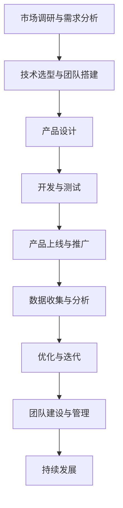

                 

# 如何在自动化创业中实现规模化增长

## 关键词
- 自动化创业
- 规模化增长
- 数据驱动决策
- 自动化流程优化
- 客户服务与支持
- 法律风险与合规
- 案例分析
- 未来发展趋势

## 摘要
随着技术的不断进步，自动化创业成为了一个热门的领域。本文将探讨如何在自动化创业中实现规模化增长。我们将首先概述自动化创业的定义和意义，分析其与传统创业的区别，然后深入探讨自动化创业模式的核心要素和实施步骤。接下来，我们将重点关注规模增长策略，包括数据驱动决策、自动化流程优化和用户增长策略。此外，文章还将讨论自动化创业中的营销策略、客户服务与支持、数据分析与优化、法律风险与合规等方面。最后，我们将通过案例分析展示成功经验和启示，并展望自动化创业的未来发展趋势。

## 第一部分：自动化创业基础

### 第1章：自动化创业概述

#### 1.1 自动化创业的定义与意义

自动化创业指的是利用先进技术，如人工智能、大数据分析、自动化流程等，来创建和运营企业，从而实现高效、低成本的商业模式。与传统的创业模式相比，自动化创业具有以下几方面的意义：

1. **提高效率**：自动化技术可以减少人工操作，提高工作效率，降低运营成本。
2. **增强竞争力**：通过自动化技术，企业可以在市场中迅速响应变化，提高竞争力。
3. **创新性**：自动化创业可以推动新技术、新产品的研发，促进产业升级。
4. **用户体验**：自动化技术可以提供更智能、更个性化的服务，提升用户体验。

#### 1.2 自动化创业的发展历程

自动化创业的发展可以分为以下几个阶段：

1. **初期阶段**：创业者利用简单的自动化工具，如机器人流程自动化（RPA），来提升效率。
2. **成长阶段**：随着人工智能技术的发展，创业者开始将人工智能技术应用于业务流程中，实现更高级的自动化。
3. **成熟阶段**：企业逐步实现全面自动化，从生产、销售到客户服务等多个环节都实现了高度自动化。

#### 1.3 自动化创业与传统创业的区别

自动化创业与传统创业的区别主要体现在以下几个方面：

1. **技术依赖**：传统创业主要依赖管理经验和市场洞察力，而自动化创业则高度依赖技术。
2. **运营模式**：传统创业往往需要大量人力进行运营，而自动化创业通过技术手段实现高效运营。
3. **成本结构**：传统创业的初期成本较高，而自动化创业的初期成本相对较低，但后续的维护和更新成本较高。

### 第2章：自动化创业模式

#### 2.1 自动化创业模式概述

自动化创业模式具有以下特点：

1. **高度集成**：企业通过集成各种自动化工具和技术，实现业务流程的自动化。
2. **数据驱动**：企业通过数据分析和挖掘，指导业务决策，实现精准营销和个性化服务。
3. **持续优化**：企业通过自动化流程的不断优化，提高运营效率和用户体验。

#### 2.2 自动化创业模式的核心要素

自动化创业模式的核心要素包括：

1. **人工智能技术**：包括机器学习、深度学习等，用于业务流程的自动化和优化。
2. **数据分析与挖掘**：用于从海量数据中提取有价值的信息，指导业务决策。
3. **自动化流程设计**：将业务流程中的手动操作转化为自动化操作，提高效率。

#### 2.3 自动化创业模式的实施步骤

自动化创业模式的实施步骤如下：

1. **市场调研与需求分析**：了解市场需求，确定自动化创业的方向。
2. **技术选型与团队搭建**：选择合适的自动化技术，组建专业团队。
3. **产品设计**：根据市场需求和技术能力，设计自动化产品。
4. **开发与测试**：实现产品功能，并进行严格测试。
5. **产品上线与推广**：将产品推向市场，进行推广和运营。

### 第3章：自动化创业中的规模增长策略

#### 3.1 规模增长的定义与意义

规模增长指的是企业在一定时间内，通过扩大市场份额、提高生产能力等方式，实现业务规模的扩大。规模增长对于自动化创业企业具有重要意义：

1. **提高竞争力**：规模增长可以提高企业在市场中的竞争力，占据更大的市场份额。
2. **增加收入**：规模增长可以带来更多的收入，为企业提供持续发展的动力。
3. **优化成本结构**：规模增长有助于优化企业的成本结构，提高盈利能力。

#### 3.2 自动化创业中的规模增长策略

自动化创业企业可以通过以下策略实现规模增长：

1. **数据驱动决策**：通过数据分析，准确把握市场趋势，制定有效的业务策略。
2. **自动化流程优化**：通过不断优化自动化流程，提高运营效率，降低成本。
3. **用户增长策略**：通过精准营销、用户推荐等方式，扩大用户群体。

#### 3.3 规模增长中的风险与挑战

规模增长过程中，自动化创业企业可能会面临以下风险和挑战：

1. **数据安全与隐私**：随着数据量的增加，数据安全与隐私保护成为一个重要问题。
2. **技术更新与升级**：技术更新速度加快，企业需要不断投入资源进行技术升级。
3. **人才招聘与培养**：随着规模扩大，企业需要招聘和培养更多专业人才。

### 第4章：自动化创业中的营销策略

#### 4.1 自动化营销的概念与优势

自动化营销是指利用自动化工具和技术，自动化执行营销活动的过程。自动化营销具有以下优势：

1. **提高效率**：自动化营销可以节省大量时间和人力资源，提高营销效率。
2. **精准定位**：通过数据分析和挖掘，可以更准确地定位目标客户，提高营销效果。
3. **个性化服务**：自动化营销可以根据用户行为和需求，提供个性化服务，提升用户体验。

#### 4.2 自动化营销的实施步骤

自动化营销的实施步骤如下：

1. **营销策略制定**：根据企业目标和市场情况，制定具体的营销策略。
2. **营销渠道选择**：选择合适的营销渠道，如社交媒体、电子邮件等。
3. **营销效果评估**：通过数据分析和评估，了解营销活动的效果，不断优化策略。

#### 4.3 自动化营销案例分析

1. **成功案例**：某电子商务公司通过自动化营销系统，实现了销售额的快速增长。该公司通过分析用户行为数据，精准定位目标客户，提供了个性化的营销活动，从而吸引了大量新客户。

2. **失败案例**：某初创公司由于缺乏对自动化营销工具的正确使用，导致大量潜在客户流失。该公司在实施自动化营销时，未能充分考虑用户需求和体验，导致营销效果不佳。

### 第5章：自动化创业中的客户服务与支持

#### 5.1 客户服务与支持的重要性

客户服务与支持是企业与客户之间的桥梁，对于企业的长期发展具有重要意义：

1. **提升客户满意度**：优质的客户服务与支持可以提升客户满意度，增强客户忠诚度。
2. **降低客户流失率**：良好的客户服务与支持可以减少客户流失，降低客户流失率。
3. **树立品牌形象**：优质的客户服务与支持可以树立企业良好的品牌形象，提升品牌价值。

#### 5.2 自动化客户服务与支持的方式

自动化客户服务与支持的方式包括：

1. **自动化客服系统**：通过自动化客服系统，实现客户咨询的自动回复和问题解决。
2. **客户自助服务**：通过在线帮助中心、知识库等，提供客户自助服务。
3. **社交媒体客服**：通过社交媒体平台，提供实时在线客服。

#### 5.3 自动化客户服务与支持的案例分析

1. **成功案例**：某互联网公司通过引入自动化客服系统，实现了客户咨询的高效处理。该系统可以根据客户提问，自动匹配答案，并实时记录客户问题，提高了客户满意度。

2. **失败案例**：某电商平台由于自动化客服系统不够完善，导致客户咨询无法及时得到解答，客户满意度下降，客户流失率上升。

### 第6章：自动化创业中的数据分析与优化

#### 6.1 数据分析在自动化创业中的应用

数据分析在自动化创业中具有广泛的应用：

1. **业务决策**：通过数据分析，企业可以更准确地了解市场趋势和客户需求，制定更科学的业务策略。
2. **流程优化**：通过数据分析，企业可以发现业务流程中的瓶颈和问题，进行优化和改进。
3. **用户增长**：通过用户行为分析，企业可以了解用户需求和偏好，制定更有效的用户增长策略。

#### 6.2 数据分析的核心方法与工具

数据分析的核心方法与工具包括：

1. **数据收集与清洗**：通过数据收集和清洗，确保数据质量和完整性。
2. **数据可视化**：通过数据可视化，帮助企业更直观地了解数据和信息。
3. **数据挖掘与预测**：通过数据挖掘和预测，发现数据中的规律和趋势。

#### 6.3 数据分析优化案例分析

1. **成功案例**：某金融公司通过数据分析，优化了贷款审批流程，提高了审批效率，降低了贷款逾期率。
2. **失败案例**：某电商平台由于数据收集和清洗不够全面，导致数据分析结果不准确，业务决策失误，损失巨大。

### 第7章：自动化创业中的法律风险与合规

#### 7.1 自动化创业中的法律风险

自动化创业企业在运营过程中可能面临以下法律风险：

1. **数据安全风险**：企业收集和处理的客户数据可能涉及隐私和安全问题。
2. **知识产权风险**：企业可能侵犯他人的知识产权，如专利、商标等。
3. **合同风险**：企业与合作伙伴之间的合同可能存在漏洞，导致法律纠纷。

#### 7.2 自动化创业中的合规要求

自动化创业企业需要遵守以下合规要求：

1. **数据保护法规**：如《通用数据保护条例》（GDPR）等。
2. **知识产权法规**：如《专利法》、《商标法》等。
3. **合同法规**：如《合同法》等。

#### 7.3 法律风险与合规案例分析

1. **成功案例**：某科技公司通过制定严格的数据保护政策和合规制度，成功避免了数据泄露和隐私侵权事件。
2. **失败案例**：某初创公司由于忽视知识产权保护，导致被诉侵权，损失巨大。

## 第二部分：自动化创业案例解析

### 第8章：自动化创业案例分析

#### 8.1 案例概述

本案例选取了一家自动化创业公司，该公司通过人工智能技术实现了业务流程的自动化，从而实现了规模化增长。

#### 8.2 案例实施过程

1. **技术选型与团队搭建**：公司选择了人工智能和大数据分析技术，组建了一支由数据科学家、软件工程师和业务分析师组成的团队。
2. **产品设计**：公司根据市场需求，设计了一款自动化客户服务系统，实现了客户咨询的自动回复和问题解决。
3. **开发与测试**：团队进行了为期三个月的产品开发，并进行了严格的测试，确保产品的稳定性和安全性。
4. **产品上线与推广**：公司通过线上线下渠道，推广了自动化客户服务系统，吸引了大量企业客户。

#### 8.3 案例效果分析

1. **成功因素**：
   - 技术选型准确，团队搭建高效。
   - 产品设计贴近用户需求，功能完善。
   - 推广策略得当，客户反馈良好。

2. **挑战与解决方案**：
   - 挑战：在产品上线初期，遇到了客户反馈问题较多的情况。
   - 解决方案：公司通过不断优化产品功能和客户服务，提高了客户满意度。

#### 8.4 案例启示与经验分享

1. **启示**：技术选型和团队搭建是自动化创业的关键，产品设计和推广策略同样重要。
2. **经验**：不断优化产品功能和客户服务，提高用户满意度，是实现规模化增长的关键。

### 第9章：自动化创业的未来发展趋势

#### 9.1 自动化创业的产业趋势

随着人工智能、大数据、云计算等技术的不断发展，自动化创业将在各个产业中广泛应用：

1. **智能制造**：通过自动化技术，实现生产线的智能化和自动化。
2. **智能物流**：利用自动化技术，实现物流流程的智能化和自动化。
3. **智能医疗**：通过自动化技术，提高医疗服务的质量和效率。

#### 9.2 自动化创业中的新兴技术

未来，自动化创业中的新兴技术将包括：

1. **区块链技术**：用于数据安全和隐私保护。
2. **物联网技术**：实现设备互联和数据共享。
3. **5G技术**：提供更快的网络连接速度，支持更高效的自动化应用。

#### 9.3 自动化创业中的挑战与机遇

自动化创业面临的挑战包括技术更新速度快、市场竞争激烈等，但同时也蕴含着巨大的机遇：

1. **挑战**：技术更新速度快，企业需要不断投入资源进行技术升级。
2. **机遇**：自动化技术将带来生产效率的提升和成本降低，为企业带来更多商机。

### 第10章：自动化创业中的创业团队建设

#### 10.1 创业团队的组成与角色

自动化创业团队通常由以下成员组成：

1. **创始人**：负责整体战略规划和资源整合。
2. **技术团队**：负责技术研发和产品开发。
3. **市场团队**：负责市场调研和推广策略。
4. **运营团队**：负责日常运营和客户服务。

#### 10.2 创业团队的建设与管理

1. **团队文化建设**：建立共同的目标和价值观，形成良好的团队氛围。
2. **团队成员激励与培养**：通过绩效激励和职业发展规划，激发团队成员的积极性。
3. **团队协作与沟通**：采用高效的协作工具和沟通方式，确保团队的高效运作。

#### 10.3 创业团队协作与沟通

1. **协作工具**：如Slack、Trello等，用于团队协作和任务管理。
2. **沟通方式**：定期召开团队会议，确保信息畅通和高效决策。

## 附录

### 附录 A：自动化创业资源与工具

- **资源**：
  - 《自动化创业实战》
  - 《人工智能营销实战》
- **工具**：
  - TensorFlow
  - Keras
  - MySQL

### 附录 B：自动化创业常见问题解答

1. **如何确保数据安全与隐私？**
   - 采用加密技术，保护数据传输和存储过程中的安全。
   - 制定严格的数据隐私政策，保护客户隐私。

2. **如何选择合适的技术栈？**
   - 根据业务需求和技术能力，选择适合的技术框架和工具。

3. **如何进行有效的团队建设与管理？**
   - 建立共同的目标和价值观，形成良好的团队氛围。
   - 通过绩效激励和职业发展规划，激发团队成员的积极性。

### 附录 C：自动化创业参考资料

- **书籍**：
  - 《人工智能创业实战》
  - 《自动化创业：从0到1》

- **论文**：
  - 自动化创业中的数据驱动决策研究
  - 自动化创业中的技术选型与团队建设

- **报告**：
  - 自动化创业市场分析报告
  - 自动化创业趋势报告

### Mermaid 流程图



### 核心算法原理讲解

#### 数据驱动决策算法

```python
# 数据驱动决策算法伪代码
def data_driven_decision-making(data):
    # 数据预处理
    preprocessed_data = preprocess_data(data)

    # 特征工程
    features = feature_engineering(preprocessed_data)

    # 训练模型
    model = train_model(features)

    # 预测与决策
    predictions = model.predict(new_data)
    decisions = make_decisions(predictions)

    return decisions
```

### 数学模型讲解

#### 逻辑回归模型

$$
\text{逻辑回归模型} \\
\begin{align*}
\text{输出概率} &= \frac{1}{1 + e^{-\text{线性组合}}} \\
\text{损失函数} &= \text{交叉熵损失} \\
L &= -\frac{1}{m} \sum_{i=1}^{m} [y^{(i)} \cdot \log(h_{\theta}(x^{(i)})) + (1 - y^{(i)}) \cdot \log(1 - h_{\theta}(x^{(i)}))]
\end{align*}
$$

### 项目实战

#### 实际案例：自动化广告投放系统

##### 环境搭建

- 开发环境：Python 3.8
- 数据库：MySQL 8.0
- 框架：Flask
- 客户端：JavaScript + React

##### 源代码实现

```python
# Flask应用入口
from flask import Flask, request, jsonify
app = Flask(__name__)

# 数据库连接
import mysql.connector
conn = mysql.connector.connect(
    host="localhost",
    user="username",
    password="password",
    database="advertising_system"
)

# 广告投放接口
@app.route('/投放广告', methods=['POST'])
def place_ad():
    ad_data = request.json
    # 数据处理与存储
    # ...
    return jsonify({"status": "success"})

if __name__ == '__main__':
    app.run(debug=True)
```

##### 代码解读与分析

- Flask框架提供了简单的Web应用接口
- MySQL数据库用于存储广告数据
- POST请求接收广告数据，进行处理和存储

### 附录

#### 附录 A：自动化创业资源与工具

- 资源：
  - 《自动化创业实战》
  - 《人工智能营销实战》
- 工具：
  - TensorFlow
  - Keras
  - MySQL

#### 附录 B：自动化创业常见问题解答

- 问题1：如何确保数据安全与隐私？
- 问题2：如何选择合适的技术栈？
- 问题3：如何进行有效的团队建设与管理？

#### 附录 C：自动化创业参考资料

- 书籍：
  - 《人工智能创业实战》
  - 《自动化创业：从0到1》
- 论文：
  - 自动化创业中的数据驱动决策研究
  - 自动化创业中的技术选型与团队建设
- 报告：
  - 自动化创业市场分析报告
  - 自动化创业趋势报告

## 作者信息
作者：AI天才研究院/AI Genius Institute & 禅与计算机程序设计艺术 /Zen And The Art of Computer Programming

