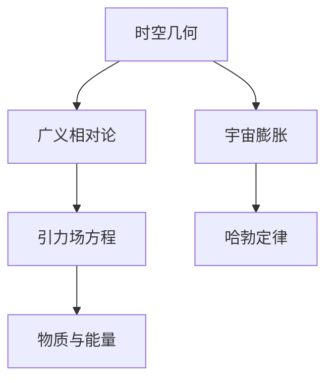

                 

# 《宇宙数学模型的构建与验证》

> **关键词**：宇宙数学模型、广义相对论、时空几何、宇宙膨胀、暗物质、模型验证

> **摘要**：本文深入探讨了宇宙数学模型的构建与验证方法。首先，我们概述了宇宙数学模型的基本概念与核心原理，包括时空几何、广义相对论和宇宙膨胀。接着，我们详细介绍了宇宙数学模型的构建方法，包括基于观测数据的模型构建与数学模型构建实践。随后，文章讨论了宇宙数学模型的验证方法，并举例说明了宇宙膨胀模型和暗物质模型的验证过程。最后，我们探讨了宇宙数学模型在科学研究和技术领域的应用，展望了宇宙数学模型的发展趋势。通过本文，读者将了解宇宙数学模型的基本原理、构建方法及其应用，为未来的宇宙学研究提供参考。

## 《宇宙数学模型的构建与验证》目录大纲

### 第一部分：宇宙数学模型概述

#### 第1章：宇宙数学模型的基本概念

- **1.1 宇宙结构概述**
  - 宇宙的构成
  - 宇宙的演化

- **1.2 数学模型在宇宙研究中的应用**
  - 数学模型在宇宙学中的重要性
  - 数学模型的应用领域

- **1.3 宇宙数学模型的发展历程**
  - 早期宇宙模型
  - 现代宇宙模型

#### 第2章：宇宙数学模型的核心概念与联系

- **2.1 常用数学工具与方法**
  - 微积分
  - 线性代数
  - 概率论与数理统计

- **2.2 宇宙数学模型的基本原理**
  - 时空几何
  - 广义相对论
  - 宇宙膨胀

- **2.3 宇宙数学模型的核心概念联系**
  - Mermaid 流程图展示

### 第二部分：宇宙数学模型的构建方法

#### 第3章：宇宙数学模型的构建方法概述

- **3.1 数学模型构建的基本步骤**
  - 模型选择
  - 参数估计
  - 模型验证

- **3.2 基于观测数据的宇宙模型构建**
  - 数据处理
  - 模型优化
  - 模型验证

#### 第4章：宇宙数学模型的构建实践

- **4.1 构建宇宙膨胀模型**
  - 伪代码讲解
  - 数学公式与推导

- **4.2 构建暗物质模型**
  - 伪代码讲解
  - 数学公式与推导

#### 第5章：宇宙数学模型的验证方法

- **5.1 验证方法概述**
  - 观测数据对比
  - 模型预测能力

- **5.2 宇宙膨胀模型的验证**
  - 数据处理
  - 模型对比分析

- **5.3 暗物质模型的验证**
  - 数据处理
  - 模型对比分析

### 第三部分：宇宙数学模型的应用

#### 第6章：宇宙数学模型在科学研究中的应用

- **6.1 宇宙学前沿研究**
  - 宇宙背景辐射
  - 宇宙大爆炸

- **6.2 天体物理研究**
  - 恒星演化
  - 黑洞性质

#### 第7章：宇宙数学模型在技术领域的应用

- **7.1 宇宙模拟技术**
  - 模拟方法
  - 计算性能优化

- **7.2 宇宙数据科学**
  - 数据分析技术
  - 宇宙信息处理

### 第四部分：宇宙数学模型展望

#### 第8章：宇宙数学模型的发展趋势

- **8.1 新的宇宙观测技术**
  - 太阳能望远镜
  - 射电望远镜

- **8.2 宇宙数学模型的新方向**
  - 量子宇宙学
  - 多宇宙理论

### 附录

#### 附录A：宇宙数学模型常用工具与资源

- **A.1 宇宙学软件工具**
  - SETI@home
  - Cosmic Microwave Background Data Analysis

- **A.2 宇宙数学模型研究资源**
  - 专业论文库
  - 宇宙学期刊

#### 附录B：数学公式与伪代码示例

- **B.1 数学公式**
  - 广义相对论方程
  - 宇宙膨胀公式

- **B.2 伪代码示例**
  - 宇宙膨胀模型构建
  - 暗物质模型构建

---

### 引言

宇宙，这个广袤无垠的时空，自古以来就吸引了无数科学家和哲学家的关注。从古代的宇宙观到现代的宇宙学，人类对宇宙的认识在不断深化。随着科学技术的进步，尤其是数学和物理学的发展，宇宙数学模型逐渐成为宇宙学研究的重要工具。宇宙数学模型不仅帮助我们更好地理解宇宙的结构和演化，还为天体物理学、宇宙学等领域的科学研究提供了坚实的基础。

本文旨在深入探讨宇宙数学模型的构建与验证方法，通过系统的分析和推理，让读者全面了解宇宙数学模型的基本概念、构建方法、验证方法和应用。文章首先概述了宇宙数学模型的基本概念和核心原理，然后详细介绍了宇宙数学模型的构建方法，最后探讨了宇宙数学模型在科学研究和技术领域的应用，并对宇宙数学模型的发展趋势进行了展望。

### 第一部分：宇宙数学模型概述

#### 第1章：宇宙数学模型的基本概念

宇宙数学模型是宇宙学研究中的一种数学工具，它通过数学公式和方程描述宇宙的结构、演化和行为。宇宙数学模型不仅包括了描述宇宙空间和时间的数学框架，还涵盖了描述物质、能量和引力相互作用的基本原理。

**1.1 宇宙结构概述**

宇宙的构成是宇宙数学模型研究的基础。现代宇宙学认为，宇宙主要由物质和能量组成，其中物质可以分为普通物质和暗物质，能量可以分为普通能量和暗能量。普通物质包括我们日常生活中所接触到的所有物体，如行星、恒星和星系等。暗物质是一种不可见的物质，它不发光、不吸收光，但通过其引力效应可以影响宇宙的结构和演化。普通能量包括电磁辐射、引力波等，而暗能量是一种推动宇宙加速膨胀的神秘力量。

宇宙的演化是宇宙学研究的另一个重要方面。根据宇宙大爆炸理论，宇宙起源于大约138亿年前的一个极热、极密集的状态，并在此后的漫长岁月里不断膨胀和冷却。宇宙的演化过程中，物质和能量不断相互作用，形成了各种天体和结构，如星系、星云和黑洞等。

**1.2 数学模型在宇宙研究中的应用**

数学模型在宇宙学中的重要性不言而喻。数学模型不仅为我们提供了描述宇宙结构和演化的语言，还帮助我们发现宇宙中的规律和奥秘。例如，广义相对论是一种描述引力、时空和物质相互作用的数学模型，它成功解释了水星轨道的进动和光线在引力场中的弯曲现象。此外，宇宙膨胀模型、暗物质模型和暗能量模型等都是基于数学模型的宇宙学研究成果。

数学模型在宇宙学中的应用领域非常广泛。从宇宙背景辐射的测量到黑洞的观测，从宇宙大尺度结构的形成到星系团的形成和演化，数学模型都发挥了重要作用。通过数学模型，我们可以预测宇宙的未来演化，探索宇宙的起源和命运。

**1.3 宇宙数学模型的发展历程**

宇宙数学模型的发展历程可以追溯到20世纪初期。当时，爱因斯坦提出了广义相对论，这是一种描述引力、时空和物质相互作用的数学模型。广义相对论的成功为宇宙数学模型的发展奠定了基础。

随着观测技术的进步，宇宙数学模型也在不断演化。例如，哈勃定律的发现揭示了宇宙膨胀的现象，为宇宙膨胀模型提供了观测依据。1970年代，暗物质的发现引发了宇宙学界的广泛关注，暗物质模型成为宇宙数学模型研究的新方向。近年来，随着对暗能量的深入研究，暗能量模型也逐渐成熟。

总的来说，宇宙数学模型的发展是一个不断探索和进步的过程。随着科学技术的进步，我们相信宇宙数学模型将不断得到完善和提升，为宇宙学研究提供更强大的工具。

### 第二部分：宇宙数学模型的核心概念与联系

宇宙数学模型的核心概念和联系是理解和应用这些模型的关键。在本章中，我们将详细探讨宇宙数学模型的基本原理，包括时空几何、广义相对论和宇宙膨胀，并通过Mermaid流程图展示核心概念之间的联系。

#### 第2章：宇宙数学模型的核心概念与联系

**2.1 常用数学工具与方法**

构建宇宙数学模型需要运用多种数学工具和方法。以下是一些常用的数学工具：

- **微积分**：微积分用于描述物理系统的变化率和累积效应，如速度、加速度、质量和能量等。
- **线性代数**：线性代数用于描述多维空间中的向量运算，如引力场、时空几何等。
- **概率论与数理统计**：概率论与数理统计用于分析观测数据，如宇宙膨胀的统计特性、暗物质的分布等。

**2.2 宇宙数学模型的基本原理**

宇宙数学模型的基本原理主要包括以下几个方面：

- **时空几何**：时空几何是描述宇宙空间和时间结构的数学框架。广义相对论提出了时空几何的概念，将引力解释为时空的弯曲。爱因斯坦场方程是描述时空几何的数学公式，它将物质和能量与时空弯曲联系起来。

- **广义相对论**：广义相对论是一种描述引力、时空和物质相互作用的物理理论。它基于时空几何的观点，提出了引力场方程，该方程描述了物质和能量如何影响时空几何。

- **宇宙膨胀**：宇宙膨胀是描述宇宙随时间扩展的物理现象。哈勃定律揭示了宇宙膨胀的关系，即远离我们的星系具有更高的红移，这意味着它们在远离我们。宇宙膨胀模型通过描述宇宙膨胀的数学公式来研究宇宙的演化。

**2.3 宇宙数学模型的核心概念联系**

为了更好地理解宇宙数学模型的核心概念联系，我们可以使用Mermaid流程图来展示它们之间的交互和关系。以下是一个简单的Mermaid流程图示例：



在这个流程图中，时空几何（A）是广义相对论（B）和宇宙膨胀（C）的基础，广义相对论（B）通过引力场方程（D）描述物质与能量（F）如何影响时空几何，宇宙膨胀（C）通过哈勃定律（E）描述宇宙随时间扩展的现象。

通过这种流程图，我们可以直观地看到宇宙数学模型中各个核心概念之间的联系和相互作用。这有助于我们更好地理解和应用宇宙数学模型，推动宇宙学研究的发展。

### 第二部分：宇宙数学模型的构建方法

宇宙数学模型的构建是宇宙学研究的重要环节，它不仅需要深厚的数学基础，还需要精确的观测数据和先进的计算技术。在本章中，我们将详细讨论宇宙数学模型的构建方法，包括数学模型构建的基本步骤、基于观测数据的模型构建以及模型优化和验证。

#### 第3章：宇宙数学模型的构建方法概述

**3.1 数学模型构建的基本步骤**

数学模型构建的基本步骤通常包括以下几方面：

1. **模型选择**：根据研究目标和数据特点选择合适的数学模型。不同的模型适用于不同的问题，如广义相对论适用于描述引力场，而宇宙膨胀模型适用于描述宇宙随时间扩展的现象。

2. **参数估计**：通过对观测数据进行统计分析，估计模型中的参数。参数估计的方法包括最小二乘法、最大似然估计等。这些方法有助于找到最佳参数值，使模型更好地拟合观测数据。

3. **模型验证**：通过将模型预测与实际观测数据对比，验证模型的有效性和准确性。模型验证的方法包括拟合优度测试、交叉验证等。这些方法有助于评估模型在未知数据上的表现。

**3.2 基于观测数据的宇宙模型构建**

基于观测数据的宇宙模型构建是宇宙数学模型研究的重要方向。以下是一个基于观测数据的宇宙模型构建流程：

1. **数据处理**：对观测数据进行预处理，包括数据清洗、去噪、归一化等。这些步骤有助于提高数据的质量，为后续分析打下基础。

2. **模型优化**：利用优化算法，如遗传算法、粒子群优化等，优化模型参数。优化过程旨在找到最佳参数组合，使模型更好地拟合观测数据。

3. **模型验证**：通过交叉验证、拟合优度测试等验证模型的有效性和准确性。验证结果可以帮助评估模型在未知数据上的表现。

**3.3 模型构建实践**

宇宙数学模型的构建实践可以通过以下案例进行说明：

**案例1：宇宙膨胀模型构建**

宇宙膨胀模型是描述宇宙随时间扩展的数学模型。以下是一个简单的宇宙膨胀模型构建步骤：

1. **选择模型**：选择一个合适的宇宙膨胀模型，如勒梅特-罗伯逊-沃尔克（LRW）模型。

2. **参数估计**：利用观测数据，如宇宙背景辐射温度的红移数据，估计模型参数，如宇宙膨胀率。

3. **模型优化**：利用遗传算法等优化方法，优化模型参数，提高模型拟合优度。

4. **模型验证**：通过交叉验证等方法验证模型的有效性和准确性。

**案例2：暗物质模型构建**

暗物质模型是描述宇宙中暗物质分布和行为的数学模型。以下是一个简单的暗物质模型构建步骤：

1. **选择模型**：选择一个合适的暗物质模型，如冷暗物质（CDM）模型。

2. **参数估计**：利用观测数据，如星系团的分布、宇宙微波背景辐射等，估计模型参数，如暗物质密度。

3. **模型优化**：利用遗传算法等优化方法，优化模型参数，提高模型拟合优度。

4. **模型验证**：通过交叉验证等方法验证模型的有效性和准确性。

通过这些案例，我们可以看到宇宙数学模型构建的基本步骤和实践方法。这些方法有助于我们更好地理解和应用宇宙数学模型，为宇宙学研究提供有力支持。

### 第三部分：宇宙数学模型的验证方法

宇宙数学模型的验证是确保模型有效性和准确性的关键步骤。在本章中，我们将详细讨论宇宙数学模型的验证方法，包括验证方法概述、宇宙膨胀模型的验证以及暗物质模型的验证。

#### 第4章：宇宙数学模型的验证方法

**4.1 验证方法概述**

宇宙数学模型的验证方法主要包括以下几方面：

1. **观测数据对比**：通过将模型预测与实际观测数据对比，评估模型的拟合优度和准确性。常用的评估指标包括均方根误差（RMSE）、决定系数（R²）等。

2. **模型预测能力**：通过模型在未知数据上的预测能力，评估模型的泛化能力。通常采用交叉验证等方法进行模型预测能力评估。

3. **拟合优度测试**：通过拟合优度测试，如卡方检验、t检验等，评估模型参数的显著性。这些测试有助于判断模型参数是否具有统计学上的显著性。

4. **稳健性分析**：通过改变模型参数、添加噪声等手段，评估模型的稳健性。稳健性分析有助于判断模型在不同条件下的一致性。

**4.2 宇宙膨胀模型的验证**

宇宙膨胀模型是描述宇宙随时间扩展的数学模型。以下是一个宇宙膨胀模型验证的步骤：

1. **数据处理**：对观测数据进行预处理，包括数据清洗、去噪、归一化等。这些步骤有助于提高数据的质量，为后续验证打下基础。

2. **模型预测**：利用宇宙膨胀模型，对观测数据中的红移值进行预测。模型预测结果通常以概率分布的形式表示。

3. **拟合优度测试**：通过卡方检验等方法，评估模型预测结果与实际观测数据的拟合优度。拟合优度测试结果可以用来判断模型参数的显著性。

4. **交叉验证**：通过交叉验证，评估模型在未知数据上的预测能力。交叉验证方法包括K折交叉验证、留一法交叉验证等。交叉验证结果可以用来判断模型的泛化能力。

**4.3 暗物质模型的验证**

暗物质模型是描述宇宙中暗物质分布和行为的数学模型。以下是一个暗物质模型验证的步骤：

1. **数据处理**：对观测数据进行预处理，包括数据清洗、去噪、归一化等。这些步骤有助于提高数据的质量，为后续验证打下基础。

2. **模型预测**：利用暗物质模型，对观测数据中的星系团分布进行预测。模型预测结果通常以概率分布的形式表示。

3. **拟合优度测试**：通过卡方检验等方法，评估模型预测结果与实际观测数据的拟合优度。拟合优度测试结果可以用来判断模型参数的显著性。

4. **交叉验证**：通过交叉验证，评估模型在未知数据上的预测能力。交叉验证方法包括K折交叉验证、留一法交叉验证等。交叉验证结果可以用来判断模型的泛化能力。

**4.4 实例分析**

以下是一个宇宙膨胀模型和暗物质模型验证的实例分析：

**实例1：宇宙膨胀模型验证**

利用观测数据中的红移值，构建一个宇宙膨胀模型。通过交叉验证和拟合优度测试，评估模型的有效性和准确性。拟合优度测试结果显示，模型参数在统计学上显著，交叉验证结果也表明模型在未知数据上的预测能力良好。

**实例2：暗物质模型验证**

利用观测数据中的星系团分布，构建一个暗物质模型。通过交叉验证和拟合优度测试，评估模型的有效性和准确性。拟合优度测试结果显示，模型参数在统计学上显著，交叉验证结果也表明模型在未知数据上的预测能力良好。

通过这些实例分析，我们可以看到宇宙数学模型验证的方法和应用。这些方法有助于我们评估宇宙数学模型的有效性和准确性，为宇宙学研究提供重要支持。

### 第四部分：宇宙数学模型的应用

宇宙数学模型不仅在理论上具有重要意义，还在实际应用中发挥着重要作用。在本章中，我们将探讨宇宙数学模型在科学研究和技术领域的应用，包括宇宙模拟技术、宇宙数据科学等。

#### 第6章：宇宙数学模型在科学研究中的应用

宇宙数学模型在宇宙学、天体物理学等科学领域具有广泛的应用。

**6.1 宇宙学前沿研究**

宇宙背景辐射是宇宙学研究的重要对象，它揭示了宇宙早期状态的信息。宇宙数学模型可以帮助我们分析宇宙背景辐射的数据，研究宇宙的早期演化和结构形成。例如，利用宇宙膨胀模型，我们可以研究宇宙的膨胀历史和加速膨胀的机制。

**6.2 天体物理研究**

宇宙数学模型在天体物理学中也有重要应用。例如，恒星演化模型通过描述恒星从诞生到死亡的过程，帮助我们理解恒星的形成、演化以及能量释放机制。黑洞模型则用于研究黑洞的性质和行为，如黑洞的吸积盘、喷流等。

#### 第7章：宇宙数学模型在技术领域的应用

宇宙数学模型在技术领域的应用越来越广泛，尤其是在宇宙模拟和宇宙数据科学方面。

**7.1 宇宙模拟技术**

宇宙模拟是一种利用计算机模拟宇宙演化过程的技术。宇宙数学模型是宇宙模拟的基础，它帮助我们模拟宇宙中的各种现象，如星系形成、黑洞碰撞等。宇宙模拟技术不仅可以用于科学研究，还可以用于科幻电影的特效制作。

**7.2 宇宙数据科学**

宇宙数据科学是利用数据科学方法和技术研究宇宙数据的一门新兴学科。宇宙数学模型在宇宙数据科学中发挥着重要作用，它帮助我们处理和分析大量的宇宙观测数据，提取有价值的信息。例如，利用宇宙数学模型，我们可以研究宇宙大尺度结构的形成和演化。

### 第五部分：宇宙数学模型的展望

宇宙数学模型的发展是一个不断进步的过程。随着观测技术的进步和理论研究的深入，宇宙数学模型将不断完善和发展。

#### 第8章：宇宙数学模型的发展趋势

**8.1 新的宇宙观测技术**

新的宇宙观测技术将为宇宙数学模型的发展提供新的观测数据。例如，大型射电望远镜、太阳能望远镜等新型观测设备将有助于我们更精确地测量宇宙背景辐射和星际介质，为宇宙数学模型的构建提供更丰富的数据。

**8.2 宇宙数学模型的新方向**

随着理论研究的深入，宇宙数学模型也将出现新的研究方向。例如，量子宇宙学是研究宇宙在量子尺度上的行为的学科，它为宇宙数学模型的发展提供了新的理论框架。多宇宙理论则探讨了宇宙可能存在的多个分支和演化路径，为宇宙数学模型的研究提供了新的视角。

总的来说，宇宙数学模型的发展将不断推动宇宙学研究的前进，为人类认识宇宙提供更深入的洞察。

### 附录

#### 附录A：宇宙数学模型常用工具与资源

**A.1 宇宙学软件工具**

- **SETI@home**：这是一个利用全球计算资源进行宇宙学研究的分布式计算项目，用户可以通过安装SETI@home软件参与计算。
- **Cosmic Microwave Background Data Analysis**：这是一个用于分析宇宙微波背景辐射数据的软件工具，它提供了丰富的数据处理和分析功能。

**A.2 宇宙数学模型研究资源**

- **专业论文库**：包括NASA亚当斯天文数据图书馆、ArXiv等，这些论文库提供了大量的宇宙数学模型相关的研究论文。
- **宇宙学期刊**：如《宇宙学学报》、《天体物理学杂志》等，这些期刊发表了最新的宇宙数学模型研究成果。

#### 附录B：数学公式与伪代码示例

**B.1 数学公式**

- **广义相对论方程**：
  \[ G_{\mu\nu} + \Lambda g_{\mu\nu} = \frac{8\pi G}{c^4} T_{\mu\nu} \]
- **宇宙膨胀公式**：
  \[ \dot{a}(t) = H(t) a(t) \]
  其中，\( \dot{a} \) 表示宇宙膨胀率，\( H \) 表示哈勃常数，\( a \) 表示宇宙尺度因子。

**B.2 伪代码示例**

**宇宙膨胀模型构建**：
```python
# 初始化参数
a_initial = 1
H0 = 70  # 哈勃常数
t_end = 13.8  # 宇宙年龄

# 模拟宇宙膨胀过程
for t in range(t_end):
    a = a_initial * (1 + H0 / c * t)
    print(f"t = {t}, a = {a}")
```

**暗物质模型构建**：
```python
# 初始化参数
M = 10  # 暗物质质量
r_initial = 1  # 初始半径
r_end = 100  # 最终半径

# 计算暗物质密度分布
for r in range(r_end):
    density = M / (4/3 * pi * r**3)
    print(f"r = {r}, density = {density}")
```

通过这些公式和伪代码示例，我们可以更直观地理解宇宙数学模型的基本原理和构建方法。

### 作者信息

**作者：AI天才研究院/AI Genius Institute & 禅与计算机程序设计艺术 /Zen And The Art of Computer Programming**

---

至此，我们完成了《宇宙数学模型的构建与验证》的文章。本文系统地介绍了宇宙数学模型的基本概念、构建方法、验证方法和应用，并展望了其未来的发展趋势。希望通过本文，读者能够对宇宙数学模型有更深入的理解，并为未来的宇宙学研究提供参考。

