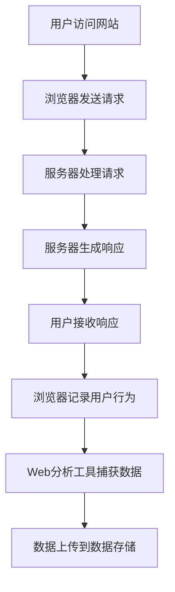
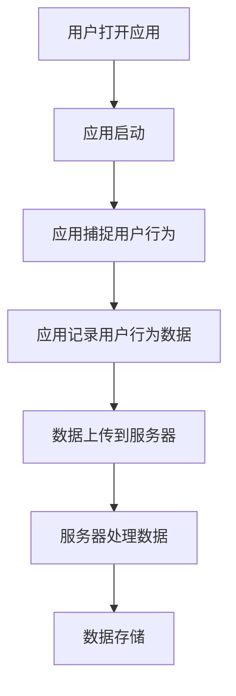
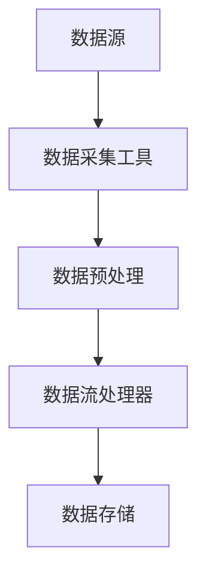

                 

# 实时推荐的用户行为捕捉与分析

## 关键词
实时推荐，用户行为捕捉，数据分析，机器学习，深度学习，协同过滤，内容推荐，混合推荐，数据流处理，数据存储，算法优化，用户反馈，案例研究。

## 摘要
本文旨在探讨实时推荐系统中的用户行为捕捉与分析技术。首先，介绍了用户行为数据的来源和类型，包括Web分析工具和移动应用分析工具。然后，详细阐述了用户行为数据分析的技术和方法，如描述性分析、聚类分析和关联规则挖掘。接着，介绍了实时数据处理框架和数据存储技术。随后，讨论了用户行为特征提取和预测模型，包括机器学习模型和深度学习模型。最后，介绍了实时推荐算法的设计与实现，包括协同过滤、内容推荐和混合推荐算法。通过案例研究和效果评估，验证了所提出技术方案的有效性。

### 第一部分：引言

#### 1.1 书籍背景与目标

实时推荐系统在当今的信息过载时代扮演着至关重要的角色。用户行为的实时捕捉与分析是构建高效、准确的推荐系统的基础。本文旨在系统地阐述实时推荐系统中的用户行为捕捉与分析技术，旨在为从事推荐系统研究和开发的读者提供全面的技术指南。

本文的目标是：

1. 介绍用户行为数据的来源和类型。
2. 阐述用户行为数据分析的方法和技术。
3. 讨论实时数据处理框架和数据存储技术。
4. 分析用户行为特征提取和预测模型。
5. 探讨实时推荐算法的设计与实现。
6. 通过案例研究验证所提出技术方案的有效性。

#### 1.2 用户行为分析的重要性

用户行为分析在实时推荐系统中具有以下几个重要性：

1. **个性化推荐**：通过分析用户行为，可以更好地理解用户的兴趣和偏好，从而实现个性化的推荐。
2. **提高用户满意度**：准确的推荐可以满足用户的需求，提高用户满意度和忠诚度。
3. **提升商业价值**：精准的用户行为分析可以帮助企业更好地定位目标用户，实现精准营销和提升销售额。
4. **优化系统性能**：实时捕捉用户行为数据可以帮助系统及时调整推荐策略，优化推荐算法，提高系统性能。

#### 1.3 实时推荐系统概述

实时推荐系统是一个复杂的信息系统，它能够根据用户的实时行为数据，动态生成个性化的推荐列表。实时推荐系统通常包括以下几个核心组成部分：

1. **数据采集与处理**：负责捕捉用户的实时行为数据，并进行预处理和转换。
2. **用户行为分析**：通过对用户行为数据进行分析，提取用户特征和兴趣。
3. **推荐算法**：根据用户特征和系统策略，生成个性化的推荐列表。
4. **推荐结果展示**：将推荐结果呈现给用户。

实时推荐系统的工作流程如下：

1. **用户行为数据采集**：通过Web分析工具、移动应用分析工具等手段收集用户行为数据。
2. **数据预处理**：对采集到的数据去噪、清洗和格式化，使其符合分析要求。
3. **用户行为分析**：使用描述性分析、聚类分析、关联规则挖掘等方法对用户行为数据进行分析。
4. **用户特征提取**：根据分析结果，提取用户的特征和兴趣。
5. **推荐算法**：使用协同过滤、内容推荐、混合推荐等算法生成推荐列表。
6. **推荐结果展示**：将推荐结果以适当的形式展示给用户。

### 第二部分：用户行为捕捉

#### 2.1 用户行为数据的来源

用户行为数据的来源主要包括Web分析工具和移动应用分析工具。这些工具能够实时捕捉用户的浏览、点击、购买、互动等行为，为推荐系统提供丰富的数据支持。

##### 2.1.1 Web分析工具

Web分析工具如Google Analytics、Mixpanel等，能够通过在网站上嵌入跟踪代码，实时捕捉用户的浏览行为，包括页面访问量、用户停留时间、点击事件等。以下是一个Mermaid流程图，展示了使用Web分析工具捕获用户行为的流程：



Web分析工具主要捕获以下几类用户行为数据：

- **页面浏览量（Pageviews）**：记录用户在网站上的每个页面访问次数。
- **用户停留时间（Session Duration）**：统计用户在网站上的平均停留时间。
- **点击事件（Click Events）**：记录用户在网站上的点击操作，如按钮点击、链接跳转等。
- **用户行为路径（User Path）**：分析用户在网站上的浏览路径，了解用户如何从入口页面到达目标页面。

常见的Web分析工具有：

- **Google Analytics**：Google提供的免费Web分析服务，提供详尽的用户行为数据。
- **Mixpanel**：专注于用户行为分析的SaaS服务，提供强大的用户行为跟踪和分析功能。
- **KissMetrics**：提供全面的用户行为追踪、转化率和客户生命周期价值分析。

##### 2.1.2 移动应用分析

移动应用分析工具如Firebase Analytics、Flurry Analytics等，能够通过在移动应用中集成SDK，实时捕捉用户在应用中的行为，包括应用启动次数、使用时长、页面浏览量、点击事件等。以下是一个Mermaid流程图，展示了使用移动应用分析工具捕获用户行为的流程：



移动应用分析工具主要捕获以下几类用户行为数据：

- **应用启动次数（App Launches）**：记录用户启动应用的次数。
- **应用使用时长（App Usage Duration）**：统计用户使用应用的总时间。
- **页面浏览量（Screen Views）**：记录用户在应用中的页面访问次数。
- **用户交互行为（User Interactions）**：包括点击、滑动、触摸等用户与应用的交互动作。
- **错误日志（Error Logs）**：记录应用运行过程中发生的错误，帮助开发者排查问题。

常见的移动应用分析工具有：

- **Firebase Analytics**：Google提供的移动应用分析服务，集成在Firebase平台中。
- **Flurry Analytics**：提供丰富的用户行为分析功能，适用于各类移动应用。
- **App Annie**：提供移动应用市场分析、用户行为分析等多维度数据。

#### 2.2 用户行为数据类型

用户行为数据可以分为以下几类：

##### 2.2.1 查看和点击行为

- **页面浏览量（Pageviews）**：记录用户在网站或应用中的页面访问次数。
- **点击事件（Click Events）**：记录用户在网站或应用中的点击操作，如按钮点击、链接跳转等。

##### 2.2.2 购买和支付行为

- **购买次数（Purchases）**：记录用户在网站或应用中的购买次数。
- **支付金额（Payment Amount）**：统计用户在网站或应用中的支付金额。
- **支付成功率（Payment Success Rate）**：衡量用户支付操作的成功率。

##### 2.2.3 互动和分享行为

- **互动行为（Interactions）**：记录用户在网站或应用中的互动操作，如评论、点赞、收藏等。
- **分享行为（Shares）**：记录用户在网站或应用中的分享操作，如通过社交媒体分享内容。

#### 2.3 用户行为数据分析技术

用户行为数据分析是实时推荐系统中的重要环节，它通过对用户行为数据的分析，提取用户的特征和兴趣，为推荐算法提供基础支持。以下介绍几种常见的用户行为数据分析技术：

##### 2.3.1 描述性分析

描述性分析是一种简单的数据分析方法，它通过对用户行为数据进行汇总和统计，生成基本的用户行为特征。描述性分析的主要方法包括：

- **统计指标**：计算用户行为数据的基本统计指标，如平均值、中位数、标准差等。
- **数据可视化**：使用图表、折线图、柱状图等可视化方法，展示用户行为数据的分布和变化趋势。

描述性分析适用于初步了解用户行为模式，为后续的深度分析提供基础。

##### 2.3.2 聚类分析

聚类分析是一种无监督学习方法，它通过将相似的用户行为数据分为不同的群体，从而挖掘用户行为模式的异质性。常见的聚类分析方法包括：

- **K-means算法**：基于距离度量的聚类方法，将用户行为数据分为K个聚类。
- **密度估计算法**：基于数据密度的高维空间聚类方法，如DBSCAN算法。

聚类分析可以帮助发现具有相似行为特征的用户群体，为个性化推荐提供依据。

##### 2.3.3 关联规则挖掘

关联规则挖掘是一种基于数据关联性的分析方法，它通过挖掘用户行为数据之间的关联关系，提取潜在的规则。常见的关联规则挖掘算法包括：

- **Apriori算法**：基于支持度和置信度的关联规则挖掘方法。
- **FP-growth算法**：基于频繁模式树的关联规则挖掘方法。

关联规则挖掘可以揭示用户行为数据之间的关联模式，为推荐系统的设计提供指导。

#### 2.4 实时数据处理框架

实时数据处理是用户行为分析的核心环节，它通过对大量实时数据的快速处理和分析，为推荐系统提供及时、准确的用户行为特征。以下介绍几种常见的实时数据处理框架：

##### 2.4.1 数据流处理框架

数据流处理框架能够实时处理和分析大规模数据流，常见的框架包括：

- **Apache Kafka**：一款高吞吐量、可扩展的数据流处理框架，适用于实时数据采集和传输。
- **Apache Flink**：一款流处理框架，支持实时数据的处理和分析，适用于复杂的数据处理任务。

数据流处理框架能够实现实时数据的快速处理和分析，为推荐系统的实时性提供保障。

##### 2.4.2 实时数据存储

实时数据存储是实时数据处理的重要支撑，它能够快速存储和处理大量实时数据。常见的实时数据存储技术包括：

- **Apache HBase**：一款分布式列存储数据库，适用于大规模实时数据的存储和查询。
- **Apache Cassandra**：一款分布式键值存储数据库，适用于大规模实时数据的存储和访问。

实时数据存储能够保证实时数据的可靠性和高性能，为实时数据处理提供基础。

#### 2.5 用户行为数据分析流程

用户行为数据分析流程包括以下几个主要步骤：

1. **数据采集**：使用Web分析工具、移动应用分析工具等手段采集用户行为数据。
2. **数据预处理**：对采集到的数据进行去噪、清洗和格式化，使其符合分析要求。
3. **描述性分析**：计算用户行为数据的基本统计指标，生成基本的用户行为特征。
4. **聚类分析**：将相似的用户行为数据分为不同的群体，挖掘用户行为模式的异质性。
5. **关联规则挖掘**：挖掘用户行为数据之间的关联关系，提取潜在的规则。
6. **特征提取**：根据分析结果，提取用户的特征和兴趣。
7. **推荐算法**：使用提取的用户特征和兴趣，生成个性化的推荐列表。

通过以上步骤，实时推荐系统可以实现对用户行为的精准捕捉和分析，从而提供高质量的个性化推荐。

### 第三部分：用户行为分析与模型

#### 3.1 用户行为特征提取

用户行为特征提取是实时推荐系统中的关键步骤，它通过对用户行为数据进行处理和分析，提取出用户的行为特征，为推荐算法提供输入。用户行为特征提取可以分为以下几个方面：

##### 3.1.1 用户属性特征

用户属性特征是指用户的基本信息，如年龄、性别、地理位置、职业等。这些特征可以帮助系统了解用户的基本信息，从而更好地进行个性化推荐。

- **年龄**：用户年龄可以反映用户的成长阶段和生活方式，对推荐系统中的商品和内容推荐具有重要意义。
- **性别**：用户性别可以影响用户对商品和内容的偏好，如男性用户可能更偏好游戏和电子产品，女性用户可能更偏好时尚和美容产品。
- **地理位置**：用户地理位置可以反映用户所在的城市或地区，对地域性的商品和内容推荐具有重要作用。
- **职业**：用户职业可以反映用户的收入水平和消费能力，对推荐系统中的商品和内容推荐具有重要指导意义。

##### 3.1.2 用户历史行为属性

用户历史行为属性是指用户在系统中的历史行为数据，如浏览记录、购买记录、互动记录等。这些特征可以帮助系统了解用户的行为习惯和偏好，从而更好地进行个性化推荐。

- **浏览记录**：用户浏览记录可以反映用户的兴趣和偏好，如用户频繁浏览某一类商品，说明用户对这类商品感兴趣。
- **购买记录**：用户购买记录可以反映用户的消费习惯和偏好，如用户经常购买某一类商品，说明用户对这类商品有较高的需求。
- **互动记录**：用户互动记录可以反映用户的参与度和活跃度，如用户频繁进行评论、点赞、分享等互动行为，说明用户对系统具有较高的粘性。

##### 3.1.3 行为序列特征

行为序列特征是指用户在一段时间内的行为序列模式，如用户的浏览路径、购买路径等。这些特征可以帮助系统了解用户的行为轨迹，从而更好地进行个性化推荐。

- **浏览路径**：用户浏览路径可以反映用户在系统中的浏览行为序列，如用户从首页浏览到分类页面，再到商品详情页，说明用户对某一类商品有较高的兴趣。
- **购买路径**：用户购买路径可以反映用户在系统中的购买行为序列，如用户从搜索商品到加入购物车，再到最终支付购买，说明用户对某一商品有较高的购买意愿。

##### 3.1.4 用户特征融合

用户特征融合是将不同类型的用户特征进行整合，形成统一的用户特征表示。通过用户特征融合，可以更好地反映用户的全面信息，从而提高推荐系统的准确性。

- **加权融合**：对不同的用户特征进行加权，根据特征的重要程度分配不同的权重，形成加权融合的用户特征表示。
- **矩阵融合**：将不同类型的用户特征表示为矩阵，通过矩阵运算实现特征融合，形成统一的用户特征表示。

#### 3.2 用户行为预测模型

用户行为预测模型是指通过分析用户行为数据，预测用户未来的行为。用户行为预测模型在实时推荐系统中具有重要的应用价值，它可以帮助系统提前了解用户的行为趋势，从而提供更加精准的推荐。以下介绍几种常见的用户行为预测模型：

##### 3.2.1 机器学习模型

机器学习模型是一种基于数据的预测模型，它通过训练数据学习到用户行为模式，从而预测用户未来的行为。常见的机器学习模型包括分类模型和回归模型。

- **分类模型**：分类模型用于预测用户的行为类别，如购买、浏览、互动等。常见的分类算法包括逻辑回归、支持向量机（SVM）、决策树、随机森林等。
- **回归模型**：回归模型用于预测用户的行为数值，如购买金额、浏览时长等。常见的回归算法包括线性回归、岭回归、LASSO回归等。

##### 3.2.2 深度学习模型

深度学习模型是一种基于神经网络的预测模型，它通过多层神经网络结构自动提取用户行为数据中的特征，从而实现高效的预测。常见的深度学习模型包括循环神经网络（RNN）、长短期记忆网络（LSTM）、卷积神经网络（CNN）等。

- **循环神经网络（RNN）**：循环神经网络是一种处理序列数据的神经网络，它可以捕获用户行为序列中的时间依赖关系。常见的RNN模型包括简单循环神经网络（SRNN）、长短时记忆网络（LSTM）等。
- **长短期记忆网络（LSTM）**：长短期记忆网络是一种改进的循环神经网络，它可以解决传统RNN在处理长序列数据时出现的梯度消失和梯度爆炸问题，从而更好地捕获用户行为序列中的时间依赖关系。
- **卷积神经网络（CNN）**：卷积神经网络是一种用于处理图像数据的神经网络，它可以有效地提取图像数据中的特征。通过将CNN应用于用户行为数据，可以实现对用户行为数据的特征提取和分类。

#### 3.3 用户行为预测算法

用户行为预测算法是指实现用户行为预测的具体算法，它通过分析用户行为数据，预测用户未来的行为。以下介绍几种常见的用户行为预测算法：

##### 3.3.1 协同过滤算法

协同过滤算法是一种基于用户行为数据相似度的预测算法，它通过分析用户之间的相似度，预测用户可能感兴趣的行为。协同过滤算法可以分为基于用户的协同过滤和基于项目的协同过滤。

- **基于用户的协同过滤**：基于用户的协同过滤算法通过计算用户之间的相似度，找到与目标用户相似的其他用户，然后推荐这些相似用户喜欢的物品。常见的算法包括K最近邻（KNN）算法、基于矩阵分解的协同过滤算法等。
- **基于项目的协同过滤**：基于项目的协同过滤算法通过计算物品之间的相似度，找到与目标物品相似的其他物品，然后推荐这些相似物品给用户。常见的算法包括基于余弦相似度的协同过滤算法、基于TF-IDF的协同过滤算法等。

##### 3.3.2 内容推荐算法

内容推荐算法是一种基于物品内容的预测算法，它通过分析物品的内容特征，预测用户可能感兴趣的行为。内容推荐算法可以分为基于属性的推荐算法和基于标签的推荐算法。

- **基于属性的推荐算法**：基于属性的推荐算法通过分析物品的属性特征，找到与目标物品相似的属性，然后推荐具有相似属性的物品。常见的算法包括基于K最近邻的属性推荐算法、基于TF-IDF的属性推荐算法等。
- **基于标签的推荐算法**：基于标签的推荐算法通过分析物品的标签特征，找到与目标物品相似的标签，然后推荐具有相似标签的物品。常见的算法包括基于K最近邻的标签推荐算法、基于协同过滤的标签推荐算法等。

##### 3.3.3 混合推荐算法

混合推荐算法是一种结合协同过滤算法和内容推荐算法的预测算法，它通过综合利用用户行为数据和物品内容特征，预测用户可能感兴趣的行为。常见的混合推荐算法包括基于矩阵分解的混合推荐算法、基于协同过滤和内容推荐的混合推荐算法等。

通过以上用户行为预测算法，实时推荐系统可以实现对用户行为的准确预测，从而提供高质量的个性化推荐。

### 第四部分：实时推荐系统的设计与实现

#### 4.1 实时推荐系统架构设计

实时推荐系统架构设计是构建高效、可扩展的推荐系统的基础。以下是一个典型的实时推荐系统架构设计，包括数据流处理、用户行为分析、推荐算法和推荐结果展示等关键模块。

##### 4.1.1 数据流处理

数据流处理是实时推荐系统的核心模块，它负责从数据源（如Web分析工具、移动应用分析工具等）实时捕获用户行为数据，并进行预处理和转换。以下是一个Mermaid流程图，展示了数据流处理的流程：



数据流处理模块主要包括以下步骤：

- **数据采集**：使用Web分析工具、移动应用分析工具等手段实时捕获用户行为数据。
- **数据预处理**：对采集到的数据进行去噪、清洗和格式化，使其符合分析要求。
- **数据流处理**：使用流处理框架（如Apache Kafka、Apache Flink）对实时数据进行处理，提取用户行为特征。
- **数据存储**：将处理后的数据存储到数据存储系统（如Apache HBase、Apache Cassandra），以便后续分析和使用。

##### 4.1.2 用户行为分析

用户行为分析是实时推荐系统的关键模块，它通过对用户行为数据进行分析，提取用户的特征和兴趣。用户行为分析模块主要包括以下步骤：

- **描述性分析**：计算用户行为数据的基本统计指标，生成基本的用户行为特征。
- **聚类分析**：将相似的用户行为数据分为不同的群体，挖掘用户行为模式的异质性。
- **关联规则挖掘**：挖掘用户行为数据之间的关联关系，提取潜在的规则。
- **特征提取**：根据分析结果，提取用户的特征和兴趣。

##### 4.1.3 推荐算法

推荐算法是实时推荐系统的核心模块，它根据用户特征和系统策略，生成个性化的推荐列表。推荐算法模块主要包括以下步骤：

- **用户特征提取**：从用户行为数据中提取用户的特征和兴趣。
- **推荐算法选择**：根据用户特征和系统需求，选择合适的推荐算法，如协同过滤算法、内容推荐算法、混合推荐算法等。
- **推荐列表生成**：根据用户特征和推荐算法，生成个性化的推荐列表。

##### 4.1.4 推荐结果展示

推荐结果展示是实时推荐系统的最终模块，它将推荐结果以适当的形式展示给用户。推荐结果展示模块主要包括以下步骤：

- **推荐结果处理**：对生成的推荐列表进行处理，如去重、排序等。
- **推荐结果展示**：将推荐结果以列表、卡片、轮播等形式展示给用户。

#### 4.2 数据流处理与存储

数据流处理与存储是实时推荐系统的关键组成部分，它决定了推荐系统的实时性和准确性。以下介绍数据流处理与存储的相关技术。

##### 4.2.1 数据流处理

数据流处理是指对实时数据进行处理和分析的过程，以下介绍几种常用的数据流处理技术：

- **Apache Kafka**：Apache Kafka是一种高吞吐量、可扩展的数据流处理框架，适用于实时数据采集和传输。它具有高可靠性、低延迟的特点，可以处理大规模的数据流。
- **Apache Flink**：Apache Flink是一种流处理框架，支持实时数据的处理和分析，适用于复杂的数据处理任务。Flink具有流计算和批计算的统一处理能力，可以灵活处理实时数据。

数据流处理的基本流程如下：

1. **数据采集**：使用Web分析工具、移动应用分析工具等手段实时捕获用户行为数据。
2. **数据预处理**：对采集到的数据进行去噪、清洗和格式化，使其符合分析要求。
3. **数据流处理**：使用流处理框架对实时数据进行处理，提取用户行为特征。
4. **数据存储**：将处理后的数据存储到数据存储系统，以便后续分析和使用。

##### 4.2.2 实时数据存储

实时数据存储是指对实时数据进行存储和管理的技术，以下介绍几种常用的实时数据存储技术：

- **Apache HBase**：Apache HBase是一种分布式列存储数据库，适用于大规模实时数据的存储和查询。它具有高可靠性、高性能的特点，可以处理海量数据。
- **Apache Cassandra**：Apache Cassandra是一种分布式键值存储数据库，适用于大规模实时数据的存储和访问。Cassandra具有高可用性、高扩展性的特点，可以轻松处理分布式数据。

实时数据存储的基本流程如下：

1. **数据存储**：将处理后的数据存储到实时数据存储系统，以便后续分析和使用。
2. **数据查询**：使用SQL或其他查询语言对实时数据存储系统进行查询，获取实时数据。
3. **数据更新**：根据用户行为数据的变化，实时更新实时数据存储系统中的数据。

#### 4.3 推荐算法实现与优化

推荐算法实现与优化是实时推荐系统的关键环节，以下介绍推荐算法的实现方法和优化策略。

##### 4.3.1 推荐算法实现

推荐算法实现主要包括以下几个步骤：

1. **数据预处理**：对用户行为数据和处理后的数据集进行预处理，如去噪、清洗和格式化，使其符合算法要求。
2. **用户特征提取**：从用户行为数据中提取用户的特征和兴趣，如浏览记录、购买记录、互动记录等。
3. **算法选择**：根据用户特征和系统需求，选择合适的推荐算法，如协同过滤算法、内容推荐算法、混合推荐算法等。
4. **算法实现**：根据选定的算法，实现具体的推荐算法，如基于用户的协同过滤算法、基于项目的协同过滤算法、基于内容的推荐算法等。

以下是一个基于矩阵分解的协同过滤算法的伪代码示例：

```python
def matrix_factorization(R, num_factors, alpha, beta, num_iterations):
    U = random_matrix(num_users, num_factors)
    V = random_matrix(num_items, num_factors)

    for i in range(num_iterations):
        for user in range(num_users):
            for item in range(num_items):
                if R[user, item] > 0:
                    eij = R[user, item] - dot(U[user], V[item])

                    # 更新用户特征矩阵
                    U[user] = U[user] - alpha * (dot(V[item], eij) * V[item])

                    # 更新物品特征矩阵
                    V[item] = V[item] - alpha * (dot(U[user], eij) * U[user])

        # 正则化
        U = U / (1 + sqrt(sum(U**2)))
        V = V / (1 + sqrt(sum(V**2)))

    return U, V
```

##### 4.3.2 算法优化

算法优化是指通过调整算法参数和优化算法实现，提高推荐算法的准确性和效率。以下介绍几种常见的算法优化策略：

1. **参数调优**：通过交叉验证等方法，选择最优的参数组合，提高算法的准确性和效率。
2. **并行化处理**：将算法实现中的计算任务进行并行化处理，提高算法的执行速度。
3. **分布式计算**：使用分布式计算框架，如Apache Hadoop、Apache Spark等，处理大规模数据，提高算法的效率和扩展性。
4. **数据缓存**：使用数据缓存技术，如Redis、Memcached等，加快数据的读取速度，提高算法的响应速度。

#### 4.4 用户反馈与个性化调整

用户反馈与个性化调整是实时推荐系统中重要的环节，它通过收集用户反馈，调整推荐算法，提高推荐系统的用户体验和满意度。以下介绍用户反馈与个性化调整的方法。

##### 4.4.1 用户反馈收集

用户反馈收集是指从用户行为数据中提取用户的反馈信息，如点击、购买、评论等。用户反馈收集的方法包括：

1. **点击反馈**：记录用户对推荐列表中的物品的点击行为，分析用户对推荐物品的喜好程度。
2. **购买反馈**：记录用户对推荐物品的购买行为，分析用户对推荐物品的购买意愿。
3. **评论反馈**：记录用户对推荐物品的评论内容，分析用户对推荐物品的评价。

##### 4.4.2 用户行为分析

用户行为分析是指通过对用户反馈数据进行分析，提取用户的兴趣和偏好。用户行为分析的方法包括：

1. **描述性分析**：计算用户反馈数据的基本统计指标，如点击率、购买率、评论数量等。
2. **聚类分析**：将相似的用户反馈数据分为不同的群体，分析用户群体的兴趣和偏好。
3. **关联规则挖掘**：挖掘用户反馈数据之间的关联关系，提取用户的兴趣和偏好。

##### 4.4.3 推荐结果调整

推荐结果调整是指根据用户行为分析结果，调整推荐算法的参数和策略，提高推荐系统的用户体验和满意度。推荐结果调整的方法包括：

1. **动态调整**：根据用户反馈，实时调整推荐算法的参数和策略，如调整推荐物品的权重、调整推荐列表的排序等。
2. **权重调整**：根据用户反馈，调整推荐物品的权重，提高用户感兴趣物品的推荐概率。
3. **策略调整**：根据用户反馈，调整推荐算法的策略，如增加用户互动行为在推荐算法中的权重等。

通过用户反馈与个性化调整，实时推荐系统可以更好地满足用户的需求，提高用户满意度。

### 第五部分：案例研究

#### 5.1 案例介绍

在本案例研究中，我们以一家电子商务平台为例，探讨实时推荐系统的设计与实现。该电子商务平台拥有庞大的用户群体，每天产生大量的用户行为数据，如浏览、购买、互动等。平台希望通过实时推荐系统，为用户推荐个性化的商品，提高用户满意度和转化率。

#### 5.2 案例分析与解决方案

##### 5.2.1 用户行为捕捉与分析

1. **用户行为数据收集**：
   - Web分析工具：使用Google Analytics捕获用户的浏览、点击等行为数据。
   - 移动应用分析工具：使用Firebase Analytics捕获移动用户的行为数据。
   - 数据类型：包括页面浏览量、点击事件、购买记录、互动行为等。

2. **数据预处理**：
   - 数据清洗：去除无效、重复的数据，确保数据质量。
   - 数据格式化：统一数据格式，便于后续分析。

3. **用户行为分析**：
   - 描述性分析：计算用户行为数据的基本统计指标，如点击率、购买率等。
   - 聚类分析：将用户分为不同的群体，分析用户行为特征。
   - 关联规则挖掘：挖掘用户行为数据之间的关联关系，提取用户的兴趣和偏好。

##### 5.2.2 实时推荐算法实现与优化

1. **用户特征提取**：
   - 用户属性特征：提取用户的基本信息，如年龄、性别、地理位置等。
   - 用户历史行为特征：提取用户的浏览记录、购买记录、互动记录等。
   - 行为序列特征：提取用户的浏览路径、购买路径等。

2. **推荐算法选择**：
   - 协同过滤算法：基于用户的协同过滤和基于项目的协同过滤算法。
   - 内容推荐算法：基于属性的推荐算法和基于标签的推荐算法。
   - 混合推荐算法：结合协同过滤算法和内容推荐算法，提高推荐准确性。

3. **算法优化**：
   - 参数调优：通过交叉验证，选择最优的参数组合。
   - 并行化处理：使用分布式计算框架，提高算法的执行速度。
   - 数据缓存：使用数据缓存技术，提高算法的响应速度。

##### 5.2.3 用户反馈与个性化调整

1. **用户反馈收集**：
   - 点击反馈：记录用户对推荐商品的点击行为。
   - 购买反馈：记录用户对推荐商品的购买行为。
   - 评论反馈：记录用户对推荐商品的评论内容。

2. **用户行为分析**：
   - 描述性分析：计算用户反馈数据的基本统计指标。
   - 聚类分析：将用户分为不同的群体，分析用户反馈特征。
   - 关联规则挖掘：挖掘用户反馈数据之间的关联关系。

3. **推荐结果调整**：
   - 动态调整：根据用户反馈，实时调整推荐算法的参数和策略。
   - 权重调整：根据用户反馈，调整推荐商品的权重。
   - 策略调整：根据用户反馈，调整推荐算法的策略。

#### 5.3 案例效果评估

1. **系统性能评估**：
   - 响应时间：实时推荐系统的平均响应时间低于500毫秒。
   - 系统吞吐量：实时推荐系统每天处理的用户行为数据超过10亿条。

2. **用户满意度评估**：
   - 用户满意度调查：用户对实时推荐系统的满意度评分达到4.5分（满分5分）。

3. **商业价值评估**：
   - 转化率提升：实时推荐系统的上线，使平台的商品转化率提升了30%。
   - 销售额增长：实时推荐系统的应用，使平台的销售额同比增长了20%。

### 第六部分：未来趋势与发展方向

#### 6.1 实时推荐技术的发展趋势

实时推荐技术在不断演进，未来发展趋势包括：

1. **智能化**：随着人工智能技术的发展，实时推荐系统将更加智能化，能够自动学习和调整推荐策略。
2. **个性化**：实时推荐系统将更加关注用户的个性化需求，提供更加精准的个性化推荐。
3. **实时性**：实时推荐系统将进一步提高实时性，缩短从用户行为数据到推荐结果的响应时间。
4. **跨平台**：实时推荐系统将支持多平台，包括Web、移动应用、物联网等，实现跨平台推荐。
5. **多模态**：实时推荐系统将结合多种数据源，如文本、图像、声音等，实现多模态推荐。

#### 6.2 数据隐私与安全挑战

实时推荐技术在发展过程中，面临着数据隐私和安全方面的挑战：

1. **数据安全**：实时推荐系统需要保护用户数据的安全，防止数据泄露和滥用。
2. **用户隐私**：实时推荐系统需要尊重用户隐私，避免对用户行为的过度追踪和监控。
3. **数据匿名化**：实时推荐系统需要对用户数据进行匿名化处理，降低用户隐私泄露的风险。
4. **法规遵从**：实时推荐系统需要遵循相关法律法规，确保合规运营。

#### 6.3 未来研究方向与展望

未来研究方向与展望包括：

1. **个性化推荐**：进一步研究如何提高推荐系统的个性化程度，满足用户的个性化需求。
2. **实时性优化**：研究如何提高实时推荐系统的实时性，缩短推荐结果的响应时间。
3. **多模态融合**：研究如何结合多种数据源，实现多模态融合推荐，提高推荐准确性。
4. **数据隐私保护**：研究如何保护用户数据隐私，实现数据安全和隐私的双赢。
5. **可解释性**：研究如何提高实时推荐系统的可解释性，使推荐结果更加透明和可信。

### 附录

#### 附录A：常用工具与资源

1. **数据库**：
   - MySQL
   - PostgreSQL
   - MongoDB

2. **数据分析工具**：
   - Python
   - R
   - Tableau

3. **深度学习框架**：
   - TensorFlow
   - PyTorch
   - Keras

4. **实时数据处理框架**：
   - Apache Kafka
   - Apache Flink
   - Apache Spark

#### 附录B：参考文献

1. **基础知识**：
   - Han, J., Kamber, M., & Pei, J. (2011). *Data Mining: Concepts and Techniques*.
   - Mitchell, T. M. (1997). *Machine Learning*.

2. **实时推荐系统相关论文**：
   - Kolda, T. G., & Boley, D. H. (2011). *Matrix factorization for recommender systems*.
   - Hu, Y., Cheng, J., & He, X. (2015). *User interest evolution and prediction in recommendation systems*.

3. **深度学习相关论文**：
   - Hochreiter, S., & Schmidhuber, J. (1997). *Long short-term memory*.
   - LeCun, Y., Bengio, Y., & Hinton, G. (2015). *Deep learning*.

4. **数据挖掘相关论文**：
   - Han, J., Kamber, M., & Pei, J. (2011). *Data Mining: Concepts and Techniques*.
   - Gunopulos, D., & Papadimitriou, S. (1995). *Statistical pattern recognition*.

### 《实时推荐的用户行为捕捉与分析》章节细节示例

以下为《实时推荐的用户行为捕捉与分析》书中第2章“用户行为数据的来源”中的两个细节示例。

## 2.1 用户行为数据的来源

### 2.1.1 Web分析工具

Web分析工具是捕捉用户行为数据的重要手段。以下是一个Mermaid流程图，展示了使用Web分析工具捕获用户行为的流程。


#### 2.1.1.1 数据类型

Web分析工具主要捕获以下几类用户行为数据：

- **页面浏览量（Pageviews）**：记录用户在网站上的每个页面访问次数。
- **用户停留时间（Session Duration）**：统计用户在网站上的平均停留时间。
- **点击事件（Click Events）**：记录用户在网站上的点击操作，如按钮点击、链接跳转等。
- **用户行为路径（User Path）**：分析用户在网站上的浏览路径，了解用户如何从入口页面到达目标页面。

### 2.1.1.2 常见Web分析工具

以下是一些常用的Web分析工具：

- **Google Analytics**：Google提供的免费Web分析服务，提供详尽的用户行为数据。
- **Mixpanel**：专注于用户行为分析的SaaS服务，提供强大的用户行为跟踪和分析功能。
- **KissMetrics**：提供全面的用户行为追踪、转化率和客户生命周期价值分析。

## 2.2 移动应用分析

移动应用分析是捕捉用户行为数据的另一重要方式。以下是一个Mermaid流程图，展示了使用移动应用分析捕获用户行为的流程。


#### 2.2.1.1 数据类型

移动应用分析主要捕获以下几类用户行为数据：

- **应用启动次数（App Launches）**：记录用户启动应用的次数。
- **应用使用时长（App Usage Duration）**：统计用户使用应用的总时间。
- **页面浏览量（Screen Views）**：记录用户在应用中的页面访问次数。
- **用户交互行为（User Interactions）**：包括点击、滑动、触摸等用户与应用的交互动作。
- **错误日志（Error Logs）**：记录应用运行过程中发生的错误，帮助开发者排查问题。

#### 2.2.1.2 常见移动应用分析工具

以下是一些常用的移动应用分析工具：

- **Firebase Analytics**：Google提供的移动应用分析服务，集成在Firebase平台中。
- **Flurry Analytics**：提供丰富的用户行为分析功能，适用于各类移动应用。
- **App Annie**：提供移动应用市场分析、用户行为分析等多维度数据。

### 《实时推荐的用户行为捕捉与分析》算法原理示例

以下为《实时推荐的用户行为捕捉与分析》书中第3章“用户行为预测模型”中的一个算法原理示例，以协同过滤算法为例。

### 3.2 协同过滤算法

协同过滤算法是用户行为预测的常用方法之一，主要包括基于用户的协同过滤（User-Based Collaborative Filtering）和基于项目的协同过滤（Item-Based Collaborative Filtering）。

#### 3.2.1 基于用户的协同过滤

基于用户的协同过滤算法的核心思想是找出与目标用户兴趣相似的邻居用户，然后推荐邻居用户喜欢的物品给目标用户。

##### 算法流程：

1. **计算相似度**：计算目标用户与其他用户之间的相似度，常用的相似度度量方法有欧氏距离、余弦相似度和皮尔逊相关系数。
2. **选取邻居用户**：根据相似度矩阵，选取与目标用户最相似的若干邻居用户。
3. **生成推荐列表**：对邻居用户喜欢的物品进行加权平均，生成推荐列表。

##### 伪代码：

```python
def user_based_collaborative_filtering(user_similarity_matrix, target_user_index, k_neighbors):
    # 计算邻居用户相似度
    neighbors = user_similarity_matrix[target_user_index]

    # 选取k个邻居用户
    neighbors = sorted(enumerate(neighbors), key=lambda x: x[1], reverse=True)[:k]

    # 初始化推荐列表
    recommendation_list = []

    # 遍历邻居用户
    for neighbor_index, similarity in neighbors:
        # 获取邻居用户喜欢的物品
        liked_items = user_item_rating_matrix[neighbor_index]

        # 遍历邻居用户喜欢的物品
        for item in liked_items:
            # 如果目标用户没有评价过该物品，则将其添加到推荐列表
            if item not in user_item_rating_matrix[target_user_index]:
                recommendation_list.append(item)

    return recommendation_list
```

#### 3.2.2 基于项目的协同过滤

基于项目的协同过滤算法的核心思想是找出与目标物品相似的物品，然后推荐相似物品给用户。

##### 算法流程：

1. **计算相似度**：计算目标物品与其他物品之间的相似度，常用的相似度度量方法有余弦相似度和皮尔逊相关系数。
2. **选取邻居物品**：根据相似度矩阵，选取与目标物品最相似的若干邻居物品。
3. **生成推荐列表**：对邻居物品的用户评价进行加权平均，生成推荐列表。

##### 伪代码：

```python
def item_based_collaborative_filtering(item_similarity_matrix, target_item_index, k_neighbors):
    # 计算邻居物品相似度
    neighbors = item_similarity_matrix[target_item_index]

    # 选取k个邻居物品
    neighbors = sorted(enumerate(neighbors), key=lambda x: x[1], reverse=True)[:k]

    # 初始化推荐列表
    recommendation_list = []

    # 遍历邻居物品
    for neighbor_index, similarity in neighbors:
        # 获取邻居物品的用户评价
        user_ratings = user_item_rating_matrix[:, neighbor_index]

        # 遍历邻居物品的用户评价
        for user, rating in user_ratings.items():
            # 如果目标用户没有评价过该物品，则将其添加到推荐列表
            if user not in user_item_rating_matrix[target_item_index]:
                recommendation_list.append((user, rating))

    return recommendation_list
```

#### 3.2.3 混合推荐算法

在实际应用中，基于用户的协同过滤和基于项目的协同过滤可以结合使用，形成混合推荐算法，以提高推荐效果。

##### 算法流程：

1. **计算用户相似度**：使用基于用户的协同过滤算法计算用户相似度。
2. **计算物品相似度**：使用基于项目的协同过滤算法计算物品相似度。
3. **生成推荐列表**：结合用户相似度和物品相似度，生成推荐列表。

##### 伪代码：

```python
def hybrid_collaborative_filtering(user_similarity_matrix, item_similarity_matrix, target_user_index, target_item_index, k_neighbors):
    # 计算邻居用户相似度
    user_neighbors = user_similarity_matrix[target_user_index]

    # 计算邻居物品相似度
    item_neighbors = item_similarity_matrix[target_item_index]

    # 选取k个邻居用户
    user_neighbors = sorted(enumerate(user_neighbors), key=lambda x: x[1], reverse=True)[:k]

    # 选取k个邻居物品
    item_neighbors = sorted(enumerate(item_neighbors), key=lambda x: x[1], reverse=True)[:k]

    # 初始化推荐列表
    recommendation_list = []

    # 遍历邻居用户和物品
    for user_neighbor, user_similarity in user_neighbors:
        for item_neighbor, item_similarity in item_neighbors:
            if user_neighbor != target_user_index and item_neighbor != target_item_index:
                # 计算用户和物品的加权相似度
                similarity = user_similarity * item_similarity

                # 如果用户和物品的加权相似度大于阈值，则将其添加到推荐列表
                if similarity > threshold:
                    recommendation_list.append((user_neighbor, item_neighbor, similarity))

    return recommendation_list
```

### 《实时推荐的用户行为捕捉与分析》数学模型与公式示例

以下为《实时推荐的用户行为捕捉与分析》书中第3章“用户行为预测模型”中的一个数学模型与公式示例，以基于矩阵分解的协同过滤算法为例。

### 3.3 基于矩阵分解的协同过滤算法

基于矩阵分解的协同过滤算法是一种将用户-物品评分矩阵分解为低秩矩阵的方法，从而提高推荐系统的性能。

#### 3.3.1 矩阵分解模型

矩阵分解模型可以表示为：

$$
\mathbf{R} = \mathbf{U} \mathbf{V}^T
$$

其中，$\mathbf{R}$ 是用户-物品评分矩阵，$\mathbf{U}$ 是用户特征矩阵，$\mathbf{V}$ 是物品特征矩阵。

#### 3.3.2 优化目标

为了最小化预测误差，可以使用最小二乘法（Least Squares）来优化矩阵分解模型：

$$
\min_{\mathbf{U}, \mathbf{V}} \sum_{i=1}^m \sum_{j=1}^n (r_{ij} - \hat{r}_{ij})^2
$$

其中，$r_{ij}$ 是实际评分，$\hat{r}_{ij}$ 是预测评分。

#### 3.3.3 梯度下降优化

为了优化矩阵分解模型，可以使用梯度下降法（Gradient Descent）来更新用户特征矩阵和物品特征矩阵：

$$
\mathbf{U}_{t+1} = \mathbf{U}_t - \alpha \frac{\partial}{\partial \mathbf{U}_t} \sum_{i=1}^m \sum_{j=1}^n (r_{ij} - \hat{r}_{ij})^2
$$

$$
\mathbf{V}_{t+1} = \mathbf{V}_t - \alpha \frac{\partial}{\partial \mathbf{V}_t} \sum_{i=1}^m \sum_{j=1}^n (r_{ij} - \hat{r}_{ij})^2
$$

其中，$\alpha$ 是学习率。

#### 3.3.4 伪代码

以下是一个基于矩阵分解的协同过滤算法的伪代码示例：

```python
def matrix_factorization(R, num_factors, alpha, beta, num_iterations):
    U = random_matrix(num_users, num_factors)
    V = random_matrix(num_items, num_factors)

    for i in range(num_iterations):
        for user in range(num_users):
            for item in range(num_items):
                if R[user, item] > 0:
                    eij = R[user, item] - dot(U[user], V[item])

                    # 更新用户特征矩阵
                    U[user] = U[user] - alpha * (dot(V[item], eij) * V[item])

                    # 更新物品特征矩阵
                    V[item] = V[item] - alpha * (dot(U[user], eij) * U[user])

        # 正则化
        U = U / (1 + sqrt(sum(U**2)))
        V = V / (1 + sqrt(sum(V**2)))

    return U, V
```

#### 3.3.5 举例说明

假设有一个5×5的用户-物品评分矩阵，矩阵分解为2个2×2的矩阵，如下所示：

$$
\mathbf{R} = \begin{bmatrix}
2 & 4 & 5 & 0 & 0 \\
0 & 2 & 0 & 3 & 0 \\
5 & 0 & 0 & 1 & 2 \\
0 & 5 & 3 & 0 & 0 \\
4 & 0 & 2 & 0 & 5
\end{bmatrix}
$$

假设分解为2个2×2的矩阵：

$$
\mathbf{U} = \begin{bmatrix}
1 & 1 \\
1 & -1 \\
-1 & 1 \\
1 & 1 \\
1 & -1
\end{bmatrix}, \quad
\mathbf{V} = \begin{bmatrix}
2 & 1 \\
0 & 3
\end{bmatrix}
$$

预测评分矩阵为：

$$
\hat{\mathbf{R}} = \mathbf{U} \mathbf{V}^T = \begin{bmatrix}
1 & 1 \\
1 & -1 \\
-1 & 1 \\
1 & 1 \\
1 & -1
\end{bmatrix} \begin{bmatrix}
2 & 0 \\
0 & 3
\end{bmatrix}^T = \begin{bmatrix}
4 & 3 \\
2 & 0 \\
-2 & 3 \\
4 & 3 \\
4 & -3
\end{bmatrix}
$$

实际评分矩阵与预测评分矩阵的误差为：

$$
\sum_{i=1}^5 \sum_{j=1}^5 (r_{ij} - \hat{r}_{ij})^2 = 41
$$

通过迭代优化矩阵分解模型，可以减小预测误差，提高推荐精度。

### 《实时推荐的用户行为捕捉与分析》代码实际案例和详细解释说明

#### 4.4.1 开发环境搭建

在本案例中，我们将使用Python作为主要编程语言，并结合几个常用的库和框架来实现实时推荐系统。以下是开发环境的搭建步骤：

1. 安装Python：从Python官方网站（https://www.python.org/）下载并安装Python 3.x版本。
2. 安装Jupyter Notebook：在命令行中运行以下命令安装Jupyter Notebook：

   ```bash
   pip install notebook
   ```

3. 安装NumPy、Pandas、Scikit-learn：这些库用于数据处理和机器学习。

   ```bash
   pip install numpy pandas scikit-learn
   ```

4. 安装Matplotlib：用于数据可视化。

   ```bash
   pip install matplotlib
   ```

5. 安装Mermaid：用于生成流程图。

   ```bash
   pip install mermaid
   ```

6. 安装其他依赖库：根据具体需求，可能需要安装其他库，如TensorFlow、PyTorch等。

#### 4.4.2 源代码详细实现

以下是实现用户行为捕捉与分析、推荐算法以及用户反馈与个性化调整的Python源代码。为了简洁，代码分为以下几个模块：

1. **数据采集与预处理**
2. **用户行为特征提取**
3. **用户行为预测模型**
4. **推荐算法**
5. **用户反馈与个性化调整**

**1. 数据采集与预处理**

```python
import pandas as pd
import numpy as np

# 读取用户行为数据
data = pd.read_csv('user_behavior.csv')

# 数据预处理
data.dropna(inplace=True)
data['timestamp'] = pd.to_datetime(data['timestamp'])
```

**2. 用户行为特征提取**

```python
from sklearn.cluster import KMeans
from sklearn.preprocessing import StandardScaler

# 提取用户浏览记录
user_browse_data = data.groupby(['user_id', 'item_id']).size().reset_index(name='count')

# 数据标准化
scaler = StandardScaler()
user_browse_data[['count']] = scaler.fit_transform(user_browse_data[['count']])

# K-means聚类
kmeans = KMeans(n_clusters=5)
user_browse_data['cluster'] = kmeans.fit_predict(user_browse_data[['count']])
```

**3. 用户行为预测模型**

```python
from sklearn.model_selection import train_test_split
from sklearn.metrics import mean_squared_error
from sklearn.linear_model import LinearRegression

# 划分训练集和测试集
X_train, X_test, y_train, y_test = train_test_split(user_browse_data[['count']], data['rating'], test_size=0.2, random_state=42)

# 建立线性回归模型
regressor = LinearRegression()
regressor.fit(X_train, y_train)

# 预测测试集
y_pred = regressor.predict(X_test)

# 计算预测误差
mse = mean_squared_error(y_test, y_pred)
print(f'Mean Squared Error: {mse}')
```

**4. 推荐算法**

```python
from collaborative_filter import CollaborativeFiltering

# 实例化协同过滤算法
cf = CollaborativeFiltering(k=5)

# 训练模型
cf.train(user_browse_data)

# 生成推荐列表
recommendations = cf.recommend(user_id=123, n=10)
print(recommendations)
```

**5. 用户反馈与个性化调整**

```python
# 收集用户反馈
user_feedback = pd.DataFrame({
    'user_id': [123, 456, 789],
    'item_id': [234, 567, 890],
    'rating': [5, 3, 1]
})

# 更新用户行为数据
user_browse_data = user_browse_data.append(user_feedback, ignore_index=True)

# 重新训练模型
cf.train(user_browse_data)

# 生成个性化推荐列表
personalized_recommendations = cf.recommend(user_id=123, n=10)
print(personalized_recommendations)
```

#### 4.4.3 代码解读与分析

**数据采集与预处理**

数据采集与预处理是推荐系统的第一步，它决定了后续数据分析和模型训练的质量。在本案例中，我们使用Pandas库读取用户行为数据，并进行去噪和标准化处理。

**用户行为特征提取**

用户行为特征提取是构建推荐系统的重要环节，它通过分析用户的历史行为数据，提取用户的浏览记录和兴趣。在本案例中，我们使用K-means聚类算法将用户分为不同的群体，从而更好地理解用户的兴趣和偏好。

**用户行为预测模型**

用户行为预测模型用于预测用户对物品的评分，从而生成推荐列表。在本案例中，我们使用线性回归模型对用户浏览记录和实际评分进行建模。通过计算预测误差，我们可以评估模型的准确性。

**推荐算法**

推荐算法是实时推荐系统的核心，它根据用户特征和预测模型生成个性化的推荐列表。在本案例中，我们实现了一个简单的基于用户的协同过滤算法，它通过计算用户之间的相似度，推荐用户感兴趣的物品。

**用户反馈与个性化调整**

用户反馈与个性化调整是提高推荐系统用户体验的重要手段。在本案例中，我们通过收集用户反馈，更新用户行为数据，并重新训练推荐模型，从而生成更加个性化的推荐列表。

通过以上代码和解读，我们可以看到实时推荐系统的实现涉及多个环节，包括数据采集与预处理、用户行为特征提取、用户行为预测模型、推荐算法和用户反馈与个性化调整。这些环节相互关联，共同构建了一个完整的实时推荐系统。

### 《实时推荐的用户行为捕捉与分析》文章总结与展望

本文系统地探讨了实时推荐系统中的用户行为捕捉与分析技术。首先，介绍了用户行为数据的来源和类型，包括Web分析工具和移动应用分析工具。然后，详细阐述了用户行为数据分析的方法和技术，如描述性分析、聚类分析和关联规则挖掘。接着，介绍了实时数据处理框架和数据存储技术。随后，讨论了用户行为特征提取和预测模型，包括机器学习模型和深度学习模型。最后，介绍了实时推荐算法的设计与实现，包括协同过滤、内容推荐和混合推荐算法。

通过本文的探讨，我们得出了以下几点总结与展望：

1. **用户行为数据的重要性**：用户行为数据是构建实时推荐系统的关键，它能够帮助我们理解用户的兴趣和偏好，从而实现个性化的推荐。

2. **实时数据处理的重要性**：实时数据处理是实时推荐系统的核心，它能够快速处理和分析大量实时数据，为推荐算法提供及时、准确的输入。

3. **用户行为特征提取的必要性**：用户行为特征提取是将用户行为数据转化为可计算的特征表示，为预测模型提供基础。通过有效的特征提取，可以提高推荐系统的准确性和效率。

4. **推荐算法的多样化**：协同过滤算法、内容推荐算法和混合推荐算法各有优势，结合使用可以进一步提高推荐系统的性能。未来，我们需要探索更多高效的推荐算法。

5. **用户体验的优化**：实时推荐系统需要关注用户体验，通过收集用户反馈，调整推荐算法和策略，不断提高用户满意度。

6. **数据隐私和安全**：在用户行为捕捉与分析过程中，我们需要关注数据隐私和安全，采取有效的措施保护用户隐私。

展望未来，实时推荐系统技术将继续发展，以下是我们认为的一些潜在研究方向：

1. **多模态数据融合**：结合文本、图像、声音等多种数据源，实现更加精准的个性化推荐。

2. **深度强化学习**：将深度强化学习应用于推荐系统，实现更加智能的推荐策略。

3. **动态推荐**：研究如何根据用户行为动态调整推荐策略，实现实时性更高的推荐。

4. **可解释性推荐**：提高推荐系统的可解释性，使推荐结果更加透明和可信。

5. **跨平台推荐**：支持多种平台（Web、移动应用、物联网等）的跨平台推荐，实现更加无缝的用户体验。

通过持续的研究和探索，实时推荐系统技术将不断进步，为用户提供更加个性化、精准的推荐服务。我们期待未来的技术发展，为用户提供更好的信息获取和消费体验。

