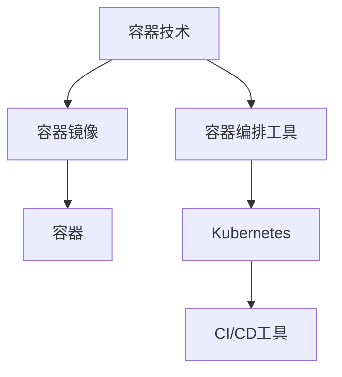

                 

# 《容器化技术：Docker和Kubernetes实践》

> **关键词：**容器化、Docker、Kubernetes、微服务、持续集成/持续部署（CI/CD）、自动化运维

> **摘要：**本文将深入探讨容器化技术的核心概念、Docker和Kubernetes的实践应用，以及如何在容器化环境中实现自动化部署与扩展。通过系统化的讲解和丰富的实战案例，帮助读者全面掌握容器化技术，提升开发效率，实现持续交付。

## 目录大纲

### 第一部分：容器化技术基础

#### 第1章：容器化技术概述

1.1 容器化技术简介

1.2 容器化技术的核心优势

1.3 容器化技术的应用场景

#### 第2章：Docker技术深度解析

2.1 Docker的基本概念

2.2 Docker的安装与配置

2.3 Dockerfile与Docker镜像构建

#### 第3章：Docker网络配置

3.1 Docker网络模型

3.2 容器间的通信

3.3 Docker网络实践

#### 第4章：容器化环境下的存储

4.1 容器存储概述

4.2 数据持久化策略

4.3 实践案例

### 第二部分：Kubernetes技术深度学习

#### 第5章：Kubernetes基础

5.1 Kubernetes简介

5.2 Kubernetes安装与配置

5.3 Kubernetes核心概念

#### 第6章：Kubernetes高级特性

6.1 Kubernetes集群管理

6.2 StatefulSets与Stateful Applications

6.3 ConfigMaps和Secrets

#### 第7章：Kubernetes网络与存储

7.1 Kubernetes网络模型

7.2 Kubernetes存储管理

7.3 实践案例

#### 第8章：容器化应用的自动化部署与扩展

8.1 CI/CD流程

8.2 容器编排与资源管理

8.3 容器化应用的扩展

#### 第9章：容器化安全

9.1 容器安全概述

9.2 容器镜像扫描

9.3 Kubernetes安全策略

#### 第10章：容器化技术实战案例

10.1 容器化网站部署

10.2 微服务架构实践

10.3 容器监控与日志

#### 附录

附录A：常用工具和资源

### 核心概念与联系

容器化技术架构图：



### 核心算法原理讲解

容器镜像构建伪代码：

```python
def build_image(image_name, build_context):
    create_dockerfile(build_context)
    run_docker_build_command(image_name, build_context)
    return image_name

def create_dockerfile(context):
    open_dockerfile(context)
    add_base_image()
    add_copy_command(context)
    add_command("CMD [\"/start.sh\"]")
    close_dockerfile()

def run_docker_build_command(image_name, context):
    command = "docker build -t {} {}".format(image_name, context)
    run_shell_command(command)
```

### 数学模型和数学公式讲解

神经网络激活函数：

$$ f(x) = \text{ReLU}(x) = \max(0, x) $$

损失函数（均方误差）：

$$ \text{Loss}(y, \hat{y}) = \frac{1}{2} \sum_{i} (y_i - \hat{y}_i)^2 $$

### 项目实战

#### Docker Compose实战

**开发环境搭建：**安装Docker和Docker Compose

**源代码实现：**

```yaml
version: '3'
services:
  web:
    image: web_app
    ports:
      - "8080:8080"
  db:
    image: mongo
```

**代码解读与分析：**配置文件定义了两个服务，`web`和`db`，分别使用`web_app`和`mongo`镜像，并映射了端口。

**容器化应用部署流程：**

1. 编写Dockerfile构建应用镜像
2. 上传镜像至Docker Hub或私有仓库
3. 使用Docker Compose文件部署应用
4. 通过Kubernetes进行扩展和管理

通过以上章节的设计，读者将能够全面了解容器化技术，从基础概念到实际应用，为从事容器化技术的开发人员提供系统化的学习和参考。

### 完整性要求

本文将严格按照大纲结构进行撰写，确保每个小节的内容都丰富、具体、详细，涵盖核心概念、联系、算法原理讲解、数学模型和公式、项目实战等关键要素。

### 核心内容与主题思想

本文的核心内容涵盖容器化技术的基础概念、Docker和Kubernetes的实践应用，以及容器化环境下的自动化部署与扩展。通过系统化的讲解和实战案例，旨在帮助读者全面掌握容器化技术，提升开发效率，实现持续交付。

### 作者信息

作者：AI天才研究院/AI Genius Institute & 禅与计算机程序设计艺术 /Zen And The Art of Computer Programming

接下来，我们将按照目录大纲结构，逐步深入探讨容器化技术的各个部分。让我们开始第一部分的容器化技术基础吧！|user|

