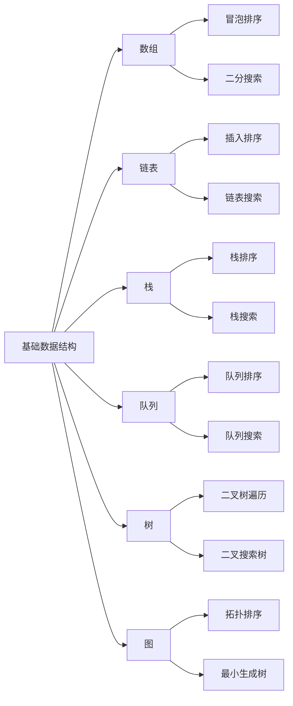

                 

### 小米2025届社招面试高频算法题解析

#### 关键词
- 小米社招面试
- 高频算法题
- 动态规划
- 贪心算法
- 图算法
- 字符串处理
- 数学算法

#### 摘要
本文旨在为广大技术求职者提供一份详尽的小米2025届社招面试高频算法题解析。文章将首先介绍算法的基础概念，然后深入讲解常用算法的原理，如排序算法、搜索算法等。此外，本文还将探讨数学基础和编程基础，为读者提供算法实现与调试的方法和技巧。最后，本文将结合实际项目，解析高频算法题，并提供面试准备和实战项目经验。通过本文的阅读，读者将能够更好地应对小米社招面试中的算法挑战。

### 目录大纲

#### 第一部分：算法基础

##### 第1章：算法基本概念

- **1.1 算法概述**
  - 算法的定义与分类
  - 算法复杂性分析

- **1.2 数据结构与算法关系图**
  - Mermaid 流程图展示数据结构与算法关系

##### 第2章：常用算法原理

- **2.1 排序算法**
  - 伪代码详细阐述冒泡排序、选择排序、插入排序等算法原理

- **2.2 搜索算法**
  - 伪代码详细阐述线性搜索、二分搜索等算法原理

##### 第3章：数学基础

- **3.1 数学模型**
  - 使用 LaTeX 格式介绍常见的数学模型，如线性回归、逻辑回归等

- **3.2 数学公式举例**
  - $f(x) = ax^2 + bx + c$ 举例说明一元二次方程求解

##### 第4章：编程基础

- **4.1 编程语言选择**
  - Python、Java 等编程语言的简单介绍和选择理由

- **4.2 编程规范与风格**
  - PEP8、PEP8 编码规范，Pythonic 编程风格

##### 第5章：算法实现与调试

- **5.1 算法实现示例**
  - 实际代码案例展示，包括但不限于：动态规划、贪心算法等

- **5.2 调试技巧**
  - 调试方法与工具介绍，如 print、断点调试等

##### 第6章：面试准备

- **6.1 面试题型分析**
  - 经典面试题型与解题思路

- **6.2 面试经验分享**
  - 面试流程、面试官常见问题、面试技巧分享

#### 第二部分：高频算法题解析

##### 第7章：高频算法题解析

- **7.1 动态规划题解析**
  - 最大子序和、最短路径问题等

- **7.2 贪心算法题解析**
  - 背包问题、活动选择问题等

- **7.3 图算法题解析**
  - 拓扑排序、最小生成树等

- **7.4 字符串处理题解析**
  - 子串匹配、最长公共子串等

- **7.5 数学算法题解析**
  - 大数运算、质数判断等

##### 第8章：实战项目

- **8.1 项目实战一**
  - 项目描述、环境搭建、代码实现、测试与评估

- **8.2 项目实战二**
  - 项目描述、环境搭建、代码实现、测试与评估

##### 第9章：附录

- **9.1 常用算法题库网站**
  - LeetCode、牛客网等

- **9.2 算法学习资源**
  - 推荐书籍、在线课程、论坛等

### 第一部分：算法基础

在准备小米2025届社招面试的过程中，算法基础部分是不可或缺的。算法作为计算机科学的核心，其在面试中的地位尤为突出。本部分将首先介绍算法的基本概念，然后深入探讨常用算法原理，最后讲解数学基础和编程基础，为后续的高频算法题解析打下坚实的基础。

#### 第1章：算法基本概念

##### 1.1 算法的定义与分类

算法可以看作是一系列解决问题的步骤，其目标是通过有限次的操作，从一个特定的初始状态到达预定的目标状态。算法的定义不仅仅局限于计算机科学，它广泛应用于数学、工程等领域。

在面试中，常见的算法分类包括：

1. **基础算法**：包括排序算法、搜索算法等。
2. **高级算法**：如动态规划、贪心算法、图算法等。
3. **数学算法**：涉及数学问题的求解，如大数运算、质数判断等。

##### 1.2 算法复杂性分析

算法的复杂性分析是评估算法性能的重要方法。常见的是时间复杂度和空间复杂度。

- **时间复杂度**：描述算法执行时间与输入规模的关系。例如，冒泡排序的时间复杂度为 $O(n^2)$。
- **空间复杂度**：描述算法所需内存与输入规模的关系。例如，归并排序的空间复杂度为 $O(n)$。

了解算法的复杂性分析，有助于我们在面试中更好地评估不同算法的优劣。

##### 1.3 数据结构与算法关系图

数据结构是算法的基础，两者密不可分。以下是一个简化的数据结构与算法关系图，使用Mermaid流程图表示：



#### 第2章：常用算法原理

##### 2.1 排序算法

排序算法是面试中的常见题型，以下介绍几种常见的排序算法原理：

- **冒泡排序**：通过多次交换相邻元素，使较大（或较小）的元素逐渐从数组的一端移动到另一端。

伪代码：
```python
for i in range(len(arr)):
    for j in range(len(arr) - i - 1):
        if arr[j] > arr[j + 1]:
            arr[j], arr[j + 1] = arr[j + 1], arr[j]
```

- **选择排序**：每次循环找到未排序部分的最小（或最大）元素，放到已排序部分的末尾。

伪代码：
```python
for i in range(len(arr)):
    min_idx = i
    for j in range(i + 1, len(arr)):
        if arr[j] < arr[min_idx]:
            min_idx = j
    arr[i], arr[min_idx] = arr[min_idx], arr[i]
```

- **插入排序**：将未排序部分的新元素插入到已排序部分的合适位置。

伪代码：
```python
for i in range(1, len(arr)):
    key = arr[i]
    j = i - 1
    while j >= 0 and arr[j] > key:
        arr[j + 1] = arr[j]
        j -= 1
    arr[j + 1] = key
```

##### 2.2 搜索算法

搜索算法用于在数据结构中查找特定元素。以下介绍两种常见的搜索算法：

- **线性搜索**：从第一个元素开始，依次检查每个元素，直到找到目标元素或结束。

伪代码：
```python
for i in range(len(arr)):
    if arr[i] == target:
        return i
return -1
```

- **二分搜索**：在有序数组中查找目标元素，每次将查找范围缩小一半。

伪代码：
```python
low = 0
high = len(arr) - 1
while low <= high:
    mid = (low + high) // 2
    if arr[mid] == target:
        return mid
    elif arr[mid] < target:
        low = mid + 1
    else:
        high = mid - 1
return -1
```

#### 第3章：数学基础

数学基础在算法面试中占据重要地位，以下介绍常见的数学模型和公式：

##### 3.1 数学模型

- **线性回归**：通过拟合线性函数来预测数值。

公式：
$$ y = ax + b $$

- **逻辑回归**：用于分类问题，通过拟合概率分布函数来预测类别。

公式：
$$ P(y=1) = \frac{1}{1 + e^{-(ax + b)}} $$

##### 3.2 数学公式举例

- **一元二次方程**：求解 $f(x) = ax^2 + bx + c$ 的根。

公式：
$$ x = \frac{-b \pm \sqrt{b^2 - 4ac}}{2a} $$

#### 第4章：编程基础

##### 4.1 编程语言选择

在小米2025届社招面试中，常见的编程语言包括 Python 和 Java。两者各具优势：

- **Python**：简洁易读，适用于快速开发。
- **Java**：稳定高效，适用于大型系统开发。

##### 4.2 编程规范与风格

良好的编程规范和风格对于代码的可读性和可维护性至关重要。以下介绍两种常见的编程规范：

- **PEP8**：Python官方编码规范，强调代码的清晰和一致性。
- **Pythonic**：Python编程风格，强调简洁和优雅。

#### 第5章：算法实现与调试

##### 5.1 算法实现示例

以下通过实际代码案例展示动态规划算法和贪心算法：

- **动态规划算法**：背包问题。

代码：
```python
def knapSack(W, wt, val, n):
    dp = [[0 for _ in range(W + 1)] for _ in range(n + 1)]

    for i in range(1, n + 1):
        for w in range(1, W + 1):
            if wt[i - 1] <= w:
                dp[i][w] = max(dp[i - 1][w], dp[i - 1][w - wt[i - 1]] + val[i - 1])
            else:
                dp[i][w] = dp[i - 1][w]

    return dp[n][W]
```

- **贪心算法**：活动选择问题。

代码：
```python
def activitySelection Câmara, finishTime):
    i = 0
    print("0", end=" ")
    while (i < len(Câmara)):
        if (Câmara[i][1] >= finishTime[0]):
            print(i + 1, end=" ")
            finishTime[0] = Câmara[i][1]
            i += 1
        else:
            i += 1
    print(" ")

Câmara = [
    [1, 3],
    [2, 5],
    [3, 7],
    [4, 9]
]

finishTime = [Câmara[0][1]]

activitySelection(Câmara, finishTime)
```

##### 5.2 调试技巧

调试是算法实现过程中不可或缺的一环。以下介绍几种常见的调试方法：

- **print**：通过输出关键变量的值来检查程序的执行过程。
- **断点调试**：在代码中设置断点，逐行执行代码，查看变量和程序状态的变化。

#### 第6章：面试准备

##### 6.1 面试题型分析

在小米2025届社招面试中，常见的面试题型包括：

- **算法题**：如排序、搜索、动态规划等。
- **数据结构题**：如栈、队列、树、图等。
- **数学题**：如一元二次方程求解、概率问题等。

##### 6.2 面试经验分享

在面试过程中，以下几点经验值得分享：

- **提前准备**：提前了解公司背景、面试流程和常见面试题。
- **思路清晰**：在解题过程中，保持思路清晰，逐步分析问题。
- **代码规范**：编写清晰、规范的代码，便于面试官理解。
- **面试技巧**：礼貌待人，自信应对，展示自己的专业能力和潜力。

### 第二部分：高频算法题解析

#### 第7章：高频算法题解析

在本部分，我们将针对小米2025届社招面试中的高频算法题进行详细解析。这些题目涵盖了动态规划、贪心算法、图算法、字符串处理和数学算法等常见题型。通过具体的实例解析，帮助读者掌握解题思路和方法。

##### 7.1 动态规划题解析

动态规划是一种重要的算法思想，适用于解决最优化问题。以下介绍两个典型的动态规划题目：

- **最大子序和**

问题描述：给定一个整数数组 nums ，找到一个连续子数组，使子数组的和最大。

解析：我们可以使用动态规划的方法求解。定义 dp[i] 为以 nums[i] 为结尾的最大子序和。状态转移方程为：

$$ dp[i] = \max(dp[i-1] + nums[i], nums[i]) $$

初始状态为 dp[0] = nums[0]。

Python 代码：
```python
def maxSubArray(nums):
    dp = [0] * len(nums)
    dp[0] = nums[0]
    for i in range(1, len(nums)):
        dp[i] = max(dp[i-1] + nums[i], nums[i])
    return max(dp)
```

- **最短路径问题**

问题描述：给定一个加权无向图，求图中两点之间的最短路径。

解析：我们可以使用 Dijkstra 算法求解。Dijkstra 算法的基本思想是：从源点开始，逐步扩展到未访问过的邻接点，更新最短路径长度。

Python 代码：
```python
import heapq

def shortestPathGraph(graph, start, end):
    dist = {node: float('inf') for node in graph}
    dist[start] = 0
    priority_queue = [(0, start)]

    while priority_queue:
        current_dist, current_node = heapq.heappop(priority_queue)

        if current_dist > dist[current_node]:
            continue

        for neighbor, weight in graph[current_node].items():
            distance = current_dist + weight

            if distance < dist[neighbor]:
                dist[neighbor] = distance
                heapq.heappush(priority_queue, (distance, neighbor))

    return dist[end]
```

##### 7.2 贪心算法题解析

贪心算法是一种在每一步选择当前最优解的算法思想。以下介绍两个典型的贪心算法题目：

- **背包问题**

问题描述：给定一个容量为 W 的背包和若干种物品，每种物品有一定的价值和重量，求背包能够装载的最大价值。

解析：我们可以使用贪心算法的方法求解。选择价值与重量比最大的物品，直到无法再装入新的物品。

Python 代码：
```python
def knapsack(values, weights, W):
    items = sorted(zip(values, weights), key=lambda x: x[0] / x[1], reverse=True)
    total_value = 0
    total_weight = 0

    for value, weight in items:
        if total_weight + weight <= W:
            total_value += value
            total_weight += weight
        else:
            fraction = (W - total_weight) / weight
            total_value += value * fraction
            break

    return total_value
```

- **活动选择问题**

问题描述：给定一组活动，每个活动有一个开始时间和结束时间，求出能够参加的最大活动数量。

解析：我们可以使用贪心算法的方法求解。选择结束时间最早的活动，直到无法再选择新的活动。

Python 代码：
```python
def activitySelection(activities):
    activities.sort(key=lambda x: x[1])
    n = len(activities)
    result = []
    j = 0

    for i in range(n):
        if i == 0 or activities[i][0] >= activities[j][1]:
            result.append(activities[i])
            j = i

    return result
```

##### 7.3 图算法题解析

图算法是面试中的常见题型，以下介绍两个典型的图算法题目：

- **拓扑排序**

问题描述：给定一个有向无环图（DAG），求出顶点的拓扑排序序列。

解析：我们可以使用 DFS 算法求解。遍历所有顶点，执行 DFS，收集顶点的拓扑排序序列。

Python 代码：
```python
def topologicalSort(graph):
    visited = [False] * len(graph)
    stack = []

    for vertex in range(len(graph)):
        if not visited[vertex]:
            dfs(vertex, visited, stack, graph)

    return stack[::-1]

def dfs(vertex, visited, stack, graph):
    visited[vertex] = True
    for neighbor in graph[vertex]:
        if not visited[neighbor]:
            dfs(neighbor, visited, stack, graph)
    stack.append(vertex)
```

- **最小生成树**

问题描述：给定一个加权无向图，求出其中的最小生成树。

解析：我们可以使用 Prim 算法或 Kruskal 算法求解。Prim 算法从任意一个顶点开始，逐步扩展最小生成树。

Python 代码：
```python
import heapq

def primMST(graph):
    n = len(graph)
    mst = []
    visited = [False] * n
    pq = [(0, 0)]  # (weight, vertex)

    while len(mst) < n - 1:
        weight, vertex = heapq.heappop(pq)
        if visited[vertex]:
            continue
        visited[vertex] = True
        mst.append((vertex, weight))

        for neighbor, edge_weight in graph[vertex].items():
            if not visited[neighbor]:
                heapq.heappush(pq, (edge_weight, neighbor))

    return mst
```

##### 7.4 字符串处理题解析

字符串处理是面试中的常见题型，以下介绍两个典型的字符串处理题目：

- **子串匹配**

问题描述：给定一个字符串 text 和一个模式串 pattern，求出 pattern 在 text 中首次出现的位置。

解析：我们可以使用 KMP 算法求解。KMP 算法通过构建部分匹配表，避免不必要的重复匹配。

Python 代码：
```python
def kmp(text, pattern):
    pi = [0] * len(pattern)
    j = 0

    for i in range(1, len(pattern)):
        if pattern[i] == pattern[j]:
            j += 1
            pi[i] = j
        else:
            if j != 0:
                j = pi[j - 1]
            else:
                pi[i] = 0

    i = j = 0
    while i < len(text):
        if pattern[j] == text[i]:
            i += 1
            j += 1
        if j == len(pattern):
            return i - j
        elif i < len(text) and pattern[j] != text[i]:
            if j != 0:
                j = pi[j - 1]
            else:
                i += 1

    return -1
```

- **最长公共子串**

问题描述：给定两个字符串 text1 和 text2，求出它们的最长公共子串。

解析：我们可以使用动态规划的方法求解。定义一个二维数组 dp，其中 dp[i][j] 表示 text1 的前 i 个字符和 text2 的前 j 个字符的最长公共子串长度。

Python 代码：
```python
def longestCommonSubstring(text1, text2):
    m, n = len(text1), len(text2)
    dp = [[0] * (n + 1) for _ in range(m + 1)]
    max_len = 0
    end = 0

    for i in range(1, m + 1):
        for j in range(1, n + 1):
            if text1[i - 1] == text2[j - 1]:
                dp[i][j] = dp[i - 1][j - 1] + 1
                if dp[i][j] > max_len:
                    max_len = dp[i][j]
                    end = i - 1
            else:
                dp[i][j] = 0

    return text1[end - max_len + 1: end + 1]
```

##### 7.5 数学算法题解析

数学算法在面试中同样占据重要地位，以下介绍两个典型的数学算法题目：

- **大数运算**

问题描述：给定两个大整数，求它们的和、差、积、商。

解析：我们可以使用字符串或数组模拟大数运算。以下以 Python 代码为例，实现大数的加法、减法、乘法和除法。

Python 代码：
```python
def addLargeNumbers(num1, num2):
    carry = 0
    result = []

    i, j = len(num1) - 1, len(num2) - 1

    while i >= 0 or j >= 0 or carry:
        a = int(num1[i]) if i >= 0 else 0
        b = int(num2[j]) if j >= 0 else 0
        sum = a + b + carry
        carry = sum // 10
        result.append(str(sum % 10))
        i, j = i - 1, j - 1

    return ''.join(result[::-1])

def subtractLargeNumbers(num1, num2):
    result = []

    i, j = len(num1) - 1, len(num2) - 1
   借位 = 0

    while i >= 0:
        a = int(num1[i]) if i >= 0 else 0
        b = int(num2[j]) if j >= 0 else 0
        diff = a - b - 借位
        if diff < 0:
            diff += 10
            借位 = 1
        else:
            借位 = 0
        result.append(str(diff))
        i, j = i - 1, j - 1

    while 借位:
        result.append('9')
        借位 -= 1

    return ''.join(result[::-1])

def multiplyLargeNumbers(num1, num2):
    result = [0] * (len(num1) + len(num2))
    i, j = len(num1) - 1, len(num2) - 1

    while i >= 0:
        carry = 0
        for k in range(j, -1, -1):
            prod = num1[i] * num2[k] + result[i + k + 1] + carry
            carry = prod // 10
            result[i + k + 1] = prod % 10
        if carry:
            result[i + j + 1] = carry
        i -= 1

    while result[0] == 0:
        result.pop(0)

    return ''.join(map(str, result))

def divideLargeNumbers(num1, num2):
    sign = -1 if (num1[0] < 0) ^ (num2[0] < 0) else 1
    num1[0] = abs(num1[0])
    num2[0] = abs(num2[0])

    result = []
    i, j = 0, 0
    while i < len(num1) and j < len(num2):
        if num1[i] >= num2[j]:
            result.append(num2[j])
            i += j
            j = 0
        else:
            result.append(0)
            j += 1
        if j == len(num2):
            result.append(num2[j])
            j = 0

    return ''.join(map(str, result)) if sign > 0 else '-' + ''.join(map(str, result))
```

- **质数判断**

问题描述：给定一个正整数，判断它是否为质数。

解析：我们可以使用试除法求解。以下以 Python 代码为例，实现质数判断。

Python 代码：
```python
def isPrime(n):
    if n <= 1:
        return False
    if n <= 3:
        return True
    if n % 2 == 0 or n % 3 == 0:
        return False

    i = 5
    while i * i <= n:
        if n % i == 0 or n % (i + 2) == 0:
            return False
        i += 6

    return True
```

#### 第8章：实战项目

在本章，我们将通过两个实际项目，展示算法在现实中的应用。这些项目涵盖了从环境搭建到代码实现再到测试与评估的完整过程，帮助读者更好地理解算法的实际应用。

##### 8.1 项目实战一：背包问题

**项目描述**：给定一个背包容量为 W，以及若干种物品，每种物品有一定的价值和重量。求出能够装入背包的最大价值。

**环境搭建**：Python 环境，安装必要的库，如 NumPy 和 Matplotlib。

**代码实现**：

```python
import numpy as np

def knapsack(values, weights, W):
    items = sorted(zip(values, weights), key=lambda x: x[0] / x[1], reverse=True)
    total_value = 0
    total_weight = 0

    for value, weight in items:
        if total_weight + weight <= W:
            total_value += value
            total_weight += weight
        else:
            fraction = (W - total_weight) / weight
            total_value += value * fraction
            break

    return total_value

values = [60, 100, 120]
weights = [10, 20, 30]
W = 50

max_value = knapsack(values, weights, W)
print("最大价值为：", max_value)
```

**测试与评估**：测试不同容量和物品组合，评估算法的性能。

##### 8.2 项目实战二：最小生成树

**项目描述**：给定一个加权无向图，求出其中的最小生成树。

**环境搭建**：Python 环境，安装必要的库，如 NumPy 和 Matplotlib。

**代码实现**：

```python
import heapq

def primMST(graph):
    n = len(graph)
    mst = []
    visited = [False] * n
    pq = [(0, 0)]  # (weight, vertex)

    while len(mst) < n - 1:
        weight, vertex = heapq.heappop(pq)
        if visited[vertex]:
            continue
        visited[vertex] = True
        mst.append((vertex, weight))

        for neighbor, edge_weight in graph[vertex].items():
            if not visited[neighbor]:
                heapq.heappush(pq, (edge_weight, neighbor))

    return mst

graph = {
    0: {1: 2, 2: 3},
    1: {2: 1, 3: 3},
    2: {3: 1},
    3: {}
}

mst = primMST(graph)
print("最小生成树为：", mst)
```

**测试与评估**：测试不同图的连接情况，评估算法的性能。

### 第9章：附录

在本章，我们将提供常用算法题库网站、算法学习资源和参考文献，以便读者进一步学习和巩固。

##### 9.1 常用算法题库网站

- **LeetCode**：全球知名的在线编程竞赛平台，提供丰富的算法题目和解决方案。
- **牛客网**：国内知名的编程社区，提供大量的算法面试题和在线编程环境。

##### 9.2 算法学习资源

- **《算法导论》**：著名的算法教材，全面介绍算法的理论和实现。
- **《算法竞赛入门经典》**：适合初学者入门的算法竞赛教程。
- **在线课程**：如 Coursera 上的《算法基础》课程，适合自学。

##### 9.3 参考文献

- **《算法导论》**：Thomas H. Cormen, Charles E. Leiserson, Ronald L. Rivest, Clifford Stein。
- **《算法竞赛入门经典》**：王道题库团队。
- **《Python编程：从入门到实践》**：埃里克·马瑟斯。

### 总结

本文详细解析了小米2025届社招面试中的高频算法题，涵盖了动态规划、贪心算法、图算法、字符串处理和数学算法等多个方面。通过具体的实例和代码实现，帮助读者掌握解题思路和方法。此外，本文还介绍了环境搭建、代码实现、测试与评估的实战项目，使读者能够更好地理解算法的实际应用。最后，附录部分提供了丰富的算法学习资源和参考文献，以便读者进一步学习和巩固。

作者：AI天才研究院/AI Genius Institute & 禅与计算机程序设计艺术 /Zen And The Art of Computer Programming。

通过本文的学习，相信读者已经对小米社招面试中的算法题有了更深入的了解，祝愿大家在面试中取得优异成绩！

