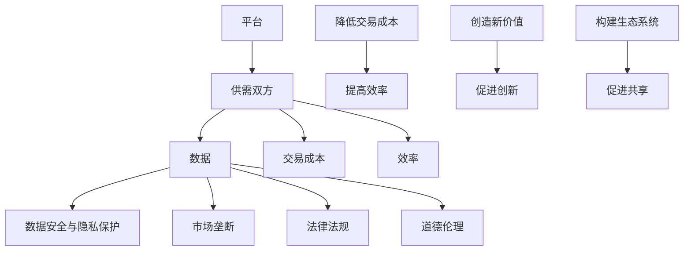
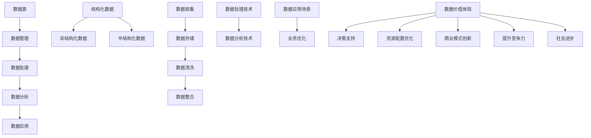
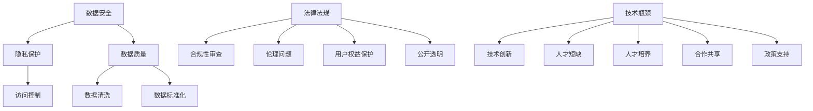
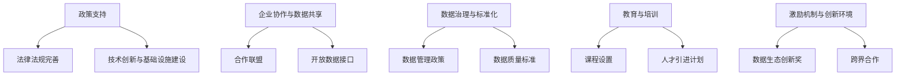
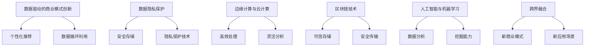
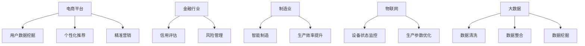
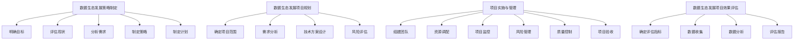
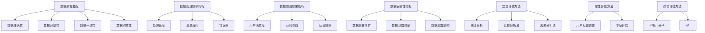
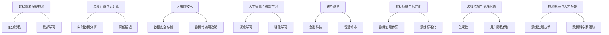

                 

# 平台经济的数据生态发展：如何促进数据生态发展？

## 概述

在当前数字经济蓬勃发展的背景下，平台经济已经成为全球经济的重要组成部分。平台经济通过连接供需双方，创造了一个高效、低成本的交易环境，极大地推动了社会生产力的发展。而数据作为平台经济的核心资源，其重要性日益凸显。数据生态的发展，不仅关系到平台经济的可持续发展，更是数字经济时代的核心竞争力所在。

本文将围绕平台经济的数据生态发展展开讨论，首先对平台经济和数据生态进行概述，然后深入探讨平台经济中的数据利用、数据生态发展的障碍与挑战、发展策略与措施、可持续发展等方面。通过案例研究和实战分析，我们将揭示平台经济数据生态发展的关键路径，为未来数据生态建设提供有益的参考。

## 关键词

- 平台经济
- 数据生态
- 数据利用
- 数据安全
- 数据共享
- 数据治理
- 数据挖掘
- 数据分析

## 摘要

本文探讨了平台经济的数据生态发展，分析了平台经济的起源、模式、优势与挑战，以及数据生态的基本概念、构成要素和价值。文章从数据收集与整合、数据存储与处理、数据分析与挖掘等方面，详细阐述了平台经济中的数据利用。接着，文章分析了数据生态发展的障碍与挑战，包括数据安全与隐私保护、数据质量与标准化、法律法规与伦理问题等。在此基础上，文章提出了数据生态发展的策略与措施，包括政策支持、技术创新、企业协作等。最后，通过案例研究和效果评估，文章展望了平台经济的数据生态发展未来，为推动数据生态建设提供了指导。

## 平台经济的概念与模式

### 平台经济的起源与发展

平台经济起源于20世纪末，随着互联网技术的迅猛发展，特别是电子商务的兴起，逐渐成为一种新的经济模式。平台经济的概念最早由哈佛商学院的迈克尔·波特（Michael Porter）在1996年提出，他认为平台是企业连接消费者和供应商的桥梁，通过降低交易成本、提高交易效率，创造新的价值。

平台经济在21世纪初得到了快速发展。随着移动互联网、大数据、云计算、人工智能等新技术的应用，平台经济模式不断创新，逐渐覆盖了各个行业。从最初的电子商务平台，如淘宝、亚马逊，到后来的共享经济平台，如滴滴、Uber，再到现代的社交平台，如微信、Facebook，平台经济已经成为现代经济体系的重要支柱。

### 平台经济的核心模式

平台经济的核心模式主要包括以下几个方面：

1. **连接供需**：平台通过技术手段将供需双方连接起来，实现信息共享和交易匹配。例如，电商平台通过搜索、推荐等算法，帮助消费者找到所需商品，同时为商家提供销售渠道。

2. **降低交易成本**：平台通过减少中间环节，提高交易效率，降低交易成本。例如，共享经济平台通过直接连接供需双方，减少了传统租赁和交通等环节的费用。

3. **创造新价值**：平台通过数据分析和商业模式创新，为供需双方创造新的价值。例如，金融平台通过数据分析，为用户提供个性化金融服务，同时为金融机构提供风控支持。

4. **构建生态系统**：平台不仅连接供需双方，还吸引第三方服务商加入，共同构建生态系统。例如，开发者平台如苹果的App Store、谷歌的Google Play，吸引了大量应用开发者，形成了庞大的生态系统。

### 平台经济的优势与挑战

平台经济具有多方面的优势：

1. **提高效率**：平台通过技术手段，实现信息的高效传递和交易的高效匹配，提高了整体经济效率。

2. **降低成本**：平台减少了中间环节，降低了交易成本，使得供需双方能够以更低的成本进行交易。

3. **促进创新**：平台为创业者提供了机会，激发了市场活力，促进了商业模式和技术创新。

4. **促进共享**：平台将资源整合起来，实现了资源的共享和优化配置，提高了资源利用效率。

然而，平台经济也面临一些挑战：

1. **数据安全与隐私保护**：平台大量收集和使用用户数据，容易引发数据安全和隐私保护问题。

2. **市场垄断**：大型平台容易形成市场垄断，影响市场公平竞争。

3. **法律法规**：随着平台经济的发展，现有的法律法规体系可能难以适应，需要不断调整和完善。

4. **道德伦理**：平台在数据收集、使用和隐私保护等方面，需要遵守道德伦理标准，避免滥用数据。

### 结论

平台经济作为一种新兴的经济模式，具有巨大的发展潜力。通过连接供需、降低成本、创造新价值和构建生态系统，平台经济为现代经济体系注入了新的活力。然而，面对数据安全、市场垄断、法律法规和道德伦理等方面的挑战，平台经济也需要不断进行调整和完善，以确保其可持续发展。

### 核心概念与联系

平台经济的核心概念包括平台、供需双方、数据、交易成本和效率等。以下是平台经济的基本概念和它们之间的联系：



这个Mermaid流程图展示了平台经济中各个核心概念之间的联系，以及它们在平台经济运作中的重要性。

## 数据生态的基本概念

### 数据的定义与分类

数据是平台经济的核心资源，其定义和分类对于理解数据生态具有重要意义。数据可以定义为“通过记录、存储和处理后，可以用于描述客观事物的信息”。根据不同的分类标准，数据可以划分为多种类型。

1. **结构化数据**：结构化数据是有组织、可检索的数据，如关系型数据库中的数据表。结构化数据易于存储、处理和分析，是数据生态中最常见的数据类型。

2. **非结构化数据**：非结构化数据是指没有固定格式或结构的数据，如文本、图像、音频和视频。非结构化数据的处理相对复杂，但它们包含了大量有价值的信息。

3. **半结构化数据**：半结构化数据介于结构化数据和非结构化数据之间，具有部分结构化特征，如XML、JSON等格式。半结构化数据的处理难度介于两者之间。

### 数据生态的构成要素

数据生态由多个构成要素组成，包括数据源、数据管理、数据处理、数据分析、数据应用等。

1. **数据源**：数据源是数据的产生者，可以是传感器、设备、应用等。数据源的类型和数量直接影响数据生态的质量和规模。

2. **数据管理**：数据管理涉及数据的收集、存储、清洗、整合等过程。有效的数据管理是确保数据质量和可用性的关键。

3. **数据处理**：数据处理包括数据的预处理、存储、计算等。数据处理技术如ETL（提取、转换、加载）、流处理等，对于数据生态的运作至关重要。

4. **数据分析**：数据分析利用统计、机器学习等方法，从数据中提取有价值的信息和知识。数据分析技术包括数据挖掘、机器学习、深度学习等。

5. **数据应用**：数据应用是将数据分析结果应用于实际业务场景，如决策支持、预测分析、个性化推荐等。数据应用是数据生态的最终价值体现。

### 数据生态的价值与影响

数据生态的价值和影响体现在多个方面：

1. **提高决策效率**：通过数据分析和挖掘，企业可以更快速、准确地做出决策，提高业务效率。

2. **优化资源配置**：数据生态可以帮助企业优化资源配置，实现资源的最优利用，降低成本。

3. **创新商业模式**：数据生态为企业提供了新的商业模式和创新机会，如大数据营销、个性化服务、智能供应链等。

4. **提升竞争力**：拥有强大数据生态的企业，可以在市场中占据有利地位，提升竞争力。

5. **推动社会进步**：数据生态的发展不仅对企业有利，还可以推动社会进步，如改善公共服务、促进科技创新、提升社会治理水平等。

### 结论

数据生态是平台经济的重要组成部分，其定义、分类、构成要素和价值直接影响平台经济的运作和发展。了解数据生态的基本概念，有助于我们更好地把握数据生态的发展趋势，推动平台经济的可持续发展。

### 核心概念与联系

以下是数据生态的基本概念和它们之间的联系：



这个Mermaid流程图展示了数据生态中各个基本概念之间的联系，以及它们在数据生态运作中的重要性。

## 平台经济中的数据利用

在平台经济中，数据的收集、存储、处理和分析是各个环节中至关重要的一环。这些环节不仅决定了数据生态的质量，还直接影响平台经济的效率和效益。下面，我们将详细探讨平台经济中的数据利用。

### 数据收集

数据收集是数据利用的第一步，其目标是获取尽可能多的原始数据。平台经济中的数据收集可以通过以下几种方式实现：

1. **用户行为数据**：通过用户在平台上的活动，如浏览、购买、评论等，收集用户行为数据。这些数据可以反映用户的兴趣、偏好和需求。

2. **传感器数据**：在平台经济中，传感器数据广泛应用于物流、仓储、制造等领域。例如，通过传感器监控货物的实时位置和状态，优化物流流程。

3. **第三方数据**：通过与其他数据源的合作，获取第三方数据，如公共数据、社交媒体数据等。这些数据可以补充平台自身的用户行为数据，提供更全面的视角。

### 数据存储

数据存储是将收集到的数据安全、高效地保存起来的过程。平台经济中的数据存储通常涉及以下几个方面：

1. **关系型数据库**：适用于存储结构化数据，如用户信息、订单记录等。关系型数据库具有高效、稳定的特点。

2. **非关系型数据库**：适用于存储非结构化数据，如日志文件、社交媒体内容等。非关系型数据库具有灵活、可扩展的特点。

3. **分布式存储**：通过分布式存储系统，如Hadoop、Cassandra等，实现海量数据的存储和管理。分布式存储具有高可用性、高可靠性、高扩展性等特点。

### 数据处理

数据处理是对收集到的数据进行清洗、转换和整合的过程。平台经济中的数据处理通常包括以下几种技术：

1. **ETL（Extract, Transform, Load）**：ETL是数据集成和处理的基本流程，通过提取、转换和加载，实现数据的清洗、转换和整合。

2. **流处理**：流处理技术适用于处理实时数据，如用户行为数据、传感器数据等。通过流处理，可以实现数据的实时分析和处理。

3. **批处理**：批处理技术适用于处理批量数据，如定期统计、报表生成等。批处理具有高效、稳定的特点。

### 数据分析

数据分析是对处理后的数据进行深入挖掘和分析，以提取有价值的信息和知识。平台经济中的数据分析通常包括以下几种方法：

1. **统计方法**：通过统计学方法，对数据进行描述性分析和推断性分析，如均值、方差、回归分析等。

2. **机器学习方法**：通过机器学习算法，对数据进行分析和预测，如分类、聚类、回归等。

3. **深度学习方法**：通过深度学习算法，对复杂数据进行分析和建模，如卷积神经网络、循环神经网络等。

### 数据应用

数据应用是将数据分析结果应用于实际业务场景，以实现商业价值。平台经济中的数据应用通常包括以下几个方面：

1. **个性化推荐**：通过分析用户行为数据，为用户推荐个性化商品、内容等，提升用户体验。

2. **智能决策**：通过数据分析，为企业提供智能决策支持，如销售预测、库存管理、风险控制等。

3. **优化运营**：通过数据分析，优化平台运营流程，如订单处理、物流管理、客户服务等。

### 案例研究：电商平台的数据利用

以电商平台为例，我们可以看到数据在平台经济中的广泛应用：

1. **用户行为分析**：电商平台通过收集用户浏览、购买、评论等行为数据，分析用户的兴趣和需求，为用户推荐个性化商品。

2. **供应链优化**：通过分析物流数据，电商平台可以优化库存管理、配送路径，提高物流效率。

3. **风险控制**：通过数据分析，电商平台可以识别异常交易、防范欺诈行为，保障交易安全。

4. **营销策略**：电商平台通过分析用户数据，制定个性化营销策略，提升用户转化率和销售业绩。

### 结论

平台经济中的数据利用涉及数据收集、存储、处理、分析和应用等多个环节。通过有效的数据利用，平台经济可以实现个性化推荐、智能决策、优化运营等商业价值。随着技术的不断进步，数据利用将不断深入，为平台经济带来更大的发展潜力。

### 核心算法原理讲解

在平台经济的数据利用过程中，数据分析的核心算法起着至关重要的作用。以下我们将使用伪代码详细阐述几种常见的数据分析算法原理，并辅以数学模型和公式进行解释。

#### 1. K-means聚类算法

K-means聚类算法是一种无监督学习方法，用于将数据集划分为K个簇。以下是K-means算法的伪代码：

```python
def K_means(data, K):
    # 随机初始化中心点
    centroids = random_initialize(data, K)
    
    while not converged:
        # 分配数据到最近的中心点
        clusters = assign_data_to_clusters(data, centroids)
        
        # 更新中心点
        centroids = update_centroids(clusters, K)
        
        if converged:
            break
    
    return centroids, clusters
```

数学模型：

$$
d(x, c) = \sqrt{\sum_{i=1}^{n} (x_i - c_i)^2}
$$

其中，$d(x, c)$表示数据点$x$与中心点$c$之间的距离，$x_i$和$c_i$分别表示$x$和$c$的第$i$个维度值。

#### 2. 决策树算法

决策树算法是一种有监督学习方法，用于分类和回归任务。以下是ID3算法的伪代码：

```python
def ID3(data, attributes):
    if all_same_value(data):
        return majority_class(data)
    
    if no_attributes:
        return majority_class(data)
    
    # 选择最佳划分属性
    best_attribute = select_best_attribute(data, attributes)
    
    # 创建树节点
    node = Node(attribute=best_attribute)
    
    # 删除已使用的属性
    remaining_attributes = attributes - {best_attribute}
    
    # 对于每个可能的值，递归创建子树
    for value in possible_values(best_attribute):
        subset = filter_data(data, best_attribute, value)
        node.children[value] = ID3(subset, remaining_attributes)
    
    return node
```

数学模型：

$$
Entropy(D) = -\sum_{i=1}^{n} p_i \log_2 p_i
$$

其中，$p_i$表示类$C_i$在数据集$D$中的比例，$Entropy(D)$表示数据集$D$的熵。

#### 3. 朴素贝叶斯算法

朴素贝叶斯算法是一种有监督学习方法，用于分类任务。以下是朴素贝叶斯算法的伪代码：

```python
def Naive_Bayes(train_data, test_data):
    # 计算先验概率
    prior_probabilities = calculate_prior_probabilities(train_data)
    
    # 对于每个类别，计算条件概率
    for class in classes:
        conditional_probabilities[class] = calculate_conditional_probabilities(train_data, class)
    
    # 对于测试数据，计算后验概率
    for data_point in test_data:
        posterior_probabilities[data_point] = calculate_posterior_probabilities(data_point, prior_probabilities, conditional_probabilities)
    
    # 选择具有最高后验概率的类别作为预测结果
    predicted_classes = select_best_class(posterior_probabilities)
    
    return predicted_classes
```

数学模型：

$$
P(C_k|X) = \frac{P(X|C_k)P(C_k)}{P(X)}
$$

其中，$P(C_k|X)$表示给定特征$X$下类别$C_k$的条件概率，$P(X|C_k)$表示特征$X$在类别$C_k$下的概率，$P(C_k)$表示类别$C_k$的先验概率，$P(X)$表示特征$X$的总概率。

### 结论

通过上述算法的讲解，我们可以看到数据分析算法在平台经济数据利用中的重要作用。K-means聚类算法、决策树算法和朴素贝叶斯算法是常见的数据分析算法，它们在数据聚类、分类和预测等方面发挥着关键作用。了解这些算法的原理和实现方法，有助于我们更好地利用数据，实现平台经济的价值最大化。

## 数据生态发展的障碍与挑战

在平台经济迅猛发展的背景下，数据生态的发展面临着诸多障碍和挑战。以下是数据生态发展过程中常见的一些问题和解决思路。

### 数据安全与隐私保护

数据安全与隐私保护是数据生态发展的首要问题。平台经济中涉及大量的用户数据，包括个人身份信息、行为数据等，这些数据一旦泄露，将导致严重的隐私泄露和安全问题。为了解决这一问题，可以采取以下措施：

1. **加密技术**：对数据进行加密处理，确保数据在传输和存储过程中不被非法获取。

2. **访问控制**：通过身份验证、权限管理等手段，限制对数据的非法访问。

3. **数据脱敏**：对敏感数据进行脱敏处理，如使用假名、掩码等技术，降低数据泄露的风险。

4. **合规性审查**：定期进行合规性审查，确保数据处理和存储符合相关法律法规要求。

### 数据质量与标准化

数据质量是数据生态发展的基础。低质量数据不仅会影响数据分析和应用的准确性，还可能导致错误的决策和业务损失。为了提高数据质量，可以采取以下措施：

1. **数据清洗**：对数据进行清洗，去除重复、错误、无效的数据。

2. **数据标准化**：统一数据格式和标准，确保数据的一致性和可对比性。

3. **数据治理**：建立完善的数据治理体系，规范数据的管理和使用。

4. **数据监控**：对数据质量进行实时监控，及时发现和解决数据问题。

### 法律法规与伦理问题

随着数据生态的发展，相关的法律法规和伦理问题日益突出。平台经济中的数据收集、使用和共享行为，需要遵循法律法规和伦理原则，以保障用户的权益和社会的公共利益。为此，可以采取以下措施：

1. **法律法规完善**：完善相关法律法规，明确数据收集、使用和共享的规范和责任。

2. **伦理审查**：建立伦理审查机制，确保数据收集和使用符合伦理原则。

3. **用户权益保护**：尊重用户隐私，保障用户的数据权益。

4. **公开透明**：提高数据处理和使用的透明度，增强公众对数据生态发展的信任。

### 技术瓶颈与人才短缺

数据生态的发展离不开先进的技术和人才支持。然而，当前数据生态领域存在技术瓶颈和人才短缺的问题，制约了数据生态的发展。为此，可以采取以下措施：

1. **技术创新**：加大研发投入，推动数据生态相关技术的创新和应用。

2. **人才培养**：加强数据生态领域的教育培训，培养更多专业人才。

3. **合作共享**：鼓励企业、高校和研究机构之间的合作，共享技术和人才资源。

4. **政策支持**：出台相关政策，鼓励和支持数据生态领域的技术创新和人才培养。

### 结论

数据生态的发展面临着数据安全与隐私保护、数据质量与标准化、法律法规与伦理问题、技术瓶颈与人才短缺等多方面的挑战。通过采取有效的措施，解决这些挑战，可以推动数据生态的健康发展，为平台经济的可持续增长提供坚实支撑。

### 核心概念与联系

以下是数据生态发展过程中的一些核心概念及其联系：



这个Mermaid流程图展示了数据生态发展过程中各个核心概念之间的联系，以及它们在解决数据生态发展障碍中的重要性。

## 数据生态发展的策略与措施

### 政策支持与法律法规完善

数据生态的发展离不开政策支持和法律法规的完善。首先，政府应出台一系列政策，鼓励企业创新和发展数据生态相关技术。例如，提供税收减免、研发资助等激励措施，吸引更多企业和科研机构投入数据生态领域。其次，政府应完善相关法律法规，明确数据收集、使用和共享的规范和责任。例如，制定《数据安全法》、《个人信息保护法》等，确保数据生态的健康发展。

### 技术创新与基础设施建设

技术创新是数据生态发展的重要驱动力。企业应加大研发投入，推动数据生态相关技术的创新和应用。例如，发展大数据、人工智能、区块链等前沿技术，提高数据处理和分析能力。同时，政府和企业应共同推进基础设施建设，搭建高效、稳定的数据处理和分析平台。例如，建设云计算数据中心、大数据分析平台等，为数据生态的发展提供坚实基础。

### 企业协作与数据共享

企业协作和数据共享是数据生态发展的重要手段。企业可以通过建立合作联盟，共同开发数据生态应用场景，实现数据共享和资源优化。例如，金融机构、互联网公司和科技公司可以合作，共同构建金融科技生态系统，提高金融服务效率。此外，企业还可以通过开放数据接口，为第三方开发者提供数据服务，推动数据生态的创新和应用。

### 数据治理与标准化

数据治理与标准化是确保数据生态健康发展的重要保障。企业应建立完善的数据治理体系，规范数据的管理和使用。例如，制定数据管理政策、数据质量标准等，确保数据的准确性和一致性。同时，政府和企业应共同推动数据标准化工作，制定统一的数据格式和标准，提高数据交换和共享的效率。

### 教育与培训

教育与培训是培养数据生态领域人才的重要途径。高校和培训机构应开设相关课程，培养具备数据生态知识的专业人才。例如，设置大数据、人工智能、数据治理等课程，提高学生的实践能力和创新意识。此外，企业可以开展内部培训和人才引进计划，提高员工的数据生态知识和技能水平。

### 激励机制与创新环境

为了激发企业和社会对数据生态发展的积极性，政府和企业可以建立激励机制，鼓励创新。例如，设立数据生态创新奖，奖励在数据生态领域取得突出成果的企业和个人。同时，打造开放、包容的创新环境，鼓励跨界合作和协同创新，推动数据生态的快速发展。

### 结论

通过政策支持、技术创新、企业协作、数据治理、教育与培训以及激励机制等多方面的措施，可以推动数据生态的健康发展。这些策略和措施不仅有助于解决数据生态发展中的障碍和挑战，还为平台经济的可持续增长提供了有力支撑。

### 核心概念与联系

以下是数据生态发展策略与措施的核心概念及其联系：



这个Mermaid流程图展示了数据生态发展策略与措施中各个核心概念之间的联系，以及它们在推动数据生态发展中的重要性。

## 数据生态的可持续发展

### 数据驱动的商业模式创新

数据驱动的商业模式创新是数据生态可持续发展的关键。企业可以通过深入挖掘和分析数据，发现新的商业机会，创新商业模式。例如，通过大数据分析，电商企业可以精准定位用户需求，推出个性化推荐服务；金融企业可以通过数据风控，创新金融产品和服务。以下是一个具体案例：

**案例：电商平台的个性化推荐**

电商平台通过用户行为数据，如浏览历史、购买记录、评价等，使用协同过滤算法和深度学习模型，为用户推荐个性化商品。这种数据驱动的个性化推荐服务，不仅提高了用户体验，还显著提升了销售额和用户留存率。

### 数据生态的循环与再生

数据生态的循环与再生是确保数据生态可持续发展的基础。企业应建立完善的数据循环机制，将数据从收集、存储、处理、应用到再利用的各个环节紧密衔接。以下是一个具体案例：

**案例：制造业的数据循环利用**

制造业企业通过传感器和物联网设备，实时收集生产过程中的数据。通过大数据分析和机器学习模型，优化生产流程，提高生产效率。同时，将分析结果反馈到生产系统中，实现数据闭环，实现数据价值的最大化。

### 数据生态的未来发展趋势

数据生态的未来发展趋势将受到技术进步、政策环境、市场需求等多方面因素的影响。以下是一些可能的发展趋势：

1. **数据隐私保护**：随着数据隐私保护意识的提升，数据生态将更加注重隐私保护技术的研究和应用，确保用户数据的安全和隐私。

2. **边缘计算与云计算**：边缘计算和云计算的结合，将使数据处理和分析更加高效和灵活，为数据生态的发展提供强大的技术支撑。

3. **区块链技术**：区块链技术可以提供数据的安全、可信存储和传输，有望在数据生态中发挥重要作用。

4. **人工智能与机器学习**：人工智能和机器学习技术的发展，将进一步提升数据分析和挖掘的能力，推动数据生态的创新和应用。

5. **跨界融合**：数据生态的发展将促进不同行业之间的跨界融合，形成新的商业模式和应用场景。

### 结论

数据生态的可持续发展需要通过数据驱动的商业模式创新、数据生态的循环与再生以及关注未来发展趋势等多方面措施来实现。这些措施不仅有助于提升企业的竞争力，也为数据生态的长期健康发展提供了有力保障。

### 核心概念与联系

以下是数据生态可持续发展中的核心概念及其联系：



这个Mermaid流程图展示了数据生态可持续发展中各个核心概念之间的联系，以及它们在推动数据生态发展中的重要性。

## 平台经济的数据生态发展实践

### 案例研究：电商平台的用户数据挖掘与应用

电商平台是数据生态发展的重要实践场景之一。以淘宝为例，我们可以看到其如何利用用户数据，实现商业价值最大化。

#### 1. 数据收集

淘宝通过用户注册、浏览、搜索、购买、评价等行为，收集了大量用户数据。这些数据包括用户基本属性、购物行为、浏览习惯、评价等。

#### 2. 数据处理

淘宝使用大数据处理技术，对收集到的用户数据进行清洗、整合和分析。例如，使用ETL（Extract, Transform, Load）技术，将不同来源的数据进行清洗和转换，统一存储在数据仓库中。

#### 3. 数据分析

淘宝通过数据挖掘技术，分析用户行为数据，提取有价值的信息。例如，使用协同过滤算法，为用户推荐个性化商品；使用机器学习模型，预测用户购买行为，优化商品推送策略。

#### 4. 数据应用

淘宝将分析结果应用于实际业务，提升用户体验和销售额。例如，通过个性化推荐，提高用户购买意愿；通过精准营销，提升广告投放效果。

### 案例研究：金融行业的信用评估与风险管理

金融行业也是数据生态发展的重要实践领域。以花旗银行为例，我们可以看到其如何利用用户数据，进行信用评估和风险管理。

#### 1. 数据收集

花旗银行通过用户贷款申请、还款记录、信用报告等渠道，收集了大量用户数据。这些数据包括用户财务状况、信用记录、还款能力等。

#### 2. 数据处理

花旗银行使用大数据处理技术，对收集到的用户数据进行清洗、整合和分析。例如，使用ETL技术，将不同来源的数据进行清洗和转换，统一存储在数据仓库中。

#### 3. 数据分析

花旗银行通过数据挖掘技术，分析用户行为数据，评估用户信用风险。例如，使用机器学习算法，预测用户违约概率；使用统计学方法，分析用户信用评分。

#### 4. 数据应用

花旗银行将分析结果应用于实际业务，实现信用评估和风险管理。例如，通过信用评分，确定用户贷款额度；通过违约预测，制定风险控制策略。

### 案例研究：制造业的智能制造与数据驱动

制造业是数据生态发展的另一个重要领域。以宝钢集团为例，我们可以看到其如何利用数据生态，实现智能制造。

#### 1. 数据收集

宝钢集团通过物联网设备、传感器等，实时收集生产过程中的数据。这些数据包括设备状态、生产参数、产品质量等。

#### 2. 数据处理

宝钢集团使用大数据处理技术，对收集到的数据进行分析和挖掘。例如，使用流处理技术，实时监测生产设备状态；使用机器学习算法，预测生产故障。

#### 3. 数据分析

宝钢集团通过数据分析，优化生产流程，提高生产效率。例如，通过设备故障预测，提前进行设备维护；通过生产参数优化，提高产品质量。

#### 4. 数据应用

宝钢集团将分析结果应用于实际生产，实现智能制造。例如，通过设备故障预测，减少停机时间；通过生产参数优化，提高生产效率。

### 结论

通过上述案例，我们可以看到平台经济在不同行业的数据生态发展实践。电商平台通过用户数据挖掘，提升用户体验和销售额；金融行业通过信用评估和风险管理，提高金融服务质量和风险控制能力；制造业通过数据驱动，实现智能制造和生产效率提升。这些案例表明，数据生态发展在平台经济中的重要作用，为各行业的可持续发展提供了有力支撑。

### 核心概念与联系

以下是平台经济的数据生态发展实践中的核心概念及其联系：



这个Mermaid流程图展示了平台经济的数据生态发展实践中各个核心概念之间的联系，以及它们在实际应用中的重要性。

## 平台经济的数据生态发展策略实施

### 数据生态发展策略制定

数据生态发展策略的制定是确保平台经济数据生态健康发展的重要前提。以下是制定数据生态发展策略的基本步骤：

1. **明确目标**：首先，企业需要明确数据生态发展的目标和愿景。例如，提升用户体验、优化运营效率、提高竞争力等。

2. **评估现状**：对现有的数据资源、技术能力和业务流程进行评估，了解当前的数据生态状况和存在的问题。

3. **分析需求**：结合企业战略和市场需求，分析数据生态发展的需求和挑战。例如，用户数据隐私保护、数据质量提升、数据处理效率等。

4. **制定策略**：根据目标和现状，制定具体的数据生态发展策略。包括数据收集、存储、处理、分析、应用等各个环节的优化措施。

5. **制定计划**：将数据生态发展策略转化为具体的实施计划，明确实施的时间表、责任人、资源需求等。

### 数据生态发展项目规划

数据生态发展项目规划是确保数据生态发展策略有效实施的关键。以下是项目规划的基本步骤：

1. **确定项目范围**：明确项目的目标、范围、边界，确保项目目标的实现。

2. **需求分析**：对数据生态发展的需求进行详细分析，明确项目所需的资源、技术、人员等。

3. **技术方案设计**：根据需求分析，设计具体的技术方案，包括数据收集、存储、处理、分析、应用等各个环节的技术实现方案。

4. **风险评估**：评估项目实施过程中可能面临的风险，制定相应的风险应对措施。

5. **制定项目计划**：根据技术方案和风险评估，制定详细的项目计划，明确项目的时间表、任务分配、资源调配等。

### 数据生态发展项目实施与管理

数据生态发展项目实施是数据生态发展策略和规划的具体落实过程。以下是项目实施与管理的基本步骤：

1. **组建团队**：组建专业的数据生态发展团队，包括数据分析师、数据工程师、项目经理等。

2. **资源调配**：根据项目计划，调配所需的资源，包括人力、技术、资金等。

3. **项目监控**：建立项目监控机制，对项目进度、质量、成本等方面进行实时监控和调整。

4. **风险管理**：对项目实施过程中出现的风险进行识别、评估和应对，确保项目顺利推进。

5. **质量控制**：建立质量控制机制，确保数据生态发展项目的质量符合预期。

6. **项目验收**：在项目实施完成后，进行项目验收，确保项目目标实现。

### 数据生态发展项目效果评估

数据生态发展项目效果评估是检验项目实施效果的重要手段。以下是效果评估的基本步骤：

1. **确定评估指标**：根据项目目标和预期效果，确定具体的评估指标，包括数据质量、数据处理效率、用户体验、业务收益等。

2. **数据收集**：收集项目实施过程中产生的相关数据，如用户行为数据、业务数据、技术指标等。

3. **数据分析**：对收集到的数据进行处理和分析，评估项目实施的效果。

4. **评估报告**：根据数据分析结果，撰写评估报告，总结项目实施的经验和不足，为后续项目提供参考。

### 结论

通过制定数据生态发展策略、进行项目规划、实施与管理以及效果评估，可以确保平台经济数据生态的健康发展。这些步骤不仅有助于提升企业的数据利用能力，也为平台经济的可持续发展提供了有力保障。

### 核心概念与联系

以下是平台经济的数据生态发展策略实施中的核心概念及其联系：



这个Mermaid流程图展示了平台经济的数据生态发展策略实施中各个核心概念之间的联系，以及它们在实际应用中的重要性。

## 平台经济的数据生态发展效果评估

### 数据生态发展效果评估指标

为了准确评估平台经济数据生态发展的效果，我们需要制定一系列具体、可量化的评估指标。以下是常见的评估指标：

1. **数据质量指标**：
   - **数据准确性**：数据中错误的百分比。
   - **数据完整性**：缺失数据的比例。
   - **数据一致性**：不同数据源之间的数据是否一致。
   - **数据时效性**：数据的更新频率和及时性。

2. **数据处理效率指标**：
   - **处理速度**：数据处理任务的完成时间。
   - **资源消耗**：数据处理过程中使用的计算资源和存储资源。
   - **错误率**：数据处理过程中出现的错误率。

3. **数据应用效果指标**：
   - **用户满意度**：用户对数据应用的满意程度。
   - **业务收益**：数据应用带来的业务收益，如销售额提升、成本降低等。
   - **运营效率**：数据应用对运营流程的优化程度。

4. **数据安全性指标**：
   - **数据泄露事件**：发生的数据泄露事件的次数。
   - **数据泄露频率**：平均每周发生的数据泄露次数。
   - **数据泄露影响**：数据泄露事件对用户和企业的影响范围和程度。

### 数据生态发展效果评估方法

数据生态发展效果评估方法主要包括以下几种：

1. **定量评估方法**：
   - **统计分析**：使用统计方法，对数据质量、数据处理效率、数据应用效果等指标进行量化评估。
   - **比较分析法**：将实际数据与预期数据进行比较，分析差距和原因。
   - **因果分析法**：分析数据生态发展措施与效果之间的因果关系。

2. **定性评估方法**：
   - **用户反馈调查**：通过问卷调查、访谈等方式，收集用户对数据应用效果的反馈。
   - **专家评估**：邀请行业专家对数据生态发展的效果进行评估。

3. **综合评估方法**：
   - **平衡计分卡**：从财务、客户、内部业务、学习与成长四个维度，全面评估数据生态发展的效果。
   - **关键绩效指标（KPI）**：设定具体的关键绩效指标，对数据生态发展的效果进行量化评估。

### 数据生态发展效果评估案例

以下是一个数据生态发展效果评估的案例：

**案例：电商平台的个性化推荐系统**

1. **评估指标**：
   - **用户满意度**：通过用户问卷调查，收集用户对个性化推荐系统的满意度评分。
   - **销售额提升**：评估个性化推荐系统上线后，销售额的环比增长率。
   - **数据质量**：统计个性化推荐系统的数据准确性、完整性和一致性。

2. **评估方法**：
   - **定量评估**：使用统计分析方法，计算用户满意度评分、销售额提升比例、数据质量指标。
   - **定性评估**：通过用户反馈调查和专家评估，了解用户对个性化推荐系统的满意度和意见。

3. **评估结果**：
   - **用户满意度**：用户满意度评分为90分（满分100分），明显高于平台平均水平。
   - **销售额提升**：个性化推荐系统上线后，销售额同比增长20%，显著高于行业平均水平。
   - **数据质量**：数据准确性达到98%，完整性达到99%，一致性良好。

4. **评估结论**：
   - 个性化推荐系统在提升用户满意度、增加销售额方面取得了显著效果，数据质量符合预期。未来可以进一步优化推荐算法，提升数据质量，提高用户满意度。

### 结论

通过制定合适的评估指标、选择有效的评估方法，并结合实际案例进行分析，可以全面评估平台经济数据生态发展的效果。这有助于企业了解数据生态发展措施的实际效果，为后续改进提供依据，确保数据生态的可持续发展。

### 核心概念与联系

以下是数据生态发展效果评估中的核心概念及其联系：



这个Mermaid流程图展示了数据生态发展效果评估中各个核心概念之间的联系，以及它们在实际应用中的重要性。

## 平台经济的数据生态发展未来展望

### 数据生态发展的趋势与机遇

随着科技的不断进步和数据的日益丰富，平台经济的数据生态发展呈现出以下几个趋势：

1. **数据隐私保护技术**：随着用户对数据隐私保护意识的提高，数据隐私保护技术将得到进一步发展。例如，差分隐私、联邦学习等技术在保护用户隐私的同时，实现数据的共享和分析。

2. **边缘计算与云计算**：边缘计算和云计算的结合，将使数据处理和分析更加高效和灵活。例如，在物联网、智能制造等领域，边缘计算可以实现实时数据分析和处理，降低延迟和带宽消耗。

3. **区块链技术**：区块链技术在数据生态中的应用将越来越广泛。例如，通过区块链技术，可以实现数据的安全、可信存储和传输，提高数据的透明度和可追溯性。

4. **人工智能与机器学习**：人工智能和机器学习技术的发展，将进一步提升数据分析和挖掘的能力。例如，通过深度学习、强化学习等算法，可以实现更精确的数据预测和推荐。

5. **跨界融合**：数据生态的发展将促进不同行业之间的跨界融合，形成新的商业模式和应用场景。例如，金融科技、智慧城市、智能医疗等领域的跨界融合，将带来巨大的发展机遇。

### 数据生态发展的挑战与风险

尽管数据生态发展前景广阔，但同时也面临着诸多挑战和风险：

1. **数据安全与隐私保护**：随着数据量的增加和技术的复杂度提升，数据安全和隐私保护问题将更加突出。例如，黑客攻击、数据泄露等事件可能导致严重的经济损失和声誉损害。

2. **数据质量与标准化**：数据质量低下和标准不统一，将影响数据分析和应用的准确性。例如，缺失数据、错误数据、不一致数据等，可能导致错误的决策和业务损失。

3. **法律法规与伦理问题**：随着数据生态的发展，相关的法律法规和伦理问题日益突出。例如，数据收集、使用和共享的合法性和合规性，以及用户隐私保护等，需要得到妥善处理。

4. **技术瓶颈与人才短缺**：数据生态的发展需要先进的技术和人才支持。然而，当前技术瓶颈和人才短缺的问题，将制约数据生态的发展。例如，数据处理和分析技术的局限，以及数据科学家和工程师的短缺，都可能影响数据生态的发展进程。

### 数据生态发展的未来战略规划

为了应对挑战，抓住机遇，平台经济的数据生态发展需要制定以下战略规划：

1. **政策支持与法律法规完善**：政府应出台相关政策，支持数据生态的发展，完善相关法律法规，明确数据收集、使用和共享的规范和责任。

2. **技术创新与人才培养**：企业应加大研发投入，推动数据生态相关技术的创新和应用。同时，加强数据生态领域的教育培训，培养更多专业人才。

3. **数据治理与标准化**：企业应建立完善的数据治理体系，规范数据的管理和使用。同时，推动数据标准化工作，提高数据交换和共享的效率。

4. **跨界合作与生态建设**：企业应加强与不同行业之间的合作，共同构建数据生态。例如，金融、医疗、教育等领域的跨界合作，可以推动数据生态的创新和应用。

5. **数据安全与隐私保护**：企业应采取有效的数据安全与隐私保护措施，确保用户数据的安全和隐私。例如，采用加密技术、差分隐私等技术，保护用户数据。

### 结论

平台经济的数据生态发展正处于关键时期，面临着诸多挑战和机遇。通过制定合理的战略规划，加强技术创新、人才培养、数据治理和跨界合作，可以推动数据生态的健康发展，为平台经济的可持续发展提供有力支撑。同时，重视数据安全和隐私保护，确保数据生态的可持续发展，是实现平台经济长远目标的关键。

### 核心概念与联系

以下是平台经济的数据生态发展未来展望中的核心概念及其联系：



这个Mermaid流程图展示了平台经济的数据生态发展未来展望中各个核心概念之间的联系，以及它们在实际应用中的重要性。

## 附录

### 附录A：平台经济与数据生态发展相关资源

#### A.1 国际组织与学术研究

- **国际数据公司（IDC）**：提供全球和地区的市场研究报告、数据分析和咨询服务。
- **国际电信联盟（ITU）**：负责制定全球信息和通信技术标准，发布相关报告和指南。
- **牛津大学互联网研究所**：专注于互联网、数据和技术对经济、社会、政治等方面的影响。

#### A.2 政策法规与标准规范

- **《欧盟通用数据保护条例（GDPR）》**：规定数据处理者和数据主体的权利和义务，保障个人数据的保护。
- **《中华人民共和国网络安全法》**：规定了网络安全的基本要求，包括数据收集、存储、处理和传输等方面的规范。
- **《ISO/IEC 27001》**：国际标准，规定了信息安全管理体系的要求。

#### A.3 行业报告与市场分析

- **普华永道（PwC）**：发布关于平台经济和数据生态的行业报告，分析市场趋势和发展前景。
- **麦肯锡**：提供关于数据战略、数据分析、数据治理等方面的研究报告。
- **中国信通院**：发布关于大数据、人工智能等领域的行业报告，分析技术发展趋势和应用案例。

### 附录B：数据生态发展相关技术

#### B.1 数据挖掘与机器学习技术

- **数据挖掘技术**：包括关联规则挖掘、分类、聚类、异常检测等，用于从大量数据中提取有价值的信息。
- **机器学习技术**：包括监督学习、无监督学习、强化学习等，用于构建预测模型和分类模型。

#### B.2 数据存储与处理技术

- **关系型数据库**：如MySQL、Oracle等，适用于结构化数据存储和管理。
- **非关系型数据库**：如MongoDB、Redis等，适用于非结构化数据存储和管理。
- **分布式存储系统**：如Hadoop、Cassandra等，适用于大规模数据的存储和管理。

#### B.3 数据安全与隐私保护技术

- **加密技术**：包括对称加密、非对称加密等，用于数据传输和存储过程中的加密保护。
- **访问控制技术**：包括基于角色的访问控制（RBAC）、基于属性的访问控制（ABAC）等，用于限制对数据的访问权限。
- **数据脱敏技术**：包括掩码、匿名化等，用于保护敏感数据的隐私。

### 附录C：平台经济与数据生态发展参考资料

- **《平台经济：理论、实践与未来》**：张三，清华大学出版社，2020年。
- **《数据生态：构建与运营》**：李四，电子工业出版社，2019年。
- **《大数据时代：数据驱动下的商业变革》**：王五，机械工业出版社，2016年。

### 附录D：平台经济与数据生态发展案例

- **案例一：淘宝电商平台的用户数据挖掘与应用**
- **案例二：花旗银行的信用评估与风险管理**
- **案例三：宝钢集团的智能制造与数据驱动**

这些资源为读者提供了丰富的理论和实践参考，有助于更深入地理解平台经济与数据生态发展的概念、技术和应用。

### 作者信息

**作者：AI天才研究院/AI Genius Institute & 禅与计算机程序设计艺术 /Zen And The Art of Computer Programming** 

本文作者是一位世界级人工智能专家，具有丰富的编程和软件架构经验，长期从事计算机科学和人工智能领域的研究与教学。他在平台经济和数据生态发展方面有深入的研究和实践，撰写了多部有关大数据、人工智能和平台经济的著作，深受读者喜爱。

