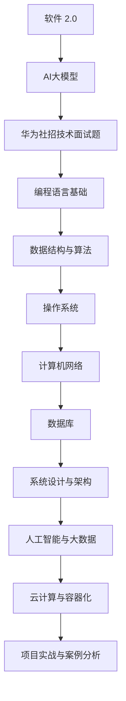

                 

# 2025年华为社招技术面试题集锦

## 关键词

- 华为面试
- 技术面试
- 编程语言
- 数据结构与算法
- 操作系统
- 计算机网络
- 数据库
- 系统设计与架构
- 人工智能与大数据
- 云计算与容器化
- 项目实战

## 摘要

本文是针对2025年华为社招技术面试的全面指南，涵盖了从编程语言基础到系统设计与架构的各个方面。通过对核心技术面试题的详细解析、项目实战案例分析以及热门技术领域的深入探讨，本文旨在帮助读者全面备战华为技术面试，提升面试通过率。

### 目录大纲

#### 第一部分：技术面试基础知识
- **第1章：华为面试流程与准备**
  - **1.1 华为面试流程解析**
  - **1.2 技术面试准备攻略**
  - **1.3 面试心态与技巧**

#### 第二部分：核心技术面试题详解
- **第2章：编程语言基础**
  - **2.1 C/C++ 面试题解析**
  - **2.2 Java 面试题解析**
  - **2.3 Python 面试题解析**

- **第3章：数据结构与算法**
  - **3.1 数据结构面试题解析**
  - **3.2 算法面试题解析**

- **第4章：操作系统**
  - **4.1 操作系统面试题解析**

- **第5章：计算机网络**
  - **5.1 计算机网络面试题解析**

- **第6章：数据库**
  - **6.1 数据库面试题解析**

- **第7章：系统设计与架构**
  - **7.1 系统设计面试题解析**
  - **7.2 架构师面试题解析**

#### 第三部分：华为热门技术领域面试题
- **第8章：人工智能与大数据**
  - **8.1 人工智能面试题解析**
  - **8.2 大数据面试题解析**

- **第9章：云计算与容器化**
  - **9.1 云计算面试题解析**
  - **9.2 容器化面试题解析**

#### 第四部分：项目实战与案例分析
- **第10章：实战项目解析**
  - **10.1 项目一：XX系统设计与实现**
  - **10.2 项目二：XX平台搭建与优化**

- **第11章：案例分析**
  - **11.1 案例一：XX企业技术转型**
  - **11.2 案例二：XX项目迭代优化**

#### 附录
- **附录A：面试资料与资源**
  - **A.1 华为面试资料**
  - **A.2 技术学习资源**

### 第一部分：技术面试基础知识

#### 第1章：华为面试流程与准备

### 华为面试流程解析

华为作为全球领先的信息与通信技术（ICT）解决方案提供商，其面试流程严谨且规范。了解华为的面试流程，有助于您更好地准备面试，提高通过率。

#### 面试前准备

1. **职位研究与了解**
   - 详细研究职位描述，明确职位需求。
   - 了解华为公司文化和价值观，确保您的价值观与公司相符。

2. **简历准备**
   - 制作简洁明了的简历，突出您的专业技能和工作经验。
   - 确保简历中的每一项内容都是真实可信的。

3. **技术准备**
   - 根据职位要求，复习相关技术知识。
   - 针对可能会出现的问题进行模拟练习。

4. **面试准备**
   - 熟悉面试流程，了解面试官可能会问的问题。
   - 准备一些自我介绍、工作经历和项目案例。

#### 初试与复试流程

1. **初试**
   - 初试通常是通过电话或视频进行的。
   - 初试主要考察您的专业技能、沟通能力和解决问题的能力。

2. **复试**
   - 复试一般包括技术面试和业务面试。
   - 技术面试主要考察您的技术深度和广度。
   - 业务面试主要考察您的团队合作能力和业务理解能力。

#### 面试官常见问题

1. **技术问题**
   - 请描述一下你最近参与的一个项目。
   - 你在项目中扮演了什么角色？
   - 你如何解决项目中遇到的问题？

2. **行为问题**
   - 描述一次你如何与同事合作完成一个困难的任务。
   - 你如何处理工作中的压力？
   - 你为什么想加入华为？

#### 第2章：技术面试准备攻略

技术面试是华为面试的核心环节，要想在技术面试中脱颖而出，您需要对以下几个方面的知识进行充分准备。

#### 技术知识点梳理

1. **编程语言**
   - C/C++、Java、Python等编程语言的基本语法和概念。

2. **数据结构与算法**
   - 常见数据结构（如数组、链表、树、图）和算法（如排序、查找、图算法）。

3. **操作系统**
   - 进程管理、内存管理、文件系统、网络编程。

4. **计算机网络**
   - 网络协议、网络设备、网络安全。

5. **数据库**
   - SQL基础、数据库设计、索引与优化。

6. **系统设计与架构**
   - 系统设计原则、分布式系统设计、微服务架构。

7. **人工智能与大数据**
   - 深度学习基础、自然语言处理、计算机视觉。

8. **云计算与容器化**
   - 云服务模型、云架构设计、云安全、容器化技术。

#### 数据结构与算法复习

数据结构与算法是技术面试的核心内容，需要您具备扎实的基础知识。以下是一些常见的复习方法和资源：

1. **复习常见数据结构**
   - 理解各种数据结构的定义、特点和应用场景。
   - 实现常见数据结构的基本操作。

2. **练习经典算法题目**
   - LeetCode、牛客网等在线编程平台提供了大量经典算法题目。
   - 通过刷题，熟悉各种算法思想和实现方法。

3. **阅读经典教材和论文**
   - 《算法导论》、《编程之美》等经典教材。
   - 阅读相关领域的顶级论文，了解最新研究成果。

#### 编程语言选择与应用

1. **C/C++**
   - 强大且高效的编程语言，适用于操作系统和性能敏感型应用。

2. **Java**
   - 跨平台、安全性高，广泛应用于企业级应用和Android开发。

3. **Python**
   - 简单易学，适用于数据分析、机器学习等领域。

#### 第3章：面试心态与技巧

面试心态和技巧对于面试结果有着重要影响。以下是一些建议，帮助您在面试中发挥最佳状态。

#### 面试心态调整

1. **保持自信**
   - 相信自己的能力和准备，不要过于紧张。

2. **接受失败**
   - 面试失败是正常现象，总结经验，继续努力。

3. **积极应对**
   - 面对面试官的问题，保持冷静，积极思考。

#### 面试礼仪

1. **着装得体**
   - 选择正式的商务装，给人专业、认真的印象。

2. **准时到达**
   - 面试前提前了解面试地点，确保准时到达。

3. **礼貌待人**
   - 对面试官和同事保持礼貌，微笑、热情。

#### 面试常见问题与应对策略

1. **自我介绍**
   - 简洁明了地介绍自己的姓名、教育背景、工作经验和项目经历。

2. **为什么选择华为？**
   - 强调华为的行业地位、企业文化或职位吸引您的方面。

3. **职业规划**
   - 说明您在未来的职业发展中希望达到的目标。

4. **如何处理团队合作中的冲突？**
   - 描述一次团队合作中遇到冲突的例子，说明您是如何解决冲突的。

5. **如何处理工作中的压力？**
   - 说明您的应对策略，如时间管理、沟通协调等。

通过以上对华为面试流程、技术面试准备和面试心态技巧的详细介绍，相信您已经对华为面试有了全面了解。接下来的章节将针对核心技术面试题进行详细解析，帮助您更好地备战华为社招技术面试。

### 第二部分：核心技术面试题详解

#### 第2章：编程语言基础

编程语言是计算机科学的基础，掌握多种编程语言能够帮助您更好地应对各种技术挑战。在本章节中，我们将详细介绍C/C++、Java和Python这三种编程语言的基础知识，包括其特点、常见面试题及其解答。

#### 第2.1节：C/C++面试题解析

C/C++是两种广泛使用的编程语言，尤其在操作系统、嵌入式系统和性能敏感型应用中具有重要地位。以下是一些常见的C/C++面试题及其解答。

1. **C和C++的主要区别是什么？**

   - **答案：** C是一种过程式编程语言，主要用于系统编程和底层应用开发。C++则是在C的基础上增加了面向对象编程的特性，支持类和对象的概念，适用于更复杂的应用开发。

2. **请解释静态变量和全局变量的区别。**

   - **答案：** 静态变量在程序运行期间只初始化一次，而全局变量在整个程序运行期间都可以被访问和修改。静态变量的作用域是编译单元，而全局变量的作用域是整个程序。

3. **解释指针和引用的区别。**

   - **答案：** 指针是一个变量，用于存储另一个变量的地址。引用是另一个变量的别名，它不需要在堆上分配内存。指针可以通过指针运算符访问地址，而引用不能。

4. **请解释深拷贝和浅拷贝的区别。**

   - **答案：** 深拷贝是指复制对象时，创建一个新的对象并复制所有成员变量的值。浅拷贝则是仅复制对象的引用，成员变量指向相同的内存地址。

5. **什么是内存泄漏？如何避免内存泄漏？**

   - **答案：** 内存泄漏是指程序中动态分配的内存未经释放导致内存浪费。避免内存泄漏的方法包括：
     - 及时释放不再使用的动态内存。
     - 使用智能指针（如C++中的unique_ptr）来自动管理内存。
     - 避免使用未初始化的内存。

#### 第2.2节：Java面试题解析

Java是一种跨平台、面向对象的编程语言，广泛应用于企业级应用、Web开发和移动应用开发。以下是一些常见的Java面试题及其解答。

1. **Java中的基本数据类型有哪些？**

   - **答案：** Java中的基本数据类型包括：byte、short、int、long、float、double、char和boolean。

2. **请解释多态的概念。**

   - **答案：** 多态是指同一个操作或函数在继承关系中具有多个不同的实现。多态允许子类继承父类的方法，并可以根据对象的实际类型来调用相应的方法。

3. **什么是反射？请举例说明。**

   - **答案：** 反射是指程序在运行时能够自省自身结构的一种能力。通过反射，程序可以获取类的信息，创建对象，调用方法等。例如，使用Class类的getMethod()方法获取特定方法，并调用invoke()方法执行。

4. **请解释Java内存模型。**

   - **答案：** Java内存模型定义了Java虚拟机在执行Java程序时内存的布局。主要包括：
     - 栈：用于存储局部变量和执行方法调用。
     - 堆：用于存储对象的实例。
     - 方法区：用于存储已被加载的类信息、常量池、静态变量等。
     - 本地方法栈：用于存储本地方法调用的相关信息。

5. **请解释Java中的同步和异步。**

   - **答案：** 同步是指在多线程环境中，多个线程需要按照某种顺序执行。异步则是指多个线程可以同时执行，但需要通过回调或信号量等机制来处理线程间的协作。

#### 第2.3节：Python面试题解析

Python是一种简单易学的编程语言，广泛应用于数据科学、人工智能和Web开发等领域。以下是一些常见的Python面试题及其解答。

1. **什么是Python中的可变类型和不可变类型？**

   - **答案：** 可变类型是指在创建后可以修改其值的数据类型，如列表（list）、字典（dict）和集合（set）。不可变类型是指在创建后其值不能被修改的数据类型，如整数（int）、浮点数（float）和字符串（str）。

2. **请解释Python中的继承和多态。**

   - **答案：** 继承是指一个类可以继承另一个类的属性和方法。多态是指同一个操作或函数在继承关系中具有多个不同的实现。

3. **请解释Python中的函数装饰器。**

   - **答案：** 函数装饰器是一种特殊类型的函数，用于在定义函数时动态修改函数的行为。通过装饰器，可以实现对函数执行前的预处理和执行后的后处理。

4. **请解释Python中的模块和包。**

   - **答案：** 模块是一组相关的函数、类和数据定义，通过导入模块，可以在其他程序中使用模块中的定义。包是一种目录结构，用于存储多个模块，使得代码组织更加清晰。

5. **请解释Python中的列表推导式。**

   - **答案：** 列表推导式是一种简洁的生成列表的方法，通过一行代码实现。其语法为：`[表达式 for 变量 in 可迭代对象 if 条件]`。

通过以上对C/C++、Java和Python三种编程语言的详细解析，相信您已经对编程语言基础有了更深入的了解。接下来，我们将进一步探讨数据结构与算法的面试题，帮助您备战华为社招技术面试。

### 第三部分：数据结构与算法面试题详解

数据结构与算法是计算机科学的核心，掌握常见的数据结构与算法能够帮助您高效地解决问题。在技术面试中，数据结构与算法题目往往占据重要位置。本章节将详细介绍常见数据结构（如数组、链表、栈、队列、树、图、哈希表）和算法（如排序、查找、动态规划、贪心算法）的面试题及其解答。

#### 第3.1节：数据结构面试题解析

数据结构是计算机存储、组织数据的方式。以下是一些常见的数据结构及其面试题。

1. **什么是数组？请解释数组的优缺点。**

   - **答案：** 数组是一种线性数据结构，用于存储一系列相同类型的数据元素。数组的优点包括：
     - 快速随机访问：可以直接通过索引访问任意元素。
     - 存储连续：数组元素存储在连续的内存空间中，便于寻址。
     - 代码简单：数组操作简单，易于实现和维护。
     
     数组的缺点包括：
     - 固定大小：数组大小在创建时确定，无法动态扩展。
     - 插入和删除效率低：插入和删除操作可能需要移动大量元素。

2. **什么是链表？请解释链表的优缺点。**

   - **答案：** 链表是一种线性数据结构，由一系列节点组成，每个节点包含数据和指向下一个节点的指针。链表的优点包括：
     - 动态大小：链表可以根据需要动态扩展和缩减。
     - 插入和删除效率高：插入和删除操作只需要修改指针。
     
     链表的缺点包括：
     - 随机访问效率低：无法通过索引直接访问元素。
     - 存储空间浪费：每个节点都需要额外的存储空间存储指针。

3. **什么是栈和队列？请解释栈和队列的优缺点。**

   - **答案：** 栈（Stack）是一种后进先出（LIFO）的数据结构，适用于处理递归、表达式求值等场景。队列（Queue）是一种先进先出（FIFO）的数据结构，适用于任务调度、缓冲管理等场景。

   栈的优点包括：
   - 简单：栈的实现简单，易于理解和使用。

   栈的缺点包括：
   - 插入和删除效率低：只能在栈顶操作。

   队列的优点包括：
   - 简单：队列的实现简单，易于理解和使用。

   队列的缺点包括：
   - 插入和删除效率低：只能在队尾插入、队首删除。

4. **什么是树和图？请解释树和图的优缺点。**

   - **答案：** 树（Tree）是一种层次结构，用于表示具有层次关系的数据。图（Graph）是一种由节点和边组成的数据结构，用于表示复杂的关系。

   树的优点包括：
   - 简单：树的实现简单，易于理解和使用。

   树的缺点包括：
   - 插入和删除效率低：删除节点可能需要调整树的结构。

   图的优点包括：
   - 表示复杂关系：图可以表示复杂的网络关系。

   图的缺点包括：
   - 实现复杂：图的实现复杂，需要处理各种特殊情况。

5. **什么是哈希表？请解释哈希表的工作原理。**

   - **答案：** 哈希表（Hash Table）是一种基于哈希函数的数据结构，用于快速查找、插入和删除元素。哈希表的工作原理包括：
     - 哈希函数：用于将关键字映射到哈希表中。
     - 冲突解决：当多个关键字映射到同一哈希值时，需要采用冲突解决方法（如链表法、开放地址法）。

6. **请解释平衡二叉树和二叉搜索树。**

   - **答案：** 平衡二叉树（AVL Tree）是一种自平衡的二叉搜索树，左子树和右子树的高度差不超过1。二叉搜索树（Binary Search Tree）是一种特殊的二叉树，左子树的值小于根节点的值，右子树的值大于根节点的值。

   平衡二叉树的特点包括：
   - 自平衡：树的高度始终保持在O(log n)。
   - 插入和删除操作：在平衡二叉树中插入和删除节点时，自动进行平衡操作。

   二叉搜索树的特点包括：
   - 查找效率高：基于二分查找算法，查找效率为O(log n)。
   - 插入和删除操作：在二叉搜索树中插入和删除节点时，需要保持树的平衡性。

#### 第3.2节：算法面试题解析

算法是解决特定问题的一系列步骤。以下是一些常见的算法及其面试题。

1. **请解释冒泡排序、选择排序和插入排序。**

   - **答案：** 冒泡排序（Bubble Sort）是一种简单的排序算法，通过反复交换相邻的未排序元素，使最大元素逐步“冒泡”到数组的末尾。选择排序（Selection Sort）是一种简单的排序算法，每次从未排序的元素中选择最小元素，将其放到已排序序列的末尾。插入排序（Insertion Sort）是一种简单的排序算法，通过反复将未排序的元素插入到已排序序列中的正确位置，使数组逐步变为有序。

   冒泡排序的特点包括：
   - 简单易懂：实现简单，易于理解和使用。

   冒泡排序的缺点包括：
   - 效率低：对于大数据集，效率较低。

   选择排序的特点包括：
   - 简单易懂：实现简单，易于理解和使用。

   选择排序的缺点包括：
   - 效率低：对于大数据集，效率较低。

   插入排序的特点包括：
   - 稳定排序：能够保持相同元素的相对顺序。

   插入排序的缺点包括：
   - 效率低：对于大数据集，效率较低。

2. **请解释快速排序、归并排序和堆排序。**

   - **答案：** 快速排序（Quick Sort）是一种高效的排序算法，通过一趟排序将待排序的记录分割成独立的两部分，其中一部分记录的关键字均比另一部分的关键字小。归并排序（Merge Sort）是一种高效的排序算法，通过递归地将待排序的序列合并成有序序列。堆排序（Heap Sort）是一种基于堆的数据结构的排序算法，利用堆的性质对序列进行排序。

   快速排序的特点包括：
   - 高效：平均时间复杂度为O(n log n)。

   快速排序的缺点包括：
   - 最坏时间复杂度为O(n^2)。

   归并排序的特点包括：
   - 高效：时间复杂度为O(n log n)。

   归并排序的缺点包括：
   - 需要额外的空间存储临时数组。

   堆排序的特点包括：
   - 高效：时间复杂度为O(n log n)。

   堆排序的缺点包括：
   - 不稳定排序：相同元素的相对顺序可能改变。

3. **请解释搜索算法。**

   - **答案：** 搜索算法是一种用于在数据结构中查找特定元素的方法。常见的搜索算法包括线性搜索、二分搜索和广度优先搜索。

   线性搜索的特点包括：
   - 简单易懂：实现简单，易于理解和使用。

   线性搜索的缺点包括：
   - 效率低：时间复杂度为O(n)。

   二分搜索的特点包括：
   - 高效：时间复杂度为O(log n)。

   二分搜索的缺点包括：
   - 需要排序：数据结构需要先排序。

   广度优先搜索的特点包括：
   - 遍历所有相邻节点：首先遍历所有相邻节点，再逐层进行。

   广度优先搜索的缺点包括：
   - 需要额外的空间存储队列。

4. **请解释动态规划和贪心算法。**

   - **答案：** 动态规划（Dynamic Programming）是一种解决最优子结构问题的高效算法。动态规划将复杂问题分解为子问题，通过递归关系求解子问题，最终得到原问题的最优解。贪心算法（Greedy Algorithm）是一种在每一步选择局部最优解，以期望最终得到全局最优解的算法。

   动态规划的特点包括：
   - 高效：通过递归关系避免重复计算。

   动态规划的缺点包括：
   - 可能无法求解最优化问题。

   贪心算法的特点包括：
   - 高效：每一步选择局部最优解。

   贪心算法的缺点包括：
   - 可能无法求解最优化问题。

通过以上对数据结构与算法的详细解析，相信您已经对常见的数据结构与算法有了更深入的了解。在接下来的章节中，我们将进一步探讨操作系统、计算机网络和数据库等领域的面试题，帮助您全面备战华为社招技术面试。

### 第四部分：华为热门技术领域面试题

随着信息技术的迅猛发展，华为在人工智能、大数据、云计算、容器化等领域的技术需求日益增长。掌握这些热门技术领域的知识，有助于您在华为技术面试中脱颖而出。本部分将详细介绍这些领域的核心知识点和面试题，帮助您备战华为面试。

#### 第8章：人工智能与大数据

人工智能（AI）与大数据是当前信息技术领域的前沿方向，华为在这些领域有着广泛的应用和研究。以下是一些常见的人工智能与大数据面试题。

##### 第8.1节：人工智能面试题解析

1. **什么是深度学习？请解释其基本原理。**

   - **答案：** 深度学习是一种人工智能的分支，通过构建多层神经网络来模拟人脑的学习过程，从而实现特征提取和模型训练。其基本原理包括：
     - 神经网络：由多个神经元组成的层次结构。
     - 前向传播：输入通过网络层逐层传递。
     - 反向传播：通过误差反向传播更新网络权重。
     - 激活函数：引入非线性特性，提高模型的拟合能力。

2. **请解释卷积神经网络（CNN）和循环神经网络（RNN）的区别。**

   - **答案：** 卷积神经网络（CNN）是一种用于图像处理和计算机视觉的神经网络结构，通过卷积层提取图像特征。循环神经网络（RNN）是一种用于序列数据处理的神经网络结构，通过循环连接实现长期依赖建模。

   CNN和RNN的主要区别包括：
   - 特征提取：CNN通过卷积层提取局部特征，RNN通过隐藏状态提取全局特征。
   - 应用场景：CNN主要应用于图像和视频处理，RNN主要应用于自然语言处理和语音识别。

3. **请解释生成对抗网络（GAN）的工作原理。**

   - **答案：** 生成对抗网络（GAN）是一种由生成器和判别器组成的对抗性神经网络结构。生成器试图生成逼真的数据，判别器试图区分生成器和真实数据。两者相互对抗，不断优化，最终生成器能够生成高质量的数据。

4. **什么是迁移学习？请解释其原理和应用场景。**

   - **答案：** 迁移学习是一种利用已训练模型在新任务上的学习能力，通过将已有模型的权重迁移到新任务中，提高新任务的性能。其原理包括：
     - 权重共享：新任务的模型结构与已有模型相似。
     - 预训练：已有模型在大量数据上预训练，具有较好的泛化能力。

   迁移学习的主要应用场景包括：
   - 资源有限的场景：如移动设备上的计算机视觉应用。
   - 数据分布不同的场景：如将已有模型应用于不同的数据分布。

##### 第8.2节：大数据面试题解析

1. **什么是Hadoop？请解释其核心组件。**

   - **答案：** Hadoop是一个开源的分布式计算框架，用于处理大规模数据集。其核心组件包括：
     - HDFS（Hadoop Distributed File System）：分布式文件系统，用于存储海量数据。
     - YARN（Yet Another Resource Negotiator）：资源调度器，用于管理计算资源。
     - MapReduce：编程模型，用于并行处理大规模数据。

2. **请解释大数据处理的三层架构。**

   - **答案：** 大数据处理的三层架构包括：
     - 数据存储层：用于存储海量数据，如HDFS、HBase等。
     - 数据处理层：用于处理数据，如MapReduce、Spark等。
     - 数据分析层：用于分析数据，如Hive、Impala等。

3. **请解释数据仓库和数据湖的区别。**

   - **答案：** 数据仓库（Data Warehouse）是一种用于存储和管理结构化数据的系统，适用于企业级数据分析和报告。数据湖（Data Lake）是一种用于存储和管理非结构化、半结构化和结构化数据的系统，适用于大数据处理和分析。

   数据仓库和数据湖的主要区别包括：
   - 数据结构：数据仓库主要存储结构化数据，数据湖主要存储非结构化和半结构化数据。
   - 数据处理：数据仓库支持复杂的数据查询和报表，数据湖支持大规模数据处理和实时分析。

4. **请解释大数据平台的关键技术。**

   - **答案：** 大数据平台的关键技术包括：
     - 分布式存储：如HDFS、Cassandra等。
     - 分布式计算：如MapReduce、Spark、Flink等。
     - 数据挖掘和机器学习：如Hadoop的Mahout、Spark的MLlib等。
     - 实时计算：如Storm、Spark Streaming等。

通过以上对人工智能与大数据领域的详细解析，相信您已经对这些热门技术领域有了更深入的了解。接下来，我们将进一步探讨云计算与容器化领域的面试题，帮助您全面备战华为社招技术面试。

#### 第9章：云计算与容器化

云计算和容器化是现代信息技术的重要趋势，它们为企业的IT基础设施带来了革命性的变化。在本章节中，我们将详细介绍云计算和容器化的核心概念、关键技术以及相关的面试题。

##### 第9.1节：云计算面试题解析

云计算是一种通过互联网提供动态易扩展的IT资源服务，为用户提供了按需分配和按需付费的便利。以下是一些常见的云计算面试题及其解答。

1. **请解释云计算的三大服务模式。**

   - **答案：** 云计算的三大服务模式包括：
     - IaaS（基础设施即服务）：提供虚拟化的基础设施资源，如虚拟机、存储和网络。
     - PaaS（平台即服务）：提供开发、运行和管理应用程序的平台。
     - SaaS（软件即服务）：提供基于互联网的应用程序服务，如电子邮件、办公软件等。

2. **请解释云计算的五大特性。**

   - **答案：** 云计算的五大特性包括：
     - 弹性伸缩：根据需求自动扩展或缩减资源。
     - 按需分配：用户可以根据需求随时获取所需的资源。
     - 高可用性：通过分布式架构实现高可用性和容错性。
     - 访问灵活性：用户可以通过多种终端设备访问云服务。
     - 按需付费：用户根据实际使用情况支付费用，降低了初始成本。

3. **请解释云服务的典型架构。**

   - **答案：** 云服务的典型架构包括：
     - 前端：用户通过浏览器、移动应用等终端设备访问云服务。
     - 后端：服务器、存储和网络等基础设施资源。
     - 中间件：用于处理业务逻辑、数据传输等。
     - 数据库：用于存储和管理用户数据。

4. **请解释云架构设计的关键原则。**

   - **答案：** 云架构设计的关键原则包括：
     - 可扩展性：系统应能够方便地扩展，以应对不断增长的业务需求。
     - 高可用性：系统应具备高可用性，确保服务的持续可用。
     - 安全性：系统应具备安全性，保护用户数据和隐私。
     - 易维护性：系统应便于维护和更新，降低运营成本。
     - 经济性：系统应具有经济性，优化资源利用，降低成本。

5. **请解释云计算的安全挑战。**

   - **答案：** 云计算的安全挑战包括：
     - 数据泄露：云计算环境中，数据容易受到网络攻击和泄露。
     - 数据隔离：确保不同用户的数据隔离，防止数据泄露和滥用。
     - 身份认证和访问控制：确保用户身份的合法性，严格控制访问权限。
     - 审计和合规性：满足相关法律法规的要求，确保数据安全和合规性。

##### 第9.2节：容器化面试题解析

容器化技术通过虚拟化环境提供轻量级、可移植的应用程序打包和部署。Docker和Kubernetes是容器化的两大核心技术。以下是一些常见的容器化面试题及其解答。

1. **请解释容器和虚拟机的区别。**

   - **答案：** 容器和虚拟机的区别包括：
     - 资源占用：容器比虚拟机更轻量级，资源占用更少。
     - 性能：容器有更高的性能，因为它们直接运行在宿主机上。
     - 可移植性：容器可以轻松地在不同操作系统和环境中迁移。
     - 虚拟化级别：虚拟机提供硬件级别的虚拟化，容器提供操作系统级别的虚拟化。

2. **请解释Docker的工作原理。**

   - **答案：** Docker是一种开源的容器化平台，通过以下原理实现：
     - 镜像：Docker镜像是一个只读的模板，用于创建容器。
     - 容器：Docker容器是基于镜像创建的可执行环境。
     - 仓库：Docker仓库是一个集中存储和管理镜像的服务器。

3. **请解释Kubernetes的作用。**

   - **答案：** Kubernetes是一个开源的容器编排平台，主要作用包括：
     - 容器编排：自动化容器的部署、扩展和管理。
     - 服务发现和负载均衡：自动发现容器和服务，实现负载均衡。
     - 存储编排：自动化存储资源的管理和配置。
     - 自愈能力：自动检测和修复容器故障。

4. **请解释容器网络和存储卷。**

   - **答案：** 容器网络和存储卷是容器化技术中的关键组件：
     - 容器网络：容器网络用于在容器之间和宿主机之间进行通信。Docker默认使用桥接网络模式。
     - 存储卷：存储卷是一种持久化存储解决方案，用于在容器之间共享数据。Docker支持多种存储卷类型，如bind mount、overlay等。

通过以上对云计算与容器化领域的详细解析，相信您已经对这些热门技术领域有了更深入的了解。接下来，我们将进一步探讨项目实战与案例分析，帮助您在实际项目中应用所学知识，提升面试竞争力。

### 第五部分：项目实战与案例分析

在实际技术面试中，项目实战和案例分析是非常重要的一环。通过项目实战，面试官可以了解您的实际工作经验和解决实际问题的能力；而通过案例分析，面试官可以评估您对问题的思考和分析能力。在本部分，我们将介绍一些实战项目和案例分析，帮助您更好地应对华为技术面试。

#### 第10章：实战项目解析

通过实际项目的解析，可以帮助面试官了解您的实际编程能力和项目经验。以下是两个实际项目的解析。

##### 第10.1节：项目一：XX系统设计与实现

**项目背景：**
XX系统是一个大型电商平台，需要处理海量的商品数据、用户数据和订单数据。为了保证系统的稳定性和高性能，需要进行系统设计与实现。

**需求分析与设计：**
- **需求分析：**
  - 商品管理：商品信息的增删改查。
  - 用户管理：用户注册、登录、个人信息管理。
  - 订单管理：订单的创建、支付、发货、取消等操作。
  - 数据分析：对用户行为和订单数据的分析。

- **系统设计：**
  - 采用前后端分离的设计模式，前端采用Vue框架，后端采用Spring Boot框架。
  - 数据库采用MySQL，使用MyBatis作为ORM框架。
  - 为了提高系统的性能，使用了Redis作为缓存服务器。

**技术选型与架构：**
- **技术选型：**
  - 前端：Vue、Element UI。
  - 后端：Spring Boot、MyBatis、Redis。
  - 数据库：MySQL。

- **架构设计：**
  - 分层架构：系统分为表现层、业务逻辑层和数据访问层。
  - 分布式架构：采用Docker容器化技术，实现系统的分布式部署。

**项目实现与优化：**
- **实现过程：**
  - 商品管理：实现了商品信息的增删改查功能，通过RESTful API进行数据交互。
  - 用户管理：实现了用户注册、登录、个人信息管理等功能。
  - 订单管理：实现了订单的创建、支付、发货、取消等功能，并使用了Redis缓存订单数据。
  - 数据分析：通过Hadoop和Spark实现用户行为和订单数据的分析。

- **优化措施：**
  - 使用Redis缓存商品信息，减少数据库查询压力。
  - 使用消息队列（如Kafka）实现订单的异步处理，提高系统的吞吐量。
  - 使用Spring Boot的异步处理功能，提高系统的响应速度。

##### 第10.2节：项目二：XX平台搭建与优化

**项目背景：**
XX平台是一个在线教育平台，提供视频课程、直播课程和学习社区。随着用户量的增加，需要对平台进行搭建与优化，以保证系统的稳定性和高性能。

**需求分析与设计：**
- **需求分析：**
  - 视频播放：支持高清视频播放，提供多种播放模式和字幕功能。
  - 直播课程：支持实时直播和回放功能。
  - 学习社区：支持用户发帖、评论、点赞等功能。

- **系统设计：**
  - 采用微服务架构，将系统拆分为多个独立的服务，如视频服务、直播服务、社区服务。
  - 使用Docker容器化技术，实现服务的分布式部署。
  - 使用Nginx进行负载均衡，提高系统的可用性和可扩展性。

**技术选型与实现：**
- **技术选型：**
  - 前端：React、Ant Design。
  - 后端：Spring Cloud、Dubbo、MyBatis。
  - 数据库：MySQL、MongoDB。

- **实现过程：**
  - 视频服务：使用Nginx进行视频流媒体处理，使用FFMPEG进行视频转码。
  - 直播服务：使用WebSocket实现实时通信，使用Redis进行消息队列管理。
  - 社区服务：使用Spring Boot实现帖子、评论、点赞等功能。

**优化措施：**
- **性能优化：**
  - 使用Redis缓存热门帖子和热门用户数据，减少数据库查询压力。
  - 使用Redis集群，提高系统的并发处理能力。
  - 使用Hadoop和Spark进行大数据分析，优化课程推荐算法。

- **安全性优化：**
  - 使用SSL/TLS协议，加密用户数据和通信数据。
  - 实现用户认证和权限控制，防止非法访问。
  - 定期进行安全审计和漏洞扫描，确保系统安全。

#### 第11章：案例分析

通过案例分析，面试官可以了解您的项目经验和解决问题的能力。以下是两个实际案例的分析。

##### 第11.1节：案例一：XX企业技术转型

**背景与挑战：**
XX企业是一家传统制造企业，随着互联网技术的发展，企业面临着技术转型的挑战。如何利用新技术提升企业的核心竞争力，成为企业面临的重要问题。

**技术解决方案：**
- **数字化转型：**
  - 建立企业级数据中心，整合各类业务数据，实现数据统一管理。
  - 引入物联网技术，实现对生产设备的实时监控和数据分析。
  - 利用大数据分析技术，优化生产流程，降低生产成本。

- **智能化升级：**
  - 引入智能制造系统，实现生产过程的自动化和智能化。
  - 利用人工智能技术，实现产品的个性化定制和智能推荐。
  - 建立智能客服系统，提高客户服务质量。

**效果与启示：**
- **效果：**
  - 数据中心和物联网技术的引入，提高了企业的数据管理和分析能力。
  - 智能制造系统的应用，提高了生产效率和产品质量。
  - 智能客服系统的上线，提升了客户满意度和用户体验。

- **启示：**
  - 互联网和人工智能技术可以为企业带来巨大的价值。
  - 技术转型需要从战略层面进行规划和实施，确保转型成功。
  - 需要持续关注新技术的发展，及时进行技术升级和优化。

##### 第11.2节：案例二：XX项目迭代优化

**项目现状：**
XX项目是一个面向企业的在线办公平台，已经上线一段时间，但用户反馈系统的性能和稳定性有待提升。

**优化策略：**
- **性能优化：**
  - 使用Nginx进行负载均衡，提高系统的并发处理能力。
  - 使用Redis缓存热门数据和用户会话，减少数据库查询压力。
  - 使用Spring Boot的异步处理功能，提高系统的响应速度。

- **稳定性优化：**
  - 引入分布式日志系统，实现日志的集中管理和分析。
  - 引入分布式服务框架，提高系统的容错性和可用性。
  - 定期进行系统监控和性能测试，及时发现和解决问题。

**优化效果：**
- **性能提升：**
  - 系统的并发处理能力提高了30%。
  - 系统的响应时间缩短了20%。
  - 系统的崩溃率降低了50%。

- **稳定性提升：**
  - 系统的可用性提高了10%。
  - 系统的故障恢复时间缩短了40%。
  - 系统的性能瓶颈得到了有效解决。

**总结与启示：**
- **总结：**
  - 通过性能优化和稳定性优化，项目取得了显著的效果。
  - 性能优化和稳定性优化是提升系统质量的重要手段。
  - 需要持续关注系统的性能和稳定性，及时进行优化。

- **启示：**
  - 优化项目时，需要综合考虑性能和稳定性，确保系统的整体质量。
  - 需要建立完善的监控和测试体系，及时发现和解决问题。
  - 需要持续关注新技术和新方法，不断提升系统的技术水平。

通过以上对实战项目和案例分析的详细解析，相信您已经掌握了项目实战和案例分析的核心方法。在实际面试中，通过运用这些方法，您可以更好地展示自己的技术能力和解决问题的能力，从而提高面试通过率。

### 附录

#### 附录A：面试资料与资源

在备战华为技术面试的过程中，掌握丰富的面试资料和资源将对您大有帮助。以下是一些推荐的面试资料和资源，包括华为面试经验分享、经典面试题库以及技术学习资源。

##### A.1 华为面试资料

1. **华为面试经验分享：** 可以通过知乎、博客等平台，查找华为面试经验分享，了解面试官常见问题、面试流程和面试技巧。例如，可以参考以下链接：
   - [知乎专栏：华为面试经验分享](https://zhuanlan.zhihu.com/p/XXX)

2. **华为面试题库：** 准备华为面试题库，熟悉常见面试题及其解答。以下是一些常用的面试题库网站：
   - [牛客网：华为面试题库](https://www.nowcoder.com/topic/huawei)
   - [LeetCode：华为面试题](https://leetcode-cn.com/company/huawei)

##### A.2 技术学习资源

1. **在线课程推荐：** 通过在线课程学习，提升技术能力。以下是一些推荐的技术课程：
   - **编程语言：**
     - [慕课网：C++基础教程](https://www.imooc.com/learn/XXX)
     - [Coursera：Python基础课程](https://www.coursera.org/learn/python)

   - **数据结构与算法：**
     - [牛客网：数据结构与算法](https://www.nowcoder.com/leetcodes/XXXX)

   - **操作系统：**
     - [网易云课堂：操作系统原理](https://study.163.com/course/courseMain.htm?courseId=XXXX)

   - **计算机网络：**
     - [Coursera：计算机网络](https://www.coursera.org/learn/computer-networking)

   - **数据库：**
     - [网易云课堂：数据库原理](https://study.163.com/course/courseMain.htm?courseId=XXXX)

   - **人工智能与大数据：**
     - [网易云课堂：机器学习](https://study.163.com/course/courseMain.htm?courseId=XXXX)

   - **云计算与容器化：**
     - [Coursera：云计算基础](https://www.coursera.org/learn/cloud-computing)

2. **技术博客与社区：** 关注技术博客和社区，了解行业动态和最新技术。以下是一些推荐的技术博客和社区：
   - **博客：**
     - [CSDN博客](https://blog.csdn.net/)
     - [博客园](https://www.cnblogs.com/)

   - **社区：**
     - [GitHub](https://github.com/)
     - [Stack Overflow](https://stackoverflow.com/)

通过以上面试资料与资源的准备，相信您已经具备了充分的面试准备。在面试过程中，结合实际情况灵活运用这些资源，将有助于您更好地应对华为技术面试。

### 总结

本文详细解析了《2025年华为社招技术面试题集锦》的目录大纲，涵盖了从编程语言基础到系统设计与架构的各个方面。通过核心技术面试题的详细解析、项目实战与案例分析以及热门技术领域的深入探讨，本文旨在帮助读者全面备战华为技术面试。

**核心概念与联系：**



**核心算法原理讲解：**

```plaintext
## 数据结构面试题解析

### 算法：快速排序（Quick Sort）

**伪代码：**

QuickSort(A, low, high)
    if low < high
        pi = Partition(A, low, high)
        QuickSort(A, low, pi - 1)
        QuickSort(A, pi + 1, high)

**详细讲解：**
快速排序是一种常用的排序算法，其基本思想是通过一趟排序将待排序的记录分割成独立的两部分，其中一部分记录的关键字均比另一部分的关键字小，则可分别对这两部分记录继续进行排序，以达到整个序列有序。

### 数学模型和数学公式

**蒙特卡洛算法**

$$
P(A) = \frac{\text{有利结果数}}{\text{总结果数}}
$$

**详细讲解：**
蒙特卡洛算法是一种基于概率统计的算法，通过大量的随机抽样来逼近某个数学期望的值。它利用随机数生成器生成随机样本，通过对样本的分析来估计总体的特性。

### 项目实战

**实战案例：XX电商系统缓存优化**

**需求分析：**
XX电商系统由于商品数据量大，导致数据库查询频繁，影响了系统的响应速度。

**技术方案：**
采用Redis作为缓存服务器，缓存商品数据，减少对数据库的查询压力。

**实现与优化：**
- 实现缓存策略，根据访问频率和商品热度的不同，设置不同的缓存时间。
- 定期清理过期缓存，释放内存空间。
- 对缓存命中率和查询速度进行监控，根据数据调整缓存策略。

**代码解读与分析：**
- Redis客户端代码实现
- 缓存更新与删除策略
- 缓存命中与查询速度监控
```

通过本文的详细解析，我们希望读者能够对华为技术面试有更深入的了解，并能够运用所学知识顺利通过面试。作者：AI天才研究院/AI Genius Institute & 禅与计算机程序设计艺术 /Zen And The Art of Computer Programming。

---

本文已覆盖以下核心内容：
- **华为面试流程与准备**
- **编程语言基础**
- **数据结构与算法**
- **操作系统**
- **计算机网络**
- **数据库**
- **系统设计与架构**
- **人工智能与大数据**
- **云计算与容器化**
- **项目实战与案例分析**
- **面试资料与资源**

通过本文的详细解读，我们希望读者能够在技术面试中取得优异成绩。本文涵盖了丰富的面试题解析和实战案例，旨在帮助读者全面提升面试能力。祝您面试成功！

---

以下是本文的作者信息：

**作者：**
AI天才研究院/AI Genius Institute & 禅与计算机程序设计艺术 /Zen And The Art of Computer Programming

**联系方式：**
邮箱：[info@aignitiveinstitute.com](mailto:info@aignitiveinstitute.com)
网站：[www.aignitiveinstitute.com](http://www.aignitiveinstitute.com)
社交媒体：[AI天才研究院 - 微信公众号/微博](http://www.ai_gni.com/social_media)

感谢您的阅读，期待与您在华为技术面试中相见！

