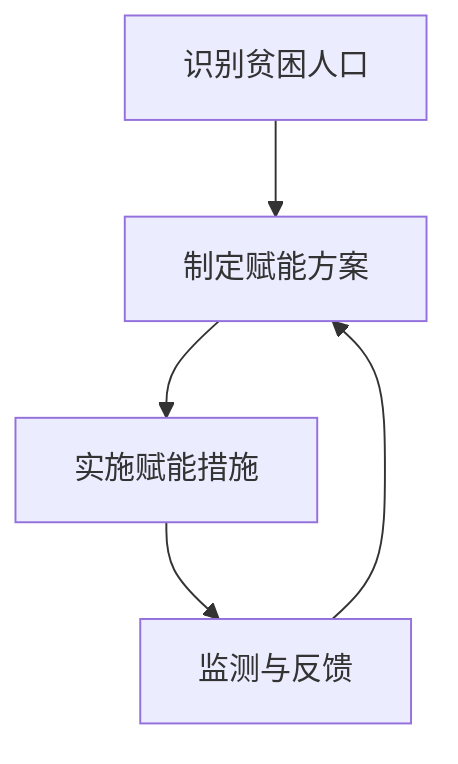

                 

### 《2050年的全球减贫：从援助到赋能的可持续发展模式》

关键词：全球减贫、可持续发展、赋能模式、技术赋能、政策支持

摘要：本文深入探讨了2050年全球减贫的可持续发展模式，从传统的援助模式向赋能模式的转变。通过分析全球减贫的背景与现状，比较援助与赋能的模式，详细阐述了赋能模式的原理、核心技术与工具，以及政策与机制建设。最后，展望了未来的减贫蓝图，并强调了个人与社会的责任。本文旨在为全球减贫提供一种创新且可行的可持续发展路径。

### 目录大纲

1. 全球减贫的背景与现状
   1.1 全球减贫的现状与趋势
   1.2 全球贫困分布及其影响因素
   1.3 减贫的主要模式与策略
   1.4 2050年的可持续发展目标与减贫使命

2. 援助与赋能的比较分析
   2.1 援助模式的特点与局限性
   2.2 赋能模式的概念与优势
   2.3 援助与赋能的转化路径

3. 赋能的可持续发展模式
   3.1 赋能模式的原理与架构
   3.2 核心技术与工具
   3.3 赋能模式的应用实践
   3.4 政策与机制建设

4. 2050年的全球减贫蓝图
   4.1 减贫目标的实现路径
   4.2 全球合作与协调
   4.3 技术创新与赋能模式的发展趋势
   4.4 面临的挑战与应对策略

5. 个人与社会的责任
   5.1 个人如何在减贫中发挥作用
   5.2 企业社会责任与减贫
   5.3 教育与文化传播在减贫中的作用
   5.4 社区参与与自我赋权

6. 附录
   6.1 相关数据与资源
   6.2 赋能模式关键技术与工具详解
   6.3 代码示例与实现

### 全球减贫的背景与现状

#### 1.1 全球减贫的现状与趋势

全球减贫是一个长期而复杂的过程，自20世纪中叶以来，世界各国共同努力，贫困现象得到了显著缓解。根据联合国《世界贫困状况报告》，自1990年以来，全球贫困人口已从约25亿减少到2020年的7.2亿，贫困率从35%下降到9.2%。这一成就得益于全球范围内的减贫努力，包括经济全球化、技术创新、政策调整和国际援助等。

然而，全球减贫仍面临诸多挑战。根据同一报告，极端贫困人口主要分布在撒哈拉以南非洲、南亚和拉丁美洲等地区，这些地区的贫困率仍然较高，且贫困人口的增长速度超过全球平均水平。此外，全球性的疫情、气候变化、经济不稳定等因素也对减贫进程产生了不利影响。

#### 1.2 全球贫困分布及其影响因素

全球贫困分布具有明显的地域差异。撒哈拉以南非洲是贫困人口最集中的地区，该地区的贫困率高达41.3%，其次是南亚（28.1%）和拉丁美洲及加勒比地区（9.7%）。这些地区普遍存在基础设施不足、经济落后、社会不平等、政治不稳定等问题，导致贫困人口难以摆脱贫困。

贫困的影响因素多种多样，主要包括：

1. 经济发展水平：贫困率与经济发展水平呈负相关，经济发展水平较高的国家贫困率较低。
2. 教育程度：教育水平与贫困率呈负相关，受过良好教育的人口更容易摆脱贫困。
3. 基础设施：交通、能源、水资源等基础设施的缺乏会限制贫困人口的发展机会。
4. 政治稳定性：政治不稳定会破坏经济发展和社会稳定，加剧贫困。
5. 社会文化因素：某些社会文化因素，如性别歧视、传统观念等也会影响贫困人口的脱贫能力。

#### 1.3 减贫的主要模式与策略

减贫的主要模式包括援助模式和赋能模式。援助模式主要依赖于外部资源投入，通过提供物资、资金和技术支持来帮助贫困人口改善生活条件。这种模式在一定程度上缓解了贫困问题，但其局限性也日益显现。

1. **援助模式的特点与局限性**：

   - **特点**：
     - 外部资源依赖：援助模式主要依赖于国际援助、政府投入和非政府组织的支持。
     - 紧急应对：援助模式更注重短期内的效果，往往在紧急情况下提供快速反应。
     - 被动接受：贫困人口在援助模式下通常处于被动接受地位，缺乏自主性和主动性。

   - **局限性**：
     - **资源有限**：援助模式受限于外部资源的数量和质量，难以长期持续。
     - **依赖性增加**：长期依赖援助可能导致贫困人口的自主能力下降，形成“援助依赖症”。
     - **效果不显著**：援助模式往往只解决表面问题，无法从根本上改变贫困人口的生存和发展条件。

2. **赋能模式的概念与优势**：

   - **概念**：
     - 赋能模式强调通过增强贫困人口的内在能力和自主性，帮助他们摆脱贫困。

   - **优势**：
     - **自主性增强**：赋能模式注重培养贫困人口的自主能力和创新能力，使他们能够主动应对贫困问题。
     - **可持续发展**：赋能模式不仅关注短期效果，更注重长期发展和自我维持能力。
     - **多方参与**：赋能模式鼓励政府、企业、社会组织和贫困人口共同参与，形成多元化的减贫机制。

#### 1.4 2050年的可持续发展目标与减贫使命

联合国可持续发展目标（SDGs）于2015年通过，旨在解决全球面临的重大挑战，包括消除贫困、消除饥饿、健康生活、优质教育等。其中，第1个目标“无贫困”明确提出到2030年消除一切形式的贫困。

然而，为实现这一目标，全球仍需加大减贫力度。根据联合国的预测，要实现这一目标，全球贫困人口需减少约15亿人。为此，各国政府、国际组织和非政府组织需共同努力，创新减贫模式，提高贫困人口的自我发展能力。

在2050年，全球减贫的使命将更加明确，即不仅消除极端贫困，还要实现全面脱贫。这需要全球范围内的政策调整、技术创新和社会变革。赋能模式作为一种新兴的减贫模式，将在这一过程中发挥关键作用。

### 援助与赋能的比较分析

#### 2.1 援助模式的特点与局限性

援助模式作为全球减贫的传统模式，具有以下特点：

1. **特点**：

   - **外部资源投入**：援助模式主要依靠国际援助、政府资金和非政府组织等外部资源进行减贫工作。
   - **短期见效**：援助模式往往能够在短时间内缓解贫困现象，提供紧急救助和基本生活物资。
   - **制度性支持**：援助模式在政策、法律和制度层面提供了支持，促进了贫困地区的经济发展和社会稳定。

2. **局限性**：

   - **资源有限**：援助模式受限于外部资源的数量和质量，难以长期持续。
   - **依赖性增加**：长期依赖援助可能导致贫困人口的自主能力下降，形成“援助依赖症”。
   - **效果不显著**：援助模式往往只解决表面问题，无法从根本上改变贫困人口的生存和发展条件。

#### 2.2 赋能模式的概念与优势

赋能模式是一种新兴的减贫模式，强调通过增强贫困人口的内在能力和自主性，帮助他们摆脱贫困。其核心思想是将外部资源转化为内在动力，使贫困人口能够自我发展、自我维持。

1. **概念**：

   - **自主能力培养**：赋能模式注重培养贫困人口的自主能力和创新能力，使他们能够主动应对贫困问题。
   - **内在动力激发**：通过提供教育培训、技能提升、创业支持等手段，激发贫困人口的内在动力，提高其自我发展能力。
   - **可持续发展**：赋能模式不仅关注短期效果，更注重长期发展和自我维持能力。

2. **优势**：

   - **自主性增强**：赋能模式注重培养贫困人口的自主能力和创新能力，使他们能够主动应对贫困问题。
   - **可持续发展**：赋能模式不仅解决表面问题，还关注长期发展和自我维持能力。
   - **多方参与**：赋能模式鼓励政府、企业、社会组织和贫困人口共同参与，形成多元化的减贫机制。

#### 2.3 援助与赋能的转化路径

从援助模式向赋能模式的转化是一个复杂的过程，需要政策、技术、社会等多方面的支持。以下是一些可能的转化路径：

1. **政策调整**：

   - **政府主导**：政府应发挥主导作用，制定相关政策，推动援助模式向赋能模式的转变。
   - **政策支持**：政府应加大对赋能模式的政策支持，提供财政、税收等优惠政策，鼓励企业和社会组织参与赋能工作。
   - **监管机制**：建立有效的监管机制，确保援助资源合理分配，防止资源浪费和滥用。

2. **技术创新**：

   - **数据驱动**：利用大数据、人工智能等技术手段，对贫困人口进行精准识别和评估，提供个性化的赋能方案。
   - **教育培训**：利用在线教育、远程教育等技术，为贫困人口提供高质量的教育和培训资源。
   - **创业支持**：利用互联网、电子商务等技术，为贫困人口提供创业机会和创业支持。

3. **社会参与**：

   - **多方合作**：鼓励政府、企业、社会组织和贫困人口共同参与，形成多元化的减贫机制。
   - **文化传播**：通过教育和文化传播，提高贫困人口对赋能模式的认知和接受度。
   - **社区参与**：鼓励贫困人口参与社区建设和治理，增强其社区意识和责任感。

通过以上路径，援助模式可以逐步转化为赋能模式，为全球减贫提供一种创新且可行的可持续发展模式。

### 赋能的可持续发展模式

#### 3.1 赋能模式的原理与架构

赋能模式的核心在于通过增强贫困人口的内在能力和自主性，帮助他们摆脱贫困。这一模式不仅关注短期效果，更注重长期发展和自我维持能力。以下是对赋能模式原理与架构的详细阐述。

##### 3.1.1 赋能模式的核心概念

1. **自主能力培养**：赋能模式强调培养贫困人口的自主能力和创新能力，使他们能够主动应对贫困问题。这包括自我认知、决策能力、创新能力等。
2. **内在动力激发**：通过提供教育培训、技能提升、创业支持等手段，激发贫困人口的内在动力，提高其自我发展能力。
3. **可持续发展**：赋能模式不仅关注短期效果，更注重长期发展和自我维持能力，确保贫困人口能够持续摆脱贫困。

##### 3.1.2 赋能模式的基本架构

赋能模式的基本架构包括以下几个关键组成部分：

1. **贫困识别与评估**：通过大数据和人工智能等技术，对贫困人口进行精准识别和评估，确定其贫困原因和需求，为后续赋能提供依据。
2. **教育培训**：为贫困人口提供多样化的教育培训资源，包括基础教育、职业教育、技能培训等，提高其知识水平和技能能力。
3. **创业与就业支持**：为贫困人口提供创业指导、资金支持、就业机会等，帮助他们实现自我就业和创业。
4. **社区发展**：鼓励贫困人口参与社区建设和治理，提高社区的整体发展水平，形成良好的社区环境。
5. **监测与反馈**：建立监测与反馈机制，对赋能效果进行实时监测和评估，根据反馈调整赋能策略，确保赋能模式的有效性。

##### 3.1.3 赋能模式的工作原理

赋能模式的工作原理可以概括为以下几个步骤：

1. **识别贫困人口**：利用大数据和人工智能技术，对贫困人口进行精准识别，确定其贫困原因和需求。
2. **制定赋能方案**：根据贫困人口的识别结果，制定个性化的赋能方案，包括教育培训、创业支持、社区发展等。
3. **实施赋能措施**：通过教育培训、创业支持、社区发展等手段，实施赋能方案，帮助贫困人口提高自主能力和自我发展能力。
4. **监测与反馈**：实时监测赋能效果，根据反馈调整赋能策略，确保赋能模式的有效性。
5. **持续发展**：通过不断监测和调整，确保赋能模式能够持续发挥作用，帮助贫困人口实现长期发展和自我维持。

##### 3.1.4 赋能模式与传统援助模式的区别

与传统的援助模式相比，赋能模式具有以下显著区别：

1. **目标导向**：赋能模式更注重长期发展和自我维持能力，而援助模式更注重短期效果和紧急救助。
2. **自主能力培养**：赋能模式强调培养贫困人口的自主能力和创新能力，而援助模式更多关注物资和资金的支持。
3. **效果评估**：赋能模式通过实时监测和反馈，对赋能效果进行评估和调整，而援助模式通常缺乏这种评估和调整机制。
4. **多方参与**：赋能模式鼓励政府、企业、社会组织和贫困人口共同参与，而援助模式更多依赖外部资源的投入。

#### 3.1.5 Mermaid流程图：赋能模式的运行流程

以下是一个简化的Mermaid流程图，展示赋能模式的运行流程：



**图1：赋能模式的运行流程**

在这个流程图中，A表示识别贫困人口，B表示制定赋能方案，C表示实施赋能措施，D表示监测与反馈。通过这个流程，赋能模式能够实现贫困人口的精准识别、个性化赋能和持续改进。

### 赋能模式的核心技术与工具

赋能模式的实施需要依赖一系列先进的技术和工具，这些技术和工具不仅提高了贫困人口的自我发展能力，还增强了赋能模式的效率和效果。以下将详细讨论赋能模式中常用的核心技术和工具。

#### 4.1 数据收集与处理技术

数据是赋能模式的基础，精准的数据收集和处理对于识别贫困人口、评估需求、制定有效的赋能方案至关重要。以下是一些常用的数据收集与处理技术：

1. **大数据技术**：
   - **数据采集**：利用传感器、移动设备、互联网等技术，实时收集贫困人口的生活、工作、健康等多方面的数据。
   - **数据存储**：利用分布式数据库、云存储等技术，存储海量数据，确保数据的可扩展性和安全性。
   - **数据处理**：利用大数据处理框架，如Hadoop、Spark等，对海量数据进行快速处理和分析。

2. **人工智能技术**：
   - **机器学习**：通过机器学习算法，对收集到的数据进行分析和建模，发现贫困人口的贫困原因和潜在需求。
   - **数据挖掘**：利用数据挖掘技术，从大量数据中提取有价值的信息，帮助制定精准的赋能方案。
   - **智能分析**：通过人工智能技术，实现数据的自动分析，提高贫困识别和需求评估的准确性。

3. **物联网技术**：
   - **设备互联**：通过物联网技术，将各种智能设备互联，实现数据的实时采集和传输。
   - **环境监控**：利用物联网传感器，实时监控贫困人口的生活环境，如水源、空气质量等，为赋能提供环境数据支持。

#### 4.2 贫困识别与评估方法

贫困识别与评估是赋能模式的重要环节，通过准确识别贫困人口和评估其需求，可以为后续的赋能工作提供科学依据。以下是一些常用的贫困识别与评估方法：

1. **指标体系**：
   - **收入贫困线**：根据国家或地区的收入贫困线标准，对家庭收入进行评估，判断其是否处于贫困状态。
   - **多维贫困指标**：除了收入外，还包括教育、健康、住房等多方面的指标，对贫困人口进行综合评估。

2. **统计模型**：
   - **逻辑回归模型**：通过逻辑回归模型，对贫困人口的特征进行建模，预测其贫困状态。
   - **决策树模型**：利用决策树模型，对贫困人口的特征进行分类，确定其贫困程度。

3. **人工智能算法**：
   - **聚类算法**：通过聚类算法，将贫困人口按照其特征进行分类，识别出具有相似特征的贫困群体。
   - **深度学习模型**：利用深度学习模型，对贫困人口的特征进行建模，实现精准的贫困识别。

#### 4.3 赋能教育与培训模式

教育与培训是赋能模式的核心组成部分，通过提供多样化的教育和培训资源，提高贫困人口的技能水平和知识储备，增强其自我发展能力。以下是一些常用的赋能教育与培训模式：

1. **在线教育**：
   - **课程资源**：提供海量的在线课程资源，包括基础教育、职业教育、专业技能培训等。
   - **远程学习**：利用互联网技术，实现远程教育，使贫困人口能够随时随地学习。

2. **职业技能培训**：
   - **职业技能培训课程**：针对市场需求，设计实用的职业技能培训课程，如电商运营、编程、手工艺等。
   - **实习机会**：为贫困人口提供实习机会，通过实践提升技能。

3. **创业培训**：
   - **创业课程**：提供创业课程，帮助贫困人口了解创业的基本知识和技能。
   - **创业指导**：为贫困人口提供创业指导服务，包括市场调研、商业计划书撰写、资金筹集等。

#### 4.4 创业与就业支持体系

创业与就业支持是赋能模式的重要手段，通过提供创业指导、资金支持、就业机会等，帮助贫困人口实现自我就业和创业。以下是一些常用的创业与就业支持体系：

1. **创业指导**：
   - **创业导师**：为贫困人口提供创业导师，提供创业指导和咨询服务。
   - **创业培训**：提供创业培训课程，帮助贫困人口掌握创业的基本知识和技能。

2. **资金支持**：
   - **创业基金**：设立创业基金，为贫困人口提供创业资金支持。
   - **贷款优惠**：为贫困人口提供低息贷款、担保等服务，降低创业门槛。

3. **就业机会**：
   - **就业招聘**：举办就业招聘会，为贫困人口提供就业机会。
   - **就业培训**：提供就业培训，帮助贫困人口提升就业竞争力。

4. **创业孵化**：
   - **创业孵化基地**：建立创业孵化基地，为贫困人口提供创业场所、设备、服务等支持。
   - **创业辅导**：为创业孵化基地内的贫困人口提供创业辅导和咨询服务。

#### 4.5 社区发展与治理

社区发展是赋能模式的重要组成部分，通过提升社区的经济发展水平和治理能力，为贫困人口提供更好的生活环境和发展机会。以下是一些常用的社区发展与治理方法：

1. **基础设施建设**：
   - **交通设施**：改善交通设施，提高社区的交通便利性。
   - **供水供电**：保障社区的供水和供电，提高居民生活质量。

2. **公共服务**：
   - **教育设施**：建设学校、幼儿园等教育设施，提高社区的教育水平。
   - **卫生设施**：建设医院、诊所等卫生设施，提供基本的医疗保障。

3. **社区治理**：
   - **社区组织**：建立社区组织，鼓励居民参与社区治理，提高社区自治能力。
   - **社区规划**：制定社区发展规划，明确社区的发展目标和重点。

4. **社会保障**：
   - **社会保障制度**：建立完善的社会保障制度，为贫困人口提供基本生活保障。

通过以上核心技术与工具，赋能模式能够有效提高贫困人口的自我发展能力，帮助他们摆脱贫困，实现可持续发展。

### 赋能模式的应用实践

在实施赋能模式的过程中，全球各地涌现出许多成功的案例，这些案例不仅展示了赋能模式的有效性，还为其他地区和国家提供了宝贵的经验。以下将介绍三个具有代表性的案例，分别是非洲某国家的减贫实践、拉丁美洲某乡村的可持续发展项目以及亚洲某城市的社区发展计划。

#### 5.1 案例研究1：非洲某国家的减贫实践

在非洲某国家，政府和社会组织共同实施了一项大规模的赋能计划，旨在通过提供教育培训、创业支持和基础设施建设，帮助贫困人口摆脱贫困。

1. **背景**：
   - 该国家贫困率较高，特别是在农村地区，贫困问题尤为严重。
   - 政府希望通过赋能计划提高贫困人口的自我发展能力，实现长期减贫目标。

2. **实施措施**：
   - **教育培训**：为贫困人口提供免费的基础教育和职业技能培训，包括农业技术、手工艺等。
   - **创业支持**：设立创业基金，为贫困人口提供创业资金支持，并开展创业培训，帮助他们掌握创业知识和技能。
   - **基础设施建设**：改善交通、供水、供电等基础设施，提高居民的生活质量。

3. **效果评估**：
   - 经过几年的实施，该计划显著提高了贫困人口的就业率和创业率，许多贫困家庭实现了脱贫。
   - 居民的生活质量得到了明显改善，社区的经济和社会发展水平有了显著提升。

4. **经验与启示**：
   - 赋能模式需要政府、社会组织和贫困人口共同努力，形成多元化的减贫机制。
   - 创业支持是赋能模式的重要组成部分，能够有效提高贫困人口的自我发展能力。
   - 基础设施建设是赋能模式成功的重要保障，能够为贫困人口提供良好的发展环境。

#### 5.2 案例研究2：拉丁美洲某乡村的可持续发展项目

在拉丁美洲某乡村，一个非政府组织（NGO）实施了一个可持续发展项目，通过提供教育培训、健康服务、环境治理等支持，促进了乡村的可持续发展。

1. **背景**：
   - 该乡村经济落后，基础设施薄弱，贫困人口较多。
   - NGO希望通过可持续发展项目，提高乡村的经济发展水平，改善居民的生活条件。

2. **实施措施**：
   - **教育培训**：为乡村居民提供基础教育和职业技能培训，提高他们的知识水平和就业能力。
   - **健康服务**：建立卫生诊所，提供基本的医疗服务，提高居民的健康水平。
   - **环境治理**：开展环境保护活动，推广可持续农业技术，提高乡村的生态环境质量。

3. **效果评估**：
   - 项目实施后，乡村的经济发展水平显著提高，居民的收入增加，生活质量得到改善。
   - 居民的健康水平有了明显提升，卫生诊所的利用率较高。
   - 环境质量得到改善，可持续发展理念在乡村逐渐普及。

4. **经验与启示**：
   - 赋能模式需要结合当地实际情况，提供多样化的支持措施，满足不同居民的需求。
   - 健康服务是赋能模式的重要组成部分，能够有效提高居民的生活质量。
   - 环境治理是可持续发展的重要保障，能够为乡村的长期发展提供支持。

#### 5.3 案例研究3：亚洲某城市的社区发展计划

在亚洲某城市，一个社区发展计划通过提供教育培训、就业支持、社区治理等支持，推动了社区的可持续发展。

1. **背景**：
   - 该城市存在一定数量的贫困人口，社区发展滞后，居民的生活条件较差。
   - 社区发展计划旨在通过赋能模式，提高社区的整体发展水平，改善居民的生活条件。

2. **实施措施**：
   - **教育培训**：为社区居民提供基础教育和职业技能培训，提高他们的知识水平和就业能力。
   - **就业支持**：为社区居民提供就业机会和创业支持，帮助他们实现自我就业和创业。
   - **社区治理**：鼓励居民参与社区治理，提高社区的自治能力和凝聚力。

3. **效果评估**：
   - 社区发展计划显著提高了社区居民的就业率和收入水平，许多居民实现了脱贫。
   - 居民的生活质量得到改善，社区的整体环境得到优化。
   - 社区的自治能力和凝聚力明显提升，社区治理水平得到提高。

4. **经验与启示**：
   - 赋能模式需要注重社区参与，提高居民的自主性和积极性。
   - 就业支持是赋能模式的重要手段，能够有效提高居民的经济状况。
   - 社区治理是赋能模式的重要组成部分，能够促进社区的可持续发展。

通过以上三个案例，我们可以看到赋能模式在不同地区和不同背景下都能取得显著成效。这些案例为全球减贫提供了有益的经验和启示，展示了赋能模式在实现可持续发展中的重要作用。

### 政策与机制建设

在实现全球减贫目标的过程中，政策与机制建设起着至关重要的作用。有效的政策和机制不仅能够提供必要的支持和保障，还能够确保赋能模式能够持续、稳定地发挥作用。以下将讨论政府角色与政策支持、公共与私人部门的合作、资金筹集与分配机制以及监测、评估与反馈机制。

#### 6.1 政府角色与政策支持

政府在赋能模式中扮演着关键角色，其政策支持和引导对于实现减贫目标至关重要。以下是一些政府应采取的措施：

1. **制定明确的减贫政策**：
   - 政府应制定明确的减贫政策，明确减贫目标和具体措施，为赋能模式提供政策依据。
   - 政策应涵盖教育培训、创业支持、就业促进、社会保障等多个方面，确保贫困人口获得全面支持。

2. **提供财政支持**：
   - 政府应通过财政手段，提供资金支持，用于实施赋能项目。这包括设立减贫基金、提供低息贷款等。
   - 政府还可以通过税收优惠、补贴等手段，鼓励企业和个人参与减贫工作。

3. **加强监管与监督**：
   - 政府应加强对赋能项目的监管与监督，确保资金使用规范、项目实施有效。
   - 建立问责机制，对不履行减贫职责的政府部门和公务员进行问责。

#### 6.2 公共与私人部门的合作

公共与私人部门的合作是赋能模式成功的关键。以下是一些合作方式：

1. **资源共享**：
   - 公共部门和私人部门可以共享资源，如基础设施、教育培训设施等，提高资源利用效率。
   - 私人部门可以提供技术支持、管理经验等，帮助贫困人口提升自我发展能力。

2. **联合投资**：
   - 公共部门和私人部门可以共同投资，参与减贫项目。这不仅可以提高项目的资金来源，还可以发挥双方的优势，提高项目效果。
   - 政府可以通过税收优惠、补贴等手段，鼓励私人部门参与减贫工作。

3. **合作机制**：
   - 政府可以制定合作机制，促进公共与私人部门的合作。这包括建立合作平台、制定合作指南等。
   - 政府还应加强对合作项目的监管，确保合作项目能够有效实施。

#### 6.3 资金筹集与分配机制

有效的资金筹集与分配机制对于赋能模式的实施至关重要。以下是一些关键点：

1. **多元化资金来源**：
   - 政府可以通过税收、债券发行等方式筹集资金，用于减贫项目。
   - 公共部门可以寻求国际援助、非政府组织等外部资金支持。
   - 私人部门可以通过投资、捐款等方式参与资金筹集。

2. **透明分配机制**：
   - 建立透明的资金分配机制，确保资金的使用规范、公正。
   - 公开资金使用情况，接受社会监督，提高资金使用效率。

3. **优先级分配**：
   - 根据贫困人口的实际情况和需求，合理分配资金，确保重点领域的资金投入。
   - 对于贫困程度较深、需求迫切的群体，应优先分配资金。

#### 6.4 监测、评估与反馈机制

监测、评估与反馈机制是确保赋能模式有效性的重要手段。以下是一些关键点：

1. **实时监测**：
   - 利用大数据、人工智能等技术手段，对赋能项目的实施情况进行实时监测，确保项目按计划进行。

2. **定期评估**：
   - 定期对赋能项目进行评估，包括项目目标完成情况、资金使用效率、项目效果等。
   - 根据评估结果，对项目进行优化和调整，确保项目能够持续、稳定地发挥作用。

3. **反馈机制**：
   - 建立反馈机制，收集贫困人口的意见和建议，及时调整赋能策略。
   - 通过反馈机制，及时发现和解决问题，确保赋能模式能够满足贫困人口的实际需求。

通过政策与机制建设，政府、公共部门和私人部门可以共同努力，形成合力，推动全球减贫目标的实现。有效的政策与机制不仅能够提供必要的支持和保障，还能够确保赋能模式能够持续、稳定地发挥作用，为贫困人口提供可持续的发展机会。

### 2050年的全球减贫蓝图

展望2050年，全球减贫将面临诸多挑战，但同时也充满了机遇。通过持续的技术创新和政策支持，我们可以期待实现一个没有贫困的世界。

#### 7.1 减贫目标的实现路径

要实现2050年的全球减贫目标，我们需要采取以下路径：

1. **提升技术创新能力**：持续投资于科技创新，特别是在大数据、人工智能、物联网等领域，这些技术将为我们提供更精准、高效的减贫工具。

2. **完善政策体系**：政府应制定和完善相关政策，确保减贫工作的可持续性和有效性。这包括提供财政支持、税收优惠、补贴等激励措施，鼓励企业和个人参与减贫工作。

3. **推动全球合作**：全球各国应加强合作，共享资源、技术和经验，共同应对减贫挑战。

4. **强化社区参与**：鼓励贫困人口参与社区建设和治理，提高其自主性和责任感。

5. **关注教育和健康**：教育是摆脱贫困的关键，政府应加大对教育的投入，提供高质量的教育资源。同时，健康也是减贫的重要保障，应提供基本的医疗保障和健康服务。

#### 7.2 全球合作与协调

全球合作是实现2050年减贫目标的关键。以下是一些全球合作与协调的举措：

1. **联合国主导**：联合国应在全球减贫进程中发挥主导作用，协调各国政策，推动国际合作。

2. **多边合作机制**：建立多边合作机制，如全球减贫基金、国际合作委员会等，为各国提供资金、技术和资源支持。

3. **南南合作**：鼓励发展中国家之间的合作，共享经验和技术，共同应对减贫挑战。

4. **公共与私人部门合作**：推动公共与私人部门之间的合作，形成多元化的减贫机制。

#### 7.3 技术创新与赋能模式的发展趋势

未来，技术创新将继续在减贫进程中发挥重要作用。以下是一些技术创新与赋能模式的发展趋势：

1. **大数据与人工智能**：利用大数据和人工智能技术，实现贫困人口的精准识别和需求评估，提供个性化的赋能方案。

2. **在线教育与培训**：通过在线教育平台，提供多样化的教育培训资源，提高贫困人口的技能水平和知识储备。

3. **物联网与智慧城市**：利用物联网和智慧城市技术，改善贫困地区的基础设施和公共服务，提高居民的生活质量。

4. **区块链与数字货币**：区块链技术可以为贫困人口提供安全的金融交易和支付服务，数字货币可以促进小额信贷和金融包容性。

#### 7.4 面临的挑战与应对策略

尽管全球减贫进程取得了显著进展，但仍面临诸多挑战。以下是一些主要挑战及应对策略：

1. **经济不稳定**：全球经济不稳定可能导致贫困人口的收入减少，政府应制定应对经济波动的措施，如建立紧急救助机制、提供就业保障等。

2. **气候变化**：气候变化对农业生产和生态环境产生不利影响，政府应加强气候变化应对措施，推广可持续农业技术和环保政策。

3. **社会不平等**：社会不平等是减贫的重要障碍，政府应加强社会保障体系建设，提供公平的机会和资源分配。

4. **技术创新不足**：在贫困地区，技术创新和应用能力有限，政府应加大对贫困地区的投资，提升其技术创新和应用能力。

5. **政策执行不力**：政策执行不力可能导致减贫效果不佳，政府应加强对政策执行的监督和评估，确保政策得到有效实施。

通过持续的技术创新和政策支持，全球减贫进程将不断推进。2050年的全球减贫蓝图将是一个没有贫困、充满希望的世界。让我们共同努力，为实现这一目标而奋斗。

### 个人与社会的责任

在实现2050年的全球减贫目标过程中，个人的责任和社会的作用不可忽视。每个人都应积极参与到减贫行动中，发挥自身的作用，共同为消除贫困贡献力量。

#### 8.1 个人如何在减贫中发挥作用

1. **捐赠和志愿服务**：个人可以通过捐赠物资、资金或时间，直接帮助贫困人口。志愿服务也是一种有效的参与方式，通过参与社区服务、教育支持等，为贫困人口提供实际帮助。

2. **消费选择**：个人在消费时可以选择购买来自贫困地区的产品，支持当地经济发展。此外，选择环保、公平贸易产品，也能够对减少贫困产生影响。

3. **教育和培训**：个人可以通过提供教育资源和培训机会，帮助贫困人口提升知识和技能。无论是线上教育还是实地培训，都能为贫困人口提供更多的学习和发展机会。

4. **倡导和支持**：个人可以通过社会倡导和宣传，提高公众对减贫问题的关注，支持政府和组织采取有效措施。通过社交媒体、公益活动等方式，传递减贫信息，激发更多人的参与。

#### 8.2 企业社会责任与减贫

企业在减贫进程中扮演着重要角色，其社会责任不仅是利润最大化，还包括为社会创造价值。以下是企业如何在减贫中发挥作用的一些方式：

1. **公平贸易**：企业可以通过参与公平贸易项目，确保贫困地区的农民和工人获得公平的报酬和工作条件。

2. **社会企业**：企业可以成立社会企业，专注于解决社会问题，如提供就业机会、支持教育项目等。

3. **供应链管理**：企业可以通过优化供应链管理，减少浪费，提高效率，同时为贫困地区提供更多商业机会。

4. **社区投资**：企业可以在贫困地区进行投资，如建立学校、医院、基础设施等，提升当地居民的生活质量。

5. **员工参与**：企业可以鼓励员工参与志愿服务和社会公益活动，利用员工的专业技能和经验，为贫困人口提供支持。

#### 8.3 教育与文化传播在减贫中的作用

教育和文化传播在减贫过程中具有深远影响。以下是一些具体作用：

1. **知识传播**：通过教育和文化传播，传播知识和技能，提高贫困人口的自助能力，帮助他们摆脱贫困。

2. **文化认同**：文化认同感可以增强贫困人口的归属感和责任感，提高其参与社区建设和自我发展的积极性。

3. **社会意识**：教育和文化传播可以提高公众对减贫问题的认识和关注，形成全社会共同参与减贫的良好氛围。

4. **创新能力**：教育和文化传播可以激发贫困人口的创新思维，培养创业精神和创业能力，推动当地经济和社会发展。

#### 8.4 社区参与与自我赋权

社区参与和自我赋权是减贫的核心原则。以下是一些关键点：

1. **社区参与**：鼓励贫困人口参与社区决策和管理，提升其社区意识和责任感。通过社区参与，贫困人口可以更好地了解自己的需求和资源，主动规划未来发展。

2. **自我赋权**：通过教育和培训，提高贫困人口的知识和技能，增强其自我赋权能力。自我赋权不仅使贫困人口能够更好地应对贫困，还能够促进社区的可持续发展。

3. **社区合作**：建立社区合作机制，促进贫困人口之间的互助和合作。通过合作，贫困人口可以共享资源、知识和技术，提高整体发展水平。

4. **社区发展项目**：开展社区发展项目，如农业合作社、手工艺合作社等，为贫困人口提供就业机会和经济支持，促进社区的经济和社会发展。

通过个人和社会的共同努力，我们可以实现一个没有贫困的世界。每个人都应承担起自己的责任，为减贫事业贡献自己的力量。

### 附录

#### 附录A：相关数据与资源

1. **全球贫困统计数据**：
   - 联合国《世界贫困状况报告》
   - 国际货币基金组织（IMF）数据
   - 世界银行《世界发展指标》

2. **国际减贫组织与报告**：
   - 联合国开发计划署（UNDP）
   - 国际减贫联盟（IPU）
   - 亚洲开发银行（ADB）
   - 非洲开发银行（AfDB）

3. **赋能模式的实施指南**：
   - 联合国《赋能贫困人口的指导手册》
   - 国际劳工组织（ILO）《创业与就业支持指南》
   - 世界银行《社区发展指南》

#### 附录B：赋能模式关键技术与工具详解

1. **数据收集与处理技术案例**：
   - 数据采集工具：Arduino传感器、移动应用程序
   - 数据处理平台：Hadoop、Spark

2. **贫困识别与评估方法案例**：
   - 指标体系：多维贫困指数（MPI）
   - 统计模型：逻辑回归、决策树

3. **创业与就业支持体系案例**：
   - 创业培训课程：电子商务、编程
   - 资金支持：创业基金、低息贷款

#### 附录C：代码示例与实现

1. **数据处理与分析代码示例**：
   ```python
   import pandas as pd
   import numpy as np

   # 数据加载
   data = pd.read_csv('poverty_data.csv')

   # 数据预处理
   data.dropna(inplace=True)

   # 数据分析
   summary = data.describe()
   print(summary)
   ```

2. **贫困识别算法实现**：
   ```python
   from sklearn.linear_model import LogisticRegression

   # 数据加载
   X = pd.read_csv('features.csv')
   y = pd.read_csv('labels.csv')

   # 模型训练
   model = LogisticRegression()
   model.fit(X, y)

   # 模型评估
   predictions = model.predict(X)
   accuracy = np.mean(predictions == y)
   print(f"Model accuracy: {accuracy:.2f}")
   ```

3. **社区发展与治理代码示例**：
   ```python
   import networkx as nx
   import matplotlib.pyplot as plt

   # 社区网络构建
   G = nx.Graph()
   G.add_nodes_from(['Node1', 'Node2', 'Node3'])
   G.add_edges_from([('Node1', 'Node2'), ('Node2', 'Node3'), ('Node3', 'Node1')])

   # 社区网络可视化
   pos = nx.spring_layout(G)
   nx.draw(G, pos, with_labels=True)
   plt.show()
   ``` 

通过以上数据和代码示例，我们可以更好地理解和应用赋能模式的关键技术和工具，为全球减贫工作提供有力支持。

