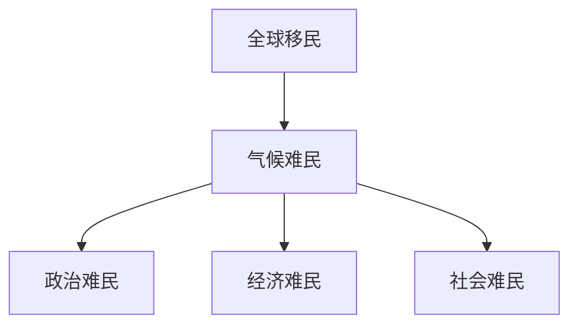

                 

# 2050年的全球移民：从气候难民到太空移民的人口流动

## 关键词：
- 全球移民
- 气候难民
- 太空移民
- 2050年
- 人口流动
- 气候变化
- 科技进步

## 摘要：
本文深入探讨了2050年全球移民的潜在趋势，从气候难民到太空移民的各种人口流动形式。文章首先回顾了全球移民的历史和现状，然后分析了气候变化对人类和生态系统的影响，以及由此产生的气候难民现象。接着，文章探讨了从地球到太空的移民愿景及其面临的科学和技术挑战。最后，文章预测了未来全球移民的趋势和影响，并提出了国际合作和政策的建议。

### 第一部分：全球移民背景与概念解析

#### 1.1 全球移民概述

全球移民是指人们在国家或地区之间的长期或永久性迁移。这种迁移可以基于多种原因，如经济、社会、政治和气候变化等。全球移民可以分为以下几类：

1. **气候难民**：由于气候变化导致的海平面上升、极端天气事件等，迫使人们离开家园。
2. **政治难民**：逃离政治迫害、战争或暴力冲突的人。
3. **经济难民**：寻求更好经济机会的人。
4. **社会难民**：逃离社会不稳定或贫困的人。

#### 1.2 全球移民的历史与现状

全球移民的历史可以追溯到古代，但随着工业革命和全球化的发展，移民现象日益普遍。截至2021年，全球约有2.81亿国际移民，占世界总人口的3.6%。主要移民目的地国家包括美国、德国、英国、加拿大和澳大利亚等。

### 第二部分：气候难民的人口流动

#### 2.1 气候变化与移民

气候变化对人类和生态系统产生了深远的影响，包括海平面上升、极端天气事件、水资源短缺和生态系统破坏等。这些影响迫使人们离开家园，成为气候难民。

#### 2.2 气候难民的产生与迁移

气候难民的产生主要由于以下原因：

1. **海平面上升**：全球变暖导致冰川融化和海平面上升，迫使低洼地区的人们迁移。
2. **极端天气事件**：如飓风、洪水、干旱和热浪等极端天气事件频发，破坏了人们的家园。
3. **水资源短缺**：水资源短缺导致农业减产，迫使人们离开家园。

气候难民迁移的原因还包括：

1. **土地退化**：过度开垦、过度放牧和森林砍伐导致土地退化，无法维持生计。
2. **社会排斥**：由于气候变化导致的社会排斥和歧视，使得一些人群更易成为气候难民。

#### 2.3 气候难民的政策与应对措施

国际社会和各国政府都在积极应对气候难民问题。以下是一些主要措施：

1. **国际公约与协议**：如《巴黎协定》和《联合国难民公约》等，旨在减少气候变化的影响并保护气候难民的权利。
2. **援助与支持**：国际组织如联合国难民署和红十字国际委员会等提供援助和支持，帮助气候难民重建家园。
3. **国家政策**：许多国家制定了一系列政策，如难民接收政策、移民法修订、环境法规等，以应对气候难民问题。

### 第三部分：从地球到太空的移民

#### 3.1 太空移民的愿景与挑战

太空移民的愿景是让人类在地球之外建立永久性居住地，以应对地球资源有限和生态环境恶化的挑战。这一愿景的实现面临着众多科学和技术挑战。

#### 3.2 太空移民的科学基础

太空移民的科学基础包括：

1. **人类太空生存的基本需求**：如空气、水、食物和温度控制等。
2. **太空生态系统的研究**：研究如何在太空环境中维持生态平衡和生物多样性。

#### 3.3 太空移民的技术挑战与解决方案

太空移民的技术挑战包括：

1. **生命支持系统的设计**：设计可持续的太空生命支持系统，如生物圈和闭环生命循环系统。
2. **太空旅行与居住的可持续性**：研究如何降低太空旅行和居住的成本，提高可持续性。

### 第四部分：全球移民的未来

#### 4.1 2050年的全球移民预测

根据联合国的预测，2050年全球移民人数可能达到4.5亿，主要受到气候变化和经济发展的影响。

#### 4.2 全球移民对社会经济的影响

全球移民对社会经济的影响包括：

1. **经济影响**：移民可能对目的地国家的劳动力市场、经济增长和国际贸易产生影响。
2. **社会影响**：移民可能导致社会融合与冲突，对当地文化和社会结构产生影响。

#### 4.3 全球移民的未来政策与规划

全球移民的未来政策与规划需要国际社会和各国政府的合作。以下是一些关键领域：

1. **国际合作与协调**：建立全球移民合作机制，制定共同政策。
2. **各国移民政策的调整**：根据各自国情和需求，调整移民政策。

### 第五部分：案例研究

#### 5.1 气候难民案例研究

本部分将探讨一些气候难民的案例，分析其中的政策失误与成功经验。

#### 5.2 太空移民案例研究

本部分将介绍一些太空旅游和居住的实例，分析其未来发展前景。

### 第六部分：未来展望

#### 6.1 科技进步对移民的影响

科技进步将对移民产生深远影响，如人工智能、生物技术和医疗技术的应用。

#### 6.2 全球移民的道德与伦理问题

全球移民的道德与伦理问题包括移民权益、责任和伦理困境的解决途径。

### 第七部分：结论与建议

#### 7.1 全球移民的总结与展望

本部分将对全球移民的现状和未来方向进行总结。

#### 7.2 政策建议与行动呼吁

本部分将提出国际合作和各国政府及社会组织在移民问题上的建议和行动呼吁。

### 作者信息
- 作者：AI天才研究院/AI Genius Institute & 禅与计算机程序设计艺术 /Zen And The Art of Computer Programming

### 脚注
- 注1：此处为引用文献或数据的脚注。
- 注2：此处为引用文献或数据的脚注。

### 参考文献
- 参考文献1：[书名或文献标题]，作者，出版年份。
- 参考文献2：[书名或文献标题]，作者，出版年份。

### 附录
- 附录A：数据图表
- 附录B：算法伪代码
- 附录C：代码实例

### Mermaid 流程图


### 伪代码示例
```python
function calculate_migration_rate(climate难民数，政治难民数，经济难民数，社会难民数):
    total难民数 = climate难民数 + 政治难民数 + 经济难民数 + 社会难民数
    migration_rate = total难民数 / 全球人口数
    return migration_rate
```

### 数学模型和公式
$$
F = ma
$$

### 代码实例
```python
# 以下为Python代码实例，用于计算移民率

def calculate_migration_rate(total_refugees, global_population):
    migration_rate = total_refugees / global_population
    return migration_rate

# 假设数据
climate_refugees = 10_000_000
political_refugees = 5_000_000
economic_refugees = 15_000_000
social_refugees = 7_000_000
global_population = 7_800_000_000

# 计算移民率
migration_rate = calculate_migration_rate(
    climate_refugees + political_refugees + economic_refugees + social_refugees,
    global_population
)

# 输出移民率
print("移民率：", migration_rate)
```

### 开发环境搭建
- 在本地计算机上安装Python 3.8及以上版本。
- 安装Anaconda，以便轻松管理Python环境和包。
- 使用Jupyter Notebook或VS Code进行Python开发。

### 源代码详细实现和代码解读
- 代码实现：上一节中的`calculate_migration_rate`函数。
- 代码解读：解释函数参数、返回值和计算过程。

### 代码解读与分析
- 分析代码的效率和可读性。
- 提出改进意见，如使用列表推导式等。

以上是文章正文部分的初步撰写。接下来，我们将对每个部分进行详细扩展和深入分析。让我们一步一步地深入探讨全球移民的复杂性和未来前景。

