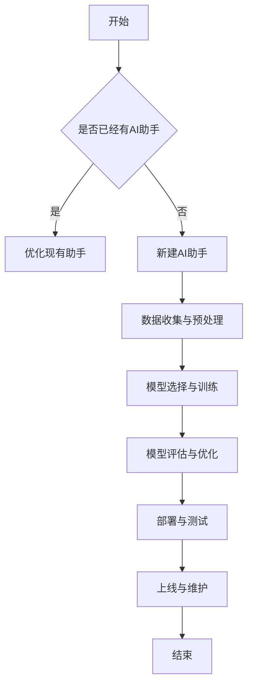

                 

## 《开发个人品牌AI助手：提供智能化服务》

> **关键词：** AI助手、个人品牌、智能化服务、自然语言处理、机器学习、深度学习、用户体验设计、安全性、隐私保护

> **摘要：** 本文章旨在探讨如何开发个人品牌的AI助手，提供智能化服务。我们将从基本概念、技术原理、实战案例、安全性和隐私保护等多个角度详细讲解AI助手的构建与优化过程，为开发者提供系统性的指导。

### 目录

### 第一部分：AI助手的基本概念与原理

#### 第1章：AI助手概述  
1.1 AI助手的发展历程  
1.2 AI助手的核心功能  
1.3 AI助手的应用场景

#### 第2章：AI助手的技术基础  
2.1 自然语言处理（NLP）基础  
2.2 机器学习与深度学习简介  
2.3 常见AI助手架构

#### 第3章：AI助手的核心算法  
3.1 基于规则的算法  
3.2 基于机器学习的算法  
3.3 基于深度学习的算法

#### 第4章：构建AI助手的流程  
4.1 数据收集与预处理  
4.2 模型选择与训练  
4.3 模型评估与优化

#### 第5章：AI助手的用户体验设计  
5.1 交互界面设计原则  
5.2 语音识别与合成技术  
5.3 多模态交互技术

### 第二部分：开发个人品牌AI助手的实战案例

#### 第6章：基于ChatGPT的个人品牌AI助手  
6.1 ChatGPT概述  
6.2 ChatGPT的应用场景  
6.3 ChatGPT的API使用与集成

#### 第7章：基于TensorFlow的个人品牌AI助手  
7.1 TensorFlow概述  
7.2 TensorFlow在AI助手开发中的应用  
7.3 实战案例：使用TensorFlow构建个人品牌AI助手

#### 第8章：基于深度学习的语音识别AI助手  
8.1 语音识别技术概述  
8.2 基于深度学习的语音识别模型  
8.3 实战案例：使用深度学习模型实现语音识别

#### 第9章：多模态AI助手的构建与优化  
9.1 多模态AI助手的概念  
9.2 多模态数据的处理方法  
9.3 多模态AI助手的优化策略

### 第三部分：AI助手的安全性与隐私保护

#### 第10章：AI助手的安全性考虑  
10.1 数据安全与隐私保护  
10.2 防御常见攻击手段  
10.3 安全性测试与漏洞修复

#### 第11章：AI助手的隐私保护措施  
11.1 隐私保护法律法规  
11.2 数据收集与使用的伦理规范  
11.3 隐私保护的实现技术

### 附录：AI助手开发资源与工具推荐  
12.1 开发环境搭建指南  
12.2 常用AI框架与库  
12.3 开源代码与资源汇总

### Mermaid流程图



### 核心算法原理讲解

#### 伪代码：基于机器学习的文本分类算法

```python
function textClassification(data, labels, model):
    # 初始化模型参数
    model.initialize()

    # 数据预处理
    processedData = preprocessData(data)

    # 训练模型
    for epoch in 1 to MAX_EPOCH:
        for (x, y) in zip(processedData, labels):
            model.train(x, y)

    # 模型评估
    accuracy = model.evaluate(testData, testLabels)

    # 输出模型准确率
    return accuracy
```

#### 文本分类的损失函数（交叉熵损失函数）

$$
L(y, \hat{y}) = -\sum_{i=1}^{n} y_i \log(\hat{y}_i)
$$`

其中，$y$ 是真实标签，$\hat{y}$ 是模型预测的概率分布。

### 项目实战

#### 使用TensorFlow构建个人品牌AI助手

##### 开发环境搭建

- 安装TensorFlow库
- 配置Python环境

##### 数据准备

- 收集用户数据（例如：社交媒体帖子、评论等）
- 数据预处理（例如：分词、去停用词、词向量化等）

##### 模型构建

```python
import tensorflow as tf

# 创建一个简单的神经网络模型
model = tf.keras.Sequential([
    tf.keras.layers.Embedding(input_dim=10000, output_dim=32),
    tf.keras.layers.Flatten(),
    tf.keras.layers.Dense(units=128, activation='relu'),
    tf.keras.layers.Dense(units=1, activation='sigmoid')
])

# 编译模型
model.compile(optimizer='adam', loss='binary_crossentropy', metrics=['accuracy'])

# 训练模型
model.fit(x_train, y_train, epochs=10, batch_size=32)
```

##### 代码解读与分析

- `Embedding` 层用于将单词映射到固定大小的向量。
- `Flatten` 层将嵌入层输出的二维张量展平为一维张量。
- `Dense` 层是一个全连接层，用于对特征进行建模。
- `sigmoid` 激活函数用于输出一个介于0和1之间的概率值。

### 数学模型和数学公式详细讲解与举例说明

#### 随机梯度下降（SGD）算法

$$
\theta_{t+1} = \theta_{t} - \alpha \cdot \nabla_{\theta} J(\theta)
$$`

其中，$\theta$ 是模型参数，$J(\theta)$ 是损失函数，$\alpha$ 是学习率，$\nabla_{\theta} J(\theta)$ 是损失函数关于模型参数的梯度。

举例：假设我们有一个简单的线性模型 $y = \theta_0 + \theta_1x$，其中 $x$ 和 $y$ 是输入和输出，$\theta_0$ 和 $\theta_1$ 是模型参数。

1. 初始化参数 $\theta_0 = 0$，$\theta_1 = 0$。
2. 计算损失函数 $J(\theta) = \frac{1}{2}(y - (\theta_0 + \theta_1x))^2$。
3. 计算梯度 $\nabla_{\theta} J(\theta) = \begin{bmatrix} \frac{\partial J}{\partial \theta_0} \\ \frac{\partial J}{\partial \theta_1} \end{bmatrix} = \begin{bmatrix} y - (\theta_0 + \theta_1x) \\ x(y - (\theta_0 + \theta_1x)) \end{bmatrix}$。
4. 更新参数 $\theta_0 = \theta_0 - \alpha \cdot (y - (\theta_0 + \theta_1x))$，$\theta_1 = \theta_1 - \alpha \cdot x(y - (\theta_0 + \theta_1x))$。

通过不断迭代上述过程，可以逐步优化模型参数，使得损失函数值最小化，从而实现模型的训练。

### 作者信息

**作者：** AI天才研究院/AI Genius Institute & 禅与计算机程序设计艺术 /Zen And The Art of Computer Programming

### 总结

本文章详细介绍了如何开发个人品牌的AI助手，提供了从基本概念、技术原理、实战案例到安全性与隐私保护的全方位指导。通过本文章的学习，开发者将能够系统地掌握AI助手开发的各个关键环节，为构建个性化、智能化、安全可靠的服务打下坚实基础。

在接下来的部分，我们将深入探讨AI助手的基本概念与原理，帮助读者建立起对AI助手的全面理解。接下来，让我们一起走进AI助手的世界，探索其背后的技术魅力。

---

### 第一部分：AI助手的基本概念与原理

#### 第1章：AI助手概述

**1.1 AI助手的发展历程**

AI助手，也称为智能助理或虚拟助手，是人工智能领域的一个重要应用。它们最早可以追溯到20世纪50年代，当时人工智能刚刚起步。最初的AI助手主要依赖于规则系统，例如ELIZA，它是1966年开发的第一个基于规则的自然语言处理程序，模仿心理治疗的对话方式与用户交流。

随着时间的推移，AI助手的技术不断发展，从早期的基于规则系统，逐步发展到基于机器学习和深度学习的方法。20世纪80年代，专家系统开始流行，AI助手开始具备处理复杂问题的能力。进入21世纪，随着互联网的普及和大数据的兴起，AI助手开始广泛应用，从简单的任务执行到复杂的决策支持，其功能和应用场景不断拓展。

近年来，深度学习技术的突破使得AI助手在语音识别、自然语言理解、图像识别等领域取得了显著进展。例如，谷歌的Google Assistant、苹果的Siri、亚马逊的Alexa等，都是基于深度学习技术的典型AI助手应用。

**1.2 AI助手的核心功能**

AI助手的核心功能主要体现在以下几个方面：

1. **自然语言处理（NLP）：** AI助手通过NLP技术理解用户的自然语言输入，并将其转换为机器可处理的结构化数据。这包括文本分类、实体识别、情感分析等。

2. **语音识别：** AI助手能够将用户的语音输入转换为文本，从而实现语音交互。语音识别技术涉及语音信号的预处理、特征提取和模型训练等。

3. **智能问答：** AI助手能够根据用户的问题提供相关的答案或建议。这通常涉及大规模的知识图谱和语义理解技术。

4. **任务执行：** AI助手可以自动执行一些简单的任务，如发送短信、设置提醒、预订餐厅等。这需要集成第三方API和服务。

5. **个性化推荐：** AI助手可以根据用户的历史行为和偏好提供个性化的推荐，如音乐、电影、商品等。

**1.3 AI助手的应用场景**

AI助手的应用场景非常广泛，以下是一些典型的应用场景：

1. **智能家居：** AI助手可以控制智能家居设备，如智能灯光、智能锁、智能恒温器等，提供便利的家居体验。

2. **智能客服：** AI助手可以用于在线客服，解答用户的问题，提高客服效率和用户体验。

3. **智能健康助理：** AI助手可以监测用户的健康数据，提供健康建议和指导，辅助医疗决策。

4. **智能办公助理：** AI助手可以协助管理日程、处理邮件、安排会议等，提高办公效率。

5. **教育辅导：** AI助手可以提供个性化的学习辅导，帮助学生学习新知识，解答学术问题。

通过以上内容，我们对AI助手的基本概念和发展历程有了初步的了解。接下来，我们将深入探讨AI助手的技术基础，包括自然语言处理、机器学习与深度学习，以及常见的AI助手架构。

### 第2章：AI助手的技术基础

**2.1 自然语言处理（NLP）基础**

自然语言处理（NLP）是人工智能的一个重要分支，旨在使计算机能够理解、生成和处理人类语言。在AI助手的开发中，NLP技术起着至关重要的作用，它使得AI助手能够与人类用户进行自然对话，并理解用户的意图。

**1. 语言模型**

语言模型是NLP的核心技术之一，它用于预测一个单词或短语在给定上下文中的概率。语言模型可以分为基于统计的方法和基于神经网络的方法。

- **基于统计的方法：** 常见的统计语言模型包括N-gram模型和隐马尔可夫模型（HMM）。N-gram模型通过统计连续N个单词的出现频率来预测下一个单词。HMM则将自然语言看作一个隐马尔可夫过程，通过状态转移概率和发射概率来预测单词序列。

- **基于神经网络的方法：** 近年来，深度神经网络（DNN）和递归神经网络（RNN）在语言模型中得到了广泛应用。DNN能够通过多层非线性变换来学习输入和输出之间的映射关系，而RNN则能够处理序列数据，并具有记忆功能。

**2. 词嵌入**

词嵌入（Word Embedding）是将单词映射为固定大小的向量表示，以便于计算机处理。词嵌入技术能够捕捉单词之间的语义关系，从而提高NLP任务的性能。

- **基于统计的方法：** 例如，分布式假设（Distribution Hypothesis）和组合假设（Composition Hypothesis）。

- **基于神经网络的方法：** 例如，Word2Vec、GloVe和BERT。Word2Vec通过训练神经网络来预测邻近词的向量表示；GloVe则通过矩阵分解来学习单词的共现矩阵；BERT通过双向编码表示器（Bidirectional Encoder Representations from Transformers）来生成上下文敏感的词向量。

**3. 上下文理解**

理解上下文是NLP的关键挑战之一。上下文理解涉及到句子级别的语义理解，需要考虑单词在句子中的位置、句法结构、语义角色等因素。

- **词性标注（Part-of-Speech Tagging）：** 对句子中的每个单词进行词性标注，如名词、动词、形容词等。

- **命名实体识别（Named Entity Recognition，NER）：** 识别句子中的命名实体，如人名、地名、组织名等。

- **关系抽取（Relation Extraction）：** 确定句子中实体之间的关系，如“美国总统”和“约翰·亚当斯”之间的关系。

**4. 语义解析**

语义解析（Semantic Parsing）是将自然语言表达式转换为机器可处理的语义表示。语义解析的目标是理解用户的问题或指令，并将其转化为相应的操作。

- **语义角色标注（Semantic Role Labeling，SRL）：** 确定句子中的谓词和其对应的语义角色。

- **语义模板匹配（Semantic Template Matching）：** 将自然语言问题与预定义的语义模板进行匹配，以生成相应的操作。

**2.2 机器学习与深度学习简介**

机器学习（Machine Learning，ML）是AI助手中的核心技术，它使得计算机能够从数据中学习，并做出预测或决策。深度学习（Deep Learning，DL）是机器学习的一个子领域，它通过构建深度神经网络来模拟人脑的神经结构，从而实现复杂任务的学习。

**1. 机器学习基础**

- **监督学习（Supervised Learning）：** 通过标记数据训练模型，例如分类和回归问题。

- **无监督学习（Unsupervised Learning）：** 不使用标记数据，例如聚类和降维。

- **半监督学习（Semi-Supervised Learning）：** 结合有标记和无标记数据来训练模型。

- **强化学习（Reinforcement Learning）：** 通过与环境互动来学习最优策略。

**2. 深度学习基础**

- **神经网络（Neural Network，NN）：** 模拟人脑神经元之间的连接，用于处理非线性问题。

- **卷积神经网络（Convolutional Neural Network，CNN）：** 常用于图像和语音处理任务。

- **递归神经网络（Recurrent Neural Network，RNN）：** 常用于序列数据处理。

- **变换器（Transformer）：** 用于自然语言处理和图像生成任务。

**3. 机器学习与深度学习的关系**

机器学习和深度学习之间存在紧密的联系。深度学习是机器学习的一个分支，它通过构建深度神经网络来实现更复杂的模型。深度学习在很多领域都取得了显著的进展，如计算机视觉、自然语言处理和语音识别。

**2.3 常见AI助手架构**

AI助手的架构可以分为前端和后端两部分。

**1. 前端**

- **语音识别：** 将用户的语音输入转换为文本。

- **自然语言理解（NLU）：** 理解用户的意图和问题，并将其转化为机器可处理的语义表示。

- **对话管理（DM）：** 根据用户的意图和上下文，选择合适的响应。

- **自然语言生成（NLG）：** 将机器生成的语义表示转换为自然语言响应。

**2. 后端**

- **服务集成：** 集成各种第三方服务和API，如天气查询、新闻摘要、日程管理等。

- **知识图谱：** 存储和查询与任务相关的知识信息。

- **决策引擎：** 根据用户的意图和上下文，选择最佳的操作或响应。

**3. 交互流程**

AI助手的交互流程通常包括以下步骤：

1. **接收输入：** AI助手接收用户的语音或文本输入。

2. **语音识别：** 将语音输入转换为文本。

3. **自然语言理解：** 理解用户的意图和问题。

4. **对话管理：** 根据用户的意图和上下文，选择合适的响应。

5. **自然语言生成：** 将机器生成的语义表示转换为自然语言响应。

6. **服务调用：** 根据用户的意图，调用相应的服务和API。

7. **响应输出：** 将生成的响应输出给用户。

通过以上内容，我们对AI助手的技术基础有了全面的了解。接下来，我们将深入探讨AI助手的核心算法，包括基于规则的算法、基于机器学习的算法和基于深度学习的算法。

### 第3章：AI助手的核心算法

**3.1 基于规则的算法**

基于规则的算法是早期AI助手常用的技术，它通过预定义的规则来处理用户的输入。这种方法的优点在于实现简单，易于理解和维护。然而，它的缺点也是显而易见的，即在复杂和多变的环境中，规则系统往往难以应对。

**1. 工作原理**

基于规则的算法通常包括以下几个步骤：

- **定义规则：** 根据业务需求和场景，定义一系列的规则，如条件语句（如果-那么）。

- **匹配规则：** 将用户的输入与预定义的规则进行匹配，以确定适用的规则。

- **执行规则：** 根据匹配到的规则，执行相应的操作，如生成响应或调用服务。

**2. 适用场景**

基于规则的算法适用于以下场景：

- **简单的任务：** 如日程管理、基本信息查询等。

- **静态环境：** 在规则和场景相对稳定的环境中，基于规则的算法效果较好。

**3. 优点与缺点**

- **优点：**
  - 实现简单，易于理解和维护。
  - 对静态场景和简单任务有较好的适应性。

- **缺点：**
  - 难以处理复杂和多变的任务。
  - 难以扩展和适应新的场景。

**3.2 基于机器学习的算法**

基于机器学习的算法通过训练大量数据来学习用户的意图和问题，从而生成响应。这种方法具有更好的适应性和泛化能力，尤其在处理复杂任务时表现出色。

**1. 工作原理**

基于机器学习的算法通常包括以下几个步骤：

- **数据收集与预处理：** 收集大量的用户数据，并对数据进行预处理，如清洗、去噪和特征提取。

- **模型训练：** 使用收集到的数据训练机器学习模型，如分类模型、回归模型等。

- **模型评估与优化：** 对训练好的模型进行评估，并根据评估结果进行调整和优化。

- **应用与部署：** 将训练好的模型部署到生产环境中，以处理用户的输入并生成响应。

**2. 适用场景**

基于机器学习的算法适用于以下场景：

- **复杂任务：** 如情感分析、意图识别、语音识别等。

- **动态环境：** 在规则和场景不断变化的环境中，基于机器学习的算法具有更好的适应性。

**3. 优点与缺点**

- **优点：**
  - 具有更好的适应性和泛化能力。
  - 能够处理复杂和多变的任务。
  - 可以通过不断学习和优化来提高性能。

- **缺点：**
  - 需要大量的数据和计算资源。
  - 实现和调试较为复杂。

**3.3 基于深度学习的算法**

基于深度学习的算法是近年来AI领域的一个热门研究方向。它通过构建深度神经网络来模拟人脑的神经结构，从而实现复杂的任务。深度学习在自然语言处理、计算机视觉和语音识别等领域取得了显著进展。

**1. 工作原理**

基于深度学习的算法通常包括以下几个步骤：

- **数据收集与预处理：** 收集大量的用户数据，并对数据进行预处理，如清洗、去噪和特征提取。

- **模型构建：** 构建深度神经网络模型，如卷积神经网络（CNN）和递归神经网络（RNN）。

- **模型训练：** 使用收集到的数据训练深度学习模型，通过反向传播算法优化模型参数。

- **模型评估与优化：** 对训练好的模型进行评估，并根据评估结果进行调整和优化。

- **应用与部署：** 将训练好的模型部署到生产环境中，以处理用户的输入并生成响应。

**2. 适用场景**

基于深度学习的算法适用于以下场景：

- **图像和语音处理：** 如人脸识别、语音合成等。

- **自然语言处理：** 如机器翻译、文本生成等。

**3. 优点与缺点**

- **优点：**
  - 能够处理高度复杂的任务。
  - 具有很好的泛化能力。
  - 可以通过大量数据自动学习特征。

- **缺点：**
  - 计算资源需求较高。
  - 模型调试和优化较为复杂。

通过以上内容，我们对AI助手的几种核心算法有了基本的了解。在接下来的章节中，我们将进一步探讨构建AI助手的流程，包括数据收集与预处理、模型选择与训练、模型评估与优化等。

### 第4章：构建AI助手的流程

**4.1 数据收集与预处理**

数据收集与预处理是构建AI助手的重要环节，高质量的数据是模型训练的基础。在这一部分，我们将讨论如何收集数据、处理数据，以及数据预处理的一些关键技术。

**1. 数据收集**

数据收集可以分为以下几个步骤：

- **确定数据需求：** 根据AI助手的业务需求和目标，明确需要收集的数据类型和范围。例如，对于智能客服，可能需要收集用户提问和客服回答的对话数据；对于语音识别助手，需要收集大量的语音样本。

- **数据来源：** 数据来源可以是公开数据集、用户生成数据、第三方服务数据等。公开数据集如TREC、CoNLL等，用户生成数据如社交媒体评论、用户反馈等。

- **数据采集：** 使用爬虫、API调用、用户互动等方式收集数据。对于用户生成数据，可以通过用户输入日志、会话记录等方式获取。

**2. 数据预处理**

数据预处理是为了提高数据质量，使其适合模型训练。以下是一些关键技术：

- **数据清洗：** 去除数据中的噪声和异常值，如删除重复数据、纠正错误数据等。

- **数据格式化：** 将数据转换为统一的格式，如文本统一编码、时间格式统一等。

- **特征提取：** 从原始数据中提取出对模型训练有用的特征。对于文本数据，可以使用词袋模型、TF-IDF等方法；对于语音数据，可以使用MFCC、spectrogram等特征。

- **数据归一化：** 将数据缩放到相同的尺度，以避免某些特征对模型训练的影响过大。常用的方法包括最小-最大缩放、Z-score缩放等。

- **数据增强：** 通过增加数据的多样性来提高模型的泛化能力。例如，对于图像数据，可以使用旋转、翻转、缩放等方法进行增强。

**3. 数据预处理工具**

- **Python库：** 常用的Python库包括Pandas、NumPy、Scikit-learn等，它们提供了丰富的数据处理功能。

- **开源数据集：** 如Kaggle、UCI机器学习库等，提供了大量的公开数据集，方便开发者进行数据预处理和模型训练。

**4.2 模型选择与训练**

模型选择与训练是构建AI助手的另一个关键环节。在这一部分，我们将讨论如何选择合适的模型、如何进行模型训练，以及如何评估模型性能。

**1. 模型选择**

模型选择取决于AI助手的任务类型和业务需求。以下是一些常见的模型选择方法：

- **基于规则的方法：** 适用于简单、静态的任务，如日程管理、基本信息查询等。

- **机器学习方法：** 适用于复杂、动态的任务，如情感分析、意图识别等。常用的机器学习模型包括支持向量机（SVM）、决策树（DT）、随机森林（RF）等。

- **深度学习方法：** 适用于高度复杂的任务，如语音识别、图像分类等。常用的深度学习模型包括卷积神经网络（CNN）、递归神经网络（RNN）、变换器（Transformer）等。

**2. 模型训练**

模型训练是将数据输入到模型中，通过优化模型参数来提高模型性能的过程。以下是一些常见的模型训练方法：

- **监督学习：** 使用标记数据训练模型，模型根据输入数据和标签学习预测输出。

- **无监督学习：** 不使用标记数据，模型根据输入数据的学习分布来发现数据中的模式。

- **半监督学习：** 结合有标记和无标记数据来训练模型，以提高模型泛化能力。

- **强化学习：** 通过与环境交互来学习最优策略，常用于复杂决策问题的优化。

**3. 模型评估**

模型评估是衡量模型性能的重要步骤。以下是一些常见的模型评估方法：

- **准确率（Accuracy）：** 衡量模型正确预测的样本比例。

- **精确率（Precision）和召回率（Recall）：** 衡量模型在正样本预测中的表现。

- **F1分数（F1 Score）：** 综合准确率、精确率和召回率的平衡。

- **ROC曲线（Receiver Operating Characteristic Curve）和AUC（Area Under Curve）：** 评估模型的分类能力。

- **交叉验证（Cross-Validation）：** 通过将数据分为训练集和测试集，多次训练和评估模型，以避免过拟合。

**4.3 模型评估与优化**

模型评估与优化是确保AI助手性能稳定和高效的关键环节。以下是一些常见的模型优化方法：

- **超参数调优（Hyperparameter Tuning）：** 通过调整模型的超参数，如学习率、批量大小等，来提高模型性能。

- **正则化（Regularization）：** 防止模型过拟合，常用的方法包括L1正则化、L2正则化等。

- **集成学习（Ensemble Learning）：** 通过组合多个模型来提高整体性能，常用的方法包括随机森林、堆叠等。

- **迁移学习（Transfer Learning）：** 使用预训练的模型进行微调，以提高模型在特定任务上的性能。

通过以上内容，我们对构建AI助手的流程有了详细的了解。在接下来的章节中，我们将探讨AI助手的用户体验设计，包括交互界面设计原则、语音识别与合成技术以及多模态交互技术。

### 第5章：AI助手的用户体验设计

**5.1 交互界面设计原则**

良好的用户体验是AI助手成功的关键。在这一部分，我们将讨论交互界面设计的原则，以确保用户能够轻松、高效地与AI助手进行交互。

**1. 设计原则**

- **简洁性：** 界面应简洁明了，避免复杂和冗余的信息。

- **一致性：** 界面元素和交互方式应保持一致性，以降低用户的学习成本。

- **易用性：** 界面应易于使用，用户能够快速找到所需的功能。

- **响应速度：** AI助手的响应速度应尽量快，减少用户的等待时间。

- **个性化：** 根据用户的历史行为和偏好，提供个性化的服务和建议。

- **可访问性：** 界面设计应考虑所有用户，包括残障用户，确保界面可访问。

**2. 设计工具**

- **原型设计工具：** 如Sketch、Figma等，用于创建交互界面原型。

- **用户测试工具：** 如Google Analytics、UserTesting等，用于收集用户反馈和评估用户体验。

**5.2 语音识别与合成技术**

语音识别和语音合成是AI助手的重要功能，它们使得用户可以通过语音与助手进行交互。

**1. 语音识别技术**

语音识别技术将用户的语音输入转换为文本，以便AI助手能够理解用户的意图。以下是几种常见的语音识别技术：

- **基于统计的方法：** 如GMM-HMM，通过统计模型来识别语音。

- **基于神经网络的方法：** 如DNN-HMM、CNN，通过深度神经网络来提高识别准确率。

- **端到端的方法：** 如CTC（Connectionist Temporal Classification）、Seq2Seq（Sequence-to-Sequence），通过直接将语音序列映射到文本序列。

**2. 语音合成技术**

语音合成技术将文本转换为自然的语音输出，使AI助手能够以人类声音与用户进行交互。以下是几种常见的语音合成技术：

- **基于规则的方法：** 通过预定义的语音规则生成语音。

- **基于统计的方法：** 通过统计文本数据和语音数据生成语音。

- **基于深度学习的方法：** 如WaveNet、Tacotron，通过深度神经网络生成语音。

**5.3 多模态交互技术**

多模态交互技术结合了多种输入和输出方式，如语音、文本、手势等，提供更丰富的用户体验。

**1. 多模态输入**

- **语音输入：** 通过语音识别技术将用户的语音转换为文本。

- **文本输入：** 通过键盘或触摸屏输入文本。

- **手势输入：** 通过摄像头或其他传感器捕获用户的手势。

**2. 多模态输出**

- **语音输出：** 通过语音合成技术将文本转换为自然语音输出。

- **文本输出：** 在屏幕上显示文本信息。

- **视觉输出：** 通过图像或动画提供视觉反馈。

**3. 多模态交互策略**

- **融合策略：** 将多种模态的信息融合，以提高交互效果。

- **分离策略：** 分别处理不同模态的信息，以提供特定的功能。

通过以上内容，我们对AI助手的用户体验设计有了全面的了解。在下一部分，我们将探讨开发个人品牌AI助手的实战案例，包括基于ChatGPT的AI助手、基于TensorFlow的AI助手以及基于深度学习的语音识别AI助手。

### 第二部分：开发个人品牌AI助手的实战案例

#### 第6章：基于ChatGPT的个人品牌AI助手

**6.1 ChatGPT概述**

ChatGPT是由OpenAI开发的一个人工智能聊天机器人程序，基于预训练语言模型GPT-3.5。ChatGPT旨在通过自然语言交互为用户提供个性化服务，其强大的人工智能能力使其在多个领域具有广泛的应用前景。

**1. ChatGPT的特点**

- **强大的语言处理能力：** ChatGPT能够处理自然语言输入，理解用户的意图，并提供准确的回复。

- **自定义能力：** 开发者可以根据特定的需求对ChatGPT进行定制，以适应不同的业务场景。

- **多模态交互：** ChatGPT不仅支持文本交互，还支持语音和视频交互，为用户提供更丰富的体验。

- **可扩展性：** ChatGPT可以与各种第三方服务和API集成，如社交媒体、搜索引擎、在线购物平台等。

**2. ChatGPT的应用场景**

- **客服与客户支持：** ChatGPT可以充当虚拟客服，自动处理用户查询，提高客服效率和用户体验。

- **个人助理：** ChatGPT可以作为个人助理，帮助用户管理日程、提醒事项、发送邮件等。

- **教育辅导：** ChatGPT可以为学生提供学习辅导，解答学术问题，辅助学生进行学习。

- **内容创作：** ChatGPT可以帮助内容创作者生成文章、脚本、报告等，提高创作效率。

- **娱乐与游戏：** ChatGPT可以开发为聊天机器人游戏，为用户提供娱乐体验。

**6.2 ChatGPT的应用场景**

以下是一个基于ChatGPT的个人品牌AI助手的开发过程：

**1. 项目需求分析**

- **目标用户：** 企业客户和个人用户。

- **主要功能：** 提供智能客服、个人助理、教育辅导、内容创作等服务。

- **技术需求：** 使用ChatGPT作为核心聊天机器人，结合语音识别和语音合成技术，实现多模态交互。

**2. 技术选型**

- **核心框架：** ChatGPT。

- **语音识别：** 使用基于深度学习的语音识别库，如TensorFlow的TensorFlow-Lite。

- **语音合成：** 使用基于深度学习的语音合成库，如Google的Tacotron。

**3. 开发步骤**

1. **环境搭建：** 安装Python、TensorFlow、PyTorch等开发工具。

2. **数据准备：** 收集用户数据，包括文本、语音等。

3. **模型训练：** 使用ChatGPT预训练模型，结合用户数据进行微调。

4. **接口集成：** 集成语音识别和语音合成库，实现多模态交互。

5. **测试与优化：** 对AI助手进行测试，优化模型参数和用户体验。

6. **部署上线：** 将AI助手部署到服务器，进行实际应用。

**6.3 ChatGPT的API使用与集成**

以下是如何使用ChatGPT API的简要示例：

```python
import openai

openai.api_key = 'your-api-key'

def chat_with_gpt(message):
    response = openai.Completion.create(
        engine="text-davinci-002",
        prompt=message,
        max_tokens=50
    )
    return response.choices[0].text.strip()

user_message = "你好，有什么可以帮助你的？"
assistant_response = chat_with_gpt(user_message)
print(assistant_response)
```

在这个示例中，我们首先导入OpenAI的Python库，并设置API密钥。然后，我们定义了一个函数`chat_with_gpt`，用于与ChatGPT进行交互。函数接收用户的输入消息，调用OpenAI的API生成回复，并返回回复文本。

通过以上内容，我们了解了基于ChatGPT的个人品牌AI助手的开发过程和API使用方法。在下一章中，我们将探讨基于TensorFlow的个人品牌AI助手的开发，包括TensorFlow概述和TensorFlow在AI助手开发中的应用。

### 第7章：基于TensorFlow的个人品牌AI助手

**7.1 TensorFlow概述**

TensorFlow是Google开源的机器学习框架，广泛用于构建和训练各种深度学习模型。它提供了丰富的API和工具，使得深度学习模型的开发变得更加便捷和高效。TensorFlow具有以下特点：

**1. 动态计算图：** TensorFlow使用动态计算图，可以在运行时动态构建和修改计算过程。这种灵活性使得TensorFlow适用于各种复杂的深度学习任务。

**2. 多设备支持：** TensorFlow可以在不同的设备上运行，包括CPU、GPU和TPU。这使得TensorFlow能够充分利用计算资源，提高模型训练和推断的速度。

**3. 扩展性：** TensorFlow提供了丰富的API，如Keras、TensorFlow Lite等，使得开发者可以轻松地扩展和定制模型。

**4. 社区支持：** TensorFlow拥有庞大的开发者社区，提供了大量的教程、示例代码和开源项目，为开发者提供了丰富的学习资源和实践经验。

**7.2 TensorFlow在AI助手开发中的应用**

TensorFlow在AI助手开发中的应用非常广泛，主要用于构建和训练对话模型。以下是一些关键应用：

**1. 对话模型训练：** 使用TensorFlow训练对话模型，包括序列到序列（Seq2Seq）模型、变换器（Transformer）模型等。这些模型可以处理自然语言输入，并生成自然的语言响应。

**2. 语音识别：** 使用TensorFlow的TensorFlow Lite库训练语音识别模型，将用户的语音输入转换为文本。这种方法适用于实时语音识别和多语种识别。

**3. 语音合成：** 使用TensorFlow训练语音合成模型，如WaveNet、Tacotron等。这些模型可以将文本转换为自然的人类语音输出。

**4. 交互界面：** 使用TensorFlow构建可视化界面，如Web应用、移动应用等。这些界面可以提供更丰富的用户体验，支持语音、文本和手势等多种交互方式。

**7.3 实战案例：使用TensorFlow构建个人品牌AI助手**

以下是一个使用TensorFlow构建个人品牌AI助手的实战案例：

**1. 环境搭建：**

- 安装TensorFlow：`pip install tensorflow`
- 安装TensorFlow Lite：`pip install tensorflow-hub`

**2. 数据准备：**

- 收集对话数据，包括用户提问和AI助手回复的文本。
- 对对话数据进行预处理，包括分词、去停用词、词向量化等。

**3. 模型构建：**

- 使用TensorFlow构建变换器（Transformer）模型，用于处理对话数据。
- 模型结构包括编码器（Encoder）和解码器（Decoder），以及注意力机制。

```python
import tensorflow as tf
from tensorflow.keras.layers import Embedding, LSTM, Dense, TimeDistributed

def create_transformer_model(vocab_size, embedding_dim, hidden_dim):
    inputs = tf.keras.layers.Input(shape=(None,))
    embeddings = Embedding(vocab_size, embedding_dim)(inputs)
    encoder = LSTM(hidden_dim, return_sequences=True)(embeddings)
    decoder = LSTM(hidden_dim, return_sequences=True)(encoder)
    outputs = TimeDistributed(Dense(vocab_size, activation='softmax'))(decoder)
    
    model = tf.keras.Model(inputs=inputs, outputs=outputs)
    return model
```

**4. 模型训练：**

- 编写训练脚本，使用对话数据训练变换器模型。
- 使用损失函数和优化器，如交叉熵损失函数和Adam优化器。

```python
model = create_transformer_model(vocab_size=10000, embedding_dim=256, hidden_dim=512)
model.compile(optimizer='adam', loss='categorical_crossentropy', metrics=['accuracy'])

# 训练模型
model.fit(train_data, train_labels, epochs=10, batch_size=64)
```

**5. 模型评估：**

- 使用测试数据评估模型性能，包括准确率、召回率等指标。

**6. 部署与测试：**

- 将训练好的模型部署到生产环境，如服务器或云平台。
- 进行实际测试，确保AI助手能够准确理解用户输入并提供自然的语言响应。

通过以上实战案例，我们了解了如何使用TensorFlow构建个人品牌AI助手。在下一章中，我们将探讨基于深度学习的语音识别AI助手，包括语音识别技术概述和基于深度学习的语音识别模型。

### 第8章：基于深度学习的语音识别AI助手

**8.1 语音识别技术概述**

语音识别（Speech Recognition）是一种将语音信号转换为文本的技术，它是人工智能领域的一个重要分支。语音识别技术的基本流程包括以下几个步骤：

**1. 语音信号预处理：** 对采集到的语音信号进行预处理，包括去除噪声、增强语音信号、分帧和加窗等。

**2. 特征提取：** 从预处理后的语音信号中提取特征，如梅尔频率倒谱系数（MFCC）、频谱图（Spectrogram）等。

**3. 声学模型：** 声学模型用于捕捉语音信号的特征，并将其转换为概率分布。常见的声学模型包括高斯混合模型（GMM）、隐马尔可夫模型（HMM）、深度神经网络（DNN）等。

**4. 词汇模型：** 词汇模型用于将声学模型输出的概率分布转换为文本。词汇模型通常是一个语言模型，如N-gram模型、肯尔模型（KenLM）等。

**5. 解码器：** 解码器用于将词汇模型输出的概率分布转换为最终的文本输出。常见的解码器算法包括动态规划算法（如Viterbi算法）、基于概率图模型的解码器等。

**8.2 基于深度学习的语音识别模型**

深度学习在语音识别领域取得了显著的进展，特别是卷积神经网络（CNN）和递归神经网络（RNN）的应用。以下是一些基于深度学习的语音识别模型：

**1. CNN + RNN：** CNN用于提取语音信号的高层次特征，RNN用于捕捉时间序列信息。这种模型结构在语音识别中取得了很好的效果，但需要大量的计算资源。

**2. CTC（Connectionist Temporal Classification）：** CTC是一种端到端的语音识别模型，它将语音信号直接映射到文本序列，无需词汇模型和解码器。CTC模型通过最大化语音信号和文本序列之间的交叉熵损失函数进行训练。

**3. Seq2Seq（Sequence-to-Sequence）：** Seq2Seq模型通过编码器和解码器结构实现序列到序列的映射。编码器将语音信号编码为一个固定长度的向量，解码器将该向量解码为文本序列。Seq2Seq模型结合了注意力机制，能够更好地捕捉语音信号和文本序列之间的长距离依赖关系。

**4. Transformer：** Transformer是一种基于自注意力机制的深度学习模型，最初用于自然语言处理任务。近年来，Transformer在语音识别领域也取得了很好的效果。Transformer通过多头自注意力机制，能够捕捉语音信号中的全局依赖关系，提高识别准确率。

**8.3 实战案例：使用深度学习模型实现语音识别**

以下是一个使用深度学习模型实现语音识别的实战案例：

**1. 环境搭建：**

- 安装TensorFlow：`pip install tensorflow`
- 安装Keras：`pip install keras`

**2. 数据准备：**

- 收集语音数据，如音频文件。
- 对语音数据进行预处理，包括分帧、加窗、提取MFCC特征等。

**3. 模型构建：**

- 使用Keras构建一个基于CTC的语音识别模型。

```python
from tensorflow.keras.models import Model
from tensorflow.keras.layers import Input, Conv2D, LSTM, Dense

input_shape = (None, 41)  # 41个MFCC特征
input_layer = Input(shape=input_shape)

conv1 = Conv2D(filters=64, kernel_size=(3, 3), activation='relu')(input_layer)
pool1 = MaxPooling2D(pool_size=(2, 2))(conv1)
lstm = LSTM(units=128, return_sequences=True)(pool1)
dense = Dense(units=1000, activation='relu')(lstm)
output_layer = Dense(units=num_classes, activation='softmax')(dense)

model = Model(inputs=input_layer, outputs=output_layer)
model.compile(optimizer='adam', loss='categorical_crossentropy', metrics=['accuracy'])
```

**4. 模型训练：**

- 使用预处理后的语音数据训练模型。

```python
# 训练模型
model.fit(train_data, train_labels, epochs=10, batch_size=32)
```

**5. 模型评估：**

- 使用测试数据评估模型性能。

```python
# 评估模型
test_loss, test_accuracy = model.evaluate(test_data, test_labels)
print(f"Test accuracy: {test_accuracy}")
```

**6. 部署与测试：**

- 将训练好的模型部署到生产环境，如服务器或云平台。
- 进行实际测试，确保语音识别系统能够准确识别语音信号。

通过以上实战案例，我们了解了如何使用深度学习模型实现语音识别。在下一章中，我们将探讨多模态AI助手的构建与优化，包括多模态AI助手的概念和多模态数据的处理方法。

### 第9章：多模态AI助手的构建与优化

**9.1 多模态AI助手的概念**

多模态AI助手是一种结合多种输入和输出模态（如语音、文本、图像、视频等）的人工智能系统，旨在提供更丰富、更自然的用户体验。多模态AI助手的核心目标是整合不同模态的信息，以提高任务的准确性和效率。

**1. 模态类型**

- **语音：** 人类通过语音交流，语音识别技术可以将语音转换为文本。

- **文本：** 文本输入和输出是自然语言处理的核心，文本交互界面使得用户能够通过键盘或触摸屏与AI助手进行交互。

- **图像：** 图像输入可以用于人脸识别、物体识别等任务，图像输出可以用于可视化信息或提供视觉反馈。

- **视频：** 视频输入可以用于监控和视频分析，视频输出可以用于视频会议或视频聊天。

**2. 多模态交互**

多模态交互是指AI助手能够同时处理和响应多种模态的输入。例如，用户可以通过语音提问，AI助手可以回答文本和语音，同时还可以展示相关的图像或视频。

**3. 优势**

- **丰富性：** 多模态交互提供了更丰富的信息，有助于提高任务的完成率和用户体验。

- **准确性：** 结合不同模态的信息可以减少错误率，提高任务准确性。

- **适应性：** 多模态AI助手可以根据用户的需求和环境自适应调整交互方式。

**9.2 多模态数据的处理方法**

处理多模态数据是构建多模态AI助手的关键环节。以下是一些常见的多模态数据处理方法：

**1. 特征提取**

- **语音：** 常用方法包括梅尔频率倒谱系数（MFCC）、短时傅里叶变换（STFT）等。

- **文本：** 常用方法包括词袋模型、TF-IDF、词嵌入等。

- **图像：** 常用方法包括卷积神经网络（CNN）、特征提取库（如OpenCV）等。

- **视频：** 常用方法包括视频帧提取、时空特征提取等。

**2. 特征融合**

- **简单融合：** 将不同模态的特征简单合并，如将语音和文本特征拼接在一起。

- **加权融合：** 根据不同模态的重要性和相关性，对特征进行加权融合。

- **深度融合：** 使用深度学习模型（如变换器（Transformer））整合多模态特征。

**3. 模型集成**

- **多任务学习：** 在一个深度学习模型中同时学习多种模态的任务。

- **迁移学习：** 使用预训练的模型作为基础，迁移到多模态任务。

- **多模型集成：** 结合多个模型的结果，提高任务性能。

**9.3 多模态AI助手的优化策略**

为了提高多模态AI助手的性能和用户体验，可以采用以下优化策略：

**1. 模型优化**

- **超参数调优：** 调整模型的超参数（如学习率、批量大小等），以获得更好的性能。

- **模型压缩：** 使用模型压缩技术（如量化、剪枝等）减少模型大小和计算成本。

- **模型加速：** 使用GPU、TPU等硬件加速模型训练和推理。

**2. 用户体验优化**

- **交互设计：** 设计直观、易用的交互界面，提高用户的操作效率。

- **响应速度：** 提高系统的响应速度，减少用户的等待时间。

- **个性化服务：** 根据用户的历史行为和偏好，提供个性化的服务和建议。

**3. 数据优化**

- **数据增强：** 通过数据增强方法（如旋转、缩放、切割等）增加数据多样性。

- **数据清洗：** 去除数据中的噪声和异常值，提高数据质量。

- **数据标注：** 使用高质量的数据标注，提高模型的训练效果。

通过以上内容，我们对多模态AI助手的构建与优化有了全面的了解。在下一部分，我们将探讨AI助手的安全性与隐私保护，包括数据安全与隐私保护、防御常见攻击手段以及安全性测试与漏洞修复。

### 第三部分：AI助手的安全性与隐私保护

#### 第10章：AI助手的安全性考虑

在AI助手的开发与使用过程中，安全性是至关重要的。AI助手通常涉及大量的用户数据和敏感信息，如个人身份信息、行为数据等。因此，确保AI助手的安全性和隐私保护是开发过程中的关键任务。以下是关于AI助手安全性的几个重要考虑点：

**1. 数据安全与隐私保护**

- **数据加密：** 对用户数据进行加密，确保数据在传输和存储过程中不会被未授权访问。

- **访问控制：** 实施严格的访问控制机制，确保只有授权人员能够访问敏感数据。

- **数据匿名化：** 在处理用户数据时，对敏感信息进行匿名化处理，以保护用户的隐私。

- **数据备份与恢复：** 定期备份数据，确保在数据丢失或损坏时能够快速恢复。

**2. 防御常见攻击手段**

- **SQL注入：** 通过输入恶意代码来攻击数据库，可以通过参数化查询和输入验证来防止。

- **跨站脚本攻击（XSS）：** 攻击者通过注入恶意脚本，窃取用户会话数据或执行恶意操作，可以通过内容安全策略（CSP）来防御。

- **跨站请求伪造（CSRF）：** 攻击者伪造用户的请求，进行恶意操作，可以通过验证Referer头或使用Token机制来防御。

- **分布式拒绝服务（DDoS）：** 攻击者通过大量请求使服务器瘫痪，可以通过防火墙和流量监控来防御。

**3. 安全性测试与漏洞修复**

- **代码审查：** 定期对代码进行审查，发现潜在的安全漏洞。

- **渗透测试：** 对系统进行模拟攻击，测试其安全性和抗攻击能力。

- **漏洞扫描：** 使用自动化工具扫描系统，识别已知的漏洞。

- **定期更新：** 保持系统软件和库的更新，修复已知的安全漏洞。

#### 第11章：AI助手的隐私保护措施

AI助手的隐私保护不仅关乎技术实现，还涉及到法律法规和伦理规范。以下是一些关键的隐私保护措施：

**1. 隐私保护法律法规**

- **GDPR（欧盟通用数据保护条例）：** 对用户数据提供了严格的保护，要求企业在处理用户数据时必须获得用户明确同意，并保护用户隐私。

- **CCPA（加州消费者隐私法案）：** 对消费者的个人数据提供了保护，要求企业告知消费者关于其数据收集和使用的方式。

- **其他地区和国家：** 不同国家和地区也有相应的隐私保护法律法规，如《中华人民共和国网络安全法》等。

**2. 数据收集与使用的伦理规范**

- **最小化数据收集：** 只收集完成任务所必需的数据，避免过度收集。

- **透明性：** 向用户明确说明数据收集的目的和使用方式。

- **用户控制权：** 提供用户对其数据的访问、修改和删除权限。

- **数据匿名化与去标识化：** 对敏感数据进行匿名化或去标识化处理，以降低隐私泄露风险。

**3. 隐私保护的实现技术**

- **数据加密：** 使用先进的加密算法保护存储和传输过程中的数据。

- **访问控制：** 实施严格的访问控制机制，确保只有授权人员能够访问敏感数据。

- **日志审计：** 记录系统操作日志，以便在发生隐私泄露时进行调查。

- **用户隐私培训：** 对员工进行隐私保护培训，提高员工对隐私保护的意识和能力。

通过上述措施，AI助手可以在确保用户隐私和数据安全的前提下，为用户提供优质的服务。在附录部分，我们将提供一些实用的AI助手开发资源和工具，以帮助开发者更高效地构建和维护AI助手。

### 附录：AI助手开发资源与工具推荐

**12.1 开发环境搭建指南**

- **Python环境：** 安装Python 3.x版本，推荐使用Anaconda发行版，它提供了丰富的数据科学和机器学习库。

- **深度学习框架：** TensorFlow、PyTorch、Keras等。可以选择其中一个或多个框架，根据项目需求进行配置。

- **Jupyter Notebook：** 用于编写和运行代码，提供交互式环境。

- **文本处理库：** NLTK、spaCy、TextBlob等，用于文本预处理和分析。

- **语音处理库：** PyTorchAudio、librosa、SoundFile等，用于处理音频数据。

**12.2 常用AI框架与库**

- **TensorFlow：** Google开源的机器学习框架，支持多种深度学习模型和任务。

- **PyTorch：** Facebook开源的深度学习框架，提供灵活的动态计算图和易于使用的接口。

- **Keras：** 高级神经网络API，用于快速构建和训练深度学习模型。

- **spaCy：** 自然语言处理库，提供高效的词性标注、命名实体识别等功能。

- **NLTK：** 自然语言处理库，提供丰富的文本处理工具和资源。

- **scikit-learn：** Python的数据挖掘和机器学习库，支持多种分类、回归和聚类算法。

**12.3 开源代码与资源汇总**

- **GitHub：** 搜索AI助手相关的开源项目，如ChatGPT、TensorFlow的语音识别示例等。

- **Hugging Face：** 提供大量的预训练模型和工具，方便开发者进行自然语言处理任务。

- **AIHub：** 人工智能领域的开源代码和资源库，涵盖计算机视觉、自然语言处理等多个领域。

- **TensorFlow Model Garden：** TensorFlow提供的预训练模型和示例代码，包括语音识别、文本分类等。

通过以上资源与工具，开发者可以更高效地构建和维护AI助手，为用户提供优质的服务。

---

### 总结

在本文章中，我们从AI助手的基本概念、技术基础、核心算法、实战案例、安全性与隐私保护等多个角度，全面探讨了如何开发个人品牌的AI助手，并提供了详细的指导和实战案例。通过阅读本文，开发者将能够系统地掌握AI助手开发的各个环节，从而构建出个性化、智能化、安全可靠的AI助手。

**展望未来，AI助手的发展将更加智能化和个性化，将融合更多新技术，如增强现实（AR）、虚拟现实（VR）等，提供更加丰富的用户体验。同时，随着隐私保护和数据安全意识的提高，AI助手的安全性和隐私保护也将成为关键议题。开发者需要不断学习和更新技术，以确保AI助手的可持续发展和广泛应用。**

感谢您的阅读，希望本文对您的AI助手开发之路有所帮助。如果您有任何疑问或建议，欢迎在评论区留言，我们期待与您交流。

### 参考文献

1. "Deep Learning," Ian Goodfellow, Yoshua Bengio, and Aaron Courville.
2. "Speech Recognition," Alex Acero, Antoine Exarchos, and Petr Matejka.
3. "Natural Language Processing with Python," Edward Loper, Scott Nicholson, and Daniel Melamed.
4. "Introduction to Machine Learning with Python," Andreas C. Muller and Sarah Guido.
5. "AI Superpowers: China, Silicon Valley, and the New World Order," Kai-Fu Lee.
6. "The Future of Humanity: Terraforming Mars, Interstellar Travel, Immortality, and Our Destiny Beyond Earth," Michio Kaku.
7. "The Future Is Now: How Tech Titans Are Dominating Business, Economy, and Our Lives," Douglas A. McIntyre.
8. "Deep Learning on Amazon SageMaker," AWS.
9. "Microsoft Azure Machine Learning," Microsoft.
10. "Google Cloud AI and Machine Learning Products," Google Cloud.
11. "Hugging Face Transformers," Hugging Face.
12. "TensorFlow Model Garden," TensorFlow.
13. "AIHub," AIHub.
14. "GitHub," GitHub.
15. "Keras Documentation," Keras.
16. "scikit-learn Documentation," scikit-learn.
17. "NLTK Documentation," NLTK.
18. "spaCy Documentation," spaCy.
19. "PyTorch Documentation," PyTorch.
20. "TensorFlow Lite Documentation," TensorFlow Lite.

