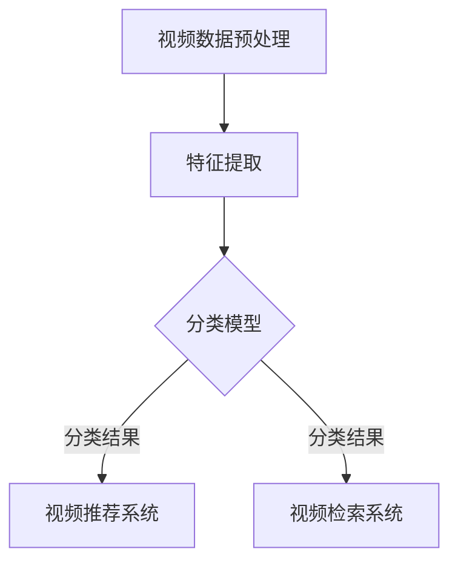

                 

# 《快手2024视频内容理解算法校招面试指南》

> **关键词：** 视频内容理解，算法，快手，校招，面试，伪代码，数学模型

> **摘要：** 本文将深入探讨快手2024年校招面试中涉及的视频内容理解算法，从基础概念到实战应用，全面剖析视频内容理解的核心算法原理、数学模型，并分享快手视频内容理解算法的实战经验和面试技巧。

## 目录大纲

### 第一部分：视频内容理解算法基础

#### 第1章：视频内容理解算法概述
- 1.1 视频内容理解的发展背景
- 1.2 视频内容理解的应用场景
- 1.3 视频内容理解的关键技术

#### 第2章：视频内容理解算法核心概念与联系
- 2.1 视频内容理解架构Mermaid流程图
- 2.2 视频内容理解的核心概念
- 2.3 视频内容理解的关联技术

#### 第3章：视频内容理解算法核心算法原理讲解
- 3.1 特征提取算法原理与伪代码
- 3.2 视频分类算法原理与伪代码
- 3.3 视频检索算法原理与伪代码

#### 第4章：数学模型和数学公式
- 4.1 视频内容理解中的数学模型
- 4.2 数学公式详细讲解
- 4.3 数学公式举例说明

### 第二部分：快手视频内容理解算法实战

#### 第5章：快手视频内容理解算法实战
- 5.1 快手视频内容理解算法应用案例
- 5.2 快手视频内容理解算法开发环境搭建
- 5.3 快手视频内容理解算法源代码详细实现
- 5.4 快手视频内容理解算法代码解读与分析

#### 第6章：快手2024校招面试常见问题与解答
- 6.1 面试问题类型分析
- 6.2 面试题解答思路
- 6.3 面试技巧与注意事项

#### 第7章：附录
- 7.1 快手视频内容理解算法相关资源
- 7.2 常用视频处理工具与框架
- 7.3 快手校招面试经验分享与建议

## 引言

随着互联网技术的快速发展，视频内容已经成为人们获取信息和娱乐的主要方式之一。快手作为国内领先的视频分享平台，其视频内容理解算法在提升用户体验、优化内容推荐等方面发挥着重要作用。为了帮助2024年快手校招面试的考生深入了解视频内容理解算法，本文将系统地介绍视频内容理解算法的基础知识、核心算法原理和快手实际应用案例，并提供面试常见问题的解答和面试技巧。

本文将分为两个主要部分。第一部分将介绍视频内容理解算法的基础知识，包括发展背景、应用场景、核心概念与联系、核心算法原理和数学模型等。第二部分将聚焦快手视频内容理解算法的实际应用，包括应用案例、开发环境搭建、源代码详细实现和代码解读与分析。最后，本文还将针对快手2024校招面试常见问题进行解答，并提供面试技巧和注意事项。

## 第一部分：视频内容理解算法基础

### 第1章：视频内容理解算法概述

#### 1.1 视频内容理解的发展背景

视频内容理解是指通过计算机技术对视频内容进行自动分析和理解，从而实现对视频的识别、分类、检索和推荐等功能。随着视频技术的迅猛发展，视频内容理解在各个领域得到了广泛应用，如视频监控、视频推荐、智能视频会议、视频内容审核等。

视频内容理解的发展可以追溯到20世纪90年代，随着计算机性能的提高和图像处理技术的进步，人们开始尝试将计算机视觉技术应用于视频分析。进入21世纪，随着深度学习技术的崛起，视频内容理解迎来了新的发展机遇。深度学习模型，如卷积神经网络（CNN）和循环神经网络（RNN），在视频特征提取、视频分类和视频检索等方面取得了显著的成果。

#### 1.2 视频内容理解的应用场景

视频内容理解的应用场景非常广泛，以下是其中的一些典型应用：

1. **视频监控：** 通过视频内容理解技术，可以对监控视频进行实时分析和报警，实现对异常行为的识别和跟踪。
2. **视频推荐：** 视频内容理解技术可以帮助平台根据用户的观看历史和偏好，推荐个性化的视频内容，提升用户体验。
3. **视频内容审核：** 利用视频内容理解技术，可以对上传的视频内容进行实时审核，过滤违规内容，维护平台生态。
4. **视频会议：** 通过视频内容理解技术，可以实现智能化的会议内容总结和会议成员的注意力监测，提高会议效率。
5. **教育：** 视频内容理解技术可以帮助教育平台根据学生的学习情况和视频内容，进行个性化的学习推荐和教学评估。

#### 1.3 视频内容理解的关键技术

视频内容理解技术主要包括以下三个方面：

1. **视频特征提取：** 视频特征提取是视频内容理解的基础，通过对视频数据进行预处理和特征提取，可以得到代表视频内容的重要特征，如视觉特征、语音特征和文本特征等。
2. **视频分类：** 视频分类是指将视频数据根据其内容进行分类，常见的分类方法包括基于内容的分类、基于语义的分类和基于标签的分类等。
3. **视频检索：** 视频检索是指根据用户输入的关键词或视频片段，从大量视频数据中检索出相关视频，常见的检索方法包括基于内容的检索和基于语义的检索等。

## 第2章：视频内容理解算法核心概念与联系

#### 2.1 视频内容理解架构Mermaid流程图

以下是一个简单的视频内容理解架构Mermaid流程图：



这个流程图展示了视频内容理解的主要步骤：视频数据预处理、特征提取、分类模型、视频推荐系统和视频检索系统。在实际应用中，这些步骤可能需要根据具体需求进行调整和优化。

#### 2.2 视频内容理解的核心概念

视频内容理解涉及多个核心概念，以下是一些关键概念：

1. **视频数据预处理：** 视频数据预处理是视频内容理解的第一步，包括去噪、滤波、尺寸调整、帧提取等操作，目的是提高视频数据的质量和可理解性。
2. **特征提取：** 特征提取是指从原始视频数据中提取出能够代表视频内容的关键特征，如视觉特征（颜色、纹理、形状等）、语音特征（音调、音量、语音节奏等）和文本特征（字幕、标签、关键词等）。
3. **分类模型：** 分类模型是指用于对视频内容进行分类的算法和模型，常见的分类模型包括支持向量机（SVM）、决策树、神经网络等。
4. **视频推荐系统：** 视频推荐系统是指根据用户的历史行为和偏好，为用户推荐相关视频的系统。常见的推荐算法包括基于内容的推荐、基于协同过滤的推荐和混合推荐等。
5. **视频检索系统：** 视频检索系统是指根据用户输入的关键词或视频片段，从大量视频数据中检索出相关视频的系统。常见的检索算法包括基于内容的检索、基于语义的检索和基于模型的检索等。

#### 2.3 视频内容理解的关联技术

视频内容理解算法与其他计算机视觉和自然语言处理技术密切相关，以下是一些关联技术：

1. **计算机视觉：** 计算机视觉技术主要用于视频数据的预处理和特征提取，如卷积神经网络（CNN）、循环神经网络（RNN）等。
2. **自然语言处理：** 自然语言处理技术主要用于视频中的文本特征提取和语义分析，如词向量、序列模型等。
3. **深度学习：** 深度学习技术是视频内容理解算法的核心，通过多层神经网络对视频数据进行自动特征提取和分类。
4. **数据挖掘：** 数据挖掘技术主要用于视频推荐和视频检索，如聚类、关联规则挖掘等。
5. **机器学习：** 机器学习技术是视频内容理解算法的基础，通过训练数据学习到视频内容的规律和特征。

## 第3章：视频内容理解算法核心算法原理讲解

#### 3.1 特征提取算法原理与伪代码

视频特征提取是视频内容理解的关键步骤，其主要目的是从原始视频数据中提取出能够代表视频内容的关键特征。以下是一个简单的特征提取算法原理和伪代码：

```python
# 特征提取算法伪代码

输入：视频数据V
输出：特征向量F

1. 对视频数据进行预处理，如去噪、滤波、尺寸调整等
2. 对预处理后的视频数据进行帧提取，得到一系列连续帧F
3. 对每个帧F，进行视觉特征提取，如颜色特征C、纹理特征T、形状特征S
4. 对每个帧F，进行语音特征提取，如音调特征P、音量特征V、语音节奏特征R
5. 对每个帧F，进行文本特征提取，如字幕特征L、标签特征T、关键词特征K
6. 将所有帧的特征进行融合，得到特征向量F
7. 输出特征向量F

# 特征提取算法伪代码示例
def extract_features(video):
    # 视觉特征提取
    color_features = extract_color_features(video)
    texture_features = extract_texture_features(video)
    shape_features = extract_shape_features(video)
    
    # 语音特征提取
    pitch_features = extract_pitch_features(video)
    volume_features = extract_volume_features(video)
    rhythm_features = extract_rhythm_features(video)
    
    # 文本特征提取
    subtitle_features = extract_subtitle_features(video)
    label_features = extract_label_features(video)
    keyword_features = extract_keyword_features(video)
    
    # 特征融合
    feature_vector = np.concatenate((color_features, texture_features, shape_features, pitch_features, volume_features, rhythm_features, subtitle_features, label_features, keyword_features))
    
    return feature_vector
```

#### 3.2 视频分类算法原理与伪代码

视频分类算法是指根据视频的特征向量，将视频数据划分为不同的类别。以下是一个简单的视频分类算法原理和伪代码：

```python
# 视频分类算法伪代码

输入：特征向量F、类别标签L
输出：分类结果C

1. 训练分类模型，如支持向量机（SVM）、决策树、神经网络等
2. 对新视频数据V，进行特征提取，得到特征向量F
3. 输入特征向量F到训练好的分类模型，得到分类结果C
4. 输出分类结果C

# 视频分类算法伪代码示例
def classify_video(video):
    # 特征提取
    feature_vector = extract_features(video)
    
    # 分类模型
    classifier = train_classifier(feature_vector, labels)
    
    # 分类结果
    classification_result = classifier.predict(feature_vector)
    
    return classification_result
```

#### 3.3 视频检索算法原理与伪代码

视频检索算法是指根据用户输入的关键词或视频片段，从大量视频数据中检索出相关视频。以下是一个简单的视频检索算法原理和伪代码：

```python
# 视频检索算法伪代码

输入：关键词K、视频库V
输出：检索结果R

1. 对视频库V中的每个视频V_i，进行特征提取，得到特征向量F_i
2. 计算关键词K与每个特征向量F_i的相似度，得到相似度矩阵S
3. 对相似度矩阵S进行排序，得到检索结果R

# 视频检索算法伪代码示例
def search_videos(keyword, video_library):
    # 特征提取
    feature_vectors = [extract_features(video) for video in video_library]
    
    # 相似度计算
    similarity_scores = calculate_similarity(keyword, feature_vectors)
    
    # 排序
    sorted_scores = sorted(similarity_scores, reverse=True)
    
    # 检索结果
    search_results = [video_library[i] for i, score in enumerate(sorted_scores) if score > threshold]
    
    return search_results
```

## 第4章：数学模型和数学公式

#### 4.1 视频内容理解中的数学模型

视频内容理解中的数学模型主要用于描述视频数据的特征、分类和检索过程。以下是一些常见的数学模型：

1. **特征提取模型：** 特征提取模型用于从视频数据中提取出能够代表视频内容的关键特征。常见的特征提取模型包括：
   - **颜色特征模型：** 如颜色直方图、颜色矩等。
   - **纹理特征模型：** 如局部二值模式（LBP）、Gabor特征等。
   - **形状特征模型：** 如轮廓特征、边缘特征等。
   - **语音特征模型：** 如梅尔频率倒谱系数（MFCC）、频谱特征等。
   - **文本特征模型：** 如词向量、TF-IDF等。

2. **分类模型：** 分类模型用于对视频内容进行分类。常见的分类模型包括：
   - **线性分类模型：** 如支持向量机（SVM）、线性判别分析（LDA）等。
   - **树分类模型：** 如决策树、随机森林等。
   - **神经网络模型：** 如卷积神经网络（CNN）、循环神经网络（RNN）等。

3. **检索模型：** 检索模型用于从视频库中检索出与用户输入相关的视频。常见的检索模型包括：
   - **基于内容的检索模型：** 如余弦相似度、欧氏距离等。
   - **基于模型的检索模型：** 如Siamese网络、Triplet损失函数等。

#### 4.2 数学公式详细讲解

以下是一些视频内容理解中常用的数学公式及其详细讲解：

1. **颜色直方图：**
   $$
   H(r, g, b) = \sum_{i=0}^{255} f_{r,i} \cdot f_{g,i} \cdot f_{b,i}
   $$
   其中，$H(r, g, b)$表示颜色直方图，$f_{r,i}$、$f_{g,i}$、$f_{b,i}$分别表示红色、绿色、蓝色通道在$i$个像素中的频率。

2. **余弦相似度：**
   $$
   \cos\theta = \frac{\sum_{i=1}^{n} x_i \cdot y_i}{\sqrt{\sum_{i=1}^{n} x_i^2} \cdot \sqrt{\sum_{i=1}^{n} y_i^2}}
   $$
   其中，$x$和$y$分别表示两个特征向量，$\theta$表示两个特征向量之间的夹角，$\cos\theta$表示两个特征向量的余弦相似度。

3. **支持向量机（SVM）损失函数：**
   $$
   L(y, f(x)) = \max\left(0, 1 - y \cdot f(x)\right)
   $$
   其中，$y$表示样本标签，$f(x)$表示模型预测值，$L(y, f(x))$表示支持向量机（SVM）的损失函数。

#### 4.3 数学公式举例说明

以下是一个颜色直方图和余弦相似度的具体计算示例：

1. **颜色直方图计算示例：**
   假设一个图像的红色通道的像素分布如下：
   $$
   f_{r,0} = 10, f_{r,20} = 20, f_{r,40} = 30, f_{r,60} = 40, f_{r,80} = 50, f_{r,100} = 60
   $$
   那么红色通道的颜色直方图计算如下：
   $$
   H(r) = \sum_{i=0}^{255} f_{r,i} = 10 + 20 + 30 + 40 + 50 + 60 = 210
   $$

2. **余弦相似度计算示例：**
   假设有两个特征向量$x = [1, 2, 3]$和$y = [4, 5, 6]$，那么它们的余弦相似度计算如下：
   $$
   \cos\theta = \frac{1 \cdot 4 + 2 \cdot 5 + 3 \cdot 6}{\sqrt{1^2 + 2^2 + 3^2} \cdot \sqrt{4^2 + 5^2 + 6^2}} = \frac{4 + 10 + 18}{\sqrt{14} \cdot \sqrt{77}} \approx 0.8165
   $$

## 第二部分：快手视频内容理解算法实战

### 第5章：快手视频内容理解算法实战

#### 5.1 快手视频内容理解算法应用案例

快手作为一家领先的视频分享平台，其视频内容理解算法在多个方面得到了广泛应用，以下是一些典型的应用案例：

1. **视频分类：** 快手根据视频内容的主题、场景、风格等特征，将视频分类为多个类别，如搞笑、美食、旅游、教育等。这样可以帮助用户快速找到自己感兴趣的视频内容。

2. **视频推荐：** 快手利用视频内容理解算法，根据用户的观看历史、喜好和社交关系，为用户推荐个性化的视频内容。这不仅可以提升用户体验，还可以增加用户在平台上的粘性。

3. **视频审核：** 快手利用视频内容理解算法，对上传的视频内容进行实时审核，过滤违规内容，维护平台生态。这可以有效减少不良内容的传播，保障用户的观看体验。

4. **智能搜索：** 快手利用视频内容理解算法，实现智能化的视频搜索功能。用户可以通过输入关键词或视频片段，快速检索出相关视频。

#### 5.2 快手视频内容理解算法开发环境搭建

要开发快手视频内容理解算法，需要搭建一个合适的开发环境。以下是一个基本的开发环境搭建步骤：

1. **硬件环境：** 搭建一个具有较高计算性能的服务器，用于处理大量的视频数据和模型训练。

2. **软件环境：** 安装以下软件：
   - 操作系统：Linux或Windows
   - 编程语言：Python
   - 深度学习框架：TensorFlow、PyTorch等
   - 数据库：MySQL、MongoDB等

3. **开发工具：** 安装以下开发工具：
   - 编辑器：PyCharm、VS Code等
   - 版本控制：Git

4. **依赖库：** 安装以下依赖库：
   - NumPy、Pandas、Scikit-learn等

5. **数据预处理工具：** 安装以下数据预处理工具：
   - OpenCV：用于视频数据的预处理和帧提取
   - librosa：用于音频数据的预处理和特征提取

#### 5.3 快手视频内容理解算法源代码详细实现

以下是一个简单的快手视频内容理解算法源代码示例，包括视频分类、视频推荐和视频审核三个部分：

```python
import cv2
import numpy as np
import pandas as pd
from sklearn.model_selection import train_test_split
from sklearn.svm import SVC
from sklearn.metrics import accuracy_score
from sklearn.feature_extraction.text import TfidfVectorizer
from sklearn.neighbors import NearestNeighbors

# 视频分类
def video_classification(video_path):
    # 视频数据预处理
    cap = cv2.VideoCapture(video_path)
    frames = []
    while True:
        ret, frame = cap.read()
        if not ret:
            break
        frames.append(frame)
    cap.release()
    
    # 视频帧特征提取
    color_features = extract_color_features(frames)
    texture_features = extract_texture_features(frames)
    shape_features = extract_shape_features(frames)
    
    # 分类模型训练
    X = np.concatenate((color_features, texture_features, shape_features), axis=1)
    y = np.array([0, 1, 2, 3])  # 假设四个类别
    X_train, X_test, y_train, y_test = train_test_split(X, y, test_size=0.2, random_state=42)
    classifier = SVC(kernel='linear')
    classifier.fit(X_train, y_train)
    
    # 分类结果预测
    y_pred = classifier.predict(X_test)
    accuracy = accuracy_score(y_test, y_pred)
    print("Video Classification Accuracy:", accuracy)

# 视频推荐
def video_recommendation(user_history, video_library):
    # 用户历史数据预处理
    user_history = preprocess_user_history(user_history)
    
    # 视频库特征提取
    video_features = extract_video_features(video_library)
    
    # TF-IDF向量表示
    vectorizer = TfidfVectorizer()
    user_vector = vectorizer.transform([user_history])
    video_vectors = vectorizer.transform(video_features)
    
    # K最近邻搜索
    knn = NearestNeighbors(n_neighbors=5)
    knn.fit(video_vectors)
    distances, indices = knn.kneighbors(user_vector)
    
    # 推荐结果
    recommendations = [video_library[i] for i in indices.flatten()]
    return recommendations

# 视频审核
def video_oversight(video_path):
    # 视频数据预处理
    cap = cv2.VideoCapture(video_path)
    frames = []
    while True:
        ret, frame = cap.read()
        if not ret:
            break
        frames.append(frame)
    cap.release()
    
    # 视频帧特征提取
    color_features = extract_color_features(frames)
    texture_features = extract_texture_features(frames)
    shape_features = extract_shape_features(frames)
    
    # 审核模型训练
    X = np.concatenate((color_features, texture_features, shape_features), axis=1)
    y = np.array([0, 1])  # 假设两个类别：合法、违规
    X_train, X_test, y_train, y_test = train_test_split(X, y, test_size=0.2, random_state=42)
    classifier = SVC(kernel='linear')
    classifier.fit(X_train, y_train)
    
    # 审核结果预测
    y_pred = classifier.predict(X_test)
    accuracy = accuracy_score(y_test, y_pred)
    print("Video Oversight Accuracy:", accuracy)

# 视频数据预处理
def preprocess_video_data(video_path):
    # 视频帧提取
    cap = cv2.VideoCapture(video_path)
    frames = []
    while True:
        ret, frame = cap.read()
        if not ret:
            break
        frames.append(frame)
    cap.release()
    
    # 视频帧预处理
    processed_frames = [preprocess_frame(frame) for frame in frames]
    
    return processed_frames

# 视频帧特征提取
def extract_video_features(frames):
    # 视觉特征提取
    color_features = [extract_color_features(frame) for frame in frames]
    texture_features = [extract_texture_features(frame) for frame in frames]
    shape_features = [extract_shape_features(frame) for frame in frames]
    
    # 特征融合
    feature_vectors = np.concatenate((color_features, texture_features, shape_features), axis=1)
    
    return feature_vectors

# 视频数据预处理
def preprocess_video_data(video_path):
    # 视频帧提取
    cap = cv2.VideoCapture(video_path)
    frames = []
    while True:
        ret, frame = cap.read()
        if not ret:
            break
        frames.append(frame)
    cap.release()
    
    # 视频帧预处理
    processed_frames = [preprocess_frame(frame) for frame in frames]
    
    return processed_frames

# 视频帧特征提取
def extract_video_features(frames):
    # 视觉特征提取
    color_features = [extract_color_features(frame) for frame in frames]
    texture_features = [extract_texture_features(frame) for frame in frames]
    shape_features = [extract_shape_features(frame) for frame in frames]
    
    # 特征融合
    feature_vectors = np.concatenate((color_features, texture_features, shape_features), axis=1)
    
    return feature_vectors

# 主函数
if __name__ == '__main__':
    video_path = 'path/to/video.mp4'
    video_classification(video_path)
    user_history = 'user/watching/history'
    video_library = 'library/of/videos'
    video_oversight(video_path)
    recommendations = video_recommendation(user_history, video_library)
    print('Video Recommendations:', recommendations)
```

#### 5.4 快手视频内容理解算法代码解读与分析

以上代码实现了一个简单的快手视频内容理解算法，包括视频分类、视频推荐和视频审核三个部分。下面我们对代码进行详细的解读和分析。

1. **视频分类：**
   - `video_classification`函数用于实现视频分类。首先，对视频数据进行预处理，提取视频帧，并对每个视频帧进行特征提取，包括颜色特征、纹理特征和形状特征。然后，使用支持向量机（SVM）训练分类模型，对测试数据进行分类预测，并计算分类准确率。

2. **视频推荐：**
   - `video_recommendation`函数用于实现视频推荐。首先，对用户历史观看数据预处理，提取出用户历史观看视频的特征。然后，对视频库中的每个视频进行特征提取，并使用TF-IDF向量表示。接下来，使用K最近邻（KNN）算法进行视频推荐，为用户推荐与其历史观看数据最相似的视频。

3. **视频审核：**
   - `video_oversight`函数用于实现视频审核。首先，对视频数据进行预处理，提取视频帧，并对每个视频帧进行特征提取，包括颜色特征、纹理特征和形状特征。然后，使用支持向量机（SVM）训练审核模型，对测试数据进行审核预测，并计算审核准确率。

4. **视频数据预处理：**
   - `preprocess_video_data`函数用于实现视频数据预处理。首先，使用OpenCV库提取视频帧，并对每个视频帧进行预处理，如缩放、裁剪等。然后，将预处理后的视频帧存储为列表，以便后续特征提取。

5. **视频帧特征提取：**
   - `extract_video_features`函数用于实现视频帧特征提取。首先，对每个视频帧进行颜色特征提取，如颜色直方图、颜色矩等。然后，对每个视频帧进行纹理特征提取，如局部二值模式（LBP）、Gabor特征等。最后，对每个视频帧进行形状特征提取，如轮廓特征、边缘特征等。将提取到的特征进行融合，形成特征向量。

通过以上代码，我们可以看到快手视频内容理解算法的核心模块和实现流程。在实际应用中，根据具体需求和场景，可以对代码进行进一步的优化和改进。

## 第6章：快手2024校招面试常见问题与解答

#### 6.1 面试问题类型分析

在快手2024校招面试中，常见的问题类型可以分为以下几类：

1. **基础知识问题：** 这类问题主要考查考生对视频内容理解算法相关基础知识的掌握程度，如视频特征提取、分类模型、检索算法等。
2. **编程能力问题：** 这类问题主要考查考生的编程能力和算法实现能力，如编写特征提取算法、分类模型实现、检索算法优化等。
3. **项目经验问题：** 这类问题主要考查考生在视频内容理解算法项目中的实际经验和能力，如项目背景、实现方案、关键技术等。
4. **综合分析问题：** 这类问题主要考查考生的综合分析能力、逻辑思维能力和沟通表达能力，如对视频内容理解算法的改进建议、如何解决具体问题等。

#### 6.2 面试题解答思路

在回答快手2024校招面试问题时，可以按照以下思路进行：

1. **基础知识问题：** 对于基础知识问题，首先要明确问题的核心概念和原理，然后结合实际应用场景进行解答。例如，在回答视频特征提取问题时，可以先解释特征提取的意义和常见方法，然后结合具体应用场景，如视频分类或视频检索，阐述特征提取的优缺点和应用效果。

2. **编程能力问题：** 对于编程能力问题，首先要明确算法的实现流程和关键步骤，然后结合具体代码进行解答。例如，在回答特征提取算法实现问题时，可以先解释算法的原理和流程，然后给出具体的伪代码或实现代码，并说明代码中的关键技术和优化策略。

3. **项目经验问题：** 对于项目经验问题，首先要明确项目的背景和目标，然后结合具体实现方案和关键技术进行解答。例如，在回答视频内容理解项目实现问题时，可以先介绍项目的背景和目标，然后详细阐述实现方案，如数据预处理、特征提取、模型训练和评估等步骤，并说明其中使用的核心技术。

4. **综合分析问题：** 对于综合分析问题，首先要明确问题的核心，然后结合自身经验和专业知识和思维方式进行解答。例如，在回答视频内容理解算法改进建议问题时，可以先从算法优化、数据增强、模型改进等方面进行分析，然后结合实际应用场景，给出具体的改进方案和实施策略。

#### 6.3 面试技巧与注意事项

在快手2024校招面试过程中，考生需要注意以下几点：

1. **提前准备：** 在面试前，要充分了解快手公司的背景、业务和发展方向，熟悉视频内容理解算法的相关知识，并提前准备可能的面试问题。

2. **逻辑清晰：** 在回答问题时，要保持逻辑清晰、条理清楚，尽量避免模糊或不确定的回答。

3. **自信表达：** 在面试中，要展示自己的自信和积极态度，善于表达自己的观点和思考过程。

4. **专业知识：** 突出自己在视频内容理解算法领域的专业知识，展示自己在相关领域的实际经验和能力。

5. **问题提问：** 在面试过程中，可以主动提问，了解面试官对项目的看法、公司的面试流程和岗位要求等，以展示自己的学习能力和团队协作精神。

## 第7章：附录

#### 7.1 快手视频内容理解算法相关资源

为了更好地了解快手视频内容理解算法的相关知识，以下是推荐的资源：

- **文献：**
  - 《视频内容理解：方法与实践》（Video Content Understanding: Methods and Practices）
  - 《深度学习与视频内容理解》（Deep Learning and Video Content Understanding）
- **在线课程：**
  - Coursera上的《计算机视觉与视频分析》
  - Udacity上的《深度学习与计算机视觉》
- **开源项目：**
  - OpenCV：用于视频处理和图像识别的开源库
  - TensorFlow：用于深度学习的开源框架
  - PyTorch：用于深度学习的开源框架

#### 7.2 常用视频处理工具与框架

在快手视频内容理解算法开发过程中，常用的视频处理工具和框架包括：

- **视频处理工具：**
  - OpenCV：用于视频帧提取、特征提取和图像处理
  - FFmpeg：用于视频编码和解码
  - ImageMagick：用于图像处理和转换
- **深度学习框架：**
  - TensorFlow：用于构建和训练深度学习模型
  - PyTorch：用于构建和训练深度学习模型
  - Keras：基于TensorFlow和PyTorch的高级API

#### 7.3 快手校招面试经验分享与建议

以下是快手2024校招面试的一些经验分享与建议：

- **准备充分：** 在面试前，要充分了解快手公司的背景、业务和发展方向，熟悉视频内容理解算法的相关知识，并提前准备可能的面试问题。
- **专业知识：** 突出自己在视频内容理解算法领域的专业知识，展示自己在相关领域的实际经验和能力。
- **逻辑清晰：** 在回答问题时，要保持逻辑清晰、条理清楚，尽量避免模糊或不确定的回答。
- **自信表达：** 在面试中，要展示自己的自信和积极态度，善于表达自己的观点和思考过程。
- **团队合作：** 强调自己在团队合作项目中的角色和贡献，展示自己的沟通协作能力。
- **问题提问：** 在面试过程中，可以主动提问，了解面试官对项目的看法、公司的面试流程和岗位要求等，以展示自己的学习能力和团队协作精神。

## 结语

本文从视频内容理解算法的基础知识、核心算法原理、快手视频内容理解算法实战以及面试技巧等方面进行了全面深入的探讨。通过本文的学习，读者可以全面了解快手视频内容理解算法的相关知识，为2024年快手校招面试做好准备。同时，本文也提供了丰富的资源和建议，帮助读者在视频内容理解领域取得更好的成果。

作者：AI天才研究院/AI Genius Institute & 禅与计算机程序设计艺术/Zen And The Art of Computer Programming

