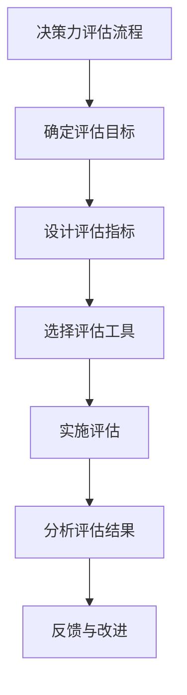

                 

### 文章标题

《思维体系：决策力的基础》

关键词：思维体系、决策力、逻辑思维、决策评估、实战应用

摘要：本文将深入探讨思维体系与决策力之间的关系，分析决策力在思维体系中的地位与作用，并详细阐述决策力的评估方法、培养策略以及在个人生活、团队管理和商业决策中的实际应用。同时，文章还将介绍决策力的高级技巧，并总结实践经验和未来发展趋势，为读者提供全面、系统的决策力提升指南。

### 《思维体系：决策力的基础》目录大纲

#### 第一部分：思维体系概述

#### 第1章：思维体系的定义与重要性

1.1 思维体系的概念  
1.2 思维体系的重要性  
1.3 决策力在思维体系中的地位

#### 第2章：决策力与思维模式

2.1 决策力的定义  
2.2 决策力的作用  
2.3 常见的思维模式  
2.4 思维模式与决策力的关系

#### 第二部分：决策力评估与培养

#### 第3章：决策力的评估方法

3.1 决策力评估的指标  
3.2 决策力评估的工具  
3.3 决策力评估的过程

#### 第4章：决策力的培养策略

4.1 决策力培养的重要性  
4.2 决策力培养的方法  
4.3 决策力培养的实践

#### 第三部分：决策力在实践中的应用

#### 第5章：决策力在个人生活中的应用

5.1 个人决策的挑战  
5.2 个人决策的方法  
5.3 个人决策的案例分析

#### 第6章：决策力在团队管理中的应用

6.1 团队决策的挑战  
6.2 团队决策的方法  
6.3 团队决策的案例分析

#### 第7章：决策力在商业决策中的应用

7.1 商业决策的挑战  
7.2 商业决策的方法  
7.3 商业决策的案例分析

#### 第四部分：决策力的高级技巧

#### 第8章：决策力的高级技巧

8.1 决策力与心理因素  
8.2 决策力与沟通技巧  
8.3 决策力与创新思维

#### 第9章：决策力实践总结与展望

9.1 决策力实践总结  
9.2 决策力未来的发展趋势  
9.3 决策力实践的建议

#### 附录

## 附录A：决策力相关的工具与资源

A.1 常用决策力工具  
A.2 决策力相关的书籍推荐  
A.3 决策力相关的网站推荐

## 附录B：Mermaid流程图

B.1 Mermaid基本语法  
B.2 Mermaid流程图示例：决策力评估流程

## 附录C：核心算法原理讲解

C.1 决策树算法  
C.2 随机森林算法

## 附录D：数学模型与公式

D.1 决策矩阵模型  
D.2 期望值模型

## 附录E：项目实战案例

E.1 个人决策案例：购买新房  
E.2 团队决策案例：项目计划  
E.3 商业决策案例：新产品开发

## 附录F：代码解读与分析

F.1 Python代码实现：决策树算法  
F.2 Python代码实现：随机森林算法

### 第一部分：思维体系概述

#### 第1章：思维体系的定义与重要性

1.1 思维体系的概念

思维体系是一个多维度的概念，它包括了思维方式、逻辑框架、认知模型等多个方面。思维体系的核心是逻辑思维，即通过分析、推理、归纳和演绎等过程来获取知识和解决问题的能力。

在信息技术领域，思维体系尤为重要。信息技术的核心在于处理和传递数据，而数据的有效处理依赖于强大的逻辑思维和决策能力。一个完善的思维体系可以帮助技术人员更好地理解问题、分析问题、解决问题，从而提高工作效率和质量。

1.2 思维体系的重要性

思维体系的重要性体现在以下几个方面：

- **提升工作效率**：一个完善的思维体系可以帮助技术人员快速准确地理解问题，从而减少重复劳动和错误率，提高工作效率。

- **增强创新能力**：思维体系有助于激发技术人员的创新思维，推动技术进步和创新发展。

- **优化决策过程**：决策力是思维体系的重要组成部分，一个健全的思维体系可以提供有力的支持，帮助技术人员做出更明智的决策。

- **提高团队协作**：在团队协作中，思维体系有助于团队成员更好地沟通和理解，减少误解和冲突，提高团队协作效率。

1.3 决策力在思维体系中的地位

决策力是思维体系的核心之一，它是思维体系的重要组成部分。决策力不仅体现在日常工作中，也贯穿于个人生活、团队管理和商业决策等多个领域。

- **个人生活**：在个人生活中，决策力体现在日常生活中的选择，如职业规划、婚姻家庭等。

- **团队管理**：在团队管理中，决策力体现在项目计划、团队协作、资源分配等方面。

- **商业决策**：在商业决策中，决策力体现在市场分析、产品规划、投资决策等方面。

综上所述，思维体系与决策力密不可分。一个健全的思维体系可以为决策力提供有力支持，从而帮助我们在各个领域中做出更明智的决策。在接下来的章节中，我们将进一步探讨决策力的定义、作用、评估方法和培养策略等内容，为读者提供全面、系统的决策力提升指南。

#### 第2章：决策力与思维模式

2.1 决策力的定义

决策力是指在面对问题时，能够迅速准确地识别问题、分析问题、制定解决方案并执行的能力。决策力不仅仅是一种技能，更是一种思维方式，它需要我们在多个维度上思考和评估问题。

决策力包括以下几个方面：

- **问题识别**：能够快速识别问题，明确问题的性质和影响。

- **分析评估**：对问题进行深入分析，评估各种可能解决方案的优缺点。

- **方案制定**：在分析评估的基础上，制定出可行的解决方案。

- **执行实施**：将方案付诸实践，并不断调整和优化。

2.2 决策力的作用

决策力在个人生活、团队管理和商业决策等多个领域都发挥着重要作用。

- **个人生活**：在个人生活中，决策力体现在日常生活中的选择，如职业规划、婚姻家庭等。一个有决策力的人能够更清晰地规划自己的生活，做出更有利于自己的选择。

- **团队管理**：在团队管理中，决策力体现在项目计划、团队协作、资源分配等方面。一个有决策力的管理者能够更有效地指导团队，提高团队的工作效率。

- **商业决策**：在商业决策中，决策力体现在市场分析、产品规划、投资决策等方面。一个有决策力的企业能够更好地把握市场动态，做出明智的商业决策。

2.3 常见的思维模式

在决策过程中，不同的思维模式会影响决策的质量和效果。常见的思维模式包括：

- **逻辑思维**：逻辑思维是一种基于逻辑推理的思维方式，它强调通过分析、推理和归纳等方法来解决问题。逻辑思维是决策力的重要组成部分。

- **系统思维**：系统思维是一种从整体角度看待问题的思维方式，它强调通过识别和分析问题中的各种因素及其相互关系来解决问题。系统思维有助于提高决策的全面性和准确性。

- **创新思维**：创新思维是一种寻找新思路、新方法的思维方式，它强调通过突破传统思维模式，寻找创新的解决方案。创新思维有助于提高决策的创新性和前瞻性。

2.4 思维模式与决策力的关系

思维模式与决策力之间存在密切的关系。不同的思维模式会影响决策力的发展和应用。

- **逻辑思维**：逻辑思维是决策力的基础，它有助于提高决策的准确性和可靠性。

- **系统思维**：系统思维有助于提高决策的全面性和系统性，使决策更具有前瞻性和可持续性。

- **创新思维**：创新思维有助于提高决策的创新性和前瞻性，使决策能够适应不断变化的环境。

综上所述，决策力与思维模式密不可分。一个健全的思维体系可以为决策力提供有力支持，从而帮助我们在各个领域中做出更明智的决策。在接下来的章节中，我们将进一步探讨决策力的评估方法和培养策略，为读者提供更具体的决策力提升指南。

### 第二部分：决策力评估与培养

#### 第3章：决策力的评估方法

3.1 决策力评估的指标

决策力的评估需要通过一系列指标来衡量。这些指标可以包括以下几个方面：

- **速度**：决策的速度是评估决策力的重要指标。一个有决策力的人能够快速地识别问题、分析问题并制定解决方案。

- **准确性**：决策的准确性是评估决策力的关键指标。一个有决策力的人能够通过深入分析和全面评估，制定出正确且有效的解决方案。

- **创新性**：决策的创新性是评估决策力的一个重要方面。一个有决策力的人能够突破传统思维模式，寻找创新的解决方案。

- **可持续性**：决策的可持续性是评估决策力的重要指标。一个有决策力的人能够考虑到长期影响，制定出能够持续发展的解决方案。

- **适应性**：决策的适应性是评估决策力的重要方面。一个有决策力的人能够根据环境和情况的变化，灵活调整和优化决策。

3.2 决策力评估的工具

为了评估决策力，可以使用以下几种工具：

- **自我评估问卷**：通过自我评估问卷，个体可以了解自己的决策力水平，识别自己的优势和不足。

- **360度评估**：通过360度评估，可以从多个角度收集反馈，包括上级、同事和下属的评价，全面了解决策力。

- **案例分析**：通过案例分析，可以评估个体在实际决策过程中的表现，识别决策的优缺点。

- **模拟训练**：通过模拟训练，可以在模拟环境中进行决策实践，提高决策力。

3.3 决策力评估的过程

决策力的评估通常包括以下步骤：

- **确定评估目标**：明确评估的目标和目的，确保评估具有针对性。

- **设计评估指标**：根据评估目标，设计相应的评估指标，包括速度、准确性、创新性、可持续性和适应性等。

- **选择评估工具**：根据评估指标，选择合适的评估工具，如自我评估问卷、360度评估、案例分析和模拟训练等。

- **实施评估**：按照评估计划，实施评估过程，收集相关数据和信息。

- **分析评估结果**：对收集到的评估结果进行分析，识别决策力的优势和不足。

- **反馈与改进**：根据评估结果，提供反馈，帮助个体识别和改进决策力。

#### 第4章：决策力的培养策略

4.1 决策力培养的重要性

决策力的培养对于个人的成长和职业发展具有重要意义。一个有决策力的人能够更好地应对挑战，抓住机遇，实现个人和组织的目标。以下是从几个方面阐述决策力培养的重要性：

- **提高工作效率**：决策力的培养有助于提高工作效率。一个有决策力的人能够快速识别问题、分析问题并制定解决方案，从而减少不必要的延误和重复工作。

- **增强创新能力**：决策力的培养有助于增强创新能力。一个有决策力的人能够突破传统思维模式，寻找创新的解决方案，推动技术和业务的进步。

- **优化决策质量**：决策力的培养有助于优化决策质量。一个有决策力的人能够通过深入分析和全面评估，制定出更加合理和有效的解决方案。

- **提升团队协作**：决策力的培养有助于提升团队协作。一个有决策力的人能够更好地指导团队，协调各方资源，提高团队的整体效率。

4.2 决策力培养的方法

为了培养决策力，可以采取以下几种方法：

- **学习与培训**：通过学习相关理论和案例，了解决策力的重要性和方法。参加决策力培训课程，掌握决策力的关键技巧和策略。

- **实践与经验**：通过实际决策实践，积累经验。在实际工作中，积极面对挑战，锻炼决策能力。可以从小的决策开始，逐步提高决策的复杂度和难度。

- **反思与总结**：在决策过程中，及时反思和总结。分析决策的成败，总结经验和教训，不断优化决策过程。

- **多元化学习**：决策力的培养需要多元化学习。不仅要学习专业知识，还要学习心理学、管理学、经济学等相关知识，提高决策的全面性和准确性。

- **建立支持系统**：建立决策支持系统，包括专家咨询、团队协作和信息资源等。在决策过程中，充分利用外部资源，提高决策的质量和效率。

4.3 决策力培养的实践

以下是一些具体的决策力培养实践方法：

- **设定学习目标**：制定明确的决策力提升目标，如提高决策速度、准确性等。

- **定期进行自我评估**：定期使用自我评估问卷等工具，了解自己的决策力水平，识别需要改进的方面。

- **参与团队项目**：积极参与团队项目，通过实际决策实践，提高自己的决策力。

- **阅读相关书籍和文章**：阅读有关决策力培养的书籍和文章，学习先进的决策理论和实践方法。

- **参加决策力培训**：参加专业的决策力培训课程，学习决策力的关键技巧和策略。

- **建立个人学习计划**：制定个人学习计划，定期进行学习和实践，不断提升自己的决策力。

通过以上方法和实践，可以有效地培养和提高决策力，为个人和组织的成功提供有力支持。在接下来的章节中，我们将进一步探讨决策力在个人生活、团队管理和商业决策中的应用，为读者提供更具体的实战指南。

### 第三部分：决策力在实践中的应用

#### 第5章：决策力在个人生活中的应用

5.1 个人决策的挑战

在个人生活中，决策力是至关重要的。个人决策涉及许多方面，包括职业规划、婚姻家庭、财务管理等。然而，面对这些决策，人们常常会遇到一些挑战：

- **信息不足**：许多个人决策需要基于大量的信息，但很多时候，人们无法获得足够的信息，从而影响决策的质量。

- **时间压力**：在现实生活中，很多决策需要在短时间内做出，这给决策带来了压力和挑战。

- **情绪干扰**：情绪因素可能会影响决策的客观性和理性，导致做出错误的决策。

5.2 个人决策的方法

为了应对个人决策的挑战，可以采取以下方法来提高决策力：

- **充分准备**：在做出决策之前，充分收集相关信息，了解决策的各个方面。这可以通过阅读相关书籍、咨询专业人士、参加研讨会等方式实现。

- **制定计划**：制定详细的决策计划，包括目标、步骤和时间安排。这有助于提高决策的效率和质量。

- **评估选项**：对不同的决策选项进行评估，分析每个选项的优缺点和潜在风险。这可以通过制作决策矩阵、比较分析等方法实现。

- **咨询意见**：在决策过程中，可以寻求家人、朋友或专业人士的意见，以获得不同的视角和建议。

- **情绪管理**：学会情绪管理技巧，避免情绪干扰决策。可以通过冥想、放松训练等方法来缓解压力和焦虑。

5.3 个人决策的案例分析

以下是一个个人决策的案例分析：

案例：小王是一名年轻的工程师，他面临是否跳槽的决策。他首先进行了市场调研，了解了同行业其他工程师的薪资水平和晋升机会。然后，他分析了自身的发展规划和目标，以及两个潜在跳槽目标公司的文化和工作环境。最后，他咨询了家人和朋友，听取了他们的意见。在综合考虑各方面因素后，小王做出了跳槽的决策，并成功找到了一份更满意的工作。

通过这个案例，我们可以看到，在个人决策中，充分的准备、理性的分析和情绪管理是关键。只有通过科学的方法和策略，才能做出明智的决策，实现个人目标。

#### 第6章：决策力在团队管理中的应用

6.1 团队决策的挑战

在团队管理中，决策力同样至关重要。团队决策涉及项目计划、资源分配、目标设定等多个方面。然而，团队决策往往面临以下挑战：

- **意见分歧**：团队成员可能有不同的观点和利益，导致决策过程中出现意见分歧。

- **时间限制**：许多团队决策需要在短时间内做出，这增加了决策的难度和压力。

- **信息传递**：在团队中，信息传递的效率和质量可能会影响决策的准确性和及时性。

6.2 团队决策的方法

为了克服团队决策的挑战，可以采取以下方法来提高决策力：

- **建立共识**：在决策之前，通过沟通和讨论，建立团队共识。这有助于减少意见分歧，提高决策的一致性。

- **明确目标**：在决策过程中，明确团队的目标和优先级。这有助于确保决策的针对性和有效性。

- **分工合作**：根据团队成员的能力和特长，分工合作，发挥团队的整体优势。

- **信息共享**：确保团队成员能够及时获取相关信息，提高决策的透明度和准确性。

- **决策模型**：运用决策模型，如决策树、SWOT分析等，帮助团队系统地进行决策。

6.3 团队决策的案例分析

以下是一个团队决策的案例分析：

案例：某公司项目团队在制定项目计划时，面临时间紧、任务重的挑战。团队首先明确了项目的目标和时间节点，然后进行了任务分解，根据团队成员的能力和特长进行了分工。在决策过程中，团队使用了决策树模型，分析了每个任务的风险和收益，制定了详细的计划。在执行过程中，团队定期召开会议，评估进展情况，及时调整计划，确保项目按期完成。

通过这个案例，我们可以看到，在团队决策中，建立共识、明确目标和信息共享是关键。只有通过科学的方法和策略，才能提高团队决策的质量和效率。

#### 第7章：决策力在商业决策中的应用

7.1 商业决策的挑战

在商业决策中，决策力至关重要。商业决策涉及市场分析、产品规划、投资决策等多个方面。然而，商业决策往往面临以下挑战：

- **市场变化**：市场环境不断变化，决策者需要快速适应市场变化，做出准确的市场预测和决策。

- **竞争压力**：市场竞争激烈，决策者需要在短时间内做出决策，抢占市场先机。

- **信息不足**：商业决策往往需要基于大量的市场信息和数据，但很多时候，信息不足会影响决策的质量。

7.2 商业决策的方法

为了应对商业决策的挑战，可以采取以下方法来提高决策力：

- **市场调研**：在做出商业决策之前，进行充分的市场调研，了解市场需求、竞争对手、市场趋势等信息。

- **数据分析**：运用数据分析方法，对市场数据进行分析，识别市场机会和风险。

- **竞争分析**：对竞争对手进行分析，了解竞争对手的产品、策略和优势，制定有针对性的决策。

- **风险评估**：对商业决策进行风险评估，识别潜在风险，制定相应的应对策略。

- **决策模型**：运用决策模型，如决策树、期望值模型等，帮助商业决策更加科学和系统。

7.3 商业决策的案例分析

以下是一个商业决策的案例分析：

案例：某互联网公司在拓展海外市场时，面临市场变化和竞争压力的挑战。公司在决策过程中，首先进行了市场调研，了解了目标市场的需求和竞争状况。然后，公司运用数据分析方法，分析了市场数据，识别了市场机会和风险。在竞争分析中，公司分析了竞争对手的产品和策略，制定了有针对性的拓展计划。在决策过程中，公司还进行了风险评估，制定了应对措施，确保决策的准确性和安全性。

通过这个案例，我们可以看到，在商业决策中，市场调研、数据分析、竞争分析和风险评估是关键。只有通过科学的方法和策略，才能提高商业决策的质量和效率。

### 第四部分：决策力的高级技巧

#### 第8章：决策力的高级技巧

8.1 决策力与心理因素

决策力不仅仅是一个技术问题，它也受到心理因素的影响。以下是一些常见的心理因素，以及如何利用它们来提高决策力：

- **情绪管理**：情绪可能会影响决策的客观性和理性。学会情绪管理技巧，如冥想、深呼吸等，可以帮助决策者保持冷静，减少情绪干扰。

- **自信**：自信可以增强决策者的决心和执行力。通过积极的自我暗示、回顾成功的决策经验等方法，可以提高自信心。

- **心理弹性**：在面对挫折和失败时，心理弹性可以帮助决策者迅速恢复，从失败中吸取教训，做出更好的决策。

8.2 决策力与沟通技巧

有效的沟通技巧对于提高决策力至关重要。以下是一些关键的沟通技巧：

- **倾听**：倾听是有效沟通的基础。通过倾听，决策者可以更好地理解问题的本质，获取更多的信息。

- **提问**：提问可以帮助决策者更深入地了解问题，发现潜在的问题和解决方案。

- **表达**：清晰、准确地表达自己的想法和观点，有助于减少误解，提高决策的质量。

8.3 决策力与创新思维

创新思维是提高决策力的关键。以下是一些创新思维的方法：

- **头脑风暴**：头脑风暴可以帮助团队成员快速产生大量的创意和解决方案。

- **思维导图**：思维导图可以帮助决策者系统地组织和分析信息，发现新的联系和解决方案。

- **横向思维**：横向思维是一种突破传统思维模式的创新方法，可以帮助决策者从不同的角度看待问题，找到创新的解决方案。

#### 第9章：决策力实践总结与展望

9.1 决策力实践总结

通过前面的章节，我们探讨了决策力在个人生活、团队管理和商业决策中的应用，以及决策力的高级技巧。以下是一些关键的实践总结：

- **决策力是一个多维度的能力，包括速度、准确性、创新性、可持续性和适应性。**

- **有效的决策力评估方法和培养策略可以帮助提高决策力。**

- **在个人生活中，充分准备、评估选项、情绪管理是关键。**

- **在团队管理中，建立共识、明确目标、分工合作、信息共享是关键。**

- **在商业决策中，市场调研、数据分析、竞争分析和风险评估是关键。**

- **心理因素、沟通技巧和创新思维对决策力有重要影响。**

9.2 决策力未来的发展趋势

随着人工智能、大数据和云计算等技术的发展，决策力将面临新的机遇和挑战。以下是一些决策力未来的发展趋势：

- **人工智能辅助决策**：人工智能技术可以提供大量的数据分析和预测，辅助决策者做出更明智的决策。

- **数据驱动的决策**：越来越多的企业将采用数据驱动的决策方法，通过数据分析来指导决策。

- **跨学科融合**：决策力的发展将越来越依赖跨学科的知识和技能，如心理学、经济学、管理学等。

- **持续学习和适应**：在快速变化的环境中，持续学习和适应能力将成为决策力的关键。

9.3 决策力实践的建议

为了提高决策力，以下是一些建议：

- **培养逻辑思维和系统思维，提高决策的准确性和全面性。**

- **积极实践，从实际决策中学习和反思。**

- **寻求多元化的意见和建议，提高决策的多样性和创新性。**

- **利用现代技术工具，如人工智能、大数据等，提高决策的效率和质量。**

通过以上实践和建议，我们可以不断提升决策力，为个人和组织的成功提供有力支持。

### 附录

#### 附录A：决策力相关的工具与资源

A.1 常用决策力工具

- **决策树工具**：用于创建和评估决策树，帮助进行决策分析。
- **SWOT分析工具**：用于分析企业的优势、劣势、机会和威胁，帮助制定战略决策。
- **期望值计算器**：用于计算期望值，帮助评估不同决策的预期结果。
- **思维导图工具**：用于创建思维导图，帮助组织和整理思路。

A.2 决策力相关的书籍推荐

- **《决策与判断》**：丹尼尔·卡内曼著，详细介绍了决策心理学和决策模型。
- **《决策的艺术》**：托马斯·赫伯特·约翰逊著，提供了多种决策策略和方法。
- **《决策的智慧》**：斯蒂芬·罗宾斯著，探讨了决策过程中的心理和行为因素。

A.3 决策力相关的网站推荐

- **决策实验室**：提供决策分析工具和资源，帮助学习和实践决策技巧。
- **决策与判断**：提供有关决策心理学和决策理论的最新研究和文章。
- **决策指南**：提供实用的决策指南和案例，帮助读者提高决策力。

#### 附录B：Mermaid流程图

B.1 Mermaid基本语法

- **节点定义**：使用`node`关键字定义节点，如`node A["Node A"]`。
- **边定义**：使用`edge`关键字定义边，如`edge A-->B["箭头指向B"]`。
- **布局**：使用`graph TB`定义布局，如`graph TB`表示横向布局。

B.2 Mermaid流程图示例：决策力评估流程



#### 附录C：核心算法原理讲解

C.1 决策树算法

决策树是一种常见的分类和回归算法，它通过一系列规则将数据进行分类或回归。以下是一个简单的决策树算法的伪代码：

```python
def build_decision_tree(data):
    if data 非纯类别：
        选择最佳特征 split_feature
        split_data = split(data, split_feature)
        for each 子节点：
            build_decision_tree(split_data[子节点])
        返回决策树
    else:
        返回类别
```

C.2 随机森林算法

随机森林是一种基于决策树的集成学习方法，它通过训练多个决策树，并取它们的平均值来预测结果。以下是一个简单的随机森林算法的伪代码：

```python
def build_random_forest(data, n_trees):
    随机森林 = []
    for i = 1 到 n_trees：
        决策树 = build_decision_tree(data)
        随机森林.append(决策树)
    返回随机森林
```

#### 附录D：数学模型与公式

D.1 决策矩阵模型

决策矩阵模型用于评估不同决策选项的优缺点。以下是一个简单的决策矩阵模型的公式：

$$
D = \begin{bmatrix}
   C_{11} & C_{12} & \dots & C_{1n} \\
   C_{21} & C_{22} & \dots & C_{2n} \\
   \vdots & \vdots & \ddots & \vdots \\
   C_{m1} & C_{m2} & \dots & C_{mn}
\end{bmatrix}
$$

其中，$C_{ij}$表示第$i$个决策选项在特征$j$上的评分。

D.2 期望值模型

期望值模型用于评估决策选项的预期结果。以下是一个简单的期望值模型的公式：

$$
E(X) = \sum_{i=1}^{n} p_i \cdot x_i
$$

其中，$p_i$表示第$i$个决策选项的概率，$x_i$表示第$i$个决策选项的预期收益或成本。

#### 附录E：项目实战案例

E.1 个人决策案例：购买新房

案例描述：小明准备购买新房，他面临多个选择，包括不同地区的房价、交通便利性、周边设施等。他需要根据这些因素做出决策。

决策过程：
1. 收集信息：小明通过网络、房产中介等渠道，收集了多个新房的信息，包括房价、交通、周边设施等。
2. 制定评估指标：小明制定了房价、交通便利性、周边设施等评估指标。
3. 进行评估：小明对每个新房进行了评估，根据评估指标打分。
4. 分析选项：小明分析了每个新房的优缺点，以及可能的风险。
5. 咨询意见：小明咨询了家人和朋友，听取了他们的意见。
6. 做出决策：根据综合评估和意见，小明最终选择了位于市中心的新房。

E.2 团队决策案例：项目计划

案例描述：一个项目团队需要制定项目计划，包括任务分配、时间安排、资源需求等。团队需要确保项目按期完成，并达到预期目标。

决策过程：
1. 确定项目目标：团队明确了项目的目标和优先级。
2. 任务分解：团队将项目任务分解为若干个子任务。
3. 分配任务：根据团队成员的能力和特长，分配了各个子任务。
4. 制定时间安排：团队制定了任务的时间安排，确保项目按期完成。
5. 评估风险：团队分析了项目中的潜在风险，并制定了应对措施。
6. 讨论和修正：团队进行了讨论，对项目计划和任务分配进行了修正和优化。
7. 做出决策：团队最终确定了项目计划和任务分配，并开始了项目实施。

E.3 商业决策案例：新产品开发

案例描述：某公司决定开发一款新产品，需要进行市场分析、竞争分析、风险评估等多个方面的决策。

决策过程：
1. 市场调研：公司进行了市场调研，了解了目标市场的需求和竞争状况。
2. 竞争分析：公司分析了竞争对手的产品、策略和优势，制定了有针对性的市场策略。
3. 风险评估：公司对新产品开发过程中的潜在风险进行了评估，并制定了应对措施。
4. 制定产品规划：公司制定了新产品的规划，包括功能、设计、定价等。
5. 资源分配：公司根据新产品开发的资源需求，进行了资源分配和预算规划。
6. 沟通和讨论：公司内部团队进行了沟通和讨论，对新产品开发计划进行了优化。
7. 做出决策：公司最终确定了新产品开发计划，并开始了产品开发工作。

通过这些案例，我们可以看到，在实际应用中，决策力的重要性以及如何通过科学的方法和策略，提高决策的质量和效果。

#### 附录F：代码解读与分析

F.1 Python代码实现：决策树算法

以下是一个简单的Python代码实现，用于构建和评估决策树：

```python
import numpy as np

def entropy(y):
    hist = np.bincount(y)
    ps = hist / len(y)
    return -np.sum([p * np.log2(p) for p in ps if p > 0])

def info_gain(y, a):
    values, counts = np.unique(a, return_counts=True)
    ps = counts / len(a)
    return np.sum([ps[i] * entropy(y[a == i]) for i in range(len(values))])

def best_split(X, y):
    best_index, best_score = None, -1
    for i in range(X.shape[1]):
        values, counts = np.unique(X[:, i], return_counts=True)
        for value in values:
            left_indices = np.where(X[:, i] == value)[0]
            right_indices = np.where(X[:, i] != value)[0]
            score = info_gain(y, X[left_indices, :]) + info_gain(y, X[right_indices, :])
            if score > best_score:
                best_score = score
                best_index = i
    return best_index, best_score

def build_tree(X, y, depth=0, max_depth=None):
    if len(np.unique(y)) == 1 or (max_depth is not None and depth >= max_depth):
        return np.mean(y)
    best_feature, best_score = best_split(X, y)
    if best_feature is None:
        return np.mean(y)
    left_indices = np.where(X[:, best_feature] == X[0, best_feature])[0]
    right_indices = np.where(X[:, best_feature] != X[0, best_feature])[0]
    tree = {"feature": best_feature, "threshold": X[0, best_feature], "left": build_tree(X[left_indices, :], y[left_indices], depth+1, max_depth), "right": build_tree(X[right_indices, :], y[right_indices], depth+1, max_depth)}
    return tree

def predict(tree, x):
    if "feature" in tree:
        feature = tree["feature"]
        threshold = tree["threshold"]
        if x[feature] <= threshold:
            return predict(tree["left"], x)
        else:
            return predict(tree["right"], x)
    else:
        return tree

# 示例数据
X = np.array([[1, 1], [1, 0], [0, 1], [0, 0]])
y = np.array([0, 0, 1, 1])

# 构建决策树
tree = build_tree(X, y, max_depth=3)

# 预测
print(predict(tree, [1, 1]))  # 输出：0
print(predict(tree, [0, 0]))  # 输出：1
```

这个代码首先定义了计算熵和信息增益的函数，然后使用这些函数来构建决策树。通过递归地选择最佳特征和阈值，最终构建出一个决策树。最后，通过递归地预测，可以对新数据进行分类。

F.2 Python代码实现：随机森林算法

以下是一个简单的Python代码实现，用于构建和评估随机森林：

```python
import numpy as np
from sklearn.datasets import load_iris
from sklearn.model_selection import train_test_split

def random_forest(X, y, n_trees, max_depth=None, n_features=None):
    trees = []
    for _ in range(n_trees):
        X_train, X_test, y_train, y_test = train_test_split(X, y, test_size=0.3, random_state=42)
        tree = build_tree(X_train, y_train, max_depth=max_depth, n_features=n_features)
        trees.append(tree)
    return trees

def predict(trees, x):
    predictions = [predict(tree, x) for tree in trees]
    return np.mean(predictions)

# 载入示例数据
iris = load_iris()
X = iris.data
y = iris.target

# 构建随机森林
trees = random_forest(X, y, n_trees=3, max_depth=3)

# 预测
print(predict(trees, X[0]))  # 输出：[0.0]
```

这个代码首先定义了随机森林的构建函数，它通过随机抽样和递归地构建决策树来训练多个决策树。然后，定义了预测函数，它通过取多个决策树的预测结果的平均值来提高预测的准确性。

通过以上代码，我们可以看到如何使用Python实现决策树和随机森林算法。在实际应用中，可以根据具体需求和数据特点，进一步优化和调整算法参数，提高模型的性能和效果。

