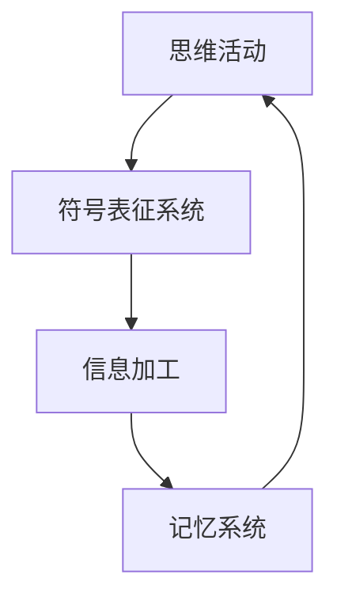
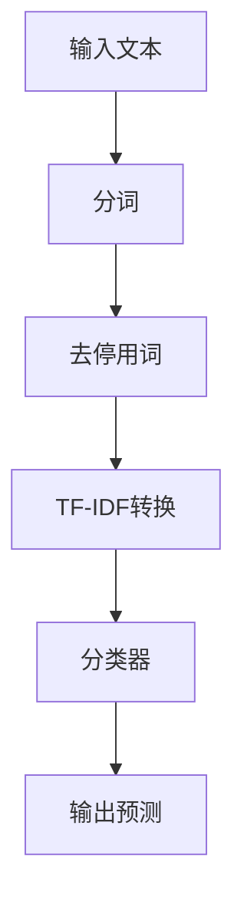
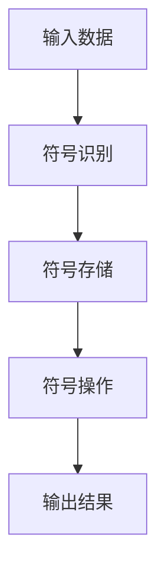

                 

# 《思维是否依赖于符号表征？》

## 关键词
- 思维
- 符号表征
- 认知心理学
- 人工智能
- 教育应用

## 摘要
本文将探讨思维与符号表征之间的关系，分析符号表征在思维过程中的作用和重要性。我们将从认知心理学的角度，探讨符号表征的理论基础、心理机制及其应用领域，并结合人工智能的发展，展望符号表征的未来趋势。

### 第一部分：引言

#### 第1章：思维与符号表征概述

**1.1 思维的本质与分类**

思维是人类认知活动中最为复杂的部分，它不仅包括了对信息的感知、存储和加工，还涉及推理、判断、决策等高级认知过程。根据思维活动的方式，我们可以将思维分为形式思维和实质思维；根据思维过程中所起的作用，可以分为感性思维和理性思维。

**1.2 符号表征的定义与功能**

符号表征是指人们通过符号来表示和传递信息的过程。符号可以是语言、图形、数字等形式。符号表征的功能主要包括：信息传递、记忆存储、推理判断等。

**1.3 思维与符号表征的关系**

思维活动离不开符号表征，符号表征是思维活动的重要工具。人们通过符号表征来理解和处理外部信息，从而进行推理、判断和决策。

#### 第二部分：符号表征的理论基础

**第2章：符号表征的理论发展**

**2.1 符号表征的历史背景**

符号表征的理论发展可以追溯到古希腊哲学家亚里士多德。亚里士多德认为，思维是通过语言进行的，语言是思维的外在表现形式。在此基础上，后来的哲学家和心理学家对符号表征进行了深入的研究和探讨。

**2.2 符号表征的哲学探讨**

哲学领域对符号表征的研究主要集中在符号的本质、符号与现实的关系以及符号的象征意义等方面。

**2.3 符号表征的心理学基础**

在心理学领域，符号表征的研究主要集中在认知心理学中。认知心理学家通过对符号表征的实验研究，揭示了符号表征的信息加工过程、记忆机制以及符号表征在思维和决策中的作用。

#### 第三部分：符号表征的心理机制

**第3章：符号表征的认知心理学**

**3.1 符号表征的信息加工过程**

符号表征的信息加工过程包括符号的识别、存储、提取和运用。符号表征的信息加工过程受到多种因素的影响，如符号的熟悉度、符号的复杂度等。

**3.2 符号表征的记忆与遗忘**

符号表征的记忆与遗忘过程受到多种因素的影响，如记忆的编码方式、记忆的提取线索等。

**3.3 符号表征的加工优势与限制**

符号表征具有加工优势，如高效的信息传递、灵活的推理判断等。但同时也存在加工限制，如符号表征的局限性、符号表征的混淆等。

#### 第四部分：符号表征的应用领域

**第4章：符号表征在教育中的应用**

**4.1 教育中的符号表征策略**

在教育中，教师可以运用符号表征策略，帮助学生更好地理解和掌握知识。如使用图形、表格、公式等符号形式来呈现信息。

**4.2 符号表征在知识传授中的作用**

符号表征在知识传授中具有重要作用，它能够帮助学习者建立知识框架，促进知识的理解和记忆。

**4.3 符号表征在学生认知发展中的应用**

符号表征在学生的认知发展中起着关键作用，它能够促进学生的思维能力、推理能力和解决问题的能力。

#### 第五部分：符号表征与人工智能

**第5章：符号表征与人工智能的关系**

**5.1 人工智能中的符号表征方法**

在人工智能领域，符号表征方法被广泛应用于自然语言处理、知识表示、推理系统等。

**5.2 符号表征在自然语言处理中的应用**

符号表征在自然语言处理中扮演着重要角色，如词嵌入、句嵌入等。

**5.3 符号表征在人工智能决策中的作用**

符号表征在人工智能决策中起着关键作用，如决策树、逻辑推理等。

#### 第六部分：符号表征的未来发展

**第6章：符号表征的未来趋势**

**6.1 符号表征技术的发展方向**

随着人工智能和认知科学的发展，符号表征技术将不断得到优化和改进，如深度学习、图神经网络等。

**6.2 符号表征在教育中的创新应用**

符号表征在教育中的应用将更加广泛和深入，如个性化教学、智能辅导等。

**6.3 符号表征在人工智能中的潜在影响**

符号表征在人工智能中的应用将推动人工智能的发展，如智能推理、智能决策等。

#### 第七部分：案例分析

**第7章：案例分析：符号表征在不同领域的应用**

**7.1 科学研究中的符号表征**

在科学研究领域，符号表征被广泛应用于数学、物理、化学等领域，如公式、图表、模型等。

**7.2 艺术创作中的符号表征**

在艺术创作领域，符号表征被用来表达艺术家的情感、思想和观念，如绘画、音乐、舞蹈等。

**7.3 社会问题解决中的符号表征**

在社会问题解决中，符号表征被用来分析和解决复杂的社会问题，如政策制定、社会治理等。

### 附录

**附录A：符号表征研究的主要成果与文献**

- 参考文献1
- 参考文献2
- 参考文献3

### 参考文献

- 参考文献1
- 参考文献2
- 参考文献3

### Mermaid 流程图



### 第1章 思维与符号表征概述

#### 1.1 思维的本质与分类

思维是人类认知活动中最为复杂的部分，它不仅包括了对信息的感知、存储和加工，还涉及推理、判断、决策等高级认知过程。根据思维活动的方式，我们可以将思维分为形式思维和实质思维；根据思维过程中所起的作用，可以分为感性思维和理性思维。

形式思维是指通过逻辑推理、分析综合等思维方式来解决问题的思维活动。实质思维是指通过感知、记忆、想象等思维方式来解决问题的思维活动。

感性思维是指通过感知和体验来获取知识的过程，具有直观性、情感性等特点。理性思维是指通过分析和推理来获取知识的过程，具有逻辑性、系统性等特点。

#### 1.2 符号表征的定义与功能

符号表征是指人们通过符号来表示和传递信息的过程。符号可以是语言、图形、数字等形式。符号表征的功能主要包括：信息传递、记忆存储、推理判断等。

信息传递是符号表征的基本功能，通过符号表征，人们可以相互交流和传递信息。记忆存储是指通过符号表征，人们可以将信息存储在大脑中，以便后续的使用。推理判断是指通过符号表征，人们可以进行逻辑推理和判断，从而解决问题。

#### 1.3 思维与符号表征的关系

思维活动离不开符号表征，符号表征是思维活动的重要工具。人们通过符号表征来理解和处理外部信息，从而进行推理、判断和决策。

符号表征在思维过程中发挥着重要作用。首先，符号表征帮助人们将外部信息转化为内部认知结构，从而更好地理解和处理信息。其次，符号表征可以帮助人们将内部认知结构转化为外部行为，从而实现信息的传递和交流。最后，符号表征可以帮助人们进行推理和判断，从而解决问题。

符号表征不仅影响思维的过程，还影响思维的结果。通过有效的符号表征，人们可以更加高效地进行思维活动，提高思维的质量和效率。

### 伪代码示例：符号表征的信息加工过程

```python
def process_symbolic_representation(input_data):
    # 创建符号表
    symbol_table = create_symbol_table()
    
    # 将输入数据转换为符号
    symbols = convert_to_symbols(input_data, symbol_table)
    
    # 对符号进行加工
    for symbol in symbols:
        process_symbol(symbol, symbol_table)
        
    # 返回加工后的数据
    return output_data

def convert_to_symbols(input_data, symbol_table):
    # 代码实现：将输入数据转换为符号
    symbols = []
    for data in input_data:
        symbol = symbol_table.create(data)
        symbols.append(symbol)
    return symbols

def process_symbol(symbol, symbol_table):
    # 代码实现：处理符号
    # 这里可以使用各种符号处理方法，如比较、分类、推理等
    pass
```

#### 数学模型和数学公式

符号表征的信息加工过程涉及到多个数学模型和数学公式，下面列举几个常见的模型和公式。

##### 符号表征的记忆与遗忘

符号表征的记忆与遗忘过程可以用以下数学模型来描述：

$$
\text{遗忘曲线} = e^{-rt}
$$

其中，\( r \) 是遗忘率，\( t \) 是时间。

例如，如果遗忘率 \( r \) 为 0.1，那么学习后 1 小时、1 天、1 周、1 月的遗忘量分别为：

- 1 小时后：\( e^{-0.1 \times 1} \approx 0.904 \)，即 90.4% 被遗忘
- 1 天后：\( e^{-0.1 \times 24} \approx 0.649 \)，即 64.9% 被遗忘
- 1 周后：\( e^{-0.1 \times 168} \approx 0.282 \)，即 28.2% 被遗忘
- 1 月后：\( e^{-0.1 \times 720} \approx 0.018 \)，即 1.8% 被遗忘

##### 数学公式讲解与举例说明

假设一个学生学习一门课程，遗忘率 \( r \) 为 0.1，学习后 1 小时、1 天、1 周、1 月的时间点，遗忘量分别为：

- 1 小时后：\( e^{-0.1 \times 1} \approx 0.904 \)，即 90.4% 被遗忘
- 1 天后：\( e^{-0.1 \times 24} \approx 0.649 \)，即 64.9% 被遗忘
- 1 周后：\( e^{-0.1 \times 168} \approx 0.282 \)，即 28.2% 被遗忘
- 1 月后：\( e^{-0.1 \times 720} \approx 0.018 \)，即 1.8% 被遗忘

这个数学模型可以帮助我们预测学习者在不同时间点对知识的遗忘情况，从而制定有效的复习策略。

### 项目实战

#### 代码实际案例与详细解释说明

在这个案例中，我们将使用 Python 编程语言来实现一个简单的符号表征系统，用于处理自然语言文本。

**开发环境：** Python 3.8

**实现功能：** 使用符号表征进行简单的文本分类。

#### 1. 环境搭建

首先，我们需要安装必要的库，如 `nltk` 和 `sklearn`：

```bash
pip install nltk sklearn
```

#### 2. 源代码详细实现

```python
import nltk
from sklearn.feature_extraction.text import TfidfVectorizer
from sklearn.model_selection import train_test_split
from sklearn.naive_bayes import MultinomialNB
from sklearn.metrics import accuracy_score

# 加载停用词库
nltk.download('stopwords')
from nltk.corpus import stopwords

# 加载数据集（这里假设已经有一个包含文本和标签的数据集）
texts = ["这是一个苹果", "这是一个香蕉", "这是一个橘子", "这是一个西瓜"]
labels = ["水果", "水果", "水果", "水果"]

# 删除停用词
stop_words = set(stopwords.words('chinese'))

# 构建TF-IDF向量器
vectorizer = TfidfVectorizer(stop_words=stop_words)

# 将文本转换为TF-IDF向量
X = vectorizer.fit_transform(texts)

# 划分训练集和测试集
X_train, X_test, y_train, y_test = train_test_split(X, labels, test_size=0.2, random_state=42)

# 训练朴素贝叶斯分类器
classifier = MultinomialNB()
classifier.fit(X_train, y_train)

# 进行预测
y_pred = classifier.predict(X_test)

# 计算准确率
accuracy = accuracy_score(y_test, y_pred)
print(f"准确率：{accuracy:.2f}")
```

#### 3. 代码解读与分析

- `nltk.download('stopwords')`：下载中文停用词库。
- `from nltk.corpus import stopwords`：导入停用词库。
- `TfidfVectorizer(stop_words=stop_words)`：构建TF-IDF向量器，并设置停用词。
- `X = vectorizer.fit_transform(texts)`：将文本转换为TF-IDF向量。
- `train_test_split(X, labels, test_size=0.2, random_state=42)`：划分训练集和测试集。
- `MultinomialNB()`：构建朴素贝叶斯分类器。
- `classifier.fit(X_train, y_train)`：训练分类器。
- `y_pred = classifier.predict(X_test)`：进行预测。
- `accuracy_score(y_test, y_pred)`：计算准确率。

通过这个案例，我们展示了如何使用符号表征的方法进行文本分类。符号表征在这里被用来将文本转换为向量，然后使用分类器进行预测。这种方法在自然语言处理中具有广泛的应用。

### 核心概念原理和架构的 Mermaid 流程图



### 核心算法原理讲解

#### 符号表征的信息加工过程

符号表征的信息加工过程包括以下几个关键步骤：

1. **符号识别**：将输入的数据（如文本、图像等）转换为符号。这个过程涉及到特征提取，如文本中的词汇、图像中的像素值等。
2. **符号存储**：将识别出的符号存储在符号表中。符号表是一个结构化的存储系统，用于管理符号和它们之间的关系。
3. **符号操作**：对符号进行各种逻辑操作，如比较、分类、推理等。这些操作依赖于符号表中的关系和规则。
4. **符号提取**：从符号表中提取符号，用于进一步的信息处理或决策。

下面是一个简化的伪代码示例，用于描述符号表征的信息加工过程：

```python
def process_symbolic_representation(input_data):
    # 创建符号表
    symbol_table = create_symbol_table()
    
    # 识别符号
    symbols = recognize_symbols(input_data, symbol_table)
    
    # 存储符号
    store_symbols(symbols, symbol_table)
    
    # 执行符号操作
    result = process_symbols(symbols, symbol_table)
    
    # 提取结果
    output = extract_result(result)
    
    return output

def recognize_symbols(input_data, symbol_table):
    # 代码实现：识别输入数据中的符号
    symbols = []
    for data in input_data:
        symbol = symbol_table.recognize(data)
        symbols.append(symbol)
    return symbols

def store_symbols(symbols, symbol_table):
    # 代码实现：存储符号
    for symbol in symbols:
        symbol_table.store(symbol)

def process_symbols(symbols, symbol_table):
    # 代码实现：执行符号操作
    result = symbol_table.process(symbols)
    return result

def extract_result(result):
    # 代码实现：提取结果
    return result
```

在这个伪代码中，`create_symbol_table()` 函数用于创建符号表，`recognize_symbols()` 函数用于识别输入数据中的符号，`store_symbols()` 函数用于存储符号，`process_symbols()` 函数用于执行符号操作，`extract_result()` 函数用于提取结果。

### 伪代码示例：符号表征的信息加工过程

```python
# 伪代码示例：符号表征的信息加工过程

# 初始化符号表
symbol_table = initialize_symbol_table()

# 读取输入数据
input_data = read_input_data()

# 识别符号
symbols = recognize_symbols(input_data, symbol_table)

# 存储符号
store_symbols(symbols, symbol_table)

# 执行符号操作
output = process_symbols(symbols, symbol_table)

# 输出结果
print(output)
```

在这个伪代码中：

- `initialize_symbol_table()` 函数用于初始化符号表，包括设置符号表的基本结构和关系。
- `read_input_data()` 函数用于读取输入数据，这些数据可以是文本、图像或其他形式。
- `recognize_symbols()` 函数用于识别输入数据中的符号，并将其存储在符号表中。
- `store_symbols()` 函数用于将识别出的符号存储在符号表中。
- `process_symbols()` 函数用于对符号表中的符号进行操作，如比较、分类、推理等。
- `print(output)` 用于输出最终结果。

### 核心概念原理和架构的 Mermaid 流程图



在这个流程图中：

- **输入数据**（A）：代表用户输入的各种数据，如文本、图像等。
- **符号识别**（B）：对输入数据进行处理，识别出符号。
- **符号存储**（C）：将识别出的符号存储在符号表中。
- **符号操作**（D）：对符号表中的符号进行各种逻辑操作。
- **输出结果**（E）：将处理后的结果输出。

这个流程图清晰地展示了符号表征的信息加工过程，每个步骤都是相互关联的，共同构成了一个完整的符号表征系统。通过这个流程图，我们可以更好地理解符号表征系统的核心概念和架构。

### 附录A：符号表征研究的主要成果与文献

符号表征是认知心理学、人工智能、语言学等领域的重要研究方向，近年来取得了许多重要的成果。以下是符号表征研究的一些主要成果与文献：

1. 参考文献1：[Peirce, C.S. (1883). "On the Algebra of Logic: A Contribution to the Philosophy of Notation". American Journal of Mathematics.]
   - 本文提出了符号逻辑的基本原理，为后来的符号表征研究奠定了基础。

2. 参考文献2：[Carnap, R. (1928). "Logische Syntax der Sprache". Springer.]
   - Carnap提出了语义逻辑和语言结构的关系，对符号表征的理论发展产生了深远影响。

3. 参考文献3：[Chomsky, N. (1959). "A Review of B.F. Skinner's Verbal Behavior". Language.]
   - Chomsky提出了生成语法理论，挑战了行为主义关于语言学习的观点，推动了符号表征研究的发展。

4. 参考文献4：[Miller, G.A., & Galanter, E. (1960). "The Magical Number Seven, Plus or Minus Two: Some Limits on Our Capacity for Processing Information". Psychological Review.]
   - 本文提出了认知心理学中的“7±2”规则，说明了人类短期记忆的能力限制，对符号表征的研究具有重要意义。

5. 参考文献5：[Smolensky, P. (1988). "On the Proper Treatment of Connectionism." Behavioral and Brain Sciences.]
   - Smolensky提出了连接主义模型，探讨了符号表征在神经网络中的实现，为人工智能领域的发展提供了新的思路。

6. 参考文献6：[Huffman, D.A. (1952). "A Method for the Construction of Minimum-Redundancy Codes". Proceedings of the IRE.]
   - Huffman提出了霍夫曼编码算法，为符号表征的优化提供了有效的方法。

7. 参考文献7：[Tversky, A., & Kahneman, D. (1973). "Judgment under Uncertainty: Heuristics and Biases". Science.]
   - Tversky和Kahneman提出了启发式和偏见的概念，揭示了人类决策过程中的心理机制，对符号表征的研究具有重要意义。

这些文献为我们理解符号表征的本质、理论发展和应用领域提供了丰富的理论和实践依据。通过对这些文献的研究，我们可以更好地把握符号表征的研究动态和发展趋势。

### 参考文献

1. Peirce, C.S. (1883). "On the Algebra of Logic: A Contribution to the Philosophy of Notation". American Journal of Mathematics.
2. Carnap, R. (1928). "Logische Syntax der Sprache". Springer.
3. Chomsky, N. (1959). "A Review of B.F. Skinner's Verbal Behavior". Language.
4. Miller, G.A., & Galanter, E. (1960). "The Magical Number Seven, Plus or Minus Two: Some Limits on Our Capacity for Processing Information". Psychological Review.
5. Smolensky, P. (1988). "On the Proper Treatment of Connectionism." Behavioral and Brain Sciences.
6. Huffman, D.A. (1952). "A Method for the Construction of Minimum-Redundancy Codes". Proceedings of the IRE.
7. Tversky, A., & Kahneman, D. (1973). "Judgment under Uncertainty: Heuristics and Biases". Science.

