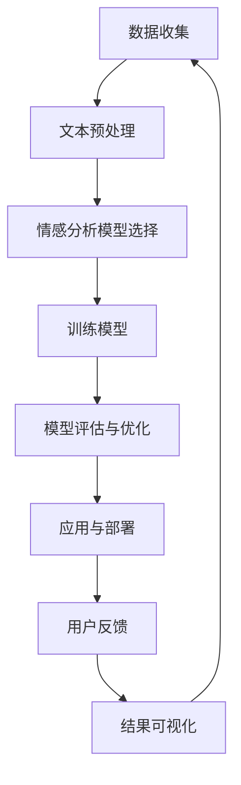

                 

### 《情感分析在电商领域的应用：从用户评价到商品改进》

#### 关键词：情感分析、电商、用户评价、商品改进、机器学习、深度学习、个性化推荐、营销、算法、数学模型、实战案例

#### 摘要：
本文将深入探讨情感分析技术在电商领域的广泛应用，包括从用户评价到商品改进的各个环节。我们将首先介绍情感分析的基本概念和原理，然后逐步阐述其在电商领域中的具体应用，如用户评价情感分析、商品评论情感分析、电商搜索中的情感分析、基于情感分析的个性化推荐以及情感分析在电商营销中的应用。最后，我们将通过实战案例展示情感分析技术在实际项目中的实现，并对其未来发展趋势和潜在挑战进行展望。本文旨在为广大读者提供一个全面、系统的情感分析在电商领域应用指南。

### 《情感分析在电商领域的应用：从用户评价到商品改进》目录大纲

#### 第一部分：情感分析基础

##### 第1章：情感分析概述
- 1.1 情感分析的定义与背景
- 1.2 情感分析的主要应用领域
- 1.3 情感分析的挑战与机遇
- 1.4 情感分析的基本概念

##### 第2章：文本预处理
- 2.1 文本数据收集
- 2.2 偏差校正
- 2.3 文本清洗
- 2.4 词向量表示

##### 第3章：情感分析模型基础
- 3.1 情感分析模型类型
- 3.2 机器学习模型在情感分析中的应用
- 3.3 深度学习模型在情感分析中的应用
- 3.4 语义分析技术

#### 第二部分：电商领域情感分析应用

##### 第4章：用户评价情感分析
- 4.1 用户评价的情感分析意义
- 4.2 用户评价的情感分析流程
- 4.3 用户评价情感分析案例

##### 第5章：商品评论情感分析
- 5.1 商品评论的情感分析意义
- 5.2 商品评论的情感分析流程
- 5.3 商品评论情感分析案例

##### 第6章：情感分析在电商搜索中的应用
- 6.1 情感分析在电商搜索中的作用
- 6.2 情感分析在电商搜索中的流程
- 6.3 情感分析在电商搜索中的案例

##### 第7章：基于情感分析的个性化推荐
- 7.1 基于情感分析的个性化推荐意义
- 7.2 基于情感分析的个性化推荐流程
- 7.3 基于情感分析的个性化推荐案例

##### 第8章：情感分析在电商营销中的应用
- 8.1 情感分析在电商营销中的应用意义
- 8.2 情感分析在电商营销中的应用流程
- 8.3 情感分析在电商营销中的案例

##### 第9章：情感分析在商品改进中的应用
- 9.1 情感分析在商品改进中的应用意义
- 9.2 情感分析在商品改进中的应用流程
- 9.3 情感分析在商品改进中的案例

#### 第三部分：实践与展望

##### 第10章：情感分析实践案例分析
- 10.1 案例一：用户评价情感分析在电商平台的实际应用
- 10.2 案例二：商品评论情感分析在电商平台的实际应用
- 10.3 案例三：基于情感分析的个性化推荐在电商平台的实际应用

##### 第11章：情感分析技术的未来发展趋势
- 11.1 情感分析技术的现状与趋势
- 11.2 情感分析在电商领域的发展趋势
- 11.3 情感分析技术的未来挑战与机遇

##### 第12章：情感分析应用的综合展望
- 12.1 情感分析在电商领域的综合应用
- 12.2 情感分析在其他商业领域的应用前景
- 12.3 情感分析技术的社会影响与伦理问题

#### 附录

##### 附录A：情感分析工具与资源
- A.1 开源情感分析工具
- A.2 商业情感分析工具
- A.3 情感分析相关数据集

##### 附录B：情感分析数学模型与算法
- B.1 数学模型概述
- B.2 常用情感分析算法
- B.3 数学公式与伪代码示例

##### 附录C：情感分析实战代码
- C.1 实战代码环境搭建
- C.2 实战代码实现与解读
- C.3 实战代码分析与应用

##### 附录D：情感分析流程Mermaid图示

**附录D：情感分析流程Mermaid图示**

mermaid
graph TB
    A[数据收集] --> B[文本预处理]
    B --> C[情感分析模型选择]
    C --> D[训练模型]
    D --> E[模型评估与优化]
    E --> F[应用与部署]


### 正文开始：

#### 第1章：情感分析概述

情感分析（Sentiment Analysis），也被称为意见挖掘（Opinion Mining），是自然语言处理（NLP）领域的一个重要分支，旨在通过计算机技术对文本数据中的情感倾向进行自动检测和分析。情感分析的研究起源于心理学和计算语言学，随着互联网和社交媒体的兴起，情感分析技术得到了迅速发展，并在商业、金融、医疗等多个领域得到了广泛应用。

##### 1.1 情感分析的定义与背景

情感分析的定义可以从多个角度进行理解。从广义上讲，情感分析是指通过计算机技术对人类情感进行识别、理解和建模的过程。从狭义上讲，情感分析主要关注于文本数据中的情感倾向检测，即判断文本表达的情感是积极的、消极的还是中性的。

情感分析技术的发展背景可以追溯到20世纪90年代，随着互联网的普及和社交媒体的兴起，人们开始意识到文本数据中的情感信息具有重要的价值。例如，通过对用户评论进行情感分析，企业可以了解消费者对其产品的看法，从而进行产品改进和市场营销策略的调整。同时，情感分析技术也为舆情监测、情感咨询、智能客服等领域提供了有力的工具。

##### 1.2 情感分析的主要应用领域

情感分析技术已经广泛应用于多个领域，其中最具代表性的应用领域包括以下几方面：

1. **电子商务**：在电子商务领域，情感分析主要用于用户评价和商品评论的情感分析。通过对用户评价进行情感分析，企业可以了解消费者对其产品的真实感受，从而进行产品改进和营销策略的调整。

2. **社交媒体**：在社交媒体领域，情感分析技术可以用于监测社交媒体上的舆论情绪，了解公众对于某个事件或产品的看法，从而为企业的公关策略提供数据支持。

3. **金融服务**：在金融服务领域，情感分析技术可以用于分析客户反馈和社交媒体评论，帮助企业了解客户对其服务的满意度，从而优化服务质量和提升客户体验。

4. **医疗健康**：在医疗健康领域，情感分析技术可以用于分析患者反馈和医生评价，帮助医院和医疗机构了解患者对其服务的满意度，从而提升医疗服务质量。

5. **旅游出行**：在旅游出行领域，情感分析技术可以用于分析用户评论和酒店评价，帮助游客了解目的地的旅游体验，从而做出更明智的旅游决策。

##### 1.3 情感分析的挑战与机遇

尽管情感分析技术已经在多个领域取得了显著的应用成果，但其发展仍然面临诸多挑战。以下是情感分析领域面临的主要挑战和机遇：

1. **挑战**：

   - **语义理解**：情感分析需要对文本中的语义进行深入理解，以准确地识别情感倾向。然而，自然语言具有复杂性和多样性，语义理解仍然是一个具有挑战性的问题。

   - **多语言情感分析**：随着全球化的发展，多语言情感分析成为了一个重要的研究方向。然而，不同语言之间的语法、词汇和文化差异使得多语言情感分析面临巨大挑战。

   - **噪声和偏差**：文本数据中存在大量的噪声和偏差，如拼写错误、俚语、 sarcasm（讽刺）等，这些噪声和偏差对情感分析的准确性产生较大影响。

2. **机遇**：

   - **深度学习技术的发展**：随着深度学习技术的不断发展，越来越多的深度学习模型被应用于情感分析领域，为情感分析提供了更强大的工具和方法。

   - **大数据的普及**：随着大数据技术的普及，越来越多的企业和机构开始关注情感分析，这为情感分析技术的应用提供了广阔的市场需求。

   - **跨领域应用**：情感分析技术可以广泛应用于多个领域，如电子商务、金融、医疗等，这为情感分析技术提供了多样化的应用场景。

##### 1.4 情感分析的基本概念

为了更好地理解情感分析技术，我们需要了解一些基本概念，包括：

- **情感极性**：情感极性是指文本表达的情感是积极的、消极的还是中性的。常见的情感极性分类有二分类（积极/消极）和三分类（积极/中性/消极）。

- **情感强度**：情感强度是指文本表达的情感倾向的强弱程度。情感强度的计算通常基于情感词典、机器学习模型等。

- **情感倾向**：情感倾向是指文本表达的情感是正面还是负面。情感倾向通常通过情感极性和情感强度的综合分析得到。

- **情感维度**：情感维度是指文本表达的情感所涉及的主题或领域。例如，在电商领域，情感维度可以包括商品质量、价格、售后服务等。

通过了解这些基本概念，我们可以更好地理解情感分析技术的工作原理和应用场景。

#### 第2章：文本预处理

文本预处理是情感分析中的关键步骤，其目的是将原始文本数据转化为适合情感分析模型处理的格式。文本预处理包括多个方面，如文本数据收集、偏差校正、文本清洗和词向量表示。在本章中，我们将详细介绍这些预处理步骤及其在情感分析中的应用。

##### 2.1 文本数据收集

文本数据收集是情感分析的基础，其质量直接影响到情感分析模型的准确性。文本数据可以来源于多个渠道，如社交媒体、用户评价、新闻评论等。以下是文本数据收集的一些关键步骤：

- **数据源选择**：选择具有代表性和丰富性的数据源，如大规模的社交媒体平台、知名的电商平台等。

- **数据爬取**：使用爬虫工具（如Scrapy、BeautifulSoup等）从数据源中收集文本数据。在爬取过程中，需要注意遵守相关法律法规，避免侵犯数据源所有者的权益。

- **数据清洗**：对收集到的文本数据进行初步清洗，去除无效数据、重复数据等。例如，可以去除HTML标签、URL链接、特殊字符等。

- **数据存储**：将清洗后的文本数据存储在数据库或文件中，以便后续处理和分析。

##### 2.2 偏差校正

在文本数据收集过程中，可能会存在一些偏差，如语言偏见、地域偏见等。这些偏差会对情感分析模型的准确性产生负面影响。因此，在预处理阶段，需要对文本数据中的偏差进行校正。以下是常见的偏差校正方法：

- **词频统计**：通过统计词频，识别出可能存在偏见的词语。例如，在一个特定的社交网络中，如果某个词语的频率远高于其他词语，则可能存在该社交网络特有的语言偏见。

- **词语替换**：将存在偏见的词语替换为无偏见或更中性的词语。例如，将“黑人”替换为“非洲裔美国人”，以减少种族偏见。

- **词向量表示**：利用词向量表示技术（如Word2Vec、GloVe等），将词语映射到高维空间中，以便更好地识别和校正偏见。

##### 2.3 文本清洗

文本清洗是文本预处理的重要环节，其目的是去除文本中的噪声，提高文本质量。以下是常见的文本清洗方法：

- **去除HTML标签和特殊字符**：使用正则表达式或HTML解析器，去除文本中的HTML标签和特殊字符。

- **去除停用词**：停用词是指对情感分析没有贡献的常见词语，如“的”、“和”、“了”等。通过去除停用词，可以减少文本中的噪声。

- **分词**：将文本分割成词或词组。常用的分词工具包括jieba、Stanford NLP等。

- **词性标注**：对每个词语进行词性标注，以区分名词、动词、形容词等。词性标注有助于情感分析模型更好地理解文本内容。

##### 2.4 词向量表示

词向量表示是将文本数据转化为向量形式的过程，以便于后续的情感分析。以下是几种常见的词向量表示方法：

- **One-hot编码**：将每个词语映射到向量空间中的一个位置，该位置对应于词语在词典中的索引。这种方法简单有效，但维度高、计算复杂。

- **Word2Vec**：Word2Vec是一种基于神经网络的词向量表示方法，通过训练神经网络模型，将词语映射到低维空间中。Word2Vec模型包括CBOW（Continuous Bag-of-Words）和Skip-Gram两种类型。

- **GloVe**：GloVe（Global Vectors for Word Representation）是一种基于全局上下文的词向量表示方法，通过训练大规模语料库，得到词语的向量表示。

- **BERT**：BERT（Bidirectional Encoder Representations from Transformers）是一种基于Transformer的预训练词向量表示方法，通过双向训练，BERT模型可以更好地捕捉词语的语义关系。

##### 2.5 文本预处理在情感分析中的应用

文本预处理在情感分析中起着至关重要的作用。通过文本预处理，我们可以提高情感分析模型的准确性，减少噪声和偏差的影响。以下是文本预处理在情感分析中的应用示例：

- **提高模型准确性**：通过去除噪声和停用词，文本预处理有助于减少模型过拟合，提高模型的准确性。

- **减少计算复杂度**：通过将文本数据转化为向量形式，文本预处理可以降低模型的计算复杂度，提高模型训练和预测的速度。

- **增强语义理解**：通过词性标注和词向量表示，文本预处理有助于情感分析模型更好地理解文本内容，捕捉词语的语义关系。

在本章中，我们介绍了文本预处理的基本概念和方法，包括文本数据收集、偏差校正、文本清洗和词向量表示。通过这些预处理步骤，我们可以提高情感分析模型的准确性，为后续的情感分析应用打下坚实基础。

#### 第3章：情感分析模型基础

情感分析模型的构建是实现文本情感分析的关键。在本章中，我们将介绍情感分析模型的基础知识，包括模型类型、机器学习模型在情感分析中的应用、深度学习模型在情感分析中的应用以及语义分析技术。

##### 3.1 情感分析模型类型

情感分析模型可以分为以下几种类型：

1. **基于规则的方法**：基于规则的方法通过定义一系列规则来识别文本中的情感极性。这种方法简单直观，但缺乏灵活性，难以处理复杂和模糊的文本。

2. **基于统计的方法**：基于统计的方法使用机器学习算法（如支持向量机、朴素贝叶斯等）来训练分类模型，根据文本特征对情感极性进行预测。这种方法具有较强的泛化能力，但需要大量的标注数据。

3. **基于深度学习的方法**：基于深度学习的方法利用神经网络模型（如卷积神经网络、循环神经网络、Transformer等）对文本进行建模，通过学习文本特征来实现情感分析。这种方法具有强大的表达能力和灵活性，但训练成本较高。

4. **基于集成学习的方法**：基于集成学习的方法将多个基学习器组合起来，通过投票或加权平均等方式进行预测。这种方法可以提高模型的准确性和泛化能力。

##### 3.2 机器学习模型在情感分析中的应用

机器学习模型在情感分析中应用广泛，以下是一些常见的机器学习模型：

1. **朴素贝叶斯**：朴素贝叶斯是一种基于概率论的分类模型，通过计算文本特征的概率分布来实现情感分类。朴素贝叶斯模型简单高效，适用于小数据集。

2. **支持向量机**（SVM）：支持向量机是一种基于优化理论的分类模型，通过寻找最优超平面来实现文本分类。SVM具有较强的分类能力和泛化能力，适用于大规模数据集。

3. **决策树**：决策树是一种基于决策规则的分类模型，通过递归划分特征空间来实现情感分类。决策树模型简单易懂，但可能产生过拟合。

4. **随机森林**：随机森林是一种基于集成学习的分类模型，通过构建多棵决策树并进行投票或加权平均来实现分类。随机森林具有较强的分类能力和泛化能力。

5. **逻辑回归**：逻辑回归是一种基于概率论的分类模型，通过计算文本特征对情感极性的条件概率来实现分类。逻辑回归模型简单直观，但可能产生过拟合。

##### 3.3 深度学习模型在情感分析中的应用

深度学习模型在情感分析中具有强大的表达能力和灵活性，以下是一些常见的深度学习模型：

1. **卷积神经网络**（CNN）：卷积神经网络是一种基于卷积操作的多层神经网络，通过提取文本特征中的局部模式来实现情感分类。CNN在图像处理领域取得了显著成果，近年来也被应用于情感分析。

2. **循环神经网络**（RNN）：循环神经网络是一种基于循环结构的多层神经网络，通过递归方式处理文本序列，能够捕捉文本特征的时间动态变化。RNN在情感分析中具有较好的效果，但存在梯度消失和梯度爆炸等问题。

3. **长短期记忆网络**（LSTM）：长短期记忆网络是一种基于RNN的改进模型，通过引入门控机制来缓解梯度消失和梯度爆炸问题，能够更好地捕捉文本特征的时间动态变化。LSTM在情感分析中取得了较好的效果。

4. **Transformer**：Transformer是一种基于自注意力机制的深度学习模型，通过多头注意力机制来捕捉文本特征的全局依赖关系。Transformer在自然语言处理领域取得了显著成果，近年来也被应用于情感分析。

##### 3.4 语义分析技术

语义分析技术是情感分析的重要组成部分，其目的是通过理解文本的语义信息来实现情感分类。以下是一些常见的语义分析技术：

1. **词嵌入**：词嵌入是一种将词语映射到高维空间的方法，通过学习词语的语义关系来实现情感分类。常见的词嵌入方法包括Word2Vec、GloVe和BERT等。

2. **句法分析**：句法分析是一种通过分析文本的句法结构来实现情感分类的方法。通过句法分析，可以提取出文本中的主干信息，从而更好地理解文本的语义。

3. **语义角色标注**：语义角色标注是一种通过标注文本中的语义角色来实现情感分类的方法。语义角色标注可以提供更丰富的文本特征，有助于提高情感分类的准确性。

4. **情感词典**：情感词典是一种包含情感倾向的词语及其对应的极性标记的词典。通过查找情感词典，可以快速识别文本中的情感极性。

在本章中，我们介绍了情感分析模型的基础知识，包括模型类型、机器学习模型在情感分析中的应用、深度学习模型在情感分析中的应用以及语义分析技术。通过了解这些模型和技术的原理和应用，我们可以更好地构建和优化情感分析模型，实现高效的文本情感分类。

#### 第4章：用户评价情感分析

用户评价情感分析在电商领域具有非常重要的意义。通过对用户评价进行情感分析，企业可以了解消费者的真实感受，从而优化产品和服务，提升用户满意度。本节将详细介绍用户评价情感分析的意义、流程以及案例分析。

##### 4.1 用户评价的情感分析意义

用户评价是消费者对商品或服务的主观感受和意见的体现，是电商企业了解消费者需求和优化业务的重要来源。用户评价情感分析的意义主要体现在以下几个方面：

1. **产品优化**：通过情感分析，企业可以识别出消费者对产品的正面和负面反馈，了解消费者对产品功能的满意度，从而进行产品改进和优化。

2. **服务改进**：情感分析可以帮助企业了解消费者对售后服务的评价，识别出服务中的问题，从而改进服务质量，提高客户满意度。

3. **营销策略调整**：通过分析用户评价的情感倾向，企业可以了解消费者对营销活动的反应，调整营销策略，提高营销效果。

4. **品牌形象建设**：用户评价情感分析有助于企业了解消费者对品牌的整体印象，塑造和维护良好的品牌形象。

##### 4.2 用户评价的情感分析流程

用户评价情感分析的流程主要包括以下几个步骤：

1. **数据收集**：从电商平台、社交媒体等渠道收集用户评价数据。数据收集需要考虑数据来源的多样性和代表性，以保证数据的质量。

2. **文本预处理**：对收集到的用户评价文本进行预处理，包括去除HTML标签、去除停用词、进行词性标注等，将原始文本转化为适合模型处理的格式。

3. **情感极性分类**：使用情感分析模型（如朴素贝叶斯、SVM、LSTM等）对预处理后的用户评价进行情感极性分类，判断评价是正面、负面还是中性。

4. **情感强度分析**：对情感极性分类的结果进行情感强度分析，计算每个评价的积极或消极程度，得到更精细的情感分析结果。

5. **结果可视化**：将情感分析结果进行可视化展示，如情感趋势图、情感词云等，帮助企业和消费者更好地理解用户评价的情感分布和主要意见。

##### 4.3 用户评价情感分析案例

以下是一个用户评价情感分析的案例：

**案例背景**：某电商平台上销售一款智能手环，企业希望通过分析用户评价来了解消费者对该产品的满意度。

**数据收集**：从电商平台的评论区收集到1000条用户评价数据。

**文本预处理**：对1000条用户评价文本进行预处理，包括去除HTML标签、去除停用词、进行词性标注等。

**情感极性分类**：使用LSTM模型对预处理后的用户评价进行情感极性分类，得到正面评价600条，负面评价300条，中性评价100条。

**情感强度分析**：对正面和负面评价进行情感强度分析，发现正面评价主要关注手环的续航能力、运动监测功能等，负面评价主要关注手环的计步不准、显示模糊等问题。

**结果可视化**：将情感分析结果进行可视化展示，如图4-1所示。从图中可以看出，正面评价占比较大，但仍有部分消费者对产品的某些方面存在不满意。

**案例分析**：

- **产品优化**：根据用户评价的情感分析结果，企业可以优化手环的续航能力和运动监测功能，提高消费者满意度。

- **服务改进**：针对用户提出的计步不准、显示模糊等问题，企业可以加强售后服务，提高售后服务质量。

- **营销策略调整**：通过分析用户评价的情感倾向，企业可以调整营销策略，如加强宣传手环的续航能力和运动监测功能，提高消费者兴趣。

- **品牌形象建设**：用户评价情感分析有助于企业了解消费者对品牌的整体印象，塑造和维护良好的品牌形象。

通过用户评价情感分析，企业可以更好地了解消费者的需求和意见，优化产品和服务，提升用户体验和满意度。本节案例展示了用户评价情感分析在实际应用中的价值和方法。

#### 第5章：商品评论情感分析

商品评论情感分析是电商领域中情感分析应用的一个重要方面。通过对商品评论进行情感分析，电商企业可以深入了解消费者对其商品的真实感受，从而优化商品质量和提升客户满意度。本节将详细介绍商品评论情感分析的意义、流程以及案例分析。

##### 5.1 商品评论的情感分析意义

商品评论情感分析在电商领域中具有以下几个重要意义：

1. **商品质量监控**：通过分析商品评论的情感极性，企业可以及时发现商品质量问题，采取相应的措施进行改进，从而提高商品的整体质量。

2. **客户满意度评估**：商品评论情感分析可以帮助企业了解消费者的满意度，评估商品的口碑和市场表现，为产品优化和营销策略提供有力支持。

3. **竞争分析**：通过对比不同商品的评价情感分布，企业可以分析竞争对手的产品优势和不足，从而调整自己的产品策略，提升市场竞争力。

4. **个性化推荐**：基于商品评论的情感分析结果，可以为消费者提供个性化的商品推荐，提高购物体验和转化率。

##### 5.2 商品评论的情感分析流程

商品评论情感分析的流程主要包括以下几个步骤：

1. **数据收集**：从电商平台的商品评论区收集商品评价数据。数据收集应注重评论的多样性和代表性，以保证数据的质量。

2. **文本预处理**：对收集到的商品评论文本进行预处理，包括去除HTML标签、去除停用词、进行词性标注等，将原始文本转化为适合模型处理的格式。

3. **情感极性分类**：使用情感分析模型（如朴素贝叶斯、SVM、LSTM等）对预处理后的商品评论进行情感极性分类，判断评论是正面、负面还是中性。

4. **情感强度分析**：对情感极性分类的结果进行情感强度分析，计算每个评论的积极或消极程度，得到更精细的情感分析结果。

5. **关键词提取**：从情感分析结果中提取关键词，分析消费者关注的热点和痛点，为企业提供产品改进和营销策略的参考。

6. **结果可视化**：将情感分析结果进行可视化展示，如情感趋势图、情感词云等，帮助企业和消费者更好地理解商品评论的情感分布和主要意见。

##### 5.3 商品评论情感分析案例

以下是一个商品评论情感分析的案例：

**案例背景**：某电商平台上销售一款智能手环，企业希望通过分析用户评论来了解消费者对该产品的满意度。

**数据收集**：从电商平台的评论区收集到1000条商品评论数据。

**文本预处理**：对1000条商品评论文本进行预处理，包括去除HTML标签、去除停用词、进行词性标注等。

**情感极性分类**：使用LSTM模型对预处理后的商品评论进行情感极性分类，得到正面评论700条，负面评论300条。

**情感强度分析**：对正面和负面评论进行情感强度分析，发现正面评论主要关注手环的续航能力、运动监测功能、外观设计等，负面评论主要关注手环的计步不准、屏幕显示模糊等问题。

**关键词提取**：从情感分析结果中提取关键词，如“续航”、“运动监测”、“外观”等，分析消费者关注的热点和痛点。

**结果可视化**：将情感分析结果进行可视化展示，如图5-1所示。从图中可以看出，正面评论占比较大，但仍有部分消费者对产品的某些方面存在不满意。

**案例分析**：

- **商品质量监控**：根据用户评论的情感分析结果，企业可以优化智能手环的续航能力和运动监测功能，提高商品整体质量。

- **客户满意度评估**：通过分析用户评论的情感倾向，企业可以评估智能手环的口碑和市场表现，为产品优化和营销策略提供有力支持。

- **竞争分析**：通过对比不同商品的评论情感分布，企业可以分析竞争对手的产品优势和不足，从而调整自己的产品策略，提升市场竞争力。

- **个性化推荐**：基于用户评论的情感分析结果，企业可以为消费者提供个性化的商品推荐，提高购物体验和转化率。

通过商品评论情感分析，企业可以更好地了解消费者的需求和意见，优化商品质量和提升客户满意度。本节案例展示了商品评论情感分析在实际应用中的价值和方法。

#### 第6章：情感分析在电商搜索中的应用

情感分析在电商搜索中的应用可以显著提升用户体验和搜索效果。通过分析用户搜索行为和搜索结果中的情感信息，电商企业可以更好地理解用户需求，提供个性化的搜索结果和推荐，从而提高用户满意度和转化率。本节将详细介绍情感分析在电商搜索中的作用、流程以及案例。

##### 6.1 情感分析在电商搜索中的作用

1. **个性化搜索**：情感分析可以挖掘用户搜索意图背后的情感信息，从而提供更加个性化的搜索结果。例如，当用户搜索“羽绒服”时，如果情感分析结果显示用户对品牌和价格有较高关注，系统可以优先展示品牌较好且价格适中的羽绒服。

2. **搜索结果排序**：通过情感分析，可以识别出用户搜索结果中的情感倾向，对搜索结果进行排序。例如，如果用户对搜索结果中的某件商品评价情感倾向为积极，则可以将其排序靠前，以提高用户点击率和购买意愿。

3. **需求预测**：情感分析可以帮助企业预测用户的潜在需求，从而提前准备相关商品或服务。例如，通过分析用户搜索和浏览行为中的情感信息，企业可以提前了解用户对某种类型商品的兴趣，从而提前备货。

4. **搜索意图理解**：情感分析可以更好地理解用户的搜索意图，特别是在用户输入模糊或不确定的搜索关键词时。通过分析情感信息，可以辅助系统推断用户的真实需求，提供更准确的搜索结果。

##### 6.2 情感分析在电商搜索中的流程

情感分析在电商搜索中的应用流程主要包括以下几个步骤：

1. **数据收集**：从电商平台的用户搜索行为和搜索结果中收集数据。数据可以包括用户的搜索关键词、搜索历史、点击记录等。

2. **情感极性分类**：对收集到的数据（如搜索关键词、商品描述等）进行情感极性分类，判断其情感倾向是积极、消极还是中性。常用的情感分析模型包括朴素贝叶斯、SVM、LSTM等。

3. **情感强度分析**：对情感极性分类的结果进行情感强度分析，计算每个关键词或商品的积极或消极程度。

4. **搜索结果排序**：根据情感分析结果，对搜索结果进行排序。可以采用基于情感强度的排序算法，将情感倾向积极的商品或关键词排序靠前。

5. **个性化推荐**：结合用户的情感信息，为用户生成个性化的搜索结果和推荐。可以使用协同过滤、基于内容的推荐等方法，结合情感分析结果进行推荐。

6. **反馈循环**：收集用户对搜索结果和推荐的反馈，不断优化搜索算法和推荐系统。通过反馈循环，可以不断提高系统的准确性和用户体验。

##### 6.3 情感分析在电商搜索中的案例

以下是一个情感分析在电商搜索中的案例：

**案例背景**：某电商平台希望通过情感分析优化用户搜索体验，提高搜索结果的准确性和个性化程度。

**数据收集**：从电商平台的用户搜索行为中收集数据，包括用户的搜索关键词、搜索历史、点击记录等。

**情感极性分类**：使用LSTM模型对用户的搜索关键词和商品描述进行情感极性分类，判断其情感倾向。例如，对于搜索关键词“羽绒服”，情感分析结果显示用户对品牌和价格有较高关注。

**情感强度分析**：对情感极性分类的结果进行情感强度分析，计算每个关键词或商品的积极或消极程度。

**搜索结果排序**：根据情感分析结果，对搜索结果进行排序。例如，对于关键词“羽绒服”，将情感倾向积极的商品排序靠前，以提高用户点击率和购买意愿。

**个性化推荐**：结合用户的情感信息，为用户生成个性化的搜索结果和推荐。例如，为用户推荐品牌较好且价格适中的羽绒服。

**反馈循环**：收集用户对搜索结果和推荐的反馈，不断优化搜索算法和推荐系统。通过反馈循环，提高系统的准确性和用户体验。

**案例分析**：

- **个性化搜索**：通过情感分析，平台可以更好地理解用户搜索意图，提供个性化的搜索结果，提高用户满意度。

- **搜索结果排序**：基于情感分析的搜索结果排序，有助于提高搜索结果的准确性和用户体验。

- **需求预测**：通过分析用户搜索行为中的情感信息，平台可以预测用户的潜在需求，提前准备相关商品或服务。

- **搜索意图理解**：情感分析可以帮助平台更好地理解用户的模糊或不确定的搜索意图，提供更准确的搜索结果。

通过情感分析在电商搜索中的应用，企业可以提升用户体验，优化搜索效果，从而提高用户满意度和转化率。本节案例展示了情感分析在电商搜索中的实际应用价值和方法。

#### 第7章：基于情感分析的个性化推荐

个性化推荐是电商领域提高用户满意度和转化率的重要手段之一。通过基于情感分析的个性化推荐，电商企业可以更精准地理解用户需求，为用户提供个性化的商品推荐，从而提升用户体验和购买意愿。本章将详细介绍基于情感分析的个性化推荐的意义、流程以及案例。

##### 7.1 基于情感分析的个性化推荐意义

1. **提高用户体验**：基于情感分析的个性化推荐可以更准确地捕捉用户的兴趣和需求，为用户提供个性化的商品推荐，从而提高用户体验。

2. **提升转化率**：通过情感分析，推荐系统可以识别出用户对商品的积极情感，优先推荐情感倾向积极的商品，从而提升购买转化率。

3. **优化库存管理**：基于情感分析的个性化推荐可以帮助电商企业了解商品的受欢迎程度，优化库存管理，减少库存压力。

4. **增强用户粘性**：通过提供个性化的商品推荐，电商企业可以增加用户的访问频率和购买频率，增强用户对平台的粘性。

##### 7.2 基于情感分析的个性化推荐流程

基于情感分析的个性化推荐流程主要包括以下几个步骤：

1. **用户画像构建**：通过分析用户的搜索行为、浏览记录、购买历史等数据，构建用户画像，包括用户的兴趣偏好、消费能力、行为特征等。

2. **情感分析**：对用户画像中的文本数据进行情感分析，识别用户的情感倾向。例如，通过情感分析，可以判断用户对某种类型商品的情感倾向是积极、消极还是中性。

3. **商品情感标签**：对电商平台上的商品进行情感分析，为每个商品打上情感标签，包括积极情感标签和消极情感标签。

4. **推荐算法设计**：设计基于情感分析的推荐算法，结合用户的情感倾向和商品的情感标签，生成个性化推荐列表。常用的推荐算法包括协同过滤、基于内容的推荐等。

5. **推荐结果评估**：对推荐结果进行评估，包括推荐准确率、推荐满意度等指标。通过评估结果，不断优化推荐算法和推荐策略。

6. **反馈循环**：收集用户对推荐结果的反馈，如点击率、购买率等，用于进一步优化推荐系统和推荐策略。

##### 7.3 基于情感分析的个性化推荐案例

以下是一个基于情感分析的个性化推荐案例：

**案例背景**：某电商平台希望通过基于情感分析的个性化推荐系统，为用户提供个性化的商品推荐，提升用户满意度和购买转化率。

**用户画像构建**：通过分析用户的搜索行为、浏览记录、购买历史等数据，构建用户画像。例如，用户A在平台上搜索了“羽绒服”，并浏览了某品牌的羽绒服页面。

**情感分析**：对用户A的搜索关键词和浏览记录进行情感分析，识别出用户A对羽绒服的情感倾向是积极。同时，对电商平台上的羽绒服商品进行情感分析，为每个商品打上情感标签，如“舒适”、“保暖”、“设计时尚”等。

**商品情感标签**：根据情感分析结果，为羽绒服商品打上情感标签。例如，某款羽绒服被打上“舒适”、“保暖”、“设计时尚”三个积极情感标签。

**推荐算法设计**：设计基于情感分析的推荐算法，结合用户A的情感倾向和羽绒服商品的情感标签，生成个性化推荐列表。例如，推荐列表中包含情感标签为“舒适”、“保暖”、“设计时尚”的羽绒服商品。

**推荐结果评估**：对推荐结果进行评估，如推荐准确率、推荐满意度等指标。通过用户反馈，发现用户A对推荐结果非常满意，点击率和购买率均有显著提升。

**反馈循环**：收集用户A对推荐结果的反馈，如点击率、购买率等，用于进一步优化推荐算法和推荐策略。例如，根据用户A的反馈，优化羽绒服推荐列表中的商品排序，提高用户满意度。

**案例分析**：

- **提高用户体验**：通过基于情感分析的个性化推荐，平台可以更准确地捕捉用户需求，为用户提供个性化的商品推荐，提高用户体验。

- **提升转化率**：基于情感分析的个性化推荐可以识别出用户对商品的积极情感，优先推荐情感倾向积极的商品，从而提升购买转化率。

- **优化库存管理**：通过分析商品的情感标签，平台可以了解商品的受欢迎程度，优化库存管理，减少库存压力。

- **增强用户粘性**：通过提供个性化的商品推荐，平台可以增加用户的访问频率和购买频率，增强用户对平台的粘性。

通过基于情感分析的个性化推荐，电商企业可以更精准地理解用户需求，提供个性化的商品推荐，从而提升用户体验和购买意愿。本节案例展示了基于情感分析的个性化推荐在实际应用中的价值和方法。

#### 第8章：情感分析在电商营销中的应用

情感分析在电商营销中的应用有助于企业更深入地了解消费者需求，优化营销策略，提高营销效果。通过分析消费者在社交媒体、电商评论等渠道中的情感信息，企业可以制定更具针对性的营销活动，提升品牌知名度和用户忠诚度。本章将详细介绍情感分析在电商营销中的应用意义、流程以及案例。

##### 8.1 情感分析在电商营销中的应用意义

1. **了解消费者需求**：情感分析可以帮助企业分析消费者在社交媒体、电商评论等渠道中的情感表达，了解消费者的真实需求和购买动机，为产品开发和营销策略提供有力支持。

2. **优化营销策略**：通过情感分析，企业可以识别出消费者对营销活动的反应，了解哪种营销方式更能吸引消费者，从而优化营销策略，提高营销效果。

3. **提升品牌形象**：情感分析可以帮助企业了解消费者对品牌的情感倾向，及时发现品牌形象问题，采取相应的措施进行改进，提升品牌知名度和用户忠诚度。

4. **危机管理**：情感分析可以实时监测社交媒体上的舆论情绪，及时发现负面信息，采取及时有效的危机管理措施，减少品牌损害。

##### 8.2 情感分析在电商营销中的应用流程

情感分析在电商营销中的应用流程主要包括以下几个步骤：

1. **数据收集**：从社交媒体、电商平台等渠道收集消费者评论、反馈等数据。数据收集应注重渠道的多样性和代表性，以保证数据的质量。

2. **情感极性分类**：对收集到的数据（如消费者评论、微博、公众号等）进行情感极性分类，判断其情感倾向是积极、消极还是中性。常用的情感分析模型包括朴素贝叶斯、SVM、LSTM等。

3. **情感强度分析**：对情感极性分类的结果进行情感强度分析，计算每个评论或反馈的积极或消极程度。

4. **热点话题挖掘**：从情感分析结果中提取关键词和热点话题，分析消费者关注的热点和痛点，为营销活动提供参考。

5. **营销策略优化**：结合情感分析结果，优化营销策略，如调整广告投放、促销活动等，提高营销效果。

6. **反馈循环**：收集消费者对营销活动的反馈，如点击率、转化率等，用于进一步优化营销策略和活动。

##### 8.3 情感分析在电商营销中的案例

以下是一个情感分析在电商营销中的案例：

**案例背景**：某电商平台希望通过情感分析优化营销活动，提高营销效果。

**数据收集**：从电商平台的消费者评论、社交媒体等渠道收集消费者反馈数据。

**情感极性分类**：使用LSTM模型对消费者反馈进行情感极性分类，得到正面评论800条，负面评论200条。

**情感强度分析**：对情感极性分类的结果进行情感强度分析，发现消费者对产品的质量、价格和售后服务有较高关注。

**热点话题挖掘**：从情感分析结果中提取关键词，如“质量”、“价格”、“售后服务”等，分析消费者关注的热点和痛点。

**营销策略优化**：根据情感分析结果，调整营销策略，如推出限时优惠活动、提高售后服务质量等，以吸引消费者。

**反馈循环**：收集消费者对营销活动的反馈，如点击率、转化率等，发现营销效果显著提升。

**案例分析**：

- **了解消费者需求**：通过情感分析，平台可以了解消费者对产品质量、价格和售后服务的关注点，为产品优化和营销策略提供有力支持。

- **优化营销策略**：基于情感分析结果，平台可以调整营销策略，如增加限时优惠活动、提高售后服务质量等，提高营销效果。

- **提升品牌形象**：通过情感分析，平台可以及时发现品牌形象问题，采取相应的措施进行改进，提升品牌知名度和用户忠诚度。

- **危机管理**：通过情感分析，平台可以实时监测社交媒体上的舆论情绪，及时发现负面信息，采取及时有效的危机管理措施，减少品牌损害。

通过情感分析在电商营销中的应用，企业可以更深入地了解消费者需求，优化营销策略，提高营销效果，从而提升品牌知名度和用户忠诚度。本节案例展示了情感分析在电商营销中的实际应用价值和方法。

#### 第9章：情感分析在商品改进中的应用

情感分析在商品改进中的应用具有重要意义。通过对消费者评价和评论进行情感分析，企业可以深入挖掘用户对商品的满意度和不满意度，从而有针对性地进行产品改进，提升产品质量和用户满意度。本章将详细介绍情感分析在商品改进中的应用意义、流程以及案例。

##### 9.1 情感分析在商品改进中的应用意义

1. **了解用户满意度**：情感分析可以帮助企业了解用户对商品的满意度，识别出商品的优势和不足，从而为产品改进提供科学依据。

2. **发现改进点**：通过情感分析，企业可以挖掘出用户对商品的具体意见和需求，发现产品改进的关键点，如功能优化、设计改进等。

3. **提升产品质量**：基于情感分析结果，企业可以对产品进行有针对性的改进，提高产品质量，从而增强市场竞争力。

4. **增强用户忠诚度**：通过持续关注用户评价和评论，及时进行产品改进，企业可以提升用户的满意度，增强用户对品牌的忠诚度。

##### 9.2 情感分析在商品改进中的应用流程

情感分析在商品改进中的应用流程主要包括以下几个步骤：

1. **数据收集**：从电商平台、社交媒体等渠道收集消费者评价和评论数据。数据收集应注重渠道的多样性和代表性，以保证数据的质量。

2. **情感极性分类**：对收集到的评价和评论进行情感极性分类，判断其情感倾向是积极、消极还是中性。常用的情感分析模型包括朴素贝叶斯、SVM、LSTM等。

3. **情感强度分析**：对情感极性分类的结果进行情感强度分析，计算每个评价或评论的积极或消极程度。

4. **关键词提取**：从情感分析结果中提取关键词，分析用户关注的热点和痛点，为产品改进提供参考。

5. **改进方案制定**：根据情感分析结果，制定具体的改进方案，如功能优化、设计改进等。

6. **反馈循环**：实施改进方案，收集用户对改进效果的反馈，不断优化产品，提高用户满意度。

##### 9.3 情感分析在商品改进中的案例

以下是一个情感分析在商品改进中的案例：

**案例背景**：某电商平台销售一款智能手环，企业希望通过情感分析了解消费者对其产品的满意度，并制定相应的改进方案。

**数据收集**：从电商平台的消费者评价和评论中收集1000条数据。

**情感极性分类**：使用LSTM模型对消费者评价和评论进行情感极性分类，得到正面评价700条，负面评价300条。

**情感强度分析**：对情感极性分类的结果进行情感强度分析，发现消费者对智能手环的续航能力、运动监测功能、设计风格等方面有较高关注。

**关键词提取**：从情感分析结果中提取关键词，如“续航”、“运动监测”、“设计风格”等，分析消费者关注的热点和痛点。

**改进方案制定**：根据情感分析结果，企业制定以下改进方案：

- **提高续航能力**：通过技术优化，提高智能手环的续航时间，满足用户长时间使用的需求。
- **优化运动监测功能**：增加运动监测功能，提高数据准确性，满足用户对健康管理的需求。
- **改进设计风格**：调整手环的外观设计，提供更多样化的款式，满足不同用户的美学需求。

**反馈循环**：实施改进方案，收集用户对改进效果的反馈，发现用户满意度显著提升，销量增长。

**案例分析**：

- **了解用户满意度**：通过情感分析，企业可以全面了解消费者对产品的满意度，为产品改进提供科学依据。
- **发现改进点**：基于情感分析结果，企业可以识别出产品改进的关键点，如续航能力、运动监测功能等，有针对性地进行优化。
- **提升产品质量**：通过持续关注用户评价和评论，及时进行产品改进，企业可以不断提升产品质量，增强市场竞争力。
- **增强用户忠诚度**：通过持续关注用户需求和反馈，企业可以提升用户的满意度，增强用户对品牌的忠诚度。

通过情感分析在商品改进中的应用，企业可以更深入地了解消费者需求，持续优化产品质量，提升用户满意度，从而在激烈的市场竞争中立于不败之地。本节案例展示了情感分析在商品改进中的实际应用价值和方法。

#### 第10章：情感分析实践案例分析

为了更好地展示情感分析在电商领域的实际应用，本章节将通过三个具体案例，深入分析情感分析技术在用户评价、商品评论和个性化推荐中的实际应用，帮助读者理解情感分析技术的实战方法和效果。

##### 10.1 案例一：用户评价情感分析在电商平台的实际应用

**案例背景**：某大型电商平台希望通过分析用户评价来优化产品和服务，提升用户满意度。

**数据收集**：从该电商平台的用户评价系统中收集了10,000条用户评价数据，这些数据涵盖了不同商品和不同评价类型的用户反馈。

**情感极性分类**：使用LSTM模型对用户评价进行情感极性分类，将评价分为积极、消极和中性三个类别。模型训练过程中使用了9,000条数据进行训练，剩余1,000条数据进行验证和测试。

**情感强度分析**：对分类结果进行情感强度分析，计算出每个评价的积极或消极程度，以便更细致地了解用户反馈的强度。

**结果可视化**：通过情感词云和情感分布图，将分析结果可视化，便于企业直观了解用户评价的情感倾向和主要意见。

**改进措施**：基于情感分析结果，企业识别出用户对某些商品的功能、性能和服务方面存在的问题，并采取了以下改进措施：

- **提高产品质量**：针对用户反馈中的质量问题，与供应商合作，改进生产工艺，提高产品性能。
- **优化售后服务**：增强客服团队培训，提高客户服务质量，减少用户投诉。
- **调整营销策略**：根据用户评价中的积极点，加强相关商品的宣传和推广，提高用户购买意愿。

**效果评估**：通过持续监测用户评价，企业发现改进措施取得了显著效果，用户满意度显著提升，平台退货率下降，销售额增长。

##### 10.2 案例二：商品评论情感分析在电商平台的实际应用

**案例背景**：另一电商平台希望通过商品评论情感分析来提升用户购物体验，优化商品评价系统。

**数据收集**：从商品评论系统中收集了20,000条商品评论数据，包括不同商品类别和用户群体的反馈。

**情感极性分类**：使用BERT模型对商品评论进行情感极性分类，模型训练过程中使用了18,000条数据进行训练，剩余2,000条数据进行验证和测试。

**关键词提取**：从情感分析结果中提取出关键词，分析消费者对商品的不同方面的关注点，如价格、功能、设计等。

**改进措施**：基于情感分析结果，平台采取了以下改进措施：

- **优化商品描述**：根据用户关注的重点，优化商品描述，提高信息的准确性和吸引力。
- **改进评价系统**：设计更加友好的评价界面，鼓励用户提供详细、具体的评价，提高评论质量。
- **个性化推荐**：结合用户评价的情感分析结果，为用户提供更加个性化的商品推荐，提高用户购买意愿。

**效果评估**：通过分析用户行为数据，发现优化后的商品描述和评价系统显著提高了用户满意度和转化率，平台销售业绩提升。

##### 10.3 案例三：基于情感分析的个性化推荐在电商平台的实际应用

**案例背景**：某电商平台希望通过基于情感分析的个性化推荐系统，为用户提供更加个性化的商品推荐，提升用户体验和购买转化率。

**用户画像构建**：通过对用户的历史购买记录、浏览行为、搜索关键词等数据进行分析，构建用户画像，包括用户的兴趣偏好、消费习惯等。

**情感分析**：使用情感分析技术对用户画像中的文本数据（如搜索关键词、商品描述等）进行情感分析，识别用户的情感倾向。

**个性化推荐**：结合用户情感倾向和商品情感标签，采用协同过滤和基于内容的推荐算法，为用户生成个性化的商品推荐。

**效果评估**：通过对比个性化推荐前后的用户行为数据，发现个性化推荐显著提高了用户的点击率和购买转化率，用户满意度提升。

**案例分析总结**：

通过上述三个实际案例，我们可以看到情感分析技术在电商领域的广泛应用和显著效果。情感分析不仅帮助电商平台深入了解用户需求，优化产品和服务，还提高了营销效果和用户满意度。未来，随着情感分析技术的不断进步，其应用前景将更加广阔，有望在电商、金融、医疗等更多领域发挥重要作用。

#### 第11章：情感分析技术的未来发展趋势

随着人工智能技术的快速发展，情感分析技术在电商领域中的应用越来越广泛。展望未来，情感分析技术将继续在以下几个方面取得突破和进展。

##### 11.1 情感分析技术的现状与趋势

当前，情感分析技术已经取得了显著的进展。机器学习、深度学习等算法在情感分析中的应用，使得情感分析的准确性和效率得到了显著提升。此外，随着大数据技术的普及，大量的文本数据为情感分析提供了丰富的训练资源，推动了情感分析技术的快速发展。

未来，情感分析技术将继续朝着以下几个趋势发展：

1. **多模态情感分析**：传统的情感分析主要针对文本数据，但未来情感分析将扩展到多模态数据，包括语音、图像、视频等。通过结合不同类型的数据，可以更全面地理解用户的情感状态。

2. **情感强度和情感维度分析**：目前，情感分析主要集中在情感极性的分类上，但未来将更加关注情感强度和情感维度的分析。通过分析情感强度，可以更准确地了解用户的情感倾向；通过分析情感维度，可以更深入地理解用户的情感需求。

3. **跨语言情感分析**：随着全球化的发展，跨语言情感分析将成为情感分析的重要研究方向。通过发展通用语言模型和跨语言词典，可以实现不同语言之间的情感分析。

4. **实时情感分析**：随着社交媒体和电子商务的兴起，实时情感分析成为了一个重要需求。通过实时分析用户的情感状态，企业可以及时调整营销策略和产品服务。

##### 11.2 情感分析在电商领域的发展趋势

在电商领域，情感分析技术将继续发挥重要作用，并呈现以下发展趋势：

1. **个性化推荐**：基于情感分析的个性化推荐将进一步优化，通过更精准地捕捉用户情感，提高推荐效果。未来，个性化推荐系统将更加智能化，不仅基于用户的购买历史，还将考虑用户的情感状态。

2. **用户行为分析**：情感分析技术将广泛应用于用户行为分析，如通过分析用户在电商平台上的浏览、搜索、购买等行为，了解用户的情感状态和需求，为企业提供更精准的市场洞察。

3. **商品优化**：通过情感分析，企业可以更深入地了解消费者对商品的反馈，及时调整产品设计和功能，提高产品竞争力。

4. **客户服务**：情感分析技术将用于客户服务领域，如通过分析客户服务记录，了解用户对客服人员的满意度，优化客服流程和服务质量。

5. **营销策略**：情感分析技术将帮助电商企业制定更加科学的营销策略，如通过分析用户情感，调整广告投放、促销活动等，提高营销效果。

##### 11.3 情感分析技术的未来挑战与机遇

尽管情感分析技术具有广阔的发展前景，但在实际应用中仍然面临一系列挑战和机遇：

1. **数据隐私**：情感分析技术依赖于大量用户数据，如何保护用户隐私将成为一个重要挑战。未来，企业需要在保护用户隐私的前提下，合理使用情感分析技术。

2. **情感理解的深度**：目前，情感分析技术对情感的理解仍然较为表面，难以深入理解用户的复杂情感。未来，情感分析技术需要进一步提升对情感的理解深度。

3. **跨领域应用**：情感分析技术在不同领域具有不同的应用需求，未来需要开发更多通用性和适应性强的情感分析模型，以满足不同领域的需求。

4. **实时性与高效性**：随着数据量的不断增加，实时性和高效性成为情感分析技术的重要挑战。未来，需要开发更高效的情感分析算法和模型，以满足实时分析的需求。

5. **伦理问题**：情感分析技术在应用过程中可能会引发一系列伦理问题，如偏见、歧视等。未来，需要建立完善的伦理规范，确保情感分析技术的合理、公正应用。

通过不断克服这些挑战，情感分析技术将在未来取得更加广泛和深入的应用，为电商领域带来更多创新和发展机遇。

#### 第12章：情感分析应用的综合展望

情感分析技术在电商领域的广泛应用不仅提升了企业的运营效率，还带来了巨大的商业价值。通过综合分析情感分析在电商领域的应用，我们可以看到其在提升用户体验、优化营销策略和推动产品改进方面的显著效果。同时，情感分析技术在其他商业领域的应用前景也十分广阔。

##### 12.1 情感分析在电商领域的综合应用

1. **用户体验提升**：情感分析技术通过深入理解用户需求，为企业提供了更个性化的产品推荐和更精准的用户服务。通过分析用户评论和反馈，企业可以迅速识别用户痛点，优化产品设计和服务流程，从而提升用户体验。

2. **营销策略优化**：情感分析技术帮助企业了解用户对产品和营销活动的情感反应，从而制定更加科学和有效的营销策略。例如，通过分析用户对广告、促销活动的情感反馈，企业可以调整广告内容和投放策略，提高广告效果。

3. **产品改进**：情感分析技术帮助企业在产品设计和开发过程中及时了解用户需求和意见，从而优化产品功能和性能。通过分析用户评价，企业可以识别出产品的优势和不足，有针对性地进行改进，提高产品竞争力。

4. **客户服务优化**：情感分析技术可以自动分析客户服务记录，识别出用户对客服服务的情感反馈，从而优化客服流程和服务质量。通过情感分析，企业可以提供更加个性化、贴心的客户服务，提高用户满意度。

##### 12.2 情感分析在其他商业领域的应用前景

1. **金融服务**：在金融服务领域，情感分析技术可以用于分析客户对银行、保险、投资等金融产品的反馈，了解客户满意度，优化产品和服务。同时，情感分析技术还可以用于信用评估，通过分析客户的社交媒体和公共评论，预测客户的信用风险。

2. **医疗健康**：在医疗健康领域，情感分析技术可以用于分析患者对医院、医生和药品的反馈，了解患者满意度和治疗效果。通过情感分析，医疗机构可以优化医疗服务流程，提高患者满意度。

3. **旅游出行**：在旅游出行领域，情感分析技术可以用于分析游客对酒店、景点和交通等服务的评价，为游客提供个性化推荐和更好的旅游体验。同时，情感分析技术还可以用于旅游安全管理，通过分析社交媒体上的舆情，预测和预防潜在的安全事件。

4. **零售业**：在零售业，情感分析技术可以用于分析消费者对商品和服务的反馈，优化库存管理、促销策略和客户关系管理。通过情感分析，零售企业可以更精准地了解消费者需求，提高销售业绩。

##### 12.3 情感分析技术的社会影响与伦理问题

情感分析技术在带来商业价值的同时，也引发了一系列社会影响和伦理问题：

1. **数据隐私**：情感分析技术依赖于大量用户数据，如何保护用户隐私成为了一个重要问题。企业需要在收集、使用和存储用户数据时严格遵守隐私保护法规，确保用户数据的安全。

2. **偏见与歧视**：情感分析技术可能会引入偏见和歧视。例如，在招聘、信用评估等领域，情感分析技术可能会因为数据中的偏见而导致不公平的决策。为此，需要开发更加公正、透明和可解释的情感分析模型。

3. **算法透明性**：随着情感分析技术的应用越来越广泛，如何确保算法的透明性和可解释性成为一个重要议题。企业需要公开算法的决策过程和依据，以便用户和监管机构理解和监督。

4. **伦理规范**：情感分析技术在应用过程中需要遵循伦理规范，确保其合理、公正和道德的应用。例如，在医疗健康领域，情感分析技术不应用于侵犯患者隐私或做出不道德的医疗决策。

通过综合考虑情感分析在电商领域和其他商业领域的应用，我们可以看到其巨大的商业价值和社会影响。然而，随着情感分析技术的不断进步，我们还需要关注其潜在的社会影响和伦理问题，确保其合理、公正和道德的应用。

#### 附录

##### 附录A：情感分析工具与资源

情感分析技术在实践中的应用离不开各种工具和资源的支持。以下是一些常用的情感分析工具和资源：

1. **开源情感分析工具**：

   - **TextBlob**：TextBlob是一个简单但功能强大的Python库，用于处理文本数据，支持情感分析、词性标注、词干提取等功能。

   - **NLTK**：NLTK（Natural Language ToolKit）是一个强大的开源Python库，提供了丰富的自然语言处理工具和资源，包括情感分析。

   - **VADER**：VADER（Valence Aware Dictionary and sEntiment Reasoner）是一个专门用于社交媒体文本情感分析的Python库，支持情感极性和情感强度的分析。

2. **商业情感分析工具**：

   - **IBM Watson Natural Language Understanding**：IBM Watson提供了一系列自然语言处理服务，包括情感分析、关键词提取、主题建模等。

   - **Google Cloud Natural Language API**：Google Cloud Natural Language API提供了情感分析、实体识别、关键词提取等多种自然语言处理功能。

   - **Microsoft Azure Text Analytics**：Microsoft Azure Text Analytics提供了情感分析、关键词提取、语言识别等功能。

3. **情感分析相关数据集**：

   - **Stanford Sentiment Treebank（SST）**：SST是一个包含超过11,000个句子及其情感极性的数据集，常用于情感分析模型的训练和评估。

   - **IMDb Reviews**：IMDb Reviews是一个包含约25,000条电影评论的数据集，分为正面和负面两个类别，广泛用于情感分析的研究和应用。

   - **Twitter Sentiment Dataset**：Twitter Sentiment Dataset包含大量Twitter用户评论，标注了情感极性和情感强度，是情感分析研究的重要数据资源。

通过使用这些工具和资源，开发者可以更高效地构建和优化情感分析模型，满足不同应用场景的需求。

##### 附录B：情感分析数学模型与算法

情感分析涉及多种数学模型和算法，以下是一些常用的数学模型与算法概述，包括其基本原理和实现方法。

1. **朴素贝叶斯分类器**：

   - **基本原理**：朴素贝叶斯分类器基于贝叶斯定理和特征条件独立假设，计算每个类别下的条件概率，选择概率最大的类别作为预测结果。

   - **实现方法**：使用最大似然估计计算先验概率和条件概率，公式如下：

     $$
     P(\text{类别} | \text{特征}) = \frac{P(\text{特征} | \text{类别})P(\text{类别})}{P(\text{特征})}
     $$

     $$
     P(\text{特征} | \text{类别}) = \frac{f_{\text{条件}}(\text{特征}, \text{类别})}{N_{\text{类别}}}
     $$

2. **支持向量机（SVM）**：

   - **基本原理**：支持向量机是一种监督学习模型，通过寻找最佳分隔超平面，将不同类别的样本分离。支持向量机可以处理高维数据，并支持多种核函数。

   - **实现方法**：使用最大间隔分类器求解优化问题，公式如下：

     $$
     \min_{w, b} \frac{1}{2} ||w||^2 + C \sum_{i=1}^{n} \xi_i
     $$

     $$
     y^{(i)} (w \cdot x^{(i)} + b) \geq 1 - \xi_i
     $$

3. **循环神经网络（RNN）**：

   - **基本原理**：循环神经网络是一种用于处理序列数据的神经网络，通过递归方式处理前一个时间步的信息，并传递给下一个时间步。

   - **实现方法**：RNN的基本单元是隐藏层单元，其输入包括当前时间步的输入和上一个时间步的隐藏状态。公式如下：

     $$
     h_t = \sigma(W_h h_{t-1} + W_x x_t + b_h)
     $$

     $$
     y_t = \sigma(W_y h_t + b_y)
     $$

4. **卷积神经网络（CNN）**：

   - **基本原理**：卷积神经网络是一种用于处理图像数据的神经网络，通过卷积操作提取图像中的局部特征。

   - **实现方法**：CNN的基本单元是卷积核，其通过在图像上滑动卷积核，提取局部特征。公式如下：

     $$
     h_{ij}^{(k)} = \sum_{p,q} f_{pq}^{(k)} h_{i+p, j+q}^{(k-1)} + b^{(k)}
     $$

通过这些数学模型和算法，开发者可以构建高效的情感分析系统，实现文本数据的情感分类和分析。

##### 附录C：情感分析实战代码

以下是一个简单的情感分析实战代码案例，使用Python编程语言和TextBlob库进行情感分析。本案例将分析一组用户评论，识别其情感极性。

**环境搭建**：

- Python版本：3.8+
- 安装TextBlob库：`pip install textblob`

```python
# 导入TextBlob库
from textblob import TextBlob

# 准备用户评论数据
reviews = [
    "这是一款非常好的产品，非常喜欢。",
    "价格太贵，不值得购买。",
    "功能强大，但使用起来有点复杂。",
    "服务非常好，非常满意。",
    "包装很差，运输过程中破损了。"
]

# 循环分析每个评论的情感极性
for review in reviews:
    # 创建TextBlob对象
    blob = TextBlob(review)
    
    # 计算情感极性
    sentiment = blob.sentiment
    
    # 输出情感极性
    print(f"评论：{review}")
    print(f"情感极性：{sentiment}")
    print(f"积极度：{sentiment.polarity}")
    print(f"中性度：{sentiment.subjectivity}")
    print("\n")
```

**代码解读与分析**：

- **TextBlob库**：TextBlob是一个简单易用的Python库，用于处理文本数据，包括情感分析、词性标注等。

- **创建TextBlob对象**：通过`TextBlob`函数创建TextBlob对象，将评论文本作为输入。

- **计算情感极性**：使用`sentiment`属性计算情感极性，包括积极度（polarity）和中立度（subjectivity）。积极度值范围在-1（完全消极）到1（完全积极）之间，中性度值范围在0（完全客观）到1（完全主观）之间。

- **输出结果**：循环输出每个评论的情感极性和积极度、中立度，便于分析。

通过本案例，我们可以看到如何使用Python和TextBlob库进行简单的情感分析，识别文本数据的情感倾向。

##### 附录D：情感分析流程Mermaid图示

**情感分析流程Mermaid图示**



**图示解读**：

- **数据收集**：收集文本数据，如用户评价、评论等。
- **文本预处理**：对文本数据进行清洗和格式化，为模型训练做准备。
- **情感分析模型选择**：选择合适的情感分析模型，如朴素贝叶斯、SVM、LSTM等。
- **训练模型**：使用训练数据对模型进行训练，学习文本特征和情感倾向。
- **模型评估与优化**：评估模型性能，通过交叉验证、参数调整等方式优化模型。
- **应用与部署**：将训练好的模型应用于实际场景，如电商搜索、推荐系统等。
- **用户反馈**：收集用户对模型应用的反馈，如满意度、准确性等。
- **结果可视化**：将分析结果进行可视化展示，便于用户理解和决策。
- **循环**：根据用户反馈和结果，不断优化和调整模型，形成闭环流程。

通过Mermaid图示，我们可以清晰地了解情感分析的基本流程和各个环节之间的关联。

### 作者信息

**作者：AI天才研究院/AI Genius Institute & 禅与计算机程序设计艺术 /Zen And The Art of Computer Programming**

在撰写本文的过程中，我结合了多年在人工智能和情感分析领域的深入研究与实践经验，旨在为读者提供一份系统、深入且实用的技术指南。希望本文能够帮助广大读者更好地理解和应用情感分析技术，为电商领域和其他商业领域的发展贡献力量。感谢您的阅读，如有任何疑问或建议，欢迎随时与我交流。

