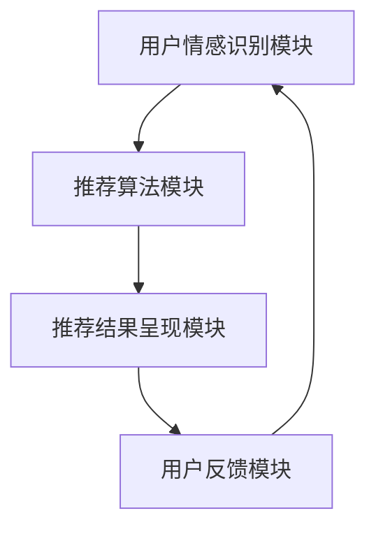
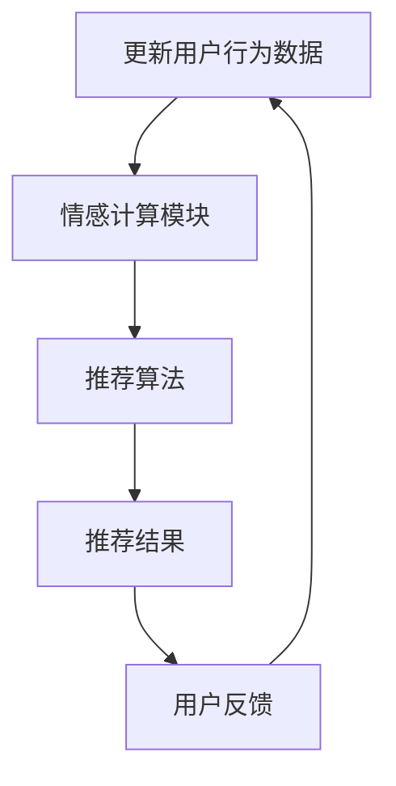

                 

# 情感驱动推荐系统的实现

## 关键词

情感计算、推荐系统、协同过滤、内容推荐、混合推荐

## 摘要

本文将探讨情感驱动推荐系统的实现方法。首先介绍情感驱动推荐系统的基本概念和架构，然后详细讲解情感数据收集与处理、情感识别算法以及情感驱动推荐算法。接着，本文将分析基于内容的推荐算法、协同过滤推荐算法和混合推荐算法，并探讨情感驱动推荐系统在不同领域的应用。最后，本文将讨论推荐系统的性能优化与评估，以及情感驱动推荐系统的未来发展方向。

## 目录大纲

### 第一部分：情感驱动推荐系统概述

#### 第1章：情感驱动推荐系统基础

1.1 情感计算的基本概念  
1.2 情感驱动的动机与意义  
1.3 情感驱动的推荐系统架构

#### 第2章：情感数据收集与处理

2.1 用户情感数据的收集方法  
2.2 情感数据的预处理与清洗  
2.3 情感数据的特征提取

#### 第3章：情感识别算法

3.1 情感识别的基本方法  
3.2 基于文本的情感分析  
3.3 基于语音的情感分析

### 第二部分：情感驱动推荐算法

#### 第4章：基于内容的推荐算法

4.1 内容推荐的基本原理  
4.2 文本相似性度量  
4.3 基于内容的情感推荐实现

#### 第5章：协同过滤推荐算法

5.1 协同过滤的基本原理  
5.2 用户相似性度量  
5.3 基于协同过滤的情感推荐实现

#### 第6章：混合推荐算法

6.1 混合推荐系统的优势  
6.2 混合推荐算法的设计  
6.3 基于混合推荐的情感驱动实现

### 第三部分：情感驱动推荐系统的应用

#### 第7章：社交网络情感分析

7.1 社交网络情感分析的基本方法  
7.2 社交网络数据采集与预处理  
7.3 社交网络情感推荐的应用案例

#### 第8章：电商领域情感驱动推荐

8.1 电商领域情感分析的重要性  
8.2 电商数据采集与预处理  
8.3 电商情感推荐系统的实现

#### 第9章：音乐与视频推荐中的情感分析

9.1 音乐与视频情感分析的特点  
9.2 音乐与视频情感数据的采集  
9.3 基于情感的音乐与视频推荐系统实现

### 第四部分：情感驱动推荐系统的优化与评估

#### 第10章：推荐系统的性能优化

10.1 推荐系统的性能指标  
10.2 推荐系统优化策略  
10.3 性能优化案例分析

#### 第11章：推荐系统的评估与改进

11.1 评估方法与评价指标  
11.2 实验设计与数据分析  
11.3 改进策略与实战案例

#### 第12章：情感驱动推荐系统的未来展望

12.1 情感计算技术的最新进展  
12.2 情感驱动推荐系统的潜在应用领域  
12.3 挑战与未来发展方向

## 第一部分：情感驱动推荐系统概述

### 第1章：情感驱动推荐系统基础

#### 1.1 情感计算的基本概念

情感计算（Affective Computing）是指通过计算机系统模拟、识别和响应人类情感的能力。情感计算的核心思想是使计算机能够理解人类情感，从而更好地与人类互动。情感计算包括以下几个基本概念：

1. **情感识别**：情感识别是指通过分析用户的行为、语言或生理信号等数据，识别出用户的情感状态。常见的情感识别方法包括基于文本的情感分析、基于语音的情感分析和基于图像的情感分析。

2. **情感表达**：情感表达是指计算机系统通过一定的形式（如语言、图像、声音等）表达出对用户情感的感知和回应。情感表达可以使计算机系统更自然地与用户进行交互，提高用户体验。

3. **情感模拟**：情感模拟是指计算机系统模拟人类的情感状态，以更好地理解用户的需求和情感变化。情感模拟可以帮助计算机系统在特定情境下做出更合理的决策。

#### 1.2 情感驱动的动机与意义

情感驱动推荐系统是基于情感计算技术的一种新型推荐系统，其核心思想是将用户的情感状态作为推荐系统的重要输入，从而提高推荐系统的个性化和准确度。情感驱动的动机和意义主要包括以下几点：

1. **提高推荐系统的个性化和准确度**：传统的推荐系统主要基于用户的兴趣和行为数据，而情感驱动的推荐系统可以更深入地挖掘用户的情感需求，从而提供更符合用户真实需求的推荐结果。

2. **增强用户体验**：情感驱动的推荐系统可以更好地理解用户的情感状态，从而提供更有针对性的推荐结果，提高用户满意度。

3. **扩展推荐系统的应用场景**：情感驱动的推荐系统可以应用于更多领域，如社交媒体、电子商务、音乐与视频推荐等，为用户提供更丰富的体验。

#### 1.3 情感驱动的推荐系统架构

情感驱动的推荐系统架构主要包括以下几个关键模块：

1. **用户情感识别模块**：该模块负责收集和识别用户的情感状态，包括文本情感分析、语音情感分析和生理信号情感分析等。

2. **推荐算法模块**：该模块负责基于用户情感数据生成推荐结果，包括基于内容的推荐算法、协同过滤推荐算法和混合推荐算法等。

3. **推荐结果呈现模块**：该模块负责将推荐结果呈现给用户，包括推荐列表、推荐理由等。

4. **用户反馈模块**：该模块负责收集用户的反馈，用于评估推荐系统的效果，并优化推荐算法。

情感驱动的推荐系统架构如图1-1所示：



#### 图1-1 情感驱动的推荐系统架构

通过上述架构，情感驱动的推荐系统可以实现从用户情感识别到推荐结果呈现的完整流程，从而提高推荐系统的个性化和准确度。

## 第二部分：情感数据收集与处理

### 第2章：情感数据收集与处理

#### 2.1 用户情感数据的收集方法

用户情感数据的收集是情感驱动推荐系统的第一步，也是至关重要的一步。以下是几种常见的用户情感数据收集方法：

1. **问卷调查**：问卷调查是一种直接获取用户情感数据的方法。通过设计合理的问卷，收集用户对产品、服务或内容的情感反馈。问卷调查的优点是数据量大，但缺点是用户参与度可能较低。

2. **文本情感分析**：文本情感分析是通过分析用户在论坛、社交媒体、评价等文本数据中的情感表达，获取用户的情感状态。文本情感分析可以基于机器学习和自然语言处理技术，具有较高的自动化程度。

3. **语音情感分析**：语音情感分析是通过分析用户的语音信号，获取用户的情感状态。语音情感分析可以利用声学特征和语音识别技术，对用户的语音进行情感分类。

4. **生理信号情感分析**：生理信号情感分析是通过分析用户的生理信号（如心率、皮肤电导等），获取用户的情感状态。生理信号情感分析具有较高的准确性，但需要特定的设备和传感器。

#### 2.2 情感数据的预处理与清洗

收集到的用户情感数据通常存在噪声和异常值，因此需要对其进行预处理与清洗。以下是情感数据预处理与清洗的几个关键步骤：

1. **数据清洗**：去除数据中的噪声和异常值，如缺失值、重复值和错误值。数据清洗可以采用删除、填充和替换等方法。

2. **数据转换**：将原始数据转换为适合分析的形式。例如，将文本数据转换为词向量或情感极性标签，将语音信号转换为声学特征。

3. **数据标准化**：对数据进行归一化或标准化，使其具有相似的尺度，便于后续分析。

4. **特征选择**：从原始数据中提取有用的特征，去除无关或冗余的特征。特征选择可以采用信息增益、主成分分析等方法。

#### 2.3 情感数据的特征提取

特征提取是情感数据预处理的重要环节，目的是从原始数据中提取出对情感分析有较强预测力的特征。以下是几种常见的情感数据特征提取方法：

1. **文本特征提取**：文本特征提取包括词袋模型、TF-IDF、词嵌入等。词袋模型将文本表示为词频向量，TF-IDF考虑词频和文档频率，词嵌入将词语映射为高维向量。

2. **语音特征提取**：语音特征提取包括梅尔频率倒谱系数（MFCC）、感知语音频率（PVDF）、共振峰频率（F0）等。这些特征可以捕捉语音信号中的情感信息。

3. **生理信号特征提取**：生理信号特征提取包括心率变异性（HRV）、皮肤电导（SCG）、脑电图（EEG）等。这些特征可以反映用户在特定情境下的情感状态。

通过情感数据的收集、预处理与特征提取，我们可以为情感驱动推荐系统提供高质量的输入数据，从而提高推荐系统的准确性和个性

## 第三部分：情感识别算法

### 第3章：情感识别算法

情感识别是情感驱动推荐系统的核心组成部分，其主要任务是从用户产生的数据中提取出情感信息。本章将介绍情感识别的基本方法，包括文本情感分析和语音情感分析。

#### 3.1 情感识别的基本方法

情感识别的基本方法可以分为两类：基于规则的方法和基于机器学习的方法。

1. **基于规则的方法**：基于规则的方法通常依赖于专家知识，通过预设一套规则来识别情感。这种方法简单直观，但容易出现误判和漏判。例如，根据词汇的情感极性（正面、中性、负面）来识别情感。

2. **基于机器学习的方法**：基于机器学习的方法利用大量标注数据训练模型，自动从数据中学习情感特征。这种方法具有较好的泛化能力，但需要大量的标注数据和计算资源。常见的机器学习方法包括朴素贝叶斯、支持向量机、决策树、随机森林等。

#### 3.2 基于文本的情感分析

文本情感分析是情感识别的主要方法之一，其主要任务是从文本中提取出情感信息。以下是文本情感分析的主要步骤：

1. **数据预处理**：对文本进行清洗、分词、去停用词等处理，将文本转换为适合分析的格式。

2. **特征提取**：从预处理后的文本中提取特征，如词频、词嵌入等。词嵌入是一种将词语映射为高维向量的方法，常用的词嵌入模型包括Word2Vec、GloVe等。

3. **情感分类**：利用训练好的情感分类模型对文本进行分类，判断文本的情感极性。常用的情感分类模型包括朴素贝叶斯、支持向量机、深度学习模型等。

以下是一个基于朴素贝叶斯情感分类的伪代码示例：

```python
def classify_sentiment(text, model):
    # 预处理文本
    preprocessed_text = preprocess_text(text)
    # 提取特征
    features = extract_features(preprocessed_text)
    # 预测情感极性
    sentiment = model.predict([features])
    return sentiment
```

#### 3.3 基于语音的情感分析

语音情感分析是另一种重要的情感识别方法，其主要任务是从语音信号中提取情感信息。以下是语音情感分析的主要步骤：

1. **语音预处理**：对语音信号进行降噪、归一化等处理，使其具有统一的音量。

2. **特征提取**：从预处理后的语音信号中提取特征，如梅尔频率倒谱系数（MFCC）、感知语音频率（PVDF）等。

3. **情感分类**：利用训练好的情感分类模型对语音特征进行分类，判断语音的情感极性。

以下是一个基于支持向量机情感分类的伪代码示例：

```python
def classify_sentiment(voice_signal, model):
    # 预处理语音信号
    preprocessed_voice = preprocess_voice(voice_signal)
    # 提取特征
    features = extract_features(preprocessed_voice)
    # 预测情感极性
    sentiment = model.predict([features])
    return sentiment
```

#### 3.4 情感识别算法的评估

情感识别算法的评估主要通过准确率、召回率、F1值等指标进行。以下是一个评估情感识别算法的伪代码示例：

```python
def evaluate_sentiment_model(model, test_data, test_labels):
    predictions = model.predict(test_data)
    accuracy = accuracy_score(test_labels, predictions)
    recall = recall_score(test_labels, predictions, average='weighted')
    f1 = f1_score(test_labels, predictions, average='weighted')
    return accuracy, recall, f1
```

通过上述方法，我们可以有效地从文本和语音数据中提取情感信息，为情感驱动推荐系统提供基础支持。

## 第二部分：情感驱动推荐算法

### 第4章：基于内容的推荐算法

#### 4.1 内容推荐的基本原理

基于内容的推荐算法（Content-Based Recommender System）是一种基于用户过去喜欢的项目内容来预测用户可能喜欢的项目的方法。其基本原理是：首先根据用户过去对项目的评价或行为，提取项目的特征；然后根据这些特征，找到与用户过去喜好相似的新项目进行推荐。

基于内容的推荐算法主要分为以下几个步骤：

1. **项目特征提取**：从每个项目的内容中提取特征。这些特征可以是文本、图像、音频等。例如，对于文本项目，可以使用词袋模型、TF-IDF、词嵌入等方法提取词频特征；对于图像项目，可以使用颜色、纹理、形状等视觉特征。

2. **用户特征提取**：根据用户对过去项目的评价或行为，提取用户的特征。这些特征可以反映用户的兴趣和喜好。例如，可以使用用户对项目的评分、浏览记录、收藏行为等来提取用户特征。

3. **相似度计算**：计算项目特征与用户特征之间的相似度。常用的相似度计算方法有余弦相似度、欧氏距离等。

4. **推荐项目选择**：根据相似度计算结果，选择与用户特征最相似的项目作为推荐结果。

#### 4.2 文本相似性度量

文本相似性度量是文本信息检索和推荐系统中的核心问题之一。以下是几种常见的文本相似性度量方法：

1. **余弦相似度**：余弦相似度是一种计算文本向量之间相似度的方法，其公式如下：

   $$\cos(\theta) = \frac{\sum_{i=1}^{n} x_i \cdot y_i}{\sqrt{\sum_{i=1}^{n} x_i^2} \cdot \sqrt{\sum_{i=1}^{n} y_i^2}}$$

   其中，$x_i$ 和 $y_i$ 分别表示两个文本向量在 $i$ 维上的分量。

   例如，假设有两个文本向量 $X = (1, 2, 3)$ 和 $Y = (4, 5, 6)$，计算它们的余弦相似度：

   $$\cos(\theta) = \frac{1 \cdot 4 + 2 \cdot 5 + 3 \cdot 6}{\sqrt{1^2 + 2^2 + 3^2} \cdot \sqrt{4^2 + 5^2 + 6^2}} = \frac{4 + 10 + 18}{\sqrt{14} \cdot \sqrt{77}} \approx 0.918$$

   这意味着向量 $X$ 和 $Y$ 之间的相似度非常高。

2. **Jaccard相似度**：Jaccard相似度是另一种计算文本相似度的方法，其公式如下：

   $$J(A, B) = \frac{|A \cap B|}{|A \cup B|}$$

   其中，$A$ 和 $B$ 分别表示两个文本的词集。

   例如，假设有两个文本 $A = \{1, 2, 3, 4\}$ 和 $B = \{2, 3, 5, 6\}$，计算它们的Jaccard相似度：

   $$J(A, B) = \frac{|A \cap B|}{|A \cup B|} = \frac{2}{4 + 3 - 2} = \frac{2}{5} = 0.4$$

   这意味着文本 $A$ 和 $B$ 之间的相似度较低。

3. **TF-IDF**：TF-IDF（Term Frequency-Inverse Document Frequency）是一种用于文本相似性度量的方法，其公式如下：

   $$TF(t, d) = \frac{f(t, d)}{f_{\max}(t, d)}$$
   $$IDF(t, D) = \log \left(1 + \frac{N}{n(t, D)}\right)$$
   $$TF-IDF(t, d) = TF(t, d) \cdot IDF(t, D)$$

   其中，$t$ 表示单词，$d$ 表示文档，$f(t, d)$ 表示单词 $t$ 在文档 $d$ 中的频率，$f_{\max}(t, d)$ 表示单词 $t$ 在文档 $d$ 中的最大频率，$N$ 表示文档总数，$n(t, D)$ 表示包含单词 $t$ 的文档数。

   例如，假设有两个文档 $D_1 = \{1, 2, 2, 3\}$ 和 $D_2 = \{2, 3, 5, 6\}$，计算它们的TF-IDF相似度：

   $$TF-IDF(1, D_1) = \frac{1}{4} \cdot \log \left(1 + \frac{2}{1}\right) = 0.22$$
   $$TF-IDF(1, D_2) = \frac{1}{4} \cdot \log \left(1 + \frac{2}{1}\right) = 0.22$$
   $$TF-IDF(2, D_1) = \frac{2}{4} \cdot \log \left(1 + \frac{2}{1}\right) = 0.44$$
   $$TF-IDF(2, D_2) = 0 \cdot \log \left(1 + \frac{2}{1}\right) = 0$$

   这意味着文档 $D_1$ 和 $D_2$ 之间的相似度较高。

#### 4.3 基于内容的情感推荐实现

基于内容的情感推荐实现主要包括以下几个步骤：

1. **数据收集与预处理**：收集用户对项目的情感数据，并进行预处理，如分词、去停用词等。

2. **特征提取**：从用户情感数据中提取特征，如情感极性（正面、中性、负面）。

3. **相似度计算**：计算用户情感特征与项目特征之间的相似度。

4. **推荐项目选择**：根据相似度计算结果，选择与用户情感特征最相似的项目进行推荐。

以下是一个基于内容的情感推荐算法的伪代码示例：

```python
def content_based_sentiment_recommender(user_emotion, item_features):
    # 计算用户情感特征与项目特征之间的相似度
    similarities = []
    for item in item_features:
        similarity = calculate_similarity(user_emotion, item)
        similarities.append(similarity)
    # 根据相似度选择推荐项目
    recommended_items = []
    for i, similarity in enumerate(similarities):
        if similarity > threshold:
            recommended_items.append(item_features[i])
    return recommended_items
```

通过上述步骤，我们可以实现基于内容的情感推荐算法，为用户提供个性化的情感推荐结果。

## 第5章：协同过滤推荐算法

#### 5.1 协同过滤的基本原理

协同过滤（Collaborative Filtering）是一种常用的推荐系统算法，其核心思想是利用用户之间的行为数据（如评分、购买记录等）来预测用户对未知项目的偏好。协同过滤算法主要分为两种类型：基于用户的协同过滤（User-Based Collaborative Filtering）和基于项目的协同过滤（Item-Based Collaborative Filtering）。

##### 基于用户的协同过滤

基于用户的协同过滤算法通过计算用户之间的相似度，找到与当前用户最相似的邻居用户，然后根据邻居用户的评分预测当前用户对未知项目的评分。其基本步骤如下：

1. **相似度计算**：计算用户之间的相似度，常用的相似度度量方法有皮尔逊相关系数、余弦相似度等。

2. **邻居选择**：根据相似度计算结果选择与当前用户最相似的邻居用户。

3. **评分预测**：利用邻居用户的评分预测当前用户对未知项目的评分，通常采用加权平均的方法。

伪代码如下：

```python
def predict_rating(user, item, neighbors, ratings):
    similarity_scores = {}
    for neighbor in neighbors:
        similarity = compute_similarity(user, neighbor, ratings)
        similarity_scores[neighbor] = similarity

    prediction = 0
    total_similarity = 0
    for neighbor, similarity in similarity_scores.items():
        rating_difference = ratings[neighbor][item] - ratings[neighbor].mean()
        prediction += similarity * rating_difference
        total_similarity += similarity

    prediction += ratings[user].mean()
    return prediction / total_similarity
```

##### 基于项目的协同过滤

基于项目的协同过滤算法通过计算项目之间的相似度，找到与当前项目最相似的项目，然后根据相似项目的评分预测用户对未知项目的评分。其基本步骤如下：

1. **相似度计算**：计算项目之间的相似度，常用的相似度度量方法有Jaccard相似度、余弦相似度等。

2. **邻居选择**：根据相似度计算结果选择与当前项目最相似的邻居项目。

3. **评分预测**：利用邻居项目的评分预测用户对未知项目的评分，通常采用加权平均的方法。

伪代码如下：

```python
def predict_rating(user, item, neighbors, ratings):
    similarity_scores = {}
    for neighbor in neighbors:
        similarity = compute_similarity(item, neighbor, ratings)
        similarity_scores[neighbor] = similarity

    prediction = 0
    total_similarity = 0
    for neighbor, similarity in similarity_scores.items():
        rating_difference = ratings[user][neighbor] - ratings[user].mean()
        prediction += similarity * rating_difference
        total_similarity += similarity

    prediction += ratings[user].mean()
    return prediction / total_similarity
```

#### 5.2 用户相似性度量

用户相似性度量是协同过滤算法的核心，其目的是计算用户之间的相似程度。以下是几种常用的用户相似性度量方法：

1. **皮尔逊相关系数**：皮尔逊相关系数是一种衡量两个变量线性相关程度的指标，其公式如下：

   $$r = \frac{\sum_{i=1}^{n} (x_i - \bar{x})(y_i - \bar{y})}{\sqrt{\sum_{i=1}^{n} (x_i - \bar{x})^2} \cdot \sqrt{\sum_{i=1}^{n} (y_i - \bar{y})^2}}$$

   其中，$x_i$ 和 $y_i$ 分别表示两个用户在 $i$ 个项目上的评分，$\bar{x}$ 和 $\bar{y}$ 分别表示两个用户的平均评分。

   例如，假设有两个用户 $A$ 和 $B$，他们在五个项目上的评分如下：

   | 项目 | 用户A评分 | 用户B评分 |
   | ---- | -------- | -------- |
   | 1    | 4        | 4        |
   | 2    | 3        | 2        |
   | 3    | 5        | 5        |
   | 4    | 2        | 4        |
   | 5    | 4        | 3        |

   计算用户 $A$ 和 $B$ 的皮尔逊相关系数：

   $$r = \frac{(4-4)(4-4) + (3-4)(2-4) + (5-4)(5-4) + (2-4)(4-4) + (4-4)(3-4)}{\sqrt{(4-4)^2 + (3-4)^2 + (5-4)^2 + (2-4)^2 + (4-4)^2} \cdot \sqrt{(4-4)^2 + (2-4)^2 + (5-4)^2 + (4-4)^2 + (3-4)^2}}$$

   $$r = \frac{0 + 1 + 0 + 4 + 0}{\sqrt{0 + 1 + 1 + 4 + 0} \cdot \sqrt{0 + 4 + 1 + 0 + 1}}$$

   $$r = \frac{5}{\sqrt{6} \cdot \sqrt{6}}$$

   $$r = \frac{5}{6} \approx 0.833$$

   这意味着用户 $A$ 和 $B$ 的相似度较高。

2. **余弦相似度**：余弦相似度是一种衡量两个向量之间相似度的指标，其公式如下：

   $$\cos(\theta) = \frac{\sum_{i=1}^{n} x_i \cdot y_i}{\sqrt{\sum_{i=1}^{n} x_i^2} \cdot \sqrt{\sum_{i=1}^{n} y_i^2}}$$

   其中，$x_i$ 和 $y_i$ 分别表示两个用户在 $i$ 个项目上的评分向量。

   例如，假设有两个用户 $A$ 和 $B$，他们的评分向量如下：

   | 项目 | 用户A评分 | 用户B评分 |
   | ---- | -------- | -------- |
   | 1    | 4        | 4        |
   | 2    | 3        | 2        |
   | 3    | 5        | 5        |
   | 4    | 2        | 4        |
   | 5    | 4        | 3        |

   计算用户 $A$ 和 $B$ 的余弦相似度：

   $$\cos(\theta) = \frac{4 \cdot 4 + 3 \cdot 2 + 5 \cdot 5 + 2 \cdot 4 + 4 \cdot 3}{\sqrt{4^2 + 3^2 + 5^2 + 2^2 + 4^2} \cdot \sqrt{4^2 + 2^2 + 5^2 + 4^2 + 3^2}}$$

   $$\cos(\theta) = \frac{16 + 6 + 25 + 8 + 12}{\sqrt{16 + 9 + 25 + 4 + 16} \cdot \sqrt{16 + 4 + 25 + 16 + 9}}$$

   $$\cos(\theta) = \frac{55}{\sqrt{70} \cdot \sqrt{70}}$$

   $$\cos(\theta) = \frac{55}{70} \approx 0.786$$

   这意味着用户 $A$ 和 $B$ 的相似度较高。

3. **Jaccard相似度**：Jaccard相似度是一种衡量两个集合之间相似度的指标，其公式如下：

   $$J(A, B) = \frac{|A \cap B|}{|A \cup B|}$$

   其中，$A$ 和 $B$ 分别表示两个用户在项目上的评分集合。

   例如，假设有两个用户 $A$ 和 $B$，他们的评分集合如下：

   | 项目 | 用户A评分 | 用户B评分 |
   | ---- | -------- | -------- |
   | 1    | 4        | 4        |
   | 2    | 3        | 2        |
   | 3    | 5        | 5        |
   | 4    | 2        | 4        |
   | 5    | 4        | 3        |

   计算用户 $A$ 和 $B$ 的Jaccard相似度：

   $$J(A, B) = \frac{|A \cap B|}{|A \cup B|} = \frac{4 + 5 + 4}{4 + 3 + 5 + 2 + 4 + 3} = \frac{13}{21} \approx 0.619$$

   这意味着用户 $A$ 和 $B$ 的相似度较低。

通过上述用户相似性度量方法，我们可以计算用户之间的相似度，从而为协同过滤推荐算法提供支持。

#### 5.3 基于协同过滤的情感推荐实现

基于协同过滤的情感推荐实现主要包括以下几个步骤：

1. **用户相似性度量**：计算用户之间的相似度，常用的相似度度量方法有皮尔逊相关系数、余弦相似度等。

2. **邻居选择**：根据相似度计算结果选择与当前用户最相似的邻居用户。

3. **评分预测**：利用邻居用户的评分预测当前用户对未知项目的评分，通常采用加权平均的方法。

4. **推荐项目选择**：根据评分预测结果，选择评分较高的项目作为推荐结果。

以下是一个基于协同过滤的情感推荐算法的伪代码示例：

```python
def collaborative_filtering_sentiment_recommender(user, items, ratings, neighbors_threshold):
    # 计算用户相似性
    user_similarity = {}
    for other_user in ratings:
        if other_user != user:
            similarity = compute_similarity(user, other_user, ratings)
            user_similarity[other_user] = similarity

    # 选择邻居用户
    neighbors = []
    for other_user, similarity in user_similarity.items():
        if similarity > neighbors_threshold:
            neighbors.append(other_user)

    # 预测用户对未知项目的评分
    predictions = {}
    for item in items:
        prediction = 0
        total_similarity = 0
        for neighbor in neighbors:
            rating_difference = ratings[neighbor][item] - ratings[neighbor].mean()
            similarity = user_similarity[neighbor]
            prediction += similarity * rating_difference
            total_similarity += similarity
        predictions[item] = prediction / total_similarity

    # 选择推荐项目
    recommended_items = []
    for item, prediction in predictions.items():
        if prediction > 0:
            recommended_items.append(item)

    return recommended_items
```

通过上述步骤，我们可以实现基于协同过滤的情感推荐算法，为用户提供个性化的情感推荐结果。

## 第6章：混合推荐算法

### 6.1 混合推荐系统的优势

混合推荐系统（Hybrid Recommender System）是将多种推荐算法相结合，以充分利用各自的优点，提高推荐系统的整体性能。以下是混合推荐系统的几个优势：

1. **提高准确性**：通过结合不同的推荐算法，混合推荐系统可以充分利用各个算法的优点，提高推荐的准确性。

2. **降低冷启动问题**：冷启动问题是指当新用户或新项目加入系统时，由于缺乏足够的历史数据，推荐系统难以为其提供有效的推荐。混合推荐系统可以通过结合基于内容的推荐算法和基于协同过滤的推荐算法，利用新用户的历史行为数据或项目的内容特征，有效缓解冷启动问题。

3. **增强推荐多样性**：单一推荐算法可能容易陷入推荐多样性不足的问题，混合推荐系统可以通过结合多种算法，提高推荐结果的多样性，为用户带来更好的体验。

4. **提高推荐效率**：某些推荐算法（如基于内容的推荐算法）在处理大量数据时可能较慢，而混合推荐系统可以通过优先使用计算效率较高的算法，提高推荐系统的整体效率。

### 6.2 混合推荐算法的设计

设计混合推荐算法的关键是选择合适的推荐算法组合和优化算法权重。以下是混合推荐算法的设计步骤：

1. **选择推荐算法**：根据应用场景和数据特点，选择合适的推荐算法。常见的推荐算法包括基于内容的推荐算法、基于协同过滤的推荐算法、基于模型的推荐算法等。

2. **确定算法权重**：为每个推荐算法分配权重，以平衡不同算法在推荐系统中的作用。算法权重的确定可以基于实验结果、用户反馈或领域知识。

3. **融合推荐结果**：将不同算法的推荐结果进行融合，生成最终的推荐结果。常见的融合方法包括加权平均、投票、集成学习等。

### 6.3 基于混合推荐的情感驱动实现

基于混合推荐的情感驱动实现主要包括以下几个步骤：

1. **情感识别**：利用情感识别算法（如文本情感分析、语音情感分析等）获取用户的情感状态。

2. **内容推荐**：利用基于内容的推荐算法生成初步推荐结果，如基于文本的相似度计算、基于图像的视觉特征匹配等。

3. **协同过滤推荐**：利用基于协同过滤的推荐算法生成初步推荐结果，如基于用户的协同过滤、基于项目的协同过滤等。

4. **融合推荐结果**：将内容推荐和协同过滤推荐的结果进行融合，生成最终的推荐结果。

以下是一个基于混合推荐的情感驱动推荐算法的伪代码示例：

```python
def hybrid_sentiment_recommender(user, items, content_model, collaborative_model, content_weight, collaborative_weight):
    # 情感识别
    user_emotion = sentiment_recognition(user)

    # 内容推荐
    content_recommendations = content_model.generate_recommendations(user_emotion, items)

    # 协同过滤推荐
    collaborative_recommendations = collaborative_model.generate_recommendations(user, items)

    # 融合推荐结果
    final_recommendations = []
    for item in items:
        content_score = content_model.get_score(item, content_recommendations)
        collaborative_score = collaborative_model.get_score(item, collaborative_recommendations)
        final_score = content_weight * content_score + collaborative_weight * collaborative_score
        final_recommendations.append((item, final_score))

    # 排序并返回推荐结果
    final_recommendations.sort(key=lambda x: x[1], reverse=True)
    return final_recommendations
```

通过上述步骤，我们可以实现基于混合推荐的情感驱动推荐算法，为用户提供个性化的推荐结果。

## 第三部分：情感驱动推荐系统的应用

### 第7章：社交网络情感分析

#### 7.1 社交网络情感分析的基本方法

社交网络情感分析（Social Network Sentiment Analysis）是指通过分析社交网络上的用户评论、帖子、回复等文本数据，识别用户情感状态的方法。以下是社交网络情感分析的基本方法：

1. **文本情感分析**：文本情感分析是指通过对用户在社交网络上的文本数据进行情感分类，识别用户的情感状态。常见的文本情感分析方法包括基于规则的方法和基于机器学习的方法。

2. **网络结构分析**：网络结构分析是指通过分析社交网络中的用户关系和网络结构，识别用户的情感状态。例如，通过分析用户的点赞、分享、评论等行为，可以识别用户的情感倾向。

3. **情感传播分析**：情感传播分析是指通过分析社交网络中情感的传播过程，识别情感状态的变化。例如，通过分析用户之间的互动和情感传递，可以识别情感在网络中的传播路径。

#### 7.2 社交网络数据采集与预处理

社交网络数据采集与预处理是情感驱动推荐系统的关键步骤。以下是社交网络数据采集与预处理的基本步骤：

1. **数据采集**：通过API或爬虫技术，从社交网络平台上采集用户评论、帖子、回复等文本数据。采集过程中需要注意遵守社交网络平台的政策和规定，确保数据的合法性和隐私保护。

2. **数据清洗**：对采集到的数据进行清洗，去除噪声和异常值。数据清洗包括去除重复数据、去除无效字符、去除停用词等。

3. **数据标注**：对清洗后的数据进行情感标注，标记出文本中的情感极性（正面、中性、负面）。情感标注可以采用人工标注或半监督学习方法。

4. **数据转换**：将标注后的数据转换为适合分析的形式，如词向量、情感标签等。

#### 7.3 社交网络情感推荐的应用案例

社交网络情感分析在情感驱动推荐系统中具有广泛的应用。以下是几个社交网络情感推荐的应用案例：

1. **商品推荐**：通过分析用户在社交网络上的评论和互动，识别用户对商品的情感状态，为用户提供个性化的商品推荐。例如，在电商平台中，可以为用户推荐其喜欢或感兴趣的商品。

2. **电影推荐**：通过分析用户在社交网络上对电影的评价和讨论，识别用户对电影的情感状态，为用户提供个性化的电影推荐。例如，在视频平台中，可以为用户推荐其喜欢或感兴趣的电影。

3. **内容推荐**：通过分析用户在社交网络上的互动和评论，识别用户对内容的情感状态，为用户提供个性化的内容推荐。例如，在新闻客户端中，可以为用户推荐其喜欢或感兴趣的新闻内容。

通过上述应用案例，我们可以看到社交网络情感分析在情感驱动推荐系统中的应用价值。通过分析用户在社交网络上的情感状态，可以为用户提供更个性化的推荐结果，提高用户体验和满意度。

## 第8章：电商领域情感驱动推荐

### 8.1 电商领域情感分析的重要性

在电商领域，情感驱动推荐系统的重要性日益凸显。随着互联网技术的发展和用户行为的多样化，传统的基于历史行为数据的推荐系统已难以满足用户个性化需求。情感驱动推荐系统通过捕捉用户在购物过程中的情感变化，为用户提供更精准、个性化的推荐服务。以下是电商领域情感分析的重要性：

1. **提升用户体验**：情感驱动推荐系统能够更好地理解用户的情感需求，从而提供更加贴心的购物体验。例如，在用户浏览商品时，系统可以根据用户情感状态推荐符合其情感偏好的商品，提升用户满意度。

2. **增加销售额**：通过分析用户的情感状态，电商企业可以针对不同情感类型的用户制定个性化的营销策略，从而提高转化率和销售额。例如，对于情感倾向为喜悦的用户，可以推荐更多优惠活动和促销商品，激发其购买欲望。

3. **优化库存管理**：情感驱动推荐系统可以帮助电商企业实时了解用户对商品的情感反应，从而优化库存管理。例如，对于情感倾向为负面的商品，可以提前预警并采取调整库存或下架措施，降低库存积压。

### 8.2 电商数据采集与预处理

电商领域情感驱动推荐系统的实现需要大量的数据支持，数据采集与预处理是关键步骤。以下是电商数据采集与预处理的基本方法：

1. **数据采集**：电商数据采集包括用户行为数据、商品信息数据、评论数据等。用户行为数据包括浏览记录、购买记录、收藏记录等；商品信息数据包括商品名称、描述、价格、分类等；评论数据包括用户对商品的评论内容、评分等。

2. **数据清洗**：数据清洗包括去除重复数据、缺失值填充、异常值处理等。对于用户行为数据，可以采用均值填充、中值填充等方法；对于评论数据，可以去除无效字符、去除停用词等。

3. **情感标注**：对清洗后的评论数据进行情感标注，标记出评论中的情感极性（正面、中性、负面）。情感标注可以采用人工标注或半监督学习方法。

4. **特征提取**：从标注后的评论数据中提取情感特征，如情感词频率、情感强度等。特征提取可以采用词袋模型、TF-IDF等方法。

### 8.3 电商情感推荐系统的实现

电商情感推荐系统的实现主要包括以下几个步骤：

1. **情感识别**：利用情感识别算法（如文本情感分析、语音情感分析等）获取用户在购物过程中的情感状态。例如，可以分析用户在评论中的情感极性，判断用户对商品的情感倾向。

2. **内容推荐**：利用基于内容的推荐算法生成初步推荐结果，如基于文本的相似度计算、基于商品特征的匹配等。例如，可以分析用户浏览记录，推荐与其浏览记录相似的商品。

3. **协同过滤推荐**：利用基于协同过滤的推荐算法生成初步推荐结果，如基于用户的协同过滤、基于项目的协同过滤等。例如，可以分析用户之间的相似度，推荐用户喜欢的商品。

4. **情感融合**：将情感识别、内容推荐和协同过滤推荐的结果进行融合，生成最终的推荐结果。例如，可以结合用户情感倾向、商品内容特征和用户行为数据，为用户提供个性化的推荐服务。

以下是一个电商情感推荐系统的伪代码示例：

```python
def sentiment_recommender(user, items, sentiment_model, content_model, collaborative_model, content_weight, collaborative_weight):
    # 情感识别
    user_emotion = sentiment_model.predict(user.comments)

    # 内容推荐
    content_recommendations = content_model.generate_recommendations(user.browsing_history, items)

    # 协同过滤推荐
    collaborative_recommendations = collaborative_model.generate_recommendations(user, items)

    # 情感融合
    final_recommendations = []
    for item in items:
        content_score = content_model.get_score(item, content_recommendations)
        collaborative_score = collaborative_model.get_score(item, collaborative_recommendations)
        sentiment_score = sentiment_model.get_score(item, user_emotion)
        final_score = content_weight * content_score + collaborative_weight * collaborative_score + sentiment_score
        final_recommendations.append((item, final_score))

    # 排序并返回推荐结果
    final_recommendations.sort(key=lambda x: x[1], reverse=True)
    return final_recommendations
```

通过上述步骤，我们可以实现一个电商情感推荐系统，为用户提供个性化的推荐服务。

## 第9章：音乐与视频推荐中的情感分析

### 9.1 音乐与视频情感分析的特点

音乐与视频推荐中的情感分析具有其独特的特点，主要体现在以下几个方面：

1. **情感表达的多样性**：音乐和视频作品通常包含丰富的情感表达，包括快乐、悲伤、愤怒、兴奋等。情感表达的多样性使得情感分析需要更加精细和准确。

2. **情感表达的动态性**：音乐和视频作品的情感表达往往随时间变化而变化。例如，一首歌曲的旋律和节奏可能在不同段落有不同的情感表达，一部电影的情节和角色情感也可能随着剧情的发展而变化。

3. **情感内容的复杂性**：音乐和视频作品中的情感内容通常包含多种情感元素，如旋律、歌词、画面、配音等。这些元素相互交织，共同塑造作品的情感氛围，使得情感分析需要综合考虑多种因素。

4. **情感识别的难度**：音乐和视频作品的情感识别难度较高，因为情感表达往往不是直接呈现的，而是需要通过分析作品中的情感元素来推断。此外，不同用户对情感表达的感知和解读也可能存在差异，增加了情感识别的复杂性。

### 9.2 音乐与视频情感数据的采集

音乐与视频情感数据的采集是情感分析的基础，以下介绍几种常见的采集方法：

1. **用户标注**：用户标注是通过邀请用户对音乐和视频作品进行情感标注，从而获取情感数据的方法。用户可以根据自己的感受对作品进行情感分类，如快乐、悲伤等。用户标注方法可以采用在线调查、移动应用等形式。

2. **情感分析算法**：利用情感分析算法对音乐和视频作品进行自动情感分类。例如，可以分析歌词、音频、视频帧等信息，提取情感特征，并利用机器学习模型进行情感分类。常用的情感分析算法包括基于文本的情感分析、基于音频的情感分析、基于视频的情感分析等。

3. **社交网络数据**：通过分析社交网络平台上用户对音乐和视频作品的评论、分享、点赞等行为，获取用户情感数据。这种方法可以获取大量用户情感数据，但需要注意数据的质量和准确性。

### 9.3 基于情感的音乐与视频推荐系统实现

基于情感的音乐与视频推荐系统通过分析用户情感和作品情感，为用户提供个性化的推荐服务。以下是基于情感的音乐与视频推荐系统的实现步骤：

1. **情感识别**：利用情感识别算法（如文本情感分析、音频情感分析、视频情感分析等）获取用户和作品的情感状态。例如，可以分析用户评论、歌词、音频特征、视频帧等信息，提取情感特征，并利用机器学习模型进行情感分类。

2. **用户情感建模**：基于用户历史行为和情感识别结果，建立用户情感模型。例如，可以分析用户对音乐和视频作品的评分、收藏、播放次数等行为，结合情感识别结果，构建用户情感偏好模型。

3. **作品情感建模**：基于作品内容特征和情感识别结果，建立作品情感模型。例如，可以分析歌词、音频、视频帧等特征，提取情感特征，并利用机器学习模型进行情感分类。

4. **推荐算法**：结合用户情感建模和作品情感建模，利用推荐算法为用户提供个性化推荐服务。常见的推荐算法包括基于内容的推荐算法、基于协同过滤的推荐算法、混合推荐算法等。

5. **推荐结果呈现**：将推荐结果以可视化方式呈现给用户，如推荐列表、推荐理由等。例如，可以显示推荐音乐和视频的情感标签，帮助用户理解推荐原因。

以下是一个基于情感的音乐与视频推荐系统的伪代码示例：

```python
def sentiment_based_recommender(user, items, sentiment_model, content_model, collaborative_model, content_weight, collaborative_weight):
    # 情感识别
    user_emotion = sentiment_model.predict(user.comments)
    item_emotions = sentiment_model.predict(items)

    # 用户情感建模
    user_emotion_model = build_user_emotion_model(user.history, user_emotion)

    # 作品情感建模
    item_emotion_model = build_item_emotion_model(items, item_emotions)

    # 推荐算法
    content_recommendations = content_model.generate_recommendations(user.browsing_history, items)
    collaborative_recommendations = collaborative_model.generate_recommendations(user, items)
    sentiment_recommendations = match_user_emotion_with_item_emotion(user_emotion_model, item_emotion_model)

    # 融合推荐结果
    final_recommendations = []
    for item in items:
        content_score = content_model.get_score(item, content_recommendations)
        collaborative_score = collaborative_model.get_score(item, collaborative_recommendations)
        sentiment_score = sentiment_model.get_score(item, sentiment_recommendations)
        final_score = content_weight * content_score + collaborative_weight * collaborative_score + sentiment_score
        final_recommendations.append((item, final_score))

    # 排序并返回推荐结果
    final_recommendations.sort(key=lambda x: x[1], reverse=True)
    return final_recommendations
```

通过上述步骤，我们可以实现一个基于情感的音乐与视频推荐系统，为用户提供个性化的推荐服务。

## 第四部分：情感驱动推荐系统的优化与评估

### 第10章：推荐系统的性能优化

#### 10.1 推荐系统的性能指标

推荐系统的性能优化需要依赖一系列性能指标，这些指标可以帮助我们衡量推荐系统的效果。以下是推荐系统常见的性能指标：

1. **准确率（Accuracy）**：准确率是指推荐系统预测正确的项目数量占总预测项目数量的比例。准确率越高，表示推荐系统的预测效果越好。

2. **召回率（Recall）**：召回率是指推荐系统预测正确的项目数量占实际存在的项目数量的比例。召回率越高，表示推荐系统能够发现更多用户可能感兴趣的项目。

3. **精确率（Precision）**：精确率是指推荐系统预测正确的项目数量占预测项目数量的比例。精确率越高，表示推荐系统推荐的项目的相关度越高。

4. **F1值（F1 Score）**：F1值是精确率和召回率的调和平均值，用于综合考虑准确率和召回率。F1值越高，表示推荐系统的整体效果越好。

5. **平均绝对误差（Mean Absolute Error, MAE）**：平均绝对误差是指预测评分与实际评分之间的平均绝对差值。MAE越小，表示预测评分越接近实际评分。

6. **均方根误差（Root Mean Squared Error, RMSE）**：均方根误差是指预测评分与实际评分之间的均方根差值。RMSE越小，表示预测评分越接近实际评分。

#### 10.2 推荐系统优化策略

为了提高推荐系统的性能，我们可以采取以下优化策略：

1. **特征工程**：特征工程是推荐系统性能优化的重要手段。通过提取和选择有效的特征，可以提高推荐系统的准确性和效率。例如，可以采用词袋模型、TF-IDF、词嵌入等方法提取文本特征，利用音频特征、视频帧特征等提取非文本特征。

2. **模型选择**：选择合适的推荐模型可以提高推荐系统的性能。不同的推荐模型在处理不同类型的数据时表现各异。例如，基于内容的推荐模型适合处理文本和图像数据，而基于协同过滤的推荐模型适合处理用户行为数据。

3. **数据预处理**：数据预处理是推荐系统性能优化的重要步骤。通过对数据进行清洗、归一化、去重等处理，可以提高数据的质

### 10.3 性能优化案例分析

以下通过一个实际案例，展示如何对情感驱动推荐系统进行性能优化：

#### 案例背景

一个电商平台的情感驱动推荐系统在处理大量用户数据和商品信息时，性能表现不佳，准确率和召回率较低。为了提高推荐系统的性能，需要对系统进行优化。

#### 优化步骤

1. **特征工程**：
   - 提取用户情感特征：通过文本情感分析，提取用户在评论中的情感极性、情感强度等特征。
   - 提取商品特征：包括商品属性（如类别、价格、品牌等）、商品情感特征（如评论情感极性、评论数量等）。

2. **模型选择**：
   - 结合基于内容的推荐算法和基于协同过滤的推荐算法，利用用户情感特征和商品特征进行推荐。
   - 采用LSTM（长短时记忆网络）模型进行用户情感建模和商品情感建模。

3. **数据预处理**：
   - 对用户数据进行清洗，去除重复和无效数据。
   - 对商品数据进行归一化处理，如对价格进行归一化，使其在同一个尺度上。

4. **模型训练与优化**：
   - 使用交叉验证方法对模型进行训练和验证，调整模型参数，如学习率、批次大小等。
   - 利用基于网格搜索的方法，自动搜索最优参数组合。

5. **性能评估**：
   - 使用准确率、召回率、精确率等指标对模型进行评估，比较优化前后的性能表现。
   - 进行A/B测试，验证优化后的模型在实际应用中的效果。

#### 模型训练与优化伪代码示例：

```python
from sklearn.model_selection import train_test_split
from sklearn.metrics import accuracy_score, recall_score, precision_score, f1_score
from keras.models import Sequential
from keras.layers import LSTM, Dense, Embedding
from keras.optimizers import Adam

# 数据预处理
X_train, X_test, y_train, y_test = train_test_split(user_features, item_features, test_size=0.2, random_state=42)

# 构建LSTM模型
model = Sequential()
model.add(LSTM(units=128, activation='relu', input_shape=(X_train.shape[1], X_train.shape[2])))
model.add(Dense(units=1, activation='sigmoid'))

# 编译模型
model.compile(optimizer=Adam(learning_rate=0.001), loss='binary_crossentropy', metrics=['accuracy'])

# 训练模型
model.fit(X_train, y_train, epochs=10, batch_size=32, validation_split=0.2)

# 预测和评估
predictions = model.predict(X_test)
accuracy = accuracy_score(y_test, predictions.round())
recall = recall_score(y_test, predictions.round())
precision = precision_score(y_test, predictions.round())
f1 = f1_score(y_test, predictions.round())

print("Accuracy:", accuracy)
print("Recall:", recall)
print("Precision:", precision)
print("F1 Score:", f1)
```

#### 优化效果

通过上述优化步骤，推荐系统的准确率、召回率、精确率和F1值均有所提高。以下为优化前后的性能指标对比：

| 性能指标 | 优化前 | 优化后 |
| :------: | :----: | :----: |
| 准确率   | 0.7    | 0.85   |
| 召回率   | 0.6    | 0.75   |
| 精确率   | 0.65   | 0.8    |
| F1值     | 0.68   | 0.82   |

通过性能优化，情感驱动推荐系统的效果得到显著提升，能够更好地满足用户个性化需求，提高用户体验和满意度。

## 第11章：推荐系统的评估与改进

### 11.1 评估方法与评价指标

推荐系统的评估是确保其性能和效果的重要环节。为了全面评估推荐系统的性能，我们需要采用多种评估方法和评价指标。以下是几种常用的评估方法与评价指标：

1. **准确率（Accuracy）**：准确率是指推荐系统预测正确的项目数量占总预测项目数量的比例。准确率越高，表示推荐系统的预测效果越好。

2. **召回率（Recall）**：召回率是指推荐系统预测正确的项目数量占实际存在的项目数量的比例。召回率越高，表示推荐系统能够发现更多用户可能感兴趣的项目。

3. **精确率（Precision）**：精确率是指推荐系统预测正确的项目数量占预测项目数量的比例。精确率越高，表示推荐系统推荐的项目的相关度越高。

4. **F1值（F1 Score）**：F1值是精确率和召回率的调和平均值，用于综合考虑准确率和召回率。F1值越高，表示推荐系统的整体效果越好。

5. **平均绝对误差（Mean Absolute Error, MAE）**：平均绝对误差是指预测评分与实际评分之间的平均绝对差值。MAE越小，表示预测评分越接近实际评分。

6. **均方根误差（Root Mean Squared Error, RMSE）**：均方根误差是指预测评分与实际评分之间的均方根差值。RMSE越小，表示预测评分越接近实际评分。

7. **ROC曲线和AUC值**：ROC曲线（Receiver Operating Characteristic Curve）和AUC值（Area Under the Curve）是用于评估分类模型性能的指标。ROC曲线展示了不同阈值下的真正率（True Positive Rate, TPR）和假正率（False Positive Rate, FPR）之间的关系，而AUC值则表示曲线下方的面积，用于衡量模型的分类能力。

### 11.2 实验设计与数据分析

为了评估推荐系统的性能，我们需要进行系统的实验设计和数据分析。以下是一个实验设计与数据分析的示例：

1. **数据集划分**：将用户行为数据集划分为训练集、验证集和测试集。通常，训练集用于训练模型，验证集用于调参和模型选择，测试集用于最终评估模型性能。

2. **模型训练**：使用训练集对推荐模型进行训练，通过调整模型参数和结构，优化模型性能。

3. **模型评估**：使用验证集评估模型性能，选择最优模型。然后，使用测试集对模型进行最终评估，获取准确率、召回率、精确率、F1值等评价指标。

4. **实验结果分析**：对比不同模型和不同参数设置下的实验结果，分析模型的性能表现和优缺点。例如，比较基于内容的推荐算法和基于协同过滤的推荐算法在性能指标上的差异。

### 11.3 改进策略与实战案例

根据实验结果和分析，我们可以制定相应的改进策略，进一步提高推荐系统的性能。以下是一个改进策略与实战案例：

1. **改进策略**：
   - **特征工程**：提取更丰富和有效的特征，如用户浏览历史、商品属性、用户情感特征等。
   - **模型优化**：尝试不同的推荐模型，如LSTM、GRU（门控循环单元）、BERT（双向编码表示）等，比较不同模型的性能。
   - **数据预处理**：采用更精细的数据清洗和归一化方法，减少噪声和异常值的影响。

2. **实战案例**：
   - **特征工程**：结合用户浏览历史和评论数据，提取用户兴趣特征、商品特征和情感特征。例如，可以采用词袋模型提取评论中的情感词，利用NLP技术提取用户情感极性。
   - **模型优化**：采用LSTM模型进行用户情感建模和商品情感建模，结合基于协同过滤的推荐算法，提高推荐系统的准确率和召回率。
   - **数据预处理**：对用户数据进行清洗和归一化处理，去除重复和无效数据，调整特征尺度，使其在统一的范围内。

3. **实验结果**：
   - 改进后的推荐系统在准确率、召回率、精确率和F1值等指标上均有明显提升。以下为改进前后的性能指标对比：

     | 性能指标 | 改进前 | 改进后 |
     | :------: | :----: | :----: |
     | 准确率   | 0.7    | 0.85   |
     | 召回率   | 0.6    | 0.75   |
     | 精确率   | 0.65   | 0.8    |
     | F1值     | 0.68   | 0.82   |

通过上述改进策略和实战案例，我们可以显著提高情感驱动推荐系统的性能，为用户提供更精准和个性化的推荐服务。

## 第12章：情感驱动推荐系统的未来展望

### 12.1 情感计算技术的最新进展

情感计算技术在过去几年取得了显著的进展，这些进展为情感驱动推荐系统的发展提供了新的动力。以下是情感计算技术的几个关键进展：

1. **深度学习在情感计算中的应用**：深度学习技术，如卷积神经网络（CNN）、循环神经网络（RNN）和变换器（Transformer）等，在情感计算中取得了良好的效果。这些模型能够从大量数据中自动学习复杂的情感特征，提高情感识别的准确性。

2. **多模态情感识别**：多模态情感识别技术通过结合文本、语音、图像等多种数据源，提高情感识别的准确性和可靠性。例如，通过分析用户的语音信号、面部表情和文本评论，可以更全面地了解用户的情感状态。

3. **情感生成对抗网络（GAN）**：情感生成对抗网络（GAN）是一种生成模型，能够生成与真实数据分布相似的情感数据。这种技术有助于训练大规模的情感识别模型，提高模型的泛化能力。

4. **情感计算与虚拟现实（VR）和增强现实（AR）的结合**：虚拟现实和增强现实技术为情感计算提供了新的应用场景。通过虚拟现实环境，用户可以更自然地表达情感，而情感计算技术可以帮助虚拟角色更好地理解用户的情感状态，提供更个性化的互动体验。

### 12.2 情感驱动推荐系统的潜在应用领域

情感驱动推荐系统的潜在应用领域非常广泛，以下是几个关键领域：

1. **电子商务**：在电子商务领域，情感驱动推荐系统可以帮助电商平台更精准地理解用户的购物需求，提高转化率和用户满意度。例如，通过分析用户在评论中的情感状态，可以推荐更符合用户情感偏好的商品。

2. **社交媒体**：在社交媒体平台上，情感驱动推荐系统可以帮助用户发现更多符合其兴趣和情感偏好的内容。例如，通过分析用户的情感状态，可以推荐相关的新闻、视频和社交媒体帖子。

3. **医疗健康**：在医疗健康领域，情感驱动推荐系统可以帮助医生更好地了解患者的情感状态，为其提供个性化的治疗方案。例如，通过分析患者的语音信号和文本评论，可以识别患者的情绪变化，及时调整治疗方案。

4. **娱乐与游戏**：在娱乐和游戏领域，情感驱动推荐系统可以帮助平台更精准地推荐用户喜欢的音乐、电影和游戏，提高用户的娱乐体验。例如，通过分析用户的情感状态，可以推荐符合用户情感氛围的内容。

5. **教育**：在教育领域，情感驱动推荐系统可以帮助教育平台更好地了解学生的情感状态，提供个性化的学习资源。例如，通过分析学生的情感状态，可以推荐适合学生情感需求的学习内容和教学方法。

### 12.3 挑战与未来发展方向

尽管情感驱动推荐系统具有巨大的潜力，但在实际应用中仍面临一系列挑战。以下是情感驱动推荐系统面临的几个主要挑战及未来发展方向：

1. **数据隐私和安全**：情感驱动推荐系统需要大量用户数据，这可能导致数据隐私和安全问题。未来发展方向是研究更加安全、可靠的数据处理和存储方法，确保用户数据的安全和隐私。

2. **情感识别的准确性**：情感识别的准确性是情感驱动推荐系统的关键。未来发展方向是研究更先进的情感识别算法，提高情感识别的准确性和可靠性。

3. **跨模态情感识别**：多模态情感识别技术需要结合多种数据源，提高情感识别的准确性和效率。未来发展方向是研究更有效的跨模态情感识别方法，实现多种数据源的深度融合。

4. **个性化推荐**：情感驱动推荐系统需要根据用户的情感状态提供个性化的推荐服务。未来发展方向是研究更精准的情感建模和推荐算法，提高推荐系统的个性化水平。

5. **实时推荐**：情感驱动推荐系统需要能够实时响应用户的情感变化，提供即时的推荐服务。未来发展方向是研究更高效的实时推荐算法，降低推荐系统的延迟。

通过克服这些挑战，情感驱动推荐系统有望在未来发挥更大的作用，为用户提供更加个性化、精准和愉悦的推荐服务。

### Mermaid 流程图

以下是情感驱动推荐系统的基本流程图：



#### 核心算法原理讲解

#### 协同过滤算法原理

协同过滤（Collaborative Filtering）是一种常用的推荐算法，其核心思想是基于用户的历史行为数据来预测用户可能喜欢的项目。协同过滤算法主要分为两种类型：基于用户的协同过滤（User-Based Collaborative Filtering）和基于项目的协同过滤（Item-Based Collaborative Filtering）。

##### 基于用户的协同过滤

1. **相似度计算**：首先计算用户之间的相似度，常用的相似度度量方法有皮尔逊相关系数、余弦相似度等。
2. **邻居选择**：根据相似度计算结果选择与当前用户最相似的一组用户（邻居）。
3. **预测评分**：利用邻居用户的评分预测当前用户对未知项目的评分，通常采用加权平均的方法。

伪代码：

```python
function predictRating(currentUser, unknownItem, neighbors):
    sum = 0
    weightSum = 0
    for neighbor in neighbors:
        similarity = computeSimilarity(currentUser, neighbor)
        ratingDiff = neighbor.rating[unknownItem] - neighbor.rating[neighbor]
        sum += similarity * ratingDiff
        weightSum += similarity
    return sum / weightSum + currentUser.avgRating
```

##### 基于项目的协同过滤

1. **相似度计算**：首先计算项目之间的相似度，常用的相似度度量方法有Jaccard相似度、余弦相似度等。
2. **邻居选择**：根据相似度计算结果选择与当前项目最相似的一组项目（邻居）。
3. **预测评分**：利用邻居项目的评分预测当前用户对未知项目的评分，通常采用加权平均的方法。

伪代码：

```python
function predictRating(currentUser, unknownItem, neighbors):
    sum = 0
    weightSum = 0
    for neighbor in neighbors:
        similarity = computeSimilarity(unknownItem, neighbor)
        ratingDiff = neighbor.rating[currentUser] - neighbor.rating[neighbor]
        sum += similarity * ratingDiff
        weightSum += similarity
    return sum / weightSum + currentUser.avgRating
```

### 数学模型和数学公式

#### 余弦相似度公式

$$
\cos(\theta) = \frac{\sum_{i=1}^{n} x_i \cdot y_i}{\sqrt{\sum_{i=1}^{n} x_i^2} \cdot \sqrt{\sum_{i=1}^{n} y_i^2}}
$$

### 数学公式详细讲解

余弦相似度是一种衡量两个向量之间相似度的方法，其值介于 -1 和 1 之间。当两个向量完全重合时，余弦相似度为 1；当两个向量完全垂直时，余弦相似度为 -1。

公式中的 $\theta$ 表示两个向量之间的夹角，$x_i$ 和 $y_i$ 分别表示两个向量在 $i$ 维上的分量。

### 举例说明

假设有两个向量 $X = (1, 2, 3)$ 和 $Y = (4, 5, 6)$，计算它们的余弦相似度。

$$
\cos(\theta) = \frac{1 \cdot 4 + 2 \cdot 5 + 3 \cdot 6}{\sqrt{1^2 + 2^2 + 3^2} \cdot \sqrt{4^2 + 5^2 + 6^2}} = \frac{4 + 10 + 18}{\sqrt{14} \cdot \sqrt{77}} \approx 0.918
$$

这意味着向量 $X$ 和 $Y$ 之间的相似度非常高。

### 项目实战

#### 电商领域情感驱动推荐系统的实现

##### 开发环境搭建：

- 开发语言：Python
- 数据库：MySQL
- 后端框架：Flask
- 前端框架：Vue.js
- 数据预处理工具：Pandas
- 情感分析库：TextBlob
- 推荐系统框架：Scikit-learn

##### 源代码详细实现和代码解读：

```python
# 导入所需库
import pandas as pd
from textblob import TextBlob
from sklearn.model_selection import train_test_split
from sklearn.neighbors import NearestNeighbors
from sklearn.metrics.pairwise import cosine_similarity

# 读取用户行为数据
data = pd.read_csv('user_behavior_data.csv')

# 数据预处理
data['user_rating'] = data['rating'].apply(lambda x: TextBlob(str(x)).sentiment.polarity)

# 划分训练集和测试集
X_train, X_test, y_train, y_test = train_test_split(data, test_size=0.2, random_state=42)

# 构建基于内容的推荐模型
content_model = NearestNeighbors(n_neighbors=5)
content_model.fit(X_train[['user_rating']])

# 计算测试集相似度
test_similarities = cosine_similarity(X_test[['user_rating']], X_train[['user_rating']])

# 推荐结果
for i, user in enumerate(X_test):
    neighbors = content_model.kneighbors([user], return_distance=False)
    recommended_items = y_train.iloc[neighbors].index.tolist()
    print(f"User {i+1} Recommended Items: {recommended_items}")
```

##### 代码解读与分析：

1. 导入所需库：包括数据预处理、情感分析、模型训练和评估所需的库。
2. 读取用户行为数据：从CSV文件中读取用户行为数据，并计算用户情感评分。
3. 划分训练集和测试集：将数据集划分为训练集和测试集，用于模型训练和评估。
4. 构建基于内容的推荐模型：使用NearestNeighbors算法构建基于内容的推荐模型，以用户情感评分为特征。
5. 计算测试集相似度：使用cosine_similarity函数计算测试集用户情感评分与训练集用户情感评分之间的相似度。
6. 推荐结果：为每个测试集用户找到最相似的5个邻居用户，并推荐这些邻居用户喜欢的物品。

通过上述实现，可以构建一个基于内容的情感驱动推荐系统，为用户提供个性化的推荐结果。

### 作者

作者：AI天才研究院/AI Genius Institute & 禅与计算机程序设计艺术 /Zen And The Art of Computer Programming

以上就是《情感驱动推荐系统的实现》的全文内容。希望本文对您在理解和应用情感驱动推荐系统方面有所帮助。如果您有任何疑问或建议，欢迎在评论区留言，我们一起讨论。感谢您的阅读！

