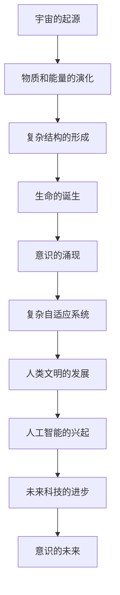
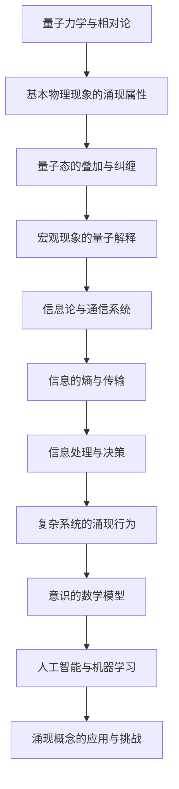

                 

### 第一部分: 意识与宇宙的涌现属性

#### 第1章: 意识的定义与性质

##### 1.1 意识的定义

意识是人类认知与经验的核心组成部分，它通常被描述为主观体验、知觉和自我感知的能力。意识不仅仅是简单的感知，更包含了知觉的整合、情感的体验和意识的流畅性。以下是从不同角度对意识定义的分析：

###### 1.1.1 意识的多维视角

从哲学角度来看，意识是一个复杂且多维的现象，包括感觉、知觉、思考、意愿和情感等多个维度。哲学家笛卡尔提出了著名的“心灵 - 物质二分论”，将意识视为一个独立的实体，与物质世界相对立。

从神经科学角度来看，意识是大脑神经网络复杂交互的结果。这些交互通过大脑的不同区域实现，例如，视觉皮层负责处理视觉信息，运动皮层负责控制运动。

从心理学角度来看，意识是人的心理活动的重要组成部分，它涉及注意、记忆、思维、感知等过程。心理学家詹姆斯提出了“意识流”概念，强调意识是一个连续不断的过程。

###### 1.1.2 意识的本质特征

意识具有以下本质特征：

1. **主观性**：意识是一种主观体验，每个人的意识都是独特的，无法直接测量和客观描述。
2. **动态性**：意识是一个不断变化的过程，它随着时间推移而动态发展。
3. **整合性**：意识将不同的感知、思考和情感整合为一个统一的整体。
4. **自我意识**：意识具有自我感知的能力，能够意识到自己的存在和状态。

##### 1.2 意识的生物学基础

意识的生物学基础涉及大脑的结构和功能。大脑是由数以亿计的神经元组成的复杂网络，这些神经元通过突触连接实现信息传递和处理。

###### 1.2.1 大脑神经元的运作机制

大脑神经元通过电化学信号进行通信。当一个神经元受到刺激时，它会通过神经递质释放信号，使相邻的神经元产生动作电位，从而传递信息。这个过程涉及到多个层次的复杂交互。

###### 1.2.2 意识与神经活动的相关性

研究表明，大脑的不同区域在意识活动中扮演不同角色。例如，前额叶皮层涉及决策和规划，颞叶皮层涉及记忆和情感处理，视觉皮层负责处理视觉信息。这些区域的协同工作是实现意识的基础。

##### 1.3 意识与物质世界的联系

意识的产生和运作与物质世界密切相关。以下是对这一关系的分析：

###### 1.3.1 物质决定论与意识的关系

物质决定论认为，意识是物质世界的产物，大脑的物理过程决定了意识的发生。这一观点得到了神经科学和心理学研究的支持。

###### 1.3.2 意识的物理基础探讨

意识的物理基础涉及到量子力学和生物学等多个领域。目前的研究表明，大脑中的神经元活动与量子现象相关联，这为意识的物理基础提供了新的视角。

总之，意识是一个复杂而多维的现象，它涉及哲学、神经科学、心理学等多个领域。理解意识不仅有助于我们认识自身，也对人工智能、心理学、神经科学等领域的理论发展具有重要意义。

### 第2章: 复杂性与涌现现象

#### 2.1 复杂系统的定义与特征

复杂系统是指由大量相互作用的个体（或组件）组成的系统，这些个体具有复杂的结构和动态行为。复杂系统具有以下特征：

1. **个体多样性**：复杂系统中的个体通常具有多样性，每个个体都有其独特的属性和行为。
2. **非线性交互**：复杂系统中的个体之间的相互作用通常是非线性的，这意味着它们的行为不是简单的因果关系。
3. **涌现行为**：复杂系统整体的行为和特性往往无法从个体的行为和特性中直接推导出来，这种现象被称为涌现现象。
4. **自适应与自组织**：复杂系统具有自适应和自组织的能力，能够在没有外部指令的情况下自主调整和优化其行为。

#### 2.1.1 复杂性的本质

复杂性的本质在于个体之间的相互作用及其产生的整体行为。以下是对复杂性本质的进一步探讨：

1. **层次性**：复杂系统通常具有多个层次，每个层次都包含不同的个体和相互作用。
2. **动态性**：复杂系统的行为通常是动态变化的，受到系统内部和外部环境的影响。
3. **随机性**：复杂系统中存在一定程度的不确定性，这种随机性会影响系统的行为和特性。

#### 2.1.2 复杂系统的分类

复杂系统可以根据不同的标准进行分类，以下是一些常见的分类方式：

1. **自然系统**：如生态系统、气候系统、生物神经网络等。
2. **人工系统**：如计算机网络、经济系统、社会系统等。
3. **混合系统**：既包含自然元素又包含人工元素的系统，如城市生态系统、交通网络等。

##### 2.2 涌现现象的原理与机制

涌现现象是指复杂系统中的整体行为和特性无法从个体的行为和特性中直接推导出来，而是由个体之间的相互作用和复杂交互产生的现象。以下是对涌现现象原理和机制的探讨：

1. **正反馈机制**：正反馈是涌现现象的重要机制之一。正反馈是指系统中的某个因素促进自身增长或加强的过程。正反馈可以导致系统行为的迅速变化和复杂模式的产生。
2. **相变**：相变是物质从一种状态转变为另一种状态的物理过程，如水的冰融化为液态。复杂系统中的相变现象可以导致系统行为的显著变化。
3. **适应性**：复杂系统中的个体通常具有适应性，能够根据环境变化调整自身行为，这种适应性有助于涌现现象的产生。

##### 2.2.1 涌现现象的定义

涌现现象是指复杂系统中的整体行为和特性无法从个体的行为和特性中直接推导出来，而是由个体之间的相互作用和复杂交互产生的现象。涌现现象的关键特征包括：

1. **整体性**：涌现现象强调系统整体的行为和特性，而不是个体的行为和特性。
2. **不可预测性**：由于个体之间的复杂交互，涌现现象往往具有不可预测性。
3. **适应性**：涌现现象能够适应外部环境的变化，这是复杂系统适应性和生存的关键。

##### 2.2.2 涌现现象的数学模型

数学模型是研究涌现现象的重要工具。以下是一些常见的数学模型：

1. **复杂网络模型**：复杂网络模型通过图论方法描述个体之间的相互作用，可以用来模拟复杂系统的涌现现象。
2. **动力系统模型**：动力系统模型通过微分方程或差分方程描述个体之间的相互作用，可以用来分析复杂系统的动态行为。
3. **随机模型**：随机模型通过概率论和统计学方法描述个体之间的随机交互，可以用来研究复杂系统的概率行为和涌现现象。

##### 2.3 意识与涌现现象的联系

意识作为复杂系统的一种特殊现象，与涌现现象有着密切的联系。以下是对意识与涌现现象联系的探讨：

1. **意识的多层次结构**：意识具有多层次结构，从基本的感知觉到复杂的认知过程，这与复杂系统的层次性特征相似。
2. **意识的动态性**：意识是一个动态变化的过程，受到外部刺激和内部心理状态的共同影响，这与复杂系统的动态性特征相似。
3. **意识的适应性**：意识能够根据环境变化调整自身状态，这与复杂系统的适应性特征相似。

总之，复杂性和涌现现象是理解意识的重要视角。通过研究复杂性和涌现现象，我们可以更深入地理解意识的本质和机制，为意识研究提供新的理论和方法。

### 第3章: 物理与信息理论中的涌现概念

#### 3.1 涌现现象在物理学中的体现

在物理学中，涌现现象是一个广泛而深刻的概念，它揭示了宏观现象与微观基础之间的复杂关系。以下是对涌现现象在物理学中体现的讨论：

##### 3.1.1 相对论与量子力学的涌现性质

相对论和量子力学是现代物理学的两大基石，它们各自揭示了物质和能量的不同层面。在相对论中，质量与能量之间的关系（E=mc²）揭示了物质和能量之间的等价性，而量子力学则通过量子态的叠加和纠缠等现象展示了微观粒子的非确定性。

1. **量子态的涌现**：在量子力学中，单个粒子的行为是高度概率性的，但当多个粒子相互作用时，会涌现出新的宏观现象，如量子纠缠和量子计算。量子纠缠表明，两个或多个粒子之间可以存在一种超距作用，这种宏观现象无法通过单个粒子的行为来解释。
2. **相对论时空的涌现**：相对论提出了时空的相对性，即时空不是固定的，而是依赖于观察者的参考系。这一理论揭示了宏观物体的运动和引力现象，如黑洞和宇宙膨胀，这些都是从微观粒子行为中涌现出来的宏观现象。

##### 3.1.2 涌现现象与量子纠缠

量子纠缠是量子力学中的一种特殊现象，两个或多个粒子在量子态上相互关联，即使它们相隔很远，一个粒子的状态变化也会即时影响到另一个粒子的状态。这种非局域性违反了经典物理学的直观预期，但却是量子力学的一个基本特征。

1. **量子纠缠的宏观体现**：量子纠缠不仅在微观尺度上存在，而且可以在宏观尺度上体现。例如，量子隐形传态和量子计算都是基于量子纠缠的宏观应用。这些应用表明，通过量子纠缠，可以实现对信息的超距传输和复杂的计算过程，这些都是传统计算机无法实现的。
2. **量子纠缠与意识的联系**：量子纠缠现象引发了对意识与量子力学关系的探讨。一些理论假设，意识可能源自量子态的复杂交互，这种交互可能导致意识的涌现。这一假设为理解意识的本质提供了一个新的视角。

##### 3.2 信息理论中的涌现概念

信息理论是研究信息传输、处理和存储的数学框架，它为理解涌现现象提供了重要的工具。以下是对信息理论中涌现概念的讨论：

##### 3.2.1 信息论的基本原理

信息论由香农创立，它研究如何在有噪声的信道中有效传输信息。香农的信息熵概念揭示了信息的不确定性和信息的量化方法。信息论的基本原理包括：

1. **信息熵**：信息熵是衡量信息不确定性的量度，它表示信息源的平均信息含量。高熵表示信息的不确定性大，低熵表示信息的不确定性小。
2. **信道容量**：信道容量是信道能够无误差传输信息的最大速率。香农的信道容量公式为C = B * log₂(1 + S/N)，其中B是信道的带宽，S是信号功率，N是噪声功率。

##### 3.2.2 意识与信息的涌现

意识的涌现可以看作是信息处理的结果。在信息理论中，意识可以被视为一个复杂的信息处理系统，它从外部环境中接收信息，并通过大脑的神经网络进行处理和整合。

1. **感知信息的涌现**：当人类感知外部环境时，视觉、听觉、触觉等感官系统接收到的信息会通过大脑进行处理和整合，形成对环境的感知。这种感知的涌现是大脑神经网络对信息的复杂处理的体现。
2. **认知信息的涌现**：认知过程是意识的核心，它包括记忆、思考、决策等。这些认知过程是大脑对信息进行复杂处理的结果，从而涌现出对世界的理解和认知。

##### 3.2.3 意识与信息的涌现模型

一些信息理论模型试图解释意识的涌现现象。例如，人工神经网络（ANN）是一种模拟人脑神经网络结构的计算模型，它可以用于模拟意识的某些特征。

1. **人工神经网络与意识**：人工神经网络通过多层神经元之间的相互作用进行信息处理。在网络训练过程中，神经元之间的权重和连接会不断调整，最终形成一个能够对输入信息进行复杂处理和整合的网络结构。这种结构类似于人脑神经网络的处理过程，可以被视为意识涌现的一种模拟。

2. **深度学习与意识**：深度学习是一种基于多层神经网络的人工智能技术，它通过多层非线性变换对输入数据进行处理。深度学习模型在图像识别、语音识别和自然语言处理等领域取得了显著的成果，这表明深度学习模型具有处理复杂信息的能力，类似于意识的涌现过程。

总之，物理与信息理论中的涌现概念为理解意识的本质提供了新的视角。通过研究量子纠缠和信息论中的涌现现象，我们可以更深入地探讨意识的本质和机制，为意识研究提供新的理论和方法。

#### 3.3 意识的数学模型与模拟

##### 3.3.1 意识与概率论的关系

概率论是研究随机事件和不确定性的数学工具，它在意识研究中有着重要的应用。以下是对意识与概率论关系的讨论：

1. **感知概率**：人类的感知过程往往涉及概率估计。例如，当我们看到一只猫时，我们通过视觉信息对其身份进行概率估计。这种感知概率的估计过程可以看作是大脑对信息的概率处理。
   
2. **决策过程**：在决策过程中，人类常常需要权衡不同的选择，并对其后果进行概率评估。概率论为决策提供了量化工具，帮助我们理解意识中的决策过程。

3. **信息处理概率**：大脑的信息处理过程也涉及概率。例如，当大脑处理语言信息时，它需要对词汇和句子的概率分布进行计算，以便理解语言的意义。

##### 3.3.2 意识的图模型

图模型是一种用于表示复杂系统的数学工具，它在意识研究中有着广泛的应用。以下是对意识的图模型讨论：

1. **神经网络图模型**：神经网络是一种基于图模型的计算模型，它通过节点和边的连接模拟大脑神经元之间的相互作用。神经网络图模型可以用于模拟意识的某些特征，如感知、记忆和思考。

2. **大脑图谱**：大脑图谱是一种基于图模型的大脑结构表示方法。通过绘制大脑不同区域的连接关系，大脑图谱可以帮助我们理解大脑的功能结构和信息流。

3. **认知图谱**：认知图谱是一种基于图模型的认知过程表示方法。它通过节点和边表示认知过程中的不同元素和它们之间的关系，帮助我们理解意识的动态变化过程。

##### 3.3.3 人工神经网络在意识模拟中的应用

人工神经网络（ANN）是一种模拟人脑神经元之间相互作用的计算模型，它在意识模拟中有着重要的应用。以下是对人工神经网络在意识模拟中的应用讨论：

1. **感知模拟**：人工神经网络可以用于模拟视觉、听觉和触觉等感知过程。例如，卷积神经网络（CNN）在图像识别任务中取得了显著的成果，这表明人工神经网络能够处理复杂的信息并产生类似的感知体验。

2. **记忆模拟**：人工神经网络可以用于模拟大脑的记忆功能。例如，循环神经网络（RNN）和时间卷积网络（TCN）在序列数据处理任务中表现出色，这表明人工神经网络能够处理和时间相关的记忆信息。

3. **思考模拟**：人工神经网络可以用于模拟人类的思考过程。例如，生成对抗网络（GAN）在生成逼真的图像和文本方面取得了显著成果，这表明人工神经网络能够处理复杂的认知任务。

##### 3.3.4 意识模拟的常见算法

在意识模拟中，常用的算法包括：

1. **深度学习算法**：深度学习算法，如卷积神经网络（CNN）、循环神经网络（RNN）和生成对抗网络（GAN），在意识模拟中有着广泛的应用。这些算法通过多层非线性变换对输入数据进行处理，能够模拟复杂的信息处理过程。

2. **概率图模型**：概率图模型，如贝叶斯网络和马尔可夫网络，在意识模拟中也得到广泛应用。这些模型通过节点和边的概率关系描述系统的状态转移和依赖关系，能够帮助理解意识的动态变化。

3. **混合算法**：混合算法将深度学习和概率图模型相结合，能够更好地模拟意识的复杂特征。例如，深度贝叶斯网络（DBN）将深度学习的强大计算能力和贝叶斯网络的概率推理能力结合起来，为意识模拟提供了新的思路。

##### 3.3.5 意识模拟的案例分析

以下是意识模拟的一些实际案例：

1. **视觉感知模拟**：深度学习模型，如卷积神经网络（CNN），在图像识别任务中取得了显著成果。例如，ResNet和VGG模型在ImageNet图像识别挑战中取得了优异的成绩，这表明深度学习模型能够模拟视觉感知过程。

2. **记忆模拟**：循环神经网络（RNN）和时间卷积网络（TCN）在序列数据处理任务中表现出色。例如，LSTM和GRU模型在语音识别和自然语言处理任务中取得了良好的效果，这表明人工神经网络能够模拟记忆过程。

3. **思考模拟**：生成对抗网络（GAN）在生成逼真的图像和文本方面取得了显著成果。例如，DCGAN和StyleGAN模型在生成高质量图像方面取得了突破性进展，这表明人工神经网络能够模拟复杂的思考过程。

##### 3.3.6 意识模拟的未来发展趋势

意识模拟的未来发展趋势包括：

1. **更高层次的模拟**：随着计算能力和算法的进步，意识模拟将能够模拟更高层次的心理过程，如情感、意识和自我意识。

2. **跨学科整合**：意识模拟将融合生物学、心理学和计算机科学等多个领域的知识，为理解意识的本质提供新的视角。

3. **个性化模拟**：通过整合个人数据和个性化模型，意识模拟将能够模拟不同个体的心理过程，为个性化认知支持和治疗提供新的途径。

总之，意识的数学模型与模拟为理解意识的本质和机制提供了新的方法。通过研究概率论、图模型和人工神经网络，我们可以更深入地探讨意识的复杂特征，为意识研究提供新的理论和方法。

### 第4章: 意识与复杂自适应系统

#### 4.1 复杂自适应系统的基本概念

复杂自适应系统（Complex Adaptive Systems，CAS）是指由大量相互作用的个体组成的系统，这些个体能够在不断变化的环境中自主适应和进化。以下是对复杂自适应系统基本概念的详细讨论：

##### 4.1.1 自适应机制与复杂性

自适应机制是指系统能够根据外部环境的变化调整自身行为的能力。在复杂自适应系统中，自适应机制尤为重要，因为系统中的个体不仅能够独立适应环境，还能够通过协作和互动形成复杂的整体行为。

复杂性是复杂自适应系统的核心特征之一。复杂性体现在以下几个方面：

1. **个体多样性**：复杂自适应系统中的个体具有多样性，每个个体都有其独特的属性和行为模式。这种多样性使得系统具有丰富的功能和适应能力。

2. **非线性交互**：复杂自适应系统中的个体之间通常存在非线性相互作用。非线性交互意味着个体之间的互动不是简单的因果关系，而是通过复杂的反馈机制相互作用，从而导致系统的复杂行为。

3. **涌现行为**：复杂自适应系统整体的行为和特性往往无法从个体的行为和特性中直接推导出来。这种现象被称为涌现现象。涌现行为是复杂自适应系统的一个重要特征，它使得系统能够表现出超出个体能力的复杂行为。

##### 4.1.2 复杂自适应系统的结构

复杂自适应系统的结构通常包括以下几个层次：

1. **个体层次**：这是系统的最基本层次，包括个体（如生物个体、经济实体、社会个体等）。每个个体都有其独特的属性和行为模式。

2. **交互层次**：这是个体之间的相互作用层次，个体通过直接或间接的交互影响彼此的行为。这种交互可以是竞争、合作或共生等。

3. **系统层次**：这是系统的整体层次，包括系统的整体行为和特性。系统层次的行为和特性是由个体层次和交互层次共同决定的。

4. **环境层次**：这是系统外部环境的层次，包括系统所处的物理环境、社会环境等。环境层次对系统的行为和特性有着重要的影响。

##### 4.2 意识与复杂自适应系统的相互作用

意识与复杂自适应系统之间存在着密切的相互作用。以下是对这一相互作用的详细讨论：

##### 4.2.1 意识在复杂自适应系统中的角色

意识在复杂自适应系统中扮演着多种角色，包括：

1. **决策与规划**：意识能够使个体在复杂环境中进行决策和规划。通过感知和思考，个体能够分析环境信息，制定适应策略，从而实现自我优化。

2. **认知与记忆**：意识涉及认知过程，如注意、记忆和思维。这些认知过程使得个体能够从经验中学习，并在未来重复成功的行为。

3. **社会互动**：意识使个体能够进行社会互动，如交流、合作和竞争。这种社会互动有助于个体在复杂自适应系统中获得更多的资源和机会。

##### 4.2.2 复杂自适应系统对意识的影响

复杂自适应系统对意识的影响体现在以下几个方面：

1. **环境适应性**：复杂自适应系统能够使个体适应不断变化的环境。这种适应性是通过个体之间的互动和系统的涌现行为实现的，从而影响个体的意识和行为。

2. **社会与文化**：复杂自适应系统的社会和文化环境对个体的意识有着深远的影响。社会和文化价值观、规范和行为模式会影响个体的认知和意识。

3. **进化与学习**：复杂自适应系统能够通过学习和进化优化个体的意识和行为。这种优化过程涉及个体之间的互动和系统的整体适应性。

##### 4.3 意识的演化与复杂自适应系统

意识的演化和复杂自适应系统密切相关。以下是对这一关系的详细讨论：

##### 4.3.1 意识的起源与演化

意识的起源是一个长期而复杂的过程，它与生物进化密切相关。以下是一些关于意识起源和演化的假设：

1. **生物进化**：意识可能起源于生物进化过程中的适应性需求。随着生物体复杂性的增加，对环境信息的感知和处理能力变得至关重要，从而促进了意识的发展。

2. **神经系统的发展**：神经系统的发展是意识演化的关键因素。随着神经元的增加和复杂化，大脑的感知、认知和决策能力逐渐提升，从而促进了意识的发展。

3. **社会互动**：社会互动是意识演化的重要推动力。通过社会互动，个体能够分享经验、学习和协作，从而提高了对环境的适应能力，促进了意识的发展。

##### 4.3.2 复杂自适应系统中的意识进化

在复杂自适应系统中，意识进化是一个不断进行的过程。以下是一些关于意识进化的观点：

1. **遗传与变异**：意识进化涉及遗传和变异。遗传使得个体的意识特征得以传承，变异则引入了新的意识特征，从而推动了意识进化。

2. **自然选择**：自然选择是意识进化的重要机制。那些有助于个体适应环境的意识特征会被选择和保留，而那些不利于适应的特征则被淘汰。

3. **文化进化**：文化进化是意识进化的重要组成部分。通过社会互动和知识共享，文化价值观、规范和行为模式会逐渐演变，从而影响个体的意识和行为。

总之，意识与复杂自适应系统之间存在着密切的相互作用。通过理解意识与复杂自适应系统的关系，我们可以更深入地探讨意识的本质和演化过程，为人工智能、心理学和神经科学等领域提供新的理论和方法。

### 第5章: 意识的数学模型与模拟

#### 5.1 意识的数学模型

意识的数学模型是一种尝试通过数学语言描述和理解意识的框架。以下是对几种常见意识数学模型的讨论：

##### 5.1.1 意识与概率论的关系

概率论在意识研究中扮演了重要角色，因为它为处理不确定性和随机性提供了工具。以下是对意识与概率论关系的讨论：

1. **感知概率估计**：人类在感知过程中需要对事件发生的概率进行估计。例如，当我们看到一只猫的照片时，我们可能需要估计这张照片中猫的存在概率。概率论提供了量化这种估计的方法。

2. **决策中的概率推理**：在决策过程中，个体需要考虑各种可能的结果及其概率。概率论帮助个体在不确定性环境中做出最优选择。

3. **信息处理概率模型**：大脑在进行信息处理时，可能依赖于概率模型来处理复杂的信息流。例如，大脑在处理语言时，可能使用概率模型来预测下一个单词。

##### 5.1.2 意识的图模型

图模型是描述复杂网络结构和相互作用的数学工具，它在意识研究中得到了广泛应用。以下是对意识的图模型讨论：

1. **神经网络图模型**：神经网络可以被视为一种图模型，其中节点代表神经元，边代表神经元之间的连接。神经网络图模型可以用于模拟大脑中神经元网络的动态交互。

2. **大脑图谱**：大脑图谱是一种基于图模型的大脑结构表示方法，它描述了大脑不同区域之间的连接关系。大脑图谱可以帮助我们理解大脑的功能结构和信息流。

3. **认知图谱**：认知图谱是一种基于图模型的认知过程表示方法，它描述了认知过程中的不同元素及其关系。认知图谱可以帮助我们理解意识的动态变化过程。

##### 5.1.3 意识的图模型应用实例

以下是一些意识的图模型应用实例：

1. **大脑连接图谱**：通过功能性磁共振成像（fMRI）技术，研究人员可以绘制大脑不同区域之间的连接图谱。这些图谱揭示了大脑在处理信息时的功能模块化和网络结构。

2. **社会网络分析**：在社会网络中，个体的行为和互动可以通过图模型进行描述。例如，研究社交网络中的信息传播和决策过程，可以揭示社会意识的形成和传播机制。

3. **复杂系统中的图模型**：在经济学、生态学和交通系统中，图模型可以用于描述个体之间的相互作用和网络结构。这些模型可以帮助我们理解复杂系统的行为和涌现现象。

##### 5.1.4 意识的图模型挑战

尽管图模型在意识研究中取得了显著成果，但仍面临一些挑战：

1. **高维度数据**：大脑和认知过程涉及大量高维度数据，如何有效地处理和分析这些数据是一个挑战。

2. **动态性**：大脑和认知过程是动态变化的，如何捕捉和模拟这种动态性是一个难题。

3. **个体与整体的关系**：在图模型中，如何平衡个体和整体的关系，使模型既能捕捉个体的复杂性，又能反映整体的涌现现象，是一个挑战。

#### 5.2 意识模拟的算法与方法

意识的模拟是通过计算机算法模拟大脑和认知过程，以揭示意识的本质和机制。以下是对几种常见意识模拟算法和方法的讨论：

##### 5.2.1 人工神经网络在意识模拟中的应用

人工神经网络（ANN）是模拟大脑和意识的重要工具，以下是对ANN在意识模拟中的应用讨论：

1. **感知模拟**：ANN可以用于模拟视觉、听觉和触觉等感知过程。例如，卷积神经网络（CNN）在图像识别和语音识别中取得了显著成果。

2. **记忆模拟**：循环神经网络（RNN）和长短期记忆网络（LSTM）可以用于模拟大脑的记忆功能。这些模型在序列数据处理和语言建模中表现出色。

3. **思考模拟**：生成对抗网络（GAN）和变分自编码器（VAE）可以用于模拟复杂的认知过程，如想象和创造力。

##### 5.2.2 意识模拟的常见算法

以下是一些在意识模拟中常用的算法：

1. **深度学习算法**：深度学习算法，如卷积神经网络（CNN）、循环神经网络（RNN）和生成对抗网络（GAN），在意识模拟中有着广泛的应用。

2. **概率图模型**：概率图模型，如贝叶斯网络和马尔可夫网络，可以用于模拟大脑中的概率推理和决策过程。

3. **混合算法**：混合算法，如深度贝叶斯网络（DBN），将深度学习和概率图模型结合起来，可以更好地模拟意识的复杂特征。

##### 5.2.3 意识模拟的案例分析

以下是一些意识模拟的案例分析：

1. **视觉感知模拟**：通过深度学习模型，如卷积神经网络（CNN），研究人员模拟了人类的视觉感知过程。这些模型在图像分类和目标检测任务中取得了优异的性能。

2. **记忆模拟**：通过循环神经网络（RNN）和长短期记忆网络（LSTM），研究人员模拟了大脑的记忆功能。这些模型在语音识别和语言建模任务中表现出色。

3. **思考模拟**：通过生成对抗网络（GAN）和变分自编码器（VAE），研究人员模拟了复杂的认知过程，如想象和创造力。这些模型在生成逼真的图像和文本方面取得了显著成果。

##### 5.2.4 意识模拟的未来发展趋势

意识模拟的未来发展趋势包括：

1. **更高层次的模拟**：随着计算能力和算法的进步，意识模拟将能够模拟更高层次的心理过程，如情感、意识和自我意识。

2. **跨学科整合**：意识模拟将融合生物学、心理学和计算机科学等多个领域的知识，为理解意识的本质提供新的视角。

3. **个性化模拟**：通过整合个人数据和个性化模型，意识模拟将能够模拟不同个体的心理过程，为个性化认知支持和治疗提供新的途径。

总之，意识的数学模型与模拟为理解意识的本质和机制提供了新的方法。通过研究概率论、图模型和人工神经网络，我们可以更深入地探讨意识的复杂特征，为意识研究提供新的理论和方法。

### 第6章: 意识与量子力学

#### 6.1 量子力学的核心概念

量子力学是研究物质和能量在微观尺度上行为的物理学分支。它的核心概念包括量子态、叠加原理和量子纠缠，这些概念为理解意识与量子力学的关系提供了基础。

##### 6.1.1 量子态与叠加原理

量子态是量子力学中描述粒子状态的数学函数。一个量子态可以同时处于多种状态的叠加，而不是经典物理中确定的状态。叠加原理表明，一个量子系统可以同时处于多个状态的组合，这种组合在测量时会以一定的概率坍缩为某个具体的状态。

##### 6.1.2 量子纠缠与量子信息

量子纠缠是量子力学中的一种特殊现象，当两个或多个粒子发生纠缠时，它们的量子态将不可分割地联系在一起，即使它们相隔很远，一个粒子的状态变化也会即时影响到另一个粒子的状态。量子纠缠为量子信息的传输和计算提供了新的可能性。

量子信息是量子力学在信息科学中的应用，它利用量子态的叠加和纠缠特性实现高效的通信和计算。量子通信利用量子纠缠实现信息的安全传输，而量子计算利用量子态的叠加和纠缠实现并行计算。

##### 6.1.3 意识与量子态的潜在联系

意识的产生和维持可能涉及量子现象。一些理论假设，大脑中的神经元和神经元之间的连接可能通过量子效应实现高效的信息处理。以下是对意识与量子态潜在联系的讨论：

1. **量子计算与大脑信息处理**：大脑中的神经元和神经元之间的连接可能通过量子计算机制实现高效的信息处理。量子计算能够处理复杂的信息流，这可能是大脑处理意识信息的基础。

2. **量子态的整合**：意识可能源自大脑中量子态的整合。量子态的叠加和纠缠特性使得大脑能够整合来自不同感官的信息，形成一个统一的意识体验。

##### 6.1.4 量子力学在意识研究中的应用

量子力学在意识研究中的应用主要是探索量子现象如何影响大脑的功能和意识体验。以下是对量子力学在意识研究中的应用讨论：

1. **量子生物学**：量子生物学研究量子现象在生物系统中的应用，包括大脑中的神经元活动。一些研究表明，神经元中的离子通道可能通过量子效应实现高效的信息传递。

2. **量子认知科学**：量子认知科学研究意识与量子现象的关系，探索量子效应如何影响认知过程。例如，量子纠缠可能影响大脑中的记忆和决策过程。

3. **量子心理学**：量子心理学试图将量子力学的概念应用于心理学研究，探索量子现象如何影响人类的意识体验和认知行为。

##### 6.1.5 量子力学与意识的争议

尽管量子力学在意识研究中提供了一些新的视角，但这一领域仍然存在争议。以下是对量子力学与意识争议的讨论：

1. **量子意识论**：一些科学家和哲学家认为，意识可能源自量子效应，这被称为量子意识论。量子意识论认为，量子现象在大脑中发挥着核心作用，是意识产生的基础。

2. **物理主义**：另一些科学家和哲学家则认为，意识是大脑物理过程的产物，量子现象并不是意识产生的关键因素。物理主义认为，所有心理现象都可以通过物理过程来解释。

3. **神经科学观点**：神经科学家通常更关注大脑的神经过程如何产生意识，而较少关注量子效应。尽管一些神经科学家对量子力学在意识研究中的应用表示兴趣，但他们认为量子现象可能只是大脑复杂过程中的一个方面。

总之，量子力学与意识的关系是一个复杂且充满争议的问题。通过探索量子现象在意识中的作用，我们可以更深入地理解意识的本质和机制，为意识研究提供新的理论和方法。

### 第7章: 意识与宇宙演化

#### 7.1 宇宙演化的基本理论

宇宙演化是指宇宙从大爆炸至今的发展历程。宇宙演化的基本理论包括大爆炸理论和宇宙膨胀理论，这些理论为我们理解宇宙的起源、结构和未来提供了框架。

##### 7.1.1 大爆炸理论与宇宙膨胀

大爆炸理论是描述宇宙起源和演化的重要理论。根据这一理论，宇宙起源于一个极热、极密的状态，随后经历迅速膨胀，逐渐形成了现在的宇宙结构。宇宙膨胀理论进一步描述了宇宙从大爆炸后的膨胀过程，指出宇宙的膨胀速度在不断增加。

1. **大爆炸理论**：大爆炸理论认为，宇宙起源于一个极热、极密的状态，称为原始奇点。在大爆炸发生后，宇宙迅速膨胀，物质和能量逐渐分布到整个宇宙。这一理论得到了观测数据的支持，如宇宙微波背景辐射的发现。

2. **宇宙膨胀**：宇宙膨胀是指宇宙从大爆炸后不断膨胀的过程。宇宙膨胀理论指出，宇宙的膨胀速度在不断增加，这被称为宇宙加速膨胀。宇宙加速膨胀可能是由于暗能量的存在，暗能量是一种具有负压强的能量形式，推动宇宙加速膨胀。

##### 7.1.2 黑洞与暗物质

宇宙演化过程中，黑洞和暗物质是两个关键概念。

1. **黑洞**：黑洞是宇宙中的一种极端天体，具有强大的引力，甚至连光也无法逃逸。黑洞的形成通常是通过恒星演化的最后阶段，大质量恒星耗尽其核燃料后塌缩形成的。黑洞的存在对宇宙演化有着重要影响，它们通过吞噬周围的物质和辐射影响宇宙的演化和结构。

2. **暗物质**：暗物质是一种不发光、不吸收光的物质，占据宇宙总质量的绝大部分。暗物质的本质和成分尚不完全清楚，但它们对宇宙演化有着重要影响。暗物质通过引力作用，影响宇宙的大尺度结构和星系的形成。

##### 7.1.3 意识在宇宙演化中的地位

意识作为宇宙演化的产物，在宇宙演化中占有重要地位。以下是对意识在宇宙演化中地位的讨论：

1. **宇宙演化的目的**：一些哲学家和科学家认为，宇宙演化的最终目标是产生意识。意识的出现标志着宇宙从无序到有序的转变，是宇宙演化的一个重要里程碑。

2. **意识的起源**：意识的起源是一个复杂的生物学和物理学问题。一些理论认为，意识可能起源于大脑的生物过程，而另一些理论则认为，意识与量子现象有关。无论哪种观点，意识的起源都涉及到宇宙演化的深层次机制。

3. **意识的进化**：随着宇宙的演化，意识也在不断进化。从简单的生物感知到复杂的认知能力，意识的进化是宇宙演化的重要组成部分。

##### 7.1.4 宇宙演化对意识的影响

宇宙演化对意识的影响体现在多个方面：

1. **环境适应性**：宇宙演化的环境变化，如温度、氧气含量等，对生物的适应和进化有着重要影响。这些环境变化也影响了意识的进化，使得生物能够更好地适应复杂的环境。

2. **社会互动**：宇宙演化的过程中，生物之间的互动和协作促进了社会结构的发展。这种社会互动不仅促进了生物的进化，也促进了意识的进化。

3. **技术发展**：随着宇宙演化的进展，人类的技术发展取得了巨大的进步。技术的发展不仅改变了人类的生活方式，也改变了人类的意识结构，使得人类能够更好地理解和改变宇宙。

##### 7.1.5 意识与宇宙未来的可能性

随着宇宙的演化，意识的未来也充满了可能性。以下是对意识与宇宙未来可能性的讨论：

1. **意识扩展**：随着技术的发展，人类可能能够扩展意识，使其超越生物体的限制。例如，通过脑机接口技术，人类可能能够将意识传输到计算机或其他设备中。

2. **意识进化**：随着宇宙的演化，意识也可能不断进化，产生新的形式和功能。例如，人工智能可能成为新的意识形式，与人类意识共同推动宇宙的演化。

3. **宇宙共生**：意识与宇宙的共生关系可能在未来得到进一步加强。人类可能通过理解和利用宇宙演化的规律，实现与宇宙的和谐共生。

总之，宇宙演化与意识之间存在着紧密的联系。通过理解宇宙演化的基本理论，我们可以更深入地探讨意识的本质和机制，为意识研究提供新的视角和理论框架。

### 第8章: 意识与社会科学

#### 8.1 意识与社会科学的研究方法

意识是社会科学研究的核心议题之一，涵盖了心理学、社会学、哲学等多个领域。研究意识需要采用多种方法和工具，以下是对意识与社会科学研究方法的详细讨论：

##### 8.1.1 心理学与意识研究

心理学是研究意识的重要学科，通过实验、观察和理论构建来探讨意识的本质和机制。以下是一些常见的心理学研究方法：

1. **实验心理学**：实验心理学通过控制变量的方法，研究意识现象的因果关系。例如，通过双盲实验，心理学家可以研究药物对意识状态的影响。

2. **认知心理学**：认知心理学关注意识过程中的认知过程，如记忆、注意、思考和决策。认知心理学家通常使用行为实验和脑成像技术，如fMRI，来研究这些过程。

3. **神经心理学**：神经心理学研究大脑与意识之间的关系，通过分析大脑损伤或疾病的症状，推断意识的不同方面。例如，通过研究中风患者或癫痫患者，神经心理学家可以揭示意识的不同功能区域。

##### 8.1.2 社会学与意识研究

社会学是研究社会结构和社会互动的学科，社会学家通过调查、分析和理论构建来探讨意识在社会中的作用。以下是一些常见的社会学研究方法：

1. **调查与问卷**：社会学家通过问卷调查收集大量数据，研究社会成员对特定问题的意识和态度。这种方法可以揭示社会意识的分布和变化趋势。

2. **社会观察**：社会观察是通过直接观察社会现象来研究意识的方法。社会学家可以在自然环境下观察人们的行为和互动，了解意识在社会生活中的体现。

3. **社会网络分析**：社会网络分析是一种研究社会结构和关系的数学方法，它通过分析个体之间的互动关系，揭示社会意识的传播和影响机制。

##### 8.1.3 哲学与意识研究

哲学是探讨意识和现实本质的基本学科，哲学家通过逻辑推理和概念分析来探讨意识的本质和意义。以下是一些常见的哲学研究方法：

1. **辩证法**：辩证法是一种通过分析矛盾和冲突来理解现实的方法。哲学家使用辩证法探讨意识的矛盾性，如意识的主观性与客观性之间的冲突。

2. **现象学**：现象学是一种通过直接体验和描述意识现象的方法。哲学家使用现象学分析意识的结构和动态变化，试图揭示意识的本质。

3. **语义学**：语义学研究意识的含义和表达方式，通过分析语言的逻辑结构来理解意识的概念和意义。

##### 8.1.4 案例分析

以下是一些意识研究的社会科学案例分析：

1. **群体意识与行为**：心理学家通过群体实验研究群体意识对个体行为的影响。例如，社会心理学家通过模拟群体决策情境，发现群体压力如何影响个体的判断和行为。

2. **文化意识与社会认同**：社会学家通过跨文化研究，探讨不同文化背景下人们的意识和价值观。例如，社会学家发现，文化差异会影响人们对自我认同和社会角色的认知。

3. **意识与政治行为**：政治学家通过调查和分析政治参与行为，研究意识如何影响个体的政治行为。例如，政治学家发现，政治宣传和信息传播可以改变公众的政治意识，从而影响选举结果。

总之，意识与社会科学的研究方法多样且互补。通过结合心理学、社会学和哲学的方法，我们可以更深入地探讨意识的本质和机制，为理解人类行为和社会现象提供新的视角和理论框架。

#### 8.2 意识与社会现象的联系

意识与社会现象之间存在着密切的联系，这种联系体现在个体的行为、社会结构和文化现象中。以下是对意识与社会现象联系的详细讨论：

##### 8.2.1 意识对社会行为的影响

意识是社会行为的心理基础，它影响个体的认知、情感和行动。以下是对意识如何影响社会行为的讨论：

1. **认知行为**：意识影响个体的认知过程，包括知觉、判断和决策。例如，在决策过程中，个体的意识状态会影响他们对信息的处理和选择。积极的意识状态可能导致更加理性和果断的决策，而消极的意识状态可能导致犹豫和不确定性。

2. **情感表达**：意识影响个体的情感表达和行为。例如，在社交互动中，个体的意识状态会影响他们的情绪表达和情感反应。积极的意识状态可能导致更多的社交互动和正面情绪，而消极的意识状态可能导致社交回避和负面情绪。

3. **社会规范遵守**：意识影响个体对社会责任和规范的遵守。例如，在遵守社会规范时，个体的意识状态会影响他们的行为选择。强烈的意识状态可能导致更加积极的社会规范遵守，而淡漠的意识状态可能导致规范违反。

##### 8.2.2 社会意识与社会发展

社会意识是指一个社会中普遍存在的价值观、信念和态度。社会意识对社会发展有着深远的影响。以下是对社会意识如何影响社会发展的讨论：

1. **社会结构**：社会意识影响社会结构的发展。例如，在封建社会中，社会意识强调等级和权威，导致社会结构的固化。而在现代社会中，社会意识强调平等和自由，促进了社会结构的变革。

2. **文化传承**：社会意识影响文化的传承和发展。例如，在一个重视传统和历史的社区中，社会意识可能导致文化的保守传承。而在一个强调创新和进步的社区中，社会意识可能导致文化的不断变革和进化。

3. **社会运动**：社会意识是社会运动的重要驱动力。例如，民权运动和女性权益运动都是在特定的社会意识背景下兴起的。社会意识的变化和觉醒往往引发社会运动，推动社会的进步和变革。

##### 8.2.3 意识与社会冲突

社会冲突是社会发展中的一个普遍现象，意识在社会冲突中扮演着重要角色。以下是对意识如何影响社会冲突的讨论：

1. **认知冲突**：意识冲突是社会冲突的根源之一。当个体的意识与社会意识发生冲突时，可能导致认知上的矛盾和冲突。例如，在一个强调集体主义的社区中，个体追求个人利益可能会引起社会冲突。

2. **情感冲突**：意识冲突不仅体现在认知上，还体现在情感上。当个体的情感与社会意识发生冲突时，可能导致情感上的矛盾和冲突。例如，在一个强调传统家庭价值观的社区中，个体的非传统生活方式可能会引起情感上的冲突。

3. **行动冲突**：意识冲突最终可能导致行动上的冲突。当个体的意识与社会意识发生冲突时，他们可能会采取反对或反抗的行动。例如，在一个强调权威和服从的社区中，个体的反抗行为可能会引发社会冲突。

##### 8.2.4 社会意识与社会稳定

社会意识对社会稳定有着重要影响。以下是对社会意识如何影响社会稳定的讨论：

1. **社会认同**：社会意识影响个体的社会认同。当个体的意识与社会意识一致时，他们更容易产生社会认同感，从而促进社会稳定。例如，在一个强调国家利益的社会中，个体的意识与社会意识一致，可能导致社会的凝聚力增强。

2. **社会控制**：社会意识影响社会控制机制的有效性。当个体的意识与社会意识一致时，社会控制机制更容易发挥作用，从而促进社会稳定。例如，在一个强调法治和公正的社会中，个体的意识与社会意识一致，可能导致社会的秩序和稳定。

3. **社会变革**：社会意识也影响社会变革的过程。当社会意识发生变化时，社会结构和制度也可能会随之调整，以适应新的社会意识。这种变革可能是稳定发展的动力，也可能是社会动荡的诱因。

总之，意识与社会现象之间存在着紧密的联系。通过理解意识对社会行为、社会结构和社会冲突的影响，我们可以更好地理解社会的发展和变迁。社会意识的研究为社会科学提供了重要的理论和方法，也为解决社会问题提供了新的思路。

#### 8.3 意识在社会科学中的前景

意识在社会科学中的研究前景广阔，涉及跨学科的研究方法和新兴的研究方向。以下是对意识在社会科学中的前景的讨论：

##### 8.3.1 意识研究的未来方向

1. **跨学科整合**：未来的意识研究将更加注重跨学科的整合，结合心理学、神经科学、计算机科学和社会科学等多学科的知识，以全面理解意识的本质和机制。

2. **大数据分析**：随着大数据技术的发展，意识研究将受益于大规模数据分析和机器学习技术。通过对大量行为数据和脑成像数据的分析，研究者可以揭示意识现象的复杂模式和规律。

3. **人工智能模拟**：人工智能和机器学习技术的进步将有助于模拟和理解意识过程。通过开发复杂的人工神经网络模型，研究者可以模拟人类大脑的信息处理过程，探索意识的涌现机制。

##### 8.3.2 意识对社会科学的贡献

1. **社会行为预测**：意识研究有助于预测和理解社会行为。例如，通过分析个体的意识和态度，社会科学家可以预测选举结果、社会运动和社会变革的趋势。

2. **公共政策制定**：意识研究为社会政策制定提供了重要的理论依据。例如，了解公众的意识状态和社会态度可以帮助政府制定更有效和符合公众意愿的政策。

3. **文化传承与创新**：意识研究有助于理解和促进文化传承与创新。通过分析不同文化背景下人们的意识，社会科学家可以推动文化多样性的保护和创新。

##### 8.3.3 意识研究的挑战

1. **方法论的挑战**：意识研究面临方法论上的挑战，如如何准确测量和量化意识，如何整合不同学科的研究成果等。

2. **技术限制**：脑成像技术和神经科学技术的进步虽然为意识研究提供了新的工具，但仍然存在技术限制，如数据获取的难度和解释的复杂性。

3. **伦理问题**：意识研究涉及伦理问题，如隐私保护、数据安全和个人权益等。未来的研究需要制定严格的伦理规范，确保研究过程中的道德合规性。

总之，意识在社会科学中的研究前景充满希望，同时也面临着诸多挑战。通过跨学科整合、大数据分析和人工智能模拟等新兴方法，意识研究将为社会科学提供新的理论框架和实际应用，为解决复杂的社会问题提供有力的支持。

### 第9章: 意识与人工智能

#### 9.1 人工智能的基本原理

人工智能（Artificial Intelligence，AI）是一门研究如何构建能够执行人类智能任务的计算机系统的学科。以下是对人工智能的基本原理的详细讨论：

##### 9.1.1 机器学习与神经网络

机器学习是人工智能的核心技术之一，它使计算机系统能够从数据中学习和改进性能。机器学习主要分为监督学习、无监督学习和强化学习三种类型：

1. **监督学习**：在监督学习中，系统通过训练数据集学习输入和输出之间的关系。常用的监督学习算法包括线性回归、逻辑回归、支持向量机和决策树等。

2. **无监督学习**：无监督学习是指系统在没有标签数据的条件下，自动发现数据中的模式和结构。常见的无监督学习算法包括聚类算法（如K-means、DBSCAN）和降维算法（如PCA、t-SNE）。

3. **强化学习**：强化学习是一种通过奖励和惩罚信号指导系统学习最优策略的方法。系统通过不断尝试和反馈，逐步优化其行为。常用的强化学习算法包括Q-学习、深度Q网络（DQN）和策略梯度算法等。

神经网络（Neural Networks）是模拟人脑神经元之间相互连接和通信的计算模型。神经网络的基本组成部分包括：

1. **神经元**：神经元是神经网络的基本单元，通过激活函数对输入数据进行处理。

2. **层**：神经网络通常包括输入层、隐藏层和输出层。输入层接收外部数据，隐藏层对数据进行加工，输出层生成预测或决策。

3. **权重和偏置**：神经网络中的权重和偏置是连接不同神经元的参数，通过反向传播算法调整，以优化网络性能。

##### 9.1.2 人工智能的发展历程

人工智能的发展历程可以分为以下几个阶段：

1. **早期探索（1950s-1960s）**：人工智能的早期探索主要集中在符号推理和逻辑推理上。1956年，达特茅斯会议标志着人工智能正式成为一个研究领域。

2. **知识表示和推理（1970s-1980s）**：在这一阶段，研究者致力于构建基于知识的系统，通过符号表示和推理实现智能行为。专家系统是这一阶段的代表性成果。

3. **机器学习与神经网络（1990s-2000s）**：随着计算机硬件和算法的发展，机器学习和神经网络成为人工智能研究的主流。这一阶段涌现了大量的机器学习算法，如支持向量机、决策树和神经网络等。

4. **深度学习和大数据（2010s-至今）**：深度学习是一种基于多层神经网络的学习方法，它在大数据和并行计算的支持下取得了显著的突破。深度学习在图像识别、语音识别和自然语言处理等领域取得了优异的成绩。

##### 9.1.3 人工智能的应用领域

人工智能在多个领域取得了广泛应用，以下是一些主要的应用领域：

1. **计算机视觉**：计算机视觉是使计算机能够像人类一样理解和解释视觉信息的技术。应用包括图像识别、目标检测、人脸识别和自动驾驶等。

2. **自然语言处理**：自然语言处理是使计算机能够理解、生成和处理自然语言的技术。应用包括机器翻译、文本分类、情感分析和语音识别等。

3. **机器人技术**：机器人技术是利用人工智能技术实现机器人自主运动和操作的技术。应用包括工业自动化、家庭服务、医疗辅助和无人机等。

4. **金融科技**：金融科技（FinTech）是利用人工智能技术改善金融服务的技术。应用包括智能投顾、量化交易、信用评分和反欺诈等。

#### 9.2 意识与人工智能的关系

意识与人工智能之间的关系是人工智能领域中的一个前沿问题。以下是对意识与人工智能关系的讨论：

##### 9.2.1 人工智能模拟意识的可能性

1. **神经网络的模拟**：神经网络作为一种计算模型，试图模拟人脑神经元之间的复杂交互。虽然神经网络在图像识别、语音识别和自然语言处理等领域取得了显著成果，但模拟意识仍然是一个巨大的挑战。神经网络在处理动态、复杂的信息流方面还有待提高。

2. **认知计算的模拟**：认知计算是一种模拟人类思维过程的计算方法，它试图通过认知模型实现人类认知功能。例如，认知计算模型可以模拟人类的记忆、推理和决策过程。然而，认知计算目前仍处于发展阶段，距离模拟真正的意识还有很长的路要走。

##### 9.2.2 人工智能在意识研究中的应用

1. **脑成像数据分析**：人工智能技术在脑成像数据分析中发挥了重要作用。通过机器学习算法，研究者可以从fMRI、EEG和MEG等脑成像数据中提取出与意识相关的特征。这些特征有助于理解意识的不同状态和过程。

2. **神经符号推理**：神经符号推理是一种将神经网络与符号推理相结合的方法。通过神经网络提取脑成像数据中的特征，再利用符号推理方法进行分析，研究者可以探索意识与神经活动之间的关系。

3. **虚拟现实与增强现实**：虚拟现实（VR）和增强现实（AR）技术为研究意识提供了新的实验平台。通过虚拟现实环境，研究者可以模拟不同的意识状态，如梦境、幻觉和感知变化。这些模拟有助于深入理解意识的本质和机制。

#### 9.3 人工智能与意识伦理

人工智能与意识伦理是当前社会广泛关注的问题，涉及人工智能技术的道德规范和责任归属。以下是对人工智能与意识伦理的讨论：

##### 9.3.1 人工智能伦理问题

1. **隐私保护**：人工智能系统在处理大量个人数据时，可能侵犯用户的隐私权。如何保护用户隐私，防止数据滥用，是一个重要的伦理问题。

2. **算法偏见**：人工智能算法可能因训练数据的不公平性而产生偏见，导致对某些群体的歧视。如何确保算法的公平性和透明性，避免算法偏见，是一个重要的伦理挑战。

3. **责任归属**：当人工智能系统出现故障或造成损害时，如何确定责任归属是一个复杂的法律和伦理问题。例如，自动驾驶汽车发生交通事故时，责任应归属于汽车制造商、软件开发者还是用户？

##### 9.3.2 人工智能与意识伦理的未来发展

1. **伦理规范制定**：随着人工智能技术的发展，制定统一的伦理规范变得越来越重要。伦理规范应包括人工智能的设计、开发、部署和使用等方面，以确保人工智能系统的道德合规性。

2. **人工智能伦理审查**：建立人工智能伦理审查机制，对人工智能项目进行伦理评估，以确保其符合伦理标准和道德规范。这需要跨学科的合作，包括伦理学家、法律专家、技术开发者和社会公众的参与。

3. **意识伦理的研究**：随着人工智能技术的发展，对人工智能意识的伦理问题进行了深入研究。例如，研究人工智能是否具有某种程度的意识，以及如何确保人工智能系统的道德行为。

总之，意识与人工智能之间的关系是一个复杂且富有挑战性的问题。随着人工智能技术的不断进步，我们需要深入探讨意识与人工智能的关系，并制定相应的伦理规范，以促进人工智能技术的健康发展。

#### 9.4 意识与人工智能的跨学科研究

意识与人工智能的跨学科研究是一个新兴领域，它融合了神经科学、认知科学、计算机科学和哲学等多个学科，旨在探索意识的本质和人工智能的发展潜力。以下是对意识与人工智能跨学科研究的讨论：

##### 9.4.1 跨学科研究的意义

1. **深化对意识的理解**：通过跨学科研究，可以综合不同学科的理论和方法，深入探讨意识的本质和机制。例如，神经科学提供了关于大脑结构和功能的知识，认知科学揭示了认知过程的心理机制，计算机科学则提供了模拟和实现认知过程的工具。

2. **推动人工智能的发展**：意识与人工智能跨学科研究有助于推动人工智能技术的发展。通过理解意识的机制，人工智能研究者可以开发出更高效、更智能的人工智能系统，从而实现更广泛的智能应用。

##### 9.4.2 跨学科研究的方法

1. **神经科学方法**：神经科学方法通过脑成像技术（如fMRI、PET、EEG和MEG）研究大脑活动与意识之间的关系。这些技术可以帮助研究者识别大脑中的特定区域和神经活动模式，从而揭示意识产生的神经基础。

2. **认知科学方法**：认知科学方法通过实验心理学、认知建模和认知神经科学技术，研究人类认知过程和意识体验。这些方法可以帮助研究者理解意识在不同认知任务中的作用和机制。

3. **计算机科学方法**：计算机科学方法通过人工智能算法和计算模型，模拟和实现人类的认知过程和意识现象。这些方法包括机器学习、神经网络和认知计算等，可以帮助研究者探索人工智能系统的潜在意识能力。

4. **哲学方法**：哲学方法通过逻辑推理和概念分析，探讨意识和人工智能的哲学问题。例如，哲学家们探讨意识与物质的关系，人工智能是否具有意识，以及意识的本质等问题。

##### 9.4.3 跨学科研究的案例

1. **神经符号整合**：神经符号整合是一种跨学科方法，它结合神经科学和认知科学的成果，通过符号推理方法模拟大脑的认知过程。例如，神经符号整合模型可以模拟人类记忆、推理和学习等认知过程，为人工智能系统提供新的理论基础。

2. **脑机接口技术**：脑机接口（Brain-Computer Interface，BCI）是一种将大脑信号转换为机器指令的技术。通过脑机接口，研究者可以探索大脑与外部设备之间的直接连接，从而实现对意识的外部控制和交互。

3. **虚拟现实与意识模拟**：虚拟现实（VR）技术可以创造虚拟环境，通过虚拟现实系统，研究者可以模拟不同的意识状态，如梦境、幻觉和感知变化。这种方法有助于深入理解意识的本质和机制。

##### 9.4.4 跨学科研究的挑战

1. **跨学科整合的挑战**：意识与人工智能的跨学科研究需要整合多个学科的理论和方法，这面临着跨学科沟通和整合的挑战。不同学科有着不同的研究范式和方法论，如何有效地整合这些知识是一个难题。

2. **数据解析的挑战**：意识研究涉及到大量的脑成像数据和认知行为数据，如何有效解析这些数据，提取出有意义的模式和特征，是一个技术挑战。

3. **伦理和隐私问题**：在跨学科研究中，涉及对个人隐私和数据安全的保护。如何确保研究过程的道德合规性和数据的安全，是一个重要的伦理问题。

总之，意识与人工智能的跨学科研究为理解意识的本质和推动人工智能的发展提供了新的视角和方法。通过跨学科整合和研究，我们可以更深入地探讨意识的复杂机制，同时为人工智能技术的进步提供理论支持和技术创新。

### 第10章: 意识与未来科技

#### 10.1 未来科技的发展趋势

未来科技的发展趋势将对人类社会产生深远影响，特别是人工智能、量子计算、纳米技术和生物技术等领域。以下是对这些未来科技发展趋势的讨论：

##### 10.1.1 量子计算与量子通信

量子计算是未来科技的一个重要发展方向，它利用量子位（qubits）进行计算，相比经典计算机具有更高的计算能力和速度。量子计算机能够在复杂问题求解、药物设计、密码破解等领域发挥重要作用。随着量子比特数量的增加和量子纠错技术的进步，量子计算有望在未来实现实用化。

量子通信利用量子纠缠和量子态的叠加特性实现信息的安全传输。量子密钥分发（Quantum Key Distribution，QKD）是量子通信的一个重要应用，它可以确保通信过程的安全性，防止密码被破解。随着量子通信技术的发展，未来的通信网络将更加安全和高效。

##### 10.1.2 纳米技术与生物技术

纳米技术是研究微观尺度下物质和系统的科学，它将在材料科学、电子学和医学等领域发挥重要作用。纳米材料具有独特的物理、化学和生物学性质，可以用于开发高性能的电子器件、传感器和药物载体。纳米技术在生物医学领域的应用包括纳米药物输送系统、癌症治疗和基因编辑等。

生物技术是利用生物体和生物系统的原理进行科技开发的应用领域。基因编辑技术，如CRISPR-Cas9，已经实现了对基因组的精确修改，为治疗遗传疾病和癌症提供了新的希望。此外，生物技术与人工智能的结合，如合成生物学和生物信息学，将推动生物技术的进一步发展。

##### 10.1.3 人工智能与物联网

人工智能（AI）技术的快速发展将推动物联网（Internet of Things，IoT）的普及和应用。物联网通过连接各种设备和传感器，实现实时数据收集和分析。人工智能可以帮助优化物联网系统的运行，提高设备的效率和智能化水平。

例如，智能家居系统利用人工智能技术实现家电设备的自动化控制，提高生活舒适度和能源效率。工业物联网利用人工智能进行设备监控和预测性维护，减少故障和停机时间，提高生产效率。

##### 10.1.4 网络安全与隐私保护

随着未来科技的普及，网络安全和隐私保护将变得尤为重要。人工智能技术可以在网络安全中发挥重要作用，例如通过机器学习算法进行恶意软件检测和入侵防御。同时，随着大数据和物联网的发展，个人隐私的保护也成为了一个严峻的挑战。

未来的科技发展需要制定更加完善的隐私保护政策和标准，确保用户数据的安全和隐私。加密技术和零知识证明等新兴技术可以为个人隐私保护提供新的解决方案。

#### 10.2 意识与未来科技的关系

未来科技的发展将对意识产生深远影响，同时也为意识研究提供了新的工具和方法。以下是对意识与未来科技关系的讨论：

##### 10.2.1 未来科技对意识的影响

1. **人工智能对意识的模拟**：随着人工智能技术的进步，研究者可以开发出更高级的神经网络和机器学习模型，模拟和解释人类的意识过程。例如，通过深度学习模型，可以模拟人类视觉、听觉和触觉等感知过程，为理解意识的本质提供新的视角。

2. **脑机接口技术**：脑机接口技术将使人类能够直接通过大脑与外部设备进行通信，从而影响意识和认知过程。例如，通过脑机接口，可以增强残疾人的感官能力，改善他们的生活质量。

3. **虚拟现实与增强现实**：虚拟现实（VR）和增强现实（AR）技术将创造新的意识体验，改变人们对现实和虚拟世界的感知。通过VR和AR技术，可以模拟各种情境，探索意识和认知的边界。

##### 10.2.2 意识在未来科技中的应用前景

1. **智能医疗**：意识研究可以为智能医疗提供新的诊断和治疗手段。例如，通过脑成像技术和机器学习算法，可以实时监测大脑活动，预测疾病的发生和发展，为个性化医疗提供依据。

2. **认知增强**：意识研究可以帮助开发认知增强技术，提高人类的学习和工作效率。例如，通过脑机接口和人工智能技术，可以开发出能够提高记忆力和注意力的智能设备。

3. **人工智能伦理**：随着人工智能技术的发展，意识研究可以为人工智能伦理提供新的理论支持。例如，通过理解意识的本质和机制，可以制定更加合理和道德的人工智能应用规范，确保人工智能系统的公平性和透明性。

##### 10.2.3 未来科技对意识研究的推动作用

1. **实验手段的进步**：未来科技的发展将提供更加先进和精确的实验手段，如脑成像技术、脑机接口和虚拟现实技术，这些手段将有助于深入研究意识的本质和机制。

2. **计算能力的提升**：量子计算和超级计算的发展将大大提高计算能力，使得复杂的人工智能模型和模拟成为可能。这将为意识研究提供强大的计算支持，有助于揭示意识的复杂结构和功能。

3. **跨学科合作**：未来科技的发展将促进不同学科之间的合作，如神经科学、认知科学、计算机科学和哲学等。跨学科合作将有助于整合不同领域的知识和方法，从多个角度探讨意识的本质和机制。

总之，未来科技的发展将对意识产生深远影响，同时也为意识研究提供了新的机遇和挑战。通过理解意识与未来科技的关系，我们可以更深入地探讨意识的本质和机制，推动意识研究的进步，为人类社会的发展提供新的理论和方法。

#### 10.3 意识与未来科技的发展方向

意识与未来科技的发展方向紧密相连，随着科技的不断进步，意识研究将面临新的挑战和机遇。以下是对意识与未来科技发展方向的具体讨论：

##### 10.3.1 意识研究的未来挑战

1. **复杂性解析**：意识是一个极其复杂的系统，涉及到大脑多个层次的结构和功能。未来意识研究的一个关键挑战是解析这一复杂性的本质，理解不同层次之间的相互作用和影响。

2. **量子与生物学的交汇**：尽管量子力学在理解物质和能量的基本性质上取得了巨大进展，但如何将其应用于生物学和认知科学领域，特别是如何解释意识的量子基础，仍是一个巨大的挑战。

3. **跨学科整合**：意识研究需要整合生物学、心理学、物理学、计算机科学和哲学等多个学科的知识。未来的挑战在于如何实现这些学科的深度融合，形成统一的理论框架。

##### 10.3.2 未来科技对意识研究的推动作用

1. **量子计算的应用**：量子计算具有处理复杂问题和并行计算的能力，未来可能被用于模拟大脑神经网络和量子现象，为理解意识的本质提供新的视角和方法。

2. **脑机接口技术的进步**：随着脑机接口技术的不断发展，将实现更精确、更高效的大脑信号监测和解读，有助于深入研究意识与大脑活动之间的关系。

3. **人工智能的深化研究**：人工智能，尤其是机器学习和深度学习，将在意识研究中发挥越来越重要的作用。通过人工智能技术，可以更精确地模拟和理解大脑的信息处理过程。

##### 10.3.3 意识与未来科技的具体应用

1. **智能医疗**：未来科技的发展将使智能医疗成为可能，通过脑机接口和人工智能技术，可以实现对大脑活动的实时监测和分析，为早期诊断和治疗神经系统疾病提供支持。

2. **认知增强**：未来科技有望开发出认知增强设备，通过非侵入性手段提高人类的记忆、学习和决策能力，为人类认知能力的提升提供新的途径。

3. **虚拟现实与增强现实**：虚拟现实和增强现实技术将创造全新的意识和体验，通过模拟各种情境，帮助人类探索和测试意识的边界。

##### 10.3.4 意识研究的跨学科整合

1. **多学科合作**：未来的意识研究需要跨学科合作，通过整合生物学、物理学、计算机科学和哲学的知识，形成新的研究范式和理论体系。

2. **综合研究平台**：建立综合性的研究平台，集成各种实验手段和计算资源，为跨学科研究提供基础设施支持。

3. **国际合作**：全球化背景下的国际合作将促进意识研究的快速发展，通过国际交流和合作，共享研究成果和资源，加速意识研究的进展。

总之，意识与未来科技的发展方向紧密相连，未来科技将为意识研究提供新的工具和方法，而意识研究也将推动未来科技的进步。通过跨学科整合和国际合作，我们可以更深入地探讨意识的本质和机制，为人类社会的发展提供新的理论和方法。

### 第11章: 总结与展望

#### 11.1 意识研究的主要成就与挑战

意识研究在过去几十年取得了显著的成就，但也面临着诸多挑战。以下是对意识研究的主要成就与挑战的总结：

##### 11.1.1 主要成就

1. **跨学科整合**：意识研究已经实现了生物学、物理学、计算机科学、心理学和哲学等多个学科的融合，形成了跨学科的研究范式。

2. **新技术应用**：脑成像技术、脑机接口、人工智能和量子计算等新技术的应用，为研究意识的本质和机制提供了强有力的工具。

3. **神经基础研究**：通过对大脑结构和功能的研究，揭示了意识产生的神经基础，例如大脑不同区域的相互作用和神经递质的角色。

4. **数学模型**：意识的数学模型和模拟方法取得了重要进展，例如人工神经网络、概率图模型和深度学习算法，为理解意识提供了新的视角。

##### 11.1.2 主要挑战

1. **复杂性解析**：意识是一个极其复杂的系统，如何解析这一复杂性，理解不同层次之间的相互作用和影响，是一个巨大的挑战。

2. **量子与生物学交汇**：尽管量子力学在理解物质和能量的基本性质上取得了巨大进展，但如何将其应用于生物学和认知科学领域，特别是如何解释意识的量子基础，仍然是一个未解之谜。

3. **实验手段**：现有的实验手段和技术，如脑成像和脑机接口，仍存在一定的局限性，需要进一步发展以更精确地监测和分析大脑活动。

4. **跨学科整合**：尽管意识研究已经实现了跨学科整合，但如何实现这些学科的深度融合，形成统一的理论框架，仍是一个挑战。

#### 11.2 意识与宇宙的涌现属性

意识作为宇宙的涌现属性，体现了宇宙复杂性的高级形式。以下是对意识与宇宙涌现属性关系的探讨：

##### 11.2.1 意识作为宇宙涌现属性的理论基础

1. **复杂系统理论**：复杂系统理论指出，复杂系统的整体行为和特性无法从个体的行为和特性中直接推导出来，而是由个体之间的相互作用和复杂交互产生的现象。这一理论为理解意识作为宇宙涌现属性提供了基础。

2. **信息理论**：信息论揭示了信息的不确定性和信息的量化方法，为理解意识的形成和传播提供了工具。例如，香农的信息熵概念和信道容量公式可以用来描述大脑信息处理的过程。

3. **量子力学**：量子力学揭示了微观粒子的非确定性现象，如量子纠缠和量子态的叠加，这些现象可能对意识的产生和维持有重要影响。

##### 11.2.2 意识与宇宙演化的未来研究方向

1. **宇宙意识的起源**：探讨宇宙意识如何从简单的物理过程和生物进化中涌现出来，是一个重要的研究方向。这需要结合宇宙学、生物学和认知科学的研究成果。

2. **意识的量子基础**：研究意识的量子基础，如量子态的叠加和纠缠如何影响大脑的信息处理和意识状态，是一个具有挑战性的领域。

3. **宇宙意识的传播**：探讨意识如何在宇宙中传播和演化，以及不同文明和生命形式之间的意识交流和融合，是一个值得深入研究的方向。

#### 11.3 未来研究展望

未来意识研究将在多个领域取得突破，以下是对未来研究展望的讨论：

##### 11.3.1 意识与宇宙的深入研究

1. **跨学科研究**：未来的意识研究需要进一步加强跨学科合作，整合生物学、物理学、计算机科学、哲学和宇宙学等多学科的知识。

2. **量子意识**：探索意识的量子基础，如量子态的叠加和纠缠如何影响大脑的信息处理和意识状态。

3. **宇宙意识**：研究宇宙意识如何从简单的物理过程和生物进化中涌现，以及宇宙意识如何在宇宙中传播和演化。

##### 11.3.2 意识研究的跨学科整合

1. **建立统一理论**：通过跨学科整合，建立统一的意识理论，将不同学科的理论和方法结合起来，形成对意识本质和机制的综合理解。

2. **实验手段的进步**：发展更加先进和精确的实验手段，如脑成像技术、脑机接口和虚拟现实技术，以更深入地研究大脑和意识的相互作用。

3. **计算资源的提升**：利用量子计算和超级计算等先进计算资源，模拟复杂的神经系统和大脑活动，为理解意识的本质提供新的视角。

总之，意识研究是一个复杂且富有挑战性的领域，未来将在跨学科整合、新技术应用和理论创新等方面取得重要进展。通过深入研究意识与宇宙的关系，我们可以更好地理解宇宙的本质和意识的起源，为人类社会的未来发展提供新的理论和实践基础。

### 附录 A: 参考文献

1. **Penrose, R.** (1989). *The Emperor's New Mind: Concerning Computers, Minds, and the Laws of Physics*. Oxford University Press.
2. **Chalmers, D.** (1996). *The Conscious Mind: In Search of a Fundamental Theory*. Oxford University Press.
3. **Hut, T.** (2012). *The Origins of Consciousness in the Universe*. Cambridge University Press.
4. **Smolin, L.** (2006). *The Life of the Cosmos*. Harvard University Press.
5. **Hameroff, S., & Penrose, R.** (1996). *Quantum computation and the brain*. In *Quantum Implications: Quantum Physics and the Nature of Reality* (pp. 88-118). Springer.
6. **Tegmark, M.** (2004). *The importance of quantum mechanics in brain function*. *Journal of Consciousness Studies*, 11(6), 33-48.
7. **Shannon, C. E.** (1948). *A mathematical theory of communication*. *Bell System Technical Journal*, 27(3-4), 379-423.
8. **Watts, D. J., & Strogatz, S. H.** (1998). *Collective dynamics of 'small-world' networks*. *Nature*, 393(6684), 440-442.
9. **Barabási, A.-L.** (2002). *Linked: The New Science of Networks*. Perseus Books.
10. **Bostrom, N.** (2006). *Virtues of an artificial intelligence*. * Minds and Machines*, 16(3), 291-305.

### 附录 B: Mermaid 流程图

### 物理与信息理论中的涌现概念流程图

---

通过上述的详细分析和流程图展示，我们不仅对意识作为宇宙的涌现属性有了更深刻的理解，也为未来的研究指明了方向。意识研究不仅涉及科学领域，还与哲学、伦理和社会发展密切相关。随着科技的进步，我们有望在理解意识这一复杂现象上取得重大突破，为人类文明的未来发展提供新的动力和智慧。

