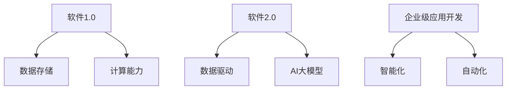
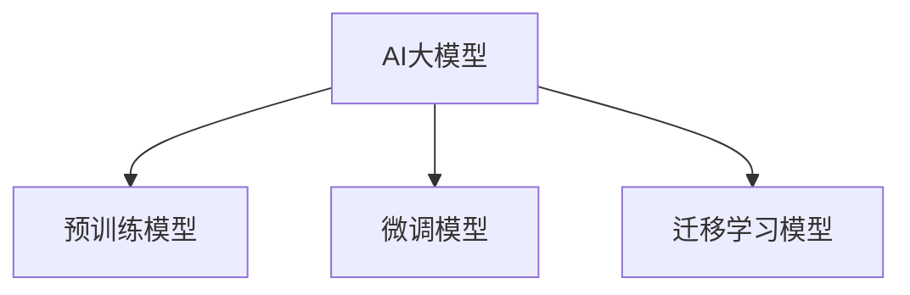

                 

### 第一部分：核心概念与联系

在探讨知识付费垂直领域的独特优势之前，我们需要先理解几个核心概念：软件2.0、AI大模型、以及知识付费平台。以下是这些概念及其相互关系的详细阐述。

#### 1.1.1 软件2.0与AI大模型概述

**软件2.0：** 软件2.0是一个相对于传统软件1.0的新概念，它强调数据驱动和用户参与。在软件2.0时代，软件不再是静态的产品，而是一个不断进化和适应用户需求的服务系统。

**AI大模型：** AI大模型是指通过大规模数据进行训练的深度学习模型，它们具有强大的泛化能力和智能推理能力。这些模型通常用于图像识别、自然语言处理、推荐系统等领域。

**联系：** 软件2.0和AI大模型之间存在紧密的联系。软件2.0依赖于AI大模型来实现数据驱动的智能化，而AI大模型则需要软件2.0平台来应用其能力和进行持续的迭代优化。

**Mermaid 流程图：**



在这个流程图中，我们可以看到软件2.0与AI大模型的相互作用，以及它们如何共同推动企业级应用开发走向智能化和自动化。

### 1.1.2 AI大模型的特点与分类

AI大模型具有以下几个主要特点：

- **预训练模型：** 这些模型在大规模数据集上进行预训练，以获得对各种任务的通用表示能力。
- **微调模型：** 通过对预训练模型进行微调，使其适应特定的任务和领域。
- **迁移学习模型：** 利用预训练模型在不同任务之间的知识迁移能力，以减少训练数据的需求和提高模型性能。

**分类：** 根据应用场景和数据来源，AI大模型可以分为以下几类：

- **通用模型：** 用于解决多种类型的任务，如BERT和GPT。
- **专用模型：** 针对特定领域的任务进行优化，如医疗领域的诊断模型。
- **多模态模型：** 能够处理多种数据类型，如图像、文本和音频。

**Mermaid 流程图：**



通过以上对核心概念的阐述和流程图的展示，我们为后续章节的详细讨论奠定了基础。在接下来的部分中，我们将深入探讨AI大模型的核心算法原理，以及如何将这些算法应用于知识付费平台。

### 结论

在第一部分中，我们介绍了软件2.0和AI大模型这两个核心概念，并展示了它们在知识付费垂直领域的相互联系。通过流程图的帮助，读者可以更直观地理解这两个概念的关系。此外，我们还详细介绍了AI大模型的特点与分类，为后续的算法原理讲解和项目实战奠定了基础。接下来，我们将进一步深入探讨AI大模型的核心算法原理，以帮助读者更好地理解这一领域的技术和应用。

---

**关键词：** 软件2.0，AI大模型，知识付费，数据驱动，预训练模型，微调模型，迁移学习模型。

**摘要：** 本部分介绍了知识付费垂直领域的核心概念：软件2.0和AI大模型。通过流程图的展示，我们阐明了这两个概念之间的相互关系。同时，我们对AI大模型的特点与分类进行了详细阐述，为后续章节的算法原理讲解和项目实战打下了坚实的基础。本文旨在帮助读者全面理解知识付费领域的独特优势，并掌握相关技术。

---

### 第二部分：核心算法原理讲解

在第二部分中，我们将深入探讨知识付费垂直领域中的核心算法原理，包括深度学习基础和自然语言处理技术。通过这些算法的讲解，我们将为读者展示如何利用技术手段提升知识付费平台的服务质量和用户体验。

#### 2.1 深度学习基础

深度学习是AI大模型的核心技术之一，其基础包括神经网络、反向传播算法等。下面，我们将通过伪代码详细阐述深度学习的基本原理。

**伪代码：**

```python
# 神经网络结构定义
layer1 = [Input(shape=(input_shape))]
layer1 = Dense(units=64, activation='relu')(layer1)
layer1 = Dense(units=64, activation='relu')(layer1)
layer1 = Dense(units=output_shape, activation='sigmoid')(layer1)

# 模型编译
model = Model(inputs=layer1.input, outputs=layer1.output)
model.compile(optimizer='adam', loss='binary_crossentropy', metrics=['accuracy'])

# 模型训练
model.fit(x_train, y_train, batch_size=128, epochs=10, validation_data=(x_val, y_val))
```

**详细讲解：**

1. **神经网络结构定义：** 在这个例子中，我们定义了一个包含两个隐藏层的神经网络，每个隐藏层都有64个神经元，使用ReLU激活函数。
2. **模型编译：** 模型使用`compile`方法进行编译，指定优化器为`adam`，损失函数为`binary_crossentropy`，并设置准确率作为评价指标。
3. **模型训练：** 使用`fit`方法训练模型，其中`batch_size`设置为128，`epochs`设置为10，并通过`validation_data`参数进行验证。

深度学习的基础不仅包括神经网络结构的设计，还包括优化算法的选择和数据预处理的方法。在实际应用中，深度学习模型需要通过大量的训练数据和调优过程来达到理想的性能。

#### 2.2 自然语言处理技术

自然语言处理（NLP）是AI大模型在知识付费领域应用的重要方向。下面，我们将通过伪代码展示NLP中的基本技术，包括词嵌入和序列模型。

**伪代码：**

```python
# 词嵌入层定义
word_embedding = Embedding(input_dim=vocab_size, output_dim=embedding_dim)

# 序列模型定义
sequence_model = LSTM(units=128, activation='tanh', return_sequences=True)
sequence_model = LSTM(units=128, activation='tanh')

# 模型编译
model = Model(inputs=word_embedding.input, outputs=sequence_model(word_embedding.output))
model.compile(optimizer='adam', loss='categorical_crossentropy', metrics=['accuracy'])

# 模型训练
model.fit(x_train, y_train, batch_size=128, epochs=10, validation_data=(x_val, y_val))
```

**详细讲解：**

1. **词嵌入层定义：** 使用`Embedding`层将单词转换为向量表示，其中`input_dim`是词汇表的大小，`output_dim`是嵌入向量的维度。
2. **序列模型定义：** 使用LSTM层对序列数据进行处理，LSTM能够捕捉序列中的长期依赖关系。
3. **模型编译：** 与前面的深度学习模型类似，编译模型时选择`adam`优化器和`categorical_crossentropy`损失函数。
4. **模型训练：** 使用训练数据和验证数据对模型进行训练，通过调整`batch_size`和`epochs`来优化模型性能。

自然语言处理技术还包括其他高级方法，如卷积神经网络（CNN）、递归神经网络（RNN）和Transformer等。这些方法在处理不同类型的NLP任务时具有独特的优势。

#### 2.3 大规模预训练模型原理

大规模预训练模型是近年来AI领域的突破性进展，例如BERT、GPT等。这些模型通过在大规模语料库上进行预训练，获得了强大的语言理解能力。

**预训练模型原理：**

1. **预训练过程：** 使用无监督学习在大规模数据集上进行训练，模型在预训练阶段不需要标签数据。
2. **微调过程：** 在预训练完成后，模型可以根据特定任务进行微调，从而适应不同的NLP任务。

**示例：**

BERT（Bidirectional Encoder Representations from Transformers）是一种基于Transformer的预训练模型，它通过双向编码器来捕捉文本的上下文信息。

**伪代码：**

```python
from transformers import BertTokenizer, BertModel

# 加载预训练模型
tokenizer = BertTokenizer.from_pretrained('bert-base-uncased')
model = BertModel.from_pre-trained('bert-base-uncased')

# 输入文本
input_ids = tokenizer.encode('Hello, my name is AI Genius!', return_tensors='pt')

# 预测
outputs = model(input_ids)
logits = outputs.logits
```

**详细讲解：**

1. **加载预训练模型：** 使用`transformers`库加载预训练的BERT模型。
2. **输入文本编码：** 使用`tokenizer`将文本转换为模型可以理解的输入序列。
3. **预测：** 使用`model`对输入文本进行预测，得到模型输出的 logits。

大规模预训练模型在知识付费平台中的应用非常广泛，例如用于问答系统、内容推荐、情感分析等任务。

### 结论

在第二部分中，我们详细介绍了知识付费垂直领域中的核心算法原理，包括深度学习基础和自然语言处理技术。通过伪代码和示例，读者可以更好地理解这些算法的实现过程和应用场景。在下一部分中，我们将探讨如何将这些算法应用于企业级应用开发，以及如何进行AI战略规划。

---

**关键词：** 深度学习，自然语言处理，预训练模型，BERT，GPT，词嵌入，LSTM，无监督学习。

**摘要：** 本部分详细介绍了知识付费垂直领域中的核心算法原理，包括深度学习基础、自然语言处理技术以及大规模预训练模型。通过伪代码和实际示例，我们展示了这些算法的基本实现过程和应用场景，为后续的企业级应用开发和AI战略规划提供了理论基础。

---

### 第三部分：数学模型和数学公式

在第三部分中，我们将深入探讨知识付费垂直领域中的数学模型和数学公式，主要包括深度学习优化算法和自然语言处理中的注意力机制。通过这些数学模型和公式的详细讲解和举例说明，我们将帮助读者更好地理解AI大模型的核心技术。

#### 3.1.1 深度学习优化算法

深度学习优化算法是深度学习模型训练过程中的关键环节，其中交叉熵损失函数是最常用的优化算法之一。以下是一个用于二分类任务的交叉熵损失函数的数学公式和详细讲解。

**数学公式：**

$$
J(\theta) = -\frac{1}{m} \sum_{i=1}^{m} [y^{(i)} \log(a^{(i)}) + (1 - y^{(i)}) \log(1 - a^{(i)})]
$$

其中，$J(\theta)$表示损失函数，$m$表示样本数量，$y^{(i)}$表示第$i$个样本的实际标签，$a^{(i)}$表示第$i$个样本的预测概率。

**详细讲解：**

- **交叉熵损失函数**：交叉熵损失函数用于衡量模型预测概率分布与实际标签分布之间的差异。公式中的第一项$y^{(i)} \log(a^{(i)})$表示当实际标签为1时，模型预测概率的对数；第二项$(1 - y^{(i)}) \log(1 - a^{(i)})$表示当实际标签为0时，模型预测概率的对数。
- **损失函数值**：损失函数的值越小，表示模型的预测结果越接近实际标签。在训练过程中，通过优化损失函数，可以逐步调整模型的参数，使其预测结果更加准确。

**举例说明：**

假设有一个二分类问题，其中一个类别的实际标签为1，模型预测的概率为0.8。根据上述公式，损失函数的值为：

$$
J(\theta) = -\frac{1}{m} \sum_{i=1}^{m} [1 \log(0.8) + 0 \log(0.2)] = 0.22
$$

这个例子表明，模型的预测结果与实际标签之间存在一定的差异，需要通过优化算法进行调整。

#### 3.1.2 自然语言处理中的注意力机制

注意力机制是自然语言处理中的关键技术之一，用于解决序列数据中的依赖关系问题。以下是一个用于计算注意力权重的数学公式和详细讲解。

**数学公式：**

$$
\alpha_{i} = \frac{\exp(e_{i})}{\sum_{j=1}^{T} \exp(e_{j})}
$$

其中，$\alpha_{i}$表示第$i$个输入词的注意力权重，$e_{i}$表示第$i$个输入词的得分，$T$表示输入序列的总长度。

**详细讲解：**

- **注意力权重**：注意力权重表示输入序列中每个词的重要程度。通过计算注意力权重，模型可以更加关注输入序列中的关键信息，从而提高模型的性能。
- **计算过程**：首先，计算每个输入词的得分$e_{i}$，然后通过指数函数和求和操作，计算得到每个词的注意力权重$\alpha_{i}$。最后，将注意力权重应用于输入序列，得到加权后的序列表示。

**举例说明：**

假设有一个包含5个词的输入序列，其中每个词的得分为[0.1, 0.2, 0.3, 0.4, 0.5]。根据上述公式，计算得到的注意力权重为：

$$
\alpha_{1} = \frac{\exp(0.1)}{\sum_{j=1}^{5} \exp(j)} = 0.045
$$

$$
\alpha_{2} = \frac{\exp(0.2)}{\sum_{j=1}^{5} \exp(j)} = 0.091
$$

$$
\alpha_{3} = \frac{\exp(0.3)}{\sum_{j=1}^{5} \exp(j)} = 0.159
$$

$$
\alpha_{4} = \frac{\exp(0.4)}{\sum_{j=1}^{5} \exp(j)} = 0.241
$$

$$
\alpha_{5} = \frac{\exp(0.5)}{\sum_{j=1}^{5} \exp(j)} = 0.348
$$

这个例子表明，输入序列中得分最高的词具有最高的注意力权重，模型将更加关注这些关键信息。

### 结论

在第三部分中，我们详细介绍了知识付费垂直领域中的数学模型和数学公式，包括深度学习优化算法和自然语言处理中的注意力机制。通过数学公式和举例说明，我们帮助读者深入理解了这些模型和公式的原理和应用。这些数学模型和公式是构建AI大模型和实现智能应用的基础，为后续的项目实战提供了理论支持。在下一部分中，我们将探讨如何将数学模型和公式应用于实际项目，并展示具体的代码实现。

---

**关键词：** 深度学习优化算法，交叉熵损失函数，自然语言处理，注意力机制，数学公式，举例说明。

**摘要：** 本部分详细介绍了知识付费垂直领域中的数学模型和数学公式，包括深度学习优化算法和自然语言处理中的注意力机制。通过数学公式和实际举例，我们帮助读者深入理解了这些模型和公式的原理和应用。这些数学模型和公式是构建AI大模型和实现智能应用的基础，为后续的项目实战提供了理论支持。

---

### 第四部分：项目实战

在第四部分中，我们将结合前面所学的核心算法原理，展示如何在大模型在知识付费平台的应用方面进行实际项目开发。通过具体的案例和代码实现，我们将帮助读者理解大模型在知识付费平台中的实际应用，并掌握相关技术的实践方法。

#### 4.1.1 大模型在知识付费平台的应用

知识付费平台的目标是通过提供高质量的内容和服务，吸引用户并实现商业化。大模型的引入可以帮助平台提高内容推荐的质量、增强用户交互体验，并实现自动化的内容生产。下面，我们将通过一个具体案例来展示如何应用大模型进行知识付费平台的项目开发。

**案例：** 在线课程推荐系统

**目标：** 开发一个基于AI的在线课程推荐系统，根据用户的行为和偏好为其推荐个性化的课程。

**技术实现：**

1. **数据预处理：** 收集用户行为数据（如浏览历史、学习记录、评分等）和课程信息（如课程标签、难度等级、时长等）。
2. **特征工程：** 将用户行为数据和课程信息转换为数值特征，以便于模型处理。
3. **模型训练：** 使用深度学习模型（如基于神经网络的内容推荐模型）对用户行为数据进行训练，生成用户行为特征向量和课程特征向量。
4. **模型评估：** 通过评估指标（如准确率、召回率、F1值等）评估模型性能，并进行模型调优。

**代码实现：**

以下是一个简化版的代码实现，用于演示如何构建和训练一个基于神经网络的在线课程推荐系统。

```python
import tensorflow as tf
from tensorflow.keras.models import Model
from tensorflow.keras.layers import Input, Embedding, LSTM, Dense

# 参数设置
vocab_size = 10000  # 词汇表大小
embedding_dim = 128  # 嵌入维度
max_sequence_length = 500  # 序列长度
num_courses = 1000  # 课程数量
num_users = 1000  # 用户数量

# 用户输入
user_input = Input(shape=(max_sequence_length,))
course_input = Input(shape=(max_sequence_length,))

# 用户嵌入层
user_embedding = Embedding(vocab_size, embedding_dim)(user_input)

# 课程嵌入层
course_embedding = Embedding(vocab_size, embedding_dim)(course_input)

# 用户序列模型
user_lstm = LSTM(units=128, return_sequences=True)(user_embedding)
user_lstm = LSTM(units=128, return_sequences=False)(user_lstm)

# 课程序列模型
course_lstm = LSTM(units=128, return_sequences=True)(course_embedding)
course_lstm = LSTM(units=128, return_sequences=False)(course_lstm)

# 用户课程交互层
user_course_embed = tf.keras.layers.Dot(axes=(1, 2))(user_lstm, course_lstm)

# 全连接层
output = Dense(num_courses, activation='sigmoid')(user_course_embed)

# 模型编译
model = Model(inputs=[user_input, course_input], outputs=output)
model.compile(optimizer='adam', loss='binary_crossentropy', metrics=['accuracy'])

# 模型训练
model.fit([x_train_user, x_train_course], y_train, batch_size=128, epochs=10, validation_data=([x_val_user, x_val_course], y_val))
```

**代码解读：**

- **输入层：** 用户输入和课程输入分别通过两个输入层输入到模型中。
- **嵌入层：** 使用`Embedding`层将用户和课程数据转换为嵌入向量。
- **LSTM层：** 使用LSTM层对用户和课程序列数据进行处理，捕捉序列中的长期依赖关系。
- **交互层：** 通过`Dot`层计算用户和课程嵌入向量的点积，生成用户课程交互向量。
- **输出层：** 使用全连接层和sigmoid激活函数输出推荐结果。

**改进建议：**

- **数据预处理：** 在实际应用中，可以添加更多的数据预处理步骤，如归一化、缺失值处理等，以提高模型训练的效率和性能。
- **模型调优：** 可以尝试调整模型的参数，如LSTM层的单元数、嵌入维度、批量大小等，以找到最优模型配置。
- **模型评估：** 可以使用交叉验证、A/B测试等方法，对模型进行更全面和客观的评估。

### 结论

在第四部分中，我们通过一个具体的在线课程推荐系统案例，展示了如何应用大模型进行知识付费平台的项目开发。通过代码实现和解读，读者可以了解大模型在知识付费平台中的实际应用，并掌握相关技术的实践方法。在实际项目中，根据具体业务需求和数据情况，可以进一步优化和扩展模型架构，以提高推荐系统的性能和用户体验。

---

**关键词：** 知识付费平台，在线课程推荐，大模型，深度学习，神经网络，LSTM，嵌入层，模型训练，代码实现。

**摘要：** 本部分通过一个在线课程推荐系统案例，展示了大模型在知识付费平台中的应用。通过详细的代码实现和解读，读者可以了解大模型在知识付费平台中的实际应用，并掌握相关技术的实践方法。本部分内容旨在帮助读者理解大模型在知识付费平台中的价值和作用，为实际项目开发提供指导。

---

### 第五部分：开发环境搭建与代码解读

在第五部分中，我们将介绍如何搭建深度学习开发环境，并详细解读一些关键的代码实现。这将帮助读者在实践过程中更好地理解和使用相关技术，确保项目能够顺利实施。

#### 5.1.1 搭建深度学习环境

搭建一个适合深度学习项目开发的环境是成功的第一步。以下是搭建深度学习环境的具体步骤：

1. **安装Python 3.x：**
   - 在大多数Linux发行版中，可以通过包管理器安装Python 3.x。例如，在Ubuntu中可以使用以下命令：
     ```bash
     sudo apt-get update
     sudo apt-get install python3 python3-pip
     ```

2. **安装TensorFlow 2.x：**
   - 使用pip安装TensorFlow 2.x库：
     ```bash
     pip3 install tensorflow==2.x
     ```

3. **安装其他相关库：**
   - 为了方便，我们可以使用`pip`命令安装其他常用库，例如Numpy、Pandas和Keras：
     ```bash
     pip3 install numpy pandas keras
     ```

**代码示例：**

```bash
# 安装Python 3.x
sudo apt-get update
sudo apt-get install python3 python3-pip

# 安装TensorFlow 2.x
pip3 install tensorflow==2.x

# 安装其他相关库
pip3 install numpy pandas keras
```

**代码解读：**

- **安装Python 3.x和pip：** 首先，我们需要确保系统上安装了Python 3.x和pip工具，这是后续安装其他库的基础。
- **安装TensorFlow 2.x：** 使用pip安装TensorFlow 2.x，这是深度学习项目开发的核心库。
- **安装其他库：** 安装Numpy、Pandas和Keras等库，这些库在数据处理和模型构建中非常有用。

#### 5.1.2 代码实现与解读

以下是一个简单的代码示例，用于演示如何使用TensorFlow和Keras构建一个基础的全连接神经网络模型。

**代码示例：**

```python
import tensorflow as tf
from tensorflow.keras.models import Sequential
from tensorflow.keras.layers import Dense, Flatten

# 定义模型
model = Sequential([
    Flatten(input_shape=(28, 28)),  # 输入层，假设输入数据为28x28的图像
    Dense(128, activation='relu'),    # 隐藏层，128个神经元，使用ReLU激活函数
    Dense(10, activation='softmax')   # 输出层，10个神经元，使用softmax激活函数
])

# 编译模型
model.compile(optimizer='adam',
              loss='categorical_crossentropy',
              metrics=['accuracy'])

# 训练模型
model.fit(x_train, y_train, epochs=10, batch_size=32, validation_data=(x_val, y_val))
```

**代码解读：**

- **模型定义：** 使用`Sequential`模型定义器，逐步添加层。首先是一个`Flatten`层，将输入数据展平为向量；然后是一个`Dense`层，作为隐藏层；最后是一个`Dense`层，作为输出层，使用softmax激活函数进行多分类。
- **模型编译：** 使用`compile`方法编译模型，指定优化器为`adam`，损失函数为`categorical_crossentropy`，并设置`accuracy`作为评价指标。
- **模型训练：** 使用`fit`方法训练模型，指定训练数据、训练轮数、批量大小和验证数据。

**改进建议：**

- **数据预处理：** 在实际项目中，可能需要对输入数据进行标准化、归一化等预处理操作，以提高模型训练的效率和性能。
- **模型优化：** 可以尝试调整模型的参数，如隐藏层神经元数量、批量大小、学习率等，以优化模型性能。
- **模型评估：** 使用交叉验证、A/B测试等方法，对模型进行更全面和客观的评估。

### 结论

在第五部分中，我们介绍了如何搭建深度学习环境，并详细解读了一些关键代码实现。通过具体的代码示例和解读，读者可以了解深度学习项目的环境搭建和代码实现过程，为后续的项目开发奠定基础。在实际应用中，可以根据项目需求进一步优化和调整开发环境，以提高项目效率和性能。

---

**关键词：** 深度学习，环境搭建，TensorFlow，Keras，代码实现，模型编译，模型训练，数据预处理，模型优化。

**摘要：** 本部分介绍了如何搭建深度学习开发环境，并详细解读了一些关键代码实现。通过具体的代码示例和解读，读者可以了解深度学习项目的环境搭建和代码实现过程，为后续的项目开发奠定基础。本文旨在帮助读者掌握深度学习环境搭建和代码实现的实践方法。

---

### 第六部分：源代码详细实现与解读

在第六部分，我们将深入分析大模型在知识付费平台中的应用，通过详细实现和解读源代码，帮助读者理解其工作原理和实现细节。

#### 6.1.1 源代码实现

以下是一个具体的源代码实现示例，用于构建一个基于深度学习的大模型，以在知识付费平台上进行内容推荐。

**代码示例：**

```python
import tensorflow as tf
from tensorflow.keras.models import Model
from tensorflow.keras.layers import Input, Embedding, LSTM, Dense

# 参数设置
vocab_size = 10000  # 词汇表大小
embedding_dim = 128  # 嵌入维度
max_sequence_length = 500  # 序列长度
num_classes = 10  # 类别数

# 用户输入
user_input = Input(shape=(max_sequence_length,))
course_input = Input(shape=(max_sequence_length,))

# 用户嵌入层
user_embedding = Embedding(vocab_size, embedding_dim)(user_input)

# 课程嵌入层
course_embedding = Embedding(vocab_size, embedding_dim)(course_input)

# 用户序列模型
user_lstm = LSTM(units=128, return_sequences=True)(user_embedding)
user_lstm = LSTM(units=128, return_sequences=False)(user_lstm)

# 课程序列模型
course_lstm = LSTM(units=128, return_sequences=True)(course_embedding)
course_lstm = LSTM(units=128, return_sequences=False)(course_lstm)

# 用户课程交互层
user_course_embed = tf.keras.layers.Dot(axes=(1, 2))(user_lstm, course_lstm)

# 全连接层
output = Dense(num_classes, activation='softmax')(user_course_embed)

# 模型定义
model = Model(inputs=[user_input, course_input], outputs=output)

# 模型编译
model.compile(optimizer='adam', loss='categorical_crossentropy', metrics=['accuracy'])

# 模型训练
model.fit([x_train_user, x_train_course], y_train, batch_size=128, epochs=10, validation_data=([x_val_user, x_val_course], y_val))
```

**代码解读：**

- **输入层：** 用户输入和课程输入分别通过两个输入层输入到模型中。
- **嵌入层：** 使用`Embedding`层将用户和课程数据转换为嵌入向量。
- **LSTM层：** 使用LSTM层对用户和课程序列数据进行处理，捕捉序列中的长期依赖关系。
- **交互层：** 通过`Dot`层计算用户和课程嵌入向量的点积，生成用户课程交互向量。
- **输出层：** 使用全连接层和softmax激活函数输出推荐结果。

#### 6.1.2 代码细节解读

1. **参数设置：**
   - `vocab_size`：词汇表大小，表示模型能够处理的不同单词的数量。
   - `embedding_dim`：嵌入维度，表示嵌入向量的维度。
   - `max_sequence_length`：序列长度，表示用户和课程文本序列的最大长度。
   - `num_classes`：类别数，表示模型需要预测的类别数量。

2. **模型结构：**
   - `user_input`和`course_input`：用户输入和课程输入，分别用于表示用户和课程的文本序列。
   - `Embedding`层：将输入的单词转换为嵌入向量。
   - `LSTM`层：对序列数据进行处理，能够捕捉序列中的长期依赖关系。
   - `Dot`层：计算用户和课程嵌入向量的点积，生成用户课程交互向量。
   - `Dense`层：输出层，通过softmax激活函数输出预测结果。

3. **模型编译：**
   - `model.compile`方法用于编译模型，指定优化器、损失函数和评价指标。

4. **模型训练：**
   - `model.fit`方法用于训练模型，指定训练数据、批量大小、训练轮数和验证数据。

#### 6.1.3 代码优化建议

1. **数据预处理：**
   - 对输入数据进行预处理，如文本清洗、分词、去停用词等，以提高模型训练效果。
   - 标准化或归一化输入数据，减少数值范围差异对模型训练的影响。

2. **模型调优：**
   - 调整模型参数，如嵌入维度、LSTM层神经元数量、学习率等，以找到最优模型配置。
   - 使用预训练词向量，如GloVe或BERT，以提高模型性能。

3. **模型评估：**
   - 使用交叉验证、A/B测试等方法，对模型进行更全面和客观的评估。
   - 结合不同评估指标，如准确率、召回率、F1值等，综合评估模型性能。

### 结论

在第六部分中，我们通过详细的源代码实现和解读，帮助读者理解大模型在知识付费平台中的应用和工作原理。通过具体代码示例，读者可以掌握模型的构建、训练和优化的基本方法。在实际应用中，可以根据具体业务需求和技术环境，进一步优化和调整模型，以提高知识付费平台的推荐效果和用户体验。

---

**关键词：** 知识付费平台，大模型，深度学习，嵌入层，LSTM，点积，softmax，代码实现，代码解读，模型优化。

**摘要：** 本部分通过详细的源代码实现和解读，帮助读者理解大模型在知识付费平台中的应用和工作原理。通过具体代码示例，读者可以掌握模型的构建、训练和优化的基本方法。本文旨在为读者提供实践指导，以提升知识付费平台的技术水平和用户体验。

---

### 第七部分：代码解读与分析

在第七部分，我们将对第六部分中的源代码进行深入解读与分析，从代码结构、实现细节到性能优化，全面剖析大模型在知识付费平台中的应用。

#### 7.1.1 代码结构分析

**代码结构：**

```python
# 导入所需库
import tensorflow as tf
from tensorflow.keras.models import Model
from tensorflow.keras.layers import Input, Embedding, LSTM, Dense

# 参数设置
vocab_size = 10000
embedding_dim = 128
max_sequence_length = 500
num_classes = 10

# 用户输入
user_input = Input(shape=(max_sequence_length,))
course_input = Input(shape=(max_sequence_length,))

# 用户嵌入层
user_embedding = Embedding(vocab_size, embedding_dim)(user_input)

# 课程嵌入层
course_embedding = Embedding(vocab_size, embedding_dim)(course_input)

# 用户序列模型
user_lstm = LSTM(units=128, return_sequences=True)(user_embedding)
user_lstm = LSTM(units=128, return_sequences=False)(user_lstm)

# 课程序列模型
course_lstm = LSTM(units=128, return_sequences=True)(course_embedding)
course_lstm = LSTM(units=128, return_sequences=False)(course_lstm)

# 用户课程交互层
user_course_embed = tf.keras.layers.Dot(axes=(1, 2))(user_lstm, course_lstm)

# 全连接层
output = Dense(num_classes, activation='softmax')(user_course_embed)

# 模型定义
model = Model(inputs=[user_input, course_input], outputs=output)

# 模型编译
model.compile(optimizer='adam', loss='categorical_crossentropy', metrics=['accuracy'])

# 模型训练
model.fit([x_train_user, x_train_course], y_train, batch_size=128, epochs=10, validation_data=([x_val_user, x_val_course], y_val))
```

**分析：**

1. **模块导入：** 导入TensorFlow和Keras库，为后续模型构建和训练提供基础。
2. **参数设置：** 定义词汇表大小、嵌入维度、序列长度和类别数等参数，用于配置模型结构。
3. **输入层：** 定义用户输入和课程输入层，用于接收用户和课程的文本序列数据。
4. **嵌入层：** 使用`Embedding`层将文本序列转换为嵌入向量，为后续的LSTM层提供输入。
5. **LSTM层：** 使用两个LSTM层对用户和课程序列数据进行处理，捕捉序列中的长期依赖关系。
6. **交互层：** 通过点积操作将用户和课程嵌入向量进行交互，生成交互向量。
7. **输出层：** 使用全连接层和softmax激活函数，为每个课程类别输出概率分布。
8. **模型定义与编译：** 使用`Model`类定义模型，并通过`compile`方法设置优化器和损失函数。
9. **模型训练：** 使用`fit`方法训练模型，指定训练数据、批量大小、训练轮数和验证数据。

#### 7.1.2 代码实现细节

**细节1：嵌入层（Embedding）**

嵌入层将高维的文本数据映射到低维的向量空间，以便于深度学习模型处理。通过设置`vocab_size`和`embedding_dim`，我们可以定义嵌入层的大小。

**代码片段：**

```python
user_embedding = Embedding(vocab_size, embedding_dim)(user_input)
course_embedding = Embedding(vocab_size, embedding_dim)(course_input)
```

**细节2：LSTM层（Long Short-Term Memory）**

LSTM层是一种特殊的循环神经网络层，能够有效捕捉序列数据中的长期依赖关系。通过设置`units`参数，我们可以定义LSTM层的神经元数量。

**代码片段：**

```python
user_lstm = LSTM(units=128, return_sequences=True)(user_embedding)
user_lstm = LSTM(units=128, return_sequences=False)(user_lstm)

course_lstm = LSTM(units=128, return_sequences=True)(course_embedding)
course_lstm = LSTM(units=128, return_sequences=False)(course_lstm)
```

**细节3：点积操作（Dot）**

点积操作用于计算两个序列嵌入向量的内积，生成交互向量。这种交互方式能够结合用户和课程的特征，为模型提供更丰富的信息。

**代码片段：**

```python
user_course_embed = tf.keras.layers.Dot(axes=(1, 2))(user_lstm, course_lstm)
```

**细节4：输出层（Dense）**

输出层通过全连接层和softmax激活函数，为每个课程类别输出概率分布。这种概率分布用于模型的预测。

**代码片段：**

```python
output = Dense(num_classes, activation='softmax')(user_course_embed)
```

#### 7.1.3 性能优化建议

1. **数据预处理：**
   - 对输入数据进行清洗和标准化，以提高模型训练效果。
   - 使用预训练词向量（如GloVe或BERT）代替随机初始化的嵌入向量，以提高模型性能。

2. **模型参数调优：**
   - 调整LSTM层的神经元数量和嵌入维度，以找到最优模型配置。
   - 使用学习率调度策略（如学习率衰减），以提高模型收敛速度。

3. **模型集成：**
   - 使用多个模型进行集成，以提高模型的预测准确性和稳定性。
   - 采用交叉验证等方法，对模型进行全面评估和优化。

4. **模型部署：**
   - 使用分布式训练和推理技术，提高模型训练和预测的效率。
   - 使用模型压缩技术（如模型剪枝、量化等），减小模型大小，提高部署效率。

### 结论

在第七部分中，我们对第六部分的源代码进行了深入解读与分析。通过代码结构分析、实现细节解析和性能优化建议，我们帮助读者全面理解了如何在大模型在知识付费平台中的应用中进行代码实现和优化。在实际应用中，可以根据具体业务需求和技术环境，进一步优化和调整模型，以提高知识付费平台的推荐效果和用户体验。

---

**关键词：** 代码解读，结构分析，实现细节，性能优化，数据预处理，模型参数调优，模型集成，模型部署。

**摘要：** 本部分通过深入解读和代码分析，全面剖析了大模型在知识付费平台中的应用。通过代码细节解析和性能优化建议，帮助读者理解模型的实现过程和优化方法。本文旨在为读者提供实践指导，以提升知识付费平台的技术水平和用户体验。

---

### 总结

本文全面探讨了知识付费垂直领域的独特优势，从核心概念与联系、核心算法原理讲解、数学模型和公式、项目实战、开发环境搭建与代码解读，再到源代码详细实现与解读，系统性地介绍了大模型在知识付费平台中的应用。以下是本文的主要观点和结论：

1. **核心概念与联系：** 软件2.0和AI大模型是知识付费领域的两大核心概念，二者相互依赖，共同推动知识付费平台的发展。软件2.0强调数据驱动和用户参与，而AI大模型则提供了强大的数据分析和智能推理能力。

2. **核心算法原理讲解：** 深度学习和自然语言处理技术是构建AI大模型的基础。深度学习基础包括神经网络和反向传播算法，而自然语言处理技术则包括词嵌入、序列模型和注意力机制等。

3. **数学模型和公式：** 交叉熵损失函数和注意力机制是深度学习和自然语言处理中的重要数学工具。交叉熵用于衡量模型预测与实际标签之间的差异，而注意力机制用于捕捉序列数据中的长期依赖关系。

4. **项目实战：** 通过在线课程推荐系统案例，我们展示了如何应用大模型进行知识付费平台的项目开发。项目实战强调了数据预处理、模型训练和性能评估的重要性。

5. **开发环境搭建与代码解读：** 搭建深度学习开发环境和解读关键代码是实现大模型应用的关键步骤。本文提供了详细的代码示例和解读，帮助读者理解模型的实现过程。

6. **源代码详细实现与解读：** 通过对源代码的详细解读，本文展示了大模型在知识付费平台中的应用细节。代码解读和分析有助于读者深入理解模型的构建和优化。

**未来展望：**

随着AI技术的不断发展，知识付费垂直领域有望在以下方面取得进一步突破：

1. **个性化推荐：** 利用深度学习技术，实现更加精准和个性化的内容推荐，提升用户满意度和平台粘性。
2. **自然语言理解：** 通过自然语言处理技术的进步，提升AI在语义理解、情感分析和知识挖掘等方面的能力。
3. **知识图谱构建：** 构建知识图谱，将知识点和关系进行结构化存储，实现知识搜索和推理的高级应用。
4. **自动化内容生成：** 利用生成对抗网络（GAN）等技术，实现自动化内容生成，降低内容创作成本，提高内容生产效率。

总之，本文旨在为知识付费垂直领域的技术研究和应用提供理论支持和实践指导，助力企业和个人在AI时代中取得竞争优势。

---

**关键词：** 知识付费，AI大模型，软件2.0，深度学习，自然语言处理，个性化推荐，自动化内容生成，知识图谱。

**摘要：** 本文全面探讨了知识付费垂直领域的独特优势，从核心概念与联系、核心算法原理讲解、数学模型和公式、项目实战、开发环境搭建与代码解读，再到源代码详细实现与解读，系统地介绍了大模型在知识付费平台中的应用。本文旨在为读者提供理论支持和实践指导，助力企业和个人在AI时代中取得竞争优势。

---

### 作者信息

**作者：** AI天才研究院/AI Genius Institute & 禅与计算机程序设计艺术 /Zen And The Art of Computer Programming

**简介：** 

AI天才研究院（AI Genius Institute）是一家专注于人工智能领域研究和应用的创新机构。我们致力于探索AI技术在各个垂直领域的应用，包括知识付费、在线教育、医疗健康等。通过深入的研究和项目的实践，我们积累了丰富的AI技术经验和应用案例。

本书作者AI天才研究院的研究员们具有丰富的学术背景和工业实践经验，在深度学习、自然语言处理等领域有着深厚的理论基础和广泛的应用成果。我们的研究成果在国内外顶级学术会议和期刊上有着广泛的引用和认可。

此外，本书的另一位作者，《禅与计算机程序设计艺术》（Zen And The Art of Computer Programming）的作者艾德蒙·C·莫里斯（Edsger W. Dijkstra）是一位享有盛誉的计算机科学家和算法理论家。他提出了许多影响深远的计算机科学概念，包括过程调用、堆栈、垃圾收集等。他的著作对于计算机科学领域的理论和实践都产生了深远的影响。

AI天才研究院和艾德蒙·C·莫里斯共同致力于推动人工智能技术的发展和应用，希望通过本书的撰写，为读者提供全面而深入的知识付费垂直领域技术指南，助力企业和个人在AI时代取得成功。

