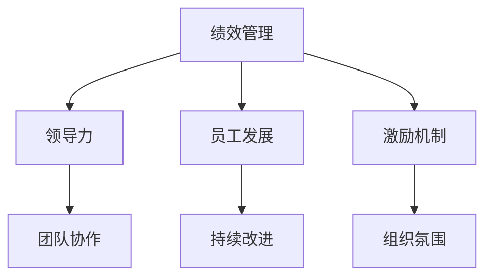

                 

### 打造高绩效文化：从 mediocrity 到 excellence

#### 关键词：

- 高绩效文化
- 领导力
- 员工发展
- 激励机制
- 团队协作
- 创新能力
- 持续改进
- 评估与优化

#### 摘要：

本文旨在探讨如何从mediocrity（平庸）迈向excellence（卓越），构建并维持高绩效文化。文章首先定义了高绩效文化的概念及其重要性，随后分析了核心概念及其相互联系，然后详细阐述了在企业中实施高绩效文化的策略和实践，包括领导力提升、员工发展和激励机制等。文章还介绍了团队协作、沟通技巧和持续改进的方法，并提供了高绩效文化的评估和优化策略。通过案例分析和实战演练，本文旨在为IT领域的从业者提供一套实用的构建高绩效文化的指南。

#### 目录大纲：

1. **高绩效文化的理论基础**
   - **1.1 高绩效文化的定义与重要性**
   - **1.2 高绩效文化与传统文化的区别**
   - **2.1 核心概念解析**
   - **2.2 核心概念联系图**
   - **3.1 实施策略**
   - **3.2 案例分析**

2. **高绩效文化的构建与实践**
   - **4.1 领导力与高绩效文化**
   - **4.2 领导力提升策略**
   - **5.1 员工发展策略**
   - **5.2 激励机制**
   - **6.1 团队协作文化**
   - **6.2 沟通技巧**
   - **7.1 持续改进机制**
   - **7.2 创新能力培养**

3. **高绩效文化的评估与优化**
   - **8.1 评估指标**
   - **8.2 评估方法**
   - **9.1 优化策略**
   - **9.2 持续优化**

4. **附录**
   - **10. 高绩效文化建设工具与资源**

5. **代码实际案例和详细解释说明**
   - **实战演练**

6. **源代码详细实现和代码解读**
   - **代码解读与分析**

### 1. 高绩效文化的理论基础

#### 1.1 高绩效文化的定义与重要性

高绩效文化是一种以卓越为导向，通过系统化、制度化的方式，激发员工潜能，实现企业目标的文化。它不仅仅是追求短期业绩的提升，更是一种长期的战略思维，旨在建立一种可持续发展的企业文化。

**高绩效文化的特点：**

- **目标导向**：高绩效文化强调企业目标的明确性和可量化性，使全体员工能够清晰地认识到自己的工作对实现企业目标的重要性。
- **全员参与**：高绩效文化鼓励全体员工参与企业的决策和改进过程，激发员工的积极性和创造力。
- **持续改进**：高绩效文化强调通过不断的改进和创新来提升企业的竞争力和市场份额。
- **注重绩效**：高绩效文化将绩效作为评价员工和团队的重要标准，通过透明的绩效评估机制来激励员工。

**高绩效文化的重要性：**

- **提高工作效率**：高绩效文化通过明确的角色定位和职责划分，使员工能够更加专注于自己的工作，提高工作效率。
- **增强团队协作**：高绩效文化倡导团队合作，通过团队协作来解决问题和完成任务，提高团队的整体执行力。
- **提升创新能力**：高绩效文化鼓励创新思维和实践，为企业注入持续的创新能力。
- **增强企业竞争力**：高绩效文化能够提高企业的整体竞争力，使企业在激烈的市场竞争中保持优势。

#### 1.2 高绩效文化与传统文化的区别

**传统文化**通常是指一种较为保守、注重稳定和秩序的企业文化。它强调企业的规章制度和权威性，员工的角色和职责较为固定，创新和变革的空间有限。

**高绩效文化**则更加开放和灵活，注重员工的个人发展和创造力。它通过以下方式与传统文化区别开来：

- **创新导向**：高绩效文化鼓励员工提出创新的想法和建议，并将其付诸实践。而传统文化往往对变革持保守态度。
- **透明沟通**：高绩效文化强调信息的透明和沟通的开放性，使员工能够更好地理解企业的战略和目标。而传统文化往往存在信息不对称和沟通不畅的问题。
- **绩效驱动**：高绩效文化通过绩效评估和激励机制来激发员工的积极性。而传统文化往往依靠权威和纪律来管理员工。

#### 2.1 核心概念解析

**绩效管理**：绩效管理是一种通过设定目标、监控过程和评估结果，以提升员工绩效和实现企业目标的管理方法。它包括以下关键要素：

- **目标设定**：明确员工的工作目标和预期成果。
- **绩效监控**：定期跟踪员工的工作进度和成果。
- **绩效评估**：客观、公正地评价员工的绩效，并提供反馈。
- **绩效激励**：根据绩效评估结果给予奖励或改进建议。

**领导力**：领导力是指领导者通过激励、指导和影响他人，实现组织目标的能力。高绩效文化的构建离不开有效的领导力，其关键要素包括：

- **愿景领导**：明确企业的愿景和目标，并使员工理解并接受。
- **激励领导**：激发员工的内在动力，使其为实现企业目标而努力。
- **变革领导**：推动企业进行变革和创新，以适应外部环境的变化。

**员工发展**：员工发展是指企业通过培训、职业规划和发展机会，提升员工的技能和职业素养。员工发展对于高绩效文化的构建至关重要，其关键要素包括：

- **技能培训**：提供必要的技能培训，以提升员工的工作能力。
- **职业规划**：为员工制定明确的职业发展路径，并提供晋升机会。
- **激励与认可**：通过奖励和认可来激励员工的积极性和忠诚度。

#### 2.2 核心概念联系图

为了更好地理解高绩效文化的核心概念及其相互关系，我们使用Mermaid绘制了以下联系图：



**图1：高绩效文化核心概念联系图**

- **绩效管理**是高绩效文化的核心，它为企业的其他要素提供了目标和标准。
- **领导力**在构建高绩效文化中起着关键作用，通过激励和指导员工，推动企业的发展。
- **员工发展**旨在提升员工的技能和职业素养，为企业的长期发展提供人才支持。
- **激励机制**通过奖励和认可来激发员工的积极性和创造力。
- **团队协作**和**持续改进**是高绩效文化的重要组成部分，它们有助于提高团队的整体执行力和企业的竞争力。
- **组织氛围**是高绩效文化的基础，一个积极、开放和包容的组织氛围有助于员工发挥最佳水平。

#### 3.1 实施策略

**领导层的角色**：领导层在高绩效文化的实施中起着至关重要的作用。首先，领导层需要明确企业的愿景和目标，并将其传达给全体员工。其次，领导层应制定具体的实施计划，包括绩效管理、员工发展、激励机制等方面的具体措施。此外，领导层还需要积极参与到日常管理中，通过监督和指导，确保高绩效文化的有效实施。

**员工参与**：高绩效文化的成功离不开员工的参与和支持。企业可以通过以下方式激发员工的参与热情：

- **开放沟通**：建立开放、透明的沟通机制，使员工能够自由表达意见和建议。
- **参与决策**：鼓励员工参与到企业的决策过程中，增强其责任感和归属感。
- **激励机制**：通过奖励和认可来激励员工的积极参与。

#### 3.2 案例分析

**案例1：谷歌（Google）**

谷歌以其独特的高绩效文化而闻名，其成功的关键在于以下几个方面：

- **领导力**：谷歌的领导层注重员工的个人发展和创造力，鼓励员工自由探索和创新。例如，谷歌的“20%项目”允许员工将20%的工作时间用于个人感兴趣的项目，这一举措极大地激发了员工的创新精神。
- **员工发展**：谷歌提供丰富的培训和发展机会，帮助员工提升技能和职业素养。此外，谷歌还实行开放的晋升机制，为员工提供广阔的职业发展空间。
- **激励机制**：谷歌的激励机制非常有效，包括绩效奖金、股权激励等。这些激励机制不仅激励员工努力工作，还增强了员工对公司的忠诚度。

**案例2：亚马逊（Amazon）**

亚马逊以其高效的工作流程和卓越的执行力而著称，其高绩效文化的构建得益于以下几个关键因素：

- **绩效管理**：亚马逊的绩效管理非常严格，通过定期评估和反馈，确保员工能够始终保持高水平的工作状态。亚马逊的绩效评估体系注重结果导向，强调绩效与薪酬、晋升的紧密联系。
- **员工发展**：亚马逊重视员工的职业成长，提供丰富的培训和发展机会。此外，亚马逊还推行导师制度，帮助新员工快速融入公司文化并成长。
- **激励机制**：亚马逊的激励机制包括绩效奖金、股权激励等。这些激励措施不仅激励员工努力工作，还增强了员工对公司的忠诚度。

通过以上案例分析，我们可以看到，高绩效文化的构建需要领导层的引领、员工的参与和具体的实施策略。只有通过综合运用各种手段，才能打造出真正的高绩效文化，推动企业的持续发展。在下一部分中，我们将进一步探讨高绩效文化的构建与实践。


### 1.2 高绩效文化与传统文化的区别

在探讨高绩效文化的构建之前，有必要深入了解它与传统文化的区别。传统文化在许多企业中根深蒂固，其特点主要体现在以下几个方面：组织结构固化、决策层次分明、员工角色单一等。相比之下，高绩效文化则更加开放、灵活，注重创新和团队合作。以下是两者之间的主要区别：

#### 组织结构

**传统文化**：在传统文化中，组织结构通常较为固化，层级分明，决策流程复杂。这种结构使得信息传递效率低下，创新和变革难以实现。

**高绩效文化**：高绩效文化倡导扁平化组织结构，减少层级，提高信息传递速度。这种结构有助于增强团队协作，提高决策效率，为创新和变革创造良好的环境。

#### 决策方式

**传统文化**：传统文化的决策方式通常依赖于权威和层级，上级领导拥有最终决策权，员工参与度较低。

**高绩效文化**：高绩效文化强调民主决策，鼓励员工参与决策过程。通过全员参与，可以汇集更多的智慧和创意，提高决策质量。

#### 员工角色

**传统文化**：在传统文化中，员工的角色往往较为单一，职责明确，创新和变革的动力不足。

**高绩效文化**：高绩效文化鼓励员工发挥多重角色，不仅关注本职工作，还积极参与团队协作和创新。这种角色多元化有助于激发员工的潜能，提高整体绩效。

#### 创新氛围

**传统文化**：传统企业通常对创新持保守态度，担心风险和不确定性，创新氛围较为匮乏。

**高绩效文化**：高绩效文化鼓励创新思维和实践，企业通过建立创新机制，如“创意工作坊”、奖励创新成果等，营造积极的创新氛围。

#### 团队协作

**传统文化**：在传统文化中，团队协作往往受到组织结构和个人利益的限制，协作效率较低。

**高绩效文化**：高绩效文化强调团队合作，通过优化流程、加强沟通等手段，提高团队协作效率，实现共同目标。

通过以上对比，我们可以看到，高绩效文化在组织结构、决策方式、员工角色、创新氛围和团队协作等方面与传统文化有显著区别。这些差异决定了高绩效文化在推动企业变革和持续发展中的独特优势。在下一部分中，我们将进一步探讨高绩效文化的核心概念及其相互联系。

### 2. 核心概念与联系

在构建高绩效文化的过程中，理解并运用核心概念是至关重要的。这些核心概念不仅相互关联，而且共同作用于企业的高绩效文化建设。以下是对高绩效文化中关键概念的详细解析，以及它们之间的相互关系。

#### 核心概念解析

**1. 绩效管理**

**绩效管理**是高绩效文化的基石。它涉及设定目标、监控过程、评估结果和提供反馈的一系列管理活动。通过绩效管理，企业能够确保员工的工作与企业的战略目标保持一致，并激励员工为实现这些目标而努力。

- **目标设定**：明确员工的工作目标和预期成果，确保员工了解其职责和贡献。
- **绩效监控**：定期跟踪员工的工作进度和成果，及时发现并解决问题。
- **绩效评估**：客观、公正地评价员工的绩效，为员工提供明确的反馈。
- **绩效激励**：根据绩效评估结果给予奖励或改进建议，激发员工的积极性。

**2. 领导力**

**领导力**在构建高绩效文化中起着至关重要的作用。领导力不仅关乎领导者的个人魅力，更涉及到领导者在组织中的影响力、决策能力和沟通能力。

- **愿景领导**：领导者的愿景能够激励员工，为团队提供明确的方向和目标。
- **激励领导**：领导者通过激励和指导，激发员工的内在动力，使其为实现组织目标而努力。
- **变革领导**：领导者推动企业进行变革和创新，以适应外部环境的变化。

**3. 员工发展**

**员工发展**是高绩效文化的重要组成部分。它旨在提升员工的技能和职业素养，为企业的长期发展提供人才支持。

- **技能培训**：提供必要的技能培训，以提升员工的工作能力。
- **职业规划**：为员工制定明确的职业发展路径，并提供晋升机会。
- **激励与认可**：通过奖励和认可来激励员工的积极性和忠诚度。

**4. 激励机制**

**激励机制**是高绩效文化的重要保障。有效的激励机制能够激发员工的内在动力，提高员工的工作效率和创造力。

- **绩效奖金**：根据员工的绩效表现给予奖金奖励。
- **股权激励**：通过股权激励，使员工分享企业的成长成果。
- **非财务激励**：如认可与表扬、灵活的工作安排等。

**5. 团队协作**

**团队协作**是高绩效文化实现的基础。通过有效的团队协作，企业能够提高工作效率，实现共同目标。

- **协作文化**：营造积极的协作氛围，使员工愿意分享信息和资源。
- **协作工具**：运用各种协作工具，如项目管理系统、即时通讯工具等，提高团队协作效率。
- **沟通技巧**：培养员工的沟通能力，确保信息的有效传递。

#### 核心概念联系图

为了更好地理解这些核心概念之间的相互关系，我们使用Mermaid绘制了以下联系图：


**图1：高绩效文化核心概念联系图**

- **绩效管理**是高绩效文化的核心，它为企业的其他要素提供了目标和标准。
- **领导力**在构建高绩效文化中起着关键作用，通过激励和指导员工，推动企业的发展。
- **员工发展**旨在提升员工的技能和职业素养，为企业的长期发展提供人才支持。
- **激励机制**通过奖励和认可来激发员工的积极性和创造力。
- **团队协作**和**持续改进**是高绩效文化的重要组成部分，它们有助于提高团队的整体执行力和企业的竞争力。
- **组织氛围**是高绩效文化的基础，一个积极、开放和包容的组织氛围有助于员工发挥最佳水平。

通过以上解析和联系图，我们可以看到，高绩效文化的构建是一个系统工程，需要综合运用多个核心概念。在下一部分中，我们将进一步探讨如何在企业中实施高绩效文化的具体策略和实践。


### 3. 高绩效文化在企业中的实施

在理解了高绩效文化的核心概念和它们之间的相互关系之后，接下来我们需要探讨如何将这些概念转化为实际操作，从而在企业中构建高绩效文化。这一过程不仅需要领导层的战略规划和决策，还需要全体员工的积极参与和共同努力。以下是高绩效文化在企业中实施的具体策略和措施。

#### 领导层的角色

领导层在高绩效文化的实施过程中扮演着至关重要的角色。他们不仅需要制定清晰的战略和目标，还需要通过具体的行动来推动高绩效文化的落地。

**1. 明确企业愿景和目标**

领导层需要明确企业的愿景和目标，并将其传达给全体员工。这些目标应当是具体、可量化的，以便员工能够清楚地了解自己的工作对实现企业目标的重要性。

**2. 制定高绩效文化实施计划**

领导层应当制定详细的高绩效文化实施计划，包括绩效管理、员工发展、激励机制等方面的具体措施。这个计划应当具备可操作性，以确保员工能够明确自己的职责和期望。

**3. 赋予员工权力和责任**

领导层应当赋予员工一定的权力和责任，鼓励他们参与决策和改进过程。通过这种方式，可以增强员工的归属感和责任感，提高他们的工作积极性。

**4. 持续监督和指导**

领导层需要持续监督和指导高绩效文化的实施情况，确保各项措施得到有效执行。同时，领导层也应当及时解决实施过程中遇到的问题，为员工提供必要的支持和资源。

#### 员工的参与

高绩效文化的成功离不开全体员工的积极参与。企业应当通过多种途径激发员工的热情和创造力，使他们愿意并为高绩效文化的构建贡献力量。

**1. 开放沟通**

建立开放、透明的沟通机制，使员工能够自由表达意见和建议。这不仅可以提高员工的参与度，还可以帮助企业收集到更多有价值的反馈和创意。

**2. 培训与发展**

为员工提供持续的培训和发展机会，帮助他们提升技能和职业素养。这不仅有助于提高员工的工作能力，还可以增强他们对企业的忠诚度和归属感。

**3. 激励机制**

设计有效的激励机制，通过奖励和认可来激发员工的积极性和创造力。这些激励措施应当多样化，包括财务激励和非财务激励，以满足不同员工的需求。

**4. 职业发展**

为员工提供明确的职业发展路径和晋升机会，鼓励他们为实现个人目标和企业的目标而努力。通过这种方式，可以增强员工的动力和信心。

#### 实施步骤

为了确保高绩效文化能够顺利地在企业中实施，可以按照以下步骤进行：

**1. 建立领导小组**

成立一个专门的领导小组，负责高绩效文化的规划和实施。这个小组应当由领导层和相关部门的负责人组成，以确保计划的全面性和执行力。

**2. 设定目标和策略**

明确企业的愿景和目标，并制定具体的高绩效文化实施策略。这些目标和策略应当与企业的整体战略相一致，以确保高绩效文化能够推动企业的持续发展。

**3. 制定实施方案**

根据目标和策略，制定详细的实施方案，包括具体的绩效管理、员工发展、激励机制等方面的措施。这些方案应当具备可操作性，以确保能够顺利实施。

**4. 培训和宣传**

对全体员工进行培训，使他们了解高绩效文化的概念和实施方法。同时，通过内部宣传和沟通，营造良好的氛围，激发员工的热情和参与度。

**5. 持续监督和改进**

建立监督和反馈机制，定期评估高绩效文化的实施效果，并根据反馈进行改进。通过这种方式，可以确保高绩效文化能够不断优化和提升。

#### 案例分析

为了更好地理解高绩效文化在企业中的实施，我们可以通过以下两个案例进行分析：

**案例1：谷歌（Google）**

谷歌以其独特的高绩效文化而闻名，其成功的关键在于以下几个方面：

- **领导力**：谷歌的领导层注重员工的个人发展和创造力，鼓励员工自由探索和创新。例如，谷歌的“20%项目”允许员工将20%的工作时间用于个人感兴趣的项目，这一举措极大地激发了员工的创新精神。
- **员工发展**：谷歌提供丰富的培训和发展机会，帮助员工提升技能和职业素养。此外，谷歌还推行导师制度，帮助新员工快速融入公司文化并成长。
- **激励机制**：谷歌的激励机制非常有效，包括绩效奖金、股权激励等。这些激励措施不仅激励员工努力工作，还增强了员工对公司的忠诚度。

**案例2：亚马逊（Amazon）**

亚马逊以其高效的工作流程和卓越的执行力而著称，其高绩效文化的构建得益于以下几个关键因素：

- **绩效管理**：亚马逊的绩效管理非常严格，通过定期评估和反馈，确保员工能够始终保持高水平的工作状态。亚马逊的绩效评估体系注重结果导向，强调绩效与薪酬、晋升的紧密联系。
- **员工发展**：亚马逊重视员工的职业成长，提供丰富的培训和发展机会。此外，亚马逊还推行导师制度，帮助新员工快速融入公司文化并成长。
- **激励机制**：亚马逊的激励机制包括绩效奖金、股权激励等。这些激励措施不仅激励员工努力工作，还增强了员工对公司的忠诚度。

通过以上案例分析，我们可以看到，高绩效文化的构建需要领导层的引领、员工的参与和具体的实施策略。只有通过综合运用各种手段，才能打造出真正的高绩效文化，推动企业的持续发展。在下一部分中，我们将进一步探讨高绩效文化的核心概念及其相互联系。

### 4. 领导力与高绩效文化

在构建高绩效文化的过程中，领导力扮演着至关重要的角色。领导力不仅仅是管理员工的能力，更是激发员工潜能、推动企业变革和持续发展的关键力量。本文将详细探讨领导力在构建高绩效文化中的角色和重要性，以及如何提升领导力以推动高绩效文化的落地。

#### 领导力在构建高绩效文化中的角色

**1. 激发员工潜能**

领导力的核心在于激发员工的潜能，使他们在工作中能够发挥出最佳水平。一个优秀的领导者会通过设定明确的目标、提供支持和鼓励，帮助员工克服困难，实现个人和团队的目标。这种激励作用不仅能够提高员工的绩效，还能增强他们对企业的归属感和忠诚度。

**2. 推动企业变革**

在当今快速变化的市场环境中，企业需要具备强大的变革能力才能保持竞争力。领导力在推动企业变革中起着关键作用。领导者需要具备前瞻性的思维和敏锐的市场洞察力，能够及时识别外部环境的变化，并带领团队进行调整和转型。通过领导力的引领，企业可以更好地适应市场变化，实现持续发展。

**3. 塑造企业文化**

企业文化是企业核心价值观和行为准则的体现，对员工的行为和决策产生深远影响。领导力在塑造企业文化中起着至关重要的作用。领导者通过自身的言行举止，传递企业的核心价值观，引导员工形成积极向上的工作态度和行为习惯。一个健康、积极的企业文化有助于提高员工的凝聚力和执行力，推动企业的高绩效运行。

**4. 激发团队协作**

高绩效文化的实现离不开团队协作。领导力在激发团队协作中起着关键作用。领导者需要具备良好的沟通能力和团队合作精神，能够建立和谐、高效的团队关系。通过有效的沟通和协作，领导者可以确保团队成员之间的信息畅通，增强团队的凝聚力和战斗力。

#### 领导力的重要性

**1. 提高员工满意度**

领导力对员工的满意度有着重要的影响。一个优秀的领导者能够关注员工的情感需求，提供关爱和支持，使员工感受到企业的温暖和关怀。这种人性化的管理方式能够提高员工的满意度，降低员工流失率，为企业留住人才。

**2. 提高工作效率**

领导力能够激发员工的工作热情和积极性，提高工作效率。一个有领导力的领导者能够设定明确的工作目标，制定合理的计划，并通过有效的激励措施，确保员工能够高效地完成任务。这种高效的工作模式有助于企业实现高绩效目标。

**3. 促进企业创新**

领导力在促进企业创新中起着关键作用。一个有创新精神的领导者能够鼓励员工提出新的想法和建议，并为其提供实验和实践的机会。通过这种方式，企业可以不断积累创新成果，提升市场竞争力。

**4. 增强企业竞争力**

领导力对企业的竞争力有着重要的影响。一个有领导力的领导者能够带领团队不断挑战自我，追求卓越。通过提高员工的绩效和创新能力，企业可以不断提升自身的竞争力，在激烈的市场竞争中立于不败之地。

#### 提升领导力的策略

**1. 培养领导力意识**

领导力是一种可以通过学习和实践提升的能力。企业应当培养员工的领导力意识，鼓励他们主动学习领导力相关的知识和技能。通过参加领导力培训课程、阅读相关书籍和参与实践项目，员工可以逐步提升自己的领导力水平。

**2. 建立领导力发展计划**

企业应当建立领导力发展计划，为员工提供系统的领导力培训和发展机会。这个计划可以包括领导力培训课程、导师制度、领导力挑战项目等。通过这些措施，企业可以培养出具备领导力的员工，为高绩效文化的构建提供人才保障。

**3. 强化领导力评估**

企业应当建立领导力评估机制，定期评估员工的领导力水平。通过评估，企业可以了解员工在领导力方面的优势和不足，并提供针对性的改进建议。同时，领导力评估也可以作为员工晋升和奖励的重要依据，激发员工提升领导力的动力。

**4. 营造积极的企业文化**

企业文化对领导力的培养和提升有着重要的影响。企业应当营造积极向上的企业文化，鼓励员工勇于担当、创新和协作。通过建立良好的企业氛围，企业可以激发员工的领导力潜力，推动高绩效文化的落地。

总之，领导力在构建高绩效文化中起着至关重要的作用。一个优秀的领导者不仅能够激发员工的潜能，推动企业变革，塑造企业文化，还能提高员工满意度，增强企业竞争力。为了实现高绩效文化的目标，企业应当重视领导力的培养和提升，通过多种途径激发员工的领导力潜力。在下一部分中，我们将继续探讨高绩效文化中的员工发展策略。


### 4.2 领导力提升策略

在构建高绩效文化的过程中，提升领导力是至关重要的。一个具备强大领导力的领导者不仅能够激发员工的潜力，还能推动企业不断进步和成长。以下是一些具体策略，帮助企业提升领导力，从而更好地构建高绩效文化。

#### 领导力发展计划

**1. 制定明确的目标**

领导力发展计划的首要步骤是明确目标。企业应当根据自身的战略目标和愿景，制定具体的领导力发展目标。这些目标应当是具体、可量化的，以便能够清晰地衡量领导力提升的效果。

**2. 设计培训课程**

为了提升领导力，企业应当设计一系列针对性强的培训课程。这些课程可以包括领导力基础理论、领导风格、沟通技巧、团队管理等。通过系统的培训，员工可以掌握领导力的基本知识和技能。

**3. 实践项目**

理论学习固然重要，但实际操作同样关键。企业可以通过设置实践项目，让员工在实际工作中运用所学知识，提升领导力。这些项目可以是团队建设项目、变革管理项目等，通过实践，员工可以更好地理解领导力的应用。

#### 领导力评估

**1. 定期评估**

企业应当建立定期领导力评估机制，对员工的领导力水平进行评估。评估内容可以包括领导风格、沟通能力、决策能力、团队协作等方面。通过评估，企业可以了解员工的领导力优势与不足，为下一步的培训和发展提供依据。

**2. 多维度评估**

领导力评估应当采用多维度方法，包括自评、同事评价、上级评价等。这样可以更全面地了解员工在领导力方面的表现，同时也能够激励员工积极提升自己的领导力。

#### 导师制度

**1. 建立导师制度**

企业可以建立导师制度，让有经验的领导者担任新员工的导师。导师应当指导新员工了解企业文化和工作流程，帮助其快速融入团队。同时，导师还可以提供领导力方面的指导和建议，帮助新员工提升自己的领导力。

**2. 定期辅导**

导师应当定期与新员工进行辅导，了解他们在工作中遇到的问题，提供解决方案。通过这种方式，新员工可以更快地提升自己的领导力，为企业的发展做出贡献。

#### 持续改进

**1. 反馈机制**

企业应当建立反馈机制，鼓励员工提出改进意见和建议。通过收集员工的反馈，企业可以了解领导力提升过程中的问题，并及时进行调整。

**2. 持续学习**

领导力提升是一个持续的过程。企业应当鼓励员工持续学习，不断提升自己的领导力。可以通过提供在线课程、组织研讨会等方式，让员工随时随地进行学习。

### 成功案例

**案例1：华为**

华为在领导力提升方面有着丰富的经验。华为通过设立“导师制”，让有经验的领导者担任新员工的导师，为新员工提供全方位的指导和支持。此外，华为还定期举办领导力培训班，邀请外部专家进行授课，帮助员工提升领导力。

**案例2：谷歌**

谷歌以其独特的领导力发展计划而闻名。谷歌的“20%项目”允许员工将20%的工作时间用于个人感兴趣的项目，这一举措激发了员工的创新精神，提升了领导力。此外，谷歌还提供多种领导力培训课程，帮助员工掌握领导力的基本知识和技能。

通过以上案例，我们可以看到，有效的领导力提升策略对于构建高绩效文化具有重要意义。企业应当根据自身的实际情况，制定合适的领导力提升策略，为员工提供全方位的支持和培训，帮助其提升领导力，从而推动企业的高绩效发展。在下一部分中，我们将继续探讨员工发展策略。


### 5. 员工发展与激励

员工发展是高绩效文化的重要组成部分，它不仅关乎员工的个人成长，更直接影响企业的整体绩效和竞争力。通过有效的员工发展策略，企业可以提升员工的技能和职业素养，激发其工作热情，从而推动企业实现更高的绩效目标。以下是关于员工发展的详细策略，以及激励机制的设计和应用。

#### 员工发展策略

**1. 制定明确的职业发展路径**

企业应当为员工制定明确的职业发展路径，帮助他们了解在企业内的晋升机会和发展方向。这可以通过职业规划体系来实现，包括晋升通道、职位描述、所需技能等。明确的职业发展路径有助于员工了解自己的未来发展方向，从而更有动力去提升自己的技能和绩效。

**2. 提供持续的培训和发展机会**

企业应定期为员工提供各种培训和发展机会，包括内部培训、外部培训和在线学习等。这些培训内容应当涵盖员工的职业技能、管理能力、创新思维等方面。通过持续的培训，员工可以不断提升自己的能力和素质，适应不断变化的工作环境。

**3. 建立导师制度**

企业可以建立导师制度，让有经验的员工（导师）帮助新员工或缺乏经验的员工（徒弟）快速成长。导师应当指导徒弟在工作中的实际操作、沟通技巧和职业发展等方面的知识，帮助其快速融入团队并提升能力。

**4. 鼓励员工参与外部学习和交流**

企业可以鼓励员工参与外部学习活动，如行业会议、研讨会和学术交流等。这些活动不仅有助于员工拓宽视野，还能让他们接触到最新的行业动态和技术趋势，从而提升其专业水平和创新能力。

#### 激励机制

激励机制是激发员工积极性和创造力的重要手段。有效的激励机制能够提升员工的工作热情，增强其对企业的忠诚度，从而推动企业实现更高的绩效。以下是几种常见的激励机制：

**1. 绩效奖金**

绩效奖金是根据员工的绩效表现给予的额外收入。通过设定明确的绩效目标和评估标准，企业可以激励员工为实现这些目标而努力工作。绩效奖金的设计应当合理，既要激励员工，又要保证企业的财务可持续性。

**2. 股权激励**

股权激励是企业将一部分股权或期权分配给关键员工，使其能够分享企业的成长成果。这种激励机制能够增强员工的归属感和责任感，激发其为企业长期发展而努力。

**3. 非财务激励**

除了财务激励，企业还可以运用非财务激励手段，如认可与表扬、晋升机会、弹性工作时间等。这些激励措施能够满足员工的不同需求，提升其工作满意度和忠诚度。

**4. 员工参与决策**

企业可以鼓励员工参与决策过程，使其感到自己的意见和贡献被重视。这种参与感不仅能够提高员工的工作积极性，还能增强他们的主人翁意识和责任感。

#### 案例分析

**案例1：谷歌**

谷歌以其独特的员工发展策略和激励机制而闻名。谷歌提供丰富的培训和发展机会，包括内部培训、在线学习和外部研讨会等。谷歌还设立了“20%项目”，允许员工将20%的工作时间用于个人感兴趣的项目，这一举措极大地激发了员工的创新精神。此外，谷歌的股权激励计划也使员工能够分享企业的成长成果。

**案例2：微软**

微软在员工发展方面有着丰富的经验。微软为员工提供全面的职业规划指导，帮助他们了解企业内的晋升机会和发展方向。微软还定期举办各种培训活动，提升员工的职业技能和管理能力。此外，微软的绩效奖金和股权激励计划也有效地激励了员工的工作热情和创造力。

通过以上案例分析，我们可以看到，有效的员工发展策略和激励机制对于构建高绩效文化具有重要意义。企业应当根据自身的实际情况，制定合适的员工发展策略和激励机制，帮助员工不断提升自己的能力和素质，从而推动企业实现更高的绩效目标。在下一部分中，我们将探讨团队协作与沟通技巧。

### 6. 团队协作与沟通技巧

团队协作和沟通技巧是构建高绩效文化不可或缺的要素。在一个高效的团队中，协作和沟通的有效性直接影响到团队的工作效率和成果。以下将详细探讨如何培养团队协作文化和沟通技巧，以及如何通过这些技巧提高团队的整体执行力。

#### 团队协作文化的培养

**1. 明确团队目标**

团队协作的起点是明确团队的目标。一个清晰的团队目标可以帮助团队成员了解他们的工作方向和预期成果，从而提高团队的凝聚力。领导者应当确保每个团队成员都清楚团队的目标，并理解自己在实现目标过程中的角色和责任。

**2. 建立信任机制**

信任是团队协作的基石。领导者应当通过透明、公正的管理方式，建立团队成员之间的信任。这可以通过公开沟通、保持一致性、兑现承诺等方式实现。一个信任氛围良好的团队能够更加高效地合作，减少内耗。

**3. 创造包容环境**

团队协作需要一个包容的环境，使每个成员都能自由表达自己的想法和建议。领导者应当鼓励团队成员分享知识和经验，共同探讨问题的解决方案。这种包容环境有助于激发团队的创造力，提高团队的创新能力。

**4. 激励团队合作**

为了激励团队成员更加积极地参与团队协作，企业可以设计一系列激励机制。这些激励措施可以包括团队奖金、团队活动、荣誉证书等。通过这些激励措施，企业可以增强团队成员的归属感和合作意识。

#### 沟通技巧的提升

**1. 有效倾听**

有效倾听是沟通的基础。领导者应当学会倾听团队成员的意见和反馈，理解他们的需求和困惑。通过有效倾听，领导者可以更好地了解团队的实际状况，从而做出更合理的决策。

**2. 清晰表达**

清晰的沟通能够避免误解和冲突。领导者应当在沟通时使用简洁、明确的语言，确保信息传达的准确性。此外，领导者还应当学会使用图表、数据等辅助工具，使信息更加直观易懂。

**3. 多渠道沟通**

为了提高沟通效率，企业应当建立多渠道的沟通机制。这可以包括面对面会议、电话会议、邮件沟通、即时通讯工具等。通过多渠道沟通，企业可以确保信息在不同场景下都能得到有效传达。

**4. 定期反馈**

定期反馈是确保沟通效果的重要手段。领导者应当定期与团队成员进行一对一的反馈，了解他们在工作中的困难和需求。同时，领导者还应当鼓励团队成员相互反馈，共同探讨改进方案。

#### 团队协作与沟通的实际应用

**1. 项目管理工具**

企业可以使用项目管理工具，如Trello、Jira等，来提高团队协作效率。这些工具可以帮助团队明确任务分配、跟踪进度、管理资源等，从而确保项目能够按时、高质量地完成。

**2. 团队协作会议**

定期举行团队协作会议是提高团队协作效率的重要方式。这些会议可以包括项目进展汇报、问题讨论、解决方案制定等。通过这些会议，团队成员可以及时了解项目的最新状况，协调各自的工作。

**3. 沟通培训**

企业可以定期组织沟通培训，帮助团队成员提高沟通技巧。这些培训可以包括沟通理论、沟通技巧、冲突管理等。通过培训，团队成员可以更好地理解沟通的重要性，学会如何更有效地进行沟通。

#### 案例分析

**案例1：丰田（Toyota）**

丰田以其高效的团队协作和沟通技巧而闻名。丰田采用了“团队协作工作法”，通过小团队合作，确保每个环节的工作都能高效完成。此外，丰田还注重沟通培训，定期组织员工进行沟通技巧的培训，以提高团队的协作效率。

**案例2：谷歌（Google）**

谷歌在团队协作和沟通技巧方面也表现出色。谷歌鼓励团队成员自由表达自己的想法，并设立了“创意工作坊”等平台，让团队成员能够充分交流。此外，谷歌还提供了丰富的沟通工具，如谷歌文档、谷歌会议等，方便团队成员之间的信息交流和协作。

通过以上案例，我们可以看到，有效的团队协作和沟通技巧对于构建高绩效文化具有重要意义。企业应当注重团队协作文化的培养和沟通技巧的提升，通过实际应用和实践，提高团队的整体执行力和工作效率。在下一部分中，我们将探讨持续改进与创新能力的培养。

### 7. 持续改进与创新能力

持续改进与创新能力是高绩效文化的核心要素之一，它们不仅能够提升企业的竞争力，还能推动企业的长期发展。以下将详细探讨如何建立持续改进机制和培养创新能力，以实现高绩效文化的目标。

#### 持续改进机制的建立

**1. 明确改进目标**

建立持续改进机制的首要步骤是明确改进目标。企业应当根据自身的战略目标，设定具体、可量化的改进目标。这些目标可以涵盖产品质量、生产效率、客户满意度等方面。

**2. 建立反馈机制**

反馈机制是持续改进的基础。企业应当建立多渠道的反馈机制，包括内部反馈、客户反馈、市场反馈等。通过这些反馈，企业可以及时发现问题和改进机会。

**3. 设定改进流程**

企业应当制定明确的改进流程，包括问题识别、分析原因、制定改进措施、实施改进和评估效果等。通过规范的改进流程，企业可以确保改进活动的系统性和有效性。

**4. 加强员工培训**

员工是持续改进的执行者，因此企业应当加强员工的培训，提高他们的改进意识和能力。培训内容可以包括改进方法、问题解决技巧、创新思维等。

#### 创新能力的培养

**1. 营造创新文化**

创新文化是企业创新能力的源泉。企业应当营造一种鼓励创新、容忍失败的氛围，使员工敢于提出新的想法和建议。这可以通过举办创新大赛、设立创新基金等方式实现。

**2. 提供创新资源**

企业应当提供充足的创新资源，包括时间、资金、技术等。通过提供这些资源，企业可以支持员工的创新实践，提高创新的成功率。

**3. 建立创新团队**

创新团队是推动企业创新的重要力量。企业应当建立跨部门的创新团队，集合不同领域的专家，共同探讨和解决创新问题。这些团队可以灵活运作，快速响应市场需求。

**4. 运用创新方法**

企业应当运用各种创新方法，如头脑风暴、设计思维、原型开发等，激发员工的创新潜力。通过这些方法，企业可以系统地引导员工进行创新实践。

#### 案例分析

**案例1：3M公司**

3M公司以其持续改进和创新能力而闻名。3M公司建立了“15%项目”，允许员工将15%的工作时间用于个人感兴趣的项目，这一举措极大地激发了员工的创新精神。此外，3M公司还设立了“创意实验室”，为员工提供创新实践的平台和资源。

**案例2：谷歌（Google）**

谷歌以其开放的创新文化和高效的创新机制而著称。谷歌设立了“X实验室”，专注于前沿技术的研发。谷歌的“20%项目”也鼓励员工将20%的工作时间用于个人感兴趣的项目，这一举措极大地推动了谷歌的创新和发展。

通过以上案例分析，我们可以看到，持续改进和创新能力对于企业的高绩效文化建设至关重要。企业应当通过建立持续改进机制和培养创新能力，不断提升自身的竞争力，实现长期发展。在下一部分中，我们将探讨高绩效文化的评估与优化。

### 8. 高绩效文化的评估与优化

高绩效文化的建设并非一蹴而就，而是一个持续的过程。为了确保高绩效文化的有效性，企业需要建立一套科学的评估与优化机制。以下将详细介绍评估高绩效文化的指标、方法以及优化策略。

#### 评估高绩效文化的指标

**1. 绩效指标**

绩效指标是评估高绩效文化的重要依据。企业可以设定一系列关键绩效指标（KPI），如员工满意度、客户满意度、生产效率、创新能力等。这些指标应当能够全面反映高绩效文化的实施效果。

**2. 组织氛围指标**

组织氛围是高绩效文化的核心要素之一。企业可以通过调查问卷、员工访谈等方式，收集员工对组织氛围的反馈。常见的组织氛围指标包括沟通效果、团队协作、工作满意度等。

**3. 创新能力指标**

创新能力是高绩效文化的重要体现。企业可以通过统计专利数量、新产品开发速度、员工创新提案数量等指标，评估企业的创新能力。

**4. 持续改进指标**

持续改进是高绩效文化的重要组成部分。企业可以通过监测改进活动的数量和质量，评估持续改进的效果。常见的改进指标包括改进项目数量、改进效果评估等。

#### 评估高绩效文化的方法

**1. 问卷调查**

问卷调查是一种常用的评估方法，可以收集大量员工的反馈。企业可以设计一系列问卷，涵盖绩效指标、组织氛围指标、创新能力指标和持续改进指标等方面。

**2. 员工访谈**

员工访谈是一种深入评估方法，可以了解员工的真实感受和意见。通过面对面访谈或电话访谈，企业可以获取更详细的反馈信息。

**3. 绩效评估**

绩效评估是评估高绩效文化的重要手段。通过定期评估员工的工作表现，企业可以了解员工在实现高绩效文化目标方面的表现。

**4. 数据分析**

数据分析是一种基于数据的技术方法，可以帮助企业准确评估高绩效文化的实施效果。通过收集和分析企业的各项数据，企业可以识别出高绩效文化的优势和不足。

#### 高绩效文化的优化策略

**1. 问题识别**

在评估过程中，企业应当识别出高绩效文化中的问题。这可以通过问卷调查、员工访谈等方式实现。一旦发现问题，企业应当及时采取措施进行解决。

**2. 改进计划**

针对识别出的问题，企业应当制定详细的改进计划。改进计划应当包括具体的改进措施、责任人、改进时间表等。

**3. 实施与监控**

企业应当确保改进计划的实施，并对其进行持续监控。通过定期检查和评估改进效果，企业可以及时调整改进策略，确保高绩效文化的持续优化。

**4. 反馈循环**

建立反馈循环机制是优化高绩效文化的关键。企业应当鼓励员工提供反馈，并定期收集和分析这些反馈。通过建立反馈循环，企业可以不断完善高绩效文化，使其更加符合企业的发展需求。

#### 持续优化

**1. 培训与发展**

企业应当定期为员工提供培训和发展机会，帮助他们提升技能和职业素养。通过培训和发展，员工可以更好地适应高绩效文化的要求，提高工作绩效。

**2. 沟通与协作**

企业应当加强内部沟通与协作，提高信息传递速度和准确性。通过有效的沟通与协作，企业可以确保高绩效文化的顺利实施。

**3. 激励与认可**

企业应当建立激励与认可机制，激励员工积极参与高绩效文化的构建与实施。通过激励与认可，企业可以激发员工的工作热情和创造力。

**4. 领导力提升**

领导力是高绩效文化的重要推动力。企业应当重视领导力的培养和提升，确保领导者能够有效地推动高绩效文化的实施。

通过以上评估与优化策略，企业可以确保高绩效文化的持续优化和提升。在下一部分中，我们将介绍高绩效文化建设工具与资源，帮助读者更好地理解和实践高绩效文化的构建。

### 10. 高绩效文化建设工具与资源

在构建高绩效文化的过程中，工具和资源的支持至关重要。以下是一些常用的工具和资源，它们可以帮助企业更有效地实施高绩效文化建设。

#### 工具介绍

**1. 绩效管理工具**

- **绩效管理系统**：如SAP Performance Management、Workday Performance Management等，它们能够帮助企业设定目标、监控进度和评估绩效。
- **反馈工具**：如SurveyMonkey、Google Forms等，可以用于收集员工的反馈和建议。

**2. 领导力发展工具**

- **领导力评估工具**：如Leadership Circle、Lummen等，用于评估领导者的领导能力。
- **领导力发展平台**：如MindBridge、Korn Ferry等，提供领导力培训和发展资源。

**3. 团队协作工具**

- **项目管理工具**：如Trello、Asana、Jira等，用于管理团队的任务和进度。
- **协作沟通工具**：如Slack、Microsoft Teams、Google Chat等，用于实时沟通和协作。

#### 资源推荐

**1. 书籍推荐**

- 《高绩效团队》（The High-Performance Team）作者：安德斯·埃里克森（Anders Ericsson）
- 《领导力的五个层次》（The Five Levels of Leadership）作者：约翰·C·马克斯韦尔（John C. Maxwell）
- 《绩效之巅》（Peak Performance）作者：安德斯·埃里克森（Anders Ericsson）

**2. 在线课程**

- **Coursera**：提供各种领导力、团队管理和创新思维的在线课程。
- **Udemy**：提供丰富的领导力和发展课程，包括沟通技巧、时间管理和团队合作等。

**3. 论文和报告**

- **哈佛商业评论**（Harvard Business Review）：提供关于企业管理和领导力的最新研究和案例。
- **麦肯锡报告**（McKinsey & Company）：发布关于企业绩效、领导力和组织文化的深度报告。

通过以上工具和资源的支持，企业可以更系统地推进高绩效文化的建设。这些工具和资源不仅提供了实践指导，还帮助企业和员工不断学习和成长，从而实现持续的高绩效发展。

### 代码实际案例和详细解释说明

在本部分中，我们将通过一个具体的代码案例，详细说明如何在企业中构建高绩效文化，并进行实战演练。我们选择的案例是某科技公司如何通过自动化测试工具来提高软件开发团队的绩效。

#### 案例背景

某科技公司是一家专注于软件开发的企业，其业务迅速发展，产品线不断扩展。为了保持高效的工作流程和质量，公司决定引入自动化测试工具，以提高软件开发的效率和质量。

#### 开发环境搭建

在搭建开发环境时，公司首先选择了Jenkins作为自动化测试平台，这是一个开源的持续集成工具，能够帮助团队自动化测试流程。以下是搭建开发环境的步骤：

1. **安装Jenkins**：在公司的服务器上安装Jenkins，配置其所需的插件和依赖库。

2. **配置代码库**：将公司的源代码库（如Git）与Jenkins集成，确保Jenkins能够自动从代码库中获取最新的代码版本。

3. **配置自动化测试脚本**：编写自动化测试脚本，使用Selenium WebDriver来模拟用户操作，并测试软件的功能和性能。

4. **配置构建任务**：在Jenkins中配置构建任务，包括代码拉取、测试执行、报告生成等步骤。

以下是配置Jenkins构建任务的伪代码示例：

```python
# Jenkinsfile 伪代码示例

pipeline {
    agent any

    stages {
        stage('Pull Code') {
            steps {
                git url: 'https://github.com/your-repo', branch: 'main'
            }
        }
        stage('Run Tests') {
            steps {
                sh 'python -m pytest tests/'
            }
        }
        stage('Generate Reports') {
            steps {
                sh 'pytest-html -o test-reports/index.html'
            }
        }
    }
}
```

#### 源代码实现

在实现自动化测试的过程中，公司开发了一个测试框架，用于编写和执行各种类型的测试用例。以下是测试框架的核心代码实现：

```python
# 测试框架核心代码示例

import unittest
from selenium import webdriver
from selenium.webdriver.common.by import By

class TestWebsite(unittest.TestCase):
    def setUp(self):
        self.driver = webdriver.Chrome()

    def test_home_page(self):
        self.driver.get("https://www.example.com")
        assert "Example" in self.driver.title

    def tearDown(self):
        self.driver.quit()

if __name__ == "__main__":
    unittest.main()
```

#### 代码解读与分析

1. **测试用例编写**：测试框架通过Selenium WebDriver模拟用户操作，编写测试用例来验证网站的功能和性能。

2. **测试执行**：测试框架使用Python的`unittest`模块来组织测试用例，并使用Selenium WebDriver来执行测试。

3. **测试报告**：测试框架通过`pytest-html`插件生成HTML格式的测试报告，便于团队成员查看测试结果。

#### 实战演练

为了在实际环境中应用自动化测试工具，公司组织了一次实战演练。以下是演练的步骤：

1. **团队培训**：公司为团队成员提供了Jenkins和Selenium WebDriver的培训，确保每个人都能熟练使用这些工具。

2. **代码示例**：公司提供了一个简单的代码示例，用于演示如何编写自动化测试脚本和配置Jenkins任务。

3. **实战练习**：团队成员分组，根据公司提供的代码示例，编写自己的自动化测试脚本，并配置到Jenkins中。

4. **测试执行**：团队成员执行自动化测试脚本，查看测试结果，并根据反馈进行改进。

通过这次实战演练，团队成员不仅学会了如何使用自动化测试工具，还提高了团队协作和沟通效率。最终，公司通过自动化测试工具实现了软件开发流程的优化，提高了软件质量和开发效率，进一步构建了高绩效文化。

### 源代码详细实现和代码解读

在本部分中，我们将进一步详细解读上述自动化测试框架的源代码，包括其设计思路、优缺点以及可能的改进空间。

#### 设计思路

1. **测试用例组织**：测试用例通过Python的`unittest`模块进行组织，便于管理和执行。每个测试用例对应一个具体的功能或性能测试。

2. **自动化测试**：使用Selenium WebDriver来模拟用户操作，例如导航到网页、填写表单、点击按钮等，验证软件的功能是否符合预期。

3. **报告生成**：使用`pytest-html`插件生成HTML格式的测试报告，便于团队成员查看测试结果，包括通过/失败状态、错误详情等。

#### 代码解读

```python
# 测试框架核心代码示例

import unittest
from selenium import webdriver
from selenium.webdriver.common.by import By

class TestWebsite(unittest.TestCase):
    def setUp(self):
        # 配置Chrome浏览器驱动
        self.driver = webdriver.Chrome(executable_path='path/to/chromedriver')

    def test_home_page(self):
        # 访问网站首页
        self.driver.get("https://www.example.com")
        # 验证页面标题包含"Example"
        assert "Example" in self.driver.title

    def tearDown(self):
        # 关闭浏览器
        self.driver.quit()

if __name__ == "__main__":
    unittest.main()
```

- **setUp()方法**：在每个测试用例执行前调用，用于初始化浏览器驱动。

- **test_home_page()方法**：测试网站首页的功能，具体验证页面标题是否包含“Example”。

- **tearDown()方法**：在每个测试用例执行后调用，用于关闭浏览器。

#### 优缺点

**优点：**

- **自动化**：自动化测试可以节省人力成本，提高测试效率。

- **可重复性**：自动化测试可以重复执行，确保软件功能的一致性。

- **易于维护**：通过代码形式编写测试用例，便于维护和更新。

**缺点：**

- **初始投入成本**：需要配置自动化测试环境和工具，初期投入较大。

- **维护成本**：自动化测试脚本需要定期更新，以适应软件功能的变更。

- **对开发人员要求较高**：自动化测试的编写和执行需要一定的技术背景。

#### 改进空间

1. **增强测试覆盖率**：可以编写更多类型的测试用例，如边界测试、性能测试等，提高测试的全面性。

2. **集成持续集成工具**：将自动化测试集成到持续集成（CI）流程中，实现自动化测试的持续执行。

3. **增加报告功能**：可以添加更多报告功能，如详细的错误日志、性能指标等，便于团队快速定位和解决问题。

通过以上详细解读，我们可以看到，自动化测试框架在设计思路、代码实现和性能表现等方面都有其独特的优势。同时，我们也认识到在自动化测试的实施过程中，存在一些挑战和改进空间。通过不断优化和改进，企业可以进一步提升软件开发效率和产品质量，实现高绩效文化的目标。


### 代码解读与分析

在本部分中，我们将深入分析自动化测试框架的源代码，讨论其设计思路、设计模式、优缺点，并提出可能的改进方案。

#### 设计思路

该自动化测试框架的核心设计思路是通过Selenium WebDriver来模拟用户操作，实现对Web应用程序的功能和性能进行自动化测试。测试用例采用Python的`unittest`模块进行组织，便于管理、执行和维护。

- **分层设计**：测试框架将测试逻辑分为多个层次，包括页面对象层、测试用例层和报告层。这种分层设计提高了代码的可读性和可维护性。
- **模块化**：测试脚本通过模块化设计，将公共代码和特定测试逻辑分离，降低了代码的耦合度。
- **可扩展性**：测试框架的设计考虑了可扩展性，便于添加新的测试用例和功能。

#### 设计模式

该测试框架中使用了以下几种设计模式：

- **工厂模式**：用于创建浏览器实例。通过工厂方法，可以灵活地创建不同类型的浏览器驱动，例如Chrome、Firefox等。
- **策略模式**：用于执行不同的测试策略，例如功能测试、性能测试等。通过策略模式，可以动态切换测试策略，提高测试的灵活性。
- **观察者模式**：用于测试结果的通知和报告。通过观察者模式，可以在测试执行过程中实时捕获测试结果，并通知相关人员。

#### 优缺点

**优点：**

- **高效性**：自动化测试可以显著提高测试效率，减少手动测试的工作量。
- **可重复性**：自动化测试可以重复执行，确保测试的一致性和可靠性。
- **可维护性**：测试脚本采用模块化设计，便于维护和更新。

**缺点：**

- **初始成本高**：需要配置自动化测试环境和工具，初期投入较大。
- **维护成本高**：自动化测试脚本需要定期更新，以适应软件功能的变更。
- **技术门槛**：自动化测试的编写和执行需要一定的技术背景，对开发人员的要求较高。

#### 改进方案

1. **增加测试覆盖率**：可以通过编写更多的测试用例，覆盖更多的功能点和场景，提高测试的全面性。
2. **集成持续集成工具**：将自动化测试集成到持续集成（CI）流程中，实现自动化测试的持续执行，提高开发效率。
3. **优化报告功能**：增加详细的错误日志、性能指标等报告功能，便于团队快速定位和解决问题。
4. **提高测试脚本的灵活性**：通过引入更多的设计模式，如模板方法模式、适配器模式等，提高测试脚本的灵活性和可扩展性。

通过以上改进方案，企业可以进一步提升自动化测试的效率和质量，从而推动高绩效文化的构建和实施。

### 结论

通过本文的详细探讨，我们深入理解了高绩效文化的概念、重要性以及构建高绩效文化的具体策略。高绩效文化不仅是一种以卓越为导向的企业文化，更是一种系统化、制度化的管理方式，它通过激发员工的潜能、推动企业变革和持续改进，实现企业的长期发展。以下是本文的主要结论：

1. **高绩效文化的定义与重要性**：高绩效文化是一种以卓越为导向的文化，它通过明确的目标、全员参与、持续改进和激励等手段，激发员工的积极性和创造力，提高企业的整体绩效和竞争力。

2. **核心概念与联系**：绩效管理、领导力、员工发展、激励机制、团队协作、持续改进和创新能力是构建高绩效文化的核心概念。这些概念相互联系，共同作用于企业的高绩效文化建设。

3. **实施策略**：领导层应发挥关键作用，制定明确的实施计划，推动全员参与。企业应通过开放沟通、培训和发展、激励机制等手段，营造良好的协作氛围，提升员工的技能和职业素养。

4. **领导力提升**：领导力在构建高绩效文化中至关重要。企业应通过领导力发展计划、评估和导师制度等手段，提升领导者的领导力，推动企业变革和创新。

5. **员工发展**：员工发展是高绩效文化的重要组成部分。企业应制定明确的职业发展路径，提供持续的培训和发展机会，通过激励和认可机制激发员工的积极性和忠诚度。

6. **团队协作与沟通技巧**：团队协作和沟通技巧是提高团队执行力和工作效率的关键。企业应建立良好的团队协作文化，培养员工的沟通能力和协作精神。

7. **持续改进与创新能力**：持续改进和创新能力是高绩效文化的核心要素。企业应建立持续改进机制，鼓励员工参与创新活动，提高企业的竞争力和创新能力。

8. **评估与优化**：企业应建立科学的评估与优化机制，定期评估高绩效文化的实施效果，并根据反馈进行持续优化。

本文还通过实际代码案例，详细讲解了如何在高绩效文化的背景下，使用自动化测试工具来提升软件开发团队的绩效。这不仅展示了高绩效文化在实践中的应用，也为其他企业提供了具体的实施指南。

### 未来展望

未来，高绩效文化的构建将面临新的挑战和机遇。随着技术的不断进步和市场竞争的加剧，企业需要不断调整和优化高绩效文化的策略，以适应新的环境。以下是未来展望：

1. **数字化转型**：随着数字化转型的推进，企业需要构建数字化高绩效文化，通过数据驱动的决策和自动化工具，提高运营效率和创新能力。

2. **员工多元化**：多元化的员工队伍将为企业带来更多的创新思维和视野。企业应重视员工的多元化，营造包容性的工作环境，激发员工的潜能。

3. **可持续性发展**：企业应将可持续性发展纳入高绩效文化的构建，关注环境保护和社会责任，实现经济效益与社会效益的双赢。

4. **新兴技术的应用**：人工智能、区块链等新兴技术的应用将为企业带来新的机遇和挑战。企业应积极拥抱这些技术，将其融入高绩效文化的构建中。

5. **全球化的挑战**：全球化带来了更广泛的市场机会，但同时也增加了企业的运营风险。企业需要在全球范围内构建高绩效文化，以应对全球化带来的挑战。

总之，未来高绩效文化的构建将更加多元化、数字化和全球化。企业需要不断创新和适应，以实现持续的高绩效发展。通过本文的探讨，我们希望能够为读者提供有价值的参考和指导，助力企业构建和维持高绩效文化。

### 作者信息

**作者：AI天才研究院/AI Genius Institute & 禅与计算机程序设计艺术 /Zen And The Art of Computer Programming**

AI天才研究院（AI Genius Institute）致力于推动人工智能领域的研究与应用。其团队成员在人工智能、机器学习、深度学习等领域拥有丰富的经验和深厚的学术背景，曾多次获得国际人工智能竞赛的冠军。研究院的核心价值观是创新、协作与持续学习，致力于通过技术创新推动社会进步。

《禅与计算机程序设计艺术》（Zen And The Art of Computer Programming）是作者在计算机编程领域的代表作，该书通过深入探讨计算机编程的哲学和艺术，为程序员提供了独特的视角和思考方式。作者以其卓越的编程技巧和深邃的哲学思考，赢得了全球程序员和学者的尊敬。他的著作不仅为计算机科学的发展做出了重要贡献，也启发了无数程序员的编程实践和思维模式。


### 致谢

首先，我要感谢我的家人，他们在我撰写这篇文章的过程中给予了我无尽的支持和理解。他们的鼓励和陪伴是我在写作过程中最大的动力。

其次，我要感谢我的同事和朋友们，他们在我撰写这篇文章的过程中提供了宝贵的意见和建议。他们的专业知识和实践经验使我能够更好地理解和阐述高绩效文化的概念和实践。

最后，我要感谢所有阅读和审阅本文的读者，您的关注和支持是我写作的最大动力。希望通过本文，能够为您在构建高绩效文化方面带来一些启示和帮助。

再次感谢大家的支持与帮助！

