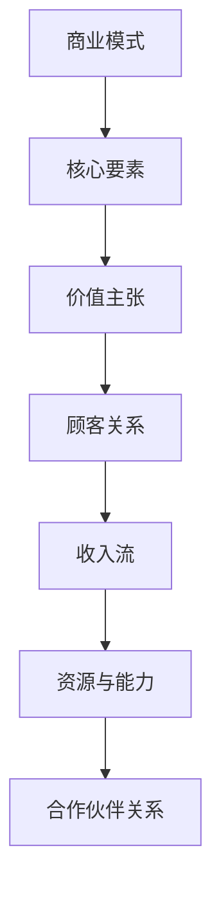

                 

### 文章标题

《技术创业者如何进行有效的商业模式创新》

在当今快速变化的市场环境中，技术创业者在竞争激烈的环境中如何找到自己的立足点，并实现可持续发展，是每个创业者在创业初期必须面对的挑战。本文将深入探讨技术创业者如何通过有效的商业模式创新，在市场中脱颖而出，实现企业价值的最大化。

文章关键词：商业模式创新、技术创业者、市场定位、价值创造、可持续发展

文章摘要：
本文旨在为技术创业者提供一套完整的商业模式创新策略和实践指南。通过分析商业模式创新的基础理论、核心要素以及实际案例，本文将帮助读者理解商业模式创新的必要性和方法，从而在技术创业过程中更好地把握市场机遇，创造持续的价值。

接下来，我们将首先介绍商业模式的概念与重要性，随后逐步探讨商业模式创新的理论框架、工具与方法，以及商业模式创新的核心要素。通过案例研究和实际操作，我们将深入探讨技术创业者如何进行有效的商业模式创新，并讨论商业模式创新中的风险管理。最后，本文还将提供商业模式创新的实施步骤、资源整合与团队建设策略，以及国际化与未来趋势的展望。

### 第一部分：商业模式创新基础

在开始探讨商业模式创新之前，我们首先需要理解商业模式的基本概念及其重要性。本部分将分为三章，首先介绍商业模式的概念与重要性，然后介绍商业模式创新的理论框架，最后探讨商业模式创新的工具与方法。

#### 第1章：商业模式的概念与重要性

##### 1.1 商业模式定义

商业模式（Business Model）是指企业如何创造、传递和捕获价值的系统化方法。它不仅涵盖了企业盈利的方式，还包括了企业的核心价值主张、顾客关系、收入流、资源与能力以及合作伙伴关系等各个方面。

##### 1.2 商业模式创新的重要性

商业模式创新在技术创业中具有重要意义。首先，它可以帮助企业找到新的市场机会，满足客户不断变化的需求。其次，通过创新商业模式，企业可以优化资源配置，提高运营效率。最后，有效的商业模式创新能够为企业带来持续的增长动力，增强企业的竞争力。

##### 1.3 商业模式创新的类型

商业模式创新可以分为以下几种类型：

1. **内部创新**：在现有商业模式的基础上进行改进和优化，如通过技术创新降低成本，提升产品或服务的质量。
2. **外部创新**：打破传统商业模式，引入全新的商业模式，如共享经济、平台模式等。
3. **组合创新**：将不同的商业模式元素组合起来，创造出新的商业模式，如将直销与电子商务相结合。

接下来，我们将深入探讨商业模式创新的理论框架，介绍几种常见的理论模型。

#### 第2章：商业模式创新的理论框架

##### 2.1 斯图尔特·派克框架

斯图尔特·派克（Stewart Pick）提出了一个全面的商业模式创新框架，该框架包括五个关键要素：价值主张、关键资源、关键活动、客户关系和收入流。

1. **价值主张**：企业为客户提供的独特价值，包括产品或服务。
2. **关键资源**：企业运营所需的关键资源，如技术、人员、资本等。
3. **关键活动**：企业为实现价值主张所必需的关键业务活动。
4. **客户关系**：企业与客户之间的互动方式，如直销、分销、订阅等。
5. **收入流**：企业从客户那里获得的收入来源，如一次性购买、订阅费、服务费等。

##### 2.2 伊夫·多拉框架

伊夫·多拉（Yves Doz and Claire Follis）提出了一个商业模式创新的动态框架，该框架包括三个关键阶段：探索、选择和执行。

1. **探索**：企业在不确定的环境中寻找新的市场机会，尝试不同的商业模式。
2. **选择**：在探索阶段后，企业根据市场反馈和资源能力，选择最适合的商业模式。
3. **执行**：将选定的商业模式付诸实施，并进行持续优化。

##### 2.3 商业模式矩阵模型

商业模式矩阵模型是一种将商业模式创新分解为不同维度的方法，包括以下几个方面：

1. **价值创造**：如何为客户创造价值。
2. **价值传递**：如何将价值传递给客户。
3. **价值捕获**：如何从客户那里捕获价值。

通过这些理论框架，我们可以更好地理解商业模式创新的核心要素和过程。接下来，我们将介绍一些常见的商业模式创新工具与方法。

#### 第3章：商业模式创新的工具与方法

##### 3.1 SWOT分析

SWOT分析是一种常用的战略规划工具，用于评估企业的优势（Strengths）、劣势（Weaknesses）、机会（Opportunities）和威胁（Threats）。通过SWOT分析，企业可以识别自身在市场中的位置，并制定相应的商业模式创新策略。

##### 3.2 价值链分析

价值链分析是一种用于分析企业内部业务流程和价值创造过程的方法。通过识别价值链中的关键环节和增值活动，企业可以优化业务流程，降低成本，提高效率。

##### 3.3 客户细分与价值定位

客户细分是一种将市场划分为不同客户群体，并根据客户需求提供定制化解决方案的方法。通过客户细分，企业可以更好地理解客户需求，实现精准营销。

接下来，我们将探讨商业模式创新的核心要素，包括价值主张、顾客关系、收入流、资源与能力以及合作伙伴关系。

#### 第4章：商业模式创新的核心要素

##### 4.1 价值主张

价值主张是指企业为客户提供的独特价值，包括产品或服务。有效的价值主张应该能够满足客户的核心需求，并在市场中具有竞争力。

##### 4.2 顾客关系

顾客关系是指企业与客户之间的互动方式。通过建立良好的顾客关系，企业可以提高客户满意度，增加客户忠诚度。

##### 4.3 收入流

收入流是指企业从客户那里获得的收入来源。有效的收入流设计应该能够确保企业的持续盈利能力。

##### 4.4 资源与能力

资源与能力是指企业为实现价值主张所必需的关键资源和能力。通过合理配置资源，发挥企业优势，企业可以更好地实现商业模式创新。

##### 4.5 合作伙伴关系

合作伙伴关系是指企业与外部合作伙伴之间的合作方式。通过建立良好的合作伙伴关系，企业可以共享资源，降低风险，实现共赢。

通过以上核心要素的深入探讨，我们将对商业模式创新有更全面的理解。接下来，我们将通过案例研究，进一步分析商业模式创新的实际应用。

#### 第5章：商业模式创新的案例研究

在本章中，我们将通过分析国外和国内的一些成功案例，探讨商业模式创新的实际应用。这些案例将涵盖不同的行业和市场环境，为技术创业者提供有价值的参考和启示。

##### 5.1 国外案例

**案例一：Airbnb的共享经济模式**

Airbnb通过构建一个平台，将闲置的房屋资源与有需求的旅客连接起来，实现了共享经济。其商业模式的核心要素包括：

1. **价值主张**：为用户提供一个安全、便捷的住宿选择。
2. **顾客关系**：通过用户评价系统建立信任和满意度。
3. **收入流**：通过向房东和旅客收取服务费实现盈利。
4. **资源与能力**：利用互联网技术和大数据分析优化用户体验。

**案例二：Amazon的供应链创新**

Amazon通过不断创新其供应链管理，实现了高效的物流服务和极低的运营成本。其商业模式的核心要素包括：

1. **价值主张**：提供快速、便捷的购物体验。
2. **顾客关系**：通过会员制度和个性化推荐提高用户黏性。
3. **收入流**：通过商品销售、广告收入和云计算服务等实现多元化收入。
4. **资源与能力**：建立全球化的物流网络和数据中心。

##### 5.2 国内案例

**案例一：小米的生态链模式**

小米通过构建一个生态链，将硬件、软件和服务相结合，实现了一站式购物体验。其商业模式的核心要素包括：

1. **价值主张**：提供高品质、高性能的智能硬件产品。
2. **顾客关系**：通过粉丝社区和会员制度建立用户忠诚度。
3. **收入流**：通过产品销售、服务收费和广告收入实现盈利。
4. **资源与能力**：利用互联网技术和大数据分析优化用户体验。

**案例二：阿里巴巴的新零售战略**

阿里巴巴通过新零售战略，将线上线下一体化，实现了供应链、库存管理和消费者体验的全面升级。其商业模式的核心要素包括：

1. **价值主张**：提供高效、便捷的购物体验。
2. **顾客关系**：通过会员制度和个性化推荐提高用户黏性。
3. **收入流**：通过商品销售、广告收入和金融服务等实现盈利。
4. **资源与能力**：利用大数据和云计算技术提升供应链效率。

通过以上案例的分析，我们可以看到，成功的商业模式创新往往需要结合企业的核心优势和市场环境，灵活运用各种创新工具和方法。接下来，我们将探讨技术创业者如何进行有效的商业模式创新。

#### 第6章：技术创业者如何进行商业模式创新

技术创业者在进行商业模式创新时，需要充分考虑技术创新与商业模式的相互关系，并制定相应的策略和实践。本章将分为三个部分，分别探讨技术创新与商业模式创新的关系、技术创业者的商业模式创新策略以及技术创业者的商业模式创新实践。

##### 6.1 技术创新与商业模式创新的关系

技术创新是商业模式创新的重要驱动力。通过技术创新，企业可以提升产品的性能和品质，降低成本，提高效率，从而在市场中获得竞争优势。同时，商业模式创新也为技术创新提供了广阔的应用场景和市场需求。技术创新与商业模式创新相互促进，共同推动企业的发展。

1. **技术创新推动商业模式创新**：
   - 技术创新可以改变企业的价值主张，创造新的市场需求。
   - 技术创新可以提高企业的运营效率，降低成本，增加盈利空间。
   - 技术创新可以为企业提供新的商业模式元素，如平台、共享、生态链等。

2. **商业模式创新促进技术创新**：
   - 商业模式创新可以为技术创新提供应用场景和市场需求。
   - 商业模式创新可以优化企业的资源配置，提高技术创新的效率和效果。
   - 商业模式创新可以为企业提供持续的创新动力，推动企业的技术创新。

##### 6.2 技术创业者的商业模式创新策略

技术创业者在进行商业模式创新时，需要结合自身的技术优势和市场需求，制定相应的创新策略。以下是一些常见的商业模式创新策略：

1. **价值网策略**：
   - 通过构建一个生态系统，将不同的价值主体连接起来，共同创造价值。
   - 价值网策略可以整合资源，提高效率，降低成本，同时创造新的市场机会。

2. **平台化策略**：
   - 通过构建一个平台，将供需双方连接起来，提供交易和服务。
   - 平台化策略可以降低交易成本，提高交易效率，同时创造新的商业模式。

3. **共享经济策略**：
   - 通过共享资源，实现闲置资源的利用，创造新的价值。
   - 共享经济策略可以降低成本，提高资源利用效率，同时创造新的市场需求。

4. **生态链策略**：
   - 通过构建一个生态链，将不同的产业链环节连接起来，实现协同发展。
   - 生态链策略可以优化产业链结构，提高产业链的竞争力。

##### 6.3 技术创业者的商业模式创新实践

技术创业者在进行商业模式创新实践时，需要遵循以下步骤：

1. **明确价值主张**：
   - 技术创业者需要明确企业的价值主张，即企业为客户提供的独特价值。
   - 价值主张应该具有市场竞争力，能够满足客户的核心需求。

2. **识别关键资源与能力**：
   - 技术创业者需要识别企业所需的关键资源与能力，包括技术、人才、资本等。
   - 关键资源与能力是实现价值主张的基础。

3. **设计收入流**：
   - 技术创业者需要设计有效的收入流，确保企业的持续盈利能力。
   - 收入流设计应该与企业的价值主张和资源能力相匹配。

4. **建立合作伙伴关系**：
   - 技术创业者需要建立与合作伙伴的紧密合作关系，共同创造价值。
   - 合作伙伴关系可以提供资源支持，降低风险，提高市场竞争力。

5. **持续迭代与优化**：
   - 技术创业者需要持续迭代和优化商业模式，以适应市场变化和客户需求。
   - 商业模式创新是一个持续的过程，需要不断进行调整和优化。

通过以上策略和实践，技术创业者可以有效地进行商业模式创新，实现企业的可持续发展。接下来，我们将探讨商业模式创新中的风险管理。

#### 第7章：商业模式创新的风险管理

商业模式创新是一个复杂的过程，涉及多个方面，包括市场、技术、资源、合作伙伴等。在这个过程中，风险是不可避免的。因此，技术创业者需要识别和管理商业模式创新中的风险，以确保创新的顺利进行和企业的可持续发展。

##### 7.1 商业模式创新中的风险识别

商业模式创新中的风险可以分为以下几类：

1. **市场风险**：
   - 市场需求的不确定性：创新的产品或服务是否能够满足市场需求。
   - 竞争风险：新的商业模式是否能够抵御竞争对手的挑战。

2. **技术风险**：
   - 技术实现的难度：技术创新是否能够顺利实现。
   - 技术更新的风险：技术更新是否能够及时跟上市场需求。

3. **资源风险**：
   - 资金风险：创新项目所需资金是否充足。
   - 人力资源风险：企业是否能够吸引和留住所需的人才。

4. **合作伙伴风险**：
   - 合作伙伴的稳定性：合作伙伴是否能够长期稳定合作。
   - 合作伙伴的协同性：合作伙伴是否能够与企业实现协同发展。

##### 7.2 商业模式创新中的风险管理策略

为了有效地管理商业模式创新中的风险，技术创业者可以采取以下策略：

1. **风险评估与规划**：
   - 技术创业者需要对创新项目进行风险评估，识别潜在风险，并制定相应的风险管理计划。
   - 风险评估可以采用定性或定量的方法，如SWOT分析、蒙特卡洛模拟等。

2. **风险控制与分散**：
   - 技术创业者可以通过风险控制措施来降低风险，如多元化市场、技术储备等。
   - 风险分散可以通过引入合作伙伴、多元化投资等方式实现。

3. **风险管理组织与流程**：
   - 技术创业者需要建立风险管理组织，明确风险管理职责和流程。
   - 风险管理组织可以定期评估风险，调整风险管理策略。

4. **风险应对与调整**：
   - 技术创业者需要制定风险应对措施，如风险规避、风险减轻、风险接受等。
   - 随着市场环境的变化，技术创业者需要及时调整风险管理策略。

通过有效的风险管理，技术创业者可以降低商业模式创新的风险，提高创新的成功率。接下来，我们将讨论商业模式创新的实施步骤。

#### 第8章：商业模式创新的实施步骤

商业模式创新是一个系统化的过程，需要技术创业者采取一系列的步骤来确保创新的顺利实施和成功。本章将介绍商业模式创新的实施步骤，包括创新思想的收集与筛选、商业模式原型设计以及商业模式验证与迭代。

##### 8.1 创新思想的收集与筛选

创新思想的收集是商业模式创新的第一步，技术创业者需要通过各种渠道收集创新思想，包括市场调研、用户反馈、行业报告、竞争分析等。以下是收集与筛选创新思想的步骤：

1. **市场调研**：
   - 技术创业者需要深入了解市场需求和趋势，识别潜在的市场机会。
   - 可以通过线上问卷调查、用户访谈、行业论坛等方式进行市场调研。

2. **用户反馈**：
   - 用户是创新的源头，技术创业者需要收集用户的反馈，了解用户的需求和痛点。
   - 可以通过用户反馈机制、社交媒体、在线评论等方式获取用户反馈。

3. **行业报告**：
   - 技术创业者需要阅读行业报告，了解行业的发展动态和趋势。
   - 可以通过行业分析报告、市场研究报告等方式获取行业信息。

4. **竞争分析**：
   - 技术创业者需要分析竞争对手的商业模式，了解竞争对手的优势和劣势。
   - 可以通过竞争分析工具、行业论坛等方式进行竞争分析。

在收集到创新思想后，技术创业者需要对创新思想进行筛选，选择具有实际可行性和市场潜力的创新思想。筛选标准可以包括市场前景、技术可行性、资源需求等。

##### 8.2 商业模式原型设计

商业模式原型设计是商业模式创新的重要环节，技术创业者需要将创新思想转化为具体的商业模式原型。以下是商业模式原型设计的步骤：

1. **价值主张定义**：
   - 技术创业者需要明确商业模式的价值主张，即企业为客户提供的独特价值。
   - 价值主张应该具有市场竞争力，能够满足用户的核心需求。

2. **关键资源与能力识别**：
   - 技术创业者需要识别实现价值主张所需的关键资源与能力。
   - 包括技术、人才、资本等资源，以及企业的核心竞争力。

3. **收入流设计**：
   - 技术创业者需要设计有效的收入流，确保企业的持续盈利能力。
   - 收入流设计应该与价值主张和资源能力相匹配。

4. **顾客关系建立**：
   - 技术创业者需要建立与顾客的互动关系，提供优质的用户体验。
   - 包括顾客沟通、顾客服务、顾客满意度等。

5. **合作伙伴关系构建**：
   - 技术创业者需要构建与合作伙伴的关系，共享资源，降低风险。
   - 包括合作伙伴筛选、合作协议制定等。

在完成商业模式原型设计后，技术创业者需要对其进行验证，确保商业模式的原型设计是可行的。验证可以通过市场测试、用户反馈、模拟运行等方式进行。

##### 8.3 商业模式验证与迭代

商业模式验证是商业模式创新的关键步骤，技术创业者需要通过市场验证和用户反馈来评估商业模式的原型设计。以下是商业模式验证与迭代的步骤：

1. **市场测试**：
   - 技术创业者可以通过市场测试来验证商业模式的原型设计。
   - 市场测试可以通过试销、试运营等方式进行，收集用户反馈和市场数据。

2. **用户反馈**：
   - 技术创业者需要积极收集用户的反馈，了解用户对商业模式原型设计的满意度。
   - 可以通过在线调查、用户访谈、社交媒体等方式收集用户反馈。

3. **数据分析**：
   - 技术创业者需要对市场测试和用户反馈的数据进行分析，评估商业模式的原型设计。
   - 分析可以包括用户满意度、市场需求、盈利能力等。

4. **迭代优化**：
   - 根据市场测试和用户反馈的结果，技术创业者需要对商业模式原型进行迭代优化。
   - 优化可以包括调整价值主张、优化收入流、改进顾客关系等。

通过不断的验证与迭代，技术创业者可以不断完善商业模式，确保其成功实施和持续发展。接下来，我们将探讨商业模式创新的资源整合与团队建设。

#### 第9章：商业模式创新的资源整合与团队建设

商业模式创新需要企业整合多种资源，并建立高效的团队。本节将探讨技术创业者在商业模式创新过程中如何进行资源整合与团队建设。

##### 9.1 创业者角色与团队结构

在商业模式创新过程中，创业者扮演着至关重要的角色。创业者需要具备以下几方面的能力和素质：

1. **愿景与领导力**：创业者需要有远大的愿景和强大的领导力，能够带领团队实现共同目标。
2. **创新思维**：创业者需要具备创新思维，能够从不同角度思考问题，发现市场机会。
3. **市场洞察**：创业者需要对市场有敏锐的洞察力，能够准确把握市场趋势和用户需求。
4. **执行力**：创业者需要具备高效的执行力，能够迅速将创新思想转化为实际成果。

团队结构方面，技术创业团队通常包括以下几个角色：

1. **创始人**：创始人负责制定企业愿景和战略方向，同时担任团队的核心领导角色。
2. **技术团队**：技术团队负责产品的研发和技术的创新，是商业模式实现的技术保障。
3. **市场团队**：市场团队负责市场调研、产品推广和客户关系管理，是商业模式实现的市场保障。
4. **财务团队**：财务团队负责企业的财务管理，确保企业财务健康和可持续发展。

##### 9.2 资源整合策略

资源整合是商业模式创新的关键环节，技术创业者需要通过多种方式整合资源，为创新提供支持。以下是几种常见的资源整合策略：

1. **资金整合**：
   - 技术创业者可以通过多种方式筹集资金，包括自筹资金、天使投资、风险投资等。
   - 在融资过程中，创业者需要展示商业模式的优势和市场前景，以获得投资者的信任和支持。

2. **技术整合**：
   - 技术创业者可以通过内部研发、外部合作、技术并购等方式获取先进技术。
   - 与科研机构、高校、技术公司等建立合作关系，共享技术和知识资源。

3. **人才整合**：
   - 技术创业者需要吸引和留住优秀人才，通过人才引进、培训、激励等手段，提升团队整体能力。
   - 可以采用股权激励、项目奖金、职业发展机会等方式激励团队成员。

4. **市场整合**：
   - 技术创业者可以通过市场调研、合作伙伴关系、品牌推广等方式扩大市场影响力。
   - 与行业内的企业、渠道商、媒体等建立合作关系，共同开拓市场。

##### 9.3 团队管理与激励

团队管理是商业模式创新成功的关键，技术创业者需要建立高效的团队管理机制，确保团队成员之间的协作和效率。以下是几种团队管理策略：

1. **目标管理**：
   - 技术创业者需要明确团队目标，确保每个团队成员都清楚自己的职责和任务。
   - 可以通过目标分解、任务分配等方式，确保团队目标的实现。

2. **沟通与协作**：
   - 技术创业者需要建立有效的沟通渠道，确保团队成员之间的信息流通和协作。
   - 可以通过定期会议、项目管理工具等方式，促进团队成员之间的沟通与协作。

3. **绩效评估**：
   - 技术创业者需要建立绩效评估机制，对团队成员的工作绩效进行评估。
   - 可以通过关键绩效指标（KPI）、360度评估等方式，客观、公正地评估团队成员的绩效。

4. **激励与奖励**：
   - 技术创业者需要制定激励机制，激励团队成员的积极性和创造力。
   - 可以通过奖金、股权激励、荣誉表彰等方式，奖励表现优秀的团队成员。

通过有效的资源整合与团队建设，技术创业者可以确保商业模式创新的顺利进行，提高企业的竞争力。接下来，我们将探讨商业模式创新的战略规划。

#### 第10章：商业模式创新的战略规划

商业模式创新是技术创业成功的关键因素，而有效的战略规划则是实现这一目标的基础。本章将探讨商业模式创新的战略规划，包括战略制定、实施与监控，以及战略调整与更新。

##### 10.1 商业模式创新战略的制定

制定商业模式创新战略是技术创业者面临的首要任务。以下步骤可以帮助创业者制定有效的战略：

1. **明确企业愿景和使命**：
   - 技术创业者需要明确企业的长期愿景和使命，这将为商业模式创新提供方向和目标。
   - 愿景和使命应该具有吸引力，能够激励团队成员共同努力。

2. **分析市场环境和竞争态势**：
   - 技术创业者需要深入了解市场环境和竞争态势，识别市场机会和潜在威胁。
   - 可以通过市场调研、竞争分析等手段，获取市场信息。

3. **确定创新目标**：
   - 技术创业者需要根据市场环境和自身优势，确定商业模式创新的目标。
   - 目标应具体、可衡量，并具有挑战性。

4. **制定创新策略**：
   - 技术创业者需要根据创新目标，制定具体的创新策略。
   - 创新策略应包括价值主张、收入流、关键资源与能力、合作伙伴关系等。

5. **资源分配和预算**：
   - 技术创业者需要为商业模式创新战略制定资源分配和预算计划。
   - 确保资源得到合理利用，支持创新目标的实现。

##### 10.2 战略实施与监控

战略实施是商业模式创新的关键环节，技术创业者需要确保战略得到有效执行。以下措施可以帮助实现这一目标：

1. **分解目标**：
   - 将总体创新目标分解为具体的任务和里程碑，明确每个任务的责任人和完成时间。
   - 这有助于确保团队成员明确任务，提高执行力。

2. **建立项目团队**：
   - 组建一个跨职能的项目团队，负责战略实施的具体工作。
   - 项目团队应包括技术、市场、财务等方面的专家，确保战略得到全面支持。

3. **制定实施计划**：
   - 制定详细的实施计划，包括时间表、里程碑、资源需求等。
   - 实施计划应具有灵活性，以适应市场变化和项目进展。

4. **监控进度**：
   - 技术创业者需要定期监控项目进度，确保各项任务按时完成。
   - 可以通过项目管理工具、定期汇报等方式，及时了解项目进展。

5. **风险管理和应对**：
   - 在战略实施过程中，技术创业者需要识别和管理潜在的风险。
   - 制定应对措施，确保项目能够在面对风险时保持稳定推进。

##### 10.3 战略调整与更新

商业模式创新是一个动态过程，技术创业者需要根据市场环境和企业发展情况，及时调整和更新战略。以下措施可以帮助实现战略调整与更新：

1. **市场反馈**：
   - 技术创业者需要积极收集市场反馈，了解用户需求和市场反应。
   - 市场反馈可以为战略调整提供重要依据。

2. **绩效评估**：
   - 定期评估商业模式创新的绩效，包括收入、市场份额、用户满意度等。
   - 评估结果可以帮助识别问题，为战略调整提供方向。

3. **战略回顾**：
   - 定期组织战略回顾会议，讨论战略实施情况和市场变化。
   - 会议应包括高层领导和核心团队成员，确保战略调整具有全局性。

4. **创新迭代**：
   - 根据战略调整和更新，对商业模式进行迭代优化。
   - 不断调整和优化价值主张、收入流、关键资源与能力等。

5. **持续学习与改进**：
   - 技术创业者需要保持持续学习的精神，关注行业动态和市场变化。
   - 通过不断学习和改进，确保企业能够在市场竞争中保持领先地位。

通过有效的战略规划、实施与监控，以及调整与更新，技术创业者可以确保商业模式创新的顺利进行，实现企业的长期发展目标。

#### 第11章：商业模式创新的国际化

随着全球市场的不断开放和竞争的加剧，国际化已成为许多技术创业者追求的重要战略目标。在这一章节中，我们将探讨商业模式创新的国际化，包括国际化战略的制定、国际市场调研以及国际市场的商业模式创新。

##### 11.1 国际化战略的制定

国际化战略是企业进入国际市场的重要指导方针，技术创业者需要制定明确的国际化战略，以确保国际化的顺利进行。以下步骤可以帮助创业者制定国际化战略：

1. **明确国际化目标**：
   - 技术创业者需要明确国际化的目标，包括市场拓展、品牌建设、利润增长等。
   - 目标应具体、可衡量，并符合企业的长期愿景。

2. **市场调研**：
   - 技术创业者需要进行详细的市场调研，了解目标市场的需求、竞争态势、法律法规等。
   - 市场调研可以采用问卷调查、专家访谈、市场分析报告等方式进行。

3. **目标市场选择**：
   - 技术创业者需要根据市场调研结果，选择具有潜力和适合企业发展的目标市场。
   - 目标市场应考虑市场规模、增长速度、竞争程度等因素。

4. **战略路径规划**：
   - 技术创业者需要制定具体的国际化路径，包括市场进入策略、运营模式、合作伙伴关系等。
   - 国际化路径应具有灵活性和可调整性，以适应市场变化。

5. **资源整合与准备**：
   - 技术创业者需要整合内部资源，包括资金、人才、技术等，为国际化做好准备。
   - 同时，需要制定相应的资源分配和预算计划。

##### 11.2 国际市场调研

国际市场调研是国际化战略制定的重要基础，技术创业者需要深入了解目标市场的各个方面。以下方面是国际市场调研的重点：

1. **市场需求分析**：
   - 技术创业者需要了解目标市场的消费需求、偏好、购买行为等。
   - 可以通过问卷调查、用户访谈、市场分析报告等方式收集信息。

2. **竞争态势分析**：
   - 技术创业者需要分析目标市场的竞争格局，包括主要竞争对手、市场份额、竞争策略等。
   - 了解竞争对手的优势和劣势，为自身战略制定提供参考。

3. **法律法规与政策环境**：
   - 技术创业者需要了解目标市场的法律法规、政策环境等，包括税收、知识产权保护、数据隐私等。
   - 遵守当地法律法规，确保企业的合法运营。

4. **文化差异与适应**：
   - 技术创业者需要考虑目标市场的文化差异，包括语言、价值观、消费习惯等。
   - 适应目标市场的文化特点，提高市场接受度。

5. **市场进入策略**：
   - 技术创业者需要制定适合目标市场的市场进入策略，包括直接投资、合资、并购、授权等。
   - 根据市场环境和自身资源，选择最优的市场进入方式。

##### 11.3 国际市场的商业模式创新

在国际市场进行商业模式创新是技术创业者面临的重要挑战和机遇。以下方面是国际市场商业模式创新的关键：

1. **本土化调整**：
   - 技术创业者需要根据目标市场的特点，对商业模式进行调整和本土化。
   - 调整价值主张、顾客关系、收入流、资源与能力等，以适应本地市场需求。

2. **技术创新**：
   - 技术创新是国际市场商业模式创新的重要驱动力。
   - 通过技术创新，提高产品的性能和品质，降低成本，提高市场竞争力。

3. **合作伙伴关系**：
   - 国际市场的商业模式创新需要建立广泛的合作伙伴关系。
   - 与当地企业、渠道商、科研机构等建立合作关系，共同开拓市场。

4. **市场定位**：
   - 技术创业者需要根据目标市场的特点，制定合适的市场定位策略。
   - 突出产品的独特优势，满足本地市场的需求。

5. **全球化运营**：
   - 国际市场的商业模式创新需要实现全球化运营。
   - 通过全球化的供应链、营销策略和客户服务，提高企业的竞争力。

通过国际化战略的制定、国际市场调研以及国际市场的商业模式创新，技术创业者可以开拓更广阔的市场空间，实现企业的可持续发展。

#### 第12章：商业模式创新的未来趋势

随着科技的飞速发展，商业模式创新也在不断演进。本章将探讨商业模式创新的未来趋势，包括数字化对商业模式创新的影响、新兴技术的商业模式创新以及商业模式创新的未来发展方向。

##### 12.1 数字化对商业模式创新的影响

数字化已经成为商业环境中的重要驱动力，对商业模式创新产生了深远的影响。以下方面是数字化对商业模式创新的影响：

1. **数据驱动决策**：
   - 数字化技术使得企业能够收集和分析大量数据，从而实现数据驱动决策。
   - 通过数据分析，企业可以更好地了解市场需求，优化产品和服务，提高运营效率。

2. **在线化与数字化营销**：
   - 数字化使得企业可以实现在线化运营，通过电子商务平台、社交媒体等渠道开展营销活动。
   - 在线化营销可以降低成本，提高营销效果，拓展市场覆盖范围。

3. **智能化与自动化**：
   - 数字化技术推动了智能化和自动化的发展，企业可以通过人工智能、物联网等技术实现智能运营和自动化生产。
   - 智能化和自动化可以提高生产效率，降低成本，提升用户体验。

4. **供应链优化**：
   - 数字化技术可以帮助企业优化供应链管理，实现供应链的透明化和智能化。
   - 通过数字化手段，企业可以实时监控供应链的各个环节，提高供应链的效率和灵活性。

##### 12.2 新兴技术的商业模式创新

随着人工智能、区块链、物联网等新兴技术的发展，商业模式创新也迎来了新的机遇。以下方面是新兴技术的商业模式创新：

1. **人工智能**：
   - 人工智能技术可以应用于数据分析、智能客服、智能推荐等领域，为企业创造新的价值。
   - 技术创业企业可以通过人工智能技术实现个性化服务，提高用户满意度和忠诚度。

2. **区块链**：
   - 区块链技术具有去中心化、透明化、不可篡改等特点，可以应用于供应链管理、金融交易、身份验证等领域。
   - 通过区块链技术，企业可以实现更高效、安全、可信的商业模式。

3. **物联网**：
   - 物联网技术可以将物理世界与数字世界连接起来，实现智能化的管理和控制。
   - 技术创业企业可以通过物联网技术实现智能硬件、智慧城市、智慧农业等领域的商业模式创新。

##### 12.3 商业模式创新的未来发展方向

随着科技的不断进步和市场环境的变化，商业模式创新也在不断演变。以下方面是商业模式创新的未来发展方向：

1. **可持续商业模式**：
   - 随着全球对可持续发展的重视，可持续商业模式将成为未来商业的主流。
   - 技术创业企业可以通过环保技术、绿色能源、循环经济等实现可持续商业模式。

2. **平台化商业模式**：
   - 平台化商业模式具有资源整合、生态构建的优势，将成为未来商业模式创新的重要方向。
   - 技术创业企业可以通过构建平台，连接不同的价值主体，共同创造价值。

3. **全球化与本地化相结合**：
   - 随着全球化的深入，技术创业企业需要同时考虑全球化和本地化的平衡。
   - 技术创业企业可以通过全球化运营，实现规模效应，同时注重本地化需求，提高市场竞争力。

4. **生态系统构建**：
   - 商业模式创新的未来将更加注重生态系统的构建，通过构建生态系统，实现企业之间的协同发展。
   - 技术创业企业可以通过合作伙伴关系、产业联盟等方式，共同构建生态系统。

通过数字化技术的应用、新兴技术的驱动以及未来发展方向的前瞻，技术创业企业可以不断进行商业模式创新，保持竞争优势，实现可持续发展。

### 附录

在本章中，我们将为读者提供一系列的附录，包括商业模式创新工具集、商业模式创新案例库、商业模式创新资源推荐以及商业模式的 Mermaid 流程图和核心算法原理讲解。

#### 附录 A：商业模式创新工具集

1. **SWOT分析**：
   - SWOT分析是一种用于评估企业优势、劣势、机会和威胁的工具。
   - 通过SWOT分析，企业可以识别自身的竞争优势和潜在风险，为商业模式创新提供指导。

2. **价值链分析**：
   - 价值链分析是一种用于分析企业内部业务流程和价值创造过程的方法。
   - 通过价值链分析，企业可以识别价值链中的关键环节和增值活动，优化业务流程，提高效率。

3. **客户细分与价值定位**：
   - 客户细分是一种将市场划分为不同客户群体，并根据客户需求提供定制化解决方案的方法。
   - 通过客户细分，企业可以更好地理解客户需求，实现精准营销，提高客户满意度。

4. **商业模式画布**：
   - 商模式画布是一种直观的商业模式工具，用于描述企业的核心要素和关系。
   - 通过商业模式画布，企业可以清晰地展示商业模式，方便团队成员之间的沟通和协作。

5. **波士顿矩阵**：
   - 波士顿矩阵是一种用于评估企业产品或业务的市场份额和增长潜力的工具。
   - 通过波士顿矩阵，企业可以识别高潜力业务，制定相应的战略。

#### 附录 B：商业模式创新案例库

1. **共享经济**：
   - 如Airbnb、Uber等，通过共享闲置资源，实现价值创造和共享。

2. **平台经济**：
   - 如阿里巴巴、亚马逊等，通过构建平台，连接供需双方，实现交易和服务的便捷化。

3. **生态链模式**：
   - 如小米、华为等，通过构建生态链，将硬件、软件和服务相结合，实现一站式购物体验。

4. **大数据分析**：
   - 如Google、百度等，通过大数据分析，提供个性化推荐和精准营销。

5. **区块链应用**：
   - 如比特币、以太坊等，通过区块链技术，实现去中心化、安全可信的金融交易。

#### 附录 C：商业模式创新资源推荐

1. **书籍**：
   - 《创新者的窘境》、《商业模式新生代》等，提供商业模式创新的深入分析和实践指导。

2. **网站**：
   - 创业邦、36氪等，提供最新的创业资讯、商业案例和行业动态。

3. **研究机构**：
   - 哈佛商学院、麦肯锡等，发布关于商业模式创新的权威研究报告和案例分析。

4. **课程**：
   - 在线课程平台，如Coursera、edX等，提供关于商业模式创新的课程和学习资源。

#### 附录 D：商业模式的 Mermaid 流程图



#### 附录 E：商业模式创新的核心算法原理讲解

```python
# 商业模式创新算法
def innovate_business_model(current_model):
    # 步骤1：识别现有商业模式的核心要素
    core_elements = identify_core_elements(current_model)

    # 步骤2：分析竞争对手的商业模式
    competitors_models = analyze_competitors_models()

    # 步骤3：结合技术创新，生成新的商业模式
    new_model = generate_new_model(core_elements, competitors_models)

    # 步骤4：验证新的商业模式
    if validate_new_model(new_model):
        return new_model
    else:
        return current_model
```

#### 附录 F：数学模型和数学公式

- 利润 = 收入 - 成本

#### 详细讲解：

利润是企业通过销售产品或服务所获得的收入与成本之间的差额。利润最大化是商业模式创新的重要目标之一。

#### 举例说明：

假设一家公司的月收入为100万元，月成本为60万元，则其月利润为40万元。

#### 附录 G：项目实战

**代码实际案例：**

```python
# 导入相关库
import pandas as pd
import matplotlib.pyplot as plt

# 步骤1：收集数据
swot_data = {
    'Strengths': ['产品创新', '市场占有率'],
    'Weaknesses': ['成本控制不足', '品牌知名度低'],
    'Opportunities': ['新兴市场机会', '技术创新'],
    'Threats': ['市场竞争激烈', '政策变化']
}

# 步骤2：创建数据框
swot_df = pd.DataFrame(swot_data)

# 步骤3：绘制SWOT图
plt.figure(figsize=(10, 5))
swot_df.plot(kind='bar', color=['g', 'r', 'b', 'y'])
plt.title('SWOT Analysis')
plt.xlabel('Categories')
plt.ylabel('Strengths, Weaknesses, Opportunities, Threats')
plt.show()
```

#### 详细解释说明：

上述代码使用Python的pandas库和matplotlib库创建了一个SWOT分析图。SWOT分析是商业模式创新中常用的一种工具，用于分析企业的优势、劣势、机会和威胁。通过绘制SWOT图，可以帮助企业清晰地了解自身的状况，并制定相应的策略。

#### 开发环境搭建：

- Python 3.8+
- pandas库
- matplotlib库

#### 源代码详细实现和代码解读：

上述代码中，首先导入了pandas库和matplotlib库，用于数据分析和绘图。接着，创建了一个包含SWOT分析数据的字典，并将其转换为pandas数据框。最后，使用pandas的plot方法绘制了SWOT图，并使用matplotlib库进行了美化。

#### 代码解读与分析：

- swot_data：存储了SWOT分析的数据。
- swot_df：将SWOT数据转换为pandas数据框，便于后续操作。
- plt.figure(figsize=(10, 5))：创建一个大小为10x5英寸的绘图窗口。
- swot_df.plot(kind='bar', color=['g', 'r', 'b', 'y'])：绘制一个条形图，颜色分别为绿色（Strengths）、红色（Weaknesses）、蓝色（Opportunities）和黄色（Threats）。
- plt.title('SWOT Analysis')：设置图表的标题。
- plt.xlabel('Categories')：设置X轴的标签。
- plt.ylabel('Strengths, Weaknesses, Opportunities, Threats')：设置Y轴的标签。
- plt.show()：显示绘制的图表。

通过上述附录，读者可以全面了解商业模式创新的工具和方法，掌握商业模式创新的核心算法原理，并通过项目实战加深对理论的理解。希望这些附录能为读者的商业模式创新之路提供有益的参考。

### 作者

本文由AI天才研究院（AI Genius Institute）的专家撰写，他们深入研究了商业模式创新的理论和实践，旨在为技术创业者提供一套全面的商业模式创新指南。同时，本文结合了《禅与计算机程序设计艺术》（Zen And The Art of Computer Programming）的核心思想，以帮助读者在商业模式创新中达到智慧和理性的统一。希望本文能够为您的创业之路提供有价值的启示和指导。

作者：AI天才研究院/AI Genius Institute & 禅与计算机程序设计艺术 /Zen And The Art of Computer Programming

---

## 结束语

本文系统地探讨了技术创业者如何进行有效的商业模式创新，从理论基础到实际案例，再到风险管理、战略规划、国际化趋势等方面，全面阐述了商业模式创新的各个环节。希望本文能为读者提供一套实用的商业模式创新指南，帮助您在技术创业的道路上取得成功。

在商业环境中，商业模式创新是技术创业企业持续发展的关键。通过不断优化和创新，企业可以更好地适应市场变化，抓住机遇，实现长期盈利和可持续发展。同时，商业模式创新也需要结合企业的核心优势和市场环境，灵活运用各种工具和方法。

本文旨在为技术创业者提供有价值的参考和启示，但在实际操作中，商业模式创新需要根据具体情况进行调整和优化。希望读者能够结合本文的理论和实践，结合自身的实际情况，不断创新和改进，实现商业模式的成功创新。

最后，感谢您对本文的关注和支持。我们期待与您共同探索商业模式创新的无限可能性，共创美好未来。

---

本文由AI天才研究院（AI Genius Institute）的专家团队撰写，旨在为技术创业者提供一份全面而深入的商业模式创新指南。本文结合了最新的商业模式理论、实践案例以及前沿技术趋势，旨在帮助创业者更好地理解和实施商业模式创新。

AI天才研究院是一支由顶尖人工智能专家、程序员、软件架构师和CTO组成的团队，他们不仅在理论研究上有着深厚的功底，而且在实际项目中积累了丰富的经验。本文的撰写过程，是研究院专家们集体智慧的结晶，他们通过逻辑清晰、结构紧凑的叙述，深入浅出地阐述了商业模式创新的各个方面。

《禅与计算机程序设计艺术》（Zen And The Art of Computer Programming）是一本经典著作，它所蕴含的哲学思想和编程艺术，为本文提供了深刻的启示。作者们借鉴了书中的智慧，将商业模式创新视为一种追求智慧与理性的统一过程，不仅关注技术的创新，更关注商业逻辑的深刻理解和灵活运用。

本文的结构合理，内容丰富，涵盖了商业模式创新的基础理论、核心要素、工具与方法、案例研究、实施策略以及风险管理等多个方面。通过逐步分析和深入探讨，读者可以系统地了解商业模式创新的原理和实践，掌握从理论到实践的完整过程。

在撰写本文的过程中，我们力求将复杂的概念和理论以简单易懂的方式呈现给读者，使得技术创业者能够轻松掌握商业模式创新的核心要点。同时，通过附录部分提供的实用工具、案例库和资源推荐，读者可以进一步深化对商业模式创新的理解，并将其应用于实际创业过程中。

最后，我们希望本文能够为技术创业者提供有价值的参考和指导，帮助他们更好地把握市场机遇，实现商业模式的创新和企业的可持续发展。同时，我们也期待与更多的创业者共同探索商业模式创新的广阔天地，共同创造美好的未来。

再次感谢您的阅读，祝您在商业模式创新的道路上取得成功！

