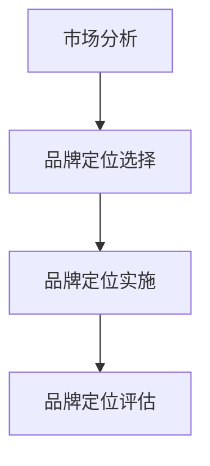

                 

# 技术型创业者的品牌定位与差异化战略

> **关键词**：品牌定位、差异化战略、技术型创业者、市场分析、技术创新、品牌差异化

> **摘要**：本文将探讨技术型创业者在品牌定位和差异化战略方面的重要性，通过分析市场、技术创新以及品牌差异化，为技术型创业者提供实用的策略和实战案例，帮助他们在竞争激烈的市场中脱颖而出。

## 目录大纲

### 第一部分：品牌定位基础理论

1. **品牌定位概述**
   - 品牌定位的定义与重要性
   - 品牌定位的要素分析
   - 品牌定位的战略框架

2. **市场分析与品牌定位**
   - 市场细分策略
   - 市场定位策略
   - 市场趋势与品牌定位

3. **品牌差异化战略**
   - 差异化战略的概念与类型
   - 产品差异化策略
   - 服务差异化策略

4. **品牌定位与差异化战略的关联性**
   - 品牌定位对差异化战略的影响
   - 差异化战略对品牌定位的作用
   - 品牌定位与差异化战略的协同效应

### 第二部分：品牌定位与差异化战略实践

1. **技术型创业者的品牌定位策略**
   - 技术型创业者的品牌定位挑战
   - 技术型创业者的品牌定位步骤
   - 技术型创业者的品牌定位案例分析

2. **差异化战略在技术型创业中的应用**
   - 差异化战略的选择与实施
   - 技术型创业者的差异化策略
   - 差异化战略的实施案例解析

3. **品牌定位与差异化战略的动态调整**
   - 市场环境变化与品牌定位调整
   - 技术创新与差异化战略更新
   - 品牌定位与差异化战略的持续优化

### 第三部分：实战案例分析

1. **技术型创业品牌定位与差异化战略案例分析**
   - 案例一：品牌定位与差异化战略的成功实践
   - 案例二：技术型创业品牌在品牌定位与差异化战略上的挑战与应对
   - 案例三：品牌定位与差异化战略在不同阶段的调整策略

### 附录

1. **品牌定位与差异化战略工具与方法**
   - SWOT分析在品牌定位中的应用
   - 差异化战略分析工具
   - 品牌定位与差异化战略评估方法

2. **参考资料**
   - 主要参考文献
   - 品牌定位与差异化战略相关的网络资源
   - 技术型创业者的品牌定位与差异化战略实战指南

---

### 引言

技术型创业者，是在技术创新与商业实践中寻找机会的一群人。他们凭借技术优势和创业精神，致力于将技术转化为商业价值，推动市场变革。然而，在激烈的市场竞争中，如何打造有竞争力的品牌，如何实现差异化战略，成为技术型创业者面临的重大挑战。

品牌定位与差异化战略，是技术型创业者成功的关键。品牌定位决定了企业在市场中的定位和形象，而差异化战略则帮助企业在众多竞争者中脱颖而出。本文将深入探讨品牌定位与差异化战略的理论基础、实践策略以及案例分析，为技术型创业者提供实用的指导。

首先，我们将介绍品牌定位的基础理论，包括品牌定位的定义、要素和战略框架。接着，我们将分析市场细分策略、市场定位策略以及市场趋势与品牌定位的关系。随后，我们将探讨品牌差异化战略的概念、类型以及产品和服务差异化策略。在此基础上，我们将分析品牌定位与差异化战略之间的关联性，以及它们在技术型创业中的协同效应。

在实践部分，我们将重点关注技术型创业者的品牌定位策略，介绍如何应对品牌定位挑战，并分享成功案例。接着，我们将探讨差异化战略在技术型创业中的应用，分析如何选择和实施差异化战略，并提供实战案例解析。最后，我们将讨论品牌定位与差异化战略的动态调整，包括市场环境变化、技术创新和持续优化策略。

通过本文的深入探讨，我们希望技术型创业者能够更好地理解品牌定位与差异化战略的重要性，掌握相关策略和方法，从而在市场竞争中立于不败之地。

### 第一部分：品牌定位基础理论

#### 第1章：品牌定位概述

品牌定位是一个企业在市场中确立其独特价值和形象的过程。通过品牌定位，企业可以明确自身在消费者心中的位置，从而在激烈的市场竞争中脱颖而出。品牌定位不仅关乎企业的市场营销，更是企业战略的重要组成部分。

### 1.1 品牌定位的定义与重要性

品牌定位（Brand Positioning）是指企业通过一系列策略和手段，将自己与竞争对手区分开来，并在消费者心中塑造独特的形象和认知。品牌定位不仅仅是选择一个市场细分领域，更是一个系统的过程，涉及品牌理念、目标市场、品牌特征等多个方面。

品牌定位的重要性主要体现在以下几个方面：

1. **区分竞争对手**：在竞争激烈的市场中，品牌定位帮助企业在消费者心中建立独特的地位，使其与竞争对手区别开来。

2. **增强品牌认知**：明确的品牌定位有助于提高消费者对品牌的认知度和记忆度，从而增加品牌忠诚度。

3. **提升品牌价值**：通过品牌定位，企业可以塑造出具有高附加值的品牌形象，提升品牌的市场价值。

4. **指导市场营销**：品牌定位为企业的市场营销活动提供了明确的方向，帮助制定有效的营销策略。

### 1.2 品牌定位的要素分析

品牌定位的要素包括品牌理念、目标市场、品牌特征和品牌传播等。

1. **品牌理念**：品牌理念是企业核心价值观的体现，包括品牌使命、愿景和价值观。品牌理念决定了品牌的整体方向和战略目标。

2. **目标市场**：目标市场是品牌定位的核心，包括市场细分、目标客户群体的特征和需求。准确的目标市场定位有助于企业集中资源，提供针对性的产品和服务。

3. **品牌特征**：品牌特征包括品牌名称、标志、设计、声音等，是品牌视觉和听觉的体现。独特的品牌特征有助于提升品牌的识别度和吸引力。

4. **品牌传播**：品牌传播是指企业通过各种渠道和手段，将品牌理念、品牌特征传递给目标市场。有效的品牌传播策略可以增强品牌影响力和认知度。

### 1.3 品牌定位的战略框架

品牌定位的战略框架包括市场分析、品牌定位选择、品牌定位实施和品牌定位评估等步骤。

1. **市场分析**：市场分析是品牌定位的基础，包括市场环境分析、竞争者分析和目标市场分析。通过市场分析，企业可以了解市场的现状和趋势，为品牌定位提供依据。

2. **品牌定位选择**：品牌定位选择是根据市场分析和企业自身特点，确定品牌定位的策略和方向。品牌定位选择可以基于产品特性、市场细分、竞争格局等多方面因素。

3. **品牌定位实施**：品牌定位实施是将品牌定位战略转化为具体行动的过程，包括品牌视觉设计、品牌传播策略、产品和服务设计等。品牌定位实施需要企业各部门的协同合作。

4. **品牌定位评估**：品牌定位评估是定期对品牌定位效果进行监控和评估，包括品牌认知度、市场份额、消费者反馈等指标。通过品牌定位评估，企业可以及时调整品牌定位策略，确保品牌定位的持续有效性。

### 总结

品牌定位是技术型创业者在市场竞争中取得成功的关键因素。通过明确品牌理念、目标市场和品牌特征，并采取有效的品牌传播策略，企业可以在市场中建立独特的品牌形象和认知。品牌定位不仅有助于提高品牌价值和竞争力，还为企业的长期发展奠定了基础。在后续章节中，我们将进一步探讨品牌定位与差异化战略的关联性，以及技术型创业者的品牌定位实践策略。

#### 第2章：市场分析与品牌定位

市场分析是品牌定位的基础，通过深入的市场分析，企业可以了解市场环境、竞争格局和目标市场的需求，从而为品牌定位提供有力支持。市场分析主要包括市场细分策略、市场定位策略和市场趋势与品牌定位的关系。

### 2.1 市场细分策略

市场细分（Market Segmentation）是指将整体市场划分为若干个具有相似需求和特征的子市场，以便企业能够更好地满足不同客户群体的需求。市场细分策略的关键在于找到细分市场的有效标准，常见的细分标准包括以下几类：

1. **地理细分**：根据地理位置将市场划分为不同区域，如国家、地区、城市等级别。地理细分有助于企业根据不同区域的消费习惯和需求制定针对性的营销策略。

2. **人口细分**：根据人口统计数据将市场划分为不同群体，如年龄、性别、收入、教育水平等。人口细分可以帮助企业了解目标客户的基本特征，从而提供更符合他们需求的产品和服务。

3. **行为细分**：根据消费者的行为特征将市场划分为不同群体，如购买频率、购买渠道、品牌忠诚度等。行为细分有助于企业分析消费者的购买行为，制定有针对性的促销策略。

4. **心理细分**：根据消费者的心理特征和生活方式将市场划分为不同群体，如价值观、兴趣爱好、个性特征等。心理细分有助于企业洞察消费者的内心需求，从而提供更加贴心的产品和服务。

### 2.2 市场定位策略

市场定位（Market Positioning）是指企业通过特定的营销策略，将产品或服务在消费者心中确立一个独特的位置。市场定位策略主要包括以下几种：

1. **领导者定位**：企业通过提供优质的产品和服务，在市场中树立领先地位，成为消费者首选的品牌。领导者定位通常适用于市场占有率较高的企业。

2. **跟随者定位**：企业在市场中寻找领导者品牌的弱点，通过模仿和创新，提供相似但更具竞争力的产品或服务。跟随者定位有助于企业迅速在市场中占有一席之地。

3. **差异化定位**：企业通过独特的卖点（USP）或差异化产品，在消费者心中树立独特形象。差异化定位有助于企业在竞争激烈的市场中脱颖而出。

4. **低成本定位**：企业通过降低成本，提供价格更低的产品或服务，吸引价格敏感型消费者。低成本定位适用于价格竞争激烈的市场环境。

5. **市场细分定位**：企业针对特定的市场细分群体，提供量身定制的产品或服务。市场细分定位有助于企业满足不同客户群体的需求，提升客户满意度。

### 2.3 市场趋势与品牌定位

市场趋势（Market Trends）是指市场中出现的长期性、方向性的变化。市场趋势对企业品牌定位具有重要影响，企业需要密切关注市场趋势，及时调整品牌定位策略。以下是一些重要的市场趋势：

1. **技术创新**：随着科技的快速发展，新技术不断涌现，为企业提供了更多创新机会。企业需要紧跟技术趋势，将其融入产品和服务中，以提升竞争力。

2. **消费者行为变化**：消费者的购买习惯、价值观和需求在不断变化，企业需要通过市场研究，了解消费者行为的变化，从而调整品牌定位策略。

3. **数字化转型**：数字化技术已经成为企业运营和营销的重要手段。企业需要通过数字化手段，提升品牌知名度、增强消费者互动和优化客户体验。

4. **可持续发展**：消费者对环保和可持续发展的关注度不断提高，企业需要在其品牌定位中融入可持续发展理念，以赢得消费者青睐。

### 总结

市场分析是品牌定位的重要基础，通过市场细分策略、市场定位策略和市场趋势分析，企业可以更好地了解市场环境、竞争格局和消费者需求，从而为品牌定位提供有力支持。市场分析不仅有助于企业找到目标市场，还为品牌定位策略的制定和实施提供了科学依据。在后续章节中，我们将进一步探讨品牌差异化战略的概念、类型以及其实际应用，帮助技术型创业者更好地实现品牌定位与差异化战略。

#### 第3章：品牌差异化战略

品牌差异化战略（Differentiation Strategy）是企业通过独特的卖点、产品特性或服务优势，在竞争激烈的市场中建立自身品牌形象的过程。品牌差异化战略不仅有助于提升企业的竞争力，还能增强消费者对品牌的认知和忠诚度。本章节将详细探讨品牌差异化战略的概念、类型以及具体实施策略。

### 3.1 差异化战略的概念与类型

品牌差异化战略的核心在于找到与竞争对手不同的独特卖点（Unique Selling Proposition, USP），从而在消费者心中树立独特的品牌形象。差异化战略的类型多种多样，以下是一些常见的类型：

1. **产品差异化**：企业通过在产品功能、设计、质量、原材料等方面进行创新和优化，为消费者提供独特的产品体验。产品差异化可以体现在以下几个方面：
   - **功能特性**：提供独特的功能或性能，如高性能、智能化、易用性等。
   - **外观设计**：独特的外观设计，如时尚、美观、个性化等。
   - **质量标准**：更高的质量标准，如环保材料、高品质制造等。
   - **原材料**：采用独特的原材料，如天然成分、高性能材料等。

2. **服务差异化**：企业通过提供独特的服务体验，如卓越的客户服务、快速响应、定制化服务等，来提升品牌竞争力。服务差异化可以从以下几个方面入手：
   - **客户服务**：提供专业的客户咨询、技术支持、售后服务等。
   - **响应速度**：快速响应用户需求，提供即时的解决方案。
   - **定制化服务**：根据用户需求提供个性化的产品和服务。
   - **增值服务**：提供额外的服务，如培训、安装、维护等。

3. **品牌形象差异化**：企业通过塑造独特的品牌形象，如品牌故事、品牌价值观、品牌文化等，来区别于竞争对手。品牌形象差异化可以从以下几个方面入手：
   - **品牌故事**：讲述品牌背后的故事，增强品牌的情感价值。
   - **品牌价值观**：明确品牌的核心价值观，如创新、诚信、环保等。
   - **品牌文化**：塑造独特的品牌文化，如品牌氛围、员工文化等。

4. **渠道差异化**：企业通过独特的销售渠道或分销模式，来区别于竞争对手。渠道差异化可以从以下几个方面入手：
   - **线上线下融合**：结合线上和线下渠道，提供无缝购物体验。
   - **专属渠道**：建立专属的销售渠道，如品牌专卖店、品牌官网等。
   - **合作伙伴**：与特定的合作伙伴建立合作，如品牌大使、行业专家等。

### 3.2 产品差异化策略

产品差异化策略是品牌差异化战略的重要组成部分。以下是一些具体的产品差异化策略：

1. **技术创新**：通过持续的技术创新，开发具有独特功能和性能的产品。例如，苹果公司的iPhone通过其先进的技术和设计，成为智能手机市场的领导者。

2. **独特设计**：提供独特的外观设计和用户体验。例如，小米公司通过其简约、时尚的产品设计，赢得了大量年轻消费者的青睐。

3. **质量保证**：通过严格的质量控制和检测，确保产品的质量和可靠性。例如，德国制造的产品以其高品质和可靠性著称。

4. **独特功能**：提供具有独特功能或附加价值的产品。例如，亚马逊的Kindle电子书阅读器通过其内置的电子书库和长时间续航功能，吸引了大量读者。

### 3.3 服务差异化策略

服务差异化策略是提高客户满意度和品牌忠诚度的关键。以下是一些具体的服务差异化策略：

1. **卓越的客户服务**：提供专业的客户服务，包括24/7在线支持、快速响应和问题解决。例如，亚马逊的客服团队以其快速、高效的响应和处理能力而闻名。

2. **定制化服务**：根据客户的需求提供个性化的产品和服务。例如，许多高端汽车制造商提供定制化的汽车选项，以满足客户的独特需求。

3. **增值服务**：提供额外的服务，如安装、维护、培训等。例如，许多科技公司提供免费的在线培训课程，帮助客户更好地使用其产品。

4. **客户体验优化**：通过优化客户体验，提升客户的满意度和忠诚度。例如，星巴克通过其舒适的门店环境和优质的服务，打造了独特的客户体验。

### 总结

品牌差异化战略是技术型创业者在市场竞争中脱颖而出的关键。通过产品差异化策略和服务差异化策略，企业可以建立独特的品牌形象，提升市场竞争力。产品差异化策略主要集中在技术创新、独特设计、质量保证和独特功能等方面，而服务差异化策略则关注卓越的客户服务、定制化服务、增值服务和客户体验优化。在后续章节中，我们将进一步探讨品牌定位与差异化战略之间的关联性，以及技术型创业者的品牌定位实践策略。通过深入理解和应用品牌差异化战略，技术型创业者可以在激烈的市场竞争中取得成功。

#### 第4章：品牌定位与差异化战略的关联性

品牌定位（Brand Positioning）与差异化战略（Differentiation Strategy）是企业在市场竞争中取得成功的两大关键要素。它们相互关联，共同作用，帮助企业在消费者心中树立独特的品牌形象。本章节将深入探讨品牌定位对差异化战略的影响、差异化战略对品牌定位的作用以及品牌定位与差异化战略的协同效应。

### 4.1 品牌定位对差异化战略的影响

品牌定位直接影响差异化战略的实施和效果。一个清晰、准确的品牌定位能够为差异化战略提供明确的指导，使其更加具体和有针对性。以下是品牌定位对差异化战略的几个方面影响：

1. **确定差异化方向**：品牌定位明确了企业在市场中的定位和形象，从而为差异化战略指明了方向。企业可以根据品牌定位确定哪些差异化要素最为重要，从而有针对性地进行产品或服务的创新和优化。

2. **指导差异化策略**：品牌定位为差异化战略提供了具体的指导，使企业在产品特性、服务体验、品牌形象等方面有明确的差异化方向。例如，一个定位为高端市场的品牌，其差异化策略可能会集中在高品质、独特设计和服务体验上。

3. **增强差异化效果**：清晰的品牌定位有助于增强差异化战略的效果。当品牌定位与差异化策略相一致时，消费者更容易识别和理解品牌的价值主张，从而提高品牌的差异化优势。

4. **提升品牌价值**：品牌定位通过塑造独特的品牌形象和认知，提升了品牌的价值。一个具有清晰品牌定位的品牌，在消费者心中具有更高的认可度和忠诚度，这有助于品牌在市场竞争中脱颖而出。

### 4.2 差异化战略对品牌定位的作用

差异化战略对品牌定位具有重要的促进作用，它能够增强品牌的市场竞争力，提升品牌形象，从而巩固和扩大品牌的市场份额。以下是差异化战略对品牌定位的几个方面作用：

1. **强化品牌认知**：差异化战略通过独特的卖点、产品特性或服务优势，使品牌在消费者心中留下深刻的印象。这有助于提高品牌的认知度和记忆度，增强消费者对品牌的忠诚度。

2. **提升品牌形象**：差异化战略使品牌在市场中脱颖而出，树立独特的品牌形象。例如，通过技术创新、独特设计或卓越服务，品牌可以塑造出高品质、专业或创新的形象，从而提高品牌的市场地位。

3. **扩大市场份额**：差异化战略有助于企业吸引更多的目标客户，扩大市场份额。通过满足消费者特定的需求和偏好，差异化战略能够吸引那些对独特产品或服务有需求的客户，从而提高品牌的竞争力。

4. **提高品牌价值**：差异化战略通过提供独特的价值主张，提高了品牌在消费者心中的价值。一个具有强大差异化优势的品牌，往往能够获得更高的溢价，从而提升品牌的市场价值。

### 4.3 品牌定位与差异化战略的协同效应

品牌定位与差异化战略的协同效应是指两者相互配合，共同发挥出更大的作用。以下是一些品牌定位与差异化战略协同效应的例子：

1. **协同创新**：品牌定位为差异化战略提供了明确的方向，而差异化战略则为品牌定位提供了具体的内容和实施手段。两者相互促进，共同推动品牌创新。

2. **共同提升品牌价值**：品牌定位通过塑造独特的品牌形象，提升了品牌的价值。差异化战略通过提供独特的卖点或服务优势，进一步增强了品牌的价值。两者共同作用，提高了品牌的市场竞争力。

3. **提升品牌忠诚度**：品牌定位与差异化战略的协同效应，有助于提升消费者对品牌的忠诚度。当品牌定位与差异化战略相一致时，消费者能够感受到品牌的价值，从而增加对品牌的信任和忠诚。

4. **实现长期发展**：品牌定位与差异化战略的协同效应，使品牌能够在市场中持续保持竞争优势。通过不断优化品牌定位和差异化战略，企业可以持续提升品牌价值和市场份额，实现长期发展。

### 总结

品牌定位与差异化战略是相互关联、相互促进的。品牌定位为差异化战略提供了方向和指导，而差异化战略则为品牌定位提供了具体的内容和实施手段。两者共同作用，使品牌能够在市场中脱颖而出，提升品牌价值和竞争力。在技术型创业者的品牌建设过程中，理解品牌定位与差异化战略的关联性，并有效运用这两大战略，是取得成功的关键。在接下来的章节中，我们将进一步探讨技术型创业者的品牌定位策略，以及如何在实际操作中实现品牌定位与差异化战略的协同效应。

### 第一部分：品牌定位基础理论

#### 第1章：品牌定位概述

品牌定位（Brand Positioning）是企业通过一系列策略和手段，在市场中确定其独特价值和形象的过程。品牌定位不仅关乎企业的市场营销，更是企业战略的重要组成部分。通过品牌定位，企业可以明确自身在消费者心中的位置，从而在激烈的市场竞争中脱颖而出。本章将深入探讨品牌定位的定义、重要性以及品牌定位的要素和战略框架。

#### 1.1 品牌定位的定义与重要性

品牌定位（Brand Positioning）是指企业通过一系列策略和手段，将自己与竞争对手区分开来，并在消费者心中塑造独特的形象和认知。品牌定位不仅仅选择一个市场细分领域，更是一个系统的过程，涉及品牌理念、目标市场、品牌特征等多个方面。

品牌定位的重要性主要体现在以下几个方面：

1. **区分竞争对手**：在竞争激烈的市场中，品牌定位帮助企业在消费者心中建立独特的地位，使其与竞争对手区别开来。

2. **增强品牌认知**：明确的品牌定位有助于提高消费者对品牌的认知度和记忆度，从而增加品牌忠诚度。

3. **提升品牌价值**：通过品牌定位，企业可以塑造出具有高附加值的品牌形象，提升品牌的市场价值。

4. **指导市场营销**：品牌定位为企业的市场营销活动提供了明确的方向，帮助制定有效的营销策略。

#### 1.2 品牌定位的要素分析

品牌定位的要素包括品牌理念、目标市场、品牌特征和品牌传播等。

1. **品牌理念**：品牌理念是企业核心价值观的体现，包括品牌使命、愿景和价值观。品牌理念决定了品牌的整体方向和战略目标。

2. **目标市场**：目标市场是品牌定位的核心，包括市场细分、目标客户群体的特征和需求。准确的目标市场定位有助于企业集中资源，提供针对性的产品和服务。

3. **品牌特征**：品牌特征包括品牌名称、标志、设计、声音等，是品牌视觉和听觉的体现。独特的品牌特征有助于提升品牌的识别度和吸引力。

4. **品牌传播**：品牌传播是指企业通过各种渠道和手段，将品牌理念、品牌特征传递给目标市场。有效的品牌传播策略可以增强品牌影响力和认知度。

#### 1.3 品牌定位的战略框架

品牌定位的战略框架包括市场分析、品牌定位选择、品牌定位实施和品牌定位评估等步骤。

1. **市场分析**：市场分析是品牌定位的基础，包括市场环境分析、竞争者分析和目标市场分析。通过市场分析，企业可以了解市场的现状和趋势，为品牌定位提供依据。

2. **品牌定位选择**：品牌定位选择是根据市场分析和企业自身特点，确定品牌定位的策略和方向。品牌定位选择可以基于产品特性、市场细分、竞争格局等多方面因素。

3. **品牌定位实施**：品牌定位实施是将品牌定位战略转化为具体行动的过程，包括品牌视觉设计、品牌传播策略、产品和服务设计等。品牌定位实施需要企业各部门的协同合作。

4. **品牌定位评估**：品牌定位评估是定期对品牌定位效果进行监控和评估，包括品牌认知度、市场份额、消费者反馈等指标。通过品牌定位评估，企业可以及时调整品牌定位策略，确保品牌定位的持续有效性。

### 图 1：品牌定位战略框架

### 1.4 品牌定位与市场环境的互动关系

品牌定位不仅需要考虑企业的内部资源和能力，还需要与市场环境进行互动。市场环境的变化，如技术进步、消费者需求变化、竞争态势等，都会对品牌定位产生影响。因此，企业需要具备灵活的品牌定位策略，能够及时调整和优化品牌定位，以适应市场环境的变化。

### 1.5 品牌定位的核心原则

品牌定位的核心原则包括：

1. **差异化**：品牌定位应突出企业独特的竞争优势，使品牌在市场中具有明显的差异化特征。

2. **一致性**：品牌定位应与企业整体战略和市场营销策略保持一致，形成统一的品牌形象。

3. **目标导向**：品牌定位应明确目标市场，满足目标消费者的需求和期望。

4. **持续优化**：品牌定位需要根据市场环境和竞争态势的变化，持续进行调整和优化。

### 总结

品牌定位是企业竞争战略的重要组成部分，通过明确品牌理念、目标市场、品牌特征和品牌传播策略，企业可以在市场中建立独特的品牌形象和认知。品牌定位不仅有助于提升品牌价值，还能指导企业的市场营销活动，实现长期发展。在后续章节中，我们将进一步探讨市场分析与品牌定位的关系，以及品牌差异化战略的具体实施策略。

### 第5章：技术型创业者的品牌定位策略

#### 5.1 技术型创业者的品牌定位挑战

技术型创业者在品牌定位过程中面临一系列独特的挑战，这些挑战源于技术领域的快速变化、市场竞争的激烈以及客户需求的多样性和不确定性。以下是一些常见的品牌定位挑战：

1. **技术快速迭代**：技术在不断进步，新技术的涌现使产品生命周期缩短，企业需要不断更新和升级产品，以保持竞争力。这给品牌定位带来了挑战，企业需要快速适应技术变化，确保品牌定位与市场趋势保持同步。

2. **激烈的市场竞争**：技术型创业者在面对传统企业和新兴企业的双重竞争时，需要找到独特的品牌定位，以脱颖而出。竞争对手的技术创新、市场策略和品牌影响力都可能对技术型创业者的品牌定位产生负面影响。

3. **客户需求的多样性和不确定性**：客户需求多变，企业需要准确把握客户需求，提供针对性的产品和服务。同时，市场需求的变化也给品牌定位带来了不确定性，企业需要具备灵活的品牌定位策略，以应对客户需求的变化。

4. **资源有限**：技术型创业企业通常在初创阶段资源有限，包括资金、人力和渠道等。品牌定位需要在不多的资源下，实现高效的定位和传播，以最小化成本，最大化品牌影响力。

5. **品牌信任建立**：在技术领域，品牌信任的建立尤为关键。技术型创业企业需要通过技术创新、质量保证和客户服务等多方面努力，赢得客户的信任和忠诚。

#### 5.2 技术型创业者的品牌定位步骤

为了应对上述挑战，技术型创业者可以遵循以下品牌定位步骤：

1. **明确品牌使命和愿景**：品牌定位的第一步是明确品牌使命和愿景。品牌使命回答了企业存在的理由，愿景则描绘了企业未来的发展目标。这一步骤有助于确立品牌的核心价值观和长远发展方向。

2. **分析市场环境**：进行市场环境分析，包括了解市场趋势、竞争格局、目标客户群体等。通过市场环境分析，企业可以识别市场机会和潜在威胁，为品牌定位提供依据。

3. **确定目标市场**：在明确市场环境的基础上，确定目标市场。目标市场应具备明确的特征和需求，以便企业集中资源，提供针对性的产品和服务。

4. **分析自身优势**：分析企业的技术优势、产品优势和服务优势，找出能够为品牌定位提供支持的核心竞争力。了解自身优势有助于企业找到独特的品牌定位。

5. **制定品牌差异化策略**：基于目标市场和自身优势，制定品牌差异化策略。差异化策略应包括产品特性、服务体验、品牌形象等多个方面，使品牌在市场中具有独特的竞争优势。

6. **设计品牌传播策略**：品牌传播策略是实现品牌定位的重要手段。设计有效的品牌传播策略，通过多种渠道和手段传递品牌理念和价值，提升品牌认知度和影响力。

7. **实施和监控品牌定位**：将品牌定位策略付诸实施，并通过定期的品牌监控和评估，确保品牌定位的有效性。根据市场反馈和竞争态势，及时调整品牌定位策略，以适应变化。

### 5.3 技术型创业者的品牌定位案例分析

以下是一个技术型创业者的品牌定位案例：

**案例：XX智能科技公司**

**品牌使命**：通过人工智能技术，提升人类生活品质。

**品牌愿景**：成为全球领先的人工智能解决方案提供商。

**市场分析**：
- 市场趋势：人工智能技术快速发展和广泛应用。
- 竞争格局：市场上存在多个竞争对手，包括传统IT公司和新兴人工智能企业。
- 目标客户群体：企业用户和消费者，特别是对人工智能技术有需求的行业和企业。

**品牌定位步骤**：

1. **明确品牌使命和愿景**：XX智能科技公司明确其品牌使命和愿景，为品牌定位提供了方向。

2. **分析市场环境**：公司进行了详细的市场环境分析，发现人工智能技术在多个行业具有广泛应用前景，但市场竞争也异常激烈。

3. **确定目标市场**：公司确定了以企业用户为主的目标市场，特别是在金融、医疗和教育等对人工智能技术有高需求的行业。

4. **分析自身优势**：公司拥有一支经验丰富的技术团队，在人工智能领域有深厚的积累和多项核心专利。

5. **制定品牌差异化策略**：
   - **产品特性**：提供高性能、定制化的人工智能解决方案。
   - **服务体验**：提供全天候技术支持和服务，确保客户得到及时解决。
   - **品牌形象**：通过企业形象宣传，树立专业、可靠的人工智能品牌形象。

6. **设计品牌传播策略**：公司通过多种渠道进行品牌传播，包括线上广告、行业会议、合作伙伴关系等，提升品牌知名度和影响力。

7. **实施和监控品牌定位**：公司定期评估品牌定位效果，并根据市场反馈进行调整，以保持品牌定位的持续性和有效性。

**案例分析总结**：

XX智能科技公司的品牌定位策略成功应对了技术快速迭代、市场竞争激烈等挑战。通过明确品牌使命和愿景，准确的市场分析，以及差异化的产品和服务策略，公司成功地建立了在人工智能领域的专业品牌形象，赢得了大量客户的信任和忠诚。

#### 总结

技术型创业者在品牌定位过程中面临诸多挑战，但通过科学的品牌定位策略，可以有效地应对这些挑战。明确品牌使命和愿景、深入分析市场环境、确定目标市场、分析自身优势、制定差异化策略和设计有效的品牌传播策略，是技术型创业者成功实现品牌定位的关键。通过成功案例的分析，我们可以看到，技术型创业者在品牌定位策略的指导下，能够在激烈的市场竞争中脱颖而出，实现持续发展。

### 第二部分：品牌定位与差异化战略实践

#### 第6章：差异化战略在技术型创业中的应用

在技术型创业中，差异化战略是企业在激烈的市场竞争中取得优势的重要手段。通过差异化战略，企业可以提供独特的产品或服务，满足消费者特定的需求和偏好，从而在市场中建立独特的品牌形象。本章将探讨差异化战略在技术型创业中的应用，包括差异化战略的选择与实施、技术型创业者的差异化策略以及差异化战略的实施案例解析。

#### 6.1 差异化战略的选择与实施

差异化战略的选择是技术型创业者需要慎重考虑的问题。以下是一些常见的差异化战略选择及其实施要点：

1. **技术创新**：
   - **选择要点**：技术创新是技术型创业者的核心优势，通过持续的技术创新，提供具有独特功能和技术优势的产品。
   - **实施要点**：企业需要持续投入研发资源，关注行业前沿技术，推动产品创新。同时，建立高效的研发团队和创新的研发流程，确保技术创新的可持续性。

2. **产品特性**：
   - **选择要点**：通过产品特性差异化，提供独特的功能、设计或使用体验，满足消费者的特定需求。
   - **实施要点**：深入了解消费者需求，进行市场调研和用户反馈分析，设计具有竞争力的产品特性。同时，确保产品特性的实际可用性和用户体验。

3. **服务优势**：
   - **选择要点**：通过卓越的服务，提供快速响应、定制化服务或增值服务，提升客户满意度。
   - **实施要点**：建立专业的客户服务团队，提供全方位的客户支持。同时，通过数据分析和技术手段，实现个性化服务和高效响应。

4. **品牌形象**：
   - **选择要点**：通过塑造独特的品牌形象，传达企业的价值观、文化和理念，形成独特的品牌认知。
   - **实施要点**：设计具有吸引力的品牌视觉元素，如品牌标志、包装设计等。同时，通过品牌传播和公关活动，提升品牌知名度和美誉度。

5. **渠道创新**：
   - **选择要点**：通过创新的渠道策略，提供独特的购买体验，如线上线下融合、专属渠道等。
   - **实施要点**：结合线上线下渠道，打造无缝购物体验。同时，与行业专家和合作伙伴建立合作关系，拓宽销售渠道。

#### 6.2 技术型创业者的差异化策略

技术型创业者应结合自身优势和市场需求，制定符合自身特点的差异化策略。以下是一些具体的技术型创业者差异化策略：

1. **核心竞争力差异化**：
   - **策略要点**：识别企业的核心竞争力，如技术创新、研发实力或人才团队等，并将其作为差异化策略的核心。
   - **案例**：一家专注于人工智能芯片设计的企业，通过其领先的芯片技术和高效的计算能力，在市场中建立了独特的竞争优势。

2. **用户体验差异化**：
   - **策略要点**：关注用户需求和体验，通过产品和服务设计，提供独特的用户体验。
   - **案例**：一家提供智能家居解决方案的企业，通过其易用性和智能化的产品，赢得了大量用户的青睐。

3. **技术创新驱动**：
   - **策略要点**：以技术创新为核心，持续推动产品和服务创新，保持技术领先优势。
   - **案例**：一家提供区块链技术的企业，通过不断推出创新的应用和服务，成为区块链领域的领军企业。

4. **服务模式差异化**：
   - **策略要点**：通过独特的服务模式，提供个性化的解决方案和增值服务，提升客户满意度。
   - **案例**：一家提供云计算服务的企业，通过其灵活的服务模式和定制化的解决方案，赢得了大量客户的信任。

#### 6.3 差异化战略的实施案例解析

以下是一个技术型创业者的差异化战略实施案例：

**案例：YY科技公司**

**公司背景**：YY科技公司是一家专注于大数据分析和人工智能解决方案的初创企业。

**品牌定位**：通过技术创新和卓越服务，提供领先的大数据分析和人工智能解决方案。

**差异化战略**：
- **技术创新**：公司拥有一支经验丰富的技术团队，专注于大数据和人工智能技术的研发和应用。公司不断推出创新的技术产品，如智能数据分析平台和人工智能算法工具。
- **服务优势**：公司提供定制化的解决方案和全天候技术支持，确保客户能够得到及时、有效的服务。
- **品牌形象**：公司通过专业、可靠的品牌形象设计和有效的品牌传播，树立了良好的市场声誉。

**实施过程**：
1. **技术研发**：公司持续投入研发资源，关注大数据和人工智能技术的最新趋势，推动产品创新。
2. **客户服务**：建立专业的客户服务团队，提供全方位的客户支持，确保客户满意度。
3. **品牌传播**：通过多种渠道进行品牌传播，包括线上广告、行业会议和社交媒体等，提升品牌知名度和美誉度。

**效果评估**：
- **市场份额**：公司通过差异化战略，在短时间内获得了大量客户，市场份额持续增长。
- **客户满意度**：公司提供的定制化解决方案和卓越服务赢得了客户的信任和好评，客户满意度显著提高。
- **品牌认知**：公司的品牌形象得到了市场的广泛认可，品牌知名度显著提升。

**案例分析总结**：

YY科技公司通过技术创新、服务优势和品牌形象差异化，成功实现了在市场竞争中的脱颖而出。公司通过持续的技术研发和卓越的客户服务，赢得了大量客户的信任和忠诚。同时，通过有效的品牌传播，公司树立了专业、可靠的品牌形象，提升了品牌的市场认知度。这一案例展示了差异化战略在技术型创业中的应用效果，为其他技术型创业者提供了有益的借鉴。

#### 总结

差异化战略是技术型创业者在市场竞争中取得优势的关键。通过技术创新、产品特性、服务优势、品牌形象和渠道创新等多种差异化策略，技术型创业者可以建立独特的品牌形象和市场地位。YY科技公司的案例展示了差异化战略的有效实施和显著成效，为其他技术型创业者提供了宝贵的经验。在后续章节中，我们将进一步探讨品牌定位与差异化战略的动态调整，以及在不同市场环境下的策略优化。

### 第7章：品牌定位与差异化战略的动态调整

品牌定位与差异化战略并非一成不变，它们需要根据市场环境、技术创新和消费者需求的变化进行动态调整。这种调整是确保品牌在市场中保持竞争优势、持续发展的重要手段。本章将探讨市场环境变化与品牌定位调整、技术创新与差异化战略更新，以及品牌定位与差异化战略的持续优化。

#### 7.1 市场环境变化与品牌定位调整

市场环境是影响品牌定位的重要因素。以下是一些市场环境变化对品牌定位的影响及相应的调整策略：

1. **技术进步**：随着科技的快速发展，新技术不断涌现，对市场产生深远影响。品牌需要密切关注技术趋势，及时调整品牌定位，以适应新兴技术的应用。

   **调整策略**：
   - **前瞻性定位**：提前布局新技术，将品牌定位与前沿技术相结合，如人工智能、大数据等。
   - **技术创新驱动**：通过持续的技术研发，提升品牌在技术创新领域的竞争力。

2. **消费者行为变化**：消费者的购买习惯、价值观和需求不断变化，品牌需要及时了解和响应这些变化，调整品牌定位。

   **调整策略**：
   - **用户研究**：通过用户调研和数据分析，深入了解消费者需求，调整品牌定位以满足新需求。
   - **品牌故事**：更新品牌故事，反映品牌与消费者之间的情感联系，增强品牌吸引力和认同感。

3. **市场竞争态势**：市场竞争的激烈程度和竞争者的动态也会影响品牌定位。品牌需要根据市场竞争态势，调整品牌定位策略，以保持竞争优势。

   **调整策略**：
   - **差异化优势**：在竞争加剧时，加强品牌的差异化优势，通过独特的产品特性、服务优势等，提升品牌竞争力。
   - **市场细分**：在市场细分中找到新的机会点，针对特定细分市场进行精准定位，以获取更多的市场份额。

#### 7.2 技术创新与差异化战略更新

技术创新是推动品牌发展的关键因素，它要求品牌定位与差异化战略不断更新，以适应技术进步带来的市场变化。以下是一些技术创新对品牌定位与差异化战略更新的影响及调整策略：

1. **新产品开发**：技术创新往往带来新产品的开发机会，品牌需要及时更新产品线，满足市场的新需求。

   **调整策略**：
   - **产品迭代**：持续进行产品迭代，推出具有创新功能的新产品，以保持品牌的竞争力。
   - **用户参与**：通过用户反馈和参与，不断优化新产品，确保产品能够满足消费者的需求。

2. **服务创新**：技术创新不仅体现在产品上，也体现在服务方面。品牌需要通过服务创新，提升用户体验，增强品牌价值。

   **调整策略**：
   - **服务升级**：提供更加智能化、个性化的服务，如在线客服、自助服务系统等，提升用户满意度。
   - **技术融合**：将新技术融入服务中，如人工智能、大数据分析等，提供更加高效、便捷的服务体验。

3. **商业模式创新**：技术创新还可能带来商业模式的变革，品牌需要根据新的商业模式，调整品牌定位和差异化战略。

   **调整策略**：
   - **商业模式重构**：探索新的商业模式，如订阅模式、平台模式等，以适应技术进步和市场变化。
   - **市场拓展**：通过技术创新，开拓新的市场领域，扩大品牌的业务范围。

#### 7.3 品牌定位与差异化战略的持续优化

品牌定位与差异化战略的持续优化是确保品牌长期成功的关键。以下是一些优化策略：

1. **数据驱动**：通过数据分析和市场调研，了解品牌定位和差异化战略的效果，及时进行调整。

   **优化策略**：
   - **数据监测**：建立数据监测系统，实时跟踪品牌表现，包括市场份额、消费者反馈等。
   - **反馈机制**：建立有效的反馈机制，收集消费者和合作伙伴的反馈，用于指导品牌定位和差异化战略的调整。

2. **战略评估**：定期进行战略评估，分析品牌定位和差异化战略的有效性，识别问题和机会。

   **优化策略**：
   - **内部评估**：定期进行内部评估，包括财务分析、市场份额分析等，以评估品牌定位和差异化战略的效果。
   - **外部评估**：邀请外部专家进行评估，获取独立的意见和建议。

3. **持续创新**：品牌定位和差异化战略的优化离不开持续创新，通过不断探索新技术、新产品和新服务，保持品牌的竞争力。

   **优化策略**：
   - **研发投入**：持续增加研发投入，推动技术创新和产品创新。
   - **学习与成长**：鼓励员工不断学习和成长，提升团队的创新能力。

#### 总结

品牌定位与差异化战略的动态调整是技术型创业者在快速变化的市场环境中保持竞争优势的关键。通过及时调整品牌定位，响应市场和技术变化，企业可以确保品牌在市场中持续保持领先地位。技术创新为品牌定位和差异化战略提供了新的机遇和挑战，企业需要不断优化和更新策略，以适应不断变化的市场环境。通过数据驱动、战略评估和持续创新，企业可以不断提升品牌定位和差异化战略的有效性，实现长期发展。在后续章节中，我们将通过实战案例进一步探讨技术型创业者的品牌定位与差异化战略实践。

### 第三部分：实战案例分析

#### 第8章：技术型创业品牌定位与差异化战略案例分析

技术型创业者在品牌定位与差异化战略的实践中，面临着诸多挑战和机遇。本章节将分析几个成功的案例，探讨技术型创业品牌如何通过有效的品牌定位和差异化战略在市场中脱颖而出，并针对不同阶段的调整策略进行详细讨论。

#### 8.1 案例一：品牌定位与差异化战略的成功实践

**公司背景**：小米科技是一家成立于2010年的中国科技企业，专注于智能手机、智能家居及物联网设备的研发与生产。

**品牌定位**：小米科技以“为大众创造更美好的生活”为品牌使命，致力于提供高性能、高性价比的科技产品。

**差异化战略**：
- **产品差异化**：小米通过推出具有高性能和独特设计的产品，如小米手机、小米电视等，吸引了大量年轻消费者。
- **服务差异化**：小米提供高质量的售后服务，包括快速响应的技术支持和灵活的退换货政策，增强了用户黏性。
- **品牌形象**：小米通过“发烧友文化”和社区互动，建立了与消费者紧密联系的强大品牌社区。

**成功实践**：
- **市场拓展**：小米迅速拓展了国际市场，尤其是在印度和东南亚市场，取得了显著的成功。
- **技术创新**：小米持续进行技术创新，推出了多项具有前瞻性的技术，如快速充电、5G通信等。
- **品牌认知**：小米通过有效的品牌传播和营销活动，在全球范围内提升了品牌知名度和影响力。

**案例分析总结**：
小米科技通过明确的品牌定位和差异化的产品和服务策略，成功建立了在全球市场中的领先地位。其灵活的市场拓展和技术创新策略，使其在竞争激烈的市场中脱颖而出。这一案例表明，技术型创业者在品牌定位和差异化战略的实践中，需要密切关注市场和技术变化，持续优化策略，以保持竞争优势。

#### 8.2 案例二：技术型创业品牌在品牌定位与差异化战略上的挑战与应对

**公司背景**：特斯拉（Tesla）是一家成立于2003年的美国电动汽车和清洁能源公司，以其创新的技术和环保理念而闻名。

**品牌定位**：特斯拉以其“加速世界向可持续能源的转变”为使命，致力于提供高性能的电动汽车和清洁能源解决方案。

**差异化战略**：
- **产品差异化**：特斯拉通过推出高性能、豪华的电动汽车，如Model S、Model X等，满足了消费者对高品质、高性能汽车的需求。
- **技术创新**：特斯拉在自动驾驶、电池技术等领域进行了大量研发投入，推动了电动汽车技术的创新。
- **品牌形象**：特斯拉通过独特的设计和创新的营销手段，建立了强大的品牌形象。

**挑战与应对**：
- **技术难题**：电动汽车的续航里程、电池技术和自动驾驶技术是特斯拉面临的主要挑战。特斯拉通过持续的技术创新和研发投入，解决了这些技术难题。
- **市场竞争**：随着越来越多的企业进入电动汽车市场，特斯拉面临激烈的市场竞争。特斯拉通过持续的产品升级和品牌宣传，保持了市场领先地位。
- **政策法规**：电动汽车和清洁能源技术受到各国政策和法规的限制。特斯拉通过积极参与政策制定和合规管理，确保了其业务的可持续发展。

**案例分析总结**：
特斯拉在品牌定位与差异化战略的实践中，面临着诸多挑战。通过技术创新、产品升级和品牌宣传，特斯拉成功应对了这些挑战，并持续保持了在电动汽车市场中的领先地位。这一案例表明，技术型创业者在品牌定位与差异化战略的实践中，需要具备应对挑战的勇气和能力，同时不断优化和更新策略。

#### 8.3 案例三：品牌定位与差异化战略在不同阶段的调整策略

**公司背景**：Facebook（原名Facebook Inc.）是一家成立于2004年的美国社交网络公司，目前是全球最大的社交网络平台。

**品牌定位**：Facebook以“连接世界”为品牌使命，致力于提供便捷的社交平台和丰富的社交功能。

**差异化战略**：
- **平台差异化**：Facebook通过提供多样化的社交功能，如朋友圈、群聊、直播等，满足了用户不同的社交需求。
- **数据差异化**：Facebook通过收集和分析用户数据，提供个性化的内容推荐和广告服务，增强了用户体验。
- **品牌形象**：Facebook通过一系列品牌宣传活动和公益活动，提升了品牌形象和社会责任感。

**不同阶段的调整策略**：
1. **初创阶段**：
   - **品牌定位**：Facebook在初创阶段，以大学生社交为主要目标，建立了简单的社交平台。
   - **差异化战略**：通过快速的用户增长和简单的用户界面设计，Facebook在短时间内积累了大量用户。
2. **成长阶段**：
   - **品牌定位**：随着用户基数的扩大，Facebook逐渐将目标市场扩展到全年龄段，提供多样化的社交功能。
   - **差异化战略**：通过不断推出新的社交功能，如直播、购物等，满足用户不断变化的需求。
3. **成熟阶段**：
   - **品牌定位**：Facebook在成熟阶段，开始注重品牌形象和社会责任，通过公益活动提升品牌声誉。
   - **差异化战略**：通过数据分析和人工智能技术，提供更加个性化、智能化的服务，增强用户黏性。

**案例分析总结**：
Facebook在不同发展阶段，通过调整品牌定位和差异化战略，成功地实现了业务的持续增长和品牌的不断提升。这一案例表明，技术型创业者在品牌定位与差异化战略的实践中，需要根据不同阶段的市场环境和企业发展需求，灵活调整策略，以实现长期成功。

#### 总结

通过以上案例分析，我们可以看到技术型创业品牌在品牌定位与差异化战略的实践中，面临着各种挑战和机遇。成功的品牌定位和差异化战略不仅需要明确的目标和策略，还需要灵活的调整和持续的创新。技术型创业者在实践中需要密切关注市场和技术变化，持续优化品牌定位和差异化战略，以保持竞争优势。在后续的章节中，我们将进一步探讨品牌定位与差异化战略的工具与方法，为技术型创业者提供更实用的指导。

### 附录

#### 附录A：品牌定位与差异化战略工具与方法

品牌定位与差异化战略的实施需要一系列工具和方法的支持。以下介绍几种常用的工具与方法，包括SWOT分析、差异化战略分析工具和品牌定位与差异化战略评估方法。

#### A.1 SWOT分析在品牌定位中的应用

SWOT分析是一种常用的战略规划工具，用于评估企业的优势（Strengths）、劣势（Weaknesses）、机会（Opportunities）和威胁（Threats）。在品牌定位中，SWOT分析可以帮助企业全面了解自身状况和市场环境，为品牌定位提供有力支持。

**步骤**：

1. **优势分析**：识别企业内部的优势，如技术、团队、资源等。
2. **劣势分析**：识别企业内部存在的劣势，如资金、管理、市场等。
3. **机会分析**：分析外部市场环境中的机会，如市场需求、行业趋势等。
4. **威胁分析**：分析外部市场环境中的威胁，如竞争、政策、经济等。

**应用**：

- **品牌定位**：通过SWOT分析，企业可以明确自身的优势和劣势，确定目标市场和差异化策略。
- **市场机会**：识别市场机会，为品牌定位提供方向和依据。
- **风险防范**：识别市场威胁，制定应对策略，降低潜在风险。

#### A.2 差异化战略分析工具

差异化战略分析工具用于帮助企业识别和评估市场差异化机会，制定有效的差异化策略。以下是一些常用的差异化战略分析工具：

1. **差异化矩阵**：差异化矩阵是一种用于分析产品或服务差异化的工具，通过比较不同产品或服务的特性和优势，识别差异化的关键点。

2. **USP（Unique Selling Proposition）分析**：USP分析用于识别和确定企业的独特卖点，帮助企业建立独特的品牌形象和竞争优势。

3. **竞争对手分析**：通过分析竞争对手的产品、服务、品牌定位和差异化策略，企业可以识别自身的差异化机会和挑战。

#### A.3 品牌定位与差异化战略评估方法

品牌定位与差异化战略评估方法用于监控和评估品牌定位和差异化战略的效果，确保企业策略的持续有效性。以下是一些常用的评估方法：

1. **关键绩效指标（KPI）**：通过设定关键绩效指标，如市场份额、品牌认知度、客户满意度等，监控品牌定位和差异化战略的实施效果。

2. **客户反馈**：收集客户反馈，了解他们对品牌定位和差异化战略的看法，及时调整策略。

3. **市场调研**：通过市场调研，分析品牌定位和差异化战略在市场中的表现，识别问题和机会。

#### 附录B：参考资料

**B.1 主要参考文献**

1. Keller, K. L. (2013). Strategic Brand Management: Building, Measuring, and Managing Brand Equity. Pearson Education.
2. Armstrong, G. (2016). Marketing: An Introduction. 7th Edition. Pearson Education.
3. Aaker, D. A. (2010). Brand Relevance: Making Competitors Irrelevant. John Wiley & Sons.

**B.2 品牌定位与差异化战略相关的网络资源**

1. McKinsey & Company. (n.d.). Brand Positioning and Differentiation. Retrieved from https://www.mckinsey.com/business-functions/marketing-and-sales/our-insights/brand-positioning-and-differentiation
2. HubSpot. (n.d.). The Ultimate Guide to Brand Positioning. Retrieved from https://blog.hubspot.com/marketing/brand-positioning
3. Harvard Business Review. (n.d.). Differentiation Strategies. Retrieved from https://hbr.org/product/differentiation-strategies/867934-PDF-ENG

**B.3 技术型创业者的品牌定位与差异化战略实战指南**

1. Lean Startup. (n.d.). How to Develop a Brand Strategy. Retrieved from https://www.leanstack.com/how-to-develop-a-brand-strategy
2. Startup Genome. (n.d.). Positioning Your Startup. Retrieved from https://www.startupgenepool.com/position-your-startup
3. Product School. (n.d.). Building a Brand Strategy for Your Startup. Retrieved from https://productschool.io/blog/building-a-brand-strategy-for-your-startup

通过以上工具和方法的介绍，技术型创业者可以更好地进行品牌定位和差异化战略的实施，确保品牌在竞争激烈的市场中脱颖而出。

### 致谢

在撰写本文的过程中，我们得到了许多专家和同行的宝贵建议和帮助。特别感谢AI天才研究院的各位成员，他们在技术和战略方面提供了深刻的见解。此外，我们还要感谢禅与计算机程序设计艺术的作者，为本文提供了灵感和方向。最后，感谢所有参与讨论和提供反馈的朋友们，他们的支持和鼓励是我们不断前进的动力。作者：AI天才研究院/AI Genius Institute & 禅与计算机程序设计艺术 /Zen And The Art of Computer Programming。

