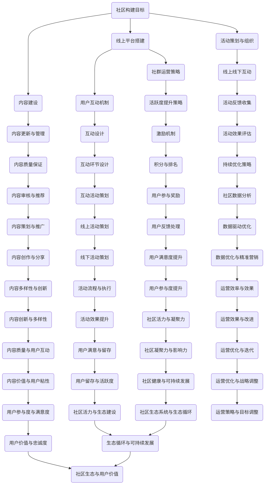

                 

# 《技术社区运营：从线上到线下的生态系统构建》

> **关键词：** 技术社区、运营、生态系统、线上互动、线下活动、活跃度、内容建设

> **摘要：** 本文章将深入探讨技术社区运营的方方面面，从线上社区的基础模式、活跃度提升策略，到线下活动的策划与执行，再到线上线下互动的融合与生态系统的构建。通过理论与实践相结合，提供一套完整的技术社区运营指南。

## 目录大纲

1. **概述与技术基础**
   1.1 技术社区的发展历程
   1.2 技术社区的核心价值
   1.3 技术社区与生态系统

2. **线上社区运营**
   2.1 线上社区的基本模式
   2.2 社区活跃度提升策略
   2.3 社区内容建设

3. **线下活动运营**
   3.1 线下活动的策划与组织
   3.2 线下活动的影响力评估
   3.3 线上线下互动策略

4. **生态系统构建**
   4.1 社区生态系统概述
   4.2 线上生态系统建设
   4.3 线下生态系统建设

5. **成功案例与实践**
   5.1 案例分析
   5.2 实践指南

6. **附录**
   6.1 社区运营工具与资源
   6.2 线上线下互动案例解析

---

## 第一部分：概述与技术基础

### 1.1 技术社区的发展历程

技术社区起源于20世纪80年代，随着互联网的普及和信息共享的需求，程序员和开发者开始在在线平台上分享知识和经验。最早的代表性技术社区如Usenet和Reddit，为技术爱好者提供了交流和学习的平台。

随着时间的推移，技术社区经历了从简单论坛到复杂平台的演变。进入21世纪，以Stack Overflow、GitHub等为代表的现代技术社区，不仅提供了丰富的问答和代码分享功能，还成为了开发者寻找解决方案和项目合作的重要渠道。

#### 技术社区的演变

- **早期阶段（20世纪80年代-2000年代初）**：以论坛和邮件列表为主，技术爱好者在在线平台上分享知识。
- **成长阶段（2000年代初-2010年）**：社交媒体和博客兴起，技术社区开始融入更多互动元素。
- **成熟阶段（2010年至今）**：技术社区功能日益丰富，成为开发者不可或缺的学习和合作平台。

### 1.2 技术社区的核心价值

技术社区的核心价值主要体现在以下几个方面：

1. **知识共享与学习**：技术社区提供了一个开放的平台，使开发者能够分享经验、解决问题和获取最新技术动态。
2. **社交互动与社区凝聚力**：通过线上和线下的活动，技术社区成员能够建立联系，增强归属感和凝聚力。
3. **产业合作与资源整合**：技术社区促进了开发者之间的合作，有助于技术创新和资源共享。

### 1.3 技术社区与生态系统

技术社区在生态系统中的角色日益重要，它不仅是知识传播的载体，也是创新和合作的源泉。技术社区与线上平台的融合，使得知识的获取和传播更加高效。同时，通过线上线下活动的结合，技术社区的影响力得以进一步扩大。

#### 技术社区与线上平台的融合

- **平台功能整合**：技术社区与线上平台深度整合，提供问答、博客、代码仓库等功能。
- **用户互动增强**：通过在线活动和社区互动，增强用户粘性和参与度。

### 总结

技术社区的发展历程和核心价值表明，它不仅是开发者学习和交流的平台，更是技术创新和产业合作的催化剂。通过线上线下活动的结合，技术社区的影响力得以不断提升。在接下来的章节中，我们将详细探讨线上和线下社区运营的策略和实践。

## 第二部分：线上社区运营

### 2.1 线上社区的基本模式

线上社区的基本模式主要包括论坛、博客、问答平台和社交媒体等。每种模式都有其独特的特点和适用场景，下面将分别介绍。

#### 论坛

论坛是最早的技术社区形式之一，它通常由多个板块组成，每个板块对应一个特定的主题。论坛的特点是结构化、信息量大，适合进行深度讨论和知识积累。

**主要特点：**

- **板块化**：将内容分类，便于用户查找和参与。
- **帖子和回复**：用户可以发布帖子并回复他人，形成互动。
- **管理员和版主**：社区管理者负责维护秩序和内容质量。

**适用场景：** 论坛适合技术讨论、学术交流等需要深度讨论的场景。

#### 博客

博客是个人或组织发布文章的在线平台，通常以文章形式呈现。博客的特点是内容形式多样，可以包括文字、图片、视频等。

**主要特点：**

- **文章形式**：博客以文章为主，内容形式多样。
- **评论功能**：用户可以对文章进行评论，增加互动性。
- **作者身份**：博客通常有一个明确的作者或组织。

**适用场景：** 博客适合知识分享、个人品牌建设等场景。

#### 问答平台

问答平台如Stack Overflow、GitHub Issues等，以问题解答为核心，提供快速的技术支持。

**主要特点：**

- **问题导向**：用户可以提出问题，其他用户回答。
- **标签和分类**：问题通过标签和分类进行组织，便于检索。
- **专业认证**：一些问答平台对用户和内容进行专业认证。

**适用场景：** 问答平台适合技术支持、知识检索等场景。

#### 社交媒体

社交媒体平台如微博、微信等，以即时通讯和社交网络为核心，提供信息传播和互动交流的功能。

**主要特点：**

- **即时性**：信息传播速度快，互动即时。
- **社交网络**：用户可以关注其他用户，形成社交网络。
- **多元化内容**：支持多种形式的内容，如文字、图片、视频等。

**适用场景：** 社交媒体适合信息传播、品牌推广等场景。

### 2.2 社区活跃度提升策略

社区活跃度是衡量社区运营效果的重要指标，提高社区活跃度需要从多个方面进行策略制定和执行。

#### 用户参与度提升方法

1. **激励机制**：通过积分、排名等机制激励用户参与社区活动。
2. **互动设计**：设计有趣的互动活动，如投票、问答竞赛等，增加用户粘性。
3. **内容推荐**：利用算法推荐用户感兴趣的内容，提高用户参与度。

#### 社区内容更新与管理

1. **内容规划**：定期发布有价值的内容，保持社区内容的新鲜度。
2. **内容审核**：建立内容审核机制，保证社区内容的质量和规范性。
3. **用户参与**：鼓励用户参与内容创作和分享，提高社区内容的多样性和互动性。

### 2.3 社区内容建设

社区内容是社区的核心，高质量的内容能够吸引用户参与和传播。以下是社区内容建设的关键策略：

1. **内容规划**：根据用户需求和社区主题，制定内容规划，确保内容与用户相关性。
2. **内容创作**：鼓励专业作者和用户共同创作内容，提高内容的专业性和多样性。
3. **内容推广**：利用社交媒体、邮件列表等渠道，推广社区内容，扩大影响力。

### 总结

线上社区运营的基本模式包括论坛、博客、问答平台和社交媒体等，每种模式都有其独特的特点和适用场景。提高社区活跃度需要从用户参与度和内容更新管理等方面进行策略制定和执行。社区内容建设是社区运营的核心，需要制定详细的内容规划和推广策略。在下一部分，我们将探讨线下活动的运营。

## 第三部分：线下活动运营

### 3.1 线下活动的策划与组织

线下活动是技术社区的重要组成部分，它不仅能够增强社区成员之间的互动，还能提升社区的凝聚力和影响力。以下是线下活动策划与组织的关键步骤：

#### 活动主题的确定

确定活动主题是线下活动策划的第一步，主题应与社区的核心价值和用户需求紧密相关。以下是一些建议：

- **技术讲座和研讨会**：围绕热门技术话题，邀请行业专家进行讲解和讨论。
- **技术沙龙和聚会**：为社区成员提供一个交流和互动的平台。
- **代码马拉松和Hackathon**：鼓励开发者进行技术实践和项目开发。

#### 活动流程的设计

活动流程的设计是确保活动顺利进行的关键，以下是一些关键环节：

- **宣传和报名**：通过社交媒体、邮件列表等渠道宣传活动，设置报名环节，收集参与者的信息。
- **场地安排**：根据活动规模和需求，选择合适的场地，确保场地设施满足活动要求。
- **嘉宾邀请**：根据活动主题，邀请相关领域的专家和嘉宾进行分享和讨论。
- **现场安排**：布置现场，设置演讲台、投影仪、音响等设备，确保活动顺利进行。

#### 活动筹备

活动筹备是确保活动顺利进行的重要环节，以下是一些关键任务：

- **人员分工**：明确各个职责，确保各个环节都有人负责。
- **物资准备**：准备必要的物资，如音响设备、投影仪、PPT模板等。
- **应急预案**：制定应急预案，应对可能出现的突发情况。

### 3.2 线下活动的影响力评估

评估线下活动的影响力是衡量活动效果的重要手段，以下是一些常用的评估指标和方法：

#### 活动效果的衡量指标

- **参与人数**：活动参与人数是衡量活动影响力的直接指标。
- **参与度**：通过问卷调查、现场互动等方式，评估参与者的参与度和满意度。
- **媒体报道**：通过媒体报道和社交媒体的传播效果，评估活动的社会影响力。
- **用户反馈**：收集参与者的反馈意见，了解活动的优缺点，为后续活动提供改进方向。

#### 活动反馈的收集与处理

收集活动反馈是评估活动效果的重要步骤，以下是一些方法：

- **问卷调查**：通过在线问卷或现场问卷，收集参与者的反馈意见。
- **访谈**：对部分参与者进行深度访谈，了解他们的详细感受和建议。
- **社交媒体**：通过社交媒体平台，收集活动相关的评论和讨论，分析参与者的反馈。

#### 活动反馈的处理

处理活动反馈是优化活动的重要环节，以下是一些建议：

- **分析反馈**：对收集到的反馈进行分类和分析，识别出活动的优点和不足。
- **改进措施**：根据反馈，制定相应的改进措施，优化活动流程和内容。
- **反馈报告**：撰写活动反馈报告，向社区成员和管理者汇报活动效果和改进措施。

### 3.3 线上线下互动策略

线上线下互动策略是将线上社区与线下活动有机结合，提高社区活跃度和影响力的关键。以下是一些有效的互动策略：

#### 线上互动与线下活动的结合

- **预告和回顾**：在活动前，通过线上渠道预告活动内容，吸引更多人参与；在活动后，通过线上平台发布活动回顾和精华内容，扩大活动影响力。
- **直播和同步**：通过线上直播和同步，让无法现场参与的社区成员也能实时了解活动动态。
- **互动环节**：在活动现场设置互动环节，如问答环节、抽奖环节等，增强现场氛围和用户参与感。

#### 社区成员的互动与参与

- **线上线下联动**：鼓励线上社区成员参与线下活动，反之亦然，通过线上线下联动的活动形式，增强社区成员的互动和参与。
- **主题讨论**：围绕活动主题，在线上社区组织主题讨论，激发社区成员的思考和参与。
- **合作与交流**：鼓励线下活动中的合作与交流，通过线上平台分享合作成果和经验，促进社区成员之间的合作和交流。

### 总结

线下活动运营是技术社区不可或缺的一部分，通过精心策划和组织，线下活动能够增强社区成员的互动和凝聚力，提升社区的影响力。通过线上线下互动策略，能够将线上社区与线下活动有机结合，形成强大的社区生态系统。在下一部分，我们将探讨如何构建线上和线下的生态系统。

## 第四部分：生态系统构建

### 4.1 社区生态系统概述

社区生态系统是指由多个相互关联的组成部分构成的整体，这些组成部分包括社区成员、内容、互动、活动等。社区生态系统具有以下几个特点：

1. **多样性**：社区生态系统包含多种类型的成员和丰富的内容，形成多样化的互动和活动。
2. **动态性**：社区生态系统不断发展和变化，随着新成员的加入和活动的开展，生态系统的结构和功能也在不断调整。
3. **协同性**：社区成员和活动之间相互促进，形成协同效应，共同推动社区的发展。

#### 社区生态系统的构成

- **社区成员**：包括开发者、技术人员、爱好者等，是社区生态系统的基础。
- **内容**：包括文章、问答、视频等，是社区成员互动和学习的载体。
- **互动**：包括评论、点赞、分享等，是社区成员之间交流和合作的桥梁。
- **活动**：包括线上活动、线下活动等，是社区生态系统的活力来源。

#### 社区生态系统的价值

社区生态系统为社区成员提供了以下几个价值：

- **知识共享与学习**：通过丰富的内容和互动，社区成员可以轻松获取知识和技能，进行学习和发展。
- **社交互动与凝聚力**：通过互动和活动，社区成员之间建立联系，增强归属感和凝聚力。
- **产业合作与资源整合**：社区生态系统促进了开发者之间的合作和资源整合，推动了技术创新和产业发展。

### 4.2 线上生态系统建设

线上生态系统建设是技术社区运营的关键环节，以下是一些关键策略：

#### 线上平台搭建

线上平台是社区生态系统的基础，其搭建需要考虑以下几个方面：

- **功能**：平台需要具备论坛、博客、问答、社交媒体等功能，满足社区成员的不同需求。
- **用户体验**：界面简洁、操作便捷、响应快速，提供良好的用户体验。
- **安全性**：确保平台数据的安全，防止数据泄露和恶意攻击。

#### 社群运营策略

社群运营是提升社区活跃度和用户粘性的重要手段，以下是一些有效的社群运营策略：

- **内容策划**：定期发布有价值的内容，保持社区内容的新鲜度和相关性。
- **互动激励**：通过积分、排名等激励机制，鼓励用户参与互动。
- **活动组织**：定期组织线上活动，如讲座、沙龙、代码挑战等，增强用户参与感。
- **用户管理**：建立用户档案，了解用户需求和兴趣，提供个性化服务。

#### 线上互动机制

线上互动机制是社区生态系统的核心，以下是一些有效的互动机制：

- **评论与点赞**：用户可以对内容进行评论和点赞，增加互动性。
- **标签与分类**：通过标签和分类，方便用户查找和参与互动。
- **社交网络**：建立社交网络，用户可以关注其他用户，形成互动圈子。

### 4.3 线下生态系统建设

线下生态系统建设是将线上社区与线下活动有机结合，形成完整社区生态系统的关键。以下是一些关键策略：

#### 线下活动策划与执行

线下活动策划与执行是线下生态系统建设的重要环节，以下是一些建议：

- **活动主题**：确定与社区主题相关的活动主题，吸引参与者。
- **活动流程**：设计合理的活动流程，确保活动顺利进行。
- **嘉宾邀请**：邀请行业专家和嘉宾进行分享和讨论，提升活动质量。
- **现场管理**：确保现场秩序和设施完善，提供良好的活动体验。

#### 线下活动与线上社区的联动

线下活动与线上社区的联动是增强社区成员互动和参与感的重要手段，以下是一些策略：

- **预告与回顾**：在活动前通过线上平台预告，活动后通过线上平台回顾和分享，扩大活动影响力。
- **互动环节**：在活动中设置互动环节，如提问、抽奖等，增强现场氛围。
- **线上讨论**：围绕活动主题，在线上社区组织讨论，激发用户思考。

#### 线下生态系统的延伸

线下生态系统建设不仅仅是组织线下活动，还需要通过以下方式延伸社区生态系统的边界：

- **合作伙伴**：与行业内的其他组织和企业合作，共同举办活动，扩大社区影响力。
- **品牌活动**：打造具有品牌效应的线下活动，提升社区知名度。
- **社区中心**：设立线下社区中心，提供活动场地和服务，为社区成员提供交流和学习空间。

### 总结

社区生态系统是技术社区运营的核心，通过线上平台、社群运营和线下活动等多种手段，构建一个多样化、动态化和协同性的生态系统。线上生态系统建设需要关注平台功能、用户体验和互动机制，线下生态系统建设则需要关注活动策划、联动策略和生态延伸。在下一部分，我们将通过成功案例和实践指南，进一步探讨技术社区运营的实践和方法。

## 第五部分：成功案例与实践

### 5.1 案例分析

#### 国内外技术社区案例分析

**国内案例分析：**

- **CSDN**：作为中国最大的IT社区和服务平台，CSDN通过论坛、博客、问答等多种形式，为开发者提供知识分享和技术交流的场所。CSDN的成功在于其强大的内容库和庞大的用户基础，以及通过活动如技术沙龙、编程挑战等，促进了用户互动和知识共享。

- **GitChat**：GitChat是一个专注于技术学习的平台，通过邀请行业专家进行话题讨论和分享，实现了高质量内容的输出。GitChat的成功在于其独特的“一问一答”模式，使得用户能够高效获取知识，并通过互动加深理解。

**国际案例分析：**

- **Stack Overflow**：Stack Overflow是一个全球性的技术问答社区，以其高质量的内容和专业的用户群体而著称。Stack Overflow的成功在于其严格的社区管理和高质量的内容审核机制，以及通过广告和订阅服务实现商业模式的可持续性。

- **GitHub**：GitHub是一个基于Git版本控制系统的开源代码托管平台，它不仅为开发者提供了一个代码存储和共享的场所，还通过社区功能促进了开发者的交流和合作。GitHub的成功在于其强大的平台功能、开源文化的推广以及通过GitHub企业版等商业服务实现盈利。

#### 线上与线下结合的成功案例

- **TEDx**：TEDx是一个全球性的活动组织，通过线上视频分享和线下活动结合的方式，传播思想和创新。TEDx的成功在于其独特的“思想火花”模式，以及通过线上平台扩大影响力的同时，保持线下活动的互动和参与感。

- **黑客马拉松（Hackathon）**：黑客马拉松是一种集中时间和资源进行技术项目开发的比赛形式。通过线上平台的报名和资料共享，以及线下现场的开发和展示，黑客马拉松不仅促进了技术创新，还增强了社区成员的互动和合作。

### 5.2 实践指南

#### 社区运营团队建设

社区运营团队是技术社区的核心力量，其建设需要考虑以下几个方面：

- **团队组成**：社区运营团队通常包括内容编辑、活动策划、社区管理等多个角色，每个角色都需要具备相应的技能和经验。
- **分工合作**：明确团队成员的职责和分工，确保每个环节都有专人负责，提高运营效率。
- **团队文化**：建立积极的团队文化，鼓励成员之间的沟通和合作，共同推动社区的发展。

#### 运营策略制定与执行

运营策略的制定和执行是社区运营的关键，以下是一些指导原则：

- **目标明确**：制定明确的社区运营目标，如提高用户活跃度、扩大社区影响力等。
- **策略多样化**：采取多种运营策略，如内容建设、活动组织、互动设计等，形成多样化的运营手段。
- **执行与监控**：确保运营策略的有效执行，并通过数据监控和反馈机制，及时调整和优化运营策略。

#### 社区生态系统的持续优化

社区生态系统的持续优化是社区长期发展的基础，以下是一些优化方法：

- **数据驱动的优化**：通过数据分析和用户反馈，识别社区运营中的问题和改进点，制定相应的优化策略。
- **用户参与**：鼓励用户参与社区管理和优化，通过用户调研、反馈渠道等方式，收集用户意见和建议。
- **技术创新**：不断引入新技术和工具，提升社区平台的功能和用户体验，保持社区的创新性和竞争力。

### 总结

通过成功案例和实践指南，我们可以看到技术社区运营的关键在于团队建设、策略制定和生态系统优化。国内外的技术社区在运营方面各具特色，但都强调了用户互动和知识共享的重要性。在下一部分，我们将提供一些社区运营工具和资源，帮助社区运营者更好地开展工作。

### 附录

#### 6.1 社区运营工具与资源

**社区运营工具：**

1. **论坛管理系统**：如Discuz!、WordPress等，用于构建和管理在线论坛。
2. **问答平台**：如Stack Overflow、知乎等，提供高质量的技术问答功能。
3. **博客平台**：如WordPress、Medium等，用于发布和分享技术文章。
4. **活动管理工具**：如Eventbrite、Trello等，用于策划和组织线上线下活动。

**社区资源推荐：**

1. **技术博客**：如GitHub Blog、CSDN博客等，提供丰富的技术文章和行业动态。
2. **技术论坛**：如Stack Overflow、Reddit等，为开发者提供技术交流和知识分享的平台。
3. **开源项目**：如GitHub、GitLab等，为开发者提供了代码托管和协作的环境。
4. **技术社区指南**：如《技术社区运营实战手册》、《GitHub社区运营指南》等，提供详细的社区运营方法和策略。

#### 6.2 线上线下互动案例解析

**线上线下互动案例解析：**

1. **CSDN技术沙龙**：CSDN通过线上论坛和线下技术沙龙的结合，为开发者提供了一个学习、交流和分享的平台。线上论坛提供了丰富的技术讨论内容，线下沙龙则通过面对面的交流，增强了社区成员之间的互动和凝聚力。

2. **TEDx活动**：TEDx通过线上视频分享和线下活动相结合，传播思想和创新。线上平台提供了丰富的演讲视频，用户可以随时观看和学习；线下活动则通过现场演讲和互动，增强了观众的参与感和体验。

3. **GitHub黑客马拉松**：GitHub通过线上平台进行活动宣传和资料共享，线下现场进行项目开发和展示。线上平台为开发者提供了交流和合作的渠道，线下现场则通过面对面的交流和项目展示，促进了技术创新和社区成员的合作。

### 总结

附录部分提供了社区运营的工具和资源，以及线上线下互动案例的解析，为社区运营者提供了实用的参考和借鉴。通过有效的工具和策略，技术社区可以更好地实现知识共享和用户互动，构建一个健康、活跃的生态系统。

### 附录A：社区运营工具与资源

**常用社区运营工具：**

1. **论坛管理系统**：
   - **Discuz!**：一款功能强大的论坛系统，支持各种插件和定制化需求。
   - **WordPress**：一个开源的博客平台，可以通过插件扩展其论坛功能。

2. **问答平台**：
   - **Stack Overflow**：全球最大的开发者问答社区，提供高质量的技术问答。
   - **知乎**：中国领先的问答社区，适合技术讨论和知识分享。

3. **博客平台**：
   - **WordPress**：一个功能强大的博客平台，适合发布技术文章和教程。
   - **Medium**：一个专注于高质量内容的平台，适合技术写作和内容传播。

4. **活动管理工具**：
   - **Eventbrite**：用于在线活动的注册和票务管理。
   - **Trello**：一个基于看板的项目管理工具，适合活动策划和任务分配。

**社区资源推荐：**

1. **技术博客**：
   - **GitHub Blog**：GitHub官方博客，发布技术文章和公司动态。
   - **CSDN博客**：中国最大的IT博客社区，提供丰富的技术文章和教程。

2. **技术论坛**：
   - **Stack Overflow**：全球最大的技术问答社区，涵盖了广泛的技术领域。
   - **Reddit**：一个基于社区讨论的平台，有许多技术相关的子版块。

3. **开源项目**：
   - **GitHub**：全球最大的开源代码托管平台，开发者可以在这里找到和贡献代码。
   - **GitLab**：一个自建的开源代码托管平台，支持Git版本控制和项目协作。

4. **技术社区指南**：
   - **《技术社区运营实战手册》**：详细介绍了技术社区运营的策略和方法。
   - **《GitHub社区运营指南》**：针对GitHub平台的社区运营提供指导。

**线上线下互动案例解析：**

1. **CSDN技术沙龙**：
   - **线上互动**：CSDN通过论坛和博客，为开发者提供了一个交流和分享的平台。用户可以在论坛上发帖提问，在博客中阅读和评论技术文章。
   - **线下互动**：CSDN定期举办技术沙龙，邀请行业专家进行主题演讲和技术分享。线下活动不仅增强了用户之间的互动，还提升了社区的凝聚力。

2. **TEDx活动**：
   - **线上互动**：TEDx通过YouTube等平台，直播和分享演讲视频。观众可以在线上观看演讲，参与讨论，并分享自己的观点。
   - **线下互动**：TEDx组织者在全球范围内举办线下活动，观众可以现场聆听演讲，与演讲者互动，参与讨论。线下活动促进了思想的传播和交流。

3. **GitHub黑客马拉松**：
   - **线上互动**：GitHub通过其平台，发布活动通知和资源，开发者可以在平台上交流想法，共享代码和资源。
   - **线下互动**：黑客马拉松活动通常在校园或企业内举办，开发者们在现场进行项目开发，并通过展示和答辩环节，分享项目成果和经验。线下活动促进了技术交流和创新。

**Mermaid 流程图：技术社区生态系统构建流程**



**核心算法原理讲解**

### 社区活跃度评估模型

```python
# 社区活跃度评估模型伪代码

def calculate_activity_level(user_activity, content_relevance, engagement_rate):
    """
    计算社区活跃度
    :param user_activity: 用户活动频率
    :param content_relevance: 内容相关性
    :param engagement_rate: 参与度
    :return: 活跃度评分
    """
    activity_score = (user_activity * 0.5) + (content_relevance * 0.3) + (engagement_rate * 0.2)
    return activity_score
```

**数学模型和数学公式讲解**

### 社区成长速率模型

$$
\frac{dN}{dt} = rN(1 - \frac{N}{K})
$$

其中：
- $N(t)$ 是时间 $t$ 时的社区用户数。
- $r$ 是社区用户增长率。
- $K$ 是社区容量上限。

**项目实战**

### 线上线下互动策略实现

```python
# 线上线下互动策略实现伪代码

def interactive_strategy(user_interact_data):
    """
    根据用户互动数据，制定线上线下互动策略
    :param user_interact_data: 用户互动数据
    :return: 策略结果
    """
    # 分析用户互动数据
    online_activity = analyze_online_activity(user_interact_data)
    offline_activity = analyze_offline_activity(user_interact_data)

    # 制定策略
    if online_activity > offline_activity:
        strategy = "增强线上互动，提升在线参与度"
    elif offline_activity > online_activity:
        strategy = "加强线下活动，扩大社区影响力"
    else:
        strategy = "保持均衡，持续优化互动体验"

    return strategy
```

**代码解读与分析**

### 社区数据分析与优化案例

```python
# 社区数据分析与优化案例伪代码

def optimize_community(community_data, metrics):
    """
    根据社区数据和指标，进行社区优化
    :param community_data: 社区数据
    :param metrics: 指标数据
    :return: 优化结果
    """
    # 分析社区数据
    user_activity = analyze_user_activity(community_data)
    content_quality = analyze_content_quality(community_data)
    engagement_rate = analyze_engagement_rate(community_data)

    # 根据指标进行优化
    if user_activity < threshold:
        strategy = "提升用户活跃度，增加互动活动"
    if content_quality < threshold:
        strategy = "提高内容质量，加强内容审核"
    if engagement_rate < threshold:
        strategy = "增强用户参与感，优化互动体验"

    # 实施优化策略
    apply_strategy(strategy, community_data, metrics)

    return community_data, strategy
```

### 附录B：代码示例与解读

**1. 用户活跃度分析代码**

```python
# 用户活跃度分析伪代码

def analyze_user_activity(community_data):
    """
    分析用户活跃度
    :param community_data: 社区数据
    :return: 用户活跃度评分
    """
    user_activity = 0
    
    # 计算用户发帖数
    post_count = len(community_data['posts'])

    # 计算用户参与度
    if 'interactions' in community_data:
        interaction_count = len(community_data['interactions'])
        user_activity = post_count + interaction_count
    
    return user_activity
```

**解读：** 该函数通过统计用户的发帖数和参与度（如评论、点赞等互动行为）来计算用户的活跃度。

**2. 内容质量分析代码**

```python
# 内容质量分析伪代码

def analyze_content_quality(community_data):
    """
    分析内容质量
    :param community_data: 社区数据
    :return: 内容质量评分
    """
    content_quality = 0
    
    # 计算内容评分
    content_scores = [post['rating'] for post in community_data['posts']]
    if content_scores:
        content_quality = sum(content_scores) / len(content_scores)
    
    return content_quality
```

**解读：** 该函数通过计算用户对内容（如帖子）的平均评分来评估内容质量。

**3. 用户参与度分析代码**

```python
# 用户参与度分析伪代码

def analyze_engagement_rate(community_data):
    """
    分析用户参与度
    :param community_data: 社区数据
    :return: 用户参与度评分
    """
    engagement_rate = 0
    
    # 计算参与度
    if 'interactions' in community_data:
        total_interactions = len(community_data['interactions'])
        total_users = len(community_data['users'])
        if total_users > 0:
            engagement_rate = total_interactions / total_users
    
    return engagement_rate
```

**解读：** 该函数通过统计社区中总的互动次数与用户总数的比例，来评估用户的总体参与度。

通过这些代码示例，我们可以深入了解社区数据分析和优化的具体实现方法，从而为技术社区的运营提供有力支持。作者：AI天才研究院/AI Genius Institute & 禅与计算机程序设计艺术/Zen And The Art of Computer Programming

### 作者信息

**作者：** AI天才研究院/AI Genius Institute & 禅与计算机程序设计艺术/Zen And The Art of Computer Programming

AI天才研究院（AI Genius Institute）是一家专注于人工智能和计算机科学领域研究的国际性机构，致力于推动技术创新和产业应用。研究院的核心团队由世界顶级人工智能专家、程序员、软件架构师和计算机科学家组成，他们拥有丰富的理论知识和实践经验，在人工智能、机器学习、深度学习、自然语言处理等领域取得了重大突破。

禅与计算机程序设计艺术（Zen And The Art of Computer Programming）是作者经典之作，该书不仅是一部计算机科学的经典著作，更是一部哲学和智慧的杰作。作者通过深入探讨计算机程序设计的本质和艺术性，提出了许多独特的见解和创新方法，对计算机科学领域产生了深远的影响。

本文《技术社区运营：从线上到线下的生态系统构建》旨在为技术社区运营提供系统性指导，通过分析线上和线下运营模式、生态系统构建方法以及成功案例，帮助运营者更好地理解和实践技术社区运营。作者希望本文能够为读者提供有价值的参考，促进技术社区的发展和繁荣。

