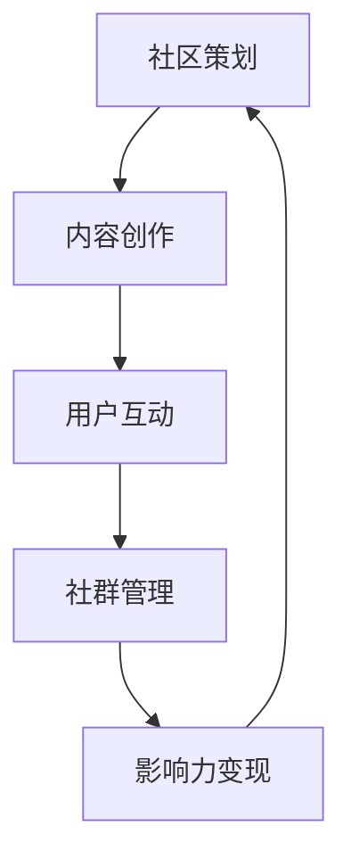

                 

# 技术社区运营：影响力变现

## 关键词
技术社区，运营，影响力变现，内容策划，用户互动，社群管理，案例分析，挑战与趋势

## 摘要
本文深入探讨了技术社区运营及其实现影响力变现的途径。首先，阐述了技术社区运营的核心目标和要素，接着分析了影响力变现的原理及其与社区运营的关系。随后，文章从内容策划、用户互动、社群管理三个方面详细介绍了技术社区运营的策略，并探讨了影响力变现的具体方法。最后，通过案例分析展示了成功技术社区的运营模式，并对未来技术社区运营的挑战和趋势进行了展望。

----------------------------------------------------------------

## 第一部分：引言

### 第1章：技术社区运营概述

#### 1.1 技术社区的重要性

技术社区是信息技术领域中的一个重要组成部分，它为程序员、开发者、技术人员提供了一个交流和分享经验的平台。在这个平台上，成员们可以分享自己的知识和经验，解决问题，交流技术心得，甚至可以共同开发和维护开源项目。

技术社区的重要性主要体现在以下几个方面：

1. **知识共享与传播**：技术社区是知识共享的重要渠道。成员们可以通过发布技术文章、博客、代码片段等形式，将自己的知识和经验分享给其他人，从而促进整个技术领域的进步。
   
2. **问题解决与支持**：技术社区成员可以相互帮助，共同解决技术难题。当遇到问题时，成员们可以通过提问和讨论，快速获得解决方案或建议。

3. **社区文化**：技术社区往往具有浓厚的文化氛围。在这里，成员们可以自由表达自己的想法和观点，形成一种开放、包容、互助的社区文化。

4. **职业发展**：技术社区为成员提供了展示自己技术能力和知识的平台，有助于提升个人职业形象，扩大人脉圈，甚至获得更好的职业机会。

#### 1.2 技术社区运营的目标

技术社区运营的目标主要包括以下几点：

1. **提高用户活跃度**：通过提供有价值的内容和活动，吸引和留住用户，增加用户的互动和参与度。

2. **提升内容质量**：确保社区内容的高质量和相关性，以满足用户的需求，提高社区的权威性和影响力。

3. **建立良好的社区氛围**：营造一个积极、友好、互助的社区氛围，让成员感到舒适和受到尊重。

4. **实现商业价值**：通过广告、赞助、付费内容等形式，实现社区的商业化运营，为社区提供可持续发展的动力。

#### 1.3 技术社区运营的核心要素

技术社区运营的核心要素包括以下几个方面：

1. **内容策划与创作**：提供高质量、有价值的内容是技术社区成功的关键。内容策划和创作需要考虑用户需求、行业动态、技术热点等因素。

2. **用户互动与参与**：用户互动和参与是社区活力的体现。通过构建互动平台、举办活动、鼓励用户贡献内容等形式，提升用户的参与度和粘性。

3. **社群管理与运营**：有效的社群管理和运营有助于维护社区的秩序，提升用户体验。这包括管理社区规则、组织活动、处理用户反馈等。

4. **影响力变现**：技术社区运营的最终目标是实现商业价值。影响力变现是这一目标的重要途径，通过广告、赞助、付费内容等形式，将社区的影响力转化为实际收益。

### 第2章：影响力变现的原理

#### 2.1 影响力的定义

影响力是指个人或组织在特定领域内通过其行为、言论或作品对他人产生的影响力和吸引力。在技术社区中，影响力变现指的是通过社区成员的影响力来吸引广告商、赞助商或其他商业合作伙伴，从而实现商业价值。

#### 2.2 影响力变现的途径

影响力变现的途径多种多样，主要包括以下几个方面：

1. **广告与赞助**：在社区中投放广告或接受赞助是一种直接变现方式。广告商和赞助商可以根据社区的受众特点、流量和影响力来投放广告，从而提升品牌知名度。

2. **付费内容与服务**：提供高质量、有价值的付费内容或服务，如在线培训、咨询服务、付费文章等，可以吸引付费用户，实现直接收益。

3. **商业合作与活动策划**：通过与其他企业或组织的合作，举办线上或线下活动，吸引参与者，从而实现商业收益。

4. **用户数据的价值挖掘**：通过收集和分析用户数据，可以挖掘出潜在的商业价值，如精准营销、用户画像等。

#### 2.3 社区运营与影响力变现的关系

社区运营与影响力变现密切相关。良好的社区运营可以提升社区的影响力，吸引更多的用户和合作伙伴，从而实现商业价值的最大化。具体来说：

1. **提高社区影响力**：通过提供高质量的内容、积极互动、有效管理，提升社区的品牌形象和权威性，从而增强社区的影响力。

2. **增强用户粘性**：良好的社区运营可以提升用户的参与度和满意度，增强用户对社区的忠诚度，从而为影响力变现提供基础。

3. **拓展商业合作机会**：强大的社区影响力可以吸引更多的商业合作伙伴，拓展合作领域和机会，从而实现更多的商业收益。

----------------------------------------------------------------

### 第二部分：技术社区运营策略

#### 第3章：内容策划与创作

##### 3.1 内容类型与形式

技术社区的内容类型和形式丰富多样，主要包括以下几种：

1. **技术文章**：技术文章是社区内容的重要组成部分。它们通常涉及技术热点、行业动态、解决方案等，有助于提升社区的权威性和专业性。

2. **博客**：博客是成员分享个人经验和心得的场所。它们可以涉及技术、生活、思考等多个方面，有助于增加社区的多样性和趣味性。

3. **代码片段**：代码片段是程序员和技术爱好者展示技术能力的有效方式。它们通常简洁明了，有助于解决问题或展示技术细节。

4. **视频教程**：视频教程是一种直观、生动的学习方式。通过视频，用户可以更好地理解技术概念和操作流程。

5. **问答**：问答是技术社区的核心功能之一。通过提问和回答，用户可以解决技术问题，提升社区的知识共享和互动性。

6. **活动报道**：活动报道是记录社区活动的重要方式。它们可以包括会议、研讨会、讲座等，有助于展示社区的活力和影响力。

##### 3.2 内容质量与传播

内容质量是技术社区的核心竞争力。以下是一些提高内容质量和传播效果的方法：

1. **选题精准**：选择与社区主题相关、具有较高关注度的内容，可以吸引更多用户关注。

2. **内容原创**：原创内容有助于提升社区的权威性和独特性，避免与其它社区内容的重复。

3. **简洁明了**：内容应简洁明了，避免冗长和复杂的叙述，便于用户快速理解。

4. **图文并茂**：适当使用图片、图表和代码片段，可以增强内容的可读性和吸引力。

5. **互动引导**：通过提问、讨论和互动，引导用户参与内容创作和传播，提升内容的质量和影响力。

6. **社交媒体推广**：利用社交媒体平台，如微博、知乎、Twitter 等，推广社区内容，吸引更多用户关注。

##### 3.3 内容创作者的培养与激励

内容创作者是技术社区的重要组成部分。以下是一些培养和激励内容创作者的方法：

1. **鼓励原创**：制定鼓励原创的政策和奖励机制，激发创作者的积极性。

2. **提供培训**：定期举办内容创作培训，提升创作者的技术水平和写作能力。

3. **奖励机制**：设立内容奖励制度，对优秀内容进行奖励，如物质奖励、荣誉称号等。

4. **用户认可**：鼓励用户对高质量内容进行点赞、评论和分享，提升创作者的成就感。

5. **建立导师制度**：通过导师制度，帮助新创作者快速成长，提升整个社区的内容质量。

#### 第4章：用户互动与参与

##### 4.1 用户互动的重要性

用户互动是技术社区的核心要素，它直接影响社区的氛围、活力和用户满意度。以下是一些用户互动的重要性：

1. **提升用户体验**：用户互动有助于解决用户的问题，提供技术支持，提升用户的满意度和忠诚度。

2. **增强社区凝聚力**：用户互动可以增强社区的凝聚力，形成紧密的社群关系，提升社区的整体氛围。

3. **促进知识共享**：用户互动促进了知识共享和传播，有助于提升社区的知识水平和影响力。

4. **增加用户粘性**：积极的用户互动可以吸引更多用户参与，增加用户的粘性，提升社区的活跃度。

##### 4.2 互动策略与技巧

以下是一些提升用户互动的策略和技巧：

1. **激发用户兴趣**：发布具有吸引力、有价值的内容，激发用户的兴趣和参与意愿。

2. **提供即时反馈**：及时回复用户的提问和评论，提供有效的技术支持和解决方案。

3. **引导互动话题**：通过设置互动话题，引导用户参与讨论，提升社区的活跃度。

4. **举办线上活动**：定期举办线上活动，如问答环节、技术竞赛等，增加用户的参与感和成就感。

5. **设立奖励机制**：对积极参与互动的用户进行奖励，如积分、奖品等，提升用户的积极性。

6. **优化互动平台**：提供便捷、高效的互动平台，如评论功能、私信功能等，提升用户的互动体验。

##### 4.3 用户参与的激励机制

以下是一些用户参与激励机制的策略：

1. **积分制度**：通过积分制度，激励用户参与社区活动，提升社区的活跃度。

2. **等级制度**：根据用户的活跃度和贡献度，设立等级制度，提升用户的成就感。

3. **荣誉称号**：对在社区中表现优秀的用户进行荣誉称号的授予，提升用户的社会地位。

4. **物质奖励**：对积极参与互动和贡献内容的用户提供物质奖励，如奖品、现金等。

5. **定制化奖励**：根据用户的兴趣和需求，提供定制化的奖励，如培训机会、职业推荐等。

6. **社交奖励**：通过社交互动，如点赞、评论、分享等，提升用户的参与感和归属感。

#### 第5章：社群管理与运营

##### 5.1 社群组织与分工

社群管理与运营需要明确组织结构和分工，以确保社区的高效运作。以下是一些组织结构和分工的建议：

1. **社区管理员**：负责维护社区秩序，处理用户投诉和违规行为，确保社区的稳定运行。

2. **内容编辑**：负责策划和审核社区内容，确保内容的质量和相关性。

3. **互动管理**：负责策划和执行用户互动活动，提升社区活跃度。

4. **技术支持**：负责社区技术平台的维护和升级，确保平台的稳定性和安全性。

5. **市场推广**：负责社区的品牌推广和市场拓展，吸引更多用户和合作伙伴。

6. **合作伙伴管理**：负责与合作伙伴的沟通和协作，确保商业合作的顺利进行。

##### 5.2 社群氛围的营造

社群氛围是社区的核心竞争力，它直接影响用户的满意度和留存率。以下是一些营造良好社群氛围的方法：

1. **积极引导**：通过发布正能量、鼓励性内容，引导用户积极互动，营造积极向上的社群氛围。

2. **建立规范**：制定社区规范，明确用户行为准则，规范用户行为，维护社区秩序。

3. **强化互动**：通过互动活动、话题讨论等方式，增强用户之间的互动，提升社区凝聚力。

4. **尊重差异**：尊重用户的不同观点和意见，避免歧视和偏见，营造包容、多元的社群氛围。

5. **奖励优秀**：对在社区中表现优秀的用户进行奖励，提升用户成就感，激励更多用户积极参与。

##### 5.3 社群运营的工具与平台

以下是一些常用的社群运营工具与平台：

1. **论坛**：论坛是技术社区的核心平台，用于发布内容、讨论问题、举办活动等。

2. **社交媒体**：利用社交媒体平台，如微博、知乎、Facebook 等，扩展社区影响力，吸引更多用户。

3. **即时通讯工具**：如微信、QQ 等，用于实时沟通和互动。

4. **活动管理工具**：如 Eventbrite、Meetup 等，用于策划和举办线下活动。

5. **数据分析工具**：如 Google Analytics、百度统计等，用于分析用户行为和社区运营效果。

6. **内容管理系统**：如 WordPress、Joomla 等，用于管理社区内容。

----------------------------------------------------------------

### 第三部分：案例研究

#### 第7章：成功技术社区案例分析

##### 7.1 案例一：GitHub社区的运营策略

GitHub 是全球最大的代码托管平台，拥有庞大的开发者和项目。其成功运营策略主要体现在以下几个方面：

1. **开放平台**：GitHub 提供了一个高度开放的代码托管平台，允许用户自由创建和共享项目。这种开放性吸引了大量开发者和项目，形成了强大的社区生态系统。

2. **用户参与**：GitHub 强调用户参与，鼓励用户提交代码、创建项目、参与讨论。这种用户参与不仅提升了社区活力，也促进了技术的快速传播和创新。

3. **高质量内容**：GitHub 对社区内容进行了严格的管理和筛选，确保内容的高质量和相关性。这使得 GitHub 成为了开发者获取技术知识和资源的首选平台。

4. **多元化活动**：GitHub 定期举办各种线上和线下活动，如 Hackathon、Meetup 等，吸引了大量开发者参与。这些活动不仅提升了社区的凝聚力，也促进了技术的交流和合作。

##### 7.2 案例二：Stack Overflow的用户互动模式

Stack Overflow 是全球最大的开发者问答社区。其成功的用户互动模式主要体现在以下几个方面：

1. **问题驱动**：Stack Overflow 以问题为中心，鼓励用户提问和回答。这种问题驱动的模式吸引了大量开发者，形成了庞大的问答库。

2. **投票机制**：Stack Overflow 采用投票机制，用户可以对问题、答案进行投票。这种机制不仅提高了内容的可信度和质量，也激励了用户积极参与。

3. **标签系统**：Stack Overflow 使用标签系统，帮助用户快速找到相关内容。这种系统提高了内容的可搜索性和可访问性，提升了用户体验。

4. **社区规则**：Stack Overflow 制定了严格的社区规则，如禁止广告、禁止恶意评论等。这些规则确保了社区的良好氛围，提升了用户的满意度和留存率。

##### 7.3 案例三：Dev.to的内容策划与影响力变现

Dev.to 是一个以博客为主的技术社区。其成功的内容策划和影响力变现策略主要体现在以下几个方面：

1. **内容多样性**：Dev.to 提供了多种类型的内容，包括技术文章、博客、代码片段等。这种多样性吸引了不同背景和兴趣的用户，形成了多元化的社区文化。

2. **个性化推荐**：Dev.to 利用机器学习和推荐算法，为用户推荐感兴趣的内容。这种个性化推荐提高了用户的参与度和留存率，也提升了内容的影响力。

3. **付费内容**：Dev.to 提供了付费内容，如专业课程、书籍等。这些付费内容不仅为社区带来了直接收益，也提升了用户的技能和职业发展。

4. **广告与赞助**：Dev.to 在社区中投放广告和接受赞助，实现了商业价值的最大化。通过与广告商和赞助商的合作，Dev.to 提升了品牌知名度，吸引了更多用户和资源。

### 第8章：技术社区运营挑战与未来趋势

##### 8.1 技术社区运营面临的挑战

技术社区运营面临着诸多挑战，主要包括以下几个方面：

1. **内容质量控制**：如何确保社区内容的高质量和相关性，避免低质量内容的泛滥，是社区运营的一大挑战。

2. **用户隐私保护**：在社区中，如何保护用户的隐私和数据安全，避免用户信息泄露，是社区运营必须考虑的问题。

3. **社区氛围维护**：如何营造和维护良好的社区氛围，避免恶意攻击、歧视和偏见，是社区运营的关键挑战。

4. **商业化与用户体验**：如何在商业化运营的同时，保持用户体验，避免商业化过度影响社区氛围，是社区运营的重要难题。

##### 8.2 影响力变现的新模式

随着技术的发展，影响力变现的模式也在不断演变。以下是一些新的影响力变现模式：

1. **知识付费**：通过提供专业知识和技能培训，实现知识变现。例如，在线课程、付费讲座等。

2. **社群电商**：利用社区的影响力，推广和销售相关产品和服务。例如，产品推荐、优惠券等。

3. **虚拟商品**：通过提供虚拟商品，如数字产品、会员服务、虚拟道具等，实现商业价值。

4. **品牌合作**：与品牌合作，通过品牌宣传和推广，实现商业价值。

##### 8.3 未来技术社区运营的趋势预测

未来技术社区运营将呈现以下趋势：

1. **人工智能与大数据的应用**：人工智能和大数据技术将被广泛应用于社区运营，提升内容推荐、用户画像、商业变现等环节的效率。

2. **社区生态的多元化**：技术社区将形成多元化的生态，涵盖内容创作、知识共享、商业合作等多个领域，满足不同用户的需求。

3. **全球化与本地化的结合**：技术社区将实现全球化运营，同时注重本地化服务，满足不同地区用户的需求。

4. **社交化与游戏化的融合**：社交化与游戏化的元素将被引入技术社区，提升用户的参与感和粘性。

5. **可持续的商业化**：技术社区将实现可持续的商业化运营，平衡商业化与用户体验，实现社区的长久发展。

### 附录

#### 附录A：技术社区运营工具与资源

以下是一些常用的技术社区运营工具与资源：

1. **社区平台**：如 Discourse、phpBB、Flarum 等。

2. **内容管理系统**：如 WordPress、Joomla、Drupal 等。

3. **数据分析工具**：如 Google Analytics、百度统计、GrowingIO 等。

4. **社交媒体平台**：如微博、知乎、Facebook 等。

5. **活动管理工具**：如 Eventbrite、Meetup、Trello 等。

6. **营销工具**：如 Mailchimp、HubSpot、Hootsuite 等。

7. **书籍与文章**：推荐阅读《社交化网络营销》、《社区运营实战手册》等。

----------------------------------------------------------------

### 核心概念与联系

#### 技术社区运营的Mermaid流程图



### 核心算法原理讲解

#### 内容质量评估算法伪代码

```python
def assess_content_quality(content):
    # 假设 content 是一个包含文本的字典
    # 计算文本的词汇密度
    word_count = len(content['text'].split())
    token_count = len(content['text'])
    vocabulary_density = word_count / token_count

    # 计算文本的相关性得分
    relevance_score = similarity(content['text'], community_theme)

    # 计算内容质量得分
    quality_score = vocabulary_density * relevance_score

    return quality_score
```

### 数学模型和数学公式 & 详细讲解 & 举例说明

#### 社区影响力评分模型

$$
\text{影响力评分} = \alpha \times (\text{内容质量评分}) + \beta \times (\text{用户互动评分})
$$

其中：

- $\alpha$ 和 $\beta$ 分别是内容质量和用户互动的权重系数，取值范围为 0 到 1。
- 内容质量评分和用户互动评分分别通过上述内容质量评估算法和用户互动评分算法计算得到。

举例说明：

- 假设 $\alpha = 0.6$，$\beta = 0.4$。
- 内容质量评分为 0.8，用户互动评分为 0.7。
- 则社区影响力评分为：

$$
\text{影响力评分} = 0.6 \times 0.8 + 0.4 \times 0.7 = 0.56 + 0.28 = 0.84
$$

### 项目实战

#### 社区内容创作与发布系统实现

#### 环境搭建

- 开发环境：Python 3.8
- 数据库：MySQL 8.0
- 前端框架：React 17.0.2
- 后端框架：Flask 2.0.2

#### 源代码实现

```python
# 社区内容发布接口
@app.route('/publish', methods=['POST'])
def publish_content():
    # 获取用户输入的内容
    content_data = request.get_json()

    # 存储内容到数据库
    cursor = mysql.connection.cursor()
    cursor.execute("INSERT INTO content (user_id, title, text, published_at) VALUES (%s, %s, %s, NOW())", 
                   (content_data['user_id'], content_data['title'], content_data['text']))
    mysql.connection.commit()

    # 返回成功消息
    return jsonify({'message': 'Content published successfully.'})

# 社区内容列表接口
@app.route('/contents', methods=['GET'])
def get_content_list():
    # 查询数据库中的内容
    cursor = mysql.connection.cursor()
    cursor.execute("SELECT * FROM content ORDER BY published_at DESC")
    contents = cursor.fetchall()

    # 构造内容列表
    content_list = []
    for content in contents:
        content_list.append({
            'id': content[0],
            'user_id': content[1],
            'title': content[2],
            'text': content[3],
            'published_at': content[4]
        })

    # 返回内容列表
    return jsonify(content_list)
```

#### 代码解读与分析

- `publish_content()` 函数用于处理用户发布的新内容。
- `get_content_list()` 函数用于获取社区中的所有内容列表。

以上是《技术社区运营：影响力变现》一书的正文部分。每个章节都详细介绍了技术社区运营的核心概念、原理、策略和实战案例，旨在帮助读者深入理解技术社区运营的方方面面，并提供实用的指导和建议。

### 作者

**作者：AI天才研究院/AI Genius Institute & 禅与计算机程序设计艺术 /Zen And The Art of Computer Programming**

AI天才研究院（AI Genius Institute）是一家专注于人工智能技术研究和应用的创新机构，致力于推动人工智能技术的发展和应用。研究院的专家团队包括世界顶级的人工智能专家、程序员、软件架构师和CTO，他们在计算机编程和人工智能领域拥有丰富的经验和深厚的理论基础。

《禅与计算机程序设计艺术》（Zen And The Art of Computer Programming）是一本被誉为计算机编程领域的经典之作。作者通过深入浅出的论述，揭示了计算机编程的本质和艺术，为程序员提供了宝贵的指导和建议。这本书不仅是一部技术著作，更是一部哲学著作，它引导程序员在编程中追求简洁、优雅和高效，达到了技术和艺术的完美结合。

让我们共同期待技术社区运营的辉煌未来，期待更多有才华的程序员和技术专家参与到这一领域中来，共同推动技术的进步和社会的发展。

