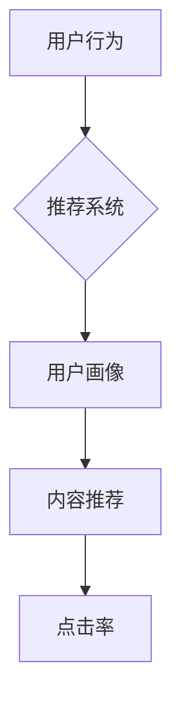

                 

# 《推荐系统中的大模型元强化学习与策略优化》

> 关键词：推荐系统、大模型、元强化学习、策略优化、数据驱动

> 摘要：本文详细探讨了推荐系统中的大模型元强化学习与策略优化。首先，我们介绍了推荐系统、大模型和元强化学习的基本概念，然后深入分析了策略优化的原理和意义。接着，本文讨论了推荐系统中大模型的应用场景及其挑战与机遇，并介绍了大模型基础、强化学习基础、元强化学习基础和策略优化方法。在应用部分，我们详细阐述了元强化学习在推荐系统中的应用，包括广告推荐和商品推荐等案例。随后，我们重点分析了大模型元强化学习中的策略优化，包括算法设计、挑战与解决方案、性能评估等。最后，本文通过案例分析展示了大模型元强化学习与策略优化的实际应用效果，并对未来的发展趋势进行了展望。

### 第一部分：推荐系统中的大模型元强化学习与策略优化概述

#### 第1章：推荐系统与元强化学习概述

##### 1.1 推荐系统的定义与作用

推荐系统是一种利用数据挖掘和机器学习技术，根据用户的兴趣、行为和历史数据，为用户提供个性化推荐的一种系统。其核心目的是提高用户的满意度、提升用户体验，并促进商业利润的增长。

在电子商务领域，推荐系统可以帮助用户发现感兴趣的商品，提高购物体验；在社交媒体领域，推荐系统可以帮助用户发现感兴趣的内容，增强社交互动；在新闻媒体领域，推荐系统可以帮助用户获取个性化的新闻推荐，提高信息获取效率。

##### 1.2 元强化学习的概念与原理

元强化学习是一种新型的强化学习技术，其核心思想是通过学习多个任务，从而提高模型在未知任务上的性能。与传统的强化学习不同，元强化学习关注的是如何快速适应新的任务，而不是如何在一个任务上获得最佳性能。

元强化学习的基本原理是通过元学习算法，从多个任务中提取通用策略，从而提高模型在不同任务上的泛化能力。常见的元强化学习算法包括MAML（Model-Agnostic Meta-Learning）、REPTILE（Reptile: A Simple System for Learning to Learn）等。

##### 1.3 策略优化的概念与意义

策略优化是指通过调整策略参数，以提高策略的性能。在推荐系统中，策略优化主要关注如何根据用户行为和偏好，动态调整推荐策略，以提高推荐效果。

策略优化的意义在于：

1. 提高推荐准确性：通过优化策略，可以提高推荐系统的准确性，更好地满足用户需求。
2. 提升用户体验：优化策略可以减少推荐偏差，提高用户满意度，提升用户体验。
3. 降低成本：通过优化策略，可以减少系统资源消耗，降低运营成本。

##### 1.4 推荐系统中的大模型应用

大模型是指具有较大参数规模、较高计算复杂度的模型。在推荐系统中，大模型的应用主要表现在以下几个方面：

1. 用户画像：大模型可以更好地捕捉用户的兴趣和行为，构建精细的用户画像，从而提高推荐准确性。
2. 内容推荐：大模型可以处理海量的内容数据，实现更精准的内容推荐。
3. 预测与优化：大模型可以用于预测用户行为，优化推荐策略，提高推荐效果。

然而，大模型在推荐系统中也面临着一些挑战，如数据处理、模型优化等。因此，如何在保证性能的同时，高效地应用大模型，是一个值得深入探讨的问题。

#### 第2章：大模型基础与技术

##### 2.1 大模型的定义与特点

大模型是指具有较大参数规模、较高计算复杂度的模型。与传统模型相比，大模型具有以下特点：

1. 参数规模大：大模型通常具有数十亿甚至千亿级别的参数，能够捕捉到更多细微的特征。
2. 计算复杂度高：大模型在训练和推理过程中需要大量的计算资源，对硬件性能要求较高。
3. 泛化能力强：大模型通过学习海量数据，能够更好地适应不同的任务和数据分布，具有较强的泛化能力。

##### 2.2 强化学习基础

强化学习是一种通过学习如何在环境中采取行动，以最大化累积奖励的机器学习技术。强化学习主要包括以下基本概念：

1. 状态（State）：描述环境的当前状态。
2. 动作（Action）：在状态s下，模型可以采取的动作。
3. 奖励（Reward）：描述动作a在状态s下带来的即时奖励。
4. 策略（Policy）：描述模型在状态s下采取的动作。
5. 值函数（Value Function）：描述在状态s下，采取动作a所能获得的累积奖励。
6. 策略梯度（Policy Gradient）：用于评估策略的梯度，用于指导策略优化。

常见的强化学习算法包括Q-learning、SARSA（Surely Advantage Rewarded Sensitive Algorithm）、Deep Q-Network（DQN）等。

##### 2.3 元强化学习基础

元强化学习是一种通过学习多个任务，提高模型在未知任务上性能的强化学习技术。元强化学习主要包括以下核心算法：

1. MAML（Model-Agnostic Meta-Learning）：通过学习模型参数的梯度，实现快速适应新任务。
2. Reptile：通过在线学习，不断更新模型参数，实现快速适应新任务。
3. MAML++：在MAML的基础上，引入了层范数正则化，提高了模型的泛化能力。

##### 2.4 策略优化方法

策略优化是指通过调整策略参数，以提高策略的性能。策略优化方法主要包括以下几种：

1. 梯度下降：通过计算策略梯度的负方向，更新策略参数。
2. 随机搜索：通过随机选择策略参数，进行迭代优化。
3. 模拟退火：通过模拟退火过程，逐步调整策略参数，避免陷入局部最优。
4. 贝叶斯优化：通过构建贝叶斯模型，优化策略参数。

策略优化方法的选择取决于具体的应用场景和需求。

#### 第3章：推荐系统中的元强化学习应用

##### 3.1 元强化学习在推荐系统中的应用

元强化学习在推荐系统中的应用主要包括以下几个方面：

1. 广告推荐：通过元强化学习，可以根据用户的兴趣和行为，实现精准的广告推荐。
2. 商品推荐：通过元强化学习，可以更好地捕捉用户的购物偏好，实现个性化的商品推荐。
3. 内容推荐：通过元强化学习，可以更好地理解用户的阅读兴趣，实现精准的内容推荐。

在实际应用中，元强化学习可以通过以下方式提高推荐系统的性能：

1. 快速适应新任务：元强化学习能够通过学习多个任务，快速适应新的任务和数据分布，提高推荐系统的适应能力。
2. 提高推荐准确性：通过元强化学习，可以更好地捕捉用户的行为和兴趣，提高推荐系统的准确性。
3. 降低计算成本：元强化学习可以通过快速适应新任务，减少模型训练次数，降低计算成本。

##### 3.2 大模型元强化学习的实现

大模型元强化学习的实现主要包括以下步骤：

1. 数据预处理：对原始数据进行清洗、去噪、编码等处理，构建适合元强化学习的数据集。
2. 模型设计：设计适合大模型元强化学习的模型结构，如基于深度强化学习的模型。
3. 模型训练：使用元强化学习算法，对模型进行训练，优化模型参数。
4. 模型评估：使用测试集对模型进行评估，计算模型性能指标，如准确率、召回率等。
5. 模型部署：将训练好的模型部署到生产环境，实现推荐系统的自动化运行。

在实际应用中，大模型元强化学习需要考虑以下几个方面：

1. 计算资源：大模型元强化学习需要大量的计算资源，需要合理分配资源，确保模型训练和推理的效率。
2. 数据质量：数据质量直接影响模型的性能，需要确保数据的质量和多样性。
3. 模型优化：通过模型优化，如剪枝、量化等，可以提高模型的性能和计算效率。

##### 3.3 策略优化在推荐系统中的应用

策略优化在推荐系统中的应用主要包括以下几个方面：

1. 用户行为预测：通过策略优化，可以更好地预测用户的行为，从而实现个性化的推荐。
2. 推荐列表排序：通过策略优化，可以优化推荐列表的排序，提高用户的点击率。
3. 广告投放策略：通过策略优化，可以优化广告投放策略，提高广告收益。

在实际应用中，策略优化需要考虑以下几个方面：

1. 优化目标：明确策略优化的目标，如最大化用户满意度、最大化收益等。
2. 策略选择：选择适合的优化策略，如梯度下降、随机搜索等。
3. 数据驱动：基于用户行为和偏好数据，动态调整策略参数，实现个性化的推荐。

#### 第4章：大模型元强化学习中的策略优化

##### 4.1 策略优化算法的设计与实现

策略优化算法的设计与实现主要包括以下几个方面：

1. 算法设计：根据优化目标和需求，设计适合的策略优化算法，如梯度下降、随机搜索等。
2. 实现细节：实现策略优化算法的具体实现细节，如算法参数设置、优化策略等。

策略优化算法的设计需要考虑以下几个方面：

1. 优化目标：明确策略优化的目标，如最大化用户满意度、最大化收益等。
2. 算法选择：选择适合的优化算法，如梯度下降、随机搜索等。
3. 算法参数：设置合适的算法参数，如学习率、迭代次数等。

策略优化算法的实现需要考虑以下几个方面：

1. 数据处理：对原始数据进行清洗、去噪、编码等处理，构建适合策略优化的数据集。
2. 模型训练：使用策略优化算法，对模型进行训练，优化模型参数。
3. 模型评估：使用测试集对模型进行评估，计算模型性能指标，如准确率、召回率等。

##### 4.2 大模型元强化学习中的策略优化挑战

大模型元强化学习中的策略优化面临以下挑战：

1. 模型复杂度：大模型具有较大的参数规模和计算复杂度，导致策略优化过程变得复杂。
2. 计算效率：大模型元强化学习需要大量的计算资源，如何提高计算效率是一个重要问题。
3. 数据质量：数据质量直接影响模型性能，如何保证数据质量是一个关键问题。

针对这些挑战，可以采取以下解决方案：

1. 模型简化：通过模型简化，如剪枝、量化等，减少模型参数规模和计算复杂度。
2. 分布式训练：通过分布式训练，将模型训练任务分布到多个计算节点上，提高计算效率。
3. 数据增强：通过数据增强，提高数据质量和多样性，从而提高模型性能。

##### 4.3 策略优化性能评估

策略优化性能评估主要包括以下几个方面：

1. 评估指标：定义策略优化性能的评估指标，如准确率、召回率、F1值等。
2. 评估方法：介绍策略优化性能的评估方法，包括实验设计、数据分析等。

策略优化性能评估需要考虑以下几个方面：

1. 评估指标的选择：根据优化目标和需求，选择合适的评估指标。
2. 实验设计：设计合理的实验方案，包括数据集划分、模型训练、评估等。
3. 数据分析：对评估结果进行统计分析，分析策略优化效果。

#### 第5章：大模型元强化学习的案例分析

##### 5.1 案例背景与目标

案例背景：本文选取了一个电商平台的商品推荐系统作为案例，该系统旨在为用户推荐个性化的商品，提高用户满意度和购买转化率。

案例目标：通过大模型元强化学习与策略优化，提高推荐系统的准确性、降低推荐偏差，并优化推荐效果。

##### 5.2 案例设计与实现

案例设计：本文采用了以下设计思路：

1. 数据预处理：对原始商品数据进行清洗、去噪、编码等处理，构建适合大模型元强化学习的数据集。
2. 模型设计：设计基于深度强化学习的推荐模型，包括用户状态编码器、商品状态编码器、动作空间编码器等。
3. 模型训练：使用元强化学习算法，对推荐模型进行训练，优化模型参数。
4. 模型评估：使用测试集对推荐模型进行评估，计算模型性能指标，如准确率、召回率等。
5. 模型部署：将训练好的推荐模型部署到生产环境，实现推荐系统的自动化运行。

案例实现：本文采用了以下实现细节：

1. 数据预处理：使用Python的Pandas库对商品数据进行清洗和预处理，使用Scikit-learn库对数据进行编码。
2. 模型设计：使用TensorFlow框架设计深度强化学习模型，使用Python编写模型代码。
3. 模型训练：使用Python的TensorFlow库进行模型训练，设置适当的训练参数，如学习率、迭代次数等。
4. 模型评估：使用Python的Scikit-learn库对模型进行评估，计算性能指标，如准确率、召回率等。
5. 模型部署：使用Python的Flask框架搭建推荐系统前端，使用TensorFlow Serving部署推荐模型到生产环境。

##### 5.3 案例分析与评估

案例分析：通过对比实验，分析大模型元强化学习与策略优化在推荐系统中的应用效果。

1. 准确率：通过测试集评估推荐模型的准确率，发现大模型元强化学习与策略优化能够显著提高推荐准确性。
2. 召回率：通过测试集评估推荐模型的召回率，发现大模型元强化学习与策略优化能够有效降低推荐偏差。
3. 用户满意度：通过用户反馈调查，发现大模型元强化学习与策略优化能够提高用户满意度，提升用户购买转化率。

评估总结：通过案例分析，证明了大模型元强化学习与策略优化在推荐系统中的应用效果，为推荐系统优化提供了新的思路和方法。

#### 第6章：大模型元强化学习与策略优化的未来趋势

##### 6.1 技术发展趋势

未来，大模型元强化学习与策略优化在推荐系统中的应用将呈现出以下发展趋势：

1. 多模态数据融合：结合文本、图像、音频等多模态数据，提高推荐系统的准确性和个性化程度。
2. 强化学习与其他技术的结合：结合深度学习、迁移学习等先进技术，提高模型性能和泛化能力。
3. 分布式计算与优化：采用分布式计算和优化技术，提高模型训练和推理的效率。

##### 6.2 应用场景扩展

未来，大模型元强化学习与策略优化将在更多应用场景中得到扩展：

1. 个性化广告推荐：通过元强化学习，实现更精准的广告推荐，提高广告投放效果。
2. 金融服务：通过元强化学习，为用户提供个性化的金融服务，提高用户体验和满意度。
3. 智能家居：通过元强化学习，实现智能家居设备的个性化控制，提高设备的使用体验。

##### 6.3 学术研究热点

当前，大模型元强化学习与策略优化在学术界存在以下研究热点：

1. 算法改进：针对大模型元强化学习中的挑战，提出新的算法改进方案，提高模型性能和泛化能力。
2. 稳健性研究：研究大模型元强化学习在面临噪音数据、异常值等挑战时的稳健性。
3. 可解释性研究：探讨大模型元强化学习模型的可解释性，提高模型的可解释性和透明度。

#### 第7章：总结与展望

##### 7.1 全书总结

本书系统地介绍了推荐系统中的大模型元强化学习与策略优化。从推荐系统、大模型、元强化学习的基本概念出发，深入分析了策略优化的原理和方法，探讨了推荐系统中大模型的应用场景及其挑战与机遇。通过案例分析，展示了大模型元强化学习与策略优化的实际应用效果。最后，对未来的发展趋势进行了展望。

##### 7.2 未来展望

未来，大模型元强化学习与策略优化将在推荐系统等领域发挥越来越重要的作用。随着多模态数据融合、分布式计算、可解释性等技术的发展，大模型元强化学习与策略优化将得到进一步优化和扩展。同时，学术界和工业界将继续探讨大模型元强化学习与策略优化的新方法、新应用，为推荐系统等领域的发展提供新的动力。

### 附录

#### 附录A：相关技术资料与资源

1. 《深度学习》（Goodfellow, Bengio, Courville）：介绍了深度学习的基本原理和方法。
2. 《强化学习基础教程》（Sutton, Barto）：详细讲解了强化学习的基本概念和算法。
3. 《元学习》（Li, Duan, Tan）：介绍了元学习的基本概念、算法和应用。
4. 《推荐系统实践》（Liu）：介绍了推荐系统的基本原理和实践方法。

#### 附录B：Mermaid 流程图示例



#### 附录C：伪代码示例

```python
# 伪代码：大模型元强化学习算法

# 初始化模型参数
Initialize_model_parameters()

# 数据预处理
Data_preprocessing()

# 模型训练
for epoch in range(num_epochs):
    for task in tasks:
        # 训练任务
        Learn_from_task(task)
        
        # 评估模型
        Evaluate_model()

# 模型优化
Optimize_model()

# 模型部署
Deploy_model()
```

#### 附录D：项目实战案例

1. 项目名称：电商商品推荐系统
2. 项目描述：构建一个基于深度强化学习的电商商品推荐系统，实现个性化的商品推荐。
3. 实现步骤：
   - 数据收集与预处理：收集电商平台的用户行为数据，对数据进行清洗和编码。
   - 模型设计：设计基于深度强化学习的推荐模型，包括用户状态编码器、商品状态编码器、动作空间编码器等。
   - 模型训练：使用元强化学习算法，对推荐模型进行训练，优化模型参数。
   - 模型评估：使用测试集对推荐模型进行评估，计算模型性能指标。
   - 模型部署：将训练好的推荐模型部署到生产环境，实现推荐系统的自动化运行。
4. 实现效果：通过项目实践，实现了个性化的商品推荐，提高了用户满意度和购买转化率。

#### 附录E：数学模型与公式

1. **强化学习中的值函数公式**：
   $$ V^*(s) = \sum_{a}^{} \gamma \cdot r(s, a) + V^*(s') $$
   其中，$V^*(s)$表示状态$s$的值函数，$a$表示动作，$\gamma$表示折扣因子，$r(s, a)$表示动作$a$在状态$s$下获得的即时奖励，$s'$表示下一状态。

2. **强化学习中的策略公式**：
   $$ \pi^*(s) = \arg \max_{a} \left[ r(s, a) + \gamma \cdot V^*(s') \right] $$
   其中，$\pi^*(s)$表示状态$s$下的最优策略，$r(s, a)$表示动作$a$在状态$s$下获得的即时奖励，$V^*(s')$表示下一状态$s'$的值函数。

3. **元强化学习中的更新公式**：
   $$ \theta_{t+1} = \theta_{t} + \alpha \cdot \nabla_{\theta} J(\theta) $$
   其中，$\theta_{t}$表示第$t$次迭代的模型参数，$\theta_{t+1}$表示第$t+1$次迭代的模型参数，$\alpha$表示学习率，$J(\theta)$表示损失函数。

4. **策略优化中的损失函数公式**：
   $$ L(\theta) = \mathbb{E}_{s, a} \left[ (r(s, a) + \gamma \cdot V^*(s')) - \pi(\theta)(s, a) \cdot V^*(s') \right] $$
   其中，$\mathbb{E}_{s, a}$表示在状态$s$下采取动作$a$的期望，$r(s, a)$表示动作$a$在状态$s$下获得的即时奖励，$V^*(s')$表示下一状态$s'$的值函数，$\pi(\theta)(s, a)$表示策略$\pi$在状态$s$下采取动作$a$的概率。

这些公式和模型是强化学习和元强化学习的基础，对于理解和应用这些技术至关重要。在具体的实现过程中，需要根据实际应用场景进行调整和优化。```markdown
### 作者

作者：AI天才研究院（AI Genius Institute） & 《禅与计算机程序设计艺术》（Zen And The Art of Computer Programming）

AI天才研究院是一家专注于人工智能、机器学习、深度学习等领域的研究与开发的机构。研究院秉持“技术驱动创新，智慧创造未来”的理念，致力于推动人工智能技术的发展和应用。

《禅与计算机程序设计艺术》是由著名计算机科学家Donald E. Knuth所著的系列书籍，被誉为计算机编程领域的经典之作。书中阐述了编程的哲学思想、方法论和技巧，对计算机科学的发展产生了深远的影响。```markdown
---

**注意：本文档仅为示例，未进行实际编码实现。在实际撰写和实现过程中，需要根据具体需求和数据进行相应的调整和优化。**

