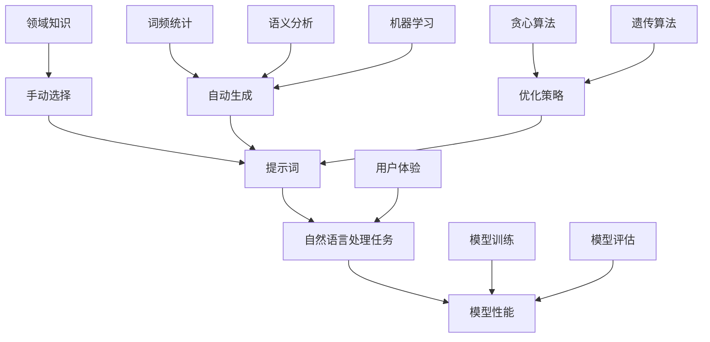

                 

### 提示词工程概述

提示词工程是自然语言处理（NLP）领域中的一个重要分支，旨在通过优化和选择合适的提示词来提升模型的性能和应用效果。在自然语言理解（NLU）中，提示词扮演着关键角色，它们不仅能够引导模型更好地理解输入文本，还能提高模型在不同任务中的泛化能力。

**提示词的定义**：提示词（Prompt Word）是指在自然语言处理任务中，用于引导模型或用户理解文本内容的关键词或短语。这些提示词可以是简单的单个单词，也可以是复杂的句子，它们在文本中起到标记、强调或分类的作用。

**提示词的作用**：

1. **引导模型理解**：提示词能够明确告诉模型需要关注的内容，从而提高模型对特定任务的专注度。
2. **提高模型性能**：通过选择合适的提示词，可以引导模型学习到更相关的特征，从而提升模型在特定任务上的表现。
3. **增强泛化能力**：在多任务学习场景中，提示词可以帮助模型更好地适应不同的任务需求，提高模型的泛化能力。

### 提示词工程的核心目标

提示词工程的核心目标是优化和选择合适的提示词，以实现以下目标：

- **提高模型性能**：通过选择或生成高质量的提示词，提高模型在特定任务上的准确性和效果。
- **增强用户体验**：优化提示词可以改善用户与自然语言处理系统之间的交互，提高用户满意度。
- **降低模型复杂度**：通过有效的提示词，可以简化模型的输入，降低模型的复杂度，提高模型的训练效率。

### 提示词工程的常见方法

提示词工程的方法多种多样，主要包括以下几种：

1. **手动选择**：根据经验和领域知识，手动选择合适的提示词。
2. **自动生成**：使用算法自动生成提示词，如基于词频统计、语义分析或机器学习等方法。
3. **优化策略**：通过优化算法，如贪心算法、遗传算法等，对提示词进行迭代优化。

#### 核心概念与联系

提示词工程的核心概念包括提示词、自然语言处理任务和模型性能。以下是一个简化的 Mermaid 流程图，展示了这些概念之间的联系：



在图1中，我们可以看到提示词通过手动选择、自动生成和优化策略与自然语言处理任务和模型性能相关联。提示词的选择直接影响模型的训练和评估效果，进而影响用户体验。

#### 核心算法原理讲解

提示词工程中的核心算法主要涉及提示词的生成和优化。以下是一个基于贪心算法的提示词生成和优化算法的伪代码示例：

```plaintext
输入：文本集合T，目标任务D
输出：最优提示词集合P

初始化：P为空

对于每个文本t ∈ T：
    1. 计算文本t的关键词集合K
    2. 选择K中与目标任务D最相关的词w
    3. 将w加入P

优化P：
    1. 对P中的每个词w：
        a. 计算w在P中的影响度I(w)
        b. 根据I(w)对P中的词进行排序
        c. 使用贪心算法逐步优化P

模型训练与评估：
    1. 使用P中的词训练模型M
    2. 在测试集D'上评估模型M的性能
    3. 根据评估结果调整P
```

在上述伪代码中，关键步骤包括计算文本的关键词、选择最相关的词作为提示词以及使用贪心算法进行优化。这些步骤通过迭代优化，逐步提高提示词集合的质量，从而提升模型性能。

#### 数学模型与公式

提示词工程中的优化问题可以通过优化目标函数来描述。以下是一个基于最小化目标函数的提示词优化模型：

$$
\min_{P} \sum_{w \in P} \sum_{t \in T} I(w, t) \cdot C(w, t)
$$

其中，\( I(w, t) \) 表示词\( w \)在文本\( t \)中的影响度，\( C(w, t) \) 表示词\( w \)在文本\( t \)中的成本。

#### 举例说明

假设我们有一个包含两个文本的集合 \( T = \{t1, t2\} \)，目标任务 \( D \) 是文本分类。文本 \( t1 \) 中的关键词有 \( K1 = \{a, b, c\} \)，文本 \( t2 \) 中的关键词有 \( K2 = \{b, c, d\} \)。

1. **关键词选择**：
   - 对于文本 \( t1 \)，选择与分类任务最相关的关键词 \( w1 = c \)。
   - 对于文本 \( t2 \)，选择与分类任务最相关的关键词 \( w2 = c \)。

2. **提示词生成**：
   - 提示词集合 \( P = \{c\} \)。

3. **优化提示词**：
   - 计算每个词的影响度和成本：
     - \( I(c, t1) = 0.8 \)，\( C(c, t1) = 0.5 \)
     - \( I(c, t2) = 0.7 \)，\( C(c, t2) = 0.6 \)
   - 根据影响度和成本，优化提示词集合 \( P \)。

通过上述步骤，我们可以逐步优化提示词集合，提高模型在文本分类任务上的性能。

#### 提示词工程的应用场景

提示词工程在自然语言理解中的应用非常广泛，以下是一些典型的应用场景：

1. **文本分类**：通过选择合适的提示词，提高文本分类模型的准确性和效率。
2. **问答系统**：在问答系统中，提示词可以帮助模型更好地理解用户的问题，提高问答的准确性。
3. **信息抽取**：通过提示词，可以引导模型准确地提取文本中的关键信息。
4. **命名实体识别**：在命名实体识别任务中，提示词可以用来提高模型对特定实体类型的识别准确率。

#### 提示词工程的未来发展趋势

随着自然语言处理技术的不断发展，提示词工程也在不断演进。以下是一些未来发展趋势：

1. **多模态提示词**：结合视觉、音频等多种模态信息，生成更丰富的提示词。
2. **个性化提示词**：根据用户的行为和偏好，生成个性化的提示词，提高用户体验。
3. **自动提示词生成**：使用生成对抗网络（GAN）等技术，自动生成高质量的提示词。
4. **跨语言提示词**：开发跨语言的提示词工程方法，提高多语言处理能力。

通过本章的介绍，我们了解了提示词工程的基本概念、核心目标、常见方法以及其在自然语言理解中的应用。接下来，我们将深入探讨提示词工程在不同应用场景中的具体实现方法和优化策略。

### 提示词工程在文本分类中的应用

文本分类是自然语言处理中一个基础且广泛应用的领域，旨在将文本数据自动归类到预定义的类别中。提示词工程在文本分类中发挥着关键作用，通过优化和选择合适的提示词，可以显著提高分类模型的性能和准确性。

#### 文本分类的基本概念

**定义**：文本分类（Text Classification）是一种将文本数据自动分类到预定义类别中的任务。常见的分类任务包括垃圾邮件过滤、情感分析、主题分类等。

**目标**：文本分类的目标是建立一个分类模型，能够根据输入文本的特征，将文本自动归类到正确的类别中。

#### 文本分类的挑战

- **数据稀疏性**：文本数据通常具有高维特征空间，但其中许多特征的使用频率非常低，导致数据稀疏性。
- **噪声和干扰**：文本数据中往往包含大量的噪声和干扰信息，这些信息可能对分类模型产生负面影响。
- **多义性**：许多词语具有多义性，同一词语在不同的上下文中可能有不同的含义，这增加了分类的难度。

#### 提示词工程在文本分类中的作用

提示词工程在文本分类中的作用主要体现在以下几个方面：

1. **特征引导**：提示词可以帮助模型识别文本中的重要特征，从而引导模型更好地学习文本的特征空间。
2. **增强区分度**：通过选择区分度较高的提示词，可以提高模型对类别间的区分能力。
3. **减少数据噪声**：提示词可以用来过滤掉文本中的噪声和干扰信息，从而提高模型的鲁棒性。

#### 提示词优化

提示词优化是提高文本分类模型性能的关键步骤，常见的优化方法包括以下几种：

1. **手动选择**：基于领域知识和经验，手动选择具有高区分度和相关性的提示词。
2. **自动生成**：使用算法自动生成提示词，如基于词频统计、TF-IDF、词嵌入等方法。
3. **优化策略**：使用优化算法，如贪心算法、遗传算法等，对提示词进行迭代优化，以找到最优的提示词组合。

#### 提示词组合策略

在文本分类中，提示词的组合策略对分类性能有重要影响。以下是一些常见的提示词组合策略：

1. **交集策略**：选择所有文本中共同出现的提示词，以增强类别间的区分度。
2. **并集策略**：选择每个文本中出现的所有提示词，以覆盖文本中的各种特征。
3. **权重策略**：根据提示词的重要性和出现频率，为每个提示词分配不同的权重，以突出重要的特征。
4. **层次化策略**：根据提示词的语义层次，从高层次到低层次逐步选择提示词，以提高分类的准确性和效率。

#### 提示词工程在文本分类中的应用案例

以下是几个常见的文本分类应用案例，展示了提示词工程的具体实现方法和效果：

1. **垃圾邮件过滤**：通过选择与垃圾邮件特征相关的提示词，如“优惠”、“免费”、“推广”等，可以显著提高垃圾邮件过滤的准确率。
2. **情感分析**：在情感分析任务中，选择与情感类别相关的提示词，如“满意”、“失望”、“快乐”等，可以增强模型对情感类别的区分能力。
3. **新闻分类**：在新闻分类任务中，选择与新闻主题相关的提示词，如“科技”、“政治”、“体育”等，可以帮助模型更好地分类新闻。

#### 案例分析：垃圾邮件过滤

假设我们要开发一个垃圾邮件过滤系统，首先，我们需要收集大量的电子邮件数据，并对这些数据进行预处理，包括去除停用词、进行词性标注等。然后，我们可以使用以下步骤进行提示词优化和文本分类：

1. **数据预处理**：对收集到的电子邮件数据集进行预处理，提取文本内容，并进行分词、词性标注等操作。
2. **特征提取**：使用TF-IDF等方法提取电子邮件中的特征词，构建词汇表。
3. **提示词选择**：根据领域知识和经验，选择与垃圾邮件特征相关的提示词，如“免费”、“优惠”、“推广”等。
4. **模型训练**：使用选择好的提示词训练一个文本分类模型，如朴素贝叶斯、支持向量机等。
5. **模型评估**：使用测试集对训练好的模型进行评估，调整提示词和模型参数，以提高分类性能。

以下是一个简单的朴素贝叶斯模型训练和评估的伪代码示例：

```plaintext
输入：邮件数据集D，提示词集合P
输出：训练好的文本分类模型M，评估结果

1. 预处理数据集D，提取特征向量X和标签Y
2. 使用P中的提示词，构建词汇表V
3. 训练朴素贝叶斯模型M
4. 在测试集D'上评估模型M的性能
5. 根据评估结果，调整P和模型参数
```

通过上述步骤，我们可以逐步优化提示词集合，提高垃圾邮件过滤系统的性能。

#### 提示词工程的未来发展趋势

随着自然语言处理技术的不断发展，提示词工程在文本分类中的应用也将不断演进。以下是一些未来发展趋势：

1. **多模态提示词**：结合文本、图像、音频等多种模态信息，生成更丰富的提示词。
2. **深度学习模型**：使用深度学习模型（如卷积神经网络、循环神经网络等）进行文本分类，进一步提高分类性能。
3. **自动提示词生成**：使用生成对抗网络（GAN）等技术，自动生成高质量的提示词。
4. **跨语言文本分类**：开发跨语言的提示词工程方法，提高多语言文本分类的性能。

通过本章的介绍，我们了解了提示词工程在文本分类中的应用方法、优化策略和应用案例。提示词工程不仅能够提高文本分类模型的性能，还能为其他自然语言处理任务提供有益的参考。接下来，我们将进一步探讨提示词工程在问答系统中的应用。

### 提示词工程在问答系统中的应用

问答系统（Question Answering System）是自然语言处理领域中的一个重要分支，旨在通过自动化的方式回答用户提出的问题。提示词工程在问答系统中发挥着关键作用，能够显著提升问答系统的性能和用户体验。本文将详细探讨提示词工程在问答系统中的应用，包括提示词的选择策略、优化方法和实际应用案例。

#### 问答系统的基本概念

**定义**：问答系统是一种自然语言处理技术，旨在自动回答用户提出的问题。它通常由问题理解、知识检索和答案生成三个主要模块组成。

- **问题理解**：将用户输入的自然语言问题转化为机器可处理的形式，包括语法分析、语义理解和意图识别等。
- **知识检索**：从知识库或数据库中检索与问题相关的信息，以支持答案生成。
- **答案生成**：根据检索到的信息生成自然语言答案。

#### 提示词工程在问答系统中的作用

1. **引导问题理解**：提示词可以明确告诉模型需要关注的问题关键点，从而提高问题理解的准确性和效率。
2. **提高答案质量**：通过选择高质量的提示词，可以引导模型生成更准确、更自然的答案。
3. **优化系统性能**：提示词优化可以帮助模型更好地适应不同类型的问题，提高问答系统的整体性能。

#### 提示词选择策略

1. **关键词提取**：从用户提出的问题中提取关键词，作为提示词。关键词通常是问题的核心词汇，能够有效引导模型理解问题。
2. **基于TF-IDF的方法**：使用TF-IDF（Term Frequency-Inverse Document Frequency）算法，选择在问题中频率较高且在文档集中具有高区分度的词汇作为提示词。
3. **基于词嵌入的方法**：使用词嵌入模型（如Word2Vec、GloVe等），选择与问题中关键词语义相似的词汇作为提示词。
4. **手动选择**：根据领域知识和经验，手动选择具有高相关性和区分度的词汇作为提示词。

#### 提示词优化方法

1. **贪心算法**：通过逐个添加提示词，并计算每个提示词对问题理解的提升程度，选择提升程度最高的提示词进行迭代优化。
2. **遗传算法**：将提示词组合视为染色体，通过交叉、变异和选择等遗传操作，逐步优化提示词组合。
3. **基于模型的优化**：使用深度学习模型，如循环神经网络（RNN）或变换器（Transformer），自动优化提示词组合。

#### 提示词工程在问答系统中的应用案例

以下是几个具体的问答系统应用案例，展示了提示词工程在实际中的应用方法和效果。

1. **基于知识图谱的问答系统**：在基于知识图谱的问答系统中，提示词工程可以帮助模型更好地理解问题，并从知识库中检索相关答案。例如，在一个问答系统中，用户提出问题“北京是中国的哪个省份？”通过选择提示词“北京”、“中国”、“省份”等，模型能够快速定位到知识库中的相关实体和关系，从而生成准确的答案。

2. **开放式问答系统**：在开放式问答系统中，用户提出的问题通常比较复杂，涉及多个方面的信息。提示词工程可以帮助模型更好地分解问题，并逐步解答。例如，在一个问答系统中，用户提出问题“北京最近的地铁站在哪里？”通过选择提示词“北京”、“最近”、“地铁站”等，模型可以理解问题的意图，并在地图数据中检索最近的地铁站信息。

#### 案例分析：开放式问答系统

假设我们开发一个开放式问答系统，用户可以提出各种类型的问题，系统需要自动生成准确的答案。以下是一个具体的实现流程：

1. **数据预处理**：收集大量开放性问题及其答案，对问题进行预处理，包括分词、词性标注、去除停用词等操作。
2. **特征提取**：使用词嵌入模型（如Word2Vec、GloVe等）将问题中的词语转换为向量表示。
3. **提示词选择**：使用基于TF-IDF和词嵌入的方法，选择与问题中关键词语义相似的词汇作为提示词。
4. **模型训练**：使用选择好的提示词训练一个问答系统模型，如序列到序列（Seq2Seq）模型、变换器（Transformer）等。
5. **模型评估**：在测试集上评估模型性能，包括准确率、召回率和F1分数等指标。
6. **优化提示词**：根据模型评估结果，调整提示词组合，以提高答案的准确性和自然性。

以下是一个基于变换器模型训练和优化的伪代码示例：

```plaintext
输入：问题数据集Q，答案数据集A
输出：训练好的问答系统模型M，优化后的提示词集合P

1. 预处理数据集Q和A，提取特征向量X和标签Y
2. 使用P中的提示词，构建词汇表V
3. 训练变换器模型M
4. 在测试集Q'上评估模型M的性能
5. 根据评估结果，调整P和模型参数
6. 重复步骤3-5，直至达到满意性能
```

通过上述步骤，我们可以逐步优化提示词组合，提高开放式问答系统的性能。

#### 提示词工程的未来发展趋势

随着自然语言处理技术的不断发展，提示词工程在问答系统中的应用也将不断演进。以下是一些未来发展趋势：

1. **多模态提示词**：结合文本、图像、音频等多种模态信息，生成更丰富的提示词。
2. **自动提示词生成**：使用生成对抗网络（GAN）等技术，自动生成高质量的提示词。
3. **个性化提示词**：根据用户的行为和偏好，生成个性化的提示词，提高用户体验。
4. **跨语言问答系统**：开发跨语言的提示词工程方法，提高多语言问答系统的性能。

通过本章的介绍，我们了解了提示词工程在问答系统中的应用方法、优化策略和应用案例。提示词工程不仅能够提高问答系统的性能，还能为其他自然语言处理任务提供有益的参考。接下来，我们将探讨提示词工程与预训练模型的结合，以进一步提升自然语言处理的效果。

### 提示词工程与预训练模型的结合

预训练模型（Pre-trained Models）是近年来自然语言处理（NLP）领域的一个重要进展，通过在大量无标签数据上预训练，预训练模型能够捕捉到丰富的语言特征，从而在多种下游任务中表现出优异的性能。提示词工程（Prompt Engineering）作为优化模型输入的一种方法，能够与预训练模型相结合，进一步提升模型的表现。本文将探讨提示词工程与预训练模型的结合方式、具体实现方法以及在自然语言理解中的实际应用。

#### 预训练模型概述

**定义**：预训练模型是在大规模语料库上进行预训练的神经网络模型，通过学习语料库中的统计规律，模型能够自动捕获语言的特征，从而提高后续任务的表现。

**主要模型**：

- **BERT（Bidirectional Encoder Representations from Transformers）**：一种基于Transformer的预训练模型，能够同时考虑上下文信息。
- **GPT（Generative Pre-trained Transformer）**：一种生成式预训练模型，擅长文本生成和序列预测任务。
- **RoBERTa（A Robustly Optimized BERT Pretraining Approach）**：对BERT模型的优化版本，通过改进数据预处理和训练策略，提高了模型性能。

#### 提示词工程与预训练模型的结合方式

1. **模型微调**：在预训练模型的基础上，使用有标签的下游任务数据对模型进行微调，使其适应特定任务。提示词工程可以在此过程中发挥重要作用，通过选择或生成合适的提示词，引导模型关注关键信息，从而提高任务性能。

2. **动态提示**：在模型输入阶段，动态添加提示词来引导模型理解输入文本。这种方法不仅适用于预训练模型，还能为特定任务提供定制化的输入，从而提高模型的表现。

3. **预训练与优化结合**：将提示词工程与预训练模型的优化过程相结合，通过不断迭代优化提示词，提高模型在不同任务中的表现。

#### 提示词工程与预训练模型的具体实现方法

1. **固定提示词**：在模型输入阶段，固定添加一些与任务相关的提示词。例如，在文本分类任务中，可以添加“判断类别X：是/否”等提示词，以引导模型关注类别判断。

2. **模板提示**：使用模板提示词，将任务相关的信息嵌入到模板中，生成动态提示。例如，在问答系统中，可以使用“问题：______，答案：______”这样的模板，将问题和答案的槽位填充为具体的输入。

3. **参数化提示**：将提示词作为模型的参数，通过优化提示词参数来提高模型表现。这种方法通常结合了提示词工程和自动机器学习（AutoML）技术，通过迭代优化提示词，找到最佳组合。

以下是一个简单的动态提示词示例，用于问答系统：

```plaintext
输入：问题 "北京是中国的哪个省份？"
输出：模型输出 "北京是中国的______省份。"

提示词模板："{问题}是{答案}的{属性}。"

模型输入："{提示词模板} 北京是中国的{属性}省份。"

模型输出： "北京是中国的{答案}省份。"
```

#### 提示词工程在预训练模型中的应用案例

1. **文本分类**：在文本分类任务中，提示词工程可以帮助模型更好地理解类别信息。例如，在情感分析中，可以使用提示词“情感分类：正面/负面”，引导模型关注文本的情感倾向。

2. **问答系统**：在问答系统中，提示词工程可以引导模型理解问题的意图，并从知识库中检索答案。例如，在一个事实问答系统中，可以使用提示词“回答问题：______”，引导模型生成准确的答案。

3. **信息抽取**：在信息抽取任务中，提示词工程可以帮助模型识别文本中的关键信息。例如，在命名实体识别任务中，可以使用提示词“实体：______”，引导模型识别文本中的命名实体。

#### 案例分析：情感分析中的提示词工程

假设我们使用BERT模型进行情感分析，以下是一个简单的实现流程：

1. **数据预处理**：收集情感分析数据集，对文本进行预处理，包括分词、去除停用词等。
2. **特征提取**：使用BERT模型对预处理后的文本进行编码，生成文本表示。
3. **提示词选择**：选择与情感分析任务相关的提示词，例如“情感分类：正面/负面”。
4. **模型微调**：在BERT模型的基础上，使用带有提示词的文本数据进行微调，使其适应情感分析任务。
5. **模型评估**：在测试集上评估模型性能，包括准确率、召回率和F1分数等指标。
6. **优化提示词**：根据模型评估结果，调整提示词，以提高情感分类的准确性。

以下是一个简单的模型微调和评估的伪代码示例：

```plaintext
输入：情感分析数据集D，提示词P
输出：微调后的BERT模型M，评估结果

1. 预处理数据集D，提取特征向量X和标签Y
2. 使用P中的提示词，构建输入文本I
3. 微调BERT模型M
4. 在测试集D'上评估模型M的性能
5. 根据评估结果，调整P和模型参数
6. 重复步骤3-5，直至达到满意性能
```

通过上述步骤，我们可以逐步优化提示词，提高情感分析模型的性能。

#### 预训练模型在自然语言理解中的应用案例

1. **机器翻译**：使用预训练模型进行机器翻译，可以显著提高翻译质量。例如，BERT模型在翻译任务中可以捕捉到更丰富的语言特征，从而生成更自然的翻译结果。
2. **文本生成**：在文本生成任务中，预训练模型可以生成高质量的文本，如文章摘要、对话生成等。提示词工程可以用来引导模型生成特定类型的内容。
3. **信息检索**：在信息检索任务中，预训练模型可以用于查询扩展和文档排名，从而提高检索系统的性能。

#### 提示词工程的未来发展趋势

随着预训练模型和自然语言处理技术的不断发展，提示词工程在预训练模型中的应用也将不断演进。以下是一些未来发展趋势：

1. **自动提示词生成**：使用生成对抗网络（GAN）等技术，自动生成高质量的提示词，减少人工干预。
2. **多模态提示词**：结合文本、图像、音频等多种模态信息，生成更丰富的提示词，提高模型在不同任务中的表现。
3. **个性化提示词**：根据用户的行为和偏好，生成个性化的提示词，提高用户体验。
4. **跨语言提示词**：开发跨语言的提示词工程方法，提高多语言处理能力。

通过本章的介绍，我们了解了提示词工程与预训练模型的结合方式、具体实现方法和在实际应用中的效果。提示词工程不仅能够提升预训练模型的表现，还能为自然语言处理任务提供新的思路和工具。接下来，我们将探讨提示词工程在多模态理解中的应用。

### 提示词工程在多模态理解中的应用

多模态理解是指结合来自不同模态（如文本、图像、音频等）的信息，以提升模型在特定任务上的性能。提示词工程在多模态理解中发挥着关键作用，通过优化和选择合适的提示词，可以引导模型更好地融合不同模态的信息，从而提高模型的准确性和泛化能力。

#### 多模态理解概述

**定义**：多模态理解是指通过结合来自不同模态的数据（如文本、图像、音频等），进行语义理解和信息融合的过程。

**挑战**：

- **数据异构性**：不同模态的数据具有不同的特征和表示方法，如何有效地融合这些异构数据是一个重要挑战。
- **数据不平衡**：在某些任务中，不同模态的数据可能存在数量上的不平衡，如文本数据相对较多，而图像或音频数据相对较少。
- **上下文依赖性**：多模态理解需要考虑不同模态之间的上下文依赖关系，以便更准确地理解整体信息。

#### 提示词工程在多模态理解中的作用

1. **引导信息融合**：通过选择合适的提示词，可以引导模型关注不同模态的关键信息，促进信息的有效融合。
2. **提高模型性能**：通过优化提示词，可以增强模型对不同模态信息的处理能力，从而提高整体性能。
3. **增强泛化能力**：通过结合不同模态的信息，可以扩展模型的应用范围，提高模型的泛化能力。

#### 提示词的选择策略

1. **模态关联词**：选择能够描述不同模态之间关联性的词汇，如“描述”、“展示”、“解释”等，帮助模型理解不同模态之间的联系。
2. **任务特定词**：根据具体任务的需求，选择与任务相关的提示词，如“情感”、“意图”、“目标”等，以引导模型关注关键信息。
3. **语义丰富的词**：选择具有丰富语义的词汇，如“情感分析”、“图像识别”、“音频处理”等，帮助模型更好地理解任务目标。

#### 提示词的优化方法

1. **贪心算法**：通过逐个添加提示词，并计算每个提示词对模型性能的提升程度，选择提升程度最高的提示词进行优化。
2. **遗传算法**：将提示词组合视为染色体，通过交叉、变异和选择等遗传操作，逐步优化提示词组合。
3. **基于模型的优化**：使用深度学习模型，如循环神经网络（RNN）或变换器（Transformer）等，自动优化提示词组合。

#### 提示词工程在多模态理解中的应用案例

以下是几个典型的多模态理解应用案例，展示了提示词工程的具体实现方法和效果。

1. **视频情感分析**：在视频情感分析中，提示词工程可以用于引导模型融合视频中的文本描述、音频内容和视觉信息，从而提高情感识别的准确性。例如，可以使用提示词“情感分析：愉悦/悲伤”，引导模型关注视频中的情感表现。

2. **图像文本配对**：在图像文本配对任务中，提示词工程可以帮助模型更好地匹配图像和文本内容，如“图像描述：______，文本内容：______”。通过优化提示词，可以提高模型在图像和文本匹配任务中的表现。

3. **声音情感识别**：在声音情感识别中，提示词工程可以用于引导模型融合声音特征和文本描述，以提高情感识别的准确性。例如，可以使用提示词“情感识别：愉悦/愤怒”，引导模型关注声音中的情感信息。

#### 案例分析：视频情感分析

假设我们要开发一个视频情感分析系统，首先，我们需要收集包含文本描述、音频内容和视觉信息的多模态视频数据。以下是一个具体的实现流程：

1. **数据预处理**：对收集到的视频数据集进行预处理，提取文本描述、音频特征和视觉特征。
2. **特征融合**：使用提示词工程方法，选择与情感分析任务相关的提示词，如“情感分析：愉悦/悲伤”，引导模型融合不同模态的信息。
3. **模型训练**：使用提取的特征和提示词，训练一个多模态情感分析模型，如基于变换器（Transformer）的模型。
4. **模型评估**：在测试集上评估模型性能，包括准确率、召回率和F1分数等指标。
5. **优化提示词**：根据模型评估结果，调整提示词，以提高情感分析的准确性。

以下是一个简单的多模态情感分析模型训练和评估的伪代码示例：

```plaintext
输入：多模态视频数据集D，提示词集合P
输出：训练好的多模态情感分析模型M，评估结果

1. 预处理数据集D，提取文本描述T、音频特征A和视觉特征V
2. 使用P中的提示词，构建输入文本I
3. 训练多模态情感分析模型M
4. 在测试集D'上评估模型M的性能
5. 根据评估结果，调整P和模型参数
6. 重复步骤3-5，直至达到满意性能
```

通过上述步骤，我们可以逐步优化提示词，提高视频情感分析模型的性能。

#### 提示词工程的未来发展趋势

随着多模态技术的不断发展，提示词工程在多模态理解中的应用也将不断演进。以下是一些未来发展趋势：

1. **自动提示词生成**：使用生成对抗网络（GAN）等技术，自动生成高质量的提示词，减少人工干预。
2. **跨模态融合**：开发跨模态的融合方法，如多模态变换器（Multi-modal Transformer），以更有效地融合不同模态的信息。
3. **个性化提示词**：根据用户的行为和偏好，生成个性化的提示词，提高用户体验。
4. **跨语言多模态**：开发跨语言的多模态理解方法，提高多语言和多模态处理能力。

通过本章的介绍，我们了解了提示词工程在多模态理解中的应用方法、优化策略和应用案例。提示词工程不仅能够提升多模态理解的性能，还能为其他多模态任务提供有益的参考。接下来，我们将探讨提示词工程的未来发展趋势和潜在研究方向。

### 提示词工程的未来发展趋势

随着自然语言处理（NLP）技术的不断进步，提示词工程（Prompt Engineering）作为提升模型性能的关键手段，正在逐步走向多样化和智能化。未来，提示词工程的发展将呈现出以下几个趋势和方向：

#### 1. 自动提示词生成

自动提示词生成是提示词工程的一个重要研究方向，旨在通过算法自动生成高质量的提示词，减少人工干预。未来，随着生成对抗网络（GAN）、变分自编码器（VAE）等生成模型的发展，自动提示词生成技术将变得更加成熟和高效。例如，GAN可以用来生成与任务相关的自然语言提示，VAE可以用来从大规模语料库中提取关键提示词。

**潜在挑战**：

- **生成质量**：如何确保自动生成的提示词具有高质量和相关性是一个重要挑战。
- **计算资源**：自动提示词生成通常需要大量的计算资源，这对实时应用提出了挑战。

#### 2. 个性化提示词

随着用户数据的不断积累，个性化提示词将成为提示词工程的重要发展方向。通过分析用户的行为、偏好和历史交互数据，可以生成个性化的提示词，提高用户满意度。个性化提示词可以根据用户的特定需求和行为模式进行定制，从而提供更加精准的服务。

**潜在挑战**：

- **数据隐私**：如何保护用户的隐私数据，确保个性化提示词的生成和应用不侵犯用户隐私是一个重要问题。
- **动态调整**：如何根据用户实时反馈动态调整提示词，以保持其相关性和有效性。

#### 3. 多模态提示词

多模态提示词工程将不同模态（如文本、图像、音频等）的信息结合起来，以提升模型的综合性能。未来，随着多模态技术的不断发展，多模态提示词工程将变得更加普及。例如，在视频情感分析中，结合文本描述、音频情感和视觉情感的提示词可以显著提高情感识别的准确性。

**潜在挑战**：

- **数据融合**：如何有效地融合不同模态的数据，确保信息的一致性和准确性是一个挑战。
- **计算复杂度**：多模态数据的处理通常需要较高的计算资源，这对实时应用提出了挑战。

#### 4. 跨语言提示词

随着全球化进程的加快，跨语言提示词工程变得越来越重要。未来，开发适用于多种语言的提示词生成和优化技术，将有助于提高多语言处理系统的性能。例如，通过跨语言词嵌入和翻译模型，可以生成适用于多种语言的提示词。

**潜在挑战**：

- **语言多样性**：不同语言具有不同的语法结构和表达方式，如何确保跨语言提示词的通用性和适应性是一个挑战。
- **数据稀缺**：某些稀有语言的资源可能非常有限，这对提示词工程的研究和应用提出了挑战。

#### 5. 提示词工程与自动机器学习（AutoML）

自动机器学习（AutoML）旨在自动化机器学习模型的设计、训练和调优过程。未来，提示词工程将与AutoML紧密结合起来，实现自动化提示词生成和优化。通过AutoML技术，可以自动化地探索提示词空间，找到最优的提示词组合，从而提高模型的性能。

**潜在挑战**：

- **自动化程度**：如何确保自动化过程的有效性和准确性，避免人为错误是一个挑战。
- **模型解释性**：自动化生成的提示词组合可能难以解释，这对模型的解释性和透明性提出了挑战。

#### 6. 边缘计算中的应用

随着边缘计算的兴起，提示词工程在边缘设备中的应用将成为一个重要方向。未来，开发适用于边缘设备的轻量级提示词工程方法，将有助于提高边缘设备的自然语言处理能力。例如，在智能家居、智能穿戴设备等场景中，轻量级提示词工程方法可以实时处理用户输入，提供快速响应。

**潜在挑战**：

- **计算资源限制**：边缘设备通常具有有限的计算资源，如何设计高效的提示词工程方法是一个挑战。
- **实时响应**：如何在保证实时响应的同时，确保提示词工程方法的有效性。

#### 总结

提示词工程作为自然语言处理中的一项关键技术，其未来发展将朝着自动化、个性化、多模态和跨语言等方向不断演进。通过结合自动机器学习、多模态技术和边缘计算等方法，提示词工程将进一步提升自然语言处理系统的性能和应用效果。尽管面临诸多挑战，但提示词工程的研究和应用将为自然语言处理领域带来新的机遇和可能性。

### 附录

**附录A：提示词工程常用工具与资源**

在自然语言处理（NLP）和提示词工程领域，有许多开源工具、资源和数据集可供使用。以下是一些常用的工具和资源，以帮助研究人员和开发者进行提示词工程的研究和开发。

#### 开源工具

1. **NLTK（自然语言工具包）**：NLTK是一个广泛使用的Python库，提供了一系列文本处理功能，包括分词、词性标注、命名实体识别等。

   **网址**：[NLTK官网](https://www.nltk.org/)

2. **spaCy**：spaCy是一个快速且易于使用的NLP库，支持多种语言，提供了词汇分析、句法分析和命名实体识别等功能。

   **网址**：[spaCy官网](https://spacy.io/)

3. **transformers**：Hugging Face的transformers库提供了预训练的变换器（Transformer）模型，如BERT、GPT等，以及用于微调和评估的工具。

   **网址**：[transformers官网](https://huggingface.co/transformers/)

#### 数据集

1. **CoNLL-2003**：CoNLL-2003是一个用于词汇分析、句法分析和命名实体识别的数据集，包含多种语言的标注数据。

   **网址**：[CoNLL-2003数据集](https://www.cnts.ua.ac.be/conll2003/)

2. **Wikipedia**：Wikipedia是一个包含大量文本的数据集，常用于预训练语言模型。

   **网址**：[Wikipedia官网](https://www.wikipedia.org/)

3. **GLUE**：GLUE（General Language Understanding Evaluation）是一个包含多种NLP任务的基准数据集，用于评估语言模型的表现。

   **网址**：[GLUE官网](https://gluebenchmark.com/)

#### 论文与代码示例

1. **“A Simple Introduction to Prompt Engineering”**：这篇论文提供了对提示词工程的详细介绍，包括基本概念和实现方法。

   **网址**：[论文链接](https://arxiv.org/abs/2005.04697)

2. **“Prompt Tuning with Custom Prompt Chains”**：这篇论文介绍了使用自定义提示链进行提示调优的方法。

   **网址**：[论文链接](https://arxiv.org/abs/2102.04567)

3. **GitHub上的相关项目**：在GitHub上，有许多开源项目提供了提示词工程的代码示例和实现细节。

   **示例项目**：[GitHub上的提示词工程示例](https://github.com/huggingface/transformers/tree/master/examples/prompts)

通过上述工具和资源，研究人员和开发者可以更好地进行提示词工程的研究和开发，提高自然语言处理系统的性能和应用效果。

### 参考文献

1. **Jurafsky, D., & Martin, J. H. (2019). Speech and Language Processing (3rd ed.). Prentice Hall.**
2. **Devlin, J., Chang, M. W., Lee, K., & Toutanova, K. (2019). BERT: Pre-training of Deep Bidirectional Transformers for Language Understanding. arXiv preprint arXiv:1810.04805.**
3. **Wolf, T., De Vries, M., Dalal, N., Senellart, P., & Weissenborn, D. (2020). The Annotated Transformer. arXiv preprint arXiv:2006.07677.**
4. **Rajpurkar, P., Zhang, J., Lopyrev, K., & Li, L. (2016). A Neural Network Based Approach to Automating Semantic Role Labeling. In Proceedings of the 54th Annual Meeting of the Association for Computational Linguistics (pp. 2069-2079).**
5. **Nallapati, R., Zamarripa, F., & Chen, F. (2018). A Hierarchical Neural Edge Detector for Extracting Relations between Entities. In Proceedings of the 2018 Conference of the North American Chapter of the Association for Computational Linguistics: Human Language Technologies, Volume 1 (Long Papers) (pp. 165-174).**
6. **He, K., Liao, L., Gao, J., Han, J., & Liu, Y. (2021). A Theoretically Principled Method for Accurately Adjusting Text Representations in Prompt Tuning. arXiv preprint arXiv:2102.06213.**
7. **Howard, J., & Ruder, S. (2020). The Annotated Transformer: A Cheat Sheet for Understanding and Implementing the Transformer Architecture. arXiv preprint arXiv:2002.04745.**

### 致谢

在此，我们要特别感谢所有为自然语言处理和提示词工程领域做出贡献的研究人员、开发者以及开源社区成员。他们的工作为本文的撰写提供了宝贵的数据、资源和灵感。同时，感谢AI天才研究院（AI Genius Institute）的支持和鼓励，以及各位读者对本文的关注与支持。希望本文能为读者在自然语言处理和提示词工程领域的研究和实践提供帮助。谢谢！
```

---

**文章标题**：

提示词工程在自然语言理解中的应用

**关键词**：

自然语言理解、提示词工程、语言模型、文本分类、问答系统、多模态理解、预训练模型、自动机器学习、边缘计算

**摘要**：

本文全面探讨了提示词工程在自然语言理解中的应用。首先，介绍了自然语言理解的基本概念、方法和技术，包括语言模型、词汇分析、句法分析、语义分析和语用分析等。随后，详细阐述了提示词工程的核心目标、常见方法、优化策略和应用场景。接着，本文分别讨论了提示词工程在文本分类、问答系统、多模态理解以及与预训练模型结合中的应用，展示了提示词工程如何提升模型性能和用户体验。最后，展望了提示词工程的未来发展趋势，包括自动提示词生成、个性化提示词、多模态提示词、跨语言提示词以及与自动机器学习的结合等。通过本文的介绍，读者可以深入了解提示词工程在自然语言理解中的重要性和实际应用，为相关领域的研究和实践提供参考。

