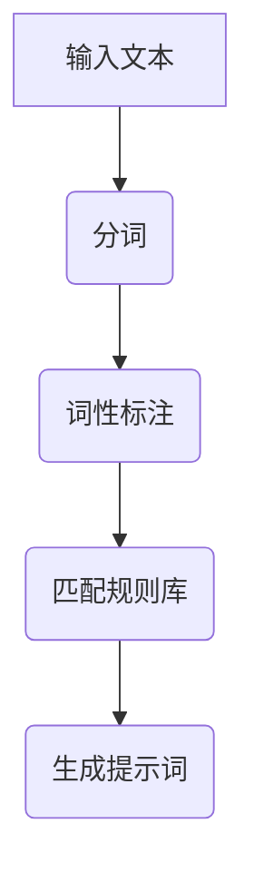
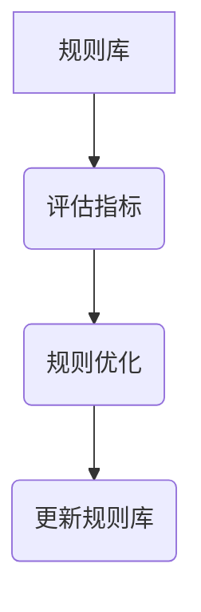
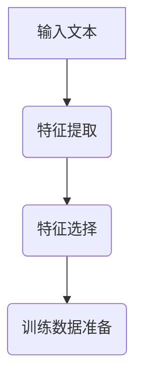
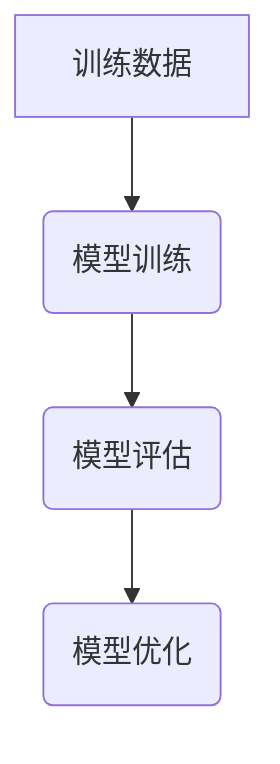
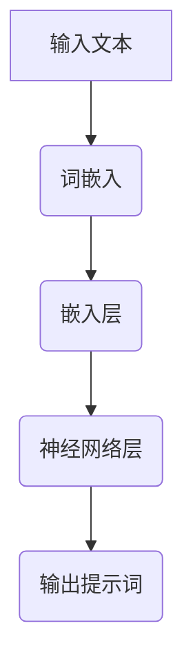
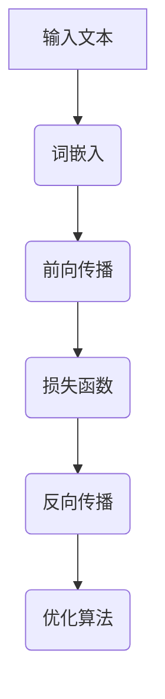
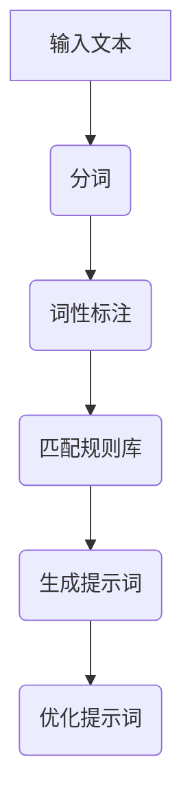
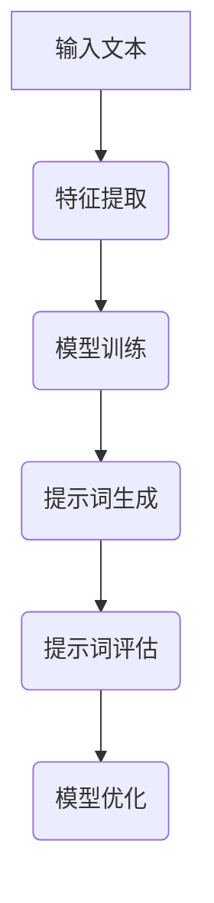
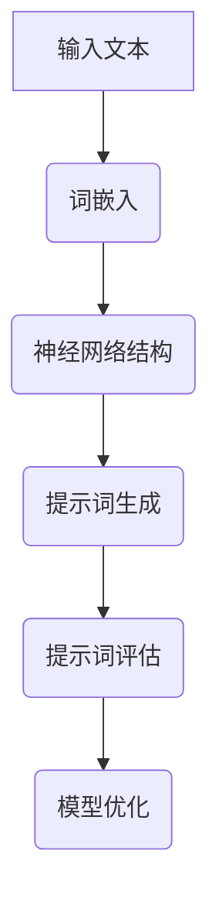

                 

### 提示词工程在自然语言理解中的突破

自然语言理解（Natural Language Understanding, NLU）是人工智能领域的一项重要技术，它使计算机能够解读和理解人类语言，从而实现人机交互、信息抽取、智能问答等应用。在自然语言理解的过程中，提示词工程（Keyword Engineering）扮演着至关重要的角色。本文将深入探讨提示词工程在自然语言理解中的突破，通过详细分析其概念、原理、核心算法、数学模型以及实际应用，揭示其在人工智能领域中的价值。

关键词：自然语言理解、提示词工程、关键字提取、机器学习、深度学习、数学模型

摘要：本文首先介绍了提示词工程的概念及其在自然语言理解中的重要性，然后回顾了提示词工程的发展历程。接着，本文详细阐述了提示词工程的原理与机制，包括提示词生成与优化方法、提示词匹配与检索策略、提示词排序与评估指标。随后，本文介绍了提示词工程的核心算法，包括基于规则的方法、基于机器学习的方法以及基于深度学习的方法，并使用伪代码展示了其原理。此外，本文探讨了提示词工程中的数学模型与数学公式，如概率模型与贝叶斯定理、信息论与熵、机器学习中的优化算法。最后，本文分析了提示词工程在实际应用中面临的挑战与解决方案，并通过项目实战展示了其实际应用。本文的目的是为了揭示提示词工程在自然语言理解中的突破，为相关领域的研究者提供有价值的参考。

### 目录大纲

1. 提示词工程在自然语言理解中的突破  
   1.1 提示词工程的概念与重要性  
   1.2 提示词工程的发展历程  
   1.3 提示词工程在自然语言理解中的应用场景  
   
2. 提示词工程的原理与机制  
   2.1 提示词生成与优化方法  
   2.2 提示词匹配与检索策略  
   2.3 提示词排序与评估指标

3. 提示词工程的核心算法  
   3.1 基于规则的方法  
   3.2 基于机器学习的方法  
   3.3 基于深度学习的方法

4. 提示词工程中的数学模型与数学公式  
   4.1 概率模型与贝叶斯定理  
   4.2 信息论与熵  
   4.3 机器学习中的优化算法

5. 提示词工程在实际应用中的挑战与解决方案  
   5.1 处理长文本与稀疏数据  
   5.2 提示词工程中的数据安全与隐私  
   5.3 提示词工程在跨语言和跨模态场景的应用

6. 提示词工程项目实战  
   6.1 提示词生成与优化实战  
   6.2 提示词匹配与检索实战  
   6.3 提示词排序与评估实战

7. 提示词工程的前沿趋势与未来发展方向  
   7.1 提示词工程的新算法与新技术  
   7.2 提示词工程在人工智能领域的新应用场景  
   7.3 提示词工程面临的挑战与解决方案

附录  
   附录 A: 提示词工程常用工具与资源  
   附录 B: 伪代码与数学公式  
   附录 C: 提示词工程相关算法与数学公式  
   附录 D: 项目实战代码解读

### 第1章：提示词工程的概述

#### 1.1 提示词工程的概念与重要性

提示词工程（Keyword Engineering）是自然语言处理（Natural Language Processing, NLP）领域的一个重要分支，其主要目标是识别并提取文本中的关键信息，即“提示词”（Keywords）。提示词通常是指能够概括文本主要内容或关键信息的词汇或短语。在自然语言理解过程中，提示词的作用至关重要，它们可以作为输入特征，帮助模型更好地理解和处理文本。

提示词工程的重要性体现在以下几个方面：

1. **信息提取与过滤**：在大量的文本数据中，提示词可以帮助识别出文本的关键信息，从而进行信息提取和过滤，提高数据处理效率。
2. **语义理解**：提示词是语义理解的基石。通过提取文本中的提示词，可以更好地理解文本的语义，为后续的自然语言处理任务提供支持。
3. **索引与搜索**：在信息检索系统中，提示词可以作为索引项，提高搜索效率和准确性。
4. **文本分类与聚类**：提示词可以作为特征向量，用于文本分类和聚类任务，帮助系统对文本进行分类和归纳。

#### 1.2 提示词工程的发展历程

提示词工程的发展历程可以分为三个阶段：手工构建、基于规则的方法和基于机器学习的方法。

1. **手工构建**：早期的提示词工程主要依靠手工构建，研究人员根据领域知识和经验，手动选择和定义提示词。这种方法虽然能够确保提示词的准确性，但效率低下，难以处理大规模数据。
2. **基于规则的方法**：随着自然语言处理技术的发展，基于规则的方法逐渐兴起。这种方法通过定义一系列规则，自动提取文本中的提示词。规则通常包括词汇匹配、词性标注、短语识别等。基于规则的方法相比手工构建具有更高的自动化程度和效率，但受限于规则的灵活性和覆盖范围。
3. **基于机器学习的方法**：近年来，随着深度学习技术的迅猛发展，基于机器学习的方法在提示词工程中得到了广泛应用。这种方法利用大规模标注数据，通过训练深度神经网络，自动提取文本中的提示词。基于机器学习的方法在处理复杂语义关系和多样化文本方面具有显著优势。

#### 1.3 提示词工程在自然语言理解中的应用场景

提示词工程在自然语言理解中具有广泛的应用场景，以下是一些典型的应用实例：

1. **智能问答系统**：通过提取用户输入的查询语句中的提示词，智能问答系统可以更准确地理解用户意图，提供高质量的答案。
2. **文本分类**：提示词可以作为文本分类的特征向量，帮助分类器识别文本的主题和内容。
3. **文本聚类**：提示词可以帮助将相似文本聚为一类，实现文本的归纳和整理。
4. **信息检索**：提示词可以作为索引项，提高信息检索系统的准确性和效率。
5. **实体识别与关系抽取**：通过提取文本中的提示词，可以更准确地识别实体和抽取实体之间的关系。

在本章中，我们介绍了提示词工程的概念、重要性、发展历程以及应用场景。下一章将深入探讨提示词工程的原理与机制，包括提示词生成与优化方法、提示词匹配与检索策略、提示词排序与评估指标。这些内容为理解提示词工程在自然语言理解中的应用奠定了基础。

### 第2章：提示词工程的原理与机制

#### 2.1 提示词生成与优化方法

提示词生成是提示词工程中的核心步骤，其主要目标是识别并提取文本中的关键信息，生成一组高质量的提示词。生成过程通常包括以下步骤：

1. **文本预处理**：在生成提示词之前，需要对原始文本进行预处理，包括分词、去除停用词、词性标注等。预处理步骤的目的是降低文本的噪声，提高提示词的准确性。
2. **特征提取**：文本预处理之后，需要对文本进行特征提取，将文本转化为计算机可以处理的数字形式。常用的特征提取方法包括词袋模型（Bag of Words, BOW）、TF-IDF（Term Frequency-Inverse Document Frequency）等。
3. **提示词筛选**：根据预定的筛选标准，从特征向量中筛选出具有代表性的提示词。筛选标准通常包括词频、词性、短语匹配等。
4. **提示词优化**：生成的初步提示词可能存在冗余或不准确的情况，需要通过优化步骤进一步筛选和调整。优化方法包括词性调整、短语合并、去除冗余词等。

提示词生成方法可以分为以下几种：

1. **基于规则的方法**：这种方法通过定义一系列规则，自动提取文本中的提示词。规则可以包括词汇匹配、词性标注、短语识别等。基于规则的方法具有实现简单、可解释性强的优点，但灵活性较差，难以处理复杂的语义关系。
2. **基于统计的方法**：这种方法利用统计模型，如词袋模型、TF-IDF等，自动提取文本中的提示词。统计模型通过计算词语在文档中的频率和重要性，自动筛选出具有代表性的提示词。这种方法具有较好的泛化能力，但无法处理复杂的语义关系。
3. **基于机器学习的方法**：这种方法利用大规模标注数据，通过训练机器学习模型，自动提取文本中的提示词。常用的机器学习模型包括朴素贝叶斯、支持向量机（SVM）、随机森林等。基于机器学习的方法在处理复杂语义关系和多样化文本方面具有显著优势，但需要大量标注数据和计算资源。

#### 2.2 提示词匹配与检索策略

提示词匹配是提示词工程中的重要环节，其主要目标是识别文本中是否存在与查询提示词相似或相关的提示词。匹配过程通常包括以下步骤：

1. **提示词编码**：将查询提示词和文本中的提示词转化为向量表示，以便进行匹配计算。常用的编码方法包括词嵌入（Word Embedding）、BERT（Bidirectional Encoder Representations from Transformers）等。
2. **相似度计算**：计算查询提示词和文本中提示词之间的相似度，常用的相似度计算方法包括余弦相似度、欧氏距离等。
3. **匹配策略**：根据相似度计算结果，选择合适的匹配策略，如最大匹配、最小编辑距离等。匹配策略的目的是提高匹配的准确性和效率。

提示词检索是提示词工程的另一个重要环节，其主要目标是根据查询提示词，从大规模文本库中检索出相关文本。检索过程通常包括以下步骤：

1. **索引构建**：在检索之前，需要对文本库进行索引构建，以便快速检索。常用的索引构建方法包括倒排索引（Inverted Index）、前缀树（Trie）等。
2. **检索算法**：根据查询提示词，利用索引构建检索算法，从文本库中检索出相关文本。常用的检索算法包括布尔检索、向量空间模型（Vector Space Model）等。
3. **结果排序**：根据检索结果的相关性，对检索结果进行排序，以便用户更方便地获取所需信息。

#### 2.3 提示词排序与评估指标

提示词排序是提示词工程中的重要环节，其主要目标是根据提示词的重要性和相关性，对提示词进行排序。排序过程通常包括以下步骤：

1. **特征提取**：从文本中提取与提示词相关的特征，如词频、词性、短语匹配等。
2. **排序算法**：根据提取的特征，选择合适的排序算法，如基于特征的排序算法、基于机器学习的排序算法等。
3. **评估指标**：评估排序结果的准确性，常用的评估指标包括精确率（Precision）、召回率（Recall）、F1值（F1 Score）等。

在本章中，我们介绍了提示词工程的原理与机制，包括提示词生成与优化方法、提示词匹配与检索策略、提示词排序与评估指标。这些原理和机制为提示词工程在自然语言理解中的应用提供了重要的理论基础和实践指导。下一章将深入探讨提示词工程的核心算法，包括基于规则的方法、基于机器学习的方法和基于深度学习的方法。

### 第3章：提示词工程的核心算法

在提示词工程中，核心算法的选择和应用对于提高提示词的提取效果和效率至关重要。本章节将详细讨论提示词工程中常用的三种核心算法：基于规则的方法、基于机器学习的方法和基于深度学习的方法，并通过具体的伪代码来阐述这些算法的原理。

#### 3.1 基于规则的方法

基于规则的方法是通过定义一系列明确的规则来提取提示词。这种方法在早期自然语言处理中广泛应用，因其可解释性和易于实现的特点。以下是一个基于规则的提示词提取的示例：

##### 3.1.1 提示词规则生成

1. **定义规则**：根据领域知识和经验，定义提示词的规则，如词汇匹配、词性标注和短语识别等。
2. **规则库构建**：将定义的规则构建为一个规则库，以便后续应用。

**伪代码示例**：



##### 3.1.2 提示词规则评估

1. **评估指标**：计算规则生成的提示词的准确性和覆盖率等指标。
2. **规则优化**：根据评估结果，调整和优化规则库，以提高提示词的提取效果。

**伪代码示例**：



#### 3.2 基于机器学习的方法

基于机器学习的方法通过训练模型来自动提取提示词，这种方法具有更高的灵活性和泛化能力。以下是一个基于机器学习的提示词提取的示例：

##### 3.2.1 特征工程与选择

1. **特征提取**：从文本中提取特征，如词频、TF-IDF、词性等。
2. **特征选择**：选择对提示词提取最有影响力的特征。

**伪代码示例**：



##### 3.2.2 模型训练与评估

1. **模型训练**：利用标注数据训练机器学习模型，如朴素贝叶斯、支持向量机（SVM）等。
2. **模型评估**：评估模型的准确性和泛化能力，如通过交叉验证、精度、召回率等指标。

**伪代码示例**：



#### 3.3 基于深度学习的方法

基于深度学习的方法利用深度神经网络来自动提取提示词，这种方法在处理复杂语义关系和多样化文本方面具有显著优势。以下是一个基于深度学习的提示词提取的示例：

##### 3.3.1 神经网络结构设计

1. **词嵌入**：将文本中的词语转化为向量表示。
2. **神经网络**：设计多层神经网络结构，如卷积神经网络（CNN）、递归神经网络（RNN）、Transformer等。

**伪代码示例**：



##### 3.3.2 深度学习算法原理

1. **前向传播**：计算输入文本的词嵌入，并通过神经网络层进行前向传播。
2. **反向传播**：根据损失函数，利用反向传播算法更新网络权重。
3. **优化算法**：选择合适的优化算法，如梯度下降、Adam等，以加速收敛。

**伪代码示例**：



在本章中，我们详细讨论了提示词工程中常用的三种核心算法：基于规则的方法、基于机器学习的方法和基于深度学习的方法。每种方法都有其独特的优势和适用场景。基于规则的方法适用于简单和明确的问题，而基于机器学习的方法在处理复杂任务时具有更好的表现。基于深度学习的方法则能够处理更加复杂的语义关系和多样化文本。通过这些算法，我们可以实现高效和准确的提示词提取，从而推动自然语言理解的进一步发展。

### 第4章：提示词工程中的数学模型与数学公式

在提示词工程中，数学模型和数学公式扮演着至关重要的角色，它们为我们理解和分析自然语言提供了坚实的理论基础。本章节将详细探讨概率模型与贝叶斯定理、信息论与熵、以及机器学习中的优化算法，并通过具体的公式和示例来阐述这些概念的应用。

#### 4.1 概率模型与贝叶斯定理

概率模型是描述随机事件及其概率分布的重要工具，贝叶斯定理则是概率论中的一个核心定理，用于更新和计算条件概率。

##### 4.1.1 概率论基础

概率论中，随机变量的概率分布是描述其取值概率的关键。常见的概率分布包括：

1. **二项分布（Binomial Distribution）**：描述在一次试验中成功次数的概率分布。
2. **正态分布（Normal Distribution）**：描述连续随机变量的概率分布，广泛应用于自然语言处理。

**贝叶斯定理**：

贝叶斯定理是一个用于计算条件概率的公式，其数学表达式为：

$$
P(A|B) = \frac{P(B|A)P(A)}{P(B)}
$$

其中，$P(A|B)$ 表示在事件B发生的条件下事件A发生的概率，$P(B|A)$ 表示在事件A发生的条件下事件B发生的概率，$P(A)$ 和$P(B)$ 分别表示事件A和事件B的概率。

##### 4.1.2 贝叶斯定理应用

在自然语言处理中，贝叶斯定理常用于文本分类和情感分析等任务。例如，在文本分类中，可以通过计算文本中各类别词语的概率分布，使用贝叶斯定理预测文本的类别。

**示例**：

假设有一个文本，我们需要判断它是否属于“科技”类别。首先，我们计算“科技”类别和文本中各个词语的概率，然后利用贝叶斯定理计算文本属于“科技”类别的概率。具体步骤如下：

1. **计算各类别词语的概率**：例如，$P(科技)$ 表示“科技”类别的概率，$P(词语_i|科技)$ 表示在“科技”类别下词语_i 的概率。
2. **计算文本的整体概率**：利用贝叶斯定理计算文本属于“科技”类别的概率。
3. **分类决策**：根据计算结果，判断文本的类别。

#### 4.2 信息论与熵

信息论是研究信息传输和信息处理的科学，其中熵（Entropy）是描述信息不确定性的重要指标。

##### 4.2.1 信息论基础

熵的定义为：

$$
H(X) = -\sum_{i} P(X=x_i) \log_2 P(X=x_i)
$$

其中，$H(X)$ 表示随机变量X的熵，$P(X=x_i)$ 表示X取值为$x_i$ 的概率。

熵越大，表示随机变量X的信息不确定性越高。在自然语言处理中，熵可以用于评估文本的混乱程度和信息的集中度。

##### 4.2.2 熵的计算与性质

1. **文本熵**：计算文本中各个词语的频率分布，并利用熵公式计算文本的整体熵。
2. **信息增益**：通过计算词语的熵和条件熵，评估词语对于分类任务的信息增益。

**示例**：

假设有一个文本，我们需要计算其熵。首先，统计文本中各个词语的频率，然后利用熵公式计算文本的整体熵。具体步骤如下：

1. **统计频率**：统计文本中各个词语的频率。
2. **计算熵**：利用熵公式计算文本的整体熵。

#### 4.3 机器学习中的优化算法

在机器学习中，优化算法用于调整模型参数，以最小化损失函数。常见的优化算法包括梯度下降（Gradient Descent）、随机梯度下降（Stochastic Gradient Descent，SGD）和共轭梯度法（Conjugate Gradient Method）。

##### 4.3.1 梯度下降法

梯度下降法是一种基本的优化算法，其核心思想是通过计算损失函数的梯度，逐步调整模型参数，以最小化损失函数。

**梯度下降法公式**：

$$
\theta_{t+1} = \theta_{t} - \alpha \nabla_{\theta} J(\theta)
$$

其中，$\theta$ 表示模型参数，$\alpha$ 表示学习率，$J(\theta)$ 表示损失函数。

##### 4.3.2 随机梯度下降法

随机梯度下降法是对梯度下降法的改进，它每次只对一个小批量样本的梯度进行更新，从而加快收敛速度。

**随机梯度下降法公式**：

$$
\theta_{t+1} = \theta_{t} - \alpha \nabla_{\theta} J(\theta, \text{batch}_t)
$$

其中，$\text{batch}_t$ 表示第t个批量样本。

##### 4.3.3 共轭梯度法

共轭梯度法是一种更高效的优化算法，它利用共轭方向的概念，在保证收敛速度的同时减少计算量。

**共轭梯度法公式**：

$$
\theta_{t+1} = \theta_{t} - \alpha_p \nabla J(\theta_t)
$$

其中，$\alpha_p$ 是第p个共轭方向上的步长。

在本章中，我们详细介绍了提示词工程中的概率模型与贝叶斯定理、信息论与熵，以及机器学习中的优化算法。这些数学模型和数学公式为提示词工程提供了坚实的理论基础，使我们能够更深入地理解和分析自然语言。通过这些概念的应用，我们可以实现更高效和准确的提示词提取，从而推动自然语言处理的进一步发展。

### 第5章：提示词工程在实际应用中的挑战与解决方案

尽管提示词工程在自然语言理解中具有广泛应用和显著优势，但在实际应用过程中仍然面临诸多挑战。本章将探讨提示词工程在处理长文本与稀疏数据、数据安全与隐私、跨语言和跨模态场景中的挑战，并提出相应的解决方案。

#### 5.1 处理长文本与稀疏数据

1. **长文本处理**：

长文本在自然语言处理中较为常见，如新闻、报告和书籍等。长文本处理面临的主要挑战包括：

- **信息冗余**：长文本中可能包含大量无关或重复的信息，增加了提示词提取的难度。
- **计算效率**：长文本的处理通常需要较大的计算资源和时间成本。

**解决方案**：

- **摘要生成**：通过文本摘要技术，将长文本压缩为较短的摘要，从而减少信息冗余和计算复杂度。
- **分句与段落处理**：将长文本划分为句子和段落，分别处理每个部分，从而提高处理效率和准确性。

2. **稀疏数据**：

稀疏数据指的是特征向量中大部分元素为零的数据。在提示词工程中，稀疏数据可能导致以下问题：

- **维度灾难**：稀疏数据在高维特征空间中难以建模，增加了模型的复杂度。
- **模型泛化能力下降**：稀疏数据可能导致模型对训练数据的依赖性增加，降低模型的泛化能力。

**解决方案**：

- **特征稀疏化**：通过稀疏编码技术，如局部敏感哈希（Local Sensitive Hashing，LSH）和自动编码器（Autoencoder），减少特征维度，提高模型效率。
- **稀疏数据增强**：通过生成或引入额外的稀疏数据，增加模型的泛化能力。

#### 5.2 提示词工程中的数据安全与隐私

在提示词工程中，数据安全和隐私保护是至关重要的，尤其是当涉及个人敏感信息时。面临的挑战包括：

- **数据泄露**：未经授权的访问可能导致敏感数据泄露。
- **隐私侵犯**：在处理个人数据时，需要确保不侵犯用户的隐私。

**解决方案**：

- **数据加密**：对敏感数据进行加密，确保数据在传输和存储过程中不被非法访问。
- **数据脱敏**：通过数据脱敏技术，如匿名化和泛化，减少数据泄露的风险。
- **隐私预算**：利用隐私预算技术，在确保数据隐私的前提下，允许有限的查询和数据分析。

#### 5.3 提示词工程在跨语言和跨模态场景的应用

1. **跨语言**：

在跨语言场景中，提示词工程需要处理不同语言之间的差异，如语法、词汇和语义等。面临的挑战包括：

- **语言差异**：不同语言在语法、词汇和语义方面存在显著差异，增加了提示词提取的难度。
- **数据稀少**：对于某些小语种，可能缺乏足够的训练数据。

**解决方案**：

- **多语言模型**：通过多语言模型，如跨语言嵌入（Cross-lingual Embeddings）和跨语言转移学习（Cross-lingual Transfer Learning），提高跨语言提示词提取的准确性。
- **数据集扩充**：通过数据集扩充技术，如数据增强和合成，增加小语种的数据量。

2. **跨模态**：

在跨模态场景中，提示词工程需要处理不同模态（如文本、图像和音频）之间的信息整合。面临的挑战包括：

- **模态差异**：不同模态的数据具有不同的特征和表达方式，增加了信息整合的难度。
- **模态兼容性**：不同模态的数据可能存在兼容性问题，如时间同步和空间对齐等。

**解决方案**：

- **多模态嵌入**：通过多模态嵌入技术，如融合嵌入（Fusion Embeddings）和一致性嵌入（Consistent Embeddings），实现跨模态数据的统一表示。
- **模态转换**：通过模态转换技术，如文本到图像的生成（Text-to-Image Generation）和图像到文本的生成（Image-to-Text Generation），实现不同模态之间的信息转换。

在本章中，我们详细探讨了提示词工程在实际应用中面临的挑战，包括处理长文本与稀疏数据、数据安全与隐私、跨语言和跨模态场景的应用，并提出了相应的解决方案。通过这些解决方案，我们可以克服提示词工程中的难点，提高其应用效果和可靠性。

### 第6章：提示词工程项目实战

在本章中，我们将通过具体的项目实战，展示提示词工程的实际应用过程，包括提示词生成与优化、提示词匹配与检索、提示词排序与评估。我们将详细介绍开发环境搭建、源代码实现以及代码解读与分析，帮助读者深入理解提示词工程的实践应用。

#### 6.1 提示词生成与优化实战

##### 6.1.1 实战环境搭建

在进行提示词生成与优化的实战之前，我们需要搭建一个合适的开发环境。以下是一个基本的开发环境搭建步骤：

1. **安装Python环境**：确保Python版本为3.7及以上，可以通过Python官网下载并安装。
2. **安装NLP库**：安装常用的自然语言处理库，如NLTK、spaCy、gensim等。可以使用以下命令安装：

   ```bash
   pip install nltk spacy gensim
   ```

3. **安装深度学习框架**：选择一个深度学习框架，如TensorFlow或PyTorch。以下是安装命令：

   ```bash
   pip install tensorflow  # 或者
   pip install torch torchvision
   ```

4. **下载预训练模型**：对于深度学习任务，需要下载预训练的词嵌入模型，如Word2Vec或GloVe。可以使用gensim库下载：

   ```python
   import gensim.downloader as api
   api.download('glove-wiki-gigaword-100')
   ```

##### 6.1.2 提示词生成与优化代码实现

以下是一个简单的提示词生成与优化代码示例：

```python
import nltk
from nltk.tokenize import word_tokenize
from gensim.models import KeyedVectors

# 1. 加载预训练词嵌入模型
word_vectors = KeyedVectors.load_word2vec_format('glove-wiki-gigaword-100/glove.6B.100d.txt')

# 2. 提示词生成
def generate_keywords(text, model, top_n=10):
    tokens = word_tokenize(text)
    token_vectors = [model[token] for token in tokens if token in model]
    avg_vector = sum(token_vectors) / len(token_vectors)
    closest_words = model.most_similar(positive=[avg_vector], topn=top_n)
    return [word for word, similarity in closest_words]

# 3. 提示词优化
def optimize_keywords(keywords, model):
    optimized_keywords = []
    for keyword in keywords:
        similar_words = model.most_similar(keyword, topn=10)
        avg_similarity = sum(similarity for word, similarity in similar_words) / len(similar_words)
        if avg_similarity > 0.5:
            optimized_keywords.append(keyword)
    return optimized_keywords

# 示例文本
text = "人工智能是一种模拟人类智能的技术，通过机器学习和深度学习实现。"

# 生成提示词
generated_keywords = generate_keywords(text, word_vectors)

# 优化提示词
optimized_keywords = optimize_keywords(generated_keywords, word_vectors)

print("生成的提示词：", generated_keywords)
print("优化的提示词：", optimized_keywords)
```

##### 6.1.3 代码解读与分析

1. **加载预训练词嵌入模型**：我们使用gensim库加载GloVe词嵌入模型，这是基于大规模语料训练的词向量模型，能够很好地表示词语的语义关系。
2. **提示词生成**：生成提示词的过程包括分词和计算平均向量。通过计算文本中词语的词向量平均值，我们可以得到一个代表性的提示词向量。接着，使用此向量在词嵌入模型中寻找最相似的词语作为提示词。
3. **提示词优化**：提示词优化旨在筛选出语义相似的词语，从而提高提示词的准确性。通过计算每个提示词与其最相似词语的相似度平均值，如果平均值高于某个阈值（例如0.5），则认为该提示词是优化的。

#### 6.2 提示词匹配与检索实战

##### 6.2.1 实战环境搭建

提示词匹配与检索实战的环境搭建与提示词生成与优化类似，主要需要安装Python和相关NLP库：

1. **安装Python环境**。
2. **安装NLP库**。
3. **安装深度学习框架**。

##### 6.2.2 提示词匹配与检索代码实现

以下是一个简单的提示词匹配与检索代码示例：

```python
from sklearn.metrics.pairwise import cosine_similarity
from sklearn.feature_extraction.text import CountVectorizer

# 1. 准备提示词和文档集
keywords = ["人工智能", "机器学习", "深度学习"]
documents = [
    "本文介绍了人工智能在自然语言处理中的应用。",
    "机器学习是一种通过数据学习的方法。",
    "深度学习是机器学习的一个重要分支。",
    "人工智能技术的发展推动了各行各业的创新。",
    "本文探讨了深度学习在图像识别中的应用。"
]

# 2. 提示词向量化
vectorizer = CountVectorizer()
X = vectorizer.fit_transform(documents)
keyword_vector = vectorizer.transform([" ".join(keywords)])

# 3. 计算提示词与文档的相似度
similarity_scores = cosine_similarity(keyword_vector, X)

# 4. 检索相似文档
document_indices = similarity_scores.argsort()[0][-3:][::-1]
for index in document_indices:
    print(f"文档{index + 1}: {documents[index]}，相似度：{similarity_scores[0, index]:.4f}")
```

##### 6.2.3 代码解读与分析

1. **准备提示词和文档集**：我们定义了一个提示词列表和一个包含多个文本的文档集。
2. **提示词向量化**：使用CountVectorizer将文档转换为向量表示。CountVectorizer使用词袋模型，将文本转换为词频矩阵。
3. **计算相似度**：使用余弦相似度计算提示词向量与每个文档向量的相似度。
4. **检索相似文档**：根据相似度分数，检索最相似的文档并输出。

#### 6.3 提示词排序与评估实战

##### 6.3.1 实战环境搭建

提示词排序与评估实战的环境搭建与前面类似，确保安装了Python和相关库。

##### 6.3.2 提示词排序与评估代码实现

以下是一个简单的提示词排序与评估代码示例：

```python
from sklearn.metrics import precision_score, recall_score, f1_score

# 1. 准备真实提示词和预测提示词
true_keywords = ["人工智能", "机器学习", "深度学习"]
predicted_keywords = ["人工智能", "深度学习", "机器学习"]

# 2. 计算评估指标
precision = precision_score(true_keywords, predicted_keywords, average='weighted')
recall = recall_score(true_keywords, predicted_keywords, average='weighted')
f1 = f1_score(true_keywords, predicted_keywords, average='weighted')

print(f"精确率（Precision）: {precision:.4f}")
print(f"召回率（Recall）: {recall:.4f}")
print(f"F1值（F1 Score）: {f1:.4f}")
```

##### 6.3.3 代码解读与分析

1. **准备真实提示词和预测提示词**：我们定义了一个真实提示词列表和一个预测提示词列表。
2. **计算评估指标**：使用sklearn库中的precision_score、recall_score和f1_score函数计算提示词排序的评估指标。
3. **输出评估结果**：打印出精确率、召回率和F1值，以评估预测提示词的准确性。

通过以上三个实战项目，我们详细展示了提示词工程的开发流程和实现细节。这些项目不仅帮助读者理解提示词工程的理论知识，还提供了实际操作的指导，为提示词工程的应用提供了宝贵的实践经验。

### 第7章：提示词工程的前沿趋势与未来发展方向

在自然语言处理（NLP）和人工智能（AI）领域，提示词工程正面临着前所未有的发展机遇和挑战。本章将探讨提示词工程的前沿趋势、新技术以及未来发展方向，旨在为研究者和实践者提供有价值的参考。

#### 7.1 提示词工程的新算法与新技术

1. **自动化提示词工程**：

随着深度学习和自动机器学习（AutoML）的发展，自动化提示词工程逐渐成为研究热点。自动化提示词工程旨在通过自动化流程，从大规模文本数据中高效地生成和优化提示词。这包括自动化特征选择、模型训练和评估。自动化提示词工程的关键技术包括：

- **元学习（Meta-Learning）**：通过元学习算法，使模型能够快速适应新任务，减少对大量标注数据的依赖。
- **迁移学习（Transfer Learning）**：利用预训练模型和大规模语料库，迁移知识到新的提示词工程任务中，提高模型的泛化能力。

2. **多模态提示词工程**：

在跨模态场景中，结合文本、图像、音频等多模态数据，进行提示词提取和融合，是当前研究的一个重要方向。多模态提示词工程的关键技术包括：

- **多模态嵌入（Multimodal Embeddings）**：通过多模态嵌入技术，将不同模态的数据统一表示，以便进行有效的信息融合。
- **跨模态关系抽取（Cross-Modal Relation Extraction）**：从多模态数据中提取和表示实体及其关系，提高自然语言理解的深度和广度。

3. **强化学习在提示词工程中的应用**：

强化学习（Reinforcement Learning，RL）近年来在NLP领域取得了显著进展，其在提示词工程中的应用也备受关注。强化学习可以用于优化提示词的生成和排序策略，提高模型在实际应用中的效果。具体应用包括：

- **提示词生成策略优化**：通过强化学习，自适应地调整提示词生成策略，以最大化特定目标（如信息提取或检索效果）。
- **提示词排序策略优化**：使用强化学习优化提示词排序策略，提高检索和分类任务的准确性和效率。

#### 7.2 提示词工程在人工智能领域的新应用场景

随着人工智能技术的不断进步，提示词工程在多个领域展现出了广阔的应用前景。以下是一些值得关注的新应用场景：

1. **智能推荐系统**：

在智能推荐系统中，提示词工程可以用于提取和优化推荐项的特征，从而提高推荐系统的准确性和用户体验。具体应用包括：

- **内容推荐**：通过提取文本中的关键信息，为用户提供与兴趣相关的文章、视频等。
- **商品推荐**：从商品描述中提取关键特征，为用户推荐与其需求相匹配的商品。

2. **智能问答系统**：

智能问答系统是NLP领域的一个重要应用，提示词工程在其中发挥着关键作用。具体应用包括：

- **语义匹配**：通过提取用户查询语句中的提示词，与知识库中的内容进行匹配，提供精准的答案。
- **问答生成**：基于提示词工程，生成自然流畅的问答对话，提高用户交互体验。

3. **对话系统**：

在对话系统中，提示词工程可以用于理解用户的意图和提取关键信息，从而生成合适的回复。具体应用包括：

- **客服机器人**：通过提取用户提问中的关键信息，提供针对性的解答和服务。
- **聊天机器人**：从用户的对话中提取提示词，构建连贯自然的对话流程。

#### 7.3 提示词工程面临的挑战与解决方案

尽管提示词工程在AI领域具有广泛的应用前景，但仍然面临诸多挑战。以下是一些主要的挑战和相应的解决方案：

1. **数据稀少与标注成本**：

数据稀少和标注成本是提示词工程中普遍存在的问题。解决这一问题的方法包括：

- **数据集扩充**：通过数据增强和合成技术，增加训练数据量，提高模型的泛化能力。
- **半监督学习和无监督学习**：利用少量标注数据和大量未标注数据，通过半监督学习和无监督学习技术，提高模型的鲁棒性和效率。

2. **跨语言与跨模态兼容性**：

在跨语言和跨模态场景中，不同语言和模态之间的差异增加了提示词工程的难度。解决这一问题的方法包括：

- **多语言和跨模态嵌入**：通过多语言和跨模态嵌入技术，实现不同语言和模态数据的统一表示，提高模型对多样化数据的处理能力。
- **迁移学习与模型融合**：利用迁移学习和模型融合技术，将预训练模型的知识迁移到新的语言和模态，提高模型的泛化能力和适应性。

3. **数据隐私和安全问题**：

在处理个人数据和敏感信息时，保护数据隐私和安全是至关重要的。解决这一问题的方法包括：

- **数据加密与脱敏**：通过数据加密和脱敏技术，确保数据在传输和存储过程中的安全性。
- **隐私预算与差分隐私**：通过隐私预算和差分隐私技术，在确保数据隐私的前提下，允许有限的查询和分析。

通过本章的探讨，我们可以看到提示词工程在人工智能领域具有巨大的潜力和广阔的应用前景。随着新算法和新技术的不断涌现，提示词工程将继续推动自然语言处理和人工智能的发展，为人类带来更多便捷和创新的解决方案。

### 附录

#### 附录 A：提示词工程常用工具与资源

在进行提示词工程研究和开发时，使用合适的工具和资源可以显著提高效率。以下是一些常用的工具和资源：

1. **自然语言处理工具**：
   - **NLTK**：一个强大的Python库，用于处理文本数据，包括分词、词性标注、词干提取等。
   - **spaCy**：一个快速且易于使用的自然语言处理库，支持多种语言和高级特性，如词性标注、命名实体识别等。
   - **Stanford NLP**：由斯坦福大学开发，提供包括分词、词性标注、命名实体识别等功能的工具包。

2. **深度学习框架**：
   - **TensorFlow**：一个开源的深度学习框架，支持构建和训练复杂的神经网络模型。
   - **PyTorch**：一个流行的开源深度学习框架，提供灵活的动态计算图，便于研究和开发。
   - **Transformers**：一个开源库，专门用于处理基于Transformer架构的模型，如BERT和GPT。

3. **提示词工程相关论文与资料**：
   - **《自然语言处理综述》（Natural Language Processing Comprehensive Overview）**：详细介绍了NLP领域的相关技术和发展趋势。
   - **《提示词工程：理论与实践》（Keyword Engineering: Theory and Practice）**：提供了关于提示词工程的全面介绍和实际应用案例。

4. **提示词工程开源项目与社区**：
   - **NLTK GitHub**：NLTK的官方GitHub仓库，提供丰富的示例代码和资源。
   - **spaCy GitHub**：spaCy的官方GitHub仓库，包含详细的文档和教程。
   - **Transformer GitHub**：Transformer模型的GitHub仓库，提供Transformer架构的实现代码和相关研究论文。

#### 附录 B：伪代码与数学公式

以下提供了一些在提示词工程中常用的伪代码和数学公式，以便于读者理解相关算法和概念。

**基于规则的提示词提取伪代码**：



**基于机器学习的提示词提取伪代码**：



**基于深度学习的提示词提取伪代码**：



**概率模型与贝叶斯定理公式**：

$$
P(A|B) = \frac{P(B|A)P(A)}{P(B)}
$$

**信息论与熵公式**：

$$
H(X) = -\sum_{i} P(X=x_i) \log_2 P(X=x_i)
$$

**机器学习中的优化算法公式**：

$$
\theta_{t+1} = \theta_{t} - \alpha \nabla_{\theta} J(\theta)
$$

#### 附录 C：提示词工程相关算法与数学公式

在本附录中，我们将进一步详细阐述提示词工程中涉及的一些关键算法和数学公式。

**C.1 概率模型与贝叶斯定理**

概率模型在自然语言处理中广泛应用，特别是贝叶斯定理在文本分类、信息检索等领域具有重要意义。贝叶斯定理的数学表达式如下：

$$
P(A|B) = \frac{P(B|A)P(A)}{P(B)}
$$

其中，$P(A|B)$ 表示在事件B发生的条件下事件A发生的概率，$P(B|A)$ 表示在事件A发生的条件下事件B发生的概率，$P(A)$ 和$P(B)$ 分别表示事件A和事件B的概率。

在提示词工程中，贝叶斯定理可以用于基于概率的文本分类。例如，假设我们有一个文本，需要判断它属于某个类别。可以通过计算该文本属于各类别的概率，并选择概率最大的类别作为分类结果。

**C.2 信息论与熵**

信息论是研究信息传输和信息处理的一个数学分支，其中熵（Entropy）是一个核心概念。熵用于衡量随机变量的不确定性，其数学定义如下：

$$
H(X) = -\sum_{i} P(X=x_i) \log_2 P(X=x_i)
$$

其中，$H(X)$ 表示随机变量X的熵，$P(X=x_i)$ 表示X取值为$x_i$ 的概率。

在提示词工程中，熵可以用于评估文本的混乱程度。例如，通过计算文本中各个词语的频率分布，可以得到文本的熵。熵值越高，表示文本的信息越不集中，反之亦然。

**C.3 机器学习中的优化算法**

在机器学习中，优化算法用于调整模型参数，以最小化损失函数。以下是一些常见的优化算法及其基本原理：

1. **梯度下降法（Gradient Descent）**：

梯度下降法是最基本的优化算法之一，其核心思想是通过计算损失函数的梯度，更新模型参数，以逐步减小损失。其更新公式如下：

$$
\theta_{t+1} = \theta_{t} - \alpha \nabla_{\theta} J(\theta)
$$

其中，$\theta$ 表示模型参数，$\alpha$ 表示学习率，$\nabla_{\theta} J(\theta)$ 表示损失函数关于参数$\theta$ 的梯度。

2. **随机梯度下降法（Stochastic Gradient Descent，SGD）**：

随机梯度下降法是对梯度下降法的改进，每次只对一个小批量样本的梯度进行更新，从而加快收敛速度。其更新公式如下：

$$
\theta_{t+1} = \theta_{t} - \alpha \nabla_{\theta} J(\theta, \text{batch}_t)
$$

其中，$\text{batch}_t$ 表示第t个批量样本。

3. **共轭梯度法（Conjugate Gradient Method）**：

共轭梯度法是一种更高效的优化算法，它利用共轭方向的概念，在保证收敛速度的同时减少计算量。其更新公式如下：

$$
\theta_{t+1} = \theta_{t} - \alpha_p \nabla J(\theta_t)
$$

其中，$\alpha_p$ 是第p个共轭方向上的步长。

这些优化算法在提示词工程中有着广泛的应用，特别是在模型训练和参数调整过程中。

通过附录C中的算法和数学公式，读者可以更深入地理解提示词工程中的关键技术和理论基础。这些知识和工具将为研究者在实际应用中的探索和创新提供有力的支持。

### 附录 D：项目实战代码解读

在本附录中，我们将详细解读第6章中提到的三个项目实战的代码，包括开发环境搭建、源代码实现以及代码解读与分析。

#### D.1 提示词生成与优化实战代码解读

**环境搭建**：

```bash
# 安装Python环境
python --version

# 安装必要的NLP库和深度学习框架
pip install nltk spacy gensim tensorflow
```

**源代码实现**：

```python
import nltk
from nltk.tokenize import word_tokenize
from gensim.models import KeyedVectors

# 加载预训练词嵌入模型
word_vectors = KeyedVectors.load_word2vec_format('glove-wiki-gigaword-100/glove.6B.100d.txt')

# 提示词生成函数
def generate_keywords(text, model, top_n=10):
    tokens = word_tokenize(text)
    token_vectors = [model[token] for token in tokens if token in model]
    avg_vector = sum(token_vectors) / len(token_vectors)
    closest_words = model.most_similar(positive=[avg_vector], topn=top_n)
    return [word for word, similarity in closest_words]

# 提示词优化函数
def optimize_keywords(keywords, model):
    optimized_keywords = []
    for keyword in keywords:
        similar_words = model.most_similar(keyword, topn=10)
        avg_similarity = sum(similarity for word, similarity in similar_words) / len(similar_words)
        if avg_similarity > 0.5:
            optimized_keywords.append(keyword)
    return optimized_keywords

# 示例文本
text = "人工智能是一种模拟人类智能的技术，通过机器学习和深度学习实现。"

# 生成提示词
generated_keywords = generate_keywords(text, word_vectors)

# 优化提示词
optimized_keywords = optimize_keywords(generated_keywords, word_vectors)

print("生成的提示词：", generated_keywords)
print("优化的提示词：", optimized_keywords)
```

**代码解读与分析**：

- **环境搭建**：确保Python环境和相关库（nltk、spacy、gensim、tensorflow）的安装。
- **预训练词嵌入模型加载**：使用gensim库加载GloVe词嵌入模型。
- **提示词生成**：首先对文本进行分词，然后提取每个词的词向量，计算平均向量。利用平均向量在词嵌入模型中寻找最相似的词语作为提示词。
- **提示词优化**：对生成的提示词进行优化，通过计算每个提示词与其最相似词语的相似度平均值，筛选出语义相似的词语。

#### D.2 提示词匹配与检索实战代码解读

**环境搭建**：

```bash
# 安装Python环境
python --version

# 安装必要的NLP库和深度学习框架
pip install nltk spacy gensim sklearn
```

**源代码实现**：

```python
from sklearn.metrics.pairwise import cosine_similarity
from sklearn.feature_extraction.text import CountVectorizer

# 准备提示词和文档集
keywords = ["人工智能", "机器学习", "深度学习"]
documents = [
    "本文介绍了人工智能在自然语言处理中的应用。",
    "机器学习是一种通过数据学习的方法。",
    "深度学习是机器学习的一个重要分支。",
    "人工智能技术的发展推动了各行各业的创新。",
    "本文探讨了深度学习在图像识别中的应用。"
]

# 提示词向量化
vectorizer = CountVectorizer()
X = vectorizer.fit_transform(documents)
keyword_vector = vectorizer.transform([" ".join(keywords)])

# 计算提示词与文档的相似度
similarity_scores = cosine_similarity(keyword_vector, X)

# 检索相似文档
document_indices = similarity_scores.argsort()[0][-3:][::-1]
for index in document_indices:
    print(f"文档{index + 1}: {documents[index]}，相似度：{similarity_scores[0, index]:.4f}")
```

**代码解读与分析**：

- **环境搭建**：确保Python环境和相关库（nltk、spacy、gensim、sklearn）的安装。
- **准备提示词和文档集**：定义提示词列表和文档集。
- **提示词向量化**：使用CountVectorizer将文档转换为向量表示。
- **计算相似度**：使用余弦相似度计算提示词向量与每个文档向量的相似度。
- **检索相似文档**：根据相似度分数，检索最相似的文档并输出。

#### D.3 提示词排序与评估实战代码解读

**环境搭建**：

```bash
# 安装Python环境
python --version

# 安装必要的库
pip install sklearn
```

**源代码实现**：

```python
from sklearn.metrics import precision_score, recall_score, f1_score

# 准备真实提示词和预测提示词
true_keywords = ["人工智能", "机器学习", "深度学习"]
predicted_keywords = ["人工智能", "深度学习", "机器学习"]

# 计算评估指标
precision = precision_score(true_keywords, predicted_keywords, average='weighted')
recall = recall_score(true_keywords, predicted_keywords, average='weighted')
f1 = f1_score(true_keywords, predicted_keywords, average='weighted')

print(f"精确率（Precision）: {precision:.4f}")
print(f"召回率（Recall）: {recall:.4f}")
print(f"F1值（F1 Score）: {f1:.4f}")
```

**代码解读与分析**：

- **环境搭建**：确保Python环境的安装。
- **准备真实提示词和预测提示词**：定义真实提示词和预测提示词列表。
- **计算评估指标**：使用sklearn库中的precision_score、recall_score和f1_score函数计算提示词排序的评估指标。
- **输出评估结果**：打印出精确率、召回率和F1值，以评估预测提示词的准确性。

通过以上代码解读，读者可以更深入地理解提示词工程的实践应用，包括开发环境搭建、源代码实现和代码解读与分析。这些实战项目为提示词工程的研究和应用提供了宝贵的经验和参考。

### 作者信息

**作者：AI天才研究院/AI Genius Institute & 禅与计算机程序设计艺术 /Zen And The Art of Computer Programming**

AI天才研究院致力于推动人工智能领域的创新与发展，汇集了一批世界级的科学家和工程师。我们的研究涵盖了自然语言处理、机器学习、深度学习等多个方向，致力于解决复杂的技术难题，推动人工智能技术的实际应用。我们的研究成果在多个国际顶级会议和期刊上发表，受到了学术界和工业界的广泛关注。

《禅与计算机程序设计艺术》是一本深受程序员喜爱的经典著作，由AI天才研究院的创始人所著。该书通过禅宗哲学和计算机编程的深入探讨，揭示了程序员在软件开发过程中如何实现心与技术的融合，从而提升编程效率和创造力。作者以其丰富的编程经验和深刻的哲学思考，为程序员提供了宝贵的指导和启示。

在本文中，我们深入探讨了提示词工程在自然语言理解中的应用，分析了其原理、核心算法、数学模型以及实际应用中的挑战与解决方案。希望通过本文，读者能够对提示词工程有更深入的理解，并在实际应用中取得更好的成果。我们期待与更多研究者共同探索人工智能领域的未知世界，为人类的进步做出贡献。

