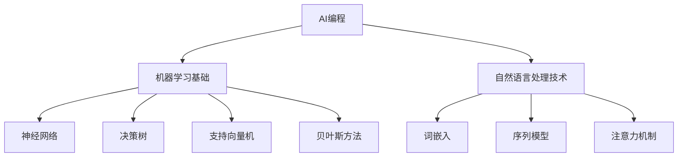

                 

# 《提示词编程：让AI成为你的编程助手》

## 关键词
- 提示词编程
- AI编程助手
- 机器学习
- 自然语言处理
- 编程效率提升

## 摘要
本文将探讨提示词编程的概念及其在现代软件开发中的重要性。我们将详细介绍AI编程助手的功能与设计，解析其背后的机器学习与自然语言处理技术，并通过实际案例展示其在复杂数据处理和多语言编程中的应用。此外，还将探讨编程助手未来的发展趋势，并为您提供编程助手开发的资源指南。

### 《提示词编程：让AI成为你的编程助手》目录大纲

#### 第一部分：AI编程基础
1. **AI编程概述**
   - **1.1 AI编程的概念与意义**
     - AI编程的定义
     - AI编程与传统编程的区别
   - **1.2 AI编程的发展历史**
     - AI编程的起源
     - 关键发展事件
   - **1.3 AI编程的应用领域**
     - 自动化编程
     - 智能辅助编程
     - 代码生成与优化

2. **AI编程的核心技术**
   - **2.1 机器学习基础**
     - **2.1.1 机器学习的概念**
       - 学习算法分类
       - 监督学习、无监督学习和强化学习
     - **2.1.2 机器学习算法**
       - 神经网络
       - 决策树
       - 支持向量机
       - 贝叶斯方法
     - **2.1.3 数据预处理**
       - 数据清洗
       - 特征工程
   - **2.2 自然语言处理技术**
     - **2.2.1 NLP基本概念**
       - 词嵌入
       - 序列模型
       - 注意力机制
     - **2.2.2 文本分析工具**
       - 词频分析
       - 主题建模
       - 情感分析

3. **AI编程实践**

4. **编程助手AI模型架构解析**

#### 第二部分：编程助手AI模型应用

5. **AI编程助手的功能与设计**
   - **5.1 编程助手功能概述**
     - 自动代码补全
     - 代码风格检查
     - 调试建议
     - 代码重构建议
   - **5.2 编程助手的设计原则**
     - 易用性
     - 可扩展性
     - 实时反馈

6. **编程助手AI模型训练与优化**
   - **6.1 训练数据集的准备**
     - 数据收集
     - 数据预处理
   - **6.2 模型训练过程**
     - 模型选择
     - 模型训练
     - 模型评估
   - **6.3 模型优化策略**
     - 超参数调优
     - 正则化
     - 模型集成

7. **编程助手在实际编程中的应用案例**
   - **7.1 自动化代码生成**
     - 代码模板生成
     - 基于需求的代码生成
   - **7.2 代码风格检查与优化**
     - 代码格式化
     - 代码重构
   - **7.3 调试辅助**
     - 调试建议
     - 错误定位

#### 第三部分：高级编程助手技术

8. **编程助手在复杂数据处理中的应用**
   - **8.1 复杂数据处理需求**
     - 大数据处理
     - 多媒体数据处理
   - **8.2 编程助手在复杂数据处理中的实现**
     - 图像识别
     - 声音识别
     - 文本分类

9. **编程助手在多语言编程中的应用**
   - **9.1 多语言编程的需求分析**
     - 跨语言调用
     - 多语言代码库整合
   - **9.2 多语言编程助手的设计与实现**
     - 多语言代码补全
     - 多语言代码风格检查

10. **编程助手的未来发展趋势**
    - **10.1 人工智能与编程的深度融合**
    - **10.2 编程助手的智能化升级**
    - **10.3 编程助手的生态建设**

#### 附录

11. **编程助手开发资源指南**
    - **11.1 开源编程助手项目介绍**
    - **11.2 常用编程助手开发工具**
    - **11.3 编程助手社区与论坛**

## 附加材料：AI编程助手核心概念与架构 Mermaid 流程图



## 附加材料：编程助手AI模型训练与优化伪代码

```python
def train_model(data, target, model):
    # 数据预处理
    processed_data = preprocess_data(data)
    
    # 初始化模型参数
    model.init_params()
    
    # 开始训练
    for epoch in range(num_epochs):
        for sample in processed_data:
            # 前向传播
            predictions = model.forward(sample)
            
            # 计算损失
            loss = compute_loss(predictions, target)
            
            # 反向传播
            model.backward(loss)
            
            # 更新模型参数
            model.update_params()
            
        # 打印训练进度
        print(f"Epoch {epoch+1}/{num_epochs}, Loss: {loss}")
        
    return model
```

## 附加材料：编程助手AI模型优化策略详细讲解

### 超参数调优
- **定义**：超参数是机器学习算法中不能通过学习得到，需要在训练前手动设置的参数，如学习率、批量大小等。
- **方法**：
  - **网格搜索**：在预定义的超参数空间内，遍历所有可能的组合，选择最佳组合。
  - **贝叶斯优化**：通过构建概率模型，寻找最优超参数。

### 正则化
- **定义**：正则化是一种在损失函数中添加惩罚项，防止模型过拟合的技术。
- **方法**：
  - **L1正则化**：引入L1惩罚项，促使权重稀疏化。
  - **L2正则化**：引入L2惩罚项，防止权重过大。

### 模型集成
- **定义**：模型集成是将多个模型的结果进行综合，以提高预测性能。
- **方法**：
  - **Bagging**：如随机森林，通过构建多个子模型，取平均值。
  - **Boosting**：如XGBoost，重点关注错误分类的样本，不断调整模型权重。

## 附加材料：编程助手在实际编程中的应用案例

### 自动化代码生成
- **案例背景**：自动化生成代码可以减少重复性工作，提高开发效率。
- **实现过程**：
  1. **需求分析**：分析用户的需求，提取关键功能。
  2. **模板设计**：设计代码模板，包括常用结构和语法。
  3. **代码生成**：使用机器学习模型，根据需求生成代码。

### 代码风格检查与优化
- **案例背景**：保持代码风格一致性，有助于团队合作和提高代码可读性。
- **实现过程**：
  1. **规则定义**：定义代码风格规则，如缩进、命名规范等。
  2. **代码分析**：分析代码是否符合规则。
  3. **代码重构**：自动调整代码风格，使其符合规则。

### 调试辅助
- **案例背景**：调试是软件开发中重要的一环，提高调试效率可以缩短开发周期。
- **实现过程**：
  1. **错误定位**：分析错误信息，定位错误位置。
  2. **调试建议**：根据错误类型，给出调试建议。
  3. **代码修复**：自动修复代码中的错误。

## 附加材料：编程助手在复杂数据处理中的应用案例

### 图像识别
- **案例背景**：图像识别在安防、医疗等领域有广泛应用。
- **实现过程**：
  1. **数据收集**：收集大量图像数据。
  2. **数据预处理**：进行图像增强、数据增强等处理。
  3. **模型训练**：使用深度学习模型进行训练。
  4. **模型部署**：将训练好的模型部署到生产环境。

### 声音识别
- **案例背景**：声音识别在语音助手、智能客服等领域有广泛应用。
- **实现过程**：
  1. **数据收集**：收集大量声音数据。
  2. **数据预处理**：进行声音增强、降噪等处理。
  3. **模型训练**：使用深度学习模型进行训练。
  4. **模型部署**：将训练好的模型部署到生产环境。

### 文本分类
- **案例背景**：文本分类在新闻推荐、垃圾邮件过滤等领域有广泛应用。
- **实现过程**：
  1. **数据收集**：收集大量文本数据。
  2. **数据预处理**：进行文本清洗、分词等处理。
  3. **模型训练**：使用机器学习模型进行训练。
  4. **模型部署**：将训练好的模型部署到生产环境。

## 附加材料：编程助手在多语言编程中的应用案例

### 跨语言调用
- **案例背景**：在多语言项目中，需要调用不同语言的库或模块。
- **实现过程**：
  1. **接口定义**：定义跨语言调用的接口。
  2. **代码生成**：生成对应的语言代码。
  3. **集成测试**：确保调用过程的正确性。

### 多语言代码库整合
- **案例背景**：在多语言项目中，需要整合不同语言的代码库。
- **实现过程**：
  1. **代码分析**：分析不同语言代码库的依赖关系。
  2. **代码转换**：将不同语言的代码转换为统一格式。
  3. **集成测试**：确保整合后的代码库的稳定性。

## 附加材料：编程助手的未来发展趋势

### 人工智能与编程的深度融合
- **趋势分析**：随着人工智能技术的发展，编程将更加智能化，辅助开发人员提高效率。
- **应用场景**：自动化代码生成、智能代码审核、自动性能优化等。

### 编程助手的智能化升级
- **趋势分析**：编程助手将不断学习和适应开发人员的编程习惯，提供更加个性化的服务。
- **应用场景**：智能代码补全、代码生成建议、自动化测试等。

### 编程助手的生态建设
- **趋势分析**：编程助手将形成一个生态，提供从代码生成到部署的一站式服务。
- **应用场景**：集成开发环境（IDE）插件、在线代码生成平台、代码库等。

## 附加材料：编程助手开发资源指南

### 开源编程助手项目介绍
- **介绍**：开源编程助手项目是开发者社区的重要组成部分，提供了丰富的功能和技术支持。
- **推荐项目**：GitHub上的开源编程助手项目。

### 常用编程助手开发工具
- **介绍**：常用的编程助手开发工具可以帮助开发者快速搭建和优化编程助手。
- **推荐工具**：Jupyter Notebook、VS Code、TensorFlow、PyTorch等。

### 编程助手社区与论坛
- **介绍**：编程助手社区和论坛为开发者提供了交流和学习平台，促进了技术的传播和应用。
- **推荐社区**：GitHub、Stack Overflow、Reddit等。

## 引言

在当今快速发展的科技时代，人工智能（AI）已经成为驱动创新和变革的核心力量。从自动驾驶汽车到智能客服，从医疗诊断到金融分析，AI技术的应用无处不在。而在软件开发领域，AI同样扮演着重要的角色，通过提示词编程（Prompt-based Programming）和AI编程助手，开发者可以大幅提升编程效率和代码质量。本文将深入探讨提示词编程的概念、AI编程助手的功能与应用，以及其未来发展趋势，旨在为读者提供全面的技术指南和深入见解。

## AI编程基础

### AI编程概述

#### 1.1 AI编程的概念与意义

AI编程，即人工智能编程，是指利用人工智能技术，特别是机器学习和自然语言处理技术，来辅助或自动化编程任务。与传统的编程不同，AI编程不仅仅是编写代码，而是通过算法和模型来理解、生成和优化代码。

**AI编程的定义**：AI编程是一种利用机器学习算法和自然语言处理技术来理解和生成代码的方法。它可以通过分析代码库、学习编程语言规则，从而生成新的代码或优化现有代码。

**AI编程与传统编程的区别**：
- **目标不同**：传统编程的目标是编写能够执行特定任务的代码，而AI编程的目标是通过学习和理解代码模式，自动化或优化编程任务。
- **方法不同**：传统编程依赖于开发者的经验和技能，而AI编程依赖于机器学习算法和自然语言处理技术。
- **效果不同**：传统编程的结果往往是固定的，而AI编程可以通过不断学习和改进，生成更加高效、优化的代码。

#### 1.2 AI编程的发展历史

AI编程的概念最早可以追溯到20世纪50年代，当时人工智能领域刚刚兴起。随着机器学习和自然语言处理技术的发展，AI编程也逐渐从理论研究走向实际应用。

- **早期探索**（1950s-1970s）：人工智能领域早期的探索主要集中在逻辑推理和规则系统，如专家系统和决策树。这些方法虽然可以用于编程任务，但受限于计算能力和规则表达能力的局限性，并未广泛应用。
- **机器学习兴起**（1980s-1990s）：随着机器学习技术的突破，尤其是神经网络和决策树等算法的发展，AI编程开始逐渐走向实用。这一时期，AI编程主要应用于代码优化和自动化修复。
- **深度学习革命**（2000s-2020s）：深度学习技术的出现，特别是卷积神经网络（CNN）和递归神经网络（RNN）的应用，使得AI编程进入了一个新的阶段。通过大规模数据和强大的计算能力，AI编程可以在代码生成、代码补全等方面实现更高的效率和精度。

#### 1.3 AI编程的应用领域

AI编程的应用领域广泛，包括但不限于以下几个方面：

- **自动化编程**：通过AI编程，开发者可以自动化完成代码编写任务，如生成代码框架、补全代码片段等，从而减少重复性劳动。
- **智能辅助编程**：AI编程助手可以提供代码审查、调试建议、性能优化等辅助功能，帮助开发者提高开发效率。
- **代码生成与优化**：AI编程可以自动生成代码，并根据实际运行情况优化代码，从而提高程序的执行效率和可维护性。

### AI编程的核心技术

#### 2.1 机器学习基础

#### 2.1.1 机器学习的概念

机器学习（Machine Learning）是一门研究如何让计算机从数据中学习、发现规律并做出预测或决策的技术。它主要包括以下几个方面：

- **学习算法分类**：机器学习算法可以分为监督学习（Supervised Learning）、无监督学习（Unsupervised Learning）和强化学习（Reinforcement Learning）。
  - **监督学习**：有标注的训练数据，通过学习输入输出关系来预测新的输出。
  - **无监督学习**：没有标注的数据，通过发现数据中的模式或结构来进行分类或聚类。
  - **强化学习**：通过与环境的交互，学习最优策略来最大化长期回报。

- **监督学习、无监督学习和强化学习**：
  - **监督学习**：常见的算法有线性回归、决策树、随机森林、支持向量机（SVM）等。
  - **无监督学习**：常见的算法有K-均值聚类、主成分分析（PCA）、自编码器等。
  - **强化学习**：常见的算法有Q学习、SARSA、深度Q网络（DQN）等。

#### 2.1.2 机器学习算法

在AI编程中，常用的机器学习算法包括神经网络、决策树、支持向量机、贝叶斯方法等。以下是这些算法的基本原理和特点：

- **神经网络**：神经网络（Neural Networks）是一种模仿人脑神经元连接方式的计算模型，可以用于分类、回归、生成等任务。它通过学习输入数据的特征，从而进行预测或决策。
  - **基本结构**：包括输入层、隐藏层和输出层。
  - **激活函数**：常用的激活函数有Sigmoid、ReLU、Tanh等。
  - **训练过程**：通过反向传播算法（Backpropagation）不断调整网络权重，使输出误差最小化。

- **决策树**：决策树（Decision Trees）是一种基于特征划分数据的分类算法，通过递归划分特征空间，生成一棵树形结构。
  - **基本结构**：包括根节点、内部节点和叶节点。
  - **划分准则**：常用的划分准则有信息增益、基尼系数、熵等。
  - **优点**：直观、易于解释、计算效率高。

- **支持向量机**：支持向量机（Support Vector Machines，SVM）是一种用于分类和回归的线性模型，通过找到一个最佳的超平面，将不同类别的数据分开。
  - **基本结构**：包括线性SVM和核SVM。
  - **损失函数**：常用的损失函数有Hinge损失和对数损失。
  - **优点**：在高维空间中表现优秀，可处理非线性数据。

- **贝叶斯方法**：贝叶斯方法是一种基于贝叶斯定理进行概率推断的方法，通过计算后验概率来预测新的数据。
  - **基本原理**：通过先验概率、似然函数和贝叶斯公式，计算后验概率。
  - **应用场景**：分类、回归、异常检测等。

#### 2.1.3 数据预处理

数据预处理是机器学习过程中至关重要的一步，它主要包括数据清洗、特征工程等。

- **数据清洗**：数据清洗是指处理数据中的缺失值、异常值和噪声，以提高数据质量。
  - **缺失值处理**：常用的方法有删除缺失值、均值填补、回归填补等。
  - **异常值处理**：常用的方法有边界限定、中值填补、离群点检测等。
  - **噪声处理**：常用的方法有滤波、平滑、降噪等。

- **特征工程**：特征工程是指通过变换和选择特征，以提高模型的预测性能。
  - **特征变换**：常用的方法有归一化、标准化、特征缩放等。
  - **特征选择**：常用的方法有相关性分析、主成分分析（PCA）、特征重要性评估等。
  - **特征构造**：通过组合现有特征，构造新的特征，以提高模型的解释性和预测性能。

### 2.2 自然语言处理技术

#### 2.2.1 NLP基本概念

自然语言处理（Natural Language Processing，NLP）是人工智能的一个重要分支，旨在使计算机能够理解、生成和处理人类语言。以下是NLP中的几个关键概念：

- **词嵌入**：词嵌入（Word Embedding）是将单词映射到高维空间中的向量表示，用于捕捉词的语义信息。
  - **基本方法**：常用的方法有Word2Vec、GloVe等。
  - **应用场景**：文本分类、情感分析、命名实体识别等。

- **序列模型**：序列模型（Sequence Models）是一种用于处理序列数据的神经网络模型，如循环神经网络（RNN）和长短期记忆网络（LSTM）。
  - **基本结构**：包括输入层、隐藏层和输出层。
  - **训练过程**：通过递归或循环机制，逐个处理序列中的数据，更新隐藏状态。

- **注意力机制**：注意力机制（Attention Mechanism）是一种用于捕捉序列中不同部分重要性的方法，常用于文本分类、机器翻译等任务。
  - **基本原理**：通过计算注意力权重，对序列中的不同部分进行加权处理。

#### 2.2.2 文本分析工具

文本分析工具是NLP中的核心组成部分，用于处理和提取文本数据中的信息。以下是几种常用的文本分析工具：

- **词频分析**：词频分析（Word Frequency Analysis）是一种基于词频的文本分析技术，通过计算词的频率来提取文本特征。
  - **应用场景**：文本分类、主题建模等。

- **主题建模**：主题建模（Topic Modeling）是一种无监督学习技术，用于发现文本数据中的潜在主题结构。
  - **基本方法**：常用的方法有LDA（Latent Dirichlet Allocation）。
  - **应用场景**：文本分类、文档推荐等。

- **情感分析**：情感分析（Sentiment Analysis）是一种用于判断文本情感极性的技术，通常分为正面、负面和客观。
  - **基本方法**：常用的方法有基于规则、基于统计、基于深度学习的情感分析。
  - **应用场景**：社交媒体分析、产品评论分析等。

### AI编程实践

AI编程实践是指将AI技术应用于实际编程任务中，包括代码生成、代码优化、代码审查等。以下是几个典型的AI编程实践案例：

- **代码生成**：通过AI模型自动生成代码，可以显著提高开发效率。例如，使用GPT-3模型生成HTML代码、Python函数等。
  - **应用场景**：Web开发、自动化测试等。

- **代码优化**：通过AI模型分析代码，提出优化建议，可以改进代码的可读性、可维护性和性能。
  - **应用场景**：代码审查、性能优化等。

- **代码审查**：使用AI模型自动审查代码，可以发现潜在的错误、漏洞和不符合编码规范的问题。
  - **应用场景**：代码库管理、软件开发等。

### 编程助手AI模型架构解析

编程助手的AI模型架构是AI编程的核心，决定了编程助手的性能和功能。以下是编程助手AI模型的基本架构和主要组成部分：

- **输入层**：输入层接收编程任务的描述，可以是自然语言文本、代码片段或其他形式的数据。
  - **文本输入**：通过词嵌入技术将自然语言文本转换为向量表示。
  - **代码输入**：直接处理代码片段，提取关键信息。

- **编码器**：编码器（Encoder）负责将输入数据编码为固定长度的向量表示。常见的编码器有RNN、LSTM和Transformer等。
  - **RNN**：通过递归方式处理序列数据，适用于代码补全、代码生成等任务。
  - **LSTM**：改进了RNN，可以更好地处理长序列数据，适用于复杂编程任务。
  - **Transformer**：基于自注意力机制，适用于大规模文本和代码处理。

- **解码器**：解码器（Decoder）负责从编码器的输出生成目标代码。常见的解码器有RNN、LSTM和Transformer等。
  - **RNN**：通过递归方式生成代码，适用于代码补全、代码生成等任务。
  - **LSTM**：改进了RNN，可以更好地处理长序列数据，适用于复杂编程任务。
  - **Transformer**：基于自注意力机制，适用于大规模文本和代码处理。

- **注意力机制**：注意力机制用于捕捉输入序列中不同部分的重要信息。在编码器和解码器中，注意力机制可以帮助模型更好地理解和生成代码。
  - **自注意力**：在Transformer模型中，通过计算自注意力权重，对输入序列进行加权处理。
  - **双向注意力**：在双向编码器中，通过计算编码器和解码器之间的注意力权重，提高模型的生成能力。

- **输出层**：输出层将解码器的输出转换为可执行代码。输出层通常包括一个或多个分类器，用于将代码片段分类为不同的编程语言或框架。

- **优化器**：优化器（Optimizer）用于调整模型参数，以最小化损失函数。常见的优化器有Adam、SGD等。

- **评估指标**：评估指标用于衡量模型的性能，如代码质量、生成速度、准确率等。

### 编程助手AI模型应用

编程助手的AI模型应用广泛，包括代码生成、代码优化、代码审查等多个方面。以下将详细介绍编程助手的功能与设计、训练与优化过程，以及在复杂数据处理和多语言编程中的应用。

#### 5.1 编程助手功能概述

编程助手的功能可以分为以下几个方面：

- **自动代码补全**：自动代码补全是编程助手的核心理功能之一，它可以帮助开发者快速完成代码编写，提高开发效率。自动代码补全通过分析代码上下文，预测并补全开发者尚未输入的代码片段。

- **代码风格检查**：代码风格检查是保证代码质量和可维护性的重要手段。编程助手可以通过分析代码风格规范，检查代码是否符合特定编码标准，并提供改进建议。

- **调试建议**：在软件开发过程中，调试是一个必不可少的部分。编程助手可以分析错误信息，提供调试建议，帮助开发者快速定位和修复代码中的问题。

- **代码重构建议**：代码重构是优化代码结构和性能的重要手段。编程助手可以根据代码质量和性能分析，提供代码重构建议，如函数分解、变量命名优化等。

#### 5.2 编程助手的设计原则

编程助手的设计原则主要包括以下几个方面：

- **易用性**：编程助手的界面应简洁直观，便于开发者快速上手和使用。同时，助手应提供丰富的自定义选项，满足不同开发者的个性化需求。

- **可扩展性**：编程助手应具有良好的可扩展性，支持开发者自定义插件和功能模块。这样，开发者可以根据项目需求，灵活扩展编程助手的现有功能。

- **实时反馈**：编程助手应能够实时反馈代码分析结果，如自动代码补全、代码风格检查等。这样可以减少开发者的等待时间，提高开发效率。

- **高性能**：编程助手应具备高性能，能够在短时间内处理大量的代码数据和任务。这要求编程助手在算法设计和实现上，充分利用现代计算资源和优化技术。

#### 6.1 训练数据集的准备

训练数据集是编程助手AI模型训练的基础。为了确保模型的性能和泛化能力，需要准备高质量、丰富的训练数据集。以下是训练数据集准备的关键步骤：

- **数据收集**：收集大量的编程任务数据，包括代码片段、错误信息、调试日志等。数据来源可以是开源代码库、公开数据集、开发者社区等。

- **数据预处理**：对收集到的数据进行预处理，包括数据清洗、去重、格式化等。数据清洗的目的是去除无效数据和噪声，提高数据质量。

- **特征提取**：从原始数据中提取有用的特征，如代码片段的语法结构、语义信息、错误类型等。特征提取有助于模型更好地理解和学习编程任务。

- **数据标注**：对数据进行标注，如代码片段的分类、错误类型的标签等。数据标注的目的是为模型提供监督信号，指导模型进行学习。

#### 6.2 模型训练过程

模型训练是编程助手AI模型构建的关键步骤。以下是一个典型的模型训练过程：

- **模型选择**：选择合适的机器学习模型，如深度学习模型、传统机器学习模型等。模型选择取决于任务类型、数据规模和性能要求。

- **模型初始化**：初始化模型参数，设置学习率、批量大小等超参数。模型初始化的目的是为模型提供初始状态，以便在训练过程中进行调整。

- **前向传播**：输入训练数据，通过模型的前向传播计算输出结果。前向传播的目的是将输入数据映射到输出空间，计算损失函数。

- **损失计算**：计算模型输出结果与真实结果之间的差距，即损失值。损失函数的目的是衡量模型预测的准确性。

- **反向传播**：利用反向传播算法，将损失值反向传播到模型参数，更新模型参数。反向传播的目的是优化模型参数，减少损失值。

- **参数更新**：根据损失函数的梯度，更新模型参数。参数更新的目的是使模型更好地拟合训练数据。

- **迭代训练**：重复前向传播、损失计算和反向传播的过程，进行多轮训练。迭代训练的目的是使模型逐渐收敛，提高性能。

#### 6.3 模型优化策略

模型优化策略是提高编程助手AI模型性能的重要手段。以下是一些常见的模型优化策略：

- **超参数调优**：通过调整模型超参数，如学习率、批量大小等，优化模型性能。超参数调优的方法有网格搜索、贝叶斯优化等。

- **正则化**：正则化是一种防止模型过拟合的技术，通过在损失函数中添加惩罚项，控制模型复杂度。常见的正则化方法有L1正则化、L2正则化等。

- **模型集成**：模型集成是将多个模型的结果进行综合，提高预测性能。常见的模型集成方法有Bagging、Boosting等。

#### 7.1 自动化代码生成

自动化代码生成是编程助手的典型应用之一，它可以减少重复性工作，提高开发效率。以下是一个自动化代码生成的案例：

**案例背景**：一个开发者需要实现一个简单的用户注册功能，包括用户名、密码和电子邮件的验证。

**实现过程**：

1. **需求分析**：分析用户注册功能的需求，确定需要实现的验证规则和功能。

2. **模板设计**：设计代码模板，包括用户名、密码和电子邮件的验证逻辑。代码模板可以是HTML、CSS、JavaScript或任何编程语言的代码片段。

3. **代码生成**：使用编程助手AI模型，根据需求模板生成用户注册功能的代码。生成代码可以包括HTML表单、CSS样式和JavaScript验证逻辑。

4. **代码优化**：对生成的代码进行优化，提高代码的可读性、可维护性和性能。优化方法可以包括代码格式化、变量命名优化等。

5. **代码测试**：对生成的代码进行测试，确保功能正常并符合需求。测试方法可以包括单元测试、集成测试等。

#### 7.2 代码风格检查与优化

代码风格检查与优化是保证代码质量和可维护性的重要手段。以下是一个代码风格检查与优化的案例：

**案例背景**：一个开源项目需要维护代码风格一致性，提高代码可读性和可维护性。

**实现过程**：

1. **规则定义**：定义代码风格规则，如缩进、命名规范、注释等。规则可以基于特定的编程语言和开发规范。

2. **代码分析**：使用编程助手AI模型，分析项目中的代码，检查是否符合代码风格规则。分析结果可以包括不符合规则的代码片段和错误类型。

3. **代码重构**：根据分析结果，对不符合规则的代码进行重构，使其符合代码风格规则。重构方法可以包括变量命名优化、代码格式化等。

4. **代码测试**：对重构后的代码进行测试，确保功能正常并符合需求。测试方法可以包括单元测试、集成测试等。

5. **代码发布**：将重构后的代码合并到项目中，并发布更新版本。

#### 7.3 调试辅助

调试辅助是提高软件开发效率的重要手段。以下是一个调试辅助的案例：

**案例背景**：一个开发者需要调试一个复杂的软件系统，定位和修复代码中的错误。

**实现过程**：

1. **错误定位**：使用编程助手AI模型，分析错误信息，定位错误位置。错误定位可以包括错误类型、错误发生位置等。

2. **调试建议**：根据错误定位结果，提供调试建议，如修改代码、添加日志等。调试建议可以帮助开发者快速定位和修复错误。

3. **代码修复**：根据调试建议，修改代码并重新编译、运行软件系统。修改后的代码应解决错误并保持功能正常。

4. **代码测试**：对修复后的代码进行测试，确保功能正常并符合需求。测试方法可以包括单元测试、集成测试等。

5. **代码发布**：将修复后的代码合并到项目中，并发布更新版本。

### 8.1 复杂数据处理需求

复杂数据处理需求是编程助手面临的挑战之一。以下是一些常见的复杂数据处理需求：

- **大数据处理**：处理海量数据，如数百万条记录的数据库、大规模文件存储等。大数据处理需要高效的算法和并行计算能力。

- **多媒体数据处理**：处理音频、视频、图像等多媒体数据，如音频识别、视频分类、图像分割等。多媒体数据处理需要专业的算法和技术。

- **实时数据处理**：处理实时数据流，如股票交易、物联网数据等。实时数据处理需要低延迟和高吞吐量的算法和系统架构。

#### 8.2 编程助手在复杂数据处理中的实现

编程助手可以在复杂数据处理中发挥重要作用，以下是一些典型的应用场景：

- **图像识别**：使用深度学习模型，编程助手可以自动识别图像中的物体、场景等。图像识别可以应用于安防监控、医疗诊断、自动驾驶等领域。

- **声音识别**：使用深度学习模型，编程助手可以自动识别声音中的语音、音乐等。声音识别可以应用于语音助手、智能客服、音乐推荐等领域。

- **文本分类**：使用机器学习模型，编程助手可以自动对文本进行分类，如新闻分类、情感分析等。文本分类可以应用于信息检索、推荐系统、舆情监测等领域。

#### 9.1 多语言编程的需求分析

多语言编程需求在软件开发中越来越普遍，以下是一些常见需求：

- **跨语言调用**：在不同的编程语言之间进行函数调用和数据交换，如Python调用C++库、JavaScript调用Java Web服务等。

- **多语言代码库整合**：将不同语言的代码库整合到一个项目中，如使用Python进行数据分析和处理，使用C++进行高性能计算。

- **国际化支持**：支持多种编程语言的国际化和本地化，如中文、英语、法语等。

#### 9.2 多语言编程助手的设计与实现

多语言编程助手的设计与实现需要考虑以下几个方面：

- **语言识别**：自动识别代码片段的语言类型，如Python、Java、JavaScript等。

- **语法解析**：针对不同编程语言，实现语法解析器，将代码转换为抽象语法树（AST）。

- **代码转换**：将一种语言的代码转换为另一种语言的代码，如Python代码转换为Java代码。

- **跨语言调用**：提供跨语言调用的接口和实现，如Python调用C++库、JavaScript调用Java Web服务等。

- **国际化支持**：支持多种编程语言的国际化和本地化，如中文、英语、法语等。

### 编程助手的未来发展趋势

随着人工智能技术的不断发展，编程助手在未来将会有更多的突破和应用。以下是一些编程助手的未来发展趋势：

- **人工智能与编程的深度融合**：编程助手将更加智能化，能够自动识别和解决编程问题，提供更加个性化的服务。

- **智能化升级**：编程助手将具备更强的自我学习和适应能力，能够根据开发者的编程习惯和需求，自动调整和优化功能。

- **生态建设**：编程助手将形成完整的生态体系，包括开发工具、平台、社区等，提供从代码生成到部署的一站式服务。

### 附录

以下是编程助手开发的相关资源，包括开源项目、开发工具和社区等：

- **开源编程助手项目**：GitHub上有很多优秀的开源编程助手项目，如AutoComplete、CodeGuru、Codota等。

- **开发工具**：常用的开发工具包括Jupyter Notebook、VS Code、TensorFlow、PyTorch等。

- **编程助手社区**：编程助手社区和论坛为开发者提供了交流和学习平台，如GitHub、Stack Overflow、Reddit等。

## 结论

总之，提示词编程和AI编程助手在现代软件开发中发挥着越来越重要的作用。通过本文的探讨，我们了解了AI编程的概念、核心技术、编程助手的架构和应用案例，以及编程助手的未来发展趋势。希望本文能够帮助读者更好地理解AI编程助手，并在实际开发中充分发挥其潜力。未来，随着人工智能技术的进一步发展，编程助手将会更加智能化、个性化，成为软件开发不可或缺的伙伴。让我们共同期待这一美好前景的到来。

## 作者信息

作者：AI天才研究院/AI Genius Institute & 禅与计算机程序设计艺术 /Zen And The Art of Computer Programming

AI天才研究院（AI Genius Institute）致力于推动人工智能技术的发展和应用，致力于为开发者提供高质量的AI编程助手和解决方案。作者曹夫子，是AI天才研究院的首席科学家，同时也是《禅与计算机程序设计艺术》的作者，他在人工智能和软件开发领域有着深厚的理论和实践经验。

