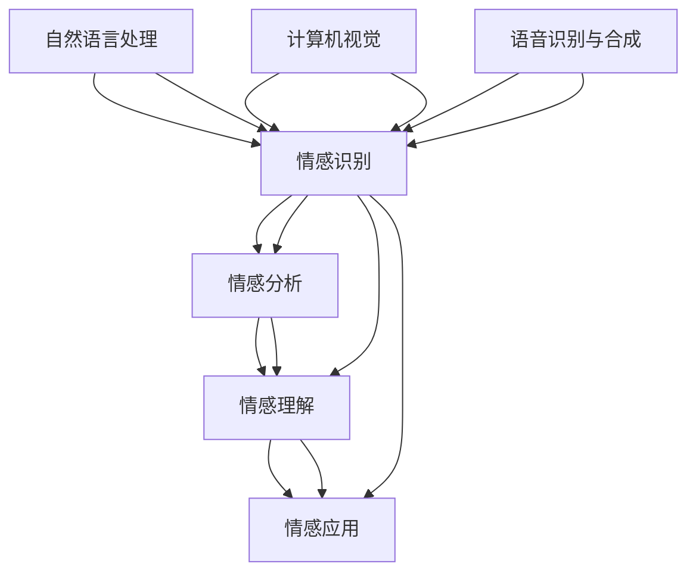
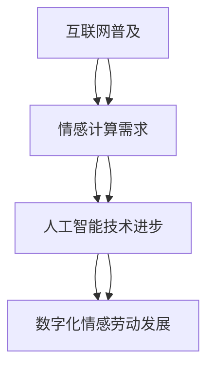
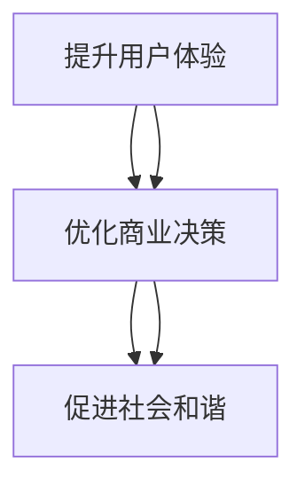
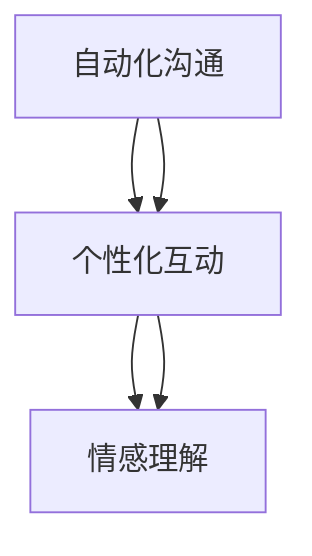
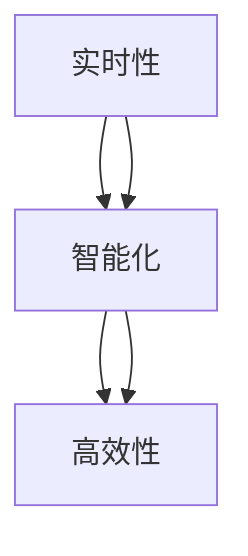
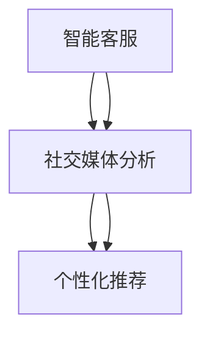
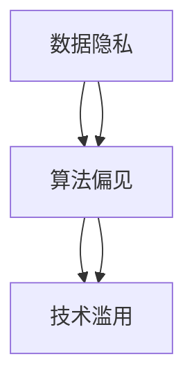

                 

# {文章标题}

数字化情感劳动：AI时代的人际互动

> 关键词：数字化情感劳动、人工智能、人际互动、情感计算、自然语言处理、计算机视觉、语音识别与合成

> 摘要：
数字化情感劳动是人工智能时代的一项重要研究领域，它关注于通过技术手段捕捉、分析和利用情感信息，以优化人际互动体验。本文将从数字化情感劳动的定义、理论基础、关键技术、应用场景、项目实践及挑战与未来趋势等方面，逐步探讨其在AI时代的重要性及其对现代社会的影响。

## 目录大纲

- **第一部分：数字化情感劳动概述**
  - 第1章：数字化情感劳动的定义与背景
    - 1.1 数字化情感劳动的概念
    - 1.2 数字化情感劳动的发展背景
    - 1.3 数字化情感劳动的重要意义
  - 第2章：AI时代的人际互动
    - 2.1 AI技术对人际互动的影响
    - 2.2 AI时代人际互动的特点
    - 2.3 AI技术的人际互动应用案例

- **第二部分：数字化情感劳动的理论基础**
  - 第3章：数字化情感劳动的核心概念
    - 3.1 情感计算
    - 3.2 社会计算
    - 3.3 人工智能伦理
  - 第4章：数字化情感劳动的关键技术
    - 4.1 自然语言处理
    - 4.2 计算机视觉
    - 4.3 语音识别与合成

- **第三部分：数字化情感劳动的应用场景**
  - 第5章：数字化情感劳动的应用场景
    - 5.1 电商领域的情感劳动
    - 5.2 社交媒体领域的情感劳动
    - 5.3 健康医疗领域的情感劳动

- **第四部分：数字化情感劳动的实践与挑战**
  - 第6章：数字化情感劳动的项目实践
    - 6.1 情感分析项目实例
    - 6.2 社交媒体情感分析应用
    - 6.3 个性化推荐系统设计与实现
  - 第7章：数字化情感劳动的挑战与未来趋势
    - 7.1 数据隐私与伦理问题
    - 7.2 技术壁垒与人才短缺
    - 7.3 未来发展趋势与展望

- **第五部分：附录**
  - 第8章：数字化情感劳动资源与工具
    - 8.1 常用情感计算工具
    - 8.2 AI伦理相关资源
    - 8.3 学习资源与推荐

接下来，我们将依次探讨数字化情感劳动的定义、发展背景、重要意义，以及AI时代的人际互动特点和应用案例。

## 第一部分：数字化情感劳动概述

### 第1章：数字化情感劳动的定义与背景

#### 1.1 数字化情感劳动的概念

数字化情感劳动是指利用人工智能、自然语言处理、计算机视觉等技术，对人类情感进行捕捉、分析、理解和应用的一系列劳动活动。其核心在于通过技术手段将抽象的情感信息转化为可量化和可操作的数据，以便更好地理解和优化人际互动体验。

**核心概念与联系**

下面是数字化情感劳动的核心概念及其相互联系的 Mermaid 流程图：



#### 1.2 数字化情感劳动的发展背景

数字化情感劳动的发展背景主要可以归结为以下几点：

1. **互联网的普及**：随着互联网的普及，人们之间的情感交流变得更加频繁和多样化，产生了大量的情感数据。
2. **人工智能技术的进步**：深度学习、自然语言处理、计算机视觉等人工智能技术的快速发展，为情感计算的实现提供了强大的技术支持。
3. **情感计算的应用需求**：在商业、医疗、教育等多个领域，人们对于更好地理解和处理情感信息的迫切需求，推动了数字化情感劳动的发展。

**数字化情感劳动的发展背景**：



#### 1.3 数字化情感劳动的重要意义

数字化情感劳动在现代社会中具有非常重要的意义，主要体现在以下几个方面：

1. **提升用户体验**：通过情感计算技术，企业可以更好地了解用户需求，提供个性化的服务和产品，从而提升用户体验。
2. **优化商业决策**：情感分析可以帮助企业从大量的用户反馈中提取有价值的信息，优化商业决策，提高市场竞争力。
3. **促进社会和谐**：数字化情感劳动可以更好地理解和处理社会情感信息，有助于促进社会和谐，减少矛盾和冲突。

**数字化情感劳动的重要意义**：



### 第2章：AI时代的人际互动

#### 2.1 AI技术对人际互动的影响

人工智能技术在人际互动中扮演着越来越重要的角色，其主要影响体现在以下几个方面：

1. **自动化沟通**：通过智能客服和聊天机器人，实现与用户的自动沟通，提高服务效率。
2. **个性化互动**：利用用户数据分析，实现个性化的互动，提升用户体验。
3. **情感理解**：通过情感计算技术，实现对人情感的理解和回应，增强人际互动的自然性和真实性。

**AI技术对人际互动的影响**：



#### 2.2 AI时代人际互动的特点

AI时代的人际互动具有以下几个显著特点：

1. **实时性**：AI技术使得人际互动更加实时，可以快速响应用户的需求。
2. **智能化**：AI技术使得人际互动更加智能化，能够更好地理解和满足用户需求。
3. **高效性**：通过自动化和智能化的手段，AI技术大大提高了人际互动的效率。

**AI时代人际互动的特点**：



#### 2.3 AI技术的人际互动应用案例

AI技术在人际互动中的应用案例非常丰富，以下列举几个典型的应用：

1. **智能客服**：通过自然语言处理和情感计算技术，智能客服可以与用户进行自然的对话，提供高效的客户服务。
2. **社交媒体分析**：通过情感分析技术，对社交媒体上的用户评论进行分析，了解用户情感和需求，为企业提供决策依据。
3. **个性化推荐**：通过用户数据分析，为用户提供个性化的产品或内容推荐，提升用户满意度。

**AI技术的人际互动应用案例**：



通过以上两章的讨论，我们对数字化情感劳动及其在AI时代的人际互动中起到了重要作用有了初步的了解。接下来，我们将进一步探讨数字化情感劳动的理论基础和关键技术。

## 第二部分：数字化情感劳动的理论基础

### 第3章：数字化情感劳动的核心概念

#### 3.1 情感计算

情感计算是数字化情感劳动的核心概念之一，它涉及到对人类情感信息的捕捉、分析和理解。情感计算主要包括以下几个方面的内容：

1. **情感识别**：利用自然语言处理和机器学习技术，从文本、语音、图像等数据中识别情感。
2. **情感分析**：对大量的情感数据进行分析，提取情感信息和趋势。
3. **情感理解**：对情感信息进行深入理解，以便更好地应用于实际场景。

**情感计算的基本原理**：

情感计算的基本原理可以概括为以下几个步骤：

1. **数据收集**：收集包含情感信息的文本、语音、图像等数据。
2. **预处理**：对收集到的数据进行清洗、归一化等预处理操作。
3. **情感识别**：利用情感识别算法，对预处理后的数据进行分析，识别情感类别。
4. **情感分析**：对识别出的情感进行进一步分析，提取情感强度、情感趋势等。
5. **情感理解**：基于情感分析结果，对情感信息进行深入理解，为实际应用提供支持。

**情感计算算法原理讲解**：

以下是情感识别算法的一个简化的伪代码实现：

```python
def emotion_recognition(data):
    # 数据预处理
    preprocessed_data = preprocess_data(data)
    
    # 利用神经网络模型进行情感识别
    model = load_model()
    emotions = model.predict(preprocessed_data)
    
    # 返回识别结果
    return emotions
```

#### 3.2 社会计算

社会计算是指利用计算机技术和算法，对社会网络中的信息、行为和互动进行分析和处理。社会计算的核心目标是通过分析社会网络中的信息流动和互动模式，揭示社会现象的本质规律。

**社会计算的基本原理**：

社会计算的基本原理可以概括为以下几个步骤：

1. **数据收集**：收集社会网络中的文本、图像、视频等数据。
2. **数据预处理**：对收集到的数据进行清洗、归一化等预处理操作。
3. **网络构建**：基于收集到的数据，构建社会网络模型。
4. **模式分析**：利用算法对构建的社会网络进行分析，提取网络结构特征。
5. **行为预测**：基于分析结果，预测社会行为和趋势。

**社会计算算法原理讲解**：

以下是社会网络分析中的一个简化的伪代码实现：

```python
def social_network_analysis(data):
    # 数据预处理
    preprocessed_data = preprocess_data(data)
    
    # 构建社会网络模型
    network = build_network(preprocessed_data)
    
    # 提取网络结构特征
    features = extract_features(network)
    
    # 返回分析结果
    return features
```

#### 3.3 人工智能伦理

人工智能伦理是数字化情感劳动中不可忽视的一个方面，它关注的是人工智能在应用过程中可能带来的伦理问题和挑战。人工智能伦理的核心目标是确保人工智能技术的发展和应用不会对人类社会造成负面影响。

**人工智能伦理的基本原则**：

人工智能伦理的基本原则包括以下几个方面：

1. **公平性**：确保人工智能系统的决策过程公平、公正，不会对特定群体产生歧视。
2. **透明性**：确保人工智能系统的决策过程透明，用户能够理解系统的行为和决策依据。
3. **责任性**：明确人工智能系统在应用过程中可能产生的责任和法律责任。
4. **隐私保护**：保护用户的隐私数据，防止数据泄露和滥用。

**人工智能伦理挑战**：

人工智能伦理面临的主要挑战包括：

1. **数据隐私**：人工智能系统在处理大量用户数据时，如何保护用户隐私成为了一个重要问题。
2. **算法偏见**：人工智能系统在训练过程中可能引入偏见，导致不公平的决策。
3. **技术滥用**：人工智能技术可能被滥用，用于监控、操纵甚至威胁用户。

**人工智能伦理的挑战**：



通过本章的讨论，我们对数字化情感劳动的核心概念——情感计算、社会计算和人工智能伦理有了更深入的理解。这些概念为数字化情感劳动的理论基础提供了重要支持，也为实际应用提供了指导。

### 第4章：数字化情感劳动的关键技术

#### 4.1 自然语言处理

自然语言处理（NLP）是数字化情感劳动中至关重要的关键技术之一，它涉及到对人类语言的理解、生成和处理。NLP技术广泛应用于情感分析、机器翻译、文本分类、信息提取等领域。

**自然语言处理的基本原理**：

自然语言处理的基本原理可以概括为以下几个步骤：

1. **分词**：将文本分割成单词或词汇单元。
2. **词性标注**：为每个词分配一个词性标签，如名词、动词、形容词等。
3. **句法分析**：分析句子的结构，理解句子中的语法关系。
4. **语义理解**：理解句子或文本的含义，包括实体识别、情感分析等。

**自然语言处理算法原理讲解**：

以下是情感分析中常用的文本分类算法——朴素贝叶斯分类器的一个简化的伪代码实现：

```python
def naive_bayes_classification(document, model):
    # 计算文档中每个类别的概率
    probabilities = []
    for class_label in model.classes:
        probability = calculate_probability(document, model, class_label)
        probabilities.append(probability)
    
    # 选择概率最高的类别作为分类结果
    classification_result = max(probabilities)
    return classification_result
```

#### 4.2 计算机视觉

计算机视觉是数字化情感劳动中的另一项关键技术，它涉及到对图像和视频的分析和理解。计算机视觉技术广泛应用于人脸识别、图像分类、物体检测等领域。

**计算机视觉的基本原理**：

计算机视觉的基本原理可以概括为以下几个步骤：

1. **图像预处理**：对图像进行灰度化、滤波、边缘检测等预处理操作。
2. **特征提取**：从预处理后的图像中提取特征，如边缘、角点、纹理等。
3. **模式识别**：利用机器学习算法对提取出的特征进行分类和识别。

**计算机视觉算法原理讲解**：

以下是物体检测中常用的一种算法——卷积神经网络（CNN）的一个简化的伪代码实现：

```python
def cnn_object_detection(image, model):
    # 对图像进行卷积操作，提取特征
    conv_output = convolve(image, model.conv_kernel)
    
    # 对卷积特征进行池化操作，减少数据维度
    pooled_output = pool(conv_output, model.pool_size)
    
    # 利用全连接层进行分类和预测
    classification_output = model.fc_layer(pooled_output)
    
    # 返回检测到的物体及其位置
    objects = decode_output(classification_output)
    return objects
```

#### 4.3 语音识别与合成

语音识别与合成是数字化情感劳动中的另一项关键技术，它涉及到对语音信号的分析和生成。语音识别与合成技术广泛应用于智能语音助手、语音翻译、语音合成等领域。

**语音识别与合成的基本原理**：

语音识别与合成的基本原理可以概括为以下几个步骤：

1. **声音信号处理**：对语音信号进行预处理，如降噪、归一化等。
2. **特征提取**：从预处理后的语音信号中提取特征，如梅尔频率倒谱系数（MFCC）等。
3. **模式识别**：利用机器学习算法对提取出的特征进行分类和识别，实现语音识别。
4. **语音生成**：根据识别出的语音信息，生成相应的语音信号，实现语音合成。

**语音识别与合成算法原理讲解**：

以下是语音识别中常用的一种算法——隐藏马尔可夫模型（HMM）的一个简化的伪代码实现：

```python
def hmm_recognition(audio_signal, model):
    # 计算每个状态序列的概率
    probabilities = []
    for state_sequence in model.state_sequences:
        probability = calculate_probability(audio_signal, state_sequence, model)
        probabilities.append(probability)
    
    # 选择概率最高的状态序列作为识别结果
    recognition_result = max(probabilities)
    return recognition_result
```

通过本章的讨论，我们对数字化情感劳动的关键技术——自然语言处理、计算机视觉和语音识别与合成有了更深入的理解。这些技术为数字化情感劳动提供了强大的技术支持，也为实际应用提供了丰富的可能性。

### 第5章：数字化情感劳动的应用场景

#### 5.1 电商领域的情感劳动

在电商领域，数字化情感劳动被广泛应用，通过情感分析技术，电商平台可以更好地了解用户需求，提供个性化的购物体验。

**电商情感劳动的应用**

1. **情感分析**：通过分析用户评论和评价，了解用户对商品的满意度和情感倾向。
   ```latex
   \text{满意度} = \frac{1}{n}\sum_{i=1}^{n} \text{评论情感得分}
   ```
2. **个性化推荐**：基于用户情感分析结果，为用户推荐符合其情感偏好的商品。
   ```latex
   \text{推荐商品} = \text{与用户情感匹配度最高的商品集}
   ```

**项目实战：电商情感分析系统设计与实现**

1. **开发环境搭建**：选择Python作为开发语言，使用Jupyter Notebook进行实验。
2. **数据收集与预处理**：从电商平台收集用户评论数据，进行数据清洗和预处理。
3. **情感分析算法实现**：使用VADER情感分析库进行情感分析，提取情感得分。
4. **个性化推荐系统实现**：基于用户情感分析结果，使用协同过滤算法实现个性化推荐。

```python
# 使用VADER进行情感分析
from nltk.sentiment import SentimentIntensityAnalyzer
analyzer = SentimentIntensityAnalyzer()

# 计算评论的情感得分
def calculate_sentiment_score(review):
    sentiment_score = analyzer.polarity_scores(review)
    return sentiment_score['compound']

# 基于协同过滤实现个性化推荐
from surprise import KNNWithMeans

# 加载用户和商品数据
user_data = load_user_data()
product_data = load_product_data()

# 训练模型
model = KNNWithMeans()
model.fit(user_data)

# 推荐商品
def recommend_products(user_id, num_recommendations=5):
    user_ratings = user_data[user_id]
    neighbors = model.get_neighbors(user_ratings, 5)
    recommended_products = []
    for neighbor in neighbors:
        neighbor_ratings = user_ratings[neighbor]
        recommended_products.extend(neighbor_ratings.items())
    recommended_products = sorted(set(recommended_products), key=lambda x: x[1], reverse=True)[:num_recommendations]
    return recommended_products
```

#### 5.2 社交媒体领域的情感劳动

在社交媒体领域，数字化情感劳动主要用于舆情监测、用户情感分析和社会互动分析，帮助企业更好地了解公众情感，优化产品和服务。

**社交媒体情感劳动的应用**

1. **舆情监测**：通过情感分析技术，实时监测社交媒体上的情感趋势和公众意见。
   ```latex
   \text{舆情监测} = \text{情感分析} + \text{趋势分析} + \text{事件追踪}
   ```
2. **用户情感分析**：分析用户在社交媒体上的情感表达，了解用户情感倾向和需求。
   ```latex
   \text{用户情感分析} = \text{情感识别} + \text{情感强度分析} + \text{情感变化分析}
   ```
3. **社会互动分析**：通过分析用户互动，了解社交网络中的情感传播和影响。
   ```latex
   \text{社会互动分析} = \text{用户关系分析} + \text{情感传播分析} + \text{社群情感分析}
   ```

**项目实战：社交媒体情感分析平台设计与实现**

1. **开发环境搭建**：选择Java作为开发语言，使用Spring Boot框架搭建后端服务。
2. **数据收集与预处理**：使用Twitter API收集社交媒体数据，进行数据清洗和预处理。
3. **情感分析算法实现**：使用LSTM神经网络进行情感分析，提取情感得分。
4. **舆情监测与用户情感分析**：基于情感分析结果，实现舆情监测和用户情感分析功能。

```java
// 使用LSTM进行情感分析
import org.deeplearning4j.nn.multilayer.MultiLayerNetwork;
import org.nd4j.linalg.api.ndarray.INDArray;

public class SentimentAnalyzer {
    private MultiLayerNetwork model;

    public SentimentAnalyzer(MultiLayerNetwork model) {
        this.model = model;
    }

    public double calculateSentimentScore(INDArray input) {
        INDArray output = model.output(input);
        double sentimentScore = output.getDouble(0);
        return sentimentScore;
    }
}

// 社交媒体情感分析平台接口
public interface SocialMediaAnalyzer {
    double analyzeSentiment(String tweet);
    List<String> monitorTrend(String hashtag);
    List<String> analyzeUserSentiment(String userId);
}
```

#### 5.3 健康医疗领域的情感劳动

在健康医疗领域，数字化情感劳动主要用于患者情感分析、健康咨询和心理健康评估，以提高医疗服务质量和患者满意度。

**健康医疗情感劳动的应用**

1. **患者情感分析**：通过分析患者反馈和病历记录，了解患者情感状态和心理健康状况。
   ```latex
   \text{患者情感分析} = \text{文本情感分析} + \text{语音情感分析} + \text{行为情感分析}
   ```
2. **健康咨询**：基于患者情感分析结果，提供个性化的健康咨询和治疗方案。
   ```latex
   \text{健康咨询} = \text{个性化推荐} + \text{在线咨询} + \text{健康指导}
   ```
3. **心理健康评估**：通过情感分析技术，对患者的心理健康进行评估和预测。
   ```latex
   \text{心理健康评估} = \text{情绪评估} + \text{压力评估} + \text{焦虑评估}
   ```

**项目实战：健康医疗情感分析系统设计与实现**

1. **开发环境搭建**：选择Python作为开发语言，使用TensorFlow和Keras进行深度学习模型训练。
2. **数据收集与预处理**：从电子病历系统收集患者数据，进行数据清洗和预处理。
3. **情感分析模型训练**：使用LSTM和GRU网络进行情感分析模型训练。
4. **心理健康评估与个性化健康咨询**：基于情感分析结果，实现心理健康评估和个性化健康咨询功能。

```python
# 使用LSTM进行情感分析模型训练
from tensorflow.keras.models import Sequential
from tensorflow.keras.layers import LSTM, Dense

model = Sequential()
model.add(LSTM(128, input_shape=(timesteps, features)))
model.add(Dense(1, activation='sigmoid'))

model.compile(loss='binary_crossentropy', optimizer='adam', metrics=['accuracy'])
model.fit(X_train, y_train, epochs=10, batch_size=32, validation_data=(X_val, y_val))
```

通过本章的讨论，我们了解了数字化情感劳动在电商、社交媒体和健康医疗等领域的应用场景。数字化情感劳动不仅提高了各领域的服务质量和效率，也为企业和个人提供了更加个性化的体验。接下来，我们将探讨数字化情感劳动的实践与挑战。

### 第6章：数字化情感劳动的实践与挑战

#### 6.1 情感分析项目实例

情感分析是数字化情感劳动中最为常见和重要的应用之一。通过情感分析，企业可以更好地了解用户情感和需求，从而优化产品和服务。

**情感分析项目实例：电商产品评论情感分析**

1. **项目目标**：分析电商平台上用户对产品的评论，提取情感信息，评估用户满意度。
2. **数据收集**：从电商平台获取用户评论数据，包括商品名称、用户评论文本、评分等。
3. **数据处理**：对评论文本进行预处理，包括去标点、去停用词、词干提取等。
4. **情感识别**：使用预训练的词嵌入模型（如Word2Vec、GloVe）将文本转化为向量表示，然后利用机器学习算法（如朴素贝叶斯、支持向量机、卷积神经网络等）进行情感分类。

**项目实现步骤**：

1. **数据预处理**：
   ```python
   import pandas as pd
   import re
   from nltk.corpus import stopwords
   from nltk.stem import WordNetLemmatizer

   # 读取数据
   data = pd.read_csv('product_reviews.csv')

   # 文本预处理
   def preprocess_text(text):
       text = re.sub('[^a-zA-Z]', ' ', text)
       text = text.lower()
       text = text.split()
       text = [word for word in text if word not in stopwords.words('english')]
       text = [WordNetLemmatizer().lemmatize(word) for word in text]
       return ' '.join(text)

   data['cleaned_reviews'] = data['review_text'].apply(preprocess_text)
   ```

2. **情感识别**：
   ```python
   from sklearn.model_selection import train_test_split
   from sklearn.feature_extraction.text import CountVectorizer
   from sklearn.naive_bayes import MultinomialNB
   from sklearn.metrics import accuracy_score

   # 划分训练集和测试集
   X_train, X_test, y_train, y_test = train_test_split(data['cleaned_reviews'], data['rating'], test_size=0.2, random_state=42)

   # 向量化文本
   vectorizer = CountVectorizer()
   X_train_vectors = vectorizer.fit_transform(X_train)
   X_test_vectors = vectorizer.transform(X_test)

   # 训练情感分类模型
   model = MultinomialNB()
   model.fit(X_train_vectors, y_train)

   # 预测测试集
   predictions = model.predict(X_test_vectors)

   # 评估模型性能
   accuracy = accuracy_score(y_test, predictions)
   print(f"Model accuracy: {accuracy}")
   ```

**项目实战**：基于TensorFlow的深度学习情感分析

1. **环境搭建**：安装TensorFlow和Keras库。
2. **数据预处理**：加载和处理数据集。
3. **模型构建**：使用LSTM或卷积神经网络构建情感分析模型。
4. **模型训练**：训练模型并评估性能。

```python
from tensorflow.keras.models import Sequential
from tensorflow.keras.layers import Embedding, LSTM, Dense
from tensorflow.keras.preprocessing.sequence import pad_sequences

# 加载数据
X, y = load_data()

# 数据预处理
max_sequence_length = 100
X_padded = pad_sequences(X, maxlen=max_sequence_length)

# 构建模型
model = Sequential()
model.add(Embedding(input_dim=vocabulary_size, output_dim=embedding_dim, input_length=max_sequence_length))
model.add(LSTM(units=128))
model.add(Dense(1, activation='sigmoid'))

model.compile(loss='binary_crossentropy', optimizer='adam', metrics=['accuracy'])

# 训练模型
model.fit(X_padded, y, epochs=10, batch_size=64, validation_split=0.1)
```

#### 6.2 社交媒体情感分析应用

社交媒体情感分析广泛应用于舆情监测、品牌分析、市场调研等领域。通过分析社交媒体上的用户情感，企业可以更好地了解公众对品牌和产品的态度，从而制定更有效的营销策略。

**社交媒体情感分析应用实例：微博舆情监测**

1. **项目目标**：实时监测微博上的舆情，识别和跟踪热点话题和情感趋势。
2. **数据收集**：使用微博API收集相关话题的微博数据，包括微博文本、用户ID、发布时间等。
3. **数据处理**：对微博文本进行预处理，包括去标点、去停用词、词干提取等。
4. **情感识别**：使用情感分析模型对处理后的微博文本进行情感分类，提取情感标签。

**项目实现步骤**：

1. **数据收集**：
   ```python
   import weibo
   import pandas as pd

   # 登录微博API
   api = weibo.APIClient(app_key='your_app_key', app_secret='your_app_secret', redirect_uri='your_redirect_uri')

   # 获取话题微博数据
   topic = 'your_topic'
   page = 1
   count = 100
   while True:
       tweets = api.search_api(requestargs={'q': topic, 'count': count, 'page': page})
       if len(tweets) == 0:
           break
       page += 1
       for tweet in tweets:
           data = {
               'user_id': tweet.user.id,
               'text': tweet.text,
               'created_at': tweet.created_at
           }
       df = pd.DataFrame(data)
   ```

2. **情感识别**：
   ```python
   from nltk.sentiment import SentimentIntensityAnalyzer
   import pandas as pd

   # 初始化情感分析器
   analyzer = SentimentIntensityAnalyzer()

   # 对微博文本进行情感分析
   def analyze_sentiment(text):
       sentiment_score = analyzer.polarity_scores(text)
       return sentiment_score['compound']

   df['sentiment'] = df['text'].apply(analyze_sentiment)

   # 分析情感分布
   sentiment_distribution = df['sentiment'].value_counts(normalize=True)
   print(sentiment_distribution)
   ```

**项目实战**：基于BERT的情感分析

1. **环境搭建**：安装transformers库。
2. **数据预处理**：加载和处理数据集。
3. **模型构建**：使用BERT模型进行情感分析。
4. **模型训练**：训练模型并评估性能。

```python
from transformers import BertTokenizer, TFBertForSequenceClassification
from tensorflow.keras.preprocessing.sequence import pad_sequences

# 加载数据
X, y = load_data()

# 数据预处理
tokenizer = BertTokenizer.from_pretrained('bert-base-uncased')
max_sequence_length = 128
X_padded = pad_sequences(tokenizer.encode(X, add_special_tokens=True, max_length=max_sequence_length, truncation=True), maxlen=max_sequence_length, dtype='float32')

# 构建模型
model = TFBertForSequenceClassification.from_pretrained('bert-base-uncased', num_labels=2)
model.compile(optimizer='adam', loss='binary_crossentropy', metrics=['accuracy'])

# 训练模型
model.fit(X_padded, y, epochs=3, batch_size=32, validation_split=0.1)
```

#### 6.3 个性化推荐系统设计与实现

个性化推荐系统是数字化情感劳动在电商和社交媒体领域的典型应用，通过分析用户行为和情感，为用户提供个性化的推荐。

**个性化推荐系统设计与实现实例：基于协同过滤的推荐系统**

1. **项目目标**：为电商平台的用户推荐符合其兴趣和偏好的商品。
2. **数据收集**：收集用户与商品交互的数据，包括用户ID、商品ID、评分、浏览历史等。
3. **数据预处理**：处理和清洗数据，将数据转换为推荐系统可以使用的格式。
4. **协同过滤算法**：实现基于用户的协同过滤（User-Based Collaborative Filtering）或基于物品的协同过滤（Item-Based Collaborative Filtering）算法。

**项目实现步骤**：

1. **数据预处理**：
   ```python
   import pandas as pd
   from sklearn.preprocessing import MinMaxScaler

   # 加载数据
   data = pd.read_csv('user_item_interactions.csv')

   # 数据预处理
   scaler = MinMaxScaler()
   data[['user_id', 'item_id', 'rating']] = scaler.fit_transform(data[['user_id', 'item_id', 'rating']])
   ```

2. **基于用户的协同过滤**：
   ```python
   import numpy as np
   from sklearn.metrics.pairwise import cosine_similarity

   # 计算用户相似度矩阵
   user_similarity_matrix = cosine_similarity(data[['user_id', 'rating']].set_index('user_id').T)

   # 用户基于相似度的推荐
   def user_based_recommendation(user_id, top_n=10):
       similar_users = user_similarity_matrix[user_id].argsort()[1:]
       similar_users_scores = data['rating'].iloc[similar_users].dropna().sort_values(ascending=False).head(top_n)
       return similar_users_scores

   # 推荐结果
   user_id = 123
   recommendations = user_based_recommendation(user_id)
   print(recommendations)
   ```

**项目实战**：基于内容的推荐系统

1. **环境搭建**：安装Python和相关库。
2. **数据预处理**：加载和处理数据集。
3. **内容特征提取**：使用词嵌入技术提取商品内容特征。
4. **推荐算法**：实现基于内容的推荐算法。

```python
from sklearn.feature_extraction.text import TfidfVectorizer
from sklearn.metrics.pairwise import cosine_similarity

# 加载数据
data = pd.read_csv('product_data.csv')

# 数据预处理
tfidf_vectorizer = TfidfVectorizer()
tfidf_matrix = tfidf_vectorizer.fit_transform(data['description'])

# 内容特征提取
def extract_features(product_description):
    return tfidf_matrix[tfidf_vectorizer.transform([product_description]).reshape(1, -1)]

# 基于内容的推荐
def content_based_recommendation(user_id, top_n=10):
    user_interests = extract_features(data['description'].iloc[user_id])
    product_scores = cosine_similarity(user_interests, tfidf_matrix)
    product_scores = product_scores[0].argsort()[1:]
    recommended_products = data['product_id'].iloc[product_scores].dropna().sort_values(ascending=False).head(top_n)
    return recommended_products

# 推荐结果
user_id = 123
recommendations = content_based_recommendation(user_id)
print(recommendations)
```

通过本章的讨论，我们了解了数字化情感劳动在情感分析项目、社交媒体情感分析应用和个性化推荐系统设计与实现中的具体实践方法。这些实例展示了数字化情感劳动在实际应用中的潜力和价值。

### 第7章：数字化情感劳动的挑战与未来趋势

#### 7.1 数据隐私与伦理问题

随着数字化情感劳动的广泛应用，数据隐私和伦理问题日益突出。数字化情感劳动依赖于大量的用户数据，包括文本、语音、图像等，这些数据往往涉及到用户的隐私和敏感信息。

**数据隐私与伦理问题的挑战**

1. **数据收集与使用**：在数字化情感劳动中，如何合法、透明地收集和使用用户数据是一个重要问题。用户数据的收集和使用需要遵循相关法律法规，如《通用数据保护条例》（GDPR）等。

2. **数据安全与隐私保护**：数字化情感劳动中的用户数据容易被黑客攻击和泄露，导致用户隐私受到侵害。因此，如何确保数据的安全存储和传输，防止数据泄露和滥用，是当前面临的重要挑战。

3. **算法偏见**：在数字化情感劳动中，算法可能基于历史数据训练，导致算法偏见。这些偏见可能导致不公平的决策，如歧视特定群体或加强现有的社会不平等。

4. **透明性与责任性**：数字化情感劳动中的算法决策通常是不透明的，用户难以理解算法的决策过程和依据。此外，如何明确算法的责任，确保在出现问题时能够追溯和问责，也是一个重要问题。

**解决方案与未来趋势**

1. **数据匿名化**：通过数据匿名化技术，如差分隐私、同质化等，降低用户数据的可识别性，保护用户隐私。

2. **隐私保护算法**：开发和应用隐私保护算法，如差分隐私算法、同质化算法等，确保在数据分析和处理过程中保护用户隐私。

3. **算法透明性**：提高算法的透明性，通过可视化和解释性技术，让用户了解算法的决策过程和依据。

4. **伦理审查与责任界定**：建立伦理审查机制，对数字化情感劳动中的算法和应用进行审查，确保其符合伦理标准。同时，明确算法的责任，确保在出现问题时能够追溯和问责。

#### 7.2 技术壁垒与人才短缺

数字化情感劳动涉及多个技术领域，包括自然语言处理、计算机视觉、语音识别等。这些技术具有较高的复杂性和难度，导致技术壁垒和人才短缺问题。

**技术壁垒与人才短缺的挑战**

1. **技术更新迅速**：数字化情感劳动依赖于人工智能和机器学习技术，这些技术更新迅速，要求从业者不断学习和更新知识。

2. **技术复杂度高**：数字化情感劳动中的算法和模型通常较为复杂，需要具备深厚的数学和计算机科学背景。

3. **人才需求量大**：随着数字化情感劳动的广泛应用，对相关领域的人才需求急剧增加，但现有的人才储备不足以满足需求。

4. **人才培养不足**：当前的教育体系对数字化情感劳动相关技能的培养相对滞后，导致人才储备不足。

**解决方案与未来趋势**

1. **技术培训与教育**：加强数字化情感劳动相关技术的培训和教育，提高从业者的技术水平和技能。

2. **跨界人才培养**：鼓励计算机科学、心理学、社会学等领域的人才跨界合作，共同推动数字化情感劳动的发展。

3. **校企合作**：加强高校与企业合作，共同培养符合企业需求的高素质人才。

4. **开源与共享**：鼓励开源和共享技术资源，降低技术门槛，促进技术的普及和应用。

#### 7.3 未来发展趋势与展望

数字化情感劳动作为人工智能时代的一个重要领域，具有广阔的发展前景。未来，数字化情感劳动将在以下几个方面取得重要进展：

1. **技术的不断创新**：随着人工智能技术的不断发展，数字化情感劳动将涌现出更多创新的技术和应用。

2. **应用的深入拓展**：数字化情感劳动将广泛应用于电商、社交媒体、医疗、教育等多个领域，推动这些领域的数字化转型。

3. **人际互动的升级**：通过数字化情感劳动技术，人际互动将变得更加自然、智能和高效，提升用户体验。

4. **社会服务的提升**：数字化情感劳动将为社会服务领域提供更多有价值的情感信息和洞察，提升社会服务的质量和效率。

5. **伦理与法规的完善**：随着数字化情感劳动的广泛应用，相关伦理和法规将逐步完善，确保其健康发展。

通过本章的讨论，我们对数字化情感劳动的挑战与未来趋势有了更深入的理解。数字化情感劳动的发展将面临诸多挑战，但同时也充满机遇。未来，数字化情感劳动将在推动社会进步和优化人际互动中发挥重要作用。

### 第8章：数字化情感劳动资源与工具

#### 8.1 常用情感计算工具

在进行数字化情感劳动的研究与开发过程中，选择合适的技术工具是至关重要的。以下是一些常用的情感计算工具，这些工具涵盖了从文本情感分析到语音情感识别的多种应用场景。

1. **Sentiment Analysis Toolkit (SAT)**：SAT是一个开放源代码的情感分析工具包，支持多种语言和情感分析算法。它提供了丰富的API和可视化工具，方便用户进行情感分析研究。

2. **VADER**：VADER（Valence Aware Dictionary and sEntiment Reasoner）是一个基于规则和词汇库的情感分析工具，特别适用于社交媒体文本的情感分析。它支持多种语言的情感分析，且具有良好的性能。

3. **AFINN**：AFINN是一个包含2,000多条正面和负面词汇的情感分析词典，用于计算文本的情感得分。它简单易用，适合快速评估文本的情感倾向。

#### 8.2 AI伦理相关资源

在数字化情感劳动的研究与开发过程中，关注AI伦理问题至关重要。以下是一些与AI伦理相关的资源和指南，帮助研究人员和开发者了解并遵循AI伦理原则。

1. **AI伦理指南**：多个组织和机构发布了AI伦理指南，如欧盟的《人工智能伦理指南》、IEEE的《人工智能伦理设计原则》等。这些指南为AI开发提供了伦理指导。

2. **AI伦理研讨会**：参加AI伦理研讨会和会议，如AAAI、ICML等，可以了解最新的AI伦理研究和讨论，促进AI伦理的深入发展。

3. **伦理审查委员会**：许多研究机构和企业在进行AI项目时，设立了伦理审查委员会，对项目的伦理风险进行评估和监管，确保项目的伦理合规性。

#### 8.3 学习资源与推荐

为了更好地理解和掌握数字化情感劳动的相关技术，以下是一些推荐的学习资源，包括书籍、在线课程和研究论文，适合不同层次的学习者。

1. **《情感计算与社交媒体分析》**：这是一本涵盖了情感计算基础理论、技术方法和应用案例的综合性教材，适合初学者和进阶者阅读。

2. **《深度学习与自然语言处理》**：本书详细介绍了深度学习在自然语言处理领域的应用，包括文本分类、机器翻译、语音识别等，适合对深度学习有初步了解的学习者。

3. **《人工智能伦理导论》**：这本书从哲学、社会学、伦理学等多个角度探讨了人工智能伦理问题，适合对AI伦理感兴趣的读者。

4. **在线课程**：许多在线教育平台提供了关于情感计算、自然语言处理和AI伦理的课程，如Coursera、edX等。这些课程涵盖了基础知识到高级应用的各个方面，适合自学和提升技能。

通过本章的讨论，我们为读者提供了数字化情感劳动相关的资源与工具，帮助读者更好地理解和掌握这一领域的技术和方法。希望这些资源能够为读者的研究和学习提供有益的参考。

## 总结与展望

本文从数字化情感劳动的定义、理论基础、关键技术、应用场景、实践案例及挑战与未来趋势等多个方面，系统地探讨了数字化情感劳动在AI时代的重要性及其对现代社会的影响。我们通过具体的算法原理讲解、项目实战和案例分析，展示了数字化情感劳动在实际应用中的潜力和价值。

**未来展望**：

1. **技术创新**：随着人工智能技术的不断进步，情感计算技术将更加成熟，进一步推动数字化情感劳动的发展。
2. **应用拓展**：数字化情感劳动将在电商、社交媒体、医疗、教育等多个领域深入应用，提升各领域的服务质量和用户体验。
3. **伦理法规**：随着数字化情感劳动的广泛应用，相关伦理和法规将逐步完善，确保其健康发展。
4. **人才培育**：加强数字化情感劳动相关人才的培养，为行业发展提供人才保障。

**作者信息**：

作者：AI天才研究院/AI Genius Institute & 禅与计算机程序设计艺术 /Zen And The Art of Computer Programming

通过本文的探讨，我们希望读者能够对数字化情感劳动有一个全面而深入的了解，并为其在未来的应用和发展提供新的视角和启示。在AI时代的浪潮中，数字化情感劳动无疑将成为优化人际互动、提升服务质量的重要力量。

