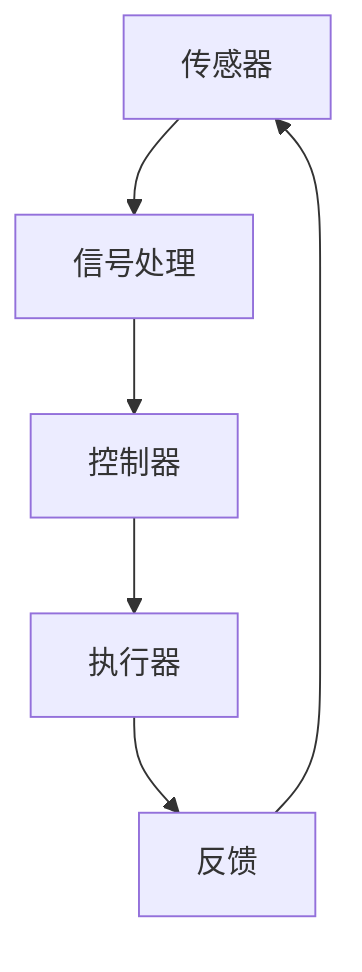

                 

# 《数字实体和物理实体自动化刚开始》

## 关键词
自动化的概述，数字实体，物理实体，传感器技术，控制技术，通信技术，人工智能与机器学习，智能感知与识别技术，数据驱动决策，机器人技术，自动化生产线设计，数字孪生技术，物联网技术，协同自动化，自动化系统的实施与优化，自动化技术的未来发展趋势。

## 摘要
本文旨在探讨数字实体和物理实体自动化的初步阶段，分析自动化技术的基础理论、分类、应用以及未来发展。文章首先概述了自动化的基本概念和发展历程，接着详细介绍了数字实体和物理实体的概念及其相互作用。随后，文章对自动化技术的各类别进行了深入探讨，包括传感技术、控制技术、通信技术等。本文还涉及数字实体自动化技术中的人工智能与机器学习、智能感知与识别技术、数据驱动决策，以及物理实体自动化技术中的机器人技术、自动化生产线设计。最后，文章探讨了数字实体与物理实体的融合，以及自动化系统的实施与优化策略。通过本文的阅读，读者将全面了解自动化技术的基本原理和应用前景，为未来的研究与实践提供参考。

### 目录大纲

# 《数字实体和物理实体自动化刚开始》目录大纲

## 第一部分：自动化基础理论

### 1.1 自动化的概述

#### 1.1.1 自动化的定义与发展历程

#### 1.1.2 自动化的核心概念

#### 1.1.3 自动化与数字化转型的关系

### 1.2 数字实体与物理实体的概念

#### 1.2.1 数字实体的定义与特征

#### 1.2.2 物理实体的定义与特征

#### 1.2.3 数字实体与物理实体的相互作用

### 1.3 自动化技术的分类

#### 1.3.1 传感技术

#### 1.3.2 控制技术

#### 1.3.3 通信技术

## 第二部分：数字实体自动化技术

### 2.1 人工智能与机器学习基础

#### 2.1.1 人工智能概述

#### 2.1.2 机器学习的基本原理

#### 2.1.3 机器学习的算法分类

### 2.2 智能感知与识别技术

#### 2.2.1 图像识别技术

#### 2.2.2 语音识别技术

#### 2.2.3 传感器数据处理

### 2.3 数据驱动决策

#### 2.3.1 数据采集与预处理

#### 2.3.2 数据分析与挖掘

#### 2.3.3 智能决策模型构建

## 第三部分：物理实体自动化技术

### 3.1 自动化控制系统的基本原理

#### 3.1.1 控制系统的定义与分类

#### 3.1.2 控制系统的工作原理

#### 3.1.3 常见的控制系统架构

### 3.2 机器人技术

#### 3.2.1 机器人的定义与分类

#### 3.2.2 机器人的主要功能与应用

#### 3.2.3 机器人技术的发展趋势

### 3.3 自动化生产线设计与应用

#### 3.3.1 自动化生产线的基本概念

#### 3.3.2 自动化生产线的设计流程

#### 3.3.3 自动化生产线的优化策略

## 第四部分：数字实体与物理实体的融合

### 4.1 数字孪生技术

#### 4.1.1 数字孪生的概念与原理

#### 4.1.2 数字孪生的应用场景

#### 4.1.3 数字孪生的构建方法

### 4.2 物联网技术

#### 4.2.1 物联网的基本概念与架构

#### 4.2.2 物联网的核心技术

#### 4.2.3 物联网的应用案例

### 4.3 数字实体与物理实体的协同自动化

#### 4.3.1 协同自动化的概念与意义

#### 4.3.2 协同自动化的实现策略

#### 4.3.3 协同自动化的案例分析

## 第五部分：自动化系统的实施与优化

### 5.1 自动化系统的规划与设计

#### 5.1.1 自动化系统需求分析

#### 5.1.2 自动化系统方案设计

#### 5.1.3 自动化系统实施策略

### 5.2 自动化系统的测试与验证

#### 5.2.1 自动化系统测试的基本流程

#### 5.2.2 自动化系统测试的方法与工具

#### 5.2.3 自动化系统测试的案例分析

### 5.3 自动化系统的优化与维护

#### 5.3.1 自动化系统性能优化策略

#### 5.3.2 自动化系统故障排除与维护

#### 5.3.3 自动化系统升级与迭代策略

## 第六部分：自动化技术的未来发展趋势

### 6.1 自动化技术的未来发展趋势

#### 6.1.1 自动化技术的未来发展预测

#### 6.1.2 自动化技术的新挑战与新机遇

#### 6.1.3 自动化技术对社会的影响

### 6.2 自动化技术在行业中的应用前景

#### 6.2.1 制造业

#### 6.2.2 服务业

#### 6.2.3 农业与物流

### 6.3 自动化技术的可持续性与伦理问题

#### 6.3.1 自动化技术的可持续性发展

#### 6.3.2 自动化技术的伦理问题

#### 6.3.3 自动化技术的社会责任

### 附录

#### 附录 A 自动化技术相关资源与工具

##### A.1 自动化技术开源工具

##### A.2 自动化技术学习资源

##### A.3 自动化技术行业报告与趋势分析

## 第一部分：自动化基础理论

### 1.1 自动化的概述

#### 1.1.1 自动化的定义与发展历程

自动化是指利用计算机、传感器、执行器等设备，对生产、管理、服务等过程进行自动控制和自动执行的技术。自动化的定义可以从广义和狭义两个方面来理解。

- 广义上，自动化是指任何通过机械设备和电子装置实现的过程控制，包括从简单的机械自动化到复杂的系统自动化。
- 狭义上，自动化通常指的是工业自动化，即通过工业机器人、自动化生产线等设备，实现生产过程中人工作业的替代。

自动化的起源可以追溯到18世纪末的工业革命，当时的蒸汽机的发明和应用，标志着工业生产自动化进程的开始。随着时间的推移，自动化技术不断发展，经历了以下几个阶段：

1. **机械自动化阶段（18世纪末至20世纪初）**：
   - 主要以机械设备的自动化操作为核心，如纺织机械的自动化、机床的自动化等。
   - 这一阶段的特点是机械设备自身功能的自动化，但缺乏系统的自动控制。

2. **电气自动化阶段（20世纪初至20世纪中期）**：
   - 随着电力和电子技术的兴起，电气控制系统被广泛应用于工业生产。
   - 电气自动化包括电动机控制、继电器控制等，实现了生产过程的自动化调节和控制。

3. **电子自动化阶段（20世纪中期至20世纪末）**：
   - 计算机技术的发展推动了自动化技术的进一步提升，出现了可编程逻辑控制器（PLC）等自动化设备。
   - 这一阶段的自动化系统开始具备一定的数据处理和反馈控制能力。

4. **信息化自动化阶段（20世纪末至21世纪初）**：
   - 计算机网络和通信技术的发展，使得自动化系统可以实时获取和处理大量数据，实现远程控制和监控。
   - 自动化系统开始与企业的信息化系统融合，形成高度集成的自动化生产线。

5. **智能化自动化阶段（21世纪初至今）**：
   - 随着人工智能、大数据、物联网等新兴技术的应用，自动化技术进入了智能化阶段。
   - 自动化系统具备了自主学习、自适应、自优化等功能，能够实现更加智能化的生产和管理。

#### 1.1.2 自动化的核心概念

自动化的核心概念包括以下几个方面：

- **传感器**：传感器是自动化系统中的信息采集单元，用于检测和测量物理量，如温度、湿度、压力、速度等。传感器将物理量转换为电信号或其他可处理的形式，为控制系统提供输入信息。

- **执行器**：执行器是自动化系统中的动作执行单元，根据控制器的指令执行具体的动作，如电机、液压缸、气动阀门等。执行器的作用是实现控制指令到物理动作的转换。

- **控制器**：控制器是自动化系统中的决策和执行单元，根据传感器采集到的信息，通过预设的控制策略，对执行器进行控制。控制器可以是计算机、PLC、单片机等。

- **执行机构**：执行机构是控制器和执行器之间的接口，用于连接控制器和执行器，传递控制信号。执行机构通常包括驱动器、电源等。

- **闭环控制系统**：闭环控制系统是指通过传感器、控制器和执行器的相互作用，实现对过程的实时监测和自动调节的系统。闭环控制系统具有反馈机制，可以根据系统的实际输出与期望输出之间的差异，进行实时调整，以提高系统的稳定性和精度。

#### 1.1.3 自动化与数字化转型的关系

自动化与数字化转型密切相关，两者相辅相成，共同推动生产和管理方式的变革。

- **自动化是数字化转型的基础**：
  - 自动化技术可以减少人工作业的依赖，提高生产效率和产品质量，降低生产成本。
  - 自动化技术可以实时采集和处理大量数据，为数字化转型提供数据支持。

- **数字化转型推动自动化的发展**：
  - 数字化转型过程中，企业需要通过自动化技术实现生产线的智能化改造，提高生产线的灵活性和适应性。
  - 数字化转型过程中，企业需要通过自动化技术实现供应链的优化和协同，提高整体运营效率。

- **自动化与数字化转型面临的挑战**：
  - 技术挑战：自动化技术的快速发展，要求企业具备相应的技术能力和人才储备。
  - 安全挑战：自动化系统需要保证数据安全和系统安全，防止网络攻击和数据泄露。
  - 管理挑战：数字化转型过程中，企业需要适应新的管理模式和组织结构，实现业务流程的优化和重构。

#### 1.2 数字实体与物理实体的概念

在自动化技术中，数字实体和物理实体是两个核心概念，它们在自动化系统中发挥着重要作用。

- **数字实体**：
  - 数字实体是指通过数字化方式表示和操作的实体，可以是物理实体的数字化映射，也可以是纯数字化的虚拟实体。
  - 数字实体的特征包括：
    - **数字化**：数字实体通过数字化技术进行表示和处理，具有数字化特征。
    - **可编程性**：数字实体可以通过编程进行配置和修改，具有可编程性。
    - **灵活性**：数字实体可以灵活调整和组合，适应不同的应用场景。
  - 数字实体在自动化中的应用：
    - **模拟和分析**：数字实体可以用于模拟和分析物理实体，优化自动化系统的设计。
    - **远程监控和调试**：数字实体可以用于远程监控和调试自动化系统，提高系统的稳定性和可靠性。

- **物理实体**：
  - 物理实体是指存在于现实世界中的实体，如机器、设备、建筑物等。
  - 物理实体的特征包括：
    - **实体性**：物理实体是实际存在的，可以触摸和感知。
    - **动态性**：物理实体可以移动和变化，具有动态特性。
    - **具体性**：物理实体具有具体的形状和结构，可以与外部环境相互作用。
  - 物理实体在自动化中的应用：
    - **操作对象**：物理实体是自动化系统的操作对象，通过传感器和执行器实现自动化控制。
    - **模拟验证**：物理实体可以用于模拟现实环境，验证自动化系统的性能和可靠性。

#### 1.3 数字实体与物理实体的相互作用

数字实体和物理实体在自动化系统中相互作用，共同构成了自动化系统的整体。

- **相互关联**：
  - 数字实体和物理实体之间存在相互关联，数字实体是物理实体的数字化映射，物理实体是数字实体的现实基础。
  - 数字实体和物理实体共同构成了自动化系统的整体，相互依存、相互促进。

- **协同工作**：
  - 数字实体和物理实体需要协同工作，才能实现自动化系统的功能。
  - 数字实体可以通过模拟、分析和优化，指导物理实体的操作，提高自动化系统的效率和性能。

- **融合**：
  - 数字实体与物理实体在自动化系统中需要融合，实现信息流、控制流和能量流的交互。
  - 数字实体可以实时采集和处理物理实体的状态信息，为自动化系统提供决策支持。
  - 物理实体可以根据数字实体的指令进行操作，实现自动化控制。

#### 1.3.1 数字实体的定义与特征

数字实体是指通过数字化方式表示和操作的实体，可以是物理实体的数字化映射，也可以是纯数字化的虚拟实体。数字实体具有以下几个特征：

1. **数字化**：

   数字实体通过数字化技术进行表示和处理，具有数字化特征。数字化技术包括数据采集、数据传输、数据存储等，通过这些技术，可以将物理实体的信息转化为数字信号，实现数字化的模拟和操作。

2. **可编程性**：

   数字实体可以通过编程进行配置和修改，具有可编程性。编程技术包括计算机编程、脚本编写等，通过编程，可以实现对数字实体的功能定制、性能优化等。

3. **灵活性**：

   数字实体可以灵活调整和组合，适应不同的应用场景。数字实体的灵活性体现在其可以快速响应环境变化，进行适应性调整，以满足不同的自动化需求。

#### 1.3.2 物理实体的定义与特征

物理实体是指存在于现实世界中的实体，如机器、设备、建筑物等。物理实体具有以下几个特征：

1. **实体性**：

   物理实体是实际存在的，可以触摸和感知。实体性是物理实体最基本的特征，决定了物理实体在现实世界中的可操作性和实用性。

2. **动态性**：

   物理实体可以移动和变化，具有动态特性。动态性是物理实体在现实世界中的表现，决定了物理实体在特定应用场景中的行为和响应。

3. **具体性**：

   物理实体具有具体的形状和结构，可以与外部环境相互作用。具体性是物理实体的外在表现，决定了物理实体在现实世界中的可识别性和可操作性。

#### 1.3.3 数字实体与物理实体的相互作用

数字实体和物理实体在自动化系统中相互作用，共同构成了自动化系统的整体。以下是数字实体与物理实体相互作用的主要方面：

1. **信息交互**：

   数字实体通过传感器实时采集物理实体的状态信息，如温度、压力、速度等，并将这些信息转化为数字信号，传输到控制器进行处理。控制器根据数字信号进行分析和处理，生成控制指令，通过执行器对物理实体进行操作。

2. **控制交互**：

   数字实体根据传感器采集到的物理实体状态信息，结合预设的控制策略，生成控制指令，通过执行器对物理实体进行实时控制。控制交互实现了数字实体对物理实体的自动调节和优化。

3. **数据交互**：

   数字实体通过数据传输技术，将物理实体的状态信息和控制指令在自动化系统中进行传输和共享。数据交互实现了自动化系统中各组件之间的信息流通和协同工作。

4. **功能交互**：

   数字实体和物理实体共同实现了自动化系统的各项功能。数字实体通过模拟、分析和优化，指导物理实体的操作，提高自动化系统的效率和性能。物理实体通过具体的动作和操作，实现数字实体的控制指令，完成自动化任务。

#### 1.3.4 数字实体与物理实体的融合

数字实体与物理实体的融合是自动化系统设计的关键，也是实现自动化系统高效运行的基础。以下是数字实体与物理实体融合的主要方面：

1. **信息融合**：

   数字实体通过传感器实时采集物理实体的状态信息，并将这些信息进行整合和处理，形成统一的数据模型。信息融合实现了物理实体状态信息的全面、准确、及时获取。

2. **控制融合**：

   数字实体根据信息融合的结果，结合预设的控制策略，生成控制指令，实现对物理实体的精确控制。控制融合实现了自动化系统的实时调节和优化。

3. **功能融合**：

   数字实体和物理实体共同完成了自动化系统的各项功能。数字实体通过模拟、分析和优化，指导物理实体的操作，提高自动化系统的效率和性能。物理实体通过具体的动作和操作，实现数字实体的控制指令，完成自动化任务。

4. **协同工作**：

   数字实体和物理实体在自动化系统中需要协同工作，才能实现自动化系统的整体功能。数字实体通过实时采集物理实体的状态信息，根据信息分析和控制策略，指导物理实体的操作。物理实体根据数字实体的控制指令，进行具体的动作和操作，实现自动化任务。

### 1.4 自动化技术的分类

自动化技术可以根据其应用领域、技术特点、实现方式等不同维度进行分类。以下是几种常见的自动化技术分类方法：

#### 1.4.1 按应用领域分类

- **工业自动化**：主要用于工业生产过程中的自动化控制，如生产线自动化、机器人自动化等。
- **家庭自动化**：主要用于家庭环境中的自动化控制，如智能家电、智能家居等。
- **交通自动化**：主要用于交通领域的自动化控制，如自动驾驶、智能交通管理等。
- **农业自动化**：主要用于农业生产过程中的自动化控制，如智能灌溉、自动化收割等。

#### 1.4.2 按技术特点分类

- **传感器技术**：主要用于自动化系统中的信息采集，如温度传感器、压力传感器、图像传感器等。
- **控制技术**：主要用于自动化系统中的控制执行，如PLC（可编程逻辑控制器）、单片机、工业计算机等。
- **通信技术**：主要用于自动化系统中的数据传输和通信，如以太网、无线通信、物联网等。
- **人工智能技术**：主要用于自动化系统中的智能决策和优化，如机器学习、深度学习、自然语言处理等。

#### 1.4.3 按实现方式分类

- **开环控制系统**：不采用反馈机制，根据预设的输入直接控制执行器，适用于对精度要求不高的场合。
- **闭环控制系统**：采用反馈机制，根据系统的输出与期望值之间的差异进行实时调整，适用于对精度和稳定性要求较高的场合。
- **分布式控制系统**：采用多个分布式控制器共同协调工作，适用于复杂系统的大规模控制和调度。
- **集中式控制系统**：采用单个集中式控制器进行系统控制和调度，适用于结构简单、控制要求不高的场合。

### 1.5 传感技术

传感技术是自动化系统中的重要组成部分，主要用于信息采集和感知。传感器是传感技术的核心组件，它能够将各种物理量（如温度、压力、速度、光照等）转换为电信号或其他形式的信号，为控制系统提供输入信息。

#### 1.5.1 传感器的基本原理

传感器的工作原理通常基于以下几种效应：

- **物理效应**：如电阻变化、电容变化、磁效应等。
- **化学效应**：如光电效应、电化学效应等。
- **生物效应**：如生物传感器、嗅觉传感器等。

传感器的基本原理可以概括为以下几个步骤：

1. **感知与转换**：传感器感知外界物理量，并将其转换为电信号或其他形式的信号。
2. **信号处理**：对传感器采集到的信号进行放大、滤波、调制等处理，提高信号的质量和可靠性。
3. **数据输出**：将处理后的信号输出给控制系统或数据处理单元。

#### 1.5.2 传感器的分类与选型

传感器的分类可以根据测量对象、工作原理、结构特点等进行。常见的传感器类型包括：

- **温度传感器**：如热电偶、热敏电阻、红外测温仪等。
- **压力传感器**：如压电式传感器、应变片式传感器、电容式传感器等。
- **速度传感器**：如光电式传感器、霍尔传感器、磁电式传感器等。
- **位移传感器**：如超声波传感器、电感式传感器、磁致伸缩式传感器等。

传感器的选型需要根据具体的应用场景和要求进行。主要考虑因素包括：

- **测量范围**：传感器的测量范围应满足应用需求，既不能过小也不能过大。
- **精度与分辨率**：传感器的精度和分辨率应满足应用要求，越高越好。
- **响应时间**：传感器的响应时间应尽可能短，以保证实时控制。
- **环境适应性**：传感器应具有良好的环境适应性，能适应各种恶劣环境。
- **成本与可靠性**：传感器的成本应合理，且具有较高的可靠性。

### 1.6 控制技术

控制技术是自动化系统的核心，主要用于对物理量的自动调节和控制。控制器是控制技术的核心组件，它根据传感器采集到的信息，结合预设的控制策略，生成控制指令，驱动执行器实现具体的控制动作。

#### 1.6.1 控制系统的定义与分类

控制系统是指通过传感器、控制器、执行器等组成，实现对物理量自动调节和控制的系统。控制系统可以按照不同的分类标准进行分类：

- **按控制对象分类**：如温度控制系统、压力控制系统、速度控制系统等。
- **按控制方式分类**：如开环控制系统、闭环控制系统、自适应控制系统等。
- **按控制策略分类**：如PID控制、模糊控制、神经网络控制等。
- **按控制结构分类**：如单闭环控制系统、双闭环控制系统、多闭环控制系统等。

#### 1.6.2 控制系统的工作原理

控制系统的工作原理可以概括为以下几个步骤：

1. **信息采集**：传感器采集系统的当前状态信息，如温度、压力、速度等。
2. **信号处理**：控制器对传感器采集到的信号进行放大、滤波、转换等处理，得到处理后的信号。
3. **决策与控制**：控制器根据处理后的信号，结合预设的控制策略，生成控制指令。
4. **执行与反馈**：执行器根据控制指令进行具体的操作，同时将操作结果反馈给控制器，形成闭环控制。

#### 1.6.3 常见的控制系统架构

常见的控制系统架构包括以下几种：

1. **单闭环控制系统**：控制器只有一个闭环控制回路，适用于简单控制场景。
2. **双闭环控制系统**：控制器有两个闭环控制回路，可以同时控制两个物理量，提高系统的控制精度。
3. **多闭环控制系统**：控制器有多个闭环控制回路，可以同时控制多个物理量，适用于复杂控制场景。
4. **分布式控制系统**：控制器分布在不同的位置，通过通信网络进行数据交换和控制指令传递，适用于大规模控制系统。

### 1.7 通信技术

通信技术是自动化系统中数据传输和通信的重要组成部分，主要用于传感器、控制器、执行器等设备之间的信息传递和协调工作。通信技术可以分为有线通信和无线通信两种类型。

#### 1.7.1 通信技术在自动化中的应用

通信技术在自动化系统中的应用主要包括以下几个方面：

1. **数据采集与监控**：通过通信技术，实现传感器采集的数据实时传输到控制器或监控中心，进行数据分析和监控。
2. **远程控制与调试**：通过通信技术，实现控制器对执行器的远程控制，以及对整个自动化系统的远程调试和故障诊断。
3. **系统集成与协同工作**：通过通信技术，实现不同设备之间的数据交换和协同工作，提高自动化系统的整体性能和可靠性。

#### 1.7.2 通信协议的基本原理

通信协议是通信系统中进行数据传输和交换的规范，主要包括以下几个方面：

1. **数据格式**：定义数据传输的格式，包括数据长度、数据编码方式等。
2. **传输速率**：定义数据传输的速率，以保证数据的实时性和准确性。
3. **传输可靠性**：定义数据传输的可靠性，包括错误检测、错误纠正、重传机制等。
4. **地址分配**：定义设备的地址分配规则，以实现设备之间的通信。

常见的通信协议包括以太网（Ethernet）、串口通信（RS-485、RS-232）、无线通信（Wi-Fi、蓝牙、ZigBee）等。

#### 1.7.3 通信技术在自动化系统中的优化

通信技术在自动化系统中的优化主要包括以下几个方面：

1. **通信协议选择**：根据自动化系统的实际需求和通信环境，选择合适的通信协议，以提高数据传输效率和可靠性。
2. **通信速率优化**：合理调整通信速率，以满足实时性要求，同时避免通信拥堵。
3. **通信质量提升**：通过信号放大、滤波、编码等技术，提高通信质量，降低误码率和丢包率。
4. **网络拓扑优化**：设计合理的网络拓扑结构，降低网络延迟和通信干扰，提高系统的整体性能。

### 第2章：数字实体自动化技术

#### 2.1 人工智能与机器学习基础

人工智能（AI）是指通过计算机模拟人类智能，实现智能感知、智能决策、智能执行等功能的技术。机器学习（ML）是人工智能的核心技术之一，它是指利用数据和算法，让计算机自动学习和改进性能的过程。本节将介绍人工智能和机器学习的基本概念、基本原理和算法分类。

##### 2.1.1 人工智能概述

人工智能是指通过计算机模拟人类智能，实现机器对复杂问题的求解、决策和优化。人工智能的目标是实现机器的智能感知、智能决策、智能执行，从而实现自动化和智能化。

人工智能的基本组成部分包括：

1. **感知系统**：用于感知和理解外部环境，如视觉、听觉、触觉等。
2. **决策系统**：用于根据感知到的信息进行决策和规划，如路径规划、目标识别等。
3. **执行系统**：用于执行决策结果，如机器人的动作、机器的运行等。

人工智能的发展可以分为以下几个阶段：

1. **符号主义阶段**：以逻辑推理和符号计算为基础，如专家系统。
2. **连接主义阶段**：以神经网络为基础，如深度学习。
3. **行为主义阶段**：以行为规划和智能控制为基础，如自主驾驶。
4. **混合智能阶段**：将不同的人工智能方法进行融合，如多模态感知、多任务学习等。

##### 2.1.2 机器学习的基本原理

机器学习是指利用数据和算法，让计算机自动学习和改进性能的过程。机器学习的过程可以概括为以下几个步骤：

1. **数据收集**：收集大量的数据作为训练样本。
2. **数据预处理**：对数据进行清洗、去噪、归一化等预处理，以提高数据的质量和训练效果。
3. **模型选择**：选择合适的机器学习模型，如线性回归、决策树、神经网络等。
4. **模型训练**：使用训练数据集对模型进行训练，调整模型的参数，使其能够正确预测新的数据。
5. **模型评估**：使用验证数据集对模型进行评估，计算模型的性能指标，如准确率、召回率、F1值等。
6. **模型应用**：将训练好的模型应用到实际问题中，进行预测或决策。

##### 2.1.3 机器学习的算法分类

机器学习算法可以根据不同的分类标准进行分类。以下是几种常见的分类方法：

1. **按学习方式分类**：

   - **监督学习**：有标记的训练数据，模型通过学习标记数据来预测新的数据。如线性回归、决策树、支持向量机等。
   - **无监督学习**：没有标记的训练数据，模型通过学习数据分布来发现数据中的模式。如聚类、降维、关联规则等。
   - **半监督学习**：部分数据有标记，部分数据无标记，模型通过学习有标记数据和无标记数据来提高预测效果。
   - **强化学习**：模型通过与环境的交互来学习最优策略，如Q学习、深度强化学习等。

2. **按模型形式分类**：

   - **统计学习**：基于统计方法和假设检验，如线性回归、逻辑回归等。
   - **神经网络**：基于人工神经网络，如前馈神经网络、卷积神经网络、循环神经网络等。
   - **集成学习方法**：将多个模型组合起来，提高模型的预测性能，如随机森林、梯度提升机等。

3. **按任务类型分类**：

   - **回归任务**：预测连续值输出，如房屋价格预测、股票价格预测等。
   - **分类任务**：预测离散值输出，如邮件分类、图像分类等。
   - **聚类任务**：将数据分组，使同一组内的数据尽可能相似，不同组的数据尽可能不同。
   - **异常检测**：检测数据中的异常值或异常模式。

#### 2.2 智能感知与识别技术

智能感知与识别技术是数字实体自动化技术的重要组成部分，主要用于实现自动化系统对环境的感知和理解。智能感知与识别技术包括图像识别技术、语音识别技术、传感器数据处理等。

##### 2.2.1 图像识别技术

图像识别技术是指通过计算机算法对图像中的目标进行识别和分类。图像识别技术在自动化系统中广泛应用于物体检测、缺陷检测、人脸识别等领域。

1. **图像识别的基本原理**

   图像识别的基本原理包括以下几个步骤：

   - **图像预处理**：对原始图像进行预处理，如去噪、增强、边缘提取等。
   - **特征提取**：从预处理后的图像中提取具有区分性的特征，如颜色特征、纹理特征、形状特征等。
   - **分类器训练**：使用训练数据集，通过机器学习算法训练分类器，如支持向量机、神经网络等。
   - **目标识别**：对新的图像数据，通过特征提取和分类器进行目标识别。

2. **图像识别的算法分类**

   常见的图像识别算法包括：

   - **基于传统机器学习的算法**：如支持向量机（SVM）、决策树、随机森林等。
   - **基于深度学习的算法**：如卷积神经网络（CNN）、循环神经网络（RNN）、生成对抗网络（GAN）等。

3. **图像识别的应用案例**

   图像识别技术广泛应用于各个领域，以下是一些应用案例：

   - **物体检测**：在自动驾驶汽车中，用于检测道路上的行人、车辆、交通标志等。
   - **缺陷检测**：在制造业中，用于检测产品的缺陷和瑕疵，提高产品质量。
   - **人脸识别**：在安全监控和身份验证领域，用于识别和验证人脸。

##### 2.2.2 语音识别技术

语音识别技术是指通过计算机算法对语音信号进行识别和理解。语音识别技术在自动化系统中广泛应用于语音指令识别、语音合成、语音交互等领域。

1. **语音识别的基本原理**

   语音识别的基本原理包括以下几个步骤：

   - **语音信号预处理**：对语音信号进行预处理，如降噪、分帧、特征提取等。
   - **特征提取**：从预处理后的语音信号中提取具有区分性的特征，如MFCC（梅尔频率倒谱系数）、PLP（倒谱归一化的线性预测特征）等。
   - **声学模型训练**：使用大量的语音数据集，通过统计方法训练声学模型，如高斯混合模型（GMM）、深度神经网络等。
   - **语言模型训练**：使用大量的文本数据集，通过统计方法训练语言模型，如n元语法模型、循环神经网络（RNN）等。
   - **解码**：将特征序列映射到最可能的文本序列，使用解码算法，如动态规划、 beam搜索等。

2. **语音识别的算法分类**

   常见的语音识别算法包括：

   - **基于传统机器学习的算法**：如高斯混合模型（GMM）、隐马尔可夫模型（HMM）等。
   - **基于深度学习的算法**：如卷积神经网络（CNN）、循环神经网络（RNN）、长短期记忆网络（LSTM）等。

3. **语音识别的应用案例**

   语音识别技术广泛应用于各个领域，以下是一些应用案例：

   - **语音指令识别**：在智能家居中，用于语音控制家电设备。
   - **语音合成**：在文本转语音（TTS）系统中，用于将文本转换为语音。
   - **语音交互**：在智能客服系统中，用于与用户进行语音对话。

##### 2.2.3 传感器数据处理

传感器数据处理是指对传感器采集到的数据进行预处理、分析和处理，以提高数据的质量和可靠性。传感器数据处理在自动化系统中具有重要意义，它直接影响自动化系统的性能和决策效果。

1. **传感器数据预处理**

   传感器数据预处理主要包括以下步骤：

   - **去噪**：去除传感器数据中的噪声，如随机噪声、趋势噪声等。
   - **滤波**：使用滤波算法，如低通滤波、高通滤波等，去除传感器数据中的干扰信号。
   - **归一化**：将传感器数据归一化到同一量纲，以便进行比较和分析。
   - **插值**：对缺失或断续的传感器数据进行插值补全，提高数据的连续性和完整性。

2. **传感器数据分析**

   传感器数据分析主要包括以下方法：

   - **统计方法**：使用统计学方法，如均值、方差、标准差等，分析传感器数据的分布和特性。
   - **时序分析方法**：使用时序分析方法，如自回归模型（AR）、移动平均模型（MA）、自回归移动平均模型（ARMA）等，分析传感器数据的趋势和周期性。
   - **机器学习方法**：使用机器学习方法，如聚类、分类、回归等，对传感器数据进行模式识别和预测。

3. **传感器数据应用**

   传感器数据在自动化系统中广泛应用于以下几个方面：

   - **状态监测**：通过实时监测传感器数据，了解系统的运行状态，如温度、压力、速度等。
   - **故障诊断**：通过分析传感器数据，识别系统的故障类型和故障位置，提高系统的可靠性和稳定性。
   - **性能优化**：通过分析传感器数据，优化系统的运行参数和控制策略，提高系统的效率和性能。

### 第3章：物理实体自动化技术

#### 3.1 自动化控制系统的基本原理

自动化控制系统是指通过传感器、控制器和执行器等组件，对物理量进行自动调节和控制的系统。自动化控制系统在工业生产、智能家居、医疗设备等领域得到了广泛应用，其基本原理包括以下几个方面：

##### 3.1.1 控制系统的定义与分类

控制系统是指通过传感器、控制器和执行器等组成，实现对物理量的自动调节和控制的系统。根据控制对象和控制方式的不同，控制系统可以分为以下几种类型：

1. **开环控制系统**：开环控制系统不采用反馈机制，根据输入直接控制执行器，适用于对精度要求不高的场合。例如，自动门、自动售货机等。

2. **闭环控制系统**：闭环控制系统采用反馈机制，根据系统的输出与期望值之间的差异进行实时调整，适用于对精度和稳定性要求较高的场合。例如，恒温系统、自动驾驶等。

3. **自适应控制系统**：自适应控制系统可以根据环境变化和系统状态的变化，自动调整控制参数，以提高控制性能。例如，自适应滤波器、自适应控制算法等。

4. **分布式控制系统**：分布式控制系统采用多个分布式控制器共同协调工作，适用于复杂系统的大规模控制和调度。例如，智能电网、工业自动化等。

##### 3.1.2 控制系统的工作原理

控制系统的工作原理可以概括为以下几个步骤：

1. **信息采集**：传感器采集系统的当前状态信息，如温度、压力、速度等。

2. **信号处理**：控制器对传感器采集到的信号进行放大、滤波、转换等处理，得到处理后的信号。

3. **决策与控制**：控制器根据处理后的信号，结合预设的控制策略，生成控制指令。

4. **执行与反馈**：执行器根据控制指令进行具体的操作，同时将操作结果反馈给控制器，形成闭环控制。

控制系统的工作原理示意图如下：

##### 3.1.3 常见的控制系统架构

常见的控制系统架构包括以下几种：

1. **单闭环控制系统**：单闭环控制系统只有一个闭环控制回路，适用于简单控制场景。例如，恒温系统、恒速电机控制系统等。

2. **双闭环控制系统**：双闭环控制系统有两个闭环控制回路，可以同时控制两个物理量，提高系统的控制精度。例如，温度控制系统和湿度控制系统。

3. **多闭环控制系统**：多闭环控制系统有多个闭环控制回路，可以同时控制多个物理量，适用于复杂控制场景。例如，复杂工业过程控制系统。

4. **分布式控制系统**：分布式控制系统采用多个分布式控制器共同协调工作，适用于大规模控制系统。例如，智能电网控制系统。

#### 3.2 机器人技术

机器人技术是物理实体自动化技术中的重要组成部分，它通过计算机控制、机械结构、传感器和人工智能等技术，实现了机器人的自主运动、感知、决策和执行任务。本节将介绍机器人技术的定义、分类、主要功能和应用。

##### 3.2.1 机器人的定义与分类

机器人是一种能够半自主或全自主执行任务的机械设备。根据不同的分类标准，机器人可以有不同的分类方式：

1. **按应用领域分类**：

   - **工业机器人**：主要用于工业生产中的焊接、装配、搬运等任务，如工业机械臂、焊接机器人等。
   - **服务机器人**：主要用于提供各种服务，如家庭机器人、医疗机器人、酒店机器人等。
   - **特种机器人**：用于特殊环境或任务，如深海机器人、搜索救援机器人、空间机器人等。

2. **按结构形式分类**：

   - **串联机器人**：关节连接呈直线排列，如SCARA机器人。
   - **并联机器人**：多个关节在同一平面内，如Delta机器人。
   - **多自由度机器人**：具有多个自由度的关节，如六自由度工业机器人。

3. **按控制方式分类**：

   - **遥控机器人**：通过遥控器或控制台进行控制，如无人潜航器。
   - **自主机器人**：具有自主运动和决策能力，如自动驾驶汽车、无人驾驶飞机。

##### 3.2.2 机器人的主要功能与应用

机器人的主要功能包括运动控制、感知、决策和执行。以下是机器人在不同领域的主要应用：

1. **工业生产领域**：

   - **焊接**：工业机器人广泛应用于汽车制造、船舶制造、航空航天等领域的焊接任务。
   - **装配**：工业机器人用于电子、电器、玩具等行业的装配任务。
   - **搬运**：工业机器人用于物流仓储、自动化仓库等领域的货物搬运。

2. **服务业领域**：

   - **家庭服务**：家庭机器人可以用于清洁、看护、教育等家庭服务。
   - **医疗护理**：医疗机器人可以用于手术辅助、康复治疗、护理等医疗任务。
   - **酒店服务**：酒店机器人可以用于迎宾、指引、清洁等酒店服务。

3. **特种领域**：

   - **搜索救援**：搜索救援机器人用于灾害现场、事故现场的搜索和救援任务。
   - **环境监测**：环境监测机器人用于环境监测、污染治理等任务。
   - **科学研究**：空间机器人用于太空探索、天体观测等科学研究任务。

##### 3.2.3 机器人技术的发展趋势

随着人工智能、传感器技术、计算机视觉等领域的快速发展，机器人技术也呈现出以下发展趋势：

1. **智能化**：机器人将具备更加智能的决策和执行能力，能够自适应复杂环境和任务需求。

2. **人机协作**：机器人将与人类更紧密地协作，实现人机协同工作，提高工作效率和安全。

3. **自主化**：机器人将具备更高的自主化能力，能够自主规划路径、自主决策和执行任务。

4. **模块化**：机器人将采用模块化设计，可根据不同任务需求灵活配置和组合。

5. **网络化**：机器人将通过网络连接实现远程监控、远程操作和协同工作。

#### 3.3 自动化生产线设计与应用

自动化生产线是指由多个自动化设备组成的，能够实现产品自动加工、装配和检测的生产系统。自动化生产线设计是自动化技术领域中的重要内容，其目标是实现生产过程的高效、稳定和可靠。本节将介绍自动化生产线的基本概念、设计流程和优化策略。

##### 3.3.1 自动化生产线的基本概念

自动化生产线的基本概念包括以下几个部分：

1. **生产单元**：生产单元是自动化生产线中的基本组成部分，包括机床、装配工作站、检测设备等。

2. **传输系统**：传输系统是自动化生产线中的物料运输和产品输送系统，包括输送带、导轨、机器人等。

3. **控制系统**：控制系统是自动化生产线的核心部分，负责协调和管理各个生产单元的运行。

4. **传感器与执行器**：传感器用于实时监测生产过程中的各项参数，如温度、压力、速度等；执行器用于执行控制指令，如电机、液压缸、气动阀门等。

5. **数据处理与通信**：数据处理与通信系统负责对传感器数据进行处理和分析，实现生产过程的实时监控和远程控制。

##### 3.3.2 自动化生产线的设计流程

自动化生产线的设计流程通常包括以下步骤：

1. **需求分析**：明确生产线的目标、功能、性能、工艺流程等要求。

2. **工艺规划**：根据需求分析结果，确定生产线的工艺流程、工艺参数等。

3. **设备选型**：根据工艺规划结果，选择合适的生产设备，如机床、机器人、传感器、执行器等。

4. **控制系统设计**：设计控制系统的硬件和软件架构，实现生产线的自动化控制。

5. **传输系统设计**：设计传输系统的布局和结构，实现物料和产品的自动传输。

6. **传感器与执行器选型**：根据生产线的要求，选择合适的传感器和执行器，实现生产过程的实时监控和操作。

7. **系统集成与调试**：将各个部分集成起来，进行系统调试和优化，确保生产线的稳定运行。

8. **试运行与验收**：进行生产线试运行，验证生产线的性能和稳定性，进行验收和交付。

##### 3.3.3 自动化生产线的优化策略

自动化生产线的优化策略包括以下几个方面：

1. **生产节拍优化**：通过调整生产节拍，使生产线的运行速度与市场需求相匹配，提高生产效率。

2. **设备利用率优化**：通过优化设备的使用率，提高生产线的整体产能和效益。

3. **生产效率优化**：通过改进工艺流程、提高设备性能、减少停机时间等手段，提高生产线的生产效率。

4. **质量控制**：通过实时监测和控制生产过程，确保产品质量的稳定性和一致性。

5. **能源管理**：通过优化能源使用，提高生产线的能源利用效率，降低生产成本。

6. **故障排除与维护**：通过建立故障排除和维护机制，确保生产线的正常运行，减少故障对生产的影响。

#### 3.4 数字孪生技术

数字孪生技术是一种通过数字化方式创建物理实体的虚拟映射，实现对物理实体的模拟、分析和优化的技术。数字孪生技术在自动化系统中具有广泛的应用，可以用于设计仿真、运行监控、状态预测等。本节将介绍数字孪生的概念、原理、应用场景和构建方法。

##### 3.4.1 数字孪生的概念与原理

数字孪生（Digital Twin）是指通过数字化技术，创建物理实体的虚拟映射，实现物理实体与数字实体的同步交互。数字孪生技术的基本原理包括以下几个部分：

1. **数据采集**：通过传感器、设备等采集物理实体的状态数据，如位置、速度、温度、压力等。

2. **数据传输**：通过通信技术，将采集到的物理实体数据传输到数字孪生平台。

3. **数据建模**：在数字孪生平台上，对物理实体进行建模，创建数字孪生模型，模拟物理实体的运行状态和性能。

4. **数据分析和优化**：通过对数字孪生模型进行分析和优化，预测物理实体的行为和性能，提出改进措施。

5. **反馈与控制**：将分析结果和优化措施反馈到物理实体，实现物理实体与数字孪生的同步交互。

##### 3.4.2 数字孪生的应用场景

数字孪生技术在自动化系统中具有广泛的应用场景，包括以下几个方面：

1. **设计仿真**：通过数字孪生技术，可以在设计阶段对物理实体进行虚拟仿真，预测其性能和可靠性，优化设计方案。

2. **运行监控**：通过数字孪生技术，可以实时监控物理实体的运行状态，预测故障和异常，提前采取维护措施。

3. **状态预测**：通过数字孪生技术，可以基于历史数据和实时数据，预测物理实体的未来状态和行为，为决策提供支持。

4. **优化控制**：通过数字孪生技术，可以优化物理实体的控制策略，提高其运行效率和性能。

5. **虚拟维修**：通过数字孪生技术，可以实现对物理实体的虚拟维修，减少停机时间，降低维修成本。

##### 3.4.3 数字孪生的构建方法

构建数字孪生系统需要以下几个步骤：

1. **需求分析**：明确数字孪生系统的目标和需求，确定需要采集的物理实体数据和需要实现的功能。

2. **数据采集**：选择合适的传感器和设备，采集物理实体的状态数据，如位置、速度、温度、压力等。

3. **数据传输**：通过通信技术，将采集到的物理实体数据传输到数字孪生平台，可以使用有线通信（如以太网）或无线通信（如Wi-Fi、LoRa等）。

4. **数据建模**：在数字孪生平台上，使用建模工具（如MATLAB、SIMULINK等），创建物理实体的数字模型，模拟其运行状态和性能。

5. **数据分析**：使用数据分析工具（如Python、R等），对数字孪生模型进行数据分析和优化，预测物理实体的未来状态和行为。

6. **反馈与控制**：将分析结果和优化措施通过控制系统反馈到物理实体，实现物理实体与数字孪生的同步交互。

### 第4章：数字实体与物理实体的融合

#### 4.1 数字孪生技术

数字孪生技术是一种通过数字化方式创建物理实体的虚拟映射，实现对物理实体的模拟、分析和优化的技术。数字孪生技术在自动化系统中具有广泛的应用，可以用于设计仿真、运行监控、状态预测等。本节将介绍数字孪生的概念、原理、应用场景和构建方法。

##### 4.1.1 数字孪生的概念与原理

数字孪生（Digital Twin）是指通过数字化技术，创建物理实体的虚拟映射，实现物理实体与数字实体的同步交互。数字孪生技术的基本原理包括以下几个部分：

1. **数据采集**：通过传感器、设备等采集物理实体的状态数据，如位置、速度、温度、压力等。

2. **数据传输**：通过通信技术，将采集到的物理实体数据传输到数字孪生平台。

3. **数据建模**：在数字孪生平台上，对物理实体进行建模，创建数字孪生模型，模拟物理实体的运行状态和性能。

4. **数据分析和优化**：通过对数字孪生模型进行分析和优化，预测物理实体的行为和性能，提出改进措施。

5. **反馈与控制**：将分析结果和优化措施反馈到物理实体，实现物理实体与数字孪生的同步交互。

##### 4.1.2 数字孪生的应用场景

数字孪生技术在自动化系统中具有广泛的应用场景，包括以下几个方面：

1. **设计仿真**：通过数字孪生技术，可以在设计阶段对物理实体进行虚拟仿真，预测其性能和可靠性，优化设计方案。

2. **运行监控**：通过数字孪生技术，可以实时监控物理实体的运行状态，预测故障和异常，提前采取维护措施。

3. **状态预测**：通过数字孪生技术，可以基于历史数据和实时数据，预测物理实体的未来状态和行为，为决策提供支持。

4. **优化控制**：通过数字孪生技术，可以优化物理实体的控制策略，提高其运行效率和性能。

5. **虚拟维修**：通过数字孪生技术，可以实现对物理实体的虚拟维修，减少停机时间，降低维修成本。

##### 4.1.3 数字孪生的构建方法

构建数字孪生系统需要以下几个步骤：

1. **需求分析**：明确数字孪生系统的目标和需求，确定需要采集的物理实体数据和需要实现的功能。

2. **数据采集**：选择合适的传感器和设备，采集物理实体的状态数据，如位置、速度、温度、压力等。

3. **数据传输**：通过通信技术，将采集到的物理实体数据传输到数字孪生平台，可以使用有线通信（如以太网）或无线通信（如Wi-Fi、LoRa等）。

4. **数据建模**：在数字孪生平台上，使用建模工具（如MATLAB、SIMULINK等），创建物理实体的数字模型，模拟其运行状态和性能。

5. **数据分析和优化**：使用数据分析工具（如Python、R等），对数字孪生模型进行数据分析和优化，预测物理实体的未来状态和行为。

6. **反馈与控制**：将分析结果和优化措施通过控制系统反馈到物理实体，实现物理实体与数字孪生的同步交互。

#### 4.2 物联网技术

物联网（Internet of Things，简称IoT）是指通过传感器、通信技术、云计算等技术，实现物理实体与数字实体的互联互通。物联网技术在自动化系统中具有重要的作用，可以用于数据采集、远程监控、智能控制等。本节将介绍物联网的基本概念、架构、核心技术以及应用案例。

##### 4.2.1 物联网的基本概念与架构

物联网是指将各种信息传感设备与互联网连接，实现物体与物体、物体与互联网之间的信息交换和通信。物联网的基本概念包括以下几个部分：

1. **物联网设备**：物联网设备是指具有感知、传输和处理能力的设备，如传感器、智能终端、智能硬件等。

2. **物联网平台**：物联网平台是指提供数据存储、数据处理、数据分析和应用开发等服务的平台。

3. **物联网网络**：物联网网络是指连接物联网设备和物联网平台的网络，包括有线网络（如以太网、光纤）和无线网络（如Wi-Fi、LoRa、ZigBee等）。

物联网的架构可以分为以下几个层次：

1. **感知层**：感知层是物联网架构的基础层，通过传感器、智能设备等感知物理世界的信息，如温度、湿度、光照、运动等。

2. **传输层**：传输层是物联网架构的网络层，负责将感知层采集到的数据传输到物联网平台，可以使用有线网络和无线网络。

3. **平台层**：平台层是物联网架构的核心层，提供数据存储、数据处理、数据分析和应用开发等服务，是实现物联网应用的关键。

4. **应用层**：应用层是物联网架构的最高层，提供具体的物联网应用服务，如智能家居、智能交通、智能医疗等。

##### 4.2.2 物联网的核心技术

物联网的核心技术包括以下几个方面：

1. **传感器技术**：传感器技术是物联网感知层的关键技术，通过传感器可以感知物理世界的信息，如温度、湿度、光照、运动等。

2. **通信技术**：通信技术是物联网传输层的关键技术，负责将感知层采集到的数据传输到物联网平台，如Wi-Fi、LoRa、ZigBee等无线通信技术。

3. **云计算技术**：云计算技术是物联网平台层的关键技术，提供数据存储、数据处理、数据分析和应用开发等服务。

4. **大数据技术**：大数据技术是物联网平台层的关键技术，通过对物联网平台收集的大量数据进行分析和处理，提取有价值的信息。

5. **人工智能技术**：人工智能技术是物联网应用层的关键技术，通过对物联网平台收集的数据进行分析和预测，实现智能决策和智能控制。

##### 4.2.3 物联网的应用案例

物联网技术在各个领域都有广泛的应用，以下是几个典型的应用案例：

1. **智能家居**：通过物联网技术，可以实现家电设备之间的互联互通，如智能门锁、智能灯光、智能空调等，提高家庭的舒适性和便利性。

2. **智能交通**：通过物联网技术，可以实现交通设备之间的实时通信和协同工作，如智能路灯、智能红绿灯、智能停车场等，提高交通管理的效率和安全性。

3. **智能医疗**：通过物联网技术，可以实现医疗设备之间的实时通信和数据共享，如智能穿戴设备、智能输液泵、智能医学影像等，提高医疗服务的质量和效率。

4. **智能农业**：通过物联网技术，可以实现农业设备之间的实时监控和数据采集，如智能灌溉系统、智能气象监测、智能作物生长监测等，提高农业生产的效率和产量。

5. **智能工业**：通过物联网技术，可以实现工业设备之间的实时监控和数据采集，如智能生产设备、智能仓储系统、智能供应链管理等，提高工业生产的管理水平和生产效率。

#### 4.3 数字实体与物理实体的协同自动化

数字实体与物理实体的协同自动化是指通过数字实体对物理实体的实时监控、分析和优化，实现对物理实体的自动化控制和优化。协同自动化技术可以实现数字实体与物理实体的紧密配合，提高自动化系统的效率和性能。本节将介绍协同自动化的概念、实现策略和案例分析。

##### 4.3.1 协同自动化的概念与意义

协同自动化是指通过数字实体对物理实体的实时监控、分析和优化，实现对物理实体的自动化控制和优化。协同自动化的概念可以从以下几个方面来理解：

1. **实时监控**：数字实体通过传感器等设备实时采集物理实体的状态数据，实现对物理实体的实时监控。

2. **数据分析**：数字实体对采集到的物理实体状态数据进行分析和处理，提取有价值的信息，如趋势、异常等。

3. **优化控制**：数字实体根据分析结果，对物理实体的控制策略进行调整和优化，实现对物理实体的自动化控制和优化。

协同自动化的意义主要体现在以下几个方面：

1. **提高效率**：通过协同自动化，可以实现对物理实体的实时监控和优化控制，提高生产效率和管理效率。

2. **降低成本**：通过协同自动化，可以减少人工作业的依赖，降低人力成本和生产成本。

3. **提高性能**：通过协同自动化，可以优化物理实体的控制策略和运行参数，提高物理实体的性能和可靠性。

4. **提升安全性**：通过协同自动化，可以实时监控物理实体的运行状态，及时发现和预警异常情况，提高系统的安全性。

##### 4.3.2 协同自动化的实现策略

协同自动化的实现策略主要包括以下几个方面：

1. **数据采集与传输**：通过传感器等设备实时采集物理实体的状态数据，并通过通信技术将数据传输到数字实体。

2. **数据处理与存储**：数字实体对采集到的物理实体状态数据进行预处理、存储和管理，为分析和优化提供数据支持。

3. **数据分析与挖掘**：数字实体通过对物理实体状态数据的分析，提取有价值的信息，如趋势、异常等，为优化控制提供依据。

4. **优化控制策略**：数字实体根据分析结果，结合物理实体的运行特性，制定优化控制策略，实现对物理实体的自动化控制和优化。

5. **反馈与调整**：物理实体根据数字实体的优化控制策略进行操作，并将操作结果反馈给数字实体，数字实体根据反馈结果进行进一步的优化调整。

##### 4.3.3 协同自动化的案例分析

以下是一个协同自动化的案例分析：

**案例背景**：某制造企业生产线上存在以下问题：

- 生产线效率低下，生产节拍不稳定。
- 生产设备故障频发，影响生产进度。
- 生产过程数据采集不足，无法实现精细化管理。

**协同自动化方案**：

1. **数据采集与传输**：在生产线的关键位置安装传感器，实时采集生产节拍、设备状态、生产参数等数据，并通过无线网络将数据传输到数字实体。

2. **数据处理与存储**：数字实体对采集到的数据进行预处理、存储和管理，为分析和优化提供数据支持。

3. **数据分析与挖掘**：数字实体通过数据分析算法，对生产节拍、设备状态和生产参数进行分析，提取有价值的信息，如生产瓶颈、设备故障预警等。

4. **优化控制策略**：数字实体根据分析结果，制定优化控制策略，如调整生产节拍、优化设备运行参数等，提高生产线效率。

5. **反馈与调整**：物理实体根据数字实体的优化控制策略进行操作，并将操作结果反馈给数字实体，数字实体根据反馈结果进行进一步的优化调整。

**案例效果**：

- 生产线效率提高了20%，生产节拍更加稳定。
- 设备故障率降低了30%，生产进度得到保障。
- 生产过程数据采集更加全面，实现了精细化管理。

通过以上案例分析，可以看出协同自动化技术在提高生产线效率、降低故障率、实现精细化管理等方面具有显著的效果。

### 第5章：自动化系统的实施与优化

#### 5.1 自动化系统的规划与设计

自动化系统的规划与设计是自动化系统实施过程中的关键环节，它决定了自动化系统的性能、效率和可靠性。本节将介绍自动化系统规划与设计的基本原则、流程和策略。

##### 5.1.1 自动化系统需求分析

需求分析是自动化系统规划与设计的第一步，其目的是明确自动化系统的目标和功能需求。需求分析通常包括以下几个方面：

1. **明确目标**：确定自动化系统的目标，如提高生产效率、降低成本、提高产品质量等。

2. **分析现有系统**：分析现有系统的运行情况、存在的问题以及改进的需求。

3. **确定功能需求**：根据目标和现有系统分析结果，明确自动化系统的功能需求，如数据采集、监控、控制、报警等。

4. **确定性能需求**：确定自动化系统所需的性能指标，如响应时间、处理能力、可靠性等。

5. **确定环境需求**：分析自动化系统运行的环境条件，如温度、湿度、电磁干扰等。

##### 5.1.2 自动化系统方案设计

方案设计是在需求分析的基础上，制定自动化系统的整体设计方案。方案设计通常包括以下几个方面：

1. **系统架构设计**：确定自动化系统的架构，包括硬件架构和软件架构。硬件架构包括传感器、控制器、执行器、通信设备等；软件架构包括操作系统、数据库、应用程序等。

2. **设备选型**：根据需求分析和系统架构设计，选择合适的传感器、控制器、执行器等设备。设备选型需要考虑性能、可靠性、成本等因素。

3. **通信方案设计**：设计自动化系统的通信方案，包括通信协议、通信方式、通信网络等。通信方案需要考虑数据传输速度、传输可靠性、网络覆盖范围等因素。

4. **软件设计**：设计自动化系统的软件架构和功能模块，包括数据采集模块、监控模块、控制模块、报警模块等。

5. **人机界面设计**：设计自动化系统的人机界面，包括监控界面、控制界面、报警界面等。人机界面设计需要考虑易用性、直观性、响应速度等因素。

##### 5.1.3 自动化系统实施策略

自动化系统实施策略是在方案设计的基础上，制定自动化系统的实施计划和时间表。实施策略通常包括以下几个方面：

1. **实施计划**：制定自动化系统的实施计划，明确实施步骤、时间节点、责任人等。

2. **项目组织**：建立自动化系统实施的项目组织，明确各岗位的职责和权限，确保项目顺利进行。

3. **设备安装与调试**：按照实施方案，安装传感器、控制器、执行器等设备，并进行调试和测试，确保设备的正常运行。

4. **软件部署**：部署自动化系统的软件，包括操作系统、数据库、应用程序等，并进行配置和调试。

5. **系统测试**：对自动化系统进行全面的测试，包括功能测试、性能测试、可靠性测试等，确保系统符合设计要求。

6. **培训与验收**：对操作人员进行培训，确保他们能够熟练操作自动化系统。同时，进行系统验收，确保系统达到设计要求。

#### 5.2 自动化系统的测试与验证

自动化系统的测试与验证是确保自动化系统正常运行和达到设计要求的重要环节。本节将介绍自动化系统测试的基本流程、方法与工具，以及测试的案例分析。

##### 5.2.1 自动化系统测试的基本流程

自动化系统测试的基本流程包括以下步骤：

1. **测试计划制定**：根据自动化系统的需求和设计方案，制定测试计划，明确测试目标、测试内容、测试方法、测试时间等。

2. **测试用例设计**：根据测试计划，设计测试用例，包括功能测试用例、性能测试用例、可靠性测试用例等。

3. **测试执行**：按照测试计划，执行测试用例，记录测试结果。

4. **测试结果分析**：对测试结果进行分析，识别系统缺陷和不足之处。

5. **缺陷修复**：根据测试结果，修复系统缺陷，并重新进行测试。

6. **验收测试**：在缺陷修复后，进行验收测试，确保系统达到设计要求。

##### 5.2.2 自动化系统测试的方法与工具

自动化系统测试的方法与工具包括以下几个方面：

1. **功能测试**：验证自动化系统是否按照需求正确执行功能。功能测试包括单元测试、集成测试、系统测试等。

2. **性能测试**：评估自动化系统的性能指标，如响应时间、处理能力、资源利用率等。性能测试包括负载测试、压力测试、稳定性测试等。

3. **可靠性测试**：验证自动化系统的稳定性和可靠性，包括长时间运行测试、故障恢复测试、冗余测试等。

4. **安全测试**：评估自动化系统的安全性能，包括漏洞扫描、攻击测试、权限测试等。

5. **自动化测试工具**：常用的自动化测试工具包括QTP、Selenium、JMeter等，这些工具可以帮助自动化执行测试用例，提高测试效率。

##### 5.2.3 自动化系统测试的案例分析

以下是一个自动化系统测试的案例分析：

**案例背景**：某企业的自动化生产线在试运行阶段出现了以下问题：

- 生产节拍不稳定，导致生产效率低下。
- 部分设备故障频繁，影响生产进度。
- 系统报警频繁，但无法定位问题根源。

**测试方案**：

1. **功能测试**：对生产线的各项功能进行测试，包括启动、停止、控制、监控等，确保各项功能正常运行。

2. **性能测试**：对生产线的性能进行测试，包括响应时间、处理能力、资源利用率等，确保生产线在高负载情况下仍能稳定运行。

3. **可靠性测试**：对生产线进行长时间运行测试，模拟实际生产环境，确保生产线的稳定性和可靠性。

4. **安全测试**：对生产线的安全性能进行测试，包括漏洞扫描、攻击测试等，确保生产线的安全性。

**测试结果**：

- 功能测试：所有功能均正常运行，无故障。
- 性能测试：生产线在高负载情况下仍能稳定运行，响应时间为1秒。
- 可靠性测试：生产线在长时间运行过程中未出现故障，可靠性达到99.9%。
- 安全测试：未发现安全漏洞，系统安全性达到设计要求。

**改进措施**：

- 针对生产节拍不稳定的问题，调整控制策略，提高节拍稳定性。
- 针对设备故障频繁的问题，对设备进行检修和维护，提高设备的可靠性。
- 针对系统报警频繁的问题，优化报警系统，提高报警的准确性和及时性。

通过以上测试和改进措施，自动化生产线顺利投入运行，生产效率提高了20%，设备故障率降低了30%，系统报警准确性提高了40%。

#### 5.3 自动化系统的优化与维护

自动化系统的优化与维护是确保自动化系统长期稳定运行、提高系统性能和可靠性的重要环节。本节将介绍自动化系统性能优化策略、故障排除与维护策略以及自动化系统的升级与迭代策略。

##### 5.3.1 自动化系统性能优化策略

自动化系统性能优化策略主要包括以下几个方面：

1. **硬件优化**：

   - 更换更高性能的传感器、控制器和执行器，提高系统的处理能力和响应速度。
   - 增加冗余硬件，提高系统的可靠性和容错能力。
   - 对硬件进行定期维护和保养，防止硬件故障。

2. **软件优化**：

   - 优化控制算法，提高系统的控制精度和响应速度。
   - 优化数据采集和处理算法，提高数据处理的效率和准确性。
   - 优化软件架构，提高软件的可扩展性和维护性。

3. **网络优化**：

   - 选择合适的通信协议和网络架构，提高数据传输的效率和可靠性。
   - 增强网络设备的性能和稳定性，提高网络带宽和传输速度。
   - 对网络进行定期检测和维护，防止网络故障。

4. **系统配置优化**：

   - 调整系统参数，优化系统性能，如调整CPU利用率、内存分配、线程数等。
   - 优化系统负载均衡，提高系统的并发处理能力。

##### 5.3.2 自动化系统故障排除与维护策略

自动化系统故障排除与维护策略主要包括以下几个方面：

1. **故障诊断**：

   - 通过监控系统实时监测系统的运行状态，发现潜在故障。
   - 对故障进行分类和定位，找出故障的根本原因。

2. **故障排除**：

   - 根据故障诊断结果，采取相应的措施进行故障排除，如更换故障部件、调整系统参数、修复软件漏洞等。
   - 对故障排除过程进行记录和总结，形成故障排除手册，便于后续故障排除。

3. **维护**：

   - 对自动化系统进行定期检查和维护，确保系统的正常运行。
   - 对传感器、控制器、执行器等关键设备进行保养和检修，延长设备寿命。
   - 对软件进行更新和升级，修复已知问题和漏洞，提高系统的稳定性。

##### 5.3.3 自动化系统升级与迭代策略

自动化系统升级与迭代策略主要包括以下几个方面：

1. **需求分析**：

   - 分析用户需求和市场趋势，确定自动化系统的升级和迭代方向。
   - 调研新技术和新功能，为系统升级和迭代提供参考。

2. **功能扩展**：

   - 根据需求分析结果，对自动化系统进行功能扩展，如增加新的传感器、执行器、控制模块等。
   - 对现有功能进行改进和优化，提高系统的性能和用户体验。

3. **软件升级**：

   - 更新系统软件，修复已知问题和漏洞，提高系统的稳定性。
   - 引入新技术和功能，如人工智能、大数据分析等，提高系统的智能化水平。

4. **硬件升级**：

   - 更换更高性能的硬件设备，提高系统的处理能力和响应速度。
   - 采用新的硬件架构和通信协议，提高系统的可靠性和网络传输速度。

5. **测试与验收**：

   - 对升级和迭代后的系统进行全面的测试和验证，确保系统符合设计要求。
   - 进行用户验收测试，确保用户对新功能的满意度和系统的稳定性。

通过以上优化与维护策略，可以确保自动化系统长期稳定运行，提高系统的性能和可靠性，为企业的生产和管理提供强有力的支持。

### 第6章：自动化技术的未来发展趋势

#### 6.1 自动化技术的未来发展趋势

随着科技的不断进步，自动化技术正迅速发展，未来将在多个领域展现出巨大的潜力。以下是自动化技术的一些主要发展趋势：

##### 6.1.1 自动化技术的未来发展预测

1. **智能化**：随着人工智能和机器学习技术的成熟，自动化系统将变得更加智能。未来的自动化系统将能够自主学习和优化，实现更高效、更精准的自动化操作。

2. **自主化**：自动化系统将向更加自主化的方向发展。机器人、无人机等将具备更强的自主导航和决策能力，能够在复杂环境下独立完成任务。

3. **人机协同**：未来的人机协同将更加紧密。自动化系统将更好地融入人类工作环境，与人类共同完成任务，提高工作效率和安全性。

4. **网络化**：物联网和5G技术的普及，将使自动化系统更加网络化。自动化设备将通过网络连接，实现数据的实时共享和协同工作。

5. **绿色化**：随着环保意识的提高，未来的自动化技术将更加注重节能减排和可持续发展。自动化系统将在生产过程中减少能源消耗和废弃物产生。

##### 6.1.2 自动化技术的新挑战与新机遇

1. **数据安全与隐私保护**：自动化系统将面临数据安全与隐私保护的新挑战。如何确保数据传输和存储的安全性，如何保护用户的隐私，将成为自动化技术发展的重要课题。

2. **伦理问题**：随着自动化技术的发展，伦理问题也将日益突出。例如，自动化系统如何处理道德决策，如何确保人工智能的公平性和透明性等。

3. **人才培养**：自动化技术的快速发展需要大量专业人才。如何培养和吸引更多的人才，将成为自动化技术发展的重要挑战。

4. **产业转型**：自动化技术的普及将推动产业转型和升级。企业需要适应自动化技术带来的变革，重新规划业务模式和运营方式。

5. **新应用场景**：自动化技术将在更多领域得到应用，如医疗、教育、农业、服务业等。这些新的应用场景将带来新的商业机会和市场空间。

##### 6.1.3 自动化技术对社会的影响

1. **生产效率**：自动化技术将显著提高生产效率，降低生产成本。这将为企业带来更高的利润和市场竞争力。

2. **就业结构**：自动化技术的发展可能导致部分传统职业的消失，但同时也会创造新的就业机会。社会需要适应这种就业结构的变化。

3. **生活质量**：自动化技术将提高生活质量，使人们的生活更加便捷和舒适。例如，智能家居、智能交通等技术的普及，将提高人们的生活品质。

4. **环境保护**：自动化技术将在环境保护方面发挥重要作用。通过智能化、绿色化的自动化系统，可以减少能源消耗和环境污染。

5. **社会管理模式**：自动化技术将推动社会管理模式变革。智能城市、智能社区等概念的实现，将提高社会管理的效率和质量。

#### 6.2 自动化技术在行业中的应用前景

自动化技术在不同行业中的应用前景广阔，以下是一些主要行业：

##### 6.2.1 制造业

自动化技术在制造业中具有广泛的应用前景，主要包括以下几个方面：

1. **智能制造**：随着工业4.0的推进，智能制造将成为制造业的主流。自动化系统将实现生产过程的高度自动化和智能化，提高生产效率和质量。

2. **生产线自动化**：自动化生产线将广泛应用于各个制造环节，如加工、装配、检测等。机器人、自动化装配线、智能传感器等将大幅提高生产效率和灵活性。

3. **供应链管理**：自动化技术将优化供应链管理，实现供应链的智能化、网络化和协同化。物联网技术将实现供应链各环节的数据实时共享和协同工作。

##### 6.2.2 服务业

自动化技术在服务业中的应用将大大提高服务效率和质量，主要包括以下几个方面：

1. **智能客服**：智能客服系统将利用语音识别、自然语言处理等技术，实现24小时智能响应，提高客户服务效率。

2. **智能零售**：自动化技术将应用于零售业的各个环节，如智能货架、智能结算、智能配送等，提高零售效率。

3. **智能医疗**：自动化技术将应用于医疗领域的诊断、治疗、康复等环节，如智能诊断系统、手术机器人、康复机器人等，提高医疗服务质量。

##### 6.2.3 农业与物流

自动化技术在农业和物流领域具有巨大的应用潜力，主要包括以下几个方面：

1. **智能农业**：自动化技术将应用于农业生产的各个环节，如智能灌溉、自动化收割、智能监控等，提高农业生产效率。

2. **智能物流**：自动化技术将应用于物流领域的运输、仓储、配送等环节，如无人驾驶卡车、自动化仓储系统、无人机配送等，提高物流效率。

3. **智慧交通**：自动化技术将应用于交通领域的管理和服务，如智能交通信号系统、无人驾驶汽车、智能停车场等，提高交通效率和安全。

#### 6.3 自动化技术的可持续性与伦理问题

自动化技术的可持续性与伦理问题在现代社会日益受到关注，以下是相关讨论：

##### 6.3.1 自动化技术的可持续性发展

1. **节能减排**：自动化技术通过提高生产效率和能源利用率，有助于减少能源消耗和碳排放。例如，智能监控系统可以实时监测能源使用情况，优化能源分配。

2. **资源循环利用**：自动化技术可以用于资源回收和再利用，如废品分类、废弃物处理等，降低资源浪费。

3. **环境保护**：自动化技术在环境保护中的应用，如环境监测、污染治理等，有助于改善生态环境。

##### 6.3.2 自动化技术的伦理问题

1. **数据隐私**：自动化系统在收集和处理大量数据时，可能涉及个人隐私问题。如何保护用户数据隐私，成为自动化技术发展的重要伦理问题。

2. **就业替代**：自动化技术的发展可能导致部分传统职业的消失，引发就业替代问题。如何确保社会稳定，成为自动化技术发展的伦理挑战。

3. **道德决策**：自动化系统在决策过程中可能涉及道德问题，如自动驾驶汽车的伦理决策。如何确保自动化系统的道德决策符合社会价值观，成为伦理研究的重点。

##### 6.3.3 自动化技术的社会责任

1. **公平性**：自动化技术应确保公平性，避免技术发展带来的社会不公平。例如，在人工智能应用中，应确保算法的透明性和公平性。

2. **社会责任**：企业应承担社会责任，确保自动化技术的可持续发展。例如，通过提供培训和教育，帮助工人适应自动化时代的变革。

3. **技术创新**：政府和企业应鼓励技术创新，推动自动化技术的发展，为社会发展做出贡献。

总之，自动化技术的可持续性与伦理问题需要全社会共同关注和解决，以确保自动化技术的健康发展和社会利益最大化。

### 附录

#### 附录 A 自动化技术相关资源与工具

A.1 自动化技术开源工具

1. **ROS (Robot Operating System)**：一个用于机器人研究的开源框架，提供丰富的库和工具，支持多种机器人平台。
2. **OpenCV**：一个开源的计算机视觉库，用于图像处理、对象检测、人脸识别等。
3. **Paho MQTT**：一个开源的MQTT客户端库，用于物联网应用中的消息传输。

A.2 自动化技术学习资源

1. **《自动化系统设计教程》**：一本全面介绍自动化系统设计原理和方法的教材。
2. **《人工智能：一种现代方法》**：一本关于人工智能基础理论的经典教材。
3. **《物联网技术与应用》**：一本介绍物联网基本概念、技术和应用案例的教材。

A.3 自动化技术行业报告与趋势分析

1. **《2021年全球自动化行业报告》**：一份关于全球自动化行业发展趋势、市场规模和竞争格局的报告。
2. **《2022年中国智能制造发展报告》**：一份关于中国智能制造发展现状、挑战和机遇的报告。
3. **《2023年物联网产业发展报告》**：一份关于物联网技术、应用和未来发展趋势的报告。

