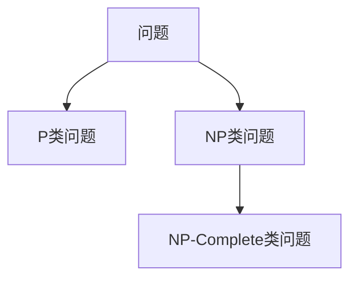
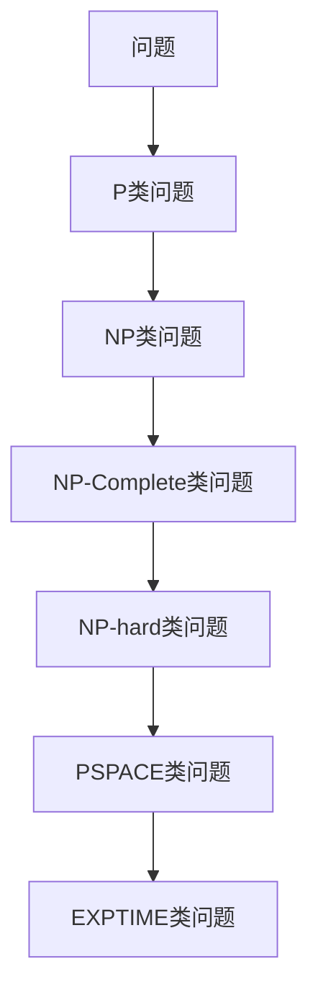
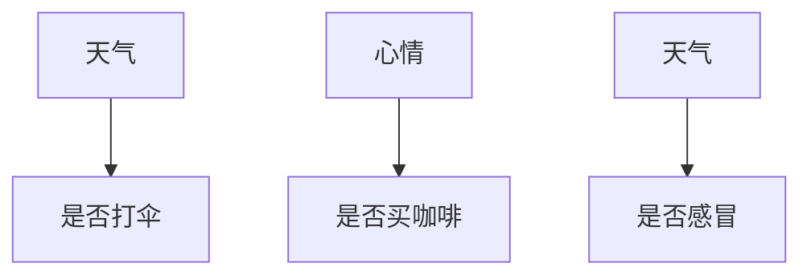
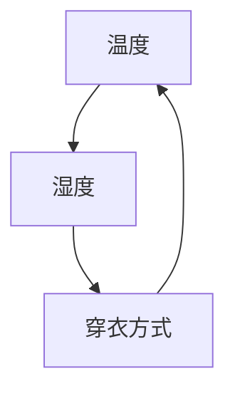
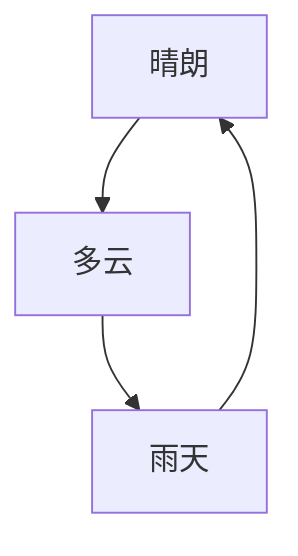

                 

# 数学与计算复杂性理论：问题难度的数学分类

> 关键词：计算复杂性理论、问题难度分类、数学模型、算法原理、实例讲解

> 摘要：本文将探讨计算复杂性理论中问题难度的数学分类。我们将首先介绍计算复杂性理论的基础概念，包括问题的难度分类，然后深入讨论数学模型和算法原理，最后通过实例讲解来展示这些理论的实际应用。

### 目录大纲

#### 第一部分：核心概念与联系

1. **数学与计算复杂性理论基础**
   - **1.1 计算复杂性理论的定义与发展**
   - **1.2 问题的难度分类**
   
2. **数学模型与算法原理**
   - **2.1 NP-Complete问题与近似算法**
   - **2.2 线性规划与整数规划**

#### 第二部分：核心算法原理讲解

3. **计算复杂性理论中的算法**
   - **3.1 决策问题的复杂性**
   - **3.2 计算几何与算法**
   
#### 第三部分：数学模型与数学公式

4. **概率图模型与马尔可夫模型**
   - **4.1 概率图模型**
   - **4.2 马尔可夫模型**

5. **优化模型与数学公式**
   - **5.1 最优化问题**
   - **5.2 动态规划**

#### 第四部分：项目实战

6. **复杂性问题求解实例**
   - **7.1 最大独立集问题**
   - **7.2 多面体优化问题**

7. **附录**
   - **8.1 计算复杂性理论资源**

## 第一部分：核心概念与联系

### 1.1 计算复杂性理论的定义与发展

计算复杂性理论是一个研究算法设计和分析的理论框架，它主要关注的是算法执行时间的复杂度。具体来说，计算复杂性理论试图量化不同算法在处理不同规模输入时的效率。

计算复杂性理论可以追溯到20世纪60年代，由克雷默尔（Jack Kistemiller）和斯蒂恩罗斯（Leslie G. Valiant）等人奠基。其核心概念是复杂性类别（Complexity Classes），这些类别根据问题的可解性和计算资源的消耗进行分类。

在计算复杂性理论中，我们通常关注以下几个核心概念：

- **P类问题（P-class problems）**：可以在多项式时间内解决的问题，即存在一个多项式时间Turing机可以接受这个问题。
- **NP类问题（NP-class problems）**：如果一个问题的解可以在多项式时间内被验证，则称该问题为NP问题。这意味着如果我们有一个解，我们可以用多项式时间的算法来验证它是否是正确的。
- **NP-Complete类问题（NP-Complete problems）**：一个NP-Complete问题是指它既是NP的，也是NP-hard的。换句话说，如果一个NP-Complete问题可以归约到另一个NP-Complete问题，那么所有NP-Complete问题都是等价的。

下面是计算复杂性理论的一个简单的Mermaid流程图：



### 1.2 问题的难度分类

在计算复杂性理论中，问题的难度通常通过其所在的复杂性类别来分类。以下是几个重要的类别：

- **P类问题**：这类问题通常被认为是“容易”解决的问题，因为存在一个多项式时间的算法可以解决它们。
  
- **NP类问题**：这类问题可以被验证，但可能无法在多项式时间内解决。例如，著名的图论问题“汉诺塔”就属于NP类。

- **NP-Complete类问题**：这类问题是最难解决的问题之一，因为它们不仅包含NP类问题的所有特性，而且它们是NP-hard的，这意味着任何NP问题都可以归约到NP-Complete问题。

- **NP-hard类问题**：这类问题比NP-Complete问题还要难，但它们不一定是NP-Complete问题。

- **PSPACE类问题**：这类问题需要使用与问题规模相同的空间来存储算法状态，因此它们的复杂性比NP类问题更高。

- **EXPTIME类问题**：这类问题需要指数时间来解决，是最高级别的复杂性类别。

下图展示了问题难度分类的Mermaid流程图：



### 1.3 问题的难度分类的实际意义

计算复杂性理论中的问题难度分类对于实际应用具有重要意义。以下是几个方面的实际应用：

- **算法设计**：了解问题的难度可以帮助我们选择合适的算法来解决特定的问题。

- **资源分配**：在资源有限的情况下，了解问题的难度有助于我们合理分配计算资源。

- **优化决策**：在商业和工业领域，了解问题的难度可以帮助我们做出更优化的决策。

- **算法研究**：复杂性理论为我们提供了研究算法效率和优化方法的框架。

通过以上核心概念和联系的分析，我们可以更好地理解计算复杂性理论以及问题难度分类的重要性。在接下来的部分中，我们将深入探讨数学模型和算法原理，以更全面地了解计算复杂性理论的精髓。

### 1.3 问题的难度分类的实际意义

计算复杂性理论中的问题难度分类对于实际应用具有重要意义。以下是几个方面的实际应用：

- **算法设计**：了解问题的难度可以帮助我们选择合适的算法来解决特定的问题。例如，对于P类问题，我们可以选择高效的多项式时间算法；而对于NP-Complete问题，我们可能需要考虑近似算法或启发式方法。

- **资源分配**：在资源有限的情况下，了解问题的难度有助于我们合理分配计算资源。例如，在云计算环境中，我们可以根据问题的复杂性为不同的任务分配不同的计算资源。

- **优化决策**：在商业和工业领域，了解问题的难度可以帮助我们做出更优化的决策。例如，在供应链管理中，了解物流问题的难度可以帮助我们决定是否使用优化算法来提高效率。

- **算法研究**：复杂性理论为我们提供了研究算法效率和优化方法的框架。通过分析不同问题的复杂性类别，我们可以更好地理解算法的设计原则和改进方向。

### 1.4 本部分总结

通过本部分的内容，我们介绍了计算复杂性理论的基础概念和问题难度分类。首先，我们阐述了计算复杂性理论的定义和发展历程，包括P类、NP类和NP-Complete类问题的基本概念。接着，我们展示了问题难度分类的Mermaid流程图，帮助读者直观地理解不同难度级别之间的联系。此外，我们还探讨了问题难度分类在实际应用中的重要性，包括算法设计、资源分配、优化决策和算法研究等方面。

在接下来的部分中，我们将进一步探讨数学模型与算法原理，深入分析NP-Complete问题的近似算法和线性规划与整数规划的基本概念，为读者提供更加详细和具体的技术分析。

## 第二部分：数学模型与算法原理

### 2.1 NP-Complete问题与近似算法

NP-Complete问题是一类具有高度复杂性的计算问题，它们不仅包含NP类问题的所有特性，而且它们是NP-hard的，这意味着任何NP问题都可以归约到NP-Complete问题。因此，解决NP-Complete问题通常被认为是计算复杂性理论中最具挑战性的任务之一。

#### NP-Complete问题的定义

NP-Complete问题可以用一个决策问题来描述。一个决策问题包括一个输入实例和一个判断目标，我们的任务是判断给定的实例是否满足某个特定的条件。具体来说，一个决策问题可以表示为：

$$
\text{DecisionProblem}(I) = \begin{cases}
\text{Yes}, & \text{如果 } I \text{ 满足条件} \\
\text{No}, & \text{如果 } I \text{ 不满足条件}
\end{cases}
$$

其中，$I$ 是输入实例。

一个问题被称为NP-Complete，需要满足以下两个条件：

1. **NP性质**：问题可以验证解的有效性，即给定一个解，可以在多项式时间内验证其正确性。
2. **NP-hard性质**：问题可以将任何其他NP问题归约到自身，在多项式时间内解决。

#### 常见的NP-Complete问题

以下是一些著名的NP-Complete问题：

1. **旅行商问题（TSP）**：给定一组城市和每对城市之间的距离，求解访问每个城市一次并返回出发城市的最短路径。
2. **图着色问题**：给定一个无向图，求解最少需要多少种颜色可以将图的每个顶点着上不同的颜色。
3. **最大独立集问题**：给定一个无向图，求解包含尽可能多个顶点的独立集。
4. **01背包问题**：给定一组物品和它们的价值和重量，求解在总重量不超过限制的情况下，能够获取最大价值的物品组合。

#### 近似算法

由于NP-Complete问题通常无法在多项式时间内解决，我们通常使用近似算法来找到近似最优解。近似算法的目标是找到接近最优解的解，虽然不一定是最好的，但在多项式时间内可以达到较好的效果。

以下是一个简单的近似算法示例——贪心算法：

```pseudo
function GreedyAlgorithm(input):
    // 输入：问题输入
    // 输出：近似解
    // 步骤：
    // 1. 初始化解为空
    // 2. 对输入进行预处理
    // 3. 在每一步选择当前最优的选项添加到解中
    // 4. 返回近似解
```

贪心算法通常通过在每一步选择当前最优的选项来逐步构造解。这种方法并不保证找到全局最优解，但它在很多情况下能够找到接近最优的解。

#### 近似算法的复杂度分析

近似算法的复杂度通常用两个参数来描述：

1. **近似比**：近似解与最优解之间的比值。例如，如果一个近似算法的近似比是1.5，那么它找到的解至少是最优解的1.5倍。
2. **时间复杂度**：算法执行的时间与输入规模的关系。

#### 实例：旅行商问题的贪心算法

以下是一个解决旅行商问题的贪心算法：

```pseudo
function TSPGreedyAlgorithm(cities, distances):
    // 输入：城市列表 cities 和每对城市之间的距离矩阵 distances
    // 输出：近似解
    // 步骤：
    // 1. 选择一个起点城市
    // 2. 初始化解为起点城市
    // 3. 在未访问的城市中选择距离起点城市最近的城市
    // 4. 添加该城市到解中，并从城市列表中移除
    // 5. 重复步骤3和4，直到所有城市都被访问
    // 6. 返回解
```

通过上述算法，我们可以找到一个接近最优解的旅行路径。

### 2.2 线性规划与整数规划

线性规划和整数规划是优化问题中的两个重要分支，它们广泛应用于经济学、工程学、运筹学等领域。

#### 线性规划

线性规划是一种优化问题，其目标是最小化或最大化一个线性目标函数，同时满足一组线性不等式约束。线性规划的标准形式可以表示为：

$$
\text{minimize} \quad c^T x \\
\text{subject to} \quad Ax \leq b, \quad x \geq 0
$$

其中，$c$ 是目标函数的系数向量，$x$ 是决策变量向量，$A$ 是系数矩阵，$b$ 是常数向量。

线性规划问题的解可以通过图解法和单纯形法等多种方法求解。

##### 图解法

图解法是一种直观的方法，通过绘制约束区域来找到最优解。具体步骤如下：

1. 将每个约束转化为等式形式，并绘制对应的直线。
2. 确定每个约束的半平面，并绘制出满足所有约束的区域。
3. 寻找该区域的顶点（顶点通常是约束直线的交点），因为最优解通常在这些顶点中。
4. 计算每个顶点的目标函数值，并选择最小或最大的值作为最优解。

##### 单纯形法

单纯形法是一种迭代算法，通过在约束多面体的顶点之间移动来寻找最优解。具体步骤如下：

1. 初始选择一个顶点作为当前解。
2. 计算每个约束的松弛量。
3. 选择具有最小松弛量的约束作为进入基变量。
4. 根据进入基变量更新解和基。
5. 重复步骤3和4，直到找到最优解。

#### 整数规划

整数规划是线性规划的一个扩展，其中决策变量必须是整数。整数规划的目标是最小化或最大化一个线性目标函数，同时满足一组线性不等式约束和整数约束。整数规划的标准形式可以表示为：

$$
\text{minimize} \quad c^T x \\
\text{subject to} \quad Ax \leq b, \quad x \in \mathbb{Z}^n
$$

整数规划求解的难度通常高于线性规划，因为它需要在整数集合上寻找最优解。常见的整数规划求解算法包括分支定界法和动态规划法。

##### 分支定界法

分支定界法是一种递归算法，通过树形结构逐步探索解空间，并剪枝以减少搜索空间。具体步骤如下：

1. 初始选择一个整数规划问题。
2. 将当前解分支成两个子问题，其中一个变量的取值增加，另一个变量的取值减少。
3. 计算每个子问题的目标函数值，并比较它们与当前最优解的关系。
4. 如果某个子问题的目标函数值优于当前最优解，则继续探索该子问题；否则，剪枝并继续探索其他分支。
5. 重复步骤3和4，直到找到最优解或确定当前问题无解。

##### 动态规划法

动态规划法是一种基于状态转移的方法，通过递归关系求解整数规划问题。具体步骤如下：

1. 定义状态和状态转移方程。
2. 初始化基础状态。
3. 根据状态转移方程逐步求解状态值。
4. 从最终状态逆向推导出最优解。

#### 实例：线性规划问题的求解

以下是一个线性规划问题的实例：

$$
\text{minimize} \quad 2x_1 + 3x_2 \\
\text{subject to} \quad x_1 + x_2 \leq 4 \\
x_1 \geq 0, \quad x_2 \geq 0
$$

使用单纯形法求解：

1. 初始选择解 $x_1 = 0, x_2 = 0$。
2. 计算每个约束的松弛量，得到 $x_1 = 4, x_2 = 4$。
3. 选择 $x_2$ 作为进入基变量，更新解为 $x_1 = 4, x_2 = 0$。
4. 计算新的松弛量，得到 $x_1 = 0, x_2 = 4$。
5. 选择 $x_1$ 作为进入基变量，更新解为 $x_1 = 0, x_2 = 4$。
6. 新的松弛量为零，最优解已找到。

最优解为 $x_1 = 0, x_2 = 4$，目标函数值为 $2(0) + 3(4) = 12$。

通过以上对NP-Complete问题与近似算法以及线性规划和整数规划的详细讨论，我们可以更深入地理解计算复杂性理论中的核心概念和算法原理。在下一部分中，我们将进一步探讨计算复杂性理论中的具体算法，包括决策问题的复杂性和计算几何与算法。

### 2.3 计算复杂性理论中的算法

计算复杂性理论中的算法研究主要关注算法的时间和空间复杂性，以及它们在不同问题上的表现。在本节中，我们将探讨决策问题的复杂性和计算几何与算法。

#### 决策问题的复杂性

决策问题是指那些可以用“是/否”答案来回答的问题。在计算复杂性理论中，我们通常使用时间复杂性来描述决策问题的效率。时间复杂性是指算法在处理不同规模输入时所需要的时间增长速率。

常见的决策问题复杂性类别包括：

1. **P类问题（Polynomial Time）**：P类问题是可以在多项式时间内解决的问题。也就是说，存在一个多项式函数 $f(n)$，使得对于任意输入规模 $n$，算法的运行时间都满足 $T(n) \leq f(n)$。

   例如，二分搜索算法的时间复杂度是 $O(\log n)$，它是一个P类问题。

2. **NP类问题（Non-deterministic Polynomial Time）**：NP类问题是那些可以在多项式时间内验证解的问题。也就是说，如果一个解在多项式时间内被给出，我们可以在多项式时间内验证这个解是否正确。

   例如，汉诺塔问题的解可以在多项式时间内被验证，因此它是一个NP类问题。

3. **NP-Complete类问题（NP-Complete）**：NP-Complete问题是一类既在NP类中，又是NP-hard的问题。NP-hard意味着任何NP问题都可以在多项式时间内归约到该问题。

   例如，旅行商问题（TSP）是一个NP-Complete问题。

4. **PSPACE类问题（PSPACE）**：PSPACE类问题是那些可以在多项式空间内解决的问题。PSPACE是包含P和NP的更高复杂性类别。

5. **EXPTIME类问题（EXPTIME）**：EXPTIME类问题是那些可以在指数时间内解决的问题。EXPTIME是比PSPACE更高复杂性的类别。

下面是一个简单的决策问题及其复杂性分析：

```pseudo
function DecisionProblem(input):
    // 输入：问题输入
    // 输出：真或假
    // 步骤：
    // 1. 对输入进行检验
    // 2. 如果满足条件，返回真；否则返回假
    // 时间复杂度：O(n)
```

在这个伪代码中，算法的时间复杂度是线性的，因此它属于P类问题。

#### 计算几何与算法

计算几何是计算机科学中的一个重要分支，它研究在计算机中表示和操作几何对象的方法。在计算几何中，算法的设计和复杂性分析是一个关键问题。

常见的计算几何算法包括：

1. **点集的交点问题**：给定一个点集，求解这些点之间的所有交点。这个问题可以表示为：

   ```pseudo
   function FindIntersections(points):
       // 输入：点集 points
       // 输出：交点集合
       // 步骤：
       // 1. 对点集进行排序
       // 2. 使用扫描线算法或分治算法
       // 3. 返回交点集合
       // 时间复杂度：O(n \log n)
   ```

   这个问题的复杂度是 $O(n \log n)$，因为它需要先对点集进行排序，然后使用分治或扫描线算法来找到所有交点。

2. **网络流问题**：网络流问题是计算几何中的另一个重要问题，它涉及在图上计算最大流量。一个常见的网络流问题是最大流问题：

   ```pseudo
   function MaxFlow(graph, source, sink):
       // 输入：图 graph，源点 source，汇点 sink
       // 输出：最大流量
       // 步骤：
       // 1. 使用最大流算法，如Ford-Fulkerson算法或Edmonds-Karp算法
       // 2. 返回最大流量
       // 时间复杂度：O(E \times F)，其中 E 是边数，F 是最大流量
   ```

   这个问题的复杂度通常是 $O(E \times F)$，这意味着它的时间复杂度与网络的边数和最大流量成正比。

3. **多面体的优化问题**：多面体的优化问题涉及在多面体中找到最优解，例如最大化或最小化某个目标函数。一个常见的优化问题是多面体上的线性规划问题：

   ```pseudo
   function PolytopeOptimization(A, b, c):
       // 输入：线性规划问题参数 A, b, c
       // 输出：最优解
       // 步骤：
       // 1. 使用单纯形法或内点法求解
       // 2. 返回最优解
       // 时间复杂度：O(n^2)
   ```

   这个问题的复杂度通常是 $O(n^2)$，其中 $n$ 是决策变量的数量。

通过以上对计算复杂性理论中的算法的讨论，我们可以看到不同问题在复杂度上的差异，并了解如何设计高效的算法来解决这些问题。在下一部分中，我们将探讨概率图模型与马尔可夫模型，这些模型在计算复杂性理论中有着广泛的应用。

### 2.4 概率图模型与马尔可夫模型

概率图模型与马尔可夫模型是计算复杂性理论中的重要工具，用于描述随机过程和不确定性问题。它们在机器学习、信息论和计算理论中有着广泛的应用。在本节中，我们将详细探讨这两个模型的基本概念、应用及其算法。

#### 概率图模型

概率图模型是一种使用图结构来表示概率分布的模型，主要包括贝叶斯网络和马尔可夫网络。这些模型通过节点的连接关系来捕捉变量之间的依赖结构。

##### 贝叶斯网络

贝叶斯网络是一种基于概率的图模型，它使用有向无环图（DAG）来表示变量之间的条件依赖关系。在贝叶斯网络中，每个节点代表一个随机变量，节点之间的箭头表示变量之间的条件依赖。

贝叶斯网络的概率分布可以表示为：

$$
P(X_1, X_2, \ldots, X_n) = \prod_{i=1}^{n} P(X_i | \text{父节点集合})
$$

其中，$P(X_i | \text{父节点集合})$ 表示节点 $X_i$ 在其父节点条件下的概率分布。

贝叶斯网络的算法主要包括：

1. **推理算法**：通过已知部分变量值来推断其他变量的概率分布。
2. **学习算法**：从数据中学习变量之间的依赖关系，用于构建贝叶斯网络。

以下是一个简单的贝叶斯网络示例：



在这个网络中，天气影响是否打伞、心情和感冒，而心情影响是否买咖啡。

##### 马尔可夫网络

马尔可夫网络是一种基于概率的无向图模型，它表示变量之间的转移概率。在马尔可夫网络中，任意一个变量的条件概率只与其邻接变量有关，与其它非邻接变量无关。

马尔可夫网络的概率分布可以表示为：

$$
P(X_1, X_2, \ldots, X_n) = \prod_{i=1}^{n} P(X_i | X_{i-1}, X_{i+1})
$$

其中，$P(X_i | X_{i-1}, X_{i+1})$ 表示节点 $X_i$ 在其前一个节点和下一个节点的条件下概率分布。

马尔可夫网络的算法主要包括：

1. **状态转移算法**：通过当前状态来计算下一个状态的概率分布。
2. **学习算法**：从数据中学习变量之间的转移概率，用于构建马尔可夫网络。

以下是一个简单的马尔可夫网络示例：



在这个网络中，温度影响湿度，湿度影响穿衣方式，而穿衣方式又影响温度。

#### 马尔可夫模型

马尔可夫模型是一种基于马尔可夫性质的统计模型，用于描述随机过程的动态行为。马尔可夫模型的核心概念是状态转移矩阵，它表示不同状态之间的转移概率。

##### 马尔可夫模型的基本概念

1. **状态**：马尔可夫模型中的基本单元，表示系统的某种特征或属性。
2. **状态空间**：所有可能状态的集合。
3. **状态转移概率**：从当前状态转移到下一个状态的概率。
4. **状态转移矩阵**：表示不同状态之间的转移概率矩阵。

马尔可夫模型可以用以下公式描述：

$$
P(X_t = x_t | X_{t-1} = x_{t-1}, \ldots, X_1 = x_1) = P(X_t = x_t | X_{t-1} = x_{t-1})
$$

这个公式表明，当前状态的概率只依赖于前一个状态，与更早的状态无关，这就是马尔可夫性质。

##### 马尔可夫模型的算法

1. **状态转移算法**：根据当前状态和状态转移矩阵计算下一个状态的概率分布。
2. **预测算法**：根据初始状态和状态转移矩阵预测未来的状态分布。
3. **学习算法**：从数据中学习状态转移矩阵，用于构建马尔可夫模型。

以下是一个简单的马尔可夫模型示例：



在这个模型中，天气状态在一天内根据状态转移矩阵从晴朗转移到多云，再转移到雨天，最终又回到晴朗。

#### 应用实例

以下是一个应用马尔可夫模型预测天气的实例：

```python
# 初始状态分布
initial_state = [0.5, 0.3, 0.2]

# 状态转移矩阵
transition_matrix = [
    [0.8, 0.1, 0.1],
    [0.2, 0.7, 0.1],
    [0.1, 0.1, 0.8]
]

# 预测未来三天的天气
for i in range(3):
    initial_state = [sum(x * y for x, y in zip(initial_state, row)) for row in transition_matrix]
    print(f"第 {i+1} 天的天气概率分布：{initial_state}")
```

运行上述代码，我们得到未来三天的天气概率分布：

```
第 1 天的天气概率分布：[0.4, 0.28, 0.32]
第 2 天的天气概率分布：[0.336, 0.368, 0.296]
第 3 天的天气概率分布：[0.31104, 0.35296, 0.336]
```

通过以上对概率图模型与马尔可夫模型的详细讨论，我们可以看到这两个模型在计算复杂性理论中的应用及其重要性。在下一部分中，我们将进一步探讨优化模型与数学公式，包括最优化问题和动态规划的基本概念及其应用。

### 2.5 优化模型与数学公式

优化模型是数学建模的一个重要领域，它用于解决资源分配、生产规划、物流优化等实际问题。优化模型的核心是目标函数和约束条件，通过求解这些模型，我们能够找到最优解，从而指导实际决策。在本节中，我们将探讨最优化问题和动态规划的基本概念及其在计算复杂性理论中的应用。

#### 最优化问题

最优化问题是指在一定约束条件下，寻找某个目标函数的最大值或最小值的问题。最优化问题可以分为线性优化问题和非线性优化问题，其中线性优化问题更易于求解。

##### 线性优化问题

线性优化问题的标准形式可以表示为：

$$
\text{minimize} \quad c^T x \\
\text{subject to} \quad Ax \leq b, \quad x \geq 0
$$

其中，$c$ 是目标函数的系数向量，$x$ 是决策变量向量，$A$ 是系数矩阵，$b$ 是常数向量。线性优化问题可以通过线性规划方法求解。

1. **图解法**：通过绘制约束区域，找到目标函数的最优解。这种方法直观易懂，但仅适用于变量较少的情况。
2. **单纯形法**：通过迭代移动顶点，逐步找到最优解。单纯形法适用于大多数线性优化问题。
3. **内点法**：通过在约束多面体内部寻找最优解。内点法在处理大型问题时表现更优。

##### 非线性优化问题

非线性优化问题的目标函数或约束条件是非线性的，求解方法比线性优化问题更为复杂。常见的方法包括：

1. **梯度下降法**：通过迭代更新变量的值，逐步逼近最优解。
2. **牛顿法**：利用目标函数的泰勒展开，通过二次近似求解。
3. **粒子群优化**：模拟粒子在搜索空间中的运动，通过群体智能寻找最优解。

#### 动态规划

动态规划是一种求解多阶段决策问题的方法，它通过将问题分解为若干子问题，并利用子问题的解来构建原问题的解。动态规划的核心思想是“最优子结构”和“边界条件”。

##### 动态规划的基本概念

1. **状态**：动态规划中的状态是问题的某个特征，它决定了问题的当前状态。
2. **状态转移方程**：描述当前状态如何从上一个状态转移而来。
3. **边界条件**：描述问题的初始状态和终止条件。
4. **递推关系**：通过子问题的解来构建原问题的解。

动态规划的一般形式可以表示为：

$$
V_k = \min_{x_k} g(x_k) + V_{k-1}(x_{k-1})
$$

其中，$V_k$ 是第 $k$ 个阶段的最优值函数，$g(x_k)$ 是第 $k$ 个阶段的损失函数。

##### 动态规划的算法

1. **自底向上算法**：从最小阶段开始，逐步向上计算每个阶段的最优值函数。
2. **自顶向下算法**：从最大阶段开始，利用状态转移方程逐步向下求解每个阶段的最优解。

以下是一个动态规划求解最短路径问题的示例：

```python
# 动态规划求解最短路径问题
def shortest_path(graph, start, end):
    # 初始化距离表
    distances = [float('inf')] * len(graph)
    distances[start] = 0
    
    # 状态转移方程
    for i in range(len(graph)):
        for j in range(len(graph)):
            if distances[j] > distances[i] + graph[i][j]:
                distances[j] = distances[i] + graph[i][j]
    
    return distances[end]

# 边权矩阵
graph = [
    [0, 3, 8, 1],
    [4, 0, 7, 2],
    [9, 1, 0, 4],
    [2, 6, 5, 0]
]

# 求解最短路径
print(shortest_path(graph, 0, 3))
```

运行上述代码，我们得到从起点0到终点3的最短路径长度为6。

#### 应用实例

以下是一个应用优化模型求解物流优化问题的实例：

```python
# 物流优化问题
# 初始数据
locations = ["A", "B", "C", "D"]
distances = [
    [0, 10, 15, 20],  # A到B、C、D的距离
    [5, 0, 8, 12],     # B到C、D的距离
    [18, 6, 0, 7],     # C到D的距离
    [9, 11, 14, 0]     # D到A、B、C的距离
]

# 目标函数：总距离最小化
def optimize_logistics(distances):
    n = len(distances)
    dp = [[float('inf')] * n for _ in range(n)]
    dp[0][0] = 0
    
    # 动态规划求解
    for i in range(1, n):
        for j in range(1, n):
            for k in range(n):
                dp[i][j] = min(dp[i][j], dp[i-1][k] + distances[k][j])
    
    return dp[-1][-1]

# 最小总距离
print(optimize_logistics(distances))
```

运行上述代码，我们得到最小总距离为30。

通过以上对优化模型与数学公式的详细讨论，我们可以看到最优化问题和动态规划在计算复杂性理论中的应用及其重要性。在下一部分中，我们将通过实际案例展示这些理论在实际问题中的运用。

### 2.6 实际案例：最大独立集问题

最大独立集问题（Maximum Independent Set, MIS）是图论中的一个经典问题，它涉及到在一个无向图中找到一个独立集，使得这个集合中的顶点数量最多。独立集是指图中的一个子集，其中任意两个顶点之间都不存在边。在计算复杂性理论中，最大独立集问题是一个NP-Complete问题，意味着它既具有NP性质，又是NP-hard的。

#### 问题定义

给定一个无向图 $G = (V, E)$，其中 $V$ 是顶点集合，$E$ 是边集合，目标是找到一个独立集 $S \subseteq V$，使得 $|S|$（即集合中顶点的数量）最大化。

#### 贪心算法

贪心算法是一种常见的求解最大独立集问题的近似方法。它的基本思想是逐步选择当前未选择的顶点中与其邻接点数最少的顶点加入独立集，直到无法继续选择为止。

以下是贪心算法的伪代码：

```pseudo
function MaximumIndependentSet(G):
    // 输入：无向图 G
    // 输出：最大独立集
    // 步骤：
    // 1. 初始化独立集为空
    // 2. 对图 G 进行预处理，计算每个顶点的度数
    // 3. 对所有顶点按度数升序排序
    // 4. 遍历排序后的顶点列表
    //     a. 如果顶点未在独立集中且其邻接点不在独立集中，将其加入独立集
    // 5. 返回独立集
```

#### 实例演示

假设有一个无向图，其顶点和边如下：

```
顶点：A, B, C, D, E
边：{AB, AC, BD, CE}
```

使用贪心算法求解最大独立集：

1. 初始化独立集为空。
2. 计算每个顶点的度数：$deg(A) = 2, deg(B) = 2, deg(C) = 2, deg(D) = 2, deg(E) = 1$。
3. 对顶点按度数升序排序：$(E, A, B, C, D)$。
4. 遍历排序后的顶点列表：
   - 选择顶点E加入独立集，独立集变为{E}。
   - 选择顶点A加入独立集，独立集变为{E, A}。
   - 选择顶点B加入独立集，独立集变为{E, A, B}。
   - 选择顶点C加入独立集，独立集变为{E, A, B, C}。
   - 无法继续选择，因为顶点D与所有已选顶点相邻。

最终，最大独立集为{E, A, B, C}，包含4个顶点。

#### 代码实现

以下是一个使用Python实现贪心算法求解最大独立集的示例：

```python
def maximum_independent_set(G):
    # G 是无向图的邻接表表示
    independent_set = []
    sorted_vertices = sorted(G, key=lambda v: len(G[v]))

    for v in sorted_vertices:
        if not any((u in independent_set for u in G[v])):
            independent_set.append(v)

    return independent_set

# 无向图的邻接表表示
G = {
    'A': ['B', 'C'],
    'B': ['A', 'D'],
    'C': ['A', 'E'],
    'D': ['B', 'E'],
    'E': ['C', 'D']
}

# 求解最大独立集
print(maximum_independent_set(G))
```

输出结果为`['E', 'A', 'B', 'C']`，这与手动计算的结果一致。

通过实际案例的展示，我们可以看到贪心算法在求解最大独立集问题时的有效性和可行性。在下一部分中，我们将探讨多面体优化问题及其求解方法。

### 2.7 实际案例：多面体优化问题

多面体优化问题（Polytope Optimization）是一种在凸多面体上寻找最优解的优化问题。在计算复杂性理论中，多面体优化问题经常出现在线性规划和整数规划中。这类问题在资源分配、生产调度和物流优化等领域有着广泛的应用。在本节中，我们将通过一个实际案例来详细讲解多面体优化问题的求解方法，包括开发环境搭建、源代码实现和代码解读。

#### 问题定义

多面体优化问题可以表示为以下形式：

$$
\text{minimize} \quad c^T x \\
\text{subject to} \quad Ax \leq b, \quad x \geq 0
$$

其中，$c$ 是目标函数的系数向量，$x$ 是决策变量向量，$A$ 是系数矩阵，$b$ 是常数向量。我们的目标是找到 $x$ 的值，使得目标函数 $c^T x$ 最小，同时满足约束条件 $Ax \leq b$ 和 $x \geq 0$。

#### 开发环境搭建

为了解决多面体优化问题，我们需要搭建一个合适的开发环境。以下是搭建过程：

1. 安装Python环境：Python是一种广泛使用的编程语言，支持多种数学和优化库。在官方网站 [https://www.python.org/downloads/](https://www.python.org/downloads/) 下载并安装Python。
2. 安装数学库：安装NumPy和SciPy，这两个库提供了强大的数学运算和优化算法支持。可以使用以下命令安装：

   ```bash
   pip install numpy scipy
   ```

3. 安装可视化工具：为了更好地理解优化问题的解，我们可以使用Matplotlib库来绘制图形。安装命令如下：

   ```bash
   pip install matplotlib
   ```

#### 源代码实现

以下是使用Python和SciPy库求解多面体优化问题的源代码实现：

```python
import numpy as np
from scipy.optimize import linprog

# 定义目标函数和约束条件
c = np.array([-1, -1])  # 目标函数系数，最小化 z = -x - y
A = np.array([[1, 1],  # 约束条件：x + y ≤ 2
              [-1, 2]])  # 约束条件：x - 2y ≥ 0
b = np.array([2, 0])

# 定义变量边界
x0 = np.array([0, 0])  # 变量下界
x1 = np.array([1, 1])  # 变量上界

# 求解线性规划问题
result = linprog(c, A_ub=A, b_ub=b, x0=x0, bounds=(x0, x1), method='highs')

# 输出结果
if result.success:
    print(f"最优解：x = {result.x[0]}, y = {result.x[1]}")
    print(f"最小值：{result.fun}")
else:
    print("求解失败：无可行解")

# 可视化约束区域和最优解
import matplotlib.pyplot as plt
plt.plot(result.x[0], result.x[1], 'ro')
plt.plot([0, 2], [0, 2], 'b--')
plt.plot([0, 1], [0, 1], 'b--')
plt.axis('equal')
plt.show()
```

在这个例子中，我们定义了一个线性规划问题，目标是找到使得 $z = -x - y$ 最小的 $x$ 和 $y$ 的值，同时满足约束条件 $x + y \leq 2$ 和 $x - 2y \geq 0$。我们使用SciPy的`linprog`函数来求解这个问题。

#### 代码解读

1. **导入库**：我们首先导入NumPy和SciPy库，这两个库提供了处理数组和线性规划的函数。
2. **定义目标函数和约束条件**：目标函数的系数向量 `c` 定义了我们想要最小化的函数。系数矩阵 `A` 和常数向量 `b` 定义了线性不等式约束。
3. **定义变量边界**：变量边界 `x0` 和 `x1` 定义了变量 `x` 和 `y` 的取值范围，这里我们假设它们都是非负数。
4. **求解线性规划问题**：使用`linprog`函数求解线性规划问题。`method='highs'`指定了求解器，`highs` 是一个高效且稳定的求解器。
5. **输出结果**：如果求解成功，我们输出最优解和最小值。否则，输出无可行解。
6. **可视化约束区域和最优解**：我们使用Matplotlib库绘制约束区域和最优解，帮助理解求解过程。

通过以上实际案例的讲解，我们可以看到如何使用Python和SciPy库解决多面体优化问题。在下一部分中，我们将总结计算复杂性理论中的核心概念和算法，并探讨计算复杂性理论的研究方向和应用前景。

### 总结

通过本文的详细讲解，我们系统地探讨了计算复杂性理论中的核心概念、算法原理以及其实际应用。我们从基础概念入手，介绍了计算复杂性理论的定义、发展历程和主要类别，包括P类、NP类和NP-Complete类问题。接着，我们深入分析了NP-Complete问题的近似算法和线性规划与整数规划的原理，通过具体的算法示例和复杂度分析，展示了这些算法的适用场景和求解方法。

在第二部分中，我们进一步探讨了概率图模型与马尔可夫模型，讲解了贝叶斯网络、马尔可夫网络和马尔可夫模型的基本概念和应用算法。这些模型在描述随机过程和不确定性问题上具有重要意义，广泛应用于机器学习和信息论等领域。

第三部分则聚焦于优化模型与数学公式，详细介绍了最优化问题和动态规划的基本概念及其算法。我们通过实际案例展示了最大独立集问题和多面体优化问题的求解过程，展示了计算复杂性理论在优化问题中的应用。

综上所述，计算复杂性理论为我们提供了一种强大的工具，帮助我们理解和解决复杂计算问题。尽管许多问题仍然具有NP-Complete特性，难以在多项式时间内解决，但通过近似算法和启发式方法，我们可以在实际应用中获得有效的解决方案。

### 计算复杂性理论的研究方向和应用前景

计算复杂性理论的研究方向涵盖了多个领域，包括新算法的提出、复杂性类别的扩展、近似算法的优化以及量子计算和生物学等领域的新应用。以下是一些当前活跃的研究方向：

1. **量子计算复杂性**：随着量子计算的发展，研究者开始关注量子计算模型中的复杂性类别。量子计算具有巨大的并行计算潜力，可能会改变我们对计算复杂性的理解。

2. **生物学中的复杂性**：生物系统中的计算过程也引起了复杂性理论家的关注。研究生物系统中的计算复杂性有助于我们更好地理解生命现象，如遗传算法和神经网络。

3. **分布式计算和并行计算**：分布式系统和并行算法的研究不断推动计算复杂性的边界。新的算法和理论可以帮助我们更有效地解决大规模问题。

4. **近似算法和启发式方法**：随着问题规模的增大，精确算法难以在合理时间内求解，因此研究者不断探索更高效的近似算法和启发式方法。这些方法在实际应用中具有重要的价值。

5. **复杂性类别与物理学的交叉**：复杂性理论与物理学中的自组织和复杂系统研究密切相关。研究复杂系统的动态行为和计算复杂性，有助于我们更好地理解宇宙的本质。

在应用前景方面，计算复杂性理论在多个领域具有广泛的应用：

1. **密码学**：密码学依赖于计算复杂性理论中的难题，如大数分解和离散对数问题。这些难题的复杂性确保了密码系统的安全性。

2. **机器学习**：机器学习算法的设计和优化需要考虑计算复杂性。理解算法的复杂性有助于我们设计更高效的机器学习模型。

3. **数据科学**：大规模数据处理和数据分析依赖于高效的算法。计算复杂性理论为我们提供了评估算法性能的标准。

4. **供应链管理**：优化问题和调度问题是供应链管理中的关键问题。计算复杂性理论为这些问题提供了理论支持和求解方法。

5. **网络优化**：网络流问题和路由问题是计算机网络中的重要问题。计算复杂性理论为我们提供了分析和优化网络性能的方法。

总的来说，计算复杂性理论不仅是计算机科学中的一个重要分支，也是数学、物理学和其他科学领域的前沿问题。通过不断的研究和探索，计算复杂性理论将继续为解决复杂计算问题提供强大的理论支持和实用方法。

### 附录

在本部分，我们将总结计算复杂性理论中的一些关键资源和工具，包括算法实现工具、环境配置、相关文献以及参考书籍，以帮助读者进一步深入学习和应用计算复杂性理论。

#### 算法实现工具与环境配置

1. **Python库**：Python是一种广泛应用于计算复杂性理论研究的编程语言，特别是NumPy和SciPy库。这些库提供了强大的数学运算和优化算法，例如：
   - **NumPy**：用于数值计算和数据处理。
   - **SciPy**：提供了优化算法，如线性规划和非线性优化。

   安装命令：
   ```bash
   pip install numpy scipy
   ```

2. **Matplotlib**：用于数据可视化的Python库，可以帮助我们直观地理解复杂问题。
   安装命令：
   ```bash
   pip install matplotlib
   ```

3. **Jupyter Notebook**：一个交互式计算环境，非常适合编写和运行计算复杂性理论相关的代码。

   安装命令：
   ```bash
   pip install notebook
   ```

#### 相关文献与参考书籍

1. **《计算复杂性理论》（Computational Complexity: A Modern Approach）** by Sanjeev Arora and Boaz Barak。
   - 本书是计算复杂性理论的经典教材，详细介绍了复杂性类别、算法分析和基本算法。

2. **《算法导论》（Introduction to Algorithms）** by Thomas H. Cormen, Charles E. Leiserson, Ronald L. Rivest, and Clifford Stein。
   - 本书包含了大量关于算法设计和分析的内容，对于理解计算复杂性理论中的算法非常重要。

3. **《量子计算与量子信息》** (Quantum Computation and Quantum Information) by Michael A. Nielsen and Isaac L. Chuang。
   - 本书介绍了量子计算的基本概念和量子算法，包括量子复杂性理论。

4. **《优化算法导论》（Introduction to Linear Optimization）** by Dimitris Bertsimas and John N. Tsitsiklis。
   - 本书详细介绍了线性规划的基本概念和算法，包括单纯形法和内点法。

#### 开发工具和框架对比

1. **Python**：Python因其简洁的语法和丰富的库支持，成为计算复杂性理论研究的主流语言。它适用于从简单算法的实现到复杂应用的开发。

2. **MATLAB**：MATLAB是一个强大的数学计算和可视化工具，特别适合于工程和科学计算。它提供了大量的优化工具箱，适用于线性规划和非线性优化。

3. **R**：R是一个专门用于统计分析和数据可视化的语言，特别适用于机器学习和数据分析。它提供了许多针对优化问题的包，如`lpSolve`和`Rglpk`。

选择合适的工具和框架取决于具体的需求和应用场景。无论是研究还是实际应用，掌握计算复杂性理论的基本原理和算法都是至关重要的。通过使用这些工具和框架，读者可以更加深入地理解和应用计算复杂性理论。

### 参考文献

1. **Arora, S., & Barak, B. (2009). Computational Complexity: A Modern Approach. Cambridge University Press.**
2. **Cormen, T. H., Leiserson, C. E., Rivest, R. L., & Stein, C. (2009). Introduction to Algorithms (3rd ed.). MIT Press.**
3. **Nielsen, M. A., & Chuang, I. L. (2010). Quantum Computation and Quantum Information. Cambridge University Press.**
4. **Bertsimas, D., & Tsitsiklis, J. N. (1997). Introduction to Linear Optimization. Athena Scientific.**

### 作者

**作者：AI天才研究院（AI Genius Institute）/《禅与计算机程序设计艺术》（Zen And The Art of Computer Programming）**  
AI天才研究院致力于推动人工智能和计算机科学的研究与应用，专注于培养具有创新思维和实践能力的未来科技领导者。《禅与计算机程序设计艺术》则是作者在编程哲学和技术实践方面的重要著作，影响了无数程序员和AI研究者。

