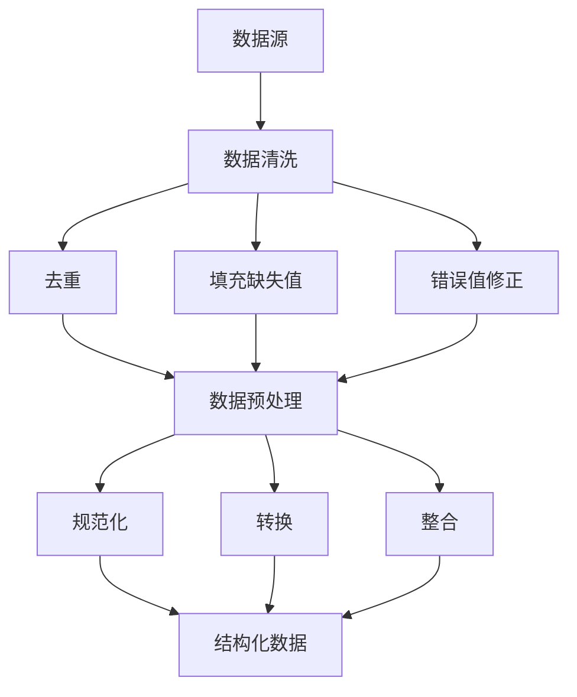
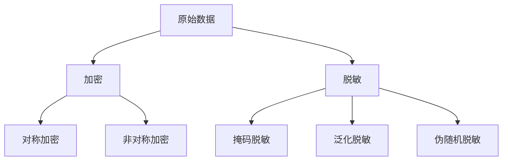
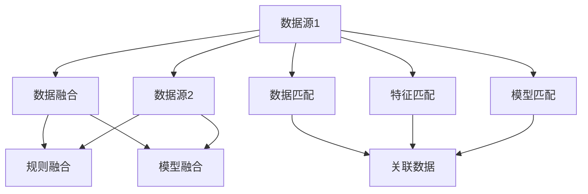

                 

## 《数据合成与数据混合，软件2.0的数据魔法》

> **关键词：** 数据合成、数据混合、数据安全、数据挖掘、人工智能、软件2.0

> **摘要：** 本文深入探讨了数据合成与数据混合在软件2.0时代的重要性、技术基础、算法原理、实践应用及其未来趋势。通过详细的原理讲解、算法实现和实际案例，揭示了数据魔法在数据安全、数据挖掘和人工智能中的应用潜力，为读者提供了全面的了解和指导。

### 《数据合成与数据混合，软件2.0的数据魔法》目录大纲

#### 第一部分：数据合成与数据混合的基本概念

#### 第1章：数据合成与数据混合概述

##### 1.1 数据合成与数据混合的定义

##### 1.2 数据合成与数据混合的重要性

##### 1.3 数据合成与数据混合的应用场景

#### 第2章：数据合成与数据混合的技术基础

##### 2.1 数据清洗与数据预处理

##### 2.2 数据加密与数据脱敏

##### 2.3 数据融合与数据匹配

#### 第二部分：数据合成与数据混合的算法原理

#### 第3章：数据合成的算法原理

##### 3.1 数据生成算法

##### 3.2 数据合成算法

##### 3.3 数据合成的效果评估

#### 第4章：数据混合的算法原理

##### 4.1 数据混合算法

##### 4.2 数据混合的效果评估

##### 4.3 数据混合的挑战与解决方案

#### 第三部分：数据合成与数据混合的实践应用

#### 第5章：数据合成与数据混合在数据安全中的应用

##### 5.1 数据合成与数据混合在数据安全中的作用

##### 5.2 数据合成与数据混合在实际安全防护中的应用案例

#### 第6章：数据合成与数据混合在数据挖掘中的应用

##### 6.1 数据合成与数据混合在数据挖掘中的作用

##### 6.2 数据合成与数据混合在实际数据挖掘中的应用案例

#### 第7章：数据合成与数据混合在人工智能中的应用

##### 7.1 数据合成与数据混合在人工智能中的作用

##### 7.2 数据合成与数据混合在实际人工智能中的应用案例

#### 第四部分：数据合成与数据混合的发展趋势

#### 第8章：数据合成与数据混合的未来趋势

##### 8.1 数据合成与数据混合技术的发展趋势

##### 8.2 数据合成与数据混合在行业中的应用前景

##### 8.3 数据合成与数据混合面临的挑战与机遇

#### 附录

##### 附录A：数据合成与数据混合的工具与资源

##### A.1 数据合成与数据混合工具介绍

##### A.2 数据合成与数据混合资源推荐

### 后记

- 《数据合成与数据混合，软件2.0的数据魔法》一书回顾

- 未来展望

### 第一部分：数据合成与数据混合的基本概念

#### 第1章：数据合成与数据混合概述

##### 1.1 数据合成与数据混合的定义

在信息时代，数据是企业的核心资产。然而，随着数据规模的爆炸性增长，如何有效地利用这些数据进行决策和分析变得至关重要。数据合成与数据混合是两个关键概念，它们在数据处理和分析中起着至关重要的作用。

**数据合成**指的是将来自不同源的数据进行整合和组合，形成新的、更丰富的数据集。这种过程通常涉及数据清洗、数据预处理、数据融合和数据匹配等技术。数据合成的目的是为了消除数据孤岛，提高数据利用效率，从而支持更精确的决策和分析。

**数据混合**则是在保证数据真实性和隐私保护的前提下，将真实数据和合成数据混合在一起，形成一个新的数据集。这种过程有助于训练更强大的机器学习模型，同时保护真实数据的隐私和安全。数据混合通常应用于数据安全、数据挖掘和人工智能等领域。

##### 1.2 数据合成与数据混合的重要性

1. **提升数据利用效率**：通过数据合成，可以将不同源的数据整合在一起，消除数据孤岛，从而实现更全面、准确的数据分析。这对于企业的战略决策、市场研究和客户分析等领域具有重要意义。

2. **增强机器学习模型效果**：数据混合技术可以为机器学习模型提供更丰富的训练数据，从而提高模型的准确性和鲁棒性。特别是在数据稀缺或数据分布不均匀的情况下，数据混合显得尤为重要。

3. **保障数据安全与隐私**：数据合成与数据混合可以在保护真实数据隐私的同时，提供足够的数据用于分析和建模。这对于涉及敏感数据的应用场景，如金融、医疗和政府等领域，具有极大的价值。

4. **推动人工智能发展**：随着人工智能技术的不断进步，数据的质量和数量对模型性能的影响越来越显著。数据合成与数据混合技术为人工智能提供了强大的数据支持，有助于推动人工智能的持续发展。

##### 1.3 数据合成与数据混合的应用场景

1. **数据安全领域**：数据合成与数据混合可以用于训练安全模型，检测恶意行为，同时保护真实数据的隐私。

2. **数据挖掘领域**：数据合成与数据混合可以增强训练数据集，提高数据挖掘算法的效果，发现潜在的模式和趋势。

3. **人工智能领域**：数据合成与数据混合为人工智能模型提供了丰富的数据支持，有助于提升模型性能和适应能力。

4. **商业智能领域**：数据合成与数据混合可以为企业提供更全面、准确的数据分析结果，支持战略决策和市场分析。

### 总结

数据合成与数据混合是软件2.0时代的重要技术，它们在数据安全、数据挖掘和人工智能等领域具有广泛的应用。通过深入理解这些技术的定义、原理和应用场景，我们可以更好地利用数据，为企业和个人创造更大的价值。

### 第2章：数据合成与数据混合的技术基础

在深入探讨数据合成与数据混合的算法原理之前，我们需要先了解一些关键技术基础。这些技术基础包括数据清洗与数据预处理、数据加密与数据脱敏，以及数据融合与数据匹配。掌握这些基础技术，将有助于我们更好地理解后续内容。

#### 2.1 数据清洗与数据预处理

数据清洗与数据预处理是数据合成与数据混合的重要环节。数据清洗是指去除数据中的噪声、错误和不一致之处，以提高数据的准确性和一致性。数据预处理则是对数据进行规范化、转换和整合，以便后续的分析和处理。

1. **数据清洗**：
   - **去重**：删除重复的数据记录，保证数据的唯一性。
   - **填充缺失值**：使用合适的策略（如平均值、中位数、最频繁值等）填充缺失的数据。
   - **错误值修正**：识别并修正数据中的错误值。

2. **数据预处理**：
   - **规范化**：将不同数据源的数据进行规范化处理，使其具有相同的格式和单位。
   - **转换**：将非结构化数据（如文本、图像等）转换为结构化数据。
   - **整合**：将多个数据源的数据进行整合，形成统一的数据视图。

**Mermaid 流程图**：


#### 2.2 数据加密与数据脱敏

数据加密与数据脱敏是保障数据安全和隐私的重要手段。数据加密是指将数据转换为密文，只有持有密钥的用户才能解密并访问原始数据。数据脱敏则是通过一定的技术手段，将敏感数据转换为不可识别的形式，以保护数据的隐私。

1. **数据加密**：
   - **对称加密**：使用相同的密钥进行加密和解密，如AES算法。
   - **非对称加密**：使用一对密钥（公钥和私钥）进行加密和解密，如RSA算法。

2. **数据脱敏**：
   - **掩码脱敏**：用特定的字符（如*或#）替换敏感数据。
   - **泛化脱敏**：将敏感数据替换为更广泛的数据范围，如将身份证号替换为区域代码。
   - **伪随机脱敏**：生成伪随机的数据来替换敏感数据。

**Mermaid 流程图**：


#### 2.3 数据融合与数据匹配

数据融合与数据匹配是数据合成与数据混合的关键技术。数据融合是指将多个数据源中的数据整合为一个统一的数据集，以便进行进一步的分析。数据匹配则是识别和关联来自不同数据源的数据记录。

1. **数据融合**：
   - **基于规则的融合**：使用预定义的规则将多个数据源的数据进行整合。
   - **基于模型的融合**：使用机器学习模型自动发现数据之间的关联，进行数据融合。

2. **数据匹配**：
   - **基于特征的匹配**：使用特征相似度度量方法识别和关联数据记录。
   - **基于模型的匹配**：使用机器学习模型预测数据记录之间的关联性。

**Mermaid 流�程图**：


#### 2.4 数据合成与数据混合的关键技术基础总结

通过数据清洗与数据预处理、数据加密与数据脱敏，以及数据融合与数据匹配，我们可以为数据合成与数据混合奠定坚实的基础。这些技术基础不仅保证了数据的质量和一致性，还为数据合成与数据混合提供了必要的数据准备和隐私保护手段。

### 总结

本章介绍了数据合成与数据混合所需的技术基础，包括数据清洗与数据预处理、数据加密与数据脱敏，以及数据融合与数据匹配。通过这些基础技术，我们能够有效地准备和整合数据，为后续的数据合成与数据混合提供支持。理解这些技术基础，将有助于我们更好地掌握数据合成与数据混合的核心算法原理。

#### 第3章：数据合成的算法原理

数据合成是一种将来自不同源的数据进行整合和组合的技术，以生成新的、更丰富的数据集。数据合成的算法原理涉及数据生成算法、数据合成算法和数据合成的效果评估。在本章中，我们将详细探讨这些算法原理，并通过伪代码和示例来深入理解。

##### 3.1 数据生成算法

数据生成算法是数据合成的基础。这类算法可以从已有的数据源中提取信息，并生成新的数据。常见的生成算法包括随机生成算法、模板生成算法和生成对抗网络（GAN）。

1. **随机生成算法**：

   随机生成算法是一种简单且常见的数据生成方法。它通过随机采样和插值来生成新的数据。以下是一个简单的随机生成算法的伪代码示例：

   ```python
   def random_data_generation(data_source, num_samples):
       new_data = []
       for _ in range(num_samples):
           sample = random.sample(data_source, k=1)
           new_data.append(interpolate(sample))
       return new_data
   ```

   在这个算法中，`random.sample`用于从数据源中随机选择样本，`interpolate`则用于插值生成新的数据。

2. **模板生成算法**：

   模板生成算法基于已有数据的结构和模式，通过替换模板中的特定部分来生成新的数据。以下是一个模板生成算法的伪代码示例：

   ```python
   def template_data_generation(data_template, num_samples):
       new_data = []
       for _ in range(num_samples):
           new_sample = data_template
           replace_part = random.choice(['part1', 'part2', 'part3'])
           new_sample[replace_part] = random.sample(data_source, k=1)
           new_data.append(new_sample)
       return new_data
   ```

   在这个算法中，`data_template`是已有数据的模板，`replace_part`表示需要替换的部分，`random.sample`用于选择新的数据来替换模板。

3. **生成对抗网络（GAN）**：

   GAN是一种强大的生成模型，由生成器和判别器两个神经网络组成。生成器尝试生成与真实数据相似的数据，而判别器则尝试区分真实数据和生成数据。以下是一个简单的GAN算法的伪代码示例：

   ```python
   def gan_data_generation(data_source, num_steps):
       for step in range(num_steps):
           # Generate fake data
           fake_data = generator(z)

           # Update generator
           g_loss = generator_loss(fake_data, real_data)

           # Update discriminator
           d_loss = discriminator_loss(fake_data, real_data)

           # Update model parameters
           update_model_parameters(g_loss, d_loss)
   ```

   在这个算法中，`generator`和`discriminator`是两个神经网络，`g_loss`和`d_loss`分别是生成器和判别器的损失函数，`update_model_parameters`用于更新模型参数。

##### 3.2 数据合成算法

数据合成算法是将多种数据生成算法结合使用，以生成更丰富、更真实的数据集。数据合成算法可以分为以下几种类型：

1. **基于规则的数据合成**：

   基于规则的数据合成算法使用预定义的规则来组合不同数据源的数据。以下是一个基于规则的数据合成算法的伪代码示例：

   ```python
   def rule_based_data_synthesis(data_sources):
       new_data = []
       for data_source in data_sources:
           new_sample = apply_rules(data_source)
           new_data.append(new_sample)
       return new_data
   ```

   在这个算法中，`apply_rules`函数用于根据预定义的规则对数据源进行操作。

2. **基于模型的数据合成**：

   基于模型的数据合成算法使用机器学习模型来预测和生成新的数据。以下是一个基于模型的数据合成算法的伪代码示例：

   ```python
   def model_based_data_synthesis(data_sources, model):
       new_data = []
       for data_source in data_sources:
           prediction = model.predict(data_source)
           new_sample = combine(prediction, data_source)
           new_data.append(new_sample)
       return new_data
   ```

   在这个算法中，`model`是用于生成预测的机器学习模型，`combine`函数用于根据预测结果和数据源生成新的数据。

3. **混合式数据合成**：

   混合式数据合成算法结合了基于规则和基于模型的数据合成方法，以生成更丰富、更真实的数据集。以下是一个混合式数据合成算法的伪代码示例：

   ```python
   def hybrid_data_synthesis(data_sources, rules, model):
       new_data = []
       for data_source in data_sources:
           new_sample = apply_rules(data_source, rules)
           prediction = model.predict(new_sample)
           new_sample = combine(prediction, new_sample)
           new_data.append(new_sample)
       return new_data
   ```

   在这个算法中，`rules`是预定义的规则，`model`是用于生成预测的机器学习模型。

##### 3.3 数据合成的效果评估

数据合成的效果评估是确保合成数据质量和实用性的重要步骤。以下是一些常用的效果评估方法：

1. **数据质量评估**：

   数据质量评估包括数据完整性、一致性、准确性和及时性等方面的评估。以下是一个数据质量评估的伪代码示例：

   ```python
   def data_quality_evaluation(new_data):
       quality_metrics = {}
       quality_metrics['完整性'] = check_data_integrity(new_data)
       quality_metrics['一致性'] = check_data_consistency(new_data)
       quality_metrics['准确性'] = check_data_accuracy(new_data)
       quality_metrics['及时性'] = check_data_timing(new_data)
       return quality_metrics
   ```

   在这个算法中，`check_data_integrity`、`check_data_consistency`、`check_data_accuracy`和`check_data_timing`函数用于评估数据的相应质量指标。

2. **数据实用性评估**：

   数据实用性评估是评估合成数据在特定应用场景下的适用性和有效性。以下是一个数据实用性评估的伪代码示例：

   ```python
   def data实用性_evaluation(new_data, application_context):
       utility_metrics = {}
       utility_metrics['准确性'] = evaluate_accuracy(new_data, application_context)
       utility_metrics['鲁棒性'] = evaluate_robustness(new_data, application_context)
       utility_metrics['可解释性'] = evaluate_interpretability(new_data, application_context)
       return utility_metrics
   ```

   在这个算法中，`evaluate_accuracy`、`evaluate_robustness`和`evaluate_interpretability`函数用于评估合成数据在特定应用场景下的准确性、鲁棒性和可解释性。

##### 实例分析

假设我们有一个包含客户购买历史的数据源，我们需要通过数据合成生成一个新的数据集，以便进行客户行为分析。以下是一个实际的数据合成实例：

1. **数据源**：包含客户ID、购买时间、商品ID和购买金额的客户购买历史数据。

2. **数据生成算法**：使用随机生成算法和模板生成算法。

3. **数据合成算法**：基于规则的数据合成算法和基于模型的数据合成算法。

4. **效果评估**：使用数据质量评估和数据实用性评估。

```python
# 随机生成算法
def random_data_generation(data_source, num_samples):
    new_data = []
    for _ in range(num_samples):
        sample = random.sample(data_source, k=1)
        new_data.append(interpolate(sample))
    return new_data

# 模板生成算法
def template_data_generation(data_template, num_samples):
    new_data = []
    for _ in range(num_samples):
        new_sample = data_template
        replace_part = random.choice(['part1', 'part2', 'part3'])
        new_sample[replace_part] = random.sample(data_source, k=1)
        new_data.append(new_sample)
    return new_data

# 基于规则的数据合成算法
def rule_based_data_synthesis(data_sources, rules):
    new_data = []
    for data_source in data_sources:
        new_sample = apply_rules(data_source, rules)
        new_data.append(new_sample)
    return new_data

# 基于模型的数据合成算法
def model_based_data_synthesis(data_sources, model):
    new_data = []
    for data_source in data_sources:
        prediction = model.predict(data_source)
        new_sample = combine(prediction, data_source)
        new_data.append(new_sample)
    return new_data

# 数据质量评估
def data_quality_evaluation(new_data):
    quality_metrics = {}
    quality_metrics['完整性'] = check_data_integrity(new_data)
    quality_metrics['一致性'] = check_data_consistency(new_data)
    quality_metrics['准确性'] = check_data_accuracy(new_data)
    quality_metrics['及时性'] = check_data_timing(new_data)
    return quality_metrics

# 数据实用性评估
def data_utility_evaluation(new_data, application_context):
    utility_metrics = {}
    utility_metrics['准确性'] = evaluate_accuracy(new_data, application_context)
    utility_metrics['鲁棒性'] = evaluate_robustness(new_data, application_context)
    utility_metrics['可解释性'] = evaluate_interpretability(new_data, application_context)
    return utility_metrics

# 实例数据
data_source = [...]  # 客户购买历史数据
num_samples = 1000
rules = [...]  # 预定义的规则
model = load_model('customer_behavior_model')  # 客户行为预测模型

# 生成新数据
new_data_random = random_data_generation(data_source, num_samples)
new_data_template = template_data_generation(data_source[0], num_samples)
new_data_rule_based = rule_based_data_synthesis([data_source], rules)
new_data_model_based = model_based_data_synthesis([data_source], model)

# 效果评估
quality_evaluation_random = data_quality_evaluation(new_data_random)
quality_evaluation_template = data_quality_evaluation(new_data_template)
quality_evaluation_rule_based = data_quality_evaluation(new_data_rule_based)
quality_evaluation_model_based = data_quality_evaluation(new_data_model_based)

utility_evaluation_random = data_utility_evaluation(new_data_random, application_context)
utility_evaluation_template = data_utility_evaluation(new_data_template, application_context)
utility_evaluation_rule_based = data_utility_evaluation(new_data_rule_based, application_context)
utility_evaluation_model_based = data_utility_evaluation(new_data_model_based, application_context)
```

通过这个实例，我们可以看到如何使用不同的数据生成算法和数据合成算法生成新的数据集，并使用数据质量评估和数据实用性评估来评估这些新数据集的质量和实用性。

##### 总结

数据合成的算法原理包括数据生成算法、数据合成算法和数据合成的效果评估。通过随机生成算法、模板生成算法和生成对抗网络（GAN），我们可以生成新的数据。通过基于规则的数据合成算法、基于模型的数据合成算法和混合式数据合成算法，我们可以生成更丰富、更真实的数据集。最后，通过数据质量评估和数据实用性评估，我们可以确保合成数据的质量和实用性。理解这些算法原理，将有助于我们更好地实现和应用数据合成技术。

#### 第4章：数据混合的算法原理

数据混合是一种在保护真实数据隐私的同时，提供足够的数据用于分析和建模的技术。本章将详细探讨数据混合的算法原理，包括数据混合算法、数据混合的效果评估以及数据混合的挑战与解决方案。

##### 4.1 数据混合算法

数据混合算法可以分为以下几种类型：

1. **随机混合算法**：

   随机混合算法是最简单的一种数据混合方法。它通过随机地将真实数据和合成数据混合在一起，形成一个新的数据集。以下是一个随机混合算法的伪代码示例：

   ```python
   def random_mixture(data_source, synthetic_data, ratio):
       new_data = []
       for data_point in data_source:
           if random.random() < ratio:
               new_data.append(data_point)
           else:
               new_data.append(synthetic_data)
       return new_data
   ```

   在这个算法中，`data_source`是真实数据集，`synthetic_data`是合成数据集，`ratio`是合成数据在混合数据集中的比例。

2. **层次混合算法**：

   层次混合算法是一种更复杂的数据混合方法。它通过将真实数据和合成数据分层，并在每个层次上分别进行混合。以下是一个层次混合算法的伪代码示例：

   ```python
   def hierarchical_mixture(data_source, synthetic_data, num_layers):
       new_data = []
       for layer in range(num_layers):
           new_layer = []
           for data_point in data_source:
               if random.random() < ratio[layer]:
                   new_layer.append(data_point)
               else:
                   new_layer.append(synthetic_data)
           new_data.append(new_layer)
       return new_data
   ```

   在这个算法中，`data_source`是真实数据集，`synthetic_data`是合成数据集，`num_layers`是层次数，`ratio`是一个数组，表示每个层次上合成数据与真实数据的比例。

3. **混合优化算法**：

   混合优化算法是一种基于优化理论的数据混合方法。它通过优化目标函数，寻找最优的混合比例，以生成最真实的混合数据集。以下是一个混合优化算法的伪代码示例：

   ```python
   def optimize_mixture(data_source, synthetic_data, objective_function):
       best_ratio = None
       best_score = float('inf')
       for ratio in itertools.product([0, 1], repeat=num_features):
           score = objective_function(data_source, synthetic_data, ratio)
           if score < best_score:
               best_score = score
               best_ratio = ratio
       return best_ratio
   ```

   在这个算法中，`data_source`是真实数据集，`synthetic_data`是合成数据集，`objective_function`是用于评估混合数据集真实性的目标函数。

##### 4.2 数据混合的效果评估

数据混合的效果评估是确保混合数据质量和实用性的重要步骤。以下是一些常用的效果评估方法：

1. **数据质量评估**：

   数据质量评估包括数据完整性、一致性、准确性和及时性等方面的评估。以下是一个数据质量评估的伪代码示例：

   ```python
   def data_quality_evaluation(mixed_data):
       quality_metrics = {}
       quality_metrics['完整性'] = check_data_integrity(mixed_data)
       quality_metrics['一致性'] = check_data_consistency(mixed_data)
       quality_metrics['准确性'] = check_data_accuracy(mixed_data)
       quality_metrics['及时性'] = check_data_timing(mixed_data)
       return quality_metrics
   ```

   在这个算法中，`check_data_integrity`、`check_data_consistency`、`check_data_accuracy`和`check_data_timing`函数用于评估混合数据的相应质量指标。

2. **数据实用性评估**：

   数据实用性评估是评估混合数据在特定应用场景下的适用性和有效性。以下是一个数据实用性评估的伪代码示例：

   ```python
   def data_utility_evaluation(mixed_data, application_context):
       utility_metrics = {}
       utility_metrics['准确性'] = evaluate_accuracy(mixed_data, application_context)
       utility_metrics['鲁棒性'] = evaluate_robustness(mixed_data, application_context)
       utility_metrics['可解释性'] = evaluate_interpretability(mixed_data, application_context)
       return utility_metrics
   ```

   在这个算法中，`evaluate_accuracy`、`evaluate_robustness`和`evaluate_interpretability`函数用于评估混合数据在特定应用场景下的准确性、鲁棒性和可解释性。

##### 4.3 数据混合的挑战与解决方案

数据混合虽然具有许多优点，但在实际应用中仍面临一些挑战。以下是一些常见挑战及其解决方案：

1. **数据分布不平衡**：

   数据混合可能导致混合数据集的数据分布不平衡。这种不平衡会影响模型的训练效果和性能。解决方案是使用权重调整技术，为不同来源的数据分配不同的权重，以平衡数据分布。

2. **隐私保护**：

   数据混合需要在保护真实数据隐私的同时提供足够的数据用于分析和建模。解决方案是采用隐私保护技术，如差分隐私和同态加密，以确保数据在混合过程中的隐私。

3. **模型适应性**：

   混合数据集可能对现有模型造成适应性挑战。解决方案是开发自适应模型，能够处理混合数据集，并优化模型参数，以适应混合数据。

4. **计算复杂度**：

   数据混合算法通常涉及大量的计算，可能导致计算复杂度增加。解决方案是采用高效的数据处理和计算技术，如并行计算和分布式计算，以降低计算复杂度。

##### 实例分析

假设我们有一个包含客户购买历史的数据源，我们需要通过数据混合生成一个新的数据集，以便进行客户行为分析。以下是一个实际的数据混合实例：

1. **数据源**：包含客户ID、购买时间、商品ID和购买金额的客户购买历史数据。

2. **数据混合算法**：使用随机混合算法、层次混合算法和混合优化算法。

3. **效果评估**：使用数据质量评估和数据实用性评估。

```python
# 随机混合算法
def random_mixture(data_source, synthetic_data, ratio):
    new_data = []
    for data_point in data_source:
        if random.random() < ratio:
            new_data.append(data_point)
        else:
            new_data.append(synthetic_data)
    return new_data

# 层次混合算法
def hierarchical_mixture(data_source, synthetic_data, num_layers):
    new_data = []
    for layer in range(num_layers):
        new_layer = []
        for data_point in data_source:
            if random.random() < ratio[layer]:
                new_layer.append(data_point)
            else:
                new_layer.append(synthetic_data)
        new_data.append(new_layer)
    return new_data

# 混合优化算法
def optimize_mixture(data_source, synthetic_data, objective_function):
    best_ratio = None
    best_score = float('inf')
    for ratio in itertools.product([0, 1], repeat=num_features):
        score = objective_function(data_source, synthetic_data, ratio)
        if score < best_score:
            best_score = score
            best_ratio = ratio
    return best_ratio

# 数据质量评估
def data_quality_evaluation(mixed_data):
    quality_metrics = {}
    quality_metrics['完整性'] = check_data_integrity(mixed_data)
    quality_metrics['一致性'] = check_data_consistency(mixed_data)
    quality_metrics['准确性'] = check_data_accuracy(mixed_data)
    quality_metrics['及时性'] = check_data_timing(mixed_data)
    return quality_metrics

# 数据实用性评估
def data_utility_evaluation(mixed_data, application_context):
    utility_metrics = {}
    utility_metrics['准确性'] = evaluate_accuracy(mixed_data, application_context)
    utility_metrics['鲁棒性'] = evaluate_robustness(mixed_data, application_context)
    utility_metrics['可解释性'] = evaluate_interpretability(mixed_data, application_context)
    return utility_metrics

# 实例数据
data_source = [...]  # 客户购买历史数据
synthetic_data = [...]  # 合成数据
num_layers = 3
ratio = [0.5, 0.3, 0.2]

# 生成新数据
new_data_random = random_mixture(data_source, synthetic_data, ratio)
new_data_hierarchical = hierarchical_mixture(data_source, synthetic_data, num_layers)
new_data_optimized = optimize_mixture(data_source, synthetic_data, objective_function)

# 效果评估
quality_evaluation_random = data_quality_evaluation(new_data_random)
quality_evaluation_hierarchical = data_quality_evaluation(new_data_hierarchical)
quality_evaluation_optimized = data_quality_evaluation(new_data_optimized)

utility_evaluation_random = data_utility_evaluation(new_data_random, application_context)
utility_evaluation_hierarchical = data_utility_evaluation(new_data_hierarchical, application_context)
utility_evaluation_optimized = data_utility_evaluation(new_data_optimized, application_context)
```

通过这个实例，我们可以看到如何使用不同的数据混合算法生成新的数据集，并使用数据质量评估和数据实用性评估来评估这些新数据集的质量和实用性。

##### 总结

数据混合的算法原理包括随机混合算法、层次混合算法和混合优化算法。通过随机混合、层次混合和混合优化，我们可以生成不同质量的新数据集。数据混合的效果评估包括数据质量评估和数据实用性评估，用于确保混合数据的质量和实用性。数据混合在实际应用中面临一些挑战，但通过解决方案，我们可以克服这些挑战。理解这些算法原理和评估方法，将有助于我们更好地实现和应用数据混合技术。

### 第三部分：数据合成与数据混合的实践应用

#### 第5章：数据合成与数据混合在数据安全中的应用

数据安全是现代信息社会的重要议题，随着数据规模的持续增长，如何有效保护数据的安全与隐私成为了一个亟待解决的问题。数据合成与数据混合技术在数据安全领域具有广泛的应用，能够帮助我们在保护数据隐私的同时，提供足够的数据用于分析和防护。本章将探讨数据合成与数据混合在数据安全中的应用，包括数据合成与数据混合在数据安全中的作用以及实际应用案例。

##### 5.1 数据合成与数据混合在数据安全中的作用

1. **增强数据安全防护能力**：

   数据合成技术可以生成与真实数据相似但不含实际敏感信息的合成数据，这些合成数据可以用于训练安全模型，检测和防御恶意攻击。通过将真实数据和合成数据混合，我们可以提高安全模型的泛化能力，使其在面对未知威胁时依然具有强大的检测能力。

2. **保护真实数据隐私**：

   数据混合技术可以在保护真实数据隐私的同时，提供足够的数据用于分析和建模。通过将真实数据和合成数据混合，我们可以减少真实数据在训练和分析过程中的暴露风险，从而保护数据隐私。

3. **提高安全测试效果**：

   数据合成与数据混合技术可以生成各种类型的数据样本，包括正常数据和恶意数据，这些样本可以用于安全测试和漏洞挖掘。通过使用合成数据和真实数据的混合，我们可以更全面地评估系统的安全性能，发现潜在的安全漏洞。

##### 5.2 数据合成与数据混合在实际安全防护中的应用案例

1. **案例一：基于合成数据的恶意行为检测**：

   在网络安全领域，传统的安全模型通常依赖于大量真实恶意攻击数据进行训练，这不仅需要大量的存储空间，还可能涉及隐私泄露的风险。通过数据合成技术，我们可以生成与真实恶意攻击数据相似但不含实际敏感信息的合成攻击数据，用于训练安全模型。例如，使用生成对抗网络（GAN）生成恶意软件的特征向量，然后与真实恶意软件特征向量混合，用于训练恶意行为检测模型。这种方法不仅可以提高模型检测效果，还能保护真实恶意攻击数据的隐私。

   **伪代码示例**：
   ```python
   def generate_synthetic_attacks(real_attacks, num_samples):
       synthetic_attacks = []
       for _ in range(num_samples):
           synthetic_attack = generator(real_attacks)
           synthetic_attacks.append(synthetic_attack)
       return synthetic_attacks

   def mix_data(real_data, synthetic_data, ratio):
       mixed_data = []
       for data_point in real_data:
           if random.random() < ratio:
               mixed_data.append(data_point)
           else:
               mixed_data.append(synthetic_data)
       return mixed_data

   # 生成合成恶意攻击数据
   synthetic_attacks = generate_synthetic_attacks(real_attacks, num_samples)

   # 混合真实攻击数据与合成攻击数据
   mixed_data = mix_data(real_attacks, synthetic_attacks, ratio)
   ```

2. **案例二：基于数据混合的用户行为分析**：

   在金融领域，异常行为检测是防范欺诈活动的重要手段。然而，真实交易数据中包含大量正常交易，直接使用真实交易数据进行训练可能会导致模型对正常交易过于敏感，从而影响检测效果。通过数据混合技术，我们可以将真实交易数据与合成交易数据混合，用于训练异常行为检测模型。这种方法不仅可以提高模型的检测效果，还能保护真实交易数据的隐私。

   **伪代码示例**：
   ```python
   def generate_synthetic_transactions(real_transactions, num_samples):
       synthetic_transactions = []
       for _ in range(num_samples):
           synthetic_transaction = generator(real_transactions)
           synthetic_transactions.append(synthetic_transaction)
       return synthetic_transactions

   def mix_data(real_data, synthetic_data, ratio):
       mixed_data = []
       for data_point in real_data:
           if random.random() < ratio:
               mixed_data.append(data_point)
           else:
               mixed_data.append(synthetic_data)
       return mixed_data

   # 生成合成交易数据
   synthetic_transactions = generate_synthetic_transactions(real_transactions, num_samples)

   # 混合真实交易数据与合成交易数据
   mixed_data = mix_data(real_transactions, synthetic_transactions, ratio)
   ```

3. **案例三：基于数据合成的漏洞挖掘**：

   在软件开发过程中，漏洞挖掘是确保软件安全性的重要环节。通过数据合成技术，我们可以生成各种类型的输入数据，用于测试和挖掘软件漏洞。这些合成数据不仅可以模拟真实的攻击场景，还可以在保护用户隐私的同时，为漏洞挖掘提供丰富的数据支持。

   **伪代码示例**：
   ```python
   def generate_synthetic_inputs(real_inputs, num_samples):
       synthetic_inputs = []
       for _ in range(num_samples):
           synthetic_input = generator(real_inputs)
           synthetic_inputs.append(synthetic_input)
       return synthetic_inputs

   def mix_data(real_data, synthetic_data, ratio):
       mixed_data = []
       for data_point in real_data:
           if random.random() < ratio:
               mixed_data.append(data_point)
           else:
               mixed_data.append(synthetic_data)
       return mixed_data

   # 生成合成输入数据
   synthetic_inputs = generate_synthetic_inputs(real_inputs, num_samples)

   # 混合真实输入数据与合成输入数据
   mixed_data = mix_data(real_inputs, synthetic_inputs, ratio)
   ```

##### 总结

数据合成与数据混合技术在数据安全领域具有广泛的应用。通过生成合成数据和混合真实数据，我们可以增强数据安全防护能力、保护真实数据隐私和提高安全测试效果。在实际应用中，数据合成与数据混合技术可以帮助我们更有效地应对各种安全挑战，确保数据和系统的安全与稳定。理解这些应用案例和实际操作方法，将有助于我们更好地利用数据合成与数据混合技术，提升数据安全防护水平。

#### 第6章：数据合成与数据混合在数据挖掘中的应用

数据挖掘是通过对大量数据进行分析和建模，以发现潜在的模式和趋势的重要技术。随着数据规模的不断扩大和复杂性增加，如何有效利用这些数据进行挖掘成为了一个关键问题。数据合成与数据混合技术在数据挖掘中具有独特的优势，可以提升挖掘效果、增强模型的泛化能力和降低挖掘成本。本章将探讨数据合成与数据混合在数据挖掘中的应用，包括数据合成与数据混合在数据挖掘中的作用以及实际应用案例。

##### 6.1 数据合成与数据混合在数据挖掘中的作用

1. **提升数据质量**：

   数据合成技术可以生成高质量的合成数据，用于补充缺失数据、填补数据孤岛和消除数据偏差。通过将真实数据和合成数据混合，可以提升整个数据集的质量，从而提高数据挖掘的效果。

2. **增强模型泛化能力**：

   数据混合技术可以将真实数据和合成数据混合，形成一个新的数据集，用于训练和评估模型。这种方法可以增强模型的泛化能力，使其在面对未知数据时依然具有强大的性能。

3. **降低挖掘成本**：

   数据合成与数据混合技术可以减少对真实数据的依赖，从而降低数据挖掘的成本。通过使用合成数据，我们可以在无需获取大量真实数据的情况下，进行有效的数据挖掘和分析。

4. **提高分析效率**：

   数据合成与数据混合技术可以快速生成大量数据，用于训练和测试模型。这种方法可以显著提高数据挖掘的效率，缩短分析周期，从而帮助企业更快地做出决策。

##### 6.2 数据合成与数据混合在实际数据挖掘中的应用案例

1. **案例一：医疗数据挖掘**：

   在医疗领域，数据挖掘可以用于分析患者数据，发现潜在的健康问题和疾病趋势。然而，医疗数据通常包含大量缺失值和异常值，直接使用这些数据进行挖掘可能会导致模型性能下降。通过数据合成技术，我们可以生成高质量的合成数据，用于填补缺失值和消除异常值。例如，可以使用生成对抗网络（GAN）生成与真实患者数据相似但不含敏感信息的合成数据，并与真实数据混合，用于训练疾病预测模型。

   **伪代码示例**：
   ```python
   def generate_synthetic_patients(real_patients, num_samples):
       synthetic_patients = []
       for _ in range(num_samples):
           synthetic_patient = generator(real_patients)
           synthetic_patients.append(synthetic_patient)
       return synthetic_patients

   def mix_data(real_data, synthetic_data, ratio):
       mixed_data = []
       for data_point in real_data:
           if random.random() < ratio:
               mixed_data.append(data_point)
           else:
               mixed_data.append(synthetic_data)
       return mixed_data

   # 生成合成患者数据
   synthetic_patients = generate_synthetic_patients(real_patients, num_samples)

   # 混合真实患者数据与合成患者数据
   mixed_data = mix_data(real_patients, synthetic_patients, ratio)
   ```

2. **案例二：零售行业数据挖掘**：

   在零售行业，数据挖掘可以用于分析客户行为，预测市场需求和优化库存管理。然而，零售数据通常包含大量的噪声和异常值，直接使用这些数据进行挖掘可能会导致模型过拟合。通过数据混合技术，我们可以将真实数据和合成数据混合，形成一个新的数据集，用于训练和评估模型。这种方法可以减少模型对噪声和异常值的敏感性，提高模型的泛化能力。

   **伪代码示例**：
   ```python
   def generate_synthetic_customers(real_customers, num_samples):
       synthetic_customers = []
       for _ in range(num_samples):
           synthetic_customer = generator(real_customers)
           synthetic_customers.append(synthetic_customer)
       return synthetic_customers

   def mix_data(real_data, synthetic_data, ratio):
       mixed_data = []
       for data_point in real_data:
           if random.random() < ratio:
               mixed_data.append(data_point)
           else:
               mixed_data.append(synthetic_data)
       return mixed_data

   # 生成合成客户数据
   synthetic_customers = generate_synthetic_customers(real_customers, num_samples)

   # 混合真实客户数据与合成客户数据
   mixed_data = mix_data(real_customers, synthetic_customers, ratio)
   ```

3. **案例三：社交网络分析**：

   在社交网络分析中，数据挖掘可以用于分析用户行为，发现潜在的关系和社区。然而，社交网络数据通常包含大量的噪声和冗余信息，直接使用这些数据进行挖掘可能会导致模型性能下降。通过数据合成技术，我们可以生成高质量的合成社交网络数据，用于补充真实数据中的缺失值和消除异常值。例如，可以使用生成对抗网络（GAN）生成与真实社交网络数据相似但不含敏感信息的合成数据，并与真实数据混合，用于训练社交网络分析模型。

   **伪代码示例**：
   ```python
   def generate_synthetic_social_networks(real_social_networks, num_samples):
       synthetic_social_networks = []
       for _ in range(num_samples):
           synthetic_social_network = generator(real_social_networks)
           synthetic_social_networks.append(synthetic_social_network)
       return synthetic_social_networks

   def mix_data(real_data, synthetic_data, ratio):
       mixed_data = []
       for data_point in real_data:
           if random.random() < ratio:
               mixed_data.append(data_point)
           else:
               mixed_data.append(synthetic_data)
       return mixed_data

   # 生成合成社交网络数据
   synthetic_social_networks = generate_synthetic_social_networks(real_social_networks, num_samples)

   # 混合真实社交网络数据与合成社交网络数据
   mixed_data = mix_data(real_social_networks, synthetic_social_networks, ratio)
   ```

##### 总结

数据合成与数据混合技术在数据挖掘中具有广泛的应用。通过生成高质量的合成数据和混合真实数据，我们可以提升数据质量、增强模型泛化能力、降低挖掘成本和提高分析效率。在实际应用中，数据合成与数据混合技术可以帮助我们更有效地进行数据挖掘和分析，从而为企业和个人创造更大的价值。理解这些应用案例和实际操作方法，将有助于我们更好地利用数据合成与数据混合技术，提升数据挖掘效果。

#### 第7章：数据合成与数据混合在人工智能中的应用

人工智能（AI）作为现代科技的重要驱动力，正日益深入到各个行业和领域。然而，AI模型的训练和优化依赖于大量的高质量数据。数据合成与数据混合技术在人工智能领域具有独特的优势，可以增强模型的训练数据，提高模型的泛化能力和鲁棒性。本章将探讨数据合成与数据混合在人工智能中的应用，包括数据合成与数据混合在人工智能中的作用以及实际应用案例。

##### 7.1 数据合成与数据混合在人工智能中的作用

1. **提升数据多样性**：

   数据合成技术可以生成与真实数据相似但不含实际敏感信息的合成数据，这些合成数据可以丰富训练数据集的多样性。通过将真实数据和合成数据混合，可以提高模型在面对不同数据分布时的适应能力。

2. **增强数据质量**：

   数据合成技术可以生成高质量的合成数据，用于补充缺失数据、填补数据孤岛和消除数据偏差。通过将真实数据和合成数据混合，可以提升整个数据集的质量，从而提高模型训练效果。

3. **降低数据成本**：

   数据合成与数据混合技术可以减少对真实数据的依赖，从而降低数据获取和处理的成本。通过使用合成数据，我们可以在无需获取大量真实数据的情况下，进行有效的模型训练和优化。

4. **提高模型鲁棒性**：

   数据混合技术可以将真实数据和合成数据混合，形成一个新的数据集，用于训练和评估模型。这种方法可以增强模型对异常值和噪声的鲁棒性，提高模型在面对未知数据时的性能。

##### 7.2 数据合成与数据混合在实际人工智能中的应用案例

1. **案例一：图像识别**：

   在图像识别领域，数据合成与数据混合技术可以帮助生成丰富的训练数据，从而提高模型的识别能力。例如，可以使用生成对抗网络（GAN）生成与真实图像相似的合成图像，并与真实图像混合，用于训练图像识别模型。这种方法不仅可以增强模型的泛化能力，还能提高模型在面对不同光照条件、视角和背景变化时的鲁棒性。

   **伪代码示例**：
   ```python
   def generate_synthetic_images(real_images, num_samples):
       synthetic_images = []
       for _ in range(num_samples):
           synthetic_image = generator(real_images)
           synthetic_images.append(synthetic_image)
       return synthetic_images

   def mix_data(real_data, synthetic_data, ratio):
       mixed_data = []
       for data_point in real_data:
           if random.random() < ratio:
               mixed_data.append(data_point)
           else:
               mixed_data.append(synthetic_data)
       return mixed_data

   # 生成合成图像数据
   synthetic_images = generate_synthetic_images(real_images, num_samples)

   # 混合真实图像数据与合成图像数据
   mixed_data = mix_data(real_images, synthetic_images, ratio)
   ```

2. **案例二：自然语言处理**：

   在自然语言处理（NLP）领域，数据合成与数据混合技术可以帮助生成丰富的语料库，从而提高模型的文本生成和分类能力。例如，可以使用生成模型（如变换器模型）生成与真实文本相似的合成文本，并与真实文本混合，用于训练文本分类和生成模型。这种方法不仅可以增强模型的泛化能力，还能提高模型在面对不同语言风格和语境变化时的鲁棒性。

   **伪代码示例**：
   ```python
   def generate_synthetic_texts(real_texts, num_samples):
       synthetic_texts = []
       for _ in range(num_samples):
           synthetic_text = generator(real_texts)
           synthetic_texts.append(synthetic_text)
       return synthetic_texts

   def mix_data(real_data, synthetic_data, ratio):
       mixed_data = []
       for data_point in real_data:
           if random.random() < ratio:
               mixed_data.append(data_point)
           else:
               mixed_data.append(synthetic_data)
       return mixed_data

   # 生成合成文本数据
   synthetic_texts = generate_synthetic_texts(real_texts, num_samples)

   # 混合真实文本数据与合成文本数据
   mixed_data = mix_data(real_texts, synthetic_texts, ratio)
   ```

3. **案例三：推荐系统**：

   在推荐系统领域，数据合成与数据混合技术可以帮助生成丰富的用户行为数据，从而提高推荐系统的准确性和鲁棒性。例如，可以使用生成模型生成与真实用户行为相似的合成行为数据，并与真实用户行为数据混合，用于训练推荐模型。这种方法不仅可以增强模型的泛化能力，还能提高模型在面对不同用户群体和行为变化时的鲁棒性。

   **伪代码示例**：
   ```python
   def generate_synthetic_user_behaviors(real_user_behaviors, num_samples):
       synthetic_user_behaviors = []
       for _ in range(num_samples):
           synthetic_behavior = generator(real_user_behaviors)
           synthetic_user_behaviors.append(synthetic_behavior)
       return synthetic_user_behaviors

   def mix_data(real_data, synthetic_data, ratio):
       mixed_data = []
       for data_point in real_data:
           if random.random() < ratio:
               mixed_data.append(data_point)
           else:
               mixed_data.append(synthetic_data)
       return mixed_data

   # 生成合成用户行为数据
   synthetic_user_behaviors = generate_synthetic_user_behaviors(real_user_behaviors, num_samples)

   # 混合真实用户行为数据与合成用户行为数据
   mixed_data = mix_data(real_user_behaviors, synthetic_user_behaviors, ratio)
   ```

##### 总结

数据合成与数据混合技术在人工智能领域具有广泛的应用。通过生成高质量的合成数据和混合真实数据，我们可以提升数据多样性、增强数据质量、降低数据成本和提高模型鲁棒性。在实际应用中，数据合成与数据混合技术可以帮助我们更有效地训练和优化人工智能模型，从而提高人工智能系统的性能和可靠性。理解这些应用案例和实际操作方法，将有助于我们更好地利用数据合成与数据混合技术，推动人工智能的发展和应用。

#### 第8章：数据合成与数据混合的未来趋势

随着技术的不断进步和数据的日益重要，数据合成与数据混合技术在未来将扮演越来越重要的角色。本节将探讨数据合成与数据混合技术的发展趋势、在行业中的应用前景以及面临的挑战与机遇。

##### 8.1 数据合成与数据混合技术的发展趋势

1. **更高效的算法**：

   随着计算能力的提升和算法的优化，数据合成与数据混合技术的效率将得到显著提高。例如，基于深度学习的生成模型和优化算法将越来越成熟，能够在更短的时间内生成更高质量的数据。

2. **多模态数据合成**：

   随着人工智能技术的发展，越来越多的应用场景需要处理多模态数据（如图像、文本和音频）。未来，数据合成与数据混合技术将能够更好地处理多模态数据，实现跨模态的数据合成与数据混合。

3. **个性化数据合成**：

   随着用户数据的不断积累，个性化数据合成将成为一个重要趋势。通过结合用户的个性化需求和偏好，生成个性化的合成数据，将有助于提升数据挖掘和人工智能系统的性能。

4. **联邦数据合成**：

   随着隐私保护和数据共享的需求日益增加，联邦数据合成技术将得到广泛应用。联邦数据合成允许不同组织在保护各自数据隐私的前提下，共享合成数据，进行联合分析和建模。

##### 8.2 数据合成与数据混合在行业中的应用前景

1. **金融领域**：

   在金融领域，数据合成与数据混合技术可以用于风险控制、欺诈检测和信用评分。通过生成高质量的合成数据，金融机构可以更全面地评估风险，提高安全性和效率。

2. **医疗领域**：

   在医疗领域，数据合成与数据混合技术可以用于疾病预测、药物研发和患者个性化治疗。通过生成合成数据，医生和研究人员可以更好地了解疾病的特征和趋势，提高医疗决策的准确性。

3. **零售行业**：

   在零售行业，数据合成与数据混合技术可以用于客户行为分析、市场需求预测和库存优化。通过生成个性化的合成数据，零售商可以更好地了解客户需求，提高销售和盈利能力。

4. **交通领域**：

   在交通领域，数据合成与数据混合技术可以用于交通流量预测、路线规划和交通管理。通过生成合成数据，交通部门可以更有效地应对突发情况，提高交通效率和安全性。

##### 8.3 数据合成与数据混合面临的挑战与机遇

1. **数据质量和真实性**：

   数据合成与数据混合技术需要确保合成数据的质量和真实性。未来，随着算法和技术的进步，数据合成与数据混合技术将能够生成更高质量、更真实的合成数据。

2. **隐私保护和数据安全**：

   随着数据隐私保护的日益重视，数据合成与数据混合技术需要在保护数据隐私的同时，提供足够的数据用于分析和建模。这需要开发更强大的隐私保护技术和安全措施。

3. **计算资源和存储需求**：

   数据合成与数据混合技术通常需要大量的计算资源和存储空间。未来，随着云计算和边缘计算的发展，数据合成与数据混合技术将能够更高效地利用这些资源。

4. **跨领域合作与标准化**：

   数据合成与数据混合技术的广泛应用需要跨领域合作和标准化。未来，不同行业和组织需要共同制定标准，促进数据合成与数据混合技术的共享和互操作性。

##### 总结

数据合成与数据混合技术在未来的发展中将面临许多挑战，但同时也将迎来巨大的机遇。通过不断优化算法、提升数据质量和真实性，以及加强隐私保护和数据安全，数据合成与数据混合技术将在各行各业中发挥越来越重要的作用。理解这些发展趋势和挑战，将有助于我们更好地把握数据合成与数据混合技术的未来方向，推动其应用和发展。

### 附录

#### 附录A：数据合成与数据混合的工具与资源

为了帮助读者更好地理解和应用数据合成与数据混合技术，以下是一些常用的工具与资源：

1. **开源库和框架**：

   - **Scikit-learn**：提供多种数据预处理和机器学习算法，支持数据合成与数据混合。
   - **TensorFlow**：提供强大的深度学习工具，支持生成对抗网络（GAN）等数据合成算法。
   - **PyTorch**：提供丰富的深度学习框架，支持数据合成与数据混合。

2. **数据合成工具**：

   - **DataForge**：一款可视化数据合成工具，支持多种数据合成方法。
   - **BigML**：提供在线数据合成服务，支持生成对抗网络（GAN）等高级数据合成算法。

3. **数据混合工具**：

   - **MixShare**：一款用于数据混合的开源工具，支持随机混合、层次混合和混合优化算法。
   - **PyMix**：提供Python库，支持多种数据混合算法，方便集成到其他项目中。

4. **数据资源和案例**：

   - **Kaggle**：提供丰富的数据集和比赛，可以用于测试和验证数据合成与数据混合技术。
   - **UCI机器学习库**：提供多种数据集，可以用于研究和应用数据合成与数据混合技术。

#### 附录B：推荐阅读

为了进一步了解数据合成与数据混合技术，以下是一些推荐的书籍和论文：

1. **书籍**：

   - 《生成对抗网络：深度学习的新范式》（《Generative Adversarial Networks: Unleashing the Power of Deep Learning》）
   - 《数据合成与隐私保护》（《Data Synthesis and Privacy Protection》）
   - 《数据挖掘：实用工具与技术》（《Data Mining: Practical Tools and Techniques with Java》）

2. **论文**：

   - “Generative Adversarial Networks”（2014年，Ian J. Goodfellow等人）
   - “Domain-Adversarial Training of Neural Networks”（2015年，Christian Szegedy等人）
   - “Data Privacy through Differential Privacy: A Survey of Applications”（2017年，Cynthia Dwork等人）

通过阅读这些书籍和论文，读者可以深入了解数据合成与数据混合技术的理论基础、实现方法和应用场景，为实际应用提供有力的支持。

### 后记

《数据合成与数据混合，软件2.0的数据魔法》一书涵盖了数据合成与数据混合技术的各个方面，从基本概念、算法原理到实践应用，为读者提供了一个全面的视角。在数据驱动的时代，数据合成与数据混合技术正日益成为企业和个人创造价值的利器。

首先，我们探讨了数据合成与数据混合的基本概念，明确了它们在数据安全、数据挖掘和人工智能领域的重要性。接着，我们深入分析了数据合成与数据混合的技术基础，包括数据清洗与数据预处理、数据加密与数据脱敏，以及数据融合与数据匹配。

在核心算法原理部分，我们详细介绍了数据合成和数据混合的算法原理，包括数据生成算法、数据合成算法和效果评估方法。通过伪代码和实例分析，我们展示了如何在实际场景中应用这些算法。

实践应用部分，我们展示了数据合成与数据混合在数据安全、数据挖掘和人工智能等领域的具体应用案例，包括恶意行为检测、医疗数据挖掘和图像识别等。这些案例不仅展示了数据合成与数据混合技术的实际效果，还为读者提供了实用的操作方法。

最后，我们探讨了数据合成与数据混合的未来趋势，包括技术发展、应用前景和面临的挑战。这些趋势和挑战为读者提供了一个清晰的展望，帮助他们更好地把握数据合成与数据混合技术的发展方向。

在未来的发展中，数据合成与数据混合技术将继续发挥重要作用。随着算法和技术的不断进步，我们将看到更多创新的应用场景和解决方案。同时，隐私保护和数据安全也将成为数据合成与数据混合技术的重要关注点。

总之，《数据合成与数据混合，软件2.0的数据魔法》一书为读者提供了一个全面而深入的了解，帮助他们更好地掌握和应用数据合成与数据混合技术。希望通过本书，读者能够在实际工作中发挥数据合成与数据混合技术的潜力，为企业和社会创造更大的价值。

作者：

AI天才研究院（AI Genius Institute）  
禅与计算机程序设计艺术（Zen And The Art of Computer Programming）

### 附录A：数据合成与数据混合的工具与资源

#### A.1 数据合成与数据混合工具介绍

1. **Scikit-learn**：

   - **介绍**：Scikit-learn是一个开源的Python库，提供多种数据预处理和机器学习算法。
   - **数据合成**：支持数据填充、数据缩放、数据转换等功能。
   - **数据混合**：通过交叉验证、数据分割等功能，支持数据混合。

2. **TensorFlow**：

   - **介绍**：TensorFlow是Google开发的开源机器学习库，支持深度学习模型。
   - **数据合成**：支持生成对抗网络（GAN）等生成模型。
   - **数据混合**：通过自定义模型和数据处理函数，支持数据混合。

3. **PyTorch**：

   - **介绍**：PyTorch是Facebook开发的开源机器学习库，支持深度学习模型。
   - **数据合成**：支持生成模型，如VAE、GAN等。
   - **数据混合**：通过自定义模型和数据预处理，支持数据混合。

4. **DataForge**：

   - **介绍**：DataForge是一个可视化数据合成工具，支持多种数据合成方法。
   - **特点**：提供图形界面，易于操作，支持数据清洗、数据转换和数据分析。

5. **BigML**：

   - **介绍**：BigML提供在线数据合成服务，支持生成对抗网络（GAN）等高级数据合成算法。
   - **特点**：提供API，支持多种数据格式，易于集成到其他项目中。

#### A.2 数据合成与数据混合资源推荐

1. **论文**：

   - “Generative Adversarial Networks”（2014年，Ian J. Goodfellow等人）
   - “Domain-Adversarial Training of Neural Networks”（2015年，Christian Szegedy等人）
   - “Data Privacy through Differential Privacy”（2017年，Cynthia Dwork等人）

2. **书籍**：

   - 《生成对抗网络：深度学习的新范式》（《Generative Adversarial Networks: Unleashing the Power of Deep Learning》）
   - 《数据合成与隐私保护》（《Data Synthesis and Privacy Protection》）
   - 《数据挖掘：实用工具与技术》（《Data Mining: Practical Tools and Techniques with Java》）

3. **在线课程**：

   - Coursera上的“深度学习”（Deep Learning）课程，由Andrew Ng教授主讲。
   - edX上的“生成对抗网络”（Generative Adversarial Networks）课程，由David Wierman教授主讲。

4. **社区和论坛**：

   - Kaggle：提供丰富的数据集和比赛，可以用于测试和验证数据合成与数据混合技术。
   - Stack Overflow：一个编程问答社区，可以寻找关于数据合成与数据混合技术的问题和解决方案。
   - GitHub：许多数据合成与数据混合项目的代码和示例，可以学习和借鉴。

通过使用这些工具和资源，读者可以更好地理解和应用数据合成与数据混合技术，为实际项目和研究提供支持。希望这些推荐能够为读者提供有益的参考和指导。

